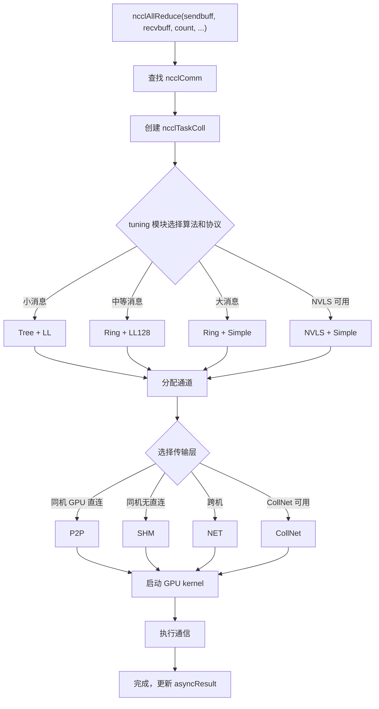

# 第 2 章：核心抽象模型：通信算子、拓扑、算法、协议与传输层

上一章我们让 NCCL 跑了起来，观察了 ncclCommInitRank、ncclAllReduce、ncclCommDestroy 三个 API 的外部行为。但外部行为只是冰山一角——当 ncclAllReduce 返回时，GPU 上到底发生了什么？数据走了哪条路？为什么同样的 AllReduce 在不同机器上性能差异巨大？要回答这些问题，必须先建立 NCCL 的公共词汇表。本章将逐一拆解五个核心抽象：通信域（ncclComm）、通道（channel）、算法（algorithm）、协议（protocol）、传输层（transport）。这五个概念贯穿全书，后续每一章的分析都会用到它们。理解它们之间的关系，就理解了 NCCL 的骨架。

## 2.1 通信域 ncclComm：一个进程的通信上下文

### 直觉模型

把 `ncclComm` 想象成一个「群聊」：每个进程加入群聊后拿到一个群 ID，之后所有消息都在这个群里发。群里有几个人（`nRanks`）、我是谁（`rank`）、走什么线路（`channels`）、用什么规则（`config`），全都记在这个群聊对象里。

如果没有 `ncclComm`，NCCL 就不知道「谁和谁通信」「数据发到哪里去」——每次调用 API 都得重新协商 rank 列表、重建连接，开销无法承受。

### 数据结构与内存布局

`ncclComm` 是整个 NCCL 最核心的结构体，定义在 `src/include/comm.h` 中。它极其庞大（近 300 行），我们按功能分组来看关键字段。

**身份标识与生命周期哨兵**

[FACT:src/include/comm.h:576-580] 定义了 `startMagic`，[FACT:src/include/comm.h:879-881] 定义了 `endMagic`。这两个字段不是安全密钥，而是内存越界检测哨兵。在 [FACT:src/include/comm.h:883-885] 处有两个 `static_assert`：

```c
static_assert(offsetof(struct ncclComm, startMagic) == 0, "startMagic must be the first field of ncclComm");
static_assert(offsetof(struct ncclComm, endMagic) == sizeof(struct ncclComm) - sizeof(uint64_t),
              "endMagic must be the last field of ncclComm");
```

[INFERENCE] 这两个断言在编译期强制 `startMagic` 位于结构体首地址、`endMagic` 位于末尾。运行时可以通过检查这两个魔数是否被篡改，快速判断 `ncclComm` 指针是否有效——这在多线程环境下排查「野指针访问已销毁通信域」类 bug 时非常有用。

**Rank 与拓扑信息**

[FACT:src/include/comm.h:628-629] 定义了 `rank` 和 `nRanks`——我在通信域中的编号和总参与者数。[FACT:src/include/comm.h:644-652] 定义了节点相关字段：`node`（我所在节点编号）、`nNodes`（总节点数）、`localRank`（节点内编号）、`localRanks`（节点内 GPU 数），以及三张映射表 `rankToNode`、`rankToLocalRank`、`localRankToRank`。

[INFERENCE] 这三张映射表是拓扑感知算法的基础。比如 Ring 算法需要知道「我的下一个 rank 是否在同一节点内」来决定走 NVLink 还是网络。如果没有这些映射表，每次算法选择都要重新查询拓扑图，开销巨大。

**通道与缓冲区**

[FACT:src/include/comm.h:593-593] 定义了 `channels[MAXCHANNELS]`——这是通信域内所有通道的数组。[FACT:src/include/comm.h:674-676] 定义了通道数量：`nChannels`（连接通道数）、`collChannels`（集合通信入队通道数）、`nvlsChannels`（NVLS 通道数）。

[FACT:src/include/comm.h:691-693] 定义了缓冲区大小：`buffSizes[NCCL_NUM_PROTOCOLS]`（每种协议的缓冲区大小）、`p2pChunkSize`（P2P 块大小）、`nvlsChunkSize`（NVLS 块大小）。

[INFERENCE] `buffSizes` 数组的索引就是协议枚举值（LL/LL128/Simple），这意味着每种协议有独立的缓冲区大小配置。LL 协议需要小缓冲区以降低延迟，Simple 协议需要大缓冲区以提高带宽——这个数组让两种需求共存。

**工作队列与 FIFO**

[FACT:src/include/comm.h:719-728] 定义了工作 FIFO 相关字段：`workFifoBytes`（FIFO 大小，2 的幂）、`workFifoBuf`（主机侧 FIFO 缓冲区）、`workFifoBufDev`（设备侧 FIFO 缓冲区）、`workFifoProduced`（已生产字节数）、`workFifoConsumed`（已消费字节数）。

[INFERENCE] 这是一个典型的生产者-消费者环形缓冲区。主机侧（生产者）把工作描述写入 FIFO，GPU kernel（消费者）读取并执行。`workFifoBytes` 必须是 2 的幂，这样可以用位掩码代替取模运算，加速索引计算。

**进程内同步屏障**

[FACT:src/include/comm.h:731-731] 定义了进程内多通信域同步机制：

```c
struct ncclComm* intraComm0; // leader of intra-process comms (self possible)
struct ncclComm* intraNext; // next of intra-process comms, intraComm0 is head
int intraRank;
int intraRanks;
uint32_t intraBarrierPhase;
char intraPad1[64 - sizeof(uint64_t)];
uint64_t intraBarrierCounter; // only used if this is intraComm0
char intraPad2[64 - sizeof(uint64_t)];
uint64_t intraBarrierGate; // only used if this is intraComm0
```

注意 `intraPad1` 和 `intraPad2` 的大小是 `64 - sizeof(uint64_t)`，即 56 字节。加上前面的 `uint64_t` 字段，每个字段组恰好占 64 字节——这是一个缓存行（Cache Line）。

[INFERENCE] 这是典型的**缓存行填充（Cache Line Padding）**技术。`intraBarrierCounter` 和 `intraBarrierGate` 会被多个线程高频读写，如果它们共享同一个缓存行，会导致**伪共享（False Sharing）**：一个线程修改 `intraBarrierCounter` 会使另一个线程的 `intraBarrierGate` 缓存失效，造成性能急剧下降。用 56 字节填充把它们隔开到不同缓存行，是高性能并发编程的标准手法。

**异步错误状态**

[FACT:src/include/comm.h:705-705] 定义了 `asyncResult`——这个字段记录通信域的异步操作状态。上一章我们提到 `ncclCommFinalize` 返回时通信域可能还处于 `ncclInProgress` 状态，就是通过这个字段追踪的。

### 场景驱动 Walkthrough：从 ncclCommInitRank 到结构体填充

当用户调用 `ncclCommInitRank(&comm, nranks, commId, rank)` 时，NCCL 内部会分配一个 `ncclComm` 结构体并逐字段填充。我们跟随这个流程看关键字段如何被设置：

**第一步：分配与清零**

NCCL 使用 `ncclCalloc` 分配 `ncclComm`，确保所有字段初始为 0。此时 `startMagic` 和 `endMagic` 被设置为 `NCCL_MAGIC`（[FACT:src/include/comm.h:563-569] 定义为 `0x0280028002800280`，注释说 "Nickel atomic number is 28"）。

**第二步：填充身份信息**

`rank`、`nRanks`、`cudaDev` 从参数和 CUDA API 获取。`commHash` 由 `ncclCommId` 哈希得到，用于后续网络通信中的一致性校验。

**第三步：构建拓扑图**

NCCL 调用拓扑探测模块枚举所有 GPU、网卡、PCI 交换机，构建 `topo` 字段（[FACT:src/include/comm.h:595-595]）。这个拓扑图决定了后续算法选择和路径规划。

**第四步：初始化通道**

`channels[MAXCHANNELS]` 数组被逐个初始化。每个通道的 `id` 被设置为数组索引，`peers` 和 `devPeers` 指针被分配。

**第五步：建立传输连接**

根据拓扑图，NCCL 为每对 rank 选择传输层（P2P/SHM/NET），调用对应的 `setup` 和 `connect` 回调。连接信息存储在 `channels[i].peers[j]` 中。

**第六步：设置魔数**

最后，`endMagic` 被设置为 `NCCL_MAGIC`，标记结构体初始化完成。

### 设计思考与生产踩坑

**为什么 `ncclComm` 这么大？**

[INFERENCE] `ncclComm` 包含近 300 个字段，因为它承载了一个通信域的全部状态。NCCL 的设计哲学是「一次初始化，多次复用」——初始化时把所有可能用到的信息都算好存下来，运行时直接查表，避免重复计算。代价是内存占用较大（每个通信域约几 KB），但相比 GPU 显存和网络带宽，这点内存微不足道。

**踩坑场景一：多线程共享通信域**

`ncclComm` 不是线程安全的。如果两个线程同时对同一个 `ncclComm` 调用 `ncclAllReduce`，`workFifoProduced` 等字段会竞争，导致数据损坏。[INFERENCE] 正确做法是每个线程使用独立的通信域，或者用外部锁串行化调用。

**踩坑场景二：销毁后访问**

`ncclCommDestroy` 释放结构体内存后，如果还有线程持有指针并访问，会读到已释放内存。`startMagic` 和 `endMagic` 可以帮助检测这种情况——如果魔数不匹配，说明指针已失效。

**踩坑场景三：缓存行伪共享**

在多进程场景下（每个进程一个 rank），`intraBarrierCounter` 和 `intraBarrierGate` 的填充尤为重要。如果省略填充，多个进程的屏障操作会互相干扰，导致同步延迟从纳秒级上升到微秒级。

## 2.2 通道 channel：把一次通信切成多条流水线

### 直觉模型

搬家时不止开一条传送带，而是同时开好几条，每条负责一部分箱子，整体搬得更快。`channel` 就是 NCCL 的「传送带」——把一次集合通信的数据切分成多份，每条通道独立搬运一份，并行推进以提高带宽利用率。

如果没有 channel，所有数据只能走一条路径，GPU 之间的多条物理链路（多张网卡、多组 NVLink）无法同时利用，带宽利用率会大幅下降。

### 数据结构与内存布局

`ncclChannel` 定义在 [FACT:src/include/comm.h:169-191]：

```c
struct ncclChannel {
  struct ncclChannelPeer** peers;
  struct ncclDevChannelPeer** devPeers;
  /* devPeer pointer array used for host side access */
  struct ncclDevChannelPeer** devPeersHostPtr;
  struct ncclRing ring;
  int* devRingUserRanks;
  struct ncclTree tree;

  struct ncclTree collnetChain;
  struct ncclDirect collnetDirect;

  struct ncclNvls nvls;

  int id; // index of this channel
  uint32_t workFifoProduced; // +1 successor of last used work fifo byte

  /* comm split sharable resources */
  struct ncclChannelPeer* collnetPeers;
  struct ncclDevChannelPeer* collnetDevPeers;
  struct ncclChannelPeer* nvlsPeers;
  struct ncclDevChannelPeer* nvlsDevPeers;
};
```

**关键字段解析**

- `peers` / `devPeers`：指向该通道内所有 rank 的连接信息。`peers` 是主机侧视图，`devPeers` 是设备侧视图（GPU kernel 直接访问）。
- `ring`：Ring 算法的拓扑描述——每个 rank 的前驱和后继。
- `tree`：Tree 算法的拓扑描述——父节点和子节点列表。
- `collnetChain` / `collnetDirect`：CollNet 算法的两种变体拓扑。
- `nvls`：NVLink SHARP 的拓扑描述。
- `id`：通道索引，从 0 到 `nChannels-1`。
- `workFifoProduced`：该通道的工作 FIFO 生产指针。

[INFERENCE] 注意 `ring`、`tree`、`collnetChain`、`collnetDirect`、`nvls` 这五个字段是**并列**的——同一个通道可以同时持有多种算法的拓扑描述。运行时根据算法选择决定使用哪个字段。这种设计让算法切换不需要重建通道，只需切换读取的字段。

**通道数量计算**

通道数量在 `ncclComm` 中定义（[FACT:src/include/comm.h:674-676]）：

```c
int nChannels; // connection nChannels
int collChannels; // enqueue nChannels
int nvlsChannels; // enqueue nChannels
```

[INFERENCE] `nChannels` 是实际建立的连接数，`collChannels` 是集合通信入队时使用的通道数，`nvlsChannels` 是 NVLS 专用通道数。三者可能不同——比如某些通道只用于 P2P 不用于集合通信。

**P2P 通道调度**

[FACT:src/include/channel.h:21-33] 定义了 `ncclP2pChannelBaseForRound` 函数，用于计算 P2P 通信中每个 round 使用的通道基址：

```c
inline uint8_t ncclP2pChannelBaseForRound(struct ncclComm* comm, int p2pRound) {
  int base;
  if (comm->nNodes > 1) {
    int localSize = comm->p2pSchedGroupSize;
    int groupDelta = p2pRound / localSize;
    int localDelta = p2pRound % localSize;
    base = groupDelta * divUp(localSize, NCCL_MAX_DEV_WORK_P2P_PER_BATCH);
    base += localDelta / NCCL_MAX_DEV_WORK_P2P_PER_BATCH;
  } else {
    base = p2pRound;
  }
  return reverseBits(base, log2Up(comm->p2pnChannels));
}
```

[INFERENCE] 这个函数的逻辑是：多节点场景下，P2P 通信按「组」调度，每组内的 rank 使用相邻通道；单节点场景下，每个 round 直接映射到一个通道。`reverseBits` 是位反转操作，用于打散通道分配，避免热点集中。

### 场景驱动 Walkthrough：一次 AllReduce 如何分配通道

假设 8 个 rank、4 个通道，执行一次 AllReduce。数据被切成 4 份，每份由一个通道负责。

**第一步：算法选择**

NCCL 的 tuning 模块根据消息大小和拓扑选择算法（比如 Ring）和协议（比如 Simple）。

**第二步：通道分配**

`ncclTaskColl` 结构体（[FACT:src/include/comm.h:212-273]）被创建，其中 `nChannels` 字段被设置为 4（[FACT:src/include/comm.h:254-254]）。`channelLo` 和 `channelHi` 字段（[FACT:src/include/comm.h:256-257]）标记该任务使用的通道范围。

**第三步：数据切分**

每个通道负责 `count / nChannels` 个元素。通道 0 处理第 0 到 count/4-1 个元素，通道 1 处理第 count/4 到 count/2-1 个元素，以此类推。

**第四步：并行执行**

4 个通道的 GPU kernel 同时启动，各自在自己的数据切片上执行 Ring AllReduce。由于通道之间没有数据依赖，可以完全并行。

**第五步：结果合并**

所有通道完成后，每个 rank 的 recv buffer 中就是完整的 AllReduce 结果。

### 并发控制与硬件交互

**通道与 GPU 资源的映射**

[INFERENCE] 每个通道通常绑定到一个独立的 CUDA stream 或 GPU 硬件队列。这样不同通道的 kernel 可以在 GPU 上并发执行，充分利用 SM（流多处理器）资源。

**通道与网络设备的映射**

在多网卡场景下，不同通道可以绑定到不同网卡。比如 4 个通道、2 张网卡，通道 0 和 1 走网卡 A，通道 2 和 3 走网卡 B。这样两张网卡的带宽都能被利用。

**通道数量的选择**

[INFERENCE] 通道数量不是越多越好。通道数增加会带来：
- 更多 kernel 启动开销
- 更多连接建立开销
- 更复杂的同步

NCCL 的 tuning 模块会根据消息大小自动选择最优通道数。小消息用少量通道（减少开销），大消息用多通道（提高带宽）。

### 生产避坑指南

**踩坑场景一：通道数配置不当**

如果手动设置 `NCCL_NCHANNELS` 过大，小消息场景下 kernel 启动开销会超过收益，性能反而下降。[INFERENCE] 建议让 NCCL 自动选择，除非有明确的调优需求。

**踩坑场景二：通道与拓扑不匹配**

如果通道数超过物理链路数，部分通道会共享链路，无法实现真正的并行。[INFERENCE] 比如 2 张网卡配 8 个通道，实际只有 2 个通道能同时传输，其余 6 个在排队。

**踩坑场景三：P2P 通道冲突**

`ncclP2pChannelBaseForRound` 的 `reverseBits` 操作如果实现有误，会导致多个 round 映射到同一通道，造成串行化。[FACT:src/include/channel.h:32-32] 的 `reverseBits(base, log2Up(comm->p2pnChannels))` 确保通道分配均匀。

## 2.3 算法 algorithm：Tree/Ring/CollNet/NVLS/PAT 的拓扑组织

### 直觉模型

从北京到上海可以坐高铁、飞机或自驾，每种方式适合不同的距离和人数。NCCL 的算法就是这些「出行方式」——Ring 适合大消息的稳定带宽，Tree 适合小消息的低延迟，CollNet 利用网卡卸载，NVLS 利用 NVLink SHARP 硬件加速，PAT 是 NVLS 的并行化变体。

如果没有算法选择，NCCL 只能用一种固定模式通信，无法适应不同消息大小和拓扑结构，性能会大打折扣。

### 数据结构与内存布局

**Ring 算法**

Ring 算法的核心是 `ncclRing` 结构体（在 `src/include/comm.h` 中通过 `channels[i].ring` 引用）。[FACT:src/include/collectives.h:81-116] 定义了 `RingAlgorithm` 基类：

```c
class RingAlgorithm {
protected:
  int refCount;
  int nRanks;
  int nStepsPerLoop;
  int chunkSteps;
  int sliceSteps;
  ssize_t sliceSize;
  ssize_t loopSize;
  ssize_t channelSize;
  uint8_t* sendbuff;
  uint8_t* recvbuff;
  void* sendMhandle;
  void* recvMhandle;
  void* srecvMhandle;

public:
  virtual void getNextSendAddr(int curStep, uint8_t** sendbuffOut, size_t* sizeOut, void** mhandleOut) = 0;
  virtual void getNextRecvAddr(int curStep, uint8_t** recvbuffOut, size_t* sizeOut, void** mhandleOut) = 0;
  int incRefCount() {
    return (int)COMPILER_ATOMIC_ADD_FETCH(&refCount, 1, std::memory_order_relaxed);
  }
  int decRefCount() {
    return (int)COMPILER_ATOMIC_SUB_FETCH(&refCount, 1, std::memory_order_release);
  }
  RingAlgorithm() {
    refCount = 0;
  }
  virtual ~RingAlgorithm() {};
};
```

**关键字段解析**

- `refCount`：引用计数，用于 proxy 线程和 GPU kernel 共享算法对象。
- `nRanks`：环上节点数。
- `nStepsPerLoop`：每轮循环的步数。AllReduce 是 `2*(nRanks-1)*chunkSteps`（[FACT:src/include/collectives.h:218-218]）。
- `chunkSteps` / `sliceSteps`：块步数和切片步数，控制流水线粒度。
- `sliceSize` / `loopSize` / `channelSize`：切片大小、循环大小、通道大小。
- `sendbuff` / `recvbuff`：发送和接收缓冲区指针。
- `sendMhandle` / `recvMhandle` / `srecvMhandle`：内存句柄，用于网络注册。

**引用计数的原子操作**

[FACT:src/include/collectives.h:106-108] 展示了 `incRefCount` 和 `decRefCount`：

```c
int incRefCount() {
  return (int)COMPILER_ATOMIC_ADD_FETCH(&refCount, 1, std::memory_order_relaxed);
}
int decRefCount() {
  return (int)COMPILER_ATOMIC_SUB_FETCH(&refCount, 1, std::memory_order_release);
}
```

[INFERENCE] `incRefCount` 使用 `memory_order_relaxed`——增加引用计数不需要同步，只要保证原子性即可。`decRefCount` 使用 `memory_order_release`——减少引用计数时，需要确保之前的写操作对其他线程可见（因为可能触发对象销毁）。

**RingARAlgorithm：AllReduce 的 Ring 实现**

[FACT:src/include/collectives.h:118-234] 定义了 `RingARAlgorithm`，继承自 `RingAlgorithm`。核心方法是 `getNextSendAddr` 和 `getNextRecvAddr`。

[FACT:src/include/collectives.h:126-167] 的 `getNextSendAddr` 逻辑：

```c
void getNextSendAddr(int curStep, uint8_t** sendbuffOut, size_t* sizeOut, void** mhandleOut) {
  int curLoop = curStep / nStepsPerLoop;
  int curLoopStage = (curStep % nStepsPerLoop) / chunkSteps;
  int chunkStage = curLoopStage % nRanks;
  int sliceStage = (curStep % chunkSteps) / sliceSteps;
  ssize_t elemOffset = curLoop * loopSize;
  ssize_t remSize = channelSize - elemOffset;
  // ... 计算 chunkOffset, sliceOffset, curSliceSize ...
  if (remSize < loopSize) {
    curChunkSize = alignUp(divUp(remSize / elemSize, nRanks), 16 / elemSize) * elemSize;
  } else {
    curChunkSize = chunkSize;
  }
  chunkId = (ringIndex + nRanks - 1 - chunkStage) % nRanks;
  chunkOffset = chunkId * curChunkSize;
  nelem = std::min(remSize - chunkOffset, curChunkSize);
  curSliceSize = std::max(divUp(nelem / elemSize, 16 * slicePerChunk) * 16, sliceSize / elemSize / 32) * elemSize;
  sliceOffset = sliceStage * curSliceSize;
  // ... 设置 sendbuffOut, sizeOut, mhandleOut ...
}
```

[INFERENCE] 这段代码的核心是**地址计算**：给定当前步数 `curStep`，计算出应该发送哪个数据块的哪个切片。`chunkId` 的计算 `(ringIndex + nRanks - 1 - chunkStage) % nRanks` 实现了环上的反向传播——每个 rank 从前驱接收数据，处理后发送给后继。

**PAT 算法**

PAT（Parallel Aggregated Tree）是 NVLS 的并行化变体。[FACT:src/include/collectives.h:416-423] 定义了 `ncclPatStep`：

```c
struct ncclPatStep {
  int recvDim, sendDim, recvOffset, sendOffset, stepOffset, postRecv, postSend, nelem, last, flags;
  // PAT algo computation thread step number; -1 while the slot is free.
  int step;
  // This PAT group's offset within the shared NVLS slot.
  int nvlsOffset;
  size_t inpIx, outIx;
};
```

[FACT:src/include/collectives.h:425-435] 定义了 `ncclPatPeer`：

```c
struct ncclPatPeer {
  uint64_t step;
  struct ncclConnInfo* conn;
  struct ncclConnFifo* connFifo;
  void* buff;
  uint64_t* headPtr;
  uint64_t* tailPtr;
  uint64_t stepCache;
  long long int accSize;
  int connStepSize;
};
```

[INFERENCE] PAT 算法的核心思想是**聚合多个小步骤为一个大步骤**，减少同步开销。`ncclPatStep` 描述一个聚合步骤的收发维度、偏移量、元素数等信息。`ncclPatPeer` 描述一个对等节点的连接状态和缓冲区指针。

### 场景驱动 Walkthrough：Ring AllReduce 的步骤演化

假设 4 个 rank（0, 1, 2, 3），每个 rank 有 4 个元素，执行 Ring AllReduce。

**Reduce-Scatter 阶段**

- 步骤 0：rank 0 发送元素 0 给 rank 1，rank 1 发送元素 1 给 rank 2，rank 2 发送元素 2 给 rank 3，rank 3 发送元素 3 给 rank 0。
- 步骤 1：每个 rank 将收到的元素与本地对应元素相加，然后发送给下一个 rank。
- 步骤 2：继续累加和传递。
- 步骤 3：此时每个 rank 拥有一个完整的归约结果（rank 0 有元素 3 的结果，rank 1 有元素 0 的结果，等等）。

**AllGather 阶段**

- 步骤 4-6：每个 rank 将自己拥有的归约结果沿环传播，最终所有 rank 拥有完整结果。

[FACT:src/include/collectives.h:218-218] 的 `nStepsPerLoop = 2 * (nRanks - 1) * chunkSteps` 正好对应这个流程：Reduce-Scatter 需要 `(nRanks-1)*chunkSteps` 步，AllGather 也需要 `(nRanks-1)*chunkSteps` 步，总共 `2*(nRanks-1)*chunkSteps` 步。

### 设计思考与生产踩坑

**为什么 Ring 和 Tree 并存？**

[INFERENCE] Ring 算法的带宽利用率高（每条链路都在传输），但延迟随 rank 数线性增长。Tree 算法的延迟是对数级的，但带宽利用率低（只有部分链路在工作）。NCCL 根据消息大小自动选择：小消息用 Tree（延迟敏感），大消息用 Ring（带宽敏感）。

**踩坑场景一：算法选择错误**

如果手动强制使用 Ring 处理小消息，延迟会显著增加。[INFERENCE] 建议让 tuning 模块自动选择，除非有明确的性能分析数据支持手动干预。

**踩坑场景二：NVLS 硬件不支持**

NVLS 需要特定的硬件支持（NVLink SHARP）。如果硬件不支持但代码强制使用 NVLS，会回退到 Ring 或 Tree，但可能伴随性能抖动。[FACT:src/include/comm.h:755-755] 的 `nvlsSupport` 字段标记硬件是否支持 NVLS。

**踩坑场景三：PAT 算法的聚合因子配置**

PAT 算法的 `aggFactor` 决定了聚合多少个步骤。[FACT:src/include/collectives.h:537-560] 展示了 `aggFactor` 的计算逻辑：

```c
aggFactor = 1;
size_t channelSize = end - offset;
while (stepSize / (channelSize * sizeof(T) * aggFactor) >= 2 && aggFactor < nranks / 2) {
  aggFactor *= 2;
  aggDelta /= 2;
}
postFreq = aggFactor;
if (postFreq < parallelFactor) parallelFactor = postFreq;
int d = stepDepth;
while (d > 1 && aggFactor < nranks / 2) {
  d /= 2;
  aggFactor *= 2;
  aggDelta /= 2;
}
```

[INFERENCE] `aggFactor` 过小会导致同步开销大，过大则会导致流水线气泡。NCCL 根据 `stepSize`、`channelSize`、`nranks` 自动计算最优值。

## 2.4 协议 protocol：LL/LL128/Simple 三种数据搬运策略

### 直觉模型

寄快递可以选「同城闪送」「次日达」或「普通快递」，速度和成本不同。NCCL 的协议就是这些「寄法」——LL（Low Latency）适合小消息的低延迟传输，LL128 适合中等消息的 128 字节对齐传输，Simple 适合大消息的高带宽传输。

如果没有协议选择，NCCL 只能用一种固定策略搬运数据，无法在延迟和带宽之间取得平衡。

### 数据结构与内存布局

**协议枚举**

[FACT:src/include/comm.h:55-57] 定义了协议相关的线程阈值：

```c
#define NCCL_LL_THREAD_THRESHOLD 8
#define NCCL_LL128_THREAD_THRESHOLD 8
#define NCCL_SIMPLE_THREAD_THRESHOLD 64
```

[INFERENCE] 这些阈值决定了每种协议使用多少个线程。LL 和 LL128 用 8 个线程（低延迟，少量线程即可），Simple 用 64 个线程（高带宽，需要更多线程并行搬运）。

**协议缓冲区**

[FACT:src/include/comm.h:691-691] 定义了 `buffSizes[NCCL_NUM_PROTOCOLS]`——每种协议有独立的缓冲区大小。

**协议相关的 FIFO 结构**

[FACT:src/include/comm.h:59-83] 定义了 `ncclSendMem` 和 `ncclRecvMem`：

```c
struct ncclSendMem {
  union {
    struct {
      uint64_t head;
      char pad1[CACHE_LINE_SIZE - sizeof(uint64_t)];
      void* ptrExchange;
      uint64_t redOpArgExchange[2];
      char pad2[CACHE_LINE_SIZE - sizeof(void*) - 2 * sizeof(uint64_t)];
      int offsFifo[NCCL_STEPS];
    };
    char pad3[MEM_ALIGN];
  };
};

struct ncclRecvMem {
  union {
    struct {
      uint64_t tail;
      char pad1[CACHE_LINE_SIZE - sizeof(uint64_t)];
      struct ncclConnFifo connFifo[NCCL_STEPS];
      int flush; // For GDRCopy-based flush
    };
    char pad4[MEM_ALIGN];
  };
};
```

[INFERENCE] `ncclSendMem` 和 `ncclRecvMem` 是发送和接收的共享内存结构。`head` 和 `tail` 是环形缓冲区的读写指针，`pad1` 确保它们在不同缓存行。`connFifo` 数组存储每个步骤的连接信息（模式、偏移、大小、指针），定义在 [FACT:src/include/collectives.h:72-77]：

```c
struct ncclConnFifo {
  int mode;
  ssize_t offset;
  ssize_t size;
  void* ptr;
};
```

**协议选择逻辑**

[INFERENCE] 协议选择由 tuning 模块完成，考虑因素包括：
- 消息大小：小消息用 LL，中等用 LL128，大消息用 Simple。
- 拓扑结构：NVLink 连接适合 LL128，网络连接适合 Simple。
- 硬件能力：某些 GPU 架构对特定协议有优化。

### 场景驱动 Walkthrough：LL 协议的数据搬运

假设使用 LL 协议传输 1KB 数据。

**第一步：数据写入发送缓冲区**

主机侧将数据写入 `sendbuff`，然后更新 `ncclSendMem.head` 指针，通知 GPU kernel 有新数据。

**第二步：GPU kernel 读取数据**

GPU kernel 轮询 `head` 指针，发现新数据后，从 `sendbuff` 读取数据。

**第三步：数据传输**

GPU kernel 通过 NVLink 或网络将数据发送到目标 rank。

**第四步：目标 rank 接收数据**

目标 rank 的 GPU kernel 将数据写入 `recvbuff`，然后更新 `ncclRecvMem.tail` 指针。

**第五步：主机侧读取数据**

主机侧轮询 `tail` 指针，发现新数据后，从 `recvbuff` 读取数据。

### 并发控制与硬件交互

**LL 协议的低延迟机制**

[INFERENCE] LL 协议使用**轮询（Polling）**而非中断来检测数据到达。GPU kernel 不断读取 `head` 指针，一旦发现变化立即处理。这比中断方式延迟更低，但会占用 GPU 计算资源。

**LL128 协议的 128 字节对齐**

[INFERENCE] LL128 协议要求数据按 128 字节对齐，这样每次传输正好填满一个缓存行。对齐的好处是：
- 减少部分缓存行写入（Partial Cache Line Write）
- 提高内存带宽利用率
- 简化硬件处理逻辑

**Simple 协议的批量传输**

[INFERENCE] Simple 协议使用**批量传输**模式：积累一定量的数据后一次性发送，减少同步次数。这适合大消息场景，因为同步开销被分摊到大量数据上。

### 生产避坑指南

**踩坑场景一：协议与消息大小不匹配**

如果强制使用 LL 协议传输大消息，性能会急剧下降。[INFERENCE] 因为 LL 协议的设计目标是低延迟，不是高带宽。大消息应该用 Simple 协议。

**踩坑场景二：LL128 对齐问题**

如果数据没有按 128 字节对齐，LL128 协议会回退到 LL 或 Simple，导致性能不稳定。[INFERENCE] 建议确保发送缓冲区和接收缓冲区都按 128 字节对齐。

**踩坑场景三：协议切换开销**

在运行时动态切换协议会带来额外开销。[INFERENCE] NCCL 在初始化时确定协议，运行时不再切换。如果需要切换，必须重新初始化通信域。

## 2.5 传输层 transport：P2P/SHM/NET/CollNet 底层搬运通道

### 直觉模型

从 A 点到 B 点可以走路、骑车、坐地铁或打车，NCCL 的传输层就是这些不同的「出行方式」。上层不关心具体怎么走，只关心能不能送到。P2P 是「走路」（同机 GPU 直连），SHM 是「骑车」（共享内存），NET 是「坐地铁」（网络），CollNet 是「打车」（网卡卸载）。

如果没有传输层抽象，上层算法需要针对每种物理链路写不同的代码，无法复用。

### 数据结构与内存布局

**传输层枚举**

[FACT:src/include/transport.h:18-23] 定义了传输层类型：

```c
#define NTRANSPORTS 4
#define TRANSPORT_UNDEFINED -1
#define TRANSPORT_P2P 0
#define TRANSPORT_SHM 1
#define TRANSPORT_NET 2
#define TRANSPORT_COLLNET 3
```

**传输层接口**

[FACT:src/include/transport.h:129-146] 定义了 `ncclTransportComm`——传输层的通信接口：

```c
struct ncclTransportComm {
  ncclResult_t (*setup)(struct ncclComm* comm, struct ncclTopoGraph* graph, struct ncclPeerInfo*, struct ncclPeerInfo*,
                        struct ncclConnect*, struct ncclConnector*, int channelId, int connIndex);
  ncclResult_t (*connect)(struct ncclComm* comm, struct ncclConnect*, int nranks, int rank, struct ncclConnector*);
  ncclResult_t (*free)(struct ncclComm* comm, struct ncclConnector*);
  ncclResult_t (*proxySharedInit)(struct ncclProxyConnection* connection, struct ncclProxyState* proxyState,
                                  int nChannels);
  ncclResult_t (*proxySetup)(struct ncclProxyConnection* connection, struct ncclProxyState* proxyState, void* reqBuff,
                             int reqSize, void* respBuff, int respSize, int* done);
  ncclResult_t (*proxyConnect)(struct ncclProxyConnection* connection, struct ncclProxyState* proxyState, void* reqBuff,
                               int reqSize, void* respBuff, int respSize, int* done);
  ncclResult_t (*proxyFree)(struct ncclProxyConnection* connection, struct ncclProxyState* proxyState);
  ncclResult_t (*proxyProgress)(struct ncclProxyState* proxyState, struct ncclProxyArgs*);
  ncclResult_t (*proxyRegister)(struct ncclProxyConnection* connection, struct ncclProxyState* proxyState,
                                void* reqBuff, int reqSize, void* respBuff, int respSize, int* done);
  ncclResult_t (*proxyDeregister)(struct ncclProxyConnection* connection, struct ncclProxyState* proxyState,
                                  void* reqBuff, int reqSize, int* done);
};
```

**关键回调解析**

- `setup`：建立连接前的准备工作，交换连接参数。
- `connect`：实际建立连接。
- `free`：释放连接资源。
- `proxySharedInit`：初始化 proxy 线程共享资源。
- `proxySetup` / `proxyConnect`：proxy 线程侧的连接建立。
- `proxyProgress`：proxy 线程推进数据传输。
- `proxyRegister` / `proxyDeregister`：内存注册和注销。

**传输层结构体**

[FACT:src/include/transport.h:148-154] 定义了 `ncclTransport`：

```c
struct ncclTransport {
  const char name[8];
  ncclResult_t (*canConnect)(int*, struct ncclComm* comm, struct ncclTopoGraph* graph, struct ncclPeerInfo*,
                             struct ncclPeerInfo*);
  struct ncclTransportComm send;
  struct ncclTransportComm recv;
};
```

[INFERENCE] `name` 是传输层名称（如 "P2P"、"SHM"、"NET"），`canConnect` 判断两个 rank 之间是否可以使用该传输层，`send` 和 `recv` 分别是发送和接收方向的通信接口。

**传输层实例**

[FACT:src/include/transport.h:36-36] 声明了四个传输层实例：

```c
extern struct ncclTransport p2pTransport;
extern struct ncclTransport shmTransport;
extern struct ncclTransport netTransport;
extern struct ncclTransport collNetTransport;
```

[FACT:src/include/transport.h:36-36] 定义了传输层数组：

```c
extern struct ncclTransport* ncclTransports[];
```

**对等节点信息**

[FACT:src/include/transport.h:46-74] 定义了 `ncclPeerInfo`——rank 之间交换的元数据：

```c
struct ncclPeerInfo {
  int rank;
  int cudaDev;
  int nvmlDev;
  int gdrSupport;
  uint64_t hostHash;
  uint64_t pidHash;
  dev_t shmDev;
  int64_t busId;
  cudaUUID_t gpuUuid;
  struct ncclComm* comm;
  int cudaCompCap;
  int gpuCftSupport;
  size_t totalGlobalMem;
  // MNNVL support
  nvmlGpuFabricInfoV_t fabricInfo;
  int fabricHandleSupport;
  int cuMemSupport;
  int version;
  uint64_t supportedGinTypeBitMask;
  bool crossNicSupport;
  bool rmaPluginAvailable;
  bool cuMemGdrSupport;
  int mloPart; // MLOPart partition index, or -1 if not an MLOPart GPU
  int cudaDriverVersion;
  bool gpuCftMulticastSupport;
  bool gpuCftCountedSupport;
  uint32_t gitVersionHash;
};
```

[INFERENCE] 这些字段用于判断两个 rank 之间可以使用哪种传输层：
- `hostHash` 相同 → 同一主机 → 可用 P2P 或 SHM
- `hostHash` 不同 → 不同主机 → 必须用 NET
- `gdrSupport` → 是否支持 GPUDirect RDMA
- `cudaCompCap` → GPU 计算能力，影响协议选择

### 场景驱动 Walkthrough：建立 P2P 连接

假设两个 rank 在同一主机内，NCCL 选择 P2P 传输层。

**第一步：交换 PeerInfo**

两个 rank 通过 bootstrap 通道交换 `ncclPeerInfo`，确认彼此在同一主机、GPU 支持 P2P。

**第二步：调用 canConnect**

[FACT:src/include/transport.h:148-154] 的 `canConnect` 回调被调用，检查拓扑图确认两个 GPU 之间有 NVLink 或 PCIe 连接。

**第三步：调用 setup**

`p2pTransport.send.setup` 和 `p2pTransport.recv.setup` 被调用，准备连接参数（如 IPC 句柄）。

**第四步：调用 connect**

`p2pTransport.send.connect` 和 `p2pTransport.recv.connect` 被调用，实际建立连接。

**第五步：注册内存**

如果需要 RDMA，调用 `proxyRegister` 注册发送和接收缓冲区。

### 并发控制与硬件交互

**P2P 传输层**

[INFERENCE] P2P 使用 CUDA IPC（Inter-Process Communication）机制，允许一个 GPU 直接访问另一个 GPU 的显存。这需要：
- 两个 GPU 在同一 PCIe 域或 NVLink 域
- 操作系统支持 CUDA IPC
- 足够的权限

**SHM 传输层**

[INFERENCE] SHM 使用主机共享内存作为中转。当两个 GPU 之间没有直接连接时，数据先拷贝到主机内存，再拷贝到目标 GPU。这比 P2P 慢，但兼容性更好。

**NET 传输层**

[INFERENCE] NET 使用网络设备（InfiniBand 或 RoCE）传输数据。这需要：
- 网络设备支持 GPUDirect RDMA（可选，但推荐）
- 正确的网络配置（IP 地址、子网掩码等）
- 足够的网络带宽

**CollNet 传输层**

[INFERENCE] CollNet 利用网卡的集合通信卸载能力（如 NVIDIA SHARP）。网卡直接执行归约操作，减少 GPU 的计算负担。这需要：
- 支持 SHARP 的网卡
- 正确的 SHARP 配置

### 生产避坑指南

**踩坑场景一：P2P 不可用**

如果两个 GPU 之间没有 NVLink 且 PCIe 拓扑不支持 P2P，NCCL 会回退到 SHM。[INFERENCE] 这会导致性能下降。可以通过 `NCCL_P2P_DISABLE=1` 强制禁用 P2P，观察性能变化。

**踩坑场景二：网络配置错误**

如果网络设备的 IP 地址配置错误，NET 传输层无法建立连接。[INFERENCE] 常见错误包括：子网掩码错误、路由表缺失、防火墙阻止。建议用 `ibstat` 和 `ibping` 检查 InfiniBand 连接。

**踩坑场景三：GPUDirect RDMA 未启用**

如果 `gdrSupport` 为 0，NET 传输层会回退到「先拷贝到主机内存再发送」模式，延迟显著增加。[INFERENCE] 检查 `nvidia-peermem` 模块是否加载，以及网卡驱动是否支持 GPUDirect。

## 2.6 五件套如何组合：一次通信的完整生命周期

### 组合关系图



### 完整生命周期

**阶段一：API 调用**

用户调用 `ncclAllReduce`，传入发送缓冲区、接收缓冲区、元素数、数据类型、归约操作、通信域、CUDA stream。

**阶段二：任务创建**

NCCL 创建 `ncclTaskColl` 结构体（[FACT:src/include/comm.h:212-273]），填充 `func`（AllReduce）、`sendbuff`、`recvbuff`、`count`、`datatype`、`opHost` 等字段。

**阶段三：算法和协议选择**

Tuning 模块根据消息大小、拓扑结构、硬件能力选择算法（Ring/Tree/NVLS）和协议（LL/LL128/Simple）。选择结果写入 `ncclTaskColl` 的 `algorithm` 和 `protocol` 字段（[FACT:src/include/comm.h:227-227]）。

**阶段四：通道分配**

根据算法和协议，确定使用的通道数和通道范围。`nChannels`、`channelLo`、`channelHi` 字段被设置（[FACT:src/include/comm.h:254-257]）。

**阶段五：传输层选择**

根据拓扑图，为每对 rank 选择传输层（P2P/SHM/NET/CollNet）。连接信息存储在 `channels[i].peers[j]` 中。

**阶段六：Kernel 启动**

NCCL 构建 `ncclKernelPlan`（[FACT:src/include/comm.h:357-410]），包含工作队列、清理队列、任务队列等。然后启动 GPU kernel。

**阶段七：执行通信**

GPU kernel 读取工作 FIFO，执行数据传输和归约操作。Proxy 线程异步推进网络 I/O。

**阶段八：完成**

所有通道完成后，`asyncResult` 被设置为 `ncclSuccess`。用户可以通过 `ncclCommGetAsyncError` 查询状态。

### 设计思考

**为什么需要五件套？**

[INFERENCE] 这五个抽象分别解决了不同维度的问题：
- `ncclComm`：解决「谁和谁通信」的问题。
- `channel`：解决「如何并行」的问题。
- `algorithm`：解决「用什么拓扑」的问题。
- `protocol`：解决「用什么策略」的问题。
- `transport`：解决「走什么物理链路」的问题。

它们正交组合，让 NCCL 能够适应各种硬件配置和消息大小，而不需要为每种组合写专门的代码。

**组合的灵活性**

[INFERENCE] 五件套的组合数量是：
- 算法：5 种（Tree/Ring/CollNet/NVLS/PAT）
- 协议：3 种（LL/LL128/Simple）
- 传输层：4 种（P2P/SHM/NET/CollNet）

## 本章思考与自测

<details><summary>Q1: 如果将 [FACT:src/include/comm.h:731-731] 中的 `intraPad1[64 - sizeof(uint64_t)]` 改为 `intraPad1[0]`（即去掉缓存行填充），在多进程场景下会出现什么性能问题？为什么？</summary>

**参考解析**：

去掉填充后，`intraBarrierPhase`、`intraBarrierCounter`、`intraBarrierGate` 三个字段会紧密排列在内存中，很可能共享同一个缓存行（通常 64 字节）。

在多进程场景下，每个进程有自己的 `ncclComm` 副本，但 `intraComm0` 指向的 leader 通信域的 `intraBarrierCounter` 和 `intraBarrierGate` 会被所有进程读写。当进程 A 调用 `ncclCommIntraBarrierIn` 更新 `intraBarrierCounter`（[FACT:src/include/comm.h:943-959]）时，会导致进程 B 的 `intraBarrierGate` 缓存行失效。进程 B 在 `ncclCommIntraBarrierOut` 中轮询 `intraBarrierGate`（[FACT:src/include/comm.h:962-977]），每次缓存失效都要重新从内存加载，延迟从纳秒级上升到微秒级。

这就是**伪共享（False Sharing）**问题。填充 56 字节确保每个字段独占一个缓存行，消除伪共享。

</details>

<details><summary>Q2: 如果将 [FACT:src/include/collectives.h:106-108] 的 `incRefCount` 从 `memory_order_relaxed` 改为 `memory_order_seq_cst`，会有什么影响？为什么作者选择 `relaxed`？</summary>

**参考解析**：

`memory_order_seq_cst` 会强制全局顺序一致性，每次增加引用计数都要插入内存屏障，导致性能下降。

`incRefCount` 只需要保证原子性，不需要同步其他内存操作。因为增加引用计数不会触发对象销毁，也不会依赖其他线程的写操作。`memory_order_relaxed` 正好满足这个需求——只保证原子性，不插入屏障。

相比之下，`decRefCount`（[FACT:src/include/collectives.h:109-111]）使用 `memory_order_release`，因为减少引用计数可能触发对象销毁，需要确保之前的写操作对其他线程可见。

这是 C++ 内存模型的经典应用：根据操作语义选择最弱的内存序，在保证正确性的前提下最大化性能。

</details>

<details><summary>Q3: 如果将 [FACT:src/include/channel.h:32-32] 的 `reverseBits(base, log2Up(comm->p2pnChannels))` 改为直接返回 `base % comm->p2pnChannels`，在什么场景下会导致性能下降？为什么？</summary>

**参考解析**：

`reverseBits` 是位反转操作，用于打散通道分配。直接取模会导致通道分配呈现规律性：round 0 用通道 0，round 1 用通道 1，...，round N 用通道 N%p2pnChannels。

在多节点场景下，如果多个 rank 的 P2P 通信同时进行，规律性的通道分配会导致热点集中——某些通道被多个 rank 同时使用，而其他通道空闲。这会造成链路拥塞，降低整体带宽利用率。

`reverseBits` 打散了通道分配，让不同 round 使用看似随机的通道，均匀分布负载。这是**负载均衡**的经典手法。

另外，`reverseBits` 是纯位操作，比取模运算更快（取模需要除法指令，位操作只需几条指令）。

</details>

---

下一章我们将深入 `ncclCommInitRank` 的内部实现，看看 NCCL 如何从一个空的 `ncclComm` 结构体开始，逐步建立拓扑图、初始化通道、建立传输连接，最终构建出一个可用的通信域。本章建立的五件套心智模型，将在下一章中逐一落地。

这五个抽象并非孤立存在：通信域是容器，通道是并行执行的单位，算法决定数据如何规约，协议规定数据如何编码，传输层负责数据如何移动。它们的组合——5 个维度、每个维度 3 到 4 种选择——构成了 NCCL 性能调优的搜索空间。那么，这个通信域对象究竟是如何从零开始被构建出来的？下一章我们将深入 ncclCommInitRank 的调用链，看 NCCL 如何在初始化阶段完成设备探测、拓扑发现与通道分配，并揭示 comm->rank、comm->nRanks、comm->channels 等关键字段的赋值时机。