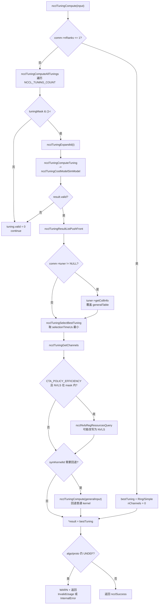

# 第 5 章：算法与协议选型：tuning 模块如何决定通信路径

上一章我们拆解了 NCCL 的拓扑感知能力：从 src/graph/topo.cc 枚举设备构建拓扑图，到 src/graph/search.cc 搜索最优路径，再到 rings.cc 与 trees.cc 将搜索结果具体化为 Ring 与 Tree 算法拓扑。但拓扑图只回答了「数据能走哪条路」，它没有回答「这次通信应该走哪条路」。同一台机器上，一次 4KB 的 AllReduce 和一次 400MB 的 AllReduce，最优解可能完全不同：前者拼的是延迟，后者拼的是带宽；前者可能选 Tree/LL，后者可能选 Ring/Simple 或者 NVLS。tuning 模块就是那个「拍板的人」。它的输入是消息大小、rank 数、拓扑图（上一章的产物）和用户环境变量；输出是一个 ncclTuningResult_t，里面写着用哪个算法（algo）、哪个协议（proto）、开多少 channel、用多少 warp。这一章我们按「总调度 → 代价模型 → 各算法估计 → 收尾决策」的顺序，把 src/tuning 目录拆开。核心问题只有一个：NCCL 怎么在几十种 (算法, 协议) 组合里，用一套纯 CPU 的数学模型，在微秒级时间内选出最快的那一个？

## 一、tuning.cc：总调度与决策主干

### 直觉模型

把 tuning 模块想象成一家**搬家公司**。客户（一次集合通信）来了，说「我要搬 100MB 的货，从 8 个仓库搬到 8 个仓库」。调度员（`ncclTuningCompute`）不会真的去搬一遍试试，而是拿出一张**价目表**（代价模型），对每种方案（Ring/LL、Tree/Simple、NVLS/Simple……）估算一个「预计耗时」，然后挑最短的那个报价给客户。

如果没有这个调度员，NCCL 就只能写死「AllReduce 永远用 Ring」，那在小消息场景会被 Tree 吊打，在大规模 NVLink 场景会被 NVLS 吊打。**代价就是性能在特定场景下腰斩甚至更差。**

### 数据结构与内存布局

决策的载体是 `ncclTuningResult_t`，候选集合是 `ncclTuningResultList_t`（一个单链表）。链表节点定义在 `tuning_int.h`，但 push 逻辑在 `tuning.cc` 里：

[FACT:src/tuning/tuning.cc:32-39]

```c
ncclResult_t ncclTuningResultListPushFront(struct ncclTuningResultList_t* list, struct ncclTuningResult_t result) {
  struct ncclTuningResultListNode* node = nullptr;
  NCCLCHECK(ncclCalloc(&node, 1));
  node->result = result;
  node->next = list->head;
  list->head = node;
  return ncclSuccess;
}
```

注意这里是**头插法**：每算出一个有效候选，就插到链表头部。这意味着链表顺序和 id 顺序是**反的**。为什么用链表而不是数组？[INFERENCE] 因为候选数量在编译期由 `NCCL_TUNING_COUNT` 决定，但实际有效的候选是动态的（受 `tuningMask`、平台能力、用户环境变量影响），链表允许「只把有效的挂上去」，避免遍历时反复判断 `valid`。代价是每次决策要 `ncclCalloc` 一次，但 tuning 发生在入队路径上、频率不高，这点分配开销可以接受。

`ncclTuningResult_t` 里最关键的两个字段是 `timeUs`（预计耗时，微秒）和 `selectionTimeUs`（用于选择的耗时，可能被 tuner 插件覆盖）。选择逻辑只看后者：

[FACT:src/tuning/tuning.cc:155-173]

```c
static ncclResult_t ncclTuningSelectBestTuning(struct ncclTuningResultList_t* tunings,
                                               struct ncclTuningResult_t* const bestTuning) {
  bestTuning->timeUs = FLT_MAX;
  float bestSelectionTimeUs = FLT_MAX;
  struct ncclTuningResultListNode* node = tunings->head;
  while (node != nullptr) {
    const struct ncclTuningResult_t& tuning = node->result;
    float selectionTimeUs = tuning.selectionTimeUs > 0.0f ? tuning.selectionTimeUs : tuning.timeUs;
    ...
    if (selectionTimeUs < bestSelectionTimeUs) {
      *bestTuning = tuning;
      bestSelectionTimeUs = selectionTimeUs;
    }
    node = node->next;
  }
  return ncclSuccess;
}
```

这里有个细节：`bestTuning->timeUs` 先被设成 `FLT_MAX`，然后遍历。如果链表为空（所有候选都无效），`bestTuning` 会保持 `NCCL_TUNING_RESULT_INIT` 的初始值，algo/proto 都是 `UNDEF`。这个「空结果」在调用方会被特殊处理——见后面的错误分支。

### Step-by-Step Walkthrough：一次 AllReduce 的决策流

假设应用调用 `ncclAllReduce`，消息 1MB，8 个 rank 单机 NVLink。我们跟着 `ncclTuningCompute` 走一遍。

**第 0 步：单 rank 短路。** 如果 `nRanks <= 1`，根本不需要通信，直接返回 Ring/Simple，channel 数设 0：

[FACT:src/tuning/tuning.cc:191-200]

```c
  // Set tuning to Ring/Simple for single rank case
  if (input->comm->nRanks <= 1) {
    bestTuning.algo = NCCL_ALGO_RING;
    bestTuning.proto = NCCL_PROTO_SIMPLE;
    bestTuning.symKernelId = ncclSymkKernelId_Count;
    bestTuning.ceMethodId = ncclCeMethodId_Count;
    bestTuning.nChannels = 0;
    bestTuning.maxChannels = 0;
    bestTuning.nWarps = 0;
    bestTuning.forced = 0;
  } else {
```

这个短路很重要：单 rank 时任何算法估计都会除以 `nRanks-1` 之类的量，容易出 NaN 或除零。**先兜底，再算账**，是防御式编程的典型。

**第 1 步：枚举所有候选。** 进入 `ncclTuningComputeAllTunings`，它遍历 `NCCL_TUNING_COUNT` 个 id：

[FACT:src/tuning/tuning.cc:128-149]

```c
ncclResult_t ncclTuningComputeAllTunings(struct ncclTuningInput_t* const input,
                                         struct ncclTuningResultList_t* const tunings) {
  ncclResult_t ret = ncclSuccess;

  for (int i = 0; i < NCCL_TUNING_COUNT; i++) {
    struct ncclTuningResult_t tuning = NCCL_TUNING_RESULT_INIT;
    tuning.id = i;
    tuning.valid = 1;

    if (!(input->tuningMask & (1ULL << i))) {
      tuning.valid = 0;
      continue;
    }
    NCCLCHECK(ncclTuningExpandId(i, &tuning.algo, &tuning.proto, &tuning.symKernelId, &tuning.ceMethodId));
    NCCLCHECKGOTO(ncclTuningComputeTuning(i, input, &tuning), ret, fail);
    if (tuning.valid) NCCLCHECKGOTO(ncclTuningResultListPushFront(tunings, tuning), ret, fail);
  }
...
}
```

注意 `tuningMask` 是一个 64 位掩码，第 i 位表示「第 i 个 (algo, proto) 组合是否允许」。这个掩码在更上层根据平台能力、用户环境变量、函数类型算出来。**掩码是「粗筛」，代价模型是「精算」**——先排除掉根本不可能的（比如 PCI 机器上不可能有 NVLS），再对剩下的算时间。

`ncclTuningExpandId` 把一维 id 展开成 (algo, proto, symKernelId, ceMethodId)。这个映射关系必须和 `cost_model.cc` 里的 `modelMap` 数组严格一致，否则会算错模型。

**第 2 步：逐个算代价。** `ncclTuningComputeTuning` 只有一行，转交给代价模型：

[FACT:src/tuning/tuning.cc:339-343]

```c
ncclResult_t ncclTuningComputeTuning(int id, struct ncclTuningInput_t* const input,
                                     struct ncclTuningResult_t* const result) {
  NCCLCHECK(ncclTuningCostModelSimModel(id, input, result));
  return ncclSuccess;
}
```

**第 3 步：tuner 插件介入（可选）。** 如果用户装了 tuner 插件（比如某些云厂商的自研调优器），NCCL 会把所有候选的 `timeUs` 打包成一个二维表 `generalTable[algo][proto]` 交给插件，让插件覆盖：

[FACT:src/tuning/tuning.cc:203-230]

```c
    if (input->comm->tuner != NULL) {
      float generalTable[NCCL_NUM_ALGORITHMS][NCCL_NUM_PROTOCOLS];
      for (int i = 0; i < NCCL_NUM_ALGORITHMS; i++) {
        for (int j = 0; j < NCCL_NUM_PROTOCOLS; j++) {
          generalTable[i][j] = NCCL_TUNING_IGNORE;
        }
      }
      struct ncclTuningResultListNode* node = tunings.head;
      while (node != nullptr) {
        const struct ncclTuningResult_t& tuning = node->result;
        node = node->next;
        if (tuning.algo == NCCL_ALGO_UNDEF || tuning.proto == NCCL_PROTO_UNDEF) continue;
        generalTable[tuning.algo][tuning.proto] = tuning.timeUs;
      }
      node = tunings.head;
      int nMaxChannels = 0;
      NCCLCHECKGOTO(input->comm->tuner->getCollInfo(input->comm->tunerContext, input->func, input->nBytes,
                                                    input->numPipeOps, (float**)generalTable, NCCL_NUM_ALGORITHMS,
                                                    NCCL_NUM_PROTOCOLS, input->regBuff, &nMaxChannels),
                    ret, exit);
      while (node != nullptr) {
        struct ncclTuningResult_t& tuning = node->result;
        node = node->next;
        if (tuning.algo == NCCL_ALGO_UNDEF || tuning.proto == NCCL_PROTO_UNDEF) continue;
        tuning.maxChannels = nMaxChannels;
        tuning.timeUs = generalTable[tuning.algo][tuning.proto];
      }
    }
```

这里 `NCCL_TUNING_IGNORE` 是一个哨兵值，表示「这个组合没算过/不适用」。插件可以只改它关心的格子，其他格子保持 IGNORE，NCCL 会跳过。

**第 4 步：选最优。** 调 `ncclTuningSelectBestTuning`，遍历链表取 `selectionTimeUs` 最小的。

**第 5 步：算 channel 数。** 选出算法后，还要决定开多少 channel：

[FACT:src/tuning/tuning.cc:233-235]

```c
  if (bestTuning.algo != NCCL_ALGO_UNDEF && bestTuning.proto != NCCL_PROTO_UNDEF) {
    NCCLCHECKGOTO(ncclTuningGetChannels(input, &bestTuning), ret, exit);
  }
```

`ncclTuningGetChannels` 在 `tuning_int.h` 里，逻辑是根据消息大小和算法类型，在 `minChannels` 和 `maxChannels` 之间插值。channel 数直接影响带宽：channel 越多，并行度越高，但每个 channel 的启动开销也越大。

**第 6 步：CTA Policy 偏置（NVLS 优先）。** 如果用户设了 `NCCL_CTA_POLICY_EFFICIENCY`，且当前是 AllGather/ReduceScatter 且 buffer 已注册，NCCL 会尝试把结果改成 NVLS：

[FACT:src/tuning/tuning.cc:240-257]

```c
  if (input->comm->tuner == NULL && (input->CTAPolicy & NCCL_CTA_POLICY_EFFICIENCY) &&
      ncclGetEnv("NCCL_ALGO") == NULL && ncclGetEnv("NCCL_PROTO") == NULL && !input->comm->MNNVL &&
      (input->tuningMask & (1ull << (NCCL_ALGO_NVLS * NCCL_NUM_PROTOCOLS + NCCL_PROTO_SIMPLE)))) {
    if (input->regBuff && (input->func == ncclFuncAllGather || input->func == ncclFuncReduceScatter)) {
      if ((input->comm->nNodes > 1 && input->collNetSupport && input->nvlsSupport) ||
          (input->comm->nNodes == 1 && input->nvlsSupport)) {
        int recChannels;
        NCCLCHECKGOTO(ncclNvlsRegResourcesQuery(input->comm, input->func, &recChannels), ret, exit);
        if (recChannels <= bestTuning.nChannels) {
          bestTuning.algo = NCCL_ALGO_NVLS;
          ...
```

这段代码的注释很关键：**EFFICIENCY 偏置必须在 `GetChannels` 之后跑**，因为要用到 `bestTuning.nChannels`；而且必须检查 `tuningMask` 里 NVLS 位是否被允许，否则会「复活」一个被上层排除的算法。这是典型的**状态依赖顺序陷阱**。

**第 7 步：对称 kernel 回退。** 如果选中的是对称 kernel（symKernelId），但 buffer 没注册、或者平台不支持，需要回退到普通 kernel。这段逻辑在 `tuning.cc:258-298`，是整章最绕的地方，我们放到第五节专门讲。

**第 8 步：无解报错。** 如果所有候选都无效，algo/proto 都是 UNDEF，NCCL 会打一条 WARN，并根据用户是否设了环境变量返回不同错误码：

[FACT:src/tuning/tuning.cc:308-329]

```c
  if ((bestTuning.algo == NCCL_ALGO_UNDEF || bestTuning.proto == NCCL_PROTO_UNDEF) &&
      bestTuning.symKernelId == ncclSymkKernelId_Count && bestTuning.ceMethodId == ncclCeMethodId_Count) {
    ...
    WARN("No algorithm/protocol nor symKernelId available for function %s with datatype %s.%s%s%s",
         ncclFuncToString(input->func), ncclDatatypeToString(input->datatype), ncclAlgoEnvStr, ncclProtoEnvStr,
         ncclSymKernelIdEnvStr);
    ret = (algoEnv || protoEnv || symKernelIdEnv) ? ncclInvalidUsage : ncclInternalError;
  }
```

**为什么区分错误码？** 如果用户设了 `NCCL_ALGO=ring` 但当前平台不支持 ring（比如某些特殊拓扑），那是**用户配置错误**（`ncclInvalidUsage`）；如果用户没设任何环境变量却选不出算法，那是 **NCCL 内部 bug**（`ncclInternalError`）。这个区分对排障至关重要。

### 决策主干流程图



---

## 二、cost_model.cc：模型注册表与开关矩阵

### 直觉模型

`cost_model.cc` 是 tuning 的**总账本**。它维护一张 `modelMap` 表，每一行对应一个 (algo, proto) 组合，记录「这个组合的初始化函数是谁、仿真函数是谁、对哪些函数启用」。同时它负责解析用户环境变量 `NCCL_ALGO`/`NCCL_PROTO`/`NCCL_SYM_KERNEL`，把用户的意图翻译成一张 `enabled[i][f]` 开关矩阵。

如果没有这张表，每加一个新算法就要改一遍 tuning 主流程，代码会烂成一锅粥。**表驱动**让「加算法」变成「加一行」。

### 数据结构：modelMap 与开关矩阵

`modelMap` 是一个静态数组，每个元素是 `ncclTuningModelEntry_t`：

[FACT:src/tuning/cost_model.cc:230-277]

```c
static struct ncclTuningModelEntry_t modelMap[] = {
  {ncclTuningTreeModelInit, ncclTuningTreeModelSim, nullptr, {0, 0, 0, 0, 1}},       // Tree/LL
  {ncclTuningTreeModelInit, ncclTuningTreeModelSim, nullptr, {0, 0, 0, 0, 1}},       // Tree/LL128
  {ncclTuningTreeModelInit, ncclTuningTreeModelSim, nullptr, {0, 0, 0, 0, 1}},       // Tree/Simple
  {ncclTuningRingModelInit, ncclTuningRingModelSim, nullptr, {1, 1, 1, 1, 1}},       // Ring/LL
  ...
  {nullptr, nullptr, nullptr, {0}}, // CollNetDirect/LL, disabled as there is no implementation
  ...
};
```

每个 entry 有四个字段：`init`（初始化，算好 latency/bandwidth 存到 comm 里）、`model`（仿真，根据消息大小算最终 timeUs）、`finalize`（清理）、`enabled[5]`（对 Broadcast/Reduce/AllGather/ReduceScatter/AllReduce 五个函数是否启用）。

注意 `enabled` 数组的顺序注释在 L234：`Enable order: Broadcast, Reduce, AllGather, ReduceScatter, AllReduce`。这个顺序必须和 `ncclFunc_t` 枚举一致，否则会张冠李戴。

**为什么 init 和 sim 要分开？** [INFERENCE] 因为 init 里算的东西（latency、bandwidth）**只依赖 comm 的静态属性**（拓扑、rank 数、compCap），和具体消息大小无关。一次通信里可能连续调多次 tuning（比如 group 里有多个 op），init 只跑一次，sim 每次跑。这是典型的「预计算 + 快速查询」优化。

### Step-by-Step：环境变量解析与开关矩阵构建

**第 1 步：默认全开，LL128 特殊。** `ncclTuningCostModelInit` 一开始把所有 proto 设成 1（启用），但 LL128 设成 2：

[FACT:src/tuning/cost_model.cc:313-323]

```c
  for (int f = 0; f < NCCL_NUM_FUNCTIONS; f++) {
    for (int p = 0; p < NCCL_NUM_PROTOCOLS; p++) {
      protoEnable[f * NCCL_NUM_PROTOCOLS + p] = p == NCCL_PROTO_LL128 ? 2 : 1;
    }
    for (int a = 0; a < NCCL_NUM_ALGORITHMS; a++) {
      algoEnable[f * NCCL_NUM_ALGORITHMS + a] = 1;
    }
    for (int k = 0; k < ncclSymkKernelId_Count; k++) {
      symKernelIdEnable[f * ncclSymkKernelId_Count + k] = 1;
    }
  }
```

**为什么 LL128 是 2 而不是 1？** 因为 LL128 不是「默认启用」，而是「**有条件启用**」。2 是一个特殊标记，表示「用户没显式要求，稍后由 `isLL128Enabled` 根据平台能力决定」。1 表示「无条件启用」，0 表示「禁用」。这个三态设计在 L366 的判断里体现：

[FACT:src/tuning/cost_model.cc:364-370]

```c
      // Disable LL128 when 1) it is not supported on the platform, and 2) user did not explicitly request it.
      // protoEnable[..] == 2 indicates that user did not set NCCL_PROTO=LL128 explicitly.
      if (proto == NCCL_PROTO_LL128 && protoEnable[f * NCCL_NUM_PROTOCOLS + proto] == 2 &&
          !isLL128Enabled(comm->minCompCap, comm->maxCompCap, comm->graphs[algo].typeInter,
                          comm->graphs[algo].typeIntra, comm->nRanks, f, algo, comm->minDriverVersion)) {
        comm->tuningContext.enabled[i][f] = 0;
      }
```

**第 2 步：解析用户环境变量。** 如果用户设了 `NCCL_ALGO` 或 `NCCL_SYM_KERNEL`，先把 algo 和 symKernel 全清零（因为用户指定了白名单）：

[FACT:src/tuning/cost_model.cc:327-345]

```c
  if ((algoStr && strlen(algoStr) > 0) || (symKernelIdStr && strlen(symKernelIdStr) > 0)) {
    std::fill_n(algoEnable, NCCL_NUM_FUNCTIONS * NCCL_NUM_ALGORITHMS, 0);
    std::fill_n(symKernelIdEnable, NCCL_NUM_FUNCTIONS * ncclSymkKernelId_Count, 0);
  }
  if (protoStr) {
    INFO(NCCL_ENV, "NCCL_PROTO set by environment to %s", protoStr);
    NCCLCHECK(parseList(protoStr, ncclFuncStr, NCCL_NUM_FUNCTIONS, ncclProtoStr, NCCL_NUM_PROTOCOLS, protoEnable,
                        comm->tuningContext.forced));
  }
```

注意 proto 没有清零——因为 proto 的默认值是 1/2，用户设 `NCCL_PROTO=LL` 时，`parseList` 会把 LL 设成 1、其他设成 0（因为 `unset` 逻辑）。这个不对称是刻意的：algo 默认全开但用户指定后要收窄，proto 的收窄由 `parseList` 内部处理。

**第 3 步：parseList 的语法。** 这个函数支持相当复杂的语法，注释里给了例子：

[FACT:src/tuning/cost_model.cc:14-32]

```c
// Parse a map of prefixes to a list of elements. The first prefix is
// optional and, if not present, the list of elements will be applied
// to all prefixes. Only the first list of elements can lack a
// prefix. Prefixes (if present) are followed by a colon. Lists of
// elements are comma delimited. Mappings of prefix to the lists of
// elements are semi-colon delimited.
//
// For example:
//
//     NCCL_ALGO="ring,collnetdirect;allreduce:tree,collnetdirect;broadcast:ring"
// Enable ring and collnetdirect for all functions, then select tree
// and collnetdirect for allreduce and ring for broadcast.
```

`^` 前缀表示「取反」：

[FACT:src/tuning/cost_model.cc:59-67]

```c
    int unset, set;
    if (elemList[0] == '^') {
      unset = 1;
      set = 0;
      elemList++;
    } else {
      unset = 0;
      set = 1;
    }
```

所以 `NCCL_PROTO="^LL128;allreduce:LL128"` 的意思是：全局禁用 LL128，但 AllReduce 例外启用 LL128。

**第 4 步：合并 enabled 矩阵。** 最后遍历所有 model，把 `model->enabled[f]` 和用户开关做与运算：

[FACT:src/tuning/cost_model.cc:371-383]

```c
      //  Check the user env vars only for functions that have a forced configuration and not already disabled.
      if (comm->tuningContext.forced[f] == 0 || comm->tuningContext.enabled[i][f] == 0) continue;
      comm->tuningContext.enabled[i][f] = 0;
      ...
      if (((algo != NCCL_ALGO_UNDEF && algoEnable[f * NCCL_NUM_ALGORITHMS + algo] != 0) &&
           (proto != NCCL_PROTO_UNDEF && protoEnable[f * NCCL_NUM_PROTOCOLS + proto] != 0)) ||
          (symKernelId != ncclSymkKernelId_Count && symKernelIdEnable[f * ncclSymkKernelId_Count + symKernelId] != 0)) {
        comm->tuningContext.enabled[i][f] = 1;
      }
```

逻辑是：**只有当用户对某个函数设了 forced 配置时，才用用户配置覆盖模型默认值**。如果用户没设，`forced[f] == 0`，直接 `continue`，保留模型自己的 `enabled`。这是「用户显式指定 > 模型默认」的优先级。

### 模型仿真的统一入口

所有模型最终都通过 `ncclTuningCostModelSimModel` 调用：

[FACT:src/tuning/cost_model.cc:470-497]

```c
ncclResult_t ncclTuningCostModelSimModel(int id, struct ncclTuningInput_t* const input,
                                         struct ncclTuningResult_t* const result) {
  struct ncclTuningModelEntry_t* model = nullptr;
  ncclResult_t ret = ncclSuccess;
  result->forced = input->comm->tuningContext.forced[input->func];
  NCCLCHECKGOTO(getModelEntry(id, &model), ret, not_valid);
  if (model == nullptr) {
    ret = ncclInternalError;
    goto not_valid;
  }
  if (input->comm->tuningContext.enabled[id][input->func] == 0) {
    goto not_valid;
  }
  if (model->model != nullptr) {
    NCCLCHECKGOTO(model->model(input, result), ret, not_valid);
    if (result->timeUs <= 0.0) {
      goto not_valid;
    }
  } else {
    goto not_valid;
  }
exit:
  return ret;
not_valid:
  result->timeUs = NCCL_TUNING_IGNORE;
  result->valid = 0;
  goto exit;
}
```

三层过滤：**id 越界 → 模型禁用 → 模型返回非正时间**，任何一层不过都走 `not_valid`，把 `timeUs` 设成 `NCCL_TUNING_IGNORE`（一个负数哨兵）、`valid = 0`。调用方看到 `valid == 0` 就不会把它挂进候选链表。

### 设计思考

`modelMap` 的注释里有一句关键警告：

[FACT:src/tuning/cost_model.cc:229]

```c
// IMPORTANT: this table need must be consistent with the algRegistry in src/config/algorithm_registry.cc
```

这意味着 `modelMap` 的**下标顺序**必须和 `algorithm_registry.cc` 里的算法注册顺序严格一致。如果有人在 registry 里插了一个新算法但忘了改 `modelMap`，所有 id 都会错位，tuning 会选出一个完全错误的算法。**这是表驱动设计的经典陷阱：隐式契约。** [INFERENCE] 更健壮的做法是用枚举名做 key 而不是下标，但那样会牺牲一点编译期优化。

---

## 三、ring.cc：Ring 算法的代价估计

### 直觉模型

Ring 算法把 N 个 rank 排成一个环，数据沿着环一圈一圈传。它的代价模型要回答两个问题：**每步传多少数据（带宽）**、**一共要多少步（延迟）**。

Ring 的直觉是「**流水线**」：想象 N 个人站成一圈传水桶，每个人接到桶后倒一点水再传给下一个人。桶转一圈，所有人的水都混匀了。桶转得越快（带宽高）、圈越小（步数少），整体越快。

### 数据结构：latency/bandwidth 表

Ring 模型不引入新结构，它把估计结果写进 `comm->tuningContext.generalLatencies[c][algo][proto]` 和 `generalBandwidths[c][algo][proto]`。这两个是三维数组：函数 × 算法 × 协议。

初始化时先全部设成 -1.0（哨兵，表示「没算过」）：

[FACT:src/tuning/ring.cc:31-33]

```c
  for (int c = 0; c < NCCL_NUM_FUNCTIONS; c++) {
    comm->tuningContext.generalLatencies[c][algo][proto] = -1.0;
    comm->tuningContext.generalBandwidths[c][algo][proto] = -1.0;
```

-1.0 这个哨兵在 sim 阶段被检查：

[FACT:src/tuning/ring.cc:94-97]

```c
  if (inputs->comm->tuningContext.generalBandwidths[inputs->func][tuning->algo][tuning->proto] == -1.0f) {
    tuning->valid = 0;
    return ncclSuccess;
  }
```

**为什么用 -1.0 而不是 0？** 因为 0 是一个合法的带宽值（虽然物理上不可能），而 -1.0 明确表示「未初始化」。浮点比较用 `==` 在这里是安全的，因为 -1.0 是精确可表示的。

### Step-by-Step：Ring 带宽估计

**第 1 步：确定用 intra 还是 inter 带宽。** 单机（nNodes==1）用 intra，多机用 inter：

[FACT:src/tuning/ring.cc:34-37]

```c
    int nSteps = ncclTuningGetNsteps(c, comm->nRanks);
    float bw = (comm->nNodes == 1 || (comm->nNodes <= 2 && comm->minCompCap < 100)) ? comm->graphs[algo].bwIntra :
                                                                                      comm->graphs[algo].bwInter;
    float busBw = bw * comm->graphs[algo].nChannels;
```

`nSteps` 是算法需要的步数，对 Ring 来说 AllReduce 是 `2*(nRanks-1)`，其他是 `nRanks-1`。`busBw` 是「总线带宽」= 单链路带宽 × channel 数。

**第 2 步：按协议打折。** LL 协议只用了带宽的一半（因为 LL 的 flag 开销），LL128 用 92%（120/128）：

[FACT:src/tuning/ring.cc:38-42]

```c
    if (proto == NCCL_PROTO_LL) {
      busBw = std::min(llMaxBw, busBw * .5);
    }
    if (proto == NCCL_PROTO_LL128)
      busBw = std::min(busBw * (0.92 /*120.0/128.0*/), comm->graphs[algo].nChannels * perChMaxRingLL128Bw);
```

`0.92 = 120/128` 是因为 LL128 每 128 字节里有 8 字节是 flag，有效载荷只有 120 字节。这个数字直接来自协议设计。

**第 3 步：算有效带宽。** 注意这里乘了 `nRanks / nSteps`：

[FACT:src/tuning/ring.cc:44-46]

```c
    comm->tuningContext.generalLatencies[c][algo][proto] =
      comm->tuningContext.tuningConstants.baseLatencies[algo][proto];
    comm->tuningContext.generalBandwidths[c][algo][proto] = busBw * comm->nRanks / nSteps;
```

**为什么乘 `nRanks / nSteps`？** 这是 Ring 算法的核心特性：每个 rank 实际搬运的数据量是 `nBytes * nSteps / nRanks`（因为数据要绕环多圈）。所以「有效带宽」= 总线带宽 × nRanks / nSteps。对 AllReduce，nSteps = 2(nRanks-1)，所以有效带宽 ≈ busBw/2。

**第 4 步：算延迟。** 延迟分 intra 和 inter 两部分：

[FACT:src/tuning/ring.cc:48-63]

```c
    int intraHw, interHw;
    ncclTuningGetHwIndexes(comm, algo, &intraHw, &interHw);
    int hwLevel = comm->nNodes == 1 ? intraHw : interHw;

    float intraLat = comm->tuningContext.tuningConstants.hwLatencies[intraHw][algo][proto];
    // Preserve the pre-refactor model: with one rank per node, Ring inter-node steps use the exposed Tree NET latency.
    float interLat;
    if (comm->nNodes == 1) {
      interLat = intraLat;
    } else if (comm->maxLocalRanks == 1) {
      interLat = comm->tuningContext.tuningConstants.hwLatencies[NCCL_HW_NET][NCCL_ALGO_TREE][proto];
    } else {
      interLat = comm->tuningContext.tuningConstants.hwLatencies[interHw][algo][proto];
    }
    interLat += comm->graphs[algo].latencyInter;
    if (proto == NCCL_PROTO_SIMPLE) interLat += comm->graphs[algo].latencyInter;
```

注意 L57-58 的特殊处理：当 `maxLocalRanks == 1`（每个节点只有 1 个 rank）时，Ring 的 inter-node 延迟用 **Tree 的 NET 延迟**。注释说这是「preserve the pre-refactor model」——即为了保持和重构前行为一致，刻意保留的一个「怪癖」。**这种历史包袱在成熟系统里很常见，读源码时看到「preserve」字样要格外小心，它往往意味着这里有个不能动的兼容性约束。**

**第 5 步：按函数类型累加。** Reduce/Broadcast 和 AllReduce/AllGather/ReduceScatter 的延迟模型不同：

[FACT:src/tuning/ring.cc:65-87]

```c
    if ((c == ncclFuncReduce || c == ncclFuncBroadcast)) {
      float lat = comm->tuningContext.tuningConstants.hwLatencies[hwLevel][algo][proto];
      if (comm->graphs[algo].sameChannels) {
        comm->tuningContext.generalLatencies[c][algo][proto] += lat;
      } else {
        if (proto == NCCL_PROTO_SIMPLE)
          lat =
            comm->tuningContext.tuningConstants
              .hwLatencies[hwLevel][NCCL_ALGO_TREE][proto]; // Add some chunk latency, waiting for proper chunk modeling
        comm->tuningContext.generalLatencies[c][algo][proto] += nSteps * lat;
      }
    } else {
      // Inter-node rings still have to launch nsteps * net overhead.
      float netOverhead = 0.0;
      if (comm->nNodes > 1) {
        netOverhead = getNetOverhead(comm);
        if (proto == NCCL_PROTO_SIMPLE) netOverhead *= 3;
      }
      intraLat = std::max(intraLat, netOverhead);
      int nInterSteps = comm->nNodes == 1 ? 0 : c == ncclFuncAllReduce ? 2 * (comm->nNodes - 1) : comm->nNodes - 1;
      comm->tuningContext.generalLatencies[c][algo][proto] +=
        (nSteps - nInterSteps) * intraLat + nInterSteps * interLat;
    }
```

`sameChannels` 是一个拓扑属性，表示「环上的 intra 和 inter 步是否用同一组 channel」。如果不同，延迟要乘 `nSteps`（每步都要等）。`netOverhead` 是网络 post 开销，Simple 协议要乘 3（因为 Simple 有三次网络往返：send、recv、ack）。

### 生产避坑：Ring/Simple 的 plateau 效应

`ncclTuningRingModelSim` 里有一段专门处理「plateau」的代码：

[FACT:src/tuning/ring.cc:105-137]

```c
  // Update Ring/Simple latency for multi-node AllReduce and
  // single NVL Domain AllReduce/AllGather/ReduceScatter for Blackwell
  bool isBlackwellNvLink =
    inputs->comm->minCompCap >= 100 && inputs->comm->graphs[NCCL_ALGO_RING].typeIntra == PATH_NVL;
  bool ringSimplePlateau =
    (inputs->comm->nNodes > 1 && inputs->func == ncclFuncAllReduce) ||
    (inputs->comm->nNodes == 1 && isBlackwellNvLink &&
     (inputs->func == ncclFuncAllReduce || inputs->func == ncclFuncAllGather || inputs->func == ncclFuncReduceScatter));
  size_t bytesPerRankPerChannel = inputs->nBytes / (inputs->comm->nChannels * inputs->comm->nRanks);

  if (tuning->algo == NCCL_ALGO_RING && tuning->proto == NCCL_PROTO_SIMPLE && ringSimplePlateau &&
      bytesPerRankPerChannel >= 64) {
    float plateauFactor = inputs->comm->minCompCap < 80 ? 1.9 : 1.4;
    ...
    lat *= plateauFactor; // Plateau effect of ring
  }
```

**什么是 plateau？** [INFERENCE] 在 Ring/Simple 里，当消息大到一定程度，延迟不再随消息线性增长，而是「卡」在一个平台上——因为此时瓶颈从「启动开销」变成了「带宽」，而带宽已经饱和。这个现象在 Blackwell NVLink 上尤其明显（因为 NVLink 带宽太高，延迟占比更大）。代码用 `plateauFactor`（1.4 或 1.9）乘到延迟上，模拟这个「延迟被放大」的效果。

`bytesPerRankPerChannel >= 64` 是触发条件：每个 rank 每个 channel 至少要传 64 字节，否则 plateau 不成立。这个 64 字节来自 LL 协议的 flag 大小。

**踩坑场景**：如果你在 Blackwell 上跑一个 1MB 的 AllReduce，发现实际延迟比模型预测的高 40%，不要以为是 bug——这是 plateau 效应，模型已经把它算进去了。如果你手动改小 `plateauFactor`，模型会低估延迟，导致选错算法。

---

## 四、tree.cc 与 nvls.cc：Tree 与 NVLS 的代价估计

### 直觉模型

**Tree 算法**是「**树形广播**」：根节点把数据分给子节点，子节点再分给孙节点。它的优势是**步数少**（log N 而不是 N），适合小消息；劣势是**带宽利用率低**（每个非叶节点要转发，实际有效带宽只有一半）。

**NVLS**（NVLink SHARP）是「**硬件多播**」：交换机直接把数据复制给多个 GPU，不需要软件转发。它的优势是**带宽高、延迟低**，但需要特定硬件（Hopper 以上）和特定配置。

### Tree 模型：只服务 AllReduce

Tree 模型有个硬性限制——**只对 AllReduce 启用**：

[FACT:src/tuning/tree.cc:21-27]

```c
  for (int c = 0; c < NCCL_NUM_FUNCTIONS; c++) {
    if (c != ncclFuncAllReduce) {
      comm->tuningContext.generalLatencies[c][algo][proto] = -1.0;
      comm->tuningContext.generalBandwidths[c][algo][proto] = -1.0;
      enabled[c] = 0; // Hard disable
      continue;
    }
```

**为什么？** [INFERENCE] 因为 NCCL 的 Tree 实现只支持 AllReduce（其他集合操作没有 Tree 版本）。这是一个实现约束，不是理论限制。`enabled[c] = 0` 是「硬禁用」，比 `generalBandwidths = -1` 更彻底——前者直接让 `ncclTuningCostModelSimModel` 在 L480 就返回 `not_valid`，后者要到 sim 函数里才检查。

**Tree 带宽估计**：

[FACT:src/tuning/tree.cc:28-43]

```c
    float bw = (comm->minCompCap < 100) ?
                 ((comm->nNodes <= 2) ? comm->graphs[algo].bwIntra : comm->graphs[algo].bwInter) :
                 std::min(comm->graphs[algo].bwInter, comm->graphs[algo].bwIntra);
    float busBw = bw * comm->graphs[algo].nChannels;
    if (c == ncclFuncAllReduce) busBw = std::min(busBw * .92, comm->graphs[algo].nChannels * perChMaxTreeBw);
    if (proto == NCCL_PROTO_LL) {
      busBw = std::min(busBw * 1.0 / 3.8, llMaxBw);
    }
    if (proto == NCCL_PROTO_LL128)
      busBw = std::min(busBw * (comm->nNodes == 1 ? 7.0 / 9.0 : 120.0 / 128.0),
                       comm->graphs[algo].nChannels * perChMaxTreeLL128Bw);
    if (comm->maxTreePattern == NCCL_TOPO_PATTERN_TREE) busBw *= .85;
```

注意 LL 协议的打折系数是 `1/3.8`，比 Ring 的 `0.5` 更狠。**为什么 Tree 的 LL 效率更低？** [INFERENCE] 因为 Tree 的每个中间节点既要收又要发，LL 的 flag 开销在双向流量下被放大。`1/3.8` 这个数字来自实测。

**Tree 延迟估计**：

[FACT:src/tuning/tree.cc:55-58]

```c
    if (c == ncclFuncAllReduce) {
      comm->tuningContext.generalLatencies[c][algo][proto] +=
        2 * ((comm->nRanks / comm->nNodes - 1) * intraLat + log2i(comm->nNodes) * interLat);
    }
```

`2 *` 是因为 AllReduce = ReduceScatter + AllGather，两趟。`(nRanks/nNodes - 1)` 是节点内步数（每个节点内的 rank 数减一），`log2i(nNodes)` 是节点间步数（树的高度）。

**Tree 的修正因子**：Tree 模型在 sim 阶段乘了一个 `treeCorrectionFactor`：

[FACT:src/tuning/tree.cc:75-79]

```c
  int logSize = log2i(inputs->nBytes >> 6);
  float bw = inputs->comm->tuningContext.generalBandwidths[inputs->func][tuning->algo][tuning->proto];
  float lat = inputs->comm->tuningContext.generalLatencies[inputs->func][tuning->algo][tuning->proto];
  if (inputs->func == ncclFuncAllReduce && logSize >= 0 && logSize < 23)
    bw *= treeCorrectionFactor[tuning->proto][logSize];
```

`treeCorrectionFactor` 是一个 3×24 的表：

[FACT:src/tuning/cost_model.cc:223-227]

```c
float treeCorrectionFactor[NCCL_NUM_PROTOCOLS][24] = {
  {1.0, 1.0, 1.0, 1.0, .9, .8, .7, .7, .7, .7, .6, .5, .4, .4, .5, .6, .7, .8, .9, 1.0, 1.0, 1.0, 1.0, 1.0},
  {1.0, 1.0, 1.0, 1.0, 1.0, .9, .8, .8, .8, .7, .6, .6, .6, .6, .6, .6, .8, .9, .9, .9, .9, 1.0, 1.0, 1.0},
  {.9, .9, .9, .9, .9, .9, .9, .8, .7, .6, .6, .5, .5, .5, .5, .6, .7, .8, .7, .7, .8, .9, .9, .9}
};
```

`logSize = log2(nBytes >> 6)`，即消息大小以 64 字节为单位取 log2。表的下标 0-23 对应 64B 到 64B×2^23 ≈ 512MB。**这个表是实测出来的「Tree 效率曲线」**：小消息时效率 1.0（延迟主导），中等消息时效率掉到 0.4-0.5（带宽没打满），大消息时回到 1.0（带宽打满）。这个「中间凹陷」是 Tree 算法的固有特性。

### NVLS 模型：硬件多播的代价

NVLS 模型首先检查硬件是否支持：

[FACT:src/tuning/nvls.cc:19-24]

```c
ncclResult_t ncclTuningNvlsModelInit(struct ncclComm* comm, int id, int enabled[NCCL_NUM_FUNCTIONS]) {
  ncclResult_t ret = ncclSuccess;
  if (!ncclNvlsTransportEnabled(comm)) {
    memset(enabled, 0, NCCL_NUM_FUNCTIONS * sizeof(int));
    return ncclSuccess;
  }
```

然后是一系列硬性约束：只支持 Simple 协议、单机不支持 NVLSTree、多机 NVLS 需要 CollNet：

[FACT:src/tuning/nvls.cc:28-41]

```c
  if ((algo == NCCL_ALGO_NVLS || algo == NCCL_ALGO_NVLS_TREE) && (proto != NCCL_PROTO_SIMPLE)) {
    memset(enabled, 0, NCCL_NUM_FUNCTIONS * sizeof(int));
    return ncclSuccess;
  }

  if (comm->nNodes == 1 && algo == NCCL_ALGO_NVLS_TREE) {
    memset(enabled, 0, NCCL_NUM_FUNCTIONS * sizeof(int));
    return ncclSuccess;
  }

  if (comm->config.collnetEnable == 0 && algo == NCCL_ALGO_NVLS && comm->nNodes > 1) {
    memset(enabled, 0, NCCL_NUM_FUNCTIONS * sizeof(int));
    return ncclSuccess;
  }
```

**NVLS 带宽估计**用了一个效率因子：

[FACT:src/tuning/nvls.cc:12-17]

```c
static const float nvlsEfficiency[NCCL_NUM_COMPCAPS] = {
  0.0f, // Volta
  0.0f, // Ampere
  0.85f, // Hopper
  0.74f, // Blackwell
};
```

Hopper 是 0.85，Blackwell 反而降到 0.74。**为什么新一代硬件效率更低？** [INFERENCE] 因为 Blackwell 的 NVLink 带宽更高，但 NVLS 的交换机处理能力没有同比提升，导致相对效率下降。这个数字是实测的，不是理论值。

带宽计算里有个 `(nChannels - 1) / nChannels` 因子：

[FACT:src/tuning/nvls.cc:62-74]

```c
    int nSteps = ncclTuningGetNsteps(c, comm->nRanks);
    float intraBw = comm->graphs[algo].bwIntra * nvlsEfficiency[compCapIndex] * (comm->graphs[algo].nChannels - 1) /
                    comm->graphs[algo].nChannels;
    if (c == ncclFuncAllReduce) {
      intraBw *= 2.0f;
    } else {
      float ppn = comm->minLocalRanks;
      intraBw *= (ppn - 1) / ppn;
    }
    float interBw = comm->graphs[algo].bwInter * ((comm->nNodes <= 2 && algo == NCCL_ALGO_NVLS_TREE) ? 2 : 1);
    bw = std::min({intraBw, interBw,
                   algo == NCCL_ALGO_NVLS_TREE ? (float)perChMaxNVLSTreeBw : std::numeric_limits<float>::max()});
    bw = bw * comm->graphs[algo].nChannels;
```

`(nChannels - 1) / nChannels` 是因为 NVLS 需要留一个 channel 做同步。`(ppn - 1) / ppn` 是 AllGather/ReduceScatter 的额外开销（每个 rank 要等前一个 rank 的数据）。

### 生产避坑：NVLS 的硬性约束

NVLS 模型在 sim 阶段还有一层运行时检查：

[FACT:src/tuning/nvls.cc:136-156]

```c
  int nvlsSupport = inputs->nvlsSupport;
  if (!nvlsSupport) {
    tuning->valid = 0;
    tuning->timeUs = -1.0;
    return ret;
  }
  if (inputs->func != ncclFuncAllReduce && inputs->comm->graphs[tuning->algo].nChannels > NCCL_MAX_NVLS_ARITY) {
    tuning->valid = 0;
    tuning->timeUs = -1.0;
    return ret;
  }
  if (inputs->func != ncclFuncAllReduce && inputs->comm->localRanks > NCCL_MAX_NVLS_ARITY) {
    tuning->valid = 0;
    tuning->timeUs = -1.0;
    return ret;
  }
```

`NCCL_MAX_NVLS_ARITY` 是 NVLS 多播组能容纳的最大 GPU 数。如果超过这个数，NVLS 不可用。**踩坑场景**：在一个 16 卡 NVLink 域里跑 AllGather，如果 `NCCL_MAX_NVLS_ARITY` 是 8，NVLS 会被禁用，tuning 会回退到 Ring。如果你不知道这个限制，会以为「NVLS 明明硬件支持为什么不用」。

---

## 五、对称 kernel 回退与错误恢复链

### 直觉模型

对称 kernel（symmetric kernel）是 NCCL 的新特性：当所有 rank 的 buffer 都注册到对称内存后，kernel 可以用更高效的指令访问对端内存。但**如果 buffer 没注册，或者平台不支持，就必须回退到普通 kernel**。这个回退逻辑是 tuning 里最绕的部分。

### Step-by-Step：回退决策

回退逻辑在 `tuning.cc:258-298`。我们拆开看。

**第 1 步：判断是否需要回退。** 入口条件：

[FACT:src/tuning/tuning.cc:258-263]

至此，tuning 模块的决策链条已经清晰：它接收拓扑图与通信参数，通过代价模型和算法估计，在微秒级内输出最优的 (算法, 协议, channel, warp) 组合。但选型只是开始——这个决策结果如何被下游使用？下一章我们将进入 src/enqueue/enqueue.cc 的主干，看一次 ncclAllReduce 调用如何经过参数校验、算法/协议确定、channel 切分，最终生成 ncclInfo 与 ncclTaskColl 结构。这是全书从「用户视角」切换到「引擎视角」的关键一章，你将探明一次集合通信调用在 host 侧被翻译成了什么，以及它与后续 kernel 启动之间的边界。