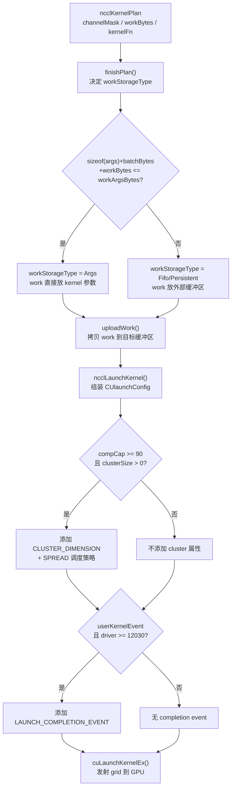

# 第 8 章：Kernel 启动与设备端执行：从 host 侧调用到 GPU 线程块起跑

上一章我们拆解了任务如何被切分到多个 channel、如何生成 kernel 启动参数，以及 group 语义下批量提交与依赖排序的机制。现在，启动计划已经就绪，但它还只是 host 侧的数据结构。本章要回答的核心问题是：`ncclKernelPlan` 如何变成 GPU 上一个真正在跑的 grid？我们将沿着 `ncclLaunchKernel` 的调用链，看参数如何被塞进 kernel args、kernel 变体如何被选中、`cuLaunchKernelEx` 如何被调用，以及设备侧 `ncclKernelMain` 如何从共享内存里把工作描述读出来并分发到具体实现。

## 从 Plan 到 Grid：启动路径的全景

在深入细节之前，先建立一个整体心智模型。把 `ncclKernelPlan` 想象成一张"施工图纸"：它记录了这次要启动几个 channel（几个 block）、每个 block 多少线程、要执行哪些 work、用哪个 kernel 函数。而 `ncclLaunchKernel` 就是"施工队进场"的动作——它把图纸上的信息翻译成 CUDA 驱动能理解的 `CUlaunchConfig`，然后调用 `cuLaunchKernelEx` 把 grid 真正发射到 GPU 上。

如果没有这一层，host 侧的所有调度（上一章的 channel 切分、batch 组织、proxy op 排序）都只是纸上谈兵，GPU 上不会有任何 kernel 运行，通信永远不会发生。这是端到端主干的最后一环，也是 host 与 device 的分界线。

整个启动路径可以概括为三个阶段：

1. **参数准备**（`finishPlan` + `uploadWork`）：把 work 结构体、batch 描述符、kernel args 组织到一块连续内存里，决定是放在 kernel 参数里、FIFO 里还是持久化缓冲区里。
2. **kernel 发射**（`ncclLaunchKernel`）：计算 grid/block 维度，组装 launch attributes（CGA cluster、mem sync domain、launch completion event），调用 `cuLaunchKernelEx`。
3. **设备侧入口**（`ncclKernelMain`）：每个 block 根据 `blockIdx.x` 确定自己的 channelId，从 args 或 FIFO 里加载 work batch 到共享内存，然后通过 `ncclDevFuncTable` 分发到具体的算法/协议实现。

下面这张图展示了从 plan 到 grid 的完整控制流，包含关键的分支判断：



这张图锚定了本章的三个核心函数：`finishPlan`、`uploadWork`、`ncclLaunchKernel`。接下来我们逐个拆解。

## 参数准备：work 结构体如何找到自己的位置

### 直觉模型

`finishPlan` 的角色类似于快递分拣中心的"装箱员"。它面对一堆零散的 work 结构体（每个 collective 或 p2p 操作对应一个），需要决定：这些 work 是塞进 kernel 参数这个"随身背包"里，还是放进 FIFO 这个"传送带"上，还是放进持久化缓冲区这个"仓库"里？

如果这个决策做错了——比如 work 太大塞不进 kernel 参数却硬塞——kernel 启动会直接失败。如果 work 放错了位置，设备侧读到的就是垃圾数据，通信结果完全错误。

### 数据结构与内存布局

先看 `ncclDevKernelArgs` 的结构，它是 host 和 device 之间的"信封"：

[FACT:src/include/device.h:514-522](https://github.com/NVIDIA/nccl/blob/12df1a11afad322be5a204a2db890161cbf8131d/src/include/device.h#L514-L522)

```c
struct alignas(16) ncclDevKernelArgs {
  struct ncclKernelComm* comm;      // 指向设备侧通信器元数据
  uint64_t channelMask;             // 哪些 channel 有工作
  enum ncclDevWorkStorageType workStorageType;  // work 存在哪里
  uint32_t workMask;                // FIFO 环形缓冲区的掩码
  void* workBuf;                    // work 缓冲区指针
  // struct ncclDevWorkBatch batches[];  // 紧随其后的是 batch 数组
};
```

这个结构体只有 5 个字段，但每个字段都承载着关键信息。`channelMask` 是一个 64 位掩码，每一位对应一个 channel，设备侧通过 `__popcll` 计算 `blockIdx.x` 对应的 channelId。`workStorageType` 决定了设备侧从哪里读 work：`Args` 表示 work 就在 kernel 参数里，`Fifo` 表示在环形缓冲区里，`Persistent` 表示在持久化缓冲区里。

`ncclDevWorkBatch` 是 batch 描述符，它告诉设备侧"这个 channel 的 work 在哪里、有多少个"：

[FACT:src/include/device.h:400-421](https://github.com/NVIDIA/nccl/blob/12df1a11afad322be5a204a2db890161cbf8131d/src/include/device.h#L400-L421)

```c
struct alignas(16) ncclDevWorkBatch {
  union {
    struct {
      uint32_t nextJump:14, nextExtends:1;
      uint32_t workType:2, funcId : NCCL_DEV_WORK_BATCH_FUNC_ID_BITS, func : NCCL_DEV_WORK_BATCH_FUNC_BITS;
    };
    uint32_t flags;
  };
  uint32_t offsetBase;    // work 在 FIFO 中的起始偏移
  uint64_t offsetBitset;  // 哪些 work 属于这个 channel
};
```

`offsetBitset` 是一个 64 位掩码，每一位对应一个 work 结构体。设备侧通过 `__popc` 和 `fns`（find n-th set）指令来定位每个 work 的偏移。`nextJump` 和 `nextExtends` 用于把多个 batch 串联起来——当 work 太多装不下一个 batch 时，会创建"扩展 batch"。

### Step-by-Step Walkthrough

现在代入一个具体场景：一次 AllReduce 被切分到 4 个 channel，每个 channel 有 2 个 work 结构体，总共 8 个 work。

**第一步：`finishPlan` 决定存储类型。**

[FACT:src/enqueue/enqueue.cc:245-255](https://github.com/NVIDIA/nccl/blob/12df1a11afad322be5a204a2db890161cbf8131d/src/enqueue/enqueue.cc#L245-L255)

```c
if (sizeof(ncclDevKernelArgs) + batchBytes + workBytes <= comm->workArgsBytes) {
  plan->workStorageType = ncclDevWorkStorageTypeArgs;
}
plan->kernelArgsSize = sizeof(struct ncclDevKernelArgs) + batchBytes;
plan->kernelArgsSize += (plan->workStorageType == ncclDevWorkStorageTypeArgs) ? workBytes : 0;
plan->kernelArgsSize = alignUp(plan->kernelArgsSize, 16);
plan->kernelArgs =
  (struct ncclDevKernelArgs*)ncclMemoryStackAlloc(&comm->memScoped, plan->kernelArgsSize, /*align=*/16);
plan->kernelArgs->comm = comm->devComm;
plan->kernelArgs->channelMask = plan->channelMask;
plan->kernelArgs->workStorageType = plan->workStorageType;
```

这里的关键判断是：如果 `sizeof(ncclDevKernelArgs) + batchBytes + workBytes` 能装进 `comm->workArgsBytes`（通常是 4KB），就把 work 直接放进 kernel 参数里。否则，work 会被放到 FIFO 或持久化缓冲区，kernel 参数里只放 batch 描述符。

为什么优先放 kernel 参数？[INFERENCE] 因为 kernel 参数在 CUDA 驱动里是通过常量内存（constant memory）传递的，设备侧读取时走的是 `ld.param` 指令，比从全局内存读取 FIFO 要快得多。对于小消息（work 总量小），这能显著降低延迟。

**第二步：把 batch 按 channel 轮流放入 kernel args。**

[FACT:src/enqueue/enqueue.cc:257-280](https://github.com/NVIDIA/nccl/blob/12df1a11afad322be5a204a2db890161cbf8131d/src/enqueue/enqueue.cc#L257-L280)

```c
uint64_t hasBatchMask = plan->channelMask;
struct ncclDevWorkBatch* batchPrev[MAXCHANNELS] = {};
struct ncclDevWorkBatch* batchZero = (struct ncclDevWorkBatch*)(plan->kernelArgs + 1);
int batchIx = 0;
while (hasBatchMask != 0) {
  uint64_t tmpMask = hasBatchMask;
  do {
    int c = popFirstOneBit(&tmpMask);
    if (!ncclIntruQueueEmpty(&wipChannels[c].workBatchQueue)) {
      struct ncclWorkBatchList* batchNode = ncclIntruQueueDequeue(&wipChannels[c].workBatchQueue);
      if (batchPrev[c] != nullptr) {
        batchPrev[c]->nextJump = int(&batchZero[batchIx] - batchPrev[c]);
      }
      batchPrev[c] = &batchZero[batchIx];
      batchZero[batchIx++] = batchNode->batch;
    }
    if (ncclIntruQueueEmpty(&wipChannels[c].workBatchQueue)) {
      hasBatchMask ^= 1ull << c;
    }
  } while (tmpMask != 0);
}
```

这段代码的逻辑是"轮询"：每一轮从每个还有 batch 的 channel 里取一个 batch，按 channel 编号升序放入 `batchZero` 数组。这样做的目的是保证"每个 channel 的第一个 batch 位于 `batchZero[blockIdx.x]`"——设备侧每个 block 通过 `blockIdx.x` 直接索引到自己的第一个 batch，不需要搜索。

`nextJump` 字段记录了同一个 channel 的下一个 batch 相对于当前 batch 的偏移。设备侧通过 `batchIx += batch.nextJump` 就能跳到下一个 batch，形成一个链表。

**第三步：`uploadWork` 把 work 拷贝到目标缓冲区。**

[FACT:src/enqueue/enqueue.cc:1365-1430](https://github.com/NVIDIA/nccl/blob/12df1a11afad322be5a204a2db890161cbf8131d/src/enqueue/enqueue.cc#L1365-L1430)

```c
static ncclResult_t uploadWork(struct ncclComm* comm, struct ncclKernelPlan* plan) {
  if (plan->isSymColl || plan->isCeColl || plan->isRma) return ncclSuccess;
  size_t workBytes = plan->workBytes;
  size_t batchBytes = plan->nWorkBatches * sizeof(struct ncclDevWorkBatch);
  void* fifoBufHost;
  uint32_t fifoCursor, fifoMask;
  switch (plan->workStorageType) {
  case ncclDevWorkStorageTypeArgs:
    plan->kernelArgs->workBuf = nullptr;
    fifoBufHost = (void*)plan->kernelArgs;
    fifoCursor = sizeof(ncclDevKernelArgs) + batchBytes;
    fifoMask = ~0u;
    break;
  case ncclDevWorkStorageTypeFifo:
    fifoBufHost = comm->workFifoBuf;
    fifoCursor = comm->workFifoProduced;
    fifoMask = comm->workFifoBytes - 1;
    NCCLCHECK(waitWorkFifoAvailable(comm, fifoCursor + workBytes));
    plan->kernelArgs->workBuf = comm->workFifoBufDev;
    break;
  // ...
  }
  plan->kernelArgs->workMask = fifoMask;
  // 修正 batch 的 offsetBase
  struct ncclDevWorkBatch* batchZero = (struct ncclDevWorkBatch*)(plan->kernelArgs + 1);
  for (int b = 0; b < plan->nWorkBatches; b++) {
    batchZero[b].offsetBase += fifoCursor;
  }
  // 拷贝 work 结构体
  struct ncclWorkList* workNode = ncclIntruQueueHead(&plan->workQueue);
  while (workNode != nullptr) {
    char* dst = (char*)fifoBufHost;
    char* src = (char*)(workNode + 1);
    for (int n = workNode->size; n != 0; n -= 16) {
      memcpy(COMPILER_ASSUME_ALIGNED(dst + (fifoCursor & fifoMask), 16), COMPILER_ASSUME_ALIGNED(src, 16), 16);
      fifoCursor += 16;
      src += 16;
    }
    workNode = workNode->next;
  }
  // ...
}
```

这里有几个关键点：

1. **`fifoCursor` 的语义**：对于 `Args` 类型，它是相对于 `kernelArgs` 起始地址的偏移；对于 `Fifo` 类型，它是相对于 FIFO 基地址的偏移；对于 `Persistent` 类型，它从 0 开始。

2. **`offsetBase` 的修正**：`finishPlan` 里 batch 的 `offsetBase` 是相对于 plan 的 work 起始位置的（从 0 开始）。`uploadWork` 需要把它转换成相对于实际存储位置的偏移。对于 `Args` 类型，加上 `sizeof(ncclDevKernelArgs) + batchBytes`；对于 `Fifo` 类型，加上 `comm->workFifoProduced`。

3. **16 字节对齐拷贝**：work 结构体都是 16 字节对齐的（`alignas(16)`），所以拷贝时按 16 字节为单位。`COMPILER_ASSUME_ALIGNED` 告诉编译器这个地址是 16 字节对齐的，让编译器生成更高效的向量化指令。

4. **FIFO 等待**：对于 `Fifo` 类型，`waitWorkFifoAvailable` 会自旋等待 FIFO 有足够空间。这个等待会检查 `comm->abortFlag`，避免在 abort 时死锁。

### 设计思考与生产踩坑

**为什么要有三种存储类型？** [INFERENCE] 这是空间和延迟的权衡：

- `Args`：最快（常量内存），但容量有限（4KB）。适合小消息、少量 work。
- `Fifo`：容量大（环形缓冲区），但设备侧读取要走全局内存。适合中等消息。
- `Persistent`：用于 CUDA Graph 捕获场景。因为 graph 捕获时不能做 `cudaMemcpy`，所以需要预先分配持久化缓冲区，把 work 拷贝进去，然后让 kernel 从那里读。

**踩坑点 1：FIFO 溢出导致死锁。** 如果 `waitWorkFifoAvailable` 没有检查 `abortFlag`，当 FIFO 满且消费者（GPU kernel）因为某种原因停止消费时，host 会永远自旋。源码里 [FACT:src/enqueue/enqueue.cc:1333-1349](https://github.com/NVIDIA/nccl/blob/12df1a11afad322be5a204a2db890161cbf8131d/src/enqueue/enqueue.cc#L1333-L1349) 明确检查了 abort flag：

```c
if (COMPILER_ATOMIC_LOAD(comm->abortFlag, std::memory_order_acquire)) {
  return ncclInternalError;
}
```

**踩坑点 2：`offsetBitset` 溢出。** `offsetBitset` 是 64 位的，最多支持 64 个 work 在一个 batch 里。如果超过 64 个，`1ull << (offset / workSize)` 会溢出。源码里通过 `NCCL_MAX_DEV_WORK_BATCH_BYTES` 限制了 batch 的大小（1024 字节），而最小的 work 结构体是 `ncclDevWorkColl`（约 80 字节），所以最多 12 个 work，不会溢出。

**踩坑点 3：Persistent 模式下的内存泄漏。** 在 `uploadWork` 的 `Persistent` 分支里，`fifoBufHost` 是通过 `ncclOsAlignedAlloc` 分配的，需要在 `uploadWork_cleanup_fn` 里释放。如果 `cudaMemcpyAsync` 失败，`fail` 标签会检查 `cleanup` 是否为 null，如果为 null 就直接释放 `fifoBufHost`。这个错误恢复链在 [FACT:src/enqueue/enqueue.cc:1483-1485](https://github.com/NVIDIA/nccl/blob/12df1a11afad322be5a204a2db890161cbf8131d/src/enqueue/enqueue.cc#L1483-L1485) 可以看到。

## Kernel 发射：从 CUlaunchConfig 到 cuLaunchKernelEx

### 直觉模型

`ncclLaunchKernel` 的角色类似于"火箭发射控制台"。它接收一个已经装好燃料（work 数据）的 plan，计算出火箭的飞行参数（grid/block 维度），设置好各种发射选项（cluster、mem sync domain、completion event），然后按下发射按钮（`cuLaunchKernelEx`）。

如果这个环节出错——比如 grid 维度算错了——GPU 上会启动错误数量的 block，导致部分 channel 的工作永远不会被执行，通信挂起。

### 数据结构与内存布局

`CUlaunchConfig` 是 CUDA 驱动 API 的启动配置结构体，NCCL 在栈上构造它：

[FACT:src/enqueue/enqueue.cc:1916-1917](https://github.com/NVIDIA/nccl/blob/12df1a11afad322be5a204a2db890161cbf8131d/src/enqueue/enqueue.cc#L1916-L1917)

```c
CUlaunchConfig launchConfig = {0};
CUlaunchAttribute launchAttrs[6] = {};
int attrs = 0;
```

`launchAttrs` 是一个最多 6 个元素的数组，每个元素是一个 `CUlaunchAttribute`。NCCL 根据硬件能力和驱动版本，有条件地添加不同的属性：

- `CU_LAUNCH_ATTRIBUTE_CLUSTER_DIMENSION`：CGA cluster 维度（sm90+）
- `CU_LAUNCH_ATTRIBUTE_CLUSTER_SCHEDULING_POLICY_PREFERENCE`：cluster 调度策略
- `CU_LAUNCH_ATTRIBUTE_MEM_SYNC_DOMAIN`：内存同步域（CUDA 12.0+）
- `CU_LAUNCH_ATTRIBUTE_LAUNCH_COMPLETION_EVENT`：启动完成事件（CUDA 12.3+）
- `CU_LAUNCH_ATTRIBUTE_PROGRAMMATIC_STREAM_SERIALIZATION`：程序化流序列化（sym kernel）
- `CU_LAUNCH_ATTRIBUTE_NVLINK_UTIL_CENTRIC_SCHEDULING`：NVLink 利用率中心调度（CUDA 13.0+）

### Step-by-Step Walkthrough

**第一步：计算 grid 和 block 维度。**

[FACT:src/enqueue/enqueue.cc:1889-1893](https://github.com/NVIDIA/nccl/blob/12df1a11afad322be5a204a2db890161cbf8131d/src/enqueue/enqueue.cc#L1889-L1893)

```c
int nChannels = countOneBits(plan->channelMask);
void* sym = plan->kernelFn;
dim3 grid = {(unsigned)nChannels, 1, 1};
dim3 block = {(unsigned)plan->threadPerBlock, 1, 1};
int smem = plan->isSymColl ? plan->kernelDynSmem : ncclShmemDynamicSize(comm->cudaArch);
```

`nChannels` 是 `channelMask` 中置位的个数，也就是这个 plan 要启动多少个 block。每个 block 负责一个 channel。`threadPerBlock` 是在 `scheduleCollTasksToPlan` 里通过 `plan->threadPerBlock = std::max(plan->threadPerBlock, task->nWarps * WARP_SIZE)` 计算出来的，取所有 task 中最大的 `nWarps * 32`。

`smem` 是动态共享内存大小。对于普通 kernel，它是 `ncclShmemDynamicSize(comm->cudaArch)`，这是一个编译期常量，取决于架构（sm70+ 是 `ncclShmemScratchWarpSize * (NCCL_MAX_NTHREADS / WARP_SIZE)`）。对于 sym kernel，它是 `plan->kernelDynSmem`，因为 sym kernel 的共享内存需求可能不同。

**第二步：组装 kernel 参数。**

[FACT:src/enqueue/enqueue.cc:1902-1903](https://github.com/NVIDIA/nccl/blob/12df1a11afad322be5a204a2db890161cbf8131d/src/enqueue/enqueue.cc#L1902-L1903)

```c
void* extra[] = {CU_LAUNCH_PARAM_BUFFER_POINTER, plan->kernelArgs, CU_LAUNCH_PARAM_BUFFER_SIZE, &plan->kernelArgsSize,
                 CU_LAUNCH_PARAM_END};
```

这是 CUDA 驱动 API 的一种参数传递方式：`CU_LAUNCH_PARAM_BUFFER_POINTER` 告诉驱动"参数不是一个个传的，而是一个连续的内存块"，`CU_LAUNCH_PARAM_BUFFER_SIZE` 告诉驱动这个块的大小。这样做的好处是 NCCL 可以把 `ncclDevKernelArgs` 和后面的 batch 数组一次性传进去，不需要逐个参数打包。

**第三步：添加 launch attributes。**

[FACT:src/enqueue/enqueue.cc:1929-1936](https://github.com/NVIDIA/nccl/blob/12df1a11afad322be5a204a2db890161cbf8131d/src/enqueue/enqueue.cc#L1929-L1936)

```c
if (clusterSize) {
  if (grid.x % clusterSize) clusterSize = 1;
  launchAttrs[attrs].id = CU_LAUNCH_ATTRIBUTE_CLUSTER_DIMENSION;
  launchAttrs[attrs++].value.clusterDim = {clusterSize, 1, 1};
  launchAttrs[attrs].id = CU_LAUNCH_ATTRIBUTE_CLUSTER_SCHEDULING_POLICY_PREFERENCE;
  launchAttrs[attrs++].value.clusterSchedulingPolicyPreference = CU_CLUSTER_SCHEDULING_POLICY_SPREAD;
}
```

CGA（Cooperative Group Array）是 sm90 引入的硬件特性，允许把多个 block 组成一个 cluster，cluster 内的 block 可以保证同时调度到一组 SM 上，并且可以互相访问共享内存。NCCL 用这个特性来实现 NVLS 等需要跨 block 同步的算法。

注意 `if (grid.x % clusterSize) clusterSize = 1;` 这个保护：cluster 维度必须能整除 grid 维度，否则驱动会报错。如果 `grid.x` 不能被 `clusterSize` 整除，就退化为不使用 cluster。

**第四步：添加 launch completion event。**

[FACT:src/enqueue/enqueue.cc:1944-1964](https://github.com/NVIDIA/nccl/blob/12df1a11afad322be5a204a2db890161cbf8131d/src/enqueue/enqueue.cc#L1944-L1964)

```c
#if CUDART_VERSION >= 12030
enum ncclImplicitOrder implicitOrder;
NCCLCHECKGOTO(getImplicitOrder(&implicitOrder, comm, plan->persistent, driverVersion), ret, do_return);
if (implicitOrder == ncclImplicitOrderLaunch) {
  launchAttrs[attrs].id = CU_LAUNCH_ATTRIBUTE_LAUNCH_COMPLETION_EVENT;
  launchAttrs[attrs].value.launchCompletionEvent.event = comm->sharedRes->launchEvent;
  launchAttrs[attrs].value.launchCompletionEvent.flags = 0;
  attrs++;
  if (userKernelEvent) {
    NCCLCHECKGOTO(ncclUncapturedStreamPoolAcquire(&comm->sharedRes->uncapturedStreamPool, &relayStream), ret, do_return);
    relayUserLaunchCompletionEvent = true;
    userKernelEventArmed = true;
  }
} else if (userKernelEvent && driverVersion >= 12030) {
  launchAttrs[attrs].id = CU_LAUNCH_ATTRIBUTE_LAUNCH_COMPLETION_EVENT;
  launchAttrs[attrs].value.launchCompletionEvent.event = plan->launchCompletionEvent;
  launchAttrs[attrs].value.launchCompletionEvent.flags = 0;
  attrs++;
  userKernelEventArmed = true;
}
#endif
```

`CU_LAUNCH_ATTRIBUTE_LAUNCH_COMPLETION_EVENT` 是 CUDA 12.3 引入的特性：驱动会在 kernel 真正开始执行时（而不是在 host 侧调用返回时）记录一个事件。这对于实现"隐式顺序"（implicit order）至关重要——NCCL 需要保证多个 kernel 按顺序执行，但又不希望 host 侧阻塞等待。

`getImplicitOrder` 的逻辑是：如果用户设置了 `launchOrderImplicit`，并且驱动版本足够新，就使用 `ncclImplicitOrderLaunch`（用 launch event 排序）；否则使用 `ncclImplicitOrderSerial`（用 completion event 排序，即串行执行）。

**第五步：调用 `cuLaunchKernelEx`。**

[FACT:src/enqueue/enqueue.cc:1978-1996](https://github.com/NVIDIA/nccl/blob/12df1a11afad322be5a204a2db890161cbf8131d/src/enqueue/enqueue.cc#L1978-L1996)

```c
launchConfig.gridDimX = grid.x;
launchConfig.gridDimY = grid.y;
launchConfig.gridDimZ = grid.z;
launchConfig.blockDimX = block.x;
launchConfig.blockDimY = block.y;
launchConfig.blockDimZ = block.z;
launchConfig.sharedMemBytes = smem;
launchConfig.attrs = launchAttrs;
launchConfig.numAttrs = attrs;
launchConfig.hStream = launchStream;
if (userKernelEvent && !userKernelEventArmed) {
  WARN("CUDA launch-completion events require CUDA 12.3 or newer; recording the user event before launch");
  CUDACHECKGOTO(cudaEventRecord(plan->launchCompletionEvent, launchStream), ret, do_return);
}
CUCHECKGOTO(cuLaunchKernelEx(&launchConfig, fn, nullptr, extra), ret, do_return);
if (relayUserLaunchCompletionEvent) {
  CUDACHECKGOTO(cudaStreamWaitEvent(relayStream, comm->sharedRes->launchEvent, 0), ret, do_return);
  CUDACHECKGOTO(cudaEventRecord(plan->launchCompletionEvent, relayStream), ret, do_return);
}
```

`cuLaunchKernelEx` 是 CUDA 12.0 引入的新 API，支持 launch attributes。对于老驱动（< 11.8），NCCL 会退回到 `cuLaunchKernel`：

[FACT:src/enqueue/enqueue.cc:1998-2007](https://github.com/NVIDIA/nccl/blob/12df1a11afad322be5a204a2db890161cbf8131d/src/enqueue/enqueue.cc#L1998-L2007)

```c
} else {
  // Standard kernel launch
  if (userKernelEvent) {
    WARN("CUDA launch-completion events require CUDA 12.3 or newer; recording the user event before launch");
    CUDACHECKGOTO(cudaEventRecord(plan->launchCompletionEvent, launchStream), ret, do_return);
  }
  CUCHECKGOTO(cuLaunchKernel(fn, grid.x, grid.y, grid.z, block.x, block.y, block.z, smem, launchStream, nullptr,
                             extra),
              ret, do_return);
}
```

### 并发控制与硬件交互

**Launch completion event 的 relay 机制。** 当使用 `ncclImplicitOrderLaunch` 且用户提供了 `launchCompletionEvent` 时，NCCL 不能直接把用户的 event 传给驱动，因为驱动只支持一个 launch completion event。NCCL 的做法是：

1. 把 `comm->sharedRes->launchEvent` 传给驱动。
2. 在 `relayStream` 上等待 `launchEvent`。
3. 在 `relayStream` 上记录用户的 event。

这样用户的 event 会在 kernel 真正开始执行后触发，而不是在 host 侧调用返回时触发。

**Mem Sync Domain。** [FACT:src/enqueue/enqueue.cc:1938-1942](https://github.com/NVIDIA/nccl/blob/12df1a11afad322be5a204a2db890161cbf8131d/src/enqueue/enqueue.cc#L1938-L1942) 在 sm90+ 上，NCCL 设置 `CU_LAUNCH_ATTRIBUTE_MEM_SYNC_DOMAIN` 为 `cudaLaunchMemSyncDomainRemote`。这是 Hopper 架构引入的内存同步域机制，用于隔离不同 kernel 的内存屏障，减少不必要的同步开销。

### 生产踩坑指南

**踩坑点 1：cluster 维度不整除导致启动失败。** 如果 `grid.x` 不能被 `clusterSize` 整除，驱动会返回 `CUDA_ERROR_INVALID_VALUE`。源码里通过 `if (grid.x % clusterSize) clusterSize = 1;` 做了保护，但这也意味着 cluster 特性被静默禁用了。如果用户期望 cluster 带来的性能提升，需要检查 `cgaClusterSize` 和 `nChannels` 的关系。

**踩坑点 2：驱动版本不满足导致 kernel 不可用。** `ncclInitKernelsForDevice` 会在初始化时检查每个 kernel 的驱动要求：

[FACT:src/enqueue/enqueue.cc:71-76](https://github.com/NVIDIA/nccl/blob/12df1a11afad322be5a204a2db890161cbf8131d/src/enqueue/enqueue.cc#L71-L76)

```c
for (int k = 0; k < kcount; k++) {
  if (kptrs[k] != nullptr && driverVersion < krequires[k]) {
    INFO(NCCL_INIT, "Skipping %skernel %d which requires driver %d", sym ? "symmetric " : "", k, krequires[k]);
    kptrs[k] = nullptr;
    if (kptrsProfile != nullptr) kptrsProfile[k] = nullptr;
  }
```

如果驱动版本不够，kernel 指针会被置为 null。后续如果调度器选中了这个 kernel，`cuLaunchKernelEx` 会失败。NCCL 的 tuner 应该会避免选择不可用的 kernel，但如果用户强制指定了算法（`NCCL_ALGO`），可能会触发这个问题。

**踩坑点 3：`launchCompletionEvent` 在旧驱动上的行为。** 如果驱动版本 < 12.3，NCCL 会在 kernel 启动前记录 event，这意味着 event 会在 kernel 开始执行前就触发，而不是在 kernel 真正开始执行时。这可能导致用户代码的时序假设失效。

## 设备侧入口：从 blockIdx 到具体实现

### 直觉模型

`ncclKernelMain` 是 GPU 上每个 block 的"入口大厅"。当一个 block 被调度到 SM 上开始执行时，它首先进入这个大厅，完成三件事：确定自己的身份（我是哪个 channel）、领取自己的任务（加载 work batch）、然后去对应的窗口办事（调用具体的算法实现）。

如果没有这个入口，每个 kernel 变体都需要自己处理"我是谁、我要干什么"的问题，代码会大量重复。`ncclKernelMain` 通过模板参数 `SpecializedFnId` 和 `SpecializedRunWorkBatch` 实现了"通用入口 + 特化执行"的模式。

### 数据结构与内存布局

设备侧的共享内存布局是理解 `ncclKernelMain` 的关键。`ncclShmemData` 是所有 block 共享的"工作台"：

[FACT:src/device/common.h:48-72](https://github.com/NVIDIA/nccl/blob/12df1a11afad322be5a204a2db890161cbf8131d/src/device/common.h#L48-L72)

```c
struct ncclShmemData {
  struct ncclDevKernelArgs args;
  int channelId;
  int aborted;
  alignas(16) struct ncclKernelComm comm;
  alignas(16) struct ncclDevChannel channel;

  int batchIx, nextBatchIx;
  enum ncclDevWorkType workType;
  uint8_t directMode;
  uint16_t funcId;
  int nWorks;
  int workSize;
  uint64_t workCounter;
  bool profilerEnabled;
  uint8_t func;
  struct ncclShmemGroup groups[NCCL_MAX_GROUPS];

  alignas(16) char workStorage[ncclMaxDevWorkBatchBytes()];

  alignas(16) union {
    unpackShmem unpack;
  } devicePlugin;
};
```

这个结构体的布局经过精心设计：

- `args` 放在最前面，因为它是从 kernel 参数拷贝过来的，需要 16 字节对齐。
- `comm` 和 `channel` 也是 16 字节对齐的，因为它们是通过 `copyToShmem16` 用向量化指令拷贝的。
- `workStorage` 是 work 结构体的临时存放区，大小是 `ncclMaxDevWorkBatchBytes()`（sm90+ 是 16KB）。
- `groups` 数组用于存储每个 group 的连接信息，`NCCL_MAX_GROUPS` 是 16。

### Step-by-Step Walkthrough

**第一步：拷贝 kernel args 到共享内存。**

[FACT:src/device/common.h:426-428](https://github.com/NVIDIA/nccl/blob/12df1a11afad322be5a204a2db890161cbf8131d/src/device/common.h#L426-L428)

```c
if (tid < sizeof(ncclDevKernelArgs) / sizeof(uint32_t)) {
  ((uint32_t*)&ncclShmem.args)[tid] = ((uint32_t*)args)[tid];
}
```

这里用前 `sizeof(ncclDevKernelArgs) / 4` 个线程，每个线程拷贝一个 32 位字。为什么要拷贝到共享内存？因为 kernel 参数在常量内存里，访问速度虽然快，但每个线程都要访问时会有广播开销。拷贝到共享内存后，所有线程访问的是同一块共享内存，效率更高。

**第二步：确定 channelId。**

[FACT:src/device/common.h:430-437](https://github.com/NVIDIA/nccl/blob/12df1a11afad322be5a204a2db890161cbf8131d/src/device/common.h#L430-L437)

```c
if (tid < MAXCHANNELS && (args->channelMask & (1ull << tid))) {
  int n = __popcll(args->channelMask & ((1ull << tid) - 1));
  if (blockIdx.x == n) ncclShmem.channelId = tid;
}
__syncthreads();
```

这段代码的逻辑是：对于每个置位的 channel（`args->channelMask & (1ull << tid)`），计算它前面有多少个置位的 channel（`__popcll`），如果这个数量等于 `blockIdx.x`，那么当前 block 就负责这个 channel。

举个例子：`channelMask = 0b1011`（channel 0、1、3 有工作）。`blockIdx.x = 0` 的 block 负责 channel 0（前面有 0 个置位），`blockIdx.x = 1` 的 block 负责 channel 1（前面有 1 个置位），`blockIdx.x = 2` 的 block 负责 channel 3（前面有 2 个置位）。

**第三步：加载 comm 和 channel 到共享内存。**

[FACT:src/device/common.h:446-478](https://github.com/NVIDIA/nccl/blob/12df1a11afad322be5a204a2db890161cbf8131d/src/device/common.h#L446-L478)

```c
switch (tid / WARP_SIZE) {
case 0:
  {
    void* dst = &ncclShmem.comm;
    void* src = ncclShmem.args.comm;
    int bytes = sizeof(ncclKernelComm);
    static_assert(sizeof(ncclKernelComm) <= 16 * WARP_SIZE,
                  "ncclKernelComm cannot be loaded by a single warp in one insn.");
    copyToShmem16(tid, dst, src, bytes);
  }
  break;
case 1:
  {
    void* dst = &ncclShmem.channel;
    void* src = &((ncclKernelCommAndChannels*)ncclShmem.args.comm)->channels[ncclShmem.channelId];
    int bytes = sizeof(ncclDevChannel);
    static_assert(sizeof(ncclDevChannel) <= 16 * WARP_SIZE,
                  "ncclDevChannel cannot be loaded by a single warp in one insn.");
    copyToShmem16(tid - WARP_SIZE, dst, src, bytes);
  }
  break;
default:
  {
    int subtid = tid - 2 * WARP_SIZE;
    int subtn = tn - 2 * WARP_SIZE;
    loadWorkBatchToShmem(subtid, subtn, args, /*batchIx=*/blockIdx.x);
  }
  break;
}
__syncthreads();
```

这里把线程分成三组：

- **第 0 个 warp**：加载 `ncclKernelComm`（通信器元数据）到共享内存。
- **第 1 个 warp**：加载当前 channel 的 `ncclDevChannel`（channel 元数据）到共享内存。
- **其余 warp**：加载 work batch 到共享内存。

`copyToShmem16` 是一个用内联 PTX 实现的 16 字节拷贝函数：

[FACT:src/device/common.h:131-139](https://github.com/NVIDIA/nccl/blob/12df1a11afad322be5a204a2db890161cbf8131d/src/device/common.h#L131-L139)

```c
inline __device__ void copyToShmem16(int tid, void* dst, void const* src, int bytes) {
  int offset = 16 * tid;
  if (offset < bytes) {
    uint64_t a = 0, b = 0;
    asm volatile("ld.v2.u64 {%0,%1},[%2];" : "=l"(a), "=l"(b) : "l"((char const*)src + offset) : "memory");
    uint32_t udst = (uint32_t)__cvta_generic_to_shared(dst);
    asm volatile("st.shared.v2.u64 [%0],{%1,%2};" ::"r"(udst + offset), "l"(a), "l"(b) : "memory");
  }
}
```

它用 `ld.v2.u64` 从全局内存加载 16 字节，用 `st.shared.v2.u64` 存储到共享内存。`__cvta_generic_to_shared` 把通用地址转换成共享内存地址（共享内存地址空间是 32 位的）。

**第四步：加载 work batch。**

`loadWorkBatchToShmem` 是最复杂的部分。它的任务是把 batch 描述符指向的 work 结构体从全局内存（或 kernel 参数）拷贝到共享内存的 `workStorage` 里。

[FACT:src/device/common.h:142-260](https://github.com/NVIDIA/nccl/blob/12df1a11afad322be5a204a2db890161cbf8131d/src/device/common.h#L142-L260)

```c
__device__ __forceinline__ void loadWorkBatchToShmem(int tid, int tn, struct ncclDevKernelArgs const* args,
                                                     int batchIx) {
  int lane = tid % WARP_SIZE;
  int workCursor = 0;
  while (true) {
    struct ncclDevWorkBatch batch = ((struct ncclDevWorkBatch*)(args + 1))[batchIx];

    uint8_t* fnsOfBitset = (uint8_t*)ncclScratchForWarp(threadIdx.x / WARP_SIZE);
    __syncwarp();
    if (uint32_t(batch.offsetBitset) & (1u << lane)) {
      int nWorksBelow = __popc(uint32_t(batch.offsetBitset) & ((1u << lane) - 1));
      fnsOfBitset[nWorksBelow] = lane;
    }
    int nWorksLow32 = __popc(uint32_t(batch.offsetBitset));
    if (uint32_t(batch.offsetBitset >> 32) & (1u << lane)) {
      int nWorksBelow = nWorksLow32;
      nWorksBelow += __popc(uint32_t(batch.offsetBitset >> 32) & ((1u << lane) - 1));
      fnsOfBitset[nWorksBelow] = 32 + lane;
    }
    int nWorks = nWorksLow32 + __popc(uint32_t(batch.offsetBitset >> 32));
    __syncwarp();
    // ...
  }
}
```

这段代码的核心是计算 `fnsOfBitset`：对于 `offsetBitset` 中第 n 个置位，它的位索引是多少。PTX 有 `fns` 指令可以做这个，但它展开成很多 SASS 指令。NCCL 的做法是用共享内存：每个 lane 检查自己的位是否置位，如果是，计算它前面有多少个置位，然后把自己的 lane 编号写到 `fnsOfBitset[nWorksBelow]`。

接下来是实际的拷贝：

[FACT:src/device/common.h:209-241](https://github.com/NVIDIA/nccl/blob/12df1a11afad322be5a204a2db890161cbf8131d/src/device/common.h#L209-L241)

```c
if (tid < nPacks) {
  int srcWork = fnsOfBitset[dstWork];
  ulonglong2 tmp;
  if (ncclShmem.args.workStorageType == ncclDevWorkStorageTypeArgs) {
    char* src = (char*)args + (batch.offsetBase + srcWork * workSize + packInWork * 16);
    tmp = *(ulonglong2*)src; // becomes ld.param.v2.u64
  } else {
    char* src = (char*)ncclShmem.args.workBuf +
                ((batch.offsetBase + srcWork * workSize + packInWork * 16) & ncclShmem.args.workMask);
    tmp = *(ulonglong2*)src; // becomes ld.v2.u64
  }
  char* dst = ncclShmem.workStorage;
  dst += (workCursor + dstWork) * workSize + packInWork * 16;
  *(ulonglong2*)dst = tmp;
}
```

这里有一个关键的优化：对于 `Args` 类型，源码直接写 `(char*)args + offset`，编译器会识别出这是从 kernel 参数读取，生成 `ld.param.v2.u64` 指令。对于 `Fifo` 类型，源码写 `(char*)ncclShmem.args.workBuf + (offset & workMask)`，编译器生成 `ld.v2.u64` 指令。

注释里特别强调了不能把这两种情况合并：

[FACT:src/device/common.h:212-229](https://github.com/NVIDIA/nccl/blob/12df1a11afad322be5a204a2db890161cbf8131d/src/device/common.h#L212-L229)

```c
// The loads done in these two cases must be kept separate since we are
// relying on the compiler to use "ld.param" in the first one. The parameter
// space is not generically addressable, so any attempt to load through
// a pointer that *might* be parameter space backed will cause the
// compiler to spill the parameter struct (4K!) to each thread's local space
// before creating a pointer (to the spill) and decimate perf.
```

如果编译器不能确定指针指向的是参数空间还是全局空间，它会把整个参数结构体（4KB）溢出到每个线程的本地内存，性能会急剧下降。

**第五步：执行 work。**

[FACT:src/device/common.h:481-497](https://github.com/NVIDIA/nccl/blob/12df1a11afad322be5a204a2db890161cbf8131d/src/device/common.h#L481-L497)

```c
while (ncclShmem.aborted == 0) {
  profiler(START);
  if (0 <= SpecializedFnId && ncclShmem.funcId == (unsigned)SpecializedFnId) {
    SpecializedRunWorkBatch().run();
  } else {
    ncclDevFuncTable[ncclShmem.funcId]();
  }

  if (ncclShmem.nextBatchIx == -1) break;
  int batchIx = ncclShmem.nextBatchIx;
  __syncthreads();
  profiler(STOP);
  if (ncclShmem.comm.progressCounters != nullptr) __syncthreads();
  loadWorkBatchToShmem(tid, tn, args, batchIx);
  __syncthreads();
}
```

这里有一个重要的优化：如果 `SpecializedFnId` 匹配当前 batch 的 `funcId`，直接调用 `SpecializedRunWorkBatch().run()`，这是一个编译期特化的函数，没有函数指针调用的开销。否则，通过 `ncclDevFuncTable[ncclShmem.funcId]()` 间接调用。

`ncclDevFuncTable` 是一个设备侧的函数指针数组，由 `generate.py` 生成：

[FACT:src/device/generate.py:261-270](https://github.com/NVIDIA/nccl/blob/12df1a11afad322be5a204a2db890161cbf8131d/src/device/generate.py#L261-L270)

```python
out("__device__ ncclDevFuncPtr_t const ncclDevFuncTable[] = {\n")
index = 0
for fn in primary_funcs:
  sym = paste("_", "ncclDevFunc", *fn)
  cudart, arch = required_cuda(*fn)
  if (cudart, arch) != (0, 0):
    out("#if CUDART_VERSION >= %d && __CUDA_ARCH__ >= %d\n" % (cudart ,arch))
  out("/*%4d*/ %s,\n" % (index, sym))
  if (cudart, arch) != (0, 0):
    out("#else\n" "/*%4d*/ nullptr,\n" "#endif\n" % index)
  index += 1
out("nullptr};\n")
```

### 设计思考与生产踩坑

**为什么用 `__grid_constant__`？** [FACT:src/device/common.h:19-24](https://github.com/NVIDIA/nccl/blob/12df1a11afad322be5a204a2db890161cbf8131d/src/device/common.h#L19-L24)

```c
#if __CUDA_ARCH__ >= 700
// __grid_constant__ appears to break cuda-gdb
#define NCCL_GRID_CONSTANT __grid_constant__
#else
#define NCCL_GRID_CONSTANT
#endif
```

`__grid_constant__` 告诉编译器这个参数是只读的，可以放在常量内存里。这样设备侧读取时走 `ld.param` 指令，比从全局内存读取快。注释里提到它会破坏 cuda-gdb，所以只在 sm70+ 上启用。

**踩坑点 1：`workStorage` 溢出。** `workStorage` 的大小是 `ncclMaxDevWorkBatchBytes()`，sm90+ 是 16KB。如果 `nWorks * workSize` 超过这个值，会写越界。源码里通过 `NCCL_MAX_DEV_WORK_BATCH_BYTES` 在 host 侧限制了 batch 的大小，但设备侧没有额外的检查。如果 host 侧的约束被绕过（比如通过修改环境变量），会导致共享内存越界。

**踩坑点 2：`__syncthreads()` 的缺失导致数据竞争。** 在 `loadWorkBatchToShmem` 之后，必须有一个 `__syncthreads()` 才能让所有线程看到完整的 `workStorage`。源码里在 [FACT:src/device/common.h:479](https://github.com/NVIDIA/nccl/blob/12df1a11afad322be5a204a2db890161cbf8131d/src/device/common.h#L479) 有 `__syncthreads(); // publish ncclShmem`。如果这个同步被去掉，某些线程可能会在 `workStorage` 还没写完时就开始读取，导致读到垃圾数据。

**踩坑点 3：abort 检查的时机。** `while (ncclShmem.aborted == 0)` 只在每个 batch 开始时检查 abort。如果某个 batch 执行时间很长，abort 信号可能要等很久才能生效。这是设计上的权衡：更频繁的检查会增加开销，但响应更快。

## Kernel 变体选择：generate.py 如何生成 kernel 列表

### 直觉模型

`generate.py` 的角色类似于"汽车工厂的生产线规划师"。它面对一个巨大的组合空间（7 种集合操作 × 5 种归约操作 × 12 种数据类型 × 7 种算法 × 3 种协议），需要决定：哪些组合需要生成专门的 kernel？哪些可以共用一个通用 kernel？

如果每个组合都生成一个 kernel，编译时间和二进制大小会爆炸。如果只生成一个通用 kernel，运行时会因为函数指针调用和分支判断而变慢。`generate.py` 的解决方案是"代表性 kernel"：为每个等价类生成一个 kernel，运行时通过函数指针表分发。

### 数据结构与内存布局

`generate.py` 生成三个关键文件：

1. **`device_table.cu`**：设备侧的 `ncclDevFuncTable`，把 funcId 映射到具体的设备函数。
2. **`host_table.cc`**：host 侧的 `ncclDevKernelList`、`ncclDevKernelForFunc`、`ncclDevFuncRowToId` 等表。
3. **各个 `<coll>_<op>_<ty>.cu`**：具体的 kernel 实现。

### Step-by-Step Walkthrough

**第一步：枚举所有函数行。**

[FACT:src/device/generate.py:186-199](https://github.com/NVIDIA/nccl/blob/12df1a11afad322be5a204a2db890161cbf8131d/src/device/generate.py#L186-L199)

```python
def enumerate_func_rows():
  yield ("SendRecv", None, None, None, None)
  for coll in ("AllGather", "Broadcast", "AllGatherV"):
    algos = algos_of_coll[coll]
    for algo in algos:
      for proto in all_protos:
        yield (coll, None, None, algo, proto)
  for coll in ("AllReduce", "Reduce", "ReduceScatter"):
    algos = algos_of_coll[coll]
    for redop in all_redops:
      for ty in all_tys:
        for algo in algos:
          for proto in all_protos:
            yield (coll, redop, ty, algo, proto)
```

这个枚举顺序必须和 `ncclDevFuncId()` 的计算公式匹配：

[FACT:src/include/device.h:646-706](https://github.com/NVIDIA/nccl/blob/12df1a11afad322be5a204a2db890161cbf8131d/src/include/device.h#L646-L706)

```c
inline int ncclDevFuncId(int coll, int devRedOp, int type, int algo, int proto) {
  constexpr int NumTypes = ncclNumTypes;
  int row;
  do {
    row = 0; // ncclDevFuncIndex_P2p
    if (coll == ncclFuncSendRecv) break;
    row += 1;
    // ...
  } while (false);
  return ncclDevFuncRowToId[row];
}
```

`ncclDevFuncId` 计算出的是"行号"，然后通过 `ncclDevFuncRowToId` 映射到"主函数 ID"。这个映射的原因是：很多行可能映射到同一个主函数（比如所有 `AllReduce Sum i32` 的行都映射到 `AllReduce Sum u32` 的主函数）。

**第二步：计算主函数和 kernel 函数。**

[FACT:src/device/generate.py:211-225](https://github.com/NVIDIA/nccl/blob/12df1a11afad322be5a204a2db890161cbf8131d/src/device/generate.py#L211-L225)

```python
func_rows = [validate(*fn) for fn in enumerate_func_rows()]
primary_funcs = sorted(set(equivalent_primary(*fn) for fn in func_rows if fn is not None))
primary_to_index = {fn: i for (i,fn) in zip(range(len(primary_funcs)), primary_funcs)}
kernel_funcs = sorted(set(best_kernel(*fn) for fn in primary_funcs))
```

`equivalent_primary` 把有符号整数映射到无符号整数（因为加法/乘法对两者是一样的）：

[FACT:src/device/generate.py:158-166](https://github.com/NVIDIA/nccl/blob/12df1a11afad322be5a204a2db890161cbf8131d/src/device/generate.py#L158-L166)

```python
def equivalent_primary(coll, redop, ty, algo, proto):
  if coll in ("AllReduce", "Reduce", "ReduceScatter"):
    if redop in ("Sum","Prod","PreMulSum","SumPostDiv") and ty[0]=="i":
      return (coll, redop, "u"+ty[1:], algo, proto)
    if redop=="MinMax" and ty[0]=="i" and ("NVLS" not in algo):
      return (coll, redop, "u"+ty[1:], algo, proto)
  return (coll, redop, ty, algo, proto)
```

`best_kernel` 把多个主函数映射到同一个 kernel（比如所有 `AllGather` 的算法都映射到 `AllGather RING LL`）：

[FACT:src/device/generate.py:171-183](https://github.com/NVIDIA/nccl/blob/12df1a11afad322be5a204a2db890161cbf8131d/src/device/generate.py#L171-L183)

```python
def best_kernel(coll, redop, ty, algo, proto):
  def best(coll, redop, ty, algo, proto):
    if coll=="Nop": return ("Generic", None, None, None, None)
    if coll=="SendRecv": return ("SendRecv", None, None, None, None)
    if exact_kernel_names: return (coll, redop, ty, algo, proto)
    if coll in ("AllGather","Broadcast","AllGatherV"): return (coll, None, None, "RING", "LL")
    return (coll, "Sum", ty, ("TREE" if algo=="TREE" else "RING"), "LL")
  kfn = equivalent_primary(*best(coll, redop, ty, algo, proto))
  if not func_filter(*kfn): return ("Generic", None, None, None, None)
  return kfn
```

**第三步：生成 kernel 定义。**

[FACT:src/device/generate.py:458-480](https://github.com/NVIDIA/nccl/blob/12df1a11afad322be5a204a2db890161cbf8131d/src/device/generate.py#L458-L480)

```python
(_, kfns) = name_to_kernels.get(name) or (None, [])
for kfn in kfns:
  (coll, redop, ty, algo, proto) = kfn
  sym = kernel_suffix(kfn)
  fn_id = primary_to_index[kfn]
  cudart, arch = required_cuda(*kfn)
  s = "DEFINE_ncclDevKernel({sym}, ncclFunc{coll}, {redop_cxx}, {ty_cxx}, NCCL_ALGO_{algo}, NCCL_PROTO_{proto}, {fn_id})\n"
  # ...
  out(s.format(...))
```

`DEFINE_ncclDevKernel` 宏展开后是：

[FACT:src/device/common.h:507-509](https://github.com/NVIDIA/nccl/blob/12df1a11afad322be5a204a2db890161cbf8131d/src/device/common.h#L507-L509)

```c
#define DEFINE_ncclDevKernel(suffix, coll, redop, ty, algo, proto, specializedFnId) \
  __global__ void ncclDevKernel_##suffix(ncclDevKernelArgs4K NCCL_GRID_CONSTANT const args4K) { \
    ncclKernelMain<specializedFnId, RunWorkBatch<coll, ty, redop<ty>, algo, proto>>(&args4K.args); \
  }
```

所以每个 kernel 都是一个 `__global__` 函数，调用 `ncclKernelMain`，模板参数是 `specializedFnId` 和 `RunWorkBatch<coll, ty, redop<ty>, algo, proto>`。

### 设计思考与生产踩坑

**为什么用"代表性 kernel"而不是每个组合一个 kernel？** [INFERENCE] 编译时间和二进制大小的权衡。完整的组合空间是 7 × 5 × 12 × 7 × 3 ≈ 8820 个 kernel，每个 kernel 编译需要几秒钟，总共需要几个小时。而且二进制大小会达到几百 MB。通过映射到代表性 kernel，实际生成的 kernel 数量减少到几十个。

**踩坑点 1：`NCCL_EXACT_KERNEL_NAMES` 导致编译爆炸。** 如果设置了这个环境变量，`best_kernel` 会返回原始函数，每个组合都会生成一个 kernel。这在开发时有用（可以精确控制哪个 kernel 被编译），但在生产环境会导致编译时间过长。

**踩坑点 2：`required_cuda` 的版本检查。** 某些 kernel 需要特定的 CUDA 版本或架构：

[FACT:src/device/generate.py:130-154](https://github.com/NVIDIA/nccl/blob/12df1a11afad322be5a204a2db890161cbf8131d/src/device/generate.py#L130-L154)

至此，kernel 已经在 GPU 上启动，设备侧也拿到了工作描述。但真正决定性能的，是设备内部如何搬运数据。下一章将深入 src/device 下的三种协议原语：LL、LL128 和 Simple，看看同一份 AllReduce 逻辑为什么需要三套搬运原语，以及它们在同步方式、缓冲区布局和 flag 语义上的差异。