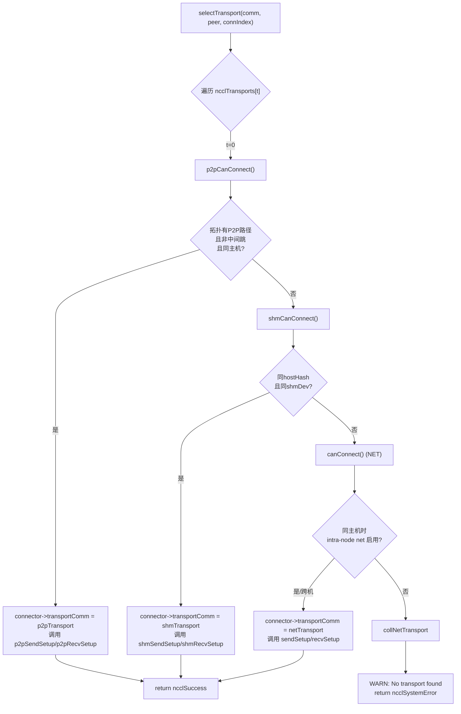
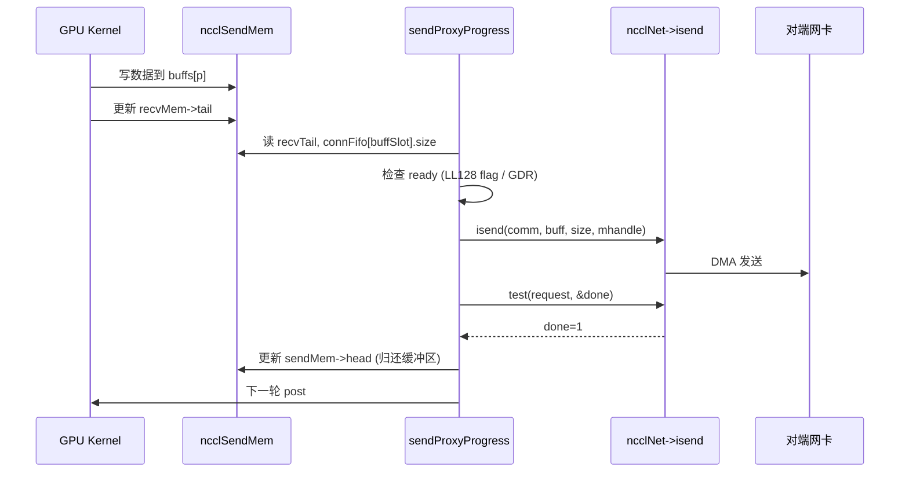

# 第 11 章：传输层抽象：P2P、SHM、NET、NVLS 如何统一在同一套接口下

上一章我们深入算法内核，看到 Ring AllReduce 如何将数据切分后两阶段归约，Tree AllReduce 又如何借助树形结构压低延迟——但这些算法只定义了「谁发给谁、发哪个 chunk」的逻辑视图。数据最终必须穿过真实的物理链路：NVLink、PCIe、共享内存或网卡。本章拆解 src/transport 目录，看 NCCL 如何用一套统一的 ncclTransport 接口，把 P2P、SHM、NET、NVLS 四种物理通道屏蔽成同一副面孔，完成从算法拓扑到物理传输的最后一公里。

## 一、统一接口：ncclTransport 如何屏蔽四种物理通道

### 直觉模型

想象一家物流公司：无论客户寄的是同城快递（P2P）、楼内传递（SHM）、跨省运输（NET）还是专线直达（NVLS），前台只填一张「运单」。这张运单就是 `ncclTransport` 结构体——它规定了每种运输方式必须提供 `canConnect`、`setup`、`connect`、`free` 等固定动作。若没有这层抽象，上层算法就得写四套 `if-else` 判断走哪条链路，新增一种硬件就要改遍所有算法。

### 数据结构与内存布局

NCCL 用一个全局数组登记所有 transport，顺序即优先级：

[FACT:src/transport.cc:15-20](https://github.com/NVIDIA/nccl/blob/12df1a11afad322be5a204a2db890161cbf8131d/src/transport.cc#L15-L20)

```c
struct ncclTransport* ncclTransports[NTRANSPORTS] = {
  &p2pTransport,
  &shmTransport,
  &netTransport,
  &collNetTransport,
};
```

数组顺序决定选择顺序：P2P 优先，其次 SHM，再次 NET，最后 CollNet。每种 transport 由 `ncclTransport` 结构体描述，它包含一个 `canConnect` 函数指针和两个 `ncclTransportComm`（send/recv 各一个）。以 P2P 为例：

[FACT:src/transport/p2p.cc:1493-1498](https://github.com/NVIDIA/nccl/blob/12df1a11afad322be5a204a2db890161cbf8131d/src/transport/p2p.cc#L1493-L1498)

```c
struct ncclTransport p2pTransport = {"P2P",
                                     p2pCanConnect,
                                     {p2pSendSetup, p2pSendConnect, p2pSendFree, NULL, p2pSendProxySetup, NULL,
                                      p2pSendProxyFree, NULL, p2pProxyRegister, p2pProxyDeregister},
                                     {p2pRecvSetup, p2pRecvConnect, p2pRecvFree, NULL, p2pRecvProxySetup, NULL,
                                      p2pRecvProxyFree, NULL, p2pProxyRegister, p2pProxyDeregister}};
```

`ncclTransportComm` 的字段顺序是固定的「生命周期槽位」：`setup`（准备资源）、`connect`（交换连接信息）、`free`（释放）、`proxySharedInit`（代理共享初始化）、`proxySetup`、`proxyConnect`、`proxyFree`、`proxyProgress`、`proxyRegister`、`proxyDeregister`。注意 P2P 的 `proxyProgress` 槽位是 `NULL`——因为 P2P 走的是 GPU 直接读写对端显存，不需要 host 代理线程搬运数据；而 NET 的 `proxyProgress` 是 `sendProxyProgress`/`recvProxyProgress`，因为网卡 I/O 必须由 host 线程驱动。

### 场景驱动 Walkthrough：一次连接如何选中 transport

当 NCCL 需要为某个 channel 的某个 peer 建立连接时，调用 `selectTransport`：

[FACT:src/transport.cc:23-44](https://github.com/NVIDIA/nccl/blob/12df1a11afad322be5a204a2db890161cbf8131d/src/transport.cc#L23-L44)

```c
template <int type>
static ncclResult_t selectTransport(struct ncclComm* comm, struct ncclTopoGraph* graph, struct ncclConnect* connect,
                                    int channelId, int peer, int connIndex, int* transportType) {
  struct ncclPeerInfo* myInfo = comm->peerInfo + comm->rank;
  struct ncclPeerInfo* peerInfo = comm->peerInfo + peer;
  struct ncclConnector* connector = (type == 1) ? comm->channels[channelId].peers[peer]->send + connIndex :
                                                  comm->channels[channelId].peers[peer]->recv + connIndex;
  for (int t = 0; t < NTRANSPORTS; t++) {
    struct ncclTransport* transport = ncclTransports[t];
    struct ncclTransportComm* transportComm = type == 1 ? &transport->send : &transport->recv;
    int ret = 0;
    NCCLCHECK(transport->canConnect(&ret, comm, graph, myInfo, peerInfo));
    if (ret) {
      connector->transportComm = transportComm;
      NCCLCHECK(transportComm->setup(comm, graph, myInfo, peerInfo, connect, connector, channelId, connIndex));
      if (transportType) *transportType = t;
      return ncclSuccess;
    }
  }
  WARN("No transport found for rank %d[%lx] -> rank %d[%lx]", myInfo->rank, myInfo->busId, peerInfo->rank,
       peerInfo->busId);
  return ncclSystemError;
}
```

`type==1` 表示 send 方向，`type==0` 表示 recv 方向。循环依次询问每种 transport 的 `canConnect`：返回 `ret=1` 表示「我能干这活」，立刻把 `connector->transportComm` 指向该 transport 的对应方向，并调用其 `setup`。若所有 transport 都返回 0，打印警告并返回 `ncclSystemError`。

`canConnect` 的判定逻辑体现了各 transport 的「领地边界」。以 P2P 为例：

[FACT:src/transport/p2p.cc:129-157](https://github.com/NVIDIA/nccl/blob/12df1a11afad322be5a204a2db890161cbf8131d/src/transport/p2p.cc#L129-L157)

```c
ncclResult_t p2pCanConnect(int* ret, struct ncclComm* comm, struct ncclTopoGraph* graph, struct ncclPeerInfo* info1,
                           struct ncclPeerInfo* info2) {
  initCeOperation();
  int intermediateRank;
  int isCrossClique;
  NCCLCHECK(ncclTopoCheckP2p(comm, comm->topo, info1->rank, info2->rank, ret, NULL, &intermediateRank, NULL,
                             &isCrossClique));
  if (*ret == 0) return ncclSuccess;
  if (intermediateRank != -1) {
    if (useMemcpy) *ret = 0;
    return ncclSuccess;
  }
  if (!isCrossClique) {
    int useNet = 0;
    NCCLCHECK(ncclTopoCheckNet(comm->topo, info1->rank, info2->rank, &useNet));
    if (useNet) {
      *ret = 0;
      return ncclSuccess;
    }
  }
  if (info1->hostHash != comm->peerInfo[comm->rank].hostHash || info1->hostHash != info2->hostHash) {
    return ncclSuccess;
  }
  ...
```

P2P 的判定链：先问拓扑「两个 rank 之间有没有 P2P 路径」；如果有中间跳（`intermediateRank != -1`）且启用了 CE memcpy，则放弃 P2P 让给 SHM/NET；如果拓扑建议走网络（`useNet`），也放弃；最后检查是否同主机。SHM 的判定更简单：

[FACT:src/transport/shm.cc:61-83](https://github.com/NVIDIA/nccl/blob/12df1a11afad322be5a204a2db890161cbf8131d/src/transport/shm.cc#L61-L83)

```c
static ncclResult_t shmCanConnect(int* ret, struct ncclComm* comm, struct ncclTopoGraph* graph,
                                  struct ncclPeerInfo* info1, struct ncclPeerInfo* info2) {
  *ret = 0;
  initShmLocality();
  if (ncclParamShmDisable() == 1) return ncclSuccess;
  int useNet = 0;
  NCCLCHECK(ncclTopoCheckNet(comm->topo, info1->rank, info2->rank, &useNet));
  if (useNet) return ncclSuccess;
  if (info1->hostHash != info2->hostHash) return ncclSuccess;
  if (info1->shmDev != info2->shmDev) return ncclSuccess;
  *ret = 1;
  return ncclSuccess;
}
```

SHM 要求同主机（`hostHash` 相同）且共享同一块 `/dev/shm`（`shmDev` 相同，用于容器间通信）。NET 则几乎总是返回 1，只在同主机时检查 intra-node net 是否被禁用：

[FACT:src/transport/net.cc:160-168](https://github.com/NVIDIA/nccl/blob/12df1a11afad322be5a204a2db890161cbf8131d/src/transport/net.cc#L160-L168)

```c
static ncclResult_t canConnect(int* ret, struct ncclComm* comm, struct ncclTopoGraph* graph, struct ncclPeerInfo* info1,
                               struct ncclPeerInfo* info2) {
  *ret = 1;
  if (info1->hostHash == info2->hostHash) {
    NCCLCHECK(ncclTopoCheckNet(comm->topo, info1->rank, info2->rank, ret));
  }
  return ncclSuccess;
}
```

NET 是「兜底」——只要前面没人接，它就接。NVLS 的 `canConnect` 直接返回 0：

[FACT:src/transport/nvls.cc:21-26](https://github.com/NVIDIA/nccl/blob/12df1a11afad322be5a204a2db890161cbf8131d/src/transport/nvls.cc#L21-L26)

```c
ncclResult_t nvlsCanConnect(int* ret, struct ncclComm* comm, struct ncclTopoGraph* graph, struct ncclPeerInfo* info1,
                            struct ncclPeerInfo* info2) {
  // This transport cannot be used for p2p
  *ret = 0;
  return ncclSuccess;
}
```

NVLS 不走常规的 peer-to-peer 连接路径，它通过 `ncclNvlsSetup` 单独建立多播组，所以 `canConnect` 永远返回 0。



### 设计思考

为什么用「数组顺序 + canConnect 投票」而不是显式路由表？[INFERENCE] 因为拓扑是动态的：同一台机器可能因 `NCCL_P2P_DISABLE`、容器隔离、CUDA IPC 可用性等因素导致 P2P 不可用，此时自动降级到 SHM 或 NET。投票机制让每种 transport 自己判断「我能不能干」，新增 transport 只需在数组里加一项，无需改动选择逻辑。这正是开闭原则在系统编程中的体现。

## 二、P2P：同机 GPU 直连的四种形态

### 直觉模型

P2P 是「邻居之间直接递东西」——GPU 0 直接读写 GPU 1 的显存，不经过 CPU 或网卡。若没有 P2P，同机多卡通信就得绕道 host 内存，延迟翻倍、带宽腰斩。

### 数据结构与内存布局

P2P 内部有四种形态，由 `enum p2pType` 区分：

[FACT:src/transport/p2p.cc:19-24](https://github.com/NVIDIA/nccl/blob/12df1a11afad322be5a204a2db890161cbf8131d/src/transport/p2p.cc#L19-L24)

```c
enum p2pType {
  P2P_DIRECT,
  P2P_INTERMEDIATE,
  P2P_IPC,
  P2P_CUMEM
};
```

- `P2P_DIRECT`：同进程内不同 GPU，直接用指针访问（最快）。
- `P2P_INTERMEDIATE`：两 GPU 之间没有直连，需经中间 GPU 转发。
- `P2P_IPC`：跨进程，用传统 `cudaIpcOpenMemHandle` 导入对端显存。
- `P2P_CUMEM`：跨进程，用 cuMem API（`cuMemExportToShareableHandle`）导入，支持更细粒度的内存管理。

核心资源结构体：

[FACT:src/transport/p2p.cc:79-94](https://github.com/NVIDIA/nccl/blob/12df1a11afad322be5a204a2db890161cbf8131d/src/transport/p2p.cc#L79-L94)

```c
struct p2pResources {
  enum p2pType type;
  union {
    struct ncclSendMem* sendDevMem;
    struct ncclRecvMem* recvDevMem;
  };
  void* sendMemIpc;
  int sendMemSameProc;
  void* recvMemIpc;
  int recvMemSameProc;
  // CE memcpy support
  struct p2pShmProxyInfo proxyInfo;
  struct p2pShm* shm;
  struct p2pShm* devShm;
  ncclShmIpcDesc_t desc;
};
```

`sendDevMem`/`recvDevMem` 是 union——发送方只关心 `sendDevMem`，接收方只关心 `recvDevMem`，共用一块内存。`sendMemIpc`/`recvMemIpc` 保存导入的对端内存句柄，`sendMemSameProc`/`recvMemSameProc` 标记是否同进程（决定释放时用 `ncclCuMemFreeAddr` 还是 `cudaIpcCloseMemHandle`）。

连接信息结构体 `p2pConnectInfo` 通过 bootstrap 交换：

[FACT:src/transport/p2p.cc:38-44](https://github.com/NVIDIA/nccl/blob/12df1a11afad322be5a204a2db890161cbf8131d/src/transport/p2p.cc#L38-L44)

```c
struct p2pConnectInfo {
  int rank;
  int read;
  struct ncclP2pBuff p2pBuff;
  // Used by CE memcpy
  ncclShmIpcDesc_t desc;
};
static_assert(sizeof(struct p2pConnectInfo) <= CONNECT_SIZE, "p2pConnectInfo is too large");
```

`static_assert` 保证连接信息不超过 `CONNECT_SIZE`（bootstrap 单次交换的固定缓冲区大小）。`read` 字段决定数据流向：`read=1` 表示接收方主动读发送方显存（P2P Read），`read=0` 表示发送方主动写接收方显存（P2P Write）。

### 场景驱动 Walkthrough：P2P Send 的建立

当 `selectTransport` 选中 P2P 后，调用 `p2pSendSetup`：

[FACT:src/transport/p2p.cc:393-471](https://github.com/NVIDIA/nccl/blob/12df1a11afad322be5a204a2db890161cbf8131d/src/transport/p2p.cc#L393-L471)

```c
ncclResult_t p2pSendSetup(struct ncclComm* comm, struct ncclTopoGraph* graph, struct ncclPeerInfo* myInfo,
                          struct ncclPeerInfo* peerInfo, struct ncclConnect* connectInfo, struct ncclConnector* send,
                          int channelId, int connIndex) {
  struct p2pResources* resources;
  struct ncclP2pRequest req;
  NCCLCHECK(ncclCalloc(&resources, 1));
  send->transportResources = resources;
  int useRead, intermediateRank;
  NCCLCHECK(p2pGetInfo(comm, myInfo, peerInfo, &useRead, &intermediateRank));
  if (useMemcpy) useRead = 0;
  ...
  int sendSize = sizeof(struct ncclSendMem);
  if (info->read) sendSize += comm->buffSizes[NCCL_PROTO_SIMPLE];
  ALIGN_SIZE(sendSize, CUDA_IPC_MIN);
  ...
```

关键点：`sendSize` 在 P2P Read 模式下要额外加上 SIMPLE 协议缓冲区大小——因为读模式下发送方的 SIMPLE buffer 被接收方直接读取，必须和 `ncclSendMem` 一起分配在同一块可共享内存里。`ALIGN_SIZE(sendSize, CUDA_IPC_MIN)` 保证大小对齐到 CUDA IPC 最小粒度。

接着根据 `intermediateRank` 和进程关系选择形态：

[FACT:src/transport/p2p.cc:416-437](https://github.com/NVIDIA/nccl/blob/12df1a11afad322be5a204a2db890161cbf8131d/src/transport/p2p.cc#L416-L437)

```c
  if (intermediateRank == -1) {
    info->rank = myInfo->rank;
    if (P2P_SAME_PID(myInfo, peerInfo) && ncclParamP2pDirectDisable() == 0 && useMemcpy == 0) {
      resources->type = P2P_DIRECT;
      ...
    } else {
      if (ncclCuMemEnable()) {
        resources->type = P2P_CUMEM;
        ...
      } else {
        resources->type = P2P_IPC;
        ...
      }
    }
    send->conn.flags |= info->read ? NCCL_P2P_READ : NCCL_P2P_WRITE;
  } else {
    resources->type = P2P_INTERMEDIATE;
    info->rank = intermediateRank;
    ...
  }
```

`P2P_SAME_PID` 宏判断同主机同进程：

[FACT:src/transport/p2p.cc:334-335](https://github.com/NVIDIA/nccl/blob/12df1a11afad322be5a204a2db890161cbf8131d/src/transport/p2p.cc#L334-L335)

```c
#define P2P_SAME_PID(MYINFO, PEERINFO) \
  ((MYINFO->hostHash == PEERINFO->hostHash) && (MYINFO->pidHash == PEERINFO->pidHash))
```

同进程且未禁用 direct 且未启用 memcpy，就是最快的 `P2P_DIRECT`——直接拿对端指针。否则走 IPC/CUMEM。

随后通过代理线程分配可共享缓冲区：

[FACT:src/transport/p2p.cc:457-468](https://github.com/NVIDIA/nccl/blob/12df1a11afad322be5a204a2db890161cbf8131d/src/transport/p2p.cc#L457-L468)

```c
  NCCLCHECK(ncclProxyConnect(comm, TRANSPORT_P2P, 1, info->rank, &send->proxyConn));
  if (useMemcpy) {
    NCCLCHECK(ncclProxyCallBlocking(comm, &send->proxyConn, ncclProxyMsgSetup, NULL, 0, &resources->proxyInfo,
                                    sizeof(struct p2pShmProxyInfo)));
    memcpy(&info->desc, &resources->proxyInfo.desc, sizeof(ncclShmIpcDesc_t));
  } else {
    NCCLCHECK(ncclProxyCallBlocking(comm, &send->proxyConn, ncclProxyMsgSetup, &req, sizeof(struct ncclP2pRequest),
                                    &info->p2pBuff, sizeof(struct ncclP2pBuff)));
    NCCLCHECK(p2pMap(comm, &send->proxyConn, myInfo, comm->peerInfo + info->rank, &info->p2pBuff,
                     (void**)&resources->sendDevMem, &resources->sendMemIpc));
    resources->sendMemSameProc = P2P_SAME_PID(myInfo, (comm->peerInfo + info->rank));
  }
```

`ncclProxyCallBlocking` 是同步 RPC：host 线程发消息给代理线程，代理线程调用 `p2pSendProxySetup` 分配可共享缓冲区，把 `ncclP2pBuff`（含 IPC 句柄）回传。然后 `p2pMap` 把对端缓冲区映射到本地地址空间。

`p2pMap` 是核心映射函数：

[FACT:src/transport/p2p.cc:349-390](https://github.com/NVIDIA/nccl/blob/12df1a11afad322be5a204a2db890161cbf8131d/src/transport/p2p.cc#L349-L390)

```c
static ncclResult_t p2pMap(struct ncclComm* comm, struct ncclProxyConnector* proxyConn, struct ncclPeerInfo* myInfo,
                           struct ncclPeerInfo* peerInfo, struct ncclP2pBuff* p2pBuff, void** devMem, void** ipcPtr) {
  if (P2P_SAME_PID(myInfo, peerInfo)) {
    if (peerInfo->cudaDev != myInfo->cudaDev) {
      cudaError_t err = cudaDeviceEnablePeerAccess(peerInfo->cudaDev, 0);
      ...
      if (ncclCuMemEnable()) {
        NCCLCHECK(ncclCuMemAllocAddr(devMem, &p2pBuff->ipcDesc.memHandle, p2pBuff->size));
        CUCHECK(cuMemRelease(p2pBuff->ipcDesc.memHandle));
        *ipcPtr = *devMem;
        ...
      } else {
        *devMem = p2pBuff->directPtr;
        *ipcPtr = NULL;
      }
    } else {
      *devMem = p2pBuff->directPtr;
      *ipcPtr = NULL;
    }
  } else {
    NCCLCHECK(ncclP2pImportShareableBuffer(comm, peerInfo->rank, p2pBuff->size, &p2pBuff->ipcDesc, devMem,
                                           p2pBuff->directPtr, ncclMemOffload));
    *ipcPtr = *devMem;
  }
  return ncclSuccess;
}
```

同进程不同 GPU：先 `cudaDeviceEnablePeerAccess` 打开 P2P 通道，然后直接用 `directPtr`（因为同进程地址空间共享）。跨进程：调用 `ncclP2pImportShareableBuffer` 导入对端内存句柄。

### 并发控制与硬件交互

P2P 的同步靠 `ncclSendMem`/`ncclRecvMem` 里的 `head`/`tail` 指针。发送方写 `head` 告诉接收方「我写到哪了」，接收方写 `tail` 告诉发送方「我读到哪了」。这是典型的无锁生产者-消费者：

[FACT:src/transport/p2p.cc:571-576](https://github.com/NVIDIA/nccl/blob/12df1a11afad322be5a204a2db890161cbf8131d/src/transport/p2p.cc#L571-L576)

```c
  } else {
    send->conn.tail = &remDevMem->tail;
    send->conn.head = &resources->sendDevMem->head;
    send->conn.ptrExchange = &resources->sendDevMem->ptrExchange;
    send->conn.redOpArgExchange = resources->sendDevMem->redOpArgExchange;
  }
```

`head` 指向本地 `sendDevMem`，`tail` 指向对端 `remDevMem`。GPU kernel 通过读写这两个指针实现跨 GPU 同步，无需 CPU 介入。

### 生产避坑指南

**坑 1：P2P Read 与 memcpy 互斥。** 看 `p2pSendConnect`：

[FACT:src/transport/p2p.cc:551-559](https://github.com/NVIDIA/nccl/blob/12df1a11afad322be5a204a2db890161cbf8131d/src/transport/p2p.cc#L551-L559)

```c
  for (int p = 0; p < NCCL_NUM_PROTOCOLS; p++) {
    if (info->read && p == NCCL_PROTO_SIMPLE) {
      /* For P2P Read the SIMPLE buffer is local (ncclSendMem) */
      if (resources->sendDevMem == NULL) return ncclInternalError; // We should not use read + memcpy
      send->conn.buffs[p] = (char*)(resources->sendDevMem + 1);
    } else {
      send->conn.buffs[p] = buff;
      buff += comm->buffSizes[p];
    }
  }
```

如果 `read=1` 但 `sendDevMem==NULL`，直接返回 `ncclInternalError`。生产环境若看到这个错误，检查是否同时设置了 `NCCL_P2P_READ_ENABLE=1` 和 `NCCL_P2P_USE_CUDA_MEMCPY=1`——这两者语义冲突。

**坑 2：跨进程释放顺序。** `p2pSendFree` 根据 `sendMemSameProc` 决定释放方式：

[FACT:src/transport/p2p.cc:624-651](https://github.com/NVIDIA/nccl/blob/12df1a11afad322be5a204a2db890161cbf8131d/src/transport/p2p.cc#L624-L651)

```c
ncclResult_t p2pSendFree(struct ncclComm* comm, struct ncclConnector* send) {
  struct p2pResources* resources = (struct p2pResources*)send->transportResources;
  if (resources) {
    if (ncclCuMemEnable()) {
      if (resources->sendMemIpc) {
        if (resources->sendMemSameProc) {
          NCCLCHECK(ncclCuMemFreeAddr(resources->sendMemIpc, comm->memManager));
        } else {
          NCCLCHECK(ncclCudaFree(resources->sendMemIpc, comm->memManager));
        }
      }
      ...
```

同进程用 `ncclCuMemFreeAddr`（只释放地址映射，不释放物理内存），跨进程用 `ncclCudaFree`（释放物理内存）。搞反会导致内存泄漏或 use-after-free。

## 三、SHM：共享内存的「谁出内存」之争

### 直觉模型

SHM 是「两个进程共用一块白板」——发送方写，接收方读。但白板放谁家？放发送方家（sender-side），接收方跑过来读；还是放接收方家（receiver-side），发送方跑过去写？这就是 `NCCL_SHM_LOCALITY` 参数要解决的问题。

### 数据结构与内存布局

[FACT:src/transport/shm.cc:28-34](https://github.com/NVIDIA/nccl/blob/12df1a11afad322be5a204a2db890161cbf8131d/src/transport/shm.cc#L28-L34)

```c
struct shmSendResources {
  struct ncclRecvMem* remHostMem;
  struct ncclRecvMem* devRemHostMem;
  ncclShmIpcDesc_t remDesc;
  struct ncclSendMem* hostMem;
  struct ncclSendMem* devHostMem;
};

struct shmRecvResources {
  struct ncclSendMem* remHostMem;
  struct ncclSendMem* devRemHostMem;
  ncclShmIpcDesc_t remDesc;
  struct ncclRecvMem* hostMem;
  struct ncclRecvMem* devHostMem;
};
```

注意 `hostMem` 和 `devHostMem` 成对出现：`hostMem` 是 host 侧指针，`devHostMem` 是设备侧指针（通过 UVA 或 cuMem 映射）。`remHostMem`/`devRemHostMem` 是对端共享内存的本地映射。

### 场景驱动 Walkthrough：SHM 的 locality 选择

`shmSendSetup` 根据 locality 决定分配多大内存：

[FACT:src/transport/shm.cc:88-119](https://github.com/NVIDIA/nccl/blob/12df1a11afad322be5a204a2db890161cbf8131d/src/transport/shm.cc#L88-L119)

```c
static ncclResult_t shmSendSetup(struct ncclComm* comm, struct ncclTopoGraph* graph, struct ncclPeerInfo* myInfo,
                                 struct ncclPeerInfo* peerInfo, struct ncclConnect* connectInfo,
                                 struct ncclConnector* send, int channelId, int connIndex) {
  struct shmSendResources* resources;
  struct shmConnectInfo* info = (struct shmConnectInfo*)connectInfo;
  size_t shmSize = sizeof(struct ncclSendMem);
  struct shmRequest req;

  NCCLCHECK(ncclCalloc(&resources, 1));
  send->transportResources = resources;

  if (shmLocality == SHM_SEND_SIDE) {
    for (int p = 0; p < NCCL_NUM_PROTOCOLS; p++) shmSize += comm->buffSizes[p];
  }
  req.size = shmSize;
  if (myInfo->hostHash == peerInfo->hostHash && myInfo->pidHash == peerInfo->pidHash) req.legacy = true;
  else req.legacy = false;

  NCCLCHECK(ncclProxyConnect(comm, TRANSPORT_SHM, 1, myInfo->rank, &send->proxyConn));
  NCCLCHECK(ncclProxyCallBlocking(comm, &send->proxyConn, ncclProxyMsgSetup, (void*)&req, sizeof(struct shmRequest),
                                  (void*)info, sizeof(struct shmConnectInfo)));

  info->rank = comm->rank;
  resources->hostMem = (struct ncclSendMem*)info->buf.hptr;
  resources->devHostMem = (struct ncclSendMem*)info->buf.dptr;
  ...
```

`shmLocality == SHM_SEND_SIDE` 时，发送方分配数据缓冲区（`shmSize` 加上所有协议缓冲区）；否则只分配 `ncclSendMem` 控制结构。`req.legacy` 标记是否同进程——同进程可以用传统 `mmap`，跨进程需要 cuMem 或 `/dev/shm` 文件。

`shmSendConnect` 里根据 locality 决定 `buffs` 指向本地还是对端：

[FACT:src/transport/shm.cc:153-176](https://github.com/NVIDIA/nccl/blob/12df1a11afad322be5a204a2db890161cbf8131d/src/transport/shm.cc#L153-L176)

```c
static ncclResult_t shmSendConnect(struct ncclComm* comm, struct ncclConnect* connectInfo, int nranks, int rank,
                                   struct ncclConnector* send) {
  struct shmConnectInfo* info = (struct shmConnectInfo*)connectInfo;
  struct shmSendResources* resources = (struct shmSendResources*)send->transportResources;
  char* buff;

  NCCLCHECK(ncclShmImportShareableBuffer(comm, info->rank, &info->desc, (void**)&resources->remHostMem,
                                         (void**)&resources->devRemHostMem, &resources->remDesc));

  buff = shmLocality == SHM_SEND_SIDE ? (char*)(resources->devHostMem + 1) : (char*)(resources->devRemHostMem + 1);
  for (int p = 0; p < NCCL_NUM_PROTOCOLS; p++) {
    send->conn.buffs[p] = buff;
    buff += comm->buffSizes[p];
  }
  send->conn.tail = &resources->devRemHostMem->tail;
  send->conn.head = &resources->devHostMem->head;
  send->conn.stepSize = comm->buffSizes[NCCL_PROTO_SIMPLE] / NCCL_STEPS;
  ...
```

`SHM_SEND_SIDE`：`buffs` 指向本地 `devHostMem`（发送方写自己的内存）；`SHM_RECV_SIDE`：`buffs` 指向对端 `devRemHostMem`（发送方写接收方的内存）。`head` 永远指向本地，`tail` 永远指向对端——因为发送方更新 `head`，接收方更新 `tail`。

### 设计思考

为什么默认 `SHM_RECV_SIDE`？[INFERENCE] 因为接收方通常需要把数据从共享内存拷贝到自己的 GPU 显存，如果共享内存在接收方本地，拷贝路径更短（本地内存 → 本地 GPU），避免跨 NUMA 访问。发送方写远程内存虽然多一次跨节点写，但发送方通常是计算密集的 GPU，写操作可以异步进行。

### 生产避坑指南

**坑：容器间 `/dev/shm` 不共享。** `shmCanConnect` 检查 `info1->shmDev != info2->shmDev`：

[FACT:src/transport/shm.cc:76-78](https://github.com/NVIDIA/nccl/blob/12df1a11afad322be5a204a2db890161cbf8131d/src/transport/shm.cc#L76-L78)

```c
  TRACE(NCCL_INIT | NCCL_SHM, "peer1 shmDev %lx peer2 shmDev %lx", info1->shmDev, info2->shmDev);
  if (info1->shmDev != info2->shmDev) return ncclSuccess;
```

如果两个容器挂载了不同的 `/dev/shm`，`shmDev` 不同，SHM 自动降级到 NET。生产环境若发现同主机通信却走了网络，检查容器的 `/dev/shm` 挂载是否一致。

## 四、NET：网络传输的映射表与代理进度

### 直觉模型

NET 是「跨城快递」——数据打包交给网卡，网卡通过光纤送到对端。但网卡不认识 GPU 显存地址，需要一张「地址映射表」把 GPU 虚拟地址翻译成网卡能理解的物理地址。这张表就是 `connectMap`。

### 数据结构与内存布局

[FACT:src/transport/net.cc:73-86](https://github.com/NVIDIA/nccl/blob/12df1a11afad322be5a204a2db890161cbf8131d/src/transport/net.cc#L73-L86)

```c
struct connectMapMem {
  char* gpuPtr;
  char* cpuPtr;
  ssize_t size;
  ncclIpcDesc ipcDesc;
  ncclShmIpcDesc_t attachDesc;
  ncclShmIpcDesc_t createDesc;
};

struct connectMap {
  int sameProcess;
  int shared;
  int cudaDev;
  // First 3 bits of offsets determine the mem bank. 001 is host mem, 011 is dev mem, 101 is shared host mem and 111
  // is shared dev mem.
  struct connectMapMem mems[NCCL_NET_MAP_MEMS];
  // Offsets. 3 MSBs indicate mem bank, 111 indicates NULL.
  struct {
    uint32_t sendMem;
    uint32_t recvMem;
    uint32_t buffs[NCCL_NUM_PROTOCOLS];
  } offsets;
};
```

`connectMap` 是一个「内存银行」系统：`mems` 数组有 5 个槽位（`NCCL_NET_MAP_MEMS=5`），分别对应 host mem、dev mem、shared host mem、shared dev mem、GDC mem。`offsets` 里的每个字段是一个 32 位整数，高 3 位编码「哪个银行」，低 29 位编码「银行内偏移」。

解码宏：

[FACT:src/transport/net.cc:36-46](https://github.com/NVIDIA/nccl/blob/12df1a11afad322be5a204a2db890161cbf8131d/src/transport/net.cc#L36-L46)

```c
#define NCCL_NET_MAP_OFFSET_BANK(mapStruct, offsetName) ((mapStruct)->offsets.offsetName >> 30)

#define NCCL_NET_MAP_OFFSET_NULL(mapStruct, offsetName) (((mapStruct)->offsets.offsetName >> 29) == 0)

#define NCCL_NET_MAP_GET_POINTER(mapStruct, cpuOrGpu, offsetName) \
  (NCCL_NET_MAP_OFFSET_NULL(mapStruct, offsetName) ? \
     NULL : \
     (mapStruct)->mems[NCCL_NET_MAP_OFFSET_BANK(mapStruct, offsetName)].cpuOrGpu##Ptr + \
       ((mapStruct)->offsets.offsetName & NCCL_NET_MAP_MASK_OFFSET))

#define NCCL_NET_MAP_DEV_MEM(mapStruct, offsetName) (((mapStruct)->offsets.offsetName & NCCL_NET_MAP_MASK_DEVMEM) != 0)
```

`NCCL_NET_MAP_GET_POINTER(map, gpu, sendMem)` 展开后：取 `offsets.sendMem` 的高 2 位作为 bank 索引，从 `mems[bank].gpuPtr` 加上低 29 位偏移，得到实际指针。这套编码把「哪个内存区域 + 区域内偏移」压缩进一个 32 位整数，节省了 `connectMap` 的传输大小。

### 场景驱动 Walkthrough：sendProxyConnect 的映射建立

`sendProxyConnect` 是 NET 最复杂的函数，负责建立网卡连接、分配缓冲区、注册内存：

[FACT:src/transport/net.cc:858-1041](https://github.com/NVIDIA/nccl/blob/12df1a11afad322be5a204a2db890161cbf8131d/src/transport/net.cc#L858-L1041)

```c
static ncclResult_t sendProxyConnect(struct ncclProxyConnection* connection, struct ncclProxyState* proxyState,
                                     void* reqBuff, int reqSize, void* respBuff, int respSize, int* done) {
  struct sendNetResources* resources = (struct sendNetResources*)(connection->transportResources);
  ...
  if (resources->shared) {
    // Shared buffers
    ...
    if (resources->maxRecvs > 1 && ncclParamNetSharedComms()) {
      // Connect or reuse connection for a netdev/remote rank.
      ...
      if (comms->sendComm[resources->channelId] == NULL &&
          comms->activeConnect[resources->channelId] == (resources->tpLocalRank + 1)) {
        ret = proxyState->ncclNet->connect(proxyState->netContext, resources->netDev, req->handle,
                                           comms->sendComm + resources->channelId, &resources->netDeviceHandle);
      }
      ...
```

`maxRecvs > 1` 时启用「共享连接」：多个 channel 复用同一个网卡连接，减少连接数。`activeConnect` 数组保证只有一个 local rank 发起连接，避免重复。

接着分配缓冲区并注册：

[FACT:src/transport/net.cc:933-956](https://github.com/NVIDIA/nccl/blob/12df1a11afad322be5a204a2db890161cbf8131d/src/transport/net.cc#L933-L956)

```c
  if (resources->shared == 0) {
    // Only allocate dedicated buffers for ring/tree, not for p2p
    for (int p = 0; p < NCCL_NUM_PROTOCOLS; p++) {
      NCCL_NET_MAP_ADD_POINTER(map, 0, p != NCCL_PROTO_LL && resources->useGdr ? 1 : 0, proxyState->buffSizes[p],
                               buffs[p]);
      resources->buffSizes[p] = proxyState->buffSizes[p];
    }
  } else {
    // Get shared buffers
    int bank = resources->useGdr ? NCCL_NET_MAP_SHARED_DEVMEM : NCCL_NET_MAP_SHARED_HOSTMEM;
    struct connectMapMem* mapMem = map->mems + bank;
    NCCLCHECK(sharedNetBuffersInit(proxyState, resources->useGdr, resources->tpLocalRank, 0, map->sameProcess,
                                   proxyState->p2pnChannels, &mapMem->gpuPtr, &mapMem->cpuPtr, &mapMem->size,
                                   &mapMem->ipcDesc));
    resources->buffSizes[NCCL_PROTO_SIMPLE] = mapMem->size;
    ...
```

`NCCL_NET_MAP_ADD_POINTER` 宏把缓冲区登记到 `connectMap`：

[FACT:src/transport/net.cc:48-62](https://github.com/NVIDIA/nccl/blob/12df1a11afad322be5a204a2db890161cbf8131d/src/transport/net.cc#L48-L62)

```c
#define NCCL_NET_MAP_ADD_POINTER(mapStruct, shared, dev, memSize, offsetName) \
  do { \
    int bank = NCCL_NET_MAP_MASK_USED + (dev) * NCCL_NET_MAP_MASK_DEVMEM + (shared) * NCCL_NET_MAP_MASK_SHARED; \
    if ((shared) == 0) { \
      if (dev) { \
        (mapStruct)->offsets.offsetName = bank + (mapStruct)->mems[NCCL_NET_MAP_DEVMEM].size; \
        (mapStruct)->mems[NCCL_NET_MAP_DEVMEM].size += memSize; \
      } else { \
        (mapStruct)->offsets.offsetName = bank + (mapStruct)->mems[NCCL_NET_MAP_HOSTMEM].size; \
        (mapStruct)->mems[NCCL_NET_MAP_HOSTMEM].size += memSize; \
      } \
    } else { \
      (mapStruct)->offsets.offsetName = bank; \
    } \
  } while (0);
```

非共享缓冲区：把当前 bank 的 `size` 作为偏移写入 `offsets`，然后 `size += memSize`——这是 bump allocator。共享缓冲区：直接写 bank 编号，偏移为 0（因为共享缓冲区整块就是一个 bank）。

最后注册内存给网卡：

[FACT:src/transport/net.cc:1004-1035](https://github.com/NVIDIA/nccl/blob/12df1a11afad322be5a204a2db890161cbf8131d/src/transport/net.cc#L1004-L1035)

```c
  for (int p = 0; p < NCCL_NUM_PROTOCOLS; p++) {
    resources->buffers[p] = NCCL_NET_MAP_GET_POINTER(map, cpu, buffs[p]);
    if (resources->buffers[p]) {
#if CUDA_VERSION >= 11070
      int type = NCCL_NET_MAP_DEV_MEM(map, buffs[p]) ? NCCL_PTR_CUDA : NCCL_PTR_HOST;
      if (type == NCCL_PTR_CUDA && resources->useDmaBuf) {
        int dmabuf_fd;
        size_t dmaBufSize = resources->buffSizes[p];
        ALIGN_SIZE(dmaBufSize, ncclOsGetPageSize());
        CUCHECK(cuMemGetHandleForAddressRange((void*)&dmabuf_fd, (CUdeviceptr)resources->buffers[p], dmaBufSize,
                                              CU_MEM_RANGE_HANDLE_TYPE_DMA_BUF_FD,
                                              getHandleForAddressRangeFlags(resources->useGdr)));
        NCCLCHECK(proxyState->ncclNet->regMrDmaBuf(resources->netSendComm, resources->buffers[p],
                                                   resources->buffSizes[p], type, 0ULL, dmabuf_fd,
                                                   &resources->mhandles[p]));
        (void)close(dmabuf_fd);
      } else
#endif
      {
        NCCLCHECK(proxyState->ncclNet->regMr(resources->netSendComm, resources->buffers[p], resources->buffSizes[p],
                                             NCCL_NET_MAP_DEV_MEM(map, buffs[p]) ? NCCL_PTR_CUDA : NCCL_PTR_HOST,
                                             &resources->mhandles[p]));
      }
      ...
```

优先走 DMA-BUF 路径（`cuMemGetHandleForAddressRange` 拿到 fd，传给网卡插件），失败则回退到 `regMr`（传统 nv_peermem GDR）。

### 并发控制与硬件交互：sendProxyProgress 的三段式流水线

`sendProxyProgress` 是 NET 的数据搬运引擎，采用「post → transmit → done」三段式：

[FACT:src/transport/net.cc:1324-1491](https://github.com/NVIDIA/nccl/blob/12df1a11afad322be5a204a2db890161cbf8131d/src/transport/net.cc#L1324-L1491)

```c
static ncclResult_t sendProxyProgress(struct ncclProxyState* proxyState, struct ncclProxyArgs* args) {
  ...
  if (args->state == ncclProxyOpProgress) {
    int p = args->protocol;
    int maxDepth = std::min(NCCL_STEPS, NCCL_SHARED_STEPS / args->nsubs);
    for (int s = 0; s < args->nsubs; s++) {
      struct ncclProxySubArgs* sub = args->subs + s;
      ...
      // Post buffers to the GPU
      if (sub->posted < sub->nsteps && sub->posted < sub->done + maxDepth) {
        ...
        if (resources->shared) {
          ...
          volatile uint64_t* sendHead = resources->gdcSync ? resources->gdcSync : &resources->sendMem->head;
          sub->posted += args->sliceSteps;
          *sendHead = sub->base + sub->posted - NCCL_STEPS;
          if (resources->gdcSync) wc_store_fence(); // Flush out WC write
        } else {
          sub->posted += args->sliceSteps;
        }
        ...
        continue;
      }
      // Check whether we received data from the GPU and send it to the network
      if (sub->transmitted < sub->posted && sub->transmitted < sub->done + NCCL_STEPS) {
        ...
        if (connFifo[buffSlot].size != -1 && (*recvTail > tail || p == NCCL_PROTO_LL)) {
          ...
          if (ready) {
            ...
            NCCLCHECK(proxyState->ncclNet->isend(resources->netSendComm, buff, size, resources->tpRank,
                                                 sub->sendMhandle, phandle, sub->requests + buffSlot));
            ...
```

- **post**：代理线程更新 `sendMem->head`，告诉 GPU「缓冲区已就绪，可以写数据」。
- **transmit**：检查 `recvMem->tail` 是否推进（GPU 已写完），检查 `connFifo[buffSlot].size != -1`（数据大小已填），然后调用 `ncclNet->isend` 发起异步发送。
- **done**：调用 `ncclNet->test` 检查发送完成，更新 `sendMem->head` 归还缓冲区。

`wc_store_fence()` 是写合并屏障——GDRCopy 场景下，CPU 写 `gdcSync` 后必须刷新写合并缓冲区，否则 GPU 看不到更新。

### 生产避坑指南

**坑 1：LL128 协议的 flag 校验。** 当数据在 sysmem（非 GDR）时，代理线程必须逐行检查 LL128 flag：

[FACT:src/transport/net.cc:1388-1403](https://github.com/NVIDIA/nccl/blob/12df1a11afad322be5a204a2db890161cbf8131d/src/transport/net.cc#L1388-L1403)

```c
          if (p == NCCL_PROTO_LL128) {
            ready = resources->useGdr;
            if (!ready) {
              uint64_t flag = sub->base + sub->transmitted + 1;
              int nFifoLines = DIVUP(connFifo[buffSlot].size, sizeof(uint64_t) * NCCL_LL128_LINEELEMS);
              volatile uint64_t* lines = (volatile uint64_t*)buff;
              ready = 1;
              for (int i = 0; i < nFifoLines; i++) {
                if (lines[i * NCCL_LL128_LINEELEMS + NCCL_LL128_DATAELEMS] != flag) {
                  ready = 0;
                  break;
                }
              }
            }
          }
```

因为 GPU 只调用了 `threadfence()`，数据可能还在 L2 缓存里没落到 sysmem。代理线程必须确认每一行的 flag 都正确，才能发送。生产环境若发现 LL128 数据损坏，检查 `useGdr` 是否正确——GDR 路径下数据直接落显存，不需要逐行校验。

**坑 2：GDRCopy flush 的内存序。** 接收侧在 `recvProxyProgress` 里有一段精妙的内联汇编：

[FACT:src/transport/net.cc:1664-1682](https://github.com/NVIDIA/nccl/blob/12df1a11afad322be5a204a2db890161cbf8131d/src/transport/net.cc#L1664-L1682)

```c
          if (totalSize > 0 && p == NCCL_PROTO_SIMPLE && needFlush) {
            struct recvNetResources* resources = (struct recvNetResources*)(subGroup->connection->transportResources);
            if (resources->gdcFlush) {
#if defined(__x86_64__)
              asm volatile("mfence" ::: "memory");
              asm volatile("mov (%0), %%eax" ::"l"(resources->gdcFlush) : "%eax", "memory");
#else
              std::atomic_thread_fence(std::memory_order_seq_cst);
              uint64_t dummy;
              NCCLCHECK(ncclGdrCudaRead(resources->gdrDesc, &dummy, resources->gdcFlush, sizeof(dummy)));
#endif
            }
```

`mfence` 保证 CQE poll 的读不会重排到 flush 读之前；`mov (%0), %%eax` 强制发起一次 PCIe 读，让 CPU 停顿直到所有先前的 PCIe posted write（包括网卡 DMA）都提交。这是 GDRCopy 场景下防止「网卡说写完了但数据还在 PCIe 缓冲区」的关键。去掉这段，接收方可能读到旧数据。



## 五、NVLS：多播组与 UC/MC 内存绑定

### 直觉模型

NVLS 是「广播电台」——一个 rank 把数据写到多播组，硬件自动复制给所有订阅者。传统 AllReduce 需要 N-1 次点对点传输，NVLS 只需 1 次多播写 + 1 次多播读。若没有 NVLS，大规模 AllReduce 的延迟随 rank 数线性增长。

### 数据结构与内存布局

NVLS 的核心是「UC（单播）内存」和「MC（多播）内存」的绑定。`nvlsAllocBindUc` 分配 UC 内存并绑定到 MC 组：

[FACT:src/transport/nvls.cc:225-277](https://github.com/NVIDIA/nccl/blob/12df1a11afad322be5a204a2db890161cbf8131d/src/transport/nvls.cc#L225-L277)

```c
static ncclResult_t nvlsAllocBindUc(struct ncclComm* comm, const struct ncclMcPartition* partition, size_t size,
                                    struct ncclNvlsUcSegment* outUc) {
  CUmemAllocationProp ucprop;
  ...
  ucprop.type = CU_MEM_ALLOCATION_TYPE_PINNED;
  ucprop.location.type = CU_MEM_LOCATION_TYPE_DEVICE;
  ucprop.location.id = comm->cudaDev;
  ucprop.requestedHandleTypes = ncclCuMemHandleType;
  CUCHECKGOTO(cuMemGetAllocationGranularity(&ucgran, &ucprop, CU_MEM_ALLOC_GRANULARITY_RECOMMENDED), ret, fail);
  ALIGN_SIZE(ucsize, ucgran);
  CUCHECKGOTO(cuMemAddressReserve((CUdeviceptr*)&ucptr, ucsize, ucgran, 0U, 0), ret, fail);
  CUCHECKGOTO(cuMemCreate(&ucHandle, ucsize, &ucprop, 0), ret, fail1);
  CUCHECKGOTO(cuMemMap((CUdeviceptr)ucptr, ucsize, 0, ucHandle, 0), ret, fail2);
  CUCHECKGOTO(cuMemSetAccess((CUdeviceptr)ucptr, ucsize, &comm->nvlsResources->accessDesc, 1), ret, fail3);
  CUDACHECKGOTO(cudaMemset(ucptr, 0, ucsize), ret, fail3);
  NCCLCHECKGOTO(ncclMemTrack(comm->memManager, ucptr, ucsize, ucHandle, ncclCuMemHandleType, ncclMemPersist), ret,
                fail3);
  NCCLCHECKGOTO(bootstrapIntraNodeBarrier(comm->bootstrap, comm->localRankToRank, comm->localRank, comm->localRanks,
                                          comm->localRankToRank[0]),
                ret, fail3);
  NCCLCHECKGOTO(ncclMcPartitionBindMem(partition, 0 /*offsetInPartition*/, ucHandle, 0 /*memOffset*/, ucsize), ret,
                fail3);
  ...
```

流程：`cuMemCreate` 分配物理内存 → `cuMemMap` 映射到虚拟地址 → `cuMemSetAccess` 设置 GPU 访问权限 → `ncclMcPartitionBindMem` 把 UC 物理内存绑定到 MC 组的指定偏移。绑定后，任何 rank 写 MC 地址，硬件会把数据复制到所有绑定的 UC 内存。

注意 `bootstrapIntraNodeBarrier` 在 `cuMulticastBindMem` 之前——注释说这是为了「mitigate the possible hang in cuMulticastBindMem during abort」。这是硬件层面的防御：如果某个 rank 在绑定过程中 abort，其他 rank 可能在 `cuMulticastBindMem` 里挂起。

### 场景驱动 Walkthrough：ncclNvlsBufferSetup 的缓冲区布局

[FACT:src/transport/nvls.cc:279-368](https://github.com/NVIDIA/nccl/blob/12df1a11afad322be5a204a2db890161cbf8131d/src/transport/nvls.cc#L279-L368)

```c
ncclResult_t ncclNvlsBufferSetup(struct ncclComm* comm) {
  ...
  nvlsStepSize = comm->nvlsChunkSize;
  buffSize = nvlsStepSize * NCCL_STEPS;
  nvlsPerRankSize = nChannels * 2 * buffSize;
  nvlsTotalSize = nvlsPerRankSize * nHeads;
  ...
  if (resources->dataUc.ptr == NULL) {
    NCCLCHECKGOTO(nvlsAllocBindUc(comm, &resources->dataPartition, nvlsTotalSize, &resources->dataUc), res, fail);
  }
  ...
  for (int h = 0; h < nHeads; h++) {
    int nvlsPeer = comm->nRanks + 1 + h;
    for (int c = 0; c < nChannels; c++) {
      struct ncclChannel* channel = comm->channels + c;
      struct ncclChannelPeer* peer = channel->peers[nvlsPeer];

      // Reduce UC -> MC
      peer->send[1].conn.buffs[NCCL_PROTO_SIMPLE] = (char*)resources->dataUc.ptr + (h * 2 * nChannels + c) * buffSize;
      peer->recv[0].conn.buffs[NCCL_PROTO_SIMPLE] =
        (char*)resources->dataPartition.ptr + (h * 2 * nChannels + c) * buffSize;

      // Broadcast MC -> UC
      peer->recv[1].conn.buffs[NCCL_PROTO_SIMPLE] =
        (char*)resources->dataUc.ptr + ((h * 2 + 1) * nChannels + c) * buffSize;
      peer->send[0].conn.buffs[NCCL_PROTO_SIMPLE] =
        (char*)resources->dataPartition.ptr + ((h * 2 + 1) * nChannels + c) * buffSize;
      ...
```

缓冲区布局：每个 head 有 `2 * nChannels` 个 buffer（一半用于 reduce，一半用于 broadcast）。`send[1]` 和 `recv[0]` 是 reduce 方向（UC → MC），`recv[1]` 和 `send[0]` 是 broadcast 方向（MC → UC）。`dataUc.ptr` 是本地 UC 内存，`dataPartition.ptr` 是 MC 组映射地址。

### 设计思考

为什么 NVLS 的 `canConnect` 返回 0？[INFERENCE] 因为 NVLS 不是点对点传输——它是「一对多」的多播模型。`selectTransport` 的循环是为点对点连接设计的，NVLS 的连接建立走 `ncclNvlsSetup` 独立路径。把 NVLS 放进 `ncclTransports` 数组只是为了统一 `free` 接口（`nvlsSendFree`/`nvlsRecvFree`），实际连接逻辑完全独立。

### 生产避坑指南

**坑：MNNVL 不支持 NVLS buffer 注册。** 看 `ncclNvlsSetup`：

至此，NCCL 通过 ncclTransport 抽象层，成功将 P2P、SHM、NET、NVLS 四种异构通道统一为一致的接口，算法内核无需关心底层是 NVLink 还是网卡。但传输层只解决了「通道如何抽象」，尚未回答「数据如何被异步驱动」。下一章我们将聚焦 src/proxy.cc 与 src/include/proxy.h，看 proxy 线程如何在 host 侧异步推进网络收发，与 GPU kernel 形成生产者-消费者关系，揭开 NCCL 异步性的关键机制。