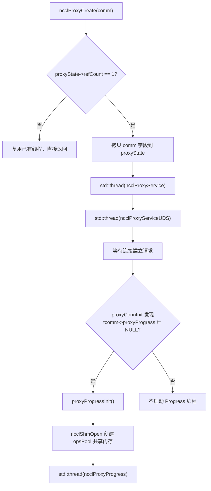
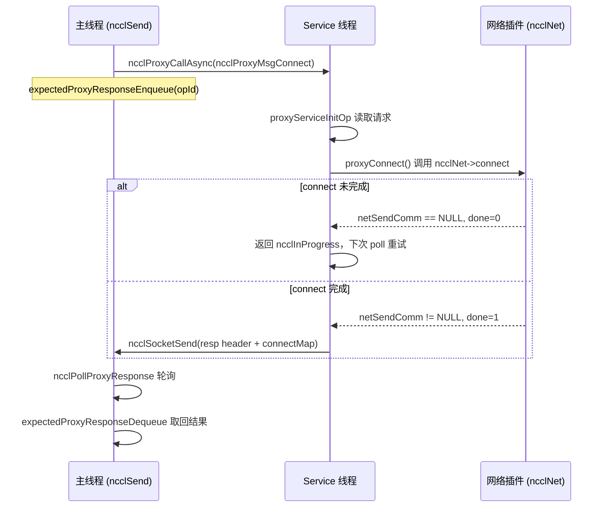
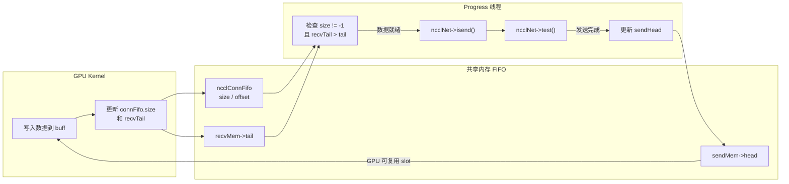

# 第 12 章：代理线程异步调度：proxy.cc 如何解耦 I/O 与 kernel 执行

上一章拆解了 transport 抽象层，看到 NCCL 如何用统一接口屏蔽 P2P/SHM/NET/NVLS 的差异。但传输层只回答了「数据走哪条通道」，尚未回答「数据如何被异步驱动」。GPU kernel 若直接阻塞在网络等待上，计算单元就会被 I/O 拖死。本章聚焦 `src/proxy.cc` 与 `src/include/proxy.h`，看 NCCL 如何用独立的 host 线程把网络 I/O 从 kernel 执行路径中剥离出来，与 GPU 形成生产者-消费者关系。

## 12.1 为什么需要代理线程：从「谁等网络」说起

### 直觉模型

想象一家餐厅：厨房（GPU kernel）只负责做菜，传菜员（proxy 线程）负责把菜端给客人（网络对端）。如果让厨师亲自端菜，他每端一趟就得停下炒菜，出餐速度暴跌。NCCL 的 proxy 就是那个专职传菜员——kernel 只管往共享缓冲区里写数据、从缓冲区里读数据，网络收发的脏活累活全交给 host 侧的 proxy 线程。

若没有 proxy，系统会面临什么灾难？[INFERENCE] GPU kernel 是 SIMT 大规模并行的，一个 warp 阻塞在网络轮询上会浪费整个 SM 的算力；更致命的是，网络收发涉及 socket 系统调用、verbs 轮询、DMA 描述符提交，这些操作根本无法在 device 代码里执行。因此 NCCL 必须把网络 I/O 搬到 host，让 kernel 与 proxy 通过共享内存中的 FIFO 交换「数据就绪」信号。

### 两类线程的分工

NCCL 在 host 侧启动了两类 proxy 线程，职责截然不同：

- **Service 线程**（`ncclProxyService`）：处理控制面请求——连接建立、内存注册、FD 查询。它监听一个 socket，接收来自本地 rank 的 RPC 请求，异步推进 setup/connect 等操作。
- **Progress 线程**（`ncclProxyProgress`）：处理数据面——真正驱动网络收发。它从共享内存池里取 proxy op，调用 transport 的 `proxyProgress` 回调推进数据搬运。

[FACT:src/include/proxy.h:343-345] 显示 `ncclProxyState` 同时持有 `thread`（Service）和 `threadUDS`（UDS 服务），而 Progress 线程的句柄藏在 `progressState.thread` 里 [FACT:src/include/proxy.h:261-261]。

### 生产者-消费者关系的建立

[FACT:src/proxy.cc:2130-2166] 的 `ncclProxyCreate` 是线程诞生的地方：当 `refCount == 1`（首个 comm 创建）时，它把 comm 的关键字段拷贝进 `proxyState`，然后启动 Service 线程和 UDS 线程。注意 Progress 线程不在这里启动——它由 `proxyProgressInit` 在首次需要 proxy progress 的连接建立时才懒启动 [FACT:src/proxy.cc:1523-1524]。



这张图锚定了线程启动的真实分支：只有 `tcomm->proxyProgress` 非空（即该 transport 需要数据面推进）时，Progress 线程才会被创建。

## 12.2 数据结构与内存布局：共享内存池与 op 池

### 核心结构体全景

proxy 的并发模型建立在两块共享内存之上，理解它们的内存布局是理解整个机制的前提。

**第一块：`ncclProxyOpsPool`**（[FACT:src/include/proxy.h:218-226]）。这是主线程与 Progress 线程之间的「任务投递箱」，通过 `/dev/shm` 跨进程共享。

| 字段 | 类型 | 作用 |
|------|------|------|
| `ops[]` | `ncclProxyOp[]` | 预分配的 op 数组，大小 `MAX_OPS_PER_PEER * NCCL_MAX_LOCAL_RANKS` |
| `nextOps` | `volatile int` | 待处理 op 链表头索引，-1 表示空 |
| `nextOpsEnd` | `volatile int` | 待处理 op 链表尾索引 |
| `freeOps[]` | `volatile int[]` | 每个 local rank 的空闲 op 链表头 |
| `syncObjectsInitialized` | `int` | 标记 mutex/cond 是否已初始化 |
| `mutex` / `cond` | `std::mutex` / `std::condition_variable` | 跨进程同步原语 |

`MAX_OPS_PER_PEER` 的定义 [FACT:src/include/proxy.h:218-226] 是 `2 * MAXCHANNELS * 2 * NCCL_MAX_DEV_WORK_P2P_PER_BATCH`。注释解释了为什么是 2 倍：每个 p2p work 包含一个 send 和一个 recv proxy op，所以要乘 2；再乘 2 是为了能存两轮完整操作，否则无法「投递一半、释放一半」。

**第二块：`ncclProxyArgs`**（[FACT:src/include/proxy.h:174-209]）。这是 Progress 线程内部使用的「运行时 op 描述」，从 `ncclProxyPool` 里分配，不跨进程共享。

关键字段：
- `subs[NCCL_PROXY_MAX_SUBS]`：子操作数组，`NCCL_PROXY_MAX_SUBS = MAXCHANNELS` [FACT:src/include/proxy.h:55-55]。多个 channel 的同类操作会被聚合到一个 args 的多个 sub 里。
- `progress`：函数指针，指向 transport 的 `proxyProgress` 回调 [FACT:src/include/proxy.h:176-176]。
- `next` / `nextPeer` / `proxyAppendPtr`：三根链表指针，构成复杂的 op 组织关系。
- `state`：`ncclProxyOpNone` / `ncclProxyOpReady` / `ncclProxyOpProgress` 三态 [FACT:src/include/proxy.h:48-52]。

### 内存池的分层设计

`ncclProxyPool` [FACT:src/proxy.cc:50-53] 是一个批量分配单元，每个 pool 含 `PROXYARGS_ALLOCATE_SIZE`（即 `NCCL_MAX_OPS`）个 `ncclProxyArgs`。`allocateArgs` [FACT:src/proxy.cc:207-231] 的分配逻辑值得细看：

```c
if (state->pool == NULL) {
    struct ncclProxyPool* newPool;
    NCCLCHECK(ncclCalloc(&newPool, 1));
    struct ncclProxyArgs* newElems = newPool->elems;
    for (int i = 0; i < PROXYARGS_ALLOCATE_SIZE; i++) {
      if (i + 1 < PROXYARGS_ALLOCATE_SIZE) newElems[i].next = newElems + i + 1;
    }
    state->pool = newElems;
    newPool->next = state->pools;
    state->pools = newPool;
}
elem = state->pool;
state->pool = state->pool->next;
```

[FACT:src/proxy.cc:207-231]

这里的设计动机是 [INFERENCE]：`ncclProxyArgs` 结构体很大（含 `subs[MAXCHANNELS]` 数组，每个 sub 又有 `requests[NCCL_STEPS]`），如果每个 op 单独 malloc，会造成严重的内存碎片和分配开销。批量分配 + 空闲链表复用，把分配成本摊薄到几乎为零。注释「Make sure we allocate the memory close to the network thread」暗示这是为了 NUMA 亲和性——pool 在 Progress 线程首次分配时创建，天然靠近该线程运行的 CPU。

### 伪共享与原子变量

`ncclProxyOpsPool` 里的 `nextOps`、`nextOpsEnd`、`freeOps[]` 都是 `volatile int`。它们被主线程和 Progress 线程同时读写，但 NCCL 没有用锁保护所有访问——而是用原子操作 + 内存序来保证正确性。

看 `ncclLocalOpAppend` 里从 freeOps 取空闲 op 的逻辑 [FACT:src/proxy.cc:503-513]：

```c
int freeOp = -1;
while (freeOp == -1) {
  freeOp = COMPILER_ATOMIC_EXCHANGE(&pool->freeOps[tpLocalRank], -1, std::memory_order_acquire);
  if (freeOp == -1) std::this_thread::yield();
}
```

主线程用 `atomic_exchange` 把 `freeOps[tpLocalRank]` 置为 -1 并取回旧值——这是一个「抢占式取用」：谁先 exchange 成功谁拿到整条空闲链表。Progress 线程归还 op 时用 CAS 循环 [FACT:src/proxy.cc:898-907]：

```c
oldFree = COMPILER_ATOMIC_LOAD(&pool->freeOps[i], std::memory_order_acquire);
do {
  pool->ops[freeOpEnd[i]].next = oldFree;
} while (!COMPILER_ATOMIC_COMPARE_EXCHANGE(&pool->freeOps[i], &oldFree, newFree,
                                           std::memory_order_release,
                                           std::memory_order_acquire));
```

[INFERENCE] 这里用 acquire/release 而非 seq_cst，是因为只需要保证「链表节点的 next 指针写入」对取用方可见，不需要全局顺序。`freeOps[]` 数组每个元素对应一个 local rank，天然分散在不同缓存行附近，减少了伪共享。

## 12.3 控制面：连接建立与 RPC 机制

### 直觉模型

Service 线程像一个「前台接待」：本地 rank 要建立网络连接时，不是自己直接去连，而是发一个 RPC 请求给 Service 线程，由它代为执行 setup/connect。为什么要这样？[INFERENCE] 因为网络连接建立（尤其是 verbs 的 QP 创建、内存注册）可能阻塞，而且某些资源（如 listen socket）必须由单一线程持有。把控制面集中到 Service 线程，主线程就能非阻塞地继续做别的事。

### RPC 请求的编码

`ncclProxyCallAsync` [FACT:src/proxy.cc:1369-1394] 是 RPC 的发送端。它通过 socket 依次发送：type、connection 指针、reqSize、respSize、reqBuff、opId。

```c
NCCLCHECKGOTO(ncclSocketSend(sock, &type, sizeof(int)), ret, error);
NCCLCHECKGOTO(ncclSocketSend(sock, &proxyConn->connection, sizeof(void*)), ret, error);
NCCLCHECKGOTO(ncclSocketSend(sock, &reqSize, sizeof(int)), ret, error);
NCCLCHECKGOTO(ncclSocketSend(sock, &respSize, sizeof(int)), ret, error);
if (reqSize) NCCLCHECKGOTO(ncclSocketSend(sock, reqBuff, reqSize), ret, error);
NCCLCHECKGOTO(ncclSocketSend(sock, &opId, sizeof(opId)), ret, error);
NCCLCHECK(expectedProxyResponseEnqueue(sharedProxyState, opId, respSize));
```

[FACT:src/proxy.cc:1369-1394]

注意最后一步：发送完请求后，立刻把 opId 登记到 `expectedResponses` 队列。这是异步 RPC 的关键——调用方不等回复，而是先登记「我期待这个 opId 的响应」，之后用 `ncclPollProxyResponse` 轮询。

### 响应队列的链表实现

`expectedProxyResponseEnqueue` [FACT:src/proxy.cc:97-117] 用单向链表存储待响应的 op。`expectedProxyResponseStore` [FACT:src/proxy.cc:67-95] 在收到响应时按 opId 匹配，把响应数据 memcpy 进预分配的 `respBuff`，标记 `done = true`。`expectedProxyResponseDequeue` [FACT:src/proxy.cc:119-141] 在轮询时查找已完成的响应并摘除。

这里有个细节：`expectedProxyResponseStore` 检查 `respSize` 是否匹配 [FACT:src/proxy.cc:72-75]，不匹配就报 `ncclInternalError`。这是防御性编程——如果请求方和响应方对响应大小的理解不一致，说明协议错乱，必须立即失败而非静默继续。

### Service 线程的主循环

`ncclProxyService` [FACT:src/proxy.cc:1789-2016] 的核心是一个 poll 循环。它用 `pollfds` 数组管理所有连接，包括 listen socket 和每个 peer 的 socket。

```c
while (stop == PROXY_RUNNING || npeers > 0) {
    if (COMPILER_ATOMIC_LOAD(proxyState->abortFlag, std::memory_order_acquire) != 0) stop = PROXY_ABORT;
    int ret = 0;
    const int timeout = asyncOpCount ? 0 : 500;
    ...
    ret = poll(activePollfds, nfds_to_poll, timeout);
```

[FACT:src/proxy.cc:1842-1863]

`timeout` 的选择很讲究：如果有异步 op 在推进（`asyncOpCount > 0`），timeout 设为 0（非阻塞轮询），因为需要频繁调用 `proxyProgressAsync` 推进它们；否则设 500ms，避免空转烧 CPU。注释「never let proxy service thread blocks in poll, or it cannot receive abortFlag」[FACT:src/proxy.cc:1847-1847] 点明了为什么不能无限阻塞——必须周期性醒来检查 abortFlag。

### 异步 op 的推进

`proxyProgressAsync` [FACT:src/proxy.cc:1626-1700] 是 Service 线程推进异步操作的核心。它根据 op 类型分发到不同的 transport 回调：

```c
if (op->type == ncclProxyMsgSetup) {
    res = op->connection->tcomm->proxySetup(op->connection, proxyState, op->reqBuff, op->reqSize, op->respBuff,
                                            op->respSize, &done);
} else if (op->type == ncclProxyMsgConnect) {
    res = op->connection->tcomm->proxyConnect(...);
} else if (op->type == ncclProxyMsgInit) {
    res = proxyConnInit(peer, connectionPool, proxyState, ...);
}
```

[FACT:src/proxy.cc:1631-1664]

每个回调都带一个 `done` 输出参数。如果 `done == 0`，说明操作还没完成（比如网络连接还在三次握手），返回 `ncclInProgress`，下次循环继续推进。如果 `done == 1`，则发送响应头 + 响应体给请求方 [FACT:src/proxy.cc:1681-1689]。



这张时序图锚定了 `sendProxyConnect` 里 `*done = 0; return ncclInProgress` 的真实分支 [FACT:src/transport/net.cc:913-916]。

## 12.4 数据面：Progress 线程如何驱动网络收发

### 直觉模型

Progress 线程是「传送带操作员」：它盯着共享缓冲区里的 FIFO，一旦 GPU 写好了数据（FIFO 里 size != -1），就立刻调用 `isend` 把数据发出去；一旦网络收完了数据，就更新 recvTail 通知 GPU 可以读了。整个过程 GPU 和 proxy 通过 FIFO 里的 head/tail 指针同步，不需要任何锁。

### op 的投递：从主线程到 Progress 线程

主线程在 `ncclProxySaveOp` [FACT:src/proxy.cc:591-761] 里根据 pattern 决定需要哪些 proxy op，然后通过 `SaveProxy` → `ncclLocalOpAppend` 把 op 写入共享内存池。

`ncclLocalOpAppend` [FACT:src/proxy.cc:488-554] 的流程：
1. 从 `proxyOps->freeOp` 或 `pool->freeOps[tpLocalRank]` 取一个空闲 op 槽位。
2. `memcpy(op, proxyOp, sizeof(struct ncclProxyOp))` 把 op 内容拷进共享内存 [FACT:src/proxy.cc:515-515]。
3. 把 op 挂到 `proxyOps->nextOps` 链表尾部。
4. 如果累积的 op 数达到 `MAX_OPS_PER_PEER`，触发一次批量投递 [FACT:src/proxy.cc:525-551]。

批量投递的逻辑很微妙：它不能简单地把所有 op 都发出去，因为「同一个 opCount 的多个 op 必须一起投递，否则会破坏 proxyArgs 的 sub 聚合」。所以它找到最后一个 opCount 变化的边界，只投递到那里 [FACT:src/proxy.cc:529-548]。

投递通过 `ncclProxyPost` [FACT:src/proxy.cc:476-486] 完成，它加锁、更新 `pool->nextOps`、`notify_one` 唤醒 Progress 线程。

### Progress 线程的主循环

`ncclProxyProgress` [FACT:src/proxy.cc:951-1011] 的结构：

```c
do {
    int idle = 1;
    ncclResult_t ret = progressOps(proxyState, state, state->active, &idle);
    ...
    if (idle || !state->active || (++proxyOpAppendCounter == ncclParamProgressAppendOpFreq())) {
      int added = 0;
      proxyOpAppendCounter = 0;
      ret = ncclProxyGetPostedOps(proxyState, &added);
      ...
    }
    lastIdle = idle;
    stopv = state->stop.load(std::memory_order_acquire);
} while ((stopv == 0 || (stopv == 1 && state->active)) &&
         COMPILER_ATOMIC_LOAD(proxyState->abortFlag, std::memory_order_acquire) == 0);
```

[FACT:src/proxy.cc:976-1009]

这里有个性能优化值得注意：`proxyOpAppendCounter` 计数器 [FACT:src/proxy.cc:974-974]。注释解释 [FACT:src/proxy.cc:969-973]：太频繁调用 `ncclProxyGetPostedOps` 会导致小消息通信性能回退，所以每推进 `ProgressAppendOpFreq`（默认 8）次才去取一次新 op。

### op 的聚合：ProxyAppend

`ProxyAppend` [FACT:src/proxy.cc:437-474] 决定一个 op 是「追加到已有 args 的 sub 里」还是「新建一个 args」。判断依据是 `connection->shared && args->opCount == op->opCount` [FACT:src/proxy.cc:443-443]——同一连接、同一 opCount 的多个 channel 操作会被聚合。

聚合的价值 [INFERENCE]：多个 channel 的同类操作合并成一个 args，Progress 线程一次循环就能推进所有 channel，减少了函数调用开销和缓存失效。`ncclProxyOpToArgs` [FACT:src/proxy.cc:368-435] 在追加 sub 时会校验 `sliceSteps`、`chunkSteps`、`protocol`、`dtype`、`redOp`、`coll` 是否一致 [FACT:src/proxy.cc:401-406]，不一致就报错——这是防止错误聚合的防线。

### sendProxyProgress：发送侧的四阶段状态机

`sendProxyProgress` [FACT:src/transport/net.cc:1324-1491] 是发送侧的核心。它按 sub 逐个推进，每个 sub 有四个计数器：`posted`、`transmitted`、`done`。

**阶段一：Ready 初始化** [FACT:src/transport/net.cc:1326-1339]

```c
sub->base = ROUNDUP(resources->step, args->chunkSteps);
resources->step = sub->base + sub->nsteps;
sub->posted = sub->transmitted = sub->done = 0;
```

`base` 是 step 的起始编号，`ROUNDUP` 保证对齐到 `chunkSteps`。`resources->step` 累加，为下一个 op 预留空间。

**阶段二：Post 缓冲区给 GPU** [FACT:src/transport/net.cc:1355-1376]

```c
if (sub->posted < sub->nsteps && sub->posted < sub->done + maxDepth) {
    int buffSlot = (sub->base + sub->posted) % NCCL_STEPS;
    if (resources->shared) {
        ...
        *sendHead = sub->base + sub->posted - NCCL_STEPS;
    } else {
        sub->posted += args->sliceSteps;
    }
}
```

`maxDepth` 是流水线深度 [FACT:src/transport/net.cc:1343-1343]，限制同时 in-flight 的 step 数。shared 模式下，proxy 通过更新 `sendHead` 告诉 GPU「这个 slot 可以写了」。

**阶段三：检查 GPU 是否写好，发起 isend** [FACT:src/transport/net.cc:1378-1452]

```c
if (sub->transmitted < sub->posted && sub->transmitted < sub->done + NCCL_STEPS) {
    int buffSlot = (sub->base + sub->transmitted) % NCCL_STEPS;
    volatile uint64_t* recvTail = &resources->recvMem->tail;
    uint64_t tail = sub->base + sub->transmitted;
    if (connFifo[buffSlot].size != -1 && (*recvTail > tail || p == NCCL_PROTO_LL)) {
        int size = connFifo[buffSlot].size;
        ...
        NCCLCHECK(proxyState->ncclNet->isend(resources->netSendComm, buff, size, resources->tpRank,
                                             sub->sendMhandle, phandle, sub->requests + buffSlot));
        if (sub->requests[buffSlot] != NULL) {
            sub->transmitted += args->sliceSteps;
        }
    }
}
```

这里的关键判断是 `connFifo[buffSlot].size != -1 && *recvTail > tail`——GPU 写好数据后会更新 FIFO 的 size 和 recvTail，proxy 看到这两个条件满足才发起 isend。对于 LL 协议，因为它是「零拷贝」语义，不需要等 recvTail。

**阶段四：检查发送完成，更新 sendHead** [FACT:src/transport/net.cc:1455-1481]

```c
if (sub->done < sub->transmitted) {
    int buffSlot = (sub->base + sub->done) % NCCL_STEPS;
    NCCLCHECK(proxyState->ncclNet->test(sub->requests[buffSlot], &done, &size));
    if (done) {
        connFifo[buffSlot].size = -1;
        std::atomic_thread_fence(std::memory_order_seq_cst);
        sub->done += args->sliceSteps;
        if (resources->shared == 0) {
            volatile uint64_t* sendHead = resources->gdcSync ? resources->gdcSync : &resources->sendMem->head;
            *sendHead = sub->base + sub->done;
        }
    }
}
```

`test` 返回 done 后，先把 FIFO size 重置为 -1，插入一个 seq_cst fence，再更新 sendHead 通知 GPU「这个 slot 可以复用了」。fence 的作用是防止 size 重置和 head 更新的重排序——如果 head 先更新，GPU 可能在 size 还是旧值时就开始写。

### recvProxyProgress：接收侧的四阶段

`recvProxyProgress` [FACT:src/transport/net.cc:1493-1788] 更复杂，因为它涉及 sub 分组（多个 sub 共享同一个 recvComm 时用 multirecv）。

**阶段一：Ready 时按 recvComm 分组** [FACT:src/transport/net.cc:1495-1538]

```c
for (int s = 0; s < args->nsubs; s++) {
    ...
    if (groupSize == maxRecvs) {
        groupSize = 0;
    } else if (s > 0) {
        int next;
        for (next = s; next < args->nsubs; next++) {
            struct recvNetResources* nextRes = ...;
            if (nextRes->netRecvComm == recvComm) break;
        }
        if (next == args->nsubs) {
            groupSize = 0;
        } else if (s != next) {
            // swap subs
        }
    }
    groupSize++;
    ...
    for (int i = 0; i < groupSize; i++) sub[-i].groupSize = groupSize;
}
```

这段代码把使用同一 `recvComm` 的 sub 排到一起，并记录 `groupSize`。为什么要分组？[INFERENCE] 因为 `irecv` 支持一次接收多个 buffer（multirecv），把同 comm 的请求合并成一次调用能显著降低插件开销。

**阶段二：发起 irecv** [FACT:src/transport/net.cc:1543-1631]

```c
if (subCount) {
    uint64_t step = subGroup->posted;
    void** requestPtr = subGroup->requests + (step % NCCL_STEPS);
    bool ignoreCompletion = ncclParamNetOptionalRecvCompletion() &&
                            ((args->protocol == NCCL_PROTO_LL128) || (args->protocol == NCCL_PROTO_LL)) &&
                            (subCount == 1);
    if (ignoreCompletion) *requestPtr = (void*)NCCL_NET_OPTIONAL_RECV_COMPLETION;
    NCCLCHECK(proxyState->ncclNet->irecv(resources->netRecvComm, subCount, ptrs, sizes, tags, mhandles, phandles,
                                         requestPtr));
    if (*requestPtr) {
        subGroup->recvRequestsCache[step % NCCL_STEPS] = *requestPtr;
        subGroup->recvRequestsSubCount = subCount;
        for (int i = 0; i < subGroup->groupSize; i++) {
            sub->posted += args->sliceSteps;
        }
    }
}
```

`ignoreCompletion` 优化 [FACT:src/transport/net.cc:1608-1610]：对于 LL/LL128 协议的单 buffer 接收，完成通知是可选的（因为数据本身带 flag），可以跳过 completion 检查。

**阶段三：检查接收完成，更新 recvTail** [FACT:src/transport/net.cc:1634-1743]

```c
NCCLCHECK(proxyState->ncclNet->test(subGroup->requests[step % NCCL_STEPS], &done, sizes));
if (done) {
    for (int i = 0; i < subGroup->groupSize; i++) {
        struct ncclProxySubArgs* sub = subGroup + i;
        int buffSlot = (sub->base + sub->received) % NCCL_STEPS;
        connFifo[buffSlot].size = -1;
        sub->received += args->sliceSteps;
    }
    ...
}
```

接收完成后，重置 FIFO size，然后进入 flush 阶段（GDRDMA 场景需要 flush 保证数据可见性）。

**阶段四：等待 GPU 消费，更新 done** [FACT:src/transport/net.cc:1745-1779]

```c
if (sub->transmitted > sub->done) {
    volatile uint64_t* sendHead = &resources->sendMem->head;
    uint64_t done = *sendHead;
    while (done > sub->base + sub->done && sub->transmitted > sub->done) {
        if (subGroup->recvRequestsCache[sub->done % NCCL_STEPS]) {
            if (proxyState->ncclNet->irecvConsumed) {
                NCCLCHECK(proxyState->ncclNet->irecvConsumed(resources->netRecvComm, subGroup->recvRequestsSubCount,
                                                             subGroup->recvRequestsCache[sub->done % NCCL_STEPS]));
            }
            subGroup->recvRequestsCache[sub->done % NCCL_STEPS] = NULL;
        }
        sub->done += args->sliceSteps;
    }
}
```

这里通过读 `sendHead` 判断 GPU 是否已经消费了数据。`irecvConsumed` 是给插件的回调，告诉它「这个接收请求的 buffer 已经被消费，可以复用了」。

### 数据流全景



这张数据流图展示了 GPU 与 proxy 通过 FIFO 和 head/tail 指针形成的闭环：GPU 写数据 → 更新 tail → proxy 检测到并发 isend → test 确认完成 → 更新 head → GPU 复用 slot。

## 12.5 并发控制、内存屏障与硬件交互

### 无锁 FIFO 的内存序

proxy 与 GPU 之间的同步完全依赖 `ncclConnFifo` 和 head/tail 指针，没有任何锁。这要求极其谨慎的内存序控制。

发送侧，proxy 在 `test` 返回 done 后 [FACT:src/transport/net.cc:1460-1473]：

```c
connFifo[buffSlot].size = -1;
std::atomic_thread_fence(std::memory_order_seq_cst);
...
*sendHead = sub->base + sub->done;
```

seq_cst fence 保证 size 重置对 GPU 可见后，head 更新才可见。如果顺序反了，GPU 可能看到新 head 但旧 size，误以为 slot 里有数据。

接收侧，proxy 在更新 recvTail 前 [FACT:src/transport/net.cc:1731-1736]：

```c
if (step < sub->nsteps) {
    std::atomic_thread_fence(std::memory_order_seq_cst);
    volatile uint64_t* recvTail = resources->gdcSync ? resources->gdcSync : &resources->recvMem->tail;
    *recvTail = sub->base + sub->transmitted;
}
```

同样的道理：先 fence 保证数据写入可见，再更新 tail 通知 GPU 可以读。

### GDRCOPY 的 flush 机制

当使用 GDRDMA 时，NIC 直接写 GPU 显存，但写操作可能还在 PCIe 总线上未提交。proxy 需要主动 flush 才能保证数据可见。看 `recvProxyProgress` 里的 flush 逻辑 [FACT:src/transport/net.cc:1664-1709]：

```c
if (totalSize > 0 && p == NCCL_PROTO_SIMPLE && needFlush) {
    if (resources->gdcFlush) {
#if defined(__x86_64__)
        asm volatile("mfence" ::: "memory");
        asm volatile("mov (%0), %%eax" ::"l"(resources->gdcFlush) : "%eax", "memory");
#else
        std::atomic_thread_fence(std::memory_order_seq_cst);
        uint64_t dummy;
        NCCLCHECK(ncclGdrCudaRead(resources->gdrDesc, &dummy, resources->gdcFlush, sizeof(dummy)));
#endif
    } else {
        // iflush 路径
        NCCLCHECK(proxyState->ncclNet->iflush(resources->netRecvComm, subCount, ptrs, sizes, mhandles,
                                              subGroup->requests + (step % NCCL_STEPS)));
    }
}
```

x86 路径的注释非常精彩 [FACT:src/transport/net.cc:1668-1674]：`mfence` 阻止 CQE-poll 的 load 被重排到 flush load 之前；`mov (%0), %%eax` 强制一次 PCIe 读，让 CPU 停顿直到所有先前的 PCIe posted write（包括 NIC DMA）提交到端点。这是硬件级别的内存序控制，比任何软件 fence 都硬核。

### 原子变量与 stop/abort 的协作

Progress 线程的退出条件 [FACT:src/proxy.cc:1007-1009]：

```c
stopv = state->stop.load(std::memory_order_acquire);
} while ((stopv == 0 || (stopv == 1 && state->active)) &&
         COMPILER_ATOMIC_LOAD(proxyState->abortFlag, std::memory_order_acquire) == 0);
```

`stop == 1` 但 `state->active != NULL` 时继续运行——这是为了「优雅停止」：已经投递的 op 必须推进完，否则 GPU 会永远等不到数据。只有 `stop == 2`（abort）或 `abortFlag != 0` 才强制退出。

`ncclProxyProgressDestroy` [FACT:src/proxy.cc:1039-1065] 的停止流程：

```c
std::lock_guard<std::mutex> lock(state->opsPool->mutex);
state->stop.store(1, std::memory_order_release);
state->opsPool->cond.notify_one();
state->thread.join();
```

先加锁再 store stop，然后 notify——这是防止 lost wakeup 的标准模式。Progress 线程在 `pool->cond.wait` 时持有锁并检查谓词 [FACT:src/proxy.cc:850-851]，保证不会错过唤醒。

## 12.6 生产避坑指南与故障恢复链

### 坑一：连接泄漏导致 Service 线程无法退出

`ncclProxyService` 的主循环条件是 `stop == PROXY_RUNNING || npeers > 0` [FACT:src/proxy.cc:1842-1842]。注释解释 [FACT:src/proxy.cc:1843-1845]：即使本地 comm abort，只要还有 peer 连接，proxy 线程就不能退出，否则可能段错误。

**排查场景**：如果某个 rank 崩溃但没通知对端，对端的 Service 线程会一直卡在 `npeers > 0` 的循环里。此时需要依赖 `abortFlag` 或超时机制。生产环境中如果看到进程 hang 在 `ncclProxyService`，先检查是否有对端 rank 异常退出。

### 坑二：响应队列不匹配导致内存泄漏

`expectedProxyResponseStore` 在 opId 不匹配时返回 `ncclInternalError` [FACT:src/proxy.cc:93-94]。但如果响应到达时请求方已经放弃（比如超时），这个响应会永远留在队列里，`respBuff` 泄漏。

**防御措施**：`expectedProxyResponseFree` [FACT:src/proxy.cc:55-65] 在 `ncclProxyDestroy` 时清理整个队列 [FACT:src/proxy.cc:2226-2226]。但这是最后兜底，正常运行中不应该有残留。

### 坑三：shared 模式下 head 初始化为负值

`sendProxyConnect` 里 [FACT:src/transport/net.cc:999-1000]：

```c
// Don't give credits yet in shared mode.
(resources->gdcSync ? *resources->gdcSync : resources->sendMem->head) = (map->shared ? -NCCL_STEPS : 0);
```

shared 模式下 head 初始化为 `-NCCL_STEPS`，意味着 GPU 一开始没有 credit 可写。proxy 需要在 post 阶段逐步增加 head 来「发放 credit」。如果忘记这个初始化，GPU 会误以为有 credit 而写入未就绪的 slot，导致数据错乱。

### 坑四：LL128 协议的 flag 校验

`sendProxyProgress` 里 LL128 的 ready 判断 [FACT:src/transport/net.cc:1388-1403]：

```c
if (p == NCCL_PROTO_LL128) {
    ready = resources->useGdr;
    if (!ready) {
        uint64_t flag = sub->base + sub->transmitted + 1;
        int nFifoLines = DIVUP(connFifo[buffSlot].size, sizeof(uint64_t) * NCCL_LL128_LINEELEMS);
        volatile uint64_t* lines = (volatile uint64_t*)buff;
        ready = 1;
        for (int i = 0; i < nFifoLines; i++) {
            if (lines[i * NCCL_LL128_LINEELEMS + NCCL_LL128_DATAELEMS] != flag) {
                ready = 0;
                break;
            }
        }
    }
}
```

当数据在 sysmem（非 GDR）时，GPU 只调用了 `threadfence()`，proxy 必须逐行检查 flag 才能确认数据完整。如果跳过这个检查直接 isend，可能发出半截数据。这是 LL128 特有的陷阱。

### 故障恢复链

当 `proxyProgressAsync` 返回非 `ncclSuccess`/`ncclInProgress` 时 [FACT:src/proxy.cc:1929-1937]，Service 线程会关闭连接并清理该 peer 的所有 async op [FACT:src/proxy.cc:1984-1995]。这个清理是「全量 drain」——不只清理失败的那个 op，而是把整个 peer 的 asyncOps 队列清空，防止残留 op 引用已释放的连接。

Progress 线程遇到错误时 [FACT:src/proxy.cc:979-983]，把错误码写入 `proxyState->asyncResult` 并退出循环。主线程后续可以通过检查这个字段感知错误。

## 本章小结

本章我们拆解了 NCCL 代理线程的完整机制：

1. **两类线程分工**：Service 线程处理控制面 RPC（连接建立、内存注册），Progress 线程处理数据面（网络收发推进）。
2. **共享内存池**：`ncclProxyOpsPool` 跨进程传递 op，`ncclProxyArgs` 在 Progress 线程内聚合多个 channel 的操作。
3. **无锁 FIFO 同步**：GPU 与 proxy 通过 `connFifo` 和 head/tail 指针交换数据就绪信号，用 seq_cst fence 保证内存序。
4. **四阶段状态机**：send/recv 各自的 posted → transmitted → received → done 计数器驱动流水线。
5. **硬件级 flush**：GDRDMA 场景下用 `mfence` + PCIe 读强制提交 posted write。

## 本章思考与自测

<details><summary>Q1: 如果把 `sendProxyProgress` 中 `sub->done == sub->nsteps` 时更新 `sendHead` 的逻辑去掉（即不通知 GPU slot 已释放），在什么场景下会触发死锁？为什么？</summary>

**参考解析**：`sendHead` 是 GPU 判断「哪些 slot 可以复用」的唯一依据。看 [FACT:src/transport/net.cc:1469-1473]：

```c
if (resources->shared == 0) {
    volatile uint64_t* sendHead = resources->gdcSync ? resources->gdcSync : &resources->sendMem->head;
    *sendHead = sub->base + sub->done;
}
```

如果去掉这段，GPU 的 head 永远停在初始值（shared 模式下是 `-NCCL_STEPS`，非 shared 是 0）。GPU kernel 在 `waitSend` 时会检查 `head + NCCL_STEPS > step` 才认为有 credit 可写。head 不推进，GPU 写满 `NCCL_STEPS` 个 slot 后就永远阻塞在等待 credit 上，而 proxy 又在等 GPU 写新数据才能 isend——经典的生产者-消费者死锁。在 shared 模式下更严重，因为初始 head 是负值，GPU 一开始就没有 credit。

</details>

<details><summary>Q2: `ncclLocalOpAppend` 在累积 op 达到 `MAX_OPS_PER_PEER` 时会触发批量投递，但代码特意「不投递最后一个 opCount 的所有 op」。如果改成简单地把所有 op 都投递，会破坏什么机制？</summary>

**参考解析**：看 [FACT:src/proxy.cc:525-548] 的注释和逻辑：

```c
// Do not post last operations as we could have more coming with the same opCount, and posting
// them in different batches would break proxyArgs aggregation with subs.
uint64_t lastOpCount = pool->ops[proxyOps->nextOpsEnd].opCount;
int lastOp = -1;
...
for (int op = proxyOps->nextOps; op != proxyOps->nextOpsEnd; op = pool->ops[op].next) {
    ops++;
    if (pool->ops[op].opCount != lastOpCount) {
        lastOp = op;
        toSend = ops;
    }
}
```

`ProxyAppend` 的聚合逻辑 [FACT:src/proxy.cc:443-443] 依赖 `args->opCount == op->opCount` 来判断是否追加 sub。如果同一个 opCount 的多个 channel op 被拆到两个批次投递，第一批会创建一个 args，第二批到达时 `args->opCount` 已经不等于新 op 的 opCount（因为 args 可能已经被推进），导致本应聚合的 sub 被拆成独立的 args。这不仅降低性能，还可能破坏 `ncclProxyOpToArgs` 里的 `nChannels`/`nPeers` 取 min 的逻辑 [FACT:src/proxy.cc:399-400]，导致错误的通道数计算。

</details>

<details><summary>Q3: `recvProxyProgress` 的 Ready 阶段会按 `recvComm` 对 sub 重新排序分组。如果去掉这个分组逻辑，让每个 sub 独立调用 `irecv`，在 `maxRecvs > 1` 的网卡上会有什么后果？</summary>

**参考解析**：看 [FACT:src/transport/net.cc:1495-1538] 的分组逻辑和 [FACT:src/transport/net.cc:1613-1614] 的 multirecv 调用：

```c
NCCLCHECK(proxyState->ncclNet->irecv(resources->netRecvComm, subCount, ptrs, sizes, tags, mhandles, phandles,
                                     requestPtr));
```

`maxRecvs` 是网卡插件声明的「单次 irecv 能接收的最大 buffer 数」[FACT:src/transport/net.cc:1525-1525]。当 `maxRecvs > 1` 时，插件（如 IB）支持一次 WQE 接收多个 buffer，能显著降低 doorbell 开销和 CQE 处理成本。如果去掉分组，每个 sub 单独 irecv，`subCount` 永远是 1，插件退化为单 buffer 模式，吞吐量会下降。更关键的是，`recvRequestsCache` 和 `irecvConsumed` 机制 [FACT:src/transport/net.cc:1616-1617] 是为 multirecv 设计的——单 buffer 模式下这些缓存逻辑会失效，可能导致请求泄漏。

</details>

至此，我们理解了 proxy 线程如何将网络 I/O 与 kernel 执行解耦，让 GPU 计算与通信真正并行。但 proxy 只是驱动者，底层网络传输的具体实现仍待揭晓。下一章我们将深入 `net_ib`，看 NCCL 如何封装 verbs API 实现 InfiniBand 传输，以及 GPUDirect RDMA 如何让网卡直接读写 GPU 显存。