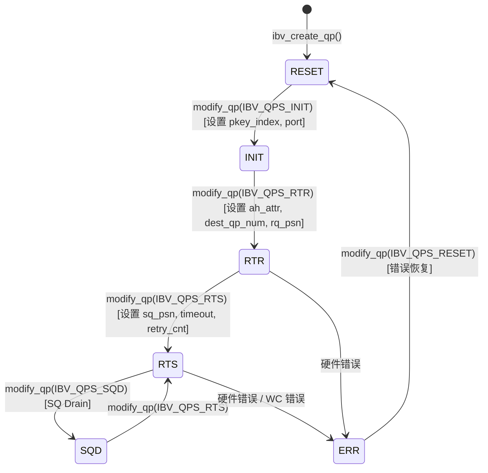
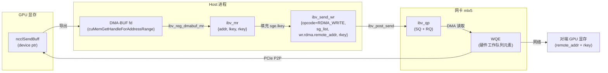

# 第 13 章：InfiniBand 网络传输：net_ib 如何封装 verbs 与 GPUDirect RDMA

上一章我们看到 proxy 线程如何把网络 I/O 从 GPU kernel 中剥离出来，让计算与通信真正并行。但 proxy 只是一个“驱动者”——它调用 ncclNet->isend/irecv 这些抽象接口，却不知道底下到底是 TCP、InfiniBand 还是别的什么。本章我们掀开这层抽象，进入 src/transport/net_ib 与 src/misc/ibvwrap.cc，看 NCCL 如何把 libibverbs 这套 C 库封装成可插拔的符号表，如何建立 Queue Pair（QP），以及 GPUDirect RDMA 如何让网卡绕过 host 内存直接读写 GPU 显存。

## 13.1 为什么 NCCL 不直接调用 libibverbs

### 直觉模型：符号表就是"可插拔的电源插座"

想象你买了一台进口电器，插头形状和家里插座不匹配。你有两个选择：要么把电器拆开改线（直接 `#include <infiniband/verbs.h>` 并链接 `-libverbs`），要么买一个万能转换插头（运行时动态加载符号）。NCCL 选择了后者。

[INFERENCE] 这个选择的核心动机是**部署灵活性**：NCCL 作为一个库被 PyTorch、TensorFlow 等上层框架加载，它无法假设运行环境一定装了 `libibverbs.so`。如果编译期硬链接，那么在没有 InfiniBand 驱动的机器上，整个 NCCL 库都无法加载——哪怕你只想用 NVLink 做单机通信。通过运行时 `dlopen` + 符号解析，NCCL 可以在没有 IB 的机器上优雅降级。

如果缺少这一层封装，系统会面临的灾难是：**一个纯 NVLink 的单机训练任务，因为机器上没装 IB 驱动而直接崩溃**。这在云环境、开发机上极其常见。

### 数据结构与内存布局：符号表容器

核心数据结构是 `ncclIbvSymbols`，定义在 `ibvsymbols.h` 中（本章材料未包含该文件，但从使用方式可推断其结构）。它是一个纯函数指针容器，每个字段对应一个 libibverbs 函数：

```c
struct ncclIbvSymbols {
  int (*ibv_internal_fork_init)(void);
  struct ibv_device** (*ibv_internal_get_device_list)(int* num_devices);
  int (*ibv_internal_modify_qp)(struct ibv_qp*, struct ibv_qp_attr*, int);
  // ... 数十个函数指针
};
```

全局只有一个实例，配合 `std::once_flag` 保证线程安全初始化：

[FACT:src/misc/ibvwrap.cc:26-29](https://github.com/NVIDIA/nccl/blob/12df1a11afad322be5a204a2db890161cbf8131d/src/misc/ibvwrap.cc#L26-L29)
```c
static std::once_flag initOnceFlag;
static ncclResult_t initResult;
struct ncclIbvSymbols ibvSymbols;
```

这里的设计非常克制：`initOnceFlag` 是 `std::once_flag`，`initResult` 缓存初始化结果，`ibvSymbols` 是全局符号表。三者都是静态存储期，生命周期贯穿整个进程。

[INFERENCE] 为什么用 `std::once_flag` 而不是 `pthread_once`？因为 NCCL 的 C++ 代码已经依赖 `<mutex>` 和 `<thread>`，用标准库更一致。`call_once` 的语义是：无论多少线程同时调用 `wrap_ibv_symbols()`，lambda 只执行一次，其余线程阻塞等待，然后都拿到同一个 `initResult`。这比手写双检锁（DCLP）安全得多——DCLP 在 C++ 内存模型下有著名的重排序陷阱。

### Step-by-Step：符号解析的完整流程

当 NCCL 第一次需要 IB 传输时，会调用 `wrap_ibv_symbols()`：

[FACT:src/misc/ibvwrap.cc:26-29](https://github.com/NVIDIA/nccl/blob/12df1a11afad322be5a204a2db890161cbf8131d/src/misc/ibvwrap.cc#L26-L29)
```c
ncclResult_t wrap_ibv_symbols(void) {
  std::call_once(initOnceFlag, []() { initResult = buildIbvSymbols(&ibvSymbols); });
  return initResult;
}
```

`buildIbvSymbols` 定义在 `ibvsymbols.cc`（本章未包含），它的工作是用 `dlopen("libibverbs.so")` 打开库，然后对每个函数名调用 `dlsym` 填充指针。如果某个符号找不到，对应字段保持 NULL。

这个"允许 NULL"的设计贯穿整个封装层。看 `CHECK_NOT_NULL` 宏：

[FACT:src/misc/ibvwrap.cc:26-29](https://github.com/NVIDIA/nccl/blob/12df1a11afad322be5a204a2db890161cbf8131d/src/misc/ibvwrap.cc#L26-L29)
```c
#define CHECK_NOT_NULL(container, internal_name) \
  if (container.internal_name == NULL) { \
    WARN("lib wrapper not initialized."); \
    return ncclInternalError; \
  }
```

每个封装函数在调用前都会检查对应符号是否非空。这意味着：**如果某个老版本 libibverbs 缺少某个新函数，NCCL 不会在加载时崩溃，而是在真正用到该函数时才报错**。这是渐进式降级的关键。

### 设计思考：宏封装的三重职责

`ibvwrap.cc` 里定义了 7 个宏，它们不是简单的语法糖，而是承担了三重职责：

1. **空指针防护**：`CHECK_NOT_NULL` 拦截未初始化
2. **错误码归一化**：把 libibverbs 的多种错误约定（返回 -1、返回 errno、返回 NULL 指针）统一翻译成 `ncclResult_t`
3. **日志埋点**：失败时 `WARN` 打印函数名和 errno

看 `IBV_PTR_CHECK_ERRNO` 这个最复杂的宏：

[FACT:src/misc/ibvwrap.cc:38-45](https://github.com/NVIDIA/nccl/blob/12df1a11afad322be5a204a2db890161cbf8131d/src/misc/ibvwrap.cc#L38-L45)
```c
#define IBV_PTR_CHECK_ERRNO(container, internal_name, call, retval, error_retval, name) \
  CHECK_NOT_NULL(container, internal_name); \
  retval = container.call; \
  if (retval == error_retval) { \
    WARN("Call to " name " failed with error %s", strerror(errno)); \
    return ncclSystemError; \
  } \
  return ncclSuccess;
```

它展开后做四件事：检查符号非空、执行调用、把返回值写入 `retval`（通常是通过指针参数返回的 `ibv_pd*` 等）、判断是否等于错误值。注意 `strerror(errno)`——libibverbs 的指针返回型函数（如 `ibv_alloc_pd`）失败时返回 NULL 并设置 `errno`，所以这里读 `errno` 是对的。

而 `IBV_INT_CHECK` 用于返回 int 的函数：

[FACT:src/misc/ibvwrap.cc:84-91](https://github.com/NVIDIA/nccl/blob/12df1a11afad322be5a204a2db890161cbf8131d/src/misc/ibvwrap.cc#L84-L91)
```c
#define IBV_INT_CHECK(container, internal_name, call, error_retval, name) \
  CHECK_NOT_NULL(container, internal_name); \
  int ret = container.call; \
  if (ret == error_retval) { \
    WARN("Call to " name " failed"); \
    return ncclSystemError; \
  } \
  return ncclSuccess;
```

这里不读 `errno`，因为这类函数（如 `ibv_fork_init`）直接返回 -1 表示失败，错误信息已经丢失。

[INFERENCE] 这种"每个函数用不同宏"的做法看起来繁琐，但它是必要的：libibverbs 的 API 错误约定极不统一，有的返回 0/-1，有的返回 errno 值，有的返回指针。如果强行统一，反而会丢失错误信息。NCCL 选择"如实翻译"，把复杂性留在封装层，让上层 `net_ib.cc` 只需判断 `ncclSuccess`。

## 13.2 ibvcore.h：不依赖头文件的 ABI 契约

### 直觉模型：自带字典的翻译官

`ibvcore.h` 是一个奇特的文件——它把 libibverbs 的核心结构体、枚举、常量**重新定义了一遍**。为什么？因为 NCCL 要在不 `#include <infiniband/verbs.h>` 的前提下使用这些类型。

[INFERENCE] 这解决了一个真实的工程问题：`infiniband/verbs.h` 在不同发行版、不同驱动版本下内容不同。如果 NCCL 直接包含它，编译期就绑定了某个版本。而通过自己定义一份"最小必要子集"，NCCL 可以在编译时不需要 IB 头文件，运行时通过 `dlopen` 加载任意版本的库。

如果缺少这层，灾难是：**在没装 `libibverbs-dev` 的机器上无法编译 NCCL**。而实际上运行时可能通过 `rdma-core` 提供了库文件。

### 关键结构体的内存布局

我们挑几个对理解 RDMA 最关键的结构体剖析。

**`ibv_gid`：全局标识符**

[FACT:src/include/ibvcore.h:58-64](https://github.com/NVIDIA/nccl/blob/12df1a11afad322be5a204a2db890161cbf8131d/src/include/ibvcore.h#L58-L64)
```c
union ibv_gid {
	uint8_t			raw[16];
	struct {
		uint64_t	subnet_prefix;
		uint64_t	interface_id;
	} global;
};
```

GID 是 InfiniBand 的"IP 地址"，16 字节。它既可作为 16 字节数组访问，也可作为两个 64 位整数访问。RoCE（RDMA over Converged Ethernet）场景下，GID 实际上就是 IPv6 地址——这也是为什么 `ibvGetGidStr` 用 `inet_ntop(AF_INET6, ...)` 来格式化：

[FACT:src/include/ibvwrap.h:102-108](https://github.com/NVIDIA/nccl/blob/12df1a11afad322be5a204a2db890161cbf8131d/src/include/ibvwrap.h#L102-L108)
```c
static inline const char* ibvGetGidStr(union ibv_gid* gid, char* gidStr, size_t strLen) {
  static_assert(sizeof(union ibv_gid) == sizeof(struct in6_addr),
                "the sizeof struct ibv_gid must be the size of struct in6_addr");
  return inet_ntop(AF_INET6, gid->raw, gidStr, strLen);
}
```

`static_assert` 在编译期保证 `ibv_gid` 和 `in6_addr` 大小一致，这样 `inet_ntop` 才能正确解释这 16 字节。

**`ibv_mr`：内存注册句柄**

[FACT:src/include/ibvcore.h:402-410](https://github.com/NVIDIA/nccl/blob/12df1a11afad322be5a204a2db890161cbf8131d/src/include/ibvcore.h#L402-L410)
```c
struct ibv_mr {
	struct ibv_context     *context;
	struct ibv_pd	       *pd;
	void		       *addr;
	size_t			length;
	uint32_t		handle;
	uint32_t		lkey;
	uint32_t		rkey;
};
```

这是 GPUDirect RDMA 的核心。`addr` 是注册的内存起始地址（可以是 host 内存，也可以是 GPU 显存映射到 host 的地址），`length` 是长度。`lkey`（local key）和 `rkey`（remote key）是网卡用来验证访问权限的"钥匙"——发送方在 WQE 里带上 `lkey`，接收方用 `rkey` 校验。

[INFERENCE] 为什么需要注册？因为网卡做 DMA 时用的是物理地址，而 `addr` 是虚拟地址。注册过程让驱动把这段虚拟地址的页表"钉住"（pin），建立 IOMMU 映射，并返回 `lkey/rkey` 作为后续引用的句柄。注册是昂贵的（涉及页表遍历和 IOMMU 编程），所以 NCCL 会缓存 MR，避免每次传输都注册。

**`ibv_send_wr`：发送工作请求**

[FACT:src/include/ibvcore.h:704-738](https://github.com/NVIDIA/nccl/blob/12df1a11afad322be5a204a2db890161cbf8131d/src/include/ibvcore.h#L704-L738)
```c
struct ibv_send_wr {
	uint64_t		wr_id;
	struct ibv_send_wr     *next;
	struct ibv_sge	       *sg_list;
	int			num_sge;
	enum ibv_wr_opcode	opcode;
	int			send_flags;
	uint32_t		imm_data;
	union {
		struct {
			uint64_t	remote_addr;
			uint32_t	rkey;
		} rdma;
		// ...
	} wr;
};
```

这是"我要网卡做什么"的描述。`wr_id` 是用户自定义的标签（完成时会原样返回），`sg_list` 是散列表（scatter-gather list），`opcode` 决定操作类型（RDMA_WRITE、SEND 等），`wr.rdma.remote_addr` 和 `wr.rdma.rkey` 指定对端的目标地址和访问密钥。

`ibv_sge` 描述一段本地内存：

[FACT:src/include/ibvcore.h:698-702](https://github.com/NVIDIA/nccl/blob/12df1a11afad322be5a204a2db890161cbf8131d/src/include/ibvcore.h#L698-L702)
```c
struct ibv_sge {
	uint64_t		addr;
	uint32_t		length;
	uint32_t		lkey;
};
```

注意 `addr` 是 `uint64_t` 而非指针——因为 WQE 会被网卡硬件读取，必须是固定的 64 位格式。

### 内联函数：绕过符号表的快路径

有些函数 NCCL 选择内联实现，而不是走符号表。比如 `ibv_post_send`：

[FACT:src/include/ibvcore.h:1099-1101](https://github.com/NVIDIA/nccl/blob/12df1a11afad322be5a204a2db890161cbf8131d/src/include/ibvcore.h#L1099-L1101)
```c
static inline int ibv_post_send(struct ibv_qp *qp, struct ibv_send_wr *wr, struct ibv_send_wr **bad_wr) {
  return qp->context->ops.post_send(qp, wr, bad_wr);
}
```

它直接通过 `qp->context->ops.post_send` 函数指针调用。这是 libibverbs 的经典设计：`ibv_context` 里有一个 `ops` 结构体，包含所有操作函数指针，由具体驱动填充。

[INFERENCE] 为什么 `post_send` 走 `ops` 而不走符号表？因为 `post_send` 是**数据路径**上的热函数，每次发送都要调用。如果走 `dlsym` 解析的全局符号表，会多一次间接寻址。而通过 `qp->context->ops`，编译器可以做更好的优化，且这个指针在 QP 创建时就固定了。相比之下，`ibv_modify_qp` 是控制路径函数，调用频率低，走符号表无所谓。

NCCL 的封装 `wrap_ibv_post_send` 也是内联的：

[FACT:src/include/ibvwrap.h:77-85](https://github.com/NVIDIA/nccl/blob/12df1a11afad322be5a204a2db890161cbf8131d/src/include/ibvwrap.h#L77-L85)
```c
static inline ncclResult_t wrap_ibv_post_send(struct ibv_qp* qp, struct ibv_send_wr* wr, struct ibv_send_wr** bad_wr) {
  int ret = qp->context->ops.post_send(
    qp, wr, bad_wr);
  if (ret != IBV_SUCCESS) {
    WARN("ibv_post_send() failed with error %s, Bad WR %p, First WR %p", strerror(ret), wr, *bad_wr);
    return ncclSystemError;
  }
  return ncclSuccess;
}
```

注意 `IBV_SUCCESS` 定义为 0：

[FACT:src/include/ibvwrap.h:23-25](https://github.com/NVIDIA/nccl/blob/12df1a11afad322be5a204a2db890161cbf8131d/src/include/ibvwrap.h#L23-L25)
```c
typedef enum ibv_return_enum {
  IBV_SUCCESS = 0,
} ibv_return_t;
```

### 设计思考：ABI 兼容性的"版本探测"

`ibvcore.h` 里有一段精妙的 ABI 版本探测代码：

[FACT:src/include/ibvcore.h:81](https://github.com/NVIDIA/nccl/blob/12df1a11afad322be5a204a2db890161cbf8131d/src/include/ibvcore.h#L81)
```c
static void *__VERBS_ABI_IS_EXTENDED = ((uint8_t *)NULL) - 1;
```

这是一个"魔法指针"——值为 `(uint8_t*)0 - 1`，即 `0xFFFFFFFFFFFFFFFF`。它被用作 `ibv_context.abi_compat` 字段的标记值：

[FACT:src/include/ibvcore.h:1072-1081](https://github.com/NVIDIA/nccl/blob/12df1a11afad322be5a204a2db890161cbf8131d/src/include/ibvcore.h#L1072-L1081)
```c
static inline struct verbs_context *verbs_get_ctx(struct ibv_context *ctx)
{
	if (ctx->abi_compat != __VERBS_ABI_IS_EXTENDED)
		return NULL;
	return (struct verbs_context *)(((uintptr_t)ctx) -
					offsetof(struct verbs_context,
						 context));
}
```

如果 `abi_compat` 等于这个魔法值，说明底层库支持扩展 ABI，此时可以通过 `container_of` 技巧从 `ibv_context` 反推出外层的 `verbs_context`。`verbs_context` 的最后一个字段就是 `ibv_context`：

[FACT:src/include/ibvcore.h:1068-1069](https://github.com/NVIDIA/nccl/blob/12df1a11afad322be5a204a2db890161cbf8131d/src/include/ibvcore.h#L1068-L1069)
```c
	size_t   sz;			/* Must be immediately before struct ibv_context */
	struct ibv_context context;	/* Must be last field in the struct */
```

[INFERENCE] 这是 C 语言实现"继承"的经典手法：`verbs_context` "继承"了 `ibv_context`，通过把基类放在末尾，可以用 `container_of` 从基类指针反推派生类指针。`sz` 字段记录结构体大小，用于版本兼容——新版本库可以扩展结构体，老版本代码通过检查 `sz` 判断某个字段是否存在。

`verbs_get_ctx_op` 宏进一步封装了这个检查：

[FACT:src/include/ibvcore.h:1083-1086](https://github.com/NVIDIA/nccl/blob/12df1a11afad322be5a204a2db890161cbf8131d/src/include/ibvcore.h#L1083-L1086)
```c
#define verbs_get_ctx_op(ctx, op) ({ \
	struct verbs_context *__vctx = verbs_get_ctx(ctx); \
	(!__vctx || (__vctx->sz < sizeof(*__vctx) - offsetof(struct verbs_context, op)) || \
	 !__vctx->op) ? NULL : __vctx; })
```

它检查三件事：是否是扩展 ABI、结构体是否足够大包含该字段、该字段是否非空。只有全部满足才返回有效指针。这就是 `ibv_query_port_ex` 能安全调用的基础：

[FACT:src/include/ibvcore.h:1121-1132](https://github.com/NVIDIA/nccl/blob/12df1a11afad322be5a204a2db890161cbf8131d/src/include/ibvcore.h#L1121-L1132)
```c
static inline int ibv_query_port_ex(struct ibv_context *context,
				    uint8_t port_num,
				    struct ibv_port_attr *port_attr)
{
	struct verbs_context *vctx = verbs_get_ctx_op(context, query_port);
        if (vctx) {
          return vctx->query_port(context, port_num, port_attr, sizeof(*port_attr));
        }
        return -1;
}
```

如果底层库不支持扩展 `query_port`，返回 -1，调用方 `wrap_ibv_query_port` 会回退到老 API：

[FACT:src/misc/ibvwrap.cc:156-171](https://github.com/NVIDIA/nccl/blob/12df1a11afad322be5a204a2db890161cbf8131d/src/misc/ibvwrap.cc#L156-L171)
```c
ncclResult_t wrap_ibv_query_port(struct ibv_context* context, uint8_t port_num, struct ibv_port_attr* port_attr) {
#ifndef NCCL_BUILD_RDMA_CORE
  // First try and query the extended port attributes (e.g. active_speed_ex)
  if (ibv_query_port_ex(context, port_num, port_attr) != 0) {
    // Fall back to the original attribute API call, but zero all members first
    memset(port_attr, 0, sizeof(*port_attr));
    IBV_INT_CHECK_RET_ERRNO(ibvSymbols, ibv_internal_query_port, ibv_internal_query_port(context, port_num, port_attr),
                            0, "ibv_query_port");
  }
#else
  IBV_INT_CHECK_RET_ERRNO(ibvSymbols, ibv_internal_query_port, ibv_internal_query_port(context, port_num, port_attr), 0,
                          "ibv_query_port");
#endif
  return ncclSuccess;
}
```

注意 `memset(port_attr, 0, sizeof(*port_attr))`——回退前先清零，因为老 API 不会填充 `active_speed_ex` 等新字段，如果不清零会读到栈上的垃圾值。

## 13.3 QP 状态机与 modify_qp 的重试艺术

### 直觉模型：QP 是"打电话"的完整流程

Queue Pair（QP）是 RDMA 通信的基本单位，它包含发送队列（SQ）和接收队列（RQ）。建立一条 QP 就像打电话：先拨号（RESET→INIT），等对方接听（INIT→RTR），确认双方能听见（RTR→RTS），然后才能通话。

如果 QP 状态机出错，灾难是：**网卡无法建立连接，所有跨机通信失败，训练任务卡死或崩溃**。而 QP 状态转换恰恰是最容易出问题的地方——网络抖动、GID 变化、跨 rail 连接错误都会导致 `ibv_modify_qp` 失败。

### 状态枚举与转换

[FACT:src/include/ibvcore.h:636-645](https://github.com/NVIDIA/nccl/blob/12df1a11afad322be5a204a2db890161cbf8131d/src/include/ibvcore.h#L636-L645)
```c
enum ibv_qp_state {
	IBV_QPS_RESET,
	IBV_QPS_INIT,
	IBV_QPS_RTR,
	IBV_QPS_RTS,
	IBV_QPS_SQD,
	IBV_QPS_SQE,
	IBV_QPS_ERR,
	IBV_QPS_UNKNOWN
};
```

这是标准的 RDMA QP 状态机。NCCL 的 `ibvQpStateName` 把枚举翻译成可读字符串用于日志：

[FACT:src/misc/ibvwrap.cc:263-293](https://github.com/NVIDIA/nccl/blob/12df1a11afad322be5a204a2db890161cbf8131d/src/misc/ibvwrap.cc#L263-L293)
```c
static void ibvQpStateName(enum ibv_qp_state state, char* msg, const size_t len) {
  switch (state) {
  case (IBV_QPS_RESET):
    snprintf(msg, len, "RESET");
    break;
  case (IBV_QPS_INIT):
    snprintf(msg, len, "INIT");
    break;
  // ...
  }
}
```

下面这张状态图精确对应源码中的枚举与转换语义：



[INFERENCE] 注意 `IBV_QPS_SQD`（SQ Drained）和 `IBV_QPS_SQE`（SQ Error）这两个状态。SQD 用于优雅关闭——排空发送队列后再转换。SQE 表示发送队列出错。NCCL 在正常路径上不会主动进入这两个状态，但错误处理时需要识别它们。

### Step-by-Step：modify_qp 的重试逻辑

`wrap_ibv_modify_qp` 是本章最复杂的函数，它实现了一套完整的重试机制：

[FACT:src/misc/ibvwrap.cc:360-385](https://github.com/NVIDIA/nccl/blob/12df1a11afad322be5a204a2db890161cbf8131d/src/misc/ibvwrap.cc#L360-L385)
```c
ncclResult_t wrap_ibv_modify_qp(struct ibv_qp* qp, struct ibv_qp_attr* attr, int attr_mask) {
  char qpMsg[1024];
  int ret = 0, attempts = 0;
  int maxCnt = (int)ncclParamIbMQpRetryCnt() + 1; // number of attempts = number of retry + 1
  int timeOut = (int)ncclParamIbMQpRetryTimeout();
  CHECK_NOT_NULL(ibvSymbols, ibv_internal_modify_qp);
  do {
    if (attempts > 0) {
      unsigned int sleepTime = timeOut * attempts;
      ibvModifyQpLog(qp, attr->qp_state, attr, attr_mask, qpMsg, sizeof(qpMsg));
      INFO(NCCL_NET, "Call to ibv_modify_qp failed with %d %s, %s, retrying %d/%d after %u msec of sleep", ret,
           strerror(ret), qpMsg, attempts, maxCnt, sleepTime);
      // sleep before retrying
      std::this_thread::sleep_for(std::chrono::milliseconds(sleepTime));
    }
    ret = ibvSymbols.ibv_internal_modify_qp(qp, attr, attr_mask);
    attempts++;
  } while (IBV_MQP_RETRY_ERRNO_ALL(ret) && attempts < maxCnt);
  if (ret != 0) {
    ibvModifyQpLog(qp, attr->qp_state, attr, attr_mask, qpMsg, sizeof(qpMsg));
    WARN("Call to ibv_modify_qp failed with %d %s, %s", ret, strerror(ret), qpMsg);
    printIbModifyQpHint(ret);
    return ncclSystemError;
  }
  return ncclSuccess;
}
```

逐步拆解：

**第一步：读取参数**。`maxCnt = IbMQpRetryCnt() + 1`，默认重试 34 次，所以最多尝试 35 次。`timeOut` 默认 100 毫秒。

**第二步：进入重试循环**。第一次 `attempts == 0`，不 sleep，直接调用。之后每次失败，`sleepTime = timeOut * attempts`——这是**线性退避**，第 1 次重试等 100ms，第 2 次等 200ms，第 34 次等 3400ms。

**第三步：判断是否重试**。`IBV_MQP_RETRY_ERRNO_ALL(ret)` 决定是否继续：

[FACT:src/misc/ibvwrap.cc:107-109](https://github.com/NVIDIA/nccl/blob/12df1a11afad322be5a204a2db890161cbf8131d/src/misc/ibvwrap.cc#L107-L109)
```c
#define IBV_ERR_EQ(e, code) (e == code || e == (-code))
#define IBV_MQP_RETRY_ERRNO(e) (IBV_ERR_EQ(e, ETIMEDOUT))
#define IBV_MQP_RETRY_ERRNO_ALL(e) (ncclParamIbMQpRetryAll() ? (e != 0) : IBV_MQP_RETRY_ERRNO(e))
```

默认只对 `ETIMEDOUT` 重试。`IBV_ERR_EQ` 同时匹配正负值，因为不同驱动可能返回 `ETIMEDOUT` 或 `-ETIMEDOUT`。如果设置了 `NCCL_IB_MQP_RETRY_ALL=1`，则对任何非零错误都重试。

**第四步：失败时打印诊断信息**。`ibvModifyQpLog` 收集设备名、端口号、当前状态、目标状态、本地/远端 GID：

[FACT:src/misc/ibvwrap.cc:297-339](https://github.com/NVIDIA/nccl/blob/12df1a11afad322be5a204a2db890161cbf8131d/src/misc/ibvwrap.cc#L297-L339)
```c
static void ibvModifyQpLog(struct ibv_qp* qp, enum ibv_qp_state qpState, struct ibv_qp_attr* userAttr, int userFlag,
                           char* msg, size_t msgLen) {
  // ...
  char nextState[32], currState[32];
  ibvQpStateName(qp->state, currState, sizeof(currState));
  ibvQpStateName(qpState, nextState, sizeof(nextState));
  char devName[IBV_SYSFS_NAME_MAX] = "";
  snprintf(devName, sizeof(devName), "%s",
           (qp->pd->context) ? wrap_ibv_get_device_name(qp->pd->context->device) : "N/A");
  // ...
}
```

注意 `QP_ATTR` 宏的巧妙设计：

[FACT:src/misc/ibvwrap.cc:295](https://github.com/NVIDIA/nccl/blob/12df1a11afad322be5a204a2db890161cbf8131d/src/misc/ibvwrap.cc#L295)
```c
#define QP_ATTR(attr, userAttr, userFlag, mask) ((userFlag & mask) ? (userAttr) : (attr))
```

它优先使用用户传入的属性（如果 `attr_mask` 里设置了对应位），否则回退到 `query_qp` 查到的当前属性。这样即使 `query_qp` 失败，也能从用户参数里拿到部分信息。

**第五步：失败时给出提示**。`printIbModifyQpHint` 针对常见错误码给出排查建议：

[FACT:src/misc/ibvwrap.cc:341-358](https://github.com/NVIDIA/nccl/blob/12df1a11afad322be5a204a2db890161cbf8131d/src/misc/ibvwrap.cc#L341-L358)
```c
static void printIbModifyQpHint(int status) {
  switch (status) {
  case ETIMEDOUT:
    INFO(NCCL_NET, "HINT: In many cases this error indicates that the NICs are not cross-rail connected.");
    INFO(NCCL_NET, "HINT: To confirm, set NCCL_CROSS_NIC=0 to disable cross-rail communication ...");
    return;
  case EINVAL:
    INFO(NCCL_NET, "HINT: In many cases this error indicates that an incorrect GID index is forced by "
                   "NCCL_IB_GID_INDEX, or that a NIC's GID changed mid-run.");
    // ...
  }
}
```

[INFERENCE] 这段提示是生产经验的结晶。`ETIMEDOUT` 最常见的原因是跨 rail 连接问题——在多 rail 网络里，如果 rank A 的 NIC 0 试图连接 rank B 的 NIC 1，而它们不在同一 rail，就会超时。`EINVAL` 通常是 GID 索引配置错误，或者运行中 GID 发生变化（比如网卡重置）。

### 并发控制与硬件交互

`wrap_ibv_modify_qp` 本身没有加锁——它假设调用者保证同一个 QP 不会被多线程同时修改。这在 NCCL 里是成立的：QP 建立发生在初始化阶段，由单个线程完成。

但重试循环里的 `std::this_thread::sleep_for` 值得注意。它会让出 CPU，但不释放任何锁（因为本来就没持锁）。[INFERENCE] 在 proxy 线程里调用这个函数时，sleep 会阻塞 proxy 的进度推进——如果 QP 建立卡住，整个通信会停滞。这就是为什么默认重试次数是 34 次、总时间约 60 秒——足够覆盖短暂的网络抖动，但不会无限等待。

## 13.4 内存注册：GPUDirect RDMA 的入口

### 直觉模型：给网卡发一张"门禁卡"

网卡要直接读写内存，必须先"认识"这块内存。内存注册（`ibv_reg_mr`）就是给网卡发一张门禁卡——告诉它这块内存的物理地址范围，并返回一个 `lkey`（本地钥匙）和 `rkey`（远端钥匙）。之后网卡做 DMA 时，就凭这把钥匙访问。

如果缺少内存注册，灾难是：**网卡无法访问任何内存，RDMA 完全无法工作**。更隐蔽的问题是：如果注册了 host 内存但想访问 GPU 显存，网卡会读到错误的数据或触发保护错误。

### 三种注册路径

NCCL 封装了三种内存注册函数，对应不同的使用场景：

**路径一：普通注册**

[FACT:src/misc/ibvwrap.cc:198-201](https://github.com/NVIDIA/nccl/blob/12df1a11afad322be5a204a2db890161cbf8131d/src/misc/ibvwrap.cc#L198-L201)
```c
ncclResult_t wrap_ibv_reg_mr(struct ibv_mr** ret, struct ibv_pd* pd, void* addr, size_t length, int access) {
  IBV_PTR_CHECK_ERRNO(ibvSymbols, ibv_internal_reg_mr, ibv_internal_reg_mr(pd, addr, length, access), *ret, NULL,
                      "ibv_reg_mr");
}
```

这是标准路径，`addr` 是虚拟地址，`access` 是访问权限标志（`IBV_ACCESS_LOCAL_WRITE | IBV_ACCESS_REMOTE_WRITE` 等）。

**路径二：指定 IOVA 注册**

[FACT:src/misc/ibvwrap.cc:211-219](https://github.com/NVIDIA/nccl/blob/12df1a11afad322be5a204a2db890161cbf8131d/src/misc/ibvwrap.cc#L211-L219)
```c
ncclResult_t wrap_ibv_reg_mr_iova2(struct ibv_mr** ret, struct ibv_pd* pd, void* addr, size_t length, uint64_t iova,
                                   int access) {
  if (ibvSymbols.ibv_internal_reg_mr_iova2 == NULL) {
    return ncclInternalError;
  }
  if (ret == NULL) return ncclSuccess; // Assume dummy call
  IBV_PTR_CHECK_ERRNO(ibvSymbols, ibv_internal_reg_mr_iova2, ibv_internal_reg_mr_iova2(pd, addr, length, iova, access),
                      *ret, NULL, "ibv_reg_mr_iova2");
}
```

`iova`（I/O Virtual Address）允许指定网卡看到的地址。这在需要固定地址映射的场景有用。注意 `ret == NULL` 时直接返回成功——这是"探测调用"，只检查函数是否存在，不真正注册。

**路径三：DMA-BUF 注册（GPUDirect RDMA 的关键）**

[FACT:src/misc/ibvwrap.cc:222-227](https://github.com/NVIDIA/nccl/blob/12df1a11afad322be5a204a2db890161cbf8131d/src/misc/ibvwrap.cc#L222-L227)
```c
ncclResult_t wrap_ibv_reg_dmabuf_mr(struct ibv_mr** ret, struct ibv_pd* pd, uint64_t offset, size_t length,
                                    uint64_t iova, int fd, int access) {
  IBV_PTR_CHECK_ERRNO(ibvSymbols, ibv_internal_reg_dmabuf_mr,
                      ibv_internal_reg_dmabuf_mr(pd, offset, length, iova, fd, access), *ret, NULL,
                      "ibv_reg_dmabuf_mr");
}
```

这是 GPUDirect RDMA 的核心。`fd` 是一个 DMA-BUF 文件描述符——它代表一块 GPU 显存。NCCL 通过 `cuMemGetHandleForAddressRange` 之类的 CUDA API 拿到这个 fd，然后传给 `ibv_reg_dmabuf_mr`。网卡驱动通过 DMA-BUF 机制直接映射 GPU 显存，无需经过 host 内存拷贝。

[INFERENCE] DMA-BUF 是 Linux 内核的缓冲区共享框架。GPU 驱动（如 NVIDIA 的 nvidia.ko）把显存导出为 DMA-BUF，网卡驱动（如 mlx5）导入它，建立 IOMMU 映射。整个过程在内核完成，用户态只传递一个 fd。这就是"网卡直接读写 GPU 显存"的底层机制。

### 直接注册 vs 封装注册

注意有两个"direct"版本：

[FACT:src/misc/ibvwrap.cc:203-209](https://github.com/NVIDIA/nccl/blob/12df1a11afad322be5a204a2db890161cbf8131d/src/misc/ibvwrap.cc#L203-L209)
```c
struct ibv_mr* wrap_direct_ibv_reg_mr(struct ibv_pd* pd, void* addr, size_t length, int access) {
  if (ibvSymbols.ibv_internal_reg_mr == NULL) {
    WARN("lib wrapper not initialized.");
    return NULL;
  }
  return ibvSymbols.ibv_internal_reg_mr(pd, addr, length, access);
}
```

[FACT:src/misc/ibvwrap.cc:229-236](https://github.com/NVIDIA/nccl/blob/12df1a11afad322be5a204a2db890161cbf8131d/src/misc/ibvwrap.cc#L229-L236)
```c
struct ibv_mr* wrap_direct_ibv_reg_dmabuf_mr(struct ibv_pd* pd, uint64_t offset, size_t length, uint64_t iova, int fd,
                                             int access) {
  if (ibvSymbols.ibv_internal_reg_dmabuf_mr == NULL) {
    errno = EOPNOTSUPP; // ncclIbDmaBufSupport() requires this errno being set
    return NULL;
  }
  return ibvSymbols.ibv_internal_reg_dmabuf_mr(pd, offset, length, iova, fd, access);
}
```

它们直接返回 `ibv_mr*` 而非 `ncclResult_t`，且不打印 WARN 日志。为什么？

[INFERENCE] 因为这两个函数被用于**能力探测**。`ncclIbDmaBufSupport()` 会调用 `wrap_direct_ibv_reg_dmabuf_mr` 试探网卡是否支持 DMA-BUF。如果失败，它期望拿到 `errno == EOPNOTSUPP` 来判断"不支持"而非"出错"。如果这里打印 WARN，会在不支持 DMA-BUF 的机器上刷屏。所以 direct 版本把错误处理的责任交给调用者。

### 访问权限标志

[FACT:src/include/ibvcore.h:365-372](https://github.com/NVIDIA/nccl/blob/12df1a11afad322be5a204a2db890161cbf8131d/src/include/ibvcore.h#L365-L372)
```c
enum ibv_access_flags {
	IBV_ACCESS_LOCAL_WRITE		= 1,
	IBV_ACCESS_REMOTE_WRITE		= (1<<1),
	IBV_ACCESS_REMOTE_READ		= (1<<2),
	IBV_ACCESS_REMOTE_ATOMIC	= (1<<3),
	IBV_ACCESS_MW_BIND		= (1<<4),
	IBV_ACCESS_RELAXED_ORDERING     = (1<<20),
};
```

这些标志是位掩码，可以组合。`LOCAL_WRITE` 允许本地写（接收数据时需要），`REMOTE_WRITE` 允许远端写（RDMA WRITE 的目标需要），`REMOTE_READ` 允许远端读（RDMA READ 的目标需要）。

`IBV_ACCESS_RELAXED_ORDERING` 是一个性能优化标志——它允许网卡用更宽松的内存序访问，可能提升吞吐，但需要应用层保证正确性。

### 数据流：从 GPU 显存到网卡的完整路径

下面这张图展示一次跨机 RDMA 写的数据流，锚定本章涉及的结构体：



图中每个节点都对应源码中的真实类型：`ibv_mr` 来自 [FACT:src/include/ibvcore.h:402-410](https://github.com/NVIDIA/nccl/blob/12df1a11afad322be5a204a2db890161cbf8131d/src/include/ibvcore.h#L402-L410)，`ibv_send_wr` 来自 [FACT:src/include/ibvcore.h:704-738](https://github.com/NVIDIA/nccl/blob/12df1a11afad322be5a204a2db890161cbf8131d/src/include/ibvcore.h#L704-L738)，`ibv_qp` 来自 [FACT:src/include/ibvcore.h:787-802](https://github.com/NVIDIA/nccl/blob/12df1a11afad322be5a204a2db890161cbf8131d/src/include/ibvcore.h#L787-L802)。

## 13.5 工作完成与错误诊断

### 直觉模型：快递签收单

RDMA 是异步的——你 `post_send` 之后不会立即知道结果。网卡完成操作后，会在 Completion Queue（CQ）里放一个 Work Completion（WC），就像快递员把签收单放进你的信箱。你需要主动 `poll_cq` 去取。

如果缺少 WC 诊断，灾难是：**通信失败时你只知道"失败了"，不知道"为什么失败"**。RDMA 的错误码有 20 多种，每种对应不同的根因。

### WC 结构体

[FACT:src/include/ibvcore.h:349-363](https://github.com/NVIDIA/nccl/blob/12df1a11afad322be5a204a2db890161cbf8131d/src/include/ibvcore.h#L349-L363)
```c
struct ibv_wc {
	uint64_t		wr_id;
	enum ibv_wc_status	status;
	enum ibv_wc_opcode	opcode;
	uint32_t		vendor_err;
	uint32_t		byte_len;
	uint32_t		imm_data;	/* in network byte order */
	uint32_t		qp_num;
	uint32_t		src_qp;
	int			wc_flags;
	uint16_t		pkey_index;
	uint16_t		slid;
	uint8_t			sl;
	uint8_t			dlid_path_bits;
};
```

`wr_id` 是你 post 时填的标签，`status` 是完成状态，`opcode` 是操作类型，`byte_len` 是实际传输字节数。`qp_num` 和 `src_qp` 用于多 QP 场景下识别是哪个 QP 完成的。

### 状态码翻译

`ibvWcStatusStr` 把状态枚举翻译成字符串：

[FACT:src/misc/ibvwrap.cc:415-464](https://github.com/NVIDIA/nccl/blob/12df1a11afad322be5a204a2db890161cbf8131d/src/misc/ibvwrap.cc#L415-L464)
```c
const char* ibvWcStatusStr(enum ibv_wc_status status) {
  switch (status) {
  case IBV_WC_SUCCESS:
    return "IBV_WC_SUCCESS";
  case IBV_WC_LOC_LEN_ERR:
    return "IBV_WC_LOC_LEN_ERR";
  // ... 20 多个 case
  default:
    return "UNKNOWN_STATUS";
  }
}
```

这些状态码的含义：

| 状态码 | 含义 | 常见根因 |
|--------|------|----------|
| `IBV_WC_SUCCESS` | 成功 | — |
| `IBV_WC_LOC_LEN_ERR` | 本地长度错误 | SGE 长度超过 MR 范围 |
| `IBV_WC_LOC_ACCESS_ERR` | 本地访问错误 | lkey 无效或权限不足 |
| `IBV_WC_REM_ACCESS_ERR` | 远端访问错误 | rkey 无效或对端 MR 已注销 |
| `IBV_WC_RETRY_EXC_ERR` | 重试耗尽 | 网络不通或对端 QP 未就绪 |
| `IBV_WC_RNR_RETRY_EXC_ERR` | RNR 重试耗尽 | 对端没有 post recv |
| `IBV_WC_RESP_TIMEOUT_ERR` | 响应超时 | 对端无响应 |

[INFERENCE] `IBV_WC_RNR_RETRY_EXC_ERR`（Receiver Not Ready）是生产环境最常见的问题之一。它意味着发送方发了数据，但接收方没有预先 post 足够的 recv buffer。在 NCCL 里，这通常发生在连接建立阶段——双方 QP 状态不同步，一方已经开始发送，另一方还没准备好接收。

### opcode 翻译

`ibvWcOpcodeStr` 和 `ibvWrOpcodeStr` 分别翻译完成 opcode 和请求 opcode：

[FACT:src/misc/ibvwrap.cc:467-488](https://github.com/NVIDIA/nccl/blob/12df1a11afad322be5a204a2db890161cbf8131d/src/misc/ibvwrap.cc#L467-L488)
```c
const char* ibvWcOpcodeStr(enum ibv_wc_opcode opcode) {
  switch (opcode) {
  case IBV_WC_SEND:
    return "IBV_WC_SEND";
  case IBV_WC_RDMA_WRITE:
    return "IBV_WC_RDMA_WRITE";
  case IBV_WC_RDMA_READ:
    return "IBV_WC_RDMA_READ";
  // ...
  }
}
```

注意 `IBV_WC_RECV` 的值是 `1 << 7`：

[FACT:src/include/ibvcore.h:329-342](https://github.com/NVIDIA/nccl/blob/12df1a11afad322be5a204a2db890161cbf8131d/src/include/ibvcore.h#L329-L342)
```c
enum ibv_wc_opcode {
	IBV_WC_SEND,
	IBV_WC_RDMA_WRITE,
	IBV_WC_RDMA_READ,
	IBV_WC_COMP_SWAP,
	IBV_WC_FETCH_ADD,
	IBV_WC_BIND_MW,
	IBV_WC_RECV			= 1 << 7,
	IBV_WC_RECV_RDMA_WITH_IMM
};
```

[INFERENCE] 为什么 `IBV_WC_RECV` 是 `1 << 7` 而不是顺序值？因为接收完成和发送完成是两类不同的操作，用高位区分可以让代码用 `opcode & IBV_WC_RECV` 快速判断"这是不是一个接收完成"。这是 libibverbs 的 API 设计约定。

### 轮询 CQ

`wrap_ibv_poll_cq` 是内联的：

[FACT:src/include/ibvwrap.h:60-69](https://github.com/NVIDIA/nccl/blob/12df1a11afad322be5a204a2db890161cbf8131d/src/include/ibvwrap.h#L60-L69)
```c
static inline ncclResult_t wrap_ibv_poll_cq(struct ibv_cq* cq, int num_entries, struct ibv_wc* wc, int* num_done) {
  int done = cq->context->ops.poll_cq(cq, num_entries,
                                      wc);
  if (done < 0) {
    WARN("Call to ibv_poll_cq() returned %d", done);
    return ncclSystemError;
  }
  *num_done = done;
  return ncclSuccess;
}
```

它通过 `cq->context->ops.poll_cq` 调用，和 `post_send` 一样走 `ops` 快路径。返回值 `done` 是本次轮询到的 WC 数量，0 表示没有新完成，负数表示错误。

[INFERENCE] `poll_cq` 是**忙轮询**——它不阻塞，立即返回。NCCL 的 proxy 线程会在循环里反复调用它，直到拿到完成事件。这是低延迟的关键：相比中断驱动，忙轮询避免了中断上下文切换的开销。代价是 CPU 占用高，但在高性能计算场景下这是可接受的。

## 13.6 生产避坑指南

### 坑一：跨 rail 连接超时

**现象**：`ibv_modify_qp` 返回 `ETIMEDOUT`，重试 34 次后失败。

**根因**：在多 rail 网络里，每个 GPU 通常绑定到特定的 NIC。如果 rank A 的 GPU 0 绑定了 NIC 0，rank B 的 GPU 0 绑定了 NIC 1，而 NIC 0 和 NIC 1 不在同一 rail（即它们连接不同的交换机），那么 QP 建立会超时。

**排查**：源码已经给出了提示：

[FACT:src/misc/ibvwrap.cc:343-347](https://github.com/NVIDIA/nccl/blob/12df1a11afad322be5a204a2db890161cbf8131d/src/misc/ibvwrap.cc#L343-L347)
```c
  case ETIMEDOUT:
    INFO(NCCL_NET, "HINT: In many cases this error indicates that the NICs are not cross-rail connected.");
    INFO(NCCL_NET, "HINT: To confirm, set NCCL_CROSS_NIC=0 to disable cross-rail communication ...");
    return;
```

设置 `NCCL_CROSS_NIC=0` 可以强制同 rail 通信。如果这样能解决，说明确实是跨 rail 问题。

**恢复链**：NCCL 的重试机制（34 次、线性退避）给了网络足够时间恢复。但如果根因是拓扑配置错误，重试无用，必须修正 `NCCL_IB_HCA` 或 `NCCL_CROSS_NIC` 配置。

### 坑二：GID 索引错误

**现象**：`ibv_modify_qp` 返回 `EINVAL`。

**根因**：`NCCL_IB_GID_INDEX` 强制指定了一个不存在的 GID 索引，或者运行中网卡的 GID 发生了变化（比如 RoCE 网卡重新获取 IP）。

**排查**：

[FACT:src/misc/ibvwrap.cc:341-358](https://github.com/NVIDIA/nccl/blob/12df1a11afad322be5a204a2db890161cbf8131d/src/misc/ibvwrap.cc#L341-L358)
```c
  case EINVAL:
    INFO(NCCL_NET, "HINT: In many cases this error indicates an incorrect GID index is forced by "
                   "NCCL_IB_GID_INDEX, or that a NIC's GID changed mid-run.");
    INFO(NCCL_NET, "HINT: To confirm, set NCCL_IB_GID_INDEX=-1 to enable automatic detection and check "
                   "'dmesg | grep -i gid' for GID changes ...");
    return;
```

设置 `NCCL_IB_GID_INDEX=-1` 启用自动检测。同时检查 `dmesg` 里是否有 GID 变化事件。

### 坑三：DMA-BUF 不支持导致回退到 host 拷贝

**现象**：GPUDirect RDMA 没有生效，性能低于预期。

**根因**：网卡驱动或内核不支持 DMA-BUF，`wrap_direct_ibv_reg_dmabuf_mr` 返回 NULL 并设置 `errno = EOPNOTSUPP`：

[FACT:src/misc/ibvwrap.cc:229-236](https://github.com/NVIDIA/nccl/blob/12df1a11afad322be5a204a2db890161cbf8131d/src/misc/ibvwrap.cc#L229-L236)
```c
struct ibv_mr* wrap_direct_ibv_reg_dmabuf_mr(struct ibv_pd* pd, uint64_t offset, size_t length, uint64_t iova, int fd,
                                             int access) {
  if (ibvSymbols.ibv_internal_reg_dmabuf_mr == NULL) {
    errno = EOPNOTSUPP; // ncclIbDmaBufSupport() requires this errno being set
    return NULL;
  }
  return ibvSymbols.ibv_internal_reg_dmabuf_mr(pd, offset, length, iova, fd, access);
}
```

注意注释：`ncclIbDmaBufSupport()` 依赖这个 `errno` 来判断是否支持。如果这里不设置 `EOPNOTSUPP`，上层会误判为"出错"而非"不支持"。

**排查**：检查内核版本（需要 5.12+）、网卡驱动版本、以及 `nvidia-peermem` 模块是否加载。如果确实不支持，NCCL 会回退到 host 内存中转，性能会下降但功能正常。

### 坑四：MR 缓存与内存泄漏

[INFERENCE] 内存注册是昂贵的操作（涉及 IOMMU 编程），NCCL 会缓存 `ibv_mr`。但如果缓存策略不当，会导致两个问题：一是内存泄漏（MR 一直不注销），二是缓存失效（内存被释放但 MR 还指向旧地址）。

`wrap_ibv_dereg_mr` 是注销入口：

[FACT:src/misc/ibvwrap.cc:238-241](https://github.com/NVIDIA/nccl/blob/12df1a11afad322be5a204a2db890161cbf8131d/src/misc/ibvwrap.cc#L238-L241)
```c
ncclResult_t wrap_ibv_dereg_mr(
  struct ibv_mr* mr) {
  IBV_INT_CHECK_RET_ERRNO(ibvSymbols, ibv_internal_dereg_mr, ibv_internal_dereg_mr(mr), 0, "ibv_dereg_mr");
}
```

[INFERENCE] 生产环境中，如果训练任务频繁创建/销毁通信域，而 MR 没有正确注销，会导致 IOMMU 映射表膨胀，最终触发 `ibv_reg_mr` 失败（返回 `ENOMEM`）。排查方法是监控 `/sys/kernel/debug/iommu` 下的映射数量。

## 设计思考：为什么封装层如此"厚"

回顾本章，`ibvwrap.cc` 有 509 行，`ibvcore.h` 有 1134 行。对于一个"只是调用 libibverbs"的封装层，这个体量相当大。为什么？

[INFERENCE] 三个原因：

**第一，错误处理的复杂性**。libibverbs 的 API 错误约定极不统一，NCCL 需要为每种约定写一个宏，并在每个函数里正确使用。这不是过度设计，而是"如实翻译"的必要成本。

**第二，ABI 兼容性的负担**。`ibvcore.h` 重新定义了所有结构体，还要处理 `verbs_context` 的版本探测。这是为了在编译期不依赖 IB 头文件，运行时兼容任意版本。

**第三，诊断信息的价值**。`ibvModifyQpLog`、`printIbModifyQpHint`、`ibvWcStatusStr` 这些函数在正常路径上不会被调用，但在故障排查时价值巨大。NCCL 选择把诊断信息"预埋"在封装层，而不是等到出错时再临时收集。

这种"厚封装"的代价是代码量大、维护成本高。但收益是：上层 `net_ib.cc` 可以用统一的 `ncclResult_t` 接口编写，不必关心 libibverbs 的各种怪癖。这是典型的"复杂性隔离"设计。

## 本章小结

本章我们深入了 NCCL 的 InfiniBand 传输封装层，核心要点：

1. **符号表封装**：`ncclIbvSymbols` 通过 `dlopen` + `dlsym` 运行时加载 libibverbs，配合 `std::once_flag` 保证线程安全初始化。这让 NCCL 在没有 IB 驱动的机器上也能加载。

2. **ABI 契约**：`ibvcore.h` 重新定义了 libibverbs 的核心类型，通过 `__VERBS_ABI_IS_EXTENDED` 魔法指针和 `verbs_context` 的 `container_of` 技巧实现版本探测。

3. **QP 状态机**：`wrap_ibv_modify_qp` 实现了 34 次线性退避重试，针对 `ETIMEDOUT` 和 `EINVAL` 给出诊断提示。

4. **GPUDirect RDMA**：`wrap_ibv_reg_dmabuf_mr` 通过 DMA-BUF 机制让网卡直接映射 GPU 显存，`wrap_direct_ibv_reg_dmabuf_mr` 用于能力探测。

5. **错误诊断**：`ibvWcStatusStr`、`ibvWcOpcodeStr`、`ibvWrOpcodeStr` 把硬件错误码翻译成可读字符串，是生产排查的关键工具。

## 本章思考与自测

<details><summary>Q1: 如果把 `wrap_ibv_symbols` 里的 `std::call_once` 换成普通的 `if (initResult == ncclSuccess) return initResult;` 双检锁，在什么并发场景下会出问题？</summary>

**参考解析**：看 [FACT:src/misc/ibvwrap.cc:26-29](https://github.com/NVIDIA/nccl/blob/12df1a11afad322be5a204a2db890161cbf8131d/src/misc/ibvwrap.cc#L26-L29)：

```c
ncclResult_t wrap_ibv_symbols(void) {
  std::call_once(initOnceFlag, []() { initResult = buildIbvSymbols(&ibvSymbols); });
  return initResult;
}
```

如果换成朴素的双检锁，问题在于**内存重排序**。`buildIbvSymbols` 会填充 `ibvSymbols` 的各个字段，然后写入 `initResult`。在没有内存屏障的情况下，CPU 或编译器可能把 `initResult = ncclSuccess` 重排到 `

至此，我们看清了 NCCL 如何通过 net_ib 将 libibverbs 封装为可插拔的传输层，并利用 GPUDirect RDMA 实现网卡对 GPU 显存的直接访问。这套机制解决了跨机通信的延迟与带宽瓶颈。但机内通信同样关键——下一章我们将进入对称内存与 NVLS，看 NCCL 如何利用 NVLink 多播实现硬件加速的集合通信。届时你会发现，本章的 RDMA 机制与 NVLS 形成互补：前者负责跨机，后者负责机内。