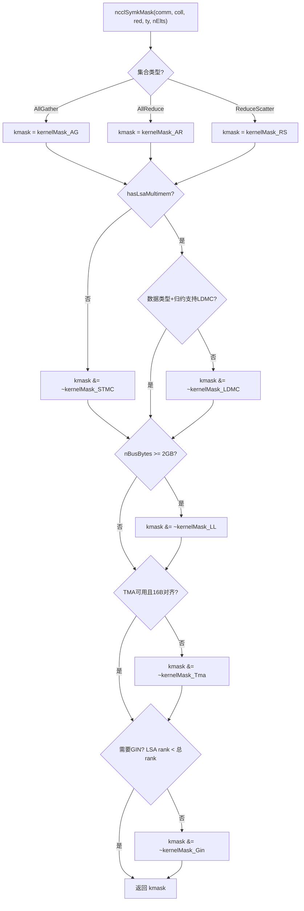
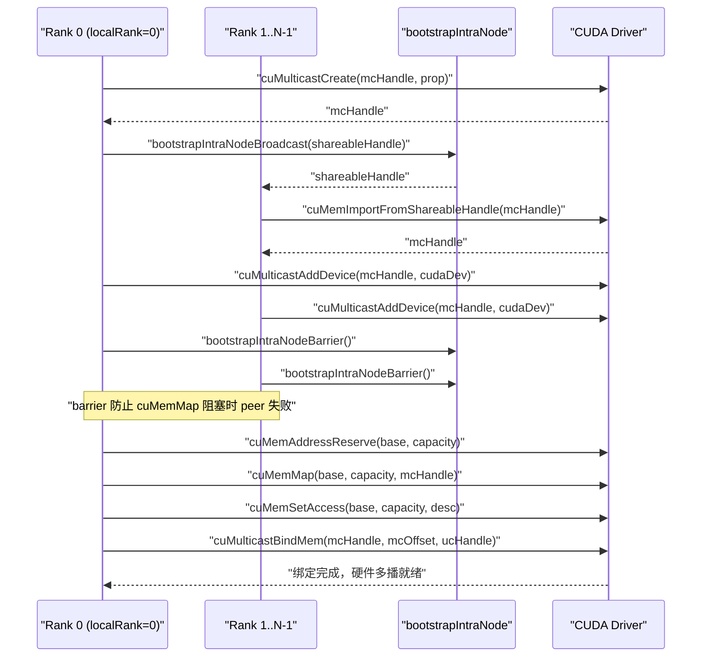
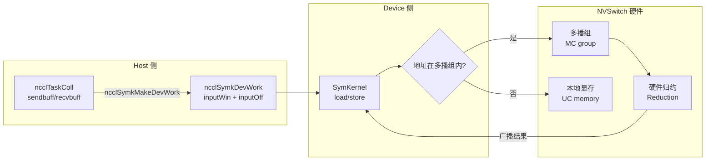

# 第 14 章：对称内存与 NVLS：多播加速与 LSA 设备端直接寻址

上一章我们跟随一次跨机 AllReduce，看数据如何从 GPU 显存经网卡到达对端 GPU，那条路径解决的是机器之间的通信。但现代 AI 集群里，同一台机器甚至同一个 NVLink 域内部的 GPU 间通信量同样巨大——数据并行训练中的梯度同步、张量并行中的激活值交换，绝大多数都发生在机内。如果机内通信仍走 GPU→显存→网卡→对端网卡→显存→GPU 这套跨机流程，就相当于同城寄快递非要走航空件，延迟白白浪费。本章要拆解的，正是 NCCL 为机内通信准备的两把利器：对称内存与 NVLS。前者让每个 rank 用同一套虚拟地址访问所有 rank 的缓冲区，后者利用 NVSwitch 硬件的多播能力做归约。两者结合，能把小消息集合通信的延迟压到接近硬件极限。

## 14.1 对称内存：让"第 3 排第 5 座"在每个人家里都指同一个位置

### 直觉模型

想象一个班级要交换作业本。传统做法是：每个人把自己的本子编号，然后喊"张三，我的第 5 本给你；李四，我的第 8 本给你"——每个人都要记住"谁的本子放在哪、第几本"。这就是普通通信：地址是**相对的、私有的**，你要访问对端数据，得先知道对端的地址映射。

对称内存换了个思路：全班约定"第 3 排第 5 座"这个坐标，在每个人家里都指向同一个物理位置。于是张三要拿李四的第 5 本，直接说"李四家第 3 排第 5 座"就行，不需要任何地址翻译。这就是对称内存的核心：**每个 rank 的缓冲区在所有 rank 的地址空间里映射到相同的虚拟地址**。

如果没有对称内存，机内集合通信会面临什么灾难？[INFERENCE] 每个 rank 访问对端缓冲区时，都要经过一次"地址翻译"——查表、计算偏移、可能还要跨进程通信确认映射关系。对于小消息（几 KB），这次翻译的开销可能比数据本身传输还大。对称内存把这个开销彻底消除，这正是它"显著降低小消息延迟"的根本原因。

### 数据结构与内存布局

对称内存的注册类型由 `ncclSymRegType_t` 描述，`ncclGetSymRegType` 根据 send/recv 窗口是否带 `NCCL_WIN_COLL_SYMMETRIC` 标志，把注册状态分成四类。

[FACT:src/sym_kernels.cc:395-412]

```c
ncclResult_t ncclGetSymRegType(struct ncclDevrWindow* sendWin, struct ncclDevrWindow* recvWin,
                               ncclSymRegType_t* winRegType) {
  bool isSendSymmReg = false;
  bool isRecvSymmReg = false;
  if (sendWin && (sendWin->winFlags & NCCL_WIN_COLL_SYMMETRIC)) isSendSymmReg = true;
  if (recvWin && (recvWin->winFlags & NCCL_WIN_COLL_SYMMETRIC)) isRecvSymmReg = true;
  // determine the registration type
  if (!isSendSymmReg && !isRecvSymmReg) {
    *winRegType = ncclSymSendNonregRecvNonreg;
  } else if (isSendSymmReg && !isRecvSymmReg) {
    *winRegType = ncclSymSendRegRecvNonreg;
  } else if (!isSendSymmReg && isRecvSymmReg) {
    *winRegType = ncclSymSendNonregRecvReg;
  } else if (isSendSymmReg && is isRecvSymmReg) {
    *winRegType = ncclSymSendRegRecvReg;
  }
  return ncclSuccess;
}
```

这四个状态决定了后续 kernel 走哪条路径：全对称注册（`SendRegRecvReg`）走最快的 LSA 路径，全非注册（`SendNonregRecvNonreg`）走普通路径，混合状态则要特殊处理。`winFlags` 里的 `NCCL_WIN_COLL_SYMMETRIC` 位就是"这个窗口是否已做对称注册"的标记。

对称内存的初始化入口是 `ncclSymkInitOnce`，它做了一件关键的事：判断当前通信域是否支持 LSA 多播（`hasLsaMultimem`）。

[FACT:src/sym_kernels.cc:185-196]

```c
ncclResult_t ncclSymkInitOnce(struct ncclComm* comm) {
  // ncclTeamLsa() below calls this internally but drops the error code so we do it here.
  NCCLCHECK(ncclDevrInitOnce(comm));

  struct ncclSymkState* symk = &comm->symkState;
  if (!symk->initialized) {
    symk->initialized = true;
    struct ncclDevCommRequirements reqs = NCCL_DEV_COMM_REQUIREMENTS_INITIALIZER;
    // Disable LSA multicast for cross-clique since NVLS isn't available across cliques
    symk->hasLsaMultimem =
      ncclNvlsSymmetricMultimemEnabled(comm) && ncclTeamLsa(comm).nRanks > 2 && !comm->p2pCrossClique;
    reqs.lsaMultimem = symk->hasLsaMultimem;
```

`hasLsaMultimem` 的三个条件缺一不可：NVLS 对称多播已启用、LSA 团队 rank 数大于 2（两个 rank 直接点对点更快，不需要多播）、且不跨 clique（跨 clique 时 NVSwitch 多播不可用）。这个判断直接决定了 `reqs.lsaMultimem` 是否置位，进而影响设备侧通信器的资源分配。

### 场景驱动的 Step-by-Step Walkthrough

假设我们发起一次 AllReduce，消息大小 4KB，8 个 rank 在同一 NVLink 域内。`ncclSymkMask` 会决定哪些 kernel 可用。

[FACT:src/sym_kernels.cc:304-352]

```c
uint32_t ncclSymkMask(struct ncclComm* comm, ncclFunc_t coll, int /*ncclDevRedOp_t*/ red, ncclDataType_t ty,
                      size_t nElts, bool symAligned16B) {
  uint32_t kmask = kernelMask_coll(coll);

  bool hasSTMC = comm->symkState.hasLsaMultimem;
  bool hasLDMC = false;
  if (comm->symkState.hasLsaMultimem) {
    switch (ty) {
    case ncclInt32:
    ...
      hasLDMC = red == ncclDevSum || red == ncclDevMinMax || red == ncclDevSumPostDiv;
      break;
    ...
    }
  }
  if (!hasSTMC) kmask &= ~kernelMask_STMC;
  if (!hasLDMC) kmask &= ~kernelMask_LDMC;
```

第一步：`kernelMask_coll` 根据集合类型（AllReduce）取出候选 kernel 集合 `kernelMask_AR`。第二步：检查 `hasLsaMultimem`，如果支持多播，则进一步判断数据类型和归约操作是否支持 LDMC（Load-Multicast）。第三步：用位掩码清除不支持的特性——`kmask &= ~kernelMask_STMC` 把不支持 STMC 的 kernel 全部剔除。

接着是大小限制：

[FACT:src/sym_kernels.cc:336-342]

```c
  size_t nBytes = alignUp(nElts * ncclTypeSize(ty), NCCL_SYM_KERNEL_CELL_SIZE);
  size_t nBusBytes = (coll == ncclFuncAllReduce ? 1 : comm->nRanks) * nBytes;
  // LL kernels use 32-bit ints to track element counts and indices.
  if (nBusBytes >= (size_t(2) << 30)) kmask &= ~kernelMask_LL;
  // Any kernel might use 32-bit int to track unrolled loop chunks (which are going
  // to be at least 32 bytes per chunk)
  if (nBusBytes >= 32 * (size_t(2) << 30)) kmask = 0;
```

这里有两个硬边界：LL 系列 kernel 用 32 位整数追踪元素计数，所以当总线字节数超过 2GB 时，LL kernel 被剔除；当超过 64GB 时，所有 kernel 都被剔除（`kmask = 0`）。这是典型的"用位宽换性能"——32 位索引比 64 位省寄存器、省指令，但代价是消息大小上限。

最后是 TMA 和 GIN 的可用性检查：

[FACT:src/sym_kernels.cc:344-350]

```c
  if (!ncclSymkTmaAvailable(comm)) kmask &= ~kernelMask_Tma;
  if (!symAligned16B) kmask &= ~kernelMask_Tma;

  bool hasGin = ncclParamSymGinKernelsEnable() != 0;
  if (!hasGin) kmask &= ~kernelMask_Gin;
  bool needGin = ncclTeamLsa(comm).nRanks < comm->nRanks;
  kmask &= needGin ? kernelMask_Gin : ~kernelMask_Gin;
  return kmask;
```

TMA 需要 SMEM 容量达标（`ncclSymkTmaAvailable` 检查 `maxSharedMemOptin`）且 16 字节对齐。GIN 则只在"LSA 团队 rank 数小于总 rank 数"时才需要——也就是说，只有当通信域跨越了 LSA 边界（需要走网络）时，GIN 才有意义。如果整个通信域都在 LSA 内，GIN kernel 被剔除。

### 并发控制与硬件交互

对称内存的地址解析最终落到设备侧。`ncclSymkMakeDevWork` 把 host 侧的任务描述翻译成设备侧可读的工作项。

[FACT:src/sym_kernels.cc:380-393]

```c
ncclResult_t ncclSymkMakeDevWork(struct ncclComm* comm, struct ncclTaskColl* task, struct ncclSymkDevWork* outDevWork) {
  outDevWork->rootRank = task->root;
  outDevWork->redOpArg = task->opDev.scalarArg;
  outDevWork->nElts = task->count;
  outDevWork->inputWin = task->sendWin ? task->sendWin->vidmem : nullptr;
  outDevWork->inputOff =
    task->sendWin ? (uint8_t*)task->sendbuff - (uint8_t*)task->sendWin->userPtr : (size_t)task->sendbuff;
  outDevWork->outputWin = task->recvWin ? task->recvWin->vidmem : nullptr;
  outDevWork->outputOff =
    task->recvWin ? (uint8_t*)task->recvbuff - (uint8_t*)task->recvWin->userPtr : (size_t)task->recvbuff;
  outDevWork->sChannelId = 0xffff;
  outDevWork->nChannels = 0;
  return ncclSuccess;
}
```

注意 `inputOff` 的计算：如果 sendWin 存在（对称注册窗口），偏移是 `sendbuff - sendWin->userPtr`——这是**窗口内偏移**，设备侧拿到 `inputWin`（窗口基址）加上 `inputOff` 就能算出实际地址。如果 sendWin 不存在，偏移直接是 `sendbuff` 的绝对地址。这个设计让设备侧 kernel 用同一套逻辑处理注册和非注册缓冲区。

`ncclSymkInitOnce` 里还初始化了 GIN 相关的资源需求，包括 inbox、outbox、accumulation buffer 和 rail signal。

[FACT:src/sym_kernels.cc:208-251]

```c
    struct ncclDevResourceRequirements ginInboxRailReq = {};
    struct ncclDevResourceRequirements ginOutboxReq = {};
    struct ncclDevResourceRequirements rsGinAccumReq = {};
    struct ncclDevResourceRequirements railSignalReq = {};
    if (ncclParamSymGinKernelsEnable() && ncclTeamLsa(comm).nRanks < comm->nRanks) {
      int maxBlocks;
      size_t bufSize;
      getRequirements_gin(comm, &maxBlocks, &bufSize);

      maxBlocks = std::max(maxBlocks, comm->config.minCTAs);
      maxBlocks = std::min(maxBlocks, comm->config.maxCTAs);
      if (ncclParamSymCTAs() >= 1) maxBlocks = ncclParamSymCTAs();
      maxBlocks = std::min(maxBlocks, ncclSymkMaxBlocks);
      symk->maxGinInboxBlocks = maxBlocks;
      symk->kcomm.rsGinAccumBytesPerBlock = ncclSymkRsGinAccumBytesPerBlock();

      rsGinAccumReq.bufferSize = (size_t)maxBlocks * symk->kcomm.rsGinAccumBytesPerBlock;
      rsGinAccumReq.bufferAlign = 128;
      rsGinAccumReq.outBufferHandle = &symk->kcomm.rsGinAccumBuf;
      ...
      uint32_t railSignalCount = ncclTeamRail(comm).nRanks * ncclSymkMaxBlocks;
      ...
      reqs.barrierCount = ncclSymkMaxBlocks;
      reqs.ginConnectionType = NCCL_GIN_CONNECTION_RAIL;
      reqs.ginStrongSignalsRequired = true;
      reqs.ginVaSignalsRequired = true;
    }
```

`getRequirements_gin` 用调优模型算出需要的 block 数和缓冲区大小，然后被 clamp 到 `[minCTAs, maxCTAs]` 区间。`rsGinAccumBytesPerBlock` 是每个 block 的累加缓冲区大小，对齐到 128 字节——这是缓存行大小，避免伪共享。



这张图完整刻画了 `ncclSymkMask` 的决策链：从集合类型出发，依次经过多播支持、数据类型、大小边界、TMA 可用性、GIN 需求五道过滤，最终返回一个位掩码。每一道过滤都可能把一批 kernel 剔除，这正是 NCCL "按场景选最优 kernel" 的体现。

### 生产避坑指南

**坑 1：跨 clique 时多播静默失效。** `hasLsaMultimem` 的第三个条件是 `!comm->p2pCrossClique`。如果你的集群配置了 MNNVL（Multi-Node NVLink），但某些 rank 跨了 clique，多播会被禁用，性能悄悄退化到普通路径。排查时看 `ncclNvlsSymmetricMultimemEnabled` 的日志输出。

**坑 2：16 字节对齐的隐性要求。** `ncclSymkMask` 里 `if (!symAligned16B) kmask &= ~kernelMask_Tma;`——如果用户缓冲区不是 16 字节对齐，TMA kernel 被剔除。TMA 是 Hopper/Blackwell 上最快的拷贝引擎，失去它意味着性能下降。生产环境里，用户传入的 buffer 往往来自 `cudaMalloc`，天然对齐；但如果来自自定义 allocator 或切片，就可能踩坑。

**坑 3：2GB 边界。** LL kernel 用 32 位索引，超过 2GB 总线字节数就被剔除。对于大模型训练，单次 AllReduce 的梯度可能超过这个值，此时 NCCL 会自动切到 STMC 或 Simple 协议。这不是 bug，但如果你手动指定了 LL 协议，会得到 `ncclInvalidArgument`。

---

## 14.2 NVLS：让 NVSwitch 硬件替你做归约

### 直觉模型

传统 AllReduce 是"软件归约"：每个 GPU 把数据发给邻居，邻居做加法，再转发——数据在 GPU 之间来回搬运，加法在 SM 上执行。这就像 8 个人传纸条算总和，每个人都要读一遍、加一遍、再传出去。

NVLS 换了个思路：NVSwitch 芯片内置了**多播（multicast）和归约（reduction）能力**。你把数据往多播地址一写，NVSwitch 自动把它广播给所有成员，并在硬件里完成加法。这就像 8 个人把数字写在同一块白板上，白板自动显示总和——GPU 只写一次、读一次，中间的搬运和加法全由交换机硬件完成。

如果没有 NVLS，机内 AllReduce 的带宽会被 GPU 之间的点对点链路限制，且 SM 要花大量周期做加法。NVLS 把这两件事都卸载到硬件，SM 可以去做别的计算。

### 数据结构与内存布局

NVLS 的核心是**多播组（MC group）**。`ncclMcGroup` 结构体描述了一个多播组的全部状态。

[FACT:src/transport/multicast.cc:72-77]

```c
struct ncclMcGroup {
  CUmemGenericAllocationHandle handle;  // the MC object
  char* base;                          // mapped MC VA base
  size_t capacity;                      // total mapped VA size
  int dev;                           // local device, for unbind
};
```

四个字段：`handle` 是 CUDA 多播对象的句柄，`base` 是多播虚拟地址的基址，`capacity` 是总映射大小，`dev` 是本地设备号（用于解绑）。注意这里没有锁——多播组的创建和销毁都在初始化/销毁阶段，不在热路径上。

多播组被切分成多个**分区（partition）**，每个分区是一个不可变的切片。`ncclMcPartition` 描述一个分区。

[FACT:src/transport/multicast.cc:162-170]

```c
  // A partition is self-sufficient for binds: it carries the group's handle, device and
  // bind granularity alongside its own extent.
  for (int i = 0; i < nRequests; i++) {
    if (outPartitions[i].size == 0) continue;
    outPartitions[i].ptr = group->base + outPartitions[i].offset;
    outPartitions[i].mcHandle = mcHandle;
    outPartitions[i].minGranularity = minGran;
    outPartitions[i].dev = comm->cudaDev;
  }
```

每个分区携带自己的 `offset`、`size`、`ptr`，以及所属组的 `mcHandle`、`minGranularity`、`dev`。这种"自给自足"的设计让分区可以独立传递给绑定函数，不需要再查组信息。

### 场景驱动的 Step-by-Step Walkthrough

假设 8 个 rank 要建立一个 NVLS 域。`ncclMcGroupBuildPartitions` 负责创建多播组并切分分区。

[FACT:src/transport/multicast.cc:79-121]

```c
ncclResult_t ncclMcGroupBuildPartitions(struct ncclComm* comm, const struct ncclMcRequest* requests, int nRequests,
                                        struct ncclMcGroup** outGroup, struct ncclMcPartition* outPartitions) {
  ...
  mcprop.numDevices = comm->localRanks;
  mcprop.handleTypes = ncclCuMemHandleType;
  mcprop.flags = 0;
  mcprop.size = 0;
  for (int i = 0; i < nRequests; i++) mcprop.size += requests[i].size;
  CUCHECKGOTO(cuMulticastGetGranularity(&recGran, &mcprop, CU_MULTICAST_GRANULARITY_RECOMMENDED), ret, fail);
  CUCHECKGOTO(cuMulticastGetGranularity(&minGran, &mcprop, CU_MULTICAST_GRANULARITY_MINIMUM), ret, fail);

  // Bump-allocate an immutable slice per request. Offsets and sizes are rounded
  // to the recommended granularity (a multiple of the MC minimum) so every slice
  // boundary is a valid bind offset.
  for (int i = 0; i < nRequests; i++) {
    outPartitions[i] = {};
    if (requests[i].size == 0) continue;
    size_t align = requests[i].alignment > recGran ? requests[i].alignment : recGran;
    ALIGN_SIZE(capacity, align);
    size_t slice = requests[i].size;
    ALIGN_SIZE(slice, recGran);
    outPartitions[i].offset = capacity;
    outPartitions[i].size = slice;
    capacity += slice;
  }
```

第一步：累加所有请求的大小，得到多播组总大小。第二步：查询 CUDA 的推荐粒度和最小粒度——这是硬件约束，多播对象的地址和大小必须是粒度的整数倍。第三步：bump 分配——每个请求切一块，偏移和大小都对齐到推荐粒度。`ALIGN_SIZE(capacity, align)` 确保每个切片的起始偏移是合法的绑定偏移。

接下来是跨 rank 的创建与导入：

[FACT:src/transport/multicast.cc:125-146]

```c
  if (comm->localRank == 0) {
    NCCLCHECKGOTO(ncclMcCreate(comm, &mcprop, comm->localRank, comm->localRanks, &mcHandle, shareableHandle), ret,
                  fail);
    mcCreated = 1;
    NCCLCHECKGOTO(bootstrapIntraNodeBroadcast(comm->bootstrap, comm->localRankToRank, comm->localRank, comm->localRanks,
                                              0, shareableHandle, NVLS_HANDLE_SIZE),
                  ret, fail);
  } else {
    NCCLCHECKGOTO(bootstrapIntraNodeBroadcast(comm->bootstrap, comm->localRankToRank, comm->localRank, comm->localRanks,
                                              0, shareableHandle, NVLS_HANDLE_SIZE),
                  ret, fail);
    NCCLCHECKGOTO(ncclMcImport(comm, shareableHandle, comm->localRankToRank[0], &mcHandle), ret, fail);
    mcCreated = 1;
  }
  CUCHECKGOTO(cuMulticastAddDevice(mcHandle, comm->cudaDev), ret, fail);

  // cuMemMap of an MC object blocks until every device has been added. This
  // abort-aware barrier makes a peer failing before cuMulticastAddDevice trip the
  // abort flag here instead of stranding survivors in the blocking cuMemMap.
  NCCLCHECKGOTO(bootstrapIntraNodeBarrier(comm->bootstrap, comm->localRankToRank, comm->localRank, comm->localRanks,
                                          comm->localRankToRank[0]),
                ret, fail);
```

localRank 0 创建多播对象，然后通过 bootstrap 广播 shareable handle；其他 rank 接收 handle 并导入。`cuMulticastAddDevice` 把本地设备加入多播组。注意那个 barrier——注释说得很清楚：`cuMemMap` 会阻塞直到所有设备都加入，如果某个 peer 在 `cuMulticastAddDevice` 之前失败，幸存者会卡死在 `cuMemMap` 里。这个 barrier 让失败在阻塞前就被 abort 标志捕获。

最后是映射和访问权限设置：

[FACT:src/transport/multicast.cc:148-155]

```c
  // Reserve and map the whole MC VA once; each consumer slice is a view into it.
  CUCHECKGOTO(cuMemAddressReserve(&base, capacity, recGran, 0U, 0), ret, fail);
  CUCHECKGOTO(cuMemMap(base, capacity, 0, mcHandle, 0), ret, fail);
  mapped = 1;
  desc.flags = CU_MEM_ACCESS_FLAGS_PROT_READWRITE;
  desc.location.type = CU_MEM_LOCATION_TYPE_DEVICE;
  desc.location.id = comm->cudaDev;
  CUCHECKGOTO(cuMemSetAccess(base, capacity, &desc, 1), ret, fail);
```

整个多播 VA 只保留和映射一次，每个消费者切片是这个 VA 的一个视图。这是"一次映射、多次切片"的设计——比每个消费者单独创建多播对象省资源。

### 并发控制与硬件交互

绑定是 NVLS 最关键的操作。`ncclMcPartitionBindMem` 把一个 UC（单播）内存句柄绑定到多播组的某个偏移。

[FACT:src/transport/multicast.cc:200-225]

```c
ncclResult_t ncclMcPartitionBindMem(const struct ncclMcPartition* partition, size_t offsetInPartition,
                                    CUmemGenericAllocationHandle mem, size_t memOffset, size_t bindSize) {
  // A bind overrunning its partition would corrupt the next consumer's partition; fail
  // cleanly instead (possible when UC rounding exceeds the MC-rounded partition).
  if (offsetInPartition + bindSize > partition->size) {
    WARN("NVLS MC bind of size %zu at slice offset %zu exceeds slice size %zu (UC/MC granularity mismatch)", bindSize,
         offsetInPartition, partition->size);
    return ncclInternalError;
  }
  size_t mcOffset = partition->offset + offsetInPartition;
  ...
  CUresult err = CUPFN(cuMulticastBindMem(partition->mcHandle, mcOffset, mem, memOffset, bindSize, 0 /*flags*/));
  if (err != CUDA_SUCCESS) {
    ...
    WARN("Failed to bind NVLink SHARP (NVLS) Multicast memory of size %zu at MC group %llx offset %zu : CUDA error %d "
         "'%s'.\nThis is usually caused by a system or configuration error in the Fabric Manager or NVSwitches.\n"
         "Disable NVLS (NCCL_NVLS_ENABLE=0) if you wish to avoid this error in the future.",
         bindSize, partition->mcHandle, mcOffset, err, errStr);
    return ncclUnhandledCudaError;
  }
  return ncclSuccess;
}
```

第一道防线是边界检查：`offsetInPartition + bindSize > partition->size` 就报错。注释解释了原因——UC 内存的粒度可能比 MC 分区大，如果 UC 对齐后超出了 MC 分区的边界，会踩到下一个消费者的分区。这是典型的"两种粒度不匹配"陷阱。

`cuMulticastBindMem` 是硬件调用，注释说它"blocks until all ranks have been added to the group"——这是 NVLS 最容易出问题的地方。如果 Fabric Manager 配置错误或 NVSwitch 固件有问题，这里会挂起或返回错误。错误信息里直接建议用户 `NCCL_NVLS_ENABLE=0`，这是生产环境的标准逃生舱。

还有一个"尝试绑定"的变体，用于用户缓冲区注册：

[FACT:src/transport/multicast.cc:237-268]

```c
ncclResult_t ncclMcPartitionTryBindAddr(const struct ncclMcPartition* partition, size_t offsetInPartition,
                                        CUdeviceptr address, size_t bindSize, enum ncclMcBindStatus* outStatus) {
  const char* errStr = NULL;

  *outStatus = ncclMcBindStatusTransient;
  if (offsetInPartition + bindSize > partition->size) {
    ...
    return ncclInternalError;
  }
  size_t mcOffset = partition->offset + offsetInPartition;
  CUresult err = CUPFN(cuMulticastBindAddr(partition->mcHandle, mcOffset, address, bindSize, 0 /*flags*/));
  if (err == CUDA_SUCCESS) {
    *outStatus = ncclMcBindStatusOk;
    return ncclSuccess;
  }

  (void)pfn_cuGetErrorString(err, &errStr);
  // Only an outright rejection of the input is a property of the buffer. Anything else,
  // notably OUT_OF_MEMORY, may succeed later, so it must not be reported as permanent.
  if (err == CUDA_ERROR_INVALID_VALUE || err == CUDA_ERROR_NOT_SUPPORTED || err == CUDA_ERROR_NOT_PERMITTED) {
    *outStatus = ncclMcBindStatusNoSupport;
    ...
  } else {
    WARN("NVLS Multicast bind of size %zu at MC group %llx offset %zu dev %d failed transiently: CUDA error %d '%s'.\n"
         "The buffer is left unregistered for this operation and will be retried; repeated occurrences indicate "
         "sustained resource pressure.",
         bindSize, partition->mcHandle, mcOffset, partition->dev, err, errStr);
  }
  return ncclSuccess;
}
```

这里有个精妙的错误分类：`CUDA_ERROR_INVALID_VALUE`、`NOT_SUPPORTED`、`NOT_PERMITTED` 被归类为 `ncclMcBindStatusNoSupport`——这是**永久性失败**，说明这个 buffer 本身不支持多播绑定。而其他错误（尤其是 `OUT_OF_MEMORY`）被归类为 `ncclMcBindStatusTransient`——这是**临时性失败**，可以重试。这个区分至关重要：如果把 OOM 当成永久失败，会错误地放弃一个本可以成功的注册；如果把参数错误当成临时失败，会无限重试。

### 生产避坑指南

**坑 1：Fabric Manager 配置错误导致 `cuMulticastBindMem` 挂起。** 这是 NVLS 最经典的生产故障。错误信息里明确指向 Fabric Manager 或 NVSwitch。排查步骤：先 `NCCL_NVLS_ENABLE=0` 确认问题消失，然后检查 Fabric Manager 日志和 NVSwitch 固件版本。

**坑 2：UC/MC 粒度不匹配。** `ncclMcPartitionBindMem` 的边界检查会捕获这个问题，但如果你看到 "UC/MC granularity mismatch" 警告，说明某个请求的 UC 大小对齐后超出了 MC 分区。这通常发生在请求大小接近粒度边界时。

**坑 3：多播组创建失败后的资源泄漏。** `ncclMcGroupBuildPartitions` 的 fail 路径用了 `CUCALL`（best-effort）而不是 `CUCHECK`：

[FACT:src/transport/multicast.cc:179-184]

```c
fail:
  // Best-effort (CUCALL) so a failing cleanup op cannot skip releasing the MC handle.
  if (mapped) CUCALL(cuMemUnmap(base, capacity));
  if (base) CUCALL(cuMemAddressFree(base, capacity));
  if (mcCreated) CUCALL(cuMemRelease(mcHandle));
  return ret;
```

注释解释了原因：如果 cleanup 操作本身失败，不能因此跳过释放 MC handle——MC slot 是稀缺资源，泄漏会导致后续创建失败。这是"清理路径必须尽力而为"的典型设计。



这张时序图刻画了多播组从创建到绑定的完整流程。关键点是那个 barrier——它把"peer 失败"和"cuMemMap 阻塞"解耦，避免幸存者卡死。

---

## 14.3 对称内存与 NVLS 的合体：LSA 指针如何在设备侧解析

### 直觉模型

对称内存解决了"地址一致"问题，NVLS 解决了"硬件归约"问题。但两者要真正协同，还需要一个关键机制：**设备侧如何知道某个地址是对称的、可以走多播路径？**

答案在 LSA（Load-Store Accessible）指针。LSA 是"可加载-存储访问"的缩写，意思是这个指针指向的内存，GPU 可以直接用普通的 load/store 指令访问——不管它物理上在本地还是远端。如果地址落在多播组内，load/store 会被 NVSwitch 硬件拦截并广播。

### 数据结构与内存布局

`ncclSymkDevWork` 是设备侧的工作描述符，它携带了对称内存的关键信息。

[FACT:src/sym_kernels.cc:380-393]

```c
ncclResult_t ncclSymkMakeDevWork(struct ncclComm* comm, struct ncclTaskColl* task, struct ncclSymkDevWork* outDevWork) {
  outDevWork->rootRank = task->root;
  outDevWork->redOpArg = task->opDev.scalarArg;
  outDevWork->nElts = task->count;
  outDevWork->inputWin = task->sendWin ? task->sendWin->vidmem : nullptr;
  outDevWork->inputOff =
    task->sendWin ? (uint8_t*)task->sendbuff - (uint8_t*)task->sendWin->userPtr : (size_t)task->sendbuff;
  outDevWork->outputWin = task->recvWin ? task->recvWin->vidmem : nullptr;
  outDevWork->outputOff =
    task->recvWin ? (uint8_t*)task->recvbuff - (uint8_t*)task->recvWin->userPtr : (size_t)task->recvbuff;
  outDevWork->sChannelId = 0xffff;
  outDevWork->nChannels = 0;
  return ncclSuccess;
}
```

`inputWin` 是窗口的设备侧虚拟地址（`vidmem`），`inputOff` 是缓冲区在窗口内的偏移。设备侧 kernel 拿到这两个值后，计算 `inputWin + inputOff` 就得到实际地址。如果这个地址落在多播组内，硬件会自动处理广播。

`ncclSymkInitOnce` 里还设置了 LSA barrier 和 LLA2A（Low-Latency All-to-All）资源。

[FACT:src/sym_kernels.cc:197-206]

```c
    reqs.lsaBarrierCount = ncclSymkMaxBlocks;
    reqs.ginStrongSignalsRequired = false;
    reqs.ginVaSignalsRequired = false;

    struct ncclDevResourceRequirements lla2aReq;
    ncclLLA2ACreateRequirement(ncclSymkMaxBlocks,
                               ncclLLA2ACalcSlots(ncclTeamLsa(comm).nRanks * ncclSymkMaxThreads, ncclSymkLLMaxEltSize),
                               &symk->kcomm.lsaLLA2A, &lla2aReq);
    lla2aReq.next = reqs.resourceRequirementsList;
    reqs.resourceRequirementsList = &lla2aReq;
```

`lsaBarrierCount` 设为 `ncclSymkMaxBlocks`——每个 block 一个 barrier 槽位。LLA2A 是低延迟 all-to-all 的缩写，用于在 LSA 域内做快速数据交换。`ncclLLA2ACalcSlots` 根据 rank 数、线程数和最大元素大小算出需要的槽位数。

### 场景驱动的 Step-by-Step Walkthrough

假设一次 AllReduce 使用 `AllReduce_AGxLLMC_R` kernel（AllGather + LL + MC + Reduce）。这个 kernel 的工作流程是：

1. **AllGather 阶段**：每个 rank 把自己的数据写入多播组，NVSwitch 硬件广播给所有 rank。
2. **Reduce 阶段**：每个 rank 从多播组读取所有 rank 的数据，在本地做归约。

`ncclSymkMask` 会检查这个 kernel 是否可用。`kernelMask_LL` 包含 `AllReduce_AGxLLMC_R`，但前提是 `hasLsaMultimem` 为真（否则 `kernelMask_STMC` 被清除，而 `AllReduce_AGxLLMC_R` 属于 STMC 集合）。

等等，这里有个细节：`kernelMask_STMC` 包含 `AllReduce_AGxLLMC_R` 吗？看源码：

[FACT:src/sym_kernels.cc:17-21]

```c
constexpr uint32_t kernelMask_STMC =
  1 << ncclSymkKernelId_AllGather_LLMC | 1 << ncclSymkKernelId_AllGather_STMC |
  1 << ncclSymkKernelId_AllGather_TmaSTMC | 1 << ncclSymkKernelId_AllReduce_AGxLLMC_R |
  1 << ncclSymkKernelId_AllReduce_RSxLDMC_AGxSTMC | 1 << ncclSymkKernelId_ReduceScatter_LDMC |
  1 << ncclSymkKernelId_AllGather_RailRing_LsaSTMC;
```

是的，`AllReduce_AGxLLMC_R` 在 `kernelMask_STMC` 里。所以如果 `hasLsaMultimem` 为假，这个 kernel 会被剔除。这解释了为什么对称内存和 NVLS 必须协同工作——没有多播，MC 系列 kernel 全部不可用。

设备侧拿到 `ncclSymkDevWork` 后，会根据 `inputWin` 和 `inputOff` 计算地址。如果地址在多播组内，load/store 指令会被 NVSwitch 拦截。这就是 LSA 指针的解析过程：**不需要软件翻译，硬件根据地址范围自动判断**。

### 并发控制与硬件交互

NVLS 的同步机制依赖 **credit（信用）**。`ncclNvlsSetup` 里初始化了 credit 分区。

[FACT:src/transport/nvls.cc:407-447]

```c
    int nChannels = comm->nvlsChannels;
    size_t creditSize = nChannels * 2 * memSize * nHeads;
    int nvlsStepSize = comm->nvlsChunkSize;

    NCCLCHECKGOTO(ncclCalloc(&comm->nvlsResources, 1), res, fail);
    comm->nvlsResources->inited = false;
    comm->nvlsResources->refCount = 1;
    comm->nvlsResources->nChannels = nChannels;
    comm->nvlsResources->nHeads = nHeads;
    comm->nvlsResources->chunkSize = comm->nvlsChunkSize;
    comm->nvlsResources->treeMaxChunkSize = comm->nvlsTreeMaxChunkSize;
    resources = comm->nvlsResources;

    for (int c = 0; c < nChannels; c++) {
      NCCLCHECKGOTO(initNvlsChannel(comm, c, NULL, false), res, fail);
    }

    memset(&resources->accessDesc, 0, sizeof(resources->accessDesc));
    resources->accessDesc.flags = CU_MEM_ACCESS_FLAGS_PROT_READWRITE;
    resources->accessDesc.location.type = CU_MEM_LOCATION_TYPE_DEVICE;
    resources->accessDesc.location.id = comm->cudaDev;
    resources->dev = comm->cudaDev;

    // Build the single shared MC group for this NVLS domain. The data slice is
    // reserved here but bound later by ncclNvlsBufferSetup.
    {
      size_t buffSize = nvlsStepSize * NCCL_STEPS;
      size_t dataSize = nChannels * 2 * buffSize * nHeads;
      size_t ubSize = ncclNvlsUbSize(comm);
      struct ncclMcRequest requests[3] = {{creditSize, 0}, {dataSize, 0}, {ubSize, 0}};
      struct ncclMcPartition partitions[3];
      NCCLCHECKGOTO(ncclMcGroupBuildPartitions(comm, requests, 3, &resources->mcGroup, partitions), res, fail);
      resources->creditPartition = partitions[0];
      resources->dataPartition = partitions[1];
      if (ubSize) {
        resources->ubPartition = partitions[2];
        NCCLCHECKGOTO(ncclMcArenaInit(comm, &resources->ubArena, &resources->ubPartition), res, fail);
        resources->ubEnabled = true;
      }
      NCCLCHECKGOTO(nvlsAllocBindUc(comm, &resources->creditPartition, creditSize, &resources->creditUc), res, fail);
    }
```

多播组被切成三个分区：`creditPartition`（信用）、`dataPartition`（数据）、`ubPartition`（用户缓冲区）。credit 分区用于同步——每个 channel 有独立的 head/tail 指针，通过多播组共享。

credit 的初始化在后面的循环里：

[FACT:src/transport/nvls.cc:456-491]

```c
    for (int h = 0; h < nHeads; h++) {
      int nvlsPeer = comm->nRanks + 1 + h;
      for (int c = 0; c < nChannels; c++) {
        struct ncclChannel* channel = comm->channels + c;
        char* mem = NULL;
        struct ncclChannelPeer* peer = channel->peers[nvlsPeer];

        // Reduce UC -> MC
        mem = (char*)resources->creditUc.ptr + (h * 2 * nChannels + c) * memSize;
        peer->send[1].transportComm = &nvlsTransport.send;
        peer->send[1].conn.buffs[NCCL_PROTO_SIMPLE] = NULL;
        peer->send[1].conn.head = (uint64_t*)mem;
        peer->send[1].conn.tail = (uint64_t*)(mem + memSize / 2);
        peer->send[1].conn.stepSize = nvlsStepSize;
        mem = (char*)resources->creditPartition.ptr + (h * 2 * nChannels + c) * memSize;
        peer->recv[0].transportComm = &nvlsTransport.recv;
        peer->recv[0].conn.buffs[NCCL_PROTO_SIMPLE] = NULL;
        peer->recv[0].conn.head = (uint64_t*)mem;
        peer->recv[0].conn.tail = (uint64_t*)(mem + memSize / 2);
        peer->recv[0].conn.stepSize = nvlsStepSize;
        peer->recv[0].conn.flags |= NCCL_NVLS_MIN_POLL;
```

每个 head 和 channel 组合都有独立的 credit 区域。`head` 和 `tail` 是 64 位指针，`memSize` 是 64 字节（`size_t memSize = 64;`），所以 head 和 tail 各占 32 字节——正好半个缓存行。`NCCL_NVLS_MIN_POLL` 标志让接收方用最小轮询模式，减少 CPU 开销。

### 生产避坑指南

**坑 1：credit 分区的 head/tail 竞争。** 多个 channel 共享同一个多播组，但每个 channel 有独立的 credit 区域。如果 channel 数配置不当（比如 `nvlsCTAs` 设得太大），credit 区域会膨胀，占用宝贵的多播地址空间。`ncclNvlsChannels` 会根据 GPU 架构和节点数自动调整 channel 数：

[FACT:src/transport/nvls.cc:100-133]

```c
  if (comm->config.nvlsCTAs != NCCL_CONFIG_UNDEF_INT) {
    channels = comm->config.nvlsCTAs;
  } else if (channels == 0 && comm->compCap >= 100) {
    // Use a reduced number of channels for single node/MNNVL domain on Blackwell and above.
    // comm->nNodes is not yet initialized at this point so we need to use local information.
    bool multiNode = false;
    if (comm->MNNVL) {
      multiNode = (comm->clique.size < comm->nRanks);
    } else {
      int i;
      for (i = 1; i < comm->nRanks; i++) {
        if (comm->peerInfo[i].hostHash != comm->peerInfo[0].hostHash) break;
      }
      multiNode = (i < comm->nRanks);
    }
    if (multiNode) {
      channels = RUBIN_AND_LATER(comm->compCap) ? /*RUBIN=*/64 : /*SM100=*/32;
    } else {
      channels = RUBIN_AND_LATER(comm->compCap) ? /*RUBIN=*/48 : /*SM100=*/24;
    }
  } else if (channels == 0) {
    channels = /*SM90=*/16;
  }
```

注意 `comm->nNodes` 在这个阶段还没初始化，所以代码用 `peerInfo[i].hostHash` 手动判断是否多节点。这是初始化顺序的经典陷阱——你不能依赖还没算出来的字段。

**坑 2：MNNVL 不支持 NVLS buffer 注册。** [FACT:src/transport/nvls.cc:516-517]

```c
  // MNNVL does not support NVLS buffer registration
  if (!comm->MNNVL && comm->nvlsResources->nvlsShmemHandle == NULL) {
```

MNNVL（Multi-Node NVLink）环境下，用户缓冲区注册被跳过。如果你的集群是 MNNVL 且依赖 UB 注册来提升性能，会发现注册没生效。这是硬件限制，不是 bug。

**坑 3：共享资源的引用计数。** `ncclNvlsSetup` 支持父子通信域共享 NVLS 资源：

[FACT:src/transport/nvls.cc:380-392]

```c
  if (nvlsShare) {
    /* reuse NVLS resources */
    comm->nvlsChannels = std::min(comm->nvlsChannels, parent->nvlsResources->nChannels);
    /* Inherit chunk sizes from the shared resource since we're reusing the parent's
     * NVLS buffers, which were allocated and laid out based on these values. */
    comm->nvlsChunkSize = parent->nvlsResources->chunkSize;
    comm->nvlsTreeMaxChunkSize = parent->nvlsResources->treeMaxChunkSize;
    for (int c = 0; c < comm->nvlsChannels; c++) {
      NCCLCHECKGOTO(initNvlsChannel(comm, c, parent, true), res, fail);
    }

    comm->nvlsResources = parent->nvlsResources;
    ncclAtomicRefCountIncrement(&parent->nvlsResources->refCount);
  }
```

子通信域复用父通信域的资源，引用计数加一。`ncclNvlsFree` 里引用计数减到零才真正释放。如果引用计数管理出错，会导致资源提前释放或泄漏。注意 `nvlsChunkSize` 和 `nvlsTreeMaxChunkSize` 必须继承父通信域的值——因为缓冲区是按这些值布局的，改了会导致地址计算错误。



这张数据流图展示了从 host 侧任务到设备侧执行的完整链路。关键分支是 `lsa{"地址在多播组内?"}`——如果是，走 NVSwitch 硬件多播和归约；如果否，走本地显存。这个判断由硬件根据地址范围自动完成，不需要软件干预。

---

## 14.4 设计思考：为什么对称内存能降低小消息延迟

回到本章开头的核心问题：为什么对称内存能显著降低小消息延迟？

**第一，消除了地址翻译开销。** 传统通信里，每个 rank 访问对端缓冲区都要查表、计算偏移。对称内存让所有 rank 用同一套地址，设备侧 kernel 直接算 `base + offset` 就行。对于小消息，这次翻译的开销占比很高。

**第二，消除了控制消息往返。** 传统通信需要交换"我要写你的哪个缓冲区"这类控制信息。对称内存下，地址是预先约定好的，不需要运行时协商。

**第三，让硬件多播成为可能。** 只有当地址对称时，NVSwitch 才能用同一套地址做多播。如果每个 rank 的地址不同，硬件无法知道该广播到哪里。

**第四，减少了 SM 的归约负担。** NVLS 把加法卸载到 NVSwitch，SM 只需要发起一次写、一次读。对于小消息，SM 的指令开销是延迟的主要来源。

这四个因素叠加，让小消息延迟从"微秒级"降到"亚微秒级"。

[INFERENCE] 从工程角度看，对称内存的设计体现了 NCCL 的一个核心哲学：**把复杂性推到初始化阶段，让热路径尽可能简单**。地址协商、多播组创建、credit 分配都在初始化时完成，运行时 kernel 只需要做最简单的地址计算和 load/store。这种"初始化重、运行时轻"的设计，是高性能通信库的通用模式。

---

## 本章小结

本章拆解了 NCCL 机内通信的两大支柱：

1. **对称内存**：通过 `ncclSymkInitOnce` 和 `ncclSymkMask` 建立地址一致的缓冲区，让每个 rank 用同一套地址访问所有 rank 的数据。`ncclSymkMakeDevWork` 把 host 侧任务翻译成设备侧工作项，`inputWin + inputOff` 是地址解析的核心公式。

2. **NVLS 多播**：通过 `ncclMcGroupBuildPartitions` 创建多播组，`ncclMcPartitionBindMem` 把 UC 内存绑定到多播组，`cuMulticastBindMem` 是硬件调用。多播组被切成 credit、data、ub 三个分区，分别用于同步、数据传输和用户缓冲区注册。

3. **LSA 指针解析**：设备侧根据地址范围自动判断是否走多播路径，不需要软件翻译。`NCCL_NVLS_MIN_POLL` 标志优化轮询开销。

4. **错误处理**：`ncclMcPartitionTryBindAddr` 区分永久性失败和临时性失败，`ncclMcGroupBuildPartitions` 的 fail 路径用 `CUCALL` 确保资源释放。

## 本章思考与自测

<details><summary>Q1: 如果把 `ncclMcPartitionBindMem` 里的边界检查 `if (offsetInPartition + bindSize > partition->size)` 去掉，在什么场景下会触发内存越界？为什么这个检查不能用"UC 和 MC 粒度相同"来替代？</summary>

**参考解析**：看 [FACT:src/transport/multicast.cc:200-208]：

```c
ncclResult_t ncclMcPartitionBindMem(const struct ncclMcPartition* partition, size_t offsetInPartition,
                                    CUmemGenericAllocationHandle mem, size_t memOffset, size_t bindSize) {
  // A bind overrunning its partition would corrupt the next consumer's partition; fail
  // cleanly instead (possible when UC rounding exceeds the MC-rounded partition).
  if (offsetInPartition + bindSize > partition->size)

对称内存与 NVLS 把机内通信的延迟压到了接近硬件极限，但 NCCL 的通信版图并未止步于集合操作。当应用需要更灵活的远程内存访问，或希望 GPU 直接发起网络请求而无需 host 代理时，就需要另一套机制。下一章将拆解 RMA 与 GIN：RMA 提供 put/get 语义的远程内存操作，GIN 让 GPU kernel 直接发起网络请求。我们将探明 NCCL 如何从集合通信扩展到点对点远程访问，以及 GIN 如何绕过 proxy 线程降低延迟——这是 NCCL 面向 DOCA GPUNetIO 等新硬件的演进方向。