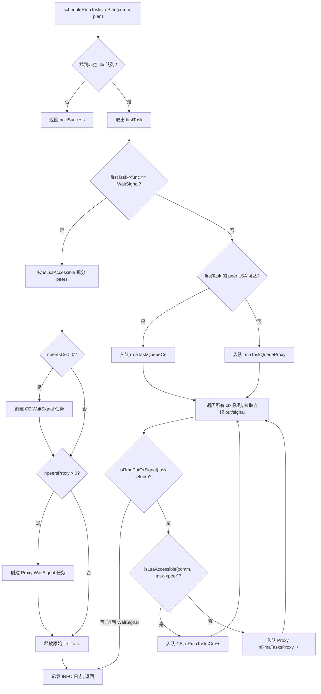
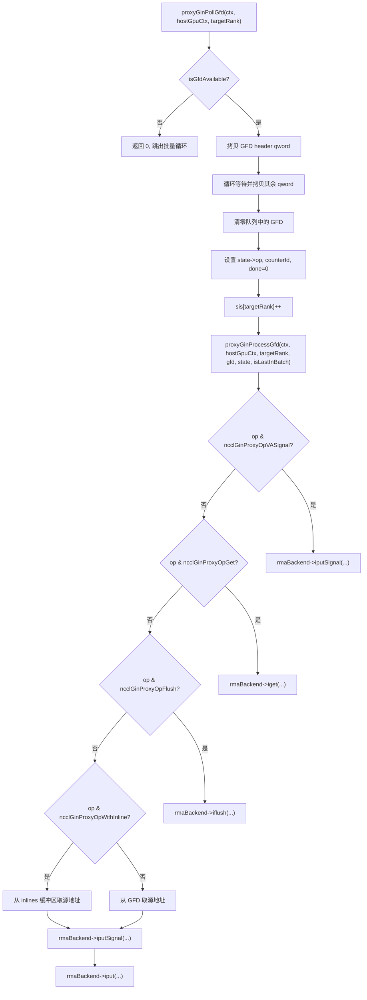

# 第 15 章：RMA 与 GIN：远端内存访问与 GPU 直连通信的演进

上一章我们看到，对称内存让每个 rank 用同一套地址访问所有 rank 的缓冲区，NVLS 则借助 NVSwitch 的多播能力把硬件加速归约推向极致。但集合通信并非全部——当应用需要点对点远程内存操作，或希望 GPU kernel 直接发起网络请求时，就需要 RMA 与 GIN 登场。RMA 提供 put/get 语义的远程内存访问，GIN 则让 GPU 绕过 host proxy 线程直接与网络交互。本章按“先 RMA 后 GIN”的顺序，逐层拆解这两套机制的数据结构、调度逻辑、并发控制与生产陷阱。

## RMA 的双通道模型：CE 与 Proxy 的分工

### 直觉模型

想象一个跨国快递系统：同城快递（LSA 可达的 rank）可以直接由本地配送车送达，而跨城快递（非 LSA 可达的 rank）必须交给航空货运代理。NCCL 的 RMA 正是这个模型——同一个 put 操作，根据目标 rank 是否在 LSA（Load-Store Accessible）团队内，被路由到两条完全不同的执行路径：CE（Copy Engine，拷贝引擎）路径和 Proxy（代理线程）路径。

如果没有这个分流机制，所有 RMA 操作都走 proxy 线程，那么同机内的 put 也要经过 host 线程中转，白白增加一次 host-device 往返延迟。反之，如果所有操作都走 CE，跨机操作就无法利用网络插件的异步能力。

### 数据结构与内存布局

RMA 的核心调度结构是 `ncclRmaArgs`，它记录了一个 plan 中 RMA 任务的分流结果。关键字段包括：

| 字段 | 含义 |
|------|------|
| `func` | 操作类型（PutSignal / Signal / WaitSignal） |
| `nRmaTasks` | 总任务数 |
| `nRmaTasksProxy` | 走 proxy 路径的任务数 |
| `nRmaTasksCe` | 走 CE 路径的任务数 |

每个 plan 内部维护两个侵入式队列：`rmaTaskQueueCe` 和 `rmaTaskQueueProxy`，分别存放两条路径的任务。[FACT:src/rma/rma.cc:166-171](https://github.com/NVIDIA/nccl/blob/12df1a11afad322be5a204a2db890161cbf8131d/src/rma/rma.cc#L166-L171)

判断一个 rank 是否 LSA 可达的逻辑很直接——遍历 `lsaRankList` 数组做线性查找。[FACT:src/rma/rma.cc:34-41](https://github.com/NVIDIA/nccl/blob/12df1a11afad322be5a204a2db890161cbf8131d/src/rma/rma.cc#L34-L41) 这个查找在任务调度时对每个 peer 执行一次，复杂度 O(lsaSize)，对于典型的小规模 LSA 团队（通常 2-8 个 rank）开销可忽略。

### Step-by-Step 调度流程

当应用调用一次 RMA put 操作后，任务进入 `planner->rmaTaskQueues[ctx]`。`scheduleRmaTasksToPlan` 负责把队列中的任务分配到 plan 中。[FACT:src/rma/rma.cc:141-296](https://github.com/NVIDIA/nccl/blob/12df1a11afad322be5a204a2db890161cbf8131d/src/rma/rma.cc#L141-L296)

第一步：找到第一个非空的 context 队列。NCCL 支持多个 RMA context（由 `numRmaCtx` 配置），每个 context 有独立的队列。[FACT:src/rma/rma.cc:148-155](https://github.com/NVIDIA/nccl/blob/12df1a11afad322be5a204a2db890161cbf8131d/src/rma/rma.cc#L148-L155)

第二步：取出第一个任务，判断操作类型。如果是 WaitSignal，走特殊的分裂逻辑；如果是 Put/Signal，走批量合并逻辑。[FACT:src/rma/rma.cc:163-168](https://github.com/NVIDIA/nccl/blob/12df1a11afad322be5a204a2db890161cbf8131d/src/rma/rma.cc#L163-L168)

对于 WaitSignal 任务，调度器需要把 peers 列表按 LSA 可达性拆分成两组：CE 组和 Proxy 组。[FACT:src/rma/rma.cc:187-204](https://github.com/NVIDIA/nccl/blob/12df1a11afad322be5a204a2db890161cbf8131d/src/rma/rma.cc#L187-L204) 拆分后分别创建两个新的 `ncclTaskRma` 结构，各自持有对应组的 peers 数组。[FACT:src/rma/rma.cc:207-246](https://github.com/NVIDIA/nccl/blob/12df1a11afad322be5a204a2db890161cbf8131d/src/rma/rma.cc#L207-L246) 原始任务被释放。[FACT:src/rma/rma.cc:251](https://github.com/NVIDIA/nccl/blob/12df1a11afad322be5a204a2db890161cbf8131d/src/rma/rma.cc#L251)

对于 Put/Signal 任务，逻辑更复杂——调度器会遍历所有 context 的队列，把连续的 put/signal 任务全部拉入同一个 plan，直到遇到 WaitSignal 才停止。[FACT:src/rma/rma.cc:279-295](https://github.com/NVIDIA/nccl/blob/12df1a11afad322be5a204a2db890161cbf8131d/src/rma/rma.cc#L279-L295) 这个设计的目的在注释中写得很清楚：让一次 kernel launch 覆盖所有 context 的 put/signal，proxy 可以在任何阻塞操作之前一次性发起所有异步请求，CE 路径则把所有 context 的拷贝和信号批量提交。[FACT:src/rma/rma.cc:270-278](https://github.com/NVIDIA/nccl/blob/12df1a11afad322be5a204a2db890161cbf8131d/src/rma/rma.cc#L270-L278)

### 并行执行与流同步

调度完成后，`ncclLaunchRma` 根据 `func` 字段分发到 `ncclRmaPut` 或 `ncclRmaWaitSignal`。[FACT:src/rma/rma.cc:109-131](https://github.com/NVIDIA/nccl/blob/12df1a11afad322be5a204a2db890161cbf8131d/src/rma/rma.cc#L109-L131)

以 `ncclRmaPut` 为例，当 plan 中同时存在 proxy 和 CE 任务时，两条路径需要并行执行。NCCL 的做法是：在输入流上记录一个 event，让 CE 流等待这个 event，然后同时在两条流上启动操作，最后在 CE 流上再记录一个 event，让输入流等待它。[FACT:src/rma/rma.cc:80-96](https://github.com/NVIDIA/nccl/blob/12df1a11afad322be5a204a2db890161cbf8131d/src/rma/rma.cc#L80-L96) 这个 event 链确保了：CE 操作不会在输入流的依赖就绪前开始，输入流的后续操作也不会在 CE 完成前开始。

如果只有 proxy 任务或只有 CE 任务，则直接在输入流上启动对应操作，无需额外的流同步。[FACT:src/rma/rma.cc:97-101](https://github.com/NVIDIA/nccl/blob/12df1a11afad322be5a204a2db890161cbf8131d/src/rma/rma.cc#L97-L101)

### 设计思考与生产陷阱

**陷阱一：LSA 可达性判断的静态性。** `isLsaAccessible` 在调度时查询 `comm->devrState.lsaRankList`，这个列表在通信域初始化后就不再变化。如果运行过程中拓扑发生变化（比如 NVLink 故障降级），LSA 列表不会自动更新，可能导致本应走 proxy 的操作仍然走 CE 路径，触发不可恢复的错误。

**陷阱二：批量合并的 FIFO 保证。** 批量合并逻辑只拉取连续的 put/signal 任务，遇到 WaitSignal 就停止。[FACT:src/rma/rma.cc:283](https://github.com/NVIDIA/nccl/blob/12df1a11afad322be5a204a2db890161cbf8131d/src/rma/rma.cc#L283) 这保证了每个 context 内的 FIFO 顺序，但跨 context 的任务可能被合并到同一个 plan 中。如果应用依赖跨 context 的操作顺序，需要显式使用 WaitSignal 来建立屏障。

**陷阱三：内存泄漏路径。** 在 WaitSignal 分支中，如果 `npeersProxy == 0`，代码会释放 `peersProxy`、`nsignalsProxy`、`signalIdxsProxy` 三个数组。[FACT:src/rma/rma.cc:239-244](https://github.com/NVIDIA/nccl/blob/12df1a11afad322be5a204a2db890161cbf8131d/src/rma/rma.cc#L239-L244) 但如果 `npeersCe == 0` 且 `npeersProxy > 0`，`peersCe` 等数组是通过 `ncclMemoryStackAlloc` 分配的，不需要手动释放（栈式分配器统一回收）。[FACT:src/rma/rma.cc:176-178](https://github.com/NVIDIA/nccl/blob/12df1a11afad322be5a204a2db890161cbf8131d/src/rma/rma.cc#L176-L178) 这个不对称性容易让读者困惑，但实际上是正确的——栈分配的内存由 `comm->memScoped` 统一管理。

## RMA Proxy 上下文：信号、队列与无锁环形缓冲

### 直觉模型

Proxy 上下文就像一个"邮局分拣中心"：GPU 把要发送的包裹（put 请求）放进收件箱（环形缓冲），proxy 线程从收件箱取出包裹，交给快递公司（网络插件），快递公司送达后在回执单（信号）上盖章。整个过程中，GPU 和 proxy 线程通过无锁数据结构通信，避免昂贵的锁竞争。

### 数据结构与内存布局

`ncclRmaProxyCtx` 是 proxy 上下文的宿主结构，其核心字段包括：

**信号区（signalsDev）**：在 GPU 上分配的一块内存，大小为 `nRanks * numRmaSig * sizeof(uint64_t)`。[FACT:src/rma/rma_proxy.cc:120-123](https://github.com/NVIDIA/nccl/blob/12df1a11afad322be5a204a2db890161cbf8131d/src/rma/rma_proxy.cc#L120-L123) 每个 rank 有 `numRmaSig` 个信号槽，用于接收来自该 rank 的信号。这块内存注册到网络插件时带有 `NCCL_NET_MR_FLAG_FORCE_SO`（强制强序）和 `NCCL_NET_MR_FLAG_SIGNAL_NEVER_RESET`（信号永不重置）标志。[FACT:src/rma/rma_proxy.cc:125-127](https://github.com/NVIDIA/nccl/blob/12df1a11afad322be5a204a2db890161cbf8131d/src/rma/rma_proxy.cc#L125-L127) 强序标志确保 put 和 signal 之间的顺序关系——如果 put 先于 signal 发出，网络必须保证 signal 在 put 数据到达后才写入。

**序列号区（opSeqs/readySeqs/doneSeqs）**：每个 rank 一组，通过 `allocMemCPUAccessible` 分配，可能是 GDR（GPU Direct RDMA）内存或普通 host 内存。[FACT:src/rma/rma_proxy.cc:132-137](https://github.com/NVIDIA/nccl/blob/12df1a11afad322be5a204a2db890161cbf8131d/src/rma/rma_proxy.cc#L132-L137) 这三个序列号分别追踪：已提交的操作序号、已就绪的操作序号、已完成的操作序号。

**无锁环形缓冲（circularBuffers）**：大小为 `nRanks * queueSize` 的指针数组，每个 rank 一个独立的环形队列。[FACT:src/rma/rma_proxy.cc:163-164](https://github.com/NVIDIA/nccl/blob/12df1a11afad322be5a204a2db890161cbf8131d/src/rma/rma_proxy.cc#L163-L164) 配套的 `pis`（Producer Index）和 `cis`（Consumer Index）数组各 `nRanks` 个元素。[FACT:src/rma/rma_proxy.cc:165-166](https://github.com/NVIDIA/nccl/blob/12df1a11afad322be5a204a2db890161cbf8131d/src/rma/rma_proxy.cc#L165-L166) 队列大小必须是 2 的幂，这样索引回绕可以用位与运算 `& (queueSize - 1)` 代替取模。[FACT:src/rma/rma_proxy.cc:156-160](https://github.com/NVIDIA/nccl/blob/12df1a11afad322be5a204a2db890161cbf8131d/src/rma/rma_proxy.cc#L156-L160)

**InProgress 队列**：每个 peer 一个侵入式链表，存放已提交给网络插件但尚未完成的描述符。[FACT:src/rma/rma_proxy.cc:170-175](https://github.com/NVIDIA/nccl/blob/12df1a11afad322be5a204a2db890161cbf8131d/src/rma/rma_proxy.cc#L170-L175) 这是单消费者队列，只有 proxy 线程访问，无需原子操作。

### Step-by-Step：从上下文创建到进度推进

**上下文创建**：`ncclRmaProxyCreateContext` 首先通过 RMA 插件创建网络上下文。[FACT:src/rma/rma_proxy.cc:229](https://github.com/NVIDIA/nccl/blob/12df1a11afad322be5a204a2db890161cbf8131d/src/rma/rma_proxy.cc#L229) 然后调用 `ncclRmaProxyCtxAlloc` 分配信号、序列号、环形缓冲等资源。[FACT:src/rma/rma_proxy.cc:231](https://github.com/NVIDIA/nccl/blob/12df1a11afad322be5a204a2db890161cbf8131d/src/rma/rma_proxy.cc#L231) 接着调用 `ncclRmaProxyCtxAllocGraph` 分配图捕获模式所需的资源——CPU 可访问的信号、flush 缓冲、持久化队列。[FACT:src/rma/rma_proxy.cc:232](https://github.com/NVIDIA/nccl/blob/12df1a11afad322be5a204a2db890161cbf8131d/src/rma/rma_proxy.cc#L232)

图捕获模式的存在是因为 CUDA Graph 要求所有操作可重放。在普通模式下，信号在 GPU 内存中，proxy 通过 GDR 读取；在图捕获模式下，信号在 CPU 可访问内存中，proxy 可以直接读写，避免 GDR 的不确定性。[FACT:src/rma/rma_proxy.cc:184-190](https://github.com/NVIDIA/nccl/blob/12df1a11afad322be5a204a2db890161cbf8131d/src/rma/rma_proxy.cc#L184-L190)

**进度线程**：`ncclRmaProxyProgressThread` 是 proxy 的主循环。[FACT:src/rma/rma_proxy.cc:354-389](https://github.com/NVIDIA/nccl/blob/12df1a11afad322be5a204a2db890161cbf8131d/src/rma/rma_proxy.cc#L354-L389) 它根据 `rmaProgress` 状态字决定行为：

- `rmaProgress == 1`：正常推进模式，遍历所有 proxy 上下文调用 `ncclRmaProxyProgress`。[FACT:src/rma/rma_proxy.cc:361-372](https://github.com/NVIDIA/nccl/blob/12df1a11afad322be5a204a2db890161cbf8131d/src/rma/rma_proxy.cc#L361-L372)
- `rmaProgress == 2`：暂停模式，用于资源回收。线程确认暂停后等待条件变量。[FACT:src/rma/rma_proxy.cc:373-378](https://github.com/NVIDIA/nccl/blob/12df1a11afad322be5a204a2db890161cbf8131d/src/rma/rma_proxy.cc#L373-L378)
- `rmaProgress == -1`：退出信号，线程返回。[FACT:src/rma/rma_proxy.cc:379-380](https://github.com/NVIDIA/nccl/blob/12df1a11afad322be5a204a2db890161cbf8131d/src/rma/rma_proxy.cc#L379-L380)
- `rmaProgress == 0`：空闲等待。[FACT:src/rma/rma_proxy.cc:381-382](https://github.com/NVIDIA/nccl/blob/12df1a11afad322be5a204a2db890161cbf8131d/src/rma/rma_proxy.cc#L381-L382)

如果 `ncclRmaProxyProgress` 返回错误，线程把错误码写入 `asyncResult`，设置 `rmaProgress = -2`，然后退出。[FACT:src/rma/rma_proxy.cc:365-369](https://github.com/NVIDIA/nccl/blob/12df1a11afad322be5a204a2db890161cbf8131d/src/rma/rma_proxy.cc#L365-L369) 这个错误码会被主线程在后续的 `ncclCommGetAsyncError` 调用中读取。

### 并发控制与内存序

RMA proxy 的并发模型是"单生产者-单消费者"：GPU kernel 是生产者，proxy 线程是消费者。环形缓冲的 PI 由 GPU 更新，CI 由 proxy 更新。由于是单生产者单消费者，不需要 CAS 操作，只需要正确的内存序。

信号区的强序标志 `NCCL_NET_MR_FLAG_FORCE_SO` 是关键。[FACT:src/rma/rma_proxy.cc:127](https://github.com/NVIDIA/nccl/blob/12df1a11afad322be5a204a2db890161cbf8131d/src/rma/rma_proxy.cc#L127) 没有这个标志，网络插件可能重排 put 和 signal 的顺序，导致接收方在数据到达前就看到信号，读取到脏数据。

`NCCL_NET_MR_FLAG_SIGNAL_NEVER_RESET` 标志告诉网络插件：信号一旦写入就不会被重置。[FACT:src/rma/rma_proxy.cc:127](https://github.com/NVIDIA/nccl/blob/12df1a11afad322be5a204a2db890161cbf8131d/src/rma/rma_proxy.cc#L127) 这允许插件优化信号的写入路径——不需要每次写入前清零。

### 生产陷阱

**陷阱一：队列大小不是 2 的幂。** 如果用户通过 `NCCL_RMA_PROXY_QUEUE_SIZE` 设置了一个非 2 的幂的值，代码会回退到默认值并打印 INFO 日志。[FACT:src/rma/rma_proxy.cc:156-159](https://github.com/NVIDIA/nccl/blob/12df1a11afad322be5a204a2db890161cbf8131d/src/rma/rma_proxy.cc#L156-L159) 这个回退是静默的（只有 INFO 级别），在生产环境中容易被忽略。如果用户期望更大的队列来吸收突发流量，实际使用的却是默认值，可能导致背压。

**陷阱二：DMA-BUF 注册失败的回退链。** `ncclRmaProxyRegMrSym` 对 CUDA 内存的注册有三层回退：先尝试 DataDirect 模式的 DMA-BUF，失败后尝试非 DataDirect 的 DMA-BUF，再失败才回退到普通 `regMrSym`。[FACT:src/rma/rma_proxy.cc:76-108](https://github.com/NVIDIA/nccl/blob/12df1a11afad322be5a204a2db890161cbf8131d/src/rma/rma_proxy.cc#L76-L108) 注释中特别警告：如果一个 MR 进入了非 DataDirect 路径，所有其他 MR 也必须如此，混合使用会破坏 GIN 的顺序保证。[FACT:src/gin/gin_host_proxy.cc:429-430](https://github.com/NVIDIA/nccl/blob/12df1a11afad322be5a204a2db890161cbf8131d/src/gin/gin_host_proxy.cc#L429-L430) 这个约束在 RMA 路径中没有显式检查，是一个潜在的隐患。

**陷阱三：进度线程的错误传播延迟。** 当 `ncclRmaProxyProgress` 返回错误时，线程设置 `asyncResult` 并退出。[FACT:src/rma/rma_proxy.cc:366-369](https://github.com/NVIDIA/nccl/blob/12df1a11afad322be5a204a2db890161cbf8131d/src/rma/rma_proxy.cc#L366-L369) 但主线程可能正在执行一个长时间的 kernel，不会立即检查 `asyncResult`。在这段时间内，后续的 RMA 操作会继续入队但不会被处理，直到主线程发现错误。这是异步错误传播的固有延迟，应用需要定期调用 `ncclCommGetAsyncError` 来缩短这个窗口。

## GIN 架构：GPU 直接发起网络请求

### 直觉模型

传统模式下，GPU 要发送网络数据，必须经过"GPU → host 内存 → proxy 线程 → 网卡"的路径。GIN（GPU-Initiated Networking）的目标是让 GPU 直接写网卡的发送队列，就像 CPU 直接写网卡的 MMIO 寄存器一样。这需要网卡支持 GPU 发起的 doorbell 写入，以及一套 GPU 和 proxy 线程之间的通信协议。

### 数据结构与内存布局

GIN 的核心数据结构是 `ginProxyHostGpuCtx`，它代表一个 GPU-host 通信上下文：

| 字段 | 类型 | 含义 |
|------|------|------|
| `queues` | `ncclGinProxyGfd_t*` | GFD 队列，大小 `nRanks * queueSize` |
| `pis` | `uint32_t*` | 生产者索引（GPU 写） |
| `cis` | `uint32_t*` | 消费者索引（proxy 写） |
| `cisShadow` | `uint32_t*` | CI 的影子副本（proxy 本地） |
| `sis` | `uint32_t*` | 已见索引（proxy 本地） |
| `states` | `ginProxyGfdState*` | 每个 GFD 槽的状态 |
| `inlines` | `uint64_t*` | 内联数据缓冲区 |

GFD（GIN Forwarding Descriptor）是 GPU 写给 proxy 的请求描述符。每个 GFD 由多个 qword 组成，包含操作类型、源地址、目标地址、大小、信号信息等。[FACT:src/gin/gin_host_proxy.cc:158-163](https://github.com/NVIDIA/nccl/blob/12df1a11afad322be5a204a2db890161cbf8131d/src/gin/gin_host_proxy.cc#L158-L163)

`queues` 数组的内存分配有一个关键细节：它通过 `allocMemCPUAccessible` 分配，但传入了 `forceHost=true` 参数。[FACT:src/gin/gin_host_proxy.cc:564](https://github.com/NVIDIA/nccl/blob/12df1a11afad322be5a204a2db890161cbf8131d/src/gin/gin_host_proxy.cc#L564) 这意味着队列本身在 host 内存中，GPU 通过 PCIe 写入。而 `cis` 数组则分配在 GPU 可访问内存中（可能是 GDR），因为 proxy 需要频繁更新它。[FACT:src/gin/gin_host_proxy.cc:565-566](https://github.com/NVIDIA/nccl/blob/12df1a11afad322be5a204a2db890161cbf8131d/src/gin/gin_host_proxy.cc#L565-L566)

`cisShadow` 和 `sis` 是 proxy 线程的本地副本，避免每次都读取可能位于 GPU 内存的 `cis`。[FACT:src/gin/gin_host_proxy.cc:44-47](https://github.com/NVIDIA/nccl/blob/12df1a11afad322be5a204a2db890161cbf8131d/src/gin/gin_host_proxy.cc#L44-L47) 只有当 `cisShadow` 前进时，才批量更新 `cis`。

### Step-by-Step：GFD 的轮询与处理

`ncclGinProxyProgress` 是 GIN proxy 的主循环。[FACT:src/gin/gin_host_proxy.cc:648-669](https://github.com/NVIDIA/nccl/blob/12df1a11afad322be5a204a2db890161cbf8131d/src/gin/gin_host_proxy.cc#L648-L669)

第一步：对每个 context，先调用 `proxyGinPollCompletions` 检查已提交请求的完成状态。[FACT:src/gin/gin_host_proxy.cc:653](https://github.com/NVIDIA/nccl/blob/12df1a11afad322be5a204a2db890161cbf8131d/src/gin/gin_host_proxy.cc#L653)

第二步：对每个 target rank，批量轮询 GFD。`pollBatch` 控制每次最多处理多少个 GFD。[FACT:src/gin/gin_host_proxy.cc:654-655](https://github.com/NVIDIA/nccl/blob/12df1a11afad322be5a204a2db890161cbf8131d/src/gin/gin_host_proxy.cc#L654-L655)

第三步：`proxyGinPollGfd` 检查队列头部是否有新的 GFD。判断依据是 GFD 头部的 flag 位是否非零。[FACT:src/gin/gin_host_proxy.cc:176-182](https://github.com/NVIDIA/nccl/blob/12df1a11afad322be5a204a2db890161cbf8131d/src/gin/gin_host_proxy.cc#L176-L182) 如果有，先拷贝第一个 qword（头部），然后等待其余 qword 就绪。[FACT:src/gin/gin_host_proxy.cc:194-202](https://github.com/NVIDIA/nccl/blob/12df1a11afad322be5a204a2db890161cbf8131d/src/gin/gin_host_proxy.cc#L194-L202) 拷贝完成后，把队列中的 GFD 清零，防止重复处理。[FACT:src/gin/gin_host_proxy.cc:206-208](https://github.com/NVIDIA/nccl/blob/12df1a11afad322be5a204a2db890161cbf8131d/src/gin/gin_host_proxy.cc#L206-L208)

第四步：`proxyGinProcessGfd` 根据操作类型分发到不同的处理路径。[FACT:src/gin/gin_host_proxy.cc:246-340](https://github.com/NVIDIA/nccl/blob/12df1a11afad322be5a204a2db890161cbf8131d/src/gin/gin_host_proxy.cc#L246-L340)

### 完成轮询与计数器更新

`proxyGinPollCompletions` 负责检查已提交请求的完成状态。[FACT:src/gin/gin_host_proxy.cc:113-156](https://github.com/NVIDIA/nccl/blob/12df1a11afad322be5a204a2db890161cbf8131d/src/gin/gin_host_proxy.cc#L113-L156)

对每个 target rank，从 `cisShadow` 到 `sis` 遍历所有已见但未消费的 GFD 状态。[FACT:src/gin/gin_host_proxy.cc:117](https://github.com/NVIDIA/nccl/blob/12df1a11afad322be5a204a2db890161cbf8131d/src/gin/gin_host_proxy.cc#L117) 如果状态未完成，调用 `rmaBackend->test` 检查。[FACT:src/gin/gin_host_proxy.cc:122](https://github.com/NVIDIA/nccl/blob/12df1a11afad322be5a204a2db890161cbf8131d/src/gin/gin_host_proxy.cc#L122) 如果完成且操作带有计数器标志，更新计数器值。[FACT:src/gin/gin_host_proxy.cc:132-141](https://github.com/NVIDIA/nccl/blob/12df1a11afad322be5a204a2db890161cbf8131d/src/gin/gin_host_proxy.cc#L132-L141)

计数器更新使用原子加载和原子存储，但注释解释了为什么不需要原子加法：GPU kernel 不允许在有未完成操作时重置计数器，因此不存在竞争。[FACT:src/gin/gin_host_proxy.cc:133-135](https://github.com/NVIDIA/nccl/blob/12df1a11afad322be5a204a2db890161cbf8131d/src/gin/gin_host_proxy.cc#L133-L135)

CI 的更新有一个"允许空洞"的机制：只有当 `state->done && i == cisShadow[targetRank]` 时才推进 CI。[FACT:src/gin/gin_host_proxy.cc:145-151](https://github.com/NVIDIA/nccl/blob/12df1a11afad322be5a204a2db890161cbf8131d/src/gin/gin_host_proxy.cc#L145-L151) 这确保了 CI 是单调递增的，即使某些 GFD 先完成，也不会跳过未完成的 GFD。

### 并发控制与内存屏障

GIN proxy 的并发模型比 RMA proxy 更复杂，因为存在多个 proxy 线程（由 `GIN_PROXY_NTHREADS` 控制）。[FACT:src/gin/gin_host.cc:90](https://github.com/NVIDIA/nccl/blob/12df1a11afad322be5a204a2db890161cbf8131d/src/gin/gin_host.cc#L90)

`ncclGinProgress` 中，每个线程负责一组连接：线程 t 处理连接 t, t+proxyNthreads, t+2*proxyNthreads, ...。[FACT:src/gin/gin_host.cc:72](https://github.com/NVIDIA/nccl/blob/12df1a11afad322be5a204a2db890161cbf8131d/src/gin/gin_host.cc#L72) 这个分配方式确保了每个连接只被一个线程处理，避免了连接级别的竞争。

devComms 链表的修改需要写锁保护。`ginProgressWriteLock` 先设置 `writePending` 标志，然后获取写锁。[FACT:src/gin/gin_host.cc:43-47](https://github.com/NVIDIA/nccl/blob/12df1a11afad322be5a204a2db890161cbf8131d/src/gin/gin_host.cc#L43-L47) 进度线程在每次循环开始时检查 `writePending`，如果为真则让出 CPU。[FACT:src/gin/gin_host.cc:63-66](https://github.com/NVIDIA/nccl/blob/12df1a11afad322be5a204a2db890161cbf8131d/src/gin/gin_host.cc#L63-L66) 这个设计避免了进度线程在持有读锁时被写锁阻塞。

`writePending` 使用 `std::atomic<bool>`，但注释指出这个逻辑假设只有一个写者。[FACT:src/gin/gin_host.cc:43-47](https://github.com/NVIDIA/nccl/blob/12df1a11afad322be5a204a2db890161cbf8131d/src/gin/gin_host.cc#L43-L47) 在 NCCL 的使用场景中，只有主线程会修改 devComms 链表，所以这个假设成立。

### 生产陷阱

**陷阱一：GFD 队列的内存位置。** `queues` 被强制分配在 host 内存中（`forceHost=true`），[FACT:src/gin/gin_host_proxy.cc:564](https://github.com/NVIDIA/nccl/blob/12df1a11afad322be5a204a2db890161cbf8131d/src/gin/gin_host_proxy.cc#L564) 这意味着 GPU 写入 GFD 需要经过 PCIe 总线。如果 GFD 写入频率很高（小消息场景），PCIe 带宽可能成为瓶颈。相比之下，`cis` 分配在 GPU 可访问内存中，因为 proxy 需要频繁更新它。[FACT:src/gin/gin_host_proxy.cc:565-566](https://github.com/NVIDIA/nccl/blob/12df1a11afad322be5a204a2db890161cbf8131d/src/gin/gin_host_proxy.cc#L565-L566)

**陷阱二：内联数据的重建。** 当 GFD 带有内联数据时，proxy 需要从多个 qword 中重建内联值。[FACT:src/gin/gin_host_proxy.cc:298-305](https://github.com/NVIDIA/nccl/blob/12df1a11afad322be5a204a2db890161cbf8131d/src/gin/gin_host_proxy.cc#L298-L305) 重建逻辑根据 size 决定读取哪些 qword：size ≤ 4 只读低 32 位，size > 4 读低 64 位，size > 6 再读高 16 位。这个分段逻辑与 GPU 侧的写入逻辑必须严格对应，任何不一致都会导致数据损坏。

**陷阱三：多线程进度与连接分配。** 如果不同 rank 设置了不同的 `GIN_PROXY_NTHREADS`，经过 AllGather 取最小值后，某些线程可能没有分配到任何连接。[FACT:src/gin/gin_host.cc:181-183](https://github.com/NVIDIA/nccl/blob/12df1a11afad322be5a204a2db890161cbf8131d/src/gin/gin_host.cc#L181-L183) 注释指出这些线程会在 stride 循环中空转，不会造成正确性问题，但会浪费 CPU 资源。

## GIN 后端选择与版本兼容

### 直觉模型

GIN 支持多种后端：Proxy（基于 RMA 插件的软件模拟）、GDAKI（GPU Direct Async Kernel Initiated）、GPI（GPU-Initiated）、EFA GDA（AWS EFA 的 GPU Direct Async）。这就像同一个 API 可以有多种实现——软件模拟版兼容性最好但性能一般，硬件卸载版性能最好但需要特定网卡支持。

### 后端版本矩阵

每种后端有一个版本兼容数组，索引是后端版本号，值是该版本要求的最低 NCCL 版本。[FACT:src/gin/gin_host.cc:27-33](https://github.com/NVIDIA/nccl/blob/12df1a11afad322be5a204a2db890161cbf8131d/src/gin/gin_host.cc#L27-L33)

| 后端 | 版本 0 | 版本 1 | 版本 2 | 版本 3 |
|------|--------|--------|--------|--------|
| Proxy | 0 | 2.30.3 | 2.30.5 | 2.32.0 |
| GDAKI | 0 | 2.30.3 | 2.30.5 | - |
| GPI | 0 | 2.30.5 | - | - |
| EFA GDA | 0 | 2.31.0 | 2.32.0 | - |

版本选择逻辑：遍历版本数组，找到第一个要求版本高于当前设备代码版本的条目，前一个版本即为可用版本。[FACT:src/gin/gin_host.cc:300-304](https://github.com/NVIDIA/nccl/blob/12df1a11afad322be5a204a2db890161cbf8131d/src/gin/gin_host.cc#L300-L304)

### 后端选择流程

`ncclGinDevCommSetup` 遍历所有活跃后端，尝试用每个后端创建 DevComm。[FACT:src/gin/gin_host.cc:427-442](https://github.com/NVIDIA/nccl/blob/12df1a11afad322be5a204a2db890161cbf8131d/src/gin/gin_host.cc#L427-L442) 选择条件包括：请求的 GIN 类型匹配（或未指定）、信号能力满足要求。[FACT:src/gin/gin_host.cc:430-435](https://github.com/NVIDIA/nccl/blob/12df1a11afad322be5a204a2db890161cbf8131d/src/gin/gin_host.cc#L430-L435)

`ncclGinValidateSignalRequest` 检查两个能力：强信号（`supportsStrongSignals`）和 VA 信号（`supportsVASignals`）。[FACT:src/gin/gin_host.cc:230-243](https://github.com/NVIDIA/nccl/blob/12df1a11afad322be5a204a2db890161cbf8131d/src/gin/gin_host.cc#L230-L243) 如果请求要求强信号但后端不支持，跳过该后端。

### 连接建立与 stride 计算

`ncclGinConnectOnce` 建立 GIN 连接。[FACT:src/gin/gin_host.cc:92-228](https://github.com/NVIDIA/nccl/blob/12df1a11afad322be5a204a2db890161cbf8131d/src/gin/gin_host.cc#L92-L228)

连接类型决定 stride：FULL 模式下 stride 为 1（连接所有 rank），RAIL 模式下 stride 为 `contiguousRanksPerHost`（只连接同一 rail 的 rank）。[FACT:src/gin/gin_host.cc:139-145](https://github.com/NVIDIA/nccl/blob/12df1a11afad322be5a204a2db890161cbf8131d/src/gin/gin_host.cc#L139-L145)

在 `ginDevCommSetupWithBackend` 中，stride 的校验逻辑很严格：

- 请求的 stride 不能为 0。[FACT:src/gin/gin_host.cc:318-323](https://github.com/NVIDIA/nccl/blob/12df1a11afad322be5a204a2db890161cbf8131d/src/gin/gin_host.cc#L318-L323)
- 请求的 stride 不能大于 rail team 的 stride。[FACT:src/gin/gin_host.cc:324-330](https://github.com/NVIDIA/nccl/blob/12df1a11afad322be5a204a2db890161cbf8131d/src/gin/gin_host.cc#L324-L330)
- 请求的 stride 必须是已连接 stride 的倍数。[FACT:src/gin/gin_host.cc:331-337](https://github.com/NVIDIA/nccl/blob/12df1a11afad322be5a204a2db890161cbf8131d/src/gin/gin_host.cc#L331-L337)

这些约束的动机是：分层屏障假设 GIN 至少是 RAIL 连接的。[FACT:src/gin/gin_host.cc:325](https://github.com/NVIDIA/nccl/blob/12df1a11afad322be5a204a2db890161cbf8131d/src/gin/gin_host.cc#L325) 如果 stride 不满足这些条件，某些 rank 之间的通信路径可能不存在。

### 生产陷阱

**陷阱一：后端版本不匹配。** 如果设备代码版本低于后端要求的最低版本，`backendVersion` 会停留在较低值。[FACT:src/gin/gin_host.cc:301-303](https://github.com/NVIDIA/nccl/blob/12df1a11afad322be5a204a2db890161cbf8131d/src/gin/gin_host.cc#L301-L303) 这可能导致某些新特性不可用（比如信号永不重置），但不会导致错误。然而，如果设备代码版本高于所有已知版本，`backendVersion` 会取最大值，可能触发未定义行为。

**陷阱二：stride 校验的边界。** 如果 `requestedStride % connectedStride != 0`，创建失败。[FACT:src/gin/gin_host.cc:331-337](https://github.com/NVIDIA/nccl/blob/12df1a11afad322be5a204a2db890161cbf8131d/src/gin/gin_host.cc#L331-L337) 这个检查假设 connectedStride 是 2 的幂（FULL 模式为 1，RAIL 模式为 `contiguousRanksPerHost`）。如果 `contiguousRanksPerHost` 不是 2 的幂（比如 3），倍数检查可能拒绝合法的 stride。

## 本章思考与自测

Q1: 在 `scheduleRmaTasksToPlan` 的 WaitSignal 分支中，如果去掉 `plan->rmaArgs->nRmaTasks = (npeersCe > 0 ? 1 : 0) + (npeersProxy > 0 ? 1 : 0)` 这一行，改为直接设为 1，在什么场景下会导致问题？

**参考解析**：看 [FACT:src/rma/rma.cc:248](https://github.com/NVIDIA/nccl/blob/12df1a11afad322be5a204a2db890161cbf8131d/src/rma/rma.cc#L248)。`nRmaTasks` 记录的是实际入队的任务数。如果所有 peers 都是 LSA 可达的（`npeersProxy == 0`），实际只有 1 个 CE 任务入队，`nRmaTasks` 应该为 1。如果所有 peers 都不可达（`npeersCe == 0`），实际只有 1 个 Proxy 任务入队，`nRmaTasks` 也应该为 1。但如果 peers 混合分布，两个任务都入队，`nRmaTasks` 应该为 2。

如果把这一行改为 `plan->rmaArgs->nRmaTasks = 1`，在混合分布场景下，`nRmaTasks` 会低估实际任务数。后续 `ncclRmaWaitSignal` 中的判断 `plan->rmaArgs->nRmaTasksProxy > 0 && plan->rmaArgs->nRmaTasksCe > 0` 仍然能正确工作（因为用的是 `nRmaTasksProxy` 和 `nRmaTasksCe`），[FACT:src/rma/rma.cc:47](https://github.com/NVIDIA/nccl/blob/12df1a11afad322be5a204a2db890161cbf8131d/src/rma/rma.cc#L47) 但任何依赖 `nRmaTasks` 做资源估算或日志统计的代码会得到错误结果。更严重的是，如果后续代码用 `nRmaTasks` 来分配数组或计算循环次数，可能导致缓冲区溢出或任务遗漏。

Q2: 在 `proxyGinPollGfd` 中，如果把 `hostGpuCtx->sis[targetRank]++` 移到 `proxyGinProcessGfd` 调用之后，在什么并发场景下会导致 GFD 被重复处理？

**参考解析**：看 [FACT:src/gin/gin_host_proxy.cc:228](https://github.com/NVIDIA/nccl/blob/12df1a11afad322be5a204a2db890161cbf8131d/src/gin/gin_host_proxy.cc#L228)。`sis` 是"已见索引"，表示 proxy 已经看到并开始处理的 GFD 数量。`proxyGinPollGfd` 在拷贝完 GFD 后立即递增 `sis`，然后返回 1 表示成功。调用者 `ncclGinProxyProgress` 在循环中调用 `proxyGinPollGfd`，如果返回 1 则继续处理下一个 GFD。[FACT:src/gin/gin_host_proxy.cc:648-669](https://github.com/NVIDIA/nccl/blob/12df1a11afad322be5a204a2db890161cbf8131d/src/gin/gin_host_proxy.cc#L648-L669)

如果把 `sis++` 移到 `proxyGinProcessGfd` 之后，那么在 `proxyGinProcessGfd` 执行期间（可能涉及网络插件的异步调用），`sis` 仍然指向当前 GFD。如果此时 GPU 写入了一个新的 GFD 到同一个槽位（因为队列是环形的，`pis` 可能已经回绕），`proxyGinPollGfd` 会再次看到这个槽位，但 `sis` 没有前进，导致重复处理同一个槽位。

更危险的是，`proxyGinPollGfd` 在拷贝 GFD 后会清零队列中的 GFD。[FACT:src/gin/gin_host_proxy.cc:206-208](https://github.com/NVIDIA/nccl/blob/12df1a11afad322be5a204a2db890161cbf8131d/src/gin/gin_host_proxy.cc#L206-L208) 如果 `sis` 没有前进，下一次轮询会看到清零后的 GFD（flag 为 0），`isGfdAvailable` 返回 false，导致 GFD 丢失。这会造成 GPU 侧等待一个永远不会被处理的请求，最终死锁。

Q3: 在 `ncclRmaProxyProgressThread` 中，如果 `rmaProgress == 2` 分支中忘记调用 `rmaProxyState->cond.notify_one()`，在什么场景下会导致主线程永久阻塞？

**参考解析**：看 [FACT:src/rma/rma_proxy.cc:373-378](https://github.com/NVIDIA/nccl/blob/12df1a11afad322be5a204a2db890161cbf8131d/src/rma/rma_proxy.cc#L373-L378)。`rmaProgress == 2` 是"暂停请求"状态，用于资源回收。主线程设置 `rmaProgress = 2` 后，会等待进度线程确认暂停。进度线程在 `cond.wait(lock)` 中等待，主线程需要调用 `cond.notify_one()` 来唤醒它。[FACT:src/rma/rma_proxy.cc:377](https://github.com/NVIDIA/nccl/blob/12df1a11afad322be5a204a2db890161cbf8131d/src/rma/rma_proxy.cc#L377)

如果进度线程在设置 `rmaProgress = 0` 后忘记 `notify_one()`，主线程会一直等待条件变量。但更关键的是，进度线程在 `cond.wait(lock)` 中等待时，主线程需要先获取锁才能设置 `rmaProgress = 2`。如果进度线程在 `wait` 之前没有释放锁，主线程无法获取锁，形成死锁。

正确的顺序是：进度线程设置 `rmaProgress = 0`，调用 `notify_one()` 唤醒主线程，然后调用 `cond.wait(lock)` 释放锁并等待。主线程被唤醒后获取锁，设置 `rmaProgress = 2`，调用 `notify_one()` 唤醒进度线程，然后等待进度线程确认。进度线程被唤醒后，设置 `rmaProgress = 0`，再次 `notify_one()`，然后 `wait`。这个握手协议中任何一步的 `notify_one()` 缺失都会导致永久阻塞。

从 RMA 的 put/get 语义到 GIN 的 GPU 发起网络通信，我们走完了 NCCL 向通用远程内存访问引擎演进的关键一步。但无论机制多么精巧，最终都要通过插件体系与外部网络后端、调优策略和性能采集器对接。下一章将进入插件世界，看 NCCL 如何在不修改核心代码的前提下，动态加载 net、tuner、profiler、env 等扩展，并以 google-fastsocket 和 google-CoMMA 为例揭示生态扩展性的实现要点。