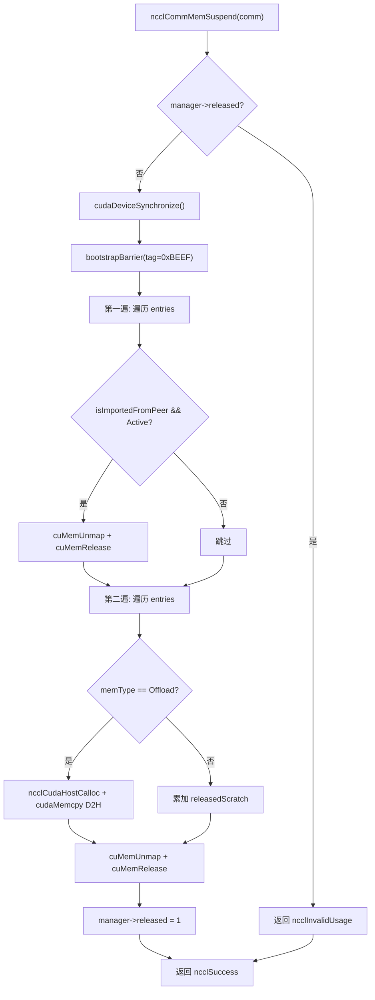
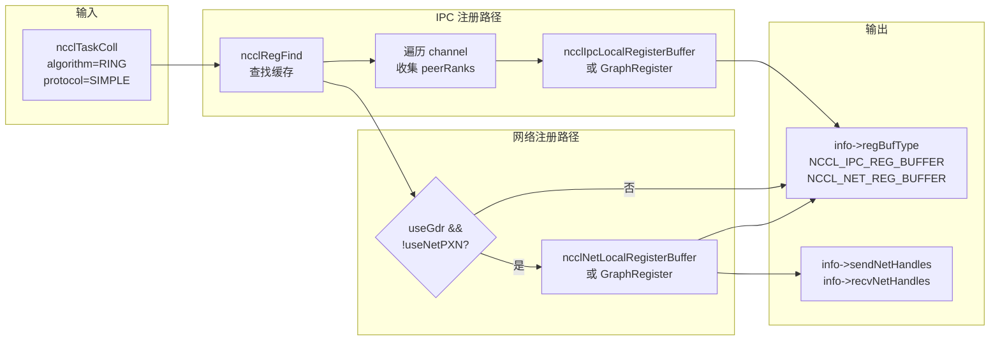
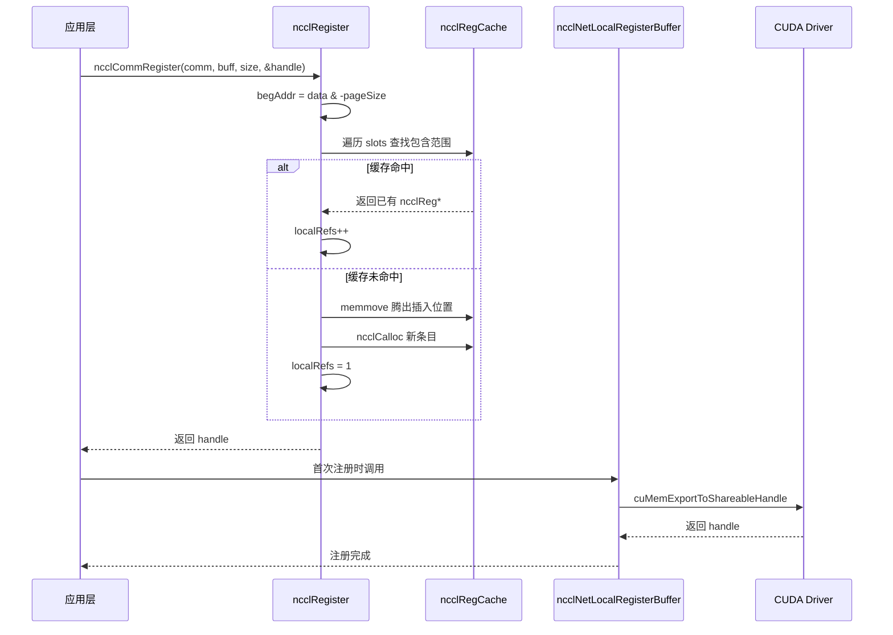

# 第 18 章：内存分配与显存管理：allocator、注册缓存与用户注册内存优化

上一章我们看到 RAS 子系统如何在控制面上独立于数据面运行，用哈希做版本、用引用计数保护生命周期。本章进入 NCCL 的第三个支柱——内存管理。通信性能的上限，往往不取决于算法本身，而取决于「数据能不能被网卡直接读写」。NCCL 为此构建了三层机制：底层用 `ncclSpace` 和 `ncclShadowPool` 管理地址空间与影子对象，中层用 `ncclMemManager` 跟踪动态内存的导入导出与挂起恢复，上层用 `ncclCommRegister` 把用户缓冲区注册进缓存，避免每次通信都重复 pin 内存。本章将逐层拆解这三套机制，回答「为什么 NCCL 通信前需要注册内存」以及「注册缓存如何影响性能」。

## 18.1 ncclSpace：把地址空间切成满/空交替的段

### 直觉模型

想象一条无限长的停车位编号线，从 0 开始向右延伸。有些车位停了车（已分配），有些空着（未分配）。`ncclSpace` 就是这条编号线的「车位状态记录本」——它不记录每个车位，只记录「状态发生翻转的边界点」。若没有它，NCCL 在管理对称内存的虚拟地址区间时，就得为每个字节维护一个标记位，内存开销与地址空间成正比，完全不可接受。

### 数据结构与内存布局

`ncclSpace` 的定义极简 [FACT:src/include/allocator.h:20-24](https://github.com/NVIDIA/nccl/blob/12df1a11afad322be5a204a2db890161cbf8131d/src/include/allocator.h#L20-L24)：

```c
struct ncclSpace {
  int count;        // cuts[] 中有效元素个数
  int capacity;     // cuts[] 已分配容量
  int64_t* cuts;    // 升序排列的边界点数组
};
```

核心洞察在源码注释里写得很清楚 [FACT:src/allocator.cc:151-153](https://github.com/NVIDIA/nccl/blob/12df1a11afad322be5a204a2db890161cbf8131d/src/allocator.cc#L151-L153)：`cuts[]` 把非负整数轴切成「满」和「空」交替的段，切割点升序排列，最后一个切割点之后的段必然是空的（未分配前沿）。由此可以推导出判断第 `i` 段是否已满的公式：

```
isFull(i) = (i%2 != ncuts%2)
```

这个公式的含义是：段的满/空状态由「段索引奇偶性」和「切割点总数的奇偶性」共同决定。当 `ncuts` 为偶数时，第 0 段（`cuts[0]` 之前）是空的；当 `ncuts` 为奇数时，第 0 段是满的。这个不变量贯穿整个模块。

### Step-by-Step Walkthrough：一次分配如何改变 cuts[]

代入场景：初始 `ncclSpace` 为空（`count=0`），调用 `ncclSpaceTryAlloc(a, limit=1000, size=100, align=1, &outOffset)`。

**第一步：定位第一个空段** [FACT:src/allocator.cc:209](https://github.com/NVIDIA/nccl/blob/12df1a11afad322be5a204a2db890161cbf8131d/src/allocator.cc#L209)。`i = a->count % 2`，此时 `count=0`，所以 `i=0`，从第 0 段开始扫描。

**第二步：计算段边界** [FACT:src/allocator.cc:212-213](https://github.com/NVIDIA/nccl/blob/12df1a11afad322be5a204a2db890161cbf8131d/src/allocator.cc#L212-L213)。`i==0` 时 `lo=0`；`i==a->count` 时 `hi=limit=1000`。所以空段是 `[0, 1000)`。

**第三步：对齐并检查容量** [FACT:src/allocator.cc:214-215](https://github.com/NVIDIA/nccl/blob/12df1a11afad322be5a204a2db890161cbf8131d/src/allocator.cc#L214-L215)。`off = alignUp(0, 1) = 0`，`0 + 100 <= 1000` 成立，分配成功。

**第四步：插入切割点** [FACT:src/allocator.cc:217-223](https://github.com/NVIDIA/nccl/blob/12df1a11afad322be5a204a2db890161cbf8131d/src/allocator.cc#L217-L223)。因为 `i==0`（在头部插入），走慢路径 `insertSegment(a, 0, 0, 100)`。`insertSegment` 在 `index=0` 处插入两个切割点 `lo=0, hi=100` [FACT:src/allocator.cc:172-174](https://github.com/NVIDIA/nccl/blob/12df1a11afad322be5a204a2db890161cbf8131d/src/allocator.cc#L172-L174)，然后执行「相邻重复值过滤」[FACT:src/allocator.cc:185-203](https://github.com/NVIDIA/nccl/blob/12df1a11afad322be5a204a2db890161cbf8131d/src/allocator.cc#L185-L203)。过滤逻辑很精妙：它用读写双游标扫描，遇到重复值就回退写游标，把成对的重复值删掉——因为成对重复意味着一个空段被夹在两个满段之间，可以合并。但前导零是特例，可以单独删除 [FACT:src/allocator.cc:182-184](https://github.com/NVIDIA/nccl/blob/12df1a11afad322be5a204a2db890161cbf8131d/src/allocator.cc#L182-L184)。

分配后 `cuts = [0, 100]`，`count=2`。此时 `isFull(0) = (0%2 != 2%2) = false`，第 0 段（`[0,0)`，空）为空；第 1 段（`[0,100)`）为满。正确。

**第五步：释放** [FACT:src/allocator.cc:239-267](https://github.com/NVIDIA/nccl/blob/12df1a11afad322be5a204a2db890161cbf8131d/src/allocator.cc#L239-L267)。调用 `ncclSpaceFree(a, 0, 100)`。先检查 `cuts[count-1] <= offset` 是否成立 [FACT:src/allocator.cc:231-237](https://github.com/NVIDIA/nccl/blob/12df1a11afad322be5a204a2db890161cbf8131d/src/allocator.cc#L231-L237)，即 `100 <= 0` 为假，继续。定位第一个满段 `i = 1 - count%2 = 1 - 0 = 1` [FACT:src/allocator.cc:246](https://github.com/NVIDIA/nccl/blob/12df1a11afad322be5a204a2db890161cbf8131d/src/allocator.cc#L246)，`cuts[1]=100 > 0`，所以 `i=1`。`lo = cuts[0] = 0`，`hi = cuts[1] = 100`。检查 `offset < lo || hi < offset+size` [FACT:src/allocator.cc:252](https://github.com/NVIDIA/nccl/blob/12df1a11afad322be5a204a2db890161cbf8131d/src/allocator.cc#L252)，`0<0` 假，`100<100` 假，通过。因为 `lo==offset` 且 `offset+size==hi`，两个快速路径都不满足（第一个要求 `offset+size != hi`，第二个要求 `lo != offset`），走慢路径 `insertSegment(a, 1, 0, 100)` [FACT:src/allocator.cc:264](https://github.com/NVIDIA/nccl/blob/12df1a11afad322be5a204a2db890161cbf8131d/src/allocator.cc#L264)。插入后 `cuts = [0, 0, 100, 100]`，过滤后变成 `[]`，`count=0`。回到初始状态。

这个「插入后过滤」的设计避免了在分配/释放时做复杂的段合并逻辑，把复杂度集中在 `insertSegment` 一处。

### 设计思考与生产踩坑

**为什么用 int64_t 而不是 size_t？** 因为 `ncclSpace` 管理的是「偏移量」而非「指针」，偏移量可能为负（虽然实际使用中不会），且需要与 CUDA 的 `CUdeviceptr` 宽度一致。用有符号类型便于在调试时发现越界。

**性能陷阱**：`ncclSpaceFree` 的注释直言「This could be binary search, but since allocate is linear there's no point」[FACT:src/allocator.cc:245](https://github.com/NVIDIA/nccl/blob/12df1a11afad322be5a204a2db890161cbf8131d/src/allocator.cc#L245)。这意味着分配和释放都是 O(n) 扫描。如果某个通信域频繁分配释放大量小段，`cuts[]` 会膨胀，每次操作都变慢。生产环境中应尽量复用已注册的缓冲区，而不是反复注册/注销。

**对齐溢出风险**：`alignUp(lo, align)` 在 `lo` 接近 `INT64_MAX` 且 `align` 较大时可能溢出。源码没有显式检查，因为 `limit` 由调用方保证在合理范围内。

## 18.2 ncclShadowPool：设备对象与主机影子的配对管理

### 直觉模型

GPU kernel 运行在设备上，无法直接访问主机内存中的 C++ 对象（比如 `ncclDevComm` 里的元数据）。`ncclShadowPool` 就像一个「翻译官」：它为每个设备侧对象分配一块显存，同时在主机侧分配一块对应的「影子」内存，并维护「设备地址 → 主机地址」的映射表。当 host 需要修改某个设备对象的配置时，先改主机影子，再拷贝到设备。若没有它，每次 kernel 要读元数据都得通过 `cudaMemcpy` 从 host 拉取，延迟高得无法接受。

### 数据结构与内存布局

两个核心结构体 [FACT:src/allocator.cc:272-277](https://github.com/NVIDIA/nccl/blob/12df1a11afad322be5a204a2db890161cbf8131d/src/allocator.cc#L272-L277)：

```c
struct ncclShadowPage {   // 最多 64 个对象的连续块
  struct ncclShadowPage* next;
  int objSize;
  uint64_t freeMask;      // 位图，1=空闲，0=已占用
  void* devObjs;
};
struct ncclShadowObject {
  struct ncclShadowObject* next;
  void* devObj;
  void* hostObj;
  struct ncclShadowPage* page;  // null 表示直接分配在 CUDA mempool
};
```

`ncclShadowPool` 本身 [FACT:src/include/allocator.h:42-47](https://github.com/NVIDIA/nccl/blob/12df1a11afad322be5a204a2db890161cbf8131d/src/include/allocator.h#L42-L47)：

```c
struct ncclShadowPool {
  int count, hbits;                       // 对象数、哈希位数
  struct ncclShadowObject** table;        // 哈希桶数组
  cudaMemPool_t memPool;                  // 可选的 CUDA 内存池
  struct ncclShadowPage* pages;           // 页链表
};
```

**关键设计点：`freeMask` 是 uint64_t**，所以每页最多 64 个对象。这不是随意选的——64 位正好是一个缓存行的宽度，`popFirstOneBit` 可以用单条 `__builtin_ctzll` 指令找到第一个空闲槽位，无需循环。

**哈希表增长策略**：源码注释「Maintain 2:1 object:bucket ratio」[FACT:src/allocator.cc:368](https://github.com/NVIDIA/nccl/blob/12df1a11afad322be5a204a2db890161cbf8131d/src/allocator.cc#L368)，即对象数超过桶数两倍时扩容。初始 `hbits=4`（16 个桶）[FACT:src/allocator.cc:363](https://github.com/NVIDIA/nccl/blob/12df1a11afad322be5a204a2db890161cbf8131d/src/allocator.cc#L363)，每次翻倍。

### Step-by-Step Walkthrough：一次分配如何选择页或直连

代入场景：`ncclShadowPoolAlloc(pool, size=1024, &devObj, &hostObj, stream)`。

**第一步：惰性初始化** [FACT:src/allocator.cc:347-366](https://github.com/NVIDIA/nccl/blob/12df1a11afad322be5a204a2db890161cbf8131d/src/allocator.cc#L347-L366)。若 `hbits==0`，先查询设备是否支持内存池 [FACT:src/allocator.cc:352](https://github.com/NVIDIA/nccl/blob/12df1a11afad322be5a204a2db890161cbf8131d/src/allocator.cc#L352)，支持则创建 `cudaMemPool_t`，设置 `maxSize` 为参数 `SHADOW_MEMPOOL_MAX_SIZE`（默认 1GB）[FACT:src/allocator.cc:359](https://github.com/NVIDIA/nccl/blob/12df1a11afad322be5a204a2db890161cbf8131d/src/allocator.cc#L359)。然后分配 16 个桶的哈希表。

**第二步：检查是否需要扩容** [FACT:src/allocator.cc:369-386](https://github.com/NVIDIA/nccl/blob/12df1a11afad322be5a204a2db890161cbf8131d/src/allocator.cc#L369-L386)。若 `count+1 > 2<<hbits`，分配双倍桶数组，遍历旧表重新插入（`hashInsert` 用 `ncclHashPointer` 计算桶索引 [FACT:src/allocator.cc:333-337](https://github.com/NVIDIA/nccl/blob/12df1a11afad322be5a204a2db890161cbf8131d/src/allocator.cc#L333-L337)），释放旧表。

**第三步：决定走页路径还是直连路径** [FACT:src/allocator.cc:390](https://github.com/NVIDIA/nccl/blob/12df1a11afad322be5a204a2db890161cbf8131d/src/allocator.cc#L390)。判断条件 `(64<<10)/size >= 3`，即 `size <= 21845` 时走页路径。对于 `size=1024`，`65536/1024=64 >= 3`，走页路径。

**第四步：计算页内对象大小** [FACT:src/allocator.cc:391-392](https://github.com/NVIDIA/nccl/blob/12df1a11afad322be5a204a2db890161cbf8131d/src/allocator.cc#L391-L392)。`shift = max(0, log2Down(1024)+1-4) = max(0, 10+1-4) = 7`。`pageObjSize = ((1024 + 127) >> 7) << 7 = 1024`。即页内对象大小按 2 的幂对齐到 128 字节的倍数。

**第五步：查找或创建页** [FACT:src/allocator.cc:393-415](https://github.com/NVIDIA/nccl/blob/12df1a11afad322be5a204a2db890161cbf8131d/src/allocator.cc#L393-L415)。遍历 `pool->pages` 链表，找 `objSize == pageObjSize` 的页。若没有，创建新页：`pageSize = min(65536, 64*1024) = 65536`，`freeMask = uint64_t(-1) >> (64 - 65536/1024) = uint64_t(-1) >> 0 = 全 1`（64 个槽位全空）[FACT:src/allocator.cc:400](https://github.com/NVIDIA/nccl/blob/12df1a11afad322be5a204a2db890161cbf8131d/src/allocator.cc#L400)。用 `cudaMallocFromPoolAsync` 或 `cudaMalloc` 分配显存 [FACT:src/allocator.cc:403-404](https://github.com/NVIDIA/nccl/blob/12df1a11afad322be5a204a2db890161cbf8131d/src/allocator.cc#L403-L404)，并 `cudaMemsetAsync` 清零 [FACT:src/allocator.cc:405](https://github.com/NVIDIA/nccl/blob/12df1a11afad322be5a204a2db890161cbf8131d/src/allocator.cc#L405)。

**第六步：从页中取槽位** [FACT:src/allocator.cc:408-412](https://github.com/NVIDIA/nccl/blob/12df1a11afad322be5a204a2db890161cbf8131d/src/allocator.cc#L408-L412)。`popFirstOneBit(&page->freeMask)` 找到第一个空闲位，`devObj = page->devObjs + slot * pageObjSize`。若 `freeMask` 变为 0（页满），把页从空闲链表移除 [FACT:src/allocator.cc:411](https://github.com/NVIDIA/nccl/blob/12df1a11afad322be5a204a2db890161cbf8131d/src/allocator.cc#L411)。

**第七步：分配主机影子对象** [FACT:src/allocator.cc:423-428](https://github.com/NVIDIA/nccl/blob/12df1a11afad322be5a204a2db890161cbf8131d/src/allocator.cc#L423-L428)。`malloc(sizeof(ncclShadowObject) + alignof(max_align_t)-1 + size)`，注意这里多分配了 `alignof(max_align_t)-1` 字节用于对齐填充。`hostObj = alignUp((char*)(obj+1), alignof(max_align_t))`，即对象头之后对齐到最大对齐边界。然后 `memset(hostObj, 0, size)` 清零。

**第八步：插入哈希表并更新计数** [FACT:src/allocator.cc:429-430](https://github.com/NVIDIA/nccl/blob/12df1a11afad322be5a204a2db890161cbf8131d/src/allocator.cc#L429-L430)。

### 并发控制与硬件交互

`ncclShadowPool` 本身**没有锁**。这意味着它只能在单线程上下文中使用，或者由调用方保证互斥。从 NCCL 的实际使用看，它主要在通信域初始化阶段被调用，此时是单线程的。

`cudaMallocFromPoolAsync` 和 `cudaFreeAsync` 是异步操作，依赖 `stream` 参数保证顺序 [FACT:src/allocator.cc:403,459](https://github.com/NVIDIA/nccl/blob/12df1a11afad322be5a204a2db890161cbf8131d/src/allocator.cc#L403,459)。`ncclShadowPoolDestruct` 在释放所有资源后调用 `cudaStreamSynchronize(stream)` [FACT:src/allocator.cc:333-337](https://github.com/NVIDIA/nccl/blob/12df1a11afad322be5a204a2db890161cbf8131d/src/allocator.cc#L333-L337)，确保所有异步释放完成后再销毁内存池。

### 生产避坑指南

**坑 1：页内对象大小对齐导致的内存浪费**。`pageObjSize` 按 2 的幂对齐，若 `size=1000`，`shift = log2Down(1000)+1-4 = 9+1-4 = 6`，`pageObjSize = ((1000+63)>>6)<<6 = 1024`。每个对象浪费 24 字节，页内 64 个对象浪费 1536 字节。对于大量小对象，这个开销不可忽视。

**坑 2：`ncclShadowPoolFree` 找不到对象时的行为** [FACT:src/allocator.cc:442-445](https://github.com/NVIDIA/nccl/blob/12df1a11afad322be5a204a2db890161cbf8131d/src/allocator.cc#L442-L445)。它返回 `ncclInternalError` 并打印警告，但**不释放任何资源**。如果调用方忽略返回值，会导致内存泄漏。生产代码必须检查返回值。

**坑 3：`ncclShadowPoolDestruct` 中 `freeMask==0` 的页被回收** [FACT:src/allocator.cc:301-306](https://github.com/NVIDIA/nccl/blob/12df1a11afad322be5a204a2db890161cbf8131d/src/allocator.cc#L301-L306)。注意这里把 `freeMask` 设为 1（而非全 1），意味着只标记第一个槽位为空。这是为了把「满页」重新放入 `pool->pages` 链表，但页内其他槽位仍然被占用——实际上这些对象即将被释放，所以这个操作是安全的。但如果析构过程中有并发访问，会读到不一致状态。

## 18.3 ncclMemManager：动态内存的引用计数与挂起恢复

### 直觉模型

训练任务可能运行数天，期间 GPU 可能被其他任务抢占，或者需要做检查点。`ncclMemManager` 就像一个「内存管家」：它记录所有动态分配的内存（scratch/offload），在需要时把 GPU 内存「挂起」（unmap 物理页，保留虚拟地址），把数据备份到 CPU，等恢复时再重新分配物理页、重新映射、恢复数据。若没有它，任务被抢占后只能从头开始，浪费数小时训练进度。

### 数据结构与内存布局

`ncclMemManager` 的核心字段（从初始化代码推断）[FACT:src/mem_manager.cc:32-60](https://github.com/NVIDIA/nccl/blob/12df1a11afad322be5a204a2db890161cbf8131d/src/mem_manager.cc#L32-L60)：

| 字段 | 类型 | 含义 |
|------|------|------|
| `entries` | `ncclDynMemEntry*` | 动态内存条目链表头 |
| `numEntries` | `int` | 链表长度 |
| `released` | `int` | 0=活跃，1=已挂起 |
| `refCount` | `int` | 引用计数（多个 comm 可共享） |
| `totalPersist` | `size_t` | 持久内存总量（原子） |
| `totalScratch` | `size_t` | scratch 内存总量（原子） |
| `totalOffload` | `size_t` | offload 内存总量（原子） |
| `cpuBackupUsage` | `size_t` | CPU 备份内存总量 |
| `lock` | `std::mutex` | 保护 entries 链表 |
| `initialized` | `int` | 原子标志，防止访问已销毁的 mutex |

**内存布局的关键设计**：`lock` 是一个 `std::mutex`，但 `ncclMemManager` 是用 `ncclCalloc` 分配的（C 风格），所以必须用 placement new 显式构造 [FACT:src/mem_manager.cc:39](https://github.com/NVIDIA/nccl/blob/12df1a11afad322be5a204a2db890161cbf8131d/src/mem_manager.cc#L39)，析构时显式调用 `~mutex()` [FACT:src/mem_manager.cc:120](https://github.com/NVIDIA/nccl/blob/12df1a11afad322be5a204a2db890161cbf8131d/src/mem_manager.cc#L120)。这是 C/C++ 混合编程的经典陷阱。

**原子变量与锁的分工**：统计字段（`totalPersist` 等）用原子操作更新，不需要锁；`entries` 链表用 `lock` 保护。这样统计查询（`ncclCommMemStats`）可以无锁读取 [FACT:src/mem_manager.cc:1117-1130](https://github.com/NVIDIA/nccl/blob/12df1a11afad322be5a204a2db890161cbf8131d/src/mem_manager.cc#L1117-L1130)，而链表操作必须持锁。

### Step-by-Step Walkthrough：挂起与恢复的完整流程

**挂起流程** `ncclCommMemSuspend` [FACT:src/mem_manager.cc:418-540](https://github.com/NVIDIA/nccl/blob/12df1a11afad322be5a204a2db890161cbf8131d/src/mem_manager.cc#L418-L540)：

**第一步：前置检查** [FACT:src/mem_manager.cc:419-430](https://github.com/NVIDIA/nccl/blob/12df1a11afad322be5a204a2db890161cbf8131d/src/mem_manager.cc#L419-L430)。检查内存管理器是否禁用、comm 是否为空、是否已经挂起。

**第二步：设备同步与 barrier** [FACT:src/mem_manager.cc:440-441](https://github.com/NVIDIA/nccl/blob/12df1a11afad322be5a204a2db890161cbf8131d/src/mem_manager.cc#L440-L441)。`cudaDeviceSynchronize()` 确保所有 GPU 操作完成，然后 `bootstrapBarrier` 确保所有 rank 同步。barrier tag 是 `0xBEEF`。

**第三步：第一遍扫描——unmap 所有 peer 导入的缓冲区** [FACT:src/mem_manager.cc:444-465](https://github.com/NVIDIA/nccl/blob/12df1a11afad322be5a204a2db890161cbf8131d/src/mem_manager.cc#L444-L465)。对每个 `isImportedFromPeer && state==Active` 的条目，调用 `cuMemUnmap` 解除映射 [FACT:src/mem_manager.cc:451](https://github.com/NVIDIA/nccl/blob/12df1a11afad322be5a204a2db890161cbf8131d/src/mem_manager.cc#L451)，释放 handle [FACT:src/mem_manager.cc:456](https://github.com/NVIDIA/nccl/blob/12df1a11afad322be5a204a2db890161cbf8131d/src/mem_manager.cc#L456)，状态改为 `Released`。

**第四步：第二遍扫描——offload 本地内存** [FACT:src/mem_manager.cc:468-526](https://github.com/NVIDIA/nccl/blob/12df1a11afad322be5a204a2db890161cbf8131d/src/mem_manager.cc#L468-L526)。跳过 peer 导入和已释放的条目。对 `ncclMemOffload` 类型，先分配 CPU 备份 [FACT:src/mem_manager.cc:484](https://github.com/NVIDIA/nccl/blob/12df1a11afad322be5a204a2db890161cbf8131d/src/mem_manager.cc#L484)，然后 `cudaMemcpy` 从 GPU 拷贝到 CPU [FACT:src/mem_manager.cc:492](https://github.com/NVIDIA/nccl/blob/12df1a11afad322be5a204a2db890161cbf8131d/src/mem_manager.cc#L492)。对 `ncclMemScratch` 类型，只累加统计。然后关闭 shareable FD [FACT:src/mem_manager.cc:508-513](https://github.com/NVIDIA/nccl/blob/12df1a11afad322be5a204a2db890161cbf8131d/src/mem_manager.cc#L508-L513)，`cuMemUnmap` [FACT:src/mem_manager.cc:516](https://github.com/NVIDIA/nccl/blob/12df1a11afad322be5a204a2db890161cbf8131d/src/mem_manager.cc#L516)，`cuMemRelease` [FACT:src/mem_manager.cc:519](https://github.com/NVIDIA/nccl/blob/12df1a11afad322be5a204a2db890161cbf8131d/src/mem_manager.cc#L519)，状态改为 `Released`。

**第五步：标记已挂起** [FACT:src/mem_manager.cc:528](https://github.com/NVIDIA/nccl/blob/12df1a11afad322be5a204a2db890161cbf8131d/src/mem_manager.cc#L528)。

**恢复流程** `ncclCommMemResume` [FACT:src/mem_manager.cc:550-942](https://github.com/NVIDIA/nccl/blob/12df1a11afad322be5a204a2db890161cbf8131d/src/mem_manager.cc#L550-L942)：

**第一步：恢复本地内存** [FACT:src/mem_manager.cc:577-668](https://github.com/NVIDIA/nccl/blob/12df1a11afad322be5a204a2db890161cbf8131d/src/mem_manager.cc#L577-L668)。对每个 `!isImportedFromPeer && state==Released` 的条目，重新 `cuMemCreate` [FACT:src/mem_manager.cc:599](https://github.com/NVIDIA/nccl/blob/12df1a11afad322be5a204a2db890161cbf8131d/src/mem_manager.cc#L599)，`ncclCuMemMapAndSetAccess` 映射到相同虚拟地址 [FACT:src/mem_manager.cc:602](https://github.com/NVIDIA/nccl/blob/12df1a11afad322be5a204a2db890161cbf8131d/src/mem_manager.cc#L602)，恢复 peer 访问权限 [FACT:src/mem_manager.cc:610-626](https://github.com/NVIDIA/nccl/blob/12df1a11afad322be5a204a2db890161cbf8131d/src/mem_manager.cc#L610-L626)，对 offload 类型从 CPU 备份恢复数据 [FACT:src/mem_manager.cc:632-643](https://github.com/NVIDIA/nccl/blob/12df1a11afad322be5a204a2db890161cbf8131d/src/mem_manager.cc#L632-L643)，重新导出 FABRIC handle [FACT:src/mem_manager.cc:646-658](https://github.com/NVIDIA/nccl/blob/12df1a11afad322be5a204a2db890161cbf8131d/src/mem_manager.cc#L646-L658)。

**第二步：barrier 同步** [FACT:src/mem_manager.cc:671-679](https://github.com/NVIDIA/nccl/blob/12df1a11afad322be5a204a2db890161cbf8131d/src/mem_manager.cc#L671-L679)。tag 仍是 `0xBEEF`。

**第三步：交换新 handle 信息** [FACT:src/mem_manager.cc:688-816](https://github.com/NVIDIA/nccl/blob/12df1a11afad322be5a204a2db890161cbf8131d/src/mem_manager.cc#L688-L816)。统计每个 rank 有多少本地缓冲区需要广播 [FACT:src/mem_manager.cc:689-696](https://github.com/NVIDIA/nccl/blob/12df1a11afad322be5a204a2db890161cbf8131d/src/mem_manager.cc#L689-L696)，用 `bootstrapAllGather` 交换计数 [FACT:src/mem_manager.cc:710](https://github.com/NVIDIA/nccl/blob/12df1a11afad322be5a204a2db890161cbf8131d/src/mem_manager.cc#L710)，计算偏移 [FACT:src/mem_manager.cc:724-728](https://github.com/NVIDIA/nccl/blob/12df1a11afad322be5a204a2db890161cbf8131d/src/mem_manager.cc#L724-L728)，然后先 `bootstrapSend` 再 `bootstrapRecv`（注释明确「send first, then receive to avoid deadlock」[FACT:src/mem_manager.cc:783](https://github.com/NVIDIA/nccl/blob/12df1a11afad322be5a204a2db890161cbf8131d/src/mem_manager.cc#L783)）。

**第四步：重新导入 peer 缓冲区** [FACT:src/mem_manager.cc:822-911](https://github.com/NVIDIA/nccl/blob/12df1a11afad322be5a204a2db890161cbf8131d/src/mem_manager.cc#L822-L911)。对每个 `isImportedFromPeer && state==Released` 的条目，在交换结果中查找匹配的 handle 信息 [FACT:src/mem_manager.cc:829-835](https://github.com/NVIDIA/nccl/blob/12df1a11afad322be5a204a2db890161cbf8131d/src/mem_manager.cc#L829-L835)。POSIX FD 类型需要检查 hostHash 是否相同 [FACT:src/mem_manager.cc:853-859](https://github.com/NVIDIA/nccl/blob/12df1a11afad322be5a204a2db890161cbf8131d/src/mem_manager.cc#L853-L859)，然后通过 proxy 获取 FD [FACT:src/mem_manager.cc:866](https://github.com/NVIDIA/nccl/blob/12df1a11afad322be5a204a2db890161cbf8131d/src/mem_manager.cc#L866)，`cuMemImportFromShareableHandle` 导入 [FACT:src/mem_manager.cc:873](https://github.com/NVIDIA/nccl/blob/12df1a11afad322be5a204a2db890161cbf8131d/src/mem_manager.cc#L873)。FABRIC 类型直接导入 [FACT:src/mem_manager.cc:878](https://github.com/NVIDIA/nccl/blob/12df1a11afad322be5a204a2db890161cbf8131d/src/mem_manager.cc#L878)。然后 `ncclCuMemMapAndSetAccess` 重新映射 [FACT:src/mem_manager.cc:893](https://github.com/NVIDIA/nccl/blob/12df1a11afad322be5a204a2db890161cbf8131d/src/mem_manager.cc#L893)。

**第五步：最终 barrier** [FACT:src/mem_manager.cc:916-928](https://github.com/NVIDIA/nccl/blob/12df1a11afad322be5a204a2db890161cbf8131d/src/mem_manager.cc#L916-L928)。tag 是 `0xCAFE`，与前面的 `0xBEEF` 区分。

### 并发控制与硬件交互

**引用计数保护生命周期**：`ncclMemManagerDestroy` 先递减 `refCount` [FACT:src/mem_manager.cc:76](https://github.com/NVIDIA/nccl/blob/12df1a11afad322be5a204a2db890161cbf8131d/src/mem_manager.cc#L76)，若仍大于 0 则只清除当前 comm 的指针 [FACT:src/mem_manager.cc:81](https://github.com/NVIDIA/nccl/blob/12df1a11afad322be5a204a2db890161cbf8131d/src/mem_manager.cc#L81)，不释放资源。这允许多个 comm 共享同一个内存管理器（比如 split_share 场景）。

**原子 initialized 标志**：所有操作前都检查 `COMPILER_ATOMIC_LOAD(&manager->initialized, memory_order_acquire)` [FACT:src/mem_manager.cc:136,242,338,358](https://github.com/NVIDIA/nccl/blob/12df1a11afad322be5a204a2db890161cbf8131d/src/mem_manager.cc#L136,242,338,358)，防止访问已销毁的 mutex。销毁时用 `memory_order_release` 存储 0 [FACT:src/mem_manager.cc:87](https://github.com/NVIDIA/nccl/blob/12df1a11afad322be5a204a2db890161cbf8131d/src/mem_manager.cc#L87)，确保之前的写操作对其他线程可见。

**CUDA VMM API 的使用**：`cuMemCreate`/`cuMemMap`/`cuMemUnmap`/`cuMemRelease` 是 CUDA 虚拟内存管理 API，允许物理内存和虚拟地址分离。这是挂起/恢复的基础——挂起时 unmap 物理页但保留虚拟地址，恢复时重新映射到相同虚拟地址，这样所有已建立的指针关系都不需要修改。

### 生产避坑指南

**坑 1：split_share 通信域不支持挂起** [FACT:src/mem_manager.cc:1014-1018](https://github.com/NVIDIA/nccl/blob/12df1a11afad322be5a204a2db890161cbf8131d/src/mem_manager.cc#L1014-L1018)。若 `refCount > 1`，直接返回 `ncclInvalidUsage`。因为多个 comm 共享内存管理器时，挂起一个 comm 会影响其他 comm 的内存。

**坑 2：POSIX FD 跨节点失效** [FACT:src/mem_manager.cc:853-859](https://github.com/NVIDIA/nccl/blob/12df1a11afad322be5a204a2db890161cbf8131d/src/mem_manager.cc#L853-L859)。POSIX 文件描述符只在同一节点内有效，跨节点恢复时必须跳过。源码用 `hostHash` 比较判断是否同节点。

**坑 3：offload 数据恢复失败时保留备份** [FACT:src/mem_manager.cc:635](https://github.com/NVIDIA/nccl/blob/12df1a11afad322be5a204a2db890161cbf8131d/src/mem_manager.cc#L635)。若 `cudaMemcpy` 从 CPU 恢复到 GPU 失败，源码打印警告并保留 `cpuBackup`，不释放。这是为了给调用方一个重试的机会，但如果不重试就会泄漏 CPU 内存。

**坑 4：`ncclMemUntrackDynamic` 中的 use-after-free 风险**。源码在持锁状态下找到条目、保存必要信息、释放条目 [FACT:src/mem_manager.cc:302](https://github.com/NVIDIA/nccl/blob/12df1a11afad322be5a204a2db890161cbf8131d/src/mem_manager.cc#L302)，然后在锁外更新统计 [FACT:src/mem_manager.cc:311-327](https://github.com/NVIDIA/nccl/blob/12df1a11afad322be5a204a2db890161cbf8131d/src/mem_manager.cc#L311-L327)。这个顺序是正确的，但如果 `info` 指针指向调用方的栈内存，且调用方在锁外读取，需要确保 `info` 的生命周期覆盖整个函数。



上图展示了挂起流程的控制流。注意两个关键分支：第一遍只处理 peer 导入的缓冲区，第二遍只处理本地缓冲区，顺序不能颠倒——必须先解除对 peer 内存的引用，再释放本地内存。

## 18.4 注册缓存：ncclRegister 如何避免重复 pin

### 直觉模型

网卡要直接读写 GPU 显存（GPUDirect RDMA），必须先「注册」这块内存——告诉网卡「这块地址你可以直接访问」。注册过程涉及 pin 页、建立 IOMMU 映射，开销很大（毫秒级）。如果每次 AllReduce 都重新注册，小消息通信的延迟会被注册开销完全淹没。`ncclRegister` 就是一个「注册缓存」：它把已注册的地址范围记录在有序数组里，下次遇到相同或包含的缓冲区，直接复用，不重复注册。

### 数据结构与内存布局

`ncclRegCache` 的核心是一个有序数组 `slots`，每个元素是 `ncclReg*`。`ncclReg` 的关键字段（从使用推断）：

| 字段 | 类型 | 含义 |
|------|------|------|
| `begAddr` | `uintptr_t` | 页对齐的起始地址 |
| `endAddr` | `uintptr_t` | 页对齐的结束地址 |
| `localRefs` | `int` | 本地引用计数 |
| `graphRefs` | `int` | 图引用计数 |
| `state` | `int` | 注册状态位（NET/NVLS/COLLNET/IPC） |
| `netHandleHead` | `ncclRegNetHandles*` | 网络 handle 链表 |
| `ipcInfos` | `ncclIpcInfo**` | IPC 信息数组 |

**页对齐**：`begAddr = (uintptr_t)data & -pageSize` [FACT:src/register/register.cc:31](https://github.com/NVIDIA/nccl/blob/12df1a11afad322be5a204a2db890161cbf8131d/src/register/register.cc#L31)，`endAddr = ((uintptr_t)data + size + pageSize - 1) & -pageSize` [FACT:src/register/register.cc:32](https://github.com/NVIDIA/nccl/blob/12df1a11afad322be5a204a2db890161cbf8131d/src/register/register.cc#L32)。`-pageSize` 是 `pageSize` 的二进制补码，等价于「向下对齐到 pageSize 的倍数」。这样做的原因是：注册的最小粒度是页，即使只注册 1 字节，也要注册整页。

### Step-by-Step Walkthrough：一次注册如何命中缓存

代入场景：`ncclCommRegister(comm, buff=0x7f0000001000, size=4096, &handle)`。

**第一步：参数检查与页对齐** [FACT:src/register/register.cc:18-24](https://github.com/NVIDIA/nccl/blob/12df1a11afad322be5a204a2db890161cbf8131d/src/register/register.cc#L18-L24)。`CommCheck` 验证 comm 有效性。假设 `pageSize=4096`，`begAddr = 0x7f0000001000 & -4096 = 0x7f0000001000`，`endAddr = (0x7f0000001000 + 4096 + 4095) & -4096 = 0x7f0000002000`。

**第二步：系统内存检查** [FACT:src/register/register.cc:36-64](https://github.com/NVIDIA/nccl/blob/12df1a11afad322be5a204a2db890161cbf8131d/src/register/register.cc#L36-L64)。若 `ncclCuMemEnable()`，查询地址范围和内存类型。若 `memType == CU_MEMORYTYPE_HOST`，说明是 CPU 内存，跳过注册 [FACT:src/register/register.cc:58-61](https://github.com/NVIDIA/nccl/blob/12df1a11afad322be5a204a2db890161cbf8131d/src/register/register.cc#L58-L61)。否则检查是否有 Sysmem 段 [FACT:src/register/register.cc:50-55](https://github.com/NVIDIA/nccl/blob/12df1a11afad322be5a204a2db890161cbf8131d/src/register/register.cc#L50-L55)。

**第三步：遍历缓存查找插入位置** [FACT:src/register/register.cc:66-89](https://github.com/NVIDIA/nccl/blob/12df1a11afad322be5a204a2db890161cbf8131d/src/register/register.cc#L66-L89)。循环 `slot` 从 0 开始：
- 若 `slot == population`（到达末尾）或 `begAddr < slots[slot]->begAddr`（当前地址在缓存条目之前），说明需要新建条目 [FACT:src/register/register.cc:67](https://github.com/NVIDIA/nccl/blob/12df1a11afad322be5a204a2db890161cbf8131d/src/register/register.cc#L67)。
- 若 `slots[slot]->begAddr <= begAddr && slots[slot]->endAddr >= endAddr`，说明当前缓冲区被已有条目完全包含，直接增加引用计数 [FACT:src/register/register.cc:83-87](https://github.com/NVIDIA/nccl/blob/12df1a11afad322be5a204a2db890161cbf8131d/src/register/register.cc#L83-L87)。

**第四步：新建条目** [FACT:src/register/register.cc:68-82](https://github.com/NVIDIA/nccl/blob/12df1a11afad322be5a204a2db890161cbf8131d/src/register/register.cc#L68-L82)。若缓存满，扩容（初始 32，之后翻倍）[FACT:src/register/register.cc:70](https://github.com/NVIDIA/nccl/blob/12df1a11afad322be5a204a2db890161cbf8131d/src/register/register.cc#L70)。用 `memmove` 在 `slot` 位置腾出空间 [FACT:src/register/register.cc:73](https://github.com/NVIDIA/nccl/blob/12df1a11afad322be5a204a2db890161cbf8131d/src/register/register.cc#L73)，`ncclCalloc` 分配新条目 [FACT:src/register/register.cc:74](https://github.com/NVIDIA/nccl/blob/12df1a11afad322be5a204a2db890161cbf8131d/src/register/register.cc#L74)，设置 `begAddr`/`endAddr`，根据 `isGraph` 设置 `graphRefs` 或 `localRefs` 为 1 [FACT:src/register/register.cc:78-79](https://github.com/NVIDIA/nccl/blob/12df1a11afad322be5a204a2db890161cbf8131d/src/register/register.cc#L78-L79)，`population++`，返回 handle。

**第五步：注销** [FACT:src/register/register.cc:172-195](https://github.com/NVIDIA/nccl/blob/12df1a11afad322be5a204a2db890161cbf8131d/src/register/register.cc#L172-L195)。`commDeregister` 先找到 handle 对应的 slot [FACT:src/register/register.cc:180](https://github.com/NVIDIA/nccl/blob/12df1a11afad322be5a204a2db890161cbf8131d/src/register/register.cc#L180)，递减引用计数 [FACT:src/register/register.cc:185-186](https://github.com/NVIDIA/nccl/blob/12df1a11afad322be5a204a2db890161cbf8131d/src/register/register.cc#L185-L186)。若仍有引用，直接返回 [FACT:src/register/register.cc:187](https://github.com/NVIDIA/nccl/blob/12df1a11afad322be5a204a2db890161cbf8131d/src/register/register.cc#L187)。否则调用 `regCleanup` 清理所有底层注册 [FACT:src/register/register.cc:188](https://github.com/NVIDIA/nccl/blob/12df1a11afad322be5a204a2db890161cbf8131d/src/register/register.cc#L188)，释放条目，用 `memmove` 填补空洞 [FACT:src/register/register.cc:190](https://github.com/NVIDIA/nccl/blob/12df1a11afad322be5a204a2db890161cbf8131d/src/register/register.cc#L190)，`population--`。

### 设计思考与生产踩坑

**为什么用有序数组而不是哈希表？** 因为注册查询是「范围包含」查询，不是精确匹配。有序数组支持二分查找（虽然源码用线性扫描），且内存局部性好。哈希表无法高效处理「这个地址是否被某个更大的范围包含」这类查询。

**`regCleanup` 的状态位设计** [FACT:src/register/register.cc:95-134](https://github.com/NVIDIA/nccl/blob/12df1a11afad322be5a204a2db890161cbf8131d/src/register/register.cc#L95-L134)。`state` 是一个位掩码，每个位对应一种注册类型（NET/NVLS/COLLNET/IPC）。清理时逐位检查，只清理已完成的注册。这种设计允许部分注册成功、部分失败的情况——比如网络注册成功但 IPC 注册失败，清理时只清理网络部分。

**生产陷阱：注册缓存不感知内存释放**。如果用户注册了一块缓冲区，然后在未注销的情况下 `cudaFree` 了它，缓存中仍然保留着这个条目。下次分配可能复用同一地址，导致缓存命中但实际内存已失效。NCCL 的约定是：注册和注销必须配对，用户负责保证注册期间内存不被释放。

**`ncclCommRegister` 的跳过条件** [FACT:src/register/register.cc:150-159](https://github.com/NVIDIA/nccl/blob/12df1a11afad322be5a204a2db890161cbf8131d/src/register/register.cc#L150-L159)。若 `LocalRegister=0` 或 `P2pUsesMemcpy=1`，直接返回 `NULL` handle。这意味着在某些配置下（比如 P2P 走 memcpy 而非 RDMA），注册被完全跳过。调用方必须检查 handle 是否为 NULL。

## 18.5 集合通信注册：coll_reg 如何为不同算法选择注册策略

### 直觉模型

不同的集合通信算法走不同的传输路径：NVLS 走 NVLink SHARP，Ring 走 P2P 或网络，Tree 走树形拓扑。每条路径需要不同的注册方式：NVLS 需要注册到 NVLS 硬件，网络需要注册到网卡，IPC 需要注册到对端 GPU。`coll_reg.cc` 就是「注册策略路由器」：它根据算法、协议、缓冲区类型，决定调用哪些注册函数。若没有它，每种算法都得自己实现注册逻辑，代码重复且容易出错。

### Step-by-Step Walkthrough：Ring 算法的注册决策

代入场景：`ncclRegisterCollBuffers(comm, info, outRegBufSend, outRegBufRecv, cleanupQueue, regNeedConnect)`，其中 `info->algorithm == NCCL_ALGO_RING`，`info->protocol == NCCL_PROTO_SIMPLE`。

**第一步：前置检查** [FACT:src/register/coll_reg.cc:155-157](https://github.com/NVIDIA/nccl/blob/12df1a11afad322be5a204a2db890161cbf8131d/src/register/coll_reg.cc#L155-L157)。设置 `regBufType = NCCL_REGULAR_BUFFER`，`regNeedConnect = true`。若 `LocalRegister=0` 且非持久图注册，直接退出。

**第二步：进入 Ring 分支** [FACT:src/register/coll_reg.cc:338](https://github.com/NVIDIA/nccl/blob/12df1a11afad322be5a204a2db890161cbf8131d/src/register/coll_reg.cc#L338)。初始化 `recvRegRecord`/`sendRegRecord` 为 NULL，分配 `sendNetConns`/`sendNetHandles`/`recvNetConns`/`recvNetHandles`/`srecvNetHandles` 数组 [FACT:src/register/coll_reg.cc:356-360](https://github.com/NVIDIA/nccl/blob/12df1a11afad322be5a204a2db890161cbf8131d/src/register/coll_reg.cc#L356-L360)。

**第三步：查找已有注册记录** [FACT:src/register/coll_reg.cc:351-355](https://github.com/NVIDIA/nccl/blob/12df1a11afad322be5a204a2db890161cbf8131d/src/register/coll_reg.cc#L351-L355)。`ncclRegFind` 在缓存中查找 recv/send 缓冲区。若 recv 未找到且非持久图注册，退出 [FACT:src/register/coll_reg.cc:352](https://github.com/NVIDIA/nccl/blob/12df1a11afad322be5a204a2db890161cbf8131d/src/register/coll_reg.cc#L352)。若跨节点且 send 未找到且非持久图注册，退出 [FACT:src/register/coll_reg.cc:354](https://github.com/NVIDIA/nccl/blob/12df1a11afad322be5a204a2db890161cbf8131d/src/register/coll_reg.cc#L354)。

**第四步：遍历所有 channel 收集 peer** [FACT:src/register/coll_reg.cc:362-393](https://github.com/NVIDIA/nccl/blob/12df1a11afad322be5a204a2db890161cbf8131d/src/register/coll_reg.cc#L362-L393)。对每个 channel，检查 `ring.prev` 和 `ring.next`。若连接标志包含 `NCCL_DIRECT_NIC`，记录到 `recvNetConns`/`sendNetConns` [FACT:src/register/coll_reg.cc:370-379](https://github.com/NVIDIA/nccl/blob/12df1a11afad322be5a204a2db890161cbf8131d/src/register/coll_reg.cc#L370-L379)。若包含 `NCCL_P2P_READ | NCCL_P2P_WRITE`，把 peer 加入 `peerRanks` 数组 [FACT:src/register/coll_reg.cc:382-391](https://github.com/NVIDIA/nccl/blob/12df1a11afad322be5a204a2db890161cbf8131d/src/register/coll_reg.cc#L382-L391)。

**第五步：IPC 注册** [FACT:src/register/coll_reg.cc:394-407](https://github.com/NVIDIA/nccl/blob/12df1a11afad322be5a204a2db890161cbf8131d/src/register/coll_reg.cc#L394-L407)。若 `nPeers > 0 && comm->isAllDirectP2p`，先尝试图注册 [FACT:src/register/coll_reg.cc:395-399](https://github.com/NVIDIA/nccl/blob/12df1a11afad322be5a204a2db890161cbf8131d/src/register/coll_reg.cc#L395-L399)，失败则尝试本地注册 [FACT:src/register/coll_reg.cc:400-403](https://github.com/NVIDIA/nccl/blob/12df1a11afad322be5a204a2db890161cbf8131d/src/register/coll_reg.cc#L400-L403)。若成功，设置 `regBufType = NCCL_IPC_REG_BUFFER` [FACT:src/register/coll_reg.cc:406](https://github.com/NVIDIA/nccl/blob/12df1a11afad322be5a204a2db890161cbf8131d/src/register/coll_reg.cc#L406)。

**第六步：网络注册** [FACT:src/register/coll_reg.cc:409-457](https://github.com/NVIDIA/nccl/blob/12df1a11afad322be5a204a2db890161cbf8131d/src/register/coll_reg.cc#L409-L457)。检查 `!comm->useNetPXN && comm->useGdr && netDeviceType != UNPACK` 且非 AllReduce 的 PreMulSum/SumPostDiv [FACT:src/register/coll_reg.cc:415-418](https://github.com/NVIDIA/nccl/blob/12df1a11afad322be5a204a2db890161cbf8131d/src/register/coll_reg.cc#L415-L418)。先尝试图注册 [FACT:src/register/coll_reg.cc:419-430](https://github.com/NVIDIA/nccl/blob/12df1a11afad322be5a204a2db890161cbf8131d/src/register/coll_reg.cc#L419-L430)，失败则本地注册 [FACT:src/register/coll_reg.cc:431-442](https://github.com/NVIDIA/nccl/blob/12df1a11afad322be5a204a2db890161cbf8131d/src/register/coll_reg.cc#L431-L442)。若成功，设置 `regBufType |= NCCL_NET_REG_BUFFER`，保存 handle 数组 [FACT:src/register/coll_reg.cc:445-452](https://github.com/NVIDIA/nccl/blob/12df1a11afad322be5a204a2db890161cbf8131d/src/register/coll_reg.cc#L445-L452)。

**第七步：调整通道数** [FACT:src/register/coll_reg.cc:551-554](https://github.com/NVIDIA/nccl/blob/12df1a11afad322be5a204a2db890161cbf8131d/src/register/coll_reg.cc#L551-L554)。若只有 IPC 注册且单节点且通道数在 17-24 之间，降到 16。这是为了匹配 IPC 注册后的带宽特性。

### 设计思考与生产踩坑

**为什么 NVLS 和 Ring 的注册顺序相反？** NVLS 分支先尝试图注册再本地注册 [FACT:src/register/coll_reg.cc:86-94](https://github.com/NVIDIA/nccl/blob/12df1a11afad322be5a204a2db890161cbf8131d/src/register/coll_reg.cc#L86-L94)，而 Ring 分支先本地再图 [FACT:src/register/coll_reg.cc:395-403](https://github.com/NVIDIA/nccl/blob/12df1a11afad322be5a204a2db890161cbf8131d/src/register/coll_reg.cc#L395-L403)。这是因为 NVLS 的图注册更可能成功（NVLS 硬件对持久缓冲区有优化），而 Ring 的本地注册更轻量。

**`isMloPartBufRdmaCapable` 的全局决策** [FACT:src/register/coll_reg.cc:14-37](https://github.com/NVIDIA/nccl/blob/12df1a11afad322be5a204a2db890161cbf8131d/src/register/coll_reg.cc#L14-L37)。注释强调「Registration decision must be global, using communicator-wide guarantees」[FACT:src/register/coll_reg.cc:20](https://github.com/NVIDIA/nccl/blob/12df1a11afad322be5a204a2db890161cbf8131d/src/register/coll_reg.cc#L20)。这意味着即使某个 rank 的缓冲区支持 RDMA，只要通信域内有一个 rank 不支持，整个通信域都不注册。这是为了避免部分 rank 注册、部分不注册导致的不一致。

**生产陷阱：注册失败时的静默降级**。`ncclRegisterCollBuffers` 在注册失败时不会报错，只是不设置 `regBufType` 的对应位。这意味着通信仍然能工作，只是性能下降。生产环境中如果发现性能不达预期，应该检查 `NCCL_REG` 日志确认注册是否成功。



上图展示了 Ring 算法下两条并行的注册路径：IPC 路径处理同节点 P2P 连接，网络路径处理跨节点 RDMA 连接。两条路径独立执行，最终都汇总到 `info->regBufType`。

## 18.6 生产避坑与故障恢复链

### 坑 1：注册缓存与内存池的交互

当使用 `ncclMemAlloc` 分配内存时，底层走 CUDA VMM API [FACT:src/allocator.cc:38-94](https://github.com/NVIDIA/nccl/blob/12df1a11afad322be5a204a2db890161cbf8131d/src/allocator.cc#L38-L94)。这种分配方式创建的物理内存带有 `gpuDirectRDMACapable` 标志 [FACT:src/allocator.cc:54](https://github.com/NVIDIA/nccl/blob/12df1a11afad322be5a204a2db890161cbf8131d/src/allocator.cc#L54)，意味着它天然支持 RDMA。但 `ncclMemFree` 释放时，如果内存管理器已销毁，会走 `cudaFree` 回退路径 [FACT:src/allocator.cc:130-132](https://github.com/NVIDIA/nccl/blob/12df1a11afad322be5a204a2db890161cbf8131d/src/allocator.cc#L130-L132)。这可能导致 VMM 分配的内存被错误地用 `cudaFree` 释放。生产环境中必须确保 `ncclMemAlloc`/`ncclMemFree` 配对使用，且不要在内存管理器销毁后释放。

### 坑 2：挂起期间的通信请求

`ncclCommMemSuspend` 执行期间，如果有新的通信请求到达，会怎样？源码在挂起前调用 `cudaDeviceSynchronize()` [FACT:src/mem_manager.cc:440](https://github.com/NVIDIA/nccl/blob/12df1a11afad322be5a204a2db890161cbf8131d/src/mem_manager.cc#L440)，确保所有已入队的 GPU 操作完成。但如果有 host 侧的通信请求正在入队，没有显式保护。生产环境中应该在挂起前停止所有通信线程，或者使用 group 语义确保挂起操作与其他操作串行。

### 坑 3：FABRIC handle 的兼容性

`ncclMemAlloc` 在 CUDA 12.3+ 上会尝试使用 FABRIC handle [FACT:src/allocator.cc:60-71](https://github.com/NVIDIA/nccl/blob/12df1a11afad322be5a204a2db890161cbf8131d/src/allocator.cc#L60-L71)。如果 `cuMemCreate` 返回 `CUDA_ERROR_NOT_PERMITTED` 或 `CUDA_ERROR_NOT_SUPPORTED`，会回退到 POSIX FD [FACT:src/allocator.cc:63-65](https://github.com/NVIDIA/nccl/blob/12df1a11afad322be5a204a2db890161cbf8131d/src/allocator.cc#L63-L65)。但恢复时，如果 handle 类型是 FABRIC 但导出失败，会直接报错并 unmap [FACT:src/mem_manager.cc:649-655](https://github.com/NVIDIA/nccl/blob/12df1a11afad322be5a204a2db890161cbf8131d/src/mem_manager.cc#L649-L655)。这意味着在混合环境中（部分 GPU 支持 FABRIC，部分不支持），挂起/恢复可能失败。

### 坑 4：引用计数泄漏

`ncclRegister` 每次命中缓存都会增加引用计数 [FACT:src/register/register.cc:84-85](https://github.com/NVIDIA/nccl/blob/12df1a11afad322be5a204a2db890161cbf8131d/src/register/register.cc#L84-L85)。如果调用方注册了 N 次但只注销了 M 次（M < N），引用计数永远不会归零，`regCleanup` 永远不会被调用，底层注册资源泄漏。生产代码必须严格配对 `ncclCommRegister`/`ncclCommDeregister`。



## 本章思考与自测

<details>
<summary>Q1: 若将 `ncclSpaceFree` 中的 `if (a->count == 0 || a->cuts[a->count - 1] <= offset)` 检查 [FACT:src/allocator.cc:231-237](https://github.com/NVIDIA/nccl/blob/12df1a11afad322be5a204a2db890161cbf8131d/src/allocator.cc#L231-L237) 去掉，在什么场景下会触发越界访问？</summary>

**参考解析**：这个检查有两个作用。第一，`a->count == 0` 防止空数组访问 `cuts[-1]`。第二，`a->cuts[a->count-1] <= offset` 防止 `offset` 超出已分配范围。如果去掉，当 `count == 0` 时，`a->cuts[a->count - 1]` 会读取 `cuts[-1]`，这是未定义行为，可能读到堆元数据或触发段错误。更隐蔽的是，即使 `count > 0`，如果 `offset` 大于最后一个切割点，后续的 `while (a->cuts[i] <= offset) i += 2` 循环 [FACT:src/allocator.cc:247](https://github.com/NVIDIA/nccl/blob/12df1a11afad322be5a204a2db890161cbf8131d/src/allocator.cc#L247) 会一直递增 `i` 直到越界，因为 `cuts[]` 中不存在大于 `offset` 的元素。这在生产中的触发场景是：调用方传入了一个从未分配过的偏移量（比如缓冲区被外部释放后再次调用 free），或者 `ncclSpace` 被并发修改导致状态不一致。修复方式是保留这个检查，并在返回错误时打印 `offset` 和 `count` 便于排查。

</details>

<details>
<summary>Q2: `ncclMemManagerDestroy` 中，如果 `refCount` 递减后仍大于 0，只清除当前 comm 的指针而不释放资源 [FACT:src/mem_manager.cc:78-83](https://github.com/NVIDIA/nccl/blob/12df1a11afad322be5a204a2db890161cbf8131d/src/mem_manager.cc#L78-L83)。如果此时另一个 comm 正在调用 `ncclMemTrack`，会发生什么？</summary>

**参考解析**：`ncclMemTrack` 首先检查 `manager->initialized` [FACT:src/mem_manager.cc:136](https://github.com/NVIDIA/nccl/blob/12df1a11afad322be5a204a2db890161cbf8131d/src/mem_manager.cc#L136)。由于 `refCount > 0` 时不会设置 `initialized = 0`，所以检查通过。然后它会获取 `manager->lock` 并修改 `entries` 链表 [FACT:src/mem_manager.cc:188-192](https://github.com/NVIDIA/nccl/blob/12df1a11afad322be5a204a2db890161cbf8131d/src/mem_manager.cc#L188-L192)。这是安全的，因为 `refCount > 0` 意味着至少还有一个 comm 持有引用，内存管理器不会被销毁。真正的风险在于：如果最后一个 comm 调用 `ncclMemManagerDestroy` 时，`refCount` 递减到 0，它会设置 `initialized = 0` [FACT:src/mem_manager.cc:87](https://github.com/NVIDIA/nccl/blob/12df1a11afad322be5a204a2db890161cbf8131d/src/mem_manager.cc#L87) 并释放所有资源。如果此时另一个线程正在 `ncclMemTrack` 中已经通过了 `initialized` 检查但还没获取锁，它会访问已释放的 `manager->lock`，导致 use-after-free。源码通过 `memory_order_acquire`/`release` 配对来缓解这个问题，但严格来说仍存在竞态窗口。生产环境中应该确保所有通信线程在销毁内存管理器前已停止。

</details>

<details>
<summary>Q3: 在 `ncclCommMemResume` 中，POSIX FD 类型的 peer 缓冲区在跨节点时被跳过 [FACT:src/mem_manager.cc:853-859](https://github.com/NVIDIA/nccl/blob/12df1a11afad322be5a204a2db890161cbf8131d/src/mem_manager.cc#L853-L859)。如果所有 peer 缓冲区都被跳过，`restoredPeerCount` 为 0，但 `manager->released` 仍被设为 0 [FACT:src/mem_manager.cc:913](https://github.com/NVIDIA/nccl/blob/12df1a11afad322be5a204a2db890161cbf8131d/src/mem_manager.cc#L913)。这会导致什么后果？</summary>

**参考解析**：`manager->released = 0` 表示内存管理器认为恢复已完成。但如果有 peer 缓冲区被跳过，它们的 `state` 仍然是 `ncclDynMemStateReleased`，`handle` 仍然是 0。后续通信如果访问这些缓冲区，会触发 CUDA 错误（访问未映射的虚拟地址）。更严重的是，`ncclCommMemStats` 查询 `ncclStatGpuMemSuspended` 会返回 0（活跃）[FACT:src/mem_manager.cc:1130](https://github.com/NVIDIA/nccl/blob/12df1a11afad322be5a204a2db890161cbf8131d/src/mem_manager.cc#L1130)，但实际有部分内存未恢复。这个问题的根源是：跨节点 POSIX FD 本身就不应该被导入——在挂起前，这些缓冲区就不应该存在于 `entries` 中。正确的做法是在挂起时就把跨节点的 POSIX FD 条目标记为不可恢复，或者在恢复时返回错误而非静默跳过。生产环境中，如果使用 POSIX FD 且跨节点，应该改用 FABRIC handle 或确保挂起/恢复只在单节点内进行。

</details>

内存管理是 NCCL 性能的隐形支柱：`ncclSpace` 用极简的切割点数组管理地址空间，`ncclShadowPool` 用 64 位位图和哈希表管理设备/主机对象配对，`ncclMemManager` 用引用计数和 CUDA VMM API 实现挂起恢复，`ncclRegister` 用有序数组缓存注册结果避免重复 pin。这四层机制共同支撑起「通信前不需要重新注册内存」这一关键性能保证。下一章我们将进入设备侧通信器与 ABI 兼容，看 `devcomm` 如何把这些 host 侧的内存布局映射到 GPU kernel 可访问的结构中。

上图展示了注册的时序：缓存命中时只增加引用计数，不调用底层注册；缓存未命中时才创建新条目并触发底层注册。至此，host 侧的内存管理机制已经清晰。但通信最终发生在 GPU 上，kernel 需要直接访问对端 rank 的地址和连接状态。下一章将进入设备侧通信器与 ABI 兼容，看 devcomm 如何把 host 侧 ncclComm 的元数据映射到设备侧可访问的结构，以及版本化 ABI 如何保证新旧 kernel 与库的兼容。