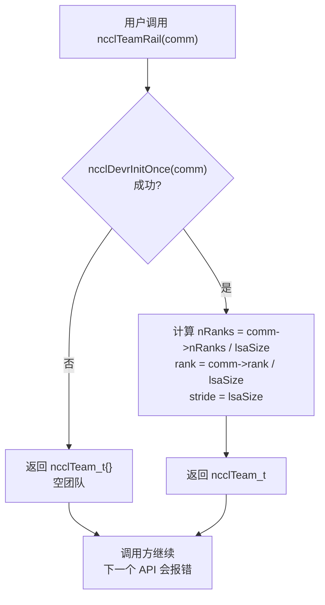
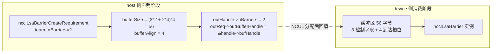
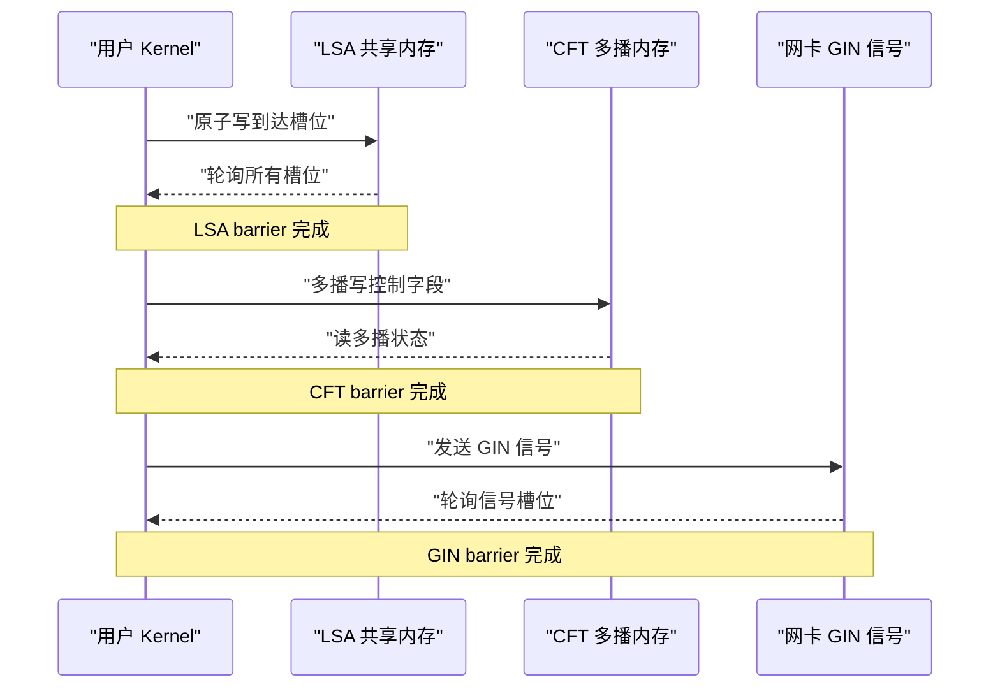
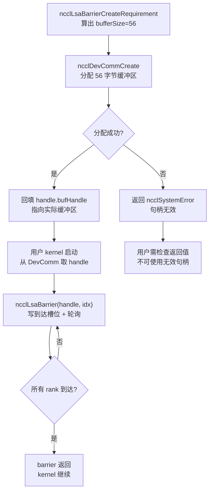
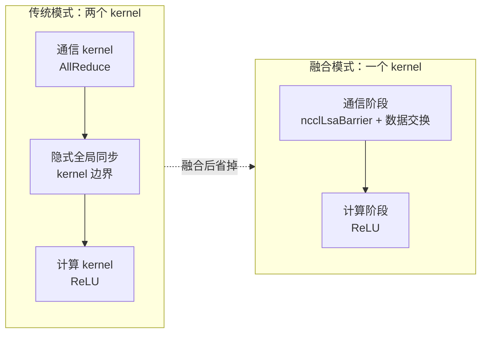

# 第 20 章：设备端原生 API 与算子融合：nccl_device 与 kernel fusion 实践

上一章我们看清了 devcomm 如何把 host 侧 ncclComm 的元数据版本化地映射到设备侧，让 kernel 能读到 rank、地址和连接状态。但「能读到元数据」和「能发起通信」是两回事。如果只有元数据，用户 kernel 顶多能自己算算地址、自己写写标志位，一旦涉及跨 rank 的同步、跨机的信号传递，还是得回到 host 侧调用 ncclAllReduce 之类的集合 API——而每一次这样的调用都意味着一次 kernel 启动、一次 host-device 往返。本章要拆解的 src/nccl_device 目录，正是 NCCL 从「一个被调用的库」走向「一套可被编程的模型」的关键。它提供的不是新的集合通信算法，而是一组设备侧原语：让用户自己的 kernel 内部就能调用 ncclBarrier、ncclLsaBarrier、ncclGinBarrier 这类同步操作，从而把「通信」和「计算」塞进同一个 kernel，省掉中间的启动开销。本章源码材料聚焦于这组原语在 host 侧的需求声明（CreateRequirement）与团队（Team）抽象，这正是设备侧 API 的入口。理解本章的一个关键前提：设备侧 API 的设计哲学是「host 侧声明资源需求，device 侧消费资源」。host 侧不直接创建 barrier，而是告诉 NCCL「我需要 nBarriers 个 barrier，团队有 team.nRanks 个成员」，NCCL 据此算出需要多少缓冲区、多少 GIN 信号，然后在 device 侧把这些资源实例化。这种「声明-消费」分离，是设备侧代码能在没有 host 指针的情况下工作的根本原因。

## 一、Team 抽象：设备侧 API 的坐标系

### 直觉模型

想象一个跨国公司的组织架构。你要发一封邮件，首先得知道「发给谁」——是发给全公司（World）、发给同一个办公室的同事（LSA）、还是发给同一条业务线的跨办公室团队（Rail）。`ncclTeam_t` 就是这套「收件人范围」的描述符。若没有 Team 抽象，每个设备侧 API 都得自己重新计算「我在这个通信域里排第几、一共有几个人」，代码会重复且极易出错。

### 数据结构与内存布局

`ncclTeam_t` 是设备侧 API 的坐标系，它的三个字段定义了一个**等差数列**：

| 字段 | 含义 | 类比 |
|------|------|------|
| `nRanks` | 团队内成员总数 | 群里有多少人 |
| `rank` | 当前 rank 在团队内的编号 | 我在群里的序号 |
| `stride` | 团队内相邻成员在 world 中的步长 | 群里相邻两人学号差多少 |

`stride` 是最容易被忽略但最关键的字段。World 团队里 `stride = 1`，因为所有 rank 连续排列；但 Rail 团队里 `stride = lsaSize`，因为同一个 rail 上的 rank 在 world 中每隔 `lsaSize` 个才出现一次。

[FACT:src/nccl_device/core.cc:13-19](https://github.com/NVIDIA/nccl/blob/12df1a11afad322be5a204a2db890161cbf8131d/src/nccl_device/core.cc#L13-L19) 展示了 World 团队的构造：直接取 `comm->nRanks` 和 `comm->rank`，`stride` 固定为 1。这是唯一不需要 `ncclDevrInitOnce` 的团队，因为它的信息全在 host 侧 `comm` 里。

[FACT:src/nccl_device/core.cc:22-33](https://github.com/NVIDIA/nccl/blob/12df1a11afad322be5a204a2db890161cbf8131d/src/nccl_device/core.cc#L22-L33) 是 LSA 团队。注意 L26 的 `ncclDevrInitOnce(comm)`——这是设备侧资源初始化的幂等入口。L23-25 的注释非常关键：**这里故意忽略错误**，因为如果初始化失败，返回的 team 是「垃圾值」，但下一个真正需要资源的 API 调用会再次触发 `ncclDevrInitOnce` 并报告错误。这是一种「延迟报错」策略，避免在团队查询这种轻量操作上抛出重错误。

### 场景驱动 Walkthrough：从 World 到 Rail 的坐标变换

假设一个 8 卡机器，`lsaSize = 4`（每 4 卡一个 LSA 域），`nRanks = 8`。我们来看 `ncclTeamRail` 如何构造：

[FACT:src/nccl_device/core.cc:70-79](https://github.com/NVIDIA/nccl/blob/12df1a11afad322be5a204a2db890161cbf8131d/src/nccl_device/core.cc#L70-L79) 中，`nRanks = 8 / 4 = 2`，`rank = comm->rank / 4`，`stride = 4`。如果当前 rank 是 5，那么它在 Rail 团队里的 `rank = 5 / 4 = 1`，`stride = 4`，意味着 Rail 团队的成员是 world 中的 rank 1 和 rank 5。

再看 `ncclTeamRankToWorld` 的换算公式：

[FACT:src/nccl_device/core.cc:82-84](https://github.com/NVIDIA/nccl/blob/12df1a11afad322be5a204a2db890161cbf8131d/src/nccl_device/core.cc#L82-L84) 的 `comm->rank + (rank - team.rank) * team.stride` 是一个**相对偏移**计算：先算出目标 rank 相对于当前 rank 在团队内的偏移 `(rank - team.rank)`，再乘以步长 `stride`，加上当前 rank 的 world 编号。这个公式对所有团队通用，因为 `stride` 已经编码了团队的排列规律。

`ncclTeamRankToLsa` 则不同：

[FACT:src/nccl_device/core.cc:87-92](https://github.com/NVIDIA/nccl/blob/12df1a11afad322be5a204a2db890161cbf8131d/src/nccl_device/core.cc#L87-L92) 用的是 `comm->devrState.lsaSelf + (rank - team.rank) * team.stride`。注意这里用的是 `lsaSelf` 而不是 `comm->rank`——因为 LSA 编号是设备侧资源初始化后才知道的，可能与 world rank 不同。

这张图揭示了「延迟报错」策略的执行路径：初始化失败时返回空团队，但不中断调用方；错误会在下一个真正需要资源的 API（如 `ncclLsaBarrierCreateRequirement`）处暴露。

### 设计思考与踩坑

**为什么 `ncclTeamWorld` 不调用 `ncclDevrInitOnce`？** 因为 World 团队的信息完全来自 host 侧 `comm`，不需要任何设备侧资源。如果强行调用，会让一个纯 host 查询操作依赖设备侧初始化，增加不必要的失败点。

**踩坑点**：`ncclTeamRankToLsa` 在初始化失败时返回 `-1`（[FACT:src/nccl_device/core.cc:87-92](https://github.com/NVIDIA/nccl/blob/12df1a11afad322be5a204a2db890161cbf8131d/src/nccl_device/core.cc#L87-L92)），而 `ncclTeamRankToWorld` 永远不会失败。调用方如果混用这两个函数且不检查返回值，可能在 LSA 初始化失败时拿到 `-1` 当作合法 rank 使用，导致越界访问。生产代码中应当把 `ncclTeamRankToLsa` 的返回值当作可能失败的操作处理。

---

## 二、Barrier 需求声明：host 侧如何「预订」设备资源

### 直觉模型

设备侧 API 的资源分配像**预订会议室**：你不能直接冲进会议室开会，得先向前台（host 侧 `CreateRequirement`）提交申请——「我要开 3 场会，每场 8 个人参加」。前台据此算出需要多大的场地（`bufferSize`）、需要多少把椅子（`ginSignalCount`），然后把场地编号（`outBufferHandle`）给你。若没有这套预订机制，设备侧 kernel 就不知道自己的 barrier 缓冲区在哪里、有多大，无法安全地读写。

### 数据结构与内存布局

三个 barrier 的 `CreateRequirement` 函数共享同一个模式：**清零需求结构体 → 填充缓冲区大小/对齐 → 填充输出句柄指针**。但它们的资源类型不同：

| Barrier 类型 | 资源类型 | 大小公式 | 对齐 |
|-------------|---------|---------|------|
| LSA Barrier | 缓冲区 | `(3*n + n*team.nRanks) * sizeof(uint32_t)` | `alignof(uint32_t)` |
| CFT Barrier | 缓冲区 | `(3*n + n*team.nRanks) * NCCL_CFT_BARRIER_GRAN` | `NCCL_CFT_BARRIER_ALIGN` |
| GIN Barrier | GIN 信号 | `n * team.nRanks` 个信号 | 不涉及缓冲区 |

先看 LSA Barrier 的大小公式：

[FACT:src/nccl_device/lsa_barrier.cc:14-22](https://github.com/NVIDIA/nccl/blob/12df1a11afad322be5a204a2db890161cbf8131d/src/nccl_device/lsa_barrier.cc#L14-L22) 的 `(3 * nBarriers + nBarriers * team.nRanks) * sizeof(uint32_t)` 可以拆解为两部分：
- `3 * nBarriers`：每个 barrier 需要 3 个 `uint32_t` 的控制字段（[INFERENCE] 通常是「到达计数」「轮次」「状态标志」）。
- `nBarriers * team.nRanks`：每个 barrier 需要为团队内每个成员预留一个 `uint32_t` 的到达槽位。

所以单个 barrier 的总大小是 `3 + team.nRanks` 个 `uint32_t`。这个公式在 LSA 和 CFT 中完全一致，只是 CFT 用 `NCCL_CFT_BARRIER_GRAN` 作为粒度单位（可能是为了对齐到更大的边界）。

GIN Barrier 则完全不同：

[FACT:src/nccl_device/gin_barrier.cc:14-20](https://github.com/NVIDIA/nccl/blob/12df1a11afad322be5a204a2db890161cbf8131d/src/nccl_device/gin_barrier.cc#L14-L20) 不分配缓冲区，而是设置 `ginSignalCount = nBarriers * team.nRanks`，并把 `outGinSignalStart` 指向句柄里的 `signal0`。这是因为 GIN barrier 走的是网络信号路径，不需要共享内存缓冲区，而是需要网卡能识别的信号槽位。

### 场景驱动 Walkthrough：一次 LSA Barrier 的完整预订

假设用户要在一个 4 卡 LSA 团队上创建 2 个 barrier：

1. **调用** `ncclLsaBarrierCreateRequirement(team, 2, &handle, &req)`。
2. **清零**：`memset(outReq, 0, sizeof(*outReq))`（[FACT:src/nccl_device/lsa_barrier.cc:14-22](https://github.com/NVIDIA/nccl/blob/12df1a11afad322be5a204a2db890161cbf8131d/src/nccl_device/lsa_barrier.cc#L14-L22)）——保证未设置的字段是确定值，避免调用方读到栈上的垃圾。
3. **记录 barrier 数量**：`outHandle->nBarriers = 2`（[FACT:src/nccl_device/lsa_barrier.cc:14-22](https://github.com/NVIDIA/nccl/blob/12df1a11afad322be5a204a2db890161cbf8131d/src/nccl_device/lsa_barrier.cc#L14-L22)）。
4. **计算缓冲区大小**：`(3*2 + 2*4) * 4 = (6 + 8) * 4 = 56` 字节（[FACT:src/nccl_device/lsa_barrier.cc:14-22](https://github.com/NVIDIA/nccl/blob/12df1a11afad322be5a204a2db890161cbf8131d/src/nccl_device/lsa_barrier.cc#L14-L22)）。
5. **设置对齐**：`alignof(uint32_t) = 4`（[FACT:src/nccl_device/lsa_barrier.cc:14-22](https://github.com/NVIDIA/nccl/blob/12df1a11afad322be5a204a2db890161cbf8131d/src/nccl_device/lsa_barrier.cc#L14-L22)）。
6. **回填句柄指针**：`outReq->outBufferHandle = &outHandle->bufHandle`（[FACT:src/nccl_device/lsa_barrier.cc:14-22](https://github.com/NVIDIA/nccl/blob/12df1a11afad322be5a204a2db890161cbf8131d/src/nccl_device/lsa_barrier.cc#L14-L22)）——让 NCCL 在真正分配缓冲区后，把地址写回句柄。

这张数据流图展示了「声明」与「消费」的分离：host 侧只算出大小和指针，真正的缓冲区分配和实例化发生在 NCCL 内部，device 侧 kernel 拿到的是已经填充好的句柄。

### 设计思考与踩坑

**为什么用 `memset` 清零整个 `outReq`？** 因为 `ncclDevResourceRequirements_t` 是一个多字段结构体，不同 barrier 类型只填充其中一部分字段。清零保证未使用的字段（如 LSA barrier 不用的 `ginSignalCount`）是 0，NCCL 内部据此判断「这个资源不需要」。如果不清零，栈上的随机值可能被误认为「需要 GIN 资源」，触发上一章提到的误报问题。

**踩坑点**：`outReq->outBufferHandle = &outHandle->bufHandle` 把句柄内部字段的地址交给了 NCCL。这意味着 `outHandle` 必须在 NCCL 完成缓冲区分配之前保持有效（不能被栈回收或移动）。如果用户把 `outHandle` 放在一个会被提前释放的作用域里，NCCL 回填时就会写入野指针。

**CFT Barrier 的粒度差异**：[FACT:src/nccl_device/cft_barrier.cc:13-21](https://github.com/NVIDIA/nccl/blob/12df1a11afad322be5a204a2db890161cbf8131d/src/nccl_device/cft_barrier.cc#L13-L21) 用 `NCCL_CFT_BARRIER_GRAN` 和 `NCCL_CFT_BARRIER_ALIGN` 替代了 LSA 的 `sizeof(uint32_t)` 和 `alignof(uint32_t)`。这说明 CFT（[INFERENCE] 可能是 Cross-Fabric Team 或类似的跨域团队）的 barrier 需要更大的对齐粒度，可能因为要跨多播内存区域，硬件对地址对齐有更严格的要求。

---

## 三、三种 Barrier 的语义分工：LSA、CFT、GIN 各管什么

### 直觉模型

三种 barrier 像三种不同范围的「集合哨」：
- **LSA Barrier**：同一个办公室内的同事集合，走共享内存，最快。
- **CFT Barrier**：跨办公室但同一栋楼内的集合，走多播内存，中等。
- **GIN Barrier**：跨城市甚至跨国的集合，走网络信号，最慢但覆盖最广。

选错 barrier 类型不会导致错误，但会带来巨大的性能损失——用 GIN barrier 做同办公室同步，等于用国际快递送隔壁工位的文件。

### 数据结构与内存布局对比

从 host 侧需求声明看，三者的资源需求截然不同：

| 维度 | LSA Barrier | CFT Barrier | GIN Barrier |
|------|------------|------------|------------|
| 需要 `comm` 参数 | 否 | 否 | 是 |
| 缓冲区 | 有 | 有 | 无 |
| GIN 信号 | 无 | 无 | 有 |
| 大小单位 | `uint32_t` | `NCCL_CFT_BARRIER_GRAN` | 信号个数 |
| 输出句柄字段 | `bufHandle` | `bufHandle` | `signal0` |

注意 GIN Barrier 是唯一需要 `comm` 参数的：

[FACT:src/nccl_device/gin_barrier.cc:14-20](https://github.com/NVIDIA/nccl/blob/12df1a11afad322be5a204a2db890161cbf8131d/src/nccl_device/gin_barrier.cc#L14-L20) 的函数签名包含 `ncclComm_t comm`，而 LSA 和 CFT 的签名只有 `ncclTeam_t team`。这是因为 GIN 信号需要绑定到具体的网络连接，而网络连接信息在 `comm` 里。

### 场景驱动 Walkthrough：GIN Barrier 的信号分配

[FACT:src/nccl_device/gin_barrier.cc:14-20](https://github.com/NVIDIA/nccl/blob/12df1a11afad322be5a204a2db890161cbf8131d/src/nccl_device/gin_barrier.cc#L14-L20) 的逻辑比 LSA 更简单，但语义更微妙：

1. **清零**：`memset(outReq, 0, sizeof(*outReq))`（L16）。
2. **设置信号数**：`outReq->ginSignalCount = nBarriers * team.nRanks`（L17）——每个 barrier 需要为团队内每个成员分配一个信号槽。
3. **回填信号起始指针**：`outReq->outGinSignalStart = &outHandle->signal0`（L18）——注意这里没有设置 `bufferSize`，因为 GIN barrier 不用共享内存缓冲区。

[INFERENCE] `signal0` 这个名字暗示句柄里可能有一组连续的信号字段（`signal0`, `signal1`, ...），`outGinSignalStart` 指向第一个，NCCL 据此知道从哪里开始分配 `nBarriers * team.nRanks` 个信号。

### 并发控制与硬件交互

三种 barrier 的并发控制机制完全不同：

- **LSA Barrier**：基于共享内存的原子操作。`3 + team.nRanks` 个 `uint32_t` 中，到达槽位用原子加或原子写来标记「我到了」，控制字段用原子读来检查「是否所有人都到了」。这是纯 GPU 内的同步，不涉及网络。
- **CFT Barrier**：基于多播内存（multimem）。[INFERENCE] 多播内存允许一次写操作同时更新多个 rank 的视图，所以 CFT barrier 可能用更少的控制字段实现更广的同步。
- **GIN Barrier**：基于网络信号。`ginSignalCount` 个信号通过网卡发送，接收方轮询信号槽位。这是唯一涉及跨机硬件的 barrier。

这张时序图展示了三种 barrier 的硬件交互层次：从纯 GPU 内同步，到多播内存，再到网卡信号，延迟依次递增，覆盖范围也依次扩大。

### 设计思考与踩坑

**为什么 LSA 和 CFT 不需要 `comm` 参数？** 因为它们的资源（共享内存、多播内存）已经在 `ncclDevrInitOnce` 阶段绑定到了团队上，`team` 本身就隐含了资源位置信息。而 GIN 信号需要动态分配网络资源，必须通过 `comm` 访问网络连接状态。

**踩坑点**：GIN Barrier 的 `ginSignalCount` 是 `nBarriers * team.nRanks`，如果团队很大（如 1024 个 rank）且 barrier 很多（如 100 个），信号总数会达到 102400。网卡的信号槽位是有限资源，超量申请可能导致 `ncclDevrInitOnce` 失败。生产代码应当根据实际需要的最小 barrier 数量申请，而不是一次性申请大量备用。

---

## 四、从需求声明到设备侧消费：完整生命周期

### 直觉模型

`CreateRequirement` 只是「下单」，真正的「发货」和「收货」发生在 NCCL 内部和设备侧 kernel 里。整个生命周期像**网购**：你下单（CreateRequirement）→ 商家备货（NCCL 分配资源）→ 快递送达（资源绑定到 DevComm）→ 你签收使用（device 侧 kernel 调用 barrier）。

### 数据结构与内存布局：句柄的字段演化

以 `ncclLsaBarrierHandle_t` 为例，它在生命周期中经历三个阶段：

| 阶段 | `nBarriers` | `bufHandle` | 其他字段 |
|------|------------|------------|---------|
| CreateRequirement 后 | 已设置 | 地址已回填，但内容未分配 | 未设置 |
| NCCL 分配后 | 已设置 | 指向实际缓冲区 | 已设置 |
| Device 侧使用 | 只读 | 只读 | 只读 |

[FACT:src/nccl_device/lsa_barrier.cc:14-22](https://github.com/NVIDIA/nccl/blob/12df1a11afad322be5a204a2db890161cbf8131d/src/nccl_device/lsa_barrier.cc#L14-L22) 设置 `nBarriers`，[FACT:src/nccl_device/lsa_barrier.cc:14-22](https://github.com/NVIDIA/nccl/blob/12df1a11afad322be5a204a2db890161cbf8131d/src/nccl_device/lsa_barrier.cc#L14-L22) 回填 `bufHandle` 的地址。这两个操作之间，NCCL 内部会完成缓冲区的实际分配。

### 场景驱动 Walkthrough：一次完整的 barrier 使用

1. **Host 侧声明**：用户调用 `ncclLsaBarrierCreateRequirement(team, 2, &handle, &req)`，得到 `req.bufferSize = 56`。
2. **Host 侧提交**：用户把 `req` 交给 `ncclDevCommCreate`（上一章的内容），NCCL 分配 56 字节缓冲区，把地址写入 `handle.bufHandle`。
3. **Device 侧初始化**：用户 kernel 启动时，从 DevComm 里取出 `handle`，用 `bufHandle` 定位缓冲区。
4. **Device 侧同步**：kernel 调用 `ncclLsaBarrier(handle, barrierIndex)`，在缓冲区的对应槽位写入到达标记，轮询其他槽位。
5. **Device 侧完成**：所有 rank 到达后，barrier 返回，kernel 继续执行。

这张决策图展示了从声明到使用的完整路径，以及分配失败时的错误分支。注意 `ncclLsaBarrierCreateRequirement` 本身永远返回 `ncclSuccess`（[FACT:src/nccl_device/lsa_barrier.cc:14-22](https://github.com/NVIDIA/nccl/blob/12df1a11afad322be5a204a2db890161cbf8131d/src/nccl_device/lsa_barrier.cc#L14-L22)），真正的失败发生在后续的资源分配阶段。

### 并发控制与硬件交互

设备侧 barrier 的并发控制核心是**原子操作 + 内存屏障**。以 LSA barrier 为例：

- **到达阶段**：每个 rank 用原子写（或原子加）更新自己的到达槽位。这一步必须用 release 语义，保证 barrier 之前的所有内存操作对其他 rank 可见。
- **轮询阶段**：每个 rank 用原子读（或 volatile 读）检查所有槽位。这一步必须用 acquire 语义，保证看到「所有人都到了」之后，能读到其他人 barrier 之前写入的数据。
- **重置阶段**：barrier 完成后，需要重置槽位供下次使用。这一步的并发控制最微妙——如果重置太快，可能覆盖还没读到的 rank 的标记。

[INFERENCE] `3 * nBarriers` 个控制字段很可能就是用来处理这种「轮次」问题的：一个字段记录当前轮次，一个字段记录到达计数，一个字段作为重置标志。这样多个 barrier 可以复用同一组槽位而不会混淆轮次。

### 生产避坑指南

**坑 1：句柄生命周期管理**。`outReq->outBufferHandle = &outHandle->bufHandle` 把句柄内部字段的地址交给了 NCCL。如果用户在 `ncclDevCommCreate` 返回之前就销毁了 `outHandle`，NCCL 回填时会写入已释放的内存。正确做法是把 `outHandle` 的生命周期绑定到 DevComm，而不是绑定到创建它的函数作用域。

**坑 2：barrier 数量与团队大小的乘积**。`bufferSize = (3*n + n*team.nRanks) * sizeof(uint32_t)` 中，`n*team.nRanks` 项在大团队时会主导大小。1024 个 rank、100 个 barrier 需要 `100*1024*4 = 409600` 字节，约 400KB。如果每个 rank 都申请这么多，显存压力不可忽视。应当按实际并发使用的 barrier 数量申请，而不是按总 barrier 数量。

**坑 3：GIN barrier 的信号耗尽**。GIN 信号是网卡资源，数量有限。如果多个 DevComm 同时申请大量 GIN 信号，可能耗尽网卡槽位。生产代码应当在 DevComm 创建失败时检查是否是 GIN 信号不足，并考虑减少 `nBarriers` 或改用 LSA barrier。

**坑 4：初始化失败的延迟暴露**。`ncclTeamLsa` 等函数在 `ncclDevrInitOnce` 失败时返回空团队（[FACT:src/nccl_device/core.cc:22-33](https://github.com/NVIDIA/nccl/blob/12df1a11afad322be5a204a2db890161cbf8131d/src/nccl_device/core.cc#L22-L33)），不报错。如果用户代码不检查后续 API 的返回值，可能在空团队上继续操作，导致难以定位的错误。建议在第一次使用设备侧 API 时显式检查团队的有效性（如 `team.nRanks > 0`）。

---

## 五、内核融合：为什么要把通信和计算塞进一个 kernel

### 直觉模型

传统模式下，一次「AllReduce + 激活函数」需要两个 kernel：一个做通信，一个做计算。两个 kernel 之间有一次隐式的全局同步——通信 kernel 必须完全结束，计算 kernel 才能开始。这就像**接力赛**：第一棒跑完必须把棒交给第二棒，交接瞬间两人都在等。内核融合则是让同一个 kernel 既跑通信又跑计算，像**一个人边跑边换鞋**，省掉了交接的等待。

### 数据结构与内存布局

内核融合的关键在于：通信原语（如 barrier）和计算逻辑共享同一个 kernel 的寄存器和共享内存。这意味着：

- **寄存器压力**：通信原语的原子操作和轮询循环会占用寄存器，挤压计算逻辑的寄存器预算。
- **共享内存竞争**：LSA barrier 的缓冲区如果放在共享内存里，会和计算逻辑的共享内存需求竞争。
- **Occupancy 影响**：融合 kernel 的 occupancy 通常低于纯计算 kernel，因为通信原语需要额外的资源。

[INFERENCE] 设备侧 API 的设计（host 侧声明资源、device 侧消费）正是为了缓解这些压力：资源在 host 侧预先分配好，device 侧 kernel 只需要读写，不需要动态申请，减少了寄存器占用。

### 场景驱动 Walkthrough：融合 kernel 的执行流

假设用户要写一个「AllReduce + ReLU」的融合 kernel：

1. **Host 侧准备**：调用 `ncclLsaBarrierCreateRequirement` 申请 barrier，调用 `ncclDevCommCreate` 分配资源。
2. **Kernel 启动**：用户 kernel 接收 DevComm 和 barrier 句柄作为参数。
3. **通信阶段**：kernel 内调用 `ncclLsaBarrier` 同步所有 rank，然后各 rank 交换数据（通过对称内存直接读写）。
4. **计算阶段**：同步完成后，kernel 直接对本地数据做 ReLU，不需要额外的 kernel 启动。
5. **完成**：kernel 退出，host 侧无需等待额外的通信 kernel。

这张对比图展示了融合的核心收益：省掉 kernel 边界处的隐式全局同步。在传统模式下，这个同步的代价是两次 kernel 启动的延迟加上 GPU 流水线的排空。

### 设计思考与踩坑

**为什么设备侧 API 不直接提供「融合 AllReduce」？** 因为融合的具体形式取决于用户的计算逻辑。NCCL 提供的是**原语**（barrier、信号、对称内存访问），而不是**成品**（融合的 AllReduce+ReLU）。用户需要自己组合这些原语，才能实现符合自己需求的融合 kernel。这是「编程模型」而非「库」的本质区别。

**踩坑点**：融合 kernel 的调试难度远高于分离 kernel。如果 barrier 逻辑有 bug，可能导致 kernel 挂起（死锁），而 GPU kernel 挂起不像 host 进程挂起那样容易诊断。建议在融合 kernel 中加超时机制，或者先用小规模团队验证 barrier 逻辑。

**踩坑点**：融合 kernel 的 occupancy 下降可能导致计算性能损失超过通信节省的收益。在决定融合之前，应当测量融合前后的端到端时间，而不是只看通信延迟的降低。

## 本章思考与自测

Q1：如果把 `ncclTeamLsa` 中 L26 的 `ncclDevrInitOnce` 调用去掉，直接返回 `comm->devrState.lsaSize` 和 `lsaSelf`，在什么场景下会导致设备侧 kernel 读到错误的团队信息？

**参考解析**：`ncclDevrInitOnce` 是设备侧资源初始化的幂等入口。如果去掉它，`comm->devrState.lsaSize` 和 `lsaSelf` 可能还是初始值（通常是 0 或未定义）。在首次使用设备侧 API 的场景下，用户调用 `ncclTeamLsa` 会拿到 `nRanks = 0` 的空团队。后续如果用户不检查团队有效性，直接用这个团队调用 `ncclLsaBarrierCreateRequirement`，会算出 `bufferSize = (3*n + n*0) * 4 = 12n` 字节——比实际需要的小，因为 `n*team.nRanks` 项变成了 0。这会导致缓冲区溢出：barrier 运行时试图写入 `team.nRanks` 个到达槽位，但缓冲区只分配了 `3n` 个 `uint32_t` 的空间。更隐蔽的是，如果 `lsaSelf` 也是 0，`ncclTeamRankToLsa` 会返回错误的 rank 编号，导致 barrier 的到达槽位写错位置，可能永远等不到所有 rank 到达，造成 kernel 挂起。这正是 L23-25 注释所说的「返回垃圾值，下一个 API 报错」策略要防止的情况——但前提是下一个 API 确实会报错，而不是静默地使用错误的大小。

Q2：`ncclLsaBarrierCreateRequirement` 的大小公式是 `(3*nBarriers + nBarriers*team.nRanks) * sizeof(uint32_t)`。如果团队有 8 个 rank，用户申请 1 个 barrier，缓冲区是 44 字节。假设 barrier 实现中「3 个控制字段」分别是「到达计数」「轮次」「重置标志」，请推演：当 8 个 rank 同时到达时，如果「到达计数」用非原子的 `++` 操作，会发生什么？

**参考解析**：非原子的 `++` 在 GPU 上是「读-改-写」三步，不是原子操作。8 个 rank 同时执行 `count++` 时，可能出现多个 rank 读到相同的旧值（如都读到 0），然后都写回 1。最终 `count` 只增加了 1 而不是 8，导致 barrier 永远认为「还没到齐」，所有 rank 在轮询阶段死循环。这就是为什么 LSA barrier 的到达槽位必须用原子操作（如 `atomicAdd`）或每个 rank 写自己的独立槽位（`nBarriers * team.nRanks` 项正是为每个 rank 预留独立槽位）。如果采用「每个 rank 写自己的槽位」方案，就不需要原子加，只需要原子写 + 内存屏障，因为每个槽位只有一个写入者。这也解释了为什么大小公式里有 `nBarriers * team.nRanks` 项——它是用空间换原子性，避免多写者竞争。

Q3：`ncclGinBarrierCreateRequirement` 需要 `comm` 参数而 `ncclLsaBarrierCreateRequirement` 不需要。如果强行给 LSA barrier 也加上 `comm` 参数（假设为了统一接口），会引入什么设计问题？反过来，如果给 GIN barrier 去掉 `comm` 参数，在什么场景下会失败？

**参考解析**：给 LSA barrier 加 `comm` 参数的问题是引入了不必要的依赖。LSA barrier 的资源（共享内存）已经在 `ncclDevrInitOnce` 阶段绑定到团队上，`team` 本身就隐含了资源位置。加 `comm` 会让一个纯团队操作依赖通信域状态，增加失败点（如 `comm` 无效时 LSA barrier 也无法创建），且违反「最小权限」原则。反过来，给 GIN barrier 去掉 `comm` 参数会失败，因为 GIN 信号需要绑定到具体的网络连接。`ncclGinBarrierCreateRequirement` 的 `ginSignalCount` 需要知道往哪个网卡、哪个 QP（Queue Pair）发送信号，这些信息在 `comm` 的网络传输层状态里。没有 `comm`，NCCL 无法确定信号应该分配到哪个网卡的槽位，也无法保证信号能正确路由到目标 rank。这体现了设备侧 API 的一个设计原则：**资源需求声明只依赖它真正需要的上下文**——LSA 只需要团队拓扑，GIN 需要网络连接。

---

设备侧 API 和内核融合把 NCCL 从「一个你调用的库」变成了「一套你编程的模型」。`ncclTeam_t` 提供了坐标系，`CreateRequirement` 提供了资源预订机制，三种 barrier 覆盖了从共享内存到网络信号的全部同步范围。但声明了资源、写好了融合 kernel，并不等于性能就好——barrier 的数量、团队的大小、融合的粒度，每一个选择都会影响端到端性能。下一章我们将进入性能调优实战，看看 tuning 参数如何影响算法选择，以及如何用真实 benchmark 验证调优效果。

至此，我们已经走完了从 devcomm 元数据映射到 nccl_device 设备侧原语的全过程，看到了 NCCL 如何通过「host 声明、device 消费」的模型，让用户 kernel 直接调用 barrier 类同步操作，把通信与计算融合进同一个 kernel。但掌握了这些机制之后，一个更实际的问题自然浮现：当真实训练任务性能不达标时，我们该如何判断是算法选择不当、协议不匹配，还是通道数配置不合理？下一章将把前 20 章的机制串成一套可操作的调优方法论，结合性能报告、代价模型与环境变量，给出从现象到根因的排查路径。