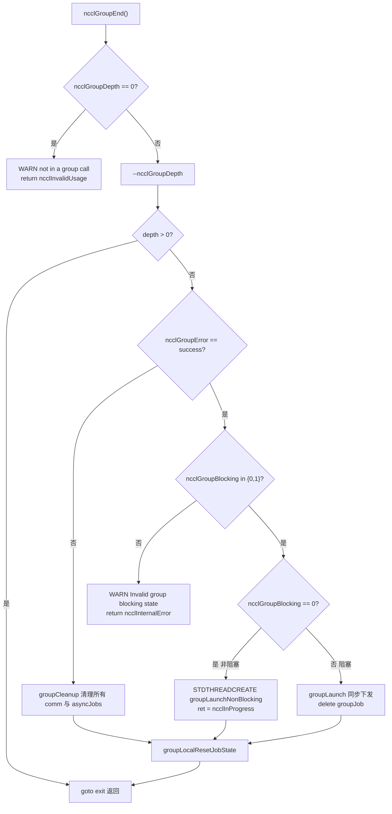
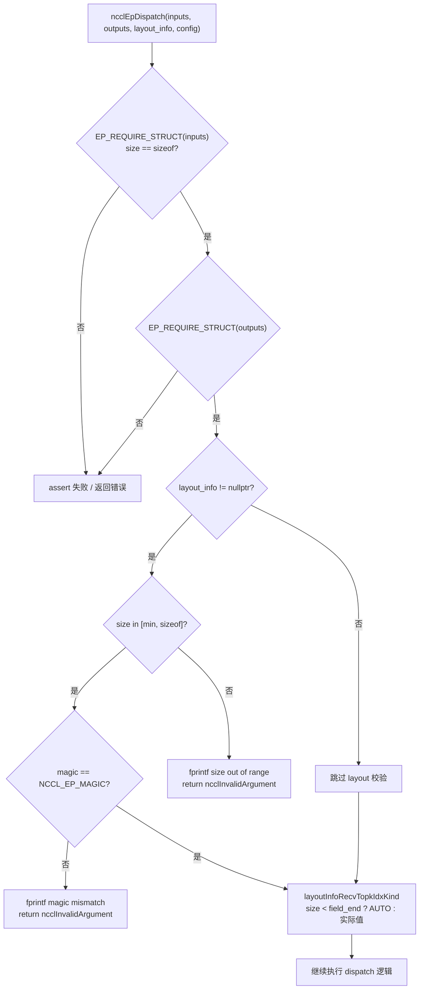

# 第 22 章：生产排障与踩坑：常见死锁、超时、版本不匹配与排查方案

上一章我们梳理了性能调优的排查顺序与关键旋钮，但生产环境中的 NCCL 故障往往不是性能不达标，而是程序直接挂起或崩溃。这些故障的根源通常不是某个函数写错了，而是调用顺序、生命周期或版本契约被破坏。本章聚焦四类最典型的踩坑：group 语义误用导致的死锁、参数校验缺失导致的静默错误、ABI 版本不匹配、以及超时与重试的边界。我们会沿着 src/group.cc、src/misc/argcheck.cc、src/include/checks.h 和 contrib/nccl_ep/nccl_ep.cc 四条线索，看清 NCCL 内部是如何在错误发生前就把它挡住的。

## Group 语义误用：为什么"少写一个 GroupEnd"会挂死

### 直觉模型：Group 是"购物车"，不是"加速开关"

把 `ncclGroupStart()` / `ncclGroupEnd()` 想象成网购的购物车：你把多件商品（多次通信调用）放进购物车，最后一次性结算（`ncclGroupEnd`）。如果只放不结算，购物车永远悬在半空——NCCL 内部维护的 `ncclGroupDepth` 计数器就不会归零，后续所有通信调用都会以为"还在攒单"，永远不真正下发 kernel，于是整个进程挂死。

[INFERENCE] 这是生产中最常见的死锁形态：代码在某个异常分支里 `return` 了，跳过了 `ncclGroupEnd`，而 `ncclGroupDepth` 是 `thread_local` 的，不会因为函数返回而自动清理。

### 数据结构：thread_local 的 group 状态

NCCL 把 group 状态全部放在线程局部存储里，这是理解死锁的关键。

[FACT:src/group.cc:34-34](https://github.com/NVIDIA/nccl/blob/12df1a11afad322be5a204a2db890161cbf8131d/src/group.cc#L34-L34)

```cpp
thread_local int ncclGroupDepth = 0; // depth of ncclGroupStart nesting
thread_local ncclResult_t ncclGroupError = ncclSuccess;
thread_local struct ncclComm* ncclGroupCommHead[ncclGroupTaskTypeNum] = {nullptr};
thread_local struct ncclComm* ncclGroupCommPreconnectHead = nullptr;
thread_local struct ncclIntruQueue<struct ncclAsyncJob, &ncclAsyncJob::next> ncclAsyncJobs;
thread_local int ncclGroupBlocking = -1; /* default mode */
```

逐字段解读：

- `ncclGroupDepth`：嵌套深度。`ncclGroupStart` 递增，`ncclGroupEnd` 递减，只有减到 0 才真正触发下发。支持嵌套是设计上的便利，但也意味着"漏掉一个 End"会让深度永远停在 1。
- `ncclGroupError`：本线程累积的 group 错误。一旦某次调用失败，后续 `ncclGroupEnd` 会直接走失败路径。
- `ncclGroupCommHead[]`：按任务类型（collective / rawTask / mgmtTask / symRegister）分组的通信域链表头。
- `ncclAsyncJobs`：待执行的异步任务队列（比如 preconnect、symmetric register）。
- `ncclGroupBlocking`：`-1` 表示"还没遇到任何通信域"，`0` 表示非阻塞，`1` 表示阻塞。这个字段是后面"阻塞与非阻塞混用"检测的核心。

[INFERENCE] 用 `thread_local` 而非全局变量的动机很直接：NCCL 允许多线程各自持有独立的 group 上下文，互不干扰。代价是——线程退出时这些状态不会自动清理，如果线程在 group 中途退出，状态就泄漏了。

### Step-by-Step：一次 GroupEnd 的完整校验链

代入场景：应用调用 `ncclGroupEnd()`，此时 `ncclGroupDepth` 为 1。

第一步，检查是否真的在 group 里：

[FACT:src/group.cc:1048-1052](https://github.com/NVIDIA/nccl/blob/12df1a11afad322be5a204a2db890161cbf8131d/src/group.cc#L1048-L1052)

```cpp
  if (ncclGroupDepth == 0) {
    WARN("ncclGroupEnd: not in a group call.");
    ret = ncclInvalidUsage;
    goto exit;
  }
```

如果用户没调用 `ncclGroupStart` 就直接 `ncclGroupEnd`，这里会打印 "not in a group call" 并返回 `ncclInvalidUsage`。这是最友好的错误——立刻报错，不会挂死。

第二步，递减深度，判断是否是最外层：

[FACT:src/group.cc:1061-1063](https://github.com/NVIDIA/nccl/blob/12df1a11afad322be5a204a2db890161cbf8131d/src/group.cc#L1061-L1063)

```cpp
  if ((--ncclGroupDepth) > 0) goto exit;

  if ((ret = ncclGroupError) != ncclSuccess) goto fail;
```

如果嵌套了多层，内层的 `End` 只是递减深度就返回，不触发下发。只有最外层才继续。同时检查累积错误。

第三步，校验阻塞模式一致性。这是"阻塞与非阻塞混用"的检测点：

[FACT:src/group.cc:1095-1101](https://github.com/NVIDIA/nccl/blob/12df1a11afad322be5a204a2db890161cbf8131d/src/group.cc#L1095-L1101)

```cpp
  if (hasCommHead || !ncclIntruQueueEmpty(&groupJob->asyncJobs) || ncclGroupCommPreconnectHead != nullptr) {
    /* make sure ncclGroupBlocking has been set. */
    if (ncclGroupBlocking != 0 && ncclGroupBlocking != 1) {
      WARN("Invalid group blocking state %d", ncclGroupBlocking);
      ret = ncclInternalError;
      goto fail;
    }
```

`ncclGroupBlocking` 必须在 `{0, 1}` 之间。如果它还是 `-1`，说明 group 里既没有通信域也没有异步任务，逻辑上不该走到这里。

第四步，根据阻塞模式分叉。非阻塞走线程异步下发，阻塞走同步下发：

[FACT:src/group.cc:1102-1134](https://github.com/NVIDIA/nccl/blob/12df1a11afad322be5a204a2db890161cbf8131d/src/group.cc#L1102-L1134)

```cpp
    if (ncclGroupBlocking == 0) {
      /* nonblocking group */
      if (!ncclIntruQueueEmpty(&groupJob->asyncJobs)) {
        ncclAsyncJob* job = ncclIntruQueueHead(&groupJob->asyncJobs);
        do {
          NCCLCHECKGOTO(ncclCommSetAsyncError(job->comm, ncclInProgress), ret, fail);
          if (job->comm->groupJob == NULL) {
            job->comm->groupJob = groupJob;
            groupJob->groupRefCount++;
          }
          job = job->next;
        } while (job);
      }
      ...
      groupJob->base.func = groupLaunchNonBlocking;
      STDTHREADCREATE_GOTO(groupJob->base.thread, ncclAsyncJobMain, ret, fail, &groupJob->base);
      groupJob->nonBlockingInit = true;
      ret = ncclInProgress;
    }
```

注意 `groupRefCount++` 和 `ret = ncclInProgress`：非阻塞模式下，`ncclGroupEnd` 立刻返回 `ncclInProgress`，真正的下发在后台线程里跑。调用方必须后续用 `ncclCommGetAsyncError` 轮询，或者用 `ncclGroupJobComplete` 等待。

### 阻塞与非阻塞混用：为什么被禁止

回到 `ncclAsyncLaunch`，看混用检测：

[FACT:src/group.cc:55-64](https://github.com/NVIDIA/nccl/blob/12df1a11afad322be5a204a2db890161cbf8131d/src/group.cc#L55-L64)

```cpp
    /* check if there are blocking and nonblocking comms at the same time in group. */
    if (comm->destroyFlag) {
      ncclGroupBlocking = 1;
    } else if (ncclGroupBlocking == -1) {
      /* first met communicator */
      ncclGroupBlocking = comm->config.blocking;
    } else if (ncclGroupBlocking != comm->config.blocking) {
      WARN("Blocking and nonblocking communicators are not allowed in the same group.");
      ret = ncclInvalidArgument;
    }
```

[INFERENCE] 为什么禁止混用？因为阻塞通信域的下发语义是"调用返回时 kernel 已提交"，而非阻塞是"调用返回时任务已入队但未提交"。如果两者在同一个 group 里，`ncclGroupEnd` 无法给出统一的返回语义——到底是等还是不等？NCCL 选择直接拒绝，把问题暴露在 API 边界。

### 生产踩坑：三个真实场景

**场景一：异常分支漏掉 GroupEnd。** 代码在 `ncclGroupStart` 和 `ncclGroupEnd` 之间抛异常或提前 `return`，`ncclGroupDepth` 停在 1。后续所有通信调用都进入"攒单"状态，永远不下发。排查方法：在 `ncclGroupEnd` 前打印 `ncclGroupDepth`，或者用 `gdb` 观察该 thread_local 变量。

**场景二：跨线程使用同一个 comm。** 因为 group 状态是 `thread_local`，线程 A 调用 `ncclGroupStart` 后，线程 B 调用 `ncclAllReduce` 不会进入 A 的 group。如果 A 和 B 操作同一个 comm，会出现"部分调用在 group 内、部分在 group 外"的错乱。NCCL 不检测这种情况，因为它假设一个 comm 在任一时刻只被一个线程操作。

**场景三：CUDA graph capture 与 group 的交互。** 看 `doLaunches` 里的检测：

[FACT:src/group.cc:448-455](https://github.com/NVIDIA/nccl/blob/12df1a11afad322be5a204a2db890161cbf8131d/src/group.cc#L448-L455)

```cpp
    if (capturingYes && capturingNo) {
      // We have entered barriers but are aborting without leaving them. Thus
      // these comms are permanently trashed. We need a good mechanism for
      // tracking and reporting that.
      WARN("Either none or all communicators in a ncclGroup() can be CUDA graph captured.");
      result = ncclInvalidUsage;
      goto failure;
    }
```

注释说得很直白：一旦进入 barrier 又中途放弃，这些 comm 就被"永久损坏"了。所以规则是——一个 group 里的所有通信域，要么全部在 capture 中，要么全部不在。混用会导致 comm 状态不一致，且 NCCL 目前没有好的恢复机制。



## 参数校验与静默错误：ArgCheck 如何挡住"看起来正常"的调用

### 直觉模型：ArgCheck 是"机场安检"

参数校验就像机场安检：它不负责让你飞得更快，但能挡住那些"看起来是行李、实际是危险品"的东西。没有它，一个传错设备的指针会让 GPU kernel 读到垃圾数据，或者更糟——静默写坏别人的显存。

### 数据结构：校验模式与全局检查队列

NCCL 的参数校验不是"每次都全查"，而是分模式。核心是 `comm->checkMode`：

[FACT:src/misc/argcheck.cc:227-251](https://github.com/NVIDIA/nccl/blob/12df1a11afad322be5a204a2db890161cbf8131d/src/misc/argcheck.cc#L227-L251)

```cpp
  if (info->comm->checkMode != ncclCheckModeDefault) {
    if ((info->coll == ncclFuncSend || info->coll == ncclFuncRecv)) {
      if (info->count > 0) NCCLCHECK(CudaPtrCheck(info->recvbuff, info->comm, "buff", info->opName));
    } else if (info->coll == ncclFuncPutSignal || info->coll == ncclFuncSignal || info->coll == ncclFuncWaitSignal) {
      // One-sided RMA ops specify the remote destination via peerWin, not sendbuff/recvbuff,
      // so the standard CUDA pointer checks do not apply here.
      INFO(NCCL_COLL, "%s : skipping sendbuff/recvbuff pointer check (one-sided RMA uses peerWin)", info->opName);
    } else {
      // Check CUDA device pointers
      if (info->coll != ncclFuncBroadcast || info->comm->rank == info->root) {
        NCCLCHECK(CudaPtrCheck(info->sendbuff, info->comm, "sendbuff", info->opName));
      }
      if (info->coll != ncclFuncReduce || info->comm->rank == info->root) {
        NCCLCHECK(CudaPtrCheck(info->recvbuff, info->comm, "recvbuff", info->opName));
      }
    }

    if (info->comm->checkMode == ncclCheckModeDebugGlobal) {
      struct ncclArgsInfo* argsInfo;
      NCCLCHECK(ncclCalloc(&argsInfo, 1));
      argsInfo->info = *info;
      argsInfo->next = NULL;
      ncclIntruQueueEnqueue(&info->comm->argsInfoQueue, argsInfo);
    }
  }
```

三种模式：

- `ncclCheckModeDefault`：只做最便宜的检查（root 范围、datatype 范围、op 范围），不碰 CUDA API。
- 非默认模式：调用 `CudaPtrCheck`，这会真正调用 `cudaPointerGetAttributes`，有性能开销。
- `ncclCheckModeDebugGlobal`：除了本地检查，还把 `ncclInfo` 塞进 `argsInfoQueue`，等 group 结束时做跨 rank 的全局一致性检查。

[INFERENCE] 这个设计是性能与正确性的权衡：`cudaPointerGetAttributes` 是同步 CUDA 调用，在热路径上每次通信都调会显著拖慢小消息。所以默认模式只做"零成本"检查，把昂贵的指针校验留给调试模式。

### Step-by-Step：CudaPtrCheck 的三层防线

代入场景：用户传入一个 `sendbuff`，NCCL 在调试模式下校验它。

第一层，指针是否有效：

[FACT:src/misc/argcheck.cc:12-18](https://github.com/NVIDIA/nccl/blob/12df1a11afad322be5a204a2db890161cbf8131d/src/misc/argcheck.cc#L12-L18)

```cpp
ncclResult_t CudaPtrCheck(const void* pointer, struct ncclComm* comm, const char* ptrname, const char* opname) {
  cudaPointerAttributes attr;
  cudaError_t err = cudaPointerGetAttributes(&attr, pointer);
  if (err != cudaSuccess || attr.devicePointer == NULL) {
    WARN("%s : %s %p is not a valid pointer", opname, ptrname, pointer);
    return ncclInvalidArgument;
  }
```

`cudaPointerGetAttributes` 对无效指针会返回错误，或者 `devicePointer` 为 NULL。这挡住了"传了个 host 栈地址"或"传了个已释放的指针"。

第二层，设备是否匹配：

[FACT:src/misc/argcheck.cc:19-26](https://github.com/NVIDIA/nccl/blob/12df1a11afad322be5a204a2db890161cbf8131d/src/misc/argcheck.cc#L19-L26)

```cpp
#if CUDART_VERSION >= 10000
  if (attr.type == cudaMemoryTypeDevice && attr.device != comm->cudaDev) {
#else
  if (attr.memoryType == cudaMemoryTypeDevice && attr.device != comm->cudaDev) {
#endif
    WARN("%s : %s allocated on device %d mismatchs with NCCL device %d", opname, ptrname, attr.device, comm->cudaDev);
    return ncclInvalidArgument;
  }
```

这是最隐蔽的坑：指针是有效的 GPU 指针，但属于另一块 GPU。在多卡机器上，如果用户忘了 `cudaSetDevice`，很容易传错。NCCL 在这里明确拒绝。

第三层，通信域对象完整性：

[FACT:src/misc/argcheck.cc:38-45](https://github.com/NVIDIA/nccl/blob/12df1a11afad322be5a204a2db890161cbf8131d/src/misc/argcheck.cc#L38-L45)

```cpp
ncclResult_t CommCheck(struct ncclComm* comm, const char* opname, const char* ptrname) {
  NCCLCHECK(PtrCheck(comm, opname, ptrname));
  if (comm->startMagic != NCCL_MAGIC || comm->endMagic != NCCL_MAGIC) {
    WARN("Error: corrupted comm object detected");
    return ncclInvalidArgument;
  }
  return ncclSuccess;
}
```

`startMagic` / `endMagic` 是放在 `ncclComm` 结构体首尾的哨兵值。如果用户传了个野指针、或者 comm 已被释放，magic 就对不上。这是"内存损坏检测"的经典手法——用两个哨兵夹住结构体，任何越界写都可能破坏其中一个。

### 全局一致性检查：registrationCheck 的跨 rank 校验

这是 NCCL 里最"重"的校验，只在 `ncclCheckModeDebugGlobal` 下触发。它检查的是——所有 rank 的对称内存注册状态是否一致。

[FACT:src/misc/argcheck.cc:95-111](https://github.com/NVIDIA/nccl/blob/12df1a11afad322be5a204a2db890161cbf8131d/src/misc/argcheck.cc#L95-L111)

```cpp
  NCCLCHECKGOTO(bootstrapAllGather(comm->bootstrap, bufInfo, sizeof(struct symBufInfo) * 2), ret, fail);

  cmpBufInfo[0] = bufInfo[0];
  cmpBufInfo[1] = bufInfo[1];
  for (int r = 1; r < comm->nRanks; r++) {
    int infoIdx = r * 2;
    if (cmpBufInfo[0].isSymRegistered != bufInfo[infoIdx].isSymRegistered ||
        cmpBufInfo[1].isSymRegistered != bufInfo[infoIdx + 1].isSymRegistered) {
      if (comm->rank == 0) {
        WARN("Coll %s size %ld symmetric registration check failed on rank %d: sendReg %d recvReg %d mismatch with "
             "rank 0 sendReg %d recvReg %d",
             info->opName, size, r, bufInfo[infoIdx].isSymRegistered, bufInfo[infoIdx + 1].isSymRegistered,
             cmpBufInfo[0].isSymRegistered, cmpBufInfo[1].isSymRegistered);
      }
      ret = ncclInvalidArgument;
      goto fail;
    }
```

它通过 bootstrap 的 `allGather` 把每个 rank 的 `(isSymRegistered, bigOffset, userOffset)` 收集起来，然后逐 rank 比对。如果 rank 0 的 send buffer 注册了对称内存，而 rank 3 没注册，这里就会报错。

[INFERENCE] 为什么这个检查重要？对称内存（symmetric memory）要求所有 rank 用同一套虚拟地址访问缓冲区。如果某个 rank 的 buffer 没注册，kernel 里算出来的地址就是错的，会读到垃圾或越界。这种错误在运行时表现为"结果偶尔不对"，极难排查。NCCL 选择在 API 边界用一次 allGather 的代价把它挡住。

### 生产踩坑

**坑一：默认模式下指针错误不报。** 如果用户没开调试模式，传了个错误设备的指针，NCCL 不会在 `ArgsCheck` 阶段报错，而是等到 kernel 执行时才发现——此时可能已经写坏了别的 rank 的显存。建议在开发阶段用 `NCCL_DEBUG=WARN` 加 `checkMode` 调试。

**坑二：`ncclCheckModeDebugGlobal` 的 allGather 开销。** 每次通信都做一次 bootstrap allGather，在小消息高频场景下会成为瓶颈。这个模式只适合调试，不能上生产。

**坑三：userRedOp 的生命周期。** 看这段：

[FACT:src/misc/argcheck.cc:220-225](https://github.com/NVIDIA/nccl/blob/12df1a11afad322be5a204a2db890161cbf8131d/src/misc/argcheck.cc#L220-L225)

```cpp
  int opIx = int(ncclUserRedOpMangle(info->comm, info->op)) - int(ncclNumOps);
  if (ncclNumOps <= info->op &&
      (info->comm->userRedOpCapacity <= opIx || info->comm->userRedOps[opIx].freeNext != -1)) {
    WARN("%s : reduction operation %d unknown to this communicator", info->opName, info->op);
    return ncclInvalidArgument;
  }
```

用户自定义的 reduction op 是注册在 comm 上的。如果用户传了一个"曾经注册过但已被释放"的 op，`freeNext != -1` 会检测到它已被回收。这是防止"悬空 op 句柄"的检查。

## 错误传播宏：NCCLCHECK 家族如何保证"错误不丢"

### 直觉模型：错误传播宏是"接力棒"

NCCL 的错误处理靠一组宏接力：底层函数返回 `ncclResult_t`，上层用 `NCCLCHECK` 检查，非成功就立刻返回。这就像接力赛——棒子（错误码）必须一路传到底，任何一棒掉了，整个链条就断了。

### 数据结构：宏家族全貌

[FACT:src/include/checks.h:148-166](https://github.com/NVIDIA/nccl/blob/12df1a11afad322be5a204a2db890161cbf8131d/src/include/checks.h#L148-L166)

```cpp
#define NCCLCHECK(call) \
  do { \
    ncclResult_t RES = call; \
    if (RES != ncclSuccess && RES != ncclInProgress) { \
      /* Print the back trace*/ \
      if (ncclDebugNoWarn == 0) INFO_LOC(NCCL_ALL, "-> %d", RES); \
      return RES; \
    } \
  } while (0)

#define NCCLCHECKGOTO(call, RES, label) \
  do { \
    RES = call; \
    if (RES != ncclSuccess && RES != ncclInProgress) { \
      /* Print the back trace*/ \
      if (ncclDebugNoWarn == 0) INFO_LOC(NCCL_ALL, "-> %d", RES); \
      goto label; \
    } \
  } while (0)
```

关键细节：`ncclInProgress` 被视为"非错误"。这是非阻塞通信的核心——`ncclGroupEnd` 返回 `ncclInProgress` 表示"任务已提交，还没完成"，调用方应该继续轮询而不是当错误处理。

`NCCLCHECK` 直接 `return`，`NCCLCHECKGOTO` 跳到 `label`。后者用于需要清理资源的场景。

### 清理路径：NCCLCHECKIGNORE 保留首个错误

[FACT:src/include/checks.h:168-177](https://github.com/NVIDIA/nccl/blob/12df1a11afad322be5a204a2db890161cbf8131d/src/include/checks.h#L168-L177)

```cpp
// Report failure but continue - useful for cleanup paths where we want to
// attempt all cleanup steps. Preserves the first error in RES.
#define NCCLCHECKIGNORE(call, RES) \
  do { \
    ncclResult_t TMPRES = call; \
    if (TMPRES != ncclSuccess && TMPRES != ncclInProgress) { \
      if (ncclDebugNoWarn == 0) INFO_LOC(NCCL_ALL, "-> %d", TMPRES); \
      if (RES == ncclSuccess) RES = TMPRES; \
    } \
  } while (0)
```

注释说得很清楚：清理路径上要"尝试所有清理步骤"，不能被第一个错误打断。但错误码要保留第一个——因为第一个错误通常是最有诊断价值的根因。

### 等待与中止：NCCLWAIT 的 abortFlag 检查

[FACT:src/include/checks.h:196-205](https://github.com/NVIDIA/nccl/blob/12df1a11afad322be5a204a2db890161cbf8131d/src/include/checks.h#L196-L205)

```cpp
#define NCCLWAIT(call, cond, abortFlagPtr) \
  do { \
    uint32_t* tmpAbortFlag = (abortFlagPtr); \
    ncclResult_t RES = call; \
    if (RES != ncclSuccess && RES != ncclInProgress) { \
      if (ncclDebugNoWarn == 0) INFO_LOC(NCCL_ALL, "-> %d", RES); \
      return ncclInternalError; \
    } \
    if (COMPILER_ATOMIC_LOAD(tmpAbortFlag, std::memory_order_acquire)) NEQCHECK(*tmpAbortFlag, 0); \
  } while (!(cond))
```

这是轮询等待的模板：每次循环调用 `call`（推进进度），检查 `cond`（是否满足），同时检查 `abortFlag`（是否被中止）。`abortFlag` 用 `memory_order_acquire` 加载，保证看到其他线程写入的中止信号。

[INFERENCE] 这个设计解决了一个经典问题：当某个 rank 出错时，其他 rank 可能还在死等它的数据。`abortFlag` 是跨 rank 传播中止信号的机制——一旦设置，所有等待循环都会退出。

### 线程创建与内存分配的安全宏

[FACT:src/include/checks.h:237-256](https://github.com/NVIDIA/nccl/blob/12df1a11afad322be5a204a2db890161cbf8131d/src/include/checks.h#L237-L256)

```cpp
#define STDTHREADCREATE_IMPL(var, func, error_action, ...) \
  do { \
    try { \
      (var) = std::thread(func, __VA_ARGS__); \
    } catch (const std::exception& e) { \
      WARN("Thread creation failed: %s", e.what()); \
      error_action; \
    } \
  } while (0)

#define STDTHREADCREATE(var, func, ...) STDTHREADCREATE_IMPL(var, func, return ncclSystemError, __VA_ARGS__)

#define STDTHREADCREATE_GOTO(var, func, RES, label, ...) \
  STDTHREADCREATE_IMPL( \
    var, func, \
    do { \
      RES = ncclSystemError; \
      goto label; \
    } while (0), \
    __VA_ARGS__)
```

`std::thread` 构造失败会抛异常（比如线程数超限）。这个宏把异常转成 `ncclSystemError`，避免异常穿透 C API 边界。

[FACT:src/include/checks.h:258-275](https://github.com/NVIDIA/nccl/blob/12df1a11afad322be5a204a2db890161cbf8131d/src/include/checks.h#L258-L275)

```cpp
#define NEW_NOTHROW(var, x) \
  do { \
    (var) = new (std::nothrow) x{}; \
    if (!(var)) { \
      WARN("Allocation failed"); \
      return ncclSystemError; \
    } \
  } while (0)
```

`new (std::nothrow)` 在分配失败时返回 nullptr 而非抛异常。这是 C++ 代码在 C API 边界上的标准做法。

### 生产踩坑

**坑一：`ncclInProgress` 被误当成功。** 有些用户代码写 `if (ret == ncclSuccess)` 判断成功，但非阻塞模式下返回的是 `ncclInProgress`。正确做法是 `if (ret == ncclSuccess || ret == ncclInProgress)`，或者用 `ncclCommGetAsyncError` 查询。

**坑二：`NCCLCHECK` 在析构函数里用。** 如果析构函数里用 `NCCLCHECK`，错误会直接 `return`，跳过后续清理。应该用 `NCCLCHECKIGNORE`。

## ABI 版本不匹配：nccl_ep 的 size-based 设计

### 直觉模型：ABI 是"插座标准"

ABI（应用二进制接口）就像电源插座标准：如果库和调用方对"结构体长什么样"的理解不一致，就会像把美标插头插进欧标插座——轻则不工作，重则烧毁。`contrib/nccl_ep` 用了一个巧妙的设计：每个跨边界结构体都以 `size` 字段开头。

### 数据结构：size + magic 双重校验

[FACT:contrib/nccl_ep/nccl_ep.cc:70-76](https://github.com/NVIDIA/nccl/blob/12df1a11afad322be5a204a2db890161cbf8131d/contrib/nccl_ep/nccl_ep.cc#L70-L76)

```cpp
// Size-based ABI versioning: every cross-boundary struct starts with a `size`
// field set by the caller to sizeof(struct). The library checks that against
// its own known size; any mismatch means caller and library are from different
// releases. Strict equality for now — see nccl_ep.h for the planned future
// relaxation (all-zero-trailing-bytes escape hatch).
// Immediately after `size` there is a `magic` field pre-filled by NCCL_EP_*_INIT
// to catch unininitialized structures.
```

设计要点：

- `size` 字段由调用方填 `sizeof(struct)`，库检查它是否等于自己认识的 size。
- `magic` 字段由 `NCCL_EP_*_INIT` 宏预填，用来捕获"未初始化"的结构体。
- 当前是严格相等，未来计划支持"尾部全零则允许 size 更小"的宽松模式。

### Step-by-Step：EP_REQUIRE_STRUCT 的校验流程

[FACT:contrib/nccl_ep/nccl_ep.cc:77-80](https://github.com/NVIDIA/nccl/blob/12df1a11afad322be5a204a2db890161cbf8131d/contrib/nccl_ep/nccl_ep.cc#L77-L80)

```cpp
#define EP_REQUIRE_STRUCT(ptr) \
    do { \
        assert( \
            (ptr) != nullptr && (ptr)->size == sizeof(*(ptr)) && \
```

这个宏在 `ncclEpDispatch`、`ncclEpCombine` 等入口处调用：

[FACT:contrib/nccl_ep/nccl_ep.cc:2827-2830](https://github.com/NVIDIA/nccl/blob/12df1a11afad322be5a204a2db890161cbf8131d/contrib/nccl_ep/nccl_ep.cc#L2827-L2830)

```cpp
    EP_REQUIRE_STRUCT(inputs);
    EP_REQUIRE_STRUCT(outputs);
    EP_OPTIONAL_LAYOUT_INFO(layout_info);
    EP_OPTIONAL_STRUCT(config);
```

`inputs` 和 `outputs` 是必需参数，用 `EP_REQUIRE_STRUCT`；`layout_info` 和 `config` 是可选参数，用 `EP_OPTIONAL_*`。

### 版本安全的字段读取：layoutInfoRecvTopkIdxKind

这是最精妙的部分——如何在"调用方结构体可能更小"的情况下安全读取字段。

[FACT:contrib/nccl_ep/nccl_ep.cc:139-144](https://github.com/NVIDIA/nccl/blob/12df1a11afad322be5a204a2db890161cbf8131d/contrib/nccl_ep/nccl_ep.cc#L139-L144)

```cpp
// Safe field reader for ncclEpLayoutInfo_t::recv_topk_idx_kind. Returns AUTO
// when the caller's struct (size) does not cover the field, preserving the
// pre-flag default.
static inline ncclEpExpertIdKind_t layoutInfoRecvTopkIdxKind(const ncclEpLayoutInfo_t* lip) {
    if (lip == nullptr) return NCCL_EP_EXPERT_ID_AUTO;
    constexpr size_t field_end = offsetof(ncclEpLayoutInfo_t, recv_topk_idx_kind) + sizeof(ncclEpExpertIdKind_t);
    if (lip->size < field_end) return NCCL_EP_EXPERT_ID_AUTO;
    return lip->recv_topk_idx_kind;
}
```

逻辑是：如果调用方的 `size` 小于"该字段结束的偏移"，说明调用方用的是旧版本结构体，这个字段不存在，返回默认值 `AUTO`。否则正常读取。

[INFERENCE] 这是 ABI 兼容的标准手法：新字段只能加在结构体末尾，读取时用 `size` 判断字段是否存在。这样旧调用方用旧结构体，新库也能正确处理。

### 版本号检查：软警告而非硬拒绝

[FACT:contrib/nccl_ep/nccl_ep.cc:1393-1400](https://github.com/NVIDIA/nccl/blob/12df1a11afad322be5a204a2db890161cbf8131d/contrib/nccl_ep/nccl_ep.cc#L1393-L1400)

```cpp
    if (in_config->version != NCCL_EP_API_VERSION) {
        fprintf(
            stderr,
            "NCCL EP WARN: ncclEpGroupConfig_t.version=%u, library API_VERSION=%u; "
            "behavior may differ across versions.\n",
            in_config->version,
            (unsigned)NCCL_EP_API_VERSION);
    }
```

注意这里是 `WARN` 而非 `return error`。版本号不匹配只是警告，因为 `size` 检查已经保证了内存布局安全。版本号更多是"行为可能不同"的提示。

### 生产踩坑

**坑一：忘记用 INIT 宏初始化。** 如果用户手动 `memset` 结构体为 0，`magic` 就是 0，`EP_REQUIRE_STRUCT` 会失败。必须用 `NCCL_EP_*_INIT` 宏。

**坑二：跨版本混用动态库。** 如果应用链接的是新版 `libnccl_ep.so`，但头文件是旧版，`sizeof(struct)` 会不一致，`EP_REQUIRE_STRUCT` 会立刻报错。这是设计意图——快速失败优于静默错误。

**坑三：`EP_OPTIONAL_LAYOUT_INFO` 的范围检查。** 看这段：

[FACT:contrib/nccl_ep/nccl_ep.cc:114-123](https://github.com/NVIDIA/nccl/blob/12df1a11afad322be5a204a2db890161cbf8131d/contrib/nccl_ep/nccl_ep.cc#L114-L123)

```cpp
            if ((ptr)->size < kNcclEpLayoutInfoMinSize || (ptr)->size > sizeof(*(ptr))) { \
                fprintf( \
                    stderr, \
                    "NCCL EP: ncclEpLayoutInfo_t size out of supported range: " \
                    "got %u, expected [%zu, %zu]\n", \
                    (ptr)->size, \
                    kNcclEpLayoutInfoMinSize, \
                    sizeof(*(ptr))); \
                return ncclInvalidArgument; \
            } \
```

`layout_info` 允许 size 在 `[min, sizeof]` 范围内，这比 `EP_REQUIRE_STRUCT` 的严格相等更宽松。原因是 `layout_info` 是可选参数，且历史上字段有增减。



## 超时、重试与中止：从 NCCLWAIT 到 nccl_ep 的 timeout_cycles

### 直觉模型：超时是"保险丝"

分布式通信里，一个 rank 卡住会导致所有 rank 死等。超时机制就像保险丝：正常情况下不动作，一旦电流异常就熔断，避免整个系统烧毁。

### 数据结构：abortFlag 与 timeout_cycles

NCCL 核心用 `abortFlag` 传播中止信号。看 `ncclAsyncLaunch` 里的传递：

[FACT:src/group.cc:49-52](https://github.com/NVIDIA/nccl/blob/12df1a11afad322be5a204a2db890161cbf8131d/src/group.cc#L49-L52)

```cpp
    job->abortFlag = comm->abortFlag;
    job->abortFlagDev = comm->abortFlagDev;
    job->childAbortFlag = comm->childAbortFlag;
    job->childAbortFlagDev = comm->childAbortFlagDev;
```

每个 job 持有 comm 的 abortFlag 指针。当 group 检测到错误时：

[FACT:src/group.cc:118-126](https://github.com/NVIDIA/nccl/blob/12df1a11afad322be5a204a2db890161cbf8131d/src/group.cc#L118-L126)

```cpp
        if (!job->destroyFlag &&
            (COMPILER_ATOMIC_LOAD(groupAbortFlag, std::memory_order_acquire) || errorJobAbortFlag == true)) {
          COMPILER_ATOMIC_STORE(job->abortFlag, uint32_t(1), std::memory_order_release);
          COMPILER_ATOMIC_STORE(job->abortFlagDev, uint32_t(1), std::memory_order_release);
          if (job->childAbortFlag) {
            COMPILER_ATOMIC_STORE(job->childAbortFlag, uint32_t(1), std::memory_order_release);
            COMPILER_ATOMIC_STORE(job->childAbortFlagDev, uint32_t(1), std::memory_order_release);
          }
        }
```

一旦 `groupAbortFlag` 或 `errorJobAbortFlag` 为真，所有 job 的 abortFlag 都被置 1。`memory_order_release` 保证之前的写操作对其他线程可见。

### nccl_ep 的超时设计：GPU 时钟周期

`nccl_ep` 用了更精细的超时——以 GPU 时钟周期为单位。

[FACT:contrib/nccl_ep/nccl_ep.cc:1558-1591](https://github.com/NVIDIA/nccl/blob/12df1a11afad322be5a204a2db890161cbf8131d/contrib/nccl_ep/nccl_ep.cc#L1558-L1591)

```cpp
    // Resolve timeout_cycles: env var > config field > compile-time default
    {
        int dev;
        int clock_khz_int;
        CUDA_CHECK(cudaGetDevice(&dev));
        CUDA_CHECK(cudaDeviceGetAttribute(&clock_khz_int, cudaDevAttrClockRate, dev));
        uint64_t clock_khz = static_cast<uint64_t>(clock_khz_int);

        uint64_t resolved = NUM_TIMEOUT_CYCLES;
        const char* source = "compile-time default";
        const uint64_t env_ms = static_cast<uint64_t>(ep_group->env.timeout_ms.value.ul);
        // Only a positive timeout overrides the default.
        const bool have_env_ms = ep_group->env.timeout_ms.is_set && env_ms > 0;

        if (have_env_ms) {
            resolved = clock_khz * 1000ULL * env_ms / 1000ULL;
            source = "NCCL_EP_TIMEOUT_MS env var";
            ...
        } else if (ep_group->config.timeout_ns != 0) {
            resolved = clock_khz * 1000ULL * (ep_group->config.timeout_ns / 1000000ULL) / 1000ULL;
            source = "config.timeout_ns";
        }

        ep_group->timeout_cycles = resolved;
```

优先级是：环境变量 `NCCL_EP_TIMEOUT_MS` > 配置字段 `timeout_ns` > 编译期默认值。转换公式是 `clock_khz * 1000 * ms / 1000`，即把毫秒转成时钟周期。

[INFERENCE] 为什么用时钟周期而非毫秒？因为 GPU kernel 里的等待循环无法调用系统时间 API，只能读 `clock64()` 寄存器。用时钟周期做超时判断，kernel 里可以直接比较，无需 host 介入。

### 异步错误标志：host-pinned 内存

[FACT:contrib/nccl_ep/nccl_ep.cc:1767-1778](https://github.com/NVIDIA/nccl/blob/12df1a11afad322be5a204a2db890161cbf8131d/contrib/nccl_ep/nccl_ep.cc#L1767-L1778)

```cpp
    // Allocate mask buffer and async error flag for active-mask support
    if (ep_group->config.enable_mask && ep_group->config.algorithm == NCCL_EP_ALGO_LOW_LATENCY) {
        size_t mask_bytes = ep_group->nRanks * sizeof(int);
        CUDA_CHECK(cudaMalloc(reinterpret_cast<void**>(&ep_group->mask_buffer), mask_bytes));
        // Initialize all ranks as active (1 = active, 0 = masked/failed)
        std::vector<int> all_active(ep_group->nRanks, 1);
        CUDA_CHECK(
            cudaMemcpyAsync(ep_group->mask_buffer, all_active.data(), mask_bytes, cudaMemcpyHostToDevice, stream));
        CUDA_CHECK(
            cudaHostAlloc(reinterpret_cast<void**>(&ep_group->async_error_flag), sizeof(int), cudaHostAllocMapped));
        *ep_group->async_error_flag = 0;
    }
```

`async_error_flag` 用 `cudaHostAllocMapped` 分配，这是 host-pinned 且映射到设备地址空间的内存。GPU kernel 可以写它，host 可以读它，无需显式拷贝。

### 读取异步错误：原子加载

[FACT:contrib/nccl_ep/nccl_ep.cc:4312-4321](https://github.com/NVIDIA/nccl/blob/12df1a11afad322be5a204a2db890161cbf8131d/contrib/nccl_ep/nccl_ep.cc#L4312-L4321)

```cpp
ncclResult_t ncclEpGetAsyncError(ncclEpGroup_t ep_group, int* error_out) {
    EP_HOST_ASSERT(ep_group != nullptr);
    if (!ep_group->config.enable_mask) {
        return ncclInvalidUsage;
    }
    EP_HOST_ASSERT(ep_group->async_error_flag != nullptr && "ncclEpGetAsyncError: enable_mask must be true");
    EP_HOST_ASSERT(error_out != nullptr);
    *error_out = __atomic_load_n(ep_group->async_error_flag, __ATOMIC_ACQUIRE);
    return ncclSuccess;
}
```

用 `__atomic_load_n` 加 `__ATOMIC_ACQUIRE`，保证读到的是 GPU 写入的最新值，而不是缓存的旧值。

### 生产踩坑

**坑一：超时设置过短导致误报。** 如果 `NCCL_EP_TIMEOUT_MS` 设得太小，正常的网络抖动会被误判为超时。建议根据实际网络 RTT 设置，一般不小于 10 秒。

**坑二：abortFlag 设置后未清理。** 一旦 abortFlag 被置 1，comm 就进入"中止"状态。如果用户想继续用这个 comm，必须先清理 abortFlag。NCCL 的 `ncclCommAbort` 会做这个清理。

**坑三：`ncclEpMaskClean` 的前置条件。** 看这段：

[FACT:contrib/nccl_ep/nccl_ep.cc:4262-4266](https://github.com/NVIDIA/nccl/blob/12df1a11afad322be5a204a2db890161cbf8131d/contrib/nccl_ep/nccl_ep.cc#L4262-L4266)

```cpp
    EP_HOST_ASSERT(ep_group->config.algorithm == NCCL_EP_ALGO_LOW_LATENCY);
    EP_HOST_ASSERT(
        ep_group->rdma_buffer != nullptr &&
        "ncclEpMaskClean: rdma_buffer not yet allocated; create at least one LL handle first");
    EP_HOST_ASSERT(ep_group->sync_buffer != nullptr && ep_group->sync_window != nullptr);
```

`ncclEpMaskClean` 要求 `rdma_buffer` 已分配。如果用户创建了 group 但还没创建任何 LL handle，`rdma_buffer` 是 nullptr（因为 LL 是懒分配），这里会 assert 失败。

## 本章小结

本章串起了四类生产踩坑：

1. **Group 语义误用**：`ncclGroupDepth` 是 thread_local，漏掉 `ncclGroupEnd` 会导致永久挂死；阻塞与非阻塞通信域不能混用；CUDA graph capture 必须全有或全无。
2. **参数校验**：`ArgsCheck` 分模式校验，默认模式只做零成本检查；`CudaPtrCheck` 三层防线挡住无效指针、错误设备、损坏的 comm；`registrationCheck` 做跨 rank 的对称内存一致性检查。
3. **错误传播**：`NCCLCHECK` 家族保证错误不丢；`ncclInProgress` 不是错误；`NCCLCHECKIGNORE` 用于清理路径保留首个错误；`NCCLWAIT` 在轮询中检查 abortFlag。
4. **ABI 版本**：`nccl_ep` 用 size-based 设计，每个跨边界结构体以 `size` 开头，配合 `magic` 捕获未初始化；新字段只能加在末尾，读取时用 `size` 判断是否存在。
5. **超时与中止**：核心用 `abortFlag` 传播中止；`nccl_ep` 用 GPU 时钟周期做超时，`async_error_flag` 用 host-pinned 内存实现 GPU→host 异步通知。

## 本章思考与自测

<details><summary>Q1: 如果把 `ncclGroupEndInternal` 中 `if ((--ncclGroupDepth) > 0) goto exit;`（[FACT:src/group.cc:1061](https://github.com/NVIDIA/nccl/blob/12df1a11afad322be5a204a2db890161cbf8131d/src/group.cc#L1061)）改成 `if (ncclGroupDepth > 0) goto exit;`（不递减），会发生什么？在嵌套 group 场景下会有什么后果？</summary>

**参考解析**：

原代码 `--ncclGroupDepth` 先递减再判断。如果改成不递减：

```cpp
if (ncclGroupDepth > 0) goto exit;  // 错误版本
```

那么每次 `ncclGroupEnd` 都不会减少深度。假设用户写了：

```cpp
ncclGroupStart();  // depth = 1
ncclGroupStart();  // depth = 2
ncclAllReduce(...);
ncclGroupEnd();    // 原版: depth = 1, 返回; 错误版: depth = 2, 返回
ncclGroupEnd();    // 原版: depth = 0, 触发下发; 错误版: depth = 2, 返回
```

错误版本下，第二次 `ncclGroupEnd` 时 `ncclGroupDepth` 仍是 2，`> 0` 成立，直接 `goto exit`，永远不触发下发。所有通信调用都停留在"攒单"状态，进程挂死。

更隐蔽的是：`ncclGroupDepth` 是 thread_local，不会因为函数返回而重置。即使后续代码不再调用 group API，这个线程上的所有通信都会失效。

这个改动还会破坏 `ncclGroupStart` 的配对语义——`ncclGroupStart` 递增、`ncclGroupEnd` 不递减，深度只增不减，最终溢出（虽然 int 溢出需要 20 亿次调用，实际更可能是逻辑挂死）。

</details>

<details><summary>Q2: `CudaPtrCheck` 中 `attr.type == cudaMemoryTypeDevice && attr.device != comm->cudaDev`（[FACT:src/misc/argcheck.cc:20](https://github.com/NVIDIA/nccl/blob/12df1a11afad322be5a204a2db890161cbf8131d/src/misc/argcheck.cc#L20)）这个检查，如果去掉 `attr.type == cudaMemoryTypeDevice` 这个条件，会有什么问题？在什么场景下会误报？</summary>

**参考答案**：

`cudaPointerAttributes.type` 有三个可能值：`cudaMemoryTypeDevice`（设备内存）、`cudaMemoryTypeHost`（主机内存）、`cudaMemoryTypeManaged`（统一内存）。

如果去掉 `attr.type == cudaMemoryTypeDevice` 条件，变成：

```cpp
if (attr.device != comm->cudaDev) {  // 错误版本
```

那么对于 host 内存或 managed 内存，`attr.device` 可能是 -1 或 0，与 `comm->cudaDev` 不匹配，会误报"设备不匹配"。

具体场景：用户传入一个 `cudaMallocManaged` 分配的指针。managed 内存的 `attr.device` 通常是分配时的设备，但如果内存被迁移到其他设备，`attr.device` 可能变化。更常见的是 host 内存（比如 `cudaHostAlloc` 分配的 pinned 内存），`attr.device` 为 -1，与任何 `cudaDev` 都不等，会误报。

NCCL 允许 host 内存作为通信缓冲区（通过 `cudaMemcpy` 中转），所以必须区分"设备内存但设备不对"和"非设备内存"。前者是错误，后者是合法的。

</details>

<details><summary>Q3: `layoutInfoRecvTopkIdxKind`（[FACT:contrib/nccl_ep/nccl_ep.cc:139-144](https://github.com/NVIDIA/nccl/blob/12df1a11afad322be5a204a2db890161cbf8131d/contrib/nccl_ep/nccl_ep.cc#L139-L144)）用 `lip->size < field_end` 判断字段是否存在。如果新版本在结构体中间插入了一个字段（而非末尾），这个判断会怎样失效？为什么 ABI 设计规定新字段只能加在末尾？</summary>

**参考解析**：

假设原结构体是：

```c
struct ncclEpLayoutInfo_t {
    unsigned int size;
    unsigned int magic;
    ncclEpExpertIdKind_t recv_topk_idx_kind;  // offset = 8
};
```

`field_end = offsetof(recv_topk_idx_kind) + sizeof(...) = 8 + 4 = 12`。

如果新版本在 `magic` 和 `recv_topk_idx_kind` 之间插入一个字段：

```c
struct ncclEpLayoutInfo_t {
    unsigned int size;
    unsigned int magic;
    unsigned int new_field;                    // 新插入
    ncclEpExpertIdKind_t recv_topk_idx_kind;  // offset 变成 12
};
```

此时 `field_end = 12 + 4 = 16`。旧调用方的 `size` 是 12（旧结构体大小），`12 < 16` 成立，函数返回 `AUTO`——但旧调用方其实是有 `recv_topk_idx_kind` 字段的，只是偏移不同。这会导致旧调用方设置的 `recv_topk_idx_kind` 被忽略。

更糟的是，如果旧调用方按旧偏移（8）写入了 `recv_topk_idx_kind`，新库按新偏移（12）读取，会读到 `new_field` 的值，完全错乱。

所以 ABI 设计的铁律是：**新字段只能加在结构体末尾**。这样旧调用方的 `size` 小于新字段的 `field_end`，函数正确返回默认值；新调用方的 `size` 覆盖新字段，正常读取。中间插入字段会破坏所有基于 `offsetof` 的版本判断。

</details>

本章剖析了生产环境中四类典型踩坑及其内部防御机制，这些边界条件提醒我们，NCCL 的稳定运行不仅依赖核心实现，也离不开周边生态的适配与扩展。下一章我们将转向生态与扩展，看看 nccl4py、nccl4rust、nccl_ep、nccl_ubx 这些周边项目如何把 NCCL 的能力带给更广泛的用户。