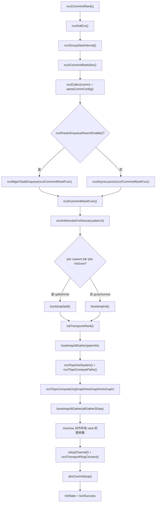
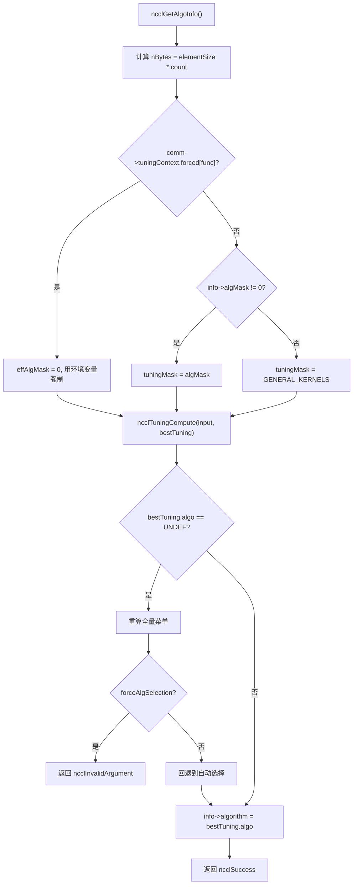
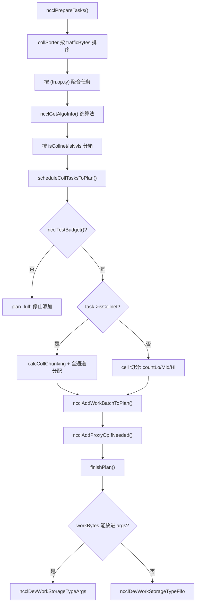
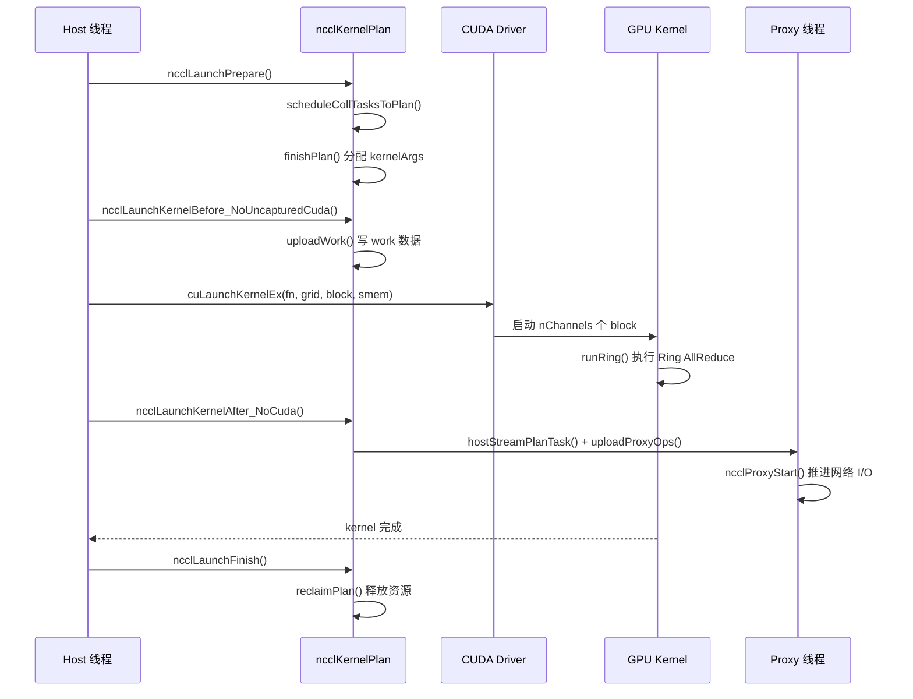

# 第 25 章：全景回顾与思考：一个 AllReduce 的终极旅程与设计精髓

上一章我们基于源码中的演进痕迹，展望了 NCCL 从固定集合操作走向可编程、从 host proxy 走向 GPU 直发、从注册缓冲区走向对称内存的架构趋势。现在，是时候把这些趋势放回一个具体的执行流中检验了。这一章不引入任何新代码，而是将第 3 章到第 10 章的端到端链路重新串联起来——从 ncclAllReduce 这一行调用开始，一路走到结果写回显存。读完之后，你应该能清晰地回答：一次 AllReduce 究竟经过了哪些函数？每个函数在哪个文件、哪一行？遇到问题时该翻哪一章？

## 一、初始化：通信域是怎么"长"出来的

### 直觉模型

把通信域想象成一个"群聊"。你调 `ncclCommInitRank` 就是"申请加入群聊"，NCCL 要在这时候把群成员名单（peerInfo）、谁和谁走哪条线（拓扑图）、每条线开几条流水线（channel）全部确定下来。**如果这一步错了，后面所有通信都是错的**——就像群聊里有人没被拉进来，你发的消息永远少一个人收到。

### 数据结构与内存布局

通信域的核心结构是 `ncclComm`，它的初始化分两段：`commAlloc` 负责"分配骨架"，`initTransportsRank` 负责"填充血肉"。

`commAlloc` 里最值得注意的是**共享资源引用计数**的设计。当子通信域（split/shrink 产生）复用父通信域资源时，不是拷贝一份，而是共享同一个 `ncclSharedResources` 并递增引用计数：

[FACT:src/init.cc:533-555](https://github.com/NVIDIA/nccl/blob/12df1a11afad322be5a204a2db890161cbf8131d/src/init.cc#L533-L555)

```cpp
if (parent == NULL || !parent->shareResources) {
    struct ncclSharedResources* sharedRes;
    NEW_NOTHROW(sharedRes, ncclSharedResources);
    sharedRes->owner = comm;
    ...
    comm->sharedRes = sharedRes;
    sharedRes->refCount = 1;
    NCCLCHECK(ncclNetInit(comm));
    NCCLCHECK(ncclRmaInit(comm));
    NCCLCHECK(ncclGinInit(comm));
} else {
    comm->sharedRes = parent->sharedRes;
    ncclAtomicRefCountIncrement(&parent->sharedRes->refCount);
    NCCLCHECK(ncclNetInitFromParent(comm, parent));
    NCCLCHECK(ncclRmaInitFromParent(comm, parent));
}
```

这段代码的意图很清晰：网络插件、RMA、GIN 这些"重资源"只初始化一次，子通信域直接借用。`refCount` 用原子操作递增，保证多线程下不会重复释放。

另一个关键点是 `commAlloc` 里对**通道的初始化**。所有通道先被标记为"未初始化"（`id = -1`），后续 `setupChannel` 才会真正填内容：

[FACT:src/init.cc:607-608](https://github.com/NVIDIA/nccl/blob/12df1a11afad322be5a204a2db890161cbf8131d/src/init.cc#L607-L608)

```cpp
// Mark channels as non initialized.
for (int c = 0; c < MAXCHANNELS; c++) comm->channels[c].id = -1;
```

这个 `-1` 是个哨兵值。任何代码如果误用了未初始化的通道，`id == -1` 会立刻暴露问题，而不是读到一堆随机内存。

### Step-by-Step：从 ncclCommInitRank 到 initTransportsRank

用户调用 `ncclCommInitRank` 后，实际执行流是这样的：

1. `ncclCommInitRank` 先调 `ncclInitEnv` 加载环境插件，再调 `ncclGroupStartInternal` 进入 group 语义（这是为了支持"一次 group 里初始化多个通信域"）。
2. 接着调 `ncclCommInitRankDev`，它做参数校验、分配 `comm` 结构、解析 config，然后**把真正的初始化工作丢给一个异步 job**：

[FACT:src/init.cc:2923-2929](https://github.com/NVIDIA/nccl/blob/12df1a11afad322be5a204a2db890161cbf8131d/src/init.cc#L2923-L2929)

```cpp
if (ncclParamEnqueueRearchEnable()) {
    NCCLCHECKGOTO(ncclMgmtTaskEnqueue((struct ncclAsyncJob*)job, ncclCommInitRankFunc, ncclCommInitJobFree, comm), res, fail);
} else {
    NCCLCHECKGOTO(ncclAsyncLaunch((struct ncclAsyncJob*)job, ncclCommInitRankFunc, NULL, ncclCommInitJobFree, comm), res, fail);
}
```

注意这里的 `ncclParamEnqueueRearchEnable()` 分支——这是 NCCL 正在进行的"enqueue 重构"的痕迹。默认走 `ncclAsyncLaunch`，开启重构后走 `ncclMgmtTaskEnqueue`。两条路径最终都会调用 `ncclCommInitRankFunc`。

3. `ncclCommInitRankFunc` 是初始化的主函数。它先设设备、查 GPU 属性、初始化 kernel：

[FACT:src/init.cc:2119-2127](https://github.com/NVIDIA/nccl/blob/12df1a11afad322be5a204a2db890161cbf8131d/src/init.cc#L2119-L2127)

```cpp
timers[TIMER_INIT_TOTAL] = clockNano();
CUDACHECKGOTO(cudaSetDevice(cudaDev), res, fail);
CUDACHECKGOTO(cudaDeviceGetAttribute(&maxSharedMem, cudaDevAttrMaxSharedMemoryPerBlockOptin, cudaDev), res, fail);
CUDACHECKGOTO(cudaDeviceGetAttribute(&archMajor, cudaDevAttrComputeCapabilityMajor, cudaDev), res, fail);
CUDACHECKGOTO(cudaDeviceGetAttribute(&archMinor, cudaDevAttrComputeCapabilityMinor, cudaDev), res, fail);
cudaArch = 100 * archMajor + 10 * archMinor;

timers[TIMER_INIT_KERNELS] = clockNano();
NCCLCHECKGOTO(ncclInitKernelsForDevice(cudaArch, maxSharedMem, &maxLocalSizeBytes), res, fail);
```

`cudaArch = 100 * archMajor + 10 * archMinor` 这个编码方式很实用：sm90 变成 900，sm100 变成 1000，方便后续用整数比较判断架构代际。

4. 然后根据是普通初始化还是 split/shrink/grow，走不同的 bootstrap 路径：

[FACT:src/init.cc:2136-2191](https://github.com/NVIDIA/nccl/blob/12df1a11afad322be5a204a2db890161cbf8131d/src/init.cc#L2136-L2191)

```cpp
if (job->parent && !job->isGrow) {
    // SPLIT/SHRINK: use bootstrapSplit
    ...
    NCCLCHECKGOTO(bootstrapSplit(comm->commHash, comm, job->parent, job->color, job->key, parentRanks), res, fail);
} else {
    // GROW or NORMAL INIT: use bootstrapInit
    ...
    NCCLCHECKGOTO(bootstrapInit(job->nId, (struct ncclBootstrapHandle*)job->commId, comm, job->parent), res, fail);
}
```

5. 最后调 `initTransportsRank`，这是整个初始化里最重的函数（约 800 行）。它内部做了两次 AllGather：

- **AllGather1**：交换 `ncclPeerInfo`（每个 rank 的设备信息、host hash、pid hash、GPU UUID 等）：

[FACT:src/init.cc:1236-1239](https://github.com/NVIDIA/nccl/blob/12df1a11afad322be5a204a2db890161cbf8131d/src/init.cc#L1236-L1239)

```cpp
NCCLCHECKGOTO(ncclCalloc(&comm->peerInfo, nranks + 1), ret, fail); // Extra rank to represent CollNet root
NCCLCHECKGOTO(fillInfo(comm, comm->peerInfo + rank, comm->commHash), ret, fail);
NCCLCHECKGOTO(bootstrapAllGather(comm->bootstrap, comm->peerInfo, sizeof(struct ncclPeerInfo)), ret, fail);
COMPILER_ATOMIC_STORE(&comm->peerInfoValid, true, std::memory_order_release);
```

注意 `nranks + 1` 这个分配——多出来的一个位置是给 CollNet root 用的。`peerInfoValid` 用 release 语义存储，保证其他线程看到这个标志时，peerInfo 的内容已经可见。

- **AllGather3**：交换拓扑计算结果（每个 rank 算出的 ring/tree 结构、带宽、通道数等），然后取所有 rank 的**最小值**来对齐：

[FACT:src/init.cc:1687-1703](https://github.com/NVIDIA/nccl/blob/12df1a11afad322be5a204a2db890161cbf8131d/src/init.cc#L1687-L1703)

```cpp
for (int i = 0; i < nranks; i++) {
    allTopoRanks[i] = &allGather3Data[i].topoRanks;
    // Make sure we align all ranks so that the tuning is consistent across ranks
    for (int a = 0; a < NCCL_NUM_ALGORITHMS; a++) {
        graphs[a]->nChannels = std::min(allGather3Data[i].graphInfo[a].nChannels, graphs[a]->nChannels);
        graphs[a]->sameChannels = std::min(allGather3Data[i].graphInfo[a].sameChannels, graphs[a]->sameChannels);
        graphs[a]->bwIntra = std::min(allGather3Data[i].graphInfo[a].bwIntra, graphs[a]->bwIntra);
        graphs[a]->bwInter = std::min(allGather3Data[i].graphInfo[a].bwInter, graphs[a]->bwInter);
        graphs[a]->typeIntra = std::max(allGather3Data[i].graphInfo[a].typeIntra, graphs[a]->typeIntra);
        graphs[a]->typeInter = std::max(allGather3Data[i].graphInfo[a].typeInter, graphs[a]->typeInter);
        graphs[a]->crossNic = std::max(allGather3Data[i].graphInfo[a].crossNic, graphs[a]->crossNic);
    }
    ...
}
```

带宽取 min、类型取 max，这是"木桶原理"：整个通信域的性能由最慢的那个 rank 决定。如果不对齐，不同 rank 可能算出不同的算法选择，导致通信死锁。

### 初始化流程图



### 设计思考与踩坑

**为什么初始化要异步？** 因为多 rank 初始化需要跨进程同步（bootstrap），如果同步执行会阻塞调用线程。异步化后，用户可以在 group 里同时初始化多个通信域，并行推进。

**踩坑点**：`initTransportsRank` 末尾有一个 intra-node barrier：

[FACT:src/init.cc:1968-1971](https://github.com/NVIDIA/nccl/blob/12df1a11afad322be5a204a2db890161cbf8131d/src/init.cc#L1968-L1971)

```cpp
/* Local intra-node barrier */
NCCLCHECKGOTO(bootstrapIntraNodeBarrier(comm->bootstrap, comm->localRankToRank, comm->localRank, comm->localRanks, comm->localRankToRank[0]), ret, fail);
```

这个 barrier 保证同机所有 rank 都完成了资源分配才继续。如果某个 rank 卡在 `devCommSetup` 里（比如显存不足），其他 rank 会在这里等死。生产环境遇到"初始化 hang 住"，第一件事就是看是不是某个 rank 的 `devCommSetup` 失败了。

## 二、任务入队：从 API 调用到内部任务对象

### 直觉模型

用户调 `ncclAllReduce` 就像在餐厅点菜。`ncclEnqueueCheck` 是服务员，它把你的订单翻译成厨房能看懂的"工单"（`ncclTaskColl`），放进 `comm->planner` 这个"订单池"里。**如果没有这一层，NCCL 就没法把多次调用合并成一次 kernel 启动**——每次点菜都单独开火，效率极低。

### 数据结构与内存布局

任务入队的核心是 `ncclKernelPlanner`，它挂在 `comm->planner` 上。关键字段包括：

- `collSorter`：按流量大小排序的集合通信任务队列
- `collTaskQueue`：最终排好序的任务队列
- `peers[]`：每个 peer 的 send/recv 队列（P2P 用）
- `wipPlan`：正在构建的 kernel plan

任务对象 `ncclTaskColl` 的关键字段在 `collTaskAppend` 里填充：

[FACT:src/enqueue/enqueue.cc:2800-2847](https://github.com/NVIDIA/nccl/blob/12df1a11afad322be5a204a2db890161cbf8131d/src/enqueue/enqueue.cc#L2800-L2847)

```cpp
struct ncclTaskColl* t = ncclMemoryPoolAlloc<struct ncclTaskColl>(&comm->memPool_ncclTaskColl, &comm->memPermanent);
t->func = info->coll;
t->sendbuff = info->sendbuff;
t->recvbuff = info->recvbuff;
t->count = info->count;
t->root = info->root;
t->datatype = info->datatype;
size_t elementSize = ncclTypeSize(t->datatype);
if (t->func == ncclFuncAllGather || t->func == ncclFuncBroadcast) {
    t->count *= elementSize;
    t->datatype = ncclInt8;
    elementSize = 1;
}
t->trafficBytes = t->count * elementSize * ncclFuncTrafficPerByte(t->func, comm->nRanks);
...
t->aggIsolate = ncclCollConfigNeedAggIsolate(&info->collConfig) || info->collConfig.CTAPolicy != comm->config.CTAPolicy;
NCCL_CONFIG_SET(t, minCTAs, ncclParamMinCTAs(), info->collConfig.minCTAs, comm->config.minCTAs, 1, MAXCHANNELS);
NCCL_CONFIG_SET(t, maxCTAs, ncclParamMaxCTAs(), (std::min(info->collConfig.maxCTAs, comm->config.maxCTAs)), comm->config.maxCTAs, 1, MAXCHANNELS);
...
planner->nTasksColl += 1;
ncclTaskCollSorterInsert(&planner->collSorter, t, t->trafficBytes);
```

注意几个细节：

1. **AllGather/Broadcast 的特殊处理**：把 count 乘以元素大小，datatype 改成 `ncclInt8`。这是因为这两个操作的语义是"搬运字节"，不需要关心原始类型。

2. **`trafficBytes` 的计算**：`ncclFuncTrafficPerByte` 返回每个字节需要传输几次。AllReduce 返回 2（reduce + broadcast），AllGather 返回 nRanks：

[FACT:src/enqueue/enqueue.cc:123-134](https://github.com/NVIDIA/nccl/blob/12df1a11afad322be5a204a2db890161cbf8131d/src/enqueue/enqueue.cc#L123-L134)

```cpp
static inline int ncclFuncTrafficPerByte(ncclFunc_t func, int nRanks) {
  switch (func) {
  case ncclFuncAllReduce:
    return 2;
  case ncclFuncAllGather:
    return nRanks;
  case ncclFuncReduceScatter:
    return nRanks;
  default:
    return 1;
  }
}
```

3. **`NCCL_CONFIG_SET` 宏**：这是"env > per-call > comm"三级配置解析。环境变量优先级最高，其次是单次调用的 config，最后是通信域级别的默认值。

### Step-by-Step：ncclAllReduce 的入队路径

1. `ncclEnqueueCheck` 先做通信域校验和 group 进入：

[FACT:src/enqueue/enqueue.cc:3478-3495](https://github.com/NVIDIA/nccl/blob/12df1a11afad322be5a204a2db890161cbf8131d/src/enqueue/enqueue.cc#L3478-L3495)

```cpp
ncclResult_t ncclEnqueueCheck(struct ncclInfo* info) {
  ncclResult_t ret = CommCheck(info->comm, info->opName, "comm");
  if (ret != ncclSuccess) return ncclGroupErrCheck(ret);
  if (info->comm->revokedFlag) {
    WARN("%s: communicator was revoked", info->opName);
    return ncclGroupErrCheck(ncclInvalidUsage);
  }
  ...
  NCCLCHECK(ncclGroupStartInternal());
  ret = ncclSuccess;
  int devOld = -1;
  NCCLCHECKGOTO(ncclCommEnsureReady(info->comm), ret, fail);
```

2. 然后调 `taskAppend`，它根据操作类型分派：

[FACT:src/enqueue/enqueue.cc:3337-3348](https://github.com/NVIDIA/nccl/blob/12df1a11afad322be5a204a2db890161cbf8131d/src/enqueue/enqueue.cc#L3337-L3348)

```cpp
static ncclResult_t taskAppend(struct ncclComm* comm, struct ncclInfo* info) {
  ncclFunc_t collAPI = info->coll;
  bool hasLaunchCompletionEvent = ncclInfoHasLaunchCompletionEvent(info);

  if (ncclParamEnqueueRearchEnable()) {
    NCCLCHECK(rawTaskAppend(comm, info));
  } else if (info->coll == ncclFuncSend || info->coll == ncclFuncRecv) {
    NCCLCHECK(p2pTaskAppend(comm, info, info->coll, collAPI, (void*)info->recvbuff, info->count, info->datatype, info->root, true));
  } else if (info->coll == ncclFuncPutSignal || info->coll == ncclFuncSignal || info->coll == ncclFuncWaitSignal) {
    NCCLCHECK(rmaTaskAppend(comm, info));
  } else {
    ...
  }
}
```

对于 AllReduce，走的是最后的 `else` 分支，最终调 `collTaskAppend`。

3. `collTaskAppend` 把任务插入 `collSorter`，按 `trafficBytes` 排序。排序的目的是让调度器优先处理大任务，避免小任务碎片化通道资源。

### 任务入队数据流

```mermaid
flowchart LR
    api["ncclAllReduce()"] --> info["ncclInfo 填充"]
    info --> enq["ncclEnqueueCheck()"]
    enq --> check["CommCheck + ncclCommEnsureReady()"]
    check --> append["taskAppend()"]
    append --> coll["collTaskAppend()"]
    coll --> task["ncclTaskColl 分配"]
    task --> sorter["ncclTaskCollSorterInsert(collSorter)"]
    sorter --> prepare["ncclPrepareTasks()"]
    prepare --> algo["ncclGetAlgoInfo() 选算法"]
    algo --> schedule["scheduleCollTasksToPlan()"]
    schedule --> plan["ncclKernelPlan"]
```



### 设计思考与踩坑

**为什么用 `ncclMemoryPoolAlloc` 而不是 `malloc`？** 因为任务对象生命周期短、分配频繁。内存池避免了每次 `malloc/free` 的系统调用开销。注意 `ncclMemoryPoolAlloc` 的第二个参数是 `&comm->memPermanent`——这意味着任务对象在通信域销毁时才统一释放，而不是每个任务单独释放。

**踩坑点**：`ncclPrepareTasks` 里有一个"聚合"逻辑，把大小相近（4 倍以内）的任务合并：

[FACT:src/enqueue/enqueue.cc:506-512](https://github.com/NVIDIA/nccl/blob/12df1a11afad322be5a204a2db890161cbf8131d/src/enqueue/enqueue.cc#L506-L512)

```cpp
// We aggregate operations that are within 4X size of each other.
while (aggEnd != nullptr && aggEnd->trafficBytes < 4 * aggBeg->trafficBytes && !aggBeg->aggIsolate && !aggEnd->aggIsolate) {
    agg.count += aggEnd->count;
    agg.trafficBytes += aggEnd->trafficBytes;
    aggEnd = aggEnd->next;
}
```

这个聚合是为了让算法选择更稳定——如果每个小任务单独选算法，可能选出一堆不同的算法，导致 kernel 碎片化。但 `aggIsolate` 标志会阻止聚合，用于那些"必须单独调度"的任务（比如带 per-call config 的）。

## 三、算法选型：代价模型怎么挑出最优解

### 直觉模型

算法选型就像导航软件选路线。NCCL 的"代价模型"（tuning 模块）会估算每种算法/协议组合在给定消息大小和拓扑下的耗时，然后选最快的那个。**如果没有代价模型，NCCL 只能写死一套算法，在小消息上浪费带宽、在大消息上浪费延迟**。

### 数据结构与内存布局

算法选型的入口是 `ncclGetAlgoInfo`：

[FACT:src/enqueue/enqueue.cc:2159-2185](https://github.com/NVIDIA/nccl/blob/12df1a11afad322be5a204a2db890161cbf8131d/src/enqueue/enqueue.cc#L2159-L2185)

```cpp
ncclResult_t ncclGetAlgoInfo(struct ncclComm* comm, struct ncclTaskColl* info, int collNetSupport, int nvlsSupport,
                             int numPipeOps, ncclSimInfo_t* simInfo) {
  size_t elementSize = ncclTypeSize(info->datatype);
  size_t nBytes = elementSize * ncclFuncMaxSendRecvCount(info->func, comm->nRanks, info->count);
  info->algorithm = NCCL_ALGO_UNDEF;
  info->protocol = NCCL_PROTO_UNDEF;
  struct ncclTuningInput_t input;
  input.comm = comm;
  input.tuningMask = NCCL_TUNING_MASK_GENERAL_KERNELS;
  uint64_t effAlgMask = comm->tuningContext.forced[info->func] ? 0 : info->algMask;
  if (effAlgMask != 0) {
    input.tuningMask = effAlgMask & NCCL_TUNING_MASK_GENERAL_KERNELS;
  }
  input.CTAPolicy = info->CTAPolicy;
  input.func = info->func;
  input.redOp = info->opHost;
  input.devRedOp = info->opDev.op;
  input.datatype = info->datatype;
  input.nBytes = nBytes;
  input.numPipeOps = numPipeOps;
  input.collNetSupport = collNetSupport;
  input.nvlsSupport = nvlsSupport;
  input.count = info->count;
  NCCLCHECK(ncclGetRegBuff(comm, info, &input.regBuff));
  ...
}
```

注意 `effAlgMask` 的逻辑：如果环境变量强制指定了算法（`comm->tuningContext.forced[info->func]` 非零），则忽略用户的 `algMask`，用环境变量的。这是"env > per-call"优先级的体现。

然后调 `ncclTuningCompute` 得到最优结果：

[FACT:src/enqueue/enqueue.cc:2213-2224](https://github.com/NVIDIA/nccl/blob/12df1a11afad322be5a204a2db890161cbf8131d/src/enqueue/enqueue.cc#L2213-L2224)

```cpp
} else {
    NCCLCHECK(ncclTuningCompute(&input, &bestTuning));
}
INFO(NCCL_TUNING, "Best tuning, algorithm, %s, protocol, %s", ncclAlgoToString(bestTuning.algo), ncclProtoToString(bestTuning.proto));
info->algorithm = bestTuning.algo;
info->protocol = bestTuning.proto;
info->nWarps = bestTuning.nWarps;
if (simInfo) simInfo->estimatedTime = bestTuning.timeUs;
TRACE(NCCL_COLL, "%ld Bytes -> Algo %d proto %d time %f", nBytes, info->algorithm, info->protocol, bestTuning.timeUs);
info->nMaxChannels = bestTuning.maxChannels == 0 ? info->nMaxChannels : bestTuning.maxChannels;
```

### Step-by-Step：一次 AllReduce 的算法选择

假设 8 卡单机、消息大小 1MB、AllReduce：

1. `nBytes = 1MB`，`numPipeOps` 是当前 plan 里已有的任务数。
2. `collNetSupport` 和 `nvlsSupport` 由 `ncclGetCollNetSupport` 和 `ncclNvlsTransportEnabled` 决定。
3. `ncclTuningCompute` 遍历所有可用的 (algo, proto) 组合，用代价模型估算时间。
4. 对于 1MB 单机场景，通常 NVLS 或 Tree+LL128 会胜出。
5. 结果写回 `info->algorithm`、`info->protocol`、`info->nWarps`。

### 算法选择决策图



### 设计思考与踩坑

**为什么算法选择要"跨 rank 对齐"？** 因为不同 rank 如果选了不同算法，通信模式就不匹配，会死锁。所以 `initTransportsRank` 里用 min/max 对齐了所有图参数，保证每个 rank 的代价模型输入一致。

**踩坑点**：`ncclGetAlgoInfo` 里有一个"重算"逻辑——如果用户指定了 `algMask` 但没有任何算法匹配，会先静默重算全量菜单，再判断是硬错误还是软回退：

[FACT:src/enqueue/enqueue.cc:2192-2208](https://github.com/NVIDIA/nccl/blob/12df1a11afad322be5a204a2db890161cbf8131d/src/enqueue/enqueue.cc#L2192-L2208)

```cpp
NOWARN(ncclTuningCompute(&input, &bestTuning), NCCL_TUNING);
if (bestTuning.algo == NCCL_ALGO_UNDEF) {
    input.tuningMask = NCCL_TUNING_MASK_GENERAL_KERNELS;
    bestTuning = NCCL_TUNING_RESULT_INIT;
    bestTuning.maxChannels = 0;
    NCCLCHECK(ncclTuningCompute(&input, &bestTuning));
    if (info->forceAlgSelection) {
        WARN("algSelection: no algorithm in the selected set is available for %s", ncclFuncToString(info->func));
        return ncclInvalidArgument;
    }
    INFO(NCCL_TUNING, "algSelection: selected set unavailable for %s; falling back to automatic selection", ncclFuncToString(info->func));
}
```

`NOWARN` 宏临时抑制警告，因为"没有算法匹配"可能是正常情况（用户选的集合确实不可用）。只有 `forceAlgSelection` 为真时才报错。

## 四、任务调度与 kernel plan 构建

### 直觉模型

任务调度就像把一堆订单分配到几条流水线上。`scheduleCollTasksToPlan` 决定每个任务用几条通道、每条通道处理多少数据，最终生成一个 `ncclKernelPlan`——这就是要传给 GPU 的"工单"。

### 数据结构与内存布局

`ncclKernelPlan` 的核心字段：

- `channelMask`：这个 plan 用到哪些通道（位图）
- `workBytes`：所有 work 结构的总字节数
- `nWorkBatches`：work batch 数量
- `kernelArgs`：kernel 启动参数
- `workStorageType`：work 数据存哪里（args/fifo/persistent）

`finishPlan` 决定 work 数据的存储位置：

[FACT:src/enqueue/enqueue.cc:244-255](https://github.com/NVIDIA/nccl/blob/12df1a11afad322be5a204a2db890161cbf8131d/src/enqueue/enqueue.cc#L244-L255)

```cpp
// If we can fit everything into the kernel args we do so.
if (sizeof(ncclDevKernelArgs) + batchBytes + workBytes <= comm->workArgsBytes) {
    plan->workStorageType = ncclDevWorkStorageTypeArgs;
}
plan->kernelArgsSize = sizeof(struct ncclDevKernelArgs) + batchBytes;
plan->kernelArgsSize += (plan->workStorageType == ncclDevWorkStorageTypeArgs) ? workBytes : 0;
plan->kernelArgsSize = alignUp(plan->kernelArgsSize, 16);
plan->kernelArgs = (struct ncclDevKernelArgs*)ncclMemoryStackAlloc(&comm->memScoped, plan->kernelArgsSize, /*align=*/16);
plan->kernelArgs->comm = comm->devComm;
plan->kernelArgs->channelMask = plan->channelMask;
plan->kernelArgs->workStorageType = plan->workStorageType;
```

三种存储类型的权衡：
- **Args**：最快，但 kernel 参数大小有限（通常 4KB）
- **Fifo**：环形缓冲区，适合中等大小
- **Persistent**：独立显存分配，适合 CUDA Graph 场景

### Step-by-Step：scheduleCollTasksToPlan 的通道分配

1. 先估算这个 plan 能装多少任务：

[FACT:src/enqueue/enqueue.cc:654-687](https://github.com/NVIDIA/nccl/blob/12df1a11afad322be5a204a2db890161cbf8131d/src/enqueue/enqueue.cc#L654-L687)

```cpp
do {
    size_t workBytes = 0;
    struct ncclTaskColl* task = ncclIntruQueueHead(&planner->collTaskQueue);
    struct ncclWorkList* workNode = ncclIntruQueueHead(&planner->collWorkQueue);
    while (task != nullptr) {
        int nBatches = divUp(nPlanColls, 4); // Rough guess: 4 colls per batch.
        if (!ncclTestBudget(budget, nBatches, workBytes + workNode->size)) goto plan_full;
        bool taskAggIsolate = task->aggIsolate;
        if (taskAggIsolate && nPlanColls > 0) goto plan_full;
        nPlanColls += 1;
        workBytes += workNode->size;
        int kind = 2 * task->isCollnet + task->isNvls;
        trafficBytes[kind] += std::max(MinTrafficPerChannel, task->trafficBytes);
        ...
    }
plan_full:;
} while (0);
```

2. 然后按流量把通道分配给任务。对于非 CollNet 任务，用"cell"为单位切分：

[FACT:src/enqueue/enqueue.cc:742-759](https://github.com/NVIDIA/nccl/blob/12df1a11afad322be5a204a2db890161cbf8131d/src/enqueue/enqueue.cc#L742-L759)

```cpp
int trafficPerByte = ncclFuncTrafficPerByte(task->func, comm->nRanks);
if (task->protocol == NCCL_PROTO_LL) trafficPerByte *= 4;
size_t cellSize = divUp(divUp(MinTrafficPerChannel, (size_t)trafficPerByte), 16) * 16;
int elementsPerCell = cellSize / elementSize;
size_t cells = divUp(task->count * elementSize, cellSize);
size_t trafficPerElement = elementSize * trafficPerByte;
size_t trafficPerCell = cellSize * trafficPerByte;
size_t cellsPerChannel = std::min(cells, divUp(trafficPerChannel, trafficPerCell));
size_t cellsLo;
if (channelId + 1 == nMaxChannels[kind]) {
    cellsLo = cells;
} else {
    cellsLo = std::min(cells, divUp((trafficPerChannel - currentTraffic), trafficPerCell));
}
int nMidChannels = (cells - cellsLo) / cellsPerChannel;
size_t cellsHi = (cells - cellsLo) % cellsPerChannel;
int nChannels = (cellsLo != 0 ? 1 : 0) + nMidChannels + (cellsHi != 0 ? 1 : 0);
```

这段代码把数据切成"低/中/高"三段：`countLo`、`countMid`、`countHi`。低段和高段是边界通道，中段是中间通道。这样切分是为了让每条通道处理的数据量尽量均匀。

3. 最后调 `calcCollChunking` 计算每条通道的 chunk 大小：

[FACT:src/enqueue/enqueue.cc:2228-2275](https://github.com/NVIDIA/nccl/blob/12df1a11afad322be5a204a2db890161cbf8131d/src/enqueue/enqueue.cc#L2228-L2275)

```cpp
static ncclResult_t calcCollChunking(struct ncclComm* comm, struct ncclTaskColl* info, int nChannels, size_t nBytes,
                                     uint32_t* outChunkSize, uint32_t* outDirectFlags, struct ncclProxyOp* proxyOp) {
  ncclPattern_t pattern;
  size_t grainSize = ncclProtoGrainSize(info->protocol);
  switch (info->func) {
  case ncclFuncAllReduce:
    pattern = info->algorithm == NCCL_ALGO_NVLS           ? ncclPatternNvls :
              info->algorithm == NCCL_ALGO_NVLS_TREE      ? ncclPatternNvlsTree :
              info->algorithm == NCCL_ALGO_COLLNET_DIRECT ? ncclPatternCollnetDirect :
              info->algorithm == NCCL_ALGO_COLLNET_CHAIN  ? ncclPatternCollnetChain :
              info->algorithm == NCCL_ALGO_TREE           ? ncclPatternTreeUpDown :
                                                            ncclPatternRingTwice;
    break;
  ...
  }
  int stepSize = comm->buffSizes[info->protocol] / NCCL_STEPS;
  int chunkSteps = (info->protocol == NCCL_PROTO_SIMPLE && info->algorithm == NCCL_ALGO_RING) ? info->chunkSteps : 1;
  int sliceSteps = (info->protocol == NCCL_PROTO_SIMPLE && info->algorithm == NCCL_ALGO_RING) ? info->sliceSteps : 1;
  int chunkSize = stepSize * chunkSteps;
  if (info->protocol == NCCL_PROTO_LL) chunkSize /= 2;
  if (info->protocol == NCCL_PROTO_LL128) chunkSize = (chunkSize / NCCL_LL128_LINEELEMS) * NCCL_LL128_DATAELEMS;
  ...
}
```

### 调度流程图



### 设计思考与踩坑

**为什么 CollNet 任务单独处理？** 因为 CollNet 用的是网络交换机做归约，通道分配逻辑和普通 ring/tree 完全不同。CollNet 任务直接占用所有可用通道，而普通任务需要按流量切分。

**踩坑点**：`ncclTestBudget` 的估算用了一个粗略公式 `nBatches = divUp(nPlanColls, 4)`——假设每 4 个集合操作产生一个 batch。这个估算可能不准，所以后面还有精确检查：

[FACT:src/enqueue/enqueue.cc:711-714](https://github.com/NVIDIA/nccl/blob/12df1a11afad322be5a204a2db890161cbf8131d/src/enqueue/enqueue.cc#L711-L714)

```cpp
// Ensure room for worst case of one new batch per channel
if (!ncclTestBudget(budget, plan->nWorkBatches + nChannels, plan->workBytes + workNode->size)) {
    return ncclSuccess;
}
```

如果精确检查失败，直接返回（不报错），让上层再开一个新 plan。

## 五、Kernel 启动与设备侧执行

### 直觉模型

Kernel 启动就像把工单交给工厂。`ncclLaunchKernel` 把 `ncclKernelPlan` 翻译成 CUDA kernel 启动参数，然后调 `cuLaunchKernelEx`。设备侧 kernel 收到工单后，按算法执行数据搬运。

### 数据结构与内存布局

`ncclLaunchKernel` 的关键步骤：

[FACT:src/enqueue/enqueue.cc:1886-1909](https://github.com/NVIDIA/nccl/blob/12df1a11afad322be5a204a2db890161cbf8131d/src/enqueue/enqueue.cc#L1886-L1909)

```cpp
ncclResult_t ncclLaunchKernel(struct ncclComm* comm, struct ncclKernelPlan* plan) {
  ncclResult_t ret = ncclSuccess;
  struct ncclKernelPlanner* planner = &comm->planner;
  int nChannels = countOneBits(plan->channelMask);
  void* sym = plan->kernelFn;
  dim3 grid = {(unsigned)nChannels, 1, 1};
  dim3 block = {(unsigned)plan->threadPerBlock, 1, 1};
  int smem = plan->isSymColl ? plan->kernelDynSmem : ncclShmemDynamicSize(comm->cudaArch);
  cudaStream_t launchStream = planner->streams->stream;
  ...
  void* extra[] = {CU_LAUNCH_PARAM_BUFFER_POINTER, plan->kernelArgs, CU_LAUNCH_PARAM_BUFFER_SIZE, &plan->kernelArgsSize, CU_LAUNCH_PARAM_END};
  ...
  CUfunction fn;
  CUDACHECKGOTO(cudaGetFuncBySymbol(&fn, sym), ret, do_return);
```

注意 `grid.x = nChannels`——每个通道一个 block。`block.x = plan->threadPerBlock`——每个 block 的线程数由任务决定。

### Step-by-Step：从 plan 到 kernel 启动

1. 先调 `uploadWork` 把 work 数据写到目标位置（args/fifo/persistent）：

[FACT:src/enqueue/enqueue.cc:1365-1407](https://github.com/NVIDIA/nccl/blob/12df1a11afad322be5a204a2db890161cbf8131d/src/enqueue/enqueue.cc#L1365-L1407)

```cpp
static ncclResult_t uploadWork(struct ncclComm* comm, struct ncclKernelPlan* plan) {
  if (plan->isSymColl || plan->isCeColl || plan->isRma) return ncclSuccess;
  size_t workBytes = plan->workBytes;
  size_t batchBytes = plan->nWorkBatches * sizeof(struct ncclDevWorkBatch);
  void* fifoBufHost;
  uint32_t fifoCursor, fifoMask;
  switch (plan->workStorageType) {
  case ncclDevWorkStorageTypeArgs:
    plan->kernelArgs->workBuf = nullptr;
    fifoBufHost = (void*)plan->kernelArgs;
    fifoCursor = sizeof(ncclDevKernelArgs) + batchBytes;
    fifoMask = ~0u;
    break;
  case ncclDevWorkStorageTypeFifo:
    fifoBufHost = comm->workFifoBuf;
    fifoCursor = comm->workFifoProduced;
    fifoMask = comm->workFifoBytes - 1;
    NCCLCHECK(waitWorkFifoAvailable(comm, fifoCursor + workBytes));
    plan->kernelArgs->workBuf = comm->workFifoBufDev;
    break;
  ...
  }
}
```

2. 然后构造 CUDA launch 属性。对于 sm90+，会设置 cluster 维度：

[FACT:src/enqueue/enqueue.cc:1929-1936](https://github.com/NVIDIA/nccl/blob/12df1a11afad322be5a204a2db890161cbf8131d/src/enqueue/enqueue.cc#L1929-L1936)

```cpp
if (clusterSize) {
    // Grid dimension must be divisible by clusterSize
    if (grid.x % clusterSize) clusterSize = 1;
    launchAttrs[attrs].id = CU_LAUNCH_ATTRIBUTE_CLUSTER_DIMENSION;
    launchAttrs[attrs++].value.clusterDim = {clusterSize, 1, 1};
    launchAttrs[attrs].id = CU_LAUNCH_ATTRIBUTE_CLUSTER_SCHEDULING_POLICY_PREFERENCE;
    launchAttrs[attrs++].value.clusterSchedulingPolicyPreference = CU_CLUSTER_SCHEDULING_POLICY_SPREAD;
}
```

3. 最后调 `cuLaunchKernelEx`：

[FACT:src/enqueue/enqueue.cc:1992](https://github.com/NVIDIA/nccl/blob/12df1a11afad322be5a204a2db890161cbf8131d/src/enqueue/enqueue.cc#L1992)

```cpp
CUCHECKGOTO(cuLaunchKernelEx(&launchConfig, fn, nullptr, extra), ret, do_return);
```

### 设备侧：runRing 的执行

设备侧 kernel 收到工单后，根据算法调用对应的 `RunWorkColl` 特化。以 Ring AllReduce 为例：

[FACT:src/device/all_reduce.h:14-83](https://github.com/NVIDIA/nccl/blob/12df1a11afad322be5a204a2db890161cbf8131d/src/device/all_reduce.h#L14-L83)

```cpp
template <typename T, typename RedOp, typename Proto>
__device__ __forceinline__ void runRing(int tid, int nthreads, struct ncclDevWorkColl* work) {
  ncclRing* ring = &ncclShmem.channel.ring;
  int ringIx = ring->index;
  const int nranks = ncclShmem.comm.nRanks;
  ssize_t gridOffset;
  ssize_t channelCount;
  ssize_t chunkCount;
  ncclCollCbdPart(work, ncclShmem.channelId, Proto::Id, sizeof(T), (ssize_t*)nullptr, &gridOffset, &channelCount, &chunkCount);
  const ssize_t loopCount = nranks * chunkCount;
  ...
  Primitives<T, RedOp, FanSymmetric<1>, 1, Proto, 0> prims(tid, nthreads, &ring->prev, &ring->next, work->sendbuff, work->recvbuff, work->redOpArg, 0, 0, 0, work);

  for (ssize_t elemOffset = 0; elemOffset < channelCount; elemOffset += loopCount) {
    ssize_t remCount = channelCount - elemOffset;
    ssize_t chunkOffset;
    if (remCount < loopCount) chunkCount = alignUp(divUp(remCount, nranks), 16 / sizeof(T));
    auto modRanks = [&] __device__(int r) -> int { return r - (r >= nranks ? nranks : 0); };

    // step 0: push data to next GPU
    chunk = modRanks(ringIx + nranks - 1);
    chunkOffset = chunk * chunkCount;
    offset = gridOffset + elemOffset + chunkOffset;
    nelem = (int)min(chunkCount, remCount - chunkOffset);
    prims.directSend(offset, offset, nelem);

    // k-2 steps: reduce and copy to next GPU
    for (int j = 2; j < nranks; ++j) {
      chunk = modRanks(ringIx + nranks - j);
      chunkOffset = chunk * chunkCount;
      offset = gridOffset + elemOffset + chunkOffset;
      nelem = (int)min(chunkCount, remCount - chunkOffset);
      prims.directRecvReduceDirectSend(offset, offset, nelem);
    }

    // step k-1: reduce this buffer and data, which will produce the final result
    chunk = ringIx + 0;
    chunkOffset = chunk * chunkCount;
    offset = gridOffset + elemOffset + chunkOffset;
    nelem = (int)min(chunkCount, remCount - chunkOffset);
    prims.directRecvReduceCopyDirectSend(offset, offset, nelem, /*postOp=*/true);

    // k-2 steps: copy to next GPU
    for (int j = 1; j < nranks - 1; ++j) {
      chunk = modRanks(ringIx + nranks - j);
      chunkOffset = chunk * chunkCount;
      offset = gridOffset + elemOffset + chunkOffset;
      nelem = (int)min(chunkCount, remCount - chunkOffset);
      prims.directRecvCopyDirectSend(offset, offset, nelem);
    }

    // Make final copy from buffer to dest.
    chunk = modRanks(ringIx + 1);
    chunkOffset = chunk * chunkCount;
    offset = gridOffset + elemOffset + chunkOffset;
    nelem = (int)min(chunkCount, remCount - chunkOffset);
    prims.directRecv(offset, nelem);
  }
}
```

Ring AllReduce 的经典两阶段：
- **Reduce-Scatter 阶段**（前 nranks-1 步）：每个 rank 把自己的数据发给下一个，同时接收上一个的数据并归约。
- **AllGather 阶段**（后 nranks-1 步）：把归约好的结果沿环传播。

`modRanks` 这个 lambda 处理环形索引回绕：当 `r >= nranks` 时减 nranks。

### Kernel 启动时序图



### 设计思考与踩坑

**为什么用 `cuLaunchKernelEx` 而不是 `cudaLaunchKernel`？** 因为需要设置 launch 属性（cluster 维度、mem sync domain、launch completion event）。这些属性在 CUDA 12.0+ 才支持。

**踩坑点**：`uploadWork` 里对 persistent 模式的处理很复杂——它需要分配显存、拷贝数据、记录事件，还要在 CUDA Graph 捕获模式下正确工作：

[FACT:src/enqueue/enqueue.cc:1445-1478](https://github.com/NVIDIA/nccl/blob/12df1a11afad322be5a204a2db890161cbf8131d/src/enqueue/enqueue.cc#L1445-L1478)

```cpp
CUDACHECKGOTO(cudaThreadExchangeStreamCaptureMode(&mode), result, fail);
NCCLCHECKGOTO(ncclStrongStreamAcquire(ncclCudaGraphNone(comm->config.graphUsageMode), &comm->sharedRes->deviceStream, /*concurrent=*/false, &deviceStream), result, fail);
if (comm->memPool) {
    CUDACHECKGOTO(cudaMallocAsync(&fifoBufDev, workBytes, comm->memPool, deviceStream), result, fail);
} else {
    CUDACHECKGOTO(cudaMalloc(&fifoBufDev, workBytes), result, fail);
}
plan->workBufPersistent = fifoBufDev;
plan->kernelArgs->workBuf = fifoBufDev;
CUDACHECKGOTO(cudaMemcpyAsync(fifoBufDev, fifoBufHost, workBytes, cudaMemcpyDefault, deviceStream), result, fail);
cudaEvent_t memcpyDone;
CUDACHECKGOTO(cudaEventCreateWithFlags(&memcpyDone, cudaEventDisableTiming), result, fail);
CUDACHECKGOTO(cudaEventRecord(memcpyDone, deviceStream), result, fail);
```

`cudaThreadExchangeStreamCaptureMode` 是为了在捕获模式下临时切换到 relaxed 模式，允许分配显存。拷贝完成后记录事件，后续通过 `ncclCommPollEventCallbacks` 回收。

## 六、生产避坑指南

### 坑 1：初始化 hang 住

**现象**：`ncclCommInitRank` 卡住不返回。

**排查**：看 `NCCL_DEBUG=INFO` 日志，找到最后一个打印的 rank。如果所有 rank 都打印了 "Init START" 但没有 "Init COMPLETE"，说明卡在 `initTransportsRank` 里。

**常见原因**：
- 某个 rank 的 `devCommSetup` 失败（显存不足、CUDA 错误）
- bootstrap 网络不通（防火墙、端口占用）
- 不同 rank 的 NCCL 版本不一致

**源码依据**：`initTransportsRank` 末尾的 intra-node barrier 会等待所有本机 rank：

[FACT:src/init.cc:1968-1971](https://github.com/NVIDIA/nccl/blob/12df1a11afad322be5a204a2db890161cbf8131d/src/init.cc#L1968-L1971)

```cpp
/* Local intra-node barrier */
NCCLCHECKGOTO(bootstrapIntraNodeBarrier(comm->bootstrap, comm->localRankToRank, comm->localRank, comm->localRanks, comm->localRankToRank[0]), ret, fail);
```

### 坑 2：work FIFO 溢出

**现象**：kernel 启动后 hang 住，或者报 `ncclInternalError`。

**原因**：`waitWorkFifoAvailable` 在等 FIFO 空间，但消费端（kernel）没有推进。

[FACT:src/enqueue/enqueue.cc:1333-1349](https://github.com/NVIDIA/nccl/blob/12df1a11afad322be5a204a2db890161cbf8131d/src/enqueue/enqueue.cc#L1333-L1349)

```cpp
static ncclResult_t waitWorkFifoAvailable(struct ncclComm* comm, uint32_t desiredProduced) {
  bool hasRoom = (desiredProduced - comm->workFifoConsumed) <= comm->workFifoBytes;
  if (!hasRoom) {
    while (true) {
      // Check abort flag to break deadlock when abort is signaled
      if (COMPILER_ATOMIC_LOAD(comm->abortFlag, std::memory_order_acquire)) {
        return ncclInternalError;
      }
      NCCLCHECK(ncclCommPollEventCallbacks(comm, /*waitSome=*/true));
      hasRoom = (desiredProduced - comm->workFifoConsumed) <= comm->workFifoBytes;
      if (hasRoom) break;
      std::this_thread::yield();
    }
  }
  return ncclSuccess;
}
```

注意 abort flag 检查——这是唯一的逃生通道。如果 abort 也没设，就会死循环。

**避坑**：调大 `NCCL_WORK_FIFO_BYTES`，或者减少单次 group 里的操作数。

### 坑 3：CUDA Graph 捕获失败

**现象**：在 CUDA Graph 捕获期间调 NCCL，报 "operation not permitted"。

**原因**：捕获模式下不能做某些 CUDA 操作（如 `cudaMalloc`）。NCCL 用 `cudaThreadExchangeStreamCaptureMode` 临时切换模式，但不是所有操作都能绕过。

**源码依据**：`uploadWork` 的 persistent 分支：

[FACT:src/enqueue/enqueue.cc:1445](https://github.com/NVIDIA/nccl/blob/12df1a11afad322be5a204a2db890161cbf8131d/src/enqueue/enqueue.cc#L1445)

```cpp
CUDACHECKGOTO(cudaThreadExchangeStreamCaptureMode(&mode), result, fail);
```

**避坑**：用 `NCCL_GRAPH_MIXING_SUPPORT=1` 开启 graph 混合模式，或者预分配 work buffer。

## 本章小结

这一章我们把一次 AllReduce 的完整链路重新走了一遍：

1. **初始化**：`ncclCommInitRank` → `ncclCommInitRankFunc` → `initTransportsRank`，建立通信域、搜索拓扑、对齐图参数。
2. **任务入队**：`ncclEnqueueCheck` → `taskAppend` → `collTaskAppend`，把 API 调用翻译成 `ncclTaskColl`。
3. **算法选型**：`ncclGetAlgoInfo` → `ncclTuningCompute`，用代价模型选出最优 (algo, proto)。
4. **任务调度**：`ncclPrepareTasks` → `scheduleCollTasksToPlan` → `finishPlan`，把任务分配到通道，生成 `ncclKernelPlan`。
5. **Kernel 启动**：`ncclLaunchKernel` → `cuLaunchKernelEx`，把 plan 翻译成 CUDA 启动参数。
6. **设备侧执行**：`runRing` / `runTreeUpDown` / `runNvls`，按算法执行数据搬运。

## 本章思考与自测

<details><summary>Q1: 如果把 `initTransportsRank` 里 AllGather3 之后的 min/max 对齐逻辑（L1690-L1698）去掉，在什么场景下会导致通信死锁？为什么？</summary>

**参考解析**：这段逻辑保证所有 rank 对每个算法的 `nChannels`、`bwIntra`、`bwInter` 等参数达成一致。如果去掉，每个 rank 会用自己的本地拓扑计算结果。考虑一个异构集群：rank 0 在 8 卡 NVLink 机器上，rank 8 在 4 卡 PCIe 机器上。rank 0 算出 ring 有 8 条通道，rank 8 算出 4 条。当它们执行 Ring AllReduce 时，rank 0 会等 rank 8 在 8 条通道上发数据，但 rank

至此，我们完成了对一次 AllReduce 完整链路的回顾。从初始化、拓扑搜索、算法选择、任务入队、kernel 启动，到设备侧执行与网络传输，每个环节都对应着前面章节的深入剖析。这份链路图不仅是理解 NCCL 的骨架，也是排查问题的索引：初始化失败查第 3、4 章，算法选错查第 5 章，任务入队报错查第 6、7 章，kernel 启动失败查第 8 章，设备侧 hang 查第 9、10 章，网络问题查第 12、13 章。随着 NCCL 向可编程通信、GPU 直发和对称内存演进，这条链路还将继续延伸——而你已经掌握了追踪它的方法。