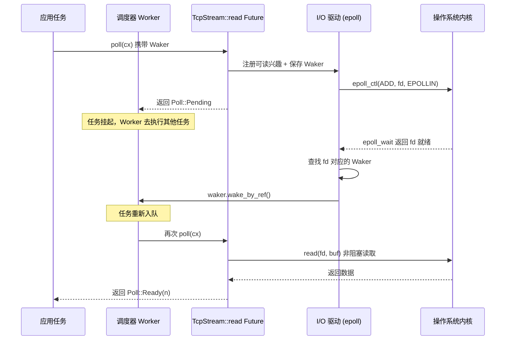

# Kapitel 1: Das mentale Modell der Asynchronität: Future, Waker und Executor als Trio

Asynchrone Programmierung ist in Rust keine Bibliothek, sondern ein sprachweites Protokoll. Dass Tokio zu einer produktionsreifen Laufzeitumgebung werden konnte, liegt nicht daran, dass es Future erfunden hat, sondern daran, dass es die Randbedingungen jedes einzelnen Vertrags dieses Protokolls präzise implementiert. Dieses Kapitel springt nicht vorschnell in den Scheduler-Code von Tokio, sondern erklärt zunächst gründlich die Verantwortungsgrenzen und den umgekehrten Kontrollfluss des „Trio" — Future, Waker, Executor. Erst wenn man versteht, wie diese drei ineinandergreifen, finden die Zusammensetzung der Runtime, das Work-Stealing-Scheduling und der I/O-Treiber in den folgenden Kapiteln einen Anknüpfungspunkt.

# 1.1 Vom Blockieren zum Polling: Warum Rust poll statt Callbacks wählt

## Intuitives Modell

Stellen Sie sich vor, Sie bestellen in einem Restaurant ein Gericht, das frisch zubereitet werden muss. Callback-basierte Asynchronität (wie der frühe Node.js-Stil) entspricht dem Hinterlassen Ihrer Telefonnummer, und der Koch ruft Sie**aktiv an**— die Kontrolle liegt beim Koch, Ihr Code reagiert nur passiv. Polling-basierte Asynchronität (Rusts Wahl) entspricht dem Erhalt eines Abholscheins, Sie**entscheiden selbst**wann Sie zum Fenster gehen und fragen „Ist es fertig?": Wenn nicht, machen Sie etwas anderes, wenn ja, holen Sie es ab.

Dieser Unterschied erscheint geringfügig, bestimmt aber die Form des gesamten Systems. Im Callback-Modell muss jede asynchrone Operation eine Closure mitführen, die angibt, „was nach Abschluss zu tun ist". Closures verschachteln sich Schicht für Schicht und bilden die Callback-Hölle, und das Abbrechen von Operationen ist extrem schwierig — Sie können einen bereits registrierten Callback nicht „zurückziehen". Im Polling-Modell ist ein Future nur ein Zustandsautomat,`poll`ist eine reine Abfrageaktion, ohne Voranschreiten werden keine Ressourcen verbraucht, Abbrechen ist einfach drop, sauber und ordentlich.

## Der Kernvertrag des Polling-Modells

Das von der Rust-Standardbibliothek definierte`Future`Trait hat nur zwei Elemente: eine`poll`Methode, einen`Output`assoziierten Typ. Tokio definiert dieses Trait nicht neu, sondern verwendet direkt die Implementierung der Standardbibliothek wieder. Dies zeigt sich deutlich im Quellcode:

```rust
// tokio/src/future/mod.rs
cfg_not_trace! {
    cfg_rt! {
        pub(crate) use std::future::Future;
    }
}
```

[FACT:tokio/src/future/mod.rs:24-28]

Dieser Code offenbart eine wichtige Tatsache: Wenn das`tracing`Feature nicht aktiviert ist, ist das interne`Future`von Tokio ein Alias für`std::future::Future`ohne jegliche Umhüllung. Nur wenn`tracing`aktiviert ist, wird es durch`InstrumentedFuture`ersetzt:

```rust
cfg_trace! {
    mod trace;
    #[allow(unused_imports)]
    pub(crate) use trace::InstrumentedFuture as Future;
}
```

[FACT:tokio/src/future/mod.rs:18-22]

> **[Design Inference & Architectural Trade-offs]**
> Dieses Design „standardmäßig zero-cost, Instrumentierung nach Bedarf" ist Tokios beständige Philosophie: Der Kernpfad führt keine zusätzliche Abstraktionsebene ein, Beobachtbarkeit wird als optionales Feature hinzugefügt.`InstrumentedFuture`Die Existenz von zeigt, dass das Tokio-Team der Ansicht ist, dass die Instrumentierungskosten von tracing nicht von allen Nutzern getragen werden sollten.

## Drei implizite Einschränkungen des poll-Vertrags

`poll`Die Signatur der`fn poll(self: Pin<&mut Self>, cx: &mut Context<'_>) -> Poll<Self::Output>`Methode ist

**. In dieser Signatur verbergen sich drei Verträge; die Verletzung eines jeden führt zu undefiniertem Verhalten oder logischen Fehlern:** `Pin<&mut Self>`Vertrag eins: Pin garantiert Selbstreferenz-Sicherheit.

**bedeutet, dass ein Future, sobald es gepollt wurde, seine Speicheradresse nicht mehr ändern darf. Der Grund ist, dass ein async-Block nach der Kompilierung einen Zustandsautomaten mit Selbstreferenzen erzeugt — lokale Variablen können Referenzen auf andere Felder innerhalb desselben Zustandsautomaten halten. Wenn eine Verschiebung erlaubt wäre, würden diese Referenzen baumeln.**Vertrag zwei: Pending muss bereits ein Aufwecken registriert haben.`poll`Wenn`Poll::Pending`zurückgibt`cx.waker()`Holt und speichert den Waker oder hat den Waker bereits bei einer Ereignisquelle registriert. Andernfalls wird der Executor niemals erfahren, wann dieses Future erneut gepollt werden kann, was dazu führt, dass die Aufgabe dauerhaft hängen bleibt.

**Vertrag drei: Nach Ready sollte nicht erneut gepollt werden.**Sobald`poll`zurückgibt`Poll::Ready`ist es ein logischer Fehler, dasselbe Future erneut zu pollen (obwohl dies kein UB verursacht, ist das Verhalten undefiniert). Der Executor ist dafür verantwortlich, die Aufgabe nach Erhalt von Ready nicht erneut zu planen.

Von diesen drei Verträgen ist Vertrag zwei die fehleranfälligste Stelle und auch der grundlegende Grund für die Existenz des Wakers.

# 1.2 Waker: Der Träger des umgekehrten Kontrollflusses

## Intuitives Modell

Der Waker ist der „Vibrations-Piepser", den dir das Restaurant gibt. Du musst nicht ständig am Fenster stehen und fragen „Ist es fertig?" – das würde nur deine Zeit verschwenden. Du musst nur beim ersten Gang zum Fenster den Piepser dem Koch geben (Waker registrieren) und dann beruhigt andere Dinge tun. Wenn das Essen fertig ist, drückt der Koch den Knopf, der Piepser vibriert (ruft`wake`auf), du erhältst das Signal und gehst dann zum Fenster, um das Essen abzuholen (erneut pollen).

Ohne den Waker hätte der Executor nur zwei Möglichkeiten: entweder alle Aufgaben beschäftigt zu pollen (verschwendet CPU) oder Aufgaben, die bereits Pending zurückgegeben haben, niemals zu pollen (Aufgaben verhungern). Der Waker ist der einzige Mechanismus, um dieses Patt zu durchbrechen.

## Speicherlayout und Vtable-Design des Wakers

Der Waker ist ein Standardbibliothekstyp, aber sein Design hat direkt die Aufgabenstruktur von Tokio beeinflusst.`Waker`ist im Wesentlichen ein fetter Zeiger: eine`RawWaker`Struktur, die einen Datenzeiger und einen Vtable-Zeiger enthält.

```rust
// 标准库中的定义（非 Tokio 源码，此处为背景说明）
pub struct RawWaker {
    data: *const (),
    vtable: &'static RawWakerVTable,
}

pub struct RawWakerVTable {
    clone: unsafe fn(*const ()) -> RawWaker,
    wake: unsafe fn(*const ()),
    wake_by_ref: unsafe fn(*const ()),
    drop: unsafe fn(*const ()),
}
```

> **[Design Inference & Architectural Trade-offs]**
> Das Raffinierte an diesem Design ist:`Waker`selbst kümmert sich nicht darum, was „Aufwecken" konkret bedeutet. Es ist nur ein Träger für vier Funktionszeiger. Tokio kann einen Waker bereitstellen, dessen`wake`Funktion die Aufgabe erneut in die Scheduling-Warteschlange einreiht; während eine andere Laufzeitumgebung (zum Beispiel`futures`Crate`block_on`) eine völlig andere Waker-Implementierung bereitstellen kann. Dieses „Daten + Vtable"-Muster ermöglicht es, den Waker zwischen verschiedenen Laufzeitumgebungen zu übergeben, ohne die Semantik zu verlieren.

`wake`und`wake_by_ref`Der Unterschied ist entscheidend:`wake`konsumiert die Eigentümerschaft des Wakers (nach dem Aufruf wird der Waker gedroppt), während`wake_by_ref`nur ausleiht. Der Executor implementiert üblicherweise`wake_by_ref`als „Aufgabe als bereit markieren und in die Warteschlange einreihen", während`wake`zusätzlich die Dekrementierung des Referenzzählers behandelt. In der Aufgabenstruktur von Tokio zeigt der Datenzeiger des Wakers auf den Referenzzählerkopf der Aufgabe; jedes Klonen erhöht den Zähler, jedes Droppen verringert ihn, und wenn der Zähler null erreicht, wird der Aufgabenspeicher freigegeben.

## Der vollständige Ablauf des Aufweckens

Das folgende Sequenzdiagramm zeigt die vollständige Kette einer TCP-Leseoperation von der Initiierung bis zum Aufwecken. Beachten Sie, wie der Waker vom Aufgabenkontext bis zum I/O-Treiber weitergegeben wird:



Der Schlüssel in diesem Diagramm ist:**Der Waker ist der einzige Kanal, der vom Reactor zurück zum Executor gelangen kann**. Der Reactor besitzt keine anderen Informationen über die Aufgabe; er weiß nur „wenn dieser fd bereit ist, rufe diesen Waker auf". Diese Entkopplung ermöglicht es, den I/O-Treiber unabhängig vom Scheduler zu implementieren; beide kommunizieren nur über die schmale Schnittstelle des Wakers.

## Falsches Aufwecken: Die Grauzone des Vertrags

Die Dokumentation von Tokio erkennt ausdrücklich die Existenz von falschem Aufwecken an:

> Normally, tasks are scheduled only if they have been woken by calling `wake` on their waker. However, this is not guaranteed, and Tokio may schedule tasks that have not been woken under some circumstances.

[FACT:tokio/src/runtime/mod.rs:306-309]

> **[Design Inference & Architectural Trade-offs]**
> Das bedeutet, dass`poll`Die Implementierung muss tolerieren können, dass „ohne aufgeweckt zu werden erneut gepollt wird". Ein korrektes Future sollte nach der Rückgabe von Pending, selbst wenn kein Ereignis eingetreten ist, bei erneutem Polling wieder Pending zurückgeben und nicht panicen oder fehlerhafte Ergebnisse liefern. Diese Einschränkung scheint locker zu sein, stellt aber tatsächlich Anforderungen an das Design des Zustandsautomaten: Man darf nicht annehmen, dass „zwischen zwei Polls unbedingt ein Ereignis stattfindet".

# 1.3 Executor: Von Future zur Aufgabenkapselung

## Intuitives Modell

Der Executor ist der Disponent des Restaurants. Er hat einen Stapel Bestellungen (Aufgabenwarteschlange) und entscheidet, welche Bestellung zuerst bearbeitet wird und wer sie bearbeitet. Wenn der Piepser vibriert, reiht er die entsprechende Bestellung wieder in die Warteschlange ein. Ohne Disponent wüssten die Köche nicht, welches Gericht sie zubereiten sollen, noch wann sie die Arbeit wechseln sollen.

Doch die Aufgaben des Executors gehen weit über „Future pollen" hinaus. Er muss drei Kernprobleme lösen:**Lebenszyklusverwaltung von Aufgaben**(Erstellen, Planen, Abschließen, Abbrechen),**Fairness-Garantie**(verhindern, dass eine Aufgabe andere aushungert),**Ressourcentreiber-Integration**(wie I/O- und Timer-Ereignisse in Aufwecken umgewandelt werden).

## Speicherlayout der Aufgabe: Vom Future zur Task

Beim Aufruf von`tokio::spawn`wird das übergebene Future nicht direkt in die Warteschlange gestellt. Es wird in eine`Task`Struktur verpackt, die einen Referenzzählerkopf, Scheduling-Metadaten und das Future selbst enthält. Dieser Verpackungsprozess hat eine entscheidende Optimierungsentscheidung:

```rust
/// Boundary value to prevent stack overflow caused by a large-sized
/// Future being placed in the stack.
pub(crate) const BOX_FUTURE_THRESHOLD: usize = if cfg!(debug_assertions)  {
    2048
} else {
    16384
};

pub(crate) struct AutoBox(std::marker::PhantomData);

impl AutoBox {
    /// `true` if a value of type `T` is larger than [`BOX_FUTURE_THRESHOLD`].
    pub(crate) const SHOULD_BOX: bool = std::mem::size_of::() > BOX_FUTURE_THRESHOLD;
}
```

[FACT:tokio/src/runtime/mod.rs:649-673]

Dieser Code löst ein sehr konkretes Problem: Wenn das Future zu groß ist (über 16KB, im Debug-Modus 2KB), würde das direkte Inlining in die Task-Struktur zu Stack-Überlauf oder Speicherverschwendung führen.`AutoBox`entscheidet durch die Kompilierzeit-Konstante`SHOULD_BOX`, ob das Future geboxt wird.

> **[Design Inference & Architectural Trade-offs]**
> In den Kommentaren wird besonders betont, „assozierte Konstanten statt Laufzeit-`if`Der Grund: Wenn zur Laufzeit entschieden wird, instanziiert der Compiler für jeden`T`gleichzeitig den Code beider Zweige (einen für`T`, einen für`Pin<Box<T>>`), was zu Code-Aufblähung führt. Bei konstanten Zweigen schneidet der Monomorphisierungs-Sammler die unerreichbaren Zweige weg und generiert Code nur für die tatsächlich verwendeten Typen. Dies ist eine typische Optimierung, bei der das Typsystem Laufzeitentscheidungen ersetzt.

## Fairness der Planung: Die magischen Zahlen 31 und 61

In der Scheduler-Dokumentation von Tokio ist eine formale Fairness-Garantie definiert:

> If the total number of tasks does not grow without bound, and no task is blocking the thread, then it is guaranteed that tasks are scheduled fairly.

[FACT:tokio/src/runtime/mod.rs:279-281]

Die Implementierung dieser Garantie hängt von zwei Schlüsselparametern ab. Für die current-thread-Laufzeit:

> The runtime will prefer to choose the next task to schedule from the local queue, and will only pick a task from the global queue if the local queue is empty, or if it has picked a task from the local queue 31 times in a row.

[FACT:tokio/src/runtime/mod.rs:328-333]

> The runtime will check for new IO or timer events whenever there are no tasks ready to be scheduled, or when it has scheduled 61 tasks in a row.

[FACT:tokio/src/runtime/mod.rs:335-337]

Diese beiden Zahlen (31 und 61) sind nicht willkürlich gewählt. 31 ist 2 hoch 5 minus 1 und kann schnell mit Bitoperationen geprüft werden; 61 dient dazu, sicherzustellen, dass I/O-Ereignisse nicht unbegrenzt verzögert werden – selbst wenn die Aufgabenwarteschlange niemals leer wird, muss nach jeweils 61 Planungen einmal I/O geprüft werden.

> **[Design Inference & Architectural Trade-offs]**
> Warum 31 und nicht 32? Weil der Zähler bei 0 beginnt, bei jeder Planung um 1 erhöht wird und bei Erreichen von 31 die Prüfung der globalen Warteschlange auslöst. Die Prüfung mit`counter & 31 == 31`ist effizienter als mit`counter % 32 == 0`(obwohl moderne Compiler dies automatisch optimieren). Die Wahl von 61 ist subtiler: Sie muss groß genug sein, um den Overhead häufiger epoll_wait-Systemaufrufe zu vermeiden, und klein genug, um die I/O-Latenz in einem akzeptablen Bereich zu halten.

## LIFO-Slot-Optimierung der Multithread-Laufzeit

Die Multithread-Laufzeit fügt der Fairness noch eine Leistungsoptimierung hinzu – den LIFO-Slot:

> The multi thread runtime uses the lifo slot optimization: Whenever a task wakes up another task, the other task is added to the worker thread's lifo slot instead of being added to a queue.

[FACT:tokio/src/runtime/mod.rs:373-377]

Die Intuition hinter dieser Optimierung ist: Wenn eine Aufgabe eine andere aufweckt, hat die aufgeweckte Aufgabe wahrscheinlich eine Datenabhängigkeit mit der aktuellen Aufgabe (z. B. im Producer-Consumer-Muster). Indem man sie in den LIFO-Slot legt, kann die aktuelle Aufgabe sie sofort nach Abschluss ausführen und die heißen Daten im CPU-Cache nutzen.

Aber der LIFO-Slot hat einen Missbrauchsschutz:

> if a worker thread uses the lifo slot three times in a row, it is temporarily disabled until the worker thread has scheduled a task that didn't come from the lifo slot.

[FACT:tokio/src/runtime/mod.rs:380-382]

> **[Design Inference & Architectural Trade-offs]**
> Die Regel „nach drei aufeinanderfolgenden Verwendungen deaktivieren“ dient dazu, zu verhindern, dass zwei Aufgaben sich gegenseitig aufwecken und eine Livelock bilden. Wenn Aufgabe A Aufgabe B aufweckt und B wiederum A, würde der LIFO-Slot ohne diese Einschränkung dauerhaft von diesen beiden Aufgaben belegt, und andere Aufgaben kämen nie zum Zug. Die Dreifach-Begrenzung gibt anderen Aufgaben eine Chance, sich einzufügen.

## Aufgabenabbruch: Die wahre Semantik von abort

`JoinHandle::abort`Das Verhalten von

> Be aware that calls to `JoinHandle::abort` just schedule the task for cancellation, and will return before the cancellation has completed.

[FACT:tokio/src/task/mod.rs:146-148]

wird oft missverstanden. Die Dokumentation stellt ausdrücklich klar:`abort`Das bedeutet,`.await`ist nicht synchron. Es setzt lediglich ein Flag, und die Aufgabe prüft dieses Flag am nächsten`.await`-Punkt und beendet sich selbst. Wenn die Aufgabe gerade einen CPU-intensiven Code ohne`abort`ausführt, wird

nicht sofort wirksam.

> Note that aborting a task does not guarantee that it fails with a cancelled error, since it may complete normally first.

[FACT:tokio/src/task/mod.rs:134-138]

> **[Design Inference & Architectural Trade-offs]**
> 〔Design-Schlussfolgerung und Architektur-Abwägung〕`spawn_blocking`Die Design-Motivation dieser Semantik ist: Abbruch ist eine „Best-Effort“-Operation. Tokio erzwingt nicht das Töten von Aufgaben (Rust hat keinen sicheren Mechanismus zur erzwungenen Beendigung), sondern fordert Aufgaben kooperativ auf, sich selbst zu beenden. Dies steht im Einklang mit dem Design, dass`.await`-Aufgaben nicht abbrechbar sind – blockierende Aufgaben haben keine

# -Punkte und können das Abbruch-Flag nicht prüfen.

## 1.4 Design-Überlegungen: Grenzen und Kosten des Trios

Warum Future keinen Executor enthält`Future`Das

-Trait von Rust enthält bewusst keine Information darüber, „wie man sich selbst plant“. Dies ist eine wohlüberlegte Entkopplungsentscheidung. Wenn ein Future seinen Executor kennen würde, dann:

1. Könnte dasselbe Future nicht auf verschiedenen Laufzeiten ausgeführt werden (z. B. Migration von Tokio zu async-std)`block_on`2. Könnte man es beim Testen nicht mit einem einfachen

antreiben`select!`、`join!`3. Könnten Kombinatoren (wie

) nicht laufzeitübergreifend funktionieren

## Der Waker existiert genau deshalb, um diese Entkopplung beizubehalten und dem Future dennoch zu erlauben, den Executor zu benachrichtigen. Der Waker ist ein „Fähigkeits-Token“ – das Future weiß nur „Ich kann dies aufrufen, um eine Neuplanung anzufordern“, aber nicht, wie die Planung konkret abläuft.

Die Kosten der kooperativen Planung`.await`Tokios Aufgaben sind kooperativ: Eine Aufgabe gibt die Ausführung nur an

> code that spends a long time without reaching an `.await` will prevent other tasks from running.

[FACT:tokio/src/lib.rs:178-179]

> **[Design Inference & Architectural Trade-offs]**
> 〔Design-Schlussfolgerung und Architektur-Abwägung〕`.await`Dies sind die grundlegenden Kosten der kooperativen Planung. Das Betriebssystem kann einen Thread an jeder Instruktionsgrenze unterbrechen, aber Tokio kann Aufgaben nur an`.await`-Punkten wechseln. Wenn eine Aufgabe eine 10-sekündige CPU-intensive Schleife ohne`spawn_blocking`dazwischen ausführt, werden alle anderen Aufgaben auf demselben Worker-Thread 10 Sekunden lang blockiert. Tokios Gegenstrategie ist die Bereitstellung von`block_in_place`und

## , um solche Arbeiten in einen dedizierten Thread-Pool zu verlagern. Aber das liegt in der Verantwortung des Nutzers; die Laufzeit kann dies nicht automatisch erkennen.

Randbedingungen der Fairness-Garantie

- Tokios Fairness-Garantie hat zwei Voraussetzungen: Die Gesamtzahl der Aufgaben ist nach oben beschränkt, und keine Aufgabe blockiert den Thread. Diese beiden Bedingungen werden in der Praxis häufig verletzt:
- Wenn Aufgaben ständig neue Aufgaben spawnen und nicht zurückgewonnen werden, ist die Gesamtzahl unbegrenzt und die Fairness-Garantie ungültig

> **[Design Inference & Architectural Trade-offs]**
> 〔Design-Schlussfolgerung und Architektur-Abwägung〕

# Deshalb betont die Tokio-Dokumentation wiederholt: „Führen Sie keine blockierenden Operationen in asynchronen Aufgaben aus.“ Die Fairness-Garantie ist keine harte Garantie der Laufzeit, sondern eine Garantie „unter der Voraussetzung korrekter Nutzung“. Die Laufzeit erkennt Verstöße nicht, da die Erkennung selbst Overhead verursachen würde.

1.5 Zusammenfassung dieses Kapitels

**Future ist eine zustandsmaschine im Pull-Stil.** `poll`ist eine reine Abfrageaktion und gibt zurück`Pending`muss bereits ein Waker registriert sein, wenn zurückgegeben wird`Ready`darf danach nicht erneut gepollt werden. Tokio verwendet direkt wieder`std::future::Future`, ohne zusätzliches Wrapping (außer wenn tracing aktiviert ist).

**Waker ist der einzige Kanal für umgekehrte Kontrollflüsse.**Es erreicht Laufzeitunabhängigkeit durch das Design aus „Datenzeiger + Vtable“.`wake`konsumiert Ownership,`wake_by_ref`leiht nur aus. Falsche Weckrufe sind erlaubt, Future muss sie tolerieren.

**Executor ist verantwortlich für Lebenszyklus, Fairness und Ressourcenintegration.**Es verpackt Future als Task, entscheidet über`AutoBox`zur Kompilierzeit, ob geboxt wird, balanciert über die beiden magischen Zahlen 31/61 die Planung zwischen lokaler und globaler Queue und optimiert über LIFO-Slots die Leistung in Szenarien mit Datenabhängigkeiten.

Diese drei Komponenten sind über schmale Schnittstellen entkoppelt: Future kennt nur`poll`, Waker kennt nur`wake`, Executor kennt nur „poll bis Pending oder Ready“. Genau diese Entkopplung ermöglicht es Tokio, erweiterte Funktionen wie Work-Stealing-Scheduling, I/O-Treiber-Integration und kooperative Budgets zu implementieren, ohne die Definition von Future zu ändern.

# Gedanken und Selbsttest dieses Kapitels

Q1: Wenn man`AutoBox::SHOULD_BOX`von einer Kompilierzeit-Konstante in eine Laufzeit-`if size_of::<T>() > THRESHOLD`ändert, welche Auswirkungen hätte das auf das kompilierte Artefakt? Warum betont Tokios Kommentar diesen Punkt besonders?

**Referenzanalyse**: Laut den Kommentaren zu[FACT:tokio/src/runtime/mod.rs:657-667], wenn Laufzeit-`if`verwendet wird, instanziiert der Compiler für jedes`T`gleichzeitig den Code beider Zweige – einen für den Fall, dass`T`direkt inlined, und einen für den Fall`Pin<Box<T>>`. Das bedeutet, dass für jeden gespawnten Future-Typ zwei Kopien des Task-Treibers (task harness) erzeugt werden, was die Binärgröße verdoppelt. Mit der assoziierten Konstante`SHOULD_BOX`hingegen, da sie nach Bestimmung von`T`eine Kompilierzeit-Konstante ist, entfernt der Monomorphisierungs-Sammler unerreichbare Zweige und erzeugt Code nur für den tatsächlich verwendeten Pfad. Dies ist eine typische Optimierung, bei der „das Typsystem Laufzeitentscheidungen ersetzt“, zum Preis, dass`AutoBox`eine generische Struktur statt einer gewöhnlichen Funktion sein muss.

Q2: Angenommen, eine Task gibt in`poll`zurück`Pending`, vergisst aber, einen Waker zu registrieren. Was passiert mit dieser Task jeweils in der current-thread-Laufzeit und der multi-thread-Laufzeit? Hat Tokio einen Mechanismus, um diesen Fall zu erkennen?

**Referenzanalyse**: Laut[FACT:tokio/src/runtime/mod.rs:306-309]erlaubt Tokio falsche Weckrufe, was bedeutet, dass eine Task ohne Weckruf erneut geplant werden kann. Das heißt aber nicht, dass es sicher ist, die Waker-Registrierung zu vergessen. In der current-thread-Laufzeit geht die Laufzeit, wenn sowohl lokale als auch globale Queue leer sind, in den`park`Zustand über und wartet auf I/O- oder Timer-Ereignisse. Eine Task, die vergessen hat, einen Waker zu registrieren, wird niemals erneut in die Queue eingereiht und hängt dauerhaft. In der multi-thread-Laufzeit ist die Situation ähnlich, aber wenn andere Tasks kontinuierlich Weckrufe auslösen, kann diese Task durch falsche Weckrufe zufällig erneut geplant werden – worauf man sich jedoch nicht verlassen kann. Tokio hat keinen Laufzeit-Erkennungsmechanismus, um den Fall „gibt Pending zurück, aber kein Waker registriert“ zu entdecken, da dies nach jedem Poll prüfen müsste, ob der Waker verwendet wurde, was zu teuer wäre. Das liegt in der Verantwortung des Future-Implementierers.

Q3: Welches konkrete Szenario soll die Regel „LIFO-Slot nach drei aufeinanderfolgenden Verwendungen deaktivieren“ verhindern? Wenn man diese Einschränkung entfernt, bei welchem Task-Abhängigkeitsmuster würden andere Tasks verhungern?

**Referenzanalyse**: Laut[FACT:tokio/src/runtime/mod.rs:380-382]wird der LIFO-Slot nach drei aufeinanderfolgenden Verwendungen vorübergehend deaktiviert, bis eine Task aus einer Nicht-LIFO-Quelle geplant wurde. Das Szenario, das diese Regel verhindert, ist: Zwei Tasks wecken sich gegenseitig und bilden eine enge Schleife. Zum Beispiel weckt Task A nach der Verarbeitung eines Datenstapels Task B, und Task B weckt sofort nach der Verarbeitung Task A. Ohne die Drei-Beschränkung würden A und B dauerhaft den LIFO-Slot besetzen, der Worker-Thread würde endlos zwischen diesen beiden Tasks wechseln, und andere Tasks in der lokalen und globalen Queue bekämen nie eine Ausführungschance. Die Drei-Beschränkung stellt sicher, dass nach jeweils drei Runden „gegenseitigen Weckens“ mindestens eine andere Task geplant wird, wodurch ein Livelock durchbrochen wird. Die Wahl dieser Zahl ist empirisch: Zu klein verringert den Nutzen der LIFO-Optimierung, zu groß erhöht die Latenz anderer Tasks.

Damit sind die Verantwortungsgrenzen und das Zusammenspiel von Future, Waker und Executor klar: Future definiert die Berechnung, Waker ist für das Wecken verantwortlich, Executor treibt die Ausführung an. Aber eine einzelne Komponente kann nicht unabhängig arbeiten; sie müssen in eine einheitliche Laufzeitumgebung zusammengesetzt werden. Im nächsten Kapitel verfolgen wir die vollständige Montagekette von Runtime::new und Builder::build, sehen, wie Scheduler, I/O-Treiber, Zeit-Treiber und Blocking-Thread-Pool in dieselbe Runtime-Instanz injiziert werden, und decken die grundlegenden Unterschiede zwischen current_thread und multi_thread in der Montagephase auf.
