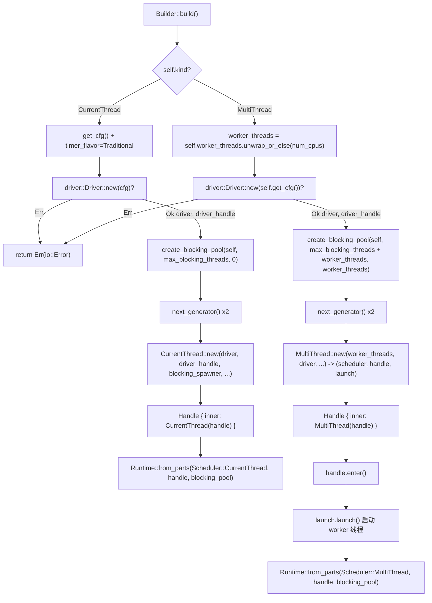

# Kapitel 2: Die Montage der Runtime: Wie Builder Treiber, Scheduler und Thread-Pool zusammensetzt

# Von`Builder`bis`Runtime`: Eine vollständige Reise der Assemblierung

Im vorherigen Kapitel haben wir die Verantwortungsgrenzen von Future, Waker und Executor geklärt. Aber eine real nutzbare Laufzeit ist weit mehr als „ein Executor" – sie benötigt auch eine I/O-Ereignisschleife, Timer, einen Blocking-Thread-Pool, und diese Komponenten müssen dieselbe Menge von Handles und denselben Lebenszyklus teilen. Dieses Kapitel verfolgt`Builder::build`die vollständige Assemblierungskette und beantwortet eine Kernfrage:**Welche Komponenten befinden sich tatsächlich im Inneren eines`Runtime`, wie werden sie zusammengesetzt und teilen sich Handles**。

Tokios Assemblierungseinstiegspunkt ist`Builder`. Es selbst ist ein reiner Konfigurationscontainer, alle Felder sind „Absichtserklärungen" und halten keine Laufzeitressourcen. Die tatsächliche Ressourcenerstellung erfolgt beim Aufruf von`build()`.

## Intuitives Modell: Builder ist der „Renovierungsplan", Runtime ist das „Haus nach der Übergabe"

`Builder`ist wie ein Renovierungsplan: Man markiert darauf „wie viele Zimmer (worker_threads)", „ob Wasseranschluss (enable_io)", „ob Stromanschluss (enable_time)", „Obergrenze für ausgelagerte Hilfskräfte (max_blocking_threads)". Der Plan selbst erzeugt keine physischen Entitäten. Erst wenn`build()`aufgerufen wird, baut das Bautrupp nach Plan und errichtet die „Zimmer" wie Scheduler, Treiber, Thread-Pool tatsächlich und übergibt eine`Runtime`Instanz.

Ohne die Ebene von`Builder`müsste der Benutzer jede Komponente manuell new-en, manuell verdrahten, manuell Fehler-Rollback handhaben – jede Reihenfolgefehler würde zu hängenden Handles oder Ressourcenlecks führen.`Builder`Der Wert von  liegt darin:**„Konfiguration" und „Konstruktion" vollständig zu trennen, sodass der Konstruktionsprozess zentral Validierung, Fehlerbereinigung und Handle-Sharing durchführen kann**。

## Speicherlayout:`Builder`die Feldpartitionierung von

`Builder`Die Felder von  können nach Verantwortlichkeit in vier Gruppen unterteilt werden. Die erste Gruppe ist**Form und Schalter**：`kind`bestimmt die Scheduler-Form,`enable_io` / `enable_time`bestimmt, ob der entsprechende Treiber erstellt wird.

[FACT:tokio/src/runtime/builder.rs:55-68]

```rust
pub struct Builder {
    kind: Kind,
    name: Option,
    enable_io: bool,
    nevents: usize,
    nevents_busy: Option,
    enable_time: bool,
    start_paused: bool,
    // ...
}
```

Die zweite Gruppe ist**Thread-Pool-Parameter**：`worker_threads`ist`Option<usize>`，`None`bedeutet „beim Build auf Basis der CPU-Kernzahl automatisch erkennen";`max_blocking_threads`Standard ist 512.

[FACT:tokio/src/runtime/builder.rs:73-79]

```rust
worker_threads: Option,
max_blocking_threads: usize,
```

Die dritte Gruppe ist**Callback-Hooks**, alle sind`Option<Arc<dyn Fn ...>>`. Beachten Sie, dass sie`Arc`statt`Box`verwenden, weil diese Callbacks in den`Config`。

[FACT:tokio/src/runtime/builder.rs:87-97]

```rust
pub(super) after_start: Option,
pub(super) before_stop: Option,
pub(super) before_park: Option,
pub(super) after_unpark: Option,
```

Kopieren**Die vierte Gruppe ist**：`global_queue_interval`、`event_interval`、`disable_lifo_slot`、`seed_generator`。

[FACT:tokio/src/runtime/builder.rs:116-134]

```rust
pub(super) global_queue_interval: Option,
pub(super) event_interval: u32,
pub(super) disable_lifo_slot: bool,
pub(super) seed_generator: RngSeedGenerator,
```

Kopieren`Kind`Hier gibt es ein bemerkenswertes Design:`Copy`ist ein

[FACT:tokio/src/runtime/builder.rs:261-265]

```rust
#[derive(Clone, Copy)]
pub(crate) enum Kind {
    CurrentThread,
    #[cfg(feature = "rt-multi-thread")]
    MultiThread,
}
```

`MultiThread`Kopieren`rt-multi-thread`Die Variante  wird durch das`rt`Feature gesteuert. Das bedeutet, in einem Build, bei dem nur das`Kind`Feature aktiviert ist, hat`build()`nur eine Variante, und das`match`von**wird vom Compiler zu einem einzigen Zweig optimiert –**。

## Verwendung des Typsystems statt Laufzeitprüfung, um die Codegröße des Multithread-Schedulers zu eliminieren

`Builder::new`Die Philosophie der Standardwerte: Warum I/O und time standardmäßig deaktiviert sind`enable_io`ist der gemeinsame Einstiegspunkt für alle Konstruktionen. Es setzt`enable_time`und`false`。

[FACT:tokio/src/runtime/builder.rs:309-318]

```rust
// I/O defaults to "off"
enable_io: false,
nevents: 1024,
nevents_busy: None,

// Time defaults to "off"
enable_time: false,

// The clock starts not-paused
start_paused: false,
```

> **[Design Inference & Architectural Trade-offs]**
> 〔Design-Inferenz und Architektur-Abwägung〕`#[tokio::main]`Diese Standardwertwahl ist absichtlich: Das Erstellen des I/O-Treibers erfordert die Anforderung von epoll/kqueue-Handles vom Betriebssystem, das Erstellen des time-Treibers erfordert den Start der Timer-Infrastruktur. Wenn der Benutzer nur einen reinen Berechnungs-Task-Scheduler möchte (z. B. CPU-intensive async-Logik ausführen), ist das erzwungene Erstellen dieser Treiber reine Verschwendung.`enable_all()`。

`enable_all()`Das

[FACT:tokio/src/runtime/builder.rs:398-419]

```rust
pub fn enable_all(&mut self) -> &mut Self {
    #[cfg(any(
        feature = "net",
        all(unix, feature = "process"),
        all(unix, feature = "signal")
    ))]
    self.enable_io();

    #[cfg(all(
        tokio_unstable,
        feature = "io-uring",
        // ...
    ))]
    self.enable_io_uring();

    #[cfg(feature = "time")]
    self.enable_time();

    self
}
```

aufruft. Die Implementierung von`enable_io()`offenbart, wie Feature-Gating die Semantik von „alles an" beeinflusst.`net`、`process`Kopieren`signal`Beachten Sie, dass`time` feature，`enable_all()`nur aufgerufen wird, wenn

## oder das`build()`Feature aktiviert ist. Wenn der Benutzer nur

`build()`aktiviert hat, wird`kind`den I/O-Treiber nicht öffnen – weil im Kompilat überhaupt kein I/O-Treiber-Code vorhanden ist.

[FACT:tokio/src/runtime/builder.rs:1146-1152]

```rust
pub fn build(&mut self) -> io::Result {
    match &self.kind {
        Kind::CurrentThread => self.build_current_thread_runtime(),
        #[cfg(feature = "rt-multi-thread")]
        Kind::MultiThread => self.build_threaded_runtime(),
    }
}
```

die Verzweigung von

### ist der Startpunkt der Assemblierung, es verzweigt nach

`build_current_thread_runtime`in zwei völlig unterschiedliche Pfade.`build_current_thread_runtime_components`Kopieren`Runtime`。

[FACT:tokio/src/runtime/builder.rs:1725-1736]

```rust
fn build_current_thread_runtime(&mut self) -> io::Result {
    use crate::runtime::runtime::Scheduler;

    let (scheduler, handle, blocking_pool) =
        self.build_current_thread_runtime_components(None)?;

    Ok(Runtime::from_parts(
        Scheduler::CurrentThread(scheduler),
        handle,
        blocking_pool,
    ))
}
```

Pfad eins: Assemblierung von current_thread`build_current_thread_runtime_components`selbst ist sehr dünn, es delegiert an

[FACT:tokio/src/runtime/builder.rs:1760-1766]

```rust
let mut cfg = self.get_cfg();
cfg.timer_flavor = TimerFlavor::Traditional;
let (driver, driver_handle) = driver::Driver::new(cfg)?;

// Blocking pool
let blocking_pool = blocking::create_blocking_pool(self, self.max_blocking_threads, 0);
let blocking_spawner = blocking_pool.spawner().clone();
```

Kopieren`driver`Die eigentliche Assemblierungslogik befindet sich in`(driver, driver_handle)`. Ihre Ausführungsreihenfolge ist entscheidend:`?`Kopieren`build`Der erste Schritt erstellt`Err`und gibt ein Paar

zurück. Beachten Sie, dass hier`spawner`Fehler direkt nach oben propagiert – wenn die I/O-Treiber-Initialisierung fehlschlägt (z. B. epoll-Erstellung fehlschlägt), gibt das gesamte`spawner`

zurück, zu diesem Zeitpunkt wurde der Blocking-Pool noch nicht erstellt, keine Bereinigung erforderlich.

[FACT:tokio/src/runtime/builder.rs:1768-1770]

```rust
let seed_generator_1 = self.seed_generator.next_generator();
let seed_generator_2 = self.seed_generator.next_generator();
```

> **[Design Inference & Architectural Trade-offs]**
> wird in den Scheduler injiziert, damit der Scheduler die Fähigkeit hat, Blocking-Tasks an den Thread-Pool zu übermitteln.`seed_generator_1`Der dritte Schritt generiert zwei unabhängige RNG-Seed-Generatoren.`Config`Kopieren`select!`〔Design-Inferenz und Architektur-Abwägung〕`seed_generator_2`Warum werden zwei benötigt?`CurrentThread::new`wird in`rng_seed`platziert, für die interne Verwendung des Schedulers (z. B.

zufällige Verzweigungsreihenfolge);`Config`wird an`CurrentThread::new`。

[FACT:tokio/src/runtime/builder.rs:1776-1807]

```rust
let (scheduler, handle) = CurrentThread::new(
    driver,
    driver_handle,
    blocking_spawner,
    seed_generator_2,
    Config {
        before_park: self.before_park.clone(),
        after_unpark: self.after_unpark.clone(),
        // ...
        global_queue_interval: self.global_queue_interval,
        event_interval: self.event_interval,
        // ...
        enable_eager_driver_handoff: false,
        seed_generator: seed_generator_1,
        // ...
    },
    local_tid,
    self.name.clone(),
);
```

gewährleistet wird.`enable_eager_driver_handoff`Der vierte Schritt ist der Kern: driver, driver_handle, blocking_spawner, Seeds und`false`。

[FACT:tokio/src/runtime/builder.rs:1795-1798]

```rust
// This setting never makes sense for a current thread runtime,
// as it only configures how the I/O driver is stolen across
// workers.
enable_eager_driver_handoff: false,
```

> **[Design Inference & Architectural Trade-offs]**
> Dieser Kommentar verdeutlicht das Wesen dieser Option: Sie beschreibt, „wie mehrere Worker um den I/O-Treiber konkurrieren", und da current_thread nur einen einzigen Thread hat, gibt es keine Konkurrenz, weshalb sie zwangsweise deaktiviert wird. Dies ist ein typisches Beispiel dafür, dass „die Semantik eines Konfigurationselements stark von der Form abhängt" – dasselbe`Builder`Feld hat in verschiedenen Formen unterschiedliche Bedeutungen.

Schließlich wird`CurrentThread::new`das von`handle`zurückgegebene`scheduler::Handle::CurrentThread`in`Handle`。

[FACT:tokio/src/runtime/builder.rs:1816-1822]

```rust
let handle = Handle {
    inner: scheduler::Handle::CurrentThread(handle),
};

Ok((scheduler, handle, blocking_pool))
```

### Kopie

`build_threaded_runtime`Pfad zwei: Die Assemblierung von multi_thread

[FACT:tokio/src/runtime/builder.rs:2185]

```rust
let worker_threads = self.worker_threads.unwrap_or_else(num_cpus);
```

`None`ähnelt dem von current_thread, weist jedoch drei wesentliche Unterschiede auf. Der erste Unterschied ist die Bestimmung der Worker-Thread-Anzahl:`num_cpus()`Kopie`Builder::new`wird hier zu

aufgelöst. Dies ist der Ort, an dem die „verzögerte automatische Erkennung" greift – die Erkennung erfolgt zur build-Zeit und nicht zur

[FACT:tokio/src/runtime/builder.rs:2189-2192]

```rust
let blocking_pool =
    blocking::create_blocking_pool(self, self.max_blocking_threads + worker_threads, worker_threads);
let blocking_spawner = blocking_pool.spawner().clone();
```

Der zweite Unterschied liegt in der Kapazitätsberechnung des blocking pool:`max_blocking_threads + worker_threads`Kopie`self.max_blocking_threads`Beachten Sie`0`。

[FACT:tokio/src/runtime/builder.rs:1765]

```rust
let blocking_pool = blocking::create_blocking_pool(self, self.max_blocking_threads, 0);
```

> **[Design Inference & Architectural Trade-offs]**
> Kopie`max_blocking_threads`〔Design-Inferenz und Architektur-Abwägung〕`worker_threads`Dieser Unterschied offenbart die Kapazitätssemantik des blocking pool: Unter multi_thread ist`max_blocking_threads`die Obergrenze für „zusätzliche" Blocking-Threads; die tatsächliche Gesamt-Thread-Obergrenze ergibt sich aus der Addition der Worker-Thread-Anzahl. Der dritte Parameter (bei current_thread 0, bei multi_thread

) ist höchstwahrscheinlich ein Hinweis auf die „Anzahl reservierter Threads" oder „Anzahl initialer Threads". Dieses Design sorgt dafür, dass die Semantik von`MultiThread::new`in beiden Formen konsistent bleibt: Sie beschreibt, „wie viele zusätzliche Blocking-Threads über die Kern-Worker hinaus geöffnet werden können".

[FACT:tokio/src/runtime/builder.rs:2198-2226]

```rust
let (scheduler, handle, launch) = MultiThread::new(
    worker_threads,
    driver,
    driver_handle,
    blocking_spawner,
    seed_generator_2,
    Config {
        // ...
        enable_eager_driver_handoff: self.enable_eager_driver_handoff,
        // ...
    },
    self.timer_flavor,
    self.name.clone(),
);
```

ein Tripel statt eines Tupels zurückgibt:`launch`Kopie`MultiThread::new`Das zusätzliche**ist ein „Start-Handle".**ist nur für die Konstruktion der Scheduler-Struktur verantwortlich,

[FACT:tokio/src/runtime/builder.rs:2228-2234]

```rust
let handle = Handle { inner: scheduler::Handle::MultiThread(handle) };

// Spawn the thread pool workers
let _enter = handle.enter();
launch.launch();

Ok(Runtime::from_parts(Scheduler::MultiThread(scheduler), handle, blocking_pool))
```

`handle.enter()`. Der eigentliche Start erfolgt später:`launch.launch()`Kopie

> **[Design Inference & Architectural Trade-offs]**
> werden tatsächlich alle Worker-Threads gespawnt. Dieses zweiphasige Design „erst konstruieren, dann starten" ist äußerst entscheidend.`handle`〔Design-Inferenz und Architektur-Abwägung〕`handle`Warum kann man nicht während der Konstruktion starten? Weil Worker-Threads, sobald sie gestartet sind, sofort mit dem Pollen von Aufgaben beginnen, und Aufgaben möglicherweise auf**verweisen. Wenn`Handle`noch nicht fertig konstruiert ist, entsteht eine Race Condition, bei der „Worker ein halbfertiges Handle halten". Das zweiphasige Design stellt sicher:**。`_enter`Wenn alle Worker-Threads starten, ist das vollständige

## bereits bereit

Der Guard stellt sicher, dass sich Worker-Threads im Moment des Starts bereits im korrekten Runtime-Kontext befinden.`driver::Driver::new`Assemblierungs-Flussdiagramm`Err`Die folgende Abbildung zeigt die Assemblierungsreihenfolge, die wichtigsten Verzweigungen und die Fehlerpfade beider Pfade zusammen. Beachten Sie, dass bei einem Fehlschlag von



## zurückgegeben wird, wobei der blocking pool zu diesem Zeitpunkt noch nicht erstellt wurde.`Handle`Kopie

Handle-Sharing:`Runtime`Wie`scheduler`、`handle`、`blocking_pool`zum „Passierschein" über Komponentengrenzen hinweg wird`handle`Nach Abschluss der Assemblierung hält

[FACT:tokio/src/runtime/scheduler/mod.rs:29-41]

```rust
#[derive(Debug, Clone)]
pub(crate) enum Handle {
    #[cfg(feature = "rt")]
    CurrentThread(Arc),

    #[cfg(feature = "rt-multi-thread")]
    MultiThread(Arc),

    #[cfg(not(feature = "rt"))]
    #[allow(dead_code)]
    Disabled,
}
```

. Davon ist`Arc`der gemeinsame Kern. Sein Inneres ist eine Enum:`Handle`Kopie`Handle`Beachten Sie, dass beide Varianten`match`umschließen. Das bedeutet, dass das Klonen von`driver()`：

[FACT:tokio/src/runtime/scheduler/mod.rs:53-64]

```rust
pub(crate) fn driver(&self) -> &driver::Handle {
    match *self {
        #[cfg(feature = "rt")]
        Handle::CurrentThread(ref h) => &h.driver,

        #[cfg(feature = "rt-multi-thread")]
        Handle::MultiThread(ref h) => &h.driver,

        #[cfg(not(feature = "rt"))]
        Handle::Disabled => unreachable!(),
    }
}
```

`blocking_spawner()`bietet eine einheitliche Zugriffsschnittstelle, die die Formunterschiede im Inneren von`match_flavor!`kapselt. Zum Beispiel

[FACT:tokio/src/runtime/scheduler/mod.rs:96-98]

```rust
pub(crate) fn blocking_spawner(&self) -> &blocking::Spawner {
    match_flavor!(self, Handle(h) => &h.blocking_spawner)
}
```

verwendet das`driver()`-Makro zur Eliminierung von Wiederholungen:`match`Kopie`match_flavor!`Dieses Makro expandiert zu einem`match`wie dem obigen

. Sein Wert liegt darin: Wenn ein neuer Accessor hinzugefügt wird, der nach Form verteilen muss, genügt eine Zeile`Handle`, anstatt zweimal die`scheduler::Handle`-Verzweigung von Hand zu schreiben.

[FACT:tokio/src/runtime/handle.rs:13-15]

```rust
pub struct Handle {
    pub(crate) inner: scheduler::Handle,
}
```

ist ein dünner Wrapper um das interne`Handle`:`spawn`Kopie`block_on`。`spawn`Das vom Benutzer erhaltene`AutoBox`kann threadübergreifend geklont werden, kann

[FACT:tokio/src/runtime/handle.rs:197-208]

```rust
pub fn spawn(&self, future: F) -> JoinHandle
where
    F: Future + Send + 'static,
    F::Output: Send + 'static,
{
    let fut_size = mem::size_of::();
    if AutoBox::::SHOULD_BOX {
        self.spawn_named(Box::pin(future), SpawnMeta::new_unnamed(fut_size))
    } else {
        self.spawn_named(future, SpawnMeta::new_unnamed(fut_size))
    }
}
```

`AutoBox::<F>::SHOULD_BOX`Die Implementierung von`size_of::<F>()`zeigt die Compile-Zeit-Verzweigung von

[FACT:tokio/src/runtime/mod.rs:668-673]

```rust
pub(crate) struct AutoBox(std::marker::PhantomData);

impl AutoBox {
    pub(crate) const SHOULD_BOX: bool = std::mem::size_of::() > BOX_FUTURE_THRESHOLD;
}
```

> **[Design Inference & Architectural Trade-offs]**
> ist eine assoziierte Konstante, die durch den Vergleich von`if`mit einem Schwellenwert ermittelt wird.`spawn_named`Kopie`F`〔Design-Inferenz und Architektur-Abwägung〕`Pin<Box<F>>`Der Kommentar erklärt, warum eine assoziierte Konstante statt einer Laufzeit-

## verwendet wird: Bei einer Laufzeitprüfung würde

**zweimal monomorphisiert (einmal für**, einmal für`driver -> blocking_pool -> scheduler`), was dazu führt, dass für jede gespawnte Future zwei Task-Harnesses generiert werden und sich die Codegröße verdoppelt. Mit einer konstanten Verzweigung behält der Monomorphisierungs-Sammler nur den tatsächlich durchlaufenen Zweig.

**Design-Überlegungen: Assemblierungsreihenfolge, Fehlerwiederherstellung und Produktions-Fallstricke`local_tid`Reihenfolge ist Vertrag**。`build_local`. Die Assemblierungsreihenfolge`build_current_thread_local_runtime`ist nicht willkürlich. Der Treiber wird zuerst erstellt, da er der einzige Schritt ist, der aufgrund unzureichender OS-Ressourcen fehlschlagen kann und bei einem Fehlschlag keine Bereinigung anderer Komponenten erfordert. blocking_pool kommt nach dem Treiber und vor dem Scheduler, da der Scheduler blocking_spawner benötigt. Wenn die Erstellung von blocking_pool fehlschlägt (was praktisch kaum vorkommt), wird der Treiber durch Drop automatisch bereinigt.

[FACT:tokio/src/runtime/builder.rs:1738-1751]

```rust
fn build_current_thread_local_runtime(&mut self) -> io::Result {
    use crate::runtime::local_runtime::LocalRuntimeScheduler;

    let tid = std::thread::current().id();

    let (scheduler, handle, blocking_pool) =
        self.build_current_thread_runtime_components(Some(tid))?;

    Ok(LocalRuntime::from_parts(
        LocalRuntimeScheduler::CurrentThread(scheduler),
        handle,
        blocking_pool,
    ))
}
```

-Zweig von current_thread`tid`verwendet`Handle`, wobei die aktuelle Thread-ID übergeben wird:`can_spawn_local_on_local_runtime`Kopie

[FACT:tokio/src/runtime/scheduler/mod.rs:140-147]

```rust
pub(crate) fn can_spawn_local_on_local_runtime(&self) -> bool {
    match self {
        Handle::CurrentThread(h) => h.local_tid.is_some_and(|x| std::thread::current().id() == x),

        #[cfg(feature = "rt-multi-thread")]
        Handle::MultiThread(_) => false,
    }
}
```

> **[Design Inference & Architectural Trade-offs]**
> gespeichert, und später verwendet`LocalRuntime`sie zur Überprüfung, „ob spawn_local auf dem Owner-Thread aufgerufen wird":`!Send`Kopie`local_tid`〔Design-Inferenz und Architektur-Abwägung〕`!Send`Dies ist der Grundpfeiler der Sicherheit von

**:`worker_threads(0)`Die Future von**。`worker_threads`darf nur auf ihrem Owner-Thread gepollt werden, und

[FACT:tokio/src/runtime/builder.rs:582-586]

```rust
pub fn worker_threads(&mut self, val: usize) -> &mut Self {
    assert!(val > 0, "Worker threads cannot be set to 0");
    self.worker_threads = Some(val);
    self
}
```

Diese Assertion schlägt bereits in der Konfigurationsphase fehl, nicht erst beim Build. Der Vorteil ist eine frühere Fehlerlokalisierung, der Nachteil ist, dass der Benutzer, wenn die Thread-Anzahl aus einem dynamischen Wert der Konfigurationsdatei stammt, sie vor dem Aufruf selbst validieren muss.

**Produktions-Fallstrick Zwei:`max_blocking_threads`Zu klein eingestellt führt zu Hängen**. Die Dokumentation warnt ausdrücklich:

[FACT:tokio/src/runtime/builder.rs:600-601]

```rust
/// It's recommended to not set this limit too low in order to avoid hanging on operations
/// requiring [`spawn_blocking`].
```

> **[Design Inference & Architectural Trade-offs]**
> Weil die Warteschlange des blocking pool kein Backpressure hat – Aufgaben sammeln sich an, bis ein Thread verfügbar ist. Wenn alle blockierenden Threads auf eine Operation warten, die „einen neuen blockierenden Thread benötigt, um abgeschlossen zu werden", kommt es zum Deadlock. Die Aussage in der Dokumentation „the queue does not apply any backpressure, it could potentially grow unbounded" ist genau die Fußnote zu diesem Risiko.

**Produktions-Fallstrick Drei:`UnhandledPanic::ShutdownRuntime`Nur current_thread wird unterstützt**。

[FACT:tokio/src/runtime/builder.rs:1374-1381]

```rust
pub fn unhandled_panic(&mut self, behavior: UnhandledPanic) -> &mut Self {
    if !matches!(self.kind, Kind::CurrentThread) && matches!(behavior, UnhandledPanic::ShutdownRuntime) {
        panic!("UnhandledPanic::ShutdownRuntime is only supported in current thread runtime");
    }

    self.unhandled_panic = behavior;
    self
}
```

> **[Design Inference & Architectural Trade-offs]**
> Der Grund für diese Einschränkung ist: Unter multi_thread erfordert „sofortiges Herunterfahren der Runtime" die Koordination des Stopps aller Worker-Threads, was implementierungstechnisch komplex und semantisch unklar ist (was passiert mit anderen Aufgaben, die gerade gepollt werden?). current_thread hat nur einen Thread, die Shutdown-Semantik ist klar.

## Zusammenfassung dieses Kapitels

Dieses Kapitel hat`Builder::build`die vollständige Assemblierungskette nachverfolgt. Kernschlussfolgerungen:

1. `Builder`ist ein reiner Konfigurationscontainer,`build()`erst erstellt Ressourcen. Die Assemblierungsreihenfolge`driver -> blocking_pool -> scheduler`wird durch die Fehlerwiederherstellungsanforderung bestimmt.

2. Der Unterschied zwischen current_thread und multi_thread beschränkt sich nicht auf die Thread-Anzahl: Die Kapazitätsberechnung des blocking pool ist unterschiedlich (`max_blocking_threads` vs `max_blocking_threads + worker_threads`), multi_thread hat zusätzlich einen`launch`zweiphasigen Start,`enable_eager_driver_handoff`wird unter current_thread zwangsweise deaktiviert.

3. `Handle`ist der Kern, der komponentenübergreifend geteilt wird, intern wird`Arc`verwendet, um form-spezifische Handles zu umschließen, und über`match`oder`match_flavor!`Makros einheitlich zugegriffen.

4. `AutoBox`verwendet assoziierte Konstanten, um zur Kompilierzeit zu entscheiden, ob das Future geboxt wird, wodurch eine Verdopplung der Codegröße vermieden wird.

5. `local_tid`ist`LocalRuntime`der Laufzeitprüfpunkt für Sicherheit.

Im nächsten Kapitel betreten wir den Lebenszyklus von Aufgaben:`spawn`wie ein Future in eine schedulierbare Entität umgewandelt wird,`JoinHandle`wie mit der Aufgaben-Zustandsmaschine interagiert wird, und die Zustandsübergänge von Aufgaben zwischen`PENDING` / `RUNNING` / `COMPLETE`.

# Gedanken und Selbsttest dieses Kapitels

Q1: Wenn man in`build_threaded_runtime`den Kapazitätsparameter von`create_blocking_pool`von`self.max_blocking_threads + worker_threads`auf`self.max_blocking_threads`ändert, in welchen Szenarien würde dies dazu führen, dass blockierende Aufgaben verhungern? Warum kann der current_thread-Pfad`self.max_blocking_threads`？

**Referenzanalyse**: Gemäß[FACT:tokio/src/runtime/builder.rs:2189-2192]übergibt der multi_thread-Pfad`self.max_blocking_threads + worker_threads`, während der current_thread-Pfad[FACT:tokio/src/runtime/builder.rs:1765]übergibt`self.max_blocking_threads`. Die Ursache des Unterschieds liegt darin: Unter multi_thread führen die Worker-Threads selbst auch blockierende Aufgaben aus (zum Beispiel`block_in_place`wandelt den Worker-Thread vorübergehend in einen blockierenden Thread um), daher muss das Gesamtbudget der blockierenden Threads die Anzahl der Worker-Threads einschließen. Wenn man stattdessen nur`self.max_blocking_threads`übergibt, wenn`max_blocking_threads`klein eingestellt ist (zum Beispiel 1) und bereits Worker-Threads in`block_in_place`das Budget belegen, werden neue`spawn_blocking`Aufgaben keinen Thread zur Verfügung haben und sich in der Warteschlange ohne Backpressure ansammeln, was dazu führt, dass async-Aufgaben, die von diesen blockierenden Aufgaben abhängen, dauerhaft hängen. current_thread hat nur einen Thread und unterstützt nicht die Worker-Konvertierungssemantik von`block_in_place`, daher muss die Worker-Anzahl nicht addiert werden.

Q2: `MultiThread::new`gibt das`launch`Handle zurück, was die Worker-Threads tatsächlich startet, ist`launch.launch()`. Was passiert, wenn man die Zeile`handle.enter()`entfernt und direkt`launch.launch()`aufruft?

**Referenzanalyse**: Gemäß[FACT:tokio/src/runtime/builder.rs:2230-2232]gibt es vor dem Start`let _enter = handle.enter();`und erst dann`launch.launch()`。`handle.enter()`Der Zweck ist, den thread-lokalen Kontext (thread-local) zu setzen, damit der aktuelle Thread „so aussieht", als befände er sich innerhalb der Runtime. Nach dem Start beginnen die Worker-Threads sofort mit dem Pollen von Aufgaben, und der Aufgabencode könnte APIs wie`Handle::current()`、`tokio::spawn`aufrufen, die vom Kontext abhängen. Wenn man`_enter`entfernt, könnte die Kontextsetzung im Moment des Starts des Worker-Threads unvollständig sein (je nachdem, ob`launch`intern selbst setzt), im schlimmsten Fall würde der Initialisierungscode, der auf dem Worker-Thread ausgeführt wird, bei einem Aufruf von`Handle::current()`panic verursachen (`CONTEXT_MISSING_ERROR`). Selbst wenn`launch`intern für jeden Worker den Kontext setzt,`_enter`stellt ebenfalls sicher, dass „die Startaktion selbst" im richtigen Kontext stattfindet, wodurch Races während des Startvorgangs vermieden werden.

Q3: `AutoBox::<F>::SHOULD_BOX`verwendet assoziierte Konstanten statt Laufzeit-`if size_of::<F>() > THRESHOLD`. Angenommen, man ändert es zu einer Laufzeitprüfung, in welchen Fällen würde dies neben der Verdopplung der Codegröße zu Leistungseinbußen führen?

**Referenzanalyse**: Gemäß[FACT:tokio/src/runtime/mod.rs:657-673]den Kommentaren von`if`würde Laufzeit-`spawn_named`dazu führen, dass`T`für jedes`T`zweimal monomorphisiert wird (`Pin<Box<T>>`und`Pin<Box<T>>`jeweils einmal). Neben der Verdopplung der Codegröße zeigt sich die Leistungseinbuße in: 1) erhöhter Druck auf den Instruktionscache (i-cache), da beide Harness-Code-Sätze resident sein müssen; 2) der Compiler kann nicht optimieren, dass „tatsächlich nur ein Zweig durchlaufen wird", die Laufzeit-Branch-Vorhersage ist zwar normalerweise genau, aber der Branch selbst und die Unterschiede in der Registerzuweisung der beiden Code-Sätze summieren sich; 3) subtiler ist, dass der`size_of`Pfad eine Heap-Allokation erzwingt, wenn die Laufzeitprüfung aus irgendeinem Grund (zum Beispiel
