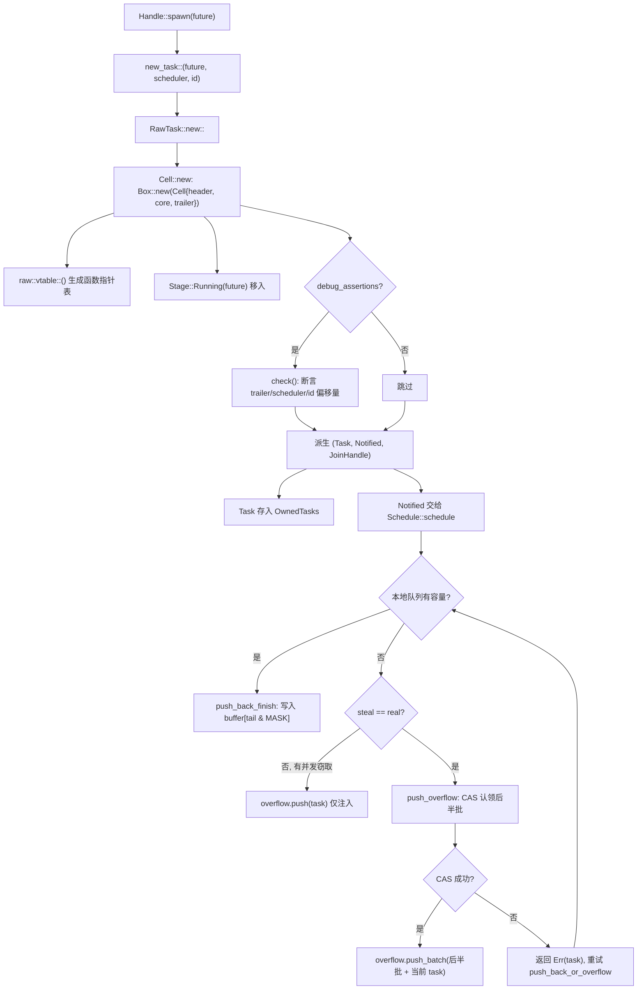
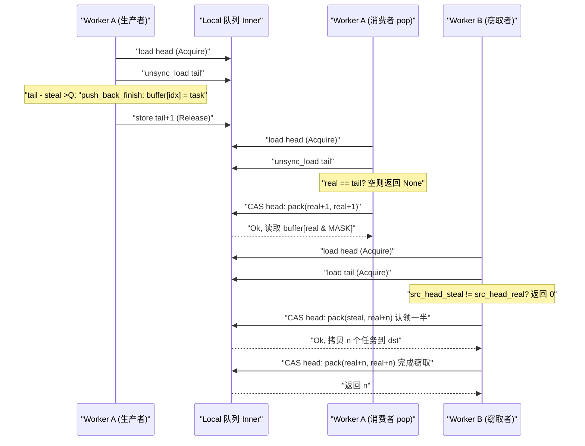

# Kapitel 3: Das Leben einer Aufgabe (Teil 1): Wie spawn einen Future in eine planbare Entität verwandelt

Im vorherigen Kapitel haben wir die Montage der Runtime abgeschlossen: I/O driver, time driver, blocking pool und Scheduler werden in dieselbe`Runtime`Instanz injiziert,`Handle`und werden zu einem gemeinsamen Handle für den threadübergreifenden Zugriff auf diese Komponenten. Doch die montierte Runtime ist zu diesem Zeitpunkt noch eine leere Hülle – sie besitzt die Engine zum Antreiben von Aufgaben, aber es gibt keine Aufgaben, die angetrieben werden könnten. Die Frage, die dieses Kapitel beantworten will, ist genau: Wenn du`tokio::spawn(async { ... })`eingibst, was durchläuft dann dieser`async`Block, um von einem gewöhnlichen Rust-Code-Stück zu einer Entität zu werden, die „vom Scheduler übernommen, geweckt und gejoint werden kann"? Dies ist die erste Halbzeit von „Das Leben einer Aufgabe", wir konzentrieren uns auf die Geburt: Ausgehend von`Handle::spawn`durchlaufen wir`new_task`die Referenzzählungs-Allokation und landen bei`Cell<T, S>`dem Speicherlayout, um schließlich klar zu sehen, wie die Aufgabe in die lokale Warteschlange eines Workers oder in die globale Injektions-Warteschlange eingereiht wird. Die zweite Halbzeit (Kapitel 4) wird dann in die Scheduling-Schleife und den poll/wake-Kreislauf eintreten.

# 3.1 Future ist keine Aufgabe: Was genau erzeugt ein spawn

## Intuitives Modell

Stelle dir`Future`als ein „Rezept" vor und eine Aufgabe als „ein Gericht, das gerade in der Küche gekocht wird". Das Rezept selbst ist statisch, kopierbar und hat keinerlei Ausführungszustand; erst wenn die Küche (der Scheduler) entscheidet „jetzt dieses Gericht zubereiten", ihm einen Herd (Worker), eine Bestellnummer (TaskId) und eine Ausgabestation (JoinHandle) zuweist, wird es zu einem „Gericht in Zubereitung". Ohne diese Verpackungsschicht kann der Scheduler nicht wissen, „bis zu welchem Schritt dieses Gericht zubereitet ist", „wer darauf wartet", „wen es nach Fertigstellung benachrichtigen soll" – er sieht nur ein Rezept und kann nichts verwalten.

## Datenstruktur und Speicherlayout

Tokio verwendet`Task<S>`um „eine von der Runtime besessene Aufgabenreferenz" darzustellen, es ist ein transparenter Wrapper um`RawTask`

```rust
#[repr(transparent)]
pub(crate) struct Task {
    raw: RawTask,
    _p: PhantomData,
}
```

[FACT:tokio/src/runtime/task/mod.rs:233-238]

`#[repr(transparent)]`bedeutet, dass`Task<S>`und`RawTask`im Speicher vollständig identisch sind, ohne zusätzlichen Overhead.`PhantomData<S>`ist nur eine Typmarkierung zur Kompilierungszeit, die markiert, zu welchem Scheduler-Typ diese Aufgabe gehört`S`。

Was tatsächlich den gesamten Zustand der Aufgabe trägt, ist`Cell<T, S>`dessen Layout der Grundstein des gesamten Aufgabenmoduls ist:

```rust
#[repr(C)]
pub(super) struct Cell {
    pub(super) header: Header,
    pub(super) core: Core,
    pub(super) trailer: Trailer,
}
```

[FACT:tokio/src/runtime/task/core.rs:126-136]

Die drei Felder sind nach „heiß-warm-kalt" angeordnet.`Header`sind heiße Daten (bei jedem Scheduling, bei jedem Zustandsübergang zugegriffen),`Core`sind warme Daten (beim Poll zugegriffen),`Trailer`sind kalte Daten (nur bei Erstellung und Zerstörung zugegriffen). Der Kommentar schreibt ausdrücklich:`Header`muss das erste Feld sein, weil die Aufgabenstruktur gleichzeitig von`*mut Cell`und`*mut Header`referenziert wird[FACT:tokio/src/runtime/task/core.rs:37-43]。

Noch entscheidender ist die Cache-Line-Ausrichtung.`Cell`trägt eine lange Reihe von`#[cfg_attr(..., repr(align(...)))]`die je nach Zielarchitektur die Anzahl der Ausrichtungsbytes wählt: x86_64/aarch64/powerpc64 verwenden 128 Bytes, arm/mips/sparc/hexagon verwenden 32 Bytes, m68k verwendet 16 Bytes, s390x verwendet 256 Bytes, der Rest standardmäßig 64 Bytes[FACT:tokio/src/runtime/task/core.rs:64-125]Der Kommentar erklärt, warum x86_64 128 statt 64 verwenden muss: Seit Intel Sandy Bridge lädt der Spatial Prefetcher**paarweise**64-Byte-Cache-Lines, daher muss auf 128 Bytes ausgerichtet werden, um False Sharing zu vermeiden[FACT:tokio/src/runtime/task/core.rs:45-53]。

> **[Design Inference & Architectural Trade-offs]**
> Der Preis dieser Ausrichtungsstrategie ist, dass jede Aufgabe mindestens eine Cache-Line Speicher verschwendet. Aber die Aufgabenstatusbits (`state`) werden von mehreren Worker-Threads mit hoher Frequenz gelesen und geschrieben – ein Thread setzt beim Poll das RUNNING-Bit, ein anderer Thread liest beim Wecken das NOTIFIED-Bit – wenn die Statusbits zweier Aufgaben in derselben Cache-Line liegen, löst jeder Zustandsübergang ein Hin- und Herspringen der Cache-Line zwischen den Kernen aus (cache line ping-pong), der Leistungsverlust übersteigt bei weitem die Speicherverschwendung. Tokio wählt Raum gegen Zeit.

`Header`selbst ist auf 8 Zeigergrößen beschränkt:

```rust
#[test]
#[cfg(not(loom))]
fn header_lte_cache_line() {
    assert!(std::mem::size_of::() ());
}
```

[FACT:tokio/src/runtime/task/core.rs:591-593]

Dieser Test stellt sicher, dass`Header`64 Bytes (8 × 8) nicht überschreitet, sodass es auf Architekturen mit 64-Byte-Cache-Lines vollständig in eine Zeile passt.`Header`Die Felder von umfassen:`state: State`(atomare Statusbits),`queue_next: UnsafeCell<Option<NonNull<Header>>>`(Verkettungszeiger der Injektions-Warteschlange),`vtable: &'static Vtable`(Funktionszeigertabelle),`owner_id: UnsafeCell<Option<NonZeroU64>>`(ID der zugehörigen`OwnedTasks`Liste),`scheduled_at: UnsafeCell<ScheduleLatencyInstant>`(Scheduling-Latenzmessung)[FACT:tokio/src/runtime/task/core.rs:169-198]。

`Core<T, S>`hält das Scheduler-Handle`scheduler: S`die Aufgaben-ID`task_id: Id`sowie das Kernstück`stage: CoreStage<T>` [FACT:tokio/src/runtime/task/core.rs:148-165]。`Stage`ist eine dreizuständige Enum:

```rust
#[repr(C)]
pub(super) enum Stage {
    Running(T),
    Finished(super::Result),
    Consumed,
}
```

[FACT:tokio/src/runtime/task/core.rs:225-229]

Genau das ist der Schlüssel dafür, dass „Future und Output denselben Speicher wiederverwenden": Während die Aufgabe läuft, hält`Stage::Running`den Future, nach Abschluss wird er an Ort und Stelle durch`Stage::Finished(output)`ersetzt, nach Entnahme durch`JoinHandle`wird er zu`Stage::Consumed`。`#[repr(C)]`Der Kommentar verweist auf ein Miri-Issue, das zeigt, dass dieses Layout harte Anforderungen an die Korrektheit von unsafe-Code stellt[FACT:tokio/src/runtime/task/core.rs:225-229]。

`Trailer`speichert kalte Daten:`owned: linked_list::Pointers<Header>`（`OwnedTasks`Verkettungszeiger),`waker: UnsafeCell<Option<Waker>>`(Consumer-Waker, der auf die Fertigstellung der Aufgabe wartet),`hooks: TaskHarnessScheduleHooks` [FACT:tokio/src/runtime/task/core.rs:205-213]。

## Step-by-Step: Von spawn bis zur Einreihung

Wir versetzen uns in ein konkretes Szenario: In einer multi_thread-Runtime führt Worker-Thread A`tokio::spawn(async { 42 })`。

**aus** `new_task`Erster Schritt: Die drei Teile der Aufgabe konstruieren.

```rust
fn new_task(
    task: T,
    scheduler: S,
    id: Id,
    spawned_at: SpawnLocation,
) -> (Task, Notified, JoinHandle)
```

[FACT:tokio/src/runtime/task/mod.rs:336-346]

Kopieren`RawTask::new::<T, S>`Es ruft`Cell`auf, um`raw`zu allokieren, und leitet dann aus demselben`Task`Zeiger drei Referenzen ab:`OwnedTasks`）、`Notified`(Owned-Referenz, wird normalerweise sofort in`JoinHandle`(Benachrichtigungsreferenz, wird dem Scheduler übergeben),[FACT:tokio/src/runtime/task/mod.rs:347-363]. Beachten Sie, dass alle drei dasselbe`raw`teilen, wobei jeder eine Referenzzählung hält.

**Zweiter Schritt: Allokieren von`Cell`und Schreiben des Anfangszustands.** `Cell::new`Allokieren der gesamten Struktur auf dem Heap:

```rust
let result = Box::new(Cell {
    trailer: Trailer::new(scheduler.hooks()),
    header: new_header(state, vtable, ...),
    core: Core {
        scheduler,
        stage: CoreStage {
            stage: UnsafeCell::new(Stage::Running(future)),
        },
        task_id,
        ...
    },
});
```

[FACT:tokio/src/runtime/task/core.rs:261-278]

`vtable`wird von`raw::vtable::<T, S>()`generiert und ist eine auf konkrete`T`und`S`monomorphisierte Funktionstabelle[FACT:tokio/src/runtime/task/core.rs:260]. Das Future wird direkt in`Stage::Running`verschoben, ohne zusätzliches Boxing.

**Dritter Schritt: Debug-Assertion zur Layout-Verifikation.**Unter`debug_assertions`,`Cell::new`wird die`check`-Funktion aufgerufen, die mit`Header::get_trailer`、`Header::get_scheduler`、`Header::get_id_ptr`und anderen auf vtable-Offsets basierenden Zeigerarithmetiken einzeln assertiert, dass „die über den Header zurückermittelte Feldadresse" mit „der tatsächlichen Feldadresse" übereinstimmt[FACT:tokio/src/runtime/task/core.rs:280-321]. Dies ist eine Laufzeit-Selbstprüfung der Korrektheit der vtable-Offsets.

**Vierter Schritt: Zustellung an den Scheduler.**Der Scheduler erhält`Notified<S>`und ruft`Schedule::schedule` [FACT:tokio/src/runtime/task/mod.rs:315]auf. Unter multi_thread geht dies über`push_back_or_overflow`, wobei die Aufgabe in die lokale Warteschlange des aktuellen Workers eingereiht wird; bei voller Warteschlange wird in die Injection-Queue überlaufen.

Die folgende Abbildung skizziert den Kontrollfluss und die Verzweigungen von`new_task`bis zur Einreihung:



Diese Abbildung offenbart einige Schlüsselverzweigungen: Debug-Assertions wirken nur in Debug-Builds; bei voller lokaler Warteschlange wird nicht direkt überlaufen, sondern zuerst geprüft, ob es nebenläufige Stealer gibt (`steal != real`), und falls ja, wird nur die aktuelle Aufgabe in die Injection-Queue eingereiht, da der von Stealern freigegebene Platz bald verfügbar ist.

## Designüberlegung: Warum drei Referenzen statt einer

`new_task`gibt drei Referenzen zurück, nicht eine. Dies ist der Kern des Referenzzählungsdesigns:`Task`repräsentiert „die Laufzeit besitzt diese Aufgabe",`Notified`repräsentiert „diese Aufgabe wurde benachrichtigt, wartet auf Scheduling",`JoinHandle`repräsentiert „jemand interessiert sich für ihr Ergebnis". Die drei haben unabhängige Lebensdauern——`JoinHandle`kann gedroppt werden (Aufgabe läuft weiter, Ergebnis wird verworfen),`Notified`verschwindet nach poll,`Task`wird freigegeben, nachdem die Aufgabe abgeschlossen und aus`OwnedTasks`entfernt wurde. Mit nur einer Referenz ließe sich der Zustand „Aufgabe läuft noch, aber niemand joint" nicht ausdrücken.

`UnownedTask`ist eine weitere wichtige Verzweigung: Sie hält**zwei**Referenzzählungen, für Blocking-Aufgaben (nicht in`OwnedTasks`）[FACT:tokio/src/runtime/task/mod.rs:286-295]。`unowned`gespeichert). Die`mem::forget(task)`-Funktion führt über`mem::forget(notified)`und`UnownedTask` [FACT:tokio/src/runtime/task/mod.rs:388-397]die beiden Referenzen in`OwnedTasks`zusammen. Die Designmotivation für „zwei Referenzen" ist: Blocking-Aufgaben haben keine

# 3.2 Statusbits: Wie ein usize den gesamten Lebenszyklus einer Aufgabe kodiert

## Intuitives Modell

Stellen Sie sich den Aufgabenstatus als einen „Gesundheitsbericht" mit mehreren unabhängigen Kontrollkästchen vor: Wird gerade gepollt, ist abgeschlossen, wurde benachrichtigt, wurde abgebrochen, hat jemand gejoint. Tokio verwendet nicht mehrere boolesche Felder, sondern presst diese Markierungsbits in**ein`AtomicUsize`**. So benötigt jeder Statusübergang nur ein CAS statt mehrerer Lockings. Ohne dieses Design würden Aufgabenstatusübergänge zu verschachtelten mehreren Locks werden, was Deadlock-Risiko und Overhead stark erhöhen würde.

## Bitfeld-Layout

`State`Das Bitfeld von[FACT:tokio/src/runtime/task/mod.rs:32-53]：

- `RUNNING`ist in der Moduldokumentation vollständig definiert**: ob die Aufgabe gerade gepollt oder abgebrochen wird.** [FACT:tokio/src/runtime/task/mod.rs:37-38]。
- `COMPLETE`Dieses Bit dient gleichzeitig als Lock der Aufgabe`RUNNING`: Das Future ist vollständig abgeschlossen und gedroppt. Einmal gesetzt, wird es nie gelöscht und nie gleichzeitig mit[FACT:tokio/src/runtime/task/mod.rs:40-41]。
- `NOTIFIED`gesetzt`Notified`: ob derzeit ein[FACT:tokio/src/runtime/task/mod.rs:43]。
- `CANCELLED`-Objekt existiert[FACT:tokio/src/runtime/task/mod.rs:45-46]。
- `JOIN_INTEREST`: Die Aufgabe sollte so schnell wie möglich abgebrochen werden`JoinHandle` [FACT:tokio/src/runtime/task/mod.rs:48]。
- `JOIN_WAKER`: existiert[FACT:tokio/src/runtime/task/mod.rs:50-51]。

: als Zugriffskontrollbit für den join-handle-waker[FACT:tokio/src/runtime/task/mod.rs:53]。

`RUNNING`Die restlichen Bits dienen der Referenzzählung`RUNNING`Dass das[FACT:tokio/src/runtime/task/mod.rs:130-133]-Bit als Lock dient, verdient Ausführung. Der Safety-Abschnitt der Moduldokumentation stellt fest: Jeder mutierende Zugriff auf das Future muss nach Erlangen des Locks durch Modifikation des`RUNNING`-Bits erfolgen, um exklusiven Zugriff zu gewährleisten

## . Das bedeutet, beim Pollen einer Aufgabe setzt der Thread zuerst per CAS

`JOIN_WAKER`, und bei Erfolg hat er exklusiven Zugriff auf das Future; bei Fehlschlag pollt ein anderer Thread, und dieser Poll kehrt direkt zurück. Dies vereint „Poll-Mutex" und „Statusübergang" in einer einzigen atomaren Operation und vermeidet ein separates Mutex.`waker`Zugriffskontrollprotokoll für JOIN_WAKER`Trailer`Das**-Bit ist der raffinierteste Teil der gesamten Zustandsmaschine. Es löst das Problem:**Das`JoinHandle`-Feld (in**) wird von zwei Threads nebenläufig zugegriffen——die Laufzeit**liest[FACT:tokio/src/runtime/task/mod.rs:75-120]：

1. `JOIN_WAKER`es beim Abschluss der Aufgabe, um den Joiner zu wecken,

schreibt`JoinHandle`es beim Pollen, um den Waker zu registrieren. Die Moduldokumentation gibt 7 Regeln an

ist initial 0.`JoinHandle`2. Wenn 0,

hat exklusiven (mutierenden) Zugriff auf das waker-Feld.`COMPLETE`3. Wenn 1,

5. `JoinHandle`hat nur gemeinsamen (nur lesenden) Zugriff.`JOIN_WAKER`4. Wenn 1 und`JOIN_WAKER`1 ist, hat die Laufzeit gemeinsamen (nur lesenden) Zugriff auf das waker-Feld.

6. `JoinHandle`Um waker zu schreiben, muss man: (i) erfolgreich`COMPLETE`auf 0 setzen, um exklusiven Zugriff zu erlangen, (ii) waker schreiben, (iii) erfolgreich`JOIN_WAKER`auf 1 setzen.`COMPLETE`darf

nur ändern, wenn`JOIN_INTEREST`0 ist; die Laufzeit darf nur ändern, wenn`COMPLETE`1 ist.

7. Wenn`COMPLETE`0 ist und[FACT:tokio/src/runtime/task/mod.rs:110-120]1 ist, hat die Laufzeit exklusiven Zugriff auf das waker-Feld (zum Droppen des wakers).

## Regel 6 impliziert eine Race-Condition: Schritt (i) oder (iii) kann fehlschlagen. Wenn (i) fehlschlägt, wird das Schreiben des wakers aufgegeben; wenn (iii) fehlschlägt (ein anderer Thread hat in der Zwischenzeit

`Task`gesetzt), wird das waker-Feld geleert`UnownedTask`den Drop zweimal dekrementiert:

```rust
impl Drop for Task {
    fn drop(&mut self) {
        if self.header().state.ref_dec() {
            self.raw.dealloc();
        }
    }
}
```

[FACT:tokio/src/runtime/task/mod.rs:580-586]

```rust
impl Drop for UnownedTask {
    fn drop(&mut self) {
        if self.raw.header().state.ref_dec_twice() {
            self.raw.dealloc();
        }
    }
}
```

[FACT:tokio/src/runtime/task/mod.rs:590-596]

`ref_dec`gibt zurück`true`zeigt an, dass dies die letzte Referenz ist, und erst dann wird tatsächlich`Cell`Speicher freigegeben.`ref_dec_twice`ist`UnownedTask`der direkte Ausdruck dafür, dass zwei Zähler gehalten werden.

## Designüberlegung: Warum Statusbits und Referenzzähler ein gemeinsames Atom verwenden

> **[Design Inference & Architectural Trade-offs]**
> Statusbits und Referenzzähler im selben`AtomicUsize`zu platzieren, dient dazu, die beiden Aktionen „Referenzzähler dekrementieren“ und „Statusbit setzen“ in**einem einzigen CAS**abzuschließen. Die Moduldokumentation erwähnt im Kommentar zu`Schedule::release`ausdrücklich: „Das Task-Modul verarbeitet ref-dec und andere Optionseinstellungen in Batches“[FACT:tokio/src/runtime/task/mod.rs:302-304]. Wenn Statusbits und Referenzzähler zwei separate atomare Variablen wären, entstünde zwischen „letzte Referenz freigeben“ und „als abgeschlossen markieren“ ein Fenster, das zusätzliche Synchronisation erfordern würde. Nach der Zusammenführung kann`ref_dec`atomar „Zähler dekrementieren + prüfen, ob null erreicht“ ausführen und vermeidet ABA-ähnliche Probleme.

# 3.3 JoinHandle: Wie Ergebnisse über Task-Grenzen hinweg zurückgegeben werden

## Intuitives Modell

`JoinHandle`ist wie der „Abholschein“, den Ihnen ein Restaurant gibt. Wenn der Task (die Küche) fertig ist, wird das Gericht (output) an die Ausgabe (output) gestellt`Stage::Finished`und dann Ihr Abholsignal (waker) ausgelöst. Sie kommen mit dem Schein zum Abholen; der Schein selbst enthält nicht das Gericht, sondern ist nur ein Zeiger auf die Ausgabe. Wenn Sie den Schein verlieren (drop`JoinHandle`), wird das Gericht direkt weggeworfen (output wird gedroppt), aber die Küche stellt deshalb nicht die Arbeit ein.

## Datenstruktur

`JoinHandle<T>`ist ebenfalls eine transparente Verpackung von`RawTask`:

```rust
pub struct JoinHandle {
    raw: RawTask,
    _p: PhantomData,
}
```

[FACT:tokio/src/runtime/task/join.rs:163-166]

`PhantomData<T>`markiert den Ausgabetyp.`JoinHandle<T>`ist erst bei`T: Send``Send`/`Sync` [FACT:tokio/src/runtime/task/join.rs:169-170], was garantiert, dass Nicht-Send-Ausgaben nicht über Threads hinweg verschoben werden.

## Schritt für Schritt: await auf einem JoinHandle

`JoinHandle`implementiert`Future`, dessen`poll`der Kern der Ergebnisrückgabe ist:

```rust
fn poll(self: Pin, cx: &mut Context) -> Poll {
    ready!(crate::trace::trace_leaf());
    let mut ret = Poll::Pending;
    let coop = ready!(crate::task::coop::poll_proceed(cx));
    unsafe {
        self.raw.try_read_output(&mut ret, cx.waker());
    }
    if ret.is_ready() {
        coop.made_progress();
    }
    ret
}
```

[FACT:tokio/src/runtime/task/join.rs:327-354]

Beachten Sie einige Details:`trace_leaf`dient der Tracing-Instrumentierung;`coop::poll_proceed`verbraucht das Kooperationsbudget (ausführlich in Kapitel 12);`try_read_output`löscht Generics über die vtable, legt den Rückgabewert auf den Stack und übergibt ihn mit`*mut ()`an[FACT:tokio/src/runtime/task/join.rs:327-354]. Diese Technik, den Rückgabewert auf den Stack zu legen, ist nötig, weil vtable-Funktionen den Rückgabetyp nicht generisch machen können`T`und nur über einen Rohzeiger zurückschreiben können.

> **[Design Inference & Architectural Trade-offs]**
> `try_read_output`interne Logik (in raw.rs, in diesem Kapitel nicht als Quellcode bereitgestellt): zuerst`COMPLETE`-Bit prüfen; wenn bereits gesetzt, dann`take_output`aufrufen, um das Ergebnis aus`Stage::Finished`zu entnehmen; andernfalls`cx.waker()`im Feld`Trailer::waker`registrieren und`Pending`zurückgeben. Der Registrierungsprozess folgt genau dem`JOIN_WAKER`-Protokoll aus Abschnitt 3.2.

## Eigentumsübertragung des Ergebnisses

Der Abschnitt „Non-Send output“ der Moduldokumentation beschreibt präzise die Eigentumsregeln des Ergebnisses[FACT:tokio/src/runtime/task/mod.rs:151-170]：

- Wenn der Task abgeschlossen ist, wird output in`Stage`gelegt, dann wird die Umwandlung „COMPLETE setzen“ ausgeführt und der aktuelle`JOIN_INTEREST`-Wert gelesen.
- Wenn`JOIN_INTEREST`0 ist (kein`JoinHandle`), wird output sofort gedroppt[FACT:tokio/src/runtime/task/mod.rs:157-158]。
- Wenn`JOIN_INTEREST`1 ist,`JoinHandle`für die Bereinigung von output verantwortlich[FACT:tokio/src/runtime/task/mod.rs:160-161]。

Für Nicht-Send-output gibt die Dokumentation eine dreistufige Argumentation: output wird auf dem Thread erzeugt, der das Future pollt;`JoinHandle<Output>`ist ebenfalls Nicht-Send, wenn Output Nicht-Send ist, also liegt es auch auf dem Spawn-Thread; daher wird`JoinHandle`beim Entnehmen oder Droppen von output nicht über Threads hinweg verschoben[FACT:tokio/src/runtime/task/mod.rs:164-170]。

## Drop von JoinHandle: zwei Pfade, schnell und langsam

```rust
impl Drop for JoinHandle {
    fn drop(&mut self) {
        if self.raw.state().drop_join_handle_fast().is_ok() {
            return;
        }
        self.raw.drop_join_handle_slow();
    }
}
```

[FACT:tokio/src/runtime/task/join.rs:358-364]

`drop_join_handle_fast`versucht, mit einem CAS „`JOIN_INTEREST`-Bit löschen + Referenzzähler dekrementieren“ abzuschließen. Wenn das fehlschlägt (z. B. der Task schließt gerade ab und das Statusbit ist belegt), wird der langsame Pfad von`drop_join_handle_slow`genommen. Dies ist das typische Muster „optimistischer schneller Pfad + pessimistischer langsamer Pfad“.

## Designüberlegung: Warum JoinHandle output nicht direkt hält

> **[Design Inference & Architectural Trade-offs]**
> Wenn`JoinHandle`output direkt halten würde, müsste output beim Abschluss des Tasks auf den Thread verschoben werden, auf dem`JoinHandle`liegt. Aber`JoinHandle`kann auf einen beliebigen Thread verschoben werden (solange`T: Send`), während der Erzeugungsthread von output der Poll-Thread ist. Direktes Halten würde eine threadübergreifende Verschiebung bewirken, bei der „output im Poll-Thread erzeugt, aber im Join-Thread gedroppt wird“, was bei Nicht-Send-output direkt das Typsystem verletzt. Tokio entscheidet sich, output in`Cell`zu belassen (`Stage::Finished`），`JoinHandle`hält nur`Cell`, das auf`RawTask`zeigt, und entnimmt das Ergebnis über`take_output`an Ort und Stelle. So erfolgt das Drop von output auf dem Thread, auf dem`JoinHandle`liegt, aber nur unter der Voraussetzung, dass dieser Thread mit dem Poll-Thread identisch ist (was im Nicht-Send-Fall gilt).

# 3.4 Lokale Warteschlange: Produzenten-Konsumenten-Struktur für Work-Stealing

## Intuitives Modell

Jeder Worker hat eine „private To-do-Liste“ (lokale Warteschlange) mit Kapazität 256. Der Worker selbst entnimmt Aufgaben vom**Kopf**(LIFO, nutzt Cache-Lokalität), andere Worker stehlen Aufgaben vom**Ende**(FIFO, nehmen die ältesten und wahrscheinlich bereits abgeschlossenen Aufgaben). Ohne lokale Warteschlange würden alle Aufgaben in der globalen Warteschlange liegen, jede Aufgabenentnahme müsste um das globale Lock konkurrieren, und die Mehrkern-Skalierbarkeit würde zusammenbrechen.

## Speicherlayout: Trennung von head und tail

```rust
pub(crate) struct Inner {
    head: AtomicUnsignedLong,
    tail: AtomicUnsignedShort,
    buffer: Box>>; LOCAL_QUEUE_CAPACITY]>,
}
```

[FACT:tokio/src/runtime/scheduler/multi_thread/queue.rs:36-57]

`head`ist`AtomicUnsignedLong`(64 Bit, falls die Plattform u64 unterstützt),`tail`ist`AtomicUnsignedShort`(32 Bit). Der Kommentar erklärt, warum die Indizes breiter als eigentlich nötig sind: zur ABA-Milderung und zur Unterscheidung zwischen „voll“ und „leer“ des Puffers[FACT:tokio/src/runtime/scheduler/multi_thread/queue.rs:37-49]。

`head`packt intern**zwei** `UnsignedShort`：Das niedrige Bit ist der „echte Kopf“ (real head), das hohe Bit ist die „erste Position, die der Dieb gerade verarbeitet“ (steal head). Wenn beide gleich sind, gibt es keinen aktiven Dieb[FACT:tokio/src/runtime/scheduler/multi_thread/queue.rs:39-49]. Diese Doppelwert-Packung ist der Kerntrick der work-stealing Queue: Der Dieb aktualisiert zuerst per CAS den steal-Wert, um eine Charge von Aufgaben zu „beanspruchen“, und nach Abschluss zieht er den steal-Wert auf den real-Wert nach, was das Ende des Stealens anzeigt.

`LOCAL_QUEUE_CAPACITY`ist unter Nicht-loom 256, unter loom auf 4 reduziert, um mehr Randfälle zu testen[FACT:tokio/src/runtime/scheduler/multi_thread/queue.rs:62-69]。`MASK = LOCAL_QUEUE_CAPACITY - 1`, verwendet für den Ringpuffer-Index[FACT:tokio/src/runtime/scheduler/multi_thread/queue.rs:71]。

## Schritt für Schritt: Die vollständigen Verzweigungen von push_back_or_overflow

Dies ist die komplexeste Funktion der lokalen Queue; wir analysieren sie Zweig für Zweig:

```rust
pub(crate) fn push_back_or_overflow>(
    &mut self,
    mut task: task::Notified,
    overflow: &O,
    stats: &mut Stats,
) {
    let tail = loop {
        let head = self.inner.head.load(Acquire);
        let (steal, real) = unpack(head);
        let tail = unsafe { self.inner.tail.unsync_load() };

        if tail.wrapping_sub(steal)  return,
                Err(v) => { task = v; }
            }
        }
    };
    self.push_back_finish(task, tail);
}
```

[FACT:tokio/src/runtime/scheduler/multi_thread/queue.rs:188-223]

Drei Verzweigungen:

1. **Kapazität vorhanden**（`tail - steal < CAPACITY`）：`break tail`, nach Verlassen der Schleife wird`push_back_finish`in den Puffer geschrieben.

2. **Keine Kapazität, aber gleichzeitige Diebe**（`steal != real`): Der Dieb schafft Platz, also wird nur die aktuelle Aufgabe in die Injektions-Queue geschoben und sofort zurückgekehrt[FACT:tokio/src/runtime/scheduler/multi_thread/queue.rs:204-208]。

3. **Keine Kapazität und keine Diebe**: Aufruf von`push_overflow`, um die hintere Hälfte der Aufgaben in die Injektions-Queue überlaufen zu lassen[FACT:tokio/src/runtime/scheduler/multi_thread/queue.rs:209-219]. Wenn CAS fehlschlägt (gegen einen gleichzeitigen Dieb verliert),`push_overflow`gibt`Err(task)`zurück, Schleife wiederholt.

`push_back_finish`schreibt die Aufgabe und aktualisiert tail:

```rust
fn push_back_finish(&self, task: task::Notified, tail: UnsignedShort) {
    let idx = tail as usize & MASK;
    self.inner.buffer[idx].with_mut(|ptr| {
        unsafe { ptr::write((*ptr).as_mut_ptr(), task); }
    });
    self.inner.tail.store(tail.wrapping_add(1), Release);
}
```

[FACT:tokio/src/runtime/scheduler/multi_thread/queue.rs:226-244]

`Release`Die Reihenfolge garantiert, dass die geschriebene Aufgabe für Diebe sichtbar ist.

## push_overflow: Warum die hintere Hälfte überlaufen lassen

```rust
const NUM_TASKS_TAKEN: UnsignedShort = (LOCAL_QUEUE_CAPACITY / 2) as UnsignedShort;
```

[FACT:tokio/src/runtime/scheduler/multi_thread/queue.rs:265]

Beim Überlauf werden 128 Aufgaben entnommen. Der Kommentar erklärt ausführlich, warum**die hintere Hälfte**und nicht die vordere Hälfte entnommen wird[FACT:tokio/src/runtime/scheduler/multi_thread/queue.rs:295-306]: Beim Entnehmen von Aufgaben aus der Injektions-Queue werden sie immer im vorderen Teil platziert. Wenn eine Aufgabe also im hinteren Teil liegt, kann man sicher sein, dass sie nicht gerade aus der Injektions-Queue entnommen wurde. Dies garantiert, dass „eine aus der Injektions-Queue entnommene Aufgabe nicht sofort wieder in die Injektions-Queue zurückgelegt wird“ (zumindest bevor sie einmal gepollt wurde).

CAS beansprucht die hintere Hälfte:

```rust
if self.inner.head.compare_exchange_weak(
    pack(head, head), pack(tail, tail), Release, Relaxed
).is_err() {
    return Err(task);
}
```

[FACT:tokio/src/runtime/scheduler/multi_thread/queue.rs:283-293]

Aktualisiert`head`von`(head, head)`auf`(tail, tail)`, d. h. steal und real werden gleichzeitig auf tail vorgerückt und alle Aufgaben beansprucht. Nach Erfolg wird tail auf`tail + NUM_TASKS_TAKEN`zurückgesetzt, was anzeigt, dass die vordere Hälfte in der lokalen Queue verbleibt[FACT:tokio/src/runtime/scheduler/multi_thread/queue.rs:314-316]。

## pop und steal_into: Die zwei Pfade zum Abholen von Aufgaben

`pop`ist, wenn der Worker selbst eine Aufgabe abholt (vom Kopf, LIFO):

```rust
pub(crate) fn pop(&mut self) -> Option> {
    let mut head = self.inner.head.load(Acquire);
    let idx = loop {
        let (steal, real) = unpack(head);
        let tail = unsafe { self.inner.tail.unsync_load() };
        if real == tail { return None; }
        let next_real = real.wrapping_add(1);
        let next = if steal == real {
            pack(next_real, next_real)
        } else {
            assert_ne!(steal, next_real);
            pack(steal, next_real)
        };
        let res = self.inner.head.compare_exchange_weak(head, next, AcqRel, Acquire);
        match res {
            Ok(_) => break real as usize & MASK,
            Err(actual) => head = actual,
        }
    };
    Some(self.inner.buffer[idx].with(|ptr| unsafe { ptr::read(ptr).assume_init() }))
}
```

[FACT:tokio/src/runtime/scheduler/multi_thread/queue.rs:361-399]

Kritische Verzweigung: Wenn`steal == real`(kein Dieb), werden beide gleichzeitig vorgerückt; andernfalls wird nur real vorgerückt und steal unverändert gelassen[FACT:tokio/src/runtime/scheduler/multi_thread/queue.rs:377-384]。`assert_ne!(steal, next_real)`stellt sicher, dass real nicht auf die Position von steal vorgerückt wird, da sonst der Beanspruchungszustand des Diebes zerstört würde.

`steal_into`ist der Steal-Pfad; zuerst wird geprüft, ob die Ziel-Queue genügend Platz hat:

```rust
if dst_tail.wrapping_sub(steal) > LOCAL_QUEUE_CAPACITY as UnsignedShort / 2 {
    return None;
}
```

[FACT:tokio/src/runtime/scheduler/multi_thread/queue.rs:431-435]

Wenn die Ziel-Queue mehr als halb voll ist, wird nicht gestohlen, um zu vermeiden, dass nach dem Stehlen sofort wieder überlaufen wird.

`steal_into2`ist der Kern des Stealens und berechnet die Anzahl der zu stehlenden Aufgaben:

```rust
let n = src_tail.wrapping_sub(src_head_real);
let n = n - n / 2;
```

[FACT:tokio/src/runtime/scheduler/multi_thread/queue.rs:487-488]

Die Hälfte stehlen (aufgerundet). Dann per CAS den steal-Wert von head aktualisieren, um zu beanspruchen:

```rust
let steal_to = src_head_real.wrapping_add(n);
next_packed = pack(src_head_steal, steal_to);
let res = self.0.head.compare_exchange_weak(prev_packed, next_packed, AcqRel, Acquire);
```

[FACT:tokio/src/runtime/scheduler/multi_thread/queue.rs:496-506]

Beachten Sie, dass hier nur der real-Wert aktualisiert wird (`pack(src_head_steal, steal_to)`steal bleibt unverändert), wodurch real auf`steal_to`vorgerückt wird. Dies zeigt an: „Diese Aufgaben wurden beansprucht, andere Diebe dürfen sie nicht mehr anfassen.“ Nach Abschluss des Stealens wird steal auf real nachgezogen:

```rust
loop {
    let head = unpack(prev_packed).1;
    next_packed = pack(head, head);
    let res = self.0.head.compare_exchange_weak(prev_packed, next_packed, AcqRel, Acquire);
    match res {
        Ok(_) => return n,
        Err(actual) => prev_packed = actual,
    }
}
```

[FACT:tokio/src/runtime/scheduler/multi_thread/queue.rs:548-561]

Das folgende Sequenzdiagramm stellt die gleichzeitige Interaktion der drei Parteien „Produzent pusht, Konsument poppt, Dieb stiehlt“ dar:



## Designüberlegung: Warum die lokale Queue LIFO ist und das Stehlen FIFO

> **[Design Inference & Architectural Trade-offs]**
> Der Worker selbst holt vom Kopf (LIFO), weil die zuletzt eingefügte Aufgabe am wahrscheinlichsten noch im CPU-Cache liegt und am wahrscheinlichsten eine Aufgabe ist, die „gerade aufgeweckt wurde und deren Daten noch heiß sind“. Der Dieb holt vom Ende (FIFO), weil die älteste Aufgabe am wahrscheinlichsten schon den Großteil der Arbeit erledigt hat und das Stehlen dieser Aufgabe die Last des Opfers am schnellsten reduziert. Diese Kombination aus „LIFO lokal + FIFO stehlen“ ist das klassische Design der work-stealing-Scheduling und vereint Cache-Lokalität mit Lastausgleich.

Damit hat die Aufgabe ihre Verwandlung von Future zu einer planbaren Entität abgeschlossen: Sie hat einen Referenzzähler erhalten, wurde in das`Cell`Speicherlayout eingeordnet und erfolgreich an die lokale Queue des Workers oder die globale Injektions-Queue zugestellt. Aber die Aufgabe in die Queue zu legen ist nur der Anfang; was sie wirklich zum Laufen bringt, ist die Scheduling-Schleife des Worker-Threads. Im nächsten Kapitel betreten wir die zweite Hälfte von „Das Leben einer Aufgabe“ und verfolgen, wie der Worker Aufgaben aus der Queue holt,`Future::poll`aufruft und bei Rückgabe von`Pending`durch`Waker`eine Weckung registriert, was schließlich`schedule`erneut in die Queue einreiht – der vollständige Aufrufpfad des geschlossenen Kreises „Wecken → Einreihen → erneut pollen“ sowie die work-stealing-Strategie und die LIFO-Slot-Optimierung werden dort enthüllt.
