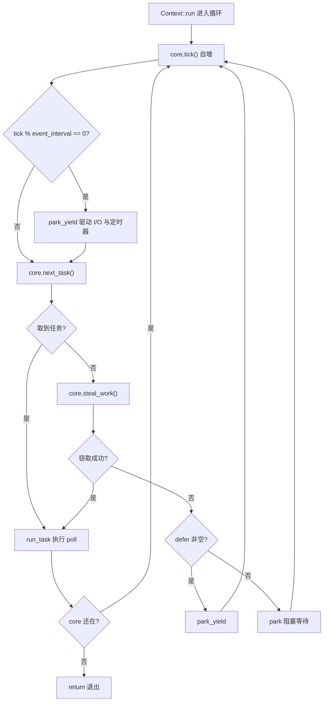
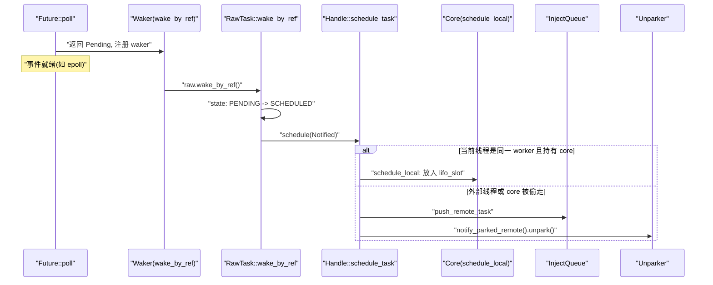
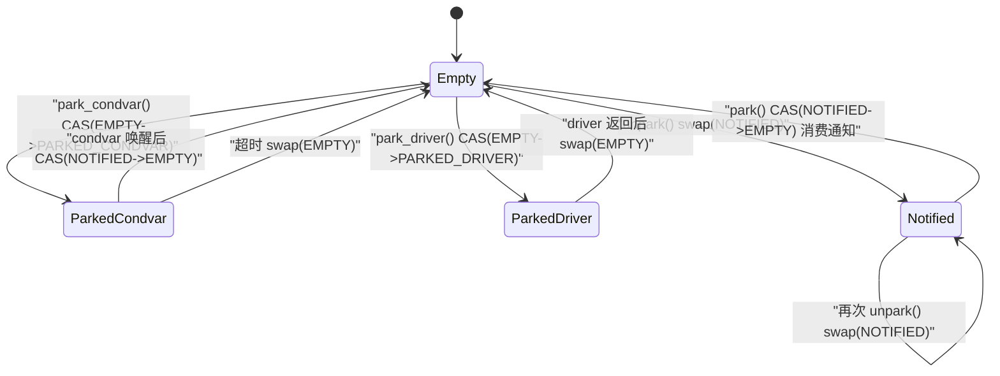

# Kapitel 4: Das Leben einer Aufgabe (Teil 2): Scheduling-Schleife, poll und der geschlossene Kreis des Weckens

# Von der Queue zur Ausführung: Das Skelett der Worker-Hauptschleife

Im vorherigen Kapitel haben wir die Aufgabe in die`Local`Queue oder die globale Injektions-Queue geschickt. Aber die Queue ist nur eine „To-do-Liste“; was die Aufgabe wirklich zum Laufen bringt, ist die niemals endende Schleife im Worker-Thread. In diesem Kapitel verfolgen wir`Context::run`– sie ist das Herz des gesamten Multithread-Schedulers.

Zuerst eine Intuition: Der Worker-Thread ist wie ein Koch, vor sich einen Stapel eigener Bestellungen (`run_queue`), daneben ein öffentliches Bestellregal (`inject`). Der Koch schaut zuerst auf die ihm am nächsten liegende Bestellung (`lifo_slot`), wenn nicht, nimmt er von seinem eigenen Stapel, wenn auch dort nichts ist, greift er sich eine Handvoll vom öffentlichen Regal, und wenn das auch nicht funktioniert, stiehlt er ein paar Blätter vom Stapel eines anderen Kochs. Erst wenn alles leer ist, geht er sich ausruhen, aber beim Ausruhen bleiben seine Ohren gespitzt – sobald eine Bestellung eingeht, wacht er sofort auf.

Ohne diese Schleife würde eine Aufgabe nach dem Einreihen in die Warteschlange für immer dort liegen,`Future::poll`niemals aufgerufen werden, und die gesamte Laufzeit wäre nur ein Haufen toter Daten.

## Speicherlayout und Zustandsfelder des Core

Der gesamte veränderliche Zustand des Workers ist in`Core`untergebracht, der von`Box`auf dem Heap allokiert wird und über`AtomicCell<Core>`zwischen`Worker`und thread-lokalem`Context`übergeben wird.

`Core`Die Schlüsselfelder von[FACT:tokio/src/runtime/scheduler/multi_thread/worker.rs:113-167]：

- `tick: u32`sind folgende: Bei jeder Schleifeniteration inkrementiert, um periodisch Wartung (`maintenance`) und globale Warteschlangenprüfung auszulösen.
- `lifo_slot: Option<Notified>`：**LIFO-Slot**, dies ist das raffinierteste Design dieses Kapitels. Wenn ein Worker selbst eine Aufgabe einplant, geht sie nicht in`run_queue`, sondern wird in diesen Slot gelegt, und beim nächsten Abrufen einer Aufgabe**wird**bevorzugt von hier genommen.
- `lifo_enabled: bool`: Der Schalter für den LIFO-Slot, um Hunger in Ping-Pong-Szenarien zu verhindern.
- `run_queue: queue::Local<Arc<Handle>>`: Lokale Warteschlange, die im vorherigen Kapitel analysierte`Local`-Struktur.
- `is_searching: bool`: Ob der Worker gerade nach stehlbaren Aufgaben sucht.
- `is_shutdown: bool` / `is_traced: bool`: Shutdown- und Tracing-Flags.
- `park: Option<Parker>`: Parker, mit`Option`umhüllt, um ihn unter dem Borrow-Checker bequem herausnehmen/zurücklegen zu können.
- `global_queue_interval: u32`: Wie oft die globale Warteschlange überprüft wird.
- `rand: FastRand`: Schneller Zufallszahlengenerator, um den Startpunkt für das Stehlen zufällig zu wählen.

> **[Design Inference & Architectural Trade-offs]**
> Beachten Sie, dass`lifo_slot`ein`Option<Notified>`und keine Warteschlange ist – es speichert nur**eine**Aufgabe. Die Design-Motivation wird in den Quellcode-Kommentaren klar erläutert[FACT:tokio/src/runtime/scheduler/multi_thread/worker.rs:117-121]: Vom Worker selbst eingeplante Aufgaben werden in diesem Slot gespeichert, und der Worker prüft ihn`run_queue` **bevor**er

prüft, mit dem Effekt „die zuletzt eingeplante Aufgabe läuft als nächste" (LIFO). Dies dient der Verbesserung der Lokalität, ist besonders effektiv für Message-Passing-Muster und kann die Latenz senken.

Warum kann LIFO die Latenz senken? Betrachten Sie ein typisches Message-Passing-Szenario: Aufgabe A weckt nach der Verarbeitung einer Nachricht Aufgabe B, B weckt nach der Verarbeitung wieder A. Wenn B sofort läuft, nachdem A es geweckt hat, befinden sich die von B benötigten Daten wahrscheinlich noch im CPU-Cache (da A sie gerade berührt hat). Wenn B ans Ende der Warteschlange gestellt wird und darauf wartet, dass Dutzende Aufgaben davor abgearbeitet werden, ist der Cache längst überschrieben.`MAX_LIFO_POLLS_PER_TICK = 3`Aber LIFO birgt ein Hunger-Risiko. Der Quellcode verwendet[FACT:tokio/src/runtime/scheduler/multi_thread/worker.rs:263-263], um

## zu begrenzen: Pro Tick wird der LIFO-Slot höchstens 3 Mal bevorzugt, danach wird er deaktiviert, damit andere Aufgaben eine Chance zur Ausführung bekommen.

Walkthrough der Hauptschleife: Ein vollständiger Scheduling-Zyklus`park`Wir versetzen uns in ein konkretes Szenario: Worker 0 ist gerade aus`run_queue`aufgewacht,`lifo_slot`enthält 5 Aufgaben,

enthält 1 Aufgabe, die globale Warteschlange enthält 3 Aufgaben.`Context::run` [FACT:tokio/src/runtime/scheduler/multi_thread/worker.rs:570-642]Der Einstieg in die Hauptschleife ist`lifo_enabled`. Zuerst wird`block_in_place`zurückgesetzt (da der Core möglicherweise von[FACT:tokio/src/runtime/scheduler/multi_thread/worker.rs:571-573]gestohlen wurde und der Zustand zurückgesetzt werden muss),`while !core.is_shutdown`dann wird in die

-Schleife eingetreten.

**Jede Schleifeniteration erledigt vier Dinge:** `core.tick()`Erster Schritt: Tick und Wartung.[FACT:tokio/src/runtime/scheduler/multi_thread/worker.rs:587]inkrementiert den Zähler`self.maintenance(core)`. Dann prüft`tick % event_interval == 0``park_yield`, und falls ja, wird[FACT:tokio/src/runtime/scheduler/multi_thread/worker.rs:809-826]。

**mit 0-Timeout aufgerufen, um I/O und Timer anzutreiben.** `core.next_task(&self.worker)`Zweiter Schritt: Aufgabe abrufen.[FACT:tokio/src/runtime/scheduler/multi_thread/worker.rs:1090-1156]ist die zentrale Aufgabenabruflogik

- . Sie hat zwei Pfade:`tick % global_queue_interval == 0`Wenn**,**wird[FACT:tokio/src/runtime/scheduler/multi_thread/worker.rs:1091-1098]bevorzugt aus der globalen Warteschlange abgerufen, und wenn das fehlschlägt, wird die lokale
- abgerufen. Dies dient dazu, zu verhindern, dass Aufgaben in der globalen Warteschlange verhungern.**Andernfalls**wird[FACT:tokio/src/runtime/scheduler/multi_thread/worker.rs:1090-1156]。

bevorzugt die lokale Aufgabe abgerufen`next_local_task`. Das lokale Abrufen von Aufgaben wird von[FACT:tokio/src/runtime/scheduler/multi_thread/worker.rs:1158-1160]：

```rust
fn next_local_task(&mut self) -> Option {
    self.lifo_slot.take().or_else(|| self.run_queue.pop())
}
```

Kopieren

Zuerst wird der LIFO-Slot abgerufen, dann der Kopf der Warteschlange (LIFO-Pop). Das ist das im vorherigen Kapitel erwähnte „lokale LIFO".**Wenn lokal leer ist, aber die globale Warteschlange nicht leer ist, wird der Worker**batchweise[FACT:tokio/src/runtime/scheduler/multi_thread/worker.rs:1110-1154]Aufgaben aus der globalen Warteschlange ziehen`n`. Die Berechnung der Batch-Größe`min(inject.len() / remotes.len() + 1, cap)`ist wohlüberlegt:`cap`, wobei`min(remaining_slots, max_capacity / 2)`wiederum[FACT:tokio/src/runtime/scheduler/multi_thread/worker.rs:1120-1131]annimmt. Die Quellcode-Kommentare erklären, warum auf die Hälfte der Warteschlangenkapazität begrenzt wird**: Um sicherzustellen, dass die gezogenen Aufgaben in der**vorderen Hälfte

**der lokalen Warteschlange landen, sodass diese Aufgaben selbst bei späterem Überlauf nicht zurück in die globale Warteschlange geschoben werden (Überlauf betrifft nur die hintere Hälfte).**Dritter Schritt: Aufgabe ausführen.`run_task` [FACT:tokio/src/runtime/scheduler/multi_thread/worker.rs:647-796]Nachdem

**eine Aufgabe erhalten hat, wird**aufgerufen. Dies ist die komplexeste Funktion dieses Kapitels, die wir im nächsten Abschnitt gesondert behandeln.`next_task`Vierter Schritt: Stehlen oder Parken.`None`Wenn`steal_work` [FACT:tokio/src/runtime/scheduler/multi_thread/worker.rs:1167-1195]`park`zurückgibt, bedeutet dies, dass weder lokal noch global Arbeit vorhanden ist, und`park_yield` [FACT:tokio/src/runtime/scheduler/multi_thread/worker.rs:613-621]。

wird aufgerufen. Bei fehlgeschlagenem Stehlen wird



## betreten. Der gesamte Kontrollfluss ist wie folgt:

`run_task`Kopieren`poll`run_task: Der geschlossene Kreislauf von poll und LIFO-Slot

ist der Ort, an dem die Aufgabe tatsächlich`assert_owner` [FACT:tokio/src/runtime/scheduler/multi_thread/worker.rs:648]wird, und auch der Schließpunkt des Kreislaufs „Aufwecken → Einreihen → erneut pollen".`Notified`Das Erste, was nach dem Betreten der Funktion geschieht, ist`Task`, wobei

in`transition_from_searching` [FACT:tokio/src/runtime/scheduler/multi_thread/worker.rs:652]umgewandelt wird, während gleichzeitig per Debug-Assertion sichergestellt wird, dass der aktuelle Thread tatsächlich der Owner dieser Aufgabe ist.

Danach[FACT:tokio/src/runtime/scheduler/multi_thread/worker.rs:695-795]：

```rust
coop::budget(|| {
    task.run();
    let mut lifo_polls = 0;
    loop {
        let mut core = match self.core.borrow_mut().take() {
            Some(core) => core,
            None => return ControlFlow::Break(()),
        };
        let task = match core.lifo_slot.take() {
            Some(task) => task,
            None => {
                self.reset_lifo_enabled(&mut core);
                core.stats.end_poll();
                return ControlFlow::Continue(core);
            }
        };
        if !coop::has_budget_remaining() {
            core.run_queue.push_back_or_overflow(task, ...);
            return ControlFlow::Continue(core);
        }
        lifo_polls += 1;
        if lifo_polls >= MAX_LIFO_POLLS_PER_TICK {
            core.lifo_enabled = false;
        }
        let task = self.worker.handle.shared.owned.assert_owner(task);
        *self.core.borrow_mut() = Some(core);
        task.run();
    }
})
```

Dann folgt die entscheidende Budget-Umhüllung`task.run()`Kopieren`Future::poll`Dieser Codeabschnitt offenbart den vollständigen geschlossenen Kreislauf des LIFO-Slots:`schedule_local`führt`lifo_slot` [FACT:tokio/src/runtime/scheduler/multi_thread/worker.rs:1396-1408]aus, und wenn die Aufgabe während des Polls sich selbst oder eine andere Aufgabe aufweckt,`lifo_slot`legt**die neue Aufgabe in**. Nach der Rückkehr des Polls prüft die Schleife sofort

, und falls eine Aufgabe vorhanden ist, wird weiter ausgeführt –`lifo_slot`ohne zur Hauptschleife zurückzukehren

, wird direkt innerhalb desselben Budgets kontinuierlich gepollt.`self.core.borrow_mut().take()`Dies ist die Verkörperung von „Aufwecken → Einreihen → erneut pollen" auf dem LIFO-Pfad: Beim Aufwecken wird die Aufgabe in`None`gelegt, und nach der Rückkehr des Polls wird sie sofort entnommen und erneut gepollt, wodurch ein enger geschlossener Kreislauf entsteht.[FACT:tokio/src/runtime/scheduler/multi_thread/worker.rs:716-724]Beachten Sie den`block_in_place`-Zweig von`ControlFlow::Break(())`: Wenn der Core gestohlen wurde (z. B. wenn in der Aufgabe`Context::run`aufgerufen wurde), muss der Worker`block_in_place`Interaktionspunkte mit der Scheduler-Schleife.

## Aufwachpfad: Wie der Waker das erneute Einreihen auslöst

Wenn`Future::poll`zurückgibt`Pending`, muss die Task einen`Waker`registrieren, um beim Bereitwerden des Events aufgeweckt zu werden. Tokios`Waker`-Implementierung ist extrem schlank – sie ist lediglich ein Rohzeiger auf die Task`Header`plus eine vtable.

`waker_ref`Konstruiert`WakerRef` [FACT:tokio/src/runtime/task/waker.rs:11-34], umhüllt mit`ManuallyDrop`die`Waker`, um beim Drop das Dekrementieren des Referenzzählers zu vermeiden. Die vtable ist statisch[FACT:tokio/src/runtime/task/waker.rs:119-119]：

```rust
static WAKER_VTABLE: RawWakerVTable =
    RawWakerVTable::new(clone_waker, wake_by_val, wake_by_ref, drop_waker);
```

Alle vier Funktionen stellen lediglich den Rohzeiger wieder als`Header`her und rufen dann die entsprechende Methode von`RawTask`auf[FACT:tokio/src/runtime/task/waker.rs:70-116]. Zum Beispiel ruft`wake_by_ref`letztendlich`raw.wake_by_ref()` [FACT:tokio/src/runtime/task/waker.rs:106-116]。

`wake_by_ref`auf. Die Semantik ist: Den Task-Status von`PENDING`nach`SCHEDULED`überführen, und wenn die Überführung erfolgreich ist (d. h. zuvor tatsächlich PENDING war),`Schedule::schedule`aufrufen, um die Task erneut einzureihen.

Für den Multithread-Scheduler,`schedule`die Implementierung in`Handle::schedule_task` [FACT:tokio/src/runtime/scheduler/multi_thread/worker.rs:1353-1376]：

```rust
pub(super) fn schedule_task(&self, task: Notified, is_yield: bool) {
    with_current(|maybe_cx| {
        if let Some(cx) = maybe_cx {
            if self.ptr_eq(&cx.worker.handle) {
                if let Some(core) = cx.core.borrow_mut().as_mut() {
                    self.schedule_local(core, task, is_yield);
                    return;
                }
            }
        }
        self.push_remote_task(task);
        self.notify_parked_remote();
    });
}
```

Die Logik teilt sich in zwei Zweige:

- Wenn der aktuelle Thread der Worker dieses Schedulers ist und core hält, gehe über`schedule_local` [FACT:tokio/src/runtime/scheduler/multi_thread/worker.rs:1385-1417]– ablegen im LIFO-Slot oder in der lokalen Queue.
- Andernfalls (Aufwecken von einem externen Thread oder core wurde gestohlen), gehe über`push_remote_task`Einfügen in die globale Injektions-Queue und`notify_parked_remote`einen geparkten Worker aufwecken[FACT:tokio/src/runtime/scheduler/multi_thread/worker.rs:1379-1383]。

`schedule_local`teilt sich intern wiederum in zwei Zweige[FACT:tokio/src/runtime/scheduler/multi_thread/worker.rs:1385-1417]: Wenn es`yield`ist oder LIFO deaktiviert wurde, einfügen am`run_queue`Ende; andernfalls ablegen in`lifo_slot`, und die Task aus dem ursprünglichen Slot an das Ende der Queue verdrängen.



## park und unpark: Zustandsmaschine und Atomarität des Aufweckens

Wenn der Worker nichts zu tun hat, muss er parken, aber park/unpark ist die Stelle, die am anfälligsten für Race Conditions ist. Tokio löst dies mit einer`AtomicUsize`-Zustandsmaschine plus`Condvar`als Fallback.

`Inner`Die Felder von[FACT:tokio/src/runtime/scheduler/multi_thread/park.rs:31-43]：`state: AtomicUsize`、`mutex: Mutex<()>`、`condvar: Condvar`、`shared: Arc<Shared>`. Es gibt vier Zustandskonstanten[FACT:tokio/src/runtime/scheduler/multi_thread/park.rs:36-45]：

- `EMPTY = 0`: nicht geparkt.
- `PARKED_CONDVAR = 1`: geparkt auf der condvar.
- `PARKED_DRIVER = 2`: geparkt auf dem I/O driver.
- `NOTIFIED = 3`: wurde bereits aufgeweckt.

Dies ist eine explizite Zustandsmaschine; wir verwenden sie, um das Zustandsdiagramm zu zeichnen (dies ist die einzige Stelle in diesem Kapitel, die die`stateDiagram-v2`-Zulassungsbedingung erfüllt – im Quellcode existieren tatsächlich diese vier Zustandskonstanten):



`unpark`Die Implementierung von[FACT:tokio/src/runtime/scheduler/multi_thread/park.rs:277-290]verwendet`swap`statt CAS; der Quellcode-Kommentar erklärt den Grund[FACT:tokio/src/runtime/scheduler/multi_thread/park.rs:277-290]: Es muss eine Release-Operation ausgeführt werden, damit der parkende Thread die Schreibvorgänge vor dem unpark beobachten kann, daher muss selbst wenn state bereits`NOTIFIED`ist, einmal geschrieben werden.

`park`Versucht zunächst, eine vorhandene Benachrichtigung zu konsumieren[FACT:tokio/src/runtime/scheduler/multi_thread/park.rs:132-149]: Wenn CAS`NOTIFIED -> EMPTY`erfolgreich ist, bedeutet dies, dass zuvor bereits aufgeweckt wurde, und es wird direkt zurückgekehrt ohne zu blockieren. Andernfalls wird versucht, das driver-Lock zu erlangen; wenn erhalten, wird auf dem driver geparkt, andernfalls wird die condvar als Fallback verwendet[FACT:tokio/src/runtime/scheduler/multi_thread/park.rs:143-148]。

`park_condvar`Es gibt eine klassische doppelte Prüfung[FACT:tokio/src/runtime/scheduler/multi_thread/park.rs:162-180]: Zuerst CAS`EMPTY -> PARKED_CONDVAR`, wenn dies fehlschlägt und es`NOTIFIED`ist, bedeutet dies, dass vor dem Setzen des Zustands bereits aufgeweckt wurde; in diesem Fall muss`swap(EMPTY)`ausgeführt werden, um die Schreibvorgänge des unpark zu synchronisieren[FACT:tokio/src/runtime/scheduler/multi_thread/park.rs:167-177]. Der Kommentar betont besonders: Selbst wenn bekannt ist, dass es`NOTIFIED`ist, muss einmal gelesen werden, da unpark möglicherweise nach unserem Lesen von`NOTIFIED`erneut aufgerufen wurde.

`unpark_condvar`Der Kommentar von[FACT:tokio/src/runtime/scheduler/multi_thread/park.rs:292-307]weist auf die klassische Falle der condvar hin: Zwischen dem Setzen des`PARKED`-Zustands durch den parkenden Thread und dem tatsächlichen`wait`gibt es ein Zeitfenster; wenn in diesem Zeitraum notify aufgerufen wird, wird es ignoriert. Die Lösung ist, dass der parkende Thread zu diesem Zeitpunkt`mutex`hält, und der unparkende Thread zuerst`drop(self.mutex.lock())`das Lock erwirbt (und somit darauf wartet, dass der parkende Thread es freigibt), dann`notify_one`。

# Designüberlegung: Warum der LIFO-Slot ein einzelner Slot und keine Queue ist

> **[Design Inference & Architectural Trade-offs]**
> Das Einzel-Slot-Design ist eine bewusste Abwägung. Bei einer Queue müsste bei jedem Aufwecken eingereiht und bei jeder Task-Entnahme ausgereiht werden, was teurer wäre; außerdem würde die Queue mehrere Tasks ansammeln und die Lokalitätsannahme „der zuletzt aufgeweckte läuft zuerst" zerstören. Die Semantik des Einzel-Slots ist „sich nur den letzten merken"; verdrängte Tasks gehen in die normale Queue – was genau dem Gesetz des abnehmenden Lokalitätsnutzens entspricht: Die letzte Task ist am heißesten, die zweite weniger, und ab der dritten wird der Nutzen sehr gering.

`MAX_LIFO_POLLS_PER_TICK = 3`Diese magische Zahl[FACT:tokio/src/runtime/scheduler/multi_thread/worker.rs:263-263]ist ebenfalls ein Erfahrungswert. Der Quellcode-Kommentar besagt: „Ein paar Durchläufe durch den LIFO-Slot scheinen auszureichen, um von der Lokalität zu profitieren; mehr als 3 könnten übergewichten." Dies verhindert, dass ein Ping-Pong-Szenario, bei dem A B aufweckt und B A aufweckt, andere Tasks aushungert.

Ein weiteres bemerkenswertes Design ist`steal_work`die „Halbierungs-Such"-Strategie[FACT:tokio/src/runtime/scheduler/multi_thread/worker.rs:1158-1160]: Nur wenn weniger als die Hälfte der Worker suchen, versucht ein neuer Worker tatsächlich zu stehlen. Dies vermeidet CAS-Konkurrenz, die entsteht, wenn alle Worker gleichzeitig wild stehlen.`transition_to_searching`Koordiniert durch`idle.transition_worker_to_searching()`wird[FACT:tokio/src/runtime/scheduler/multi_thread/worker.rs:1197-1203]。

Das Stehlen beginnt an einem zufälligen Startpunkt[FACT:tokio/src/runtime/scheduler/multi_thread/worker.rs:1172-1174], durchläuft alle remote, überspringt sich selbst[FACT:tokio/src/runtime/scheduler/multi_thread/worker.rs:1179-1182], ruft`steal_into`auf, um einen Diebstahl zu versuchen. Nachdem alles fehlgeschlagen ist, wird auf die globale Queue zurückgegriffen[FACT:tokio/src/runtime/scheduler/multi_thread/worker.rs:1197-1203]。

# Zusammenfassung dieses Kapitels

Die Worker-Hauptschleife`Context::run`ist das Herz des Schedulers: Nach jedem Tick wird zuerst eine Task geholt (LIFO-Slot → lokale Queue → globale Queue); wenn eine gefunden wird, wird`run_task`ausgeführt, um poll aufzurufen; wenn keine gefunden wird, wird gestohlen; wenn der Diebstahl fehlschlägt, wird geparkt.`run_task`Die interne LIFO-Schleife komprimiert „Aufwecken → Einreihen → erneut poll" in dasselbe Budget und bildet so einen geschlossenen Regelkreis mit niedriger Latenz.`Waker`Ist ein Rohzeiger plus statische vtable,`wake_by_ref`Löst durch Zustandsübergang`schedule`aus, und je nachdem, ob der aktuelle Thread derselbe Worker ist, wird entschieden, ob die lokale Queue oder die globale Queue verwendet wird.`park`/`unpark`Verwendet eine Vier-Zustands-Atommaschine plus condvar als Fallback und löst die klassische Race Condition des verlorenen Aufweckens.

Im nächsten Kapitel verlassen wir den Scheduler und betreten die I/O-Welt: Wie der Reactor epoll-Events in`Waker`Aufwecken übersetzt, sodass`AsyncFd`die`Pending`zu`Ready`。

# Denkfragen und Selbsttests dieses Kapitels

Q1: Wenn man`next_local_task`so ändert, dass zuerst geholt wird`run_queue`Dann nimm`lifo_slot`, welche Konsequenzen hat das in Szenarien mit intensivem Nachrichtenaustausch?

**Referenzanalyse**：`next_local_task`Die aktuelle Implementierung ist`self.lifo_slot.take().or_else(|| self.run_queue.pop())` [FACT:tokio/src/runtime/scheduler/multi_thread/worker.rs:1158-1160], zuerst wird der LIFO-Slot entnommen. Wenn umgekehrt zuerst`run_queue`entnommen würde, dann würden Aufgaben, die gerade aufgeweckt wurden und deren Daten noch heiß sind, hinter anderen Aufgaben in der Warteschlange ausgeführt. Im Nachrichtenaustauschmuster A→B→A würde B nach dem Aufwecken nicht sofort laufen, sondern warten, bis andere Aufgaben in der Warteschlange abgearbeitet sind. Zu diesem Zeitpunkt könnten die von A geschriebenen Daten bereits aus dem CPU-Cache verdrängt worden sein, und der Lokalitätsvorteil ginge verloren. Noch schwerwiegender ist, dass`lifo_slot`Aufgaben in`run_queue`so lange warten, bis[FACT:tokio/src/runtime/scheduler/multi_thread/worker.rs:117-121]geleert ist, bevor sie ausgeführt werden, was die Latenz erheblich erhöht. Der Quellcode-Kommentar

Q2: `park_condvar`weist ausdrücklich darauf hin, dass diese Reihenfolge dazu dient, „die Lokalität zu verbessern, vom Nachrichtenaustauschmuster zu profitieren und die Latenz zu senken“.`Err(NOTIFIED)`, welche Probleme entstehen, wenn im`self.state.swap(EMPTY, SeqCst)`-Zweig`return`entfernt und nur

**beibehalten wird?**Referenzanalyse`Err(NOTIFIED)`: Der Quellcode führt im`let old = self.state.swap(EMPTY, SeqCst)` [FACT:tokio/src/runtime/scheduler/multi_thread/park.rs:167-177]-Zweig[FACT:tokio/src/runtime/scheduler/multi_thread/park.rs:168-173]aus. Der Kommentar erklärt`NOTIFIED`: unpark könnte nach dem Lesen von`return`noch einmal aufgerufen worden sein; es muss eine acquire-Operation ausgeführt werden, um mit diesem unpark zu synchronisieren, damit alle davor erfolgten Schreibvorgänge sichtbar werden. Wenn nur`NOTIFIED`ohne Swap ausgeführt würde, bliebe state bei`NOTIFIED -> EMPTY`stehen; beim nächsten park würde CAS

Q3: `run_task`erfolgreich sein und sofort zurückkehren (eine bereits abgelaufene Benachrichtigung würde konsumiert), aber schlimmer noch: Der release-Schreibvorgang von unpark wäre nicht synchronisiert, und der park-Thread könnte die vor unpark geschriebenen Daten nicht sehen, was zu Problemen mit der Speichersichtbarkeit führt. Dies ist ein typischer doppelter Bug aus „verlorenem Aufwecken + Speicherordnung“.`self.core.borrow_mut().take()`, warum wird`None`zurückgegeben, wenn`ControlFlow::Break(())`zurückgibt, und nicht`Continue`？

**Referenzanalyse**：`self.core.borrow_mut().take()`Die Rückgabe von`None`bedeutet, dass der Core gestohlen wurde[FACT:tokio/src/runtime/scheduler/multi_thread/worker.rs:716-724]. Der einzige Weg, auf dem ein Core gestohlen werden kann, ist, dass eine Aufgabe intern`block_in_place`aufruft, wodurch über`maybe_move_runtime`der Core aus`cx.core`entnommen und an einen neuen Thread[FACT:tokio/src/runtime/scheduler/multi_thread/worker.rs:473-497]übergeben wird. Zu diesem Zeitpunkt besitzt der aktuelle Thread keine Scheduling-Fähigkeit mehr. Wenn`Continue`，`Context::run`zurückgegeben würde, würde die Schleife weiterlaufen und Methoden wie`core.next_task()`aufrufen, die einen Core benötigen, aber der Core ist nicht mehr in`self.core`, was zu einem Panic oder inkonsistentem Zustand führen würde. Die Rückgabe von`Break`lässt`Context::run`direkt`return` [FACT:tokio/src/runtime/scheduler/multi_thread/worker.rs:594-597], wodurch die Kontrolle an die`run`-Funktion zurückgegeben wird, die die weitere Verarbeitung übernimmt (zum Beispiel`cx.defer.wake()` [FACT:tokio/src/runtime/scheduler/multi_thread/worker.rs:564]). Der Kommentar erklärt auch[FACT:tokio/src/runtime/scheduler/multi_thread/worker.rs:719-721]: Zu diesem Zeitpunkt darf`reset_lifo_enabled`nicht aufgerufen werden, weil der Core gestohlen wurde und der Dieb ihn oben in`Context::run`verarbeitet.
