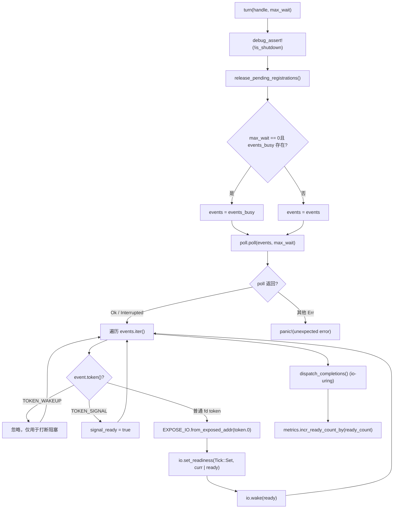
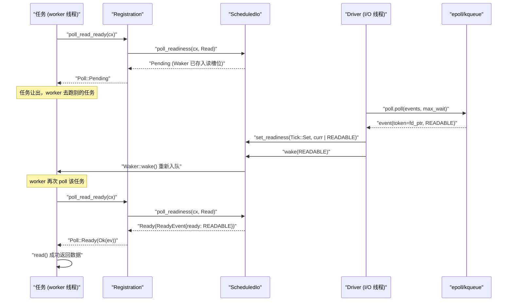

# Kapitel 5: I/O-Bereitschaftsbenachrichtigung: Wie der Reactor epoll-Ereignisse in Waker-Aufweckungen übersetzt

Im vorherigen Kapitel haben wir die Hauptschleife des Worker-Threads verfolgt: Eine Aufgabe wird gepollt, bei Rückgabe von Pending wird der Waker irgendwo gespeichert, nach Eintritt der Bereitschaft wird der Waker ausgelöst und die Aufgabe erneut in die Warteschlange eingereiht. Aber wo genau ist dieses „irgendwo“? Wie wird der Waker gefunden, wenn ein epoll-Ereignis eintritt? Genau das ist die Frage, die der Reactor beantworten soll. Zuerst ein intuitives Modell: Stellen Sie sich den gesamten I/O-Bereitschaftsbenachrichtigungsmechanismus wie ein Nummernaufrufsystem in einem Restaurant vor – der Gast (die Aufgabe) stellt sich nach der Bestellung nicht ans Fenster und wartet, sondern nimmt einen Summer (Waker) mit zurück an den Platz; wenn die Küche (der Kernel-epoll) das Essen zubereitet hat, findet die Rezeption (der Reactor) anhand der Bestellnummer (Token) den entsprechenden Summer und drückt den Knopf. Ohne dieses System könnte jede Aufgabe nur den Socket pollen, und die CPU würde verbrannt; oder man würde blockierende Threads zum Warten verwenden, ein Thread pro Verbindung, was nicht skalierbar ist. Der Reactor von Tokio besteht aus drei Dateien mit einer dreischichtigen Struktur und strikter Trennung der Zuständigkeiten: driver.rs ist der Ereignisschleifenkern, hält mio::Poll, ist für den Aufruf von poll() zum blockierenden Warten auf Kernel-Ereignisse verantwortlich und übersetzt Ereignisse in Lese-/Schreibvorgänge auf ScheduledIo; registration.rs ist das benutzerseitige Registrierungshandle, das TcpStream intern hält, und bietet APIs wie poll_read_ready / poll_write_ready; scheduled_io.rs ist der Status-Slot jedes fd, speichert Lese-/Schreibbereitschaftsbits und Waker-Listen und ist die Brücke zwischen Ereignissen und Aufgaben. Die Modulzusammensetzung ist in tokio/src/runtime/io/mod.rs:5-16 zu finden: driver exportiert Driver, Handle, ReadyEvent, registration exportiert Registration, scheduled_io exportiert ScheduledIo. Die folgende Abbildung verankert den vollständigen Datenfluss, der in diesem Kapitel verfolgt werden soll: TcpStream → Registration → ScheduledIo → Handle/Driver → Kernel → zurück zu ScheduledIo → Waker. Als Nächstes zerlegen wir dies Schicht für Schicht.

# Treiberschicht:`Driver`und`Handle`Aufgabenteilung

## Intuitives Modell

`Driver`ist**die einzige Entität, die`mio::Poll`besitzt**, und kann nur in einem einzelnen Thread`&mut`zugegriffen werden – dies ist die Exklusivitätsanforderung der Ereignisschleife. Hingegen ist`Handle`ein**klonbarer, threadübergreifend gemeinsam nutzbarer Registrierungseinstiegspunkt**, jeder Thread, der einen neuen fd registrieren möchte, tut dies darüber. Ohne diese Aufteilung müsste man entweder`mio::Poll`sperren (bei jeder Registrierung Konkurrenz), oder alle Registrierungen zurück zum Driver-Thread leiten (Einführung einer Cross-Thread-Message-Queue). Tokio entscheidet sich,`Handle`direkt einen Klon von`mio::Registry`halten zu lassen, Registrierungsoperationen können parallel ablaufen, nur das tatsächliche Warten auf Events benötigt Exklusivzugriff.

## Speicherlayout und Felder

Zuerst schauen wir uns`Driver`die Felder von[FACT:tokio/src/runtime/io/driver.rs:25-38]：

- `signal_ready: bool`an: Ob ein Unix-Signal-Event angekommen ist, wird für signal-getrieben verwendet.
- `events: mio::Events`: Haupt-Event-Puffer, wird über`turn`Aufrufe hinweg wiederverwendet, um Allokation bei jedem Aufruf zu vermeiden.
- `events_busy: Option<mio::Events>`：**Dedizierter Puffer für nicht-blockierendes poll**, existiert nur, wenn`max_io_events_per_busy_tick`gesetzt ist.
- `poll: mio::Poll`: Kapselung der Kernel-Event-Queue.

Schauen wir uns nun`Handle` [FACT:tokio/src/runtime/io/driver.rs:41-75]：

- `registry: mio::Registry`：`mio::Poll::registry()`den Klon von`register`/`deregister`。
- `registrations: RegistrationSet`an, verwendet für`Token`: Menge aller aktiven Registrierungen, verantwortlich für die Zuweisung von`ScheduledIo`。
- `synced: Mutex<registration_set::Synced>`und`RegistrationSet`: Schützt den Synchronisationszustand von
- `waker: mio::Waker`: Wird verwendet, um aus beliebigen Threads den Driver aufzuwecken, der in`turn`blockiert.
- `metrics: IoDriverMetrics`: Zählt die Anzahl der fds und der bereiten Events.

Hier gibt es ein entscheidendes Design:`events_busy`Die Existenz von[FACT:tokio/src/runtime/io/driver.rs:25-38]dient dazu,**das Problem zu lösen, dass nicht-blockierendes poll Events verschluckt**. Der Kommentar[FACT:tokio/src/runtime/io/driver.rs:189-190]sagt es ganz klar: Wenn Events, die durch nicht-blockierendes poll entnommen wurden, im Hauptpuffer verbleiben, sind sie beim nächsten poll nicht mehr sichtbar; mit einem separaten Puffer bleiben unbehandelte Events in der Kernel-Queue und werden beim nächsten poll erneut zurückgegeben.

## Step-by-Step: Eine Ausführung von`turn`

`turn`ist die Kernfunktion des Drivers[FACT:tokio/src/runtime/io/driver.rs:184-261]. Angenommen, ein Worker-Thread stellt fest, dass keine Aufgaben auszuführen sind, und ruft`park` → `turn(handle, None)`auf, um blockierend zu warten:

**Erster Schritt**: Assertion, dass nicht heruntergefahren[FACT:tokio/src/runtime/io/driver.rs:185], und Freigabe der zu bereinigenden Registrierungen[FACT:tokio/src/runtime/io/driver.rs:187]。`release_pending_registrations`Prüft`needs_release()`, falls vorhanden, wird`registrations.release()` [FACT:tokio/src/runtime/io/driver.rs:336-340]。

**aufgerufen. Zweiter Schritt**: Auswahl des Event-Puffers[FACT:tokio/src/runtime/io/driver.rs:191-194]. Falls`max_wait`null ist und`events_busy`existiert, wird der busy-Puffer verwendet; andernfalls der Hauptpuffer.

**Dritter Schritt**: Aufruf von`self.poll.poll(events, max_wait)` [FACT:tokio/src/runtime/io/driver.rs:198]. Hier wird tatsächlich in epoll_wait blockiert. Die Fehlerbehandlung ist sehr zurückhaltend:`Interrupted`wird direkt ignoriert (Signalunterbrechung ist normal)[FACT:tokio/src/runtime/io/driver.rs:200], unter WASI wird`InvalidInput`ebenfalls ignoriert[FACT:tokio/src/runtime/io/driver.rs:201-205], andere Fehler führen direkt zu panic[FACT:tokio/src/runtime/io/driver.rs:206]。

**Vierter Schritt**: Iteration über die Events[FACT:tokio/src/runtime/io/driver.rs:211-233]. Für jedes`event`：

- falls`token == TOKEN_WAKEUP`(Wert 0)[FACT:tokio/src/runtime/io/driver.rs:214], wird nichts getan – dies wird von`unpark`verwendet, um die Blockierung zu unterbrechen.
- Falls`token == TOKEN_SIGNAL`(Wert 1)[FACT:tokio/src/runtime/io/driver.rs:216], wird`signal_ready = true`。
- gesetzt. Andernfalls handelt es sich um ein normales I/O-Event[FACT:tokio/src/runtime/io/driver.rs:218-231]:`mio::Ready`wird in Tokios`Ready`umgewandelt, mit`EXPOSE_IO.from_exposed_addr(token.0)`wird das Token zurück in einen`*const ScheduledIo`-Zeiger umgewandelt, dann`set_readiness(Tick::Set, |curr| curr | ready)`werden die Bereitschaftsbits akkumuliert, anschließend`io.wake(ready)`wird die entsprechende Richtung von`Waker`。

ausgelöst. Hier ist`EXPOSE_IO`ein`PtrExposeDomain<ScheduledIo>` [FACT:tokio/src/runtime/io/mod.rs:21-22], das den Zeiger als`usize`„exponiert“ als`mio::Token`. Der Sicherheitskommentar[FACT:tokio/src/runtime/io/driver.rs:222-225]erklärt, warum diese unsafe-Konvertierung sicher ist: Der Zeiger wird nicht freigegeben, bevor er bei mio abgemeldet**und**der Driver nicht mehr parallel pollt, und der Driver besitzt das Eigentum an`Arc<ScheduledIo>`.

**Fünfter Schritt**: Verarbeitung der io_uring Completion-Queue (nur Linux + tokio_unstable)[FACT:tokio/src/runtime/io/driver.rs:235-258], einschließlich der Flush-Schleife bei CQ-Überlauf.

**Sechster Schritt**: Akkumulation der Metriken[FACT:tokio/src/runtime/io/driver.rs:265-267]。



## Designüberlegung: Warum`Handle`halten muss`mio::Waker`

`unpark` [FACT:tokio/src/runtime/io/driver.rs:280-283]aufrufen`self.waker.wake()`. Dieses`mio::Waker`wird bei`Driver::new`mit`TOKEN_WAKEUP`registriert[FACT:tokio/src/runtime/io/driver.rs:124]. Wenn der Driver in`poll.poll()`blockiert, wird durch einen anderen Thread, der`unpark`aufruft, ein`TOKEN_WAKEUP`-Event in epoll eingefügt,`poll`kehrt sofort zurück, bei der Iteration wird dieses Token direkt übersprungen[FACT:tokio/src/runtime/io/driver.rs:214-215]。

> **[Design Inference & Architectural Trade-offs]**
> Dieser Mechanismus wird in`deregister_source`verwendet[FACT:tokio/src/runtime/io/driver.rs:315-334]: Nach der Abmeldung einer Source, falls`registrations.deregister`true zurückgibt (was bedeutet, dass dies die letzte Referenz ist), wird`unpark()`. Warum? Weil der Driver möglicherweise gerade in`poll`auf das Event dieses fd wartet, und der fd bereits abgemeldet wurde, sodass der Kernel keine Events mehr erzeugen wird; der Driver muss aktiv aufgeweckt werden, damit er die Registrierungsmenge erneut überprüft und möglicherweise die Blockierung beendet. Andernfalls würde der Driver bis zum Timeout von`max_wait`schlafen, was das Herunterfahren verzögert.

Ein weiteres Detail:`deregister_source`ruft zuerst`self.registry.deregister(source)` [FACT:tokio/src/runtime/io/driver.rs:322]auf, dann wird`registrations` [FACT:tokio/src/runtime/io/driver.rs:315-334]bereinigt. Der Kommentar[FACT:tokio/src/runtime/io/driver.rs:320-321]sagt „Cleanup ALWAYS happens“ – selbst wenn die Deregistrierung auf OS-Ebene fehlschlägt, muss der interne Zustand bereinigt werden, erst danach wird der OS-Fehler zurückgegeben[FACT:tokio/src/runtime/io/driver.rs:336-340]. Dies ist ein typisches**Muster, bei dem Ressourcenbereinigung Vorrang vor Fehlerpropagierung hat**.

# Registrierungsschicht:`Registration`Wie`Waker`in`ScheduledIo`

## gespeichert wird. Intuitives Modell

`Registration`ist**ein Vertrag zwischen Task und fd**. Es hält zwei Dinge: ein`scheduler::Handle`(verwendet, um bei Bedarf auf die Runtime zuzugreifen), ein`Arc<ScheduledIo>`(der Zustandsslot des fd). Wenn eine Task`poll_read_ready`aufruft,`Registration`übergibt`Waker`an`ScheduledIo`zur Verwahrung; wenn der Driver ein Event empfängt, wird`ScheduledIo`aus`Waker`entnommen und aufgeweckt.

## Speicherlayout und Felder

`Registration`hat nur zwei Felder[FACT:tokio/src/runtime/io/registration.rs:46-54]：

- `handle: scheduler::Handle`: Runtime-Handle, Kommentar[FACT:tokio/src/runtime/io/registration.rs:46-54]sagt „TODO: this can probably be moved into ScheduledIo“, was zeigt, dass der Autor der Meinung ist, dass die Position dieses Feldes optimiert werden kann.
- `shared: Arc<ScheduledIo>`: Gemeinsamer Zustand,`Arc`stellt sicher, dass sowohl Driver als auch Task darauf zugreifen können.

> **[Design Inference & Architectural Trade-offs]**
> Beachten Sie, dass`Registration`manuell`Send`und`Sync` [FACT:tokio/src/runtime/io/registration.rs:57-58]implementiert. Warum ist unsafe impl erforderlich? Weil`scheduler::Handle`intern möglicherweise Felder enthält, die nicht`Send`/`Sync`sind (zum Beispiel`Rc`), aber`Registration`das Anwendungsszenario erfordert, dass es über Threads hinweg verwendet werden kann. Der Dokumentationskommentar[FACT:tokio/src/runtime/io/registration.rs:28-33]gibt die entscheidende Einschränkung an:**Der Aufrufer muss sicherstellen, dass höchstens zwei Tasks gleichzeitig dasselbe`Registration`**verwenden, eine liest, eine schreibt. Eine Verletzung dieser Einschränkung ist zwar speichersicher, führt jedoch zu verlorenen Benachrichtigungen und hängenden Tasks.

## Step-by-Step：`poll_read_ready`Die Aufrufkette von

Angenommen, eine Task ist in`TcpStream::poll_read`stellt fest, dass der Socket keine Daten hat, und muss ein Lese-Interesse registrieren. Die Aufrufkette ist`TcpStream::poll_read_priv` → `PollEvented::poll_read` → `Registration::poll_read_io` → `poll_io` → `poll_ready`。

`poll_ready`ist der Kern[FACT:tokio/src/runtime/io/registration.rs:155-171]：

**Erster Schritt**：`trace_leaf()` [FACT:tokio/src/runtime/io/registration.rs:160], verwendet für Tracing-Instrumentierung.

**Zweiter Schritt**：`coop::poll_proceed(cx)` [FACT:tokio/src/runtime/io/registration.rs:155-171]. Dies ist der kooperative Budget-Mechanismus, der in Kapitel 12 behandelt wird. Wenn das Budget erschöpft ist, wird zurückgegeben`Pending`und ein spezielles`Waker`registriert, damit die Aufgabe in der nächsten Runde neu geplant wird.

**Dritter Schritt**：`self.shared.poll_readiness(cx, direction)` [FACT:tokio/src/runtime/io/registration.rs:155-171]. Dies ist der Ort, an dem tatsächlich mit`ScheduledIo`interagiert wird: Der aktuelle Bereitschaftsstatus wird geprüft; wenn bereits bereit, wird sofort zurückgegeben`Ready`; andernfalls wird`cx.waker()`in den entsprechenden Richtungs-Slot von`ScheduledIo`gespeichert und zurückgegeben`Pending`。

**Vierter Schritt**: Prüfen von`ev.is_shutdown` [FACT:tokio/src/runtime/io/registration.rs:155-171]. Wenn die Runtime gerade heruntergefahren wird, wird zurückgegeben`RUNTIME_SHUTTING_DOWN_ERROR`。

**Fünfter Schritt**：`coop.made_progress()` [FACT:tokio/src/runtime/io/registration.rs:169], Budgetverbrauch markieren und das Bereitschaftsereignis zurückgeben.

`poll_io`fügt über`poll_ready`eine Retry-Schleife hinzu[FACT:tokio/src/runtime/io/registration.rs:173-192]：

```rust
loop {
    let ev = ready!(self.poll_ready(cx, direction))?;
    match f() {
        Ok(ret) => return Poll::Ready(Ok(ret)),
        Err(ref e) if e.kind() == io::ErrorKind::WouldBlock => {
            self.clear_readiness(ev);
        }
        Err(e) => return Poll::Ready(Err(e)),
    }
}
```

Hier zeigt sich**Readiness ist ein Hinweis, keine Garantie**Die Kernidee:`poll_ready`meldet lesbar, aber beim tatsächlichen`read()`kann`WouldBlock`zurückgegeben werden (z. B. wenn ein anderer Thread die Daten zuerst weggelesen hat). In diesem Fall muss`clear_readiness(ev)` [FACT:tokio/src/runtime/io/registration.rs:187]das Bereitschaftsbit gelöscht und die Schleife erneut auf Warten gesetzt werden. Wenn nicht gelöscht wird, gerät die Aufgabe in eine Busy-Schleife von „glaubt lesbar → read schlägt fehl → glaubt wieder lesbar“.

## Designüberlegung:`try_io`und`async_io`Arbeitsteilung

`try_io` [FACT:tokio/src/runtime/io/registration.rs:194-213]ist die synchrone Version: Zuerst`ready_event(interest)`das Bereitschaftsbit prüfen; wenn leer, direkt zurückgeben`WouldBlock` [FACT:tokio/src/runtime/io/registration.rs:194-213]; andernfalls`f()`ausführen; wenn`f()`zurückgibt`WouldBlock`, dann das Bereitschaftsbit löschen[FACT:tokio/src/runtime/io/registration.rs:207-210]. Es**registriert keinen Waker**und eignet sich für`try_read`Szenarien wie „einmal versuchen und gehen“.

`async_io` [FACT:tokio/src/runtime/io/registration.rs:225-245]ist die asynchrone Version:`readiness(interest).await`registriert einen Waker und wartet, dann wird bei der Ausführung von`f()`，`WouldBlock`das Bereitschaftsbit gelöscht und die Schleife fortgesetzt. Beachten Sie, dass in der Schleife auch`coop::poll_proceed` [FACT:tokio/src/runtime/io/registration.rs:233]aufgerufen wird, um zu verhindern, dass bei vielen`WouldBlock`Retries das Budget erschöpft wird.

## Produktions-Fallstricke:`Drop`Waker-Bereinigung in

`Registration::drop` [FACT:tokio/src/runtime/io/registration.rs:253-262]ruft`self.shared.clear_wakers()`auf. Der Kommentar[FACT:tokio/src/runtime/io/registration.rs:253-262]erklärt den Grund:`ScheduledIo`Das in`Waker`gespeicherte`Arc<driver::Inner>`kann`driver::Inner`halten, und`ScheduledIo`hält wiederum`Registration`, was einen Zirkelbezug bildet. Die Waker-Bereinigung ist ein Mittel, um den Zyklus zu durchbrechen. Der Kommentar gibt jedoch zu, dass dies eine „imperfect solution“ ist – wenn`Waker`selbst in

> **[Design Inference & Architectural Trade-offs]**
> 〔Design-Inferenz und Architektur-Abwägung〕`clear_wakers`Das Verhalten in der Produktion ist: Wenn viele Verbindungen gedroppt werden, aber die Runtime nicht beendet wird, wird der Speicher nicht sofort freigegeben, bis zum nächsten`ScheduledIo`oder Runtime-Shutdown. Für Langzeitverbindungsdienste ist dies normalerweise kein Problem; bei Szenarien mit häufiger Erstellung/Zerstörung von Kurzzeitverbindungen muss jedoch der Rückgewinnungszeitpunkt von

# beachtet werden.`TcpStream::read`Von`Waker`bis

## vollständige Kette des Aufweckens

Intuitives Modell`TcpStream`Nun werden die drei Ebenen verbunden. Der Benutzer ruft auf`.read().await`auf`AsyncRead::poll_read` → `PollEvented::poll_read` → `Registration::poll_read_io`, tatsächlich ausgeführt wird`Waker`. Wenn keine Daten ankommen,`ScheduledIo`wird in`ScheduledIo`gespeichert; wenn epoll Lesbarkeit meldet, entnimmt der Driver aus`Waker`den`poll_readiness`und weckt auf, die Aufgabe wird neu geplant, und beim erneuten Poll entdeckt`Ready`，`read()`, dass das Bereitschaftsbit gesetzt ist, und gibt direkt

## erfolgreich zurück.

**Step-by-Step: Ein vollständiges Lese-Warten**。`TcpStream::new` [FACT:tokio/src/net/tcp/stream.rs:166-169]Phase eins: Interesse registrieren`PollEvented::new(connected)`ruft`Registration::new_with_interest_and_handle` [FACT:tokio/src/runtime/io/registration.rs:73-81]auf, letzteres ruft intern`handle.driver().io().add_source(io, interest)` [FACT:tokio/src/runtime/io/registration.rs:73-81]。

`add_source` [FACT:tokio/src/runtime/io/driver.rs:288-312]auf, und

1. `registrations.allocate(&mut synced.lock())`erledigt drei Dinge:`ScheduledIo`weist einen`token` [FACT:tokio/src/runtime/io/driver.rs:293-294]。

2. `self.registry.register(source, token, interest.to_mio())`zu, holt[FACT:tokio/src/runtime/io/driver.rs:298]registriert**beim Kernel. Bei Fehlschlag**muss`ScheduledIo`der gerade zugewiesene[FACT:tokio/src/runtime/io/driver.rs:300-303]aus der Menge entfernt werden

3. `metrics.incr_fd_count()`, sonst Leck.[FACT:tokio/src/runtime/io/driver.rs:309]。

**zählt**Phase zwei: Auf Bereitschaft warten`TcpStream::poll_read` [FACT:tokio/src/net/tcp/stream.rs:1492-1498] → `poll_read_priv` [FACT:tokio/src/net/tcp/stream.rs:1451-1458] → `PollEvented::poll_read` → `Registration::poll_read_io` [FACT:tokio/src/runtime/io/registration.rs:133-139] → `poll_io` → `poll_ready` → `ScheduledIo::poll_readiness`. Die Aufgabe pollt`Waker`. Wenn zu diesem Zeitpunkt nicht bereit,`ScheduledIo`wird in den Lese-Slot von`Pending`。

**gespeichert und zurückgegeben**Phase drei: Ereignis trifft ein`turn`. Der`poll.poll()`des Drivers holt das Ereignis[FACT:tokio/src/runtime/io/driver.rs:198]aus`io.set_readiness(Tick::Set, |curr| curr | ready)`, und beim Durchlaufen wird für jedes fd-Ereignis`io.wake(ready)` [FACT:tokio/src/runtime/io/driver.rs:228-229]。`wake`ausgeführt und`Waker`intern der`wake()`。

**der entsprechenden Richtung entnommen und**。`Waker::wake()`aufgerufen`poll_readiness`Phase vier: Aufgabe neu planen`Ready`，`read()`Die Aufgabe wird erneut in die lokale Queue des Workers eingereiht (im vorherigen Kapitel behandelt). Der Worker pollt die Aufgabe erneut,



## erfolgreich zurück.`assume_ready`Kopieren

`TcpStream::new_accepted` [FACT:tokio/src/net/tcp/stream.rs:174-181]Wichtiger Zweig:`accept`Optimierung`new_accepted`ist eine bemerkenswerte Optimierung.`assume_ready(Ready::READABLE | Ready::WRITABLE)` [FACT:tokio/src/net/tcp/stream.rs:174-181]。

`assume_ready`Der von[FACT:tokio/src/runtime/io/registration.rs:103-105]zurückgegebene Socket ist natürlich beschreibbar und hält normalerweise bereits die ersten Bytes der Gegenseite. Wenn man auf das erste Ereignis des Drivers wartet, könnte dieses Ereignis unter hoher Last hinter allen Ereignissen bereits aufgebauter Verbindungen stehen und Verzögerungen verursachen. Daher ruft`WouldBlock`direkt`WouldBlock`，`poll_io`auf. Der Kommentar**sagt: „A wrong guess costs one**, which clears the readiness again.“ – Der Preis für eine falsche Vermutung ist nur eine

## Schleife, die das Bereitschaftsbit löscht und erneut wartet. Dies ist ein Design von

> **[Design Inference & Architectural Trade-offs]**
> .`Driver`Designüberlegung: Warum der I/O-Treiber vom Scheduler entkoppelt ist`Driver`〔Design-Inferenz und Architektur-Abwägung〕`block_on`Aus der Quellcode-Struktur geht hervor, dass`Handle`und Worker-Threads getrennt sind:

1. **wird an einer speziellen Stelle der Runtime platziert (normalerweise**：`Handle`Thread oder dedizierter I/O-Thread), während Worker-Threads nur`mio::Registry`halten. Diese Entkopplung bringt mehrere Vorteile:

2. **Lock-freie Registrierung**hält einen`epoll_wait`-Klon, jeder Worker kann parallel neue fds registrieren, ohne zum Driver-Thread zurückzukehren.

3. **Zentralisiertes Ereignis-Warten**: Nur ein Thread blockiert auf`ScheduledIo`, wodurch das Thundering-Herd-Problem vermieden wird, bei dem mehrere Threads gleichzeitig denselben epoll-fd pollen.`Waker::wake()`，`wake()`Kurzer Aufweckpfad

: Nach Erhalt eines Ereignisses operiert der Driver direkt auf`ScheduledIo`und ruft`set_readiness`auf; intern wird die Aufgabe in die Worker-Queue geschoben, ohne threadübergreifende Nachrichtenübermittlung.`poll_readiness`Der Preis ist, dass

## konkurrierende Zugriffe behandeln muss (`is_shutdown`und`RUNTIME_SHUTTING_DOWN_ERROR`

`poll_ready`können gleichzeitig auftreten), was durch atomare Operationen und interne Locks gelöst wird.`ev.is_shutdown` [FACT:tokio/src/runtime/io/registration.rs:155-171]Produktions-Fallstricke:`gone()` [FACT:tokio/src/runtime/io/registration.rs:265-267]und`RUNTIME_SHUTTING_DOWN_ERROR`。

> **[Design Inference & Architectural Trade-offs]**
> , wenn wahr, zurückgeben`shutdown` [FACT:tokio/src/runtime/io/driver.rs:174-182]durchläuft alle registrierten und ruft auf`io.shutdown()`, setzt`is_shutdown`und weckt alle Wartenden auf. Wenn dieses Flag nicht geprüft wird, könnte eine Task noch versuchen, den Socket zu lesen, nachdem die Runtime bereits das Scheduling eingestellt hat, was zu undefiniertem Verhalten oder Hängen führen kann. In Produktionsumgebungen, wenn Sie`RUNTIME_SHUTTING_DOWN_ERROR`sehen, bedeutet das normalerweise, dass eine Task noch läuft, nachdem die Runtime gedroppt wurde – prüfen Sie, ob es`spawn`Tasks gibt, die nicht korrekt gejoint wurden.

Eine weitere Falle ist`deregister_source`von`unpark` [FACT:tokio/src/runtime/io/driver.rs:328]. Wenn der Driver blockiert in`poll`wartet und zu diesem Zeitpunkt der letzte`Registration`gedroppt wird,`unpark`weckt den Driver auf. Aber wenn der Driver nicht blockiert ist (z. B. gerade andere Events verarbeitet),`unpark`lässt nur den nächsten`turn`sofort[FACT:tokio/src/runtime/io/driver.rs:280-283]zurückgeben. Diese Semantik ist in den Dokumentationskommentaren von`Handle::unpark`beschrieben.

# Designüberlegung: Die drei entscheidenden Kompromisse des Reactors

**Kompromiss eins:`Token`verwendet Zeiger statt Indizes**。`EXPOSE_IO.from_exposed_addr(token.0)` [FACT:tokio/src/runtime/io/driver.rs:220]behandelt`mio::Token`direkt als`*const ScheduledIo`Adresse. Dies vermeidet die Pflege einer`Token → ScheduledIo`Mapping-Tabelle, die Suche ist O(1) und lockfrei. Der Preis ist, dass die Sicherheit von striktem Lebenszeitmanagement abhängt: Der Zeiger darf erst freigegeben werden, nachdem die Registrierung aufgehoben wurde und der Driver nicht mehr pollt[FACT:tokio/src/runtime/io/driver.rs:222-225]。

**Kompromiss zwei: Zwei getrennte Waker-Slots für Lesen und Schreiben**。`Registration`Dokumentation[FACT:tokio/src/runtime/io/registration.rs:24-26]sagt „A registration instance represents two separate readiness streams“ – Lesen und Schreiben haben jeweils einen unabhängigen`Waker`Slot. Dies erlaubt, dass Lese- und Schreib-Tasks desselben Sockets sich separat registrieren, ohne sich gegenseitig zu stören. Aber`poll_read_ready`Kommentar[FACT:tokio/src/net/tcp/stream.rs:549-552]erinnert daran: Mehrfache Aufrufe von`poll_read_ready`/`poll_read`/`poll_peek`behalten nur den letzten`Waker`– die Lese-Richtung hat nur einen Slot.

**Kompromiss drei:`events_busy`unabhängiger Puffer**. Test[FACT:tokio/src/runtime/io/driver.rs:364-386]verifiziert dieses Verhalten:`Driver::new(16, Some(2))`Erstellt einen Driver mit busy-Kapazität 2, registriert 5 lesbare Sources, nicht-blockierendes`turn`nimmt nur 2 Events[FACT:tokio/src/runtime/io/driver.rs:375-376], die restlichen 3 bleiben in der Kernel-Queue, beim nächsten blockierenden`turn`werden[FACT:tokio/src/runtime/io/driver.rs:379-380]geholt. Dies verhindert, dass ein nicht-blockierender Poll alle Events auf einmal verschlingt und nachfolgende Polls aushungert.

# Zusammenfassung dieses Kapitels

Dieses Kapitel verfolgte die vollständige Reactor-Kette hinter`TcpStream::read`:

- **Treiber-Schicht**：`Driver`exklusiv`mio::Poll`，`turn`blockierendes Warten auf Events, mit`EXPOSE_IO`wird`Token`zurück in`ScheduledIo`Zeiger umgewandelt, Aufruf von`set_readiness` + `wake`löst`Waker`。`Handle`aus, bietet einen thread-übergreifenden Registrierungseingang,`unpark`dient zum Unterbrechen der Blockierung.
- **Registrierungs-Schicht**：`Registration`hält`Arc<ScheduledIo>`，`poll_ready`prüft Ready-Bits oder speichert in`Waker`，`poll_io`mit`WouldBlock`Retry-Schleife behandelt False Positives,`try_io`/`async_io`bedient jeweils synchrone und asynchrone Szenarien.
- **Zustands-Schicht**：`ScheduledIo`ist der Zustands-Slot des fd, speichert Lese-/Schreib-Ready-Bits und zwei`Waker`Slots, ist die einzige Brücke zwischen Events und Tasks.

# Kapitel-Überlegungen und Selbsttest

Q1: Wenn man in`poll_io``WouldBlock`Zweig`self.clear_readiness(ev)`löscht, in welchem Szenario führt das zu einer Busy-Loop der Task? Warum?

**Referenzanalyse**：`poll_io`Schleife[FACT:tokio/src/runtime/io/registration.rs:173-192]in`f()`ruft`WouldBlock`auf, wenn`clear_readiness(ev)` [FACT:tokio/src/runtime/io/registration.rs:187]。`ev`zurückgibt`poll_ready`ist`ReadyEvent`Rückgabe von`clear_readiness`, enthält aktuelle Ready-Bits.`ScheduledIo`löscht diese Bits aus

.`poll_ready` → `poll_readiness`Wenn nicht bereinigt, beim nächsten Schleifenaufruf von`ScheduledIo`bleiben die alten „lesbar“-Bits in`poll_readiness`erhalten,`Ready`gibt sofort`f()`zurück (da Ready-Bits nicht leer), dann`read()`führt erneut`WouldBlock`aus, wenn der Socket tatsächlich keine Daten hat, gibt wieder`Pending`zurück, Schleife geht weiter. Da die Ready-Bits nie gelöscht werden, erreicht diese Schleife nie

, die Task verbraucht dauerhaft CPU durch Polling.`Registration`Auslöseszenario: Mehrere Tasks teilen sich die Lese-Richtung desselben Sockets (obwohl[FACT:tokio/src/runtime/io/registration.rs:28-33]Dokumentation`try_read`sagt maximal zwei Tasks, aber die Lese-Richtung hat nur einen Slot), oder`poll_read`und`read()`gemischt verwendet werden. Häufiger: Nachdem epoll Lesbarkeit meldet, hat ein anderer Thread die Daten zuerst weggelesen, die`WouldBlock`der aktuellen Task gibt

Q2: `add_source`zurück, dann müssen die Ready-Bits gelöscht werden, sonst wird endlos wiederholt.`registry.register`Warum wird bei`registrations.remove`Fehlschlag

**aufgerufen? Was passiert, wenn nicht aufgerufen?**：`add_source` [FACT:tokio/src/runtime/io/driver.rs:288-312]Referenzanalyse`registrations.allocate`zuerst`ScheduledIo` [FACT:tokio/src/runtime/io/driver.rs:293]allokiert`registry.register`, dann[FACT:tokio/src/runtime/io/driver.rs:298]registriert beim Kernel`ScheduledIo`. Wenn die Registrierung fehlschlägt,`RegistrationSet`wurde bereits allokiert, aber kein fd ist damit verknüpft; wenn nicht entfernt, bleibt es für immer in

.[FACT:tokio/src/runtime/io/driver.rs:296-297]Kommentar`scheduled_io` from the `registrations` set if registering the `source` with the OS fails. Otherwise it will leak the `scheduled_io`sagt explizit: „we should remove the

`remove`.“ – das ist ein Speicherleck.[FACT:tokio/src/runtime/io/driver.rs:300-303]Aufruf von`ScheduledIo`ist in einen unsafe-Block gehüllt, weil`RegistrationSet`Teil von`RegistrationSet`ist, die Entfernung muss sicherstellen, dass keine anderen Referenzen existieren. Konsequenzen des Lecks:`Token`wächst kontinuierlich,`allocate`Speicher wird verschwendet, kann schließlich zu

Q3: `deregister_source`Fehlschlag oder Speichererschöpfung führen. In Szenarien mit häufiger Erstellung/Zerstörung von Verbindungen (z. B. Kurzverbindungs-Server), wenn die Registrierungsfehlerrate hoch ist (z. B. fd-Erschöpfung), beschleunigt das Leck die Ressourcenerschöpfung.`unpark()`In`registrations.deregister`, warum wird

**nur aufgerufen, wenn**：`deregister_source` [FACT:tokio/src/runtime/io/driver.rs:315-334]true zurückgibt? Was wäre das Problem bei bedingungslosem Aufruf?`registry.deregister(source)`Referenzanalyse[FACT:tokio/src/runtime/io/driver.rs:322]Logik ist: zuerst`registrations.deregister`deregistriert beim Kernel[FACT:tokio/src/runtime/io/driver.rs:315-334], dann`unpark()` [FACT:tokio/src/runtime/io/driver.rs:328]。

`registrations.deregister`bereinigt internen Zustand`ScheduledIo`, wenn true zurückgegeben wird, dann`poll`true zurückgeben bedeutet, dies ist die letzte Referenz,`unpark`wird tatsächlich entfernt. Zu diesem Zeitpunkt könnte der Driver blockiert in`mio::Waker`auf Events dieses fd warten, aber der fd ist bereits deregistriert, der Kernel wird keine Events mehr erzeugen.`TOKEN_WAKEUP`durch[FACT:tokio/src/runtime/io/driver.rs:280-283]wird ein`poll`Event in epoll eingefügt

, lässt`unpark`sofort zurückkehren, der Driver prüft die Registrierungsmenge erneut und könnte die Blockierung beenden.`ScheduledIo`Wenn bedingungslos`TcpStream`aufgerufen wird: Jede Deregistrierung einer nicht-letzten Referenz weckt den Driver auf, verursacht unnötige Wakeups. In Szenarien, wo viele Verbindungen dasselbe`split`后读写两半），每次 drop 一个半都会唤醒 driver，增加 CPU 开销。更严重

本章我们拆解了 Reactor 如何把 epoll 事件翻译成 Waker 唤醒：从 TcpStream 的 poll_read_ready 出发，经过 Registration 的注册与查询，落到 ScheduledIo 的就绪位与 Waker 槽位，再由 Driver 在事件循环中根据 Token 定位并触发唤醒。关键设计包括：Token 即指针实现 O(1) 查找，读写双 Waker 槽位支持并发读写分离，events_busy 独立缓冲区防止事件饥饿，assume_ready 乐观猜测优化 accept 场景。至此，I/O 就绪通知的闭环已经完整。但异步运行时还需要处理另一类「就绪」——时间。下一章我们将剖析 tokio::time::sleep 与 timeout 的实现：定时器如何被插入时间轮、时间轮如何按到期时间分级、driver 如何计算下一次 park 的超时并触发到期任务。你会看到「时间也是一种 I/O 事件」这一统一抽象，以及 start_paused 与 test clock 如何让时间在测试中可控。
