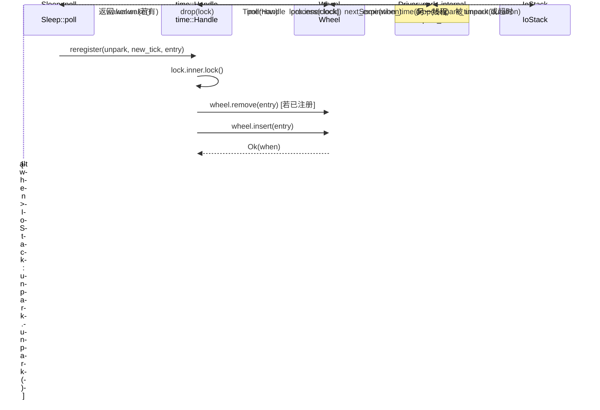

# 第 6 章：时间驱动：时间轮、Sleep 与超时如何被唤醒

上一章我们追踪了 TcpStream::read 的完整链路，看到 ScheduledIo 如何把 epoll 的 fd 就绪事件翻译成 Waker 唤醒。但异步运行时还需要处理另一类「就绪」：一个 sleep(100ms) 的 Future，在 100ms 后必须被唤醒。这类事件不来自内核 fd，而来自「时间本身」。Tokio 的设计选择是把时间也当作一种 I/O 事件：Driver 结构体里只有一个字段 park: IoStack，它复用了 I/O driver 的 park/unpark 机制。当时间轮算出「下一次到期时刻」时，driver 就调用 park_timeout 让线程睡到那个时刻；被唤醒后再从时间轮里取出到期条目、触发它们的 Waker。这样，调度器只需要一个统一的 park 入口，就能同时等待「fd 就绪」和「定时器到期」两类事件。本章要回答三个问题：定时器如何被插入时间轮？时间轮如何按到期时间分级？driver 如何计算下一次 park 的超时并触发到期任务？

# 一、时间轮：六层 64 槽的哈希分级结构

## 直觉模型

想象一个机械钟表：秒针转一圈带动分针，分针转一圈带动时针。如果只有一根秒针，要表示「12 天后」就得数 100 万格；而分层之后，秒针只管 64 秒内的精度，分针管 64 分钟，时针管 64 小时——每一层只需 64 个槽位，就能覆盖到 2 年之后。

若没有分层，插入一个远期定时器要么需要 O(N) 遍历，要么需要巨大的数组。时间轮用「按到期时间分级」把插入和触发都压到近似 O(1)。

## 内存布局与字段

`Wheel`的核心字段只有三个[FACT:tokio/src/runtime/time/wheel/mod.rs:22-40]：

```rust
pub(crate) struct Wheel {
    elapsed: u64,                          // 自 wheel 创建以来经过的毫秒数
    levels: Box,      // 6 层，每层 64 槽
    pending: LinkedList,      // 已到期、待触发的条目
}
```

`NUM_LEVELS = 6`，`BITS_PER_LEVEL = 6`（即每层 64 槽）[FACT:tokio/src/runtime/time/wheel/mod.rs:45-47]。`MAX_DURATION = 1 << (6 * 6) = 1 << 36`毫秒，约 2 年[FACT:tokio/src/runtime/time/wheel/mod.rs:50]。

六层的粒度按文档注释是[FACT:tokio/src/runtime/time/wheel/mod.rs:22-40]：

| 层 | 槽粒度 | 覆盖范围 |
| --- | --- | --- |
| 0 | 1 ms | 64 ms |
| 1 | 64 ms | ~4 s |
| 2 | ~4 s | ~4 min |
| 3 | ~4 min | ~4 hr |
| 4 | ~4 hr | ~12 day |
| 5 | ~12 day | ~2 yr |

`pending`是一个侵入式链表（`LinkedList<TimerShared>`），存放已经从轮中取出、等待触发 Waker 的条目。注意它是`LinkedList`而非`Vec`：条目本身内嵌在`TimerShared`里，插入/移除不需要分配。

## 场景驱动：插入一个 100ms 的 sleep

当`sleep(100ms)`首次被 poll 时，`Sleep::poll_elapsed`会构造`Timer::new`并调用`init` [FACT:tokio/src/time/sleep.rs:436-440]。`init`最终调用`Handle::reregister`，进而调用`Wheel::insert`。

`insert`的第一步是检查是否已过期[FACT:tokio/src/runtime/time/wheel/mod.rs:90-98]：

```rust
let when = unsafe { item.sync_when() };
if when  usize {
    const SLOT_MASK: u64 = (1 = MAX_DURATION {
        return NUM_LEVELS - 1;
    }
    masked.ilog2() as usize / BITS_PER_LEVEL
}
```

这里用`elapsed ^ when`而非`when - elapsed`，是一个精妙的技巧：XOR 的最高有效位反映了「两个时间戳从哪一位开始不同」，也就是「需要多粗的粒度才能区分它们」。`| SLOT_MASK`把低 6 位强制置 1，避免`ilog2`落在同一槽内时算出过小的层。`ilog2() / 6`把位宽映射到层号。如果 XOR 结果超过`MAX_DURATION`（即超过 2 年），就强制塞进最高层——这就是「fudge the timer into the top level」。

对于 100ms 的 sleep，假设`elapsed`接近 0，`when ≈ 100`，`elapsed ^ when ≈ 100`，`ilog2(100) = 6`，`6 / 6 = 1`, also fällt es in Ebene 1 (64ms Granularität). Das bedeutet, dass es in einem Slot von Ebene 1 wartet, bis die Zeit zur Grenze dieses Slots voranschreitet und es dann auf Ebene 0 abgesenkt wird.

## Hierarchisches Absinken: process_expiration

Wenn`poll(now)`die Zeit voranschreitet,`Wheel::poll`werden in einer Schleife aufgerufen`next_expiration`und`process_expiration` [FACT:tokio/src/runtime/time/wheel/mod.rs:142-166]：

```rust
pub(crate) fn poll(&mut self, now: u64) -> Option {
    loop {
        if let Some(handle) = self.pending.pop_back() {
            return Some(handle);
        }
        match self.next_expiration() {
            Some(ref expiration) if expiration.deadline  {
                self.process_expiration(expiration);
                self.set_elapsed(expiration.deadline);
            }
            _ => {
                self.set_elapsed(now);
                break;
            }
        }
    }
    self.pending.pop_back()
}
```

`process_expiration`ist dafür verantwortlich, die abgelaufenen Einträge einer Ebene auf die nächste Ebene „abzusenken" oder (auf Ebene 0) als pending zu markieren[FACT:tokio/src/runtime/time/wheel/mod.rs:218-251]：

```rust
let mut entries = self.take_entries(expiration);
while let Some(item) = entries.pop_back() {
    match unsafe { item.mark_pending(expiration.deadline) } {
        Ok(()) => {
            self.pending.push_front(item);   // 真正到期
        }
        Err(expiration_tick) => {
            let level = level_for(expiration.deadline, expiration_tick);
            unsafe { self.levels[level].add_entry(item); }  // 下沉到更低层
        }
    }
}
```

`mark_pending`ist entscheidend: Es prüft, ob die tatsächliche Deadline des Eintrags bereits erreicht ist. Wenn ja, wird zurückgegeben`Ok(())`, der Eintrag gelangt in`pending`verkettete Liste; wenn noch nicht (nur die Grenze des Slots wurde erreicht), wird zurückgegeben`Err(expiration_tick)`, der Eintrag wird erneut in eine feinere Ebene eingefügt.

Beachten Sie den in den Kommentaren hervorgehobenen Punkt[FACT:tokio/src/runtime/time/wheel/mod.rs:219-228]: Es müssen zuerst alle Einträge des gesamten Slots entnommen werden, bevor sie verarbeitet werden, da einige Einträge möglicherweise erneut in denselben Slot eingefügt werden (was passiert, wenn die Einfügezeit überschritten wird`MAX_DURATION`, kommt es zu einem Überlauf). Wenn man während des Entnehmens einfügt, kann man in eine Endlosschleife geraten.

## Berechnung des nächsten Ablaufzeitpunkts

`next_expiration`Von niedriger Ebene zu hoher Ebene scannen und den ersten nicht-leeren Ablaufpunkt zurückgeben[FACT:tokio/src/runtime/time/wheel/mod.rs:169-191]：

```rust
fn next_expiration(&self) -> Option {
    if !self.pending.is_empty() {
        return Some(Expiration { level: 0, slot: 0, deadline: self.elapsed });
    }
    for (level_num, level) in self.levels.iter().enumerate() {
        if let Some(expiration) = level.next_expiration(self.elapsed) {
            debug_assert!(self.no_expirations_before(level_num + 1, expiration.deadline));
            return Some(expiration);
        }
    }
    None
}
```

Wenn`pending`nicht leer ist, bedeutet dies, dass abgelaufene Einträge zum Auslösen anstehen, und es wird sofort der aktuelle zurückgegeben`elapsed`als Deadline (so wird der Driver mit 0 Timeout geparkt und kommt sofort zurück zur Verarbeitung). Andernfalls wird Ebene für Ebene gescannt und die Deadline des ersten Slots mit Inhalt zurückgegeben.`debug_assert`validiert eine Invariante: Eine höhere Ebene kann keinen früheren Ablaufpunkt haben als die aktuelle Ebene.

```mermaid
flowchart TD
    start["Wheel::poll(now)"] --> check_pending{"pending 非空?"}
    check_pending -->|是| pop["pop_back 返回 TimerHandle"]
    check_pending -->|否| next_exp{"next_expiration() 有到期点?"}
    next_exp -->|无| set_elapsed["set_elapsed(now) 后 break"]
    next_exp -->|有| cmp{"expiration.deadline |否| set_elapsed
    cmp -->|是| proc["process_expiration(expiration)"]
    proc --> take["take_entries 取出整槽"]
    take --> mark{"item.mark_pending()"}
    mark -->|Ok 已到期| push_pending["pending.push_front(item)"]
    mark -->|Err 未到期| reinsert["level_for 后 add_entry 下沉"]
    push_pending --> set_elapsed2["set_elapsed(expiration.deadline)"]
    reinsert --> set_elapsed2
    set_elapsed2 --> check_pending
    set_elapsed --> pop2["pending.pop_back() 返回"]
```

---

# Zwei, die Park-Schleife des Drivers: Das Zeitrad an den I/O-Stack anschließen

## Intuitives Modell

Das Zeitrad selbst „läuft nicht von allein". Es benötigt eine externe Schleife, die es wiederholt fragt: „Wann ist der nächste Ablaufzeitpunkt?" Dann schläft sie bis zu diesem Zeitpunkt und treibt nach dem Aufwachen die Zeit voran. Diese Schleife ist`Driver::park_internal`. Sie übersetzt „den nächsten Ablaufzeitpunkt des Zeitrads" in eine`park_timeout`Dauer und übergibt sie an den zugrunde liegenden I/O-Stack zum Schlafen.

Ohne diese Schleife würden Timer niemals ausgelöst – das Zeitrad ist nur eine statische Datenstruktur und benötigt jemanden, der es „antreibt".

## Datenstruktur: Driver und InnerState

`Driver`hat nur ein Feld`park: IoStack` [FACT:tokio/src/runtime/time/mod.rs:90-93]. Der eigentliche Zustand befindet sich in`Handle`, unterschieden durch`Inner`Enum zwischen traditioneller Implementierung und experimenteller Implementierung[FACT:tokio/src/runtime/time/mod.rs:95-127]. Die traditionelle Implementierung von`InnerState`enthält zwei Felder[FACT:tokio/src/runtime/time/mod.rs:130-136]：

```rust
struct InnerState {
    next_wake: Option,   // 承诺的最早唤醒时刻
    wheel: wheel::Wheel,
}
```

`next_wake`verwendet`NonZeroU64`statt`Option<u64>`Verschachtelung, um die Niche-Optimierung zu nutzen –`Option<NonZeroU64>`und`u64`sind gleich groß. Es zeichnet auf, „bis zu welchem Tick der Driver verspricht aufzuwachen", verwendet für`reregister`zur Beurteilung, ob`unpark`。

`is_shutdown`benötigt wird. Ist ein unabhängiges`AtomicBool`, die Kommentare erklären, warum es aus dem Mutex herausgetrennt wurde[FACT:tokio/src/runtime/time/mod.rs:90-93]：`Handle`muss ohne Sperren des Mutex geprüft werden`is_shutdown`. Dies ist eine typische „viel Lesen, wenig Schreiben"-Optimierung – Shutdown tritt nur einmal auf, aber die Prüfung kann häufig sein.

## Szenario-getrieben: Der vollständige Ablauf eines Park-Vorgangs

`park_internal`ist der Kern[FACT:tokio/src/runtime/time/mod.rs:213-256]：

```rust
fn park_internal(&mut self, rt_handle: &driver::Handle, limit: Option) {
    let handle = rt_handle.time();
    let mut lock = handle.inner.lock();
    assert!(!handle.is_shutdown());

    let next_wake = lock.wheel.next_expiration_time();
    lock.next_wake = next_wake.map(|t| NonZeroU64::new(t).unwrap_or_else(|| NonZeroU64::new(1).unwrap()));
    drop(lock);

    match next_wake {
        Some(when) => {
            let now = handle.time_source.now(rt_handle.clock());
            let mut duration = handle.time_source.tick_to_duration(when.saturating_sub(now));
            if duration > Duration::from_millis(0) {
                if let Some(limit) = limit {
                    duration = std::cmp::min(limit, duration);
                }
                self.park_thread_timeout(rt_handle, duration);
            } else {
                self.park.park_timeout(rt_handle, Duration::from_secs(0));
            }
        }
        None => {
            if let Some(duration) = limit {
                self.park_thread_timeout(rt_handle, duration);
            } else {
                self.park.park(rt_handle);
            }
        }
    }

    handle.process(rt_handle.clock());
}
```

Schrittweise Analyse:

1. **Lock nehmen, nächsten Ablaufzeitpunkt lesen**：`lock.wheel.next_expiration_time()`gibt zurück`Option<u64>`, d.h. den nächsten Ablauf-Tick. Gleichzeitig wird er in`lock.next_wake`geschrieben, für`reregister`zur Beurteilung, ob ein Unpark nötig ist.

2. **Lock freigeben**：`drop(lock)`muss vor dem Parken erfolgen, sonst können andere Threads während des Parkens keine Timer einfügen.

3. **Park-Dauer berechnen**：`when.saturating_sub(now)`ergibt die verbleibende Tick-Anzahl,`tick_to_duration`umgerechnet in`Duration`. Die Kommentare weisen darauf hin, dass hier tatsächlich auf 1ms aufgerundet wird[FACT:tokio/src/runtime/time/mod.rs:228-230], um zu vermeiden, dass Mikrosekunden-Sleeps vom OS als Nulllänge behandelt werden.

4. **Limit behandeln**: Wenn der Aufrufer`limit`übergeben hat (z.B.`park_timeout`explizites Timeout), wird`min(limit, duration)`genommen, um sicherzustellen, dass nicht übermäßig geschlafen wird.

5. **Sonderfall**: Wenn`duration == 0`(bereits abgelaufen), wird mit`park_timeout(0)`sofort zurückgekehrt, ohne tatsächlich zu schlafen.

6. **Wenn keine Timer vorhanden**: Wenn`next_wake`gleich`None`ist, wird bei vorhandenem`limit`ein`park_thread_timeout(limit)`ausgeführt, andernfalls unendlich`park`。

7. **Nach dem Aufwachen verarbeiten**：`handle.process(clock)`treibt das Zeitrad voran und löst abgelaufene Einträge aus.

## process_at_time: Abgelaufene Einträge auslösen

`process`ruft auf`process_at_time` [FACT:tokio/src/runtime/time/mod.rs:296-337]：

```rust
pub(self) fn process_at_time(&self, mut now: u64) {
    let mut waker_list = WakeList::new();
    let mut lock = self.inner.lock();

    if now ) {
    let waker = unsafe {
        let mut lock = self.inner.lock();
        if unsafe { entry.as_ref().might_be_registered() } {
            lock.wheel.remove(entry);
        }
        let entry = entry.as_ref().handle();
        if self.is_shutdown() {
            unsafe { entry.fire(Err(crate::time::error::Error::shutdown())) }
        } else {
            entry.set_expiration(new_tick);
            match unsafe { lock.wheel.insert(entry) } {
                Ok(when) => {
                    if lock.next_wake.is_none_or(|next_wake| when  unsafe {
                    entry.fire(Ok(()))
                },
            }
        }
    };
    if let Some(waker) = waker {
        waker.wake();
    }
}
```

Schlüssellogik: Nach erfolgreichem Einfügen, wenn der neue Ablaufzeitpunkt früher als`next_wake`ist, wird`unpark.unpark()`aufgerufen, um den Driver aufzuwecken. Dies liegt daran, dass der Driver möglicherweise zu einem späteren Zeitpunkt schläft und vorzeitig aufgeweckt werden muss, um die Park-Dauer neu zu berechnen.

Beachten Sie, dass`unpark`unter**Halten des Locks**aufgerufen wird, während`waker.wake()`nach**Freigabe des Locks**aufgerufen wird. Die Kommentare erklären[FACT:tokio/src/runtime/time/mod.rs:441]: Das Lock muss vor dem Aufruf des Wakers freigegeben werden, um Deadlocks zu vermeiden. Aber`unpark`ist anders – es fügt nur ein Ereignis in epoll ein und ruft keinen Benutzercode auf, daher ist der Aufruf unter Halten des Locks sicher.



---

# Drei, Sleep und Timeout: Die benutzersichtbare API-Ebene

## Intuitives Modell

`Sleep`ist das Future, das der Benutzer direkt`.await`,`Timeout`ist ein Adapter, der ein anderes Future umschließt. Sie verwalten selbst kein Zeitrad, sondern übersetzen die „deadline" in einen Tick und delegieren an`Timer`und`Handle`。

## Speicherlayout von Sleep

`Sleep`verwendet`pin_project!`Makro definiert[FACT:tokio/src/time/sleep.rs:221-227]：

```rust
pub struct Sleep {
    deadline: Instant,
    driver: scheduler::Handle,
    inner: Inner,
    #[pin]
    timer: Option,
}
```

`timer`ist`Option<Timer>`und mit`#[pin]`: Vor dem ersten poll ist es`None`, erst beim ersten poll wird`Timer`erstellt und registriert. Diese „lazy initialization" vermeidet den Zugriff auf die Runtime zum Zeitpunkt des`sleep()`-Aufrufs——`sleep()`kann außerhalb der Runtime aufgerufen werden, solange die tatsächliche Registrierung erst bei`.await`erfolgt.

`PinnedDrop`Die Implementierung stellt sicher, dass der Timer beim Drop abgebrochen wird[FACT:tokio/src/time/sleep.rs:230-235]：

```rust
impl PinnedDrop for Sleep {
    fn drop(this: Pin) {
        let this = this.project();
        if let Some(timer) = this.timer.as_pin_mut() {
            timer.cancel(this.driver);
        }
    }
}
```

## Vollständiger Ablauf von poll_elapsed

`poll_elapsed`ist der Kern von`Sleep`[FACT:tokio/src/time/sleep.rs:396-454]：

```rust
fn poll_elapsed(self: Pin, cx: &mut task::Context) -> Poll> {
    ready!(crate::trace::trace_leaf());
    let mut this = self.project();

    // coop 预算
    let coop = ready!(crate::task::coop::poll_proceed(cx));

    let handle = this.driver;
    let timer = match this.timer.as_mut().as_pin_mut() {
        Some(timer) => timer,
        None => {
            let time_source = handle.driver().time().time_source();
            let deadline = time_source.deadline_to_tick(*this.deadline);
            let timer = Timer::new(handle, deadline);
            this.timer.set(Some(timer));
            let mut timer = this.timer.as_pin_mut().unwrap();
            timer.as_mut().init(handle, deadline);
            timer
        }
    };

    let result = timer.poll_elapsed(cx, handle).map(move |r| {
        coop.made_progress();
        r
    });
    result
}
```

Schritt für Schritt:

1. **coop-Budget-Prüfung**：`poll_proceed(cx)`verbraucht ein Kooperationsbudget. Wenn das Budget erschöpft ist, wird`Pending`zurückgegeben und die Ausführung abgegeben. Dies ist der Mechanismus von Tokio, um zu verhindern, dass eine einzelne Task andere Tasks aushungert.

2. **Lazy-Erstellung des Timers**: Wenn`timer`gleich`None`ist, wird`deadline`in einen Tick umgewandelt,`Timer`erstellt und`init`aufgerufen, um ihn im Zeitrad zu registrieren.

3. **Delegation an Timer::poll_elapsed**: Die tatsächliche Ablaufprüfung wird von`Timer`durchgeführt.

4. **Nach Erfolg wird der Fortschritt markiert**：`coop.made_progress()`zeigt an, dass dieser poll tatsächlichen Fortschritt gemacht hat.

## poll von Timeout: zuerst den Wert pollen, dann die Verzögerung pollen

`Timeout`Die poll-Reihenfolge von[FACT:tokio/src/time/timeout.rs:210-224]：

```rust
fn poll(self: Pin, cx: &mut task::Context) -> Poll {
    let me = self.project();
    let had_budget_before = coop::has_budget_remaining();

    // 先 poll 被包裹的 future
    if let Poll::Ready(v) = me.value.poll(cx) {
        return Poll::Ready(Ok(v));
    }

    match me.delay.as_pin_mut() {
        Some(delay) => poll_delay(had_budget_before, delay, cx).map(Err),
        None => Poll::Pending,
    }
}
```

Kopie[FACT:tokio/src/time/timeout.rs:24-26]Der Kommentar weist ausdrücklich darauf hin`Ok`: Das Future wird zuerst gepollt, danach wird das Timeout geprüft. Wenn das Future also fertig wird, ohne zu yielden, kann es auch nach Überschreiten des Timeouts noch

`poll_delay`zurückgeben. Dies ist eine Designentscheidung, kein Bug.[FACT:tokio/src/time/timeout.rs:229-251]：

```rust
fn poll_delay(had_budget_before: bool, delay: Pin, cx: &mut task::Context) -> Poll {
    let delay_poll = || match delay.poll(cx) {
        Poll::Ready(()) => Poll::Ready(Elapsed::new()),
        Poll::Pending => Poll::Pending,
    };

    let has_budget_now = coop::has_budget_remaining();

    if let (true, false) = (had_budget_before, has_budget_now) {
        // 如果预算是被底层 future 耗尽的，用无约束预算 poll delay
        coop::with_unconstrained(delay_poll)
    } else {
        delay_poll()
    }
}
```

Kopie`poll`Logik: Wenn beim Eintritt in`Pending`noch Budget vorhanden ist, aber nach dem Pollen des value das Budget erschöpft ist, bedeutet das, dass value das Budget verbraucht hat. Wenn zu diesem Zeitpunkt die Verzögerung mit eingeschränktem Budget gepollt würde, könnte die Verzögerung sofort`with_unconstrained`zurückgeben, sodass nie festgestellt werden könnte, ob das Timeout erreicht ist. Daher wird[FACT:tokio/src/time/timeout.rs:243-246]。

## verwendet, um die Budgetbeschränkung vorübergehend aufzuheben. Der Kommentar nennt dies „pathological cases"

`timeout`Deadline-Überlaufbehandlung von timeout`checked_add`Die Funktion verwendet[FACT:tokio/src/time/timeout.rs:86-99]：

```rust
Timeout {
    value: future.into_future(),
    delay: match Instant::now().checked_add(duration) {
        Some(deadline) => Some(Sleep::new_timeout(deadline, trace::caller_location())),
        None => None,
    },
}
```

Kopie`Instant::now() + duration`Wenn`delay`überläuft (duration extrem groß),`None`ist`Poll::Pending` [FACT:tokio/src/time/timeout.rs:222], und beim Pollen wird direkt

---

# zurückgegeben. Dies entspricht „niemals Timeout" und ist ein vernünftiges Degradationsverhalten.

**Designüberlegungen und Produktions-Fallstricke** `elapsed ^ when`Warum XOR statt Subtraktion zur Berechnung der Ebene?`when - elapsed`Das höchstwertige Bit von`elapsed`spiegelt direkt wider, „ab welchem Bit sich zwei Zeitstempel unterscheiden", und genau das ist das Maß für „wie grob die Granularität sein muss". Bei der Subtraktion`when`sind die hohen Bits alle 0, wenn`ilog2`nahe bei

**liegt, und** [FACT:tokio/src/runtime/time/mod.rs:301-309]würde eine zu kleine Ebene berechnen. XOR behandelt Überlaufszenarien von Natur aus.`Instant`Notwendigkeit des Schutzes vor Zeitrücklauf`Instant`: Rust garantiert`now = lock.wheel.elapsed()`Monotonie, aber das zugrunde liegende OS möglicherweise nicht. In einer Linux-VM auf einem Windows-Host vertraut std der Hardware-Uhr, was zu einem Rücklauf von`set_elapsed`führt. Tokio klemmt mit

**, um ein Fehlschlagen der assert von** [FACT:tokio/src/runtime/time/mod.rs:319]zu vermeiden.`Sleep::reset`Batch-Aufweckung und Deadlock`WakeList`: Das Aufrufen eines Wakers, während der Zeitrad-Lock gehalten wird, ist gefährlich——der Waker könnte eine erneute poll der Task auslösen, die dann

**`next_wake`aufruft und versucht, den Zeitrad-Lock erneut zu erwerben, was zu einem Deadlock führt.** [FACT:tokio/src/runtime/time/mod.rs:130-136]：`Option<NonZeroU64>`Der Batch-Mechanismus von`u64`gibt den Lock vorübergehend frei, wenn er voll ist, was das Standardmuster „Callback außerhalb des Locks" ist.`None`Nischen-Optimierung von`NonZeroU64::new(t).unwrap_or_else(|| NonZeroU64::new(1).unwrap())`[FACT:tokio/src/runtime/time/mod.rs:221]ist gleich groß wie

**`process_expiration`, weil 0 als Nische von** [FACT:tokio/src/runtime/time/wheel/mod.rs:219-228]verwendet wird. Aber Tick 0 ist ein gültiger Wert, daher verwendet der Code`MAX_DURATION`, um 0 auf 1 abzubilden

**`Timeout`. Dies ist eine subtile Grenzfallbehandlung: Tick 0 wird als Tick 1 behandelt, was höchstens zu einer zusätzlichen Aufweckung von 1 ms führt.** [FACT:tokio/src/time/timeout.rs:24-26]Das „erst entnehmen, dann verarbeiten" von`Ok`: Zuerst müssen alle Einträge des Slots entnommen und dann verarbeitet werden, weil Einträge, die`timeout`überschreiten, umlaufen und erneut in denselben Slot eingefügt werden. Wenn während des Entnehmens eingefügt würde, gäbe es eine Endlosschleife.

---

# Die poll-Reihenfolge-Falle von

: Das Future wird zuerst gepollt, nach dem Timeout wird geprüft. Wenn das Future CPU-intensiv ist und nicht yieldet, kann es auch nach Überschreiten des Timeouts noch

1. **zurückgeben. In der Produktion sollte man sich nicht darauf verlassen, dass**（`Wheel`nicht kooperative Futures zwangsweise unterbricht.`elapsed ^ when`Zusammenfassung dieses Kapitels`pending`Dieses Kapitel zerlegt die dreischichtige Struktur des Tokio-Zeittreibers:`process_expiration`Zeitrad

2. **Driver**（`Driver::park_internal`): eine hierarchische Hash-Struktur mit sechs Ebenen zu je 64 Slots, bei der die Bitbreite von`next_expiration_time`die Ebene eines Eintrags bestimmt; Einfügen und Auslösen sind annähernd O(1).`park_timeout`Die verkettete Liste speichert abgelaufene Einträge,`process_at_time`ist für das schrittweise Absinken verantwortlich.

3. **): übersetzt den**（`Sleep` / `Timeout`）：`Sleep`des Zeitrads in eine`Timer`-Dauer und verwendet das park/unpark des I/O-Stacks wieder.`Timeout`treibt nach dem Aufwecken das Zeitrad voran, löst Waker in Batches aus und behandelt Zeitrücklauf- und Deadlock-Schutz.`with_unconstrained`Benutzer-API

erstellt`next_wake`lazy und registriert es,`reregister`pollt zuerst value und dann delay und verwendet`unpark`zur Behandlung von Szenarien mit erschöpftem Budget.

Das Kerndesign ist „Zeit ist auch ein I/O-Ereignis": Der Driver hat nur einen park-Einstiegspunkt und wartet gleichzeitig auf fd-Bereitschaft und Timer-Ablauf.`Mutex`、`Semaphore`zeichnet den zugesagten Aufweckzeitpunkt auf,

# weckt den Driver beim Einfügen eines früheren Timers auf, um neu zu berechnen.

Im nächsten Kapitel gehen wir zu den Synchronisationsprimitiven über:`Wheel::insert`und wie Kanäle asynchrones Warten implementieren. Du wirst sehen, wie sie den Waker-Mechanismus dieses Kapitels wiederverwenden und wie „Permit-Zählung" und „Warteschlange" zusammenarbeiten.`if when <= self.elapsed`Denkanstöße und Selbsttest dieses Kapitels`if when < self.elapsed`(Gleichheitszeichen entfernen), in welchen Szenarien führt dies dazu, dass der Timer niemals ausgelöst wird?

**Referenzanalyse**：`when == self.elapsed`bedeutet, dass der Ablaufzeitpunkt des Timers genau dem aktuell fortgeschrittenen Zeitpunkt entspricht. Der ursprüngliche Code verwendet`<=`um es als`Elapsed`zu beurteilen, der Aufrufer löst sofort[FACT:tokio/src/runtime/time/wheel/mod.rs:96-98]aus. Wenn man es in`<`ändert, wird dieser Eintrag in die von`level_for(elapsed, when)`berechnete Ebene eingefügt. Da`elapsed ^ when == 0`，`masked = 0 | SLOT_MASK = 63`，`ilog2(63) = 5`，`5 / 6 = 0`, fällt er in Ebene 0. Aber der`next_expiration`von Ebene 0 gibt einen`deadline >= elapsed`-Slot zurück, und die Bedingung von`Wheel::poll`ist`expiration.deadline <= now`. Wenn`now == elapsed`, ist die Bedingung erfüllt,`process_expiration`entnimmt den Eintrag,`mark_pending(elapsed)`prüft, ob die tatsächliche Deadline erreicht ist – zu diesem Zeitpunkt gibt`when == elapsed`，`mark_pending``Ok`zurück, der Eintrag geht in pending über. Also wird er tatsächlich immer noch ausgelöst, nur mit einem zusätzlichen Umweg. Das eigentliche Risiko besteht darin: Wenn`elapsed`bereits über`when`hinaus fortgeschritten ist (`when < elapsed`), gibt der ursprüngliche Code`Elapsed`zurück und löst sofort aus, nach der Änderung wird er in einen bereits vergangenen Slot eingefügt,`next_expiration`könnte`deadline < elapsed`，`set_elapsed`zurückgeben, der assert`elapsed <= when`schlägt fehl und panic[FACT:tokio/src/runtime/time/wheel/mod.rs:253-264]. Daher ist dieses Gleichheitszeichen die entscheidende Grenze, um ein Fehlschlagen des assert zu verhindern.

Q2: `process_at_time`In`WakeList`, warum muss man, nachdem`drop(lock)`voll ist,`wake_all()`erneut`lock`und dann neu

**? Wenn man diesen drop entfernt, in welchen Nebenläufigkeitsszenarien kommt es zum Deadlock?**：`WakeList`Referenzanalyse[FACT:tokio/src/runtime/time/mod.rs:318-325]sammelt Waker, und wenn voll, muss eine Charge aufgeweckt werden, um Platz zu schaffen`self.inner.lock()`. Wenn man`waker.wake()`hält und`Sleep::reset`aufruft, könnte die aufgeweckte Aufgabe sofort auf einem anderen Thread (oder dem Scheduler desselben Threads) laufen, ruft`Sleep::poll_elapsed`oder`Handle::reregister`auf, und ruft dann`reregister`auf, und das Erste, was`self.inner.lock()` [FACT:tokio/src/runtime/time/mod.rs:405]tut, ist`std::sync::Mutex`. Da`process_at_time`nicht reentrant ist, kommt es auf demselben Thread zum Deadlock; selbst auf verschiedenen Threads blockiert es, bis`process_at_time`die Sperre freigibt, während`wake_all`darauf wartet, dass[FACT:tokio/src/runtime/time/mod.rs:319]zurückkehrt, was zu zirkulärem Warten führt. Der Kommentar sagt ausdrücklich: „To avoid deadlock, we must do this with the lock temporarily dropped“`while let Some(entry) = lock.wheel.poll(now)`. Wenn man nach dem drop erneut lockt, könnte der Zustand des Zeitrads bereits von anderen Threads geändert worden sein (z. B. ein neuer Timer eingefügt), daher

Q3: `Timeout::poll`weiterhin Einträge aus dem neuen Zustand entnimmt, was sicher ist.`had_budget_before`In`has_budget_now`, warum wird die Kombinationsprüfung`(true, false)`von`with_unconstrained`und`(false, true)`nur verwendet, wenn „beim Eintritt Budget vorhanden war, nach dem Pollen des value kein Budget mehr“? Was passiert, wenn man es umgekehrt macht

**?**：`had_budget_before`Referenzanalyse[FACT:tokio/src/time/timeout.rs:208-208]，`has_budget_now`zeichnet[FACT:tokio/src/time/timeout.rs:239]。`(true, false)`vor dem Pollen des value auf,`poll_proceed`zeichnet`Pending`nach dem Pollen des value auf.`with_unconstrained`bedeutet, dass das Budget während des Pollens des value aufgebraucht wurde, was zeigt, dass value ein „Budgetverbraucher“ ist. Wenn man zu diesem Zeitpunkt den delay mit eingeschränktem Budget pollt,[FACT:tokio/src/time/timeout.rs:247]。`(false, true)`gibt sofort`with_unconstrained`zurück, der delay wird niemals wirklich geprüft, die Timeout-Beurteilung wird ungültig. Daher verwendet man`(false, false)`, um die Einschränkung vorübergehend aufzuheben.`Pending`kann nicht auftreten – das Budget kann nur verbraucht, nicht wiederhergestellt werden (außer durch explizites`poll_proceed`, aber das gibt es hier nicht).`(true, true)`bedeutet, dass beim Eintritt kein Budget vorhanden war, zu diesem Zeitpunkt könnte das Pollen des value bereits

zurückgegeben haben (weil
