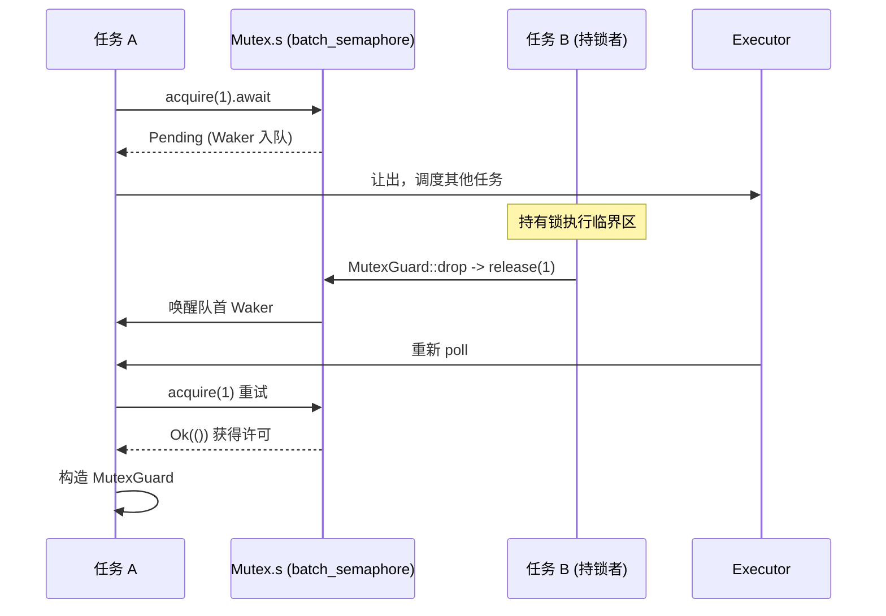

# ← Vorheriges Kapitel: Kapitel 5

Zugehöriges Projekt: tokio-rs/tokio

# Fortschritt des Buches: Kapitel 7 / 14

## Verifikationsstatus: FACT-Zeilennummern echt verankert

`std::sync::Mutex`Das vorherige Kapitel hat gezeigt, wie Zeit als eine Art I/O-Ereignis abstrahiert wird, sodass Timer und fd-Bereitschaft denselben park/unpark-Warteeingang teilen. Wenn jedoch mehrere Aufgaben um dieselbe Sperre konkurrieren oder Nachrichten über Kanäle austauschen, ist das Objekt des Wartens nicht mehr ein fd oder eine Uhr, sondern die Zustandsänderung einer anderen Aufgabe. Dieses Kapitel betritt die tokio::sync-Familie und untersucht, wo ein lock().await oder recv().await beim Blockieren tatsächlich den Waker speichert und wie er beim Aufwecken neu eingeplant wird.`lock()`Warum der asynchrone Mutex nicht die std-Implementierung wiederverwenden kann**Intuitives Modell: Von „den Platz besetzen“ zu „den Sitzplatz freigeben“**Das**von**blockiert den aktuellen Thread, wenn die Sperre belegt ist`Pending`– der Thread wird vom Betriebssystem angehalten, bis die Sperre freigegeben wird. In einer asynchronen Laufzeit ist das katastrophal: Ein Worker-Thread kann gleichzeitig Hunderte oder Tausende von Aufgaben antreiben; wenn er wegen des Wartens auf eine Sperre blockiert, stehen alle anderen von ihm getragenen Aufgaben still. Das Kernanliegen des asynchronen Mutex ist: beim Warten auf die Sperre

den Thread freigeben`Mutex`, die Tatsache „ich warte auf diese Sperre“ in eine Warteschlange eintragen und dann**Vollständig auf Semaphoren aufgebaut**。

## Datenstruktur und Speicherlayout

`Mutex<T>`Die Felder von sind minimalistisch:

[FACT:tokio/src/sync/mutex.rs:133-138]

```rust
pub struct Mutex {
    #[cfg(all(tokio_unstable, feature = "tracing"))]
    resource_span: tracing::Span,
    s: semaphore::Semaphore,
    c: UnsafeCell,
}
```

Die drei Felder erfüllen jeweils ihren Zweck:`s`ist ein**Semaphore mit einer Genehmigungsanzahl von 1**，`c`ist`UnsafeCell<T>`die geschützten Daten, die umschlossen werden. Beachten Sie, dass hier`semaphore`ein Alias für`batch_semaphore`ist[FACT:tokio/src/sync/mutex.rs:3-3], also die zugrunde liegende Implementierung, nicht die öffentliche Kapselung`sync::Semaphore`.

`MutexGuard<'a, T>`hält lediglich eine Referenz auf`Mutex`:

[FACT:tokio/src/sync/mutex.rs:151-157]

```rust
pub struct MutexGuard {
    #[cfg(all(tokio_unstable, feature = "tracing"))]
    resource_span: tracing::Span,
    lock: &'a Mutex,
}
```

Hier gibt es ein entscheidendes Design:`MutexGuard` **hält kein Semaphore-Genehmigungsobjekt**, sondern nur`&Mutex`. Die Freigabe der Sperre erfolgt in`Drop`, indem direkt`self.lock.s.release(1)` [FACT:tokio/src/sync/mutex.rs:959-961]aufgerufen wird. Dies unterscheidet sich von`SemaphorePermit`, das`permits: usize`Zähler hält und diese bei Drop zurückgibt – die Genehmigungsanzahl von Mutex ist konstant 1, es ist kein Zähler nötig.

`Send`/`Sync`Die Grenzen von sind es wert, separat betrachtet zu werden:

[FACT:tokio/src/sync/mutex.rs:258-259]

```rust
unsafe impl Send for Mutex where T: ?Sized + Send {}
unsafe impl Sync for Mutex where T: ?Sized + Send {}
```

`Sync`erfordert nur`T: Send`und nicht`T: Sync`– das ist sinnvoll, da gegenseitiger Ausschluss garantiert, dass nur ein Thread gleichzeitig auf`T`zugreifen kann. Die Übertragung der Eigentümerschaft von`T`über Threads hinweg (`Send`) reicht aus, es ist nicht nötig, dass`T`selbst geteilt werden kann (`Sync`). Genau das ist der Grund, warum`Mutex<T>`ein nicht-`Sync`-`T`in ein`Sync`verwandeln kann.

## Schritt für Schritt: Die vollständige Reise eines`lock().await`

Szenario: Aufgabe A ruft`mutex.lock().await`auf, die Sperre ist zu diesem Zeitpunkt frei.

Erster Schritt:`lock()`konstruiert einen async-Block, der intern zuerst`self.acquire().await`ausführt und nach Erfolg`MutexGuard` [FACT:tokio/src/sync/mutex.rs:434-443]。

konstruiert. Zweiter Schritt:`acquire()`delegiert direkt an die Semaphore:

[FACT:tokio/src/sync/mutex.rs:655-663]

```rust
async fn acquire(&self) {
    crate::trace::async_trace_leaf().await;
    self.s.acquire(1).await.unwrap_or_else(|_| {
        unreachable!()
    });
}
```

`unwrap_or_else(|_| unreachable!())`Diese Zeile Kommentar offenbart die Design-Einschränkung: Mutex schließt die Semaphore niemals explizit und hält sie exklusiv, daher wird`acquire`niemals`Err`zurückgeben. Dies schließt den Fehlerpfad „Semaphore geschlossen" auf Typebene aus.

Dritter Schritt: Wenn die Sperre belegt ist,`s.acquire(1)`gibt`Pending`zurück, der Waker der aktuellen Aufgabe wird in die Warteschlange der Semaphore eingetragen.**Wo wird der Waker gespeichert?**Die Antwort liegt in der Warteschlange von`batch_semaphore`(das Quellmaterial dieses Kapitels führt diese Datei nicht weiter aus, aber ihre Rolle ist: Jeder Wartende hält einen Waker und wird in FIFO-Reihenfolge eingereiht).

Vierter Schritt: Wenn Aufgabe B, die die Sperre hält, diese freigibt,`MutexGuard::drop`ruft`s.release(1)` [FACT:tokio/src/sync/mutex.rs:965-975]auf, die Semaphore übergibt die Genehmigung an den ersten Wartenden in der Schlange und weckt dessen Waker, Aufgabe A wird neu geplant,`acquire`gibt`Ok`zurück und konstruiert`MutexGuard`。

Der gesamte Ablauf lässt sich mit dem folgenden Sequenzdiagramm darstellen:



## Designüberlegungen: FIFO-Fairness und Abbruchsicherheit

Die Dokumentation erklärt ausdrücklich, dass Tokios Mutex FIFO[FACT:tokio/src/sync/mutex.rs:20-22]garantiert. Diese Fairness stammt aus der Warteschlangensemantik der zugrunde liegenden Semaphore. Der Preis der Fairness ist: Wenn ein`lock`abgebrochen wird (z. B. bei einer Niederlage in`select!`), verlieren Sie**Ihren Platz in der Warteschlange** [FACT:tokio/src/sync/mutex.rs:415-419]. Das ist kein Bug, sondern eine Notwendigkeit der FIFO-Warteschlange – ein Abbruch bedeutet Entfernung aus der Warteschlange, ein erneutes`lock`erfordert ein erneutes Einreihen.

Ein weiteres kontraintuitives Design ist**keine Vergiftung**（no poisoning）。`std::sync::Mutex`wird bei einem Panic des sperrenden Threads als poisoned markiert, nachfolgende`lock`geben`Err`zurück. Tokios Mutex macht das nicht: Bei einem Panic des Sperrenden wird die Sperre normal freigegeben[FACT:tokio/src/sync/mutex.rs:122-125]. Die Dokumentation warnt, dass die geschützten Daten in einem inkonsistenten Zustand sein können, wenn der Panic abgefangen wird. Dies ist ein pragmatischer Kompromiss im asynchronen Kontext – ein Panic in einer asynchronen Aufgabe bedeutet normalerweise das Ende der Aufgabe, und der Vergiftungsmechanismus würde nur Komplexität hinzufügen.

`MutexGuard::map`Die`MutexGuard<T>`-Methodenfamilie ist erwähnenswert. Sie ermöglicht es, ein ganzes`MappedMutexGuard<U>`in ein`data`herabzustufen, das nur ein bestimmtes Unterfeld schützt. In der Implementierung wird zuerst per Closure der Zeiger auf das Unterfeld`skip_drop`berechnet, dann über`MutexGuardInner`der ursprüngliche Guard in ein[FACT:tokio/src/sync/mutex.rs:869-883]。`skip_drop`zerlegt, das kein Drop auslöst, und schließlich ein neuer Guard konstruiert`ManuallyDrop` + `ptr::read`. Mit`Drop`wird die Feld-Eigentümerschaft übertragen, um zu vermeiden, dass[FACT:tokio/src/sync/mutex.rs:827-836]zweimal aufgerufen wird. Dies ist eine klassische Technik in Rust, um „Eigentümerschaft zu übertragen, ohne den Destruktor auszulösen".

# Semaphore: Wie Genehmigungszähler und Warteschlange Backpressure implementieren

## Intuitives Modell: Parkplätze auf einem Parkplatz

Eine Semaphore ist wie ein Parkplatz:`acquire`ist die Einfahrt, bei freiem Platz wird eingefahren, sonst wird am Eingang gewartet;`release`ist die Ausfahrt, ein frei werdender Platz benachrichtigt das erste wartende Auto einzufahren. Die Genehmigungsanzahl ist die Gesamtzahl der Parkplätze,`acquire_many(n)`ist ein großes Auto, das n Parkplätze belegt.

## Datenstruktur und Speicherlayout

Die öffentliche`Semaphore`ist nur eine dünne Kapselung der zugrunde liegenden`batch_semaphore::Semaphore`:

[FACT:tokio/src/sync/semaphore.rs:427-432]

```rust
pub struct Semaphore {
    ll_sem: ll::Semaphore,
    #[cfg(all(tokio_unstable, feature = "tracing"))]
    resource_span: tracing::Span,
}
```

`SemaphorePermit<'a>`hält eine Semaphore-Referenz und einen Genehmigungszähler:

[FACT:tokio/src/sync/semaphore.rs:442-445]

```rust
pub struct SemaphorePermit {
    sem: &'a Semaphore,
    permits: usize,
}
```

`permits`Das Feld ist der Schlüssel zum Verständnis von`forget`/`merge`/`split`.`forget`setzt`permits`auf null[FACT:tokio/src/sync/semaphore.rs:1193-1195], sodass bei Drop 0 Genehmigungen zurückgegeben werden – äquivalent zu „permanentem Verbrauch" dieser Genehmigungen.`split`schneidet n Genehmigungen aus den aktuellen Genehmigungen für das neue Permit ab[FACT:tokio/src/sync/semaphore.rs:1260-1271]。`merge`führt den Zähler eines anderen Permits zusammen und stellt sicher, dass beide von derselben Semaphore stammen[FACT:tokio/src/sync/semaphore.rs:1230-1240]。

> **[Design Inference & Architectural Trade-offs]**
> `MAX_PERMITS`ist`usize::MAX >> 3` [FACT:tokio/src/sync/semaphore.rs:476-479]. Warum um 3 Bits nach rechts verschieben? Die zugrunde liegende`batch_semaphore`muss Statusflags (wie das Geschlossen-Flag) in den höheren Bits kodieren, daher wird die Anzahl der verfügbaren Genehmigungen auf die niedrigen Bits beschränkt, um die hohen Bits für Flags freizuhalten. Dies ist eine gängige Technik, um „Zähler + Status" in ein einzelnes`usize`zu packen.

## Schritt für Schritt: Genehmigungsfluss von acquire und release

Szenario: Semaphore startet mit 2 Genehmigungen, Aufgabe A`acquire()`, Aufgabe B`acquire_many(2)`。

`acquire()`delegiert an`ll_sem.acquire(1)`, nach Erfolg wird`SemaphorePermit { permits: 1 }` [FACT:tokio/src/sync/semaphore.rs:614-631]。`acquire_many(2)`konstruiert. Ähnlich, aber mit Übergabe von 2[FACT:tokio/src/sync/semaphore.rs:661-679]。

Wenn Genehmigungen nicht ausreichen,`ll_sem.acquire(n)`gibt`Pending`zurück, der Waker wird eingereiht. Hier gibt es ein Fairness-Detail: Die Dokumentation weist darauf hin, dass, wenn der erste in der Schlange ein`acquire_many(5)`ist und aktuell nur noch 3 Genehmigungen übrig sind, selbst wenn dahinter ein`acquire(1)`sofort erfüllt werden könnte, dieser warten muss – weil das große Auto an der Spitze die Schlange blockiert[FACT:tokio/src/sync/semaphore.rs:19-24]. Dies ist der Preis strikter FIFO, der Hunger vermeidet.

Der Freigabepfad liegt in Drop:

[FACT:tokio/src/sync/semaphore.rs:1402-1404]

```rust
impl Drop for SemaphorePermit {
    fn drop(&mut self) {
        self.sem.add_permits(self.permits);
    }
}
```

`add_permits`delegiert an`ll_sem.release(n)` [FACT:tokio/src/sync/semaphore.rs:568-570], die zugrunde liegende Implementierung gibt die Genehmigung an die Warteschlange zurück und weckt Wartende, die genügend Genehmigungen ansammeln können.

Bezüglich der Speicherordnung gibt die Dokumentation eine starke Garantie: acquire, release und close sind alle`AcqRel`-Operationen, total geordnet zueinander, äquivalent zu denen auf einer einzelnen atomaren Variable`AcqRel` [FACT:tokio/src/sync/semaphore.rs:35-42]. Das bedeutet, dass Schreibvorgänge, die „zuerst Daten schreiben und dann die Berechtigung freigeben“, für Aufgaben sichtbar sind, die „danach die Berechtigung erwerben“ – Semaphore können sicher Daten zwischen Aufgaben übertragen.

## Designüberlegungen: close und Backpressure

`close()`Lässt alle Wartenden empfangen`AcquireError`, und nachfolgende`try_acquire`geben zurück`Closed` [FACT:tokio/src/sync/semaphore.rs:1161-1163]. Dies ist die Grundlage für elegantes Herunterfahren: Wenn die Empfängerseite keine Daten mehr benötigt, kann das close-Semaphor alle blockierten Sender sofort mit einem Fehler zurückkehren lassen, anstatt ewig zu warten.

Das Wesen der Backpressure zeigt sich am deutlichsten in mpsc. Im nächsten Abschnitt wird deutlich, dass die Kapazitätssteuerung von mpsc durch ein Semaphor implementiert wird, dessen Anzahl an Berechtigungen der Puffergröße entspricht.

# Die Kanal-Familie: Unterschiedliche Kompromisse bei Warteschlangen und Waker-Aufweckung

## Intuitives Modell: Vier Kanäle, vier Wartestrategien

`oneshot`ist ein „Einmal-Umschlag“ – es kann nur ein einziges Mal gesendet werden, der Sender wartet nicht (`send`ist synchron), der Empfänger`await`wartet auf die Nachricht.`mpsc`ist ein „begrenztes Förderband“ – der Sender wartet, wenn das Förderband voll ist, der Empfänger wartet, wenn es leer ist, die Kapazität wird durch ein Semaphor gesteuert.`broadcast`und`watch`sind „Rundruf-Lautsprecher“ – ein Sender, mehrere Empfänger, aber beide gehen mit „Zurückbleiben“ völlig unterschiedlich um.

Der Quellcode dieses Abschnitts konzentriert sich auf`oneshot`und`mpsc::bounded`, wir zerlegen sie einzeln.

## oneshot: Minimaler Handshake mit Zustandsbits kodiert

`oneshot`Die`Inner`-Struktur ist der Kern zum Verständnis des Designs:

[FACT:tokio/src/sync/oneshot.rs:386-409]

```rust
struct Inner {
    state: AtomicUsize,
    value: UnsafeCell>,
    tx_task: Task,
    rx_task: Task,
}
```

`state`ist ein`AtomicUsize`, das den gesamten Zustand des Kanals mit Bitflags kodiert. Die vier Flags sind am Ende der Datei definiert:

[FACT:tokio/src/sync/oneshot.rs:1488-1505]

```rust
const RX_TASK_SET: usize = 0b00001;
const VALUE_SENT: usize = 0b00010;
const CLOSED: usize = 0b00100;
const TX_TASK_SET: usize = 0b01000;
```

`value`ist`UnsafeCell<Option<T>>`，`tx_task`und`rx_task`sind`Task`-Typen, intern`UnsafeCell<MaybeUninit<Waker>>` [FACT:tokio/src/sync/oneshot.rs:411-411]. Beachten Sie`MaybeUninit`– der Waker ist möglicherweise nicht initialisiert, ob er gültig ist, wird durch das`state`-Bit in`RX_TASK_SET`/`TX_TASK_SET`entschieden[FACT:tokio/src/sync/oneshot.rs:396-399]。

**Die Essenz dieses Designs**：`VALUE_SENT`Das Bit zeigt nicht nur „Wert wurde gesendet“ an, sondern bestimmt auch, wem der Zugriff auf`UnsafeCell`gehört. Der Kommentar ist sehr klar[FACT:tokio/src/sync/oneshot.rs:1491-1496]: Wenn`VALUE_SENT`gesetzt ist,`UnsafeCell`kann nur vom Empfänger zugegriffen werden; wenn nicht gesetzt, nur vom Sender. So wird mit einem einzigen atomaren Bit eine lockere Eigentumsübertragung erreicht, ohne zusätzliche Sperren.

`send`Der Ablauf von

[FACT:tokio/src/sync/oneshot.rs:622-646]

```rust
pub fn send(mut self, t: T) -> Result {
    let inner = self.inner.take().unwrap();
    inner.value.with_mut(|ptr| unsafe {
        *ptr = Some(t);
    });
    if !inner.complete() {
        unsafe {
            return Err(inner.consume_value().unwrap());
        }
    }
    Ok(())
}
```

Zuerst wird der Wert in`UnsafeCell`geschrieben (zu diesem Zeitpunkt ist`VALUE_SENT`nicht gesetzt, der Empfänger greift nicht zu), dann wird`complete()`aufgerufen, um zu versuchen,`VALUE_SENT`。`complete()`zu setzen. Es ist eine CAS-Schleife:

[FACT:tokio/src/sync/oneshot.rs:1516-1549]

```rust
fn set_complete(cell: &AtomicUsize) -> State {
    let mut state = cell.load(Ordering::Relaxed);
    loop {
        if State(state).is_closed() {
            break;
        }
        match cell.compare_exchange_weak(
            state, state | VALUE_SENT, Ordering::AcqRel, Ordering::Acquire,
        ) {
            Ok(_) => break,
            Err(actual) => state = actual,
        }
    }
    State(state)
}
```

Warum CAS statt eines einfachen`fetch_or`? Der Kommentar erklärt es klar[FACT:tokio/src/sync/oneshot.rs:1517-1529]: Wenn der Kanal bereits`CLOSED`, dann**darf**nicht`VALUE_SENT`erneut gesetzt werden. Denn sobald es gesetzt ist, geht der Empfänger davon aus, dass auf`UnsafeCell`zugegriffen werden kann, während der Sender gerade dabei ist, den Wert zurückzunehmen (`consume_value`), und gleichzeitiger Zugriff von beiden Seiten würde zu einem Datenrennen führen. Daher bricht die CAS-Schleife vorzeitig ab, wenn`CLOSED`entdeckt wird, und setzt nicht.

`complete()`Nach der Rückkehr von`RX_TASK_SET`, wenn erfolgreich gesetzt und

[FACT:tokio/src/sync/oneshot.rs:1300-1315]

```rust
fn complete(&self) -> bool {
    let prev = State::set_complete(&self.state);
    if prev.is_closed() {
        return false;
    }
    if prev.is_rx_task_set() {
        unsafe {
            self.rx_task.with_task(Waker::wake_by_ref);
        }
    }
    true
}
```

Kopieren`poll_recv`Der

[FACT:tokio/src/sync/oneshot.rs:1317-1384]

des Empfängers ist der Kern der Zustandsmaschine:`is_complete()`Er lädt zuerst den Zustand, wenn`consume_value`dann direkt`is_closed()`zurückgeben; wenn`Err`gibt`is_rx_task_set()`zurück; andernfalls wird der Zweig „Waker registrieren“ betreten. Bei der Registrierung wird zuerst`will_wake`geprüft, wenn bereits gesetzt und`is_complete()`feststellt, dass es derselbe Waker ist, wird nicht erneut gesetzt; wenn unterschiedlich, wird zuerst unset und dann set. Hier gibt es eine subtile Race-Behandlung: Nach dem unset, wenn festgestellt wird, dass**wahr geworden ist, muss das Flag** [FACT:tokio/src/sync/oneshot.rs:1342-1344]wieder gesetzt werden

, sonst leckt der Waker beim Drop (da Drop vom Flag abhängt, um zu entscheiden, ob der Waker gedroppt werden soll).`poll_closed`Dieses Muster „nach unset erneut set“ erscheint auch in[FACT:tokio/src/sync/oneshot.rs:839-848], es ist die Standardmethode von oneshot zur Behandlung gleichzeitiger Aufweckungen.

## mpsc::bounded: Semaphor-gesteuerte Backpressure

Die Kapazitätssteuerung von mpsc wird vollständig dem Semaphor überlassen.`channel`Die Funktion erstellt ein Semaphor, dessen Anzahl an Berechtigungen der Puffergröße entspricht:

[FACT:tokio/src/sync/mpsc/bounded.rs:159-171]

```rust
pub fn channel(buffer: usize) -> (Sender, Receiver) {
    assert!(buffer > 0, "mpsc bounded channel requires buffer > 0");
    let semaphore = Semaphore {
        semaphore: semaphore::Semaphore::new(buffer),
        bound: buffer,
    };
    let (tx, rx) = chan::channel(semaphore);
    let tx = Sender::new(tx);
    let rx = Receiver::new(rx);
    (tx, rx)
}
```

`Semaphore`ist eine interne Verpackung von mpsc, die gleichzeitig das zugrunde liegende Semaphor und`bound`(maximale Kapazität) hält[FACT:tokio/src/sync/mpsc/bounded.rs:176-179]。`bound`wird für`max_capacity`-Abfragen verwendet, während`available_permits`die aktuelle Kapazität angibt[FACT:tokio/src/sync/mpsc/bounded.rs:591-593]。

Der Sendepfad`send`zuerst`reserve`dann`send`：

[FACT:tokio/src/sync/mpsc/bounded.rs:816-824]

```rust
pub async fn send(&self, value: T) -> Result> {
    match self.reserve().await {
        Ok(permit) => {
            permit.send(value);
            Ok(())
        }
        Err(_) => Err(SendError(value)),
    }
}
```

`reserve`ruft intern`reserve_inner(1)`auf, letzteres prüft zuerst`n > max_capacity`und gibt direkt einen Fehler zurück, dann`acquire(n)` [FACT:tokio/src/sync/mpsc/bounded.rs:1272-1311]. Hier gibt es einen raffinierten`WakeReceiverOnDrop`-Guard:

[FACT:tokio/src/sync/mpsc/bounded.rs:1286-1301]

```rust
struct WakeReceiverOnDrop {
    chan: &'a chan::Tx,
}
impl Drop for WakeReceiverOnDrop {
    fn drop(&mut self) {
        use chan::Semaphore;
        let semaphore = self.chan.semaphore();
        if semaphore.is_closed() && semaphore.is_idle() {
            self.chan.wake_rx();
        }
    }
}
```

Der Kommentar erklärt die Motivation[FACT:tokio/src/sync/mpsc/bounded.rs:1279-1285]: Wenn`reserve`nach Erhalt eines Teils der Berechtigungen abgebrochen wird (z. B.`select!`verliert), gibt das zugrunde liegende`Acquire`diese Berechtigungen beim Drop zurück, aber**benachrichtigt**nicht`Permit`wie`mem::forget(guard)`den Empfänger. Wenn der Kanal zu diesem Zeitpunkt geschlossen und leer ist, könnte der Empfänger nie die Benachrichtigung „Kanal geschlossen“ erhalten. Dieser Guard holt diese Aufweckung beim Drop nach. Bei Erfolg wird der Guard mit[FACT:tokio/src/sync/mpsc/bounded.rs:1306-1306]abgebrochen`Permit`, da der Erfolgspfad von

`Permit`die Benachrichtigungsverantwortung übernimmt.

[FACT:tokio/src/sync/mpsc/bounded.rs:1732-1745]

```rust
impl Drop for Permit {
    fn drop(&mut self) {
        use chan::Semaphore;
        let semaphore = self.chan.semaphore();
        semaphore.add_permit();
        if semaphore.is_closed() && semaphore.is_idle() {
            self.chan.wake_rx();
        }
    }
}
```

`Permit::send`macht dasselbe:`mem::forget`Kopieren[FACT:tokio/src/sync/mpsc/bounded.rs:1721-1728]。

überspringt Drop mit`recv`, um die Rückgabe der Berechtigungen zu vermeiden`poll_fn`Der Empfangspfad`chan.recv(cx)` [FACT:tokio/src/sync/mpsc/bounded.rs:243-246]。`poll_recv`verwendet[FACT:tokio/src/sync/mpsc/bounded.rs:650-652], um`chan`zu verpacken`chan::Rx`und direkt an`send`zu delegieren. Die eigentliche Warteschlangenlogik befindet sich im

`try_send`-Modul (in diesem Kapitel nicht behandelt), aber man kann ableiten: Der Empfänger-Waker wird in

[FACT:tokio/src/sync/mpsc/bounded.rs:924-934]

```rust
pub fn try_send(&self, message: T) -> Result> {
    match self.chan.semaphore().semaphore.try_acquire(1) {
        Ok(()) => {}
        Err(TryAcquireError::Closed) => return Err(TrySendError::Closed(message)),
        Err(TryAcquireError::NoPermits) => return Err(TrySendError::Full(message)),
    }
    self.chan.send(message);
    Ok(())
}
```

`try_acquire`aufruft, wird aufgeweckt.`Closed`zeigt den nicht-blockierenden Pfad:`Full`Kopieren

## Die beiden Fehler von

werden präzise auf[FACT:tokio/src/sync/mpsc/bounded.rs:776-784]：`send`und`select!`abgebildet, wodurch „Kanal geschlossen“ und „Puffer voll“ als zwei Fehlerarten unterschieden werden.**Designüberlegungen: Abbruchsicherheit und Nachrichtenverlust**Die mpsc-Dokumentation betont wiederholt Abbruchsicherheit`reserve`Wenn`Permit`in`send`verliert,`Permit`wird die Nachricht verworfen`send`. Um Verlust zu vermeiden, muss man

`recv`verwenden, um[FACT:tokio/src/sync/mpsc/bounded.rs:199-204]zu erhalten, dann`recv`– da`select!`bereits Kapazität reserviert hat,`recv`ist synchron und wird nicht unterbrochen.`poll_recv`ist abbruchsicher`Ready`，`Pending`: Wenn

`oneshot`in`Receiver`verliert, wird garantiert keine Nachricht konsumiert. Dies liegt daran, dass[FACT:tokio/src/sync/oneshot.rs:246-251]von`oneshot`nur dann`send`zurückgibt, wenn tatsächlich eine Nachricht abgerufen wurde, und bei`Err`die Warteschlange nicht verändert.

# Das

**Falle eins: Asynchroner Mutex zum Schutz reiner Daten.**Die Dokumentation empfiehlt ausdrücklich[FACT:tokio/src/sync/mutex.rs:26-36]: Wenn es sich um reine Daten handelt (ohne`.await`Anforderung), ist`std::sync::Mutex`oder`parking_lot`schneller. Der Overhead des asynchronen Mutex liegt in den atomaren Operationen des Semaphors und der möglichen Task-Scheduling. Nur wenn während des Haltens der Sperre`.await`erforderlich ist (z. B. Zugriff auf eine Datenbankverbindung unter Sperre), sollte ein asynchroner Mutex verwendet werden.

**Falle zwei: Sperre über`.await`hinweg halten führt zu Deadlock.**Dies ist die gefährlichste Falle des asynchronen Mutex. Wenn Task A nach dem Erwerb der Sperre auf ein Ereignis wartet,`.await`das von Task B abgeschlossen werden muss, und Task B auf dieselbe Sperre wartet, entsteht ein Deadlock.`std::sync::Mutex`Der Guard von`Send`ist nicht`.await`(in beweglichen Tasks), der Compiler verhindert das Halten über`Send` [FACT:tokio/src/sync/mutex.rs:314-314]hinweg; aber der Guard des asynchronen Mutex ist

**, der Compiler hindert Sie nicht, Sie müssen selbst sicherstellen, dass keine zirkuläre Wartesituation entsteht.`reserve`Falle drei:`send`。** `Permit`Nach[FACT:tokio/src/sync/mpsc/bounded.rs:1732-1745]vergessenes

**Der Drop gibt die Erlaubnis zurück`oneshot`, daher wird keine Kapazität verloren gehen. Aber wenn der Kanal geschlossen und leer ist, weckt Drop den Empfänger – dieses Wecken ist notwendig, sonst könnte der Empfänger möglicherweise nie die Schließbenachrichtigung erhalten.`poll`Falle vier:`Pending`。**Das[FACT:tokio/src/sync/oneshot.rs:236-242]von`poll`kann fälschlicherweise`Pending`Die Dokumentation erklärt

**: Selbst wenn die Nachricht gesendet wurde,`forget_permits`kann** `forget_permits(n)`zurückgeben[FACT:tokio/src/sync/semaphore.rs:576-578]. Dies ist kein Bug, sondern ein normales Phänomen unter Konkurrenzbedingungen – der Aufrufer wird geweckt und versucht es erneut, die Nachricht geht nicht verloren, nur verzögert.

# Falle fünf:

Die Semantik von`tokio::sync`.**Versucht, n Erlaubnisse zu reduzieren, gibt die tatsächlich reduzierte Anzahl zurück**。

- `Mutex`. Es blockiert nicht und weckt keine Wartenden – es „schluckt" einfach die Erlaubnisse. Wird verwendet, um die Semaphor-Kapazität dynamisch zu verkleinern.`MutexGuard`Zusammenfassung dieses Kapitels`release(1)`Dieses Kapitel enthüllt
- `Semaphore`das Kernmuster von`SemaphorePermit`:`permits`Alle asynchronen Warteprimitive basieren auf „Warteschlange + Waker-Aufwecken", und die konkrete Implementierung der Warteschlange variiert je nach Szenario`forget`/`merge`/`split`，`MAX_PERMITS`Wiederverwendung eines Semaphors mit Erlaubniszahl 1,
- `oneshot`hält nur Referenzen, bei Drop`AtomicUsize`, FIFO-fair aber nicht vergiftend.`VALUE_SENT`ist Erlaubniszähler + Warteschlange,`UnsafeCell`verwendet`CLOSED`Zählung zur Unterstützung von
- `mpsc::bounded`Rechtsverschiebung um 3 Bits, um Platz für Statusflags zu lassen.`WakeReceiverOnDrop`Verwendet ein einzelnes

# Bit-Flag zur Kodierung des Status,

Bits bestimmen gleichzeitig`set_complete`die Zugehörigkeit des Zugriffsrechts von`fetch_or(VALUE_SENT)`, CAS-Schleife verhindert

**Setzen nach**：`set_complete`.`fetch_or`Implementiert Backpressure mit einem Semaphor, dessen Erlaubniszahl gleich dem Buffer ist,[FACT:tokio/src/sync/oneshot.rs:1517-1529]Guard behandelt Aufweck-Kompensation bei Abbruch.`VALUE_SENT`Denk- und Selbsttestfragen dieses Kapitels`CLOSED`F: Wenn man`fetch_or`die CAS-Schleife von`close()`in ein einfaches`CLOSED` [FACT:tokio/src/sync/oneshot.rs:1569-1574]ändert, in welchen Konkurrenzszenarien würde ein Datenrennen ausgelöst?`send`Referenzanalyse`fetch_or(VALUE_SENT)`Der Grund, warum`VALUE_SENT`eine CAS-Schleife statt`CLOSED`verwendet, ist in den Kommentaren angegeben`poll_recv`: Vor dem Setzen von`is_complete()`muss`consume_value`geprüft werden[FACT:tokio/src/sync/oneshot.rs:1325-1330]. Wenn man es in ein bedingungsloses`complete()`ändert, betrachten Sie diese Zeitfolge: Der Empfänger ruft zuerst`prev.is_closed()`auf und setzt`consume_value`, der Sender[FACT:tokio/src/sync/oneshot.rs:1300-1315]schreibt dann den Wert und`UnsafeCell`. Zu diesem Zeitpunkt sind`CLOSED`und`VALUE_SENT`gleichzeitig gesetzt, der

Q: `reserve_inner`des Empfängers sieht`WakeReceiverOnDrop`als wahr und ruft`mem::forget`auf, um den Wert`forget`zu entnehmen

**; und der**des Senders ruft nach der Rückkehr, weil[FACT:tokio/src/sync/mpsc/bounded.rs:1290-1298]wahr ist,`acquire(n)`auf, um den Wert zurückzuholen`Ok`. Beide Seiten greifen gleichzeitig auf`Permit`zu, Datenrennen. Die CAS-Schleife bricht vorzeitig ab, wenn`Permit`entdeckt wird, setzt`reserve_inner`nicht, und garantiert so die Invariante „nach Schließung hat der Sender exklusiven Zugriff".`is_idle`Der`Permit`-Guard in`mem::forget`überspringt auf dem Erfolgspfad mit`forget`, was passiert, wenn man dieses`acquire`entfernt?`Ok`Referenzanalyse`Permit`: Die Drop-Logik des Guards ist „wenn das Semaphor geschlossen und leer ist, wecke den Empfänger"

. Auf dem Erfolgspfad`MutexGuard`gibt`SemaphorePermit`zurück

**, der Aufrufer erhält die Erlaubnis und konstruiert**, und`MutexGuard`übernimmt die nachfolgende Benachrichtigungsverantwortung. Wenn der Guard nicht entfernt wird, wird der Guard beim Funktionsrückgabe gedroppt und prüft zusätzlich einmal „geschlossen und leer" – aber zu diesem Zeitpunkt wird die Erlaubnis bereits vom Aufrufer von`&Mutex`gehalten, das Semaphor ist nicht leer (`self.lock.s.release(1)` [FACT:tokio/src/sync/mutex.rs:959-961]ist falsch), daher wird tatsächlich nicht doppelt geweckt. Aber entscheidender ist die semantische Klarheit: Die Aufweckverantwortung auf dem Erfolgspfad sollte vollständig von`MutexGuard::map`getragen werden, der Guard ist nur für die Kompensation auf dem „Abbruch/Fehler"-Pfad verantwortlich.`MappedMutexGuard`drückt explizit die Absicht aus „dieser Pfad benötigt keinen Guard". Wenn man[FACT:tokio/src/sync/mutex.rs:869-883]entfernt und das Semaphor sich zufällig im Grenzzustand „geschlossen und leer" befindet (z. B.`MappedMutexGuard`gibt`&Semaphore`zurück, aber die Erlaubnis wurde noch nicht von[FACT:tokio/src/sync/mutex.rs:190-199]übernommen), könnte ein überflüssiges Aufwecken entstehen – obwohl dies keinen Fehler verursacht, verschwendet es eine Scheduling-Operation.`self.s.release(1)` [FACT:tokio/src/sync/mutex.rs:1252-1262]F: Wenn man`MappedMutexGuard`ändern würde, um ein Semaphor-Erlaubnisobjekt zu halten (wie`permits: usize`), welche Probleme würden eingeführt?`MutexGuard`Referenzanalyse`Send`/`Sync`: Aktuell hält`unsafe impl`nur[FACT:tokio/src/sync/mutex.rs:260-263], ruft bei Drop`map`。

auf. Wenn man es ändern würde, um ein Erlaubnisobjekt zu halten, würden mehrere Probleme entstehen. Erstens,`tokio::sync`die`spawn_blocking`-Methodenfamilie muss den Guard in`block_on`zerlegen, um nur das Unterfeld

Die Ablageposition des Wakers variiert je nach Primitiv: Bei Mutex/Semaphore liegt er in der Warteschlange des zugrunde liegenden Semaphors, bei oneshot in den Feldern tx_task/rx_task von Inner, bei mpsc in den Sende- und Empfangswarteschlangen des chan-Moduls. Der Weckmechanismus ist jedoch einheitlich: Bei einer Zustandsänderung wird der Waker entnommen und wake_by_ref aufgerufen, woraufhin der Executor die Aufgabe neu einplant. Damit sind Warten und Aufwecken innerhalb asynchroner Primitive klar erkennbar. Doch nicht jeder Code lässt sich asynchronisieren – das nächste Kapitel untersucht, wie blockierende Operationen mit spawn_blocking überbrückt werden und wie block_on Futures in einem nicht-asynchronen Kontext antreibt.
