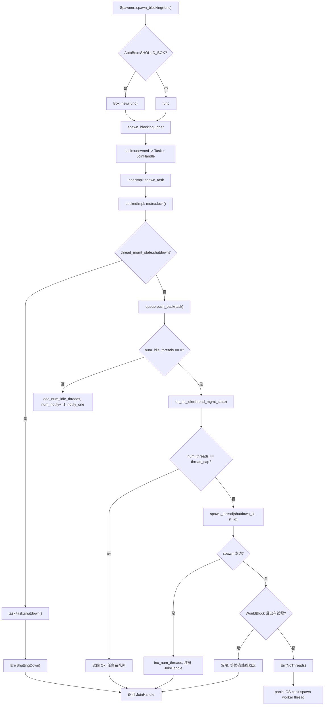
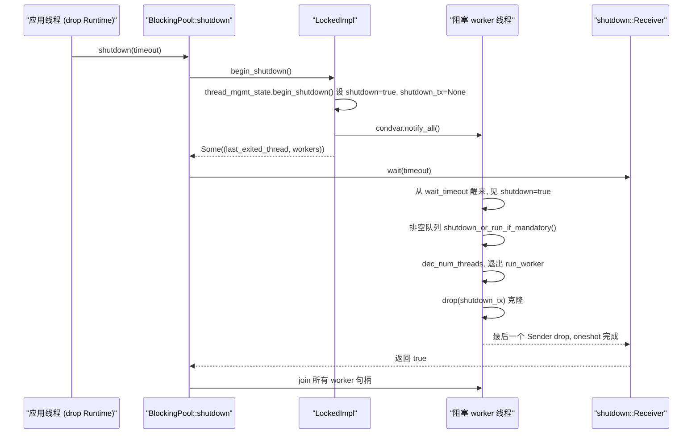

# Kapitel 8: Blockieren und Überbrücken: spawn_blocking-Threadpool und die Grenzen von block_on

Im vorherigen Kapitel haben wir gesehen, dass asynchrone Mutexe und Kanäle beim Warten keinen Thread belegen, weil sie den Waker in eine Warteschlange legen und die Aufgabe erst nach Erfüllung der Bedingung vom Wecker neu eingeplant wird. All dies setzt jedoch voraus, dass eine Aufgabe bei Pending den Thread aktiv freigibt. Sobald Code std::fs::read, libsqlite3 oder eine reine CPU-Kompressionsschleife aufruft, blockiert er den Worker-Thread bis zur Rückkehr, und alle anderen Aufgaben auf diesem Thread verhungern. Tokios Lösung besteht darin, solche Arbeiten an einen separaten blockierenden Threadpool auszulagern und mit block_on Futures in einem nicht-asynchronen Kontext anzutreiben. Dieses Kapitel zerlegt diese beiden Grenzen.

# 8.1 Speicherlayout des blockierenden Threadpools: Inner und die Queue mit zwei Implementierungen

**Intuitives Modell**：`spawn_blocking`Der Threadpool gleicht einem „ausgelagerten Hilfskräfte-Pool“ eines Restaurants. Die Kellner (Worker-Threads) nehmen nur Bestellungen auf und servieren; bei Gerichten, die lange schmoren müssen, schreiben sie einen Arbeitsauftrag und werfen ihn in das Durchreichefenster (Queue) der Küche, wo die Hilfskräfte (blockierende Threads) den Auftrag entgegennehmen. Ohne diesen Pool müsste der Kellner selbst kochen, und das ganze Restaurant stünde still.

**Kernstruktur**. Der gesamte Pool wird von`BlockingPool`gehalten, das nur zwei Dinge speichert: ein klonbares`Spawner`(Einlieferungseingang) und ein`shutdown_rx`(Empfangsende des Shutdown-Signals)[FACT:tokio/src/runtime/blocking/pool.rs:20-23]。`Spawner`ist intern`Arc<Inner>`, alle Einlieferer teilen denselben Zustand[FACT:tokio/src/runtime/blocking/pool.rs:26-28]。

`Inner`ist der gesamte Zustand des Pools, die Felder verdienen eine Einzelbetrachtung[FACT:tokio/src/runtime/blocking/pool.rs:77-104]：

- `inner_impl: InnerImpl`: Implementierung von Queue + Benachrichtigung + Lock-Topologie, ein Enum mit den beiden Varianten`Locked`und`Sharded`. Dies ist die entscheidendste Abstraktion dieses Kapitels – sie vereint die beiden Topologien „Single-Lock-Queue“ und „Sharded Queue“ unter einer Schnittstelle.[FACT:tokio/src/runtime/blocking/pool.rs:107-110]: Obergrenze der Threadanzahl, also
- `thread_cap: usize`: Anzahl der Scheduler-Worker-Threads, wird verwendet, um sie in den Metriken abzuziehen, sodass`max_blocking_threads`。
- `scheduler_threads: usize`nur blockierende Threads zählt`num_blocking_threads`: Überlebensdauer eines Leerlauf-Threads, Standard[FACT:tokio/src/runtime/blocking/pool.rs:455-460]。
- `keep_alive: Duration`: drei atomare Zähler –`KEEP_ALIVE = 10s` [FACT:tokio/src/runtime/blocking/pool.rs:231]。
- `metrics: SpawnerMetrics`〔Design-Inferenz und Architekturabwägung〕`num_threads`、`num_idle_threads`、`queue_depth` [FACT:tokio/src/runtime/blocking/pool.rs:31-35]。

> **[Design Inference & Architectural Trade-offs]**
> **Auf dem Hot-Path von** `num_idle_threads`gelesen (um zu entscheiden, ob ein Leerlauf-Thread geweckt werden muss); läge er in`spawn_task`, müsste jede Einlieferung erst das Lock nehmen und dann lesen. Als`Mutex`kann der Einlieferungspfad eine schnelle Vorabprüfung durchführen, ohne das Queue-Lock zu halten. Der Preis ist, dass zwischen diesen Zählern und dem Queue-Zustand keine Atomarität garantiert ist, weshalb der Code einen`MetricAtomicUsize`-Zähler zur Kompensation verwendet – siehe unten.`num_notify`Thread-Verwaltungszustand

**wird separat herausgezogen, damit beide Queue-Implementierungen ihn wiederverwenden können**。`ThreadManagementState`: Shutdown-Flag.[FACT:tokio/src/runtime/blocking/pool.rs:135-150]：

- `shutdown: bool`: Jeder Worker-Thread hält einen Klon; nach dem Drop aller
- `shutdown_tx: Option<shutdown::Sender>`wird eine Benachrichtigung empfangen.`shutdown_rx`: Handle des zuletzt durch Timeout beendeten Threads.
- `last_exiting_thread: Option<JoinHandle<()>>`: Handles aller lebenden Worker.
- `worker_threads: HashMap<usize, JoinHandle<()>>`: Monoton steigender Thread-ID-Zuteiler.
- `worker_thread_index: usize`Die Design-Motivation ist im Kommentar klar beschrieben: Ein durch Timeout beendeter Thread joint den zuletzt durch Timeout beendeten Thread, um Valgrind-Fehlerkennungen zu vermeiden

`last_exiting_thread`Genau das ist die Implementierung dieses verketteten Joins – er entfernt sein eigenes Handle und tauscht das alte[FACT:tokio/src/runtime/blocking/pool.rs:135-150]。`worker_timed_out`aus und gibt es an den Aufrufer zum Joinen zurück`last_exiting_thread`Aufgabenkapselung[FACT:tokio/src/runtime/blocking/pool.rs:172-178]。

**. In der Queue liegt**, das ein`Task`und ein`UnownedTask<BlockingSchedule>`-Flag umschließt`Mandatory`entscheidet, ob diese Aufgabe beim Shutdown verworfen oder zwangsweise ausgeführt wird:[FACT:tokio/src/runtime/blocking/pool.rs:187-191]。`Mandatory`ruft bei`shutdown_or_run_if_mandatory`auf, bei`NonMandatory`ruft`shutdown()`auf. Das ist der Unterschied zwischen`Mandatory`(nicht erzwungen) und`run()` [FACT:tokio/src/runtime/blocking/pool.rs:223-228](erzwungen, für fs verwendet)`spawn_blocking`Speicherlayout der Single-Lock-Implementierung`spawn_mandatory_blocking`ist die ursprünglichste Topologie: ein[FACT:tokio/src/runtime/blocking/pool.rs:233-265]。

**plus ein**。`LockedImpl`enthält`Mutex<LockedInner>`und`Condvar` [FACT:tokio/src/runtime/blocking/pool.rs:113-116]。`LockedInner`. Beachte, dass`VecDeque<Task>`、`num_notify: u32`und`thread_mgmt_state` [FACT:tokio/src/runtime/blocking/pool.rs:118-124]unter demselben Lock liegen, während`num_notify`eine atomare Größe außerhalb des Locks ist – dieses gemischte Layout „teils Zustand im Lock, teils außerhalb“ ist die Wurzel aller späteren Nebenläufigkeitsfeinheiten.`thread_mgmt_state`8.2 Einlieferungspfad: von spawn_blocking bis zum Thread-Wecken`num_idle_threads`Szenario

# : Ein asynchroner Task ruft

**auf – was geschieht in diesem Moment?**Erster Schritt: Boxing-Entscheidung und Aufgabenerstellung`tokio::task::spawn_blocking(move || heavy_compute(data))`misst zunächst die Closure-Größe

**und entscheidet anhand von**。`Spawner::spawn_blocking`, ob die Closure`fn_size`wird`AutoBox::<F>::SHOULD_BOX`. Dies ist Tokios allgemeine Strategie „automatisches Boxing großer Futures“: Bei zu großen Closures wird geboxt, um eine Aufblähung der Aufgabenstruktur zu vermeiden.`Box`Beim Eintritt in[FACT:tokio/src/runtime/blocking/pool.rs:359-389]wird zuerst eine Aufgaben-ID vergeben, dann die Closure mit

zu einem Future verpackt und schließlich mit`spawn_blocking_inner`ein`blocking_task`und`task::unowned`konstruiert. Beachte, dass hier ein`UnownedTask`-Tupel zurückgegeben wird – Handle und Einlieferungsergebnis werden getrennt zurückgegeben.`JoinHandle` [FACT:tokio/src/runtime/blocking/pool.rs:440-449]Zweiter Schritt: Drei Behandlungen des Einlieferungsergebnisses`(JoinHandle<R>, Result<(), SpawnError>)`. Zurück zu

**, es wird ein Match auf**durchgeführt`spawn_blocking`: Normal, Handle zurückgeben.`spawn_result` 做匹配 [FACT:tokio/src/runtime/blocking/pool.rs:381-388]：

- `Ok(())`：正常，返回句柄。
- `Err(ShuttingDown)`：**Kein Panic**, gibt trotzdem ein Handle zurück. Der Kommentar erklärt, dass dies aus Kompatibilitätsgründen geschieht – das Handle wird niemals aufgelöst, aber der Aufrufer stürzt nicht ab, weil die Laufzeit gerade heruntergefahren wird.
- `Err(NoThreads(e))`: Das OS kann keinen Thread erstellen und niemand im Pool übernimmt, direktes Panic.

**Dritter Schritt: Einreihung und Aufweckentscheidung**。`spawn_task`Übergibt das`on_no_idle`Closure an`InnerImpl::spawn_task`, wobei die konkrete Implementierung entscheidet, wann es aufgerufen wird[FACT:tokio/src/runtime/blocking/pool.rs:462-506]. Betrachtet man`LockedImpl::spawn_task`den kritischen Abschnitt von[FACT:tokio/src/runtime/blocking/pool.rs:603-639]：

```rust
let mut locked = self.mutex.lock();

if locked.thread_mgmt_state.shutdown {
    task.task.shutdown();
    return Err(SpawnError::ShuttingDown);
}

locked.queue.push_back(task);
metrics.inc_queue_depth();

if metrics.num_idle_threads() == 0 {
    on_no_idle(&mut locked.thread_mgmt_state)?;
} else {
    metrics.dec_num_idle_threads();
    locked.num_notify += 1;
    self.condvar.notify_one();
}
```

Hier gibt es zwei entscheidende Punkte. Erstens: Die Shutdown-Prüfung erfolgt vor der Einreihung, und selbst wenn die Aufgabe`Mandatory`ist, wird sie direkt`shutdown()`– der Kommentar erklärt: Sie wurde erst nach Beginn des Shutdowns eingeplant, daher ist das Verwerfen legitim[FACT:tokio/src/runtime/blocking/pool.rs:614-620]. Zweitens: Die Aufweckentscheidung hängt vom`num_idle_threads`außerhalb des Locks ab: Ist es 0, wird`on_no_idle`aufgerufen, um einen neuen Thread zu starten; andernfalls wird der Idle-Zähler dekrementiert und`num_notify`、`notify_one`。

**`num_notify`inkrementiert. Warum muss**existieren?`Condvar`Weil`notify_one`spurious wakeups (falsche Aufwachvorgänge) erzeugen kann. Wenn man nur`num_notify`ohne Zählung verwendet, könnte ein fälschlich aufgeweckter Thread irrtümlich glauben, es gäbe Aufgaben zu holen, stellt dann fest, dass die Warteschlange leer ist, und schläft wieder ein – während der tatsächlich aufgeweckte Thread möglicherweise nie benachrichtigt wird.`+1`Verwandelt „legitime Aufwachvorgänge" in zählbare Tokens: Die einreichende Seite`num_notify != 0`, die aufgeweckte Seite betrachtet den Aufwachvorgang erst bei`-1` [FACT:tokio/src/runtime/blocking/pool.rs:674-684]。

**als legitim und**。`on_no_idle`Vierter Schritt: Neuen Thread starten[FACT:tokio/src/runtime/blocking/pool.rs:462-506]Das Closure wird unter Halten des Queue-Locks ausgeführt`num_threads == thread_cap`. Es prüft zuerst`Ok(())`, und bei Erreichen des Limits wird direkt zurückgekehrt`shutdown_tx`– die Aufgabe bleibt in der Warteschlange und wartet auf die Bearbeitung durch vorhandene Threads; das ist Backpressure. Andernfalls wird`spawn_thread`geklont,`num_threads`aufgerufen, um einen Thread zu erstellen, und bei Erfolg`worker_thread_index`inkrementiert,`worker_threads`。

`spawn_thread`inkrementiert und das Handle in`thread::Builder`eingefügt`rt.enter()`Mit`inner.run(id)`werden Thread-Name und Stack-Größe festgelegt, dann wird ein Closure gespawnt: Eintritt in den Laufzeitkontext`shutdown_tx` [FACT:tokio/src/runtime/blocking/pool.rs:508-528]。

**, Aufruf von**。`spawn_thread`, schließlich Drop[FACT:tokio/src/runtime/blocking/pool.rs:488-500]Fehlertoleranz bei OS-Thread-Erstellungsfehlern`WouldBlock`kann fehlschlagen. Der Code klassifiziert den Fehler`is_temporary_os_thread_error`: Wenn es sich um[FACT:tokio/src/runtime/blocking/pool.rs:750-752]handelt (temporärer Fehler, bestimmt durch**) und bereits blockierende Threads im Pool vorhanden sind, dann**stillschweigend ignorieren`SpawnError::NoThreads`– die Aufgabe wird schließlich von einem aktuell beschäftigten Thread übernommen. Andernfalls wird

zurückgegeben, was letztendlich zu einem Panic führt.



# Kopie

**8.3 Worker-Hauptschleife: BUSY/IDLE-Zustandsmaschine und Timeout-Rückgewinnung**Intuitives Modell`keep_alive`: Jeder blockierende Thread ist ein „Bereitschaftshelfer". Bei Aufträgen wird kontinuierlich gearbeitet (BUSY), ohne Aufträge wird geschlafen (IDLE), und nach Überschreiten von

**wird Feierabend gemacht (Timeout-Beendigung). Ohne Timeout-Rückgewinnung würde der Pool dauerhaft alle bei Spitzenlast erstellten Threads behalten, was Speicher und Kernel-Scheduling-Overhead verschwendet.**。`LockedImpl::run_worker`Struktur der Hauptschleife`'main`ist eine[FACT:tokio/src/runtime/blocking/pool.rs:642-735]Schleife, die intern abwechselnd die beiden Phasen BUSY und IDLE durchläuft**. Hinweis: BUSY/IDLE sind hier**Phasen

**innerhalb der Schleife, keine expliziten Enum-Zustände, daher wird im Folgenden ein Flussdiagramm statt eines Zustandsdiagramms verwendet.**BUSY-Phase`while let Some(task) = locked.queue.pop_front()`: Die innere[FACT:tokio/src/runtime/blocking/pool.rs:655-661]holt kontinuierlich Aufgaben`queue_depth`，**. Nach dem Abholen wird**dekrementiert,`task.run()`das Lock gedroppt

**, die Ausführung**durchgeführt und dann das Lock erneut erworben. Der Schritt des Lock-Drops ist entscheidend – blockierende Aufgaben können sehr lange laufen und dürfen niemals unter Lock-Haltung ausgeführt werden.`num_idle_threads`IDLE-Phase`is_counted_idle = true`: Die Warteschlange ist leer,[FACT:tokio/src/runtime/blocking/pool.rs:663-696]wird inkrementiert,`condvar.wait_timeout(locked, keep_alive)`gesetzt, dann wird die Warteschleife

1. `num_notify != 0`betreten. Kern ist`num_notify`; nach der Rückkehr werden drei Dinge geprüft:`is_counted_idle = false`: Legitimer Aufwachvorgang. Dekrementiert`num_idle_threads`, setzt[FACT:tokio/src/runtime/blocking/pool.rs:674-684]。

(da die einreichende Seite bereits`worker_timed_out`dekrementiert hat), break zurück zu BUSY`break 'main`2. Nicht heruntergefahren und Timeout: Aufruf von[FACT:tokio/src/runtime/blocking/pool.rs:689-693]。

, um das Handle des zuletzt beendeten Threads zu erhalten,

**die Schleife verlassen**3. Andernfalls handelt es sich um einen spurious wakeup, weiter warten.`thread_mgmt_state.shutdown`Leeren der Warteschlange beim Shutdown[FACT:tokio/src/runtime/blocking/pool.rs:698-710]. Wenn`task.shutdown_or_run_if_mandatory()`wahr ist, wird die Leerungslogik betreten

**: Aufgaben werden einzeln herausgepoppt, das Lock gedroppt,**aufgerufen – nicht-erzwungene Aufgaben werden verworfen, erzwungene Aufgaben wie gewohnt ausgeführt. Dann break, um die Hauptschleife zu verlassen.`num_threads` [FACT:tokio/src/runtime/blocking/pool.rs:714]Bereinigung beim Beenden`is_counted_idle`. Vor dem Thread-Ende wird`num_idle_threads`dekrementiert. Wenn`assert_ne!(prev_idle, 0)`wahr ist, muss außerdem[FACT:tokio/src/runtime/blocking/pool.rs:716-726]dekrementiert werden, und mit`num_idle_threads`wird per Assertion geprüft, dass kein Unterlauf stattfindet

. Diese Assertion ist ein Schutzgeländer in der Debug-Phase: Sobald die Buchführung von`num_threads == 0`fehlerhaft ist, wird hier sofort ein Panic ausgelöst, anstatt den Fehler stillschweigend zu propagieren.`notify_one`Schließlich, wenn gerade heruntergefahren wird und[FACT:tokio/src/runtime/blocking/pool.rs:728-730](der letzte Thread),`join_on_thread`wird der möglicherweise wartende Shutdown-Initiator`Inner::run`aufgeweckt. Gibt[FACT:tokio/src/runtime/blocking/pool.rs:755-771]。

**zurück, und**。`BlockingPool::shutdown`joint vor dem Beenden`begin_shutdown`Shutdown-Handshake[FACT:tokio/src/runtime/blocking/pool.rs:310-312]。`LockedImpl::begin_shutdown`ruft zuerst`shutdown_tx`、`notify_all`auf, um alle Worker-Handles zu erhalten[FACT:tokio/src/runtime/blocking/pool.rs:740-745]setzt das Shutdown-Flag, droppt`shutdown_rx.wait(timeout)`weckt alle wartenden Threads auf[FACT:tokio/src/runtime/blocking/pool.rs:324]。

`shutdown::Receiver::wait`. Dann blockiert[FACT:tokio/src/runtime/blocking/shutdown.rs:37-70]und wartet auf`timeout == 0`Die Implementierung von`try_enter_blocking_region()`ist sehr durchdacht[FACT:tokio/src/runtime/blocking/shutdown.rs:44-57]: Zuerst wird der schnelle Pfad von`block_on_timeout`behandelt und direkt false zurückgegeben; dann wird`block_on`aufgerufen, um den Blockierbereich zu betreten; bei Fehler und aktuellem Panic wird false zurückgegeben, andernfalls Panic mit dem Hinweis „Runtime kann nicht in einem asynchronen Kontext gedroppt werden"

`shutdown_tx`. Schließlich wird je nach Timeout`Arc<oneshot::Sender<()>>`oder[FACT:tokio/src/runtime/blocking/shutdown.rs:12-14]aufgerufen, um das Oneshot anzutreiben.`Arc`Der Mechanismus von`oneshot::Sender`ist: Jeder Worker-Thread hält einen Klon von`Receiver`. Nachdem alle Threads beendet sind, werden alle Klone gedroppt,



# wird gedroppt,

**erhält die Benachrichtigung. Das ist das klassische Muster „Receiver wird aufgeweckt, nachdem alle Sender gedroppt wurden".**：`block_on`Kopie`main`8.4 block_on: Future in einem nicht-asynchronen Kontext antreiben

**Intuitives Modell**。`Runtime::block_on`ist das „Haupttor" der Laufzeit. Es verwandelt den aktuellen Thread in einen temporären Executor und pollt das übergebene Future wiederholt, bis es abgeschlossen ist. Ohne es könnte die`SHOULD_BOX`Funktion keinen asynchronen Code starten.`Box::pin`Einstieg und Boxing`block_on_inner` [FACT:tokio/src/runtime/runtime.rs:343-350]。`block_on_inner`Zuerst wird ebenfalls die Größe gemessen und je nach`self.enter()`entschieden, ob[FACT:tokio/src/runtime/runtime.rs:353-383]：

```rust
let _enter = self.enter();

match &self.scheduler {
    Scheduler::CurrentThread(exec) => exec.block_on(&self.handle.inner, future),
    Scheduler::MultiThread(exec) => exec.block_on(&self.handle.inner, future),
}
```

. Darin befinden sich zwei bedingt kompilierte Trace-Wrapper (taskdump und tracing), dann`block_on`Die Semantik ist unterschiedlich, die Dokumentation sagt es ganz klar[FACT:tokio/src/runtime/runtime.rs:302-320]：

- **Multithread-Scheduler**: Futures laufen im Kontext des I/O-Treibers und Timers,`block_on`nach der Rückkehr laufen bereits gespawnte Tasks weiter.
- **Current-Thread-Scheduler**：`block_on`kann von mehreren Threads gleichzeitig aufgerufen werden, der erste Aufrufer erlangt das Eigentum am I/O- und Timer-Treiber, andere Threads „hängen sich ein".`block_on`Nach Abschluss des ersten können andere Threads den Treiber „stehlen".`block_on`Nach der Rückkehr werden bereits gespawnte Tasks angehalten, ein erneuter Aufruf von`block_on`setzt sie fort.

**Kritische Einschränkung: Darf nicht in einem asynchronen Kontext aufgerufen werden**. Die Dokumentation stellt klar`block_on`, dass ein Aufruf in einem asynchronen Ausführungskontext panicked[FACT:tokio/src/runtime/runtime.rs:321-324]. Der Grund ist unmittelbar:`block_on`blockiert den aktuellen Thread, bis das Future abgeschlossen ist. Wenn der aktuelle Thread selbst ein Worker-Thread ist, wird der gesamte Executor blockiert – genau das ist das Problem, das`spawn_blocking`lösen soll, daher schließen sich beide gegenseitig aus.

**Herunterfahrpfad**。`Runtime::drop`wird je nach Scheduler-Typ verteilt[FACT:tokio/src/runtime/runtime.rs:506-521]: Der Current-Thread-Scheduler muss zuerst`try_set_current`in den Kontext eintreten und dann herunterfahren (um sicherzustellen, dass Tasks im Laufzeitkontext gedroppt werden); der Multithread-Scheduler fährt direkt herunter (Worker-Threads befinden sich bereits im Kontext).`shutdown_timeout`Zuerst den Scheduler herunterfahren, dann den Blocking-Pool[FACT:tokio/src/runtime/runtime.rs:457-461]，`shutdown_background`ist äquivalent zu`shutdown_timeout(Duration::from_nanos(0))` [FACT:tokio/src/runtime/runtime.rs:494-496]。

# Designüberlegungen, Fehlerbehandlung und Produktions-Fallstricke

**Warum`spawn_blocking`'s`ShuttingDown`nicht panicked?** [FACT:tokio/src/runtime/blocking/pool.rs:383-384]Der Kommentar nennt Kompatibilitätsgründe.`spawn_blocking`gibt`JoinHandle`statt`Result`zurück. Ein Panic beim Herunterfahren würde einen vorhersehbaren Zustand – „die Laufzeit fährt gerade herunter" – in einen Absturz verwandeln. Die Rückgabe eines Handles, das nie aufgelöst wird, führt dazu, dass der Aufrufer bei`await`dauerhaft hängt – aber zu diesem Zeitpunkt ist die Laufzeit bereits heruntergefahren, und das gesamte`block_on`wird ebenfalls beendet, sodass es praktisch nicht zu einem dauerhaften Leck kommt.

**`max_blocking_threads`Die Backpressure-Semantik von**. Der Standardwert ist sehr groß (512), weil`spawn_blocking`häufig für Datei-I/O verwendet wird. Die Dokumentation warnt jedoch: Bei CPU-intensiven Tasks muss die Parallelität mit einem Semaphore begrenzt werden, sonst werden massenhaft Threads erstellt[FACT:tokio/src/task/blocking.rs:94-100]. Nach Erreichen des Limits werden Tasks in der Warteschlange eingereiht, was Backpressure erzeugt – aber beachten Sie, dass diese Backpressure nur auf den Blocking-Pool wirkt und nicht auf den asynchronen Scheduler zurückdrückt.

**`spawn_blocking`ist nicht abbrechbar**. Die Dokumentation stellt klar:`abort`hat keine Wirkung auf bereits laufende Blocking-Tasks, die Tasks laufen weiter bis zum Ende[FACT:tokio/src/task/blocking.rs:106-120]. Nur noch nicht gestartete Tasks können durch abort verhindert werden. Beim Herunterfahren wartet die Laufzeit auf alle bereits gestarteten Blocking-Tasks,`shutdown_timeout`nach dem Timeout werden diese Threads geleakt.

**`num_idle_threads`Die Buchhaltungsfalle von**。`is_counted_idle`Die Existenz des Flags zeigt, dass dieser Zähler leicht fehleranfällig ist. Die einreichende Seite dekrementiert beim Aufwecken`num_idle_threads`, die aufgeweckte Seite sieht`num_notify != 0`und setzt dann`is_counted_idle = false`, um ein doppeltes Dekrementieren zu vermeiden[FACT:tokio/src/runtime/blocking/pool.rs:679-682]. Wenn dieser Pfad einen Bug hat,`assert_ne!(prev_idle, 0)`panicked[FACT:tokio/src/runtime/blocking/pool.rs:722-725]beim Beenden. Wenn in der Produktion „`num_idle_threads`underflowed on thread exit" auftritt, ist die Buchhaltungslogik des Pools beschädigt.

> **[Design Inference & Architectural Trade-offs]**
> **`last_exiting_thread`Die Kosten von verkettetem join**. Ein durch Timeout beendeter Thread joint einen zuvor durch Timeout beendeten Thread[FACT:tokio/src/runtime/blocking/pool.rs:172-178]. Dies bildet eine join-Kette: Jeder beendete Thread muss warten, bis der vorherige wirklich beendet ist. In Szenarien mit häufiger Erstellung/Zerstörung von Blocking-Threads kann diese Kette lang werden, was zu kumulativen Verzögerungen beim Thread-Beenden führt. Dies ist eine Abwägung zur Vermeidung von Valgrind-False-Positives; in normalen Produktionsumgebungen sind die Auswirkungen begrenzt, aber bei Lasten mit häufigen Thread-Timeouts ist Vorsicht geboten.

**`InnerImpl`Die Bedeutung der Enum-Abstraktion**. Der Kommentar erklärt, dass`Locked`-Variante sich exakt wie vor dem Refactoring verhält, während die`Sharded`-Variante symmetrische Slots für zukünftige nebenläufige Warteschlangen reserviert[FACT:tokio/src/runtime/blocking/pool.rs:537-539]。`spawn_task`、`run_worker`、`begin_shutdown`Alle drei Methoden werden über Enum verteilt[FACT:tokio/src/runtime/blocking/pool.rs:548-582]. Dieses Design aus „Enum-Verteilung + jeder Variante mit eigener kritischer Sektion" ermöglicht es, neue Warteschlangen-Topologien hinzuzufügen, ohne die Aufrufer ändern zu müssen.

# Kapitelzusammenfassung

Dieses Kapitel hat die beiden Grenzen von Tokio für die Aufnahme von synchronem Code analysiert.`spawn_blocking`Closures werden an einen separaten Blocking-Thread-Pool übergeben:`Inner`hält Warteschlange, Thread-Limit, Lebensdauer und atomare Metriken;`LockedImpl`verwendet Single-Lock +`Condvar`zur Implementierung der Warteschlange,`num_notify`der Zähler kompensiert falsche Aufweckungen; Worker zirkulieren zwischen BUSY/IDLE, nach Idle-Timeout beenden sie sich durch verkettetes join;`max_blocking_threads`nach Erreichen des Limits werden Tasks eingereiht und bilden Backpressure.`block_on`treibt Futures in einem nicht-asynchronen Kontext an, Multithread- und Current-Thread-Scheduler haben unterschiedliche Semantik und dürfen keinesfalls in einem asynchronen Kontext aufgerufen werden. Der Herunterfahrpfad wird durch`shutdown_tx`'s`Arc`-Zählerstand auf Null ausgelöst, was`oneshot`triggert und einen Handshake implementiert: „Nachdem alle Worker beendet sind, wird der Initiator des Herunterfahrens aufgeweckt".

# Kapitel-Überlegungen und Selbsttest

F1: Wenn man in`LockedImpl::spawn_task`die Prüfung von`if metrics.num_idle_threads() == 0`auf immer wahr ändern würde (d. h. jedes Mal`on_no_idle`aufrufen), was würde in Szenarien mit hoher nebenläufiger Einreichung passieren? Warum?

**Referenzanalyse**：`on_no_idle`prüft`num_threads == thread_cap`, und wenn das Limit nicht erreicht ist, wird ein neuer Thread erstellt[FACT:tokio/src/runtime/blocking/pool.rs:471-487]. Wenn die Prüfung immer wahr wäre, würde selbst bei vorhandenen Idle-Threads versucht, neue Threads zu starten, was dazu führt, dass die Thread-Anzahl schnell auf`thread_cap`ansteigt. Noch schwerwiegender ist, dass Idle-Threads nicht durch`notify_one`aufgeweckt werden (da der`on_no_idle`-Zweig statt des`else`-Zweigs von`num_notify += 1; notify_one` [FACT:tokio/src/runtime/blocking/pool.rs:627-636]durchlaufen wird), und Tasks in der Warteschlange möglicherweise von niemandem verarbeitet werden, bis ein neuer Thread startet und feststellt, dass die Warteschlange nicht leer ist. Dies verursacht einen Scheintot-Zustand, bei dem „Threads überfüllt sind, aber Tasks immer noch in der Warteschlange stehen". Die Bedeutung der ursprünglichen Prüfung ist genau: Wenn Idle-Threads vorhanden sind, diese bevorzugt aufwecken, um unnötige Thread-Erstellung zu vermeiden.

Q2: `LockedImpl::run_worker`In der BUSY-Phase wird vor der Ausführung von`task.run()`zuerst`drop(locked)` [FACT:tokio/src/runtime/blocking/pool.rs:657-658]ausgeführt. Wenn man dieses`drop`entfernen würde, in welchem Szenario würde ein Deadlock auftreten?

**Referenzanalyse**：`task.run()`führt die Benutzer-Closure aus, und die Closure kann intern durchaus erneut`spawn_blocking`aufrufen, um neue Tasks einzureichen. Der Einreichungspfad`LockedImpl::spawn_task`macht als Erstes`self.mutex.lock()` [FACT:tokio/src/runtime/blocking/pool.rs:612]. Wenn der Worker den Lock hält und die Closure ausführt, würde die Einreichung innerhalb der Closure versuchen, denselben Lock zu erwerben, und`std::sync::Mutex`Nicht reentrant, direkte Deadlock. Darüber hinaus blockiert das Ausführen langer Aufgaben unter gehaltenem Lock alle anderen Submitter und die Task-Abrufoperationen der Worker; selbst ohne Deadlock wird der gesamte Pool serialisiert.`drop(locked)`ist erforderlich.

Q3: `shutdown::Receiver::wait`In`try_enter_blocking_region()`gibt false zurück, wenn ein Fehler auftritt und aktuell ein Panic läuft, andernfalls panic[FACT:tokio/src/runtime/blocking/shutdown.rs:44-57]. Warum muss man bei Panic speziell behandeln? Wenn man diesen Zweig entfernt, in welchen Szenarien würde es Probleme geben?

**Referenzanalyse**：`try_enter_blocking_region`Ein Fehler bedeutet, dass man sich aktuell in einem asynchronen Kontext befindet, in dem Blockieren nicht erlaubt ist. Normalerweise sollte man panicen, um den Nutzer darauf hinzuweisen: „Man darf den Runtime nicht in einem asynchronen Kontext droppen.“ Wenn der aktuelle Thread jedoch bereits panicked (`std::thread::panicking()`ist wahr), würde ein weiteres Panic zu einem doppelten Panic führen, und das Standardverhalten von Rust ist, den Prozess direkt abzubrechen. Szenario: Der Nutzer droppt einen Runtime in einer asynchronen Aufgabe, und diese Aufgabe selbst panicked gerade aus anderen Gründen; das durch den Drop ausgelöste Shutdown würde dann ein zweites Panic verursachen. Die Rückgabe von false lässt das Shutdown das Warten aufgeben, vermeidet den Prozessabbruch und bewahrt dem Nutzer die Chance, die ursprüngliche Panic-Information zu sehen. Dies ist eine typische Behandlung für „Panic-Sicherheit“.

Der blockierende Thread-Pool und block_on markieren die Fähigkeitsgrenzen der asynchronen Runtime: Ersterer isoliert Arbeit, die den Thread nicht abgeben kann, in dedizierte Threads, Letzterer ermöglicht es auch nicht-asynchronen Einstiegspunkten, Futures anzutreiben. Aber diese beiden Grenzen werden im Code oft nicht von Hand geschrieben – im nächsten Kapitel betreten wir die Welt der Makros und schauen, wie #[tokio::main], select! und join! diesen Runtime-Code zur Kompilierzeit generieren.
