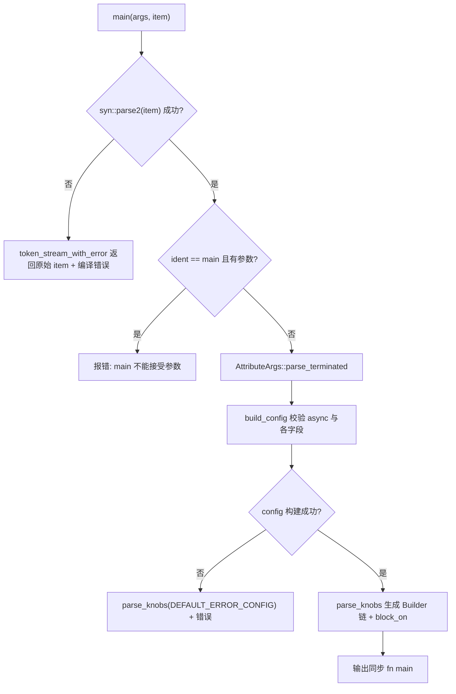
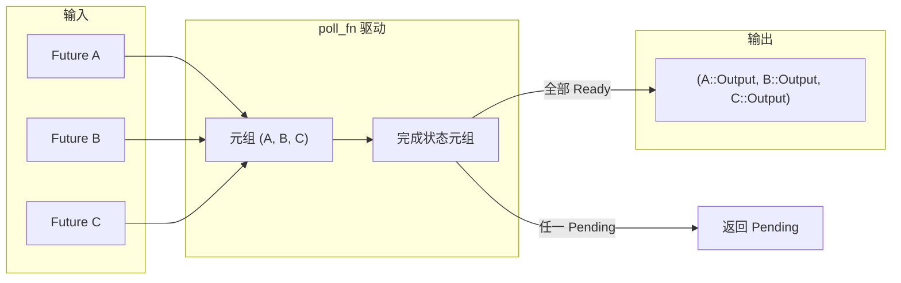

# Kapitel 9: Die Magie der Makros: Der Code, der hinter #[tokio::main], select! und join! steckt

Im vorherigen Kapitel haben wir gesehen,`block_on`und wie der blockierende Thread-Pool die Fähigkeitsgrenzen der asynchronen Runtime absteckt, während Nutzer diese Grenzen fast nie von Hand schreiben – sie schreiben`#[tokio::main]`、`select!`、`join!`, damit das Makro diesen Boilerplate-Code zur Kompilierzeit ausbreitet. Makros sind die erste Zuckerhülle, die Tokio dem Nutzer bietet, und auch der Ort, an dem zur Kompilierzeit tatsächlich Runtime-Code generiert wird. Dieses Kapitel konzentriert sich auf`tokio-macros`Crate und`tokio/src/macros/select.rs`, zerlegt die drei am häufigsten verwendeten Makro-Expansionspfade und beantwortet vor allem eine Frage: Wie sieht die reale Aufrufkette nach der Makro-Expansion aus, und warum`select!`muss die Cancel-Safety-Semantik gesondert beachtet werden.

# 9.1 #[tokio::main]: async fn in Runtime::block_on umschreiben

**Intuitives Modell**：`#[tokio::main]`Es ist wie eine „Renovierungsvollmacht“. Du übergibst einen Rohbau (`async fn main`), es verlegt für dich Wasser und Strom (baut die Runtime), montiert Türen und Fenster (`enable_all`) und stellt schließlich deine ursprünglichen Möbel (den Funktionskörper) hinein. Ohne es müsste jeder`main`von Hand`Builder::new_multi_thread().enable_all().build().unwrap().block_on(...)`schreiben, und Boilerplate-Code würde die Geschäftslogik überschwemmen.

## Datenstrukturen und Speicherlayout

Das Makro selbst erzeugt keine Runtime-Datenstrukturen, aber die von ihm geparste Konfiguration wird in zwei Strukturen untergebracht.`Configuration`ist ein „veränderlicher Akkumulator zur Parse-Zeit“, dessen Felder alle`Option`sind, weil Attributparameter fehlen, doppelt vorkommen oder ungültig sein können[FACT:tokio-macros/src/entry.rs:74-84]. Beachte, dass`worker_threads`、`start_paused`、`unhandled_panic`alle`Span`tragen – dies dient dazu, Fehler bei der Fehlermeldung auf die vom Nutzer geschriebene Zeile zu lokalisieren und nicht auf das Makro-Innere[FACT:tokio-macros/src/entry.rs:74-84]。`FinalConfig`ist dagegen das „validierte unveränderliche Ergebnis“,`flavor`ist nicht mehr`Option`, weil`build()`bereits mit`default_flavor`abgesichert wurde[FACT:tokio-macros/src/entry.rs:55-62]。

`RuntimeFlavor`hat nur drei Varianten:`CurrentThread`、`Threaded`、`Local` [FACT:tokio-macros/src/entry.rs:10-14]。`from_str`enthält absichtlich freundliche Fehlermeldungen für historische Namen:`single_thread`weist darauf hin, dass es`current_thread`，`basic_scheduler`heißen sollte, weist darauf hin, dass es umbenannt wurde,`threaded_scheduler`weist darauf hin, dass es umbenannt wurde[FACT:tokio-macros/src/entry.rs:17-27]. Dies ist ein typisches Design von Makros als „erste Kontaktfläche für den Nutzer“: Fehlermeldungen sind Dokumentation.

## Schritt-für-Schritt-Expansionsablauf

Szenario einsetzen: Der Nutzer schreibt`#[tokio::main(flavor = "multi_thread", worker_threads = 4)] async fn main() { ... }`。

Erster Schritt,`main`Der Einstieg parst zuerst das Item als benutzerdefiniertes`ItemFn` [FACT:tokio-macros/src/entry.rs:577-580]. Dieses`ItemFn`ist nicht`syn::ItemFn`, sondern ein von Tokio selbst implementierter Parser; der Grund steht im Kommentar: Er will nicht die gesamte Anweisung rekursiv parsen, sondern nur ein leichtgewichtiges Parsing „nach Token-Tree puffern, bei Semikolon trennen“ durchführen[FACT:tokio-macros/src/entry.rs:720-764]. Dies vermeidet den Aufwand, im Makro einen vollständigen AST für den Funktionskörper aufzubauen.

Zweiter Schritt,`build_config`validiert, ob das`async`Schlüsselwort existiert; fehlt es, wird „the`async` keyword is missing" [FACT:tokio-macros/src/entry.rs:346-349]gemeldet. Danach werden die Attributparameter durchlaufen und`worker_threads`、`flavor`、`start_paused`、`crate`、`unhandled_panic`、`name`an den entsprechenden Setter verteilt[FACT:tokio-macros/src/entry.rs:369-399]. Beachte, dass`core_threads`explizit abgelehnt und auf die Umbenennung hingewiesen wird[FACT:tokio-macros/src/entry.rs:379-382]。

Dritter Schritt,`Configuration::build`führt eine feldübergreifende Konsistenzprüfung durch. Hier gibt es drei entscheidende Einschränkungen:`worker_threads`erlaubt nur`multi_thread` [FACT:tokio-macros/src/entry.rs:197-217]；`start_paused`erlaubt nur`current_thread`/`local` [FACT:tokio-macros/src/entry.rs:219-229]；`unhandled_panic`erlaubt ebenfalls nur`current_thread`/`local` [FACT:tokio-macros/src/entry.rs:231-241]. Wenn der Nutzer`multi_thread`wählt, aber das`rt-multi-thread`Feature nicht aktiviert ist, unterscheidet sich die Fehlermeldung danach, ob flavor explizit angegeben wurde[FACT:tokio-macros/src/entry.rs:209-216]。

Vierter Schritt,`parse_knobs`generiert Code. Es entfernt zuerst`asyncness` [FACT:tokio-macros/src/entry.rs:441]und wählt dann je nach flavor den Builder-Ausgangspunkt:`CurrentThread`/`Local`verwendet`Builder::new_current_thread()`，`Threaded`verwendet`Builder::new_multi_thread()` [FACT:tokio-macros/src/entry.rs:468-477]。`Local`Die Besonderheit liegt darin, dass der build-Aufruf`build_local(Default::default())`statt`build()` [FACT:tokio-macros/src/entry.rs:479-483]ist. Danach wird bei Bedarf verkettet`.worker_threads(#v)`、`.start_paused(#v)`、`.unhandled_panic(...)`、`.name(#v)` [FACT:tokio-macros/src/entry.rs:485-497]。

Fünfter Schritt, der endgültige Funktionskörper wird generiert. Der Kern ist`last_block`：`return #rt.enable_all().#build.expect("Failed building the Runtime").block_on(body)` [FACT:tokio-macros/src/entry.rs:509-522]. Beachte das explizite`return`; der Kommentar verweist auf tokio-rs/tokio#4636 und dient der Behebung eines Typinferenzproblems[FACT:tokio-macros/src/entry.rs:508]。

Sechster Schritt, der Funktionskörper wird in`async #body`verpackt und einer Typprüfung unterzogen. Im Nicht-Test-Pfad wird, wenn der Rückgabetyp nicht`!`ist und`impl Trait`nicht enthält,`if false { let _: &dyn Future<Output = #output_type> = &body; }`eingefügt, um eine Compile-Zeit-Assertion durchzuführen[FACT:tokio-macros/src/entry.rs:551-571]. Der Test-Pfad verwendet`pin!`Den body auf den Stack pinnen und in`Pin<&mut dyn Future>`umwandeln,`block_on`Der Kommentar erklärt, dass dies dazu dient, den Kompilierungsaufwand für[FACT:tokio-macros/src/entry.rs:526-548]。



## Designüberlegungen und Fallstricke im Produktivbetrieb

`main`und`test`teilen`parse_knobs`, aber der Standard-Flavor ist unterschiedlich:`test`Standard`CurrentThread`，`main`Standard`Threaded` [FACT:tokio-macros/src/entry.rs:91-94]. Das erklärt, warum`#[tokio::test]`standardmäßig single-threaded ist – Tests benötigen normalerweise keine Mehrkernunterstützung, und Single-Threaded ist leichter reproduzierbar.

Eine leicht zu übersehende Falle: Nach der Makro-Expansion wird bei jedem Funktionsaufruf eine neue Runtime erstellt. Die Dokumentation warnt ausdrücklich davor, dass bei häufig aufgerufenen Funktionen stattdessen ein Builder zur Wiederverwendung der Runtime verwendet werden sollte[FACT:tokio-macros/src/lib.rs:31-35]. Die Verwendung von`#[tokio::main]`in einer normalen Funktion ist legal, aber jeder Aufruf kostet einmal die Runtime-Erstellung.

Eine weitere Falle ist die Umbenennung von`crate`. Wenn der Benutzer`use tokio as tokio1`, kann das standardmäßig vom Makro intern generierte`tokio::runtime::Builder`den Pfad nicht finden und muss explizit`crate = "tokio1"` [FACT:tokio-macros/src/lib.rs:239-264]。`parse_knobs`in`crate_path`Der Standardwert von ist`Ident::new("tokio", ...)` [FACT:tokio-macros/src/entry.rs:456-462], was genau die Ursache für Fehler im Umbenennungsszenario ist.

# 9.2 select!: Mehrzweig-Polling, Bitmaske und zufällige Fairness

**Intuitives Modell**：`select!`ist wie ein „Kellner, der gleichzeitig mehrere Ausgabefenster im Blick behält". Welches Fenster zuerst Essen ausgibt, von dort nimmt er es mit, und die Warteschlangen der anderen Fenster verfallen. Ohne es müsste der Benutzer manuell`poll_fn`mehrere Futures in ein Tupel packen und einzeln pollen, und auch selbst die Logik handhaben, dass nach Bereitschaft eines Zweigs die übrigen Zweige verworfen werden müssen.

## Datenstruktur und Speicherlayout

`select!`erzeugt nach der Expansion ein lokales Modul`__tokio_select_util`, das ein Enum`Out`und einen Typalias`Mask` [FACT:tokio/src/macros/select.rs:615-619]。`Out`enthält. Die Variantennamen sind`_0`、`_1`… einer pro Zweig, plus ein`Disabled`, das anzeigt, dass alle Zweige ungültig sind[FACT:tokio-macros/src/select.rs:33-39]。`Mask`. Der zugrunde liegende Typ wird dynamisch nach Zweiganzahl gewählt: ≤8 verwendet`u8`, ≤16 verwendet`u16`, ≤32 verwendet`u32`, ≤64 verwendet`u64`, über 64 führt direkt zu einem Panic[FACT:tokio-macros/src/select.rs:17-31]. Diese Bitmaske ist der zentrale Zustand von`select!`: Bit i auf 1 bedeutet, dass der i-te Zweig deaktiviert wurde.

Alle Futures werden in einem Tupel gespeichert`futures`, wobei jedes Element zuerst durch`IntoFuture::into_future`konvertiert wird[FACT:tokio/src/macros/select.rs:654-656]. Beachten Sie, dass hier zuerst`futures_init`konstruiert und dann einzeln`into_future`wird. Der Kommentar erklärt, dass dies die Verlängerung temporärer Lebensdauern ausnutzt[FACT:tokio/src/macros/select.rs:641-646]. Anschließend`let mut futures = &mut futures;`wird das Tupel auf veränderliche Referenzen herabgestuft, um zu vermeiden, dass`poll_fn`Closures das Eigentum übernehmen[FACT:tokio/src/macros/select.rs:658-662]。

## Schritt-für-Schritt-Polling-Ablauf

Szenario einsetzen:`select! { v = stream1.next() => ..., v = stream2.next() => ..., else => break }`。

Erster Schritt: Makro-Eingangsregelabgleich. Falls`biased;`Präfix vorhanden,`start=0` [FACT:tokio/src/macros/select.rs:801-803]; andernfalls`start`ist ein zufälliger Ausdruck`thread_rng_n(BRANCHES)` [FACT:tokio/src/macros/select.rs:805-809]. Dies ist die Fairness-Quelle, die die Dokumentation als „standardmäßig zufällige Auswahl eines Zweigs zur Überprüfung" bezeichnet[FACT:tokio/src/macros/select.rs:61-65]。

Zweiter Schritt: Normalisierung. Der tt-muncher normalisiert jeden Zweig in die Form`(skip) pat = fut, if cond => handler,`,`skip`ist eine Folge von`_`, deren Länge der Anzahl der Branches vor diesem Zweig entspricht[FACT:tokio/src/macros/select.rs:770-793]。`skip`. Sie wird sowohl zur Generierung des Tupelfeldzugriffs`futures_init.$($skip)*`als auch zur Berechnung des Zweigindex durch`count!`verwendet.

Dritter Schritt: Auswertung der Vorbedingungen. Für jede`if $c`jedes Zweigs gilt: Falls false, dann`disabled |= 1 << index` [FACT:tokio/src/macros/select.rs:631-636]. Beachten Sie: Selbst wenn ein Zweig deaktiviert ist, wird sein`$fut`-Ausdruck weiterhin ausgewertet, nur nicht gepollt[FACT:tokio/src/macros/select.rs:39-41]。

Vierter Schritt: Eintritt in die`poll_fn`-Closure. Zuerst wird das Kooperationsbudget geprüft:`ready!(poll_budget_available(cx))`. Bei erschöpftem Budget wird direkt`Pending` [FACT:tokio/src/macros/select.rs:664-667]zurückgegeben. Dies stellt sicher, dass`select!`den Worker nicht monopolisiert.

Fünfter Schritt: Schleife`for i in 0..BRANCHES`，`branch = (start + i) % BRANCHES` [FACT:tokio/src/macros/select.rs:680-685]. Für jeden Branch: Zuerst`disabled & mask == mask`prüfen; falls bereits deaktiviert, dann`continue` [FACT:tokio/src/macros/select.rs:694-699]; andernfalls das Future aus dem Tupel entnehmen und mit`Pin::new_unchecked`umhüllen (die Sicherheit hängt davon ab, dass das Future auf dem Stack liegt und nicht verschoben wird)[FACT:tokio/src/macros/select.rs:701-707]; es pollen,`Ready(out)`dann zuerst`disabled |= mask`und dann das Muster abgleichen[FACT:tokio/src/macros/select.rs:710-730]。

Sechster Schritt: Musterabgleich. Falls`out`auf`$bind`passt, wird`Poll::Ready(Out::_i(out))` [FACT:tokio/src/macros/select.rs:727-733]zurückgegeben; falls nicht,`continue`weiter andere Zweige pollen – genau das, was die Dokumentation in Schritt 5 als „bei Nichtübereinstimmung des Musters den aktuellen Zweig deaktivieren" beschreibt[FACT:tokio/src/macros/select.rs:44-47]。

Siebter Schritt: Schleifenende. Falls`is_pending`wahr ist, wird`Pending`zurückgegeben; andernfalls sind alle Zweige ungültig und es wird`Out::Disabled` [FACT:tokio/src/macros/select.rs:740-745]zurückgegeben. Das äußere`match output`mappt`Out::_i`auf den entsprechenden Handler,`Disabled`mappt auf den`else`-Ausdruck[FACT:tokio/src/macros/select.rs:749-755]。

```mermaid
flowchart TD
    start["poll_fn 闭包被调用"] --> budget{"poll_budget_available(cx)?"}
    budget -->|否| pending_budget["返回 Pending"]
    budget -->|是| init["is_pending = false; start = $start"]
    init --> loop{"i |否| check_pending{"is_pending?"}
    check_pending -->|是| pending["返回 Pending"]
    check_pending -->|否| disabled_out["返回 Out::Disabled"]
    loop -->|是| branch["branch = (start+i) % BRANCHES"]
    branch --> is_disabled{"disabled & mask == mask?"}
    is_disabled -->|是| next_i["i += 1"]
    is_disabled -->|否| poll_fut["Pin::new_unchecked(fut).poll(cx)"]
    poll_fut --> poll_res{"Poll 结果?"}
    poll_res -->|Pending| set_pending["is_pending = true; i += 1"]
    poll_res -->|Ready| disable["disabled |= mask"]
    disable --> pat_match{"out 匹配 $bind?"}
    pat_match -->|否| next_i
    pat_match -->|是| ready_out["返回 Out::_i(out)"]
    next_i --> loop
    set_pending --> loop
```

## Designüberlegungen und Fallstricke im Produktivbetrieb

**Warum Bitmaske statt`Vec<bool>`？**? Die Bitmaske ist eine einzelne Ganzzahl auf dem Stack, ohne Heap-Allokation, und`disabled |= mask`ist eine einzelne Instruktion. Für`select!`auf dem Hot Path vermeidet dies Heap-Zugriffe bei jeder Iteration.

**Warum bei Nichtübereinstimmung des Musters den Zweig deaktivieren?**Dies ist der entscheidende Unterschied zwischen`select!`und einem „einfachen race". Betrachten Sie`Some(v) = stream.next() => ...`: Falls`stream.next()`(Ende des Streams) zurückgibt, passt das Muster nicht, der Zweig wird dauerhaft deaktiviert, wodurch ein endloses Polling eines bereits beendeten Streams vermieden wird. Das Dokumentationsbeispiel nutzt genau diese Semantik, um zwei Streams zu sammeln, bis beide beendet sind`None`Die wahre Bedeutung von Cancel-Safety[FACT:tokio/src/macros/select.rs:198-223]。

**Sobald ein Zweig bereit ist, werden die Futures der übrigen Zweige gedroppt. Falls ein gedropptes Future bereits Daten konsumiert, aber noch nicht zurückgegeben hat, gehen die Daten verloren. Die Dokumentation listet ausdrücklich auf, dass**：`select!`nicht cancel-safe ist`read_exact`、`read_to_end`、`write_all`, während[FACT:tokio/src/macros/select.rs:119-124]aufgrund der Warteschlangen-Fairness bei Abbruch die Warteschlangenposition verliert`Mutex::lock`、`Semaphore::acquire`. Bestimmungsmethode: Suchen Sie den[FACT:tokio/src/macros/select.rs:126-133]-Punkt; falls ein Neustart der Funktion an`.await`weiterhin korrekt ist, ist sie cancel-safe`.await`Race-Falle bei Vorbedingungen[FACT:tokio/src/macros/select.rs:135-139]。

**`if`: Die Dokumentation gibt ein klassisches Fehlerbeispiel – mit**wird der`if !sleep.is_elapsed()`-Zweig abgesichert, aber`sleep`könnte zwischen der`is_elapsed()`-Prüfung und`while`true werden, wodurch das Timeout übersehen wird`select!`. Die korrekte Schreibweise besteht darin,[FACT:tokio/src/macros/select.rs:336-376]zu entfernen und den`if`-Zweig stets am Polling teilnehmen zu lassen, sodass nach dem Timeout`sleep`die Kosten von`break` [FACT:tokio/src/macros/select.rs:378-405]。

**`biased;`: Zufälliger RNG hat CPU-Kosten, und in manchen Szenarien ist eine deterministische Polling-Reihenfolge erforderlich**. Aber[FACT:tokio/src/macros/select.rs:67-74]legt die Fairness-Verantwortung in die Hände des Benutzers: Falls ein Zweig immer bereit ist, verhungern die nachfolgenden Zweige`biased;`9.3 join! und die technischen Einschränkungen der Makro-Expansion[FACT:tokio/src/macros/select.rs:75-81]。

# Intuitives Modell

**ist wie „gleichzeitig warten, bis alle Pakete angekommen sind". Anders als**：`join!`, das bei früherer Ankunft die übrigen abbricht, aggregiert es die`select!`-Werte aller Futures zu einem Tupel. Ohne es müsste der Benutzer manuell`Ready`den Abschlussstatus jedes Futures verwalten.`poll_fn`Datenstruktur und Speicherlayout

## 数据结构与内存布局

`join!`Die Expansion von  basiert ebenfalls auf dem Speichern von Futures in einem Tupel, aber der Zustand ist keine Bitmaske, sondern ein Tupel von „abgeschlossenen Werten". Nachdem jedes Future abgeschlossen ist, wird sein Wert entnommen und im Ergebnis-Tupel gespeichert, wobei der entsprechende Slot als abgeschlossen markiert wird. Im Gegensatz zu`select!`anders,`join!`werden unvollständige Futures nicht gedroppt – es muss warten, bis alle Futures abgeschlossen sind, bevor es zurückkehrt.

## Schritt-für-Schritt-Ablauf

`join!`Die Poll-Logik von  teilt das Gerüst „Tupel speichert Futures +`select!`-getrieben" mit , aber die Semantik ist entgegengesetzt:`poll_fn`ist „gib zurück, sobald irgendeines bereit ist",`select!`ist „gib erst zurück, wenn alle bereit sind". Jede Poll-Runde durchläuft alle unvollständigen Futures; wenn irgendeines`join!`zurückgibt, wird das Gesamtergebnis`Pending`, wenn alle`Pending`, wird aggregiert zurückgegeben.`Ready`Kopieren



## Die Cancel-Safety-Semantik von  unterscheidet sich von

`join!`:`select!`Wenn  gedroppt wird, werden alle unvollständigen Futures gedroppt, was ebenfalls Datenverlust verursachen kann. Da`join!`jedoch keinen Zweig aktiv abbricht, wird es nicht wie`join!`„einen Zweig abbrechen, weil ein anderer Zweig bereit ist". Das eigentliche Risiko besteht darin, dass`select!`als Ganzes durch äußeres`join!`oder Timeout abgebrochen wird.`select!`Der Unterschied zwischen  und

`join!`ist beachtenswert:`try_join!`gibt sofort zurück, wenn irgendein Future`try_join!`zurückgibt, und bricht die übrigen Futures ab, wodurch es das Cancel-Safety-Risiko von`Err`erbt.`select!`Designüberlegungen

# Die Grenzen von Makros als Compile-Zeit-Codegeneratoren

**Die Konfigurationsvalidierung wird in die Compile-Zeit verlagert; illegale Kombinationen (wie**。`#[tokio::main]`) führen direkt zu einem Compile-Fehler statt zu einer Laufzeit-Panic. Das ist der Kernvorteil von Makros gegenüber Buildern: Fehler frühzeitig.`multi_thread` + `start_paused`Hybride Architektur aus deklarativen Makros + prozeduralen Makros

**Der Hauptteil von  ist**。`select!`, aber zwei Schlüssellogiken werden an prozedurale Makros delegiert:`macro_rules!`generiert`select_priv_declare_output_enum`das Enum und`Out`den Typ`Mask`im Clear-Modus[FACT:tokio-macros/src/lib.rs:658-660]，`select_priv_clean_pattern`. Warum? Die Kommentare erklären: Deklarative Makros können nur schwer Code generieren, der „je nach Zweiganzahl dynamisch den Integer-Typ auswählt", und auch nur schwer Token-Level-Bereinigung an Musterpositionen durchführen`ref`/`mut` [FACT:tokio-macros/src/lib.rs:666-668]Notwendigkeit von[FACT:tokio/src/macros/select.rs:577-579]。

**`clean_pattern`matcht**。`select!`in Form von`out`gegen das Muster`&out`; wenn der Benutzer[FACT:tokio/src/macros/select.rs:727]schreibt, wird daraus`ref v`, was zu einem Typfehler führt.`&ref v`Rekursives Löschen von`clean_pattern`sowie`by_ref`、`mutability`des`Reference`-Musters`mutability` [FACT:tokio-macros/src/select.rs:68-73][FACT:tokio-macros/src/select.rs:100-103]. Dies ist der Kompromiss, den das Makro zwischen „Benutzerintuition" und „Borrow-Checker" eingeht.

**Die technische Realität des 64-Zweig-Limits**。`count!`、`count_field!`、`select_variant!`Die drei Makros haben jeweils manuell Match-Regeln von 0 bis 64 geschrieben[FACT:tokio/src/macros/select.rs:821-1017][FACT:tokio/src/macros/select.rs:1021-1217][FACT:tokio/src/macros/select.rs:1221-1414]. Die Kommentare sagen offen „I'm not happy about it either"[FACT:tokio/src/macros/select.rs:816-817]. Das ist der Preis dafür, dass deklarative Makros keine Arithmetik beherrschen: Man kann nur die Token-Anzahl hart auf Integer abbilden.

# Zusammenfassung dieses Kapitels

# Überlegungen und Selbsttests zu diesem Kapitel

Q1: `select!`Das`disabled`von  wird bei jedem Eintritt in`select!`neu auf`Default::default()` [FACT:tokio/src/macros/select.rs:627]initialisiert. Was passiert, wenn man diese Zeile in den`poll_fn`-Closure verschiebt, in einem Szenario, in dem „select! in einer Schleife aufgerufen wird und ein Zweigmuster nicht passt"?

**Referenzanalyse**：`disabled`Wenn es innerhalb der Closure initialisiert würde, würde es bei jedem Poll zurückgesetzt, wodurch Zweige, die in der vorherigen Runde aufgrund eines Muster-Mismatches deaktiviert wurden, wieder am Polling teilnehmen würden. Betrachte`Some(v) = stream.next() => ...`und`stream`ist bereits beendet (gibt`None`zurück); nach dem Muster-Mismatch sollte dieser Zweig dauerhaft deaktiviert sein. Wenn`disabled`zurückgesetzt wird, würde der nächste Poll diesen bereits beendeten Stream erneut pollen; wenn der Stream nicht fused ist (d. h. ein erneutes Pollen nach Beendigung kann panic verursachen oder undefiniertes Verhalten zurückgeben), gäbe es Probleme. Selbst wenn der Stream fused ist, würde es CPU verschwenden, wiederholt einen Stream zu pollen, der immer`None`zurückgibt. Die Dokumentation sagt ausdrücklich „Re-entering select! due to a loop clears the disabled state"[FACT:tokio/src/macros/select.rs:37-38], was sich auf den erneuten Eintritt in das`select!`-Makro (eine neue Schleifenrunde) bezieht, nicht auf mehrere Polls innerhalb desselben`select!`.`disabled`Muss außerhalb der Closure initialisiert werden, um den Zustand über mehrere Polls desselben`select!`-Aufrufs hinweg zu erhalten.

Q2: `select!`Nach dem Pollen bis`Ready(out)`wird zuerst`disabled |= mask`ausgeführt und dann das Muster[FACT:tokio/src/macros/select.rs:720-730]gematcht. Was passiert, wenn man`disabled |= mask`entfernt, in einem Szenario, in dem das Muster nicht passt und dieses Future bei jedem Poll sofort`Ready`zurückgibt?

**Referenzanalyse**: Nach dem Entfernen von`disabled |= mask`, wenn`out`nicht zu`$bind`passt, geht der Code zu`continue`über und pollt weiter andere Zweige. Aber wenn im nächsten Durchlauf`poll_fn`aufgerufen wird (z. B. nachdem ein anderer Zweig`Pending`zurückgegeben hat und erneut gepollt wird), ist dieser Zweig immer noch nicht deaktiviert und wird erneut gepollt. Wenn dieses Future bei jedem Poll sofort`Ready`zurückgibt und der Wert nicht zum Muster passt, entsteht eine Livelock „poll -> Ready -> kein Match -> continue -> andere Zweige Pending -> Pending zurückgeben -> erneut pollen -> erneut Ready -> ...", und die CPU dreht leer.`disabled |= mask`Wird sofort nach`Ready`gesetzt, um sicherzustellen, dass dieser Zweig selbst bei einem Muster-Mismatch nicht erneut gepollt wird. Beachte, dass das Setzen vor dem Muster-Matching erfolgt, sodass sowohl „Ready, aber Muster passt nicht" als auch „Ready und Muster passt" den Zweig deaktivieren – Ersteres verhindert Livelock, Letzteres verhindert doppelte Konsumption.

Q3: `parse_knobs`Im Nicht-Test-Pfad wird`if false { let _: &dyn Future<Output = #output_type> = &body; }`zur Typprüfung eingefügt[FACT:tokio-macros/src/entry.rs:557-561], aber für Typen, die`!`zurückgeben oder`impl Trait`enthalten, wird die Prüfung übersprungen[FACT:tokio-macros/src/entry.rs:551-556]. Warum muss`impl Trait`übersprungen werden? Was passiert, wenn man die Prüfung erzwingt?

**Referenzanalyse**：`impl Trait`An der Rückgabeposition ist ein „opaker Typ"; der Compiler erlaubt nicht, ihn zwangsweise in`&dyn Future<Output = impl Trait>`umzuwandeln, weil`dyn`einen konkreten Typ erfordert, während`impl Trait`Der konkrete Typ ist außerhalb der Funktion nicht sichtbar. Wenn man gewaltsam eine Prüfung einfügt, meldet der Compiler Fehler wie „the size for values of type`impl Future`cannot be known at compilation time" oder „cannot be made into an object". Dasselbe gilt für den Rückgabetyp von`!`:`!`kann in jeden Typ umgewandelt werden, aber`&dyn Future<Output = !>`von`Output = !`selbst kann das Instabilitätsproblem des Never-Type auslösen. Der Preis für das Überspringen der Prüfung ist: Wenn der Benutzer`async fn main() -> impl Trait`schreibt, aber der tatsächliche Rückgabetyp nicht mit`impl Trait`übereinstimmt, wird der Fehler erst bei`block_on`sichtbar, und die Fehlermeldung ist möglicherweise weniger klar als bei einer expliziten Prüfung. Dies ist eine Abwägung zwischen „Vollständigkeit der Compile-Time-Prüfung" und „Einschränkungen des Typsystems".

Das Makro nimmt dem Benutzer den Boilerplate-Code und die Compile-Time-Validierung ab, aber was es erzeugt, sind weiterhin gewöhnliche Futures und`poll`-Aufrufe. Im nächsten Kapitel verlassen wir die Compile-Time-Welt der Makros und betreten die Laufzeit-I/O-Abstraktionsschicht, um zu sehen, wie`AsyncRead`/`AsyncWrite`den Byte-Stream in Frames zerlegt und wie das`Framed`-Codec-Framework unter den Cancel-Safety-Einschränkungen von`select!`korrekt funktioniert.

`#[tokio::main]`Im Wesentlichen ist es „Konfigurationsparsing + Builder-Kettengenerierung +`block_on`-Umhüllung". Die Konfigurationsvalidierung erfolgt zur Compile-Zeit, und der Flavor bestimmt den Builder-Startpunkt und die build-Methode.`select!`Der Kern ist „Tupel speichert Futures + Bitmaske markiert Deaktivierungen + zufälliger Startpunkt gewährleistet Fairness". Bei Nichtübereinstimmung des Musters wird der Zweig deaktiviert, und die Cancel-Safety hängt davon ab, ob das gedroppte Future bei`.await`neu gestartet werden kann.`join!`und`select!`teilen dasselbe Skelett, haben aber entgegengesetzte Semantik: Ersteres wartet auf die Fertigstellung aller, Letzteres kehrt zurück, sobald eines bereit ist. Zusammen zeigen die drei die zentrale Abwägung im Design der Tokio-Makros: Boilerplate-Code und Compile-Time-Validierung dem Makro überlassen, die Komplexität der Laufzeitsemantik (insbesondere Cancel-Safety) dem Benutzer zur expliziten Verständnis überlassen. Nachdem man verstanden hat, wie Makros Laufzeitcode generieren, stellt sich die nächste natürliche Frage: Welche Abstraktionen bietet Tokio, wenn dieser Code tatsächlich beginnt, Byte-Streams zu lesen und zu schreiben? Kapitel 10 wird`AsyncRead`/`AsyncWrite`und das Codec-Framework analysieren und untersuchen, wie`BufReader`/`BufWriter`Systemaufrufe reduziert,`copy_bidirectional`die bidirektionale Weiterleitung antreibt und`Framed`den Byte-Stream in Frames aufteilt, um die Frage zu beantworten: „Wo liegt die Abstraktionsgrenze für asynchrones I/O?"
