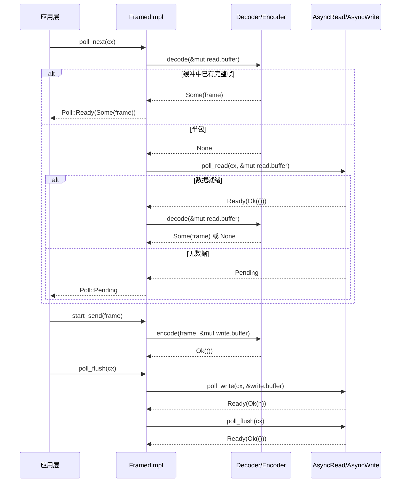

# Kapitel 10: Streaming-I/O-Abstraktionen: AsyncRead/AsyncWrite und das Codec-Framework

Das vorherige Kapitel hat den Expansionsprozess von tokio-macros zerlegt, und wir haben gesehen, wie #[tokio::main], select! und join! dem Benutzer Boilerplate-Code und Compile-Time-Validierung abnehmen. Aber was die Makros erzeugen, sind weiterhin gewöhnliche Futures und poll-Aufrufe – wenn diese Futures tatsächlich beginnen, Bytes zu lesen und zu schreiben, bietet Tokio als zugrunde liegende Abstraktion nur zwei Traits: AsyncRead und AsyncWrite. Ihr Problem ist, dass sie „zu niedrig" sind: Ein poll_read garantiert nur „einige Bytes gelesen", nicht „eine vollständige Nachricht gelesen". Und die allermeisten Protokolle (HTTP, Redis, gRPC, benutzerdefiniertes RPC) sind auf „Frames" statt auf „Byte-Streams" ausgerichtet. Die zentrale Frage, die dieses Kapitel beantworten will, ist: Wo sollte die Abstraktionsgrenze für asynchrones I/O gezogen werden? Tokios Antwort ist zweischichtig: tokio::io bietet Traits und Werkzeuge auf Byte-Stream-Ebene (BufReader/BufWriter/copy_bidirectional), und das Codec-Framework von tokio-util bietet darauf aufbauend Frame-Level-Stream/Sink-Adapter (Framed/LengthDelimitedCodec). Wenn man die Arbeitsteilung dieser beiden Schichten versteht, versteht man, „warum Protokollimplementierungen fast alle mit Framed beginnen".

# I. AsyncRead/AsyncWrite: Warum std::io::Read nicht direkt wiederverwendet werden kann

## Intuitives Modell

`std::io::Read::read`ist „blockierende Abholung": Man steht vor dem Fenster und wartet, bis die Ware ankommt; der Thread wird angehalten.`AsyncRead::poll_read`ist „Abholung mit Essensmarke": Man fragt einmal „Ist es fertig?", und wenn nicht (`Poll::Pending`), erledigt man zuerst etwas anderes und hinterlässt gleichzeitig einen Waker, damit das System einen benachrichtigt, wenn die Ware ankommt. Ohne diesen Trait müsste man bei jedem asynchronen I/O manuell`epoll`-Registrierung und Waker-Mapping schreiben – genau das, was der Reactor in Kapitel 5 tut, und`AsyncRead`ist die einheitliche Fassade, die er nach oben hin exponiert.

## Datenstruktur und Speicherlayout

`AsyncRead`Die Definition von ist extrem knapp, mit nur einer Methode:

```rust
pub trait AsyncRead {
    fn poll_read(
        self: Pin,
        cx: &mut Context,
        buf: &mut ReadBuf,
    ) -> Poll>;
}
```

[FACT:tokio/src/io/async_read.rs:44-60]

Die drei Parameter haben jeweils ihre Besonderheiten.`self: Pin<&mut Self>`statt`&mut self`: Weil`AsyncRead`oft von dem durch`async fn`generierten Future gehalten wird, und ein Future, sobald es gepollt wird, nicht mehr verschoben werden kann (self-referential), ist`Pin`ein vom Compiler erzwungener Vertrag.`cx: &mut Context<'_>`trägt den Waker und ist der Übertragungskanal des „Abholgeräts".`buf: &mut ReadBuf<'_>`ist Tokios Kapselung von`&mut [u8]`– es zeichnet gleichzeitig „bereits gefüllte Länge" und „nicht initialisierte Kapazität" auf, um zu vermeiden, dass`std::io::Read`Diese Mehrdeutigkeit von „gibt die Anzahl gelesener Bytes zurück, aber der Puffer ist möglicherweise nicht initialisiert“.

Die Dokumentation listet explizit drei Rückgabesemantiken auf:[FACT:tokio/src/io/async_read.rs:15-32]：`Ready(Ok(()))`bedeutet, dass Daten geschrieben wurden,`buf`die Lesemenge wird durch das Längeninkrement von`ReadBuf::filled`bestimmt; wenn das Inkrement 0 ist, handelt es sich entweder um EOF oder um`buf.remaining() == 0`(Puffer mit Nullkapazität);`Pending`bedeutet, dass derzeit nicht lesbar, aber eine Weckbenachrichtigung registriert wurde;`Ready(Err(e))`ist ein zugrundeliegender I/O-Fehler. Hier gibt es eine leicht zu übersehende Falle:**„Lesemenge 0“ ist nicht gleichbedeutend mit EOF**– wenn der Aufrufer einen Puffer mit Nullkapazität übergibt,`poll_read`wird sofort`Ready(Ok(()))`zurückgegeben, aber nichts gelesen. Wenn die obere Ebene „0 Bytes“ als EOF behandelt, wird fälschlicherweise eine Verbindungsschließung angenommen.

## Szenario-getriebener Walkthrough: Lesen eines Byte-Abschnitts aus`&[u8]`Betrachten wir die einfachste Implementierung – eine Kopie von

für`&[u8]`Schrittweise Analyse:`AsyncRead`：

```rust
impl AsyncRead for &[u8] {
    fn poll_read(
        mut self: Pin,
        _cx: &mut Context,
        buf: &mut ReadBuf,
    ) -> Poll> {
        let amt = std::cmp::min(self.len(), buf.remaining());
        let (a, b) = self.split_at(amt);
        buf.put_slice(a);
        *self = b;
        Poll::Ready(Ok(()))
    }
}
```

[FACT:tokio/src/io/async_read.rs:98-108]

ist die verbleibende Kapazität des Zielpuffers; der kleinere Wert`self.len()`wird genommen. Der Slice wird aufgeteilt in „die diesmal zu kopierenden`buf.remaining()`“ und „die verbleibenden zu lesenden`amt`。`split_at(amt)`“. Dann wird`a`in`b`」。`buf.put_slice(a)`kopiert und dessen filled-Zeiger vorgerückt.`a`Der Slice selbst wird auf den verbleibenden Teil vorgerückt – das ist der Schlüssel zu`ReadBuf`als „Cursor“: Nach jedem poll zeigt`*self = b`auf den ungelesenen Teil. Schließlich wird`&[u8]`zurückgegeben, weil ein Speicher-Slice immer „bereit“ ist und niemals`self`. Beachten Sie, dass`Ready(Ok(()))`ignoriert wird: Eine Speicherdatenquelle benötigt keinen Waker. Dies steht im Gegensatz zu einem Netzwerk-Socket – letzterer gibt bei fehlenden Daten`Pending`。

zurück und registriert Leseinteresse.`_cx`Die Implementierung von`Pending`hat eine zusätzliche Grenzprüfung

`io::Cursor<T>`: Zuerst wird[FACT:tokio/src/io/async_read.rs:113-134]genommen; wenn`position()`(Position außerhalb des gültigen Bereichs), wird direkt`pos > slice.len()`zurückgegeben, ohne zu panicen`Ready(Ok(()))`. Dies ist defensives Design:[FACT:tokio/src/io/async_read.rs:113-134]Die Position von`Cursor`kann extern durch`set_position`auf einen beliebigen Wert gesetzt werden; bei Überschreitung des Bereichs ist die Behandlung als „bereits vollständig gelesen“ konformer mit der I/O-Semantik als ein panic.

## Designüberlegungen: deref-Makro und die Propagation von Pin

`AsyncRead`bietet Weiterleitungsimplementierungen für`Box<T>`、`&mut T`、`Pin<P>`. Die ersten beiden erzeugen`deref_async_read!`über das[FACT:tokio/src/io/async_read.rs:64-70]-Makro; der Kern ist`Pin::new(&mut **self).poll_read(cx, buf)`– Dereferenzierung von`Pin<&mut Box<T>>`zu`Pin<&mut T>`und dann Weiterleitung.`Pin<P>`Die Implementierung von[FACT:tokio/src/io/async_read.rs:87-93]ist subtiler`crate::util::pin_as_deref_mut(self)`: Sie ruft`Pin<&mut Pin<P>>`auf und projiziert`Pin<&mut P::Target>`zu`Pin`. Diese Projektionsebene ist notwendig, da sonst verschachtelte

> **[Design Inference & Architectural Trade-offs]**
> 〔Design-Inferenz und Architektur-Abwägungen〕`Box<dyn AsyncRead>`、`&mut T`Die Designmotivation hier ist „Zero-Cost-Abstraktion“: Die Weiterleitungsimplementierungen ermöglichen es Wrapper-Typen wie`poll_read`, ohne manuelles Schreiben von`Pin`auszukommen, während die

---

# -Semantik korrekt bleibt. Der Preis ist, dass jede Weiterleitungsebene einen indirekten Aufruf einführt, den der Compiler normalerweise durch Inlining eliminieren kann.

## II. copy_bidirectional: Die Zustandsmaschine der bidirektionalen Weiterleitung

`copy_bidirectional`Intuitives Modell`copy`ist ein „bidirektionaler Kellner“: Er beobachtet gleichzeitig die Richtungen A→B und B→A; sobald auf einer Seite Daten gelesen werden, werden sie auf die Gegenseite geschrieben. Ohne ihn müsste man für einen TCP-Proxy zwei`select!`-Futures manuell schreiben und mit`select!`kombinieren – doch die Cancel-Safety-Einschränkung von`copy_bidirectional`(Kapitel 9) würde dazu führen, dass „mitten im Lesen abgebrochene“ Daten verloren gehen.

## verwendet eine explizite Zustandsmaschine, um die Zwischenzustände von „Lesen-Schreiben-Schließen“ zu speichern und so Cancel-Safety zu erreichen.

Datenstruktur und Speicherlayout

```rust
enum TransferState {
    Running(CopyBuffer),
    ShuttingDown(u64),
    Done(u64),
}
```

[FACT:tokio/src/io/util/copy_bidirectional.rs:10-14]

`Running`Kopieren`CopyBuffer`hält`ShuttingDown(u64)`(enthält einen 8KB-Puffer sowie Lese-/Schreibzähler) und repräsentiert „Daten werden gerade übertragen“.`Done(u64)`trägt die Anzahl der bereits kopierten Bytes und repräsentiert „Leseseite hat EOF erreicht, Schreibseite wird geschlossen“.**repräsentiert „Schließen abgeschlossen, endgültige Byteanzahl wird aufgezeichnet“. Dieses Enum ist der Schlüssel zur Cancel-Safety:**。

`CopyBuffer`Bei einem Drop zu jedem Zeitpunkt bleibt der Zustand im Enum erhalten, und der nächste poll kann vom Unterbrechungspunkt fortfahren.`copy.rs`stammt aus`DEFAULT_BUF_SIZE`, die Standardgröße wird durch[FACT:tokio/src/io/util/copy_bidirectional.rs:76-88]bestimmt (8KB)`CopyBuffer`. Jede Richtung hält einen unabhängigen

## , daher beträgt der Speicheraufwand 16KB.

`copy_bidirectional_impl`Szenario-getriebener Walkthrough: Der vollständige Lebenszyklus einer bidirektionalen Weiterleitung`poll_fn`kombiniert die Zustandsmaschinen beider Richtungen mit

```rust
let mut a_to_b = TransferState::Running(a_to_b_buffer);
let mut b_to_a = TransferState::Running(b_to_a_buffer);
poll_fn(|cx| {
    let a_to_b = transfer_one_direction(cx, &mut a_to_b, a, b)?;
    let b_to_a = transfer_one_direction(cx, &mut b_to_a, b, a)?;
    let a_to_b = ready!(a_to_b);
    let b_to_a = ready!(b_to_a);
    Poll::Ready(Ok((a_to_b, b_to_a)))
})
.await
```

[FACT:tokio/src/io/util/copy_bidirectional.rs:127-151]

Kopieren`transfer_one_direction`Beachten Sie die Aufrufreihenfolge von`Poll`。`ready!`: Zuerst wird a→b vorangetrieben, dann b→a; beide geben`Pending`zurück. Das Makro kehrt sofort zurück, wenn eine Richtung nicht abgeschlossen ist**– aber**der Zustand der anderen Richtung wurde bereits vorangetrieben[FACT:tokio/src/io/util/copy_bidirectional.rs:143-144]. Genau das betont der Kommentar`ready!`: Selbst wenn`Done(count)`vorzeitig zurückkehrt, wird die andere Richtung beim nächsten poll immer noch

`transfer_one_direction`zurückgeben und keinen Fortschritt verlieren.`loop`Intern ist

```rust
loop {
    match state {
        TransferState::Running(buf) => {
            let count = ready!(buf.poll_copy(cx, r.as_mut(), w.as_mut()))?;
            *state = TransferState::ShuttingDown(count);
        }
        TransferState::ShuttingDown(count) => {
            ready!(w.as_mut().poll_shutdown(cx))?;
            *state = TransferState::Done(*count);
        }
        TransferState::Done(count) => return Poll::Ready(Ok(*count)),
    }
}
```

[FACT:tokio/src/io/util/copy_bidirectional.rs:29-42]

`Running`, die zustandsabhängig voranschreitet:`poll_copy`Kopieren`ShuttingDown`。`ShuttingDown`Im Zustand`poll_shutdown`wird`Done`。`Done`aufgerufen; intern wird in einer Schleife „ein Block gelesen, ein Block geschrieben“, bis die Leseseite EOF erreicht oder die Schreibseite blockiert. Bei EOF wird die Gesamtzahl der kopierten Bytes zurückgegeben und der Zustand wechselt zu

. Dann wird

```mermaid
flowchart TD
    start["transfer_one_direction 进入 loop"] --> match_state{"当前 TransferState?"}
    match_state -->|Running| poll_copy["buf.poll_copy(cx, r, w)"]
    poll_copy --> copy_ready{"poll_copy 结果?"}
    copy_ready -->|Pending| ret_pending["返回 Poll::Pending状态保持 Running"]
    copy_ready -->|Err| ret_err["返回 Poll::Ready(Err)错误向上传播"]
    copy_ready -->|Ok(count)| to_shutdown["state = ShuttingDown(count)"]
    to_shutdown --> match_state
    match_state -->|ShuttingDown| poll_shutdown["w.poll_shutdown(cx)"]
    poll_shutdown --> shutdown_ready{"shutdown 结果?"}
    shutdown_ready -->|Pending| ret_pending2["返回 Poll::Pending状态保持 ShuttingDown"]
    shutdown_ready -->|Err| ret_err
    shutdown_ready -->|Ok| to_done["state = Done(count)"]
    to_done --> match_state
    match_state -->|Done| ret_done["返回 Poll::Ready(Ok(count))"]
```

## und gibt direkt den Zähler zurück.

> **[Design Inference & Architectural Trade-offs]**
> Kopieren`transfer_one_direction`Designüberlegungen: Warum eine explizite Zustandsmaschine statt async fn`async fn`〔Design-Inferenz und Architektur-Abwägungen〕`CopyBuffer`Wenn`copy_bidirectional`als**geschrieben würde, würde der Compiler ein Future generieren, dessen interner Zustand (**, Kopierzähler) in der generierten Zustandsmaschine verborgen wäre. Bei unidirektionaler Nutzung ist das kein Problem, aber`async fn`muss`select!`im selben poll-Zyklus`TransferState`beide Richtungen gleichzeitig vorantreiben – würde man zwei`poll_fn`plus

verwenden, würde bei Abschluss einer Richtung die andere gedroppt, ihr interner Puffer und Zähler gingen verloren, was Cancel-Safety verletzt. Die explizite`poll_copy`legt den Zustand auf dem Stack offen;`Err`bei jedem erneuten Eintritt ist der Zustand noch vorhanden, wodurch „Wiederaufnahme vom Unterbrechungspunkt nach Abbruch“ gewährleistet wird.`?`Bei der Fehlerbehandlung wird das von[FACT:tokio/src/io/util/copy_bidirectional.rs:32]zurückgegebene[FACT:tokio/src/io/util/copy_bidirectional.rs:67-70]sofort über**nach oben propagiert**. Die Dokumentation stellt klar`copy_bidirectional`: Unterbrochene Lese-/Schreibvorgänge werden erneut versucht, andere Fehler werden sofort zurückgegeben, und

`copy_bidirectional_with_sizes`teilweise gelesene Daten können verloren gehen[FACT:tokio/src/io/util/copy_bidirectional.rs:99-125](nicht auf die Gegenseite geschrieben). Dies ist ein Punkt, der in Produktionsumgebungen beachtet werden muss:`poll_copy`Immer zurückgeben`Ready(Ok(0))`fälschlicherweise als EOF interpretiert, was zu einer Busy-Loop führt.

---

# Drei, Framed: Den Byte-Stream in Frames aufteilen

## Intuitives Modell

`Framed`ist eine „Wurstmaschine": Upstream ist ein kontinuierlicher Wasserfluss (`AsyncRead`/`AsyncWrite`), Downstream sind geschnittene Wurststücke (`Stream<Item = Frame>` / `Sink<Frame>`）。`Decoder`ist für „ein Stück aus dem Wasserfluss herausschneiden" zuständig,`Encoder`ist für „ein Stück in einen Wasserfluss verpacken" zuständig. Ohne`Framed`müsste jede Protokollimplementierung manuell „Pufferverwaltung + Halbpaket-Verarbeitung + Klebepaket-Aufteilung" schreiben – genau die repetitive Arbeit, die das Codec-Framework beseitigen soll.

## Datenstruktur und Speicherlayout

`Framed`selbst ist nur ein dünner Wrapper:

```rust
pub struct Framed {
    #[pin]
    inner: FramedImpl
}
```

[FACT:tokio-util/src/codec/framed.rs:38-41]

Der eigentliche Zustand befindet sich in`FramedImpl`von`state: RWFrames`und enthält`read: ReadFrame`und`write: WriteFrame`zwei Teile.`ReadFrame`Die Felder von`with_capacity`sind in[FACT:tokio-util/src/codec/framed.rs:107-126]：`eof: bool`sichtbar`is_readable: bool`(ob das Leseende EOF ist),`buffer: BytesMut`(ob lesbares Interesse registriert ist),`has_errored: bool`(Lesepuffer),`WriteFrame`(ob bereits ein Fehler aufgetreten ist, um wiederholtes Lesen zu verhindern).[FACT:tokio-util/src/codec/framed.rs:119-122]：`buffer: BytesMut`Felder`backpressure_boundary: usize`(Schreibpuffer),

`backpressure_boundary`(Backpressure-Schwellenwert).`poll_ready`ist der Schlüssel zum Backpressure-Mechanismus: Wenn der Schreibpuffer diesen Schwellenwert überschreitet,`Pending`wird`Sink`zurückgegeben, bis die Daten herausgeschrieben sind, wodurch Backpressure auf den Upstream`capacity` [FACT:tokio-util/src/codec/framed.rs:121]ausgeübt wird. Standardmäßig gleich`set_backpressure_boundary`, anpassbar über[FACT:tokio-util/src/codec/framed.rs:271-273]。

## Szenario-getriebener Walkthrough: Einen Frame vom Socket lesen

`Framed`Die`Stream`Implementierung leitet lediglich weiter an`FramedImpl::poll_next` [FACT:tokio-util/src/codec/framed.rs:309-311]. Die eigentliche Logik befindet sich in`FramedImpl`(diese Datei wird in diesem Kapitel nicht bereitgestellt, aber die Aufrufkette lässt sich aus der Schnittstelle von`Framed`ableiten):

1. `poll_next`prüft zuerst, ob`read.buffer`bereits einen vollständigen Frame enthält (Aufruf von`codec.decode`）；

2. Wenn`decode`zurückgibt`Some(frame)`, direkt ausgeben, ohne die zugrunde liegende I/O zu berühren;

3. Wenn`None`zurückgegeben wird (Halbpaket), prüfen`read.eof`: Wenn bereits EOF und der Puffer nicht leer ist, bedeutet dies, dass Restdaten nicht dekodiert werden können; Fehler zurückgeben oder`None`；

4. Andernfalls das zugrunde liegende`AsyncRead::poll_read`aufrufen, um weitere Bytes in`read.buffer`；

5. Die gelesenen Bytes erneut mit`decode`versuchen, in einer Schleife, bis ein Frame produziert wird oder`Pending`。

Diese Reihenfolge „zuerst decode, dann read" ist wichtig: Sie stellt sicher, dass**ein read mehrere Frames produzieren kann**(Klebepaket), und dass**ein Frame sich über mehrere reads erstrecken kann**(Halbpaket).`is_readable`Das Flag verhindert doppelte Registrierung von lesbarem Interesse – wenn beim letzten poll bereits registriert und nicht bereit, wird diesmal direkt`Pending`zurückgegeben, ohne das zugrunde liegende erneut aufzurufen.

`Sink`Implementierte Aufrufkette[FACT:tokio-util/src/codec/framed.rs:315-338]：`start_send`ruft`codec.encode(item, &mut write.buffer)`auf, um den Frame in den Schreibpuffer zu kodieren;`poll_flush`schreibt`write.buffer`in das zugrunde liegende`AsyncWrite`；`poll_ready`prüft`write.buffer.len() >= backpressure_boundary`, bei Überschreitung des Schwellenwerts zuerst flush und dann bereit zurückgeben.

Das folgende Sequenzdiagramm zeigt`Framed`die komponentenübergreifende Zusammenarbeit während eines „Frame lesen – Frame schreiben"-Roundtrips:



## Cancel-Safety: Die Dokumentationswarnung von Framed

`Framed`Die Dokumentation listet speziell die Cancel-Safety-Semantik auf[FACT:tokio-util/src/codec/framed.rs:23-30]：`SinkExt::send`Wenn in`select!`von einem anderen Branch zuerst abgeschlossen,**ist die Nachricht garantiert nicht gesendet, aber die Nachricht selbst geht verloren**– weil`send`intern zuerst`poll_ready`dann`start_send`, wenn in der`poll_ready`-Phase gedroppt,`item`bereits konsumiert aber nicht kodiert. Wohingegen`StreamExt::next`cancel-sicher ist: Es hält nur eine Referenz auf den zugrunde liegenden Stream; ein Drop verliert keine bereits dekodierten Frames.

> **[Design Inference & Architectural Trade-offs]**
> Diese Asymmetrie ergibt sich aus den Unterschieden zwischen Lese- und Schreibpfad: Der Zustand des Lesepfads (`read.buffer`) wird in`Framed`intern gespeichert,`next`ein Drop bedeutet nur, die Aktion „Frame holen" aufzugeben; der Puffer ist nicht betroffen; der Zustand des Schreibpfads (der zu sendende`item`) befindet sich auf dem Future-Stack von`send`, ein Drop bedeutet Verlust. Wenn in Produktionscode in`select!`mit`send`verwendet wird, muss sichergestellt sein, dass Nachrichten erneut gesendet werden können oder ein Verlust akzeptabel ist.

## Design-Überlegung:`into_parts`und`map_codec`

`Framed`bieten`into_parts`/`from_parts`für „Codec wechseln aber Puffer behalten"[FACT:tokio-util/src/codec/framed.rs:290-298] [FACT:tokio-util/src/codec/framed.rs:155-166]。`map_codec`ist basierend auf diesem Methodenpaar implementiert[FACT:tokio-util/src/codec/framed.rs:221-234]: Zuerst`into_parts`herauslösen`io`/`codec`/`read_buf`/`write_buf`, dann mit der`map`-Funktion den Codec konvertieren, schließlich`from_parts`wieder zusammensetzen. Dieses Design erlaubt es, bei einem Protokoll-Upgrade (z. B. Wechsel von Klartext zu TLS) bereits gepufferte Daten zu behalten und ein erneutes Lesen zu vermeiden.

`FramedParts`Das`_priv: ()`Feld[FACT:tokio-util/src/codec/framed.rs:373-375]ist die „nicht-exhaustive Struct"-Technik: Private Felder verhindern direkte externe Konstruktion und erzwingen den Weg über`new`/`from_parts`, wodurch in Zukunft Felder hinzugefügt werden können, ohne die Kompatibilität zu brechen.

---

# Vier, LengthDelimitedCodec: Die Zustandsmaschine des längenpräfixierten Codecs

## Intuitives Modell

`LengthDelimitedCodec`ist ein spezielles Messer zum „Schneiden der Wurst nach Länge": Es nimmt an, dass jedem Frame ein Längenfeld mit fester Byte-Anzahl vorausgeht; zuerst wird die Länge gelesen, dann der Payload. Ohne es müsste man für ein längenpräfixiertes Protokoll manuell eine Zustandsmaschine „4 Bytes lesen → Länge parsen → N Bytes lesen → Schleife" schreiben – genau das, was intern`DecodeState`tut.

## Datenstruktur und Speicherlayout

```rust
pub struct LengthDelimitedCodec {
    builder: Builder,
    state: DecodeState,
}

enum DecodeState {
    Head,
    Data(usize),
}
```

[FACT:tokio-util/src/codec/length_delimited.rs:451-457]

`DecodeState`ist eine explizite Zustandsmaschine:`Head`bedeutet „Längenfeld wird gerade gelesen",`Data(n)`bedeutet „Länge n wurde geparst, Payload wird gerade gelesen". Dieser Zustand bleibt über`decode`Aufrufe hinweg erhalten, daher**geht im Halbpaket-Szenario kein Fortschritt verloren**。

`Builder`hält die gesamte Konfiguration[FACT:tokio-util/src/codec/length_delimited.rs:416-435]：`max_frame_len`(Standard 8MB),`length_field_len`(Standard 4 Bytes),`length_field_offset`(Standard 0),`length_adjustment`(Standard 0),`num_skip`(Standard`None`, d. h.`offset + len`）、`length_field_is_big_endian`(Standard true).

## Szenario-getriebener Walkthrough: Einen längenpräfixierten Frame dekodieren

`decode`ist der Einstiegspunkt der Zustandsmaschine:

```rust
fn decode(&mut self, src: &mut BytesMut) -> io::Result> {
    let n = match self.state {
        DecodeState::Head => match self.decode_head(src)? {
            Some(n) => {
                self.state = DecodeState::Data(n);
                n
            }
            None => return Ok(None),
        },
        DecodeState::Data(n) => n,
    };

    match self.decode_data(n, src) {
        Some(data) => {
            self.state = DecodeState::Head;
            src.reserve(self.builder.num_head_bytes().saturating_sub(src.len()));
            Ok(Some(data))
        }
        None => Ok(None),
    }
}
```

[FACT:tokio-util/src/codec/length_delimited.rs:579-603]

`Head`Im Zustand`decode_head`aufrufen. Wenn`None`zurückgegeben wird (unzureichende Daten), direkt`Ok(None)`zurückgeben und auf mehr Daten warten; wenn`Some(n)`zurückgegeben wird, wechselt der Zustand zu`Data(n)`。`Data`Im Zustand`decode_data(n, src)`direkt n nehmen. Dann`split_to(n)`aufrufen: Wenn der Puffer bereits n Bytes enthält,`Head`den Frame herausschneiden, Zustand zurück zu`None`, und Platz für den nächsten Frame-Header reservieren; andernfalls

`decode_head`zurückgeben und warten.

```rust
let head_len = self.builder.num_head_bytes();
let field_len = self.builder.length_field_len;

if src.len()  self.builder.max_frame_len as u64 {
        return Err(io::Error::new(
            io::ErrorKind::InvalidData,
            LengthDelimitedCodecError { _priv: () },
        ));
    }

    let n = n as usize;
    let n = if self.builder.length_adjustment  n,
        None => {
            return Err(io::Error::new(
                io::ErrorKind::InvalidInput,
                "provided length would overflow after adjustment",
            ));
        }
    }
};

src.advance(self.builder.get_num_skip());
src.reserve(n.saturating_sub(src.len()));
Ok(Some(n))
```

[FACT:tokio-util/src/codec/length_delimited.rs:504-562]

Kopieren`src.len() >= head_len`Schrittweises Parsen: Zuerst`None` [FACT:tokio-util/src/codec/length_delimited.rs:499-502]prüfen, bei Unzulänglichkeit`Cursor`zurückgeben. Mit`src`um`advance`/`get_uint`wickeln, um`advance(length_field_offset)`Operationen durchzuführen, ohne den ursprünglichen Puffer zu konsumieren.[FACT:tokio-util/src/codec/length_delimited.rs:517]Den Header-Präfix überspringen`field_len`. Entsprechend der Endianness die[FACT:tokio-util/src/codec/length_delimited.rs:520-524]。

**-Byte-Längenwert**Schlüsselverteidigung`n > max_frame_len`: Wenn`InvalidData`, sofort[FACT:tokio-util/src/codec/length_delimited.rs:526-531]Fehler zurückgeben

. Dies verhindert, dass ein bösartiger Peer einen Frame mit „Längenfeld = 4GB" sendet und damit Speichererschöpfung verursacht – dies ist die klassischste DoS-Angriffsfläche bei längenpräfixierten Protokollen.`checked_sub`/`checked_add`Längenanpassung mit[FACT:tokio-util/src/codec/length_delimited.rs:537-541]statt nackter Operation`InvalidInput`Fehler statt Panic.`get_num_skip()`Rückgabe von`num_skip`oder dem Standard-`offset + len` [FACT:tokio-util/src/codec/length_delimited.rs:1070-1073], überspringt den Rest des Headers. Schließlich`reserve(n.saturating_sub(src.len()))`reserviert Payload-Speicher[FACT:tokio-util/src/codec/length_delimited.rs:559]— verwendet`saturating_sub`, weil`src`möglicherweise bereits einen Teil der Payload enthält.

Das folgende Flussdiagramm zeigt`decode`den vollständigen Entscheidungspfad von:

```mermaid
flowchart TD
    entry["decode(src)"] --> check_state{"self.state?"}
    check_state -->|Head| head["decode_head(src)"]
    head --> head_result{"结果?"}
    head_result -->|Ok(None)| ret_none1["返回 Ok(None)等待更多数据"]
    head_result -->|Err| ret_err1["返回 Err长度超限或溢出"]
    head_result -->|Ok(Some(n))| set_data["state = Data(n)"]
    set_data --> decode_data
    check_state -->|Data(n)| decode_data["decode_data(n, src)"]
    decode_data --> data_result{"src.len() >= n?"}
    data_result -->|否| ret_none2["返回 Ok(None)等待更多数据"]
    data_result -->|是| split["src.split_to(n)state = Headreserve 下一帧头部"]
    split --> ret_frame["返回 Ok(Some(frame))"]
```

## Designüberlegung: max_frame_len-Kürzung und Überlaufschutz

`Builder::adjust_max_frame_len`Beim Erstellen des Codecs wird`max_frame_len`auf den maximalen Wert gekürzt, den das Längenfeld darstellen kann[FACT:tokio-util/src/codec/length_delimited.rs:1075-1081]。`max_allowed_frame_len`Berechnung von`max_length_field_value + length_adjustment` [FACT:tokio-util/src/codec/length_delimited.rs:1083-1089], wobei`max_length_field_value`mit`checked_shl`behandelt wird`length_field_len == 8`den Shift-Überlauf bei[FACT:tokio-util/src/codec/length_delimited.rs:1091-1096]. Diese Kürzung verhindert widersprüchliche Konfigurationen wie „Längenfeld 2 Bytes, aber max_frame_len auf 1MB gesetzt" — 2 Bytes können maximal 65535 darstellen, nach der Kürzung wird max_frame_len zu 65535.

Symmetrischer Schutz im Kodierungspfad:`encode`Prüfung von`n > max_frame_len`Rückgabe von`InvalidInput` [FACT:tokio-util/src/codec/length_delimited.rs:607-607], Längenanpassung ebenfalls mit`checked_add`/`checked_sub` [FACT:tokio-util/src/codec/length_delimited.rs:620-631]. Beachten Sie: Die Anpassungsrichtung bei der Kodierung ist umgekehrt zur Dekodierung: Dekodierung ist „gelesene Länge ± adjustment = Payload-Länge", Kodierung ist „Payload-Länge ∓ adjustment = geschriebenes Längenfeld"[FACT:tokio-util/src/codec/length_delimited.rs:620-624]。

> **[Design Inference & Architectural Trade-offs]**
> Dieses symmetrische Design „Dekodierung addiert, Kodierung subtrahiert" dient dazu,`length_adjustment`semantisch zu vereinheitlichen: Es repräsentiert „die Differenz zwischen Längenfeldwert und Payload-Länge". Wenn das Längenfeld des Protokolls den Header einschließt (wie in Beispiel 3),`adjustment = -2`, bei der Dekodierung`n - (-2) = n + 2`die Payload-Länge ergibt, bei der Kodierung`payload - (-2) = payload + 2`das Längenfeld zurückschreibt.

---

# Designüberlegung: Drei Ebenen der Abstraktionsgrenze

Rückblickend auf dieses Kapitel zeigt die I/O-Abstraktion von Tokio eine klare dreischichtige Struktur:

**Erste Ebene: Byte-Stream-Trait (`AsyncRead`/`AsyncWrite`）**. Verspricht nur „einige Bytes lesen/schreiben", keine Frame-Grenzen. Dies ist die minimale Schnittstelle, die jede I/O-Quelle (Socket, Datei, Speicher-Slice) implementieren kann. Der Preis ist, dass die obere Ebene Halb-Pakete/Klebe-Pakete selbst behandeln muss.

**Zweite Ebene: Byte-Stream-Werkzeuge (`BufReader`/`BufWriter`/`copy_bidirectional`）**. Bieten auf dem Trait allgemeine Fähigkeiten wie „Systemaufrufe reduzieren" und „bidirektionale Weiterleitung".`copy_bidirectional`Die explizite Zustandsmaschine von zeigt, wie „Cancel-Safety" auf der Werkzeug-Ebene implementiert wird — der Zustand wird auf dem Stack statt im Future gespeichert.

**Dritte Ebene: Frame-Adaption (`Framed`/`Decoder`/`Encoder`）**. Hebt den Byte-Stream auf`Stream<Frame>`/`Sink<Frame>`an, sodass die Protokollimplementierung sich nur um „Frame-Kodierung/-Dekodierung" kümmern muss statt um „Pufferverwaltung".`LengthDelimitedCodec`ist das Standardbeispiel dieser Ebene, dessen`DecodeState`Zustandsmaschine und`max_frame_len`Schutz Muster sind, die alle längenpräfixierten Protokolle wiederverwenden sollten.

> **[Design Inference & Architectural Trade-offs]**
> Die Aufteilung in diese drei Ebenen ist kein Zufall: Sie entspricht drei Gradienten der „Abstraktionsleckage". Je niedriger die Ebene, desto universeller aber schwieriger zu verwenden; je höher, desto benutzerfreundlicher aber spezieller. Tokio wählt, „Frame" als First-Class-Citizen in`tokio-util`statt im`tokio`Kern zu platzieren, weil die Definition von Frames je nach Protokoll variiert —`tokio`bietet nur Byte-Streams,`tokio-util`bietet das Frame-Framework, konkrete Protokolle (HTTP/Redis/gRPC) implementieren`Decoder`/`Encoder`。

---

# in ihren jeweiligen Crates.

- `AsyncRead::poll_read`Zusammenfassung dieses Kapitels`Pin<&mut Self>` + `Context` + `ReadBuf`verwendet`std::io::Read::read`drei Parameter statt`Ready(Ok(()))`, um „blockierendes Warten" in „Waker registrieren + Pending zurückgeben" zu verwandeln.
- `copy_bidirectional`und bei Lesemenge 0 muss zwischen EOF und Null-Kapazitäts-Puffer unterschieden werden.`TransferState`verwendet`Running`/`ShuttingDown`/`Done`die dreizuständige Enum (`select!`), um Zwischenzustände zu speichern, sodass bidirektionale Weiterleitung auch bei
- `Framed`Abbruch wiederhergestellt werden kann. Bei Fehlern können teilweise Daten verloren gehen.`AsyncRead`/`AsyncWrite`adaptiert`Stream`/`Sink`，`ReadFrame`/`WriteFrame`zu`SinkExt::send`und verwaltet Lese-/Schreibpuffer und Backpressure getrennt.`StreamExt::next`ist nicht cancel-safe (Nachrichtenverlust),
- `LengthDelimitedCodec`ist cancel-safe.`DecodeState`（`Head`/`Data(n)`verwendet`max_frame_len`) Zustandsmaschine zur Behandlung von Halb-Paketen,`checked_add`/`checked_sub`schützt vor Längenfeld-DoS,

# schützt vor Anpassungsüberlauf.

Q1: `copy_bidirectional`Denkaufgaben und Selbsttest dieses Kapitels`transfer_one_direction`In`TransferState::ShuttingDown`von`ready!(w.as_mut().poll_shutdown(cx))?`, wenn der`*state = TransferState::Done(*count)`-Zweig von

**direkt zu**：`poll_shutdown`geändert wird (Shutdown überspringen), in welchen Szenarien würde dies dazu führen, dass die Gegenstellenverbindung nicht ordnungsgemäß geschlossen werden kann?`Done`Referenzanalyse`read`Der Zweck von`ShuttingDown`ist, ein FIN-Paket an die Gegenstelle zu senden und mitzuteilen „Ich habe keine weiteren Daten mehr". Wenn es übersprungen und direkt zu[FACT:tokio/src/io/util/copy_bidirectional.rs:35-39]übergegangen wird, wird die Schreibseite nicht geschlossen, die Gegenstelle wartet weiterhin auf Daten und es entsteht eine „Halb-offene Verbindung" — die Gegenstelle könnte für immer auf`poll_shutdown`blockieren, bis zum Timeout. In TCP-Proxy-Szenarien führt dies zu Verbindungslecks: Der Client hat sich getrennt, aber die Proxy-Verbindung zum Backend bleibt bestehen. Die Existenz des`Pending`-Zustands im Quellcode`ready!`dient genau dazu, nach EOF das explizite Schließen der Schreibseite sicherzustellen. Beachten Sie, dass

Q2: `LengthDelimitedCodec::decode_head`selbst`if n > self.builder.max_frame_len as u64`zurückgeben kann (z. B. wenn der Sendepuffer voll ist), daher muss mit[FACT:tokio-util/src/codec/length_delimited.rs:526-531]gewartet statt ignoriert werden.`0xFFFFFFFF`In`length_adjustment`, wenn die Prüfung

**von**entfernt wird`n`, welche Konsequenzen hätte es, wenn ein bösartiger Client einen Frame-Header mit Längenfeld`usize`(4GB) sendet? Warum muss diese Prüfung vor`decode_data`。`decode_data`erfolgen?`src.len() < n`Referenzanalyse`None`: Nach Entfernen der Prüfung wird`decode_head`in`src.reserve(n.saturating_sub(src.len()))` [FACT:tokio-util/src/codec/length_delimited.rs:559]umgewandelt und an`length_adjustment`übergeben. Die Prüfung`length_adjustment`gibt`-2`zurück, aber das`0xFFFFFFFF - 2`am Ende von`checked_sub`versucht, 4GB Speicher zu reservieren, was zu OOM oder Allokierungsfehler-Panic führt. Die Prüfung muss vor

Damit haben wir die zwei Abstraktionsebenen von Tokio zwischen Bytestrom und Nachrichtenrahmen geklärt: tokio::io ist für den Byte-Transport zuständig, das codec-Framework von tokio-util übernimmt Frame-Aufteilung sowie Kodierung und Dekodierung. Framed ist deshalb der Ausgangspunkt für Protokollimplementierungen, weil es das häufige Bedürfnis „eine vollständige Nachricht lesen“ in eine wiederverwendbare Stream/Sink-Adaption kapselt. Doch Frames sind nur Container für Daten. Wenn ein Protokoll dynamische Aufgabenmengen, strukturierte Abbruchsemantik oder komplexere Streaming-Kompositionen benötigt, reicht Framed allein nicht aus. Das nächste Kapitel führt in die Erweiterungsmechanismen von tokio-stream und tokio-util ein und zeigt, wie StreamExt-Kombinatoren, StreamMap/JoinSet/TaskTracker sowie CancellationToken die zugrunde liegenden Waker- und Scheduling-Mechanismen wiederverwenden, um höhere Werkzeuge für asynchrone Iteration und Aufgabenverwaltung bereitzustellen.
