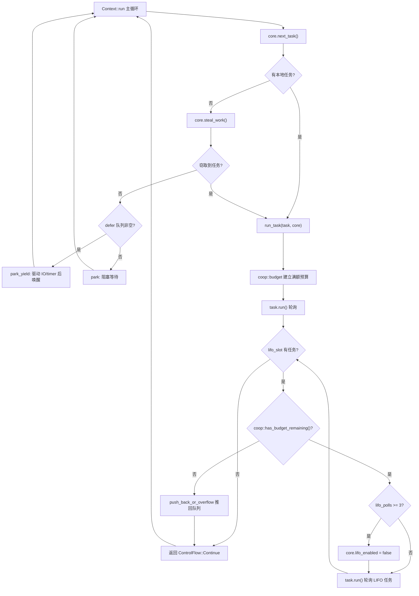

# Kapitel 12: Kooperative Planung und Budget: Wie der coop-Mechanismus verhindert, dass Tasks den Scheduler aushungern

Im vorherigen Kapitel haben wir gesehen, wie tokio-stream und tokio-util die zugrunde liegenden Waker- und Scheduling-Mechanismen wiederverwenden, um Kernfähigkeiten zu erweitern. Doch egal wie viele Kombinatoren erweitert werden, der Kernwiderspruch der asynchronen Laufzeit bleibt bestehen: Der Scheduler muss CPU-Zeit fair zwischen mehreren Tasks aufteilen, während die Tasks selbst nicht präemptiv sind – sobald die poll-Ausführung eines Future beginnt, kann der Scheduler es nicht von außen unterbrechen. Wenn ein Task in einem einzigen poll hunderttausend Nachrichten in einer Schleife verarbeitet oder in einer loop wiederholt ein Future awaitet, das immer bereit ist, monopolisiert es den Worker-Thread und lässt andere Tasks auf demselben Thread nie zum Zuge kommen. Das ist das klassische Problem „Task hungert Scheduler aus". Tokios Lösung ist nicht Präemption, sondern Kooperation: Jedem Task wird innerhalb eines Planungszyklus ein begrenztes Budget zugewiesen, Ressourcenoperationen verbrauchen Budget, und wenn das Budget erschöpft ist, muss der Task aktiv abgeben. Dieses Kapitel taucht tief in die Implementierung dieses coop-Mechanismus ein.

# 12.1 Der Träger des Budgets: Thread-lokaler Speicher und die Budget-Struktur

> **[Design Inference & Architectural Trade-offs]**
> Wenn man den Scheduler mit dem einzigen Kellner in einem Restaurant vergleicht und Tasks mit Gästen, die ständig nachbestellen, dann ist das coop-Budget die Regel „Jeder Gast darf höchstens N Gerichte bestellen" – der Kellner muss den Gast nicht gewaltsam unterbrechen, er muss nur nach N Bestellungen sagen: „Ruhn Sie sich kurz aus, ich bediene den Nächsten." Ohne diese Regel könnte ein geschwätziger Gast das gesamte Restaurant lahmlegen.

Das Budget muss zwei Einschränkungen erfüllen: Erstens muss es von beliebig tiefen`poll`Aufrufstapeln aus zugänglich sein, ohne Parameter durch alle Ebenen zu reichen; zweitens muss es unterscheiden können, ob man sich „gerade innerhalb der Tokio-Laufzeit befindet" – außerhalb der Laufzeit aufgerufen`block_on`sollte es nicht durch das Budget eingeschränkt werden. Tokio wählt**Thread-lokalen Speicher (TLS)**als Träger des Budgets und verwaltet es einheitlich über das`context`Modul.

Der Kerntyp des Budgets ist`coop::Budget`. Obwohl der Quellcode-Ausschnitt dieses Kapitels nicht direkt die vollständige Definition von`coop.rs`liefert, lässt sich aus den Verwendungsstellen von`worker.rs`sein Schnittstellenvertrag ableiten:

[FACT:tokio/src/runtime/scheduler/multi_thread/worker.rs:695-795]

```rust
coop::budget(|| {
    // ... 轮询任务 ...
    task.run();
    // ...
    loop {
        // ...
        if !coop::has_budget_remaining() {
            // 预算耗尽，把 LIFO 任务推回队列
            core.run_queue.push_back_or_overflow(task, ...);
            return ControlFlow::Continue(core);
        }
        // ...
    }
})
```

Hier erscheinen drei zentrale APIs:`coop::budget(closure)`errichtet einen Budget-Gültigkeitsbereich,`coop::has_budget_remaining()`fragt das verbleibende Budget ab, und später werden wir`coop::stop()`und`coop::set()`。`budget`sehen. Die Semantik ist: Beim Eintritt in die Closure wird das Budget des aktuellen Threads auf einen vollen Wert zurückgesetzt (Standard 128), während der Ausführung der Closure teilen sich alle Ressourcenoperationen dieses Kontingent, und beim Verlassen der Closure wird das äußere Budget wiederhergestellt.

> **[Design Inference & Architectural Trade-offs]**
> Der Budgetwert 128 ist ein Erfahrungswert: Er ist groß genug, damit eine normale Nachrichtenverarbeitungsschleife (z. B. dutzende Nachrichten pro poll) nicht häufig eine Abgabe auslöst; und klein genug, damit eine außer Kontrolle geratene Schleife nach höchstens 128 Ressourcenoperationen abgeben muss, wodurch die Latenz in einem akzeptablen Bereich bleibt.

`Budget`existiert im TLS üblicherweise in Form von`Cell<Option<Budget>>`.`Option`Die äußere Semantik von`None`ist „ob sich der aktuelle Thread im Tokio-Laufzeitkontext befindet":`block_on`bedeutet, nicht innerhalb der Laufzeit zu sein (z. B. außerhalb der Laufzeit

# ), wobei alle Budget-Prüfungen direkt durchgelassen werden.

12.2 Die Verbrauchspunkte des Budgets: Wie Ressourcenoperationen es verringern**Das Budget wird nicht aus dem Nichts verbraucht, nur**Ressourcenoperationen`send`/`recv`verringern es. Unter Ressourcenoperationen versteht man APIs, die potenziell in Endlosschleifen aufgerufen werden und mit der Außenwelt interagieren – channel`yield_now`, I/O-Lese- und Schreibvorgänge,`mpsc::Sender::reserve`usw. Nehmen wir

[FACT:tokio/src/sync/mpsc/bounded.rs:1272-1311]

```rust
async fn reserve_inner(&self, n: usize) -> Result> {
    crate::trace::async_trace_leaf().await;

    if n > self.max_capacity() {
        return Err(SendError(()));
    }
    // ... WakeReceiverOnDrop guard ...
    let guard = WakeReceiverOnDrop { chan: &self.chan };
    let result = self.chan.semaphore().semaphore.acquire(n).await;
    // ...
}
```

`reserve_inner`Kopieren`crate::trace::async_trace_leaf()`Bevor`async_trace_leaf`tatsächlich die Semaphore-Berechtigung erwirbt, durchläuft es`coop::poll_proceed`. Dieser scheinbar nur Tracing-Aufruf ist tatsächlich einer der Anknüpfungspunkte für die Budget-Verringerung.`Proceed`ruft intern eine Funktion wie`Pending`auf: Wenn das Budget ausreicht, wird 1 abgezogen und

zurückgegeben; wenn das Budget erschöpft ist, wird eine „Abgabe"-Aktion registriert – der Waker des aktuellen Tasks wird an den Scheduler übergeben, und**zurückgegeben, wodurch der Task in diesem poll vorzeitig beendet wird.`Pending`**Das ist die Raffinesse von coop:`Pending`Budget-Erschöpfung wirft keinen Fehler, sondern tarnt die „Abgabe" als gewöhnliches

`yield_now`. Das übergeordnete Future sieht**und kehrt natürlich zurück, der Scheduler reiht den Task wieder ein, und beim nächsten Scheduling ist das Budget bereits zurückgesetzt, sodass der Task ab der letzten Unterbrechungsstelle fortfährt. Der gesamte Prozess ist für den Geschäftscode völlig transparent.**：

[FACT:tokio/src/task/yield_now.rs:38-60]

```rust
pub async fn yield_now() {
    let mut yielded = false;
    poll_fn(|cx| {
        ready!(crate::trace::trace_leaf());

        if yielded {
            return Poll::Ready(());
        }

        yielded = true;

        // Don't wake the task immediately, as that would push it right back
        // onto the run queue and it could be polled again before other tasks
        // or the IO/timer driver get a chance to run. Instead, hand the waker
        // to the scheduler, which wakes deferred tasks only after it has run
        // out of ready tasks and polled the driver. When polled from outside
        // a Tokio runtime, the waker is woken immediately.
        context::defer(cx.waker());

        Poll::Pending
    })
    .await
}
```

löst aktiv eine Abgabe aus`context::defer(cx.waker())`Kopieren`wake`Beachten Sie die Zeile**. Sie ruft nicht direkt**auf, sondern übergibt den Waker an die

defer-Warteschlange`Context`des Schedulers. Warum? Der Quellcode-Kommentar sagt es klar: Bei sofortigem Aufwecken würde der Task sofort wieder in die Ausführungswarteschlange gestellt und könnte erneut gepollt werden, bevor der I/O-/Timer-Treiber läuft, wodurch die Abgabe ihren Sinn verliert. Die Semantik der defer-Warteschlange ist: „Diese Tasks erst aufwecken, nachdem der aktuelle Worker die bereiten Tasks abgearbeitet und die Treiber gepollt hat."

[FACT:tokio/src/runtime/scheduler/multi_thread/worker.rs:247-257]

```rust
pub(crate) struct Context {
    worker: Arc,
    core: RefCell>>,
    /// Tasks to wake after resource drivers are polled. This is mostly to
    /// handle yielded tasks.
    pub(crate) defer: Defer,
}
```

`defer`des Workers definiert:

[FACT:tokio/src/runtime/scheduler/multi_thread/worker.rs:613-621]

```rust
} else {
    // Wait for work
    core = if !self.defer.is_empty() {
        self.park_yield(core)
    } else {
        self.park(core)
    };
    core.stats.start_processing_scheduled_tasks();
}
```

Wenn die defer-Warteschlange nicht leer ist, ruft der Worker`park_yield`auf – parkt mit 0 Timeout, was I/O und Timer antreibt und dann die Aufgaben im defer aufweckt. Dies garantiert, dass eine „abgegebene" Aufgabe erst nach einem Durchlauf des Treibers neu geplant wird.

# 12.3 Aufbau und Wiederherstellung des Budget-Geltungsbereichs: run_task und block_in_place

Der Budget-Geltungsbereich wird in`run_task`eingerichtet. Wenn jede Aufgabe gepollt wird,`coop::budget`umschließt den gesamten Poll-Vorgang:

[FACT:tokio/src/runtime/scheduler/multi_thread/worker.rs:691-704]

```rust
// Make the core available to the runtime context
*self.core.borrow_mut() = Some(core);

// Run the task
coop::budget(|| {
    // ...
    task.run();
    // ...
})
```

`coop::budget`Beim Eintritt wird das Budget im TLS auf den vollen Betrag gesetzt, beim Austritt wiederhergestellt. Das bedeutet,**jede Aufgabe erhält bei jedem Poll einen völlig neuen Budgetbetrag**. Unabhängig davon, wie oft innerhalb einer Aufgabe`await`Ressourcenoperationen durchgeführt werden, wird die Aufgabe zwangsweise abgegeben, sobald innerhalb eines einzelnen`poll`mehr als 128 verbraucht werden.

Doch hier gibt es ein subtiles Problem: Aufgaben im LIFO-Slot werden innerhalb**derselben`budget`Closure**gepollt. Betrachten wir die Schleife von`run_task`:

[FACT:tokio/src/runtime/scheduler/multi_thread/worker.rs:709-750]

```rust
let mut lifo_polls = 0;

// As long as there is budget remaining and a task exists in the
// `lifo_slot`, then keep running.
loop {
    let mut core = match self.core.borrow_mut().take() {
        Some(core) => core,
        None => {
            return ControlFlow::Break(());
        }
    };

    let task = match core.lifo_slot.take() {
        Some(task) => task,
        None => {
            self.reset_lifo_enabled(&mut core);
            core.stats.end_poll();
            return ControlFlow::Continue(core);
        }
    };

    if !coop::has_budget_remaining() {
        core.stats.end_poll();
        // Not enough budget left to run the LIFO task, push it to
        // the back of the queue and return.
        core.run_queue.push_back_or_overflow(task, ...);
        debug_assert!(core.lifo_enabled);
        return ControlFlow::Continue(core);
    }
    // ...
}
```

Der entscheidende Punkt: Aufgaben im LIFO-Slot**teilen sich das Budget der äußeren Aufgabe**. Der Kommentar am Anfang von`run_task`besagt: „Tasks from the LIFO slot inherit the 'parent's limits". Dies ist beabsichtigtes Design – wenn jede LIFO-Aufgabe das Budget zurücksetzen würde, würden im Ping-Pong-Szenario (Aufgabe A weckt B, B weckt wieder A) beide Aufgaben sich gegenseitig unendlich oft planen, das Budget würde stets zurückgesetzt, und das Verhungerungsproblem bliebe bestehen. Geteiltes Budget bedeutet, dass A und B zusammen höchstens 128 Ressourcenoperationen verbrauchen können, danach muss abgegeben werden.

Der LIFO-Slot selbst hat noch einen unabhängigen Ratenbegrenzer`MAX_LIFO_POLLS_PER_TICK`：

[FACT:tokio/src/runtime/scheduler/multi_thread/worker.rs:756-766]

```rust
// Disable the LIFO slot if we reach our limit
//
// In ping-ping style workloads where task A notifies task B,
// which notifies task A again, continuously prioritizing the
// LIFO slot can cause starvation as these two tasks will
// repeatedly schedule the other. To mitigate this, we limit the
// number of times the LIFO slot is prioritized.
if lifo_polls >= MAX_LIFO_POLLS_PER_TICK {
    core.lifo_enabled = false;
    super::counters::inc_lifo_capped();
}
```

`MAX_LIFO_POLLS_PER_TICK`Der Wert von ist 3:

[FACT:tokio/src/runtime/scheduler/multi_thread/worker.rs:263-263]

```rust
/// Value picked out of thin-air. Running the LIFO slot a handful of times
/// seems sufficient to benefit from locality. More than 3 times probably is
/// over-weighting. The value can be tuned in the future with data that shows
/// improvements.
const MAX_LIFO_POLLS_PER_TICK: usize = 3;
```

Dies ist**die zweite Verteidigungslinie**: Selbst wenn das Budget noch nicht erschöpft ist, wird der LIFO-Slot nach dreimaliger aufeinanderfolgender Bevorzugung deaktiviert, und nachfolgende Aufgaben laufen über die normale Warteschlange. Das Budget regelt die „Gesamtmenge der Ressourcenoperationen", die LIFO-Ratenbegrenzung regelt die „Anzahl der gegenseitigen Aufweckungen desselben Aufgabenpaares" – beide ergänzen sich.

Der Budget-Geltungsbereich hat in`block_in_place`eine wichtige Ausnahme.`block_in_place`übergibt den Worker-Core an einen anderen Thread, und der aktuelle Thread geht in den blockierenden Zustand über. Blockierender Code unterliegt nicht der Budgetbeschränkung, daher muss das Budget**pausiert**werden:

[FACT:tokio/src/runtime/scheduler/multi_thread/worker.rs:406-417]

```rust
if had_entered {
    // Unset the current task's budget. Blocking sections are not
    // constrained by task budgets.
    let _reset = Reset {
        take_core,
        budget: coop::stop(),
    };

    crate::runtime::context::exit_runtime(f)
} else {
    f()
}
```

`coop::stop()`gibt das aktuelle Budget zurück und setzt es auf`None`(d. h. „nicht innerhalb der Laufzeit"),`Reset`die`Drop`von stellt es nach Ende der Blockierung wieder her:

[FACT:tokio/src/runtime/scheduler/multi_thread/worker.rs:374-397]

```rust
impl Drop for Reset {
    fn drop(&mut self) {
        with_current(|maybe_cx| {
            if let Some(cx) = maybe_cx {
                if self.take_core {
                    let core = cx.worker.core.take();
                    // ...
                    *cx_core = core;
                }

                // Reset the task budget as we are re-entering the
                // runtime.
                coop::set(self.budget);
            }
        });
    }
}
```

`coop::set(self.budget)`stellt das zuvor`stop()`gespeicherte Budget wieder her. Auf diese Weise verbraucht synchroner blockierender Code innerhalb von`block_in_place`kein Budget und löst auch nicht fälschlicherweise eine Abgabe wegen erschöpften Budgets aus; nach Ende der Blockierung setzt die Aufgabe ihre Ausführung mit dem ursprünglichen Restbudget fort.

Die folgende Abbildung zeigt den vollständigen Kontrollfluss von der Planung einer Aufgabe bis zur Abgabe wegen erschöpften Budgets:



In der Abbildung sind zwei Abgabepfade zu erkennen: Bei erschöpftem Budget wird die LIFO-Aufgabe zurück in die Warteschlange geschoben (`push_back_or_overflow`), und bei Überschreitung der aufeinanderfolgenden LIFO-Bevorzugung wird der LIFO-Slot deaktiviert. Beide führen zurück zur Hauptschleife, sodass der Worker Gelegenheit hat, andere Aufgaben zu bearbeiten oder den Treiber anzutreiben.

# 12.4 Designüberlegungen, Fehlerbehandlung und Produktions-Fallstricke

**Warum TLS statt expliziter Parameterübergabe?**Die Budget-Prüfpunkte sind tief in verschiedenen Modulen wie channel, I/O, time verstreut. Bei expliziter Parameterübergabe müsste jede API einen zusätzlichen`Budget`Parameter erhalten, was die gesamte öffentliche Schnittstelle verschmutzt. TLS macht das Budget für den Geschäftscode völlig transparent, zum Preis eines TLS-Zugriffsaufwands pro Prüfung. Tokio verwendet`#[thread_local]`oder plattformspezifisches schnelles TLS, um diesen Aufwand zu minimieren.

**Zusammenspiel von Budget-Erschöpfung und Abbruchsicherheit.**Wenn die Budget-Erschöpfung dazu führt, dass`reserve_inner`zurückgibt`Pending`, könnte sich die Aufgabe gerade in einem bestimmten Zweig von`select!`befinden. Wenn zu diesem Zeitpunkt ein anderer Zweig bereit ist,`select!`wird der aktuelle Zweig abgebrochen –`reserve_inner`der`WakeReceiverOnDrop`-Guard prüft beim Drop, ob „das Semaphore geschlossen und leer ist", und weckt die Empfängerseite auf:

[FACT:tokio/src/sync/mpsc/bounded.rs:1286-1299]

```rust
struct WakeReceiverOnDrop {
    chan: &'a chan::Tx,
}

impl Drop for WakeReceiverOnDrop {
    fn drop(&mut self) {
        use chan::Semaphore;

        let semaphore = self.chan.semaphore();
        if semaphore.is_closed() && semaphore.is_idle() {
            self.chan.wake_rx();
        }
    }
}
```

Die Existenz dieses Guards zeigt: Das durch das Budget ausgelöste`Pending`und das echte „keine Berechtigung"`Pending`müssen sich auf dem Abbruchpfad identisch verhalten, sonst könnte die Empfängerseite nie die Benachrichtigung „channel wurde geschlossen" erhalten.

**Produktions-Fallstrick: Versteckte Latenz durch Budget-Erschöpfung.**Ein häufiges Phänomen ist: Die Geschwindigkeit, mit der eine Aufgabe Nachrichten verarbeitet, wird plötzlich langsamer, aber die CPU-Auslastung ist nicht hoch. Bei der Fehlersuche verdächtigt man leicht Lock-Konkurrenz oder I/O, tatsächlich aber hat die Aufgabe möglicherweise innerhalb eines einzelnen Poll mehr als 128 Nachrichten verarbeitet, was eine Budget-Abgabe ausgelöst hat, und jede Abgabe durchläuft einen vollständigen Zyklus von „Zurückschieben in die Warteschlange → Neuplanung → Treiber-Poll". Wenn die Nachrichtenverarbeitung selbst schnell ist, kann dieser Planungsaufwand einen hohen Anteil ausmachen. Die Lösung besteht darin, die Massenverarbeitung in mehrere`spawn`Aufgaben aufzuteilen oder explizit im Loop`yield_now`。

**einzufügen. Die Grenze zwischen Budget und`block_in_place`.**Wie zuvor gesehen,`block_in_place`wird`coop::stop()`das Budget pausiert. Aber Vorsicht:`coop::stop()`wird nur aufgerufen, wenn`had_entered`wahr ist, d. h. nur pausiert, wenn man sich tatsächlich auf einem Laufzeit-Worker-Thread befindet. Wenn`block_in_place`außerhalb der Laufzeit aufgerufen wird,`f()`direkt ausgeführt, und der Budget-Zustand bleibt unverändert. Diese Verzweigungsprüfung erfolgt in`maybe_move_runtime`:

[FACT:tokio/src/runtime/scheduler/multi_thread/worker.rs:424-464]

```rust
with_current(|maybe_cx| {
    match (
        crate::runtime::context::current_enter_context(),
        maybe_cx.is_some(),
    ) {
        (context::EnterRuntime::Entered { .. }, true) => {
            had_entered = true;
        }
        (
            context::EnterRuntime::Entered {
                allow_block_in_place,
            },
            false,
        ) => {
            if allow_block_in_place {
                had_entered = true;
                return Ok(());
            } else {
                return Err(
                    "can call blocking only when running on the multi-threaded runtime",
                );
            }
        }
        (context::EnterRuntime::NotEntered, true) => {
            return Ok(());
        }
        (context::EnterRuntime::NotEntered, false) => {
            return Ok(());
        }
    }
    // ...
})
```

Die vier Kombinationen entsprechen: innerhalb eines Worker-Threads,`block_on`dem Thread-Pool-Eingang,`block_in_place`verschachteltem

> **[Design Inference & Architectural Trade-offs]**
> **〔Design-Schlussfolgerung und Architektur-Abwägung〕**Der Budgetwert ist nicht konfigurierbar.`Builder`Option. Dies ist beabsichtigt: Der Budgetwert beeinflusst die Abwägung zwischen Scheduling-Fairness und Durchsatz. Wenn Benutzer ihn beliebig anpassen könnten, wäre es leicht, eine Konfiguration zu erstellen, bei der „ein zu großes Budget zu Verhungern führt" oder „ein zu kleines Budget zu einer Explosion des Scheduling-Overheads führt". Tokio entscheidet sich, dies als interne Invariante zu behandeln.

# Zusammenfassung dieses Kapitels

Der coop-Mechanismus löst das Fairness-Problem nicht-präemptiver Scheduler mit einem dreischichtigen Design:

1. **Budget-Träger**：`coop::Budget`In TLS gespeichert,`Option`Die äußere Schicht unterscheidet innerhalb/außerhalb der Laufzeit,`coop::budget`Erstellt einen Ganzbudget-Gültigkeitsbereich,`coop::stop`/`coop::set`Unterstützt Pausieren und Fortsetzen (`block_in_place`Szenario).

2. **Verbrauchspunkte**: Ressourcenoperationen (Channel-Senden/-Empfangen, I/O,`yield_now`) über`coop::poll_proceed`reduzieren das Budget; bei Erschöpfung wird das „Abgeben" als`Pending`getarnt, transparent für die Geschäftslogik.

3. **Abgabepfad**：`yield_now`Übergibt den Waker über`context::defer`an die defer-Warteschlange, um sicherzustellen, dass erst nach dem Treiber-Polling neu geplant wird; LIFO-Slot-Aufgaben teilen das Budget der Elternaufgabe und haben eine`MAX_LIFO_POLLS_PER_TICK = 3`unabhängige Ratenbegrenzung.

Die zentrale Erkenntnis dieses Mechanismus ist:**Fairness erfordert keine Präemption, sondern nur, dass eine „Endlosschleife" nach einer endlichen Anzahl von Schritten natürlich unterbrochen wird**. Das Budget ist das Maß für diese „endliche Anzahl von Schritten".

# Denkanstöße und Selbsttests zu diesem Kapitel

Q1: Wenn man in`run_task`die`coop::budget`LIFO-Schleife innerhalb des Closures so ändert, dass vor jedem Polling einer LIFO-Aufgabe`coop::budget`aufgerufen wird, um das Budget zurückzusetzen, was passiert im Ping-Pong-Szenario (Aufgabe A weckt B, B weckt A)? Warum wählt der Quellcode, dass LIFO-Aufgaben das Budget der Elternaufgabe teilen?

**Referenzanalyse**: Der Quellcode erklärt im Kommentar von`run_task`ausdrücklich: „Tasks from the LIFO slot inherit the 'parent''s limits"[FACT:tokio/src/runtime/scheduler/multi_thread/worker.rs:679-682]. Wenn jede LIFO-Aufgabe das Budget zurücksetzen würde, würde im A→B→A→B-Ping-Pong-Szenario jedes Polling ein volles Budget erhalten, und die beiden Aufgaben könnten sich unbegrenzt gegenseitig planen, ohne jemals wegen Budgeterschöpfung abzugeben. Obwohl die`MAX_LIFO_POLLS_PER_TICK = 3`Ratenbegrenzung den LIFO-Slot nach 3 Mal deaktiviert[FACT:tokio/src/runtime/scheduler/multi_thread/worker.rs:756-766], laufen die Aufgaben nach Deaktivierung des LIFO über die normale Warteschlange. Wenn sich nur A und B in der Warteschlange befinden, werden sie weiterhin abwechselnd geplant, nur ohne LIFO-Priorität. Das geteilte Budget bildet die Absicherung über die Gesamtmenge der Ressourcenoperationen: A und B zusammen können maximal 128 Ressourcenoperationen verbrauchen, dann müssen sie abgeben und anderen Aufgaben sowie dem Treiber eine Chance geben. Die beiden Verteidigungslinien ergänzen sich und sind beide unverzichtbar.

Q2: `yield_now`Verwendet`context::defer(cx.waker())`statt`cx.waker().wake_by_ref()`. Angenommen, man ändert`defer`so, dass es direkt`wake`aufruft. Welche Konsequenzen hätte es im Single-Worker-Multitasking-Szenario, wenn eine Aufgabe in einer Schleife wiederholt`yield_now`aufruft? Analysieren Sie dies im Zusammenhang mit dem`park_yield`-Zweig der Worker-Hauptschleife.

**Referenzanalyse**：`yield_now`Der Kommentar von[FACT:tokio/src/task/yield_now.rs:49-54]erklärt den Grund: Direktes Wecken schiebt die Aufgabe sofort zurück in die Ausführungswarteschlange und könnte dazu führen, dass sie erneut gepollt wird, bevor der I/O/Timer-Treiber läuft`yield_now`. Im Single-Worker-Szenario, wenn eine Aufgabe in einer Schleife wiederholt`next_task`aufruft und jedes Mal direkt weckt, würde der`park_yield`-Zweig der Worker-Hauptschleife sofort diese Aufgabe nehmen und erneut pollen,[FACT:tokio/src/runtime/scheduler/multi_thread/worker.rs:613-621]der`defer`-Zweig (zuständig für das Treiben von I/O und Timer)

Q3: `block_in_place`würde niemals ausgeführt, weil die defer-Warteschlange leer ist und die lokale Warteschlange immer Aufgaben hat. Das Ergebnis ist, dass I/O-Ereignisse und Timer niemals verarbeitet werden und die gesamte Laufzeit „scheintot" ist – Aufgaben laufen, aber Ereignisse aus der Außenwelt können nicht voranschreiten.`coop::stop()`Die`None`，`Reset::drop`-Warteschlange stellt sicher, dass eine abgegebene Aufgabe erst nach dem Treiber-Polling geweckt wird, wodurch dem Treiber ein Ausführungsfenster gegeben wird.`coop::set(self.budget)`In`block_in_place`setzt`f`das Budget auf`block_in_place`in`maybe_move_runtime`wiederhergestellt. Wenn innerhalb des Closures

**von**erneut`block_in_place`aufgerufen wird (verschachtelt), was passiert mit dem Budgetzustand?`maybe_move_runtime`Welcher Zweig von`(context::EnterRuntime::NotEntered, true)`behandelt diesen Fall?[FACT:tokio/src/runtime/scheduler/multi_thread/worker.rs:454-458]Referenzanalyse`return Ok(())`: Verschachteltes`had_entered`wird vom`block_in_place`-Zweig in`if had_entered`behandelt`coop::stop()`. Dieser Zweig ruft direkt`Reset`auf, ohne`f()`zu setzen, daher ist die`coop::stop()`-Prüfung des äußeren`None`falsch und es wird nicht erneut`Reset::drop`aufgerufen oder ein neues`None`erstellt. Der Kommentar erklärt: „This is a nested call to block_in_place (we already exited). All the necessary setup has already been done." – Die äußere Schicht hat das Budget bereits pausiert und den Core übergeben, die innere Schicht muss nur direkt

ausführen. Wenn die innere Schicht erneut
