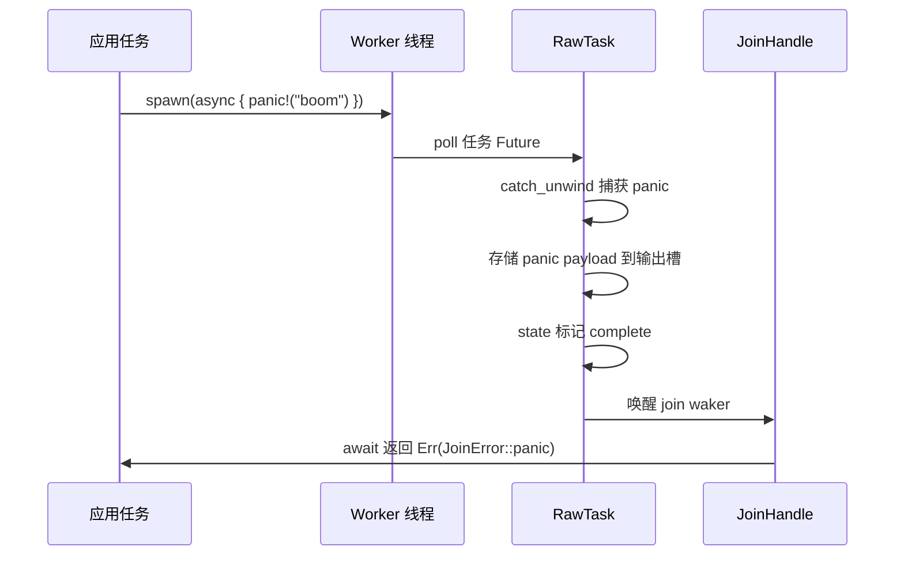
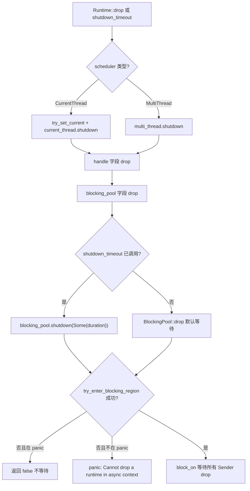
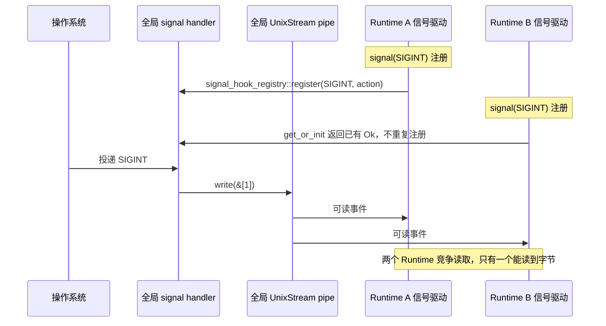

# statt des ursprünglichen Budgets der äußeren Schicht), was zu einem dauerhaften Budgetverlust führt und alle nachfolgenden Ressourcenoperationen der Aufgabe unbeschränkt bleiben.

Im vorherigen Kapitel haben wir das coop-Kooperationsbudget aufgeschlüsselt: Jede Aufgabe hat innerhalb eines Scheduling-Zyklus nur ein begrenztes Budget und muss nach dessen Erschöpfung abgeben, wodurch verhindert wird, dass eine einzelne Aufgabe andere aushungert. Doch der Budgetmechanismus löst nur das Problem der „fairen Planung". In realen Produktionsumgebungen gibt es eine weitere, verstecktere Fallgrube – Abbruchsicherheit, panic-Ausbreitung und Shutdown-Reihenfolge. Wenn select! ein Future abbricht, wenn ein Aufgaben-panic abgefangen wird, wenn die Runtime heruntergefahren wird – das Grenzverhalten des Codes widerspricht oft der Intuition. Dieses Kapitel beginnt mit der Abbruchsicherheit und schaut zuerst, was ein gedropptes Future tatsächlich verliert.

# 13.2 panic-Ausbreitung: Wie JoinError einen Absturz abfängt

## Intuitives Modell

Ein Tokio-Aufgaben-panic lässt nicht den gesamten Prozess abstürzen (außer bei panic=abort), sondern wird abgefangen, verpackt in`JoinError`, über`JoinHandle::await`zurückgegeben. Das ist wie ein Unfall an einer Station am Fließband: Das Sicherheitsnetz fängt den Arbeiter auf, aber das Produkt ist Ausschuss – du bekommst einen „Unfallbericht" statt des Produkts.

## Datenstruktur und Zustand

`JoinHandle<T>`Das`Future::Output`von`super::Result<T>`ist`Result<T, JoinError>` [FACT:tokio/src/runtime/task/join.rs:325]。`JoinError`, d.h.

```rust
let join_handle = tokio::spawn(async { panic!("boom"); });
let err = join_handle.await.unwrap_err();
assert!(err.is_panic());
```

[FACT:tokio/src/runtime/task/join.rs:121-127]

Kopieren`RawTask`Der Mechanismus, mit dem panic abgefangen wird, liegt im poll-Pfad von`catch_unwind`: Beim poll der Aufgabe wird sie mit`JoinHandle::poll`umschlossen; nach einem panic wird die Payload in den Ausgabe-Slot der Aufgabe gespeichert, der Zustand als complete markiert und dann der join-Waker geweckt.`try_read_output`Was über`Err(JoinError::panic(payload))`。

## gelesen wird, ist



Kopieren`JoinError`Kernpunkt: Die panic-Payload bleibt vollständig erhalten,`std::error::Error`implementiert`into_panic()`, kann über`Box<dyn Any + Send>`das`downcast_ref::<&str>()`zurückholen und dann mit

## die panic-Nachricht extrahieren.

**Designüberlegungen und Stolperfallen`JoinHandle`Falle 1:`UnwindSafe`Das**

```rust
impl UnwindSafe for JoinHandle {}
impl RefUnwindSafe for JoinHandle {}
```

[FACT:tokio/src/runtime/task/join.rs:176-181]

ist manuell implementiert.`T: UnwindSafe`Kopieren`JoinHandle`Dies ist eine bedingungslose Implementierung, die kein`T`，`T`erfordert. Grund:`catch_unwind`selbst hält kein`T`In der Heap-Zuweisung der Aufgabe wurde panic bereits durch`UnwindSafe`，`JoinHandle`isoliert. Also ist es auch dann sicher, wenn

**nicht**ist.`JoinHandle`Falle 2: panic breitet sich nicht automatisch auf die Elternaufgabe aus.

**Wenn Aufgabe A Aufgabe B spawnt und B panicked, wird A nicht automatisch benachrichtigt, es sei denn A awaited das`spawn_blocking`von B. Wenn A nicht awaited, wird Bs panic stillschweigend verschluckt. Dies ist eine der verstecktesten Bug-Quellen in Produktionsumgebungen.**Falle 3:`catch_unwind`Der panic von`Mutex`wird ebenfalls abgefangen.`std::sync::Mutex`Die Worker des Blocking-Threadpools umschließen Aufgaben ebenfalls mit

**; nach einem panic stirbt der Thread nicht, sondern kehrt in den Pool zurück und nimmt weiter Arbeit an. Aber wenn du in einer Blocking-Aufgabe ein**hältst und es bei panic nicht freigibst, führt das zu Lock-Vergiftung – das ist das inhärente Verhalten von`catch_unwind`, Tokio greift nicht ein.

# Falle 4: panic beim Runtime-Drop.

## Wenn eine Aufgabe während des Runtime-Drops panicked, bleibt

wirksam, aber der join-Waker ist möglicherweise bereits ungültig, und die panic-Payload wird verworfen. Dies ist eine Teilmenge des Shutdown-Reihenfolge-Problems, das im nächsten Abschnitt entfaltet wird.

## 13.3 Shutdown-Reihenfolge: Bereinigung von Blocking-Threads und I/O-Ressourcen

`Runtime`Intuitives Modell

```rust
pub struct Runtime {
    scheduler: Scheduler,
    handle: Handle,
    blocking_pool: BlockingPool,
}
```

[FACT:tokio/src/runtime/runtime.rs:97-106]

`Drop`Datenstruktur und Shutdown-Pfad

```rust
impl Drop for Runtime {
    fn drop(&mut self) {
        match &mut self.scheduler {
            Scheduler::CurrentThread(current_thread) => {
                let _guard = context::try_set_current(&self.handle.inner);
                current_thread.shutdown(&self.handle.inner);
            }
            Scheduler::MultiThread(multi_thread) => {
                multi_thread.shutdown(&self.handle.inner);
            }
        }
    }
}
```

[FACT:tokio/src/runtime/runtime.rs:506-521]

bestimmen die Shutdown-Reihenfolge:`Drop`Kopieren`scheduler`，**Die Implementierung von`blocking_pool`**。`blocking_pool`:`Drop`Kopieren`Runtime::drop`Beachte:`scheduler` → `handle` → `blocking_pool`behandelt nur

, es wird nicht explizit`shutdown_timeout`behandelt. Das Schließen von

```rust
pub fn shutdown_timeout(mut self, duration: Duration) {
    self.handle.inner.shutdown();
    self.blocking_pool.shutdown(Some(duration));
}
```

[FACT:tokio/src/runtime/runtime.rs:457-461]

statt und wird nach der Rückkehr von`handle.inner.shutdown()`durch die Feld-Drop-Reihenfolge ausgelöst. Die Feld-Drop-Reihenfolge ist die Deklarationsreihenfolge:`blocking_pool.shutdown(Some(duration))`. Daher wird der Blocking-Pool zuletzt geschlossen.`duration`。

## Aber

`blocking/shutdown.rs`steuert die Reihenfolge explizit:

```rust
pub(super) struct Sender {
    _tx: Arc>,
}

pub(super) struct Receiver {
    rx: oneshot::Receiver,
}
```

[FACT:tokio/src/runtime/blocking/shutdown.rs:13-19]

Zuerst`Sender`, um Scheduler und I/O-Treiber zum Stoppen zu benachrichtigen, dann`Arc<oneshot::Sender>`, um auf Blocking-Aufgaben zu warten, maximal`Sender`Der zugrundeliegende Mechanismus des Schließens des Blocking-Pools`Receiver`verwendet einen raffinierten oneshot-Channel:`wait`Kopieren

```rust
pub(crate) fn wait(&mut self, timeout: Option) -> bool {
    use crate::runtime::context::try_enter_blocking_region;

    if timeout == Some(Duration::from_nanos(0)) {
        return false;
    }

    let mut e = match try_enter_blocking_region() {
        Some(enter) => enter,
        _ => {
            if std::thread::panicking() {
                return false;
            } else {
                panic!(
                    "Cannot drop a runtime in a context where blocking is not allowed. \
                    This happens when a runtime is dropped from within an asynchronous context."
                );
            }
        }
    };

    if let Some(timeout) = timeout {
        e.block_on_timeout(&mut self.rx, timeout).is_ok()
    } else {
        let _ = e.block_on(&mut self.rx);
        true
    }
}
```

[FACT:tokio/src/runtime/blocking/shutdown.rs:37-70]

-Klon (intern ein

1. `timeout == Some(0)`). Wenn alle Worker beendet sind und alle`shutdown_background`gedroppt wurden, empfängt

2. `try_enter_blocking_region()`die Benachrichtigung.`None`。

Die

-Methode:`block_on_timeout`Kopieren

## Schrittweise Analyse:



## , es wird nicht gewartet.

**Versucht, in den Blocking-Bereich einzutreten. Wenn man sich gerade im asynchronen Kontext befindet (z.B. Runtime in einer async-Aufgabe droppen), wird**Die Fehlermeldung ist eindeutig: „Cannot drop a runtime in a context where blocking is not allowed"[FACT:tokio/src/runtime/blocking/shutdown.rs:51-54]. Die Lösung ist die Verwendung von`shutdown_background()`, was äquivalent zu`shutdown_timeout(Duration::from_nanos(0))` [FACT:tokio/src/runtime/runtime.rs:494-496]ist und nicht auf blockierende Tasks wartet.

**Falle 2:`shutdown_background`lässt blockierende Tasks auslaufen.**Die Dokumentation warnt ausdrücklich: „this may result in a resource leak (in that any blocking tasks are still running until they return)"[FACT:tokio/src/runtime/runtime.rs:470-472]. Blockierende Tasks laufen weiter, bis sie natürlich zurückkehren, aber die Runtime wurde bereits gedroppt, und die von ihnen gehaltenen Ressourcen sind möglicherweise ungültig geworden.

**Falle 3: I/O-Ressourcen werden nach dem Drop der Runtime ungültig.**Die Dokumentation erklärt: „Once the runtime has been dropped, any outstanding I/O resources bound to it will no longer function"[FACT:tokio/src/runtime/runtime.rs:52-54]。`is_rt_shutdown_err`Die Funktion dient zum Erkennen solcher Fehler.[FACT:tokio/src/runtime/runtime.rs:585-593]。

**Falle 4:`Drop`wartet standardmäßig unbegrenzt.**Die Dokumentation weist darauf hin: „The`Drop` implementation waits forever for this」[FACT:tokio/src/runtime/runtime.rs:43-44]. Wenn ein blockierender Task hängt (z. B. in einer Endlosschleife), wird das Droppen der Runtime dauerhaft blockiert. In der Produktion sollte`shutdown_timeout`mit einer Obergrenze verwendet werden.

# 13.4 Signalverarbeitung und Konflikte mit mehreren Runtimes

## Intuitives Modell

Unix-Signale sind prozessweit, aber Tokios`Signal`ist an die Runtime gebunden. Das ist wie ein gemeinsamer Feueralarm im gesamten Gebäude, aber jeder Raum hat einen eigenen Empfänger – die erste Person, die einen Empfänger installiert, ändert die Verkabelung des Alarms, und alle nachfolgenden können diese Änderung nur noch teilen.

## Datenstrukturen und globaler Zustand

`signal_enable`ist der Einstiegspunkt für die Registrierung von Signal-Handlern:

```rust
fn signal_enable(signal: SignalKind, handle: &Handle) -> io::Result {
    let signal = signal.0;
    if signal  slot,
        None => return Err(io::Error::other("signal too large")),
    };

    siginfo
        .init
        .get_or_init(|| {
            unsafe { signal_hook_registry::register(signal, move || action(globals, signal)) }
                .map(|_| ())
                .map_err(|e| e.raw_os_error())
        })
        .map_err(|e| {
            e.map_or_else(
                || Error::other("registering signal handler failed"),
                || Error::from_raw_os_error,
            )
        })
}
```

[FACT:tokio/src/signal/unix.rs:266-296]

Kernpunkte:

1. `signal <= 0 || FORBIDDEN.contains(&signal)`lehnt ungültige Signale ab.

2. `handle.check_inner()`prüft, ob der Signal-Treiber läuft – wenn die Runtime bereits heruntergefahren ist, schlägt dies hier fehl.

3. `siginfo.init.get_or_init(...)`verwendet`OnceLock`, um sicherzustellen, dass jeder Signal-OS-Handler nur einmal registriert wird.`get_or_init`Die Closure von ruft`signal_hook_registry::register`auf, was eine globale, prozessweite Registrierung ist.

4. Der registrierte Handler ist`action(globals, signal)`, er erledigt zwei Dinge:`globals.record_event(signal)`Ereignis aufzeichnen und dann ein Byte in die Pipe schreiben, um den Treiber aufzuwecken[FACT:tokio/src/signal/unix.rs:252-259]。

## Ursache von Konflikten mit mehreren Runtimes

`globals()`gibt einen prozessweiten globalen`Globals`，`OsExtraData`zurück. Die`UnixStream`in

```rust
pub(crate) struct OsExtraData {
    sender: UnixStream,
    pub(crate) receiver: UnixStream,
}
```

[FACT:tokio/src/signal/unix.rs:61-64]

`Default`Kopieren`UnixStream` [FACT:tokio/src/signal/unix.rs:61-64]Die Implementierung erstellt ein Paar

. Diese Pipe ist global eindeutig, alle Signal-Treiber aller Runtimes teilen sie.`signal_enable`Das Problem:`handle.check_inner()`In**prüft**den Signal-Treiber der aktuellen Runtime. Aber der von`signal_hook_registry::register`registrierte Handler ist prozessweit**und schreibt in die globale**Pipe. Wenn Runtime A zuerst SIGINT registriert und dann Runtime B ebenfalls SIGINT registriert,**gibt direkt die vorhandene**zurück und registriert nicht erneut. Aber der Signal-Treiber von Runtime B liest Daten aus der globalen Pipe – beide Runtimes konkurrieren um die Bytes derselben Pipe.`get_or_init`Szenariobasierter Walkthrough: Signalwettlauf bei mehreren Runtimes`Ok(())`Kopieren

## Designüberlegungen und Fallstricke



## Die Dokumentation warnt ausdrücklich: „Once a signal handler is registered with the process the underlying libc signal handler is never unregistered"

**. Selbst wenn die**-Instanz gedroppt wird, werden nachfolgende Signale weiterhin von Tokio abgefangen, das Standardverhalten wird nicht wiederhergestellt.[FACT:tokio/src/signal/unix.rs:379-380]Falle 2: Signale werden zusammengefasst.`Signal`Die Dokumentation erklärt: „before[FACT:tokio/src/signal/unix.rs:338-340]。

**. Wenn Sie 10 SIGINT empfangen, aber nur einmal pollen, sehen Sie nur ein Ereignis. Das ist eine Eigenschaft von Unix-Signalen selbst (Standard-Signale werden nicht in eine Warteschlange gestellt), Tokio führt keine zusätzliche Zusammenfassung durch.**Falle 3: Signale können bei mehreren Runtimes verloren gehen.`poll` is called, all signal notifications are coalesced into one item returned from `poll`」[FACT:tokio/src/signal/unix.rs:312-315]Da die globale Pipe von mehreren Runtimes konkurrierend gelesen wird, kann eine Runtime die Bytes weglaufen, während eine andere nie darauf wartet. In der Produktion sollte man Signale nur in einer Runtime verarbeiten oder

**selbst verwalten.**Falle 4:`signal_hook`Panic-Bedingungen der Funktion.

**Die Dokumentation erklärt: „This function panics if there is no current reactor set, or if the`signal`. Ein Aufruf von**außerhalb einer Runtime führt zu einem Panic.`rt` feature flag is not enabled」[FACT:tokio/src/signal/unix.rs:398-405]Falle 5:`signal()`Cancel-Sicherheit von

**. Die Dokumentation garantiert: „This method is cancel safe. If you use it as a branch in`recv()`. Der Grund ist, dass Signalereignisse im globalen**gespeichert werden,`tokio::select!` and another branch completes first, then it is guaranteed that no signal is lost」[FACT:tokio/src/signal/unix.rs:423-427]nur liest und den zugrunde liegenden Zustand nicht konsumiert.`EventInfo`Designüberlegungen`recv()`Die drei Themen dieses Kapitels teilen ein zugrunde liegendes Muster:

# Die Eigentümerschaft des Zustands bestimmt die Sicherheit von Abbruch/Herunterfahren/Signalen

ist cancel-sicher, weil die Ausgabe auf dem Heap liegt und das Handle nur eine Referenz ist.**Die Reihenfolge des Herunterfahrens der Runtime ist kritisch, weil der Blocking-Pool und der Scheduler gemeinsam genutzt werden**。

- `JoinHandle` 取消安全，因为输出在堆上，handle 只是引用。
- Runtime 关闭顺序敏感，因为阻塞池和调度器共享 `Handle`, eine falsche Reihenfolge führt zu Deadlock oder Panic.
- Signale kollidieren mit mehreren Runtimes, weil Handler und Pipe prozessweiter globaler Zustand sind, während`Signal`eine Runtime-weite Sicht ist.

Nachdem man dieses Muster verstanden hat, lassen sich die Fallstricke in drei Prinzipien zusammenfassen:

1. **Cancel-Safety = Zustand außerhalb des Future.**Wenn das Future intern einen Puffer hat, geht beim Drop Daten verloren.`JoinHandle`、`Signal::recv`、`tokio::sync::mpsc::Receiver::recv`Alle erfüllen diese Bedingung.

2. **Shutdown-Reihenfolge = Umgekehrte Abhängigkeitsrichtung.**Wer von wem abhängt, zuerst wird der Abhängige geschlossen. Der Scheduler hängt vom I/O-Treiber ab, also wird zuerst der Scheduler geschlossen; der Blocking-Pool ist unabhängig und wird zuletzt geschlossen.

3. **Globaler Zustand = Konflikte bei mehreren Instanzen.**Jede prozessweite Ressource (Signal-Handler, Pipe, Dateideskriptor-Tabelle) kollidiert bei mehreren Runtimes; entweder auf eine einzelne Runtime beschränken oder externe Synchronisation verwenden.

# Zusammenfassung dieses Kapitels

# Fragen und Selbsttests zu diesem Kapitel

Q1: Wenn man in`JoinHandle::poll``coop::poll_proceed(cx)`entfernt, in welchem Szenario würde dies dazu führen, dass andere Tasks verhungern? Warum verbraucht`try_read_output`selbst kein Budget?

**Referenzanalyse**：`coop::poll_proceed(cx)`verbraucht kooperatives Budget bei[FACT:tokio/src/runtime/task/join.rs:325-325]. Wenn man es entfernt, kann ein Task, der in einer Schleife wiederholt`select!`mehrere`JoinHandle`aufruft, in einem einzigen Scheduling-Zyklus unendlich alle Handles abfragen und niemals`Pending`zurückgeben, wodurch andere Tasks auf demselben Worker verhungern.`try_read_output`selbst verbraucht kein Budget, weil es nur ein Speicherlesen + möglicherweise Speichern eines Wakers ist, ohne I/O oder Lock-Konkurrenz, mit extrem geringem Overhead. Die Absicht des Budget-Mechanismus ist, „möglicherweise lang laufende Operationen" zu begrenzen, nicht jede Poll mit Kosten zu belegen. Beachten Sie, dass`coop.made_progress()`nur bei`ret.is_ready()`aufgerufen wird[FACT:tokio/src/runtime/task/join.rs:349-351], d. h. Budget wird nur zurückgegeben, wenn tatsächlich eine Ausgabe erzielt wurde – dies verhindert, dass Operationen, die „gepollt aber ohne Ergebnis" sind, das Budget kumulativ verbrauchen.

Q2：`blocking/shutdown.rs`In der`wait`-Methode von`try_enter_blocking_region()`, wenn`None`zurückgibt`false`und gerade ein Panic läuft, warum wird entschieden,

**zurückzugeben, statt weiter zu warten? Was würde passieren, wenn man stattdessen weiter warten würde?**：`try_enter_blocking_region()`Referenzanalyse`None`Die Rückgabe von[FACT:tokio/src/runtime/blocking/shutdown.rs:44-57]zeigt an, dass man sich gerade in einem asynchronen Kontext befindet, in dem Blockieren nicht erlaubt ist`false`. Wenn gerade ein Panic läuft, entscheidet der Code,[FACT:tokio/src/runtime/blocking/shutdown.rs:47-49]zurückzugeben, ohne auf`block_on`zu warten. Der Grund: Ein erneutes Panic während des Panic-Unwinding führt zum Prozess-Abort (Double Panic). Wenn man stattdessen weiter warten würde, müsste`block_on`aufgerufen werden, und in einem asynchronen Kontext würde`false`paniken – ein Panic während des Panic-Unwinding würde den Prozess direkt abbrechen und alle Diagnoseinformationen verlieren. Die Rückgabe von

lässt den Drop weiter abschließen, und die Panic-Informationen bleiben erhalten. Dies ist ein „Graceful Degradation"-Design: Ein unvollständiges Herunterfahren ist immer noch besser als ein Prozessabsturz.`Signal`Q3: Angenommen, Sie erstellen in Runtime A`Signal`, um SIGTERM zu überwachen, und verschieben dann`signal_enable`in Runtime B zum Pollen.`handle.check_inner()`Welche Runtime prüft`Signal`in

**? Wenn Runtime A zuerst gedroppt wird, kann**：`signal_enable`in Runtime B noch Signale empfangen?`signal()`Referenzanalyse`handle`wird beim Aufruf von[FACT:tokio/src/signal/unix.rs:398-405]。`check_inner()`ausgeführt; zu diesem Zeitpunkt ist[FACT:tokio/src/signal/unix.rs:275]。`Signal`Runtime A's`RxFuture`. Geprüft wird Runtime A's Signal-Treiber`watch::Receiver<()>` [FACT:tokio/src/signal/unix.rs:366-368]. Intern ist`Globals`ein`EventInfo`, das`record_event`umschließt; dieser Receiver ist beim globalen`EventInfo`registriert`Signal`. Wenn Runtime A gedroppt wird, stoppt sein Signal-Treiber das Lesen aus der globalen Pipe, aber der globale Handler wird weiterhin`Signal` **und in die Pipe schreiben. Wenn Runtime B's Signal-Treiber ebenfalls läuft, liest er die Pipe-Daten und löst**aus, wodurch der Waker von`Signal`geweckt wird. Daher kann

# in Runtime B möglicherweise

noch Signale empfangen, aber es hängt davon ab, ob Runtime B einen laufenden Signal-Treiber hat. Wenn Runtime B keinen Signal-Treiber hat (z. B. das Signal-Feature nicht aktiviert ist oder der Treiber geschlossen wurde), liest niemand die Pipe-Daten, und`catch_unwind`wartet ewig auf ein Wecken. Dies ist die Fragilität der Signalverarbeitung mit mehreren Runtimes.`Globals`Kapitelübergang

Cancel-Safety, Panic-Propagierung, Shutdown-Reihenfolge, Signalkonflikte – die gemeinsame Wurzel dieser vier Probleme ist die Unschärfe der „Zustands-Eigentümerschaft" an asynchronen Grenzen. Tokio gibt eine praktisch nutzbare Antwort, indem es Zustand auf dem Heap ablegt, Lebenszyklen über Referenzzählung verwaltet,

Damit haben wir die tückischsten Randbereiche der Tokio-Produktionsumgebung durchlaufen: Cancel-Safety hängt davon ab, dass Ausgaben auf dem Heap gespeichert werden, die Atomarität von try_read_output; JoinHandle::drop bricht die Aufgabe nicht ab, erst abort bricht sie wirklich ab, aber nicht bei spawn_blocking; ein Panic wird von catch_unwind abgefangen und in einen JoinError verpackt, und ohne await geht er still verloren; das Herunterfahren der Runtime hat eine strikte Reihenfolge, und ein Drop im async-Kontext führt zu einem Panic; Signal-Handler sind prozessweiter globaler Zustand und werden nach der Registrierung nie wieder entfernt. Hinter diesen Regeln steht Tokios wiederholtes Abwägen zwischen Korrektheit und Leistung. Im nächsten Kapitel verlassen wir die konkreten Mechanismen, blicken aus der Architekturperspektive auf die Herkunft dieser Abwägungen zurück und werfen einen Blick darauf, wohin io_uring, Treiber-Refactoring und die Schnittstelle für benutzerdefinierte Executoren Tokio führen werden.
