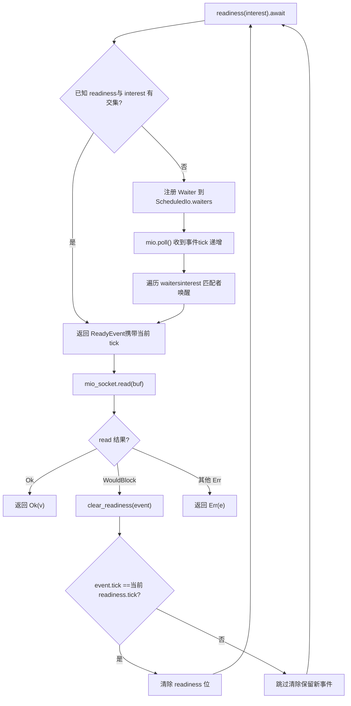
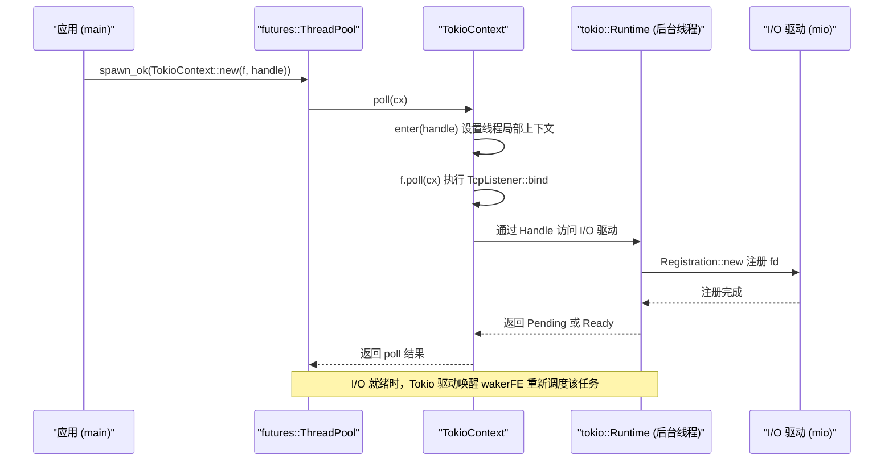

# Kapitel 14: Architektur-Abwägungen und zukünftige Entwicklung: Von io_uring zu austauschbaren Treibern

Im vorherigen Kapitel haben wir die vier Arten von Produktionsfallen sortiert: Cancel-Safety, Panic-Weiterleitung, Shutdown-Reihenfolge und Signal-Konflikte. Sie wirken verstreut, weisen aber alle auf dasselbe Architekturproblem hin: Wie wird die Zustands-Eigentümerschaft an asynchronen Grenzen klar aufgeteilt? Und die Art der Aufteilung der Eigentümerschaft wird genau durch die drei grundlegendsten Architekturentscheidungen der Runtime bestimmt – wie Aufgaben geplant werden, wie I/O-Ereignisse verteilt werden und wie Nebenläufigkeits-Korrektheit verifiziert wird. Dieses Kapitel taucht nicht mehr in die Implementierungsdetails einer konkreten Funktion ein, sondern stellt sich auf die Architekturebene, blickt auf Tokios Abwägungen bei diesen Entscheidungen zurück und folgt den in offizieller Dokumentation und Quellcode bereits angelegten Entwicklungslinien, um zu sehen, wohin io_uring, Treiber-Refactoring und die Schnittstelle für benutzerdefinierte Executoren Tokio führen werden. Nach diesem Kapitel sollten Sie eine praktische Frage beantworten können: Wann sollte man Tokio erweitern, und wann sollte man es umgehen.

# I. Drei historische Abwägungen: Warum es so ist, wie es ist

## Intuitives Modell

Stellen Sie sich Tokio als ein Restaurant vor, das seit zehn Jahren geöffnet ist. Die Schichtplanung der Küche (work-stealing), die eigenständige Aufstellung der Kellner (Trennung von I/O-Treiber und Scheduler) und das Hygienekontrollsystem der Küche (loom-Nebenläufigkeitsverifikation) wurden nicht am ersten Öffnungstag entworfen, sondern haben sich schrittweise im Prozess „mehr Gäste, komplexere Gerichte“ entwickelt. Nur wenn man diese Evolution versteht, kann man beurteilen, welche Designs vorausschauende Planung und welche historischer Ballast sind.

## Abwägung eins: work-stealing statt globaler Warteschlange

> **[Design Inference & Architectural Trade-offs]**
> Die Implementierung einer globalen Warteschlange ist am einfachsten: Alle Aufgaben gehen in eine`Mutex<VecDeque>`, und Worker-Threads konkurrieren um die Sperre, um Aufgaben zu entnehmen. Aber Sperrkonkurrenz verschlechtert sich mit steigender Kernzahl, und die Cache-Lokalität ist schlecht – auf welchem Kern eine Aufgabe erstellt und auf welchem Kern sie ausgeführt wird, ist völlig zufällig.

Die Abwägung bei work-stealing ist: Jeder Worker hält eine lokale Warteschlange,`spawn`bevorzugt in die lokale Warteschlange eingefügt wird (lock-free, cache-freundlich), und erst wenn die lokale Warteschlange leer ist, wird vom Ende der Warteschlange eines anderen Workers gestohlen. Der Preis ist, dass die Lastverteilung Verzögerungen hat und das Stehlen selbst atomare Operationen und Speicherbarrieren erfordert. Tokio wählt Letzteres, weil moderne Server leicht mehrere Dutzend Kerne haben und die Kosten der Sperrkonkurrenz weit über den gelegentlichen Stehlkosten liegen.

> **[Design Inference & Architectural Trade-offs]**
> Die Randbedingung dieser Entscheidung ist:**Die Aufgabengranularität darf nicht zu fein sein**. Wenn jede Aufgabe nur Arbeit von wenigen Mikrosekunden verrichtet, geraten die Anteile von Stehlen und Scheduling außer Kontrolle. Deshalb verlangt Tokio neben`spawn_blocking`auch, dass lange Aufgaben aktiv`yield_now()`– kooperatives Scheduling fängt im Wesentlichen work-stealing ab.

## Abwägung zwei: I/O-Treiber unabhängig vom Scheduler

Dies ist die interessanteste Stelle im Quellcode-Material dieses Kapitels. Betrachten Sie die Modulstruktur von`tokio/src/runtime/io/mod.rs`:

[FACT:tokio/src/runtime/io/mod.rs:5-22]

```rust
mod driver;
use driver::{Direction, Tick};
pub(crate) use driver::{Driver, Handle, ReadyEvent};

mod registration;
pub(crate) use registration::Registration;

mod registration_set;
use registration_set::RegistrationSet;

mod scheduled_io;
use scheduled_io::ScheduledIo;

mod metrics;
use metrics::IoDriverMetrics;

use crate::util::ptr_expose::PtrExposeDomain;
static EXPOSE_IO: PtrExposeDomain = PtrExposeDomain::new();
```

Beachten Sie, dass`driver`、`registration`、`scheduled_io`drei unabhängige Module sind und nach außen nur die Typen`Driver`、`Handle`、`ReadyEvent`、`Registration`exponiert werden.`ScheduledIo`ist`pub(crate)`– es wird von`PtrExposeDomain`umschlossen, um unter loom-Tests rohe Zeiger der Nebenläufigkeitsprüfung auszusetzen.

> **[Design Inference & Architectural Trade-offs]**
> Warum ist der I/O-Treiber nicht direkt in den Scheduler eingebettet? Weil sich die Lebensdauer und das Nebenläufigkeitsmodell der beiden unterscheiden. Den Scheduler interessiert „welche Aufgabe soll laufen“, den I/O-Treiber interessiert „welcher fd ist bereit“. Wären sie gekoppelt, müsste bei jeder Anpassung der Scheduling-Strategie der I/O-Pfad geändert werden und umgekehrt. Wichtiger noch:`block_on`Die Single-Thread-Runtime braucht ebenfalls einen I/O-Treiber, aber keinen work-stealing-Scheduler – die Trennung ermöglicht es beiden Runtimes, dieselbe I/O-Implementierung wiederzuverwenden.

## Abwägung drei: loom zur Prüfung des Nebenläufigkeitsmodells

`tokio/src/loom/mod.rs`hat nur 14 Zeilen, offenbart aber Tokios Strategie zur Verifikation der Nebenläufigkeits-Korrektheit:

[FACT:tokio/src/loom/mod.rs:1-14]

```rust
//! This module abstracts over `loom` and `std::sync` depending on whether we
//! are running tests or not.

#![allow(unused)]

#[cfg(not(all(test, loom)))]
mod std;
#[cfg(not(all(test, loom)))]
pub(crate) use self::std::*;

#[cfg(all(test, loom))]
mod mocked;
#[cfg(all(test, loom))]
pub(crate) use self::mocked::*;
```

Entscheidend ist die Bedingung`#[cfg(all(test, loom))]`: Nur wenn gleichzeitig`test`und`loom`zwei cfgs aktiviert sind, wird das Modul`mocked`durch`std`ersetzt. Das bedeutet, dass im Produktions-Build überhaupt kein loom-Code enthalten ist, also null Laufzeit-Overhead.

> **[Design Inference & Architectural Trade-offs]**
> Der Wert von loom liegt darin, dass es „alle möglichen Reihenfolgen von Thread-Verschränkungen“ erschöpfend aufzählen kann. Wie`ScheduledIo`in`AtomicUsize`das Read-Modify-Write von`Waiters`Das Einfügen und Löschen in verketteten Listen mag auf echter Hardware millionenfach fehlerfrei laufen, aber loom kann in Sekunden eine Verzahnung konstruieren, die eine Race Condition auslöst. Der Preis dafür sind langsame Testläufe und hoher Speicherverbrauch, weshalb es nur für Unit-Tests verwendet werden kann und nicht in die Produktion gehört.

## Designüberlegungen

Diese drei Abwägungen haben ein gemeinsames Merkmal:**Sie alle wählen den „komplexeren, aber skalierbareren" Ansatz und beschränken die Komplexität auf das Innere**. Die Komplexität von work-stealing ist im Scheduler verborgen, die Komplexität der I/O-Treiber ist in`ScheduledIo`verborgen, und die Komplexität von loom ist in cfg-Bedingungen verborgen. Die nach außen exponierte API ist stets`spawn`、`TcpStream::read`diese einfachen Schnittstellen.

> **[Design Inference & Architectural Trade-offs]**
> Dies ist auch die erste Richtlinie zur Beurteilung der Frage „Wann sollte Tokio erweitert werden":**Wenn deine Anforderungen durch die bestehende API ausgedrückt werden können, dann fasse die internen Strukturen nicht an**. Sobald du beginnst, dich auf`pub(crate)`Typen oder`tokio_unstable`cfg von Tokio zu verlassen, bedeutet das, dass du dich an die interne Implementierung von Tokio bindest und bei Upgrades einen Preis zahlen wirst.

---

# Zwei. Treiber-Refactoring: Von „ein Waker, eine Richtung" zu „beliebige Interessenmengen"

## Intuitives Modell

Die frühen Tokio-I/O-Typen hatten eine harte Einschränkung:`async fn read(&mut self)`benötigt`&mut self`. Das ist wie ein Restaurant mit nur einem Ausgabefenster, an dem sich jeweils nur eine Person anstellen kann – weil der Waker im Inneren der I/O-Ressource gespeichert wurde und nicht im Future, das der Operation entspricht.`tokio/docs/reactor-refactor.md`dokumentiert vollständig die Ursache dieser Einschränkung und den Refactoring-Plan.

## Die Schmerzpunkte der alten Architektur

Das Dokument benennt das Problem gleich zu Beginn:

[FACT:tokio/docs/reactor-refactor.md:16-20]

```rust
Currently, I/O types require `&mut self` for `async` functions. The reason for
this is the task's waker is stored in the I/O resource's internal state
(`ScheduledIo`) instead of in the future returned by the `async` function.
Because of this limitation, I/O types limit the number of wakers to one per
direction (a direction is either read-related events or write-related events).
```

> **[Design Inference & Architectural Trade-offs]**
> Den Waker im Inneren der Ressource zu speichern bedeutet, dass „eine Richtung nur einen Wartenden haben kann". Wenn du gleichzeitig dasselbe`TcpStream`lesen und schreiben möchtest, musst du es`split()`in zwei Hälften teilen, die jeweils einen unabhängigen Waker-Slot besitzen. Deshalb existiert`TcpStream::split()`– es ist keine API-Designpräferenz, sondern eine direkte Einschränkung der internen Datenstruktur.

## Neue Architektur: Den Waker in das Future verschieben

Der Kernansatz des Refactorings ist „den Waker vom Ressourcenzustand in das Operations-Future zu verschieben", um so die Registrierung mehrerer Waker pro Operation zu ermöglichen:

[FACT:tokio/docs/reactor-refactor.md:22-25]

```rust
Moving the waker from the internal I/O resource's state to the operation's
future enables multiple wakers to be registered per operation. The "intrusive
wake list" strategy used by `Notify` applies to this case, though there are some
concerns unique to the I/O driver.
```

Die neue`ScheduledIo`-Struktur sieht wie folgt aus:

[FACT:tokio/docs/reactor-refactor.md:97-134]

```rust
#[derive(Debug)]
pub(crate) struct ScheduledIo {
    /// Resource's known state packed with other state that must be
    /// atomically updated.
    readiness: AtomicUsize,

    /// Tracks tasks waiting on the resource
    waiters: Mutex,
}

#[derive(Debug)]
struct Waiters {
    // List of intrusive waiters.
    list: LinkedList,

    /// Waiter used by `AsyncRead` implementations.
    reader: Option,

    /// Waiter used by `AsyncWrite` implementations.
    writer: Option,
}

// This struct is contained by the **future** returned by `readiness()`.
#[derive(Debug)]
struct Waiter {
    /// Intrusive linked-list pointers
    pointers: linked_list::Pointers,

    /// Waker for task waiting on I/O resource
    waiter: Option,

    /// Readiness events being waited on. This is
    /// the value passed to `readiness()`
    interest: mio::Ready,

    /// Should not be `Unpin`.
    _p: PhantomPinned,
}
```

Hier gibt es einige raffinierte Designpunkte, die es wert sind, näher erläutert zu werden:

**Erstens,`readiness`ist`AtomicUsize`，`waiters`ist`Mutex<Waiters>`。**Warum nicht eine einzige Sperre zum Schutz beider verwenden? Weil Leseoperationen auf`readiness`extrem häufig sind (bei jedem`readiness()`-Aufruf muss geprüft werden), während Schreiboperationen nur beim Empfang von mio-Ereignissen auftreten. Atomare Variablen für einen lock-freien Lesepfad zu verwenden, ist eine typische Optimierung der Trennung von Lesen und Schreiben.

**Zweitens,`Waiter`ist ein intrusiver Listenknoten.** `pointers: linked_list::Pointers<Waiter>`lässt`Waiter`selbst Teil der Liste werden, ohne dass ein zusätzlicher Knoten allokiert werden muss.`_p: PhantomPinned`markiert explizit, dass es nicht`Unpin`werden kann – denn sobald sich die Adresse eines Knotens in einer intrusiven Liste verschiebt, bricht die Liste.

**Drittens,`reader`und`writer`zwei`Option<Waker>`sind für`AsyncRead`/`AsyncWrite`gedacht.**Das Dokument erklärt den Grund:

[FACT:tokio/docs/reactor-refactor.md:210-213]

```rust
The `AsyncRead` and `AsyncWrite` traits use a "poll" based API. This means that
it is not possible to use an intrusive linked list to track the waker.
Additionally, there is no future associated with the operation which means it is
not possible to cancel interest in the readiness events.
```

> **[Design Inference & Architectural Trade-offs]**
> Dies ist ein kompromisshaftes Koexistieren der alten und neuen Mechanismen:`async fn`Der`poll`-Pfad verwendet eine intrusive Liste (unterstützt mehrere Wartende, ist abbrechbar), der

## -Pfad verwendet feste Slots (unterstützt kein Abbrechen, ist aber trait-kompatibel). Diese „Koexistenz zweier Mechanismen" ist der typische Preis eines schrittweisen Refactorings.

Race Conditions und der tick-Mechanismus

[FACT:tokio/docs/reactor-refactor.md:175-175]

```rust
If care is not taken, if between `mio_socket.read(buf)` returning and
`clear_readiness(event)` is called, a readiness event arrives, the `read()`
function could deadlock. This happens because the readiness event is received,
`clear_readiness()` unsets the readiness event, and on the next iteration,
`readiness().await` will block forever as a new readiness event is not received.
```

Kopieren`readiness`Die Lösung ist die Einführung eines tick-Mechanismus, der`AtomicUsize`dieses

[FACT:tokio/docs/reactor-refactor.md:199-199]

```
| shutdown | generation |  driver tick | readiness |
|----------+------------+--------------+-----------|
|   1 bit  |   7 bits   +    8 bits    +  16 bits  |
```

> **[Design Inference & Architectural Trade-offs]**
> 〔Designschlussfolgerungen und Architekturabwägungen〕`tick`Dieses Bitsegment-Layout ist ein klassisches Beispiel für „Raum gegen Korrektheit zu tauschen".`mio::poll()`wird bei jedem`ReadyEvent`inkrementiert,`clear_readiness()`trägt den tick zum Zeitpunkt des Lesens.

löscht den Bereitschaftszustand nur, wenn der tick übereinstimmt – wenn der tick nicht übereinstimmt, bedeutet das, dass in der Zwischenzeit ein neues Ereignis eingetroffen ist, und es darf nicht gelöscht werden. Auf diese Weise wird die Race Condition zwischen „Löschen" und „Eintreffen eines neuen Ereignisses" in einem einzigen atomaren Lese-Ändere-Schreibe-Vorgang aufgelöst.`readiness()`Das folgende Flussdiagramm veranschaulicht den Entscheidungspfad zwischen`clear_readiness()`und



Kopieren`tick_match`Der entscheidende Zweig in diesem Diagramm liegt bei`clear_readiness`: Wenn der tick nicht übereinstimmt, muss`readiness()`das Löschen aufgeben, sonst geht das gerade eingetroffene Ereignis verloren, was dazu führt, dass die nächste Runde

## dauerhaft blockiert.

Interessen-Abmeldung und Speicherlecks`readiness()`Die intrusive Liste bringt ein neues Problem mit sich: Wenn das von

[FACT:tokio/docs/reactor-refactor.md:144-148]

```rust
The future returned by `readiness()` uses an intrusive linked list to store the
waker with `ScheduledIo`. Because `readiness()` can be called concurrently, many
wakers may be stored simultaneously in the list. If the `readiness()` future is
dropped early, it is essential that the waker is removed from the list. This
prevents leaking memory.
```

> **[Design Inference & Architectural Trade-offs]**
> 〔Designschlussfolgerungen und Architekturabwägungen〕`readiness()`Genau dies ist die Verkörperung von „Cancel Safety" aus dem vorherigen Kapitel auf der I/O-Ebene.`Drop`Das Future von`ScheduledIo`muss sich in der

## -Implementierung selbst aus der Liste entfernen, sonst bleibt der Knoten dauerhaft in

**, was sowohl Speicher leckt als auch beim nächsten Eintreffen eines Ereignisses fälschlicherweise aufgeweckt wird.`Vec<Waker>`Designüberlegungen und Stolperfallen in der Produktion**Warum nicht`&Resource`, sondern eine intrusive Liste verwenden?

[FACT:tokio/docs/reactor-refactor.md:228-233]

```rust
It is only possible to implement `AsyncRead` and `AsyncWrite` for resource types
themselves and not for `&Resource`. Implementing the traits for `&Resource`
would permit concurrent operations to the resource. Because only a single waker
is stored per direction, any concurrent usage would result in deadlocks. An
alternate implementation would call for a `Vec` but this would result in
memory leaks.
```

> **[Design Inference & Architectural Trade-offs]**
> `Vec<Waker>`Kopieren

**〔Designschlussfolgerungen und Architekturabwägungen〕**：`TcpStream::by_ref()`Das Problem bei`TcpStreamRef`ist: Nachdem das Future gedroppt wurde, bleibt der entsprechende Waker im Vec und kann nicht lokalisiert und entfernt werden; man kann nur beim nächsten Eintreffen eines Ereignisses feststellen, dass „dieser Waker bereits ungültig ist". Die intrusive Liste macht die Knotenadresse zur Adresse des Feldes im Inneren des Futures, sodass beim Drop präzise entfernt werden kann.`read_waiter`Stolperfallen in der Produktion`write_waiter`Das von

[FACT:tokio/docs/reactor-refactor.md:238-244]

```rust
struct TcpStreamRef {
    stream: &'a TcpStream,

    // `Waiter` is the node in the intrusive waiter linked-list
    read_waiter: Waiter,
    write_waiter: Waiter,
}
```

> **[Design Inference & Architectural Trade-offs]**
> und`TcpStreamRef`zwei Knoten:`select!`Kopieren`by_ref()`〔Designschlussfolgerungen und Architekturabwägungen〕`TcpStreamRef`Das bedeutet, sobald`TcpStream`gedroppt wird, werden beide waiter-Knoten gleichzeitig ungültig. Wenn du in`select!`Referenzen auf

---

# über Branches hinweg teilst, sei vorsichtig mit den Lebensdauern –

## Intuitionsmodell

Manchmal möchtest du nicht den Scheduler von Tokio verwenden, sondern nur dessen I/O und Timer nutzen. Das ist, als ob du nicht im Restaurant essen möchtest, sondern nur den Lieferfenster-Service nutzen willst.`examples/custom-executor.rs`zeigt dieses „Hybridmodell": Verwende`futures::executor::ThreadPool`für die Planung, Tokio für I/O.

## Kernmechanismus: TokioContext

Der Schlüssel des gesamten Beispiels liegt in`TokioContext`diesem Wrapper-Typ:

[FACT:examples/custom-executor.rs:51-54]

```rust
impl ThreadPool {
    fn spawn(&self, f: impl Future + Send + 'static) {
        let handle = self.rt.handle().clone();
        self.inner.spawn_ok(TokioContext::new(f, handle));
    }
}
```

> **[Design Inference & Architectural Trade-offs]**
> `TokioContext::new(f, handle)`bindet das Future und Tokios`Handle`aneinander. Wenn der externe Executor dieses Wrapper-Future pollt,`TokioContext`tritt es zuerst in den Laufzeitkontext von Tokio ein (setzt das thread-lokale`Handle`), und pollt dann das innere`f`. So kann`f`beim Aufruf von`TcpListener::bind`den I/O-Treiber von Tokio finden.

Betrachte die Struktur des gesamten Beispiels:

[FACT:examples/custom-executor.rs:38-48]

```rust
static EXECUTOR: Lazy = Lazy::new(|| {
    // Spawn tokio runtime on a single background thread
    // enabling IO and timers.
    let rt = tokio::runtime::Builder::new_multi_thread()
        .enable_all()
        .build()
        .unwrap();
    let inner = futures::executor::ThreadPool::builder().create().unwrap();

    ThreadPool { inner, rt }
});
```

> **[Design Inference & Architectural Trade-offs]**
> Hier wird die Tokio-Laufzeit erstellt, aber**nicht von`block_on`angetrieben**——sie „existiert" nur und stellt den I/O-Treiber und Timer bereit. Die eigentliche Aufgabenplanung übernimmt`futures::executor::ThreadPool`. In diesem Modus laufen Tokios Worker-Threads tatsächlich im Leerlauf (warten auf I/O-Ereignisse), und die Aufgabenausführung findet im Thread-Pool von futures statt.

## Datenfluss: Die executorübergreifende Reise eines TcpListener::bind



Der Schlüssel dieses Sequenzdiagramms liegt darin:**Das Polling der Aufgabe findet im futures-Thread-Pool statt, aber das Warten auf I/O-Ereignisse findet in einem Tokio-Hintergrundthread statt**. Beide werden durch`Handle`und den Waker verbunden.

## Designüberlegung: Wann sollte man Tokio umgehen

> **[Design Inference & Architectural Trade-offs]**
> Die bloße Existenz dieses Beispiels ist ein Signal: Tokios Architektur erlaubt es, „nur den I/O-Treiber zu verwenden, ohne den Scheduler". Die Beurteilungskriterien lassen sich in drei Punkte zusammenfassen:

1. **Wenn du dich in ein bestehendes Executor-Ökosystem integrieren musst**(zum Beispiel verlangen manche Frameworks zwingend`futures::executor`), ist`TokioContext`die am wenigsten invasive Lösung.

2. **Wenn du die Planungsstrategie vollständig kontrollieren musst**(zum Beispiel erfordern Echtzeitsysteme deterministische Planung), erfüllt Tokios work-stealing die Anforderungen nicht, aber sein I/O-Treiber ist weiterhin nutzbar.

3. **Wenn du nur die Komplexität von Tokios API ablehnst**, dann solltest du es nicht umgehen——`TokioContext`die eingeführte executorübergreifende Grenze bringt neue Debugging-Schwierigkeiten mit sich, was den Aufwand nicht lohnt.

**Fallstricke im Produktivbetrieb**：`TokioContext`Im`block_on`-Modus wird Tokios Laufzeit-`Runtime::shutdown`nie aufgerufen, was bedeutet, dass die Bereinigungslogik von`Runtime`nicht automatisch ausgelöst wird. Du musst

## vor dem Programmende explizit droppen, sonst wird der Hintergrundthread des I/O-Treibers möglicherweise nicht ordnungsgemäß beendet.

> **[Design Inference & Architectural Trade-offs]**
> `tokio/src/runtime/io/mod.rs`〔Designüberlegungen und Architekturabwägungen〕

[FACT:tokio/src/runtime/io/mod.rs:1-4]

```rust
#![cfg_attr(
    not(all(feature = "rt", feature = "net", feature = "io-uring", tokio_unstable)),
    allow(dead_code)
)]
```

verrät, wie io_uring eingebunden wird:`feature = "io-uring"`Kopieren`tokio_unstable`Beachte, dass**und**gleichzeitig auftreten. Das bedeutet, dass die io_uring-Unterstützung derzeit`allow(dead_code)`experimentell`allow`ist und nur kompiliert werden kann, wenn gleichzeitig das unstable-Feature aktiviert wird.

> **[Design Inference & Architectural Trade-offs]**
> unterdrücken.`read`/`write`〔Designüberlegungen und Architekturabwägungen〕`ScheduledIo`Der grundlegende Unterschied zwischen io_uring und epoll besteht darin: epoll ist „Bereitschaftsbenachrichtigung", io_uring ist „Abschlussbenachrichtigung". Ersteres erfordert, dass die Anwendung selbst den`readiness()`-Systemaufruf auslöst, während letzteres I/O direkt vom Kernel abschließen lässt und das Ergebnis zurückgibt. Das ist ein gewaltiger Schock für Tokios

---

# -Modell——

die Semantik von

**ist unter io_uring nicht mehr anwendbar, und es braucht eine völlig neue „Submit-Complete"-Abstraktion. Deshalb bleibt die io_uring-Unterstützung so lange unstable: Es ist nicht einfach, ein Backend hinzuzufügen, sondern die gesamte Abstraktionsschicht des I/O-Treibers umzustrukturieren.**：

- Zusammenfassung dieses Kapitels
- Dieses Kapitel hat aus architektonischer Sicht die drei Kernabwägungen von Tokio rekapituliert und drei Entwicklungspfade aufgezeigt:`block_on`Historische Abwägungen
- work-stealing tauscht Planungskomplexität gegen Mehrkern-Skalierbarkeit ein, mit der Grenze, dass die Aufgabengranularität nicht zu fein sein darf;

**Der I/O-Treiber ist unabhängig vom Scheduler, sodass**（`reactor-refactor.md`）：

- und die Multithread-Laufzeit dieselbe I/O-Implementierung wiederverwenden können;`ScheduledIo`loom verschwindet durch cfg-Bedingungen vollständig aus Produktions-Builds und erschöpft Thread-Interleavings nur während Tests.
- Treiber-Refactoring`AtomicUsize`Der Waker wird aus dem Inneren von`clear_readiness`in das Operation-Future verschoben, um mit einer intrusiven verketteten Liste mehrere Wartende zu unterstützen;
- `AsyncRead`/`AsyncWrite`Das Bitfeld-Layout von`reader`/`writer`(shutdown/generation/tick/readiness) löst die Race-Condition von

**auf;**：

- Da die Poll-Semantik keine intrusive verkettete Liste verwenden kann, bleibt`tokio_unstable`mit festen Slots als Kompromiss erhalten.
- `TokioContext`Zukünftige Entwicklung
- io_uring benötigt eine neue „Submit-Complete"-Abstraktion und ist derzeit durch

# geschützt;

erlaubt es, nur den I/O-Treiber zu verwenden, ohne den Scheduler, aber der Runtime-Lebenszyklus muss manuell verwaltet werden;`ScheduledIo`Die Richtschnur für „erweitern oder umgehen": Wenn es mit bestehenden APIs ausgedrückt werden kann, fasse keine internen Strukturen an.`readiness`Gedanken und Selbsttest dieses Kapitels`tick`Q1: Im`clear_readiness`-Bitfeld-Layout von

**, in welchen Szenarien würde ein Fehler ausgelöst, wenn das**：`tick`-Feld von 8 Bit auf 4 Bit reduziert würde? Bitte analysiere dies in Verbindung mit der tick-Abgleichlogik von`mio::poll()`.[FACT:tokio/docs/reactor-refactor.md:185-185]。`clear_readiness`Referenzanalyse`event.tick == 当前 readiness.tick`wird bei jedem[FACT:tokio/docs/reactor-refactor.md:199-199]inkrementiert`ReadyEvent`löscht das Bereitschaftsbit nur bei`clear_readiness`Zuvor hat mio erneut 1 Mal gepollt, der tick ist auf 0 zurückgesprungen. Zu diesem Zeitpunkt`clear_readiness`wird festgestellt, dass der tick nicht übereinstimmt (15 != 0), und das Löschen wird fälschlicherweise übersprungen – obwohl in der Zwischenzeit möglicherweise gar keine neuen Ereignisse eingetroffen sind, sondern der tick nur zurückgesprungen ist. Dies führt dazu, dass das Ready-Bit dauerhaft erhalten bleibt, und nachfolgende`readiness()`sofort zurückkehren, aber`read`weiterhin`WouldBlock`, was in eine Busy-Loop gerät. Der 8-Bit-tick ist unter normaler Last ausreichend (innerhalb von 256 Polls wird ein read-clear-Zyklus abgeschlossen), aber unter extrem hoher Nebenläufigkeit besteht weiterhin das Risiko eines Rücklaufs – dies ist eine inhärente Grenze des Bitfeld-Layouts.

Q2: `examples/custom-executor.rs`wird die Tokio-Laufzeitumgebung erstellt, aber nie`block_on`. Was passiert, wenn zu diesem Zeitpunkt`rt.shutdown_timeout()`aufgerufen wird? Warum entscheidet sich dieses Beispiel dafür, es nicht aufzurufen?

**Referenzanalyse**：`rt.shutdown_timeout()`wartet darauf, dass alle Tasks abgeschlossen sind, und fährt den I/O-Treiber herunter. Aber in diesem Beispiel laufen die Tasks tatsächlich auf`futures::executor::ThreadPool`auf[FACT:examples/custom-executor.rs:51-54], und in der Tokio-Laufzeitumgebung gibt es keine Tasks – sie stellt nur den I/O-Treiber bereit. Wenn`shutdown_timeout`aufgerufen wird, kehrt es sofort zurück (da keine Tasks vorhanden sind), aber der Hintergrund-Thread des I/O-Treibers läuft möglicherweise noch. Das Beispiel entscheidet sich dagegen, es aufzurufen, weil`EXECUTOR`eine`Lazy`statische Variable ist, die beim Programmende durch Rusts statischen Destruktor-Mechanismus behandelt wird. Die eigentliche Falle besteht darin: Wenn das von`TokioContext`umschlossene Future noch läuft und`Runtime`gedroppt wird, dann werden I/O-Operationen im Future panicen (kein Laufzeitkontext gefunden). In der Produktionsumgebung muss sichergestellt werden, dass alle`TokioContext`Futures abgeschlossen sind, bevor die Runtime gedroppt wird.

Q3: Angenommen, du möchtest Tokio ein io_uring-basiertes I/O-Backend hinzufügen. Gemäß den Semantiken von`reactor-refactor.md`in`readiness()`, welche Teile können direkt wiederverwendet werden und welche müssen neu geschrieben werden?

**Referenzanalyse**: Direkt wiederverwendet werden können`Registration`die Registrierungsschnittstelle und`ScheduledIo`die`waiters`verkettete Listenstruktur – sie verwalten „wer wartet“, unabhängig davon, ob darunter epoll oder io_uring liegt. Neu geschrieben werden muss die Semantik von`readiness()`: Unter epoll gibt es „fd ist bereit“ zurück, unter io_uring gibt es kein Konzept von „bereit“, sondern nur „das übermittelte SQE ist abgeschlossen“.`clear_readiness`Der tick-Mechanismus von muss ebenfalls neu gestaltet werden – die Abschlussereignisse von io_uring tragen ihre eigene user_data-Kennung, sodass kein tick benötigt wird, um neue von alten Ereignissen zu unterscheiden. Die grundlegendste Änderung ist:`readiness()`Das von zurückgegebene Future sollte unter io_uring zu „SQE übermitteln und auf CQE warten“ werden, was bedeutet, dass die`Waiter`Struktur SQE-Parameter mitführen muss und nicht nur`interest`. Das ist auch der Grund, warum die io_uring-Unterstützung durch`tokio_unstable`geschützt[FACT:tokio/src/runtime/io/mod.rs:1-4]wird – es ersetzt nicht das Backend, sondern ändert den abstrakten Vertrag des I/O-Treibers.

Damit haben wir den Aufstieg von konkreten Fallstricken zu Architekturabwägungen abgeschlossen. Wenn wir auf das gesamte Buch zurückblicken, von der lazy Evaluation von Futures über die Fairness des Schedulers, von Cancel-Safety über die Shutdown-Reihenfolge bis hin zu io_uring und austauschbaren Treibern in diesem Kapitel – alle Diskussionen drehen sich um einen Kern: die klare Aufteilung der Zustandsbesitzverhältnisse an asynchronen Grenzen. Die Architektur von Tokio ist nicht unveränderlich; das Zero-Copy-I/O von io_uring, die Entkopplung der Treiberschicht und die Öffnung der Schnittstelle für benutzerdefinierte Executoren treiben sie in eine flexiblere und effizientere Richtung voran. Wenn du dieses Buch zuklappst, hoffe ich, dass nicht eine Sammlung von API-Nutzungen zurückbleibt, sondern ein Urteilsvermögen: zu wissen, wann man der Laufzeitumgebung vertrauen sollte, wann man in die unterste Ebene eingreifen muss und wie man in der Produktionsumgebung die Kombinationen vermeidet, die zubeißen. Das Ökosystem von asynchronem Rust wächst weiterhin schnell – den Quellcode und die offiziellen Dokumentationen im Auge zu behalten ist wichtiger, als sich an irgendeine Schlussfolgerung zu erinnern.
