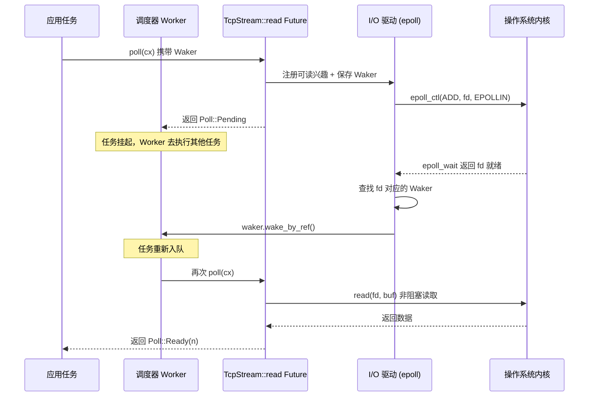

# Chapter 1: The Mental Model of Async: The Trio of Future, Waker, and Executor

Async programming in Rust is not a library, but a language-level protocol. Tokio became a production-grade runtime not because it invented Future, but because it precisely implements the boundary conditions of every contract in this protocol. This chapter does not rush into Tokio's scheduler code, but first thoroughly explains the "trio"—Future, Waker, Executor—their responsibility boundaries and reverse control flow. Once you understand how these three interlock, the subsequent chapters on Runtime assembly, work-stealing scheduling, and I/O drivers have a foundation to stand on.

# 1.1 From Blocking to Pulling: Why Rust Chooses poll Over Callbacks

## Intuitive Model

Imagine you order a dish at a restaurant that needs to be made fresh. Callback-style async (like early Node.js style) is equivalent to leaving your phone number, and the chef calls you**proactively**—control is in the chef's hands, and your code merely responds passively. Pull-style async (Rust's choice) is equivalent to getting a pickup ticket, and you**decide for yourself**when to go to the window and ask "is it ready?": if not, go do something else; if ready, pick it up.

This difference seems minor, but it determines the shape of the entire system. In the callback model, every async operation must carry a closure for "what to do when done," closures nest layer upon layer forming callback hell, and cancellation is extremely difficult—you cannot "withdraw" an already-registered callback. In the pull model, a Future is just a state machine,`poll`is a pure query action; if you don't advance it, it consumes no resources; cancellation is just drop, clean and neat.

## The Core Contract of the Pull Model

The`Future`trait defined by the Rust standard library has only two elements: a`poll`method, and a`Output`associated type. Tokio does not redefine this trait, but directly reuses the standard library's implementation. This is clearly reflected in the source code:

```rust
// tokio/src/future/mod.rs
cfg_not_trace! {
    cfg_rt! {
        pub(crate) use std::future::Future;
    }
}
```

[FACT:tokio/src/future/mod.rs:24-28]

This code reveals an important fact: when the`tracing`feature is not enabled, Tokio's internal`Future`is an alias for`std::future::Future`, with no wrapping whatsoever. Only when`tracing`is enabled is it replaced with`InstrumentedFuture`:

```rust
cfg_trace! {
    mod trace;
    #[allow(unused_imports)]
    pub(crate) use trace::InstrumentedFuture as Future;
}
```

[FACT:tokio/src/future/mod.rs:18-22]

> **[Design Inference & Architectural Trade-offs]**
> This "zero overhead by default, instrumentation on demand" design is Tokio's consistent philosophy: the core path introduces no additional abstraction layers, and observability is layered on as an optional feature.`InstrumentedFuture`The existence of

## shows that the Tokio team believes the instrumentation cost of tracing should not be borne by all users.

`poll`Three Implicit Constraints of the poll Contract`fn poll(self: Pin<&mut Self>, cx: &mut Context<'_>) -> Poll<Self::Output>`The signature of the

**method is** `Pin<&mut Self>`. This signature hides three contracts; violating any one of them leads to undefined behavior or logical errors:

**Contract One: Pin Guarantees Self-Reference Safety.**means that once a Future is polled, its memory address cannot be moved again. This is because an async block compiles into a state machine containing self-references—local variables may hold references pointing to other fields within the same state machine. If movement were allowed, these references would dangle.`poll`Contract Two: Pending Must Have Registered a Waker.`Poll::Pending`When`cx.waker()`Obtain and save the Waker, or have already registered the Waker with some event source. Otherwise, the executor will never know when this Future can be polled again, causing the task to be permanently suspended.

**Contract Three: After Ready, it should not be polled again.**Once`poll`returns`Poll::Ready`, polling the same Future again is a logical error (although it will not cause UB, the behavior is undefined). The executor is responsible for no longer scheduling the task after receiving Ready.

Among these three contracts, Contract Two is the most error-prone place, and it is also the fundamental reason for the existence of Waker.

# 1.2 Waker: The Carrier of Reverse Control Flow

## Intuitive Model

Waker is the "vibrating pager" the restaurant gives you. You do not need to stand at the window repeatedly asking "Is it ready?" - that would waste your time. You only need to hand the pager to the chef the first time you go to the window (register the Waker), and then go do other things with peace of mind. When the food is ready, the chef presses the button, the pager vibrates (calls`wake`), and after you receive the signal, you go to the window to pick up the food (poll again).

Without Waker, the executor has only two choices: either busy-poll all tasks (wasting CPU), or never poll tasks that have already returned Pending (task starvation). Waker is the only mechanism that breaks this deadlock.

## Waker's Memory Layout and Vtable Design

Waker is a standard library type, but its design directly influenced Tokio's task structure.`Waker`is essentially a fat pointer: a`RawWaker`struct containing a data pointer and a vtable pointer.

```rust
// 标准库中的定义（非 Tokio 源码，此处为背景说明）
pub struct RawWaker {
    data: *const (),
    vtable: &'static RawWakerVTable,
}

pub struct RawWakerVTable {
    clone: unsafe fn(*const ()) -> RawWaker,
    wake: unsafe fn(*const ()),
    wake_by_ref: unsafe fn(*const ()),
    drop: unsafe fn(*const ()),
}
```

> **[Design Inference & Architectural Trade-offs]**
> The brilliance of this design lies in:`Waker`itself does not care what "wake" specifically means. It is just a carrier of four function pointers. Tokio can provide a Waker whose`wake`function pushes the task back into the scheduling queue; while another runtime (such as the`futures`crate's`block_on`) can provide a completely different Waker implementation. This "data + vtable" pattern allows Waker to be passed between different runtimes without losing semantics.

`wake`and`wake_by_ref`The difference is crucial:`wake`consumes ownership of the Waker (the Waker is dropped after the call), while`wake_by_ref`only borrows. Executors usually implement`wake_by_ref`as "mark the task as ready and enqueue it", while`wake`additionally handles the decrement of the reference count on top of that. In Tokio's task structure, the Waker's data pointer points to the task's reference count header. Each clone increases the count, and drop decreases the count. When the count reaches zero, the task memory is released.

## Complete Timing of Waking

The sequence diagram below shows the complete chain from initiation to being woken for a TCP read operation. Note how the Waker is passed all the way from the task context to the I/O driver:



The key to this diagram is:**Waker is the only channel that can reach the Executor in reverse from the Reactor**. The Reactor does not hold any other information about the task; it only knows "when this fd is ready, call this Waker." This decoupling allows the I/O driver to be implemented independently of the scheduler, and the two communicate only through the narrow interface of Waker.

## Spurious Wakeup: The Gray Area of the Contract

Tokio's documentation explicitly acknowledges the existence of spurious wakeups:

> Normally, tasks are scheduled only if they have been woken by calling `wake` on their waker. However, this is not guaranteed, and Tokio may schedule tasks that have not been woken under some circumstances.

[FACT:tokio/src/runtime/mod.rs:306-309]

> **[Design Inference & Architectural Trade-offs]**
> This means that the implementation of`poll`must be able to tolerate the situation of "being polled again without having been woken." A correct Future, after returning Pending, should still return Pending when polled again even if no event has occurred, rather than panicking or producing an erroneous result. This constraint may seem loose, but in fact it imposes requirements on the design of the state machine: it cannot assume that "an event must occur between two polls."

# 1.3 Executor: Encapsulation from Future to Task

## Intuitive Model

The Executor is the restaurant's dispatcher. He has a stack of orders (task queue) in his hands and decides which order to make first and who makes it. When the pager vibrates, he puts the corresponding order back into the queue. Without a dispatcher, the chefs would not know which dish to make or when to switch work.

But the Executor's responsibilities go far beyond "polling Futures." It must solve three core problems:**Task lifecycle management**(creation, scheduling, completion, cancellation),**fairness guarantees**(preventing one task from starving other tasks),**resource driver integration**(how I/O and timer events are converted into wakeups).

## Task Memory Layout: From Future to Task

When calling`tokio::spawn`, the passed-in Future is not directly placed into the queue. It is wrapped into a`Task`struct containing a reference count header, scheduling metadata, and the Future itself. This wrapping process has a key optimization decision:

```rust
/// Boundary value to prevent stack overflow caused by a large-sized
/// Future being placed in the stack.
pub(crate) const BOX_FUTURE_THRESHOLD: usize = if cfg!(debug_assertions)  {
    2048
} else {
    16384
};

pub(crate) struct AutoBox(std::marker::PhantomData);

impl AutoBox {
    /// `true` if a value of type `T` is larger than [`BOX_FUTURE_THRESHOLD`].
    pub(crate) const SHOULD_BOX: bool = std::mem::size_of::() > BOX_FUTURE_THRESHOLD;
}
```

[FACT:tokio/src/runtime/mod.rs:649-673]

This code solves a very specific problem: if the Future is too large (over 16KB, 2KB in debug mode), inlining it directly into the Task struct will cause stack overflow or memory waste.`AutoBox`uses the compile-time constant`SHOULD_BOX`to decide whether to box the Future.

> **[Design Inference & Architectural Trade-offs]**
> The comment particularly emphasizes "using associated constants rather than runtime`if`The reason: if runtime judgment is used, the compiler will, for each`T`simultaneously instantiate code for both branches (one handling`T`, one handling`Pin<Box<T>>`), causing code bloat. With constant branching, the monomorphization collector prunes unreachable branches and generates code only for the types actually used. This is a classic optimization of "replacing runtime judgment with the type system."

## Scheduling fairness: the magic numbers 31 and 61

Tokio's scheduler documentation defines a formal fairness guarantee:

> If the total number of tasks does not grow without bound, and no task is blocking the thread, then it is guaranteed that tasks are scheduled fairly.

[FACT:tokio/src/runtime/mod.rs:279-281]

The implementation of this guarantee depends on two key parameters. For the current-thread runtime:

> The runtime will prefer to choose the next task to schedule from the local queue, and will only pick a task from the global queue if the local queue is empty, or if it has picked a task from the local queue 31 times in a row.

[FACT:tokio/src/runtime/mod.rs:328-333]

> The runtime will check for new IO or timer events whenever there are no tasks ready to be scheduled, or when it has scheduled 61 tasks in a row.

[FACT:tokio/src/runtime/mod.rs:335-337]

These two numbers (31 and 61) are not chosen arbitrarily. 31 is 2 to the 5th power minus 1, which can be quickly checked with bitwise operations; 61 is chosen to ensure that I/O events are not delayed indefinitely—even if the task queue is never empty, I/O must be checked once every 61 scheduling rounds.

> **[Design Inference & Architectural Trade-offs]**
> Why 31 and not 32? Because the counter starts at 0 and increments by 1 on each scheduling round, and when the counter reaches 31, a global queue check is triggered. Using`counter & 31 == 31`to check is more efficient than`counter % 32 == 0`(although modern compilers will optimize it automatically). The choice of 61 is more subtle: it needs to be large enough to avoid the overhead of frequent epoll_wait system calls, yet small enough to keep I/O latency within an acceptable range.

## LIFO slot optimization in the multi-threaded runtime

On top of fairness, the multi-threaded runtime adds a performance optimization—the LIFO slot:

> The multi thread runtime uses the lifo slot optimization: Whenever a task wakes up another task, the other task is added to the worker thread's lifo slot instead of being added to a queue.

[FACT:tokio/src/runtime/mod.rs:373-377]

The intuition behind this optimization is: when a task wakes another task, the awakened task is very likely to have a data dependency with the current task (such as in the producer-consumer pattern). By placing it in the LIFO slot, the current task can execute it immediately after finishing, taking advantage of hot data in the CPU cache.

But the LIFO slot has an anti-abuse mechanism:

> if a worker thread uses the lifo slot three times in a row, it is temporarily disabled until the worker thread has scheduled a task that didn't come from the lifo slot.

[FACT:tokio/src/runtime/mod.rs:380-382]

> **[Design Inference & Architectural Trade-offs]**
> This rule of "disabled after three consecutive uses" is intended to prevent two tasks from waking each other and forming a livelock. If task A wakes task B, and B wakes A, without this restriction the LIFO slot would be permanently occupied by these two tasks, and other tasks would never get scheduled. The limit of three gives other tasks a chance to be inserted.

## Task cancellation: the real semantics of abort

`JoinHandle::abort`The behavior of

> Be aware that calls to `JoinHandle::abort` just schedule the task for cancellation, and will return before the cancellation has completed.

[FACT:tokio/src/task/mod.rs:146-148]

is often misunderstood. The documentation clearly states:`abort`This means that`.await`is not synchronous. It only sets a flag, and the task will check this flag at the next`.await`point and terminate itself. If the task is executing a CPU-intensive section of code with no`abort`,

will not take effect immediately.

> Note that aborting a task does not guarantee that it fails with a cancelled error, since it may complete normally first.

[FACT:tokio/src/task/mod.rs:134-138]

> **[Design Inference & Architectural Trade-offs]**
> [Design inference and architectural trade-offs]`spawn_blocking`The design motivation for this semantics is: cancellation is a "best-effort" operation. Tokio does not forcibly kill tasks (Rust has no safe forced-termination mechanism), but instead cooperatively requests that the task exit on its own. This is consistent with the design that`.await`tasks are not cancellable—blocking tasks have no

# points and cannot check the cancellation flag.

## 1.4 Design reflections: the boundaries and costs of the trio

Why Future does not include Executor`Future`Rust's

trait deliberately does not include information about "how to schedule itself." This is a deliberate decoupling decision. If a Future knew its Executor, then:

1. The same Future could not be executed on different runtimes (for example, migrating from Tokio to async-std)`block_on`2. During testing, it could not be driven with a simple

`select!`、`join!`3. Combinators (such as

) could not work across runtimes

## The existence of Waker is precisely to preserve this decoupling while still allowing the Future to notify the Executor. Waker is a "capability token"—the Future only knows "I can call this to request rescheduling," but does not know how scheduling actually happens.

The cost of cooperative scheduling`.await`Tokio's tasks are cooperative: a task yields execution only at

> code that spends a long time without reaching an `.await` will prevent other tasks from running.

[FACT:tokio/src/lib.rs:178-179]

> **[Design Inference & Architectural Trade-offs]**
> [Design inference and architectural trade-offs]`.await`This is the fundamental cost of cooperative scheduling. The operating system can preempt a thread at any instruction boundary, but Tokio can switch tasks only at`.await`points. If a task executes a 10-second CPU-intensive loop with no`spawn_blocking`in between, then all other tasks on the same worker thread will be blocked for 10 seconds. Tokio's response is to provide`block_in_place`and

## , moving this kind of work to a dedicated thread pool. But this is the user's responsibility; the runtime cannot detect it automatically.

Boundary conditions of the fairness guarantee

- Tokio's fairness guarantee has two preconditions: the total number of tasks is bounded, and no task blocks the thread. These two conditions are often violated in real production environments:
- If tasks continuously spawn new tasks and do not reclaim them, the total number of tasks is unbounded and the fairness guarantee fails

> **[Design Inference & Architectural Trade-offs]**
> [Design inference and architectural trade-offs]

# This is why Tokio's documentation repeatedly emphasizes "do not perform blocking operations in asynchronous tasks." The fairness guarantee is not a hard guarantee of the runtime, but a guarantee "under the premise of correct use." The runtime does not detect violations, because detection itself has overhead.

1.5 Chapter summary

**Future is a pull-based state machine.** `poll`is a pure query action, returning`Pending`must have already registered a waker when returning`Ready`should no longer be polled after returning. Tokio directly reuses`std::future::Future`without additional wrapping (unless tracing is enabled).

**Waker is the only channel for reverse control flow.**It achieves runtime independence through a "data pointer + vtable" design.`wake`consumes ownership,`wake_by_ref`only borrows. Spurious wakeups are allowed, and Future must tolerate them.

**Executor is responsible for lifecycle, fairness, and resource integration.**It wraps Future into a Task, through`AutoBox`deciding at compile time whether to box, through the two magic numbers 31/61 balancing scheduling between the local queue and the global queue, and through the LIFO slot optimizing performance in data-dependent scenarios.

These three components are decoupled through narrow interfaces: Future only knows`poll`, Waker only knows`wake`, Executor only knows "poll until Pending or Ready." It is precisely this decoupling that allows Tokio to implement advanced features such as work-stealing scheduling, I/O driver integration, and cooperative budgeting without modifying the Future definition.

# Chapter Review and Self-Test

Q1: If the`AutoBox::SHOULD_BOX`judgment is changed from a compile-time constant to a runtime`if size_of::<T>() > THRESHOLD`, what impact will it have on the compiled artifact? Why does Tokio's comment specifically emphasize this point?

**Reference Analysis**: According to the[FACT:tokio/src/runtime/mod.rs:657-667]comment, if a runtime`if`is used, the compiler will instantiate code for both branches for each`T`—one handling the case where`T`is directly inlined, and one handling the`Pin<Box<T>>`case. This means that each spawned Future type will generate two copies of the task harness code, causing the binary size to double. With the associated constant`SHOULD_BOX`, since it is a compile-time constant once`T`is determined, the monomorphization collector will prune unreachable branches and generate code only for the path actually used. This is a typical optimization of "replacing runtime judgment with the type system," at the cost that`AutoBox`must be a generic struct rather than an ordinary function.

Q2: Suppose a task returns`poll`in`Pending`but forgets to register a Waker. What happens to this task under the current-thread runtime and the multi-thread runtime respectively? Does Tokio have a mechanism to detect this situation?

**Reference Analysis**: According to[FACT:tokio/src/runtime/mod.rs:306-309], Tokio allows spurious wakeups, which means a task may be rescheduled without being woken. But this does not mean forgetting to register a Waker is safe. Under the current-thread runtime, if both the local queue and the global queue are empty, the runtime enters the`park`state waiting for I/O or timer events. A task that forgets to register a Waker will never be re-enqueued, resulting in permanent suspension. Under the multi-thread runtime, the situation is similar, but if other tasks continue to wake, the task may be accidentally rescheduled due to spurious wakeups—but this cannot be relied upon. Tokio has no runtime detection mechanism to discover the case of "returning Pending but not registering a Waker," because this would require checking after every poll whether the Waker was used, which is too expensive. This is the responsibility of the Future implementer.

Q3: What specific scenario is the "disabled after three consecutive uses" rule of the LIFO slot intended to prevent? If this restriction were removed, under what kind of task dependency pattern would other tasks be starved?

**Reference Analysis**: According to[FACT:tokio/src/runtime/mod.rs:380-382], the LIFO slot is temporarily disabled after three consecutive uses, until a task from a non-LIFO source is scheduled. The scenario this rule prevents is: two tasks waking each other in a tight loop. For example, task A wakes task B after processing a batch of data, and task B immediately wakes task A after processing. Without the three-use limit, A and B would forever occupy the LIFO slot, the worker thread would switch infinitely between these two tasks, and other tasks in the local queue and global queue would never get a chance to execute. The three-use limit ensures that after every three rounds of "mutual waking," at least one other task is scheduled, breaking the livelock. The choice of this number is empirical: too small reduces the benefit of the LIFO optimization, too large increases the latency of other tasks.

At this point, the responsibility boundaries and collaboration mechanisms among Future, Waker, and Executor are clear: Future defines computation, Waker is responsible for waking, and Executor drives execution. But a single component cannot work independently; they must be assembled into a unified runtime environment. In the next chapter, we will trace the complete assembly chain of Runtime::new and Builder::build, see how the scheduler, I/O driver, time driver, and blocking thread pool are injected into the same Runtime instance, and reveal the fundamental differences between the current_thread and multi_thread forms during the assembly stage.
