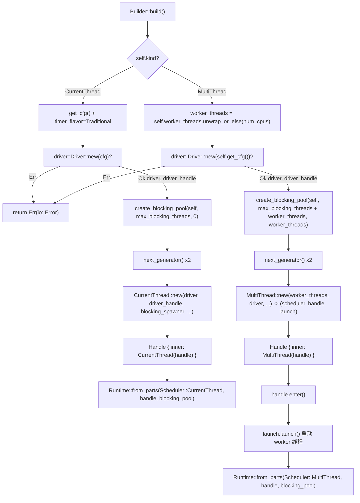

# Chapter 02: Runtime Assembly: How Builder Composes Drivers & Thread Pools


上一章我们把 Future、Waker、Executor 三者的职责边界讲清楚了。但一个真实可用的运行时远不止「一个 Executor」——它还需要 I/O 事件循环、定时器、阻塞线程池，并且这些组件必须共享同一套句柄、同一份生命周期。本章追踪 `Builder::build` 的完整装配链路，回答一个核心问题：**一个 `Runtime` 内部到底有哪些组件，它们如何被拼装并共享句柄**。

Tokio 的装配入口是 `Builder`。它本身是一个纯配置容器，所有字段都是「意图声明」，不持有任何运行时资源。真正的资源创建发生在 `build()` 调用时。

## Intuitive Architectural Model：Builder 是「装修图纸」，Runtime 是「交房后的房子」

`Builder` 就像一张装修图纸：你在上面标注「要几个房间（worker_threads）」「要不要通水（enable_io）」「要不要通电（enable_time）」「外包帮工上限（max_blocking_threads）」。图纸本身不产生任何实体。直到调用 `build()`，施工队才按图施工，把调度器、驱动、线程池这些「房间」真正建起来，并交付一个 `Runtime` 实例。

若没有 `Builder` 这一层，用户就必须手动 new 出每个组件、手动接线、手动处理失败回滚——任何一处顺序错误都会导致句柄悬空或资源泄漏。`Builder` 的价值在于：**把「配置」与「构造」彻底分离，让构造过程可以集中做校验、失败清理和句柄共享**。

## 内存布局：`Builder` 的字段分区

`Builder` 的字段可以按职责分成四组。第一组是**形态与开关**：`kind` 决定调度器形态，`enable_io` / `enable_time` 决定是否创建对应驱动。

[FACT:tokio/src/runtime/builder.rs:55-68](https://github.com/tokio-rs/tokio/blob/e800714ad714f1d996ddd56265b550d879349c0a/tokio/src/runtime/builder.rs#L55-L68)

```rust
pub struct Builder {
    kind: Kind,
    name: Option,
    enable_io: bool,
    nevents: usize,
    nevents_busy: Option,
    enable_time: bool,
    start_paused: bool,
    // ...
}
```

第二组是**线程池参数**：`worker_threads` 是 `Option<usize>`，`None` 表示「延迟到 build 时按 CPU 核数自动探测」；`max_blocking_threads` 默认 512。

[FACT:tokio/src/runtime/builder.rs:73-79](https://github.com/tokio-rs/tokio/blob/e800714ad714f1d996ddd56265b550d879349c0a/tokio/src/runtime/builder.rs#L73-L79)

```rust
worker_threads: Option,
max_blocking_threads: usize,
```

第三组是**回调钩子**，全部是 `Option<Arc<dyn Fn ...>>`。注意它们用 `Arc` 而非 `Box`，因为这些回调要被克隆进每个 worker 线程的 `Config`。

[FACT:tokio/src/runtime/builder.rs:87-97](https://github.com/tokio-rs/tokio/blob/e800714ad714f1d996ddd56265b550d879349c0a/tokio/src/runtime/builder.rs#L87-L97)

```rust
pub(super) after_start: Option,
pub(super) before_stop: Option,
pub(super) before_park: Option,
pub(super) after_unpark: Option,
```

第四组是**调度启发式与随机种子**：`global_queue_interval`、`event_interval`、`disable_lifo_slot`、`seed_generator`。

[FACT:tokio/src/runtime/builder.rs:116-134](https://github.com/tokio-rs/tokio/blob/e800714ad714f1d996ddd56265b550d879349c0a/tokio/src/runtime/builder.rs#L116-L134)

```rust
pub(super) global_queue_interval: Option,
pub(super) event_interval: u32,
pub(super) disable_lifo_slot: bool,
pub(super) seed_generator: RngSeedGenerator,
```

这里有一个值得注意的设计：`Kind` 是一个 `Copy` 的小枚举，只有两个变体。

[FACT:tokio/src/runtime/builder.rs:261-265](https://github.com/tokio-rs/tokio/blob/e800714ad714f1d996ddd56265b550d879349c0a/tokio/src/runtime/builder.rs#L261-L265)

```rust
#[derive(Clone, Copy)]
pub(crate) enum Kind {
    CurrentThread,
    #[cfg(feature = "rt-multi-thread")]
    MultiThread,
}
```

`MultiThread` 变体被 `rt-multi-thread` feature 门控。这意味着在只启用 `rt` feature 的构建里，`Kind` 只有一个变体，`build()` 的 `match` 会被编译器优化成单分支——**用类型系统而非运行时判断来消除多线程调度器的代码体积**。

## 默认值的哲学：为什么 I/O 和 time 默认关闭

`Builder::new` 是所有构造的公共入口。它把 `enable_io` 和 `enable_time` 都设为 `false`。

[FACT:tokio/src/runtime/builder.rs:309-318](https://github.com/tokio-rs/tokio/blob/e800714ad714f1d996ddd56265b550d879349c0a/tokio/src/runtime/builder.rs#L309-L318)

```rust
// I/O defaults to "off"
enable_io: false,
nevents: 1024,
nevents_busy: None,

// Time defaults to "off"
enable_time: false,

// The clock starts not-paused
start_paused: false,
```

> **〔Design Inference & Architectural Trade-offs〕**
> 这个默认值选择是刻意的：创建 I/O 驱动需要向操作系统申请 epoll/kqueue 句柄，创建 time 驱动需要启动定时器基础设施。如果用户只是想要一个纯计算的Multi-Channel Task Scheduling Engine（比如跑 CPU 密集的 async 逻辑），强制创建这些驱动就是纯粹的浪费。`#[tokio::main]` 宏之所以「开箱即用」，是因为它内部调用了 `enable_all()`。

`enable_all()` 的实现揭示了 feature 门控如何影响「全开」的语义。

[FACT:tokio/src/runtime/builder.rs:398-419](https://github.com/tokio-rs/tokio/blob/e800714ad714f1d996ddd56265b550d879349c0a/tokio/src/runtime/builder.rs#L398-L419)

```rust
pub fn enable_all(&mut self) -> &mut Self {
    #[cfg(any(
        feature = "net",
        all(unix, feature = "process"),
        all(unix, feature = "signal")
    ))]
    self.enable_io();

    #[cfg(all(
        tokio_unstable,
        feature = "io-uring",
        // ...
    ))]
    self.enable_io_uring();

    #[cfg(feature = "time")]
    self.enable_time();

    self
}
```

注意 `enable_io()` 只在启用了 `net`、`process` 或 `signal` feature 时才被调用。如果用户只启用了 `time` feature，`enable_all()` 不会打开 I/O 驱动——因为编译产物里根本没有 I/O 驱动代码。

## 装配主路径：`build()` 的分流

`build()` 是装配的起点，它按 `kind` 分流到两条完全不同的路径。

[FACT:tokio/src/runtime/builder.rs:1146-1152](https://github.com/tokio-rs/tokio/blob/e800714ad714f1d996ddd56265b550d879349c0a/tokio/src/runtime/builder.rs#L1146-L1152)

```rust
pub fn build(&mut self) -> io::Result {
    match &self.kind {
        Kind::CurrentThread => self.build_current_thread_runtime(),
        #[cfg(feature = "rt-multi-thread")]
        Kind::MultiThread => self.build_threaded_runtime(),
    }
}
```

这两条路径的差异远不止「一个线程 vs 多个线程」。下面分别展开。

### 路径一：current_thread 的装配

`build_current_thread_runtime` 本身很薄，它委托给 `build_current_thread_runtime_components`，然后把返回的三元组包进 `Runtime`。

[FACT:tokio/src/runtime/builder.rs:1725-1736](https://github.com/tokio-rs/tokio/blob/e800714ad714f1d996ddd56265b550d879349c0a/tokio/src/runtime/builder.rs#L1725-L1736)

```rust
fn build_current_thread_runtime(&mut self) -> io::Result {
    use crate::runtime::runtime::Scheduler;

    let (scheduler, handle, blocking_pool) =
        self.build_current_thread_runtime_components(None)?;

    Ok(Runtime::from_parts(
        Scheduler::CurrentThread(scheduler),
        handle,
        blocking_pool,
    ))
}
```

真正的装配逻辑在 `build_current_thread_runtime_components`。它的执行顺序至关重要：

[FACT:tokio/src/runtime/builder.rs:1760-1766](https://github.com/tokio-rs/tokio/blob/e800714ad714f1d996ddd56265b550d879349c0a/tokio/src/runtime/builder.rs#L1760-L1766)

```rust
let mut cfg = self.get_cfg();
cfg.timer_flavor = TimerFlavor::Traditional;
let (driver, driver_handle) = driver::Driver::new(cfg)?;

// Blocking pool
let blocking_pool = blocking::create_blocking_pool(self, self.max_blocking_threads, 0);
let blocking_spawner = blocking_pool.spawner().clone();
```

第一步创建 `driver`，返回一对 `(driver, driver_handle)`。注意这里 `?` 直接向上传播错误——如果 I/O 驱动初始化失败（比如 epoll 创建失败），整个 `build` 返回 `Err`，此时 blocking pool 还没创建，无需清理。

第二步创建 blocking pool，并立刻取出它的 `spawner` 克隆。这个 `spawner` 会被注入调度器，让调度器有能力把阻塞任务投递到线程池。

第三步生成两个独立的 RNG 种子生成器。

[FACT:tokio/src/runtime/builder.rs:1768-1770](https://github.com/tokio-rs/tokio/blob/e800714ad714f1d996ddd56265b550d879349c0a/tokio/src/runtime/builder.rs#L1768-L1770)

```rust
let seed_generator_1 = self.seed_generator.next_generator();
let seed_generator_2 = self.seed_generator.next_generator();
```

> **〔Design Inference & Architectural Trade-offs〕**
> 为什么需要两个？`seed_generator_1` 被放进 `Config`，供调度器内部使用（比如 `select!` 的随机分支顺序）；`seed_generator_2` 传给 `CurrentThread::new`，供任务侧使用。分离两个生成器可以避免调度器内部消费随机数影响用户可见的随机序列，从而保证 `rng_seed` 的可复现性。

第四步是核心：把 driver、driver_handle、blocking_spawner、种子和 `Config` 一起交给 `CurrentThread::new`。

[FACT:tokio/src/runtime/builder.rs:1776-1807](https://github.com/tokio-rs/tokio/blob/e800714ad714f1d996ddd56265b550d879349c0a/tokio/src/runtime/builder.rs#L1776-L1807)

```rust
let (scheduler, handle) = CurrentThread::new(
    driver,
    driver_handle,
    blocking_spawner,
    seed_generator_2,
    Config {
        before_park: self.before_park.clone(),
        after_unpark: self.after_unpark.clone(),
        // ...
        global_queue_interval: self.global_queue_interval,
        event_interval: self.event_interval,
        // ...
        enable_eager_driver_handoff: false,
        seed_generator: seed_generator_1,
        // ...
    },
    local_tid,
    self.name.clone(),
);
```

这里有一个关键细节：`enable_eager_driver_handoff` 被硬编码为 `false`。

[FACT:tokio/src/runtime/builder.rs:1795-1798](https://github.com/tokio-rs/tokio/blob/e800714ad714f1d996ddd56265b550d879349c0a/tokio/src/runtime/builder.rs#L1795-L1798)

```rust
// This setting never makes sense for a current thread runtime,
// as it only configures how the I/O driver is stolen across
// workers.
enable_eager_driver_handoff: false,
```

> **〔Design Inference & Architectural Trade-offs〕**
> 这个注释点明了该选项的本质：它描述的是「多个 worker 之间如何抢占 I/O 驱动」，而 current_thread 只有一个线程，不存在抢占，所以强制关闭。这是「配置项语义与形态强相关」的典型例子——同一个 `Builder` 字段在不同形态下含义不同。

最后，`CurrentThread::new` 返回的 `handle` 被包进 `scheduler::Handle::CurrentThread`，再包进公开的 `Handle`。

[FACT:tokio/src/runtime/builder.rs:1816-1822](https://github.com/tokio-rs/tokio/blob/e800714ad714f1d996ddd56265b550d879349c0a/tokio/src/runtime/builder.rs#L1816-L1822)

```rust
let handle = Handle {
    inner: scheduler::Handle::CurrentThread(handle),
};

Ok((scheduler, handle, blocking_pool))
```

### 路径二：multi_thread 的装配

`build_threaded_runtime` 的骨架与 current_thread 类似，但有三处本质差异。第一处是 worker 线程数的确定：

[FACT:tokio/src/runtime/builder.rs:2185](https://github.com/tokio-rs/tokio/blob/e800714ad714f1d996ddd56265b550d879349c0a/tokio/src/runtime/builder.rs#L2185)

```rust
let worker_threads = self.worker_threads.unwrap_or_else(num_cpus);
```

`None` 在这里被解析为 `num_cpus()`。这就是「延迟自动探测」的落地点——探测发生在 build 时而非 `Builder::new` 时，因为 CPU 亲和性可能在两者之间变化。

第二处差异在 blocking pool 的容量计算：

[FACT:tokio/src/runtime/builder.rs:2189-2192](https://github.com/tokio-rs/tokio/blob/e800714ad714f1d996ddd56265b550d879349c0a/tokio/src/runtime/builder.rs#L2189-L2192)

```rust
let blocking_pool =
    blocking::create_blocking_pool(self, self.max_blocking_threads + worker_threads, worker_threads);
let blocking_spawner = blocking_pool.spawner().clone();
```

注意 `max_blocking_threads + worker_threads`。对比 current_thread 路径传入的是 `self.max_blocking_threads` 和 `0`。

[FACT:tokio/src/runtime/builder.rs:1765](https://github.com/tokio-rs/tokio/blob/e800714ad714f1d996ddd56265b550d879349c0a/tokio/src/runtime/builder.rs#L1765)

```rust
let blocking_pool = blocking::create_blocking_pool(self, self.max_blocking_threads, 0);
```

> **〔Design Inference & Architectural Trade-offs〕**
> 这个差异揭示了 blocking pool 容量语义：multi_thread 下，`max_blocking_threads` 是「额外的」阻塞线程上限，实际总线程上限要加上 worker 线程数。第三个参数（current_thread 传 0，multi_thread 传 `worker_threads`）很可能是「预留线程数」或「初始线程数」的提示。这个设计让 `max_blocking_threads` 的语义在两种形态下保持一致：它描述的是「超出核心 worker 之外还能额外开多少阻塞线程」。

第三处差异是 `MultiThread::new` 返回三元组而非二元组：

[FACT:tokio/src/runtime/builder.rs:2198-2226](https://github.com/tokio-rs/tokio/blob/e800714ad714f1d996ddd56265b550d879349c0a/tokio/src/runtime/builder.rs#L2198-L2226)

```rust
let (scheduler, handle, launch) = MultiThread::new(
    worker_threads,
    driver,
    driver_handle,
    blocking_spawner,
    seed_generator_2,
    Config {
        // ...
        enable_eager_driver_handoff: self.enable_eager_driver_handoff,
        // ...
    },
    self.timer_flavor,
    self.name.clone(),
);
```

多出来的 `launch` 是一个「启动句柄」。`MultiThread::new` 只负责构造调度器结构，**并不立即启动 worker 线程**。真正的启动发生在后面：

[FACT:tokio/src/runtime/builder.rs:2228-2234](https://github.com/tokio-rs/tokio/blob/e800714ad714f1d996ddd56265b550d879349c0a/tokio/src/runtime/builder.rs#L2228-L2234)

```rust
let handle = Handle { inner: scheduler::Handle::MultiThread(handle) };

// Spawn the thread pool workers
let _enter = handle.enter();
launch.launch();

Ok(Runtime::from_parts(Scheduler::MultiThread(scheduler), handle, blocking_pool))
```

`handle.enter()` 进入运行时上下文，然后 `launch.launch()` 才真正 spawn 出所有 worker 线程。这个「先构造、后启动」的两阶段设计非常关键。

> **〔Design Inference & Architectural Trade-offs〕**
> 为什么不能边构造边启动？因为 worker 线程一旦启动就会立刻开始 poll 任务，而任务可能引用 `handle`。如果 `handle` 还没构造完，就会出现「worker 拿着半成品句柄」的竞态。两阶段设计保证了：**所有 worker 线程启动时，完整的 `Handle` 已经就绪**。`_enter` 守卫确保 worker 线程在启动瞬间就处于正确的运行时上下文中。

## 装配流程图

下面这张图把两条路径的装配顺序、关键分支和错误路径画在一起。注意 `driver::Driver::new` 失败时直接返回 `Err`，此时 blocking pool 尚未创建。



## 句柄共享：`Handle` 如何成为跨组件的「通行证」

装配完成后，`Runtime` 持有 `scheduler`、`handle`、`blocking_pool` 三件套。其中 `handle` 是共享的核心。它的内部是一个枚举：

[FACT:tokio/src/runtime/scheduler/mod.rs:29-41](https://github.com/tokio-rs/tokio/blob/e800714ad714f1d996ddd56265b550d879349c0a/tokio/src/runtime/scheduler/mod.rs#L29-L41)

```rust
#[derive(Debug, Clone)]
pub(crate) enum Handle {
    #[cfg(feature = "rt")]
    CurrentThread(Arc),

    #[cfg(feature = "rt-multi-thread")]
    MultiThread(Arc),

    #[cfg(not(feature = "rt"))]
    #[allow(dead_code)]
    Disabled,
}
```

注意两个变体都包着 `Arc`。这意味着 `Handle` 的克隆是廉价的引用计数递增，可以被自由地分发到任意线程。`Handle` 提供了统一的访问接口，把形态差异封装在 `match` 内部。例如 `driver()`：

[FACT:tokio/src/runtime/scheduler/mod.rs:53-64](https://github.com/tokio-rs/tokio/blob/e800714ad714f1d996ddd56265b550d879349c0a/tokio/src/runtime/scheduler/mod.rs#L53-L64)

```rust
pub(crate) fn driver(&self) -> &driver::Handle {
    match *self {
        #[cfg(feature = "rt")]
        Handle::CurrentThread(ref h) => &h.driver,

        #[cfg(feature = "rt-multi-thread")]
        Handle::MultiThread(ref h) => &h.driver,

        #[cfg(not(feature = "rt"))]
        Handle::Disabled => unreachable!(),
    }
}
```

`blocking_spawner()` 用了 `match_flavor!` 宏来消除重复：

[FACT:tokio/src/runtime/scheduler/mod.rs:96-98](https://github.com/tokio-rs/tokio/blob/e800714ad714f1d996ddd56265b550d879349c0a/tokio/src/runtime/scheduler/mod.rs#L96-L98)

```rust
pub(crate) fn blocking_spawner(&self) -> &blocking::Spawner {
    match_flavor!(self, Handle(h) => &h.blocking_spawner)
}
```

这个宏展开后就是上面 `driver()` 那样的 `match`。它的价值在于：当新增一个需要按形态分发的访问器时，只需一行 `match_flavor!`，而不必手写两遍 `match` 分支。

公开的 `Handle` 是内部 `scheduler::Handle` 的薄包装：

[FACT:tokio/src/runtime/handle.rs:13-15](https://github.com/tokio-rs/tokio/blob/e800714ad714f1d996ddd56265b550d879349c0a/tokio/src/runtime/handle.rs#L13-L15)

```rust
pub struct Handle {
    pub(crate) inner: scheduler::Handle,
}
```

用户拿到的 `Handle` 可以跨线程克隆、可以 `spawn`、可以 `block_on`。`spawn` 的实现展示了 `AutoBox` 的编译期分支：

[FACT:tokio/src/runtime/handle.rs:197-208](https://github.com/tokio-rs/tokio/blob/e800714ad714f1d996ddd56265b550d879349c0a/tokio/src/runtime/handle.rs#L197-L208)

```rust
pub fn spawn(&self, future: F) -> JoinHandle
where
    F: Future + Send + 'static,
    F::Output: Send + 'static,
{
    let fut_size = mem::size_of::();
    if AutoBox::::SHOULD_BOX {
        self.spawn_named(Box::pin(future), SpawnMeta::new_unnamed(fut_size))
    } else {
        self.spawn_named(future, SpawnMeta::new_unnamed(fut_size))
    }
}
```

`AutoBox::<F>::SHOULD_BOX` 是一个关联常量，由 `size_of::<F>()` 与阈值比较得出。

[FACT:tokio/src/runtime/mod.rs:668-673](https://github.com/tokio-rs/tokio/blob/e800714ad714f1d996ddd56265b550d879349c0a/tokio/src/runtime/mod.rs#L668-L673)

```rust
pub(crate) struct AutoBox(std::marker::PhantomData);

impl AutoBox {
    pub(crate) const SHOULD_BOX: bool = std::mem::size_of::() > BOX_FUTURE_THRESHOLD;
}
```

> **〔Design Inference & Architectural Trade-offs〕**
> 注释里解释了为什么用关联常量而非运行时 `if`：如果用运行时判断，`spawn_named` 会被单态化两次（一次针对 `F`，一次针对 `Pin<Box<F>>`），导致每个 spawn 的 future 都生成两份任务 harness，代码体积翻倍。用常量分支后，单态化收集器只保留实际走到的那个分支。

## 设计思考：装配顺序、错误恢复与生产踩坑

**顺序即契约**。装配顺序 `driver -> blocking_pool -> scheduler` 不是随意的。driver 最先创建，因为它是唯一可能因 OS 资源不足而失败、且失败后无需清理其他组件的步骤。blocking_pool 在 driver 之后、scheduler 之前，因为 scheduler 需要 blocking_spawner。如果 blocking_pool 创建失败（实际上它不太会失败），driver 会被 drop 自动清理。

**current_thread 的 `local_tid` 分支**。`build_local` 走的是 `build_current_thread_local_runtime`，它把当前线程 ID 传进去：

[FACT:tokio/src/runtime/builder.rs:1738-1751](https://github.com/tokio-rs/tokio/blob/e800714ad714f1d996ddd56265b550d879349c0a/tokio/src/runtime/builder.rs#L1738-L1751)

```rust
fn build_current_thread_local_runtime(&mut self) -> io::Result {
    use crate::runtime::local_runtime::LocalRuntimeScheduler;

    let tid = std::thread::current().id();

    let (scheduler, handle, blocking_pool) =
        self.build_current_thread_runtime_components(Some(tid))?;

    Ok(LocalRuntime::from_parts(
        LocalRuntimeScheduler::CurrentThread(scheduler),
        handle,
        blocking_pool,
    ))
}
```

这个 `tid` 被存进 `Handle`，后续 `can_spawn_local_on_local_runtime` 用它校验「spawn_local 是否在 owner 线程上调用」：

[FACT:tokio/src/runtime/scheduler/mod.rs:140-147](https://github.com/tokio-rs/tokio/blob/e800714ad714f1d996ddd56265b550d879349c0a/tokio/src/runtime/scheduler/mod.rs#L140-L147)

```rust
pub(crate) fn can_spawn_local_on_local_runtime(&self) -> bool {
    match self {
        Handle::CurrentThread(h) => h.local_tid.is_some_and(|x| std::thread::current().id() == x),

        #[cfg(feature = "rt-multi-thread")]
        Handle::MultiThread(_) => false,
    }
}
```

> **〔Design Inference & Architectural Trade-offs〕**
> 这是 `LocalRuntime` 安全性的基石：`!Send` 的 future 只能在其 owner 线程上被 poll，而 `local_tid` 就是这个约束的运行时检查点。如果去掉这个检查，跨线程 spawn_local 会导致 `!Send` 数据被并发访问，引发 UB。

**生产踩坑一：`worker_threads(0)` 会 panic**。`worker_threads` 方法有断言：

[FACT:tokio/src/runtime/builder.rs:582-586](https://github.com/tokio-rs/tokio/blob/e800714ad714f1d996ddd56265b550d879349c0a/tokio/src/runtime/builder.rs#L582-L586)

```rust
pub fn worker_threads(&mut self, val: usize) -> &mut Self {
    assert!(val > 0, "Worker threads cannot be set to 0");
    self.worker_threads = Some(val);
    self
}
```

这个断言在配置阶段就失败，而不是等到 build。好处是错误定位更早，坏处是如果线程数来自配置文件的动态值，用户必须在调用前自己校验。

**生产踩坑二：`max_blocking_threads` 设太小会挂起**。文档明确警告：

[FACT:tokio/src/runtime/builder.rs:600-601](https://github.com/tokio-rs/tokio/blob/e800714ad714f1d996ddd56265b550d879349c0a/tokio/src/runtime/builder.rs#L600-L601)

```rust
/// It's recommended to not set this limit too low in order to avoid hanging on operations
/// requiring [`spawn_blocking`].
```

> **〔Design Inference & Architectural Trade-offs〕**
> 因为 blocking pool 的队列没有背压——任务会一直堆积直到有线程可用。如果所有阻塞线程都在等待某个「需要新阻塞线程才能完成」的操作，就会死锁。文档里「the queue does not apply any backpressure, it could potentially grow unbounded」正是这个风险的注脚。

**生产踩坑三：`UnhandledPanic::ShutdownRuntime` 只支持 current_thread**。

[FACT:tokio/src/runtime/builder.rs:1374-1381](https://github.com/tokio-rs/tokio/blob/e800714ad714f1d996ddd56265b550d879349c0a/tokio/src/runtime/builder.rs#L1374-L1381)

```rust
pub fn unhandled_panic(&mut self, behavior: UnhandledPanic) -> &mut Self {
    if !matches!(self.kind, Kind::CurrentThread) && matches!(behavior, UnhandledPanic::ShutdownRuntime) {
        panic!("UnhandledPanic::ShutdownRuntime is only supported in current thread runtime");
    }

    self.unhandled_panic = behavior;
    self
}
```

> **〔Design Inference & Architectural Trade-offs〕**
> 这个限制的原因是：multi_thread 下「立即关闭运行时」需要协调所有 worker 线程的停止，实现复杂度高且语义模糊（正在 poll 的其他任务怎么办？）。current_thread 只有一个线程，关闭语义清晰。

## 本章Summary

本章追踪了 `Builder::build` 的完整装配链路。核心结论：

1. `Builder` 是纯配置容器，`build()` 才创建资源。装配顺序 `driver -> blocking_pool -> scheduler` 由错误恢复需求决定。

2. current_thread 与 multi_thread 的差异不止线程数：blocking pool 容量计算不同（`max_blocking_threads` vs `max_blocking_threads + worker_threads`），multi_thread 多一个 `launch` 两阶段启动，`enable_eager_driver_handoff` 在 current_thread 下被强制关闭。

3. `Handle` 是跨组件共享的核心，内部用 `Arc` 包裹形态特定的句柄，通过 `match` 或 `match_flavor!` 宏统一访问。

4. `AutoBox` 用关联常量在编译期决定是否装箱 future，避免代码体积翻倍。

5. `local_tid` 是 `LocalRuntime` 安全性的运行时检查点。

下一章，我们将进入任务的生命周期：`spawn` 如何把一个 Future 变成可调度实体，`JoinHandle` 如何与任务状态机交互，以及任务在 `PENDING` / `RUNNING` / `COMPLETE` 之间的状态迁移。


Q1: 如果把 `build_threaded_runtime` 中 `create_blocking_pool` 的容量参数从 `self.max_blocking_threads + worker_threads` 改成 `self.max_blocking_threads`，在什么场景下会导致阻塞任务饿死？为什么 current_thread 路径可以传 `self.max_blocking_threads`？

**参考解析**：根据 [FACT:tokio/src/runtime/builder.rs:2189-2192](https://github.com/tokio-rs/tokio/blob/e800714ad714f1d996ddd56265b550d879349c0a/tokio/src/runtime/builder.rs#L2189-L2192)，multi_thread 路径传入 `self.max_blocking_threads + worker_threads`，而 current_thread 路径 [FACT:tokio/src/runtime/builder.rs:1765](https://github.com/tokio-rs/tokio/blob/e800714ad714f1d996ddd56265b550d879349c0a/tokio/src/runtime/builder.rs#L1765) 传入 `self.max_blocking_threads`。差异的根源在于：multi_thread 下，worker 线程本身也会执行阻塞任务（例如 `block_in_place` 会把 worker 线程临时转成阻塞线程），所以阻塞线程的总预算必须包含 worker 线程数。如果改成只传 `self.max_blocking_threads`，当 `max_blocking_threads` 设得较小（比如 1）且已有 worker 线程在 `block_in_place` 中占用预算时，新的 `spawn_blocking` 任务将无线程可用，堆积在无背压队列中，导致依赖这些阻塞任务的 async 任务永久挂起。current_thread 只有一个线程且不支持 `block_in_place` 的 worker 转换语义，所以不需要加上 worker 数。

Q2: `MultiThread::new` 返回 `launch` 句柄，真正启动 worker 线程的是 `launch.launch()`。如果去掉 `handle.enter()` 这一行直接调用 `launch.launch()`，会发生什么？

**参考解析**：根据 [FACT:tokio/src/runtime/builder.rs:2230-2232](https://github.com/tokio-rs/tokio/blob/e800714ad714f1d996ddd56265b550d879349c0a/tokio/src/runtime/builder.rs#L2230-L2232)，启动前有 `let _enter = handle.enter();` 然后才 `launch.launch()`。`handle.enter()` 的作用是设置线程本地上下文（thread-local），让当前线程「看起来」处于运行时内部。worker 线程启动后会立即开始 poll 任务，而任务代码可能调用 `Handle::current()`、`tokio::spawn` 等依赖上下文的 API。如果去掉 `_enter`，worker 线程在启动瞬间的上下文设置可能不完整（取决于 `launch` 内部是否自行设置），最坏情况下 worker 线程上执行的初始化代码调用 `Handle::current()` 会 panic（`CONTEXT_MISSING_ERROR`）。即使 `launch` 内部为每个 worker 设置了上下文，`_enter` 也保证了「启动动作本身」发生在正确的上下文中，避免启动过程中的竞态。

Q3: `AutoBox::<F>::SHOULD_BOX` 用关联常量而非运行时 `if size_of::<F>() > THRESHOLD`。假设改成运行时判断，除了代码体积翻倍，还会在什么情况下导致性能退化？

**参考解析**：根据 [FACT:tokio/src/runtime/mod.rs:657-673](https://github.com/tokio-rs/tokio/blob/e800714ad714f1d996ddd56265b550d879349c0a/tokio/src/runtime/mod.rs#L657-L673) 的注释，运行时 `if` 会让 `spawn_named` 对每个 `T` 单态化两次（`T` 和 `Pin<Box<T>>` 各一次）。除了代码体积翻倍，性能退化体现在：1) 指令缓存（i-cache）压力增大，因为两套 harness 代码都要驻留；2) 编译器无法对「实际只走一个分支」做优化，运行时分支预测虽然通常准确，但分支本身和两套代码的寄存器分配差异会累积；3) 更隐蔽的是，`Pin<Box<T>>` 路径会强制堆分配，如果运行时判断因为某种原因（比如 `size_of` 在泛型上下文中未完全常量折叠）误判，小 future 也会被装箱，每次 spawn 多一次堆分配。关联常量让单态化收集器在编译期就剪掉未走的分支，零运行时开销。