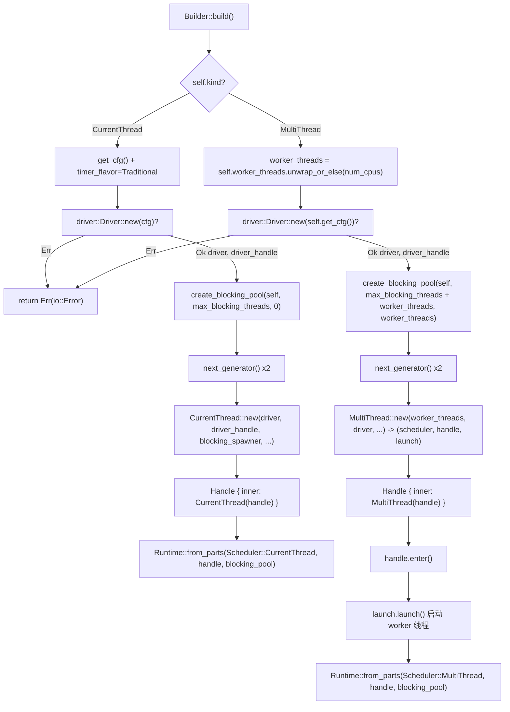

# Chapter 2: Runtime Assembly: How Builder Assembles Drivers, Scheduler, and Thread Pool

# From`Builder`to`Runtime`: The complete journey of an assembly

In the previous chapter, we clarified the responsibility boundaries of Future, Waker, and Executor. But a truly usable runtime is far more than "an Executor" — it also needs an I/O event loop, timers, a blocking thread pool, and these components must share the same set of handles and the same lifecycle. This chapter traces the complete assembly chain of`Builder::build`, answering a core question:**What components exist inside a`Runtime`, and how are they assembled and share handles**。

Tokio's assembly entry point is`Builder`. It is itself a pure configuration container; all fields are "intent declarations" and hold no runtime resources. The actual resource creation happens when`build()`is called.

## Intuitive model: Builder is the "renovation blueprint", Runtime is the "house after delivery"

`Builder`is like a renovation blueprint: you mark on it "how many rooms (worker_threads)", "whether to run water (enable_io)", "whether to run electricity (enable_time)", "outsourced helper limit (max_blocking_threads)". The blueprint itself produces no physical entity. Only when`build()`is called does the construction crew build according to the blueprint, actually constructing the "rooms" — the scheduler, drivers, thread pool — and deliver a`Runtime`instance.

Without the`Builder`layer, users would have to manually new each component, manually wire them up, and manually handle failure rollback — any ordering mistake would lead to dangling handles or resource leaks.`Builder`The value of**lies in: completely separating "configuration" from "construction", so that the construction process can centrally perform validation, failure cleanup, and handle sharing**。

## Memory layout:`Builder`'s field partitions

`Builder`'s fields can be divided into four groups by responsibility. The first group is**form and switches**：`kind`determines the scheduler form,`enable_io` / `enable_time`determines whether to create the corresponding driver.

[FACT:tokio/src/runtime/builder.rs:55-68]

```rust
pub struct Builder {
    kind: Kind,
    name: Option,
    enable_io: bool,
    nevents: usize,
    nevents_busy: Option,
    enable_time: bool,
    start_paused: bool,
    // ...
}
```

The second group is**thread pool parameters**：`worker_threads`is`Option<usize>`，`None`meaning "defer to build time to auto-detect based on CPU core count";`max_blocking_threads`defaults to 512.

[FACT:tokio/src/runtime/builder.rs:73-79]

```rust
worker_threads: Option,
max_blocking_threads: usize,
```

The third group is**callback hooks**, all of which are`Option<Arc<dyn Fn ...>>`. Note that they use`Arc`rather than`Box`, because these callbacks need to be cloned into each worker thread's`Config`。

[FACT:tokio/src/runtime/builder.rs:87-97]

```rust
pub(super) after_start: Option,
pub(super) before_stop: Option,
pub(super) before_park: Option,
pub(super) after_unpark: Option,
```

The fourth group is**scheduling heuristics and random seed**：`global_queue_interval`、`event_interval`、`disable_lifo_slot`、`seed_generator`。

[FACT:tokio/src/runtime/builder.rs:116-134]

```rust
pub(super) global_queue_interval: Option,
pub(super) event_interval: u32,
pub(super) disable_lifo_slot: bool,
pub(super) seed_generator: RngSeedGenerator,
```

There is a noteworthy design here:`Kind`is a`Copy`small enum with only two variants.

[FACT:tokio/src/runtime/builder.rs:261-265]

```rust
#[derive(Clone, Copy)]
pub(crate) enum Kind {
    CurrentThread,
    #[cfg(feature = "rt-multi-thread")]
    MultiThread,
}
```

`MultiThread`The`rt-multi-thread`variant is gated by the`rt`feature. This means that in a build where only the`Kind`feature is enabled,`build()`has only one variant, and`match`'s**will be optimized by the compiler into a single branch —**。

## using the type system rather than runtime checks to eliminate the code size of the multi-threaded scheduler

`Builder::new`The philosophy of defaults: why I/O and time are disabled by default`enable_io`is the common entry point for all construction. It sets both`enable_time`and`false`。

[FACT:tokio/src/runtime/builder.rs:309-318]

```rust
// I/O defaults to "off"
enable_io: false,
nevents: 1024,
nevents_busy: None,

// Time defaults to "off"
enable_time: false,

// The clock starts not-paused
start_paused: false,
```

> **[Design Inference & Architectural Trade-offs]**
> 〔Design inference and architectural trade-offs〕`#[tokio::main]`This default choice is deliberate: creating the I/O driver requires requesting epoll/kqueue handles from the operating system, and creating the time driver requires starting timer infrastructure. If the user only wants a pure computation task scheduler (e.g., running CPU-intensive async logic), forcibly creating these drivers is pure waste.`enable_all()`。

`enable_all()`The reason the

[FACT:tokio/src/runtime/builder.rs:398-419]

```rust
pub fn enable_all(&mut self) -> &mut Self {
    #[cfg(any(
        feature = "net",
        all(unix, feature = "process"),
        all(unix, feature = "signal")
    ))]
    self.enable_io();

    #[cfg(all(
        tokio_unstable,
        feature = "io-uring",
        // ...
    ))]
    self.enable_io_uring();

    #[cfg(feature = "time")]
    self.enable_time();

    self
}
```

's implementation reveals how feature gating affects the semantics of "all enabled".`enable_io()`Copy`net`、`process`Note that`signal`is only called when the`time` feature，`enable_all()`or

## feature is enabled. If the user only enabled`build()`will not enable the I/O driver — because there is simply no I/O driver code in the compiled artifact.

`build()`Assembly main path:`kind`'s branching

[FACT:tokio/src/runtime/builder.rs:1146-1152]

```rust
pub fn build(&mut self) -> io::Result {
    match &self.kind {
        Kind::CurrentThread => self.build_current_thread_runtime(),
        #[cfg(feature = "rt-multi-thread")]
        Kind::MultiThread => self.build_threaded_runtime(),
    }
}
```

into two completely different paths.

### Copy

`build_current_thread_runtime`The difference between these two paths is far more than "one thread vs multiple threads". Let's expand each below.`build_current_thread_runtime_components`Path one: current_thread assembly`Runtime`。

[FACT:tokio/src/runtime/builder.rs:1725-1736]

```rust
fn build_current_thread_runtime(&mut self) -> io::Result {
    use crate::runtime::runtime::Scheduler;

    let (scheduler, handle, blocking_pool) =
        self.build_current_thread_runtime_components(None)?;

    Ok(Runtime::from_parts(
        Scheduler::CurrentThread(scheduler),
        handle,
        blocking_pool,
    ))
}
```

, then wraps the returned triple into`build_current_thread_runtime_components`Copy

[FACT:tokio/src/runtime/builder.rs:1760-1766]

```rust
let mut cfg = self.get_cfg();
cfg.timer_flavor = TimerFlavor::Traditional;
let (driver, driver_handle) = driver::Driver::new(cfg)?;

// Blocking pool
let blocking_pool = blocking::create_blocking_pool(self, self.max_blocking_threads, 0);
let blocking_spawner = blocking_pool.spawner().clone();
```

. Its execution order is crucial:`driver`Copy`(driver, driver_handle)`The first step creates`?`, returning a pair of`build`. Note that here`Err`directly propagates the error upward — if I/O driver initialization fails (e.g., epoll creation fails), the entire

returns`spawner`, and at this point the blocking pool has not yet been created, so no cleanup is needed.`spawner`The second step creates the blocking pool and immediately takes out its

clone. This

[FACT:tokio/src/runtime/builder.rs:1768-1770]

```rust
let seed_generator_1 = self.seed_generator.next_generator();
let seed_generator_2 = self.seed_generator.next_generator();
```

> **[Design Inference & Architectural Trade-offs]**
> Copy`seed_generator_1`〔Design inference and architectural trade-offs〕`Config`Why are two needed?`select!`is placed into`seed_generator_2`, for internal use by the scheduler (e.g.,`CurrentThread::new`'s random branch order);`rng_seed`is passed to

, for use on the task side. Separating the two generators prevents the scheduler's internal consumption of random numbers from affecting the user-visible random sequence, thereby guaranteeing`Config`'s reproducibility.`CurrentThread::new`。

[FACT:tokio/src/runtime/builder.rs:1776-1807]

```rust
let (scheduler, handle) = CurrentThread::new(
    driver,
    driver_handle,
    blocking_spawner,
    seed_generator_2,
    Config {
        before_park: self.before_park.clone(),
        after_unpark: self.after_unpark.clone(),
        // ...
        global_queue_interval: self.global_queue_interval,
        event_interval: self.event_interval,
        // ...
        enable_eager_driver_handoff: false,
        seed_generator: seed_generator_1,
        // ...
    },
    local_tid,
    self.name.clone(),
);
```

together to`enable_eager_driver_handoff`Copy`false`。

[FACT:tokio/src/runtime/builder.rs:1795-1798]

```rust
// This setting never makes sense for a current thread runtime,
// as it only configures how the I/O driver is stolen across
// workers.
enable_eager_driver_handoff: false,
```

> **[Design Inference & Architectural Trade-offs]**
> This comment points out the essence of this option: it describes "how multiple workers compete for the I/O driver," and current_thread has only one thread, so there is no contention, and it is therefore forcibly disabled. This is a typical example of "configuration item semantics being strongly correlated with form"—the same`Builder`field has different meanings under different forms.

Finally,`CurrentThread::new`the returned`handle`is wrapped into`scheduler::Handle::CurrentThread`, and then wrapped into the public`Handle`。

[FACT:tokio/src/runtime/builder.rs:1816-1822]

```rust
let handle = Handle {
    inner: scheduler::Handle::CurrentThread(handle),
};

Ok((scheduler, handle, blocking_pool))
```

### Path two: assembly of multi_thread

`build_threaded_runtime`The skeleton of is similar to current_thread, but there are three essential differences. The first is the determination of the number of worker threads:

[FACT:tokio/src/runtime/builder.rs:2185]

```rust
let worker_threads = self.worker_threads.unwrap_or_else(num_cpus);
```

`None`Here it is parsed as`num_cpus()`. This is where "delayed automatic detection" lands—detection happens at build time rather than at`Builder::new`time, because CPU affinity may change between the two.

The second difference is in the capacity calculation of the blocking pool:

[FACT:tokio/src/runtime/builder.rs:2189-2192]

```rust
let blocking_pool =
    blocking::create_blocking_pool(self, self.max_blocking_threads + worker_threads, worker_threads);
let blocking_spawner = blocking_pool.spawner().clone();
```

Note`max_blocking_threads + worker_threads`. In contrast, the current_thread path passes in`self.max_blocking_threads`and`0`。

[FACT:tokio/src/runtime/builder.rs:1765]

```rust
let blocking_pool = blocking::create_blocking_pool(self, self.max_blocking_threads, 0);
```

> **[Design Inference & Architectural Trade-offs]**
> This difference reveals the semantics of blocking pool capacity: under multi_thread,`max_blocking_threads`is the upper limit of "additional" blocking threads, and the actual total thread limit must add the number of worker threads. The third parameter (current_thread passes 0, multi_thread passes`worker_threads`) is very likely a hint for "reserved thread count" or "initial thread count." This design keeps the semantics of`max_blocking_threads`consistent across the two forms: it describes "how many extra blocking threads can be opened beyond the core workers."

The third difference is that`MultiThread::new`returns a triple instead of a pair:

[FACT:tokio/src/runtime/builder.rs:2198-2226]

```rust
let (scheduler, handle, launch) = MultiThread::new(
    worker_threads,
    driver,
    driver_handle,
    blocking_spawner,
    seed_generator_2,
    Config {
        // ...
        enable_eager_driver_handoff: self.enable_eager_driver_handoff,
        // ...
    },
    self.timer_flavor,
    self.name.clone(),
);
```

The extra`launch`is a "startup handle."`MultiThread::new`is only responsible for constructing the scheduler structure,**and does not immediately start worker threads**. The actual startup happens later:

[FACT:tokio/src/runtime/builder.rs:2228-2234]

```rust
let handle = Handle { inner: scheduler::Handle::MultiThread(handle) };

// Spawn the thread pool workers
let _enter = handle.enter();
launch.launch();

Ok(Runtime::from_parts(Scheduler::MultiThread(scheduler), handle, blocking_pool))
```

`handle.enter()`enters the runtime context, and then`launch.launch()`actually spawns all worker threads. This two-phase design of "construct first, start later" is very critical.

> **[Design Inference & Architectural Trade-offs]**
> Why can't it start while constructing? Because once worker threads start, they immediately begin polling tasks, and tasks may reference`handle`. If`handle`has not finished being constructed, there will be a race where "workers hold a half-finished handle." The two-phase design guarantees:**when all worker threads start, the complete`Handle`is already ready**。`_enter`The guard ensures that worker threads are in the correct runtime context at the moment they start.

## Assembly flow diagram

The diagram below puts the assembly order, key branches, and error paths of both paths together. Note that when`driver::Driver::new`fails, it directly returns`Err`, and at this point the blocking pool has not yet been created.



## Handle sharing:`Handle`How becomes a "pass" across components

After assembly is complete,`Runtime`holds`scheduler`、`handle`、`blocking_pool`the trio. Among them,`handle`is the shared core. Internally it is an enum:

[FACT:tokio/src/runtime/scheduler/mod.rs:29-41]

```rust
#[derive(Debug, Clone)]
pub(crate) enum Handle {
    #[cfg(feature = "rt")]
    CurrentThread(Arc),

    #[cfg(feature = "rt-multi-thread")]
    MultiThread(Arc),

    #[cfg(not(feature = "rt"))]
    #[allow(dead_code)]
    Disabled,
}
```

Note that both variants wrap`Arc`. This means that cloning`Handle`is a cheap reference-count increment and can be freely distributed to any thread.`Handle`provides a unified access interface, encapsulating form differences inside`match`. For example`driver()`：

[FACT:tokio/src/runtime/scheduler/mod.rs:53-64]

```rust
pub(crate) fn driver(&self) -> &driver::Handle {
    match *self {
        #[cfg(feature = "rt")]
        Handle::CurrentThread(ref h) => &h.driver,

        #[cfg(feature = "rt-multi-thread")]
        Handle::MultiThread(ref h) => &h.driver,

        #[cfg(not(feature = "rt"))]
        Handle::Disabled => unreachable!(),
    }
}
```

`blocking_spawner()`uses the`match_flavor!`macro to eliminate duplication:

[FACT:tokio/src/runtime/scheduler/mod.rs:96-98]

```rust
pub(crate) fn blocking_spawner(&self) -> &blocking::Spawner {
    match_flavor!(self, Handle(h) => &h.blocking_spawner)
}
```

After expansion, this macro is the`driver()`like the`match`above. Its value is that when adding a new accessor that needs to dispatch by form, only one line of`match_flavor!`is needed, instead of manually writing the`match`branches twice.

The public`Handle`is a thin wrapper around the internal`scheduler::Handle`:

[FACT:tokio/src/runtime/handle.rs:13-15]

```rust
pub struct Handle {
    pub(crate) inner: scheduler::Handle,
}
```

The`Handle`users get can be cloned across threads, can`spawn`, can`block_on`。`spawn`The implementation shows the compile-time branching of`AutoBox`:

[FACT:tokio/src/runtime/handle.rs:197-208]

```rust
pub fn spawn(&self, future: F) -> JoinHandle
where
    F: Future + Send + 'static,
    F::Output: Send + 'static,
{
    let fut_size = mem::size_of::();
    if AutoBox::::SHOULD_BOX {
        self.spawn_named(Box::pin(future), SpawnMeta::new_unnamed(fut_size))
    } else {
        self.spawn_named(future, SpawnMeta::new_unnamed(fut_size))
    }
}
```

`AutoBox::<F>::SHOULD_BOX`is an associated constant, derived by comparing`size_of::<F>()`with a threshold.

[FACT:tokio/src/runtime/mod.rs:668-673]

```rust
pub(crate) struct AutoBox(std::marker::PhantomData);

impl AutoBox {
    pub(crate) const SHOULD_BOX: bool = std::mem::size_of::() > BOX_FUTURE_THRESHOLD;
}
```

> **[Design Inference & Architectural Trade-offs]**
> The comment explains why an associated constant is used instead of a runtime`if`: if runtime judgment were used,`spawn_named`would be monomorphized twice (once for`F`, once for`Pin<Box<F>>`), causing every spawned future to generate two task harnesses and doubling code size. With constant branching, the monomorphization collector keeps only the branch actually taken.

## Design thinking: assembly order, error recovery, and production pitfalls

**Order is contract**. The assembly order`driver -> blocking_pool -> scheduler`is not arbitrary. The driver is created first because it is the only step that may fail due to insufficient OS resources and, after failure, requires no cleanup of other components. blocking_pool comes after the driver and before the scheduler, because the scheduler needs blocking_spawner. If blocking_pool creation fails (in practice it is unlikely to fail), the driver will be automatically cleaned up by drop.

**current_thread's`local_tid`branch**。`build_local`takes`build_current_thread_local_runtime`, passing in the current thread ID:

[FACT:tokio/src/runtime/builder.rs:1738-1751]

```rust
fn build_current_thread_local_runtime(&mut self) -> io::Result {
    use crate::runtime::local_runtime::LocalRuntimeScheduler;

    let tid = std::thread::current().id();

    let (scheduler, handle, blocking_pool) =
        self.build_current_thread_runtime_components(Some(tid))?;

    Ok(LocalRuntime::from_parts(
        LocalRuntimeScheduler::CurrentThread(scheduler),
        handle,
        blocking_pool,
    ))
}
```

This`tid`is stored in`Handle`, and later`can_spawn_local_on_local_runtime`uses it to verify "whether spawn_local is called on the owner thread":

[FACT:tokio/src/runtime/scheduler/mod.rs:140-147]

```rust
pub(crate) fn can_spawn_local_on_local_runtime(&self) -> bool {
    match self {
        Handle::CurrentThread(h) => h.local_tid.is_some_and(|x| std::thread::current().id() == x),

        #[cfg(feature = "rt-multi-thread")]
        Handle::MultiThread(_) => false,
    }
}
```

> **[Design Inference & Architectural Trade-offs]**
> This is the cornerstone of`LocalRuntime`safety:`!Send`'s future can only be polled on its owner thread, and`local_tid`is the runtime checkpoint for this constraint. If this check were removed, cross-thread spawn_local would cause`!Send`data to be accessed concurrently, leading to UB.

**Production pitfall one:`worker_threads(0)`will panic**。`worker_threads`The method has an assertion:

[FACT:tokio/src/runtime/builder.rs:582-586]

```rust
pub fn worker_threads(&mut self, val: usize) -> &mut Self {
    assert!(val > 0, "Worker threads cannot be set to 0");
    self.worker_threads = Some(val);
    self
}
```

This assertion fails at the configuration stage rather than waiting until build. The benefit is earlier error localization; the downside is that if the thread count comes from a dynamic value in a config file, users must validate it themselves before calling.

**Production Pitfall Two:`max_blocking_threads`Setting it too small will hang**. The documentation explicitly warns:

[FACT:tokio/src/runtime/builder.rs:600-601]

```rust
/// It's recommended to not set this limit too low in order to avoid hanging on operations
/// requiring [`spawn_blocking`].
```

> **[Design Inference & Architectural Trade-offs]**
> Because the blocking pool's queue has no backpressure—tasks will keep accumulating until a thread becomes available. If all blocking threads are waiting on some operation that "requires a new blocking thread to complete," a deadlock occurs. The documentation's statement "the queue does not apply any backpressure, it could potentially grow unbounded" is precisely a footnote to this risk.

**Production Pitfall Three:`UnhandledPanic::ShutdownRuntime`Only supports current_thread**。

[FACT:tokio/src/runtime/builder.rs:1374-1381]

```rust
pub fn unhandled_panic(&mut self, behavior: UnhandledPanic) -> &mut Self {
    if !matches!(self.kind, Kind::CurrentThread) && matches!(behavior, UnhandledPanic::ShutdownRuntime) {
        panic!("UnhandledPanic::ShutdownRuntime is only supported in current thread runtime");
    }

    self.unhandled_panic = behavior;
    self
}
```

> **[Design Inference & Architectural Trade-offs]**
> The reason for this limitation is: under multi_thread, "immediately shutting down the runtime" requires coordinating the stopping of all worker threads, which is highly complex to implement and semantically ambiguous (what about other tasks currently being polled?). current_thread has only one thread, so the shutdown semantics are clear.

## Chapter Summary

This chapter traced the`Builder::build`complete assembly chain. Core conclusions:

1. `Builder`is a pure configuration container,`build()`is what actually creates resources. The assembly order`driver -> blocking_pool -> scheduler`is determined by error recovery requirements.

2. The difference between current_thread and multi_thread is not just the thread count: the blocking pool capacity calculation differs (`max_blocking_threads` vs `max_blocking_threads + worker_threads`), multi_thread has an extra`launch`two-phase startup,`enable_eager_driver_handoff`is forcibly disabled under current_thread.

3. `Handle`is the core shared across components, internally using`Arc`to wrap form-specific handles, accessed uniformly through the`match`or`match_flavor!`macros.

4. `AutoBox`uses associated constants to decide at compile time whether to box the future, avoiding doubling the code size.

5. `local_tid`is the`LocalRuntime`runtime checkpoint for safety.

In the next chapter, we will enter the task lifecycle:`spawn`how a Future becomes a schedulable entity,`JoinHandle`how it interacts with the task state machine, and the state transitions of tasks between`PENDING` / `RUNNING` / `COMPLETE`.

# Chapter Review and Self-Test

Q1: If in`build_threaded_runtime`the capacity parameter of`create_blocking_pool`is changed from`self.max_blocking_threads + worker_threads`to`self.max_blocking_threads`, in what scenarios would blocking tasks starve? Why can the current_thread path pass`self.max_blocking_threads`？

**Reference Analysis**: According to[FACT:tokio/src/runtime/builder.rs:2189-2192], the multi_thread path passes in`self.max_blocking_threads + worker_threads`, while the current_thread path[FACT:tokio/src/runtime/builder.rs:1765]passes in`self.max_blocking_threads`. The root of the difference is: under multi_thread, worker threads themselves also execute blocking tasks (for example,`block_in_place`temporarily converts a worker thread into a blocking thread), so the total budget for blocking threads must include the number of worker threads. If changed to pass only`self.max_blocking_threads`, when`max_blocking_threads`is set small (say 1) and worker threads are already occupying the budget in`block_in_place`, new`spawn_blocking`tasks will have no threads available and will pile up in the backpressure-free queue, causing async tasks that depend on these blocking tasks to hang permanently. current_thread has only one thread and does not support`block_in_place`'s worker conversion semantics, so there is no need to add the worker count.

Q2: `MultiThread::new`returns the`launch`handle; what actually starts the worker threads is`launch.launch()`. If the`handle.enter()`line is removed and`launch.launch()`is called directly, what happens?

**Reference Analysis**: According to[FACT:tokio/src/runtime/builder.rs:2230-2232], before startup there is`let _enter = handle.enter();`and only then`launch.launch()`。`handle.enter()`. The purpose is to set the thread-local context, making the current thread "appear" to be inside the runtime. After worker threads start, they immediately begin polling tasks, and task code may call`Handle::current()`、`tokio::spawn`and other context-dependent APIs. If`_enter`is removed, the context setup at the moment worker threads start may be incomplete (depending on whether`launch`sets it internally), and in the worst case, initialization code executing on the worker thread that calls`Handle::current()`will panic (`CONTEXT_MISSING_ERROR`). Even if`launch`internally sets the context for each worker,`_enter`ensures that "the startup action itself" occurs in the correct context, avoiding races during startup.

Q3: `AutoBox::<F>::SHOULD_BOX`uses associated constants rather than runtime`if size_of::<F>() > THRESHOLD`. Suppose it were changed to runtime judgment—besides doubling the code size, in what situations would it cause performance degradation?

**Reference Analysis**: According to[FACT:tokio/src/runtime/mod.rs:657-673]'s comments, runtime`if`causes`spawn_named`to monomorphize each`T`twice (`T`and`Pin<Box<T>>`each once). Besides doubling the code size, performance degradation manifests as: 1) increased instruction cache (i-cache) pressure, because both sets of harness code must reside; 2) the compiler cannot optimize for "actually only one branch is taken," and although runtime branch prediction is usually accurate, the branch itself and the register allocation differences between the two code sets accumulate; 3) more subtly,`Pin<Box<T>>`the path forces heap allocation, and if the runtime judgment misjudges for some reason (e.g.,`size_of`is not fully constant-folded in a generic context), small futures will also be boxed, adding an extra heap allocation per spawn. Associated constants let the monomorphization collector prune the untaken branch at compile time, with zero runtime overhead.
