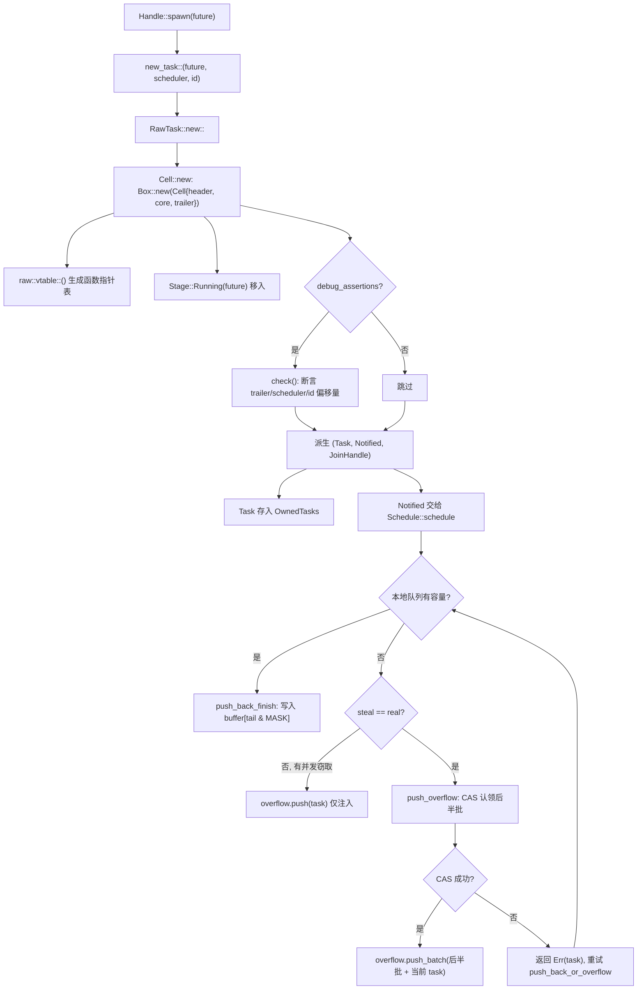
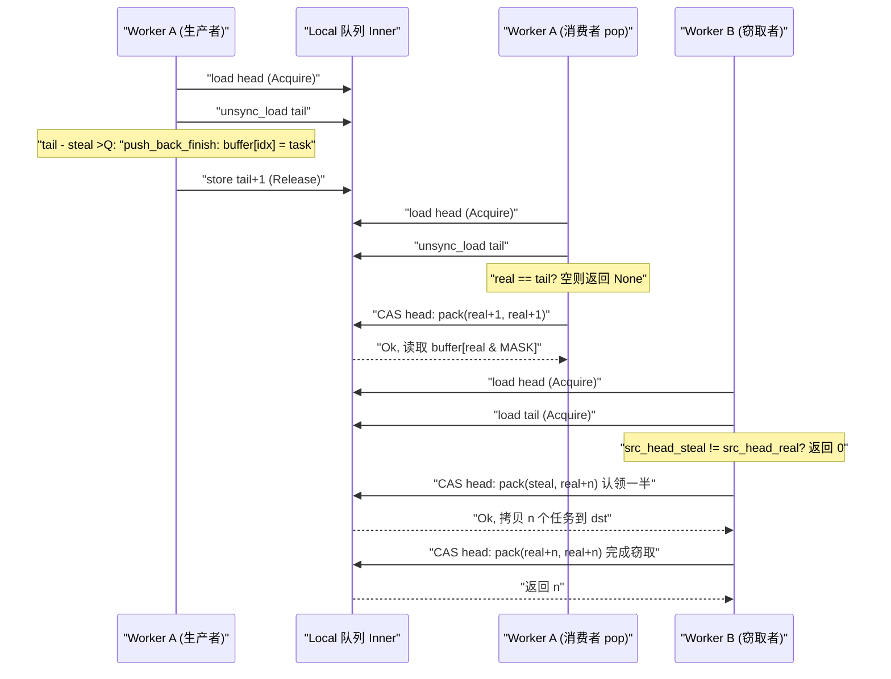

# Chapter 3: The Life of a Task (Part 1): How spawn Turns a Future into a Schedulable Entity

In the previous chapter, we completed the assembly of the Runtime: the I/O driver, time driver, blocking pool, and scheduler are injected into the same`Runtime`instance,`Handle`becoming a shared handle for cross-thread access to these components. But the assembled runtime is still just an empty shell at this point—it has the engine to drive tasks, but no tasks to drive. The question this chapter aims to answer is precisely: when you type`tokio::spawn(async { ... })`at that moment, what exactly does that`async`block go through to transform from ordinary Rust code into an entity that "can be taken over by the scheduler, can be woken up, and can be joined." This is the first half of "The Life of a Task," and we focus on birth: starting from`Handle::spawn`going through`new_task`'s reference-count allocation, landing on`Cell<T, S>`'s memory layout, and finally seeing clearly how a task is delivered to some worker's local queue or the global injection queue. The second half (Chapter 4) will enter the scheduling loop and the poll/wake closed loop.

# 3.1 A Future Is Not a Task: What Exactly Does One spawn Create

## Intuitive Model

Think of`Future`as a "recipe," and think of a task as "a dish currently being cooked in the kitchen." The recipe itself is static, copyable, and has no execution state; only when the kitchen (scheduler) decides "make this dish now," assigns it a stove (worker), an order number (TaskId), and a serving window (JoinHandle), does it become a "dish in production." Without this layer of wrapping, the scheduler would have no way to know "how far along this dish is," "who is waiting for it," or "whom to notify when it's done"—it can only see a recipe and cannot manage it.

## Data Structures and Memory Layout

Tokio uses`Task<S>`to represent "a task reference owned by the runtime," which is a transparent wrapper around`RawTask`:

```rust
#[repr(transparent)]
pub(crate) struct Task {
    raw: RawTask,
    _p: PhantomData,
}
```

[FACT:tokio/src/runtime/task/mod.rs:233-238]

`#[repr(transparent)]`means that`Task<S>`and`RawTask`are completely identical in memory, with no additional overhead.`PhantomData<S>`is only a compile-time type marker, marking which scheduler type this task belongs to`S`。

What truly carries all the task's state is`Cell<T, S>`, and its layout is the cornerstone of the entire task module:

```rust
#[repr(C)]
pub(super) struct Cell {
    pub(super) header: Header,
    pub(super) core: Core,
    pub(super) trailer: Trailer,
}
```

[FACT:tokio/src/runtime/task/core.rs:126-136]

The three fields are arranged as "hot-warm-cold."`Header`is hot data (accessed on every scheduling and every state transition),`Core`is warm data (accessed during poll),`Trailer`is cold data (accessed only during creation and destruction). The comment explicitly states:`Header`must be the first field, because the task struct will be referenced by both`*mut Cell`and`*mut Header`[FACT:tokio/src/runtime/task/core.rs:37-43]。

More critical is cache line alignment.`Cell`has a long list of`#[cfg_attr(..., repr(align(...)))]`attached to it, selecting the alignment byte count according to the target architecture: x86_64/aarch64/powerpc64 use 128 bytes, arm/mips/sparc/hexagon use 32 bytes, m68k uses 16 bytes, s390x uses 256 bytes, and the rest default to 64 bytes[FACT:tokio/src/runtime/task/core.rs:64-125]. The comment explains why x86_64 should use 128 rather than 64: starting with Intel Sandy Bridge, the spatial prefetcher fetches**pairs**of 64-byte cache lines at once, so it must be aligned to 128 bytes to avoid false sharing[FACT:tokio/src/runtime/task/core.rs:45-53]。

> **[Design Inference & Architectural Trade-offs]**
> The cost of this alignment strategy is that each task wastes at least one cache line of space. But the task state bits (`state`) are read and written at high frequency by multiple worker threads—one thread sets the RUNNING bit during poll, another thread reads the NOTIFIED bit during wake—if the state bits of two tasks fall on the same cache line, every state transition will trigger the cache line to bounce back and forth between cores (cache line ping-pong), and the performance loss far exceeds the memory waste. Tokio chooses to trade space for time.

`Header`itself is constrained to within 8 pointer sizes:

```rust
#[test]
#[cfg(not(loom))]
fn header_lte_cache_line() {
    assert!(std::mem::size_of::() ());
}
```

[FACT:tokio/src/runtime/task/core.rs:591-593]

This test ensures that`Header`does not exceed 64 bytes (8 × 8), so that on architectures with 64-byte cache lines it can fit entirely within one line.`Header`'s fields include:`state: State`(atomic state bits),`queue_next: UnsafeCell<Option<NonNull<Header>>>`(linked-list pointer for the injection queue),`vtable: &'static Vtable`(function pointer table),`owner_id: UnsafeCell<Option<NonZeroU64>>`(the ID of the`OwnedTasks`list it belongs to),`scheduled_at: UnsafeCell<ScheduleLatencyInstant>`(scheduling delay measurement)[FACT:tokio/src/runtime/task/core.rs:169-198]。

`Core<T, S>`holds the scheduler handle`scheduler: S`, the task ID`task_id: Id`, and the most central`stage: CoreStage<T>` [FACT:tokio/src/runtime/task/core.rs:148-165]。`Stage`is a three-state enum:

```rust
#[repr(C)]
pub(super) enum Stage {
    Running(T),
    Finished(super::Result),
    Consumed,
}
```

[FACT:tokio/src/runtime/task/core.rs:225-229]

This is precisely the key to "Future and Output reusing the same memory": during task execution`Stage::Running`holds the future, and after completion it is replaced in place with`Stage::Finished(output)`, and after being taken by`JoinHandle`it becomes`Stage::Consumed`。`#[repr(C)]`The comment points to a Miri issue, indicating that this layout has hard requirements for the correctness of unsafe code[FACT:tokio/src/runtime/task/core.rs:225-229]。

`Trailer`stores cold data:`owned: linked_list::Pointers<Header>`（`OwnedTasks`linked-list pointer),`waker: UnsafeCell<Option<Waker>>`(the consumer waker waiting for task completion),`hooks: TaskHarnessScheduleHooks` [FACT:tokio/src/runtime/task/core.rs:205-213]。

## Step-by-Step: From spawn to Enqueue

Let us plug in a concrete scenario: in a multi_thread runtime, worker thread A executes`tokio::spawn(async { 42 })`。

**Step 1: Construct the task trio.** `new_task`is the only entry point for a task's birth:

```rust
fn new_task(
    task: T,
    scheduler: S,
    id: Id,
    spawned_at: SpawnLocation,
) -> (Task, Notified, JoinHandle)
```

[FACT:tokio/src/runtime/task/mod.rs:336-346]

It calls`RawTask::new::<T, S>`to allocate`Cell`, then derives three references from the same`raw`pointer:`Task`(owned reference, usually immediately placed into`OwnedTasks`）、`Notified`(notification reference, handed to the scheduler),`JoinHandle`(result-reading handle)[FACT:tokio/src/runtime/task/mod.rs:347-363]. Note that the three share the same`raw`, each holding a reference count.

**Step 2: Allocate`Cell`and write the initial state.** `Cell::new`Allocate the entire structure on the heap:

```rust
let result = Box::new(Cell {
    trailer: Trailer::new(scheduler.hooks()),
    header: new_header(state, vtable, ...),
    core: Core {
        scheduler,
        stage: CoreStage {
            stage: UnsafeCell::new(Stage::Running(future)),
        },
        task_id,
        ...
    },
});
```

[FACT:tokio/src/runtime/task/core.rs:261-278]

`vtable`Generated by`raw::vtable::<T, S>()`, it is a function pointer table monomorphized for a specific`T`and`S`.[FACT:tokio/src/runtime/task/core.rs:260]. The future is moved directly into`Stage::Running`, with no additional boxing.

**Step 3: Debug assertions verify the layout.**Under`debug_assertions`,`Cell::new`will call the`check`function, using`Header::get_trailer`、`Header::get_scheduler`、`Header::get_id_ptr`and other pointer arithmetic based on vtable offsets to assert one by one that "the field address looked up through the header" matches "the actual field address"[FACT:tokio/src/runtime/task/core.rs:280-321]. This is a runtime self-check of the correctness of vtable offsets.

**Step 4: Submit to the scheduler.**After the scheduler receives`Notified<S>`, it calls`Schedule::schedule` [FACT:tokio/src/runtime/task/mod.rs:315]. Under multi_thread, this goes through`push_back_or_overflow`, pushing the task into the current worker's local queue, and overflowing to the injection queue when the queue is full.

The following diagram depicts the control flow and branches from`new_task`to enqueueing:



This diagram reveals several key branches: debug assertions only take effect in debug builds; when the local queue is full, it does not overflow directly, but first checks whether there is a concurrent stealer (`steal != real`). If so, it only pushes the current task into the injection queue, because the space freed up by the stealer will soon become available.

## Design consideration: why three references instead of one

`new_task`returns three references, not one. This is the core of the reference counting design:`Task`represents "the runtime owns this task",`Notified`represents "this task has been notified and is pending scheduling",`JoinHandle`represents "someone cares about its result". The three have independent lifetimes—`JoinHandle`can be dropped (the task continues running, the result is discarded),`Notified`disappears after poll,`Task`is released after the task completes and is removed from`OwnedTasks`. If there were only one reference, it would be impossible to express the state "the task is still running but no one is joining".

`UnownedTask`is another important branch: it holds**two**reference counts, used for blocking tasks (not stored in`OwnedTasks`）[FACT:tokio/src/runtime/task/mod.rs:286-295]。`unowned`. The function merges the two references into`mem::forget(task)`and`mem::forget(notified)`via`UnownedTask` [FACT:tokio/src/runtime/task/mod.rs:388-397]. The design motivation for "two references" is: blocking tasks do not have a`OwnedTasks`list to hold an owned reference, so an extra reference count is needed to ensure the task is not released during execution.

# 3.2 State bits: how a single usize encodes the entire lifecycle of a task

## Intuitive model

Think of task state as a "medical report form" with several independent checkboxes: whether it is being polled, whether it is completed, whether it has been notified, whether it has been cancelled, whether someone is joining. Tokio does not use multiple boolean fields, but instead packs these check bits into**a`AtomicUsize`**. This way, each state transition requires only one CAS instead of multiple locks. Without this design, task state transitions would become nested multiple locks, and both deadlock risk and overhead would soar.

## Bitfield layout

`State`The bitfields of[FACT:tokio/src/runtime/task/mod.rs:32-53]：

- `RUNNING`are fully defined in the module documentation**: whether the task is being polled or cancelled.** [FACT:tokio/src/runtime/task/mod.rs:37-38]。
- `COMPLETE`This bit also serves as the task's lock`RUNNING`: the future has fully completed and been dropped. Once set, it is never cleared, and is never set at the same time as[FACT:tokio/src/runtime/task/mod.rs:40-41]。
- `NOTIFIED`: whether a`Notified`object currently exists[FACT:tokio/src/runtime/task/mod.rs:43]。
- `CANCELLED`: the task should be cancelled as soon as possible[FACT:tokio/src/runtime/task/mod.rs:45-46]。
- `JOIN_INTEREST`: exists`JoinHandle` [FACT:tokio/src/runtime/task/mod.rs:48]。
- `JOIN_WAKER`: serves as the access control bit for the join handle waker[FACT:tokio/src/runtime/task/mod.rs:50-51]。

The remaining bits are used for the reference count[FACT:tokio/src/runtime/task/mod.rs:53]。

`RUNNING`The fact that the bit serves as a lock is worth elaborating on. The Safety section of the module documentation states: any mutable access to the future must occur after acquiring the lock by modifying the`RUNNING`bit, thereby guaranteeing exclusive access[FACT:tokio/src/runtime/task/mod.rs:130-133]. This means that when polling a task, the thread first CASes to set`RUNNING`, and on success exclusively owns the future; if it fails, it means another thread is polling, and this poll returns directly. This merges "mutual exclusion for poll" and "state transition" into a single atomic operation, avoiding a separate mutex.

## JOIN_WAKER access control protocol

`JOIN_WAKER`The bit is the most ingenious part of the entire state machine. The problem it solves is:`waker`The field (in`Trailer`) is accessed concurrently by two threads—the runtime, when the task completes,**reads**it to wake the joiner,`JoinHandle`and during poll**writes**it to register the waker. The module documentation gives 7 rules[FACT:tokio/src/runtime/task/mod.rs:75-120]：

1. `JOIN_WAKER`is initially 0.

2. When it is 0,`JoinHandle`has exclusive (mutable) access to the waker field.

3. When it is 1,`JoinHandle`has only shared (read-only) access.

4. When it is 1 and`COMPLETE`is 1, the runtime has shared (read-only) access to the waker field.

5. `JoinHandle`To write the waker, it must: (i) successfully set`JOIN_WAKER`to 0 to obtain exclusive rights, (ii) write the waker, (iii) successfully set`JOIN_WAKER`to 1.

6. `JoinHandle`can only modify`COMPLETE`when`JOIN_WAKER`is 0; the runtime can only modify when`COMPLETE`is 1.

7. If`JOIN_INTEREST`is 0 and`COMPLETE`is 1, the runtime has exclusive access to the waker field (used to drop the waker).

Rule 6 implies a race: step (i) or (iii) may fail. If (i) fails, abandon writing the waker; if (iii) fails (another thread set`COMPLETE`during this period), then clear the waker field[FACT:tokio/src/runtime/task/mod.rs:110-120]. The essence of this protocol is: use a single atomic bit to dynamically transfer ownership between "writer" and "reader", avoiding a separate lock for the waker field.

## Two kinds of reference count decrements

`Task`The drop of`UnownedTask`'s drop decrements twice:

```rust
impl Drop for Task {
    fn drop(&mut self) {
        if self.header().state.ref_dec() {
            self.raw.dealloc();
        }
    }
}
```

[FACT:tokio/src/runtime/task/mod.rs:580-586]

```rust
impl Drop for UnownedTask {
    fn drop(&mut self) {
        if self.raw.header().state.ref_dec_twice() {
            self.raw.dealloc();
        }
    }
}
```

[FACT:tokio/src/runtime/task/mod.rs:590-596]

`ref_dec`returns`true`indicates this is the last reference, and only then is it truly released`Cell`memory.`ref_dec_twice`is`UnownedTask`A direct manifestation of holding two counts.

## Design consideration: why the state bit and reference count share a single atomic

> **[Design Inference & Architectural Trade-offs]**
> Putting the state bit and reference count in the same`AtomicUsize`is to allow the two actions of "decrementing the reference count" and "setting the state bit" to be completed in**a single CAS**. The module documentation explicitly mentions in the comment at`Schedule::release`: "The task module will batch-process ref-dec and other option settings"[FACT:tokio/src/runtime/task/mod.rs:302-304]. If the state bit and reference count belonged to two separate atomic variables, then a window would appear between "releasing the last reference" and "marking completion," requiring additional synchronization. After merging,`ref_dec`can atomically complete "decrement count + check whether it reached zero," avoiding ABA-like problems.

# 3.3 JoinHandle: how results are passed back across task boundaries

## Intuitive model

`JoinHandle`is like the "meal pickup ticket" a restaurant gives you. When the task (kitchen) completes, it places the dish (output) at the pickup counter (`Stage::Finished`), then rings your pager (waker). You come to pick it up with the ticket; the ticket itself does not hold the dish, it is just a pointer to the pickup counter. If you lose the ticket (drop`JoinHandle`), the dish will be thrown away directly (output is dropped), but the kitchen will not stop working because of this.

## Data structure

`JoinHandle<T>`is likewise a transparent wrapper around`RawTask`:

```rust
pub struct JoinHandle {
    raw: RawTask,
    _p: PhantomData,
}
```

[FACT:tokio/src/runtime/task/join.rs:163-166]

`PhantomData<T>`Marks the output type.`JoinHandle<T>`Only at`T: Send`is it`Send`/`Sync` [FACT:tokio/src/runtime/task/join.rs:169-170], which ensures that non-Send output will not be moved across threads.

## Step-by-Step: awaiting a JoinHandle

`JoinHandle`implements`Future`, whose`poll`is the core of result passing:

```rust
fn poll(self: Pin, cx: &mut Context) -> Poll {
    ready!(crate::trace::trace_leaf());
    let mut ret = Poll::Pending;
    let coop = ready!(crate::task::coop::poll_proceed(cx));
    unsafe {
        self.raw.try_read_output(&mut ret, cx.waker());
    }
    if ret.is_ready() {
        coop.made_progress();
    }
    ret
}
```

[FACT:tokio/src/runtime/task/join.rs:327-354]

Note several details:`trace_leaf`is used for tracing instrumentation;`coop::poll_proceed`consumes the cooperative budget (detailed in Chapter 12);`try_read_output`erases generics through the vtable, placing the return value on the stack and passing it in with`*mut ()`to[FACT:tokio/src/runtime/task/join.rs:327-354]. This "return value on the stack" trick is because vtable functions cannot genericize the return type`T`, and can only write back through a raw pointer.

> **[Design Inference & Architectural Trade-offs]**
> `try_read_output`Internal logic (in raw.rs, source not provided in this chapter): first check the`COMPLETE`bit; if it is already set, call`take_output`to take the result from`Stage::Finished`; otherwise register`cx.waker()`into the`Trailer::waker`field and return`Pending`. The registration process follows the`JOIN_WAKER`protocol in Section 3.2.

## Ownership transfer of the result

The "Non-Send output" section of the module documentation precisely describes the ownership rules for the result[FACT:tokio/src/runtime/task/mod.rs:151-170]：

- When the task completes, output is placed into`Stage`, then the transition that "sets COMPLETE" is executed, and the`JOIN_INTEREST`value at that moment is read.
- If`JOIN_INTEREST`is 0 (no`JoinHandle`), output is dropped immediately[FACT:tokio/src/runtime/task/mod.rs:157-158]。
- If`JOIN_INTEREST`is 1,`JoinHandle`is responsible for cleaning up output[FACT:tokio/src/runtime/task/mod.rs:160-161]。

For non-Send output, the documentation gives a three-step argument: output is created on the thread that polls the future;`JoinHandle<Output>`is also non-Send when Output is non-Send, so it is also on the spawn thread; therefore`JoinHandle`will not move output across threads when taking it or dropping it[FACT:tokio/src/runtime/task/mod.rs:164-170]。

## JoinHandle's drop: fast and slow paths

```rust
impl Drop for JoinHandle {
    fn drop(&mut self) {
        if self.raw.state().drop_join_handle_fast().is_ok() {
            return;
        }
        self.raw.drop_join_handle_slow();
    }
}
```

[FACT:tokio/src/runtime/task/join.rs:358-364]

`drop_join_handle_fast`tries to complete "clear the`JOIN_INTEREST`bit + decrement the reference count" with a single CAS. If it fails (for example, the task is completing and the state bit is occupied), it takes the slow path of`drop_join_handle_slow`. This is a typical "optimistic fast path + pessimistic slow path" pattern.

## Design consideration: why JoinHandle does not directly hold output

> **[Design Inference & Architectural Trade-offs]**
> If`JoinHandle`directly held output, then output would have to be moved to the thread where`JoinHandle`resides when the task completes. But`JoinHandle`may be moved to any thread (as long as`T: Send`), while the thread that produces output is the poll thread. Directly holding it would cause a cross-thread move where "output is produced on the poll thread but must be dropped on the join thread," directly violating the type system for non-Send output. Tokio chooses to leave output in`Cell`(`Stage::Finished`），`JoinHandle`only holds a`Cell`pointing to`RawTask`, and when retrieving the result, takes it in place through`take_output`. In this way, output's drop occurs on the thread where`JoinHandle`resides, but the premise is that this thread is the same as the poll thread (which holds in the non-Send scenario).

# 3.4 Local queue: the producer-consumer structure of work-stealing

## Intuitive model

Each worker has a "private to-do list" (local queue) with capacity 256. The worker itself takes tasks from the**head**(LIFO, exploiting cache locality), while other workers steal tasks from the**tail**(FIFO, taking the oldest and most likely already-completed tasks). Without a local queue, all tasks would crowd into the global queue, and every task retrieval would contend for the global lock, causing multicore scalability to collapse.

## Memory layout: separation of head and tail

```rust
pub(crate) struct Inner {
    head: AtomicUnsignedLong,
    tail: AtomicUnsignedShort,
    buffer: Box>>; LOCAL_QUEUE_CAPACITY]>,
}
```

[FACT:tokio/src/runtime/scheduler/multi_thread/queue.rs:36-57]

`head`is`AtomicUnsignedLong`(64-bit, if the platform supports u64),`tail`is`AtomicUnsignedShort`(32-bit). The comment explains why the indices are wider than actually needed: for ABA mitigation, and to distinguish "full" and "empty" buffers[FACT:tokio/src/runtime/scheduler/multi_thread/queue.rs:37-49]。

`head`internally packs**two** `UnsignedShort`The low bits are the "real head", and the high bits are the "steal head" (the first position the stealer is processing). When the two are equal, there is no active stealer.[FACT:tokio/src/runtime/scheduler/multi_thread/queue.rs:39-49]This dual-value packing is the core trick of the work-stealing queue: the stealer first CAS-updates the steal value to "claim" a batch of tasks, and after completion advances the steal value to catch up with the real value, indicating that stealing has ended.

`LOCAL_QUEUE_CAPACITY`Under non-loom it is 256, and under loom it shrinks to 4 to test more boundary cases.[FACT:tokio/src/runtime/scheduler/multi_thread/queue.rs:62-69]。`MASK = LOCAL_QUEUE_CAPACITY - 1`, used for ring buffer indexing.[FACT:tokio/src/runtime/scheduler/multi_thread/queue.rs:71]。

## Step-by-Step: the complete branches of push_back_or_overflow

This is the most complex function of the local queue; let's analyze it branch by branch:

```rust
pub(crate) fn push_back_or_overflow>(
    &mut self,
    mut task: task::Notified,
    overflow: &O,
    stats: &mut Stats,
) {
    let tail = loop {
        let head = self.inner.head.load(Acquire);
        let (steal, real) = unpack(head);
        let tail = unsafe { self.inner.tail.unsync_load() };

        if tail.wrapping_sub(steal)  return,
                Err(v) => { task = v; }
            }
        }
    };
    self.push_back_finish(task, tail);
}
```

[FACT:tokio/src/runtime/scheduler/multi_thread/queue.rs:188-223]

Three branches:

1. **Has capacity**（`tail - steal < CAPACITY`）：`break tail`, after breaking out of the loop, call`push_back_finish`to write to the buffer.

2. **No capacity but there are concurrent stealers**（`steal != real`): the stealer will free up space, so just push the current task into the injection queue and return immediately.[FACT:tokio/src/runtime/scheduler/multi_thread/queue.rs:204-208]。

3. **No capacity and no stealers**: call`push_overflow`to overflow the latter half batch of tasks to the injection queue[FACT:tokio/src/runtime/scheduler/multi_thread/queue.rs:209-219]. If the CAS fails (loses to a concurrent stealer),`push_overflow`returns`Err(task)`, and the loop retries.

`push_back_finish`Write the task and update tail:

```rust
fn push_back_finish(&self, task: task::Notified, tail: UnsignedShort) {
    let idx = tail as usize & MASK;
    self.inner.buffer[idx].with_mut(|ptr| {
        unsafe { ptr::write((*ptr).as_mut_ptr(), task); }
    });
    self.inner.tail.store(tail.wrapping_add(1), Release);
}
```

[FACT:tokio/src/runtime/scheduler/multi_thread/queue.rs:226-244]

`Release`The ordering guarantees that the written task is visible to stealers.

## push_overflow: why overflow the latter half batch

```rust
const NUM_TASKS_TAKEN: UnsignedShort = (LOCAL_QUEUE_CAPACITY / 2) as UnsignedShort;
```

[FACT:tokio/src/runtime/scheduler/multi_thread/queue.rs:265]

When overflowing, take 128 tasks. The comment explains in detail why to take**the latter half batch**rather than the former half batch[FACT:tokio/src/runtime/scheduler/multi_thread/queue.rs:295-306]: when taking tasks from the injection queue, they are always placed in the former half. So if a task is in the latter half, it can be determined that it was not just taken from the injection queue. This guarantees that "a task taken from the injection queue will not be immediately put back into the injection queue" (at least before it has been polled once).

CAS claims the latter half batch:

```rust
if self.inner.head.compare_exchange_weak(
    pack(head, head), pack(tail, tail), Release, Relaxed
).is_err() {
    return Err(task);
}
```

[FACT:tokio/src/runtime/scheduler/multi_thread/queue.rs:283-293]

Update`head`from`(head, head)`to`(tail, tail)`, that is, advance both steal and real to tail, claiming all tasks. After success, roll back tail to`tail + NUM_TASKS_TAKEN`, indicating that the former half batch remains in the local queue.[FACT:tokio/src/runtime/scheduler/multi_thread/queue.rs:314-316]。

## pop and steal_into: the two paths for taking tasks

`pop`is the worker itself taking a task (from the head, LIFO):

```rust
pub(crate) fn pop(&mut self) -> Option> {
    let mut head = self.inner.head.load(Acquire);
    let idx = loop {
        let (steal, real) = unpack(head);
        let tail = unsafe { self.inner.tail.unsync_load() };
        if real == tail { return None; }
        let next_real = real.wrapping_add(1);
        let next = if steal == real {
            pack(next_real, next_real)
        } else {
            assert_ne!(steal, next_real);
            pack(steal, next_real)
        };
        let res = self.inner.head.compare_exchange_weak(head, next, AcqRel, Acquire);
        match res {
            Ok(_) => break real as usize & MASK,
            Err(actual) => head = actual,
        }
    };
    Some(self.inner.buffer[idx].with(|ptr| unsafe { ptr::read(ptr).assume_init() }))
}
```

[FACT:tokio/src/runtime/scheduler/multi_thread/queue.rs:361-399]

Key branch: if`steal == real`(no stealer), advance both at the same time; otherwise advance only real and leave steal unchanged.[FACT:tokio/src/runtime/scheduler/multi_thread/queue.rs:377-384]。`assert_ne!(steal, next_real)`ensures that real will not be advanced to steal's position, otherwise it would corrupt the stealer's claim state.

`steal_into`is the stealing path, first checking whether the target queue has enough space:

```rust
if dst_tail.wrapping_sub(steal) > LOCAL_QUEUE_CAPACITY as UnsignedShort / 2 {
    return None;
}
```

[FACT:tokio/src/runtime/scheduler/multi_thread/queue.rs:431-435]

If the target queue is more than half full, do not steal, to avoid immediately overflowing again after stealing.

`steal_into2`is the core of stealing, calculating the number to steal:

```rust
let n = src_tail.wrapping_sub(src_head_real);
let n = n - n / 2;
```

[FACT:tokio/src/runtime/scheduler/multi_thread/queue.rs:487-488]

Steal half (rounded up). Then CAS-update head's steal value to claim:

```rust
let steal_to = src_head_real.wrapping_add(n);
next_packed = pack(src_head_steal, steal_to);
let res = self.0.head.compare_exchange_weak(prev_packed, next_packed, AcqRel, Acquire);
```

[FACT:tokio/src/runtime/scheduler/multi_thread/queue.rs:496-506]

Note that only the real value is updated here (`pack(src_head_steal, steal_to)`steal remains unchanged in`steal_to`), advancing real to

```rust
loop {
    let head = unpack(prev_packed).1;
    next_packed = pack(head, head);
    let res = self.0.head.compare_exchange_weak(prev_packed, next_packed, AcqRel, Acquire);
    match res {
        Ok(_) => return n,
        Err(actual) => prev_packed = actual,
    }
}
```

[FACT:tokio/src/runtime/scheduler/multi_thread/queue.rs:548-561]

The sequence diagram below depicts the three-party concurrent interaction of "producer push, consumer pop, stealer steal":



## Design thinking: why the local queue is LIFO while stealing is FIFO

> **[Design Inference & Architectural Trade-offs]**
> The worker itself takes from the head (LIFO), because the most recently pushed task is most likely still in the CPU cache, and is most likely the task that was "just woken up and whose data is still hot." The stealer takes from the tail (FIFO), because the oldest task is most likely to have already completed most of its work, and stealing it can reduce the victim's load the fastest. This combination of "LIFO local + FIFO stealing" is the classic design of work-stealing scheduling, balancing cache locality and load balancing.

At this point, the task has completed its transformation from a Future to a schedulable entity: it has been assigned a reference count, placed into`Cell`'s memory layout, and successfully delivered to the worker's local queue or the global injection queue. But putting a task into a queue is only the beginning; what really makes it run is the worker thread's scheduling loop. In the next chapter we will enter the second half of "the life of a task", tracing how the worker takes tasks from the queue, calls`Future::poll`, and upon returning`Pending`registers a wakeup through`Waker`, ultimately triggering`schedule`to re-enqueue—the complete call path of the closed loop "wakeup -> enqueue -> poll again", as well as the work-stealing strategy and LIFO slot optimization, will all be revealed there.
