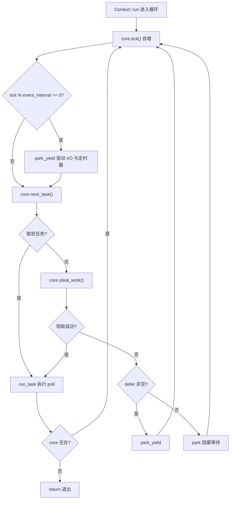
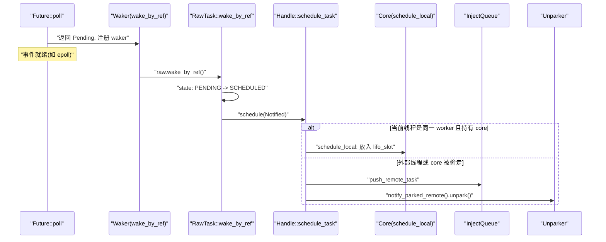
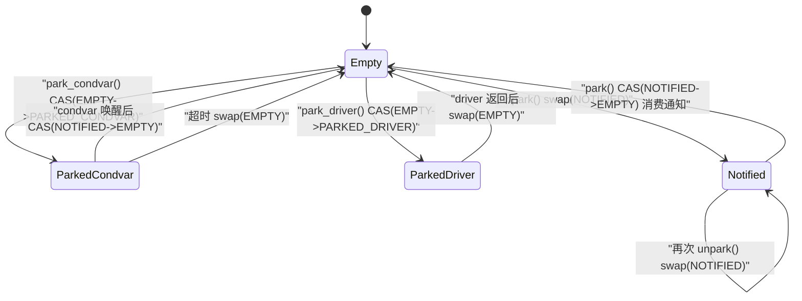

# Chapter 4: The Life of a Task (Part 2): The Closed Loop of the Scheduling Loop, Poll, and Wakeup

# From queue to execution: the skeleton of the worker main loop

In the previous chapter we sent tasks into the`Local`queue or the global injection queue. But the queue is only a "to-do list"; what really makes tasks run is the never-ending loop in the worker thread. In this chapter we trace`Context::run`—it is the heart of the entire multi-threaded scheduler.

First build intuition: a worker thread is like a chef, with a stack of their own orders in front of them (`run_queue`), and also a public order rack nearby (`inject`). The chef first looks at the nearest one at hand (`lifo_slot`), if not, take from their own stack, if still not, grab a handful from the public shelf, and if that still doesn't work, steal a few from other chefs' stacks. Only when everything is empty does he go rest, but even while resting his ears stay perked—as soon as an order comes in, he wakes up immediately.

Without this loop, once a task is enqueued it would forever lie in the queue,`Future::poll`never to be invoked, and the entire runtime would just be a pile of dead data.

## Core's memory layout and state fields

The worker's mutable state is all contained in`Core`, which is`Box`allocated on the heap, and passed between`AtomicCell<Core>`via`Worker`and the thread-local`Context`.

`Core`The key fields of[FACT:tokio/src/runtime/scheduler/multi_thread/worker.rs:113-167]：

- `tick: u32`are as follows: incremented each loop iteration, used to periodically trigger maintenance (`maintenance`) and global queue checks.
- `lifo_slot: Option<Notified>`：**LIFO slot**, this is the most ingenious design in this chapter. When a worker schedules a task itself, it does not go into`run_queue`, but instead places it into this slot, and the next time it fetches a task it**prioritizes**taking from here.
- `lifo_enabled: bool`: A switch for the LIFO slot, used to prevent starvation in ping-pong scenarios.
- `run_queue: queue::Local<Arc<Handle>>`: The local queue, the`Local`structure analyzed in the previous chapter.
- `is_searching: bool`: Whether the worker is currently searching for stealable tasks.
- `is_shutdown: bool` / `is_traced: bool`: Shutdown and tracing flags.
- `park: Option<Parker>`: The parker, wrapped with`Option`to conveniently take out/put back under the borrow checker.
- `global_queue_interval: u32`: How often to check the global queue.
- `rand: FastRand`: A fast random number generator, used to randomly select the stealing start point.

> **[Design Inference & Architectural Trade-offs]**
> Note that`lifo_slot`is a`Option<Notified>`rather than a queue—it only stores**one**task. The design motivation is clearly stated in the source code comments[FACT:tokio/src/runtime/scheduler/multi_thread/worker.rs:117-121]: tasks scheduled by the worker itself are stored in this slot, and the worker checks it`run_queue` **before**checking

, with the effect that "the last scheduled task runs next" (LIFO). This is to improve locality, is especially effective for message-passing patterns, and can reduce latency.

Why can LIFO reduce latency? Consider a typical message-passing scenario: task A finishes processing a message and wakes task B, and B finishes processing and wakes A again. If B runs immediately after A wakes it, the data B needs is very likely still in the CPU cache (because A just touched it). If B is pushed to the tail of the queue, by the time the dozens of tasks ahead of it finish, the cache will long since have been flushed.`MAX_LIFO_POLLS_PER_TICK = 3`But LIFO has a starvation risk. The source code uses[FACT:tokio/src/runtime/scheduler/multi_thread/worker.rs:263-263]to limit

## : each tick prioritizes the LIFO slot at most 3 times, after which it is disabled to give other tasks a chance to execute.

Main loop walkthrough: one complete scheduling cycle`park`Let us plug in a concrete scenario: worker 0 has just woken up from`run_queue`,`lifo_slot`has 5 tasks,

has 1 task, and the global queue has 3 tasks.`Context::run` [FACT:tokio/src/runtime/scheduler/multi_thread/worker.rs:570-642]The main loop entry is`lifo_enabled`. It first resets`block_in_place`(because the core may have been stolen by[FACT:tokio/src/runtime/scheduler/multi_thread/worker.rs:571-573], and the state needs to be restored)`while !core.is_shutdown`, then enters the

loop.

**Each loop iteration does four things:** `core.tick()`Step one: tick and maintenance.[FACT:tokio/src/runtime/scheduler/multi_thread/worker.rs:587]increments the counter`self.maintenance(core)`. Then`tick % event_interval == 0`checks`park_yield`, and if so calls[FACT:tokio/src/runtime/scheduler/multi_thread/worker.rs:809-826]。

**to drive I/O and timers with a 0 timeout** `core.next_task(&self.worker)`Step two: fetch a task.[FACT:tokio/src/runtime/scheduler/multi_thread/worker.rs:1090-1156]is the core task-fetching logic

- . It has two paths:`tick % global_queue_interval == 0`When**,**prioritize[FACT:tokio/src/runtime/scheduler/multi_thread/worker.rs:1091-1098]taking from the global queue, and if that fails, take from the local
- . This is to prevent tasks in the global queue from starving.**Otherwise**prioritize[FACT:tokio/src/runtime/scheduler/multi_thread/worker.rs:1090-1156]。

taking local tasks`next_local_task`Local task fetching is done by[FACT:tokio/src/runtime/scheduler/multi_thread/worker.rs:1158-1160]：

```rust
fn next_local_task(&mut self) -> Option {
    self.lifo_slot.take().or_else(|| self.run_queue.pop())
}
```

first take from the LIFO slot, then take from the head of the queue (LIFO pop). This is the "local LIFO" mentioned in the previous chapter.

If the local queue is empty but the global queue is non-empty, the worker will**batch**pull tasks from the global queue[FACT:tokio/src/runtime/scheduler/multi_thread/worker.rs:1110-1154]. The calculation of the batch size`n`is quite particular:`min(inject.len() / remotes.len() + 1, cap)`, where`cap`is again taken as`min(remaining_slots, max_capacity / 2)`. The source code comments explain why it is limited to half the queue capacity[FACT:tokio/src/runtime/scheduler/multi_thread/worker.rs:1120-1131]: to ensure that the pulled tasks land in the**first half**of the local queue, so that even if overflow occurs later, these tasks will not be pushed back to the global queue (overflow only affects the second half).

**Step three: run the task.**After obtaining the task, calls`run_task` [FACT:tokio/src/runtime/scheduler/multi_thread/worker.rs:647-796]. This is the most complex function in this chapter, and we will expand on it specifically in the next section.

**Step four: steal or park.**If`next_task`returns`None`, it means there is no work left locally or globally, so calls`steal_work` [FACT:tokio/src/runtime/scheduler/multi_thread/worker.rs:1167-1195]. If stealing fails, it enters`park`or`park_yield` [FACT:tokio/src/runtime/scheduler/multi_thread/worker.rs:613-621]。

The entire control flow is as follows:



## run_task: the closed loop of poll and the LIFO slot

`run_task`is where the task is actually`poll`, and also the closing point of the "wake -> enqueue -> poll again" loop.

The first thing after entering the function is`assert_owner` [FACT:tokio/src/runtime/scheduler/multi_thread/worker.rs:648], converting`Notified`into`Task`, while asserting that the current thread is indeed the owner of this task (debug assertion).

Next is`transition_from_searching` [FACT:tokio/src/runtime/scheduler/multi_thread/worker.rs:652]—if the worker was previously in the searching state, now that it has found a task, it must exit the searching state and may wake other parked workers.

Then comes the key budget wrapper[FACT:tokio/src/runtime/scheduler/multi_thread/worker.rs:695-795]：

```rust
coop::budget(|| {
    task.run();
    let mut lifo_polls = 0;
    loop {
        let mut core = match self.core.borrow_mut().take() {
            Some(core) => core,
            None => return ControlFlow::Break(()),
        };
        let task = match core.lifo_slot.take() {
            Some(task) => task,
            None => {
                self.reset_lifo_enabled(&mut core);
                core.stats.end_poll();
                return ControlFlow::Continue(core);
            }
        };
        if !coop::has_budget_remaining() {
            core.run_queue.push_back_or_overflow(task, ...);
            return ControlFlow::Continue(core);
        }
        lifo_polls += 1;
        if lifo_polls >= MAX_LIFO_POLLS_PER_TICK {
            core.lifo_enabled = false;
        }
        let task = self.worker.handle.shared.owned.assert_owner(task);
        *self.core.borrow_mut() = Some(core);
        task.run();
    }
})
```

This code reveals the complete closed loop of the LIFO slot:`task.run()`executes`Future::poll`, and during polling, if the task wakes itself or another task,`schedule_local`will place the new task into`lifo_slot` [FACT:tokio/src/runtime/scheduler/multi_thread/worker.rs:1396-1408]. After poll returns, the loop immediately checks`lifo_slot`, and if there is a task it continues running—**without returning to the main loop**, directly polling continuously within the same budget.

This is the manifestation of "wake -> enqueue -> poll again" on the LIFO path: when woken, the task is placed into`lifo_slot`, and immediately after poll returns it is taken out and polled again, forming a tight closed loop.

Note the`self.core.borrow_mut().take()`branch of`None`:[FACT:tokio/src/runtime/scheduler/multi_thread/worker.rs:716-724]if the core has been stolen (for example, if the task called`block_in_place`), the worker must return`ControlFlow::Break(())`, letting`Context::run`exit. This is`block_in_place`Interaction points with the scheduling loop.

## Wake path: How the Waker triggers re-enqueueing

When`Future::poll`returns`Pending`the task needs to register a`Waker`and be woken when the event is ready. Tokio's`Waker`implementation is extremely lean—it's just a raw pointer to the task's`Header`plus a vtable.

`waker_ref`Construct`WakerRef` [FACT:tokio/src/runtime/task/waker.rs:11-34]wrap`ManuallyDrop`with`Waker`to avoid decrementing the reference count on drop. The vtable is a static[FACT:tokio/src/runtime/task/waker.rs:119-119]：

```rust
static WAKER_VTABLE: RawWakerVTable =
    RawWakerVTable::new(clone_waker, wake_by_val, wake_by_ref, drop_waker);
```

All four functions simply restore the raw pointer to`Header`and then call`RawTask`'s corresponding method[FACT:tokio/src/runtime/task/waker.rs:70-116]For example,`wake_by_ref`ultimately calls`raw.wake_by_ref()` [FACT:tokio/src/runtime/task/waker.rs:106-116]。

`wake_by_ref`The semantics are: transition the task state from`PENDING`to`SCHEDULED`and if the transition succeeds (i.e., it was indeed PENDING), call`Schedule::schedule`to re-enqueue the task.

For the multi-threaded scheduler,`schedule`'s implementation is in`Handle::schedule_task` [FACT:tokio/src/runtime/scheduler/multi_thread/worker.rs:1353-1376]：

```rust
pub(super) fn schedule_task(&self, task: Notified, is_yield: bool) {
    with_current(|maybe_cx| {
        if let Some(cx) = maybe_cx {
            if self.ptr_eq(&cx.worker.handle) {
                if let Some(core) = cx.core.borrow_mut().as_mut() {
                    self.schedule_local(core, task, is_yield);
                    return;
                }
            }
        }
        self.push_remote_task(task);
        self.notify_parked_remote();
    });
}
```

The logic branches into two paths:

- If the current thread is this scheduler's worker and holds the core, go through`schedule_local` [FACT:tokio/src/runtime/scheduler/multi_thread/worker.rs:1385-1417]—place it into the LIFO slot or the local queue.
- Otherwise (woken from an external thread, or the core was stolen), go through`push_remote_task`push into the global injection queue and`notify_parked_remote`wake a parked worker[FACT:tokio/src/runtime/scheduler/multi_thread/worker.rs:1379-1383]。

`schedule_local`Internally it branches again[FACT:tokio/src/runtime/scheduler/multi_thread/worker.rs:1385-1417]: if it's`yield`or LIFO is disabled, push into the`run_queue`tail; otherwise place it into`lifo_slot`and push the task originally in the slot to the tail of the queue.



## park and unpark: Atomicity of the state machine and wakeup

When a worker has nothing to do it must park, but park/unpark is the most race-prone area. Tokio uses a`AtomicUsize`state machine plus`Condvar`as a fallback to solve this.

`Inner`'s field[FACT:tokio/src/runtime/scheduler/multi_thread/park.rs:31-43]：`state: AtomicUsize`、`mutex: Mutex<()>`、`condvar: Condvar`、`shared: Arc<Shared>`There are four state constants[FACT:tokio/src/runtime/scheduler/multi_thread/park.rs:36-45]：

- `EMPTY = 0`: not parked.
- `PARKED_CONDVAR = 1`: parked on the condvar.
- `PARKED_DRIVER = 2`: parked on the I/O driver.
- `NOTIFIED = 3`: already woken.

This is an explicit state machine, and we use it to draw the state diagram (this is the only place in this chapter that meets the`stateDiagram-v2`admission criteria—the source code really does have these four state constants):



`unpark`'s implementation[FACT:tokio/src/runtime/scheduler/multi_thread/park.rs:277-290]uses`swap`instead of CAS; the source comments explain why[FACT:tokio/src/runtime/scheduler/multi_thread/park.rs:277-290]: a release operation must be performed so that the parked thread observes the writes before unpark, so even if state is already`NOTIFIED`it must still be written once.

`park`first tries to consume an existing notification[FACT:tokio/src/runtime/scheduler/multi_thread/park.rs:132-149]: if CAS`NOTIFIED -> EMPTY`succeeds, it means it was already woken, so return directly without blocking. Otherwise it tries to acquire the driver lock; if acquired, park on the driver; if not, fall back to the condvar[FACT:tokio/src/runtime/scheduler/multi_thread/park.rs:143-148]。

`park_condvar`There is a classic double-check[FACT:tokio/src/runtime/scheduler/multi_thread/park.rs:162-180]: first CAS`EMPTY -> PARKED_CONDVAR`, and if it fails and it's`NOTIFIED`, it means it was woken before the state was set, so at this point it must`swap(EMPTY)`to synchronize the unpark write[FACT:tokio/src/runtime/scheduler/multi_thread/park.rs:167-177]The comment specifically emphasizes: even if you know it's`NOTIFIED`you must still read once, because unpark may have been called again after we read`NOTIFIED`.

`unpark_condvar`'s comment[FACT:tokio/src/runtime/scheduler/multi_thread/park.rs:292-307]points out the classic condvar trap: there is a window between the parked thread setting the`PARKED`state and actually`wait`, and if notify happens during this window it will be ignored. The solution is that the park thread holds`mutex`at this time, and the unpark thread first`drop(self.mutex.lock())`acquires the lock (thereby waiting for the park thread to release), then`notify_one`。

# Design thinking: Why the LIFO slot is a single slot rather than a queue

> **[Design Inference & Architectural Trade-offs]**
> The single-slot design is a deliberate trade-off. If a queue were used, every wakeup would require enqueueing and every task fetch would require dequeueing, which is more expensive; moreover, the queue would accumulate multiple tasks, breaking the locality assumption of "the most recently woken runs first." The semantics of a single slot are "remember only the most recent one," and the evicted task goes into the normal queue—this exactly matches the law of diminishing locality returns: the most recent task is the hottest, the second is next, and beyond the third the benefit becomes very small.

`MAX_LIFO_POLLS_PER_TICK = 3`This magic number[FACT:tokio/src/runtime/scheduler/multi_thread/worker.rs:263-263]is also an empirical value. The source comment says "running a few times through the LIFO slot seems enough to benefit from locality; more than 3 times may over-weight it." This prevents the ping-pong scenario where A wakes B and B wakes A from starving other tasks.

Another noteworthy design is`steal_work`'s "half-search" strategy[FACT:tokio/src/runtime/scheduler/multi_thread/worker.rs:1158-1160]: a new worker truly attempts to steal only when fewer than half of the workers are searching. This avoids CAS contention caused by all workers frantically stealing at the same time.`transition_to_searching`coordinates through`idle.transition_worker_to_searching()`to[FACT:tokio/src/runtime/scheduler/multi_thread/worker.rs:1197-1203]。

Stealing starts from a random starting point[FACT:tokio/src/runtime/scheduler/multi_thread/worker.rs:1172-1174], iterates over all remotes, skips itself[FACT:tokio/src/runtime/scheduler/multi_thread/worker.rs:1179-1182], and calls`steal_into`to attempt stealing. After all fail, it falls back to the global queue[FACT:tokio/src/runtime/scheduler/multi_thread/worker.rs:1197-1203]。

# Chapter summary

The worker main loop`Context::run`is the heart of the scheduler: after each tick it first fetches a task (LIFO slot → local queue → global queue); if it gets one, it`run_task`executes poll; if not, it steals; if stealing fails, it parks.`run_task`The internal LIFO loop compresses "wake → enqueue → poll again" within the same budget, forming a low-latency closed loop.`Waker`is a raw pointer plus a static vtable,`wake_by_ref`triggers through a state transition`schedule`, and decides whether to go through the local queue or the global queue based on whether the current thread is the same worker.`park`/`unpark`uses a four-state atomic machine plus a condvar fallback to solve the classic race of lost wakeups.

In the next chapter we will leave the scheduler and enter the I/O world: how the Reactor translates epoll events into`Waker`wakeups, turning`AsyncFd`'s`Pending`into`Ready`。

# Chapter review and self-test

Q1: If`next_local_task`is changed to first fetch`run_queue`Then take`lifo_slot`, what are the consequences in message-passing-intensive scenarios?

**Reference analysis**：`next_local_task`The current implementation is`self.lifo_slot.take().or_else(|| self.run_queue.pop())` [FACT:tokio/src/runtime/scheduler/multi_thread/worker.rs:1158-1160], taking the LIFO slot first. If instead we take`run_queue`first, then tasks that were just woken up and whose data is still hot would be scheduled to execute after other tasks in the queue. In an A→B→A message-passing pattern, B, after being woken up, would not run immediately but would wait for other tasks in the queue to finish; by then, the data written by A may have been evicted from the CPU cache, and the locality benefit is lost. More seriously,`lifo_slot`tasks in would wait until`run_queue`is emptied before being executed, causing a significant increase in latency. The source code comment[FACT:tokio/src/runtime/scheduler/multi_thread/worker.rs:117-121]explicitly states that this order is intended to "improve locality, benefit from message-passing patterns, and reduce latency."

Q2: `park_condvar`In , if we remove`Err(NOTIFIED)`from the branch`self.state.swap(EMPTY, SeqCst)`and keep only`return`, what problems would arise?

**Reference analysis**: The source code executes`Err(NOTIFIED)`in the branch`let old = self.state.swap(EMPTY, SeqCst)` [FACT:tokio/src/runtime/scheduler/multi_thread/park.rs:167-177]. The comment explains[FACT:tokio/src/runtime/scheduler/multi_thread/park.rs:168-173]: unpark may be called again after we read`NOTIFIED`, so an acquire operation must be performed to synchronize with that unpark in order to observe all writes before it. If we only`return`without swapping, state would remain at`NOTIFIED`, and on the next park, CAS`NOTIFIED -> EMPTY`would succeed and return immediately (consuming an already-expired notification). But worse, the release write of unpark would not be synchronized, and the parking thread might not see the data written before unpark, leading to memory visibility issues. This is a classic double bug of "lost wakeup + memory ordering."

Q3: `run_task`In , when`self.core.borrow_mut().take()`returns`None`, why return`ControlFlow::Break(())`instead of`Continue`？

**Reference analysis**：`self.core.borrow_mut().take()`Returning`None`means the core has already been stolen[FACT:tokio/src/runtime/scheduler/multi_thread/worker.rs:716-724]. The only way the core can be stolen is if a task internally calls`block_in_place`, which through`maybe_move_runtime`takes the core out of`cx.core`and hands it to a new thread[FACT:tokio/src/runtime/scheduler/multi_thread/worker.rs:473-497]. At this point, the current thread no longer holds scheduling capability. If it returns`Continue`，`Context::run`, it would continue looping and call`core.next_task()`and other methods that require the core, but the core is no longer in`self.core`, causing a panic or inconsistent state. Returning`Break`lets`Context::run`directly`return` [FACT:tokio/src/runtime/scheduler/multi_thread/worker.rs:594-597], handing control back to the`run`function, which handles the rest (such as`cx.defer.wake()` [FACT:tokio/src/runtime/scheduler/multi_thread/worker.rs:564]). The comment also states[FACT:tokio/src/runtime/scheduler/multi_thread/worker.rs:719-721]: at this point,`reset_lifo_enabled`cannot be called because the core has been stolen, and the thief will handle it at the top of`Context::run`.
