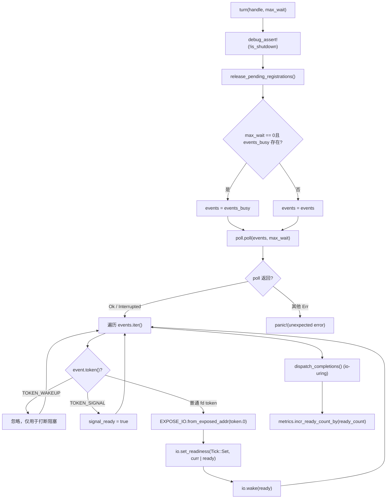
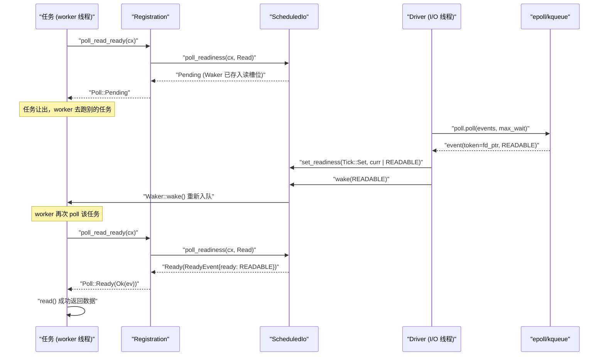

# Chapter 05: I/O Driver & Readiness: Transforming epoll Events into Waker Notifications


上一章我们追踪了 worker 线程的主循环：任务被 poll，返回 Pending 时把 Waker 存进某个地方，事件就绪后 Waker 被触发，任务重新入队。但「某个地方」到底是哪里？Waker 怎么在 epoll 事件到来时被找回来？这正是 Reactor 要回答的问题。先建立Intuitive Architectural Model：把整个 I/O 就绪通知机制想象成一家餐厅的取餐叫号系统——顾客（任务）点完餐后不会站在窗口死等，而是拿一个震动器（Waker）回座位；后厨（内核 epoll）做好餐后，前台（Reactor）根据订单号（Token）找到对应的震动器并按下按钮。若没有这套系统，每个任务只能轮询 socket，CPU 会被烧光；或者用阻塞线程等待，一个连接一个线程，规模上不去。Tokio 的 Reactor 由三个文件构成三层结构，职责严格分离：driver.rs 是事件循环本体，持有 mio::Poll，负责调用 poll() 阻塞等待内核事件，并把事件翻译成对 ScheduledIo 的读写；registration.rs 是面向用户的注册句柄，TcpStream 内部持有的就是它，提供 poll_read_ready / poll_write_ready 等 API；scheduled_io.rs 是每个 fd 的状态槽，存储读写就绪位与 Waker 列表，是事件与任务之间的桥梁。模块组装关系可参考 tokio/src/runtime/io/mod.rs:5-16：driver 导出 Driver、Handle、ReadyEvent，registration 导出 Registration，scheduled_io 导出 ScheduledIo。下图锚定了本章要追踪的完整数据流：TcpStream → Registration → ScheduledIo → Handle/Driver → 内核 → 回到 ScheduledIo → Waker。接下来我们逐层拆解。


## Intuitive Architectural Model

`Driver` 是**唯一拥有 `mio::Poll` 的实体**，它只能在单个线程里被 `&mut` 访问——这是事件循环的独占性要求。而 `Handle` 是**可克隆、可跨线程共享的注册入口**，任何线程想注册新 fd 都通过它。若没有这个切分，要么把 `mio::Poll` 加锁（每次注册都竞争），要么让所有注册都回到 driver 线程（引入跨线程消息队列）。Tokio 选择让 `Handle` 直接持有 `mio::Registry` 的克隆，注册操作可以并发进行，只有真正的事件等待才需要独占。

## 内存布局与字段

先看 `Driver` 的字段 [FACT:tokio/src/runtime/io/driver.rs:25-38](https://github.com/tokio-rs/tokio/blob/e800714ad714f1d996ddd56265b550d879349c0a/tokio/src/runtime/io/driver.rs#L25-L38)：

- `signal_ready: bool`：Unix 信号事件是否到达，用于 signal 驱动。
- `events: mio::Events`：主事件缓冲区，跨 `turn` 调用复用，避免每次分配。
- `events_busy: Option<mio::Events>`：**非阻塞 poll 专用缓冲区**，仅当 `max_io_events_per_busy_tick` 被设置时存在。
- `poll: mio::Poll`：内核事件队列的封装。

再看 `Handle` [FACT:tokio/src/runtime/io/driver.rs:41-75](https://github.com/tokio-rs/tokio/blob/e800714ad714f1d996ddd56265b550d879349c0a/tokio/src/runtime/io/driver.rs#L41-L75)：

- `registry: mio::Registry`：`mio::Poll::registry()` 的克隆，用于 `register`/`deregister`。
- `registrations: RegistrationSet`：所有活跃注册的集合，负责分配 `Token` 与 `ScheduledIo`。
- `synced: Mutex<registration_set::Synced>`：保护 `RegistrationSet` 的同步状态。
- `waker: mio::Waker`：用于从任意线程唤醒阻塞在 `turn` 里的 driver。
- `metrics: IoDriverMetrics`：统计 fd 数量、就绪事件数。

这里有个关键设计：`events_busy` 的存在 [FACT:tokio/src/runtime/io/driver.rs:25-38](https://github.com/tokio-rs/tokio/blob/e800714ad714f1d996ddd56265b550d879349c0a/tokio/src/runtime/io/driver.rs#L25-L38) 是为了解决**非阻塞 poll 会吞掉事件**的问题。注释 [FACT:tokio/src/runtime/io/driver.rs:189-190](https://github.com/tokio-rs/tokio/blob/e800714ad714f1d996ddd56265b550d879349c0a/tokio/src/runtime/io/driver.rs#L189-L190) 说得很清楚：非阻塞 poll 取走的事件如果留在主缓冲区里，下次 poll 就看不到了；用独立缓冲区，未处理的事件仍留在内核队列，下次 poll 会重新返回。

## Step-by-Step：一次 `turn` 的执行

`turn` 是 driver 的核心函数 [FACT:tokio/src/runtime/io/driver.rs:184-261](https://github.com/tokio-rs/tokio/blob/e800714ad714f1d996ddd56265b550d879349c0a/tokio/src/runtime/io/driver.rs#L184-L261)。假设 worker 线程发现没有任务可跑，调用 `park` → `turn(handle, None)` 阻塞等待：

**第一步**：断言未 shutdown [FACT:tokio/src/runtime/io/driver.rs:185](https://github.com/tokio-rs/tokio/blob/e800714ad714f1d996ddd56265b550d879349c0a/tokio/src/runtime/io/driver.rs#L185)，并释放待清理的注册 [FACT:tokio/src/runtime/io/driver.rs:187](https://github.com/tokio-rs/tokio/blob/e800714ad714f1d996ddd56265b550d879349c0a/tokio/src/runtime/io/driver.rs#L187)。`release_pending_registrations` 检查 `needs_release()`，若有则调用 `registrations.release()` [FACT:tokio/src/runtime/io/driver.rs:336-340](https://github.com/tokio-rs/tokio/blob/e800714ad714f1d996ddd56265b550d879349c0a/tokio/src/runtime/io/driver.rs#L336-L340)。

**第二步**：选择事件缓冲区 [FACT:tokio/src/runtime/io/driver.rs:191-194](https://github.com/tokio-rs/tokio/blob/e800714ad714f1d996ddd56265b550d879349c0a/tokio/src/runtime/io/driver.rs#L191-L194)。若 `max_wait` 是零且 `events_busy` 存在，用 busy 缓冲区；否则用主缓冲区。

**第三步**：调用 `self.poll.poll(events, max_wait)` [FACT:tokio/src/runtime/io/driver.rs:198](https://github.com/tokio-rs/tokio/blob/e800714ad714f1d996ddd56265b550d879349c0a/tokio/src/runtime/io/driver.rs#L198)。这是真正阻塞在 epoll_wait 的地方。错误处理很克制：`Interrupted` 直接忽略（信号打断是正常的）[FACT:tokio/src/runtime/io/driver.rs:200](https://github.com/tokio-rs/tokio/blob/e800714ad714f1d996ddd56265b550d879349c0a/tokio/src/runtime/io/driver.rs#L200)，WASI 下的 `InvalidInput` 也忽略 [FACT:tokio/src/runtime/io/driver.rs:201-205](https://github.com/tokio-rs/tokio/blob/e800714ad714f1d996ddd56265b550d879349c0a/tokio/src/runtime/io/driver.rs#L201-L205)，其他错误直接 panic [FACT:tokio/src/runtime/io/driver.rs:206](https://github.com/tokio-rs/tokio/blob/e800714ad714f1d996ddd56265b550d879349c0a/tokio/src/runtime/io/driver.rs#L206)。

**第四步**：遍历事件 [FACT:tokio/src/runtime/io/driver.rs:211-233](https://github.com/tokio-rs/tokio/blob/e800714ad714f1d996ddd56265b550d879349c0a/tokio/src/runtime/io/driver.rs#L211-L233)。对每个 `event`：

- 若 `token == TOKEN_WAKEUP`（值为 0）[FACT:tokio/src/runtime/io/driver.rs:214](https://github.com/tokio-rs/tokio/blob/e800714ad714f1d996ddd56265b550d879349c0a/tokio/src/runtime/io/driver.rs#L214)，什么都不做——这是 `unpark` 用来打断阻塞的。
- 若 `token == TOKEN_SIGNAL`（值为 1）[FACT:tokio/src/runtime/io/driver.rs:216](https://github.com/tokio-rs/tokio/blob/e800714ad714f1d996ddd56265b550d879349c0a/tokio/src/runtime/io/driver.rs#L216)，置 `signal_ready = true`。
- 否则是普通 I/O 事件 [FACT:tokio/src/runtime/io/driver.rs:218-231](https://github.com/tokio-rs/tokio/blob/e800714ad714f1d996ddd56265b550d879349c0a/tokio/src/runtime/io/driver.rs#L218-L231)：把 `mio::Ready` 转成 Tokio 的 `Ready`，用 `EXPOSE_IO.from_exposed_addr(token.0)` 把 token 还原成 `*const ScheduledIo` 指针，然后 `set_readiness(Tick::Set, |curr| curr | ready)` 累积就绪位，再 `io.wake(ready)` 触发对应方向的 `Waker`。

这里 `EXPOSE_IO` 是一个 `PtrExposeDomain<ScheduledIo>` [FACT:tokio/src/runtime/io/mod.rs:21-22](https://github.com/tokio-rs/tokio/blob/e800714ad714f1d996ddd56265b550d879349c0a/tokio/src/runtime/io/mod.rs#L21-L22)，它把指针「暴露」成一个 `usize` 作为 `mio::Token`。安全性注释 [FACT:tokio/src/runtime/io/driver.rs:222-225](https://github.com/tokio-rs/tokio/blob/e800714ad714f1d996ddd56265b550d879349c0a/tokio/src/runtime/io/driver.rs#L222-L225) 说明了为什么这个 unsafe 转换是安全的：指针在从 mio 注销**且** driver 不再并发 poll 之前不会被释放，且 driver 持有 `Arc<ScheduledIo>` 的所有权。

**第五步**：处理 io_uring 完成队列（仅 Linux + tokio_unstable）[FACT:tokio/src/runtime/io/driver.rs:235-258](https://github.com/tokio-rs/tokio/blob/e800714ad714f1d996ddd56265b550d879349c0a/tokio/src/runtime/io/driver.rs#L235-L258)，包括 CQ 溢出时的 flush 循环。

**第六步**：累加 metrics [FACT:tokio/src/runtime/io/driver.rs:265-267](https://github.com/tokio-rs/tokio/blob/e800714ad714f1d996ddd56265b550d879349c0a/tokio/src/runtime/io/driver.rs#L265-L267)。



## 设计思考：为什么 `Handle` 要持有 `mio::Waker`

`unpark` [FACT:tokio/src/runtime/io/driver.rs:280-283](https://github.com/tokio-rs/tokio/blob/e800714ad714f1d996ddd56265b550d879349c0a/tokio/src/runtime/io/driver.rs#L280-L283) 调用 `self.waker.wake()`。这个 `mio::Waker` 在 `Driver::new` 时用 `TOKEN_WAKEUP` 注册 [FACT:tokio/src/runtime/io/driver.rs:124](https://github.com/tokio-rs/tokio/blob/e800714ad714f1d996ddd56265b550d879349c0a/tokio/src/runtime/io/driver.rs#L124)。当 driver 阻塞在 `poll.poll()` 里时，另一个线程调用 `unpark` 会往 epoll 里塞一个 `TOKEN_WAKEUP` 事件，`poll` 立即返回，遍历时看到这个 token 直接跳过 [FACT:tokio/src/runtime/io/driver.rs:214-215](https://github.com/tokio-rs/tokio/blob/e800714ad714f1d996ddd56265b550d879349c0a/tokio/src/runtime/io/driver.rs#L214-L215)。

> **〔Design Inference & Architectural Trade-offs〕**
> 这个机制在 `deregister_source` 里被用到 [FACT:tokio/src/runtime/io/driver.rs:315-334](https://github.com/tokio-rs/tokio/blob/e800714ad714f1d996ddd56265b550d879349c0a/tokio/src/runtime/io/driver.rs#L315-L334)：注销一个 source 后，如果 `registrations.deregister` 返回 true（表示这是最后一个引用），就 `unpark()`。为什么？ 因为 driver 可能正阻塞在 `poll` 里等待这个 fd 的事件，而 fd 已经被注销，内核不会再产生事件；必须主动唤醒 driver，让它重新检查注册集合并可能退出阻塞。否则 driver 会一直睡到 `max_wait` 超时，延迟 shutdown。

另一个细节：`deregister_source` 先调用 `self.registry.deregister(source)` [FACT:tokio/src/runtime/io/driver.rs:322](https://github.com/tokio-rs/tokio/blob/e800714ad714f1d996ddd56265b550d879349c0a/tokio/src/runtime/io/driver.rs#L322)，再清理 `registrations` [FACT:tokio/src/runtime/io/driver.rs:315-334](https://github.com/tokio-rs/tokio/blob/e800714ad714f1d996ddd56265b550d879349c0a/tokio/src/runtime/io/driver.rs#L315-L334)。注释 [FACT:tokio/src/runtime/io/driver.rs:320-321](https://github.com/tokio-rs/tokio/blob/e800714ad714f1d996ddd56265b550d879349c0a/tokio/src/runtime/io/driver.rs#L320-L321) 说「Cleanup ALWAYS happens」——即使 OS 层 deregister 失败，也要清理内部状态，最后才返回 OS 错误 [FACT:tokio/src/runtime/io/driver.rs:336-340](https://github.com/tokio-rs/tokio/blob/e800714ad714f1d996ddd56265b550d879349c0a/tokio/src/runtime/io/driver.rs#L336-L340)。这是典型的**资源清理优先于错误传播**模式。


## Intuitive Architectural Model

`Registration` 是**任务与 fd 之间的契约**。它持有两个东西：一个 `scheduler::Handle`（用于在需要时访问 runtime），一个 `Arc<ScheduledIo>`（fd 的状态槽）。当任务调用 `poll_read_ready` 时，`Registration` 把 `Waker` 交给 `ScheduledIo` 保管；当 driver 收到事件时，从 `ScheduledIo` 里取出 `Waker` 唤醒。

## 内存布局与字段

`Registration` 只有两个字段 [FACT:tokio/src/runtime/io/registration.rs:46-54](https://github.com/tokio-rs/tokio/blob/e800714ad714f1d996ddd56265b550d879349c0a/tokio/src/runtime/io/registration.rs#L46-L54)：

- `handle: scheduler::Handle`：runtime 句柄，注释 [FACT:tokio/src/runtime/io/registration.rs:46-54](https://github.com/tokio-rs/tokio/blob/e800714ad714f1d996ddd56265b550d879349c0a/tokio/src/runtime/io/registration.rs#L46-L54) 说「TODO: this can probably be moved into ScheduledIo」，说明作者认为这个字段位置可以优化。
- `shared: Arc<ScheduledIo>`：共享状态，`Arc` 保证 driver 和任务都能访问。

> **〔Design Inference & Architectural Trade-offs〕**
> 注意 `Registration` 手动实现了 `Send` 和 `Sync` [FACT:tokio/src/runtime/io/registration.rs:57-58](https://github.com/tokio-rs/tokio/blob/e800714ad714f1d996ddd56265b550d879349c0a/tokio/src/runtime/io/registration.rs#L57-L58)。为什么需要 unsafe impl？ 因为 `scheduler::Handle` 内部可能包含非 `Send`/`Sync` 的字段（比如 `Rc`），但 `Registration` 的使用场景要求它能跨线程。文档注释 [FACT:tokio/src/runtime/io/registration.rs:28-33](https://github.com/tokio-rs/tokio/blob/e800714ad714f1d996ddd56265b550d879349c0a/tokio/src/runtime/io/registration.rs#L28-L33) 给出了关键约束：**调用者必须保证最多两个任务并发使用同一个 `Registration`**，一个读、一个写。违反这个约束虽然内存安全，但会导致通知丢失和任务挂起。

## Step-by-Step：`poll_read_ready` 的调用链

假设任务在 `TcpStream::poll_read` 里发现 socket 没数据，需要注册读兴趣。调用链是 `TcpStream::poll_read_priv` → `PollEvented::poll_read` → `Registration::poll_read_io` → `poll_io` → `poll_ready`。

`poll_ready` 是核心 [FACT:tokio/src/runtime/io/registration.rs:155-171](https://github.com/tokio-rs/tokio/blob/e800714ad714f1d996ddd56265b550d879349c0a/tokio/src/runtime/io/registration.rs#L155-L171)：

**第一步**：`trace_leaf()` [FACT:tokio/src/runtime/io/registration.rs:160](https://github.com/tokio-rs/tokio/blob/e800714ad714f1d996ddd56265b550d879349c0a/tokio/src/runtime/io/registration.rs#L160)，用于 tracing 埋点。

**第二步**：`coop::poll_proceed(cx)` [FACT:tokio/src/runtime/io/registration.rs:155-171](https://github.com/tokio-rs/tokio/blob/e800714ad714f1d996ddd56265b550d879349c0a/tokio/src/runtime/io/registration.rs#L155-L171)。这是第 12 章要讲的协作式预算机制。如果预算耗尽，返回 `Pending` 并注册一个特殊的 `Waker`，让任务在下一轮被重新调度。

**第三步**：`self.shared.poll_readiness(cx, direction)` [FACT:tokio/src/runtime/io/registration.rs:155-171](https://github.com/tokio-rs/tokio/blob/e800714ad714f1d996ddd56265b550d879349c0a/tokio/src/runtime/io/registration.rs#L155-L171)。这是真正与 `ScheduledIo` 交互的地方：检查当前就绪位，若已就绪立即返回 `Ready`；否则把 `cx.waker()` 存进 `ScheduledIo` 的对应方向槽位，返回 `Pending`。

**第四步**：检查 `ev.is_shutdown` [FACT:tokio/src/runtime/io/registration.rs:155-171](https://github.com/tokio-rs/tokio/blob/e800714ad714f1d996ddd56265b550d879349c0a/tokio/src/runtime/io/registration.rs#L155-L171)。若 runtime 正在关闭，返回 `RUNTIME_SHUTTING_DOWN_ERROR`。

**第五步**：`coop.made_progress()` [FACT:tokio/src/runtime/io/registration.rs:169](https://github.com/tokio-rs/tokio/blob/e800714ad714f1d996ddd56265b550d879349c0a/tokio/src/runtime/io/registration.rs#L169)，标记预算消耗，返回就绪事件。

`poll_io` 在 `poll_ready` 之上加了一层重试循环 [FACT:tokio/src/runtime/io/registration.rs:173-192](https://github.com/tokio-rs/tokio/blob/e800714ad714f1d996ddd56265b550d879349c0a/tokio/src/runtime/io/registration.rs#L173-L192)：

```rust
loop {
    let ev = ready!(self.poll_ready(cx, direction))?;
    match f() {
        Ok(ret) => return Poll::Ready(Ok(ret)),
        Err(ref e) if e.kind() == io::ErrorKind::WouldBlock => {
            self.clear_readiness(ev);
        }
        Err(e) => return Poll::Ready(Err(e)),
    }
}
```

这里体现了 **readiness 是提示而非保证** 的核心思想：`poll_ready` 说可读，但真正 `read()` 时可能返回 `WouldBlock`（比如另一个线程抢先读走了数据）。此时必须 `clear_readiness(ev)` [FACT:tokio/src/runtime/io/registration.rs:187](https://github.com/tokio-rs/tokio/blob/e800714ad714f1d996ddd56265b550d879349c0a/tokio/src/runtime/io/registration.rs#L187) 清掉就绪位，然后循环重新等待。若不清，任务会陷入「以为可读 → read 失败 → 又以为可读」的忙循环。

## 设计思考：`try_io` 与 `async_io` 的分工

`try_io` [FACT:tokio/src/runtime/io/registration.rs:194-213](https://github.com/tokio-rs/tokio/blob/e800714ad714f1d996ddd56265b550d879349c0a/tokio/src/runtime/io/registration.rs#L194-L213) 是同步版本：先 `ready_event(interest)` 检查就绪位，若为空直接返回 `WouldBlock` [FACT:tokio/src/runtime/io/registration.rs:194-213](https://github.com/tokio-rs/tokio/blob/e800714ad714f1d996ddd56265b550d879349c0a/tokio/src/runtime/io/registration.rs#L194-L213)；否则执行 `f()`，若 `f()` 返回 `WouldBlock` 则清就绪位 [FACT:tokio/src/runtime/io/registration.rs:207-210](https://github.com/tokio-rs/tokio/blob/e800714ad714f1d996ddd56265b550d879349c0a/tokio/src/runtime/io/registration.rs#L207-L210)。它**不注册 Waker**，适合 `try_read` 这类「试一下就走」的场景。

`async_io` [FACT:tokio/src/runtime/io/registration.rs:225-245](https://github.com/tokio-rs/tokio/blob/e800714ad714f1d996ddd56265b550d879349c0a/tokio/src/runtime/io/registration.rs#L225-L245) 是异步版本：`readiness(interest).await` 会注册 Waker 并等待，然后执行 `f()`，`WouldBlock` 时清就绪位并循环。注意它在循环里还调用了 `coop::poll_proceed` [FACT:tokio/src/runtime/io/registration.rs:233](https://github.com/tokio-rs/tokio/blob/e800714ad714f1d996ddd56265b550d879349c0a/tokio/src/runtime/io/registration.rs#L233)，防止在大量 `WouldBlock` 重试中耗尽预算。

## 生产踩坑：`Drop` 里的 Waker 清理

`Registration::drop` [FACT:tokio/src/runtime/io/registration.rs:253-262](https://github.com/tokio-rs/tokio/blob/e800714ad714f1d996ddd56265b550d879349c0a/tokio/src/runtime/io/registration.rs#L253-L262) 调用 `self.shared.clear_wakers()`。注释 [FACT:tokio/src/runtime/io/registration.rs:253-262](https://github.com/tokio-rs/tokio/blob/e800714ad714f1d996ddd56265b550d879349c0a/tokio/src/runtime/io/registration.rs#L253-L262) 解释了原因：`ScheduledIo` 里存的 `Waker` 可能持有 `Arc<driver::Inner>`，而 `driver::Inner` 又持有 `ScheduledIo`，形成循环引用。清理 Waker 是打破循环的手段。但注释也承认这是「imperfect solution」——如果 `Registration` 本身被存进了 `Waker`，循环仍然存在。这是 tokio-rs/tokio#3481 讨论的问题。

> **〔Design Inference & Architectural Trade-offs〕**
> 生产环境中的表现是：如果大量连接被 drop 但 runtime 未退出，内存不会立即回收，直到下一次 `clear_wakers` 或 runtime shutdown。对于长连接服务，这通常不是问题；但对于短连接高频创建/销毁的场景，需要关注 `ScheduledIo` 的回收时机。


## Intuitive Architectural Model

现在把三层串起来。用户在 `TcpStream` 上调用 `.read().await`，实际执行的是 `AsyncRead::poll_read` → `PollEvented::poll_read` → `Registration::poll_read_io`。当数据没到时，`Waker` 被存进 `ScheduledIo`；当 epoll 报告可读时，driver 从 `ScheduledIo` 取出 `Waker` 并唤醒，任务被重新调度，再次 poll 时 `poll_readiness` 发现就绪位已置，直接返回 `Ready`，`read()` 成功。

## Step-by-Step：一次完整的读等待

**阶段一：注册兴趣**。`TcpStream::new` [FACT:tokio/src/net/tcp/stream.rs:166-169](https://github.com/tokio-rs/tokio/blob/e800714ad714f1d996ddd56265b550d879349c0a/tokio/src/net/tcp/stream.rs#L166-L169) 调用 `PollEvented::new(connected)`，后者内部调用 `Registration::new_with_interest_and_handle` [FACT:tokio/src/runtime/io/registration.rs:73-81](https://github.com/tokio-rs/tokio/blob/e800714ad714f1d996ddd56265b550d879349c0a/tokio/src/runtime/io/registration.rs#L73-L81)，进而 `handle.driver().io().add_source(io, interest)` [FACT:tokio/src/runtime/io/registration.rs:73-81](https://github.com/tokio-rs/tokio/blob/e800714ad714f1d996ddd56265b550d879349c0a/tokio/src/runtime/io/registration.rs#L73-L81)。

`add_source` [FACT:tokio/src/runtime/io/driver.rs:288-312](https://github.com/tokio-rs/tokio/blob/e800714ad714f1d996ddd56265b550d879349c0a/tokio/src/runtime/io/driver.rs#L288-L312) 做三件事：

1. `registrations.allocate(&mut synced.lock())` 分配一个 `ScheduledIo`，拿到 `token` [FACT:tokio/src/runtime/io/driver.rs:293-294](https://github.com/tokio-rs/tokio/blob/e800714ad714f1d996ddd56265b550d879349c0a/tokio/src/runtime/io/driver.rs#L293-L294)。

2. `self.registry.register(source, token, interest.to_mio())` 向内核注册 [FACT:tokio/src/runtime/io/driver.rs:298](https://github.com/tokio-rs/tokio/blob/e800714ad714f1d996ddd56265b550d879349c0a/tokio/src/runtime/io/driver.rs#L298)。若失败，**必须**把刚分配的 `ScheduledIo` 从集合里移除 [FACT:tokio/src/runtime/io/driver.rs:300-303](https://github.com/tokio-rs/tokio/blob/e800714ad714f1d996ddd56265b550d879349c0a/tokio/src/runtime/io/driver.rs#L300-L303)，否则泄漏。

3. `metrics.incr_fd_count()` 计数 [FACT:tokio/src/runtime/io/driver.rs:309](https://github.com/tokio-rs/tokio/blob/e800714ad714f1d996ddd56265b550d879349c0a/tokio/src/runtime/io/driver.rs#L309)。

**阶段二：等待就绪**。任务 poll `TcpStream::poll_read` [FACT:tokio/src/net/tcp/stream.rs:1492-1498](https://github.com/tokio-rs/tokio/blob/e800714ad714f1d996ddd56265b550d879349c0a/tokio/src/net/tcp/stream.rs#L1492-L1498) → `poll_read_priv` [FACT:tokio/src/net/tcp/stream.rs:1451-1458](https://github.com/tokio-rs/tokio/blob/e800714ad714f1d996ddd56265b550d879349c0a/tokio/src/net/tcp/stream.rs#L1451-L1458) → `PollEvented::poll_read` → `Registration::poll_read_io` [FACT:tokio/src/runtime/io/registration.rs:133-139](https://github.com/tokio-rs/tokio/blob/e800714ad714f1d996ddd56265b550d879349c0a/tokio/src/runtime/io/registration.rs#L133-L139) → `poll_io` → `poll_ready` → `ScheduledIo::poll_readiness`。此时若未就绪，`Waker` 存入 `ScheduledIo` 的读槽位，返回 `Pending`。

**阶段三：事件到达**。driver 的 `turn` 从 `poll.poll()` 拿到事件 [FACT:tokio/src/runtime/io/driver.rs:198](https://github.com/tokio-rs/tokio/blob/e800714ad714f1d996ddd56265b550d879349c0a/tokio/src/runtime/io/driver.rs#L198)，遍历时对每个 fd 事件执行 `io.set_readiness(Tick::Set, |curr| curr | ready)` 和 `io.wake(ready)` [FACT:tokio/src/runtime/io/driver.rs:228-229](https://github.com/tokio-rs/tokio/blob/e800714ad714f1d996ddd56265b550d879349c0a/tokio/src/runtime/io/driver.rs#L228-L229)。`wake` 内部取出对应方向的 `Waker` 并调用 `wake()`。

**阶段四：任务重调度**。`Waker::wake()` 把任务重新入队到 worker 的本地队列（上一章讲过）。worker 再次 poll 该任务，`poll_readiness` 发现就绪位已置，返回 `Ready`，`read()` 成功。



## 重要分支：`assume_ready` 优化

`TcpStream::new_accepted` [FACT:tokio/src/net/tcp/stream.rs:174-181](https://github.com/tokio-rs/tokio/blob/e800714ad714f1d996ddd56265b550d879349c0a/tokio/src/net/tcp/stream.rs#L174-L181) 是一个值得注意的优化。`accept` 返回的 socket 天然可写，且通常已经持有对端的第一批字节。如果等 driver 的第一个事件，在高负载下这个事件可能排在所有已建立连接的事件后面，造成延迟。所以 `new_accepted` 直接调用 `assume_ready(Ready::READABLE | Ready::WRITABLE)` [FACT:tokio/src/net/tcp/stream.rs:174-181](https://github.com/tokio-rs/tokio/blob/e800714ad714f1d996ddd56265b550d879349c0a/tokio/src/net/tcp/stream.rs#L174-L181)。

`assume_ready` 的注释 [FACT:tokio/src/runtime/io/registration.rs:103-105](https://github.com/tokio-rs/tokio/blob/e800714ad714f1d996ddd56265b550d879349c0a/tokio/src/runtime/io/registration.rs#L103-L105) 说：「A wrong guess costs one `WouldBlock`, which clears the readiness again.」——猜错了代价只是一次 `WouldBlock`，`poll_io` 的循环会清掉就绪位并重新等待。这是一个**乐观猜测 + 快速纠错**的设计。

## 设计思考：为什么 I/O 驱动与调度器解耦

> **〔Design Inference & Architectural Trade-offs〕**
> 从源码结构看，`Driver` 和 worker 线程是分离的：`Driver` 被放在 runtime 的某个专用位置（通常是 `block_on` 线程或专门的 I/O 线程），而 worker 线程只持有 `Handle`。这种解耦带来几个好处：

1. **注册无锁化**：`Handle` 持有 `mio::Registry` 克隆，任何 worker 都能并发注册新 fd，不需要回到 driver 线程。

2. **事件等待集中化**：只有一个线程阻塞在 `epoll_wait`，避免多线程同时 poll 同一个 epoll fd 的惊群问题。

3. **唤醒路径短**：driver 收到事件后直接操作 `ScheduledIo` 并调用 `Waker::wake()`，`wake()` 内部把任务推入 worker 队列，不需要跨线程消息传递。

代价是 `ScheduledIo` 需要处理并发访问（`set_readiness` 和 `poll_readiness` 可能同时发生），这通过原子操作和内部锁解决。

## 生产踩坑：`is_shutdown` 与 `RUNTIME_SHUTTING_DOWN_ERROR`

`poll_ready` 检查 `ev.is_shutdown` [FACT:tokio/src/runtime/io/registration.rs:155-171](https://github.com/tokio-rs/tokio/blob/e800714ad714f1d996ddd56265b550d879349c0a/tokio/src/runtime/io/registration.rs#L155-L171)，若为真返回 `gone()` [FACT:tokio/src/runtime/io/registration.rs:265-267](https://github.com/tokio-rs/tokio/blob/e800714ad714f1d996ddd56265b550d879349c0a/tokio/src/runtime/io/registration.rs#L265-L267)，即 `RUNTIME_SHUTTING_DOWN_ERROR`。

> **〔Design Inference & Architectural Trade-offs〕**
> 这个检查的意义在于：runtime 关闭时，driver 的 `shutdown` [FACT:tokio/src/runtime/io/driver.rs:174-182](https://github.com/tokio-rs/tokio/blob/e800714ad714f1d996ddd56265b550d879349c0a/tokio/src/runtime/io/driver.rs#L174-L182) 会遍历所有注册并调用 `io.shutdown()`，把 `is_shutdown` 置位并唤醒所有等待者。如果不检查这个标志，任务可能在 runtime 已经停止调度后仍然尝试读 socket，导致未定义行为或挂起。生产环境中，如果你看到 `RUNTIME_SHUTTING_DOWN_ERROR`，通常意味着有任务在 runtime drop 之后仍在运行——检查是否有 `spawn` 的任务没有被正确 join。

另一个坑是 `deregister_source` 的 `unpark` [FACT:tokio/src/runtime/io/driver.rs:328](https://github.com/tokio-rs/tokio/blob/e800714ad714f1d996ddd56265b550d879349c0a/tokio/src/runtime/io/driver.rs#L328)。如果 driver 正阻塞在 `poll` 里，且此时最后一个 `Registration` 被 drop，`unpark` 会唤醒 driver。但如果 driver 不在阻塞状态（比如正在处理其他事件），`unpark` 只是让下一次 `turn` 立即返回 [FACT:tokio/src/runtime/io/driver.rs:280-283](https://github.com/tokio-rs/tokio/blob/e800714ad714f1d996ddd56265b550d879349c0a/tokio/src/runtime/io/driver.rs#L280-L283)。这个语义在 `Handle::unpark` 的文档注释里有说明。


**权衡一：`Token` 用指针而非索引**。`EXPOSE_IO.from_exposed_addr(token.0)` [FACT:tokio/src/runtime/io/driver.rs:220](https://github.com/tokio-rs/tokio/blob/e800714ad714f1d996ddd56265b550d879349c0a/tokio/src/runtime/io/driver.rs#L220) 把 `mio::Token` 直接当作 `*const ScheduledIo` 的地址。这避免了维护一个 `Token → ScheduledIo` 的映射表，查找是 O(1) 且无锁。代价是安全性依赖严格的生命周期管理：指针必须在注销且 driver 不再 poll 之后才能释放 [FACT:tokio/src/runtime/io/driver.rs:222-225](https://github.com/tokio-rs/tokio/blob/e800714ad714f1d996ddd56265b550d879349c0a/tokio/src/runtime/io/driver.rs#L222-L225)。

**权衡二：读写双 Waker 槽位**。`Registration` 文档 [FACT:tokio/src/runtime/io/registration.rs:24-26](https://github.com/tokio-rs/tokio/blob/e800714ad714f1d996ddd56265b550d879349c0a/tokio/src/runtime/io/registration.rs#L24-L26) 说「A registration instance represents two separate readiness streams」——读和写各有一个独立的 `Waker` 槽位。这允许同一个 socket 的读任务和写任务分别注册，互不干扰。但 `poll_read_ready` 的注释 [FACT:tokio/src/net/tcp/stream.rs:549-552](https://github.com/tokio-rs/tokio/blob/e800714ad714f1d996ddd56265b550d879349c0a/tokio/src/net/tcp/stream.rs#L549-L552) 提醒：多次调用 `poll_read_ready`/`poll_read`/`poll_peek` 只有最后一次的 `Waker` 会被保留——读方向只有一个槽位。

**权衡三：`events_busy` 的独立缓冲区**。测试 [FACT:tokio/src/runtime/io/driver.rs:364-386](https://github.com/tokio-rs/tokio/blob/e800714ad714f1d996ddd56265b550d879349c0a/tokio/src/runtime/io/driver.rs#L364-L386) 验证了这个行为：`Driver::new(16, Some(2))` 创建 busy 容量为 2 的 driver，注册 5 个可读 source 后，非阻塞 `turn` 只取 2 个事件 [FACT:tokio/src/runtime/io/driver.rs:375-376](https://github.com/tokio-rs/tokio/blob/e800714ad714f1d996ddd56265b550d879349c0a/tokio/src/runtime/io/driver.rs#L375-L376)，剩余 3 个留在内核队列，下次阻塞 `turn` 取到 [FACT:tokio/src/runtime/io/driver.rs:379-380](https://github.com/tokio-rs/tokio/blob/e800714ad714f1d996ddd56265b550d879349c0a/tokio/src/runtime/io/driver.rs#L379-L380)。这防止了非阻塞 poll 一次性吞掉所有事件导致后续 poll 饥饿。


本章追踪了 `TcpStream::read` 背后的完整 Reactor 链路：

- **驱动层**：`Driver` 独占 `mio::Poll`，`turn` 阻塞等待事件，用 `EXPOSE_IO` 把 `Token` 还原为 `ScheduledIo` 指针，调用 `set_readiness` + `wake` 触发 `Waker`。`Handle` 提供可跨线程的注册入口，`unpark` 用于打断阻塞。
- **注册层**：`Registration` 持有 `Arc<ScheduledIo>`，`poll_ready` 检查就绪位或存入 `Waker`，`poll_io` 用 `WouldBlock` 重试循环处理假阳性，`try_io`/`async_io` 分别服务同步和异步场景。
- **状态层**：`ScheduledIo` 是 fd 的状态槽，存储读写就绪位和双 `Waker` 槽位，是事件与任务之间的唯一桥梁。


Q1: 如果把 `poll_io` 里 `WouldBlock` 分支的 `self.clear_readiness(ev)` 删掉，在什么场景下会导致任务忙循环（busy-loop）？为什么？

**参考解析**：`poll_io` 的循环 [FACT:tokio/src/runtime/io/registration.rs:173-192](https://github.com/tokio-rs/tokio/blob/e800714ad714f1d996ddd56265b550d879349c0a/tokio/src/runtime/io/registration.rs#L173-L192) 在 `f()` 返回 `WouldBlock` 时调用 `clear_readiness(ev)` [FACT:tokio/src/runtime/io/registration.rs:187](https://github.com/tokio-rs/tokio/blob/e800714ad714f1d996ddd56265b550d879349c0a/tokio/src/runtime/io/registration.rs#L187)。`ev` 是 `poll_ready` 返回的 `ReadyEvent`，包含当前就绪位。`clear_readiness` 会把这些位从 `ScheduledIo` 里清掉。

如果不清理，下一次循环调用 `poll_ready` → `poll_readiness` 时，`ScheduledIo` 里仍然保留着旧的「可读」位，`poll_readiness` 会立即返回 `Ready`（因为就绪位非空），然后 `f()` 再次执行 `read()`，如果 socket 确实没数据，又返回 `WouldBlock`，循环继续。由于就绪位从未被清除，这个循环永远不会进入 `Pending`，任务会一直占用 CPU 轮询。

触发场景：多个任务共享同一个 socket 的读方向（虽然 `Registration` 文档 [FACT:tokio/src/runtime/io/registration.rs:28-33](https://github.com/tokio-rs/tokio/blob/e800714ad714f1d996ddd56265b550d879349c0a/tokio/src/runtime/io/registration.rs#L28-L33) 说最多两个任务，但读方向只有一个槽位），或者 `try_read` 和 `poll_read` 混用。更常见的是：epoll 报告可读后，另一个线程抢先读走了数据，当前任务的 `read()` 返回 `WouldBlock`，此时必须清就绪位，否则会一直重试。

Q2: `add_source` 在 `registry.register` 失败时为什么要调用 `registrations.remove`？如果不调用会发生什么？

**参考解析**：`add_source` [FACT:tokio/src/runtime/io/driver.rs:288-312](https://github.com/tokio-rs/tokio/blob/e800714ad714f1d996ddd56265b550d879349c0a/tokio/src/runtime/io/driver.rs#L288-L312) 先 `registrations.allocate` 分配 `ScheduledIo` [FACT:tokio/src/runtime/io/driver.rs:293](https://github.com/tokio-rs/tokio/blob/e800714ad714f1d996ddd56265b550d879349c0a/tokio/src/runtime/io/driver.rs#L293)，再 `registry.register` 向内核注册 [FACT:tokio/src/runtime/io/driver.rs:298](https://github.com/tokio-rs/tokio/blob/e800714ad714f1d996ddd56265b550d879349c0a/tokio/src/runtime/io/driver.rs#L298)。如果注册失败，`ScheduledIo` 已经分配但没有任何 fd 与之关联，如果不移除，它会永远留在 `RegistrationSet` 里。

注释 [FACT:tokio/src/runtime/io/driver.rs:296-297](https://github.com/tokio-rs/tokio/blob/e800714ad714f1d996ddd56265b550d879349c0a/tokio/src/runtime/io/driver.rs#L296-L297) 明确说：「we should remove the `scheduled_io` from the `registrations` set if registering the `source` with the OS fails. Otherwise it will leak the `scheduled_io`.」——这是一个内存泄漏。

`remove` 调用 [FACT:tokio/src/runtime/io/driver.rs:300-303](https://github.com/tokio-rs/tokio/blob/e800714ad714f1d996ddd56265b550d879349c0a/tokio/src/runtime/io/driver.rs#L300-L303) 用 unsafe 块包裹，因为 `ScheduledIo` 是 `RegistrationSet` 的一部分，移除操作需要保证没有其他引用。泄漏的后果：`RegistrationSet` 持续增长，`Token` 空间被浪费，最终可能导致 `allocate` 失败或内存耗尽。在高频创建/销毁连接的场景（如短连接服务器），如果注册失败率较高（比如 fd 耗尽），泄漏会加速资源枯竭。

Q3: `deregister_source` 中，为什么 `unpark()` 只在 `registrations.deregister` 返回 true 时调用？如果无条件调用会有什么问题？

**参考解析**：`deregister_source` [FACT:tokio/src/runtime/io/driver.rs:315-334](https://github.com/tokio-rs/tokio/blob/e800714ad714f1d996ddd56265b550d879349c0a/tokio/src/runtime/io/driver.rs#L315-L334) 的逻辑是：先 `registry.deregister(source)` 向内核注销 [FACT:tokio/src/runtime/io/driver.rs:322](https://github.com/tokio-rs/tokio/blob/e800714ad714f1d996ddd56265b550d879349c0a/tokio/src/runtime/io/driver.rs#L322)，然后 `registrations.deregister` 清理内部状态 [FACT:tokio/src/runtime/io/driver.rs:315-334](https://github.com/tokio-rs/tokio/blob/e800714ad714f1d996ddd56265b550d879349c0a/tokio/src/runtime/io/driver.rs#L315-L334)，若返回 true 则 `unpark()` [FACT:tokio/src/runtime/io/driver.rs:328](https://github.com/tokio-rs/tokio/blob/e800714ad714f1d996ddd56265b550d879349c0a/tokio/src/runtime/io/driver.rs#L328)。

`registrations.deregister` 返回 true 意味着这是最后一个引用，`ScheduledIo` 被真正移除。此时 driver 可能正阻塞在 `poll` 里等待这个 fd 的事件，但 fd 已经注销，内核不会再产生事件。`unpark` 通过 `mio::Waker` 往 epoll 塞一个 `TOKEN_WAKEUP` 事件 [FACT:tokio/src/runtime/io/driver.rs:280-283](https://github.com/tokio-rs/tokio/blob/e800714ad714f1d996ddd56265b550d879349c0a/tokio/src/runtime/io/driver.rs#L280-L283)，让 `poll` 立即返回，driver 重新检查注册集合并可能退出阻塞。

如果无条件调用 `unpark`：每次注销一个非最后的引用都会唤醒 driver，造成不必要的唤醒。在大量连接共享同一个 `ScheduledIo` 的场景（比如 `TcpStream` 的 `split` 后读写两半），每次 drop 一个半都会唤醒 driver，增加 CPU 开销。更严重

本章我们拆解了 Reactor 如何把 epoll 事件翻译成 Waker 唤醒：从 TcpStream 的 poll_read_ready 出发，经过 Registration 的注册与查询，落到 ScheduledIo 的就绪位与 Waker 槽位，再由 Driver 在事件循环中根据 Token 定位并触发唤醒。关键设计包括：Token 即指针实现 O(1) 查找，读写双 Waker 槽位支持并发读写分离，events_busy 独立缓冲区防止事件饥饿，assume_ready 乐观猜测优化 accept 场景。至此，I/O 就绪通知的闭环已经完整。但异步运行时还需要处理另一类「就绪」——时间。下一章我们将剖析 tokio::time::sleep 与 timeout 的实现：定时器如何被插入时间轮、时间轮如何按到期时间分级、driver 如何计算下一次 park 的超时并触发到期任务。你会看到「时间也是一种 I/O 事件」这一统一抽象，以及 start_paused 与 test clock 如何让时间在测试中可控。