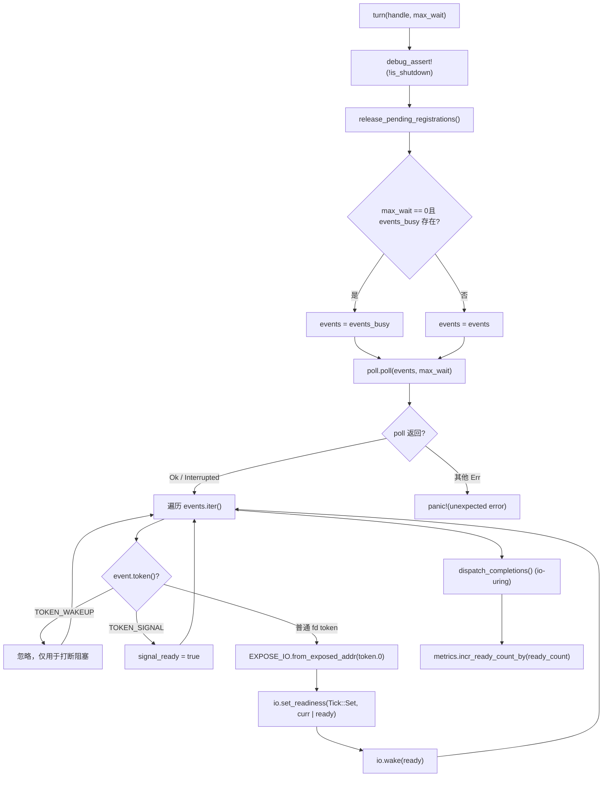
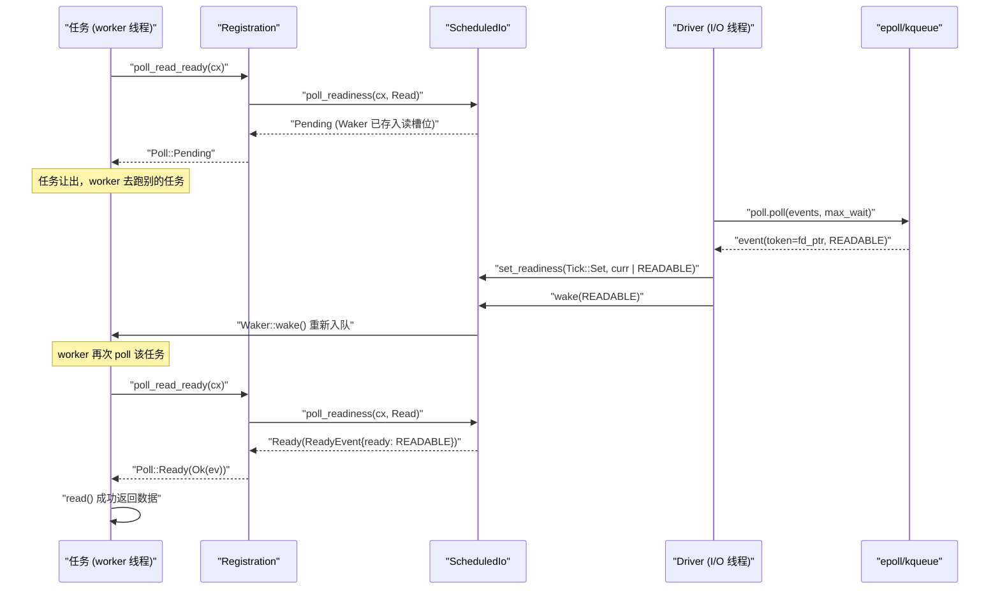

# Chapter 5: I/O readiness notification: How the Reactor translates epoll events into Waker wakeups

In the previous chapter, we traced the main loop of a worker thread: a task is polled, and when it returns Pending, the Waker is stored somewhere; after the event becomes ready, the Waker is triggered and the task is re-enqueued. But where exactly is "somewhere"? How is the Waker found again when an epoll event arrives? This is exactly the question the Reactor must answer. Let's first build an intuitive model: imagine the entire I/O readiness notification mechanism as a restaurant's order pickup calling system—after customers (tasks) place their orders, they do not stand at the window waiting forever, but take a pager (Waker) back to their seats; after the kitchen (kernel epoll) finishes the meal, the front desk (Reactor) finds the corresponding pager by order number (Token) and presses the button. Without this system, each task could only poll the socket, burning up CPU; or it could use blocking threads to wait, one thread per connection, which does not scale. Tokio's Reactor consists of three files forming a three-layer structure with strictly separated responsibilities: driver.rs is the event loop itself, holding mio::Poll, responsible for calling poll() to block waiting for kernel events and translating events into reads and writes on ScheduledIo; registration.rs is the user-facing registration handle, which is what TcpStream holds internally, providing APIs such as poll_read_ready / poll_write_ready; scheduled_io.rs is the state slot for each fd, storing read/write readiness bits and the Waker list, and is the bridge between events and tasks. For the module assembly relationship, see tokio/src/runtime/io/mod.rs:5-16: driver exports Driver, Handle, ReadyEvent; registration exports Registration; scheduled_io exports ScheduledIo. The following diagram anchors the complete data flow to be traced in this chapter: TcpStream → Registration → ScheduledIo → Handle/Driver → kernel → back to ScheduledIo → Waker. Next, we will break it down layer by layer.

# Driver layer:`Driver`and`Handle`division of responsibilities

## Intuitive model

`Driver`is**the only entity that owns`mio::Poll`, and it can only be**accessed in a single thread—this is the exclusivity requirement of the event loop. While`&mut`is`Handle`a registration entry point that is cloneable and shareable across threads**可克隆、可跨线程共享的注册入口**, any thread that wants to register a new fd goes through it. Without this split, either`mio::Poll`would need to be locked (contending on every registration), or all registrations would have to go back to the driver thread (introducing a cross-thread message queue). Tokio chooses to let`Handle`directly hold a clone of`mio::Registry`, so registration operations can proceed concurrently, and only actual event waiting requires exclusivity.

## Memory Layout and Fields

First look at`Driver`'s fields[FACT:tokio/src/runtime/io/driver.rs:25-38]：

- `signal_ready: bool`: whether a Unix signal event has arrived, used for signal driving.
- `events: mio::Events`: the main event buffer, reused across`turn`calls to avoid allocating each time.
- `events_busy: Option<mio::Events>`：**Dedicated buffer for non-blocking poll**, present only when`max_io_events_per_busy_tick`is set.
- `poll: mio::Poll`: a wrapper around the kernel event queue.

Next look at`Handle` [FACT:tokio/src/runtime/io/driver.rs:41-75]：

- `registry: mio::Registry`：`mio::Poll::registry()`'s clone, used for`register`/`deregister`。
- `registrations: RegistrationSet`: the set of all active registrations, responsible for allocating`Token`and`ScheduledIo`。
- `synced: Mutex<registration_set::Synced>`: protects the synchronization state of`RegistrationSet`.
- `waker: mio::Waker`: used to wake up the driver blocked in`turn`from any thread.
- `metrics: IoDriverMetrics`: tracks the number of fds and ready events.

There is a key design here:`events_busy`the existence of[FACT:tokio/src/runtime/io/driver.rs:25-38]is meant to solve**the problem that non-blocking poll would swallow events**. The comment[FACT:tokio/src/runtime/io/driver.rs:189-190]makes it clear: if events taken by a non-blocking poll were left in the main buffer, the next poll would not see them; with a separate buffer, unprocessed events remain in the kernel queue and will be returned again on the next poll.

## Step-by-Step: One Execution of`turn`

`turn`is the core function of the driver[FACT:tokio/src/runtime/io/driver.rs:184-261]. Suppose a worker thread finds there is no task to run and calls`park` → `turn(handle, None)`to block and wait:

**Step One**: assert it is not shutdown[FACT:tokio/src/runtime/io/driver.rs:185], and release registrations pending cleanup[FACT:tokio/src/runtime/io/driver.rs:187]。`release_pending_registrations`check`needs_release()`, and if present call`registrations.release()` [FACT:tokio/src/runtime/io/driver.rs:336-340]。

**Step Two**: choose the event buffer[FACT:tokio/src/runtime/io/driver.rs:191-194]. If`max_wait`is zero and`events_busy`exists, use the busy buffer; otherwise use the main buffer.

**Step Three**: call`self.poll.poll(events, max_wait)` [FACT:tokio/src/runtime/io/driver.rs:198]. This is where it truly blocks on epoll_wait. Error handling is very restrained:`Interrupted`is ignored directly (signal interruption is normal)[FACT:tokio/src/runtime/io/driver.rs:200], under WASI`InvalidInput`is also ignored[FACT:tokio/src/runtime/io/driver.rs:201-205], and other errors panic directly[FACT:tokio/src/runtime/io/driver.rs:206]。

**Step Four**: iterate over events[FACT:tokio/src/runtime/io/driver.rs:211-233]. For each`event`：

- if`token == TOKEN_WAKEUP`(value 0)[FACT:tokio/src/runtime/io/driver.rs:214], do nothing—this is what`unpark`uses to interrupt blocking.
- If`token == TOKEN_SIGNAL`(value 1)[FACT:tokio/src/runtime/io/driver.rs:216], set`signal_ready = true`。
- Otherwise it is a normal I/O event[FACT:tokio/src/runtime/io/driver.rs:218-231]: convert`mio::Ready`into Tokio's`Ready`, use`EXPOSE_IO.from_exposed_addr(token.0)`to turn the token back into a`*const ScheduledIo`pointer, then`set_readiness(Tick::Set, |curr| curr | ready)`accumulate the readiness bits, and then`io.wake(ready)`trigger the corresponding direction's`Waker`。

Here`EXPOSE_IO`is a`PtrExposeDomain<ScheduledIo>` [FACT:tokio/src/runtime/io/mod.rs:21-22], which "exposes" the pointer as a`usize`as`mio::Token`. The safety comment[FACT:tokio/src/runtime/io/driver.rs:222-225]explains why this unsafe conversion is safe: the pointer will not be freed before it is deregistered from mio**and**the driver no longer concurrently polls, and the driver holds ownership of`Arc<ScheduledIo>`.

**Step Five**: handle the io_uring completion queue (Linux + tokio_unstable only)[FACT:tokio/src/runtime/io/driver.rs:235-258], including the flush loop when the CQ overflows.

**Step Six**: accumulate metrics[FACT:tokio/src/runtime/io/driver.rs:265-267]。



## Design Reflection: Why`Handle`must hold`mio::Waker`

`unpark` [FACT:tokio/src/runtime/io/driver.rs:280-283]calls`self.waker.wake()`. This`mio::Waker`is used in`Driver::new`to register`TOKEN_WAKEUP`with[FACT:tokio/src/runtime/io/driver.rs:124]. When the driver is blocked in`poll.poll()`, another thread calling`unpark`will stuff a`TOKEN_WAKEUP`event into epoll,`poll`returns immediately, and when iterating it sees this token and skips it directly[FACT:tokio/src/runtime/io/driver.rs:214-215]。

> **[Design Inference & Architectural Trade-offs]**
> This mechanism is used in`deregister_source`[FACT:tokio/src/runtime/io/driver.rs:315-334]: after deregistering a source, if`registrations.deregister`returns true (indicating this is the last reference), then`unpark()`. Why? Because the driver may be blocked in`poll`waiting for events on this fd, and the fd has already been deregistered, so the kernel will no longer produce events; the driver must be actively woken up so it can re-check the registration set and possibly exit blocking. Otherwise the driver would sleep until`max_wait`times out, delaying shutdown.

Another detail:`deregister_source`first calls`self.registry.deregister(source)` [FACT:tokio/src/runtime/io/driver.rs:322], then cleans up`registrations` [FACT:tokio/src/runtime/io/driver.rs:315-334]. The comment[FACT:tokio/src/runtime/io/driver.rs:320-321]says "Cleanup ALWAYS happens"—even if OS-level deregistration fails, internal state must still be cleaned up, and only then is the OS error returned[FACT:tokio/src/runtime/io/driver.rs:336-340]. This is the typical**resource cleanup takes priority over error propagation**pattern.

# Registration Layer:`Registration`How`Waker`is stored into`ScheduledIo`

## Intuitive Model

`Registration`is**the contract between a task and an fd**. It holds two things: a`scheduler::Handle`(used to access the runtime when needed), and a`Arc<ScheduledIo>`(the state slot for the fd). When a task calls`poll_read_ready`,`Registration`hands`Waker`over to`ScheduledIo`for safekeeping; when the driver receives an event, it takes`ScheduledIo`out of`Waker`to wake it up.

## Memory Layout and Fields

`Registration`has only two fields[FACT:tokio/src/runtime/io/registration.rs:46-54]：

- `handle: scheduler::Handle`: the runtime handle, with comment[FACT:tokio/src/runtime/io/registration.rs:46-54]saying "TODO: this can probably be moved into ScheduledIo", indicating the author thinks this field's placement can be optimized.
- `shared: Arc<ScheduledIo>`: shared state,`Arc`ensuring both the driver and the task can access it.

> **[Design Inference & Architectural Trade-offs]**
> Note that`Registration`manually implements`Send`and`Sync` [FACT:tokio/src/runtime/io/registration.rs:57-58]. Why is an unsafe impl needed? Because`scheduler::Handle`may internally contain fields that are not`Send`/`Sync`(such as`Rc`), but`Registration`'s usage scenario requires it to be able to cross threads. The doc comment[FACT:tokio/src/runtime/io/registration.rs:28-33]gives the key constraint:**the caller must guarantee that at most two tasks concurrently use the same`Registration`**, one reading and one writing. Violating this constraint is still memory-safe, but will cause lost notifications and task hangs.

## Step-by-Step：`poll_read_ready`'s call chain

Suppose a task is in`TcpStream::poll_read`discovers that the socket has no data and needs to register read interest. The call chain is`TcpStream::poll_read_priv` → `PollEvented::poll_read` → `Registration::poll_read_io` → `poll_io` → `poll_ready`。

`poll_ready`is the core[FACT:tokio/src/runtime/io/registration.rs:155-171]：

**Step one**：`trace_leaf()` [FACT:tokio/src/runtime/io/registration.rs:160], used for tracing instrumentation.

**Step two**：`coop::poll_proceed(cx)` [FACT:tokio/src/runtime/io/registration.rs:155-171]. This is the cooperative budget mechanism to be discussed in Chapter 12. If the budget is exhausted, return`Pending`and register a special`Waker`, causing the task to be rescheduled in the next round.

**Step three**：`self.shared.poll_readiness(cx, direction)` [FACT:tokio/src/runtime/io/registration.rs:155-171]. This is where it truly interacts with`ScheduledIo`: check the current readiness bit; if already ready, return immediately`Ready`; otherwise store`cx.waker()`into`ScheduledIo`'s corresponding direction slot and return`Pending`。

**Step four**: check`ev.is_shutdown` [FACT:tokio/src/runtime/io/registration.rs:155-171]. If the runtime is shutting down, return`RUNTIME_SHUTTING_DOWN_ERROR`。

**Step five**：`coop.made_progress()` [FACT:tokio/src/runtime/io/registration.rs:169], mark the budget as consumed, and return the readiness event.

`poll_io`adds a retry loop on top of`poll_ready`[FACT:tokio/src/runtime/io/registration.rs:173-192]：

```rust
loop {
    let ev = ready!(self.poll_ready(cx, direction))?;
    match f() {
        Ok(ret) => return Poll::Ready(Ok(ret)),
        Err(ref e) if e.kind() == io::ErrorKind::WouldBlock => {
            self.clear_readiness(ev);
        }
        Err(e) => return Poll::Ready(Err(e)),
    }
}
```

This reflects**readiness is a hint, not a guarantee**the core idea of:`poll_ready`says it is readable, but when actually`read()`it may return`WouldBlock`(for example, another thread read the data first). In this case, it must`clear_readiness(ev)` [FACT:tokio/src/runtime/io/registration.rs:187]clear the readiness bit and then loop to wait again. If it is not cleared, the task will fall into a busy loop of "thinks it is readable -> read fails -> thinks it is readable again."

## Design consideration:`try_io`and`async_io`division of labor

`try_io` [FACT:tokio/src/runtime/io/registration.rs:194-213]is the synchronous version: first`ready_event(interest)`check the readiness bit; if empty, return directly`WouldBlock` [FACT:tokio/src/runtime/io/registration.rs:194-213]; otherwise execute`f()`, and if`f()`returns`WouldBlock`then clear the readiness bit[FACT:tokio/src/runtime/io/registration.rs:207-210]. It**does not register a Waker**, suitable for`try_read`scenarios like "try once and leave."

`async_io` [FACT:tokio/src/runtime/io/registration.rs:225-245]is the asynchronous version:`readiness(interest).await`registers a Waker and waits, then when executing`f()`，`WouldBlock`clears the readiness bit and loops. Note that inside the loop it also calls`coop::poll_proceed` [FACT:tokio/src/runtime/io/registration.rs:233], preventing exhaustion of the budget during large numbers of`WouldBlock`retries.

## Production pitfalls:`Drop`Waker cleanup in

`Registration::drop` [FACT:tokio/src/runtime/io/registration.rs:253-262]calls`self.shared.clear_wakers()`. The comment[FACT:tokio/src/runtime/io/registration.rs:253-262]explains the reason:`ScheduledIo`the`Waker`stored in`Arc<driver::Inner>`may hold`driver::Inner`, and`ScheduledIo`in turn holds`Registration`, forming a circular reference. Cleaning up the Waker is a means of breaking the cycle. But the comment also admits this is an "imperfect solution" - if`Waker`itself is stored in

> **[Design Inference & Architectural Trade-offs]**
> [Design inference and architectural trade-offs]`clear_wakers`The behavior in production is: if a large number of connections are dropped but the runtime has not exited, memory will not be reclaimed immediately until the next`ScheduledIo`or runtime shutdown. For long-lived connection services, this is usually not a problem; but for scenarios with high-frequency creation/destruction of short-lived connections, attention must be paid to

# the reclamation timing of`TcpStream::read`.`Waker`The complete chain from

## to

wakeup`TcpStream`Intuitive model`.read().await`Now connect the three layers. The user calls`AsyncRead::poll_read` → `PollEvented::poll_read` → `Registration::poll_read_io`on`Waker`, and what is actually executed is`ScheduledIo`. When data has not arrived,`ScheduledIo`is stored into`Waker`; when epoll reports readable, the driver takes`poll_readiness`from`Ready`，`read()`and wakes it, the task is rescheduled, and on the next poll

## finds that the readiness bit has been set and directly returns

**success.**。`TcpStream::new` [FACT:tokio/src/net/tcp/stream.rs:166-169]Step-by-Step: a complete read wait`PollEvented::new(connected)`Phase one: register interest`Registration::new_with_interest_and_handle` [FACT:tokio/src/runtime/io/registration.rs:73-81]calls`handle.driver().io().add_source(io, interest)` [FACT:tokio/src/runtime/io/registration.rs:73-81]。

`add_source` [FACT:tokio/src/runtime/io/driver.rs:288-312], which internally calls

1. `registrations.allocate(&mut synced.lock())`, and then`ScheduledIo`does three things:`token` [FACT:tokio/src/runtime/io/driver.rs:293-294]。

2. `self.registry.register(source, token, interest.to_mio())`allocate a[FACT:tokio/src/runtime/io/driver.rs:298], obtain**register**with the kernel. If it fails,`ScheduledIo`must[FACT:tokio/src/runtime/io/driver.rs:300-303]remove the just-allocated

3. `metrics.incr_fd_count()`from the set[FACT:tokio/src/runtime/io/driver.rs:309]。

**, otherwise it leaks.**count`TcpStream::poll_read` [FACT:tokio/src/net/tcp/stream.rs:1492-1498] → `poll_read_priv` [FACT:tokio/src/net/tcp/stream.rs:1451-1458] → `PollEvented::poll_read` → `Registration::poll_read_io` [FACT:tokio/src/runtime/io/registration.rs:133-139] → `poll_io` → `poll_ready` → `ScheduledIo::poll_readiness`Phase two: wait for readiness`Waker`. The task polls`ScheduledIo`. At this point, if not ready,`Pending`。

**is stored into**'s read slot and returns`turn`Phase three: event arrives`poll.poll()`. The driver's[FACT:tokio/src/runtime/io/driver.rs:198]obtains event`io.set_readiness(Tick::Set, |curr| curr | ready)`from`io.wake(ready)` [FACT:tokio/src/runtime/io/driver.rs:228-229]。`wake`, and while iterating, for each fd event executes`Waker`and`wake()`。

**internally takes out the**。`Waker::wake()`for the corresponding direction and calls`poll_readiness`Phase four: task rescheduling`Ready`，`read()`re-enqueues the task into the worker's local queue (discussed in the previous chapter). The worker polls the task again,



## success.`assume_ready`Copy

`TcpStream::new_accepted` [FACT:tokio/src/net/tcp/stream.rs:174-181]Important branch:`accept`optimization`new_accepted`is a noteworthy optimization.`assume_ready(Ready::READABLE | Ready::WRITABLE)` [FACT:tokio/src/net/tcp/stream.rs:174-181]。

`assume_ready`The socket returned by[FACT:tokio/src/runtime/io/registration.rs:103-105]is naturally writable and usually already holds the peer's first batch of bytes. If it waits for the driver's first event, under high load this event may be queued behind the events of all established connections, causing latency. So`WouldBlock`directly calls`WouldBlock`，`poll_io`'s comment**says: "A wrong guess costs one**, which clears the readiness again." - the cost of guessing wrong is just one

## loop will clear the readiness bit and wait again. This is an

> **[Design Inference & Architectural Trade-offs]**
> design.`Driver`Design consideration: why the I/O driver and scheduler are decoupled`Driver`[Design inference and architectural trade-offs]`block_on`From the source structure,`Handle`and worker threads are separate:

1. **is placed in some dedicated location in the runtime (usually the**：`Handle`thread or a dedicated I/O thread), while worker threads only hold`mio::Registry`. This decoupling brings several benefits:

2. **Lock-free registration**holds a clone of`epoll_wait`, and any worker can concurrently register a new fd without going back to the driver thread.

3. **Centralized event waiting**: only one thread blocks on`ScheduledIo`, avoiding the thundering herd problem of multiple threads polling the same epoll fd simultaneously.`Waker::wake()`，`wake()`Short wakeup path

: after the driver receives an event, it directly operates on`ScheduledIo`and calls`set_readiness`internally pushes the task into the worker queue, without cross-thread message passing.`poll_readiness`The cost is that

## needs to handle concurrent access (`is_shutdown`and`RUNTIME_SHUTTING_DOWN_ERROR`

`poll_ready`may occur simultaneously), which is solved through atomic operations and internal locks.`ev.is_shutdown` [FACT:tokio/src/runtime/io/registration.rs:155-171]Production pitfalls:`gone()` [FACT:tokio/src/runtime/io/registration.rs:265-267]and`RUNTIME_SHUTTING_DOWN_ERROR`。

> **[Design Inference & Architectural Trade-offs]**
> , and if true return`shutdown` [FACT:tokio/src/runtime/io/driver.rs:174-182]will iterate over all registered and call`io.shutdown()`, set`is_shutdown`and wake all waiters. If this flag is not checked, a task may still try to read the socket after the runtime has already stopped scheduling, causing undefined behavior or hangs. In production, if you see`RUNTIME_SHUTTING_DOWN_ERROR`, it usually means some task is still running after the runtime drop—check whether there are`spawn`tasks that were not properly joined.

Another pitfall is`deregister_source`'s`unpark` [FACT:tokio/src/runtime/io/driver.rs:328]. If the driver is currently blocked in`poll`, and at this point the last`Registration`is dropped,`unpark`will wake the driver. But if the driver is not in a blocked state (for example, it is handling other events),`unpark`only makes the next`turn`immediately return[FACT:tokio/src/runtime/io/driver.rs:280-283]. This semantics is explained in the documentation comments of`Handle::unpark`.

# Design thinking: The three key trade-offs of the Reactor

**Trade-off one:`Token`uses pointers instead of indices**。`EXPOSE_IO.from_exposed_addr(token.0)` [FACT:tokio/src/runtime/io/driver.rs:220]treats`mio::Token`directly as the address of`*const ScheduledIo`. This avoids maintaining a`Token → ScheduledIo`mapping table, and lookup is O(1) and lock-free. The cost is that safety depends on strict lifetime management: the pointer must be released only after deregistration and after the driver no longer polls it[FACT:tokio/src/runtime/io/driver.rs:222-225]。

**Trade-off two: separate read/write Waker slots**。`Registration`The documentation[FACT:tokio/src/runtime/io/registration.rs:24-26]says "A registration instance represents two separate readiness streams"—read and write each have an independent`Waker`slot. This allows the read task and write task of the same socket to register separately without interfering with each other. But`poll_read_ready`'s comment[FACT:tokio/src/net/tcp/stream.rs:549-552]reminds us: calling`poll_read_ready`/`poll_read`/`poll_peek`multiple times only keeps the last`Waker`—there is only one slot for the read direction.

**Trade-off three:`events_busy`'s independent buffer**. The test[FACT:tokio/src/runtime/io/driver.rs:364-386]verifies this behavior:`Driver::new(16, Some(2))`creates a driver with busy capacity 2, and after registering 5 readable sources, non-blocking`turn`only takes 2 events[FACT:tokio/src/runtime/io/driver.rs:375-376], leaving the remaining 3 in the kernel queue, and the next blocking`turn`gets[FACT:tokio/src/runtime/io/driver.rs:379-380]. This prevents a non-blocking poll from swallowing all events at once and causing subsequent polls to starve.

# Chapter summary

This chapter traced the complete Reactor chain behind`TcpStream::read`:

- **Driver layer**：`Driver`exclusively`mio::Poll`，`turn`blocks waiting for events, uses`EXPOSE_IO`to convert`Token`back into a`ScheduledIo`pointer, calls`set_readiness` + `wake`to trigger`Waker`。`Handle`provides a registration entry point that can cross threads,`unpark`is used to interrupt blocking.
- **Registration layer**：`Registration`holds`Arc<ScheduledIo>`，`poll_ready`checks the readiness bits or stores them in`Waker`，`poll_io`uses`WouldBlock`retry loop to handle false positives,`try_io`/`async_io`serving synchronous and asynchronous scenarios respectively.
- **State layer**：`ScheduledIo`is the state slot for the fd, storing read/write readiness bits and dual`Waker`slots, and is the only bridge between events and tasks.

# Chapter review questions

Q1: If in`poll_io`the`WouldBlock`branch's`self.clear_readiness(ev)`is deleted, in what scenario would it cause a task busy-loop? Why?

**Reference analysis**：`poll_io`'s loop[FACT:tokio/src/runtime/io/registration.rs:173-192]is called when`f()`returns`WouldBlock``clear_readiness(ev)` [FACT:tokio/src/runtime/io/registration.rs:187]。`ev`is`poll_ready`returned by`ReadyEvent`, containing the current readiness bits.`clear_readiness`will clear these bits from`ScheduledIo`.

If not cleared, the next time the loop calls`poll_ready` → `poll_readiness`,`ScheduledIo`still retains the old "readable" bit,`poll_readiness`will immediately return`Ready`(because the readiness bits are non-empty), and then`f()`executes`read()`again; if the socket really has no data, it returns`WouldBlock`again, and the loop continues. Since the readiness bits are never cleared, this loop will never enter`Pending`, and the task will keep occupying CPU polling.

Trigger scenarios: multiple tasks share the read direction of the same socket (although`Registration`documentation[FACT:tokio/src/runtime/io/registration.rs:28-33]says at most two tasks, there is only one slot for the read direction), or`try_read`and`poll_read`are mixed. More commonly: after epoll reports readable, another thread reads the data first, and the current task's`read()`returns`WouldBlock`; at this point the readiness bits must be cleared, otherwise it will keep retrying.

Q2: `add_source`In`registry.register`, why call`registrations.remove`when it fails? What happens if it is not called?

**Reference analysis**：`add_source` [FACT:tokio/src/runtime/io/driver.rs:288-312]first`registrations.allocate`allocates`ScheduledIo` [FACT:tokio/src/runtime/io/driver.rs:293], then`registry.register`registers with the kernel[FACT:tokio/src/runtime/io/driver.rs:298]. If registration fails,`ScheduledIo`has already been allocated but no fd is associated with it; if it is not removed, it will remain in`RegistrationSet`forever.

The comment[FACT:tokio/src/runtime/io/driver.rs:296-297]explicitly says: "we should remove the`scheduled_io` from the `registrations` set if registering the `source` with the OS fails. Otherwise it will leak the `scheduled_io`."—this is a memory leak.

`remove`The call to[FACT:tokio/src/runtime/io/driver.rs:300-303]is wrapped in an unsafe block because`ScheduledIo`is part of`RegistrationSet`, and the removal operation needs to ensure there are no other references. Consequences of the leak:`RegistrationSet`keeps growing,`Token`space is wasted, and eventually it may cause`allocate`to fail or memory exhaustion. In scenarios with high-frequency connection creation/destruction (such as short-connection servers), if the registration failure rate is high (for example, fd exhaustion), the leak will accelerate resource depletion.

Q3: `deregister_source`In`unpark()`, why is`registrations.deregister`only called when

**returns true? What problems would occur if it were called unconditionally?**：`deregister_source` [FACT:tokio/src/runtime/io/driver.rs:315-334]Reference analysis`registry.deregister(source)`The logic of[FACT:tokio/src/runtime/io/driver.rs:322]is: first`registrations.deregister`deregisters[FACT:tokio/src/runtime/io/driver.rs:315-334]from the kernel, then`unpark()` [FACT:tokio/src/runtime/io/driver.rs:328]。

`registrations.deregister`cleans up internal state`ScheduledIo`, and if it returns true, then`poll`returning true means this is the last reference,`unpark`is truly removed. At this point the driver may be blocked in`mio::Waker`waiting for events for this fd, but the fd has already been deregistered, and the kernel will no longer generate events.`TOKEN_WAKEUP`By[FACT:tokio/src/runtime/io/driver.rs:280-283]pushing a`poll`event into epoll

, it makes`unpark`return immediately, and the driver rechecks the registration set and may exit blocking.`ScheduledIo`If`TcpStream`is called unconditionally: every time a non-last reference is deregistered, the driver will be woken, causing unnecessary wakeups. In scenarios where many connections share the same`split`read-write halves), each drop of a half wakes the driver, increasing CPU overhead. More seriously

In this chapter, we dissected how Reactor translates epoll events into Waker wakeups: starting from TcpStream's poll_read_ready, going through Registration's registration and lookup, landing on ScheduledIo's readiness bits and Waker slots, and then the Driver locating and triggering wakeups by Token in the event loop. Key designs include: Token-as-pointer for O(1) lookup, read/write dual Waker slots supporting separated concurrent read/write, events_busy independent buffer preventing event starvation, and assume_ready optimistic guessing optimizing the accept scenario. At this point, the closed loop of I/O readiness notification is complete. But an async runtime also needs to handle another kind of "readiness" — time. In the next chapter, we will analyze the implementation of tokio::time::sleep and timeout: how timers are inserted into the timing wheel, how the timing wheel is leveled by expiration time, and how the driver calculates the timeout for the next park and triggers expired tasks. You will see the unified abstraction that "time is also an I/O event," and how start_paused and the test clock make time controllable in tests.
