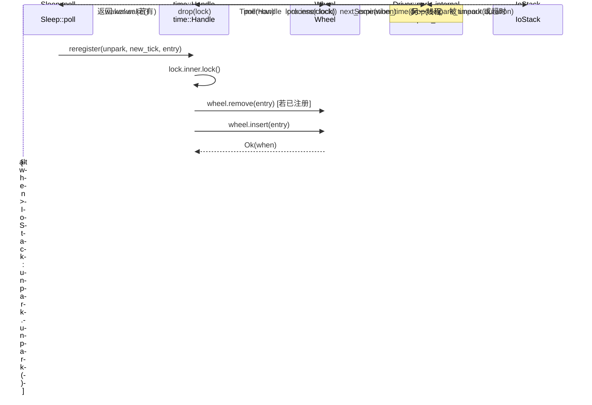

# Chapter 06: Timer Wheel Driver: Hierarchical Timing Wheels for Ultra-Low Latency


上一章我们追踪了 TcpStream::read 的完整链路，看到 ScheduledIo 如何把 epoll 的 fd 就绪事件翻译成 Waker 唤醒。但异步运行时还需要处理另一类「就绪」：一个 sleep(100ms) 的 Future，在 100ms 后必须被唤醒。这类事件不来自内核 fd，而来自「时间本身」。Tokio 的设计选择是把时间也当作一种 I/O 事件：Driver 结构体里只有一个字段 park: IoStack，它复用了 I/O driver 的 park/unpark 机制。当时间轮算出「下一次到期时刻」时，driver 就调用 park_timeout 让线程睡到那个时刻；被唤醒后再从时间轮里取出到期条目、触发它们的 Waker。这样，调度器只需要一个统一的 park 入口，就能同时等待「fd 就绪」和「定时器到期」两类事件。本章要回答三个问题：定时器如何被插入时间轮？时间轮如何按到期时间分级？driver 如何计算下一次 park 的超时并触发到期任务？


## Intuitive Architectural Model

想象一个机械钟表：秒针转一圈带动分针，分针转一圈带动时针。如果只有一根秒针，要表示「12 天后」就得数 100 万格；而分层之后，秒针只管 64 秒内的精度，分针管 64 分钟，时针管 64 小时——每一层只需 64 个槽位，就能覆盖到 2 年之后。

若没有分层，插入一个远期定时器要么需要 O(N) 遍历，要么需要巨大的数组。时间轮用「按到期时间分级」把插入和触发都压到近似 O(1)。

## 内存布局与字段

`Wheel` 的核心字段只有三个 [FACT:tokio/src/runtime/time/wheel/mod.rs:22-40](https://github.com/tokio-rs/tokio/blob/e800714ad714f1d996ddd56265b550d879349c0a/tokio/src/runtime/time/wheel/mod.rs#L22-L40)：

```rust
pub(crate) struct Wheel {
    elapsed: u64,                          // 自 wheel 创建以来经过的毫秒数
    levels: Box,      // 6 层，每层 64 槽
    pending: LinkedList,      // 已到期、待触发的条目
}
```

`NUM_LEVELS = 6`，`BITS_PER_LEVEL = 6`（即每层 64 槽）[FACT:tokio/src/runtime/time/wheel/mod.rs:45-47](https://github.com/tokio-rs/tokio/blob/e800714ad714f1d996ddd56265b550d879349c0a/tokio/src/runtime/time/wheel/mod.rs#L45-L47)。`MAX_DURATION = 1 << (6 * 6) = 1 << 36` 毫秒，约 2 年 [FACT:tokio/src/runtime/time/wheel/mod.rs:50](https://github.com/tokio-rs/tokio/blob/e800714ad714f1d996ddd56265b550d879349c0a/tokio/src/runtime/time/wheel/mod.rs#L50)。

六层的粒度按文档注释是 [FACT:tokio/src/runtime/time/wheel/mod.rs:22-40](https://github.com/tokio-rs/tokio/blob/e800714ad714f1d996ddd56265b550d879349c0a/tokio/src/runtime/time/wheel/mod.rs#L22-L40)：

| 层 | 槽粒度 | 覆盖范围 |
| --- | --- | --- |
| 0 | 1 ms | 64 ms |
| 1 | 64 ms | ~4 s |
| 2 | ~4 s | ~4 min |
| 3 | ~4 min | ~4 hr |
| 4 | ~4 hr | ~12 day |
| 5 | ~12 day | ~2 yr |

`pending` 是一个侵入式链表（`LinkedList<TimerShared>`），存放已经从轮中取出、等待触发 Waker 的条目。注意它是 `LinkedList` 而非 `Vec`：条目本身内嵌在 `TimerShared` 里，插入/移除不需要分配。

## 场景驱动：插入一个 100ms 的 sleep

当 `sleep(100ms)` 首次被 poll 时，`Sleep::poll_elapsed` 会构造 `Timer::new` 并调用 `init` [FACT:tokio/src/time/sleep.rs:436-440](https://github.com/tokio-rs/tokio/blob/e800714ad714f1d996ddd56265b550d879349c0a/tokio/src/time/sleep.rs#L436-L440)。`init` 最终调用 `Handle::reregister`，进而调用 `Wheel::insert`。

`insert` 的第一步是检查是否已过期 [FACT:tokio/src/runtime/time/wheel/mod.rs:90-98](https://github.com/tokio-rs/tokio/blob/e800714ad714f1d996ddd56265b550d879349c0a/tokio/src/runtime/time/wheel/mod.rs#L90-L98)：

```rust
let when = unsafe { item.sync_when() };
if when  usize {
    const SLOT_MASK: u64 = (1 = MAX_DURATION {
        return NUM_LEVELS - 1;
    }
    masked.ilog2() as usize / BITS_PER_LEVEL
}
```

这里用 `elapsed ^ when` 而非 `when - elapsed`，是一个精妙的技巧：XOR 的最高有效位反映了「两个时间戳从哪一位开始不同」，也就是「需要多粗的粒度才能区分它们」。`| SLOT_MASK` 把低 6 位强制置 1，避免 `ilog2` 落在同一槽内时算出过小的层。`ilog2() / 6` 把位宽映射到层号。如果 XOR 结果超过 `MAX_DURATION`（即超过 2 年），就强制塞进最高层——这就是「fudge the timer into the top level」。

对于 100ms 的 sleep，假设 `elapsed` 接近 0，`when ≈ 100`，`elapsed ^ when ≈ 100`，`ilog2(100) = 6`，`6 / 6 = 1`，所以落在第 1 层（64ms 粒度）。这意味着它会在第 1 层的某个槽里等待，直到时间推进到该槽的边界时才被下沉到第 0 层。

## 分级下沉：process_expiration

当 `poll(now)` 推进时间时，`Wheel::poll` 会循环调用 `next_expiration` 和 `process_expiration` [FACT:tokio/src/runtime/time/wheel/mod.rs:142-166](https://github.com/tokio-rs/tokio/blob/e800714ad714f1d996ddd56265b550d879349c0a/tokio/src/runtime/time/wheel/mod.rs#L142-L166)：

```rust
pub(crate) fn poll(&mut self, now: u64) -> Option {
    loop {
        if let Some(handle) = self.pending.pop_back() {
            return Some(handle);
        }
        match self.next_expiration() {
            Some(ref expiration) if expiration.deadline  {
                self.process_expiration(expiration);
                self.set_elapsed(expiration.deadline);
            }
            _ => {
                self.set_elapsed(now);
                break;
            }
        }
    }
    self.pending.pop_back()
}
```

`process_expiration` 负责把某一层的到期条目「下沉」到下一层，或者（在第 0 层）标记为 pending [FACT:tokio/src/runtime/time/wheel/mod.rs:218-251](https://github.com/tokio-rs/tokio/blob/e800714ad714f1d996ddd56265b550d879349c0a/tokio/src/runtime/time/wheel/mod.rs#L218-L251)：

```rust
let mut entries = self.take_entries(expiration);
while let Some(item) = entries.pop_back() {
    match unsafe { item.mark_pending(expiration.deadline) } {
        Ok(()) => {
            self.pending.push_front(item);   // 真正到期
        }
        Err(expiration_tick) => {
            let level = level_for(expiration.deadline, expiration_tick);
            unsafe { self.levels[level].add_entry(item); }  // 下沉到更低层
        }
    }
}
```

`mark_pending` 是关键：它检查条目的实际 deadline 是否已经到达。如果到达，返回 `Ok(())`，条目进入 `pending` 链表；如果还没到（只是所在槽的边界到了），返回 `Err(expiration_tick)`，条目被重新插入到更细的层。

注意注释里强调的一点 [FACT:tokio/src/runtime/time/wheel/mod.rs:219-228](https://github.com/tokio-rs/tokio/blob/e800714ad714f1d996ddd56265b550d879349c0a/tokio/src/runtime/time/wheel/mod.rs#L219-L228)：必须先把整个槽的条目全部取出再处理，因为某些条目可能被重新插入到同一个槽（当插入时间超过 `MAX_DURATION` 时会发生环绕）。如果边取边插，可能陷入无限循环。

## 下一到期时刻的计算

`next_expiration` 从低层到高层扫描，返回第一个非空的到期点 [FACT:tokio/src/runtime/time/wheel/mod.rs:169-191](https://github.com/tokio-rs/tokio/blob/e800714ad714f1d996ddd56265b550d879349c0a/tokio/src/runtime/time/wheel/mod.rs#L169-L191)：

```rust
fn next_expiration(&self) -> Option {
    if !self.pending.is_empty() {
        return Some(Expiration { level: 0, slot: 0, deadline: self.elapsed });
    }
    for (level_num, level) in self.levels.iter().enumerate() {
        if let Some(expiration) = level.next_expiration(self.elapsed) {
            debug_assert!(self.no_expirations_before(level_num + 1, expiration.deadline));
            return Some(expiration);
        }
    }
    None
}
```

如果 `pending` 非空，说明有已到期条目待触发，立即返回当前 `elapsed` 作为 deadline（这样 driver 会以 0 超时 park，马上回来处理）。否则逐层扫描，返回第一个有内容的槽的 deadline。`debug_assert` 验证了一个不变量：更高层不可能有比当前层更早的到期点。

```mermaid
flowchart TD
    start["Wheel::poll(now)"] --> check_pending{"pending 非空?"}
    check_pending -->|是| pop["pop_back 返回 TimerHandle"]
    check_pending -->|否| next_exp{"next_expiration() 有到期点?"}
    next_exp -->|无| set_elapsed["set_elapsed(now) 后 break"]
    next_exp -->|有| cmp{"expiration.deadline |否| set_elapsed
    cmp -->|是| proc["process_expiration(expiration)"]
    proc --> take["take_entries 取出整槽"]
    take --> mark{"item.mark_pending()"}
    mark -->|Ok 已到期| push_pending["pending.push_front(item)"]
    mark -->|Err 未到期| reinsert["level_for 后 add_entry 下沉"]
    push_pending --> set_elapsed2["set_elapsed(expiration.deadline)"]
    reinsert --> set_elapsed2
    set_elapsed2 --> check_pending
    set_elapsed --> pop2["pending.pop_back() 返回"]
```

---


## Intuitive Architectural Model

时间轮本身不会「自己走」。它需要一个外部循环反复问它：「下一次到期是什么时候？」然后睡到那个时刻，醒来后再推进时间。这个循环就是 `Driver::park_internal`。它把「时间轮的下一次到期」翻译成一个 `park_timeout` 的时长，交给底层的 I/O 栈去睡。

若没有这个循环，定时器永远不会被触发——时间轮只是静态数据结构，需要有人「拨动」它。

## 数据结构：Driver 与 InnerState

`Driver` 只有一个字段 `park: IoStack` [FACT:tokio/src/runtime/time/mod.rs:90-93](https://github.com/tokio-rs/tokio/blob/e800714ad714f1d996ddd56265b550d879349c0a/tokio/src/runtime/time/mod.rs#L90-L93)。真正的状态在 `Handle` 里，通过 `Inner` 枚举区分传统实现和实验性实现 [FACT:tokio/src/runtime/time/mod.rs:95-127](https://github.com/tokio-rs/tokio/blob/e800714ad714f1d996ddd56265b550d879349c0a/tokio/src/runtime/time/mod.rs#L95-L127)。传统实现的 `InnerState` 包含两个字段 [FACT:tokio/src/runtime/time/mod.rs:130-136](https://github.com/tokio-rs/tokio/blob/e800714ad714f1d996ddd56265b550d879349c0a/tokio/src/runtime/time/mod.rs#L130-L136)：

```rust
struct InnerState {
    next_wake: Option,   // 承诺的最早唤醒时刻
    wheel: wheel::Wheel,
}
```

`next_wake` 用 `NonZeroU64` 而非 `Option<u64>` 的嵌套，是为了利用 niche 优化——`Option<NonZeroU64>` 和 `u64` 同大小。它记录「driver 承诺在哪个 tick 之前会醒来」，用于 `reregister` 时判断是否需要 `unpark`。

`is_shutdown` 是独立的 `AtomicBool`，注释解释了为什么把它从 Mutex 里拆出来 [FACT:tokio/src/runtime/time/mod.rs:90-93](https://github.com/tokio-rs/tokio/blob/e800714ad714f1d996ddd56265b550d879349c0a/tokio/src/runtime/time/mod.rs#L90-L93)：`Handle` 需要在不锁 mutex 的情况下检查 `is_shutdown`。这是一个典型的「读多写少」优化——shutdown 只发生一次，但检查可能频繁。

## 场景驱动：一次 park 的完整流程

`park_internal` 是核心 [FACT:tokio/src/runtime/time/mod.rs:213-256](https://github.com/tokio-rs/tokio/blob/e800714ad714f1d996ddd56265b550d879349c0a/tokio/src/runtime/time/mod.rs#L213-L256)：

```rust
fn park_internal(&mut self, rt_handle: &driver::Handle, limit: Option) {
    let handle = rt_handle.time();
    let mut lock = handle.inner.lock();
    assert!(!handle.is_shutdown());

    let next_wake = lock.wheel.next_expiration_time();
    lock.next_wake = next_wake.map(|t| NonZeroU64::new(t).unwrap_or_else(|| NonZeroU64::new(1).unwrap()));
    drop(lock);

    match next_wake {
        Some(when) => {
            let now = handle.time_source.now(rt_handle.clock());
            let mut duration = handle.time_source.tick_to_duration(when.saturating_sub(now));
            if duration > Duration::from_millis(0) {
                if let Some(limit) = limit {
                    duration = std::cmp::min(limit, duration);
                }
                self.park_thread_timeout(rt_handle, duration);
            } else {
                self.park.park_timeout(rt_handle, Duration::from_secs(0));
            }
        }
        None => {
            if let Some(duration) = limit {
                self.park_thread_timeout(rt_handle, duration);
            } else {
                self.park.park(rt_handle);
            }
        }
    }

    handle.process(rt_handle.clock());
}
```

分步解析：

1. **取锁、读下一次到期**：`lock.wheel.next_expiration_time()` 返回 `Option<u64>`，即下一个到期 tick。同时把它写入 `lock.next_wake`，供 `reregister` 判断是否需要 unpark。

2. **释放锁**：`drop(lock)` 必须在 park 之前，否则 park 期间其他线程无法插入定时器。

3. **计算 park 时长**：`when.saturating_sub(now)` 得到剩余 tick 数，`tick_to_duration` 转成 `Duration`。注释指出这里实际上向上取整到 1ms [FACT:tokio/src/runtime/time/mod.rs:228-230](https://github.com/tokio-rs/tokio/blob/e800714ad714f1d996ddd56265b550d879349c0a/tokio/src/runtime/time/mod.rs#L228-L230)，避免微秒级 sleep 被 OS 当作零长度。

4. **处理 limit**：如果调用方传了 `limit`（比如 `park_timeout` 的显式超时），取 `min(limit, duration)`，保证不会睡过头。

5. **特殊情况**：如果 `duration == 0`（已到期），用 `park_timeout(0)` 立即返回，不真正睡。

6. **无定时器时**：如果 `next_wake` 为 `None`，有 `limit` 就 `park_thread_timeout(limit)`，否则无限 `park`。

7. **唤醒后处理**：`handle.process(clock)` 推进时间轮并触发到期条目。

## process_at_time：触发到期条目

`process` 调用 `process_at_time` [FACT:tokio/src/runtime/time/mod.rs:296-337](https://github.com/tokio-rs/tokio/blob/e800714ad714f1d996ddd56265b550d879349c0a/tokio/src/runtime/time/mod.rs#L296-L337)：

```rust
pub(self) fn process_at_time(&self, mut now: u64) {
    let mut waker_list = WakeList::new();
    let mut lock = self.inner.lock();

    if now ) {
    let waker = unsafe {
        let mut lock = self.inner.lock();
        if unsafe { entry.as_ref().might_be_registered() } {
            lock.wheel.remove(entry);
        }
        let entry = entry.as_ref().handle();
        if self.is_shutdown() {
            unsafe { entry.fire(Err(crate::time::error::Error::shutdown())) }
        } else {
            entry.set_expiration(new_tick);
            match unsafe { lock.wheel.insert(entry) } {
                Ok(when) => {
                    if lock.next_wake.is_none_or(|next_wake| when  unsafe {
                    entry.fire(Ok(()))
                },
            }
        }
    };
    if let Some(waker) = waker {
        waker.wake();
    }
}
```

关键逻辑：插入成功后，如果新到期时刻比 `next_wake` 更早，就调用 `unpark.unpark()` 唤醒 driver。这是因为 driver 可能正睡在一个更晚的时刻，需要被提前叫醒以重新计算 park 时长。

注意 `unpark` 是在**持有锁时**调用的，而 `waker.wake()` 是在**释放锁后**调用的。注释解释 [FACT:tokio/src/runtime/time/mod.rs:441](https://github.com/tokio-rs/tokio/blob/e800714ad714f1d996ddd56265b550d879349c0a/tokio/src/runtime/time/mod.rs#L441)：必须在调用 Waker 前释放锁以避免死锁。但 `unpark` 不同——它只是往 epoll 塞一个事件，不会回调用户代码，所以持锁调用是安全的。



---


## Intuitive Architectural Model

`Sleep` 是用户直接 `.await` 的 Future，`Timeout` 是包裹另一个 Future 的适配器。它们本身不管理时间轮，只是把「deadline」翻译成 tick，委托给 `Timer` 和 `Handle`。

## Sleep 的内存布局

`Sleep` 用 `pin_project!` 宏定义 [FACT:tokio/src/time/sleep.rs:221-227](https://github.com/tokio-rs/tokio/blob/e800714ad714f1d996ddd56265b550d879349c0a/tokio/src/time/sleep.rs#L221-L227)：

```rust
pub struct Sleep {
    deadline: Instant,
    driver: scheduler::Handle,
    inner: Inner,
    #[pin]
    timer: Option,
}
```

`timer` 是 `Option<Timer>` 且带 `#[pin]`：首次 poll 前是 `None`，首次 poll 时才创建 `Timer` 并注册。这种「惰性初始化」避免了在 `sleep()` 调用时就访问运行时——`sleep()` 可以在运行时外调用，只要在 `.await` 时才真正注册。

`PinnedDrop` 实现确保 drop 时取消定时器 [FACT:tokio/src/time/sleep.rs:230-235](https://github.com/tokio-rs/tokio/blob/e800714ad714f1d996ddd56265b550d879349c0a/tokio/src/time/sleep.rs#L230-L235)：

```rust
impl PinnedDrop for Sleep {
    fn drop(this: Pin) {
        let this = this.project();
        if let Some(timer) = this.timer.as_pin_mut() {
            timer.cancel(this.driver);
        }
    }
}
```

## poll_elapsed 的完整流程

`poll_elapsed` 是 `Sleep` 的核心 [FACT:tokio/src/time/sleep.rs:396-454](https://github.com/tokio-rs/tokio/blob/e800714ad714f1d996ddd56265b550d879349c0a/tokio/src/time/sleep.rs#L396-L454)：

```rust
fn poll_elapsed(self: Pin, cx: &mut task::Context) -> Poll> {
    ready!(crate::trace::trace_leaf());
    let mut this = self.project();

    // coop 预算
    let coop = ready!(crate::task::coop::poll_proceed(cx));

    let handle = this.driver;
    let timer = match this.timer.as_mut().as_pin_mut() {
        Some(timer) => timer,
        None => {
            let time_source = handle.driver().time().time_source();
            let deadline = time_source.deadline_to_tick(*this.deadline);
            let timer = Timer::new(handle, deadline);
            this.timer.set(Some(timer));
            let mut timer = this.timer.as_pin_mut().unwrap();
            timer.as_mut().init(handle, deadline);
            timer
        }
    };

    let result = timer.poll_elapsed(cx, handle).map(move |r| {
        coop.made_progress();
        r
    });
    result
}
```

分步：

1. **coop 预算检查**：`poll_proceed(cx)` 消耗一次协作预算。如果预算耗尽，返回 `Pending` 并让出执行权。这是 Tokio 防止单个任务饿死其他任务的机制。

2. **惰性创建 Timer**：如果 `timer` 是 `None`，把 `deadline` 转成 tick，创建 `Timer` 并调用 `init` 注册到时间轮。

3. **委托给 Timer::poll_elapsed**：实际的到期检查由 `Timer` 完成。

4. **成功后标记进度**：`coop.made_progress()` 表示这次 poll 有实际进展。

## Timeout 的 poll：先 poll 值，再 poll 延迟

`Timeout` 的 poll 顺序很关键 [FACT:tokio/src/time/timeout.rs:210-224](https://github.com/tokio-rs/tokio/blob/e800714ad714f1d996ddd56265b550d879349c0a/tokio/src/time/timeout.rs#L210-L224)：

```rust
fn poll(self: Pin, cx: &mut task::Context) -> Poll {
    let me = self.project();
    let had_budget_before = coop::has_budget_remaining();

    // 先 poll 被包裹的 future
    if let Poll::Ready(v) = me.value.poll(cx) {
        return Poll::Ready(Ok(v));
    }

    match me.delay.as_pin_mut() {
        Some(delay) => poll_delay(had_budget_before, delay, cx).map(Err),
        None => Poll::Pending,
    }
}
```

注释明确指出 [FACT:tokio/src/time/timeout.rs:24-26](https://github.com/tokio-rs/tokio/blob/e800714ad714f1d996ddd56265b550d879349c0a/tokio/src/time/timeout.rs#L24-L26)：future 先被 poll，然后才检查超时。所以如果 future 不 yield 就完成，它可能在超过 timeout 后仍返回 `Ok`。这是设计选择，不是 bug。

`poll_delay` 处理一个微妙的场景 [FACT:tokio/src/time/timeout.rs:229-251](https://github.com/tokio-rs/tokio/blob/e800714ad714f1d996ddd56265b550d879349c0a/tokio/src/time/timeout.rs#L229-L251)：

```rust
fn poll_delay(had_budget_before: bool, delay: Pin, cx: &mut task::Context) -> Poll {
    let delay_poll = || match delay.poll(cx) {
        Poll::Ready(()) => Poll::Ready(Elapsed::new()),
        Poll::Pending => Poll::Pending,
    };

    let has_budget_now = coop::has_budget_remaining();

    if let (true, false) = (had_budget_before, has_budget_now) {
        // 如果预算是被底层 future 耗尽的，用无约束预算 poll delay
        coop::with_unconstrained(delay_poll)
    } else {
        delay_poll()
    }
}
```

逻辑：如果进入 `poll` 时还有预算，但 poll 完 value 后预算耗尽了，说明是 value 消耗了预算。此时如果用受限预算 poll delay，delay 可能立即返回 `Pending`，导致永远无法判断超时是否到达。所以用 `with_unconstrained` 临时解除预算限制。注释称之为「pathological cases」[FACT:tokio/src/time/timeout.rs:243-246](https://github.com/tokio-rs/tokio/blob/e800714ad714f1d996ddd56265b550d879349c0a/tokio/src/time/timeout.rs#L243-L246)。

## timeout 的 deadline 溢出处理

`timeout` 函数用 `checked_add` 处理溢出 [FACT:tokio/src/time/timeout.rs:86-99](https://github.com/tokio-rs/tokio/blob/e800714ad714f1d996ddd56265b550d879349c0a/tokio/src/time/timeout.rs#L86-L99)：

```rust
Timeout {
    value: future.into_future(),
    delay: match Instant::now().checked_add(duration) {
        Some(deadline) => Some(Sleep::new_timeout(deadline, trace::caller_location())),
        None => None,
    },
}
```

如果 `Instant::now() + duration` 溢出（duration 极大），`delay` 为 `None`，poll 时直接返回 `Poll::Pending` [FACT:tokio/src/time/timeout.rs:222](https://github.com/tokio-rs/tokio/blob/e800714ad714f1d996ddd56265b550d879349c0a/tokio/src/time/timeout.rs#L222)。这相当于「永不超时」，是合理的降级行为。

---


**为什么用 XOR 而非减法计算层级？** `elapsed ^ when` 的最高有效位直接反映「两个时间戳从哪一位开始不同」，这正是「需要多粗的粒度」的度量。减法 `when - elapsed` 在 `elapsed` 接近 `when` 时高位全为 0，`ilog2` 会算出过小的层。XOR 天然处理了环绕场景。

**时间倒流保护的必要性** [FACT:tokio/src/runtime/time/mod.rs:301-309](https://github.com/tokio-rs/tokio/blob/e800714ad714f1d996ddd56265b550d879349c0a/tokio/src/runtime/time/mod.rs#L301-L309)：Rust 保证 `Instant` 单调，但底层 OS 可能不保证。在 Windows 宿主上的 Linux VM 里，std 信任硬件时钟导致 `Instant` 倒退。Tokio 用 `now = lock.wheel.elapsed()` 钳制，避免 `set_elapsed` 的 assert 失败。

**批量唤醒与死锁** [FACT:tokio/src/runtime/time/mod.rs:319](https://github.com/tokio-rs/tokio/blob/e800714ad714f1d996ddd56265b550d879349c0a/tokio/src/runtime/time/mod.rs#L319)：持有时间轮锁时调用 Waker 是危险的——Waker 可能触发任务重新 poll，进而调用 `Sleep::reset`，试图再次获取时间轮锁，造成死锁。`WakeList` 的批量机制在锁满时临时释放锁，是标准的「锁外回调」模式。

**`next_wake` 的 niche 优化** [FACT:tokio/src/runtime/time/mod.rs:130-136](https://github.com/tokio-rs/tokio/blob/e800714ad714f1d996ddd56265b550d879349c0a/tokio/src/runtime/time/mod.rs#L130-L136)：`Option<NonZeroU64>` 与 `u64` 同大小，因为 0 被用作 `None` 的 niche。但 tick 0 是合法值，所以代码用 `NonZeroU64::new(t).unwrap_or_else(|| NonZeroU64::new(1).unwrap())` 把 0 映射到 1 [FACT:tokio/src/runtime/time/mod.rs:221](https://github.com/tokio-rs/tokio/blob/e800714ad714f1d996ddd56265b550d879349c0a/tokio/src/runtime/time/mod.rs#L221)。这是一个微妙的边界处理：tick 0 被当作 tick 1，最多导致 1ms 的额外唤醒。

**`process_expiration` 的「先取后处理」** [FACT:tokio/src/runtime/time/wheel/mod.rs:219-228](https://github.com/tokio-rs/tokio/blob/e800714ad714f1d996ddd56265b550d879349c0a/tokio/src/runtime/time/wheel/mod.rs#L219-L228)：必须先把整槽条目取出再处理，因为超过 `MAX_DURATION` 的条目会环绕并重新插入同一槽。如果边取边插，会无限循环。

**`Timeout` 的 poll 顺序陷阱** [FACT:tokio/src/time/timeout.rs:24-26](https://github.com/tokio-rs/tokio/blob/e800714ad714f1d996ddd56265b550d879349c0a/tokio/src/time/timeout.rs#L24-L26)：future 先 poll，超时后检查。如果 future 是 CPU 密集且不 yield，它可能超过 timeout 仍返回 `Ok`。生产环境中不要依赖 `timeout` 来强制中断不合作的 future。

---


本章拆解了 Tokio 时间驱动的三层结构：

1. **时间轮**（`Wheel`）：六层 64 槽的哈希分级结构，用 `elapsed ^ when` 的位宽决定条目层级，插入和触发近似 O(1)。`pending` 链表存放已到期条目，`process_expiration` 负责逐层下沉。

2. **Driver**（`Driver::park_internal`）：把时间轮的 `next_expiration_time` 翻译成 `park_timeout` 时长，复用 I/O 栈的 park/unpark。`process_at_time` 在唤醒后推进时间轮、批量触发 Waker，并处理时间倒流和死锁防护。

3. **用户 API**（`Sleep` / `Timeout`）：`Sleep` 惰性创建 `Timer` 并注册，`Timeout` 先 poll value 再 poll delay，用 `with_unconstrained` 处理预算耗尽场景。

核心设计是「时间也是一种 I/O 事件」：driver 只有一个 park 入口，同时等待 fd 就绪和定时器到期。`next_wake` 记录承诺的唤醒时刻，`reregister` 在插入更早的定时器时 `unpark` 唤醒 driver 重新计算。

下一章我们将进入同步原语：`Mutex`、`Semaphore` 与通道如何实现异步等待。你会看到它们如何复用本章的 Waker 机制，以及「许可计数」与「等待队列」如何协作。


Q1: 如果把 `Wheel::insert` 中的 `if when <= self.elapsed` 改成 `if when < self.elapsed`（去掉等号），在什么场景下会导致定时器永远不被触发？

**参考解析**：`when == self.elapsed` 表示定时器的到期时刻恰好等于当前已推进的时间。原代码用 `<=` 把它判为 `Elapsed`，调用方立即触发 [FACT:tokio/src/runtime/time/wheel/mod.rs:96-98](https://github.com/tokio-rs/tokio/blob/e800714ad714f1d996ddd56265b550d879349c0a/tokio/src/runtime/time/wheel/mod.rs#L96-L98)。如果改成 `<`，这个条目会被插入到 `level_for(elapsed, when)` 算出的层。由于 `elapsed ^ when == 0`，`masked = 0 | SLOT_MASK = 63`，`ilog2(63) = 5`，`5 / 6 = 0`，落在第 0 层。但第 0 层的 `next_expiration` 会返回一个 `deadline >= elapsed` 的槽，而 `Wheel::poll` 的条件是 `expiration.deadline <= now`。如果 `now == elapsed`，条件成立，`process_expiration` 会取出该条目，`mark_pending(elapsed)` 检查实际 deadline 是否到达——此时 `when == elapsed`，`mark_pending` 返回 `Ok`，条目进入 pending。所以实际上仍会被触发，但多绕了一圈。真正的风险在于：如果 `elapsed` 已经推进到 `when` 之后（`when < elapsed`），原代码返回 `Elapsed` 立即触发，改后则插入到一个已经过去的槽，`next_expiration` 可能返回 `deadline < elapsed`，`set_elapsed` 的 assert `elapsed <= when` 会失败 panic [FACT:tokio/src/runtime/time/wheel/mod.rs:253-264](https://github.com/tokio-rs/tokio/blob/e800714ad714f1d996ddd56265b550d879349c0a/tokio/src/runtime/time/wheel/mod.rs#L253-L264)。所以这个等号是防止 assert 失败的关键边界。

Q2: `process_at_time` 中 `WakeList` 满了之后为什么要 `drop(lock)` 再 `wake_all()` 再重新 `lock`？如果去掉这个 drop，在什么并发场景下会死锁？

**参考解析**：`WakeList` 收集 Waker，满了之后必须唤醒一批以腾出空间 [FACT:tokio/src/runtime/time/mod.rs:318-325](https://github.com/tokio-rs/tokio/blob/e800714ad714f1d996ddd56265b550d879349c0a/tokio/src/runtime/time/mod.rs#L318-L325)。如果持有 `self.inner.lock()` 时调用 `waker.wake()`，被唤醒的任务可能立即在另一个线程（或同一线程的调度器）上运行，调用 `Sleep::reset` 或 `Sleep::poll_elapsed`，进而调用 `Handle::reregister`，而 `reregister` 的第一件事就是 `self.inner.lock()` [FACT:tokio/src/runtime/time/mod.rs:405](https://github.com/tokio-rs/tokio/blob/e800714ad714f1d996ddd56265b550d879349c0a/tokio/src/runtime/time/mod.rs#L405)。由于 `std::sync::Mutex` 不可重入，同一线程会死锁；即使在不同线程，也会阻塞直到 `process_at_time` 释放锁，而 `process_at_time` 正等着 `wake_all` 返回，形成循环等待。注释明确说「To avoid deadlock, we must do this with the lock temporarily dropped」[FACT:tokio/src/runtime/time/mod.rs:319](https://github.com/tokio-rs/tokio/blob/e800714ad714f1d996ddd56265b550d879349c0a/tokio/src/runtime/time/mod.rs#L319)。drop 后重新 lock 时，时间轮状态可能已被其他线程修改（比如新定时器插入），所以 `while let Some(entry) = lock.wheel.poll(now)` 会继续从新状态取条目，这是安全的。

Q3: `Timeout::poll` 中 `had_budget_before` 和 `has_budget_now` 的组合判断 `(true, false)` 为什么只在「进入时有预算、poll 完 value 后没预算」时才用 `with_unconstrained`？如果反过来 `(false, true)` 会怎样？

**参考解析**：`had_budget_before` 在 poll value 之前记录 [FACT:tokio/src/time/timeout.rs:208-208](https://github.com/tokio-rs/tokio/blob/e800714ad714f1d996ddd56265b550d879349c0a/tokio/src/time/timeout.rs#L208-L208)，`has_budget_now` 在 poll value 之后记录 [FACT:tokio/src/time/timeout.rs:239](https://github.com/tokio-rs/tokio/blob/e800714ad714f1d996ddd56265b550d879349c0a/tokio/src/time/timeout.rs#L239)。`(true, false)` 意味着预算是在 poll value 期间耗尽的，说明 value 是「预算消耗者」。此时如果用受限预算 poll delay，`poll_proceed` 会立即返回 `Pending`，delay 永远不会被真正检查，超时判断失效。所以用 `with_unconstrained` 临时解除限制 [FACT:tokio/src/time/timeout.rs:247](https://github.com/tokio-rs/tokio/blob/e800714ad714f1d996ddd56265b550d879349c0a/tokio/src/time/timeout.rs#L247)。`(false, true)` 不可能发生——预算只能被消耗，不能被恢复（除非显式 `with_unconstrained`，但这里没有）。`(false, false)` 意味着进入时就没预算，此时 poll value 可能已经返回 `Pending`（因为 `poll_proceed` 失败），delay 也用受限预算 poll，两者都 pending，符合预期。`(true, true)` 是正常情况，预算充足，直接 poll delay。

至此，我们已经看清时间驱动如何复用 I/O driver 的 park/unpark 机制，让定时器与 fd 就绪共享同一个等待入口。时间轮的分级、到期计算与 Waker 触发，构成了异步运行时处理「时间就绪」的完整闭环。但异步等待不止于 I/O 与时间——当多个任务竞争同一把锁、或通过通道传递消息时，Waker 又该被存放到哪里？下一章我们将进入 tokio::sync 家族，看看 Mutex、Semaphore 与各类通道如何在「等待者队列 + Waker 唤醒」上做出不同取舍。