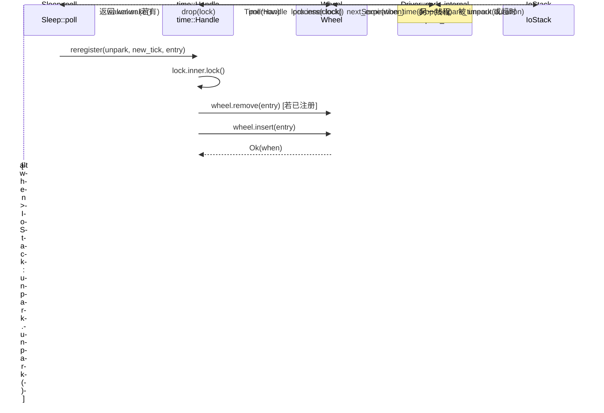

# Chapter 6: Time-Driven: How the Timing Wheel, Sleep, and Timeouts Are Woken

In the previous chapter, we traced the complete path of TcpStream::read and saw how ScheduledIo translates epoll fd readiness events into Waker wakeups. But an async runtime also needs to handle another kind of "readiness": a sleep(100ms) Future must be woken after 100ms. This kind of event does not come from a kernel fd, but from "time itself." Tokio's design choice is to treat time as a kind of I/O event as well: the Driver struct has only one field, park: IoStack, which reuses the I/O driver's park/unpark mechanism. When the timing wheel calculates the "next expiration instant," the driver calls park_timeout to let the thread sleep until that instant; after being woken, it takes expired entries out of the timing wheel and triggers their Wakers. In this way, the scheduler only needs a unified park entry point to wait for both kinds of events: "fd readiness" and "timer expiration." This chapter answers three questions: How are timers inserted into the timing wheel? How is the timing wheel leveled by expiration time? How does the driver calculate the timeout for the next park and trigger expired tasks?

# 1. Timing Wheel: A Six-Level, 64-Slot Hashed Hierarchical Structure

## Intuitive model

Imagine a mechanical clock: the second hand drives the minute hand through one revolution, and the minute hand drives the hour hand through one revolution. If there were only a second hand, representing "12 days later" would require counting a million ticks; but after layering, the second hand only handles precision within 64 seconds, the minute hand handles 64 minutes, and the hour hand handles 64 hours — each level only needs 64 slots to cover more than 2 years into the future.

Without layering, inserting a far-future timer would require either O(N) traversal or a huge array. The timing wheel uses "leveling by expiration time" to reduce both insertion and triggering to approximately O(1).

## Memory layout and fields

`Wheel`The core fields of are only three[FACT:tokio/src/runtime/time/wheel/mod.rs:22-40]：

```rust
pub(crate) struct Wheel {
    elapsed: u64,                          // 自 wheel 创建以来经过的毫秒数
    levels: Box,      // 6 层，每层 64 槽
    pending: LinkedList,      // 已到期、待触发的条目
}
```

`NUM_LEVELS = 6`，`BITS_PER_LEVEL = 6`(that is, 64 slots per level)[FACT:tokio/src/runtime/time/wheel/mod.rs:45-47]。`MAX_DURATION = 1 << (6 * 6) = 1 << 36`milliseconds, about 2 years[FACT:tokio/src/runtime/time/wheel/mod.rs:50]。

The granularity of the six levels, according to the documentation comments, is[FACT:tokio/src/runtime/time/wheel/mod.rs:22-40]：

| Level | Slot granularity | Coverage range |
| --- | --- | --- |
| 0 | 1 ms | 64 ms |
| 1 | 64 ms | ~4 s |
| 2 | ~4 s | ~4 min |
| 3 | ~4 min | ~4 hr |
| 4 | ~4 hr | ~12 day |
| 5 | ~12 day | ~2 yr |

`pending`is an intrusive linked list (`LinkedList<TimerShared>`), storing entries that have already been taken out of the wheel and are waiting to trigger their Wakers. Note that it is`LinkedList`rather than`Vec`: the entries themselves are embedded in`TimerShared`, so insertion/removal does not require allocation.

## Scenario-driven: inserting a 100ms sleep

When`sleep(100ms)`is first polled,`Sleep::poll_elapsed`will construct`Timer::new`and call`init` [FACT:tokio/src/time/sleep.rs:436-440]。`init`ultimately calls`Handle::reregister`, and then calls`Wheel::insert`。

`insert`The first step is to check whether it has already expired[FACT:tokio/src/runtime/time/wheel/mod.rs:90-98]：

```rust
let when = unsafe { item.sync_when() };
if when  usize {
    const SLOT_MASK: u64 = (1 = MAX_DURATION {
        return NUM_LEVELS - 1;
    }
    masked.ilog2() as usize / BITS_PER_LEVEL
}
```

Here`elapsed ^ when`is used rather than`when - elapsed`, which is an ingenious trick: the most significant bit of the XOR reflects "from which bit the two timestamps first differ," that is, "how coarse a granularity is needed to distinguish them."`| SLOT_MASK`forces the low 6 bits to 1, avoiding`ilog2`calculating too small a level when they fall into the same slot.`ilog2() / 6`maps the bit width to the level number. If the XOR result exceeds`MAX_DURATION`(that is, more than 2 years), it is forcibly placed into the highest level — this is "fudge the timer into the top level."

For a 100ms sleep, assuming`elapsed`is close to 0,`when ≈ 100`，`elapsed ^ when ≈ 100`，`ilog2(100) = 6`，`6 / 6 = 1`, so it falls on level 1 (64ms granularity). This means it will wait in a slot on level 1 until time advances to that slot's boundary before being cascaded down to level 0.

## Hierarchical cascading: process_expiration

When`poll(now)`advances time,`Wheel::poll`will repeatedly call`next_expiration`and`process_expiration` [FACT:tokio/src/runtime/time/wheel/mod.rs:142-166]：

```rust
pub(crate) fn poll(&mut self, now: u64) -> Option {
    loop {
        if let Some(handle) = self.pending.pop_back() {
            return Some(handle);
        }
        match self.next_expiration() {
            Some(ref expiration) if expiration.deadline  {
                self.process_expiration(expiration);
                self.set_elapsed(expiration.deadline);
            }
            _ => {
                self.set_elapsed(now);
                break;
            }
        }
    }
    self.pending.pop_back()
}
```

`process_expiration`is responsible for "cascading" expired entries from one level down to the next, or (at level 0) marking them as pending[FACT:tokio/src/runtime/time/wheel/mod.rs:218-251]：

```rust
let mut entries = self.take_entries(expiration);
while let Some(item) = entries.pop_back() {
    match unsafe { item.mark_pending(expiration.deadline) } {
        Ok(()) => {
            self.pending.push_front(item);   // 真正到期
        }
        Err(expiration_tick) => {
            let level = level_for(expiration.deadline, expiration_tick);
            unsafe { self.levels[level].add_entry(item); }  // 下沉到更低层
        }
    }
}
```

`mark_pending`is the key: it checks whether an entry's actual deadline has been reached. If reached, it returns`Ok(())`, and the entry enters the`pending`linked list; if not yet reached (only the slot's boundary has been reached), it returns`Err(expiration_tick)`, and the entry is reinserted into a finer-grained level.

Note the point emphasized in the comments[FACT:tokio/src/runtime/time/wheel/mod.rs:219-228]: all entries in the entire slot must be taken out first before processing, because some entries may be reinserted into the same slot (this happens when the insertion time exceeds`MAX_DURATION`, causing wraparound). If you take and insert simultaneously, you may fall into an infinite loop.

## Calculation of the next expiration time

`next_expiration`scans from low level to high level, returning the first non-empty expiration point[FACT:tokio/src/runtime/time/wheel/mod.rs:169-191]：

```rust
fn next_expiration(&self) -> Option {
    if !self.pending.is_empty() {
        return Some(Expiration { level: 0, slot: 0, deadline: self.elapsed });
    }
    for (level_num, level) in self.levels.iter().enumerate() {
        if let Some(expiration) = level.next_expiration(self.elapsed) {
            debug_assert!(self.no_expirations_before(level_num + 1, expiration.deadline));
            return Some(expiration);
        }
    }
    None
}
```

If`pending`is non-empty, it means there are expired entries waiting to be triggered, so it immediately returns the current`elapsed`as the deadline (so the driver will park with a 0 timeout and come back immediately to process). Otherwise, it scans level by level, returning the deadline of the first slot with content.`debug_assert`verifies an invariant: a higher level cannot have an earlier expiration point than the current level.

```mermaid
flowchart TD
    start["Wheel::poll(now)"] --> check_pending{"pending 非空?"}
    check_pending -->|是| pop["pop_back 返回 TimerHandle"]
    check_pending -->|否| next_exp{"next_expiration() 有到期点?"}
    next_exp -->|无| set_elapsed["set_elapsed(now) 后 break"]
    next_exp -->|有| cmp{"expiration.deadline |否| set_elapsed
    cmp -->|是| proc["process_expiration(expiration)"]
    proc --> take["take_entries 取出整槽"]
    take --> mark{"item.mark_pending()"}
    mark -->|Ok 已到期| push_pending["pending.push_front(item)"]
    mark -->|Err 未到期| reinsert["level_for 后 add_entry 下沉"]
    push_pending --> set_elapsed2["set_elapsed(expiration.deadline)"]
    reinsert --> set_elapsed2
    set_elapsed2 --> check_pending
    set_elapsed --> pop2["pending.pop_back() 返回"]
```

---

# II. The Driver's park loop: connecting the timer wheel to the I/O stack

## Intuitive model

The timer wheel itself does not "run on its own." It needs an external loop to repeatedly ask it: "When is the next expiration?" Then it sleeps until that moment, and after waking up, advances time. This loop is`Driver::park_internal`. It translates "the timer wheel's next expiration" into a`park_timeout`duration, handing it to the underlying I/O stack to sleep.

Without this loop, timers would never be triggered—the timer wheel is just a static data structure that needs someone to "turn" it.

## Data structures: Driver and InnerState

`Driver`has only one field`park: IoStack` [FACT:tokio/src/runtime/time/mod.rs:90-93]. The real state is in`Handle`, distinguished via the`Inner`enum between the traditional implementation and the experimental implementation[FACT:tokio/src/runtime/time/mod.rs:95-127]. The traditional implementation's`InnerState`contains two fields[FACT:tokio/src/runtime/time/mod.rs:130-136]：

```rust
struct InnerState {
    next_wake: Option,   // 承诺的最早唤醒时刻
    wheel: wheel::Wheel,
}
```

`next_wake`uses`NonZeroU64`instead of`Option<u64>`nesting, in order to leverage niche optimization—`Option<NonZeroU64>`and`u64`are the same size. It records "before which tick the driver promises to wake up," used during`reregister`to determine whether`unpark`。

`is_shutdown`is needed`AtomicBool`is an independent[FACT:tokio/src/runtime/time/mod.rs:90-93]：`Handle`, and the comments explain why it was split out from the Mutex`is_shutdown`needs to check

## without locking the mutex. This is a typical "read-many, write-few" optimization—shutdown happens only once, but checks may be frequent.

`park_internal`Scenario-driven: the complete flow of one park[FACT:tokio/src/runtime/time/mod.rs:213-256]：

```rust
fn park_internal(&mut self, rt_handle: &driver::Handle, limit: Option) {
    let handle = rt_handle.time();
    let mut lock = handle.inner.lock();
    assert!(!handle.is_shutdown());

    let next_wake = lock.wheel.next_expiration_time();
    lock.next_wake = next_wake.map(|t| NonZeroU64::new(t).unwrap_or_else(|| NonZeroU64::new(1).unwrap()));
    drop(lock);

    match next_wake {
        Some(when) => {
            let now = handle.time_source.now(rt_handle.clock());
            let mut duration = handle.time_source.tick_to_duration(when.saturating_sub(now));
            if duration > Duration::from_millis(0) {
                if let Some(limit) = limit {
                    duration = std::cmp::min(limit, duration);
                }
                self.park_thread_timeout(rt_handle, duration);
            } else {
                self.park.park_timeout(rt_handle, Duration::from_secs(0));
            }
        }
        None => {
            if let Some(duration) = limit {
                self.park_thread_timeout(rt_handle, duration);
            } else {
                self.park.park(rt_handle);
            }
        }
    }

    handle.process(rt_handle.clock());
}
```

Copy

1. **Step-by-step analysis:**：`lock.wheel.next_expiration_time()`Acquire lock, read next expiration`Option<u64>`returns`lock.next_wake`, i.e., the next expiration tick. At the same time, it writes it to`reregister`, for

2. **to determine whether unpark is needed.**：`drop(lock)`Release lock

3. **must be before park, otherwise other threads cannot insert timers during park.**：`when.saturating_sub(now)`Calculate park duration`tick_to_duration`obtains the remaining tick count,`Duration`converts it to[FACT:tokio/src/runtime/time/mod.rs:228-230]. The comments point out that this is actually rounded up to 1ms

4. **, to avoid microsecond-level sleep being treated as zero-length by the OS.**Handle limit`limit`: if the caller passed`park_timeout`(such as`min(limit, duration)`'s explicit timeout), take

5. **, ensuring it will not oversleep.**Special case`duration == 0`: if`park_timeout(0)`(already expired), use

6. **to return immediately without actually sleeping.**When there are no timers`next_wake`: if`None`is`limit`, if there is`park_thread_timeout(limit)`then`park`。

7. **, otherwise infinite**：`handle.process(clock)`Process after waking up

## advances the timer wheel and triggers expired entries.

`process`process_at_time: triggering expired entries`process_at_time` [FACT:tokio/src/runtime/time/mod.rs:296-337]：

```rust
pub(self) fn process_at_time(&self, mut now: u64) {
    let mut waker_list = WakeList::new();
    let mut lock = self.inner.lock();

    if now ) {
    let waker = unsafe {
        let mut lock = self.inner.lock();
        if unsafe { entry.as_ref().might_be_registered() } {
            lock.wheel.remove(entry);
        }
        let entry = entry.as_ref().handle();
        if self.is_shutdown() {
            unsafe { entry.fire(Err(crate::time::error::Error::shutdown())) }
        } else {
            entry.set_expiration(new_tick);
            match unsafe { lock.wheel.insert(entry) } {
                Ok(when) => {
                    if lock.next_wake.is_none_or(|next_wake| when  unsafe {
                    entry.fire(Ok(()))
                },
            }
        }
    };
    if let Some(waker) = waker {
        waker.wake();
    }
}
```

Copy`next_wake`Key logic: after successful insertion, if the new expiration time is earlier than`unpark.unpark()`, call

to wake up the driver. This is because the driver may be sleeping until a later time and needs to be woken up early to recalculate the park duration.`unpark`Note that**is called**while holding the lock, whereas`waker.wake()`is called**after releasing the lock. The comments explain**: the lock must be released before calling the Waker to avoid deadlock. But[FACT:tokio/src/runtime/time/mod.rs:441]is different—it merely pushes an event into epoll and will not call back into user code, so calling it while holding the lock is safe.`unpark`Copy



---

# Intuitive model

## is the Future that users directly

`Sleep`,`.await` 的 Future，`Timeout`is an adapter that wraps another Future. They themselves do not manage the timer wheel; they simply translate the "deadline" into a tick and delegate to`Timer`and`Handle`。

## Sleep memory layout

`Sleep`uses the`pin_project!`macro to define[FACT:tokio/src/time/sleep.rs:221-227]：

```rust
pub struct Sleep {
    deadline: Instant,
    driver: scheduler::Handle,
    inner: Inner,
    #[pin]
    timer: Option,
}
```

`timer`is`Option<Timer>`and carries`#[pin]`: before the first poll it is`None`, and only on the first poll is`Timer`created and registered. This "lazy initialization" avoids accessing the runtime when`sleep()`is called—`sleep()`can be called outside the runtime, as long as it is only actually registered at`.await`.

`PinnedDrop`The implementation ensures that the timer is canceled on drop[FACT:tokio/src/time/sleep.rs:230-235]：

```rust
impl PinnedDrop for Sleep {
    fn drop(this: Pin) {
        let this = this.project();
        if let Some(timer) = this.timer.as_pin_mut() {
            timer.cancel(this.driver);
        }
    }
}
```

## The complete flow of poll_elapsed

`poll_elapsed`is`Sleep`the core of[FACT:tokio/src/time/sleep.rs:396-454]：

```rust
fn poll_elapsed(self: Pin, cx: &mut task::Context) -> Poll> {
    ready!(crate::trace::trace_leaf());
    let mut this = self.project();

    // coop 预算
    let coop = ready!(crate::task::coop::poll_proceed(cx));

    let handle = this.driver;
    let timer = match this.timer.as_mut().as_pin_mut() {
        Some(timer) => timer,
        None => {
            let time_source = handle.driver().time().time_source();
            let deadline = time_source.deadline_to_tick(*this.deadline);
            let timer = Timer::new(handle, deadline);
            this.timer.set(Some(timer));
            let mut timer = this.timer.as_pin_mut().unwrap();
            timer.as_mut().init(handle, deadline);
            timer
        }
    };

    let result = timer.poll_elapsed(cx, handle).map(move |r| {
        coop.made_progress();
        r
    });
    result
}
```

Step by step:

1. **coop budget check**：`poll_proceed(cx)`consumes one unit of cooperative budget. If the budget is exhausted, return`Pending`and yield execution. This is Tokio's mechanism for preventing a single task from starving other tasks.

2. **Lazily create Timer**: if`timer`is`None`, convert`deadline`into a tick, create`Timer`and call`init`to register it with the timer wheel.

3. **Delegate to Timer::poll_elapsed**: the actual expiration check is performed by`Timer`.

4. **Mark progress on success**：`coop.made_progress()`indicates that this poll made actual progress.

## Timeout's poll: poll the value first, then poll the delay

`Timeout`The poll order of[FACT:tokio/src/time/timeout.rs:210-224]：

```rust
fn poll(self: Pin, cx: &mut task::Context) -> Poll {
    let me = self.project();
    let had_budget_before = coop::has_budget_remaining();

    // 先 poll 被包裹的 future
    if let Poll::Ready(v) = me.value.poll(cx) {
        return Poll::Ready(Ok(v));
    }

    match me.delay.as_pin_mut() {
        Some(delay) => poll_delay(had_budget_before, delay, cx).map(Err),
        None => Poll::Pending,
    }
}
```

Copy[FACT:tokio/src/time/timeout.rs:24-26]The comment explicitly states`Ok`: the future is polled first, and only then is the timeout checked. So if the future completes without yielding, it may still return

`poll_delay`after the timeout has passed. This is a design choice, not a bug.[FACT:tokio/src/time/timeout.rs:229-251]：

```rust
fn poll_delay(had_budget_before: bool, delay: Pin, cx: &mut task::Context) -> Poll {
    let delay_poll = || match delay.poll(cx) {
        Poll::Ready(()) => Poll::Ready(Elapsed::new()),
        Poll::Pending => Poll::Pending,
    };

    let has_budget_now = coop::has_budget_remaining();

    if let (true, false) = (had_budget_before, has_budget_now) {
        // 如果预算是被底层 future 耗尽的，用无约束预算 poll delay
        coop::with_unconstrained(delay_poll)
    } else {
        delay_poll()
    }
}
```

Copy`poll`Logic: if there is still budget when entering`Pending`, but the budget is exhausted after polling value, that means value consumed the budget. At this point, if delay is polled with a constrained budget, delay may immediately return`with_unconstrained`, making it impossible to ever determine whether the timeout has been reached. So[FACT:tokio/src/time/timeout.rs:243-246]。

## is used to temporarily lift the budget restriction. The comment calls this "pathological cases"

`timeout`timeout's deadline overflow handling`checked_add`The function uses[FACT:tokio/src/time/timeout.rs:86-99]：

```rust
Timeout {
    value: future.into_future(),
    delay: match Instant::now().checked_add(duration) {
        Some(deadline) => Some(Sleep::new_timeout(deadline, trace::caller_location())),
        None => None,
    },
}
```

Copy`Instant::now() + duration`If`delay`overflows (the duration is extremely large),`None`becomes`Poll::Pending` [FACT:tokio/src/time/timeout.rs:222], and poll directly returns

---

# . This is equivalent to "never time out," which is reasonable degradation behavior.

**Design reflections and production pitfalls** `elapsed ^ when`Why use XOR instead of subtraction to calculate the level?`when - elapsed`The most significant bit of`elapsed`directly reflects "from which bit two timestamps first differ," which is exactly the measure of "how coarse a granularity is needed." Subtraction`when`when`ilog2`is close to

**has all high bits as 0,** [FACT:tokio/src/runtime/time/mod.rs:301-309]will calculate too small a level. XOR naturally handles wraparound scenarios.`Instant`The necessity of time-going-backward protection`Instant`: Rust guarantees`now = lock.wheel.elapsed()`monotonicity, but the underlying OS may not. In a Linux VM on a Windows host, std trusts the hardware clock, causing`set_elapsed`to go backward. Tokio uses

**to clamp it, avoiding** [FACT:tokio/src/runtime/time/mod.rs:319]'s assert failure.`Sleep::reset`Batch wakeups and deadlocks`WakeList`: calling Waker while holding the timer wheel lock is dangerous—the Waker may trigger the task to be polled again, which then calls

**`next_wake`, trying to acquire the timer wheel lock again, causing a deadlock.** [FACT:tokio/src/runtime/time/mod.rs:130-136]：`Option<NonZeroU64>`'s batching mechanism temporarily releases the lock when the lock is full, which is the standard "callback outside the lock" pattern.`u64`'s niche optimization`None`and`NonZeroU64::new(t).unwrap_or_else(|| NonZeroU64::new(1).unwrap())`are the same size, because 0 is used as the niche for[FACT:tokio/src/runtime/time/mod.rs:221]. But tick 0 is a legal value, so the code uses

**`process_expiration`to map 0 to 1** [FACT:tokio/src/runtime/time/wheel/mod.rs:219-228]. This is a subtle boundary handling: tick 0 is treated as tick 1, causing at most 1ms of extra wakeup.`MAX_DURATION`'s "take first, then process"

**`Timeout`: the entire slot's entries must be taken out before processing, because entries exceeding** [FACT:tokio/src/time/timeout.rs:24-26]will wrap around and be reinserted into the same slot. If you take and insert at the same time, it will loop infinitely.`Ok`'s poll order trap`timeout`: the future is polled first, and the timeout is checked afterward. If the future is CPU-intensive and does not yield, it may still return

---

# after the timeout. In production, do not rely on

to forcibly interrupt an uncooperative future.

1. **Chapter summary**（`Wheel`This chapter dismantled Tokio's three-layer time-driven structure:`elapsed ^ when`Timer wheel`pending`): a six-level, 64-slot hierarchical hash structure, using the bit width of`process_expiration`to determine the entry level, with insertion and triggering approximately O(1).

2. **Driver**（`Driver::park_internal`The linked list stores expired entries,`next_expiration_time`is responsible for cascading them down level by level.`park_timeout`): translates the timer wheel's`process_at_time`into

3. **duration, reusing the I/O stack's park/unpark.**（`Sleep` / `Timeout`）：`Sleep`advances the timer wheel after wakeup, triggers Wakers in batches, and handles time-going-backward and deadlock protection.`Timer`User API`Timeout`lazily creates`with_unconstrained`and registers it,

polls value first and then delay, using`next_wake`to handle the budget-exhaustion scenario.`reregister`The core design is that "time is also an I/O event": the driver has only one park entry point, waiting simultaneously for fd readiness and timer expiration.`unpark`records the promised wakeup time,

and when an earlier timer is inserted,`Mutex`、`Semaphore`wakes the driver to recalculate.

# In the next chapter we will enter synchronization primitives:

and how channels implement asynchronous waiting. You will see how they reuse this chapter's Waker mechanism, and how "permit counting" and "wait queues" cooperate.`Wheel::insert`Chapter reflection and self-test`if when <= self.elapsed`Q1: If in`if when < self.elapsed`(remove the equals sign), in what scenario would the timer never be triggered?

**Reference analysis**：`when == self.elapsed`means the timer's expiration time is exactly equal to the currently advanced time. The original code uses`<=`to judge it as`Elapsed`, and the caller immediately triggers[FACT:tokio/src/runtime/time/wheel/mod.rs:96-98]. If changed to`<`, this entry will be inserted into the level calculated by`level_for(elapsed, when)`. Since`elapsed ^ when == 0`，`masked = 0 | SLOT_MASK = 63`，`ilog2(63) = 5`，`5 / 6 = 0`, it falls into level 0. But level 0's`next_expiration`will return a slot of`deadline >= elapsed`, and`Wheel::poll`'s condition is`expiration.deadline <= now`. If`now == elapsed`, the condition holds,`process_expiration`will take out the entry,`mark_pending(elapsed)`checks whether the actual deadline has been reached—at this point`when == elapsed`，`mark_pending`returns`Ok`, and the entry enters pending. So in fact it will still be triggered, but with an extra detour. The real risk is: if`elapsed`has already advanced past`when`(`when < elapsed`), the original code returns`Elapsed`and triggers immediately, while after the change it is inserted into a slot that has already passed,`next_expiration`may return`deadline < elapsed`，`set_elapsed`'s assert`elapsed <= when`will fail and panic[FACT:tokio/src/runtime/time/wheel/mod.rs:253-264]. So this equals sign is the key boundary that prevents the assert from failing.

Q2: `process_at_time`In`WakeList`, after`drop(lock)`is full, why`wake_all()`then`lock`and then re-

**? If this drop is removed, in what concurrency scenario would it deadlock?**：`WakeList`Reference analysis[FACT:tokio/src/runtime/time/mod.rs:318-325]collects Wakers, and once full it must wake a batch to free up space`self.inner.lock()`. If`waker.wake()`is called while holding`Sleep::reset`, the awakened task may immediately run on another thread (or the same thread's scheduler), calling`Sleep::poll_elapsed`or`Handle::reregister`, and then calling`reregister`, while the first thing`self.inner.lock()` [FACT:tokio/src/runtime/time/mod.rs:405]does is`std::sync::Mutex`. Since`process_at_time`is not reentrant, the same thread will deadlock; even on a different thread, it will block until`process_at_time`releases the lock, while`wake_all`is waiting for[FACT:tokio/src/runtime/time/mod.rs:319]to return, forming a circular wait. The comment explicitly says "To avoid deadlock, we must do this with the lock temporarily dropped"`while let Some(entry) = lock.wheel.poll(now)`. When re-locking after the drop, the timer wheel state may have been modified by other threads (such as a new timer being inserted), so

Q3: `Timeout::poll`will continue to take entries from the new state, which is safe.`had_budget_before`In`has_budget_now`, the combined judgment of`(true, false)`and`with_unconstrained`why is it only used when "there is budget on entry, and no budget after polling value"`(false, true)`? What if it were reversed

**?**：`had_budget_before`Reference analysis[FACT:tokio/src/time/timeout.rs:208-208]，`has_budget_now`records[FACT:tokio/src/time/timeout.rs:239]。`(true, false)`before polling value, and records`poll_proceed`after polling value.`Pending`means the budget was exhausted during polling value, indicating that value is a "budget consumer." At this point, if delay is polled with a restricted budget,`with_unconstrained`will immediately return[FACT:tokio/src/time/timeout.rs:247]。`(false, true)`, delay will never actually be checked, and timeout judgment becomes ineffective. So using`with_unconstrained`to temporarily lift the restriction`(false, false)`cannot happen—the budget can only be consumed, not restored (unless explicitly`Pending`, but that is not the case here).`poll_proceed`means there was no budget on entry, at which point polling value may already have returned`(true, true)`(because

failed), and delay is also polled with a restricted budget, both pending, as expected.
