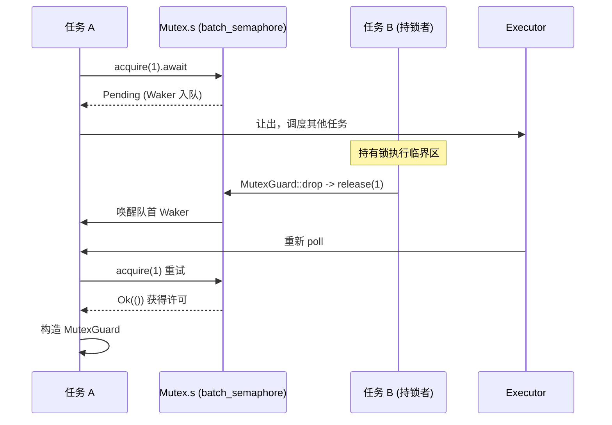

# Back to top ↑

Book progress: Chapter 7 / 14

# Verification status: FACT line numbers truly anchored

## The previous chapter revealed how time is abstracted as a kind of I/O event, allowing timers and fd readiness to share the same park/unpark waiting entry point. However, when multiple tasks compete for the same lock or pass messages through channels, the object being waited on is no longer an fd or a clock, but another task's state change. This chapter enters the tokio::sync family to find out where a lock().await or recv().await actually stores the Waker when blocking, and how it is rescheduled when awakened.

`std::sync::Mutex`Why asynchronous Mutex cannot reuse std's implementation`lock()`Intuitive model: from "occupying the seat" to "yielding the seat"**'s**when the lock is occupied will**block the current thread**—the thread is suspended by the operating system until the lock is released. This is disastrous in an async runtime: a worker thread may drive hundreds or thousands of tasks at the same time, and if it blocks waiting for a lock, all the other tasks it carries come to a halt. The core requirement of an async Mutex is: when waiting for the lock,`Pending`yield the thread

, register the fact that "I am waiting for this lock" into a queue, and then return`Mutex`, letting the executor run other tasks.**Built entirely on top of a semaphore**。

## Data structures and memory layout

`Mutex<T>`The fields of are extremely minimal:

[FACT:tokio/src/sync/mutex.rs:133-138]

```rust
pub struct Mutex {
    #[cfg(all(tokio_unstable, feature = "tracing"))]
    resource_span: tracing::Span,
    s: semaphore::Semaphore,
    c: UnsafeCell,
}
```

The three fields each serve a distinct purpose:`s`is a**semaphore with a permit count of 1**，`c`is`UnsafeCell<T>`the protected data wrapped by . Note that here`semaphore`is an alias for`batch_semaphore`[FACT:tokio/src/sync/mutex.rs:3-3], i.e., the underlying implementation, not the`sync::Semaphore`public wrapper layer.

`MutexGuard<'a, T>`only holds a reference to`Mutex`:

[FACT:tokio/src/sync/mutex.rs:151-157]

```rust
pub struct MutexGuard {
    #[cfg(all(tokio_unstable, feature = "tracing"))]
    resource_span: tracing::Span,
    lock: &'a Mutex,
}
```

There is a key design decision here:`MutexGuard` **does not hold a semaphore permit object**, only holds`&Mutex`. The action of releasing the lock happens in`Drop`, directly calling`self.lock.s.release(1)` [FACT:tokio/src/sync/mutex.rs:959-961]. This differs from`SemaphorePermit`which holds a`permits: usize`count and returns it on Drop—Mutex's permit count is always 1, so no counting is needed.

`Send`/`Sync`The bounds of are worth examining separately:

[FACT:tokio/src/sync/mutex.rs:258-259]

```rust
unsafe impl Send for Mutex where T: ?Sized + Send {}
unsafe impl Sync for Mutex where T: ?Sized + Send {}
```

`Sync`only requires`T: Send`rather than`T: Sync`—this is reasonable, because mutual exclusion guarantees that only one thread can touch`T`at a time. Transferring ownership of`T`across threads (`Send`) is sufficient; there is no need for`T`itself to be shareable (`Sync`). This is exactly why`Mutex<T>`can turn a non-`Sync``T`into`Sync`.

## Step-by-Step: A complete journey of`lock().await`

Scenario: Task A calls`mutex.lock().await`, and the lock is currently free.

Step one,`lock()`constructs an async block that first`self.acquire().await`, and upon success constructs`MutexGuard` [FACT:tokio/src/sync/mutex.rs:434-443]。

Step two,`acquire()`directly delegates to the semaphore:

[FACT:tokio/src/sync/mutex.rs:655-663]

```rust
async fn acquire(&self) {
    crate::trace::async_trace_leaf().await;
    self.s.acquire(1).await.unwrap_or_else(|_| {
        unreachable!()
    });
}
```

`unwrap_or_else(|_| unreachable!())`This comment reveals the design constraint: Mutex never explicitly closes the semaphore and holds it exclusively, so`acquire`will never return`Err`. This eliminates the "semaphore closed" error path at the type level.

Step three, if the lock is occupied,`s.acquire(1)`returns`Pending`, and the current task's Waker is registered into the semaphore's wait queue.**Where is the Waker stored?**The answer lies in`batch_semaphore`'s wait queue (the source material for this chapter does not expand on that file, but its role is: each waiter holds a Waker, queued in FIFO order).

Step four, when task B, which holds the lock, releases it,`MutexGuard::drop`calls`s.release(1)` [FACT:tokio/src/sync/mutex.rs:965-975], the semaphore hands the permit to the head waiter and wakes its Waker, task A is rescheduled,`acquire`returns`Ok`, constructing`MutexGuard`。

The entire flow can be depicted with the following sequence diagram:



## Design considerations: FIFO fairness and cancellation safety

The documentation explicitly states that Tokio's Mutex guarantees FIFO[FACT:tokio/src/sync/mutex.rs:20-22]. This fairness comes from the underlying semaphore's queuing semantics. The cost of fairness is: a`lock`being cancelled (e.g., losing in`select!`) will cause you to**lose your position in the queue** [FACT:tokio/src/sync/mutex.rs:415-419]. This is not a bug, but an inevitability of FIFO queues—cancellation means removal from the queue, and re-`lock`requires re-queuing.

Another counterintuitive design is that**does not poison**（no poisoning）。`std::sync::Mutex`marks itself as poisoned when the lock-holding thread panics, and subsequent`lock`returns`Err`. Tokio's Mutex does not do this: when the lock holder panics, the lock is released normally[FACT:tokio/src/sync/mutex.rs:122-125]. The documentation warns that if the panic is caught, the protected data may be in an inconsistent state. This is a pragmatic trade-off in async scenarios—a panic in an async task usually means task termination, and a poisoning mechanism would only add complexity.

`MutexGuard::map`The series of methods is worth mentioning. It allows downgrading an entire`MutexGuard<T>`to a`MappedMutexGuard<U>`that only protects a certain subfield. In implementation, it first uses a closure to compute the subfield pointer`data`, then through`skip_drop`decomposes the original guard into a`MutexGuardInner`that does not trigger Drop, and finally constructs a new guard[FACT:tokio/src/sync/mutex.rs:869-883]。`skip_drop`using`ManuallyDrop` + `ptr::read`to transfer field ownership, avoiding`Drop`being called twice[FACT:tokio/src/sync/mutex.rs:827-836]. This is the classic Rust technique of "transferring ownership without triggering destruction."

# Semaphore: How permit counting and wait queues implement backpressure

## Intuitive model: Parking lot spaces

A semaphore is like a parking lot:`acquire`is driving in—if there's a space, you enter; if not, you queue at the entrance;`release`is driving out—when a space frees up, the car at the head of the queue is notified to enter. The permit count is the total number of spaces,`acquire_many(n)`is a large vehicle occupying n spaces.

## Data structures and memory layout

The public`Semaphore`is just a thin wrapper around the underlying`batch_semaphore::Semaphore`:

[FACT:tokio/src/sync/semaphore.rs:427-432]

```rust
pub struct Semaphore {
    ll_sem: ll::Semaphore,
    #[cfg(all(tokio_unstable, feature = "tracing"))]
    resource_span: tracing::Span,
}
```

`SemaphorePermit<'a>`holds a semaphore reference and a permit count:

[FACT:tokio/src/sync/semaphore.rs:442-445]

```rust
pub struct SemaphorePermit {
    sem: &'a Semaphore,
    permits: usize,
}
```

`permits`The field is the key to understanding`forget`/`merge`/`split`.`forget`sets`permits`to zero[FACT:tokio/src/sync/semaphore.rs:1193-1195], so that on Drop it returns 0 permits—equivalent to "permanently consuming" those permits.`split`cuts n permits from the current permits for the new permit[FACT:tokio/src/sync/semaphore.rs:1260-1271]。`merge`merges another permit's count in, and asserts that both come from the same semaphore[FACT:tokio/src/sync/semaphore.rs:1230-1240]。

> **[Design Inference & Architectural Trade-offs]**
> `MAX_PERMITS`is`usize::MAX >> 3` [FACT:tokio/src/sync/semaphore.rs:476-479]. Why shift right by 3 bits? The underlying`batch_semaphore`needs to encode state flags (such as a closed flag) in the high bits, so the available permit count is limited to the low bits, leaving the high bits for flags. This is a common technique for packing "count + state" into a single`usize`.

## Step-by-Step: Permit flow of acquire and release

Scenario: The semaphore starts with 2 permits, task A`acquire()`, task B`acquire_many(2)`。

`acquire()`delegates to`ll_sem.acquire(1)`, and upon success constructs`SemaphorePermit { permits: 1 }` [FACT:tokio/src/sync/semaphore.rs:614-631]。`acquire_many(2)`similarly, but passes 2[FACT:tokio/src/sync/semaphore.rs:661-679]。

If permits are insufficient,`ll_sem.acquire(n)`returns`Pending`, and the Waker is enqueued. There is a fairness detail here: the documentation points out that if the head of the queue is a`acquire_many(5)`and only 3 permits remain, even if a`acquire(1)`behind it could be satisfied immediately, it must wait—because the large vehicle at the head occupies the queue[FACT:tokio/src/sync/semaphore.rs:19-24]. This is the cost of strict FIFO, avoiding starvation.

The release path is in Drop:

[FACT:tokio/src/sync/semaphore.rs:1402-1404]

```rust
impl Drop for SemaphorePermit {
    fn drop(&mut self) {
        self.sem.add_permits(self.permits);
    }
}
```

`add_permits`delegates to`ll_sem.release(n)` [FACT:tokio/src/sync/semaphore.rs:568-570], and the underlying layer returns the permit to the wait queue, waking waiters that can accumulate enough permits.

Regarding memory ordering, the documentation gives a strong guarantee: acquire, release, and close are all`AcqRel`operations, totally ordered with respect to each other, equivalent to those on a single atomic variable`AcqRel` [FACT:tokio/src/sync/semaphore.rs:35-42]. This means that a write that "writes data first and then releases the permit" is visible to a task that "acquires the permit later"—the semaphore can safely transfer data between tasks.

## Design considerations: close and backpressure

`close()`causes all waiters to receive`AcquireError`, and subsequent`try_acquire`returns`Closed` [FACT:tokio/src/sync/semaphore.rs:1161-1163]. This is the foundation of graceful shutdown: when the receiver no longer needs data, closing the semaphore allows all blocked senders to fail and return immediately, instead of waiting forever.

The essence of backpressure is clearest in mpsc. As we will see in the next section, mpsc's capacity control is implemented with a semaphore whose permit count equals the buffer size.

# Channel family: different trade-offs between waiter queues and Waker wakeups

## Intuitive model: four kinds of channels, four waiting strategies

`oneshot`is a "one-shot envelope"—it can deliver only one message, and the sender does not wait (`send`is synchronous), while the receiver`await`waits for the message.`mpsc`is a "bounded conveyor belt"—the sender waits when the belt is full, and the receiver waits when it is empty; capacity is controlled by a semaphore.`broadcast`and`watch`are "broadcast loudspeakers"—one sender, multiple receivers, but the two handle "falling behind" in completely different ways.

The source material in this section focuses on`oneshot`and`mpsc::bounded`, and we will break them down one by one.

## oneshot: a minimal handshake encoded with state bits

`oneshot`'s`Inner`structure is the core of understanding its design:

[FACT:tokio/src/sync/oneshot.rs:386-409]

```rust
struct Inner {
    state: AtomicUsize,
    value: UnsafeCell>,
    tx_task: Task,
    rx_task: Task,
}
```

`state`is a`AtomicUsize`, using bit flags to encode the entire channel state. The four flag bits are defined at the end of the file:

[FACT:tokio/src/sync/oneshot.rs:1488-1505]

```rust
const RX_TASK_SET: usize = 0b00001;
const VALUE_SENT: usize = 0b00010;
const CLOSED: usize = 0b00100;
const TX_TASK_SET: usize = 0b01000;
```

`value`is`UnsafeCell<Option<T>>`，`tx_task`and`rx_task`are`Task`types, internally`UnsafeCell<MaybeUninit<Waker>>` [FACT:tokio/src/sync/oneshot.rs:411-411]. Note`MaybeUninit`—the Waker may be uninitialized, and whether it is valid is determined by the`state`in`RX_TASK_SET`/`TX_TASK_SET`bit[FACT:tokio/src/sync/oneshot.rs:396-399]。

**The essence of this design**：`VALUE_SENT`The bit not only indicates "the value has been sent," but also determines ownership of access to`UnsafeCell`. The comment is very explicit[FACT:tokio/src/sync/oneshot.rs:1491-1496]: if`VALUE_SENT`is set,`UnsafeCell`can only be accessed by the receiver; if not set, it can only be accessed by the sender. This uses a single atomic bit to implement lock-free ownership transfer, avoiding an extra lock.

`send`'s flow:

[FACT:tokio/src/sync/oneshot.rs:622-646]

```rust
pub fn send(mut self, t: T) -> Result {
    let inner = self.inner.take().unwrap();
    inner.value.with_mut(|ptr| unsafe {
        *ptr = Some(t);
    });
    if !inner.complete() {
        unsafe {
            return Err(inner.consume_value().unwrap());
        }
    }
    Ok(())
}
```

First write the value into`UnsafeCell`(at this point`VALUE_SENT`is not set, so the receiver will not access it), then call`complete()`to try to set`VALUE_SENT`。`complete()`is a CAS loop:

[FACT:tokio/src/sync/oneshot.rs:1516-1549]

```rust
fn set_complete(cell: &AtomicUsize) -> State {
    let mut state = cell.load(Ordering::Relaxed);
    loop {
        if State(state).is_closed() {
            break;
        }
        match cell.compare_exchange_weak(
            state, state | VALUE_SENT, Ordering::AcqRel, Ordering::Acquire,
        ) {
            Ok(_) => break,
            Err(actual) => state = actual,
        }
    }
    State(state)
}
```

Why use CAS instead of a simple`fetch_or`? The comment explains it clearly[FACT:tokio/src/sync/oneshot.rs:1517-1529]: if the channel is already`CLOSED`, then**must not**set`VALUE_SENT`again. Because once it is set, the receiver will think it can access`UnsafeCell`, while the sender is preparing to take the value back (`consume_value`), and simultaneous access from both sides would cause a data race. So the CAS loop breaks early when it sees`CLOSED`, without setting the bit.

`complete()`After`RX_TASK_SET`returns, if the bit was successfully set and

[FACT:tokio/src/sync/oneshot.rs:1300-1315]

```rust
fn complete(&self) -> bool {
    let prev = State::set_complete(&self.state);
    if prev.is_closed() {
        return false;
    }
    if prev.is_rx_task_set() {
        unsafe {
            self.rx_task.with_task(Waker::wake_by_ref);
        }
    }
    true
}
```

Copy`poll_recv`The receiver's

[FACT:tokio/src/sync/oneshot.rs:1317-1384]

is the core of the state machine:`is_complete()`It first loads the state; if`consume_value`then directly`is_closed()`return; if`Err`return`is_rx_task_set()`; otherwise enter the "register Waker" branch. When registering, first check`will_wake`; if it is already set and`is_complete()`determines it is the same Waker, do not set it again; if different, first unset and then set. There is a subtle race handling here: after unset, if it is found that**has become true, the flag bit must be** [FACT:tokio/src/sync/oneshot.rs:1342-1344]set back again

, otherwise the Waker will leak on Drop (because Drop relies on the flag bit to determine whether to drop the Waker).`poll_closed`This "unset then set again" pattern also appears in[FACT:tokio/src/sync/oneshot.rs:839-848], and is the standard technique oneshot uses to handle concurrent wakeups.

## mpsc::bounded: semaphore-driven backpressure

mpsc's capacity control is entirely delegated to the semaphore.`channel`The function creates a semaphore whose permit count equals the buffer:

[FACT:tokio/src/sync/mpsc/bounded.rs:159-171]

```rust
pub fn channel(buffer: usize) -> (Sender, Receiver) {
    assert!(buffer > 0, "mpsc bounded channel requires buffer > 0");
    let semaphore = Semaphore {
        semaphore: semaphore::Semaphore::new(buffer),
        bound: buffer,
    };
    let (tx, rx) = chan::channel(semaphore);
    let tx = Sender::new(tx);
    let rx = Receiver::new(rx);
    (tx, rx)
}
```

`Semaphore`is an internal mpsc wrapper that holds both the underlying semaphore and`bound`(maximum capacity)[FACT:tokio/src/sync/mpsc/bounded.rs:176-179]。`bound`is used for`max_capacity`queries, while`available_permits`gives the current capacity[FACT:tokio/src/sync/mpsc/bounded.rs:591-593]。

The send path`send`first`reserve`then`send`：

[FACT:tokio/src/sync/mpsc/bounded.rs:816-824]

```rust
pub async fn send(&self, value: T) -> Result> {
    match self.reserve().await {
        Ok(permit) => {
            permit.send(value);
            Ok(())
        }
        Err(_) => Err(SendError(value)),
    }
}
```

`reserve`Internally calls`reserve_inner(1)`, which first checks`n > max_capacity`and directly returns an error, then`acquire(n)` [FACT:tokio/src/sync/mpsc/bounded.rs:1272-1311]. There is an ingenious`WakeReceiverOnDrop`guard here:

[FACT:tokio/src/sync/mpsc/bounded.rs:1286-1301]

```rust
struct WakeReceiverOnDrop {
    chan: &'a chan::Tx,
}
impl Drop for WakeReceiverOnDrop {
    fn drop(&mut self) {
        use chan::Semaphore;
        let semaphore = self.chan.semaphore();
        if semaphore.is_closed() && semaphore.is_idle() {
            self.chan.wake_rx();
        }
    }
}
```

The comment explains the motivation[FACT:tokio/src/sync/mpsc/bounded.rs:1279-1285]: if`reserve`is canceled after acquiring partial permits (for example,`select!`loses), the underlying`Acquire`will return these permits on Drop, but**will not**notify the receiver like`Permit`does. If the channel is already closed and idle at this point, the receiver may never receive the "channel closed" notification. This guard makes up for that wakeup on Drop. On success, use`mem::forget(guard)`to cancel the guard[FACT:tokio/src/sync/mpsc/bounded.rs:1306-1306], because the success path has`Permit`take over the notification responsibility.

`Permit`'s Drop does the same thing:

[FACT:tokio/src/sync/mpsc/bounded.rs:1732-1745]

```rust
impl Drop for Permit {
    fn drop(&mut self) {
        use chan::Semaphore;
        let semaphore = self.chan.semaphore();
        semaphore.add_permit();
        if semaphore.is_closed() && semaphore.is_idle() {
            self.chan.wake_rx();
        }
    }
}
```

`Permit::send`uses`mem::forget`to skip Drop, avoiding returning permits[FACT:tokio/src/sync/mpsc/bounded.rs:1721-1728]。

The receive path`recv`uses`poll_fn`to wrap`chan.recv(cx)` [FACT:tokio/src/sync/mpsc/bounded.rs:243-246]。`poll_recv`and directly delegates to[FACT:tokio/src/sync/mpsc/bounded.rs:650-652]. The real waiter queue logic is in the`chan`module (not covered in this chapter), but it can be inferred: the receiver Waker is stored in`chan::Rx`, and is woken when the sender`send`.

`try_send`shows the non-blocking path:

[FACT:tokio/src/sync/mpsc/bounded.rs:924-934]

```rust
pub fn try_send(&self, message: T) -> Result> {
    match self.chan.semaphore().semaphore.try_acquire(1) {
        Ok(()) => {}
        Err(TryAcquireError::Closed) => return Err(TrySendError::Closed(message)),
        Err(TryAcquireError::NoPermits) => return Err(TrySendError::Full(message)),
    }
    self.chan.send(message);
    Ok(())
}
```

`try_acquire`The two errors of`Closed`map precisely to`Full`and

## , distinguishing the two kinds of failure: "channel closed" and "buffer full."

Design considerations: cancellation safety and message loss[FACT:tokio/src/sync/mpsc/bounded.rs:776-784]：`send`The mpsc documentation repeatedly emphasizes cancellation safety`select!`When**loses in**, the message will be discarded`reserve`. To avoid loss, you must use`Permit`to obtain`send`and then`Permit`—because`send`has already reserved capacity,

`recv`is synchronous and will not be interrupted.[FACT:tokio/src/sync/mpsc/bounded.rs:199-204]is cancellation-safe`recv`: if`select!`loses in`recv`, it guarantees that no message is consumed. This is because`poll_recv`'s`Ready`，`Pending`returns only when a message is actually obtained

`oneshot`and does not touch the queue when`Receiver`.[FACT:tokio/src/sync/oneshot.rs:246-251]'s`oneshot`as a Future is also cancellation-safe`send`. But note:`Err`'s

# is synchronous, so there is no problem of "send being canceled"—either it is sent out, or

**Pitfall 1: Using an async Mutex to protect pure data.**The documentation explicitly recommends[FACT:tokio/src/sync/mutex.rs:26-36]: if what is being protected is pure data (with no`.await`requirement), use`std::sync::Mutex`or`parking_lot`instead, which are faster. The overhead of an async Mutex lies in the atomic operations of the semaphore and possible task scheduling. Only when you need to`.await`while holding the lock (for example, holding the lock to access a database connection) should you use an async Mutex.

**Pitfall 2: Holding the lock across`.await`causes deadlock.**This is the most dangerous trap of the async Mutex. If task A holds the lock and then`.await`an event that requires task B to complete, while task B is waiting for this lock, a deadlock occurs.`std::sync::Mutex`The guard of`Send`is not`.await`(in movable tasks), and the compiler will prevent holding across`Send` [FACT:tokio/src/sync/mutex.rs:314-314]; but the guard of an async Mutex is

**, and the compiler will not stop you, so you need to ensure yourself that no circular wait is formed.`reserve`Pitfall 3:`send`。** `Permit`forgetting[FACT:tokio/src/sync/mpsc/bounded.rs:1732-1745]'s Drop will return the permit

**, so capacity will not leak. But if the channel is already closed and idle, Drop will wake the receiver—this wakeup is necessary, otherwise the receiver might never receive the close notification.`oneshot`Pitfall 4:`poll`'s`Pending`。**may falsely[FACT:tokio/src/sync/oneshot.rs:236-242]The documentation states`poll`: even if the message has been sent,`Pending`may still return

**. This is not a bug, but a normal phenomenon under a concurrency race—the caller will be woken to retry, the message will not be lost, only delayed.`forget_permits`Pitfall 5:** `forget_permits(n)`'s semantics.[FACT:tokio/src/sync/semaphore.rs:576-578]Attempts to decrease n permits and returns the actual number decreased

# . It does not block, nor does it wake waiters—it simply "swallows" permits. Used to dynamically shrink the semaphore capacity.

Chapter Summary`tokio::sync`This chapter reveals**'s core pattern:**。

- `Mutex`All async wait primitives are built on "waiter queue + Waker wakeup", and the specific implementation of the queue varies by scenario`MutexGuard`Reuses a semaphore with a permit count of 1,`release(1)`only holds a reference, and on Drop
- `Semaphore`, FIFO fair but does not poison.`SemaphorePermit`is permit count + wait queue,`permits`uses`forget`/`merge`/`split`，`MAX_PERMITS`counting to support
- `oneshot`right-shifting by 3 bits to reserve space for state flags.`AtomicUsize`uses a single`VALUE_SENT`'s bit flags to encode state,`UnsafeCell`bits simultaneously determine`CLOSED`'s access ownership, and the CAS loop prevents setting after
- `mpsc::bounded`.`WakeReceiverOnDrop`uses a semaphore whose permit count equals the buffer to implement backpressure,

# the guard handles wakeup compensation on cancellation.

Chapter Review and Self-Test`set_complete`Q: If`fetch_or(VALUE_SENT)`'s CAS loop were changed to a simple

**, in what concurrency scenario would a data race be triggered?**：`set_complete`Reference Analysis`fetch_or`The reason[FACT:tokio/src/sync/oneshot.rs:1517-1529]uses a CAS loop instead of`VALUE_SENT`is stated in the comments`CLOSED`: it must check`fetch_or`before setting`close()`. If changed to an unconditional`CLOSED` [FACT:tokio/src/sync/oneshot.rs:1569-1574], consider this timing: the receiver first calls`send`to set`fetch_or(VALUE_SENT)`, then the sender subsequently`VALUE_SENT`writes the value and`CLOSED`. At this point`poll_recv`and`is_complete()`are set simultaneously, the receiver's`consume_value`sees[FACT:tokio/src/sync/oneshot.rs:1325-1330]as true and will call`complete()`to take the value`prev.is_closed()`; while after the sender's`consume_value`returns, because[FACT:tokio/src/sync/oneshot.rs:1300-1315]is true, it will call`UnsafeCell`to take the value back`CLOSED`. Both sides access`VALUE_SENT`simultaneously, a data race. The CAS loop breaks early upon discovering

Q: `reserve_inner`, without setting`WakeReceiverOnDrop`, thereby guaranteeing the invariant that "after closing, the sender has exclusive access."`mem::forget`In`forget`, the

**guard uses**to skip on the success path; what happens if this[FACT:tokio/src/sync/mpsc/bounded.rs:1290-1298]is removed?`acquire(n)`Reference Analysis`Ok`: the guard's Drop logic is "if the semaphore is already closed and idle, wake the receiver"`Permit`. On the success path,`Permit`returns`reserve_inner`, the caller obtains the permit and will construct`is_idle`, and`Permit`is responsible for the subsequent notification duty. If the guard is not removed, the guard will Drop when the function returns, and will additionally check once for "closed and idle"—but at this point the permit is already held by the caller of`mem::forget`, so the semaphore is not idle (`forget`is false), so in fact it will not wake twice. But more critically, the semantics are clear: the wakeup responsibility on the success path should be entirely borne by`acquire`, and the guard is only responsible for compensation on the "cancel/failure" path.`Ok`explicitly expresses the intent that "this path does not need the guard." If`Permit`is removed and the semaphore happens to be in the boundary state of "closed and idle" (for example,

returns`MutexGuard`but the permit has not yet been taken over by`SemaphorePermit`), it may produce one extra wakeup—although it will not cause an error, it wastes one scheduling.

**Q: If**were changed to hold a semaphore permit object (like`MutexGuard`), what problems would be introduced?`&Mutex`Reference Analysis`self.lock.s.release(1)` [FACT:tokio/src/sync/mutex.rs:959-961]: currently`MutexGuard::map`only holds`MappedMutexGuard`, and on Drop calls[FACT:tokio/src/sync/mutex.rs:869-883]. If changed to hold a permit object, several problems would be introduced. First,`MappedMutexGuard`the series of methods need to decompose the guard into`&Semaphore`, protecting only the subfield[FACT:tokio/src/sync/mutex.rs:190-199]. Under the current design,`self.s.release(1)` [FACT:tokio/src/sync/mutex.rs:1252-1262]only needs to hold`MappedMutexGuard`and the subfield pointer`permits: usize`, and on Drop`MutexGuard`. If the guard held a permit object, then map would have to transfer ownership of the permit object, and`Send`/`Sync`'s field layout would become more complex. Second, the permit object usually carries a`unsafe impl`count, and for a Mutex this count is always 1, which is redundant. Third,[FACT:tokio/src/sync/mutex.rs:260-263]'s`map`。

boundary is already precisely controlled through`tokio::sync`, and holding a permit object would introduce additional trait constraints. The current design of "only holding a reference + manual release" is lighter and also easier to support`spawn_blocking`At this point, we have clearly seen`block_on`how, using the unified pattern of "waiter queue + Waker wakeup", it supports async waiting for Mutex, Semaphore, and various channels. But not all blocking can be made asynchronous—some operations (such as file system calls, CPU-intensive computation) will inherently block the thread. In the next chapter we will enter

The storage location of the Waker varies by primitive: Mutex/Semaphore store it in the underlying semaphore's wait queue, oneshot stores it in the Inner's tx_task/rx_task fields, and mpsc stores it in the chan module's send/receive queues. But the wakeup mechanism is unified: when state changes, the Waker is taken out and wake_by_ref is called, and the executor reschedules the task. At this point, the waiting and wakeup inside async primitives are clearly visible. However, not all code can be made async—the next chapter will explore how to bridge blocking operations with spawn_blocking, and how block_on drives Futures in non-async contexts.
