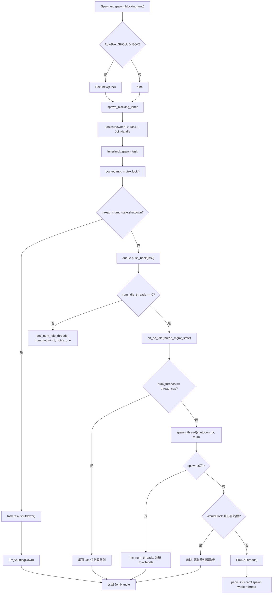
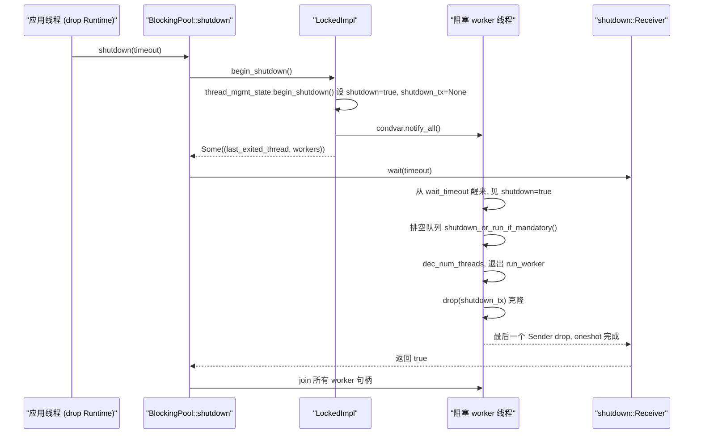

# Chapter 8: Blocking and Bridging: spawn_blocking Thread Pool and the Boundaries of block_on

In the previous chapter we saw that the key reason async Mutex and channels can wait without occupying a thread is that they store the Waker in the wait queue, and once the condition is satisfied the waker reschedules the task. But all of this presupposes that the task can voluntarily yield the thread when Pending. Once code calls std::fs::read, libsqlite3, or a pure CPU compression loop, it will monopolize the worker thread until it returns, during which all other tasks on that thread starve. Tokio's solution is to outsource such work to a separate blocking thread pool, and use block_on to drive Futures in non-async contexts. This chapter dissects these two boundaries.

# 8.1 Memory Layout of the Blocking Thread Pool: Inner and the Dual-Implementation Queue

**Intuitive Model**：`spawn_blocking`The thread pool is like a restaurant's "outsourced helper pool." The front-of-house waiters (worker threads) only handle taking orders and delivering dishes; when they encounter a dish that needs slow stewing, they write a work order and toss it into the kitchen's pass-through window (queue), and the helpers (blocking threads) take orders from the window. Without this pool, the waiters would have to cook themselves, and the whole restaurant would grind to a halt.

**Core Structures**. The entire pool is held by`BlockingPool`which stores only two things: a cloneable`Spawner`(submission entry) and a`shutdown_rx`(shutdown signal receiver)[FACT:tokio/src/runtime/blocking/pool.rs:20-23]。`Spawner`internally is`Arc<Inner>`, all submitters share the same state[FACT:tokio/src/runtime/blocking/pool.rs:26-28]。

`Inner`is the entire state of the pool, and its fields are worth examining one by one[FACT:tokio/src/runtime/blocking/pool.rs:77-104]：

- `inner_impl: InnerImpl`: the implementation of queue + notification + lock topology, which is an enum with`Locked`and`Sharded`two variants[FACT:tokio/src/runtime/blocking/pool.rs:107-110]. This is the most critical abstraction in this chapter—it unifies the two topologies of "single-lock queue" and "sharded queue" under one interface.
- `thread_cap: usize`: the upper limit on the number of threads, i.e.`max_blocking_threads`。
- `scheduler_threads: usize`: the number of scheduler worker threads, used to subtract in metrics so that`num_blocking_threads`only counts blocking threads[FACT:tokio/src/runtime/blocking/pool.rs:455-460]。
- `keep_alive: Duration`: the idle thread survival duration, default`KEEP_ALIVE = 10s` [FACT:tokio/src/runtime/blocking/pool.rs:231]。
- `metrics: SpawnerMetrics`: three atomic counters—`num_threads`、`num_idle_threads`、`queue_depth` [FACT:tokio/src/runtime/blocking/pool.rs:31-35]。

> **[Design Inference & Architectural Trade-offs]**
> **Why use atomic counters instead of fields inside the lock?** `num_idle_threads`is read on the hot path of`spawn_task`(to determine whether idle threads need to be woken); if it were hidden inside`Mutex`, every submission would have to acquire the lock first and then read. By making it`MetricAtomicUsize`, the submission path can do a quick check first without holding the queue lock. The cost is that there is no atomicity guarantee between these counts and the queue state, so the code uses the`num_notify`counter to compensate—see below.

**Thread Management State**。`ThreadManagementState`is extracted separately for reuse by both queue implementations[FACT:tokio/src/runtime/blocking/pool.rs:135-150]：

- `shutdown: bool`: shutdown flag.
- `shutdown_tx: Option<shutdown::Sender>`: each worker thread holds a clone, and after all are dropped`shutdown_rx`receives the notification.
- `last_exiting_thread: Option<JoinHandle<()>>`: the handle of the last thread that exited due to timeout.
- `worker_threads: HashMap<usize, JoinHandle<()>>`: the handles of all surviving workers.
- `worker_thread_index: usize`: a monotonically increasing thread ID allocator.

`last_exiting_thread`The design motivation of  is clearly stated in the comments: a thread that exits due to timeout will join the previous thread that exited due to timeout, avoiding Valgrind false positives[FACT:tokio/src/runtime/blocking/pool.rs:135-150]。`worker_timed_out`is exactly the implementation of this chained join—it removes its own handle and swaps out the old`last_exiting_thread`to return to the caller for joining[FACT:tokio/src/runtime/blocking/pool.rs:172-178]。

**Task Wrapping**. What is stored in the queue is`Task`, which wraps a`UnownedTask<BlockingSchedule>`and a`Mandatory`flag[FACT:tokio/src/runtime/blocking/pool.rs:187-191]。`Mandatory`determines whether the task is discarded or forcibly executed on shutdown:`shutdown_or_run_if_mandatory`calls`NonMandatory`when`shutdown()`, and calls`Mandatory`when`run()` [FACT:tokio/src/runtime/blocking/pool.rs:223-228]. This is the difference between`spawn_blocking`(non-forced) and`spawn_mandatory_blocking`(forced, used by fs)[FACT:tokio/src/runtime/blocking/pool.rs:233-265]。

**Memory Layout of the Single-Lock Implementation**。`LockedImpl`is the most primitive topology: one`Mutex<LockedInner>`plus one`Condvar` [FACT:tokio/src/runtime/blocking/pool.rs:113-116]。`LockedInner`contains`VecDeque<Task>`、`num_notify: u32`and`thread_mgmt_state` [FACT:tokio/src/runtime/blocking/pool.rs:118-124]. Note that`num_notify`and`thread_mgmt_state`are under the same lock, while`num_idle_threads`is an atomic outside the lock—this hybrid layout of "part of the state inside the lock, part outside" is precisely the source of all the concurrency subtleties that follow.

# 8.2 Submission Path: From spawn_blocking to Thread Wakeup

**Scenario**: an async task calls`tokio::task::spawn_blocking(move || heavy_compute(data))`, what happens at this moment?

**Step 1: Boxing Decision and Task Construction**。`Spawner::spawn_blocking`first measures the closure size`fn_size`, then based on`AutoBox::<F>::SHOULD_BOX`decides whether to`Box`the closure[FACT:tokio/src/runtime/blocking/pool.rs:359-389]. This is Tokio's general "auto-box large Futures" strategy: box when the closure is too large, to avoid bloating the task struct.

Entering`spawn_blocking_inner`, first allocate a task ID, then use`blocking_task`to wrap the closure into a Future, and finally use`task::unowned`to construct`UnownedTask`and`JoinHandle` [FACT:tokio/src/runtime/blocking/pool.rs:440-449]. Note that what is returned here is the`(JoinHandle<R>, Result<(), SpawnError>)`tuple—the handle and the submission result are returned separately.

**Step 2: Three Ways to Handle the Submission Result**. Back in`spawn_blocking`, match on`spawn_result`[FACT:tokio/src/runtime/blocking/pool.rs:381-388]：

- `Ok(())`: normal, return the handle.
- `Err(ShuttingDown)`：**does not panic**, still returns a handle. The comment explains this is for compatibility—the handle will never resolve, but the caller won't crash because the runtime is shutting down.
- `Err(NoThreads(e))`: the OS cannot create a thread and no one in the pool takes over, so it panics directly.

**Step 3: Enqueue and wakeup decision**。`spawn_task`passes the`on_no_idle`closure to`InnerImpl::spawn_task`, and the concrete implementation decides when to call it[FACT:tokio/src/runtime/blocking/pool.rs:462-506]. Look at`LockedImpl::spawn_task`'s critical section[FACT:tokio/src/runtime/blocking/pool.rs:603-639]：

```rust
let mut locked = self.mutex.lock();

if locked.thread_mgmt_state.shutdown {
    task.task.shutdown();
    return Err(SpawnError::ShuttingDown);
}

locked.queue.push_back(task);
metrics.inc_queue_depth();

if metrics.num_idle_threads() == 0 {
    on_no_idle(&mut locked.thread_mgmt_state)?;
} else {
    metrics.dec_num_idle_threads();
    locked.num_notify += 1;
    self.condvar.notify_one();
}
```

There are two key points here. First, the shutdown check happens before enqueueing, and even if the task is`Mandatory`it is directly`shutdown()`—the comment explains: it was only scheduled after shutdown began, so discarding it is legal[FACT:tokio/src/runtime/blocking/pool.rs:614-620]. Second, the wakeup decision depends on the out-of-lock`num_idle_threads`: if it is 0, call`on_no_idle`to try to start a new thread; otherwise decrement the idle count and increment`num_notify`、`notify_one`。

**`num_notify`Why must it exist?**Because`Condvar`may produce spurious wakeups. If only`notify_one`is used without counting, a spuriously woken thread will mistakenly think there is a task to take, find the queue empty, and go back to sleep, while the thread that was actually woken may never receive the notification.`num_notify`turns "legal wakeup" into a countable token: the submitter`+1`, and the woken side only considers the wakeup legal when`num_notify != 0`and`-1` [FACT:tokio/src/runtime/blocking/pool.rs:674-684]。

**Step 4: Start a new thread**。`on_no_idle`The closure executes[FACT:tokio/src/runtime/blocking/pool.rs:462-506]while holding the queue lock. It first checks`num_threads == thread_cap`, and if the upper limit is reached it returns directly`Ok(())`—the task stays in the queue waiting for an existing thread to handle it, which is backpressure. Otherwise clone`shutdown_tx`, call`spawn_thread`to create a thread, and after success increment`num_threads`, increment`worker_thread_index`, and insert the handle into`worker_threads`。

`spawn_thread`Use`thread::Builder`to set the thread name and stack size, then spawn a closure: enter the runtime context`rt.enter()`, call`inner.run(id)`, and finally drop`shutdown_tx` [FACT:tokio/src/runtime/blocking/pool.rs:508-528]。

**Fault tolerance for OS thread creation failure**。`spawn_thread`may fail. The code classifies the error[FACT:tokio/src/runtime/blocking/pool.rs:488-500]: if it is`WouldBlock`(a temporary error, determined by`is_temporary_os_thread_error`) and there is already a blocked thread in the pool, then[FACT:tokio/src/runtime/blocking/pool.rs:750-752]silently ignore**—the task will eventually be taken by some currently busy thread. Otherwise return**, which ultimately causes a panic.`SpawnError::NoThreads`Use a control-flow diagram to summarize the decision branches of the submission path:

Copy



# Intuitive model

**: each blocking thread is a "standby helper." When there are orders, it works continuously (BUSY); when there are none, it naps (IDLE), and if it naps longer than**it goes off duty (timeout exit). Without timeout reclamation, the pool would permanently retain all threads created at peak times, wasting memory and kernel scheduling overhead.`keep_alive`Main loop structure

**is a**。`LockedImpl::run_worker`loop, internally alternating between the two phases BUSY and IDLE`'main`. Note: BUSY/IDLE here are[FACT:tokio/src/runtime/blocking/pool.rs:642-735]phases**within the loop, not explicit enum states, so the following is described with a flowchart rather than a state diagram.**BUSY phase

**: the inner**continuously takes tasks`while let Some(task) = locked.queue.pop_front()`. After taking one, decrement[FACT:tokio/src/runtime/blocking/pool.rs:655-661]drop the lock`queue_depth`，**, execute**, then reacquire the lock. The step of dropping the lock is crucial—a blocking task may run for a long time, and it must never be executed while holding the lock.`task.run()`IDLE phase

**: the queue is empty, increment**, set`num_idle_threads`, then enter the wait loop`is_counted_idle = true`. The core is[FACT:tokio/src/runtime/blocking/pool.rs:663-696], and after it returns, check three things:`condvar.wait_timeout(locked, keep_alive)`: legal wakeup. Decrement

1. `num_notify != 0`, set`num_notify`(because the submitter has already decremented`is_counted_idle = false`), break back to BUSY`num_idle_threads`2. Not shut down and timed out: call[FACT:tokio/src/runtime/blocking/pool.rs:674-684]。

to get the handle of the previous exited thread,`worker_timed_out`exit the loop`break 'main`3. Otherwise it is a spurious wakeup, continue waiting.[FACT:tokio/src/runtime/blocking/pool.rs:689-693]。

Queue draining on shutdown

**. If**is true, enter the draining logic`thread_mgmt_state.shutdown`: pop tasks one by one, drop the lock, call[FACT:tokio/src/runtime/blocking/pool.rs:698-710]—non-forced tasks are discarded, forced tasks execute as usual. Then break out of the main loop.`task.shutdown_or_run_if_mandatory()`Exit cleanup

**. Before the thread exits, decrement**. If`num_threads` [FACT:tokio/src/runtime/blocking/pool.rs:714]is true, also decrement`is_counted_idle`, and use`num_idle_threads`to assert there is no underflow`assert_ne!(prev_idle, 0)`. This assertion is a debug-time guardrail: once[FACT:tokio/src/runtime/blocking/pool.rs:716-726]accounting goes wrong, it will panic immediately here instead of letting the error propagate silently.`num_idle_threads`Finally, if shutting down and

(the last thread),`num_threads == 0`wakes up the shutdown initiator that may be waiting`notify_one`. Return[FACT:tokio/src/runtime/blocking/pool.rs:728-730], and`join_on_thread`joins before exiting`Inner::run`Shutdown handshake[FACT:tokio/src/runtime/blocking/pool.rs:755-771]。

**first calls**。`BlockingPool::shutdown`to get all worker handles`begin_shutdown`, sets the shutdown flag, drops[FACT:tokio/src/runtime/blocking/pool.rs:310-312]。`LockedImpl::begin_shutdown`, and wakes all waiting threads`shutdown_tx`、`notify_all`. Then[FACT:tokio/src/runtime/blocking/pool.rs:740-745]blocks waiting for`shutdown_rx.wait(timeout)`'s implementation is quite careful[FACT:tokio/src/runtime/blocking/pool.rs:324]。

`shutdown::Receiver::wait`: first handle[FACT:tokio/src/runtime/blocking/shutdown.rs:37-70]'s fast path and return false directly; then call`timeout == 0`to enter the blocking region, and if it fails and the current thread is panicking, return false; otherwise panic with the hint "cannot drop runtime in async context"`try_enter_blocking_region()`. Finally, depending on timeout, call[FACT:tokio/src/runtime/blocking/shutdown.rs:44-57]or`block_on_timeout`to drive that oneshot.`block_on`The mechanism of

`shutdown_tx`is: each worker thread holds a clone of`Arc<oneshot::Sender<()>>`. After all threads exit, all clones are dropped,[FACT:tokio/src/runtime/blocking/shutdown.rs:12-14]the count reaches zero,`Arc`is dropped,`oneshot::Sender`and`Receiver`receives the notification. This is the classic pattern of "Receiver is woken after all Senders are dropped."



# 8.4 block_on: driving a Future in a non-async context

**Intuitive model**：`block_on`is the runtime's "front door." It turns the current thread into a temporary executor, repeatedly polling the passed-in Future until completion. Without it,`main`functions cannot start any asynchronous code.

**Entry and boxing**。`Runtime::block_on`likewise first measures the size, decides whether to`SHOULD_BOX`based on`Box::pin`, then enters`block_on_inner` [FACT:tokio/src/runtime/runtime.rs:343-350]。`block_on_inner`. Inside there are two conditionally compiled trace wrappers (taskdump and tracing), then`self.enter()`enters the runtime context, and finally dispatches by scheduler type[FACT:tokio/src/runtime/runtime.rs:353-383]：

```rust
let _enter = self.enter();

match &self.scheduler {
    Scheduler::CurrentThread(exec) => exec.block_on(&self.handle.inner, future),
    Scheduler::MultiThread(exec) => exec.block_on(&self.handle.inner, future),
}
```

The two schedulers'`block_on`The semantics are different, and the documentation states this very clearly.[FACT:tokio/src/runtime/runtime.rs:302-320]：

- **Multi-threaded scheduler**: the Future runs in the context of the I/O driver and timer,`block_on`and after returning, tasks that have already been spawned continue to run.
- **Current-thread scheduler**：`block_on`can be called concurrently by multiple threads; the first caller takes ownership of the I/O and timer drivers, and other threads "hook into" it. After the first`block_on`completes, other threads can "steal" the driver.`block_on`After returning, tasks that have already been spawned are suspended, and calling`block_on`again will resume them.

**Key restriction: it cannot be called in an asynchronous context.**. The documentation explicitly states that`block_on`calling it in an asynchronous execution context will panic.[FACT:tokio/src/runtime/runtime.rs:321-324]. The reason is straightforward:`block_on`it blocks the current thread until the Future completes. If the current thread itself is a worker thread, it will block the entire executor—this is exactly`spawn_blocking`the problem that is meant to solve, so the two are mutually exclusive.

**Shutdown path**。`Runtime::drop`dispatches by scheduler type[FACT:tokio/src/runtime/runtime.rs:506-521]: the current-thread scheduler needs to first`try_set_current`enter the context and then shut down (ensuring tasks are dropped in the runtime context); the multi-threaded scheduler shuts down directly (the worker threads themselves are already in the context).`shutdown_timeout`Shut down the scheduler first, then shut down the blocking pool.[FACT:tokio/src/runtime/runtime.rs:457-461]，`shutdown_background`is equivalent to`shutdown_timeout(Duration::from_nanos(0))` [FACT:tokio/src/runtime/runtime.rs:494-496]。

# Design considerations, error recovery, and production pitfalls

**Why does`spawn_blocking`'s`ShuttingDown`not panic?** [FACT:tokio/src/runtime/blocking/pool.rs:383-384]The comment says it is for compatibility considerations.`spawn_blocking`returns`JoinHandle`rather than`Result`. If it panicked during shutdown, it would turn the predictable state of "the runtime is shutting down" into a crash. Returning a handle that never resolves means the caller`await`will hang forever—but at this point the runtime has already shut down, and the entire`block_on`will also exit, so in practice it will not leak permanently.

**`max_blocking_threads`'s backpressure semantics**. The default value is very large (512), because`spawn_blocking`is often used for file I/O. But the documentation warns: when running CPU-intensive tasks, use a semaphore to limit concurrency, otherwise a large number of threads will be created[FACT:tokio/src/task/blocking.rs:94-100]. Once the upper limit is reached, tasks queue in the queue, forming backpressure—but note that this backpressure only applies to the blocking pool and does not propagate back to the asynchronous scheduler.

**`spawn_blocking`cannot be canceled**. The documentation explicitly states:`abort`has no effect on blocking tasks that have already started running; the tasks will continue to run to completion[FACT:tokio/src/task/blocking.rs:106-120]. Only tasks that have not yet started may be prevented by abort. During shutdown, the runtime waits for all blocking tasks that have already started, and`shutdown_timeout`after the timeout, these threads will be leaked.

**`num_idle_threads`'s accounting trap**。`is_counted_idle`The existence of the flag shows that this count is very easy to get wrong. The submitting side decrements`num_idle_threads`when waking up, and the awakened side, after seeing`num_notify != 0`, sets`is_counted_idle = false`, avoiding a duplicate decrement[FACT:tokio/src/runtime/blocking/pool.rs:679-682]. If there is a bug in this path,`assert_ne!(prev_idle, 0)`will panic on exit[FACT:tokio/src/runtime/blocking/pool.rs:722-725]. If you see "`num_idle_threads`underflowed on thread exit" in production, it means the pool's accounting logic has been broken.

> **[Design Inference & Architectural Trade-offs]**
> **`last_exiting_thread`The cost of chained join**. A thread exiting due to timeout will join the previous thread that exited due to timeout[FACT:tokio/src/runtime/blocking/pool.rs:172-178]. This forms a join chain: each exiting thread must wait for the previous one to truly finish. In scenarios with high-frequency creation/destruction of blocking threads, this chain may become long, causing thread exit latency to accumulate. This is a trade-off made to avoid Valgrind false positives. Its impact in normal production environments is limited, but it is worth paying attention to under loads where threads frequently time out.

**`InnerImpl`The meaning of enum abstraction**. The comment explains that the behavior of the`Locked`variant is exactly the same as before the refactor, while the`Sharded`variant reserves a symmetric slot for a future concurrent queue[FACT:tokio/src/runtime/blocking/pool.rs:537-539]。`spawn_task`、`run_worker`、`begin_shutdown`. All three methods dispatch through the enum[FACT:tokio/src/runtime/blocking/pool.rs:548-582]. This design of "enum dispatch + each variant owning its own critical section" means that adding a new queue topology does not require changing the caller.

# Chapter summary

This chapter breaks down the two boundaries through which Tokio accommodates synchronous code.`spawn_blocking`delivers closures to an independent blocking thread pool:`Inner`it holds the queue, thread limit, keep-alive duration, and atomic metrics;`LockedImpl`it implements the queue with a single lock +`Condvar`,`num_notify`and the counter compensates for spurious wakeups; workers cycle between BUSY/IDLE, and after idle timeout they exit via chained join;`max_blocking_threads`once the upper limit is reached, tasks queue up to form backpressure.`block_on`drives Futures in a non-asynchronous context; the multi-threaded and current-thread schedulers have different semantics, and calling it in an asynchronous context is strictly forbidden. The shutdown path is triggered by`shutdown_tx`'s`Arc`count reaching zero, which triggers`oneshot`, implementing the handshake of "waking the shutdown initiator after all workers exit."

# Chapter reflection and self-test

Q1: If in`LockedImpl::spawn_task`the check for`if metrics.num_idle_threads() == 0`is changed to always true (that is, calling`on_no_idle`every time), what will happen in a high-concurrency submission scenario? Why?

**Reference analysis**：`on_no_idle`checks`num_threads == thread_cap`, and if the upper limit has not been reached, it creates a new thread[FACT:tokio/src/runtime/blocking/pool.rs:471-487]. If the check is always true, it will try to start a new thread even when there are idle threads, causing the thread count to rapidly hit`thread_cap`. More seriously, idle threads will not be woken by`notify_one`(because the`on_no_idle`branch is taken rather than the`else`branch's`num_notify += 1; notify_one` [FACT:tokio/src/runtime/blocking/pool.rs:627-636]), and tasks in the queue may go unprocessed until some new thread starts and discovers that the queue is non-empty. This creates a false-deadlock state of "threads maxed out but tasks still queued." The purpose of the original check is precisely this: when there are idle threads, wake them first and avoid unnecessary thread creation.

Q2: `LockedImpl::run_worker`Before executing`task.run()`in the BUSY phase, it will`drop(locked)` [FACT:tokio/src/runtime/blocking/pool.rs:657-658]. If this`drop`is removed, in what scenario will deadlock be triggered?

**Reference analysis**：`task.run()`executes the user closure, and the closure itself may very well call`spawn_blocking`again to submit a new task. The submission path`LockedImpl::spawn_task`'s first action is`self.mutex.lock()` [FACT:tokio/src/runtime/blocking/pool.rs:612]. If the worker holds the lock while executing the closure, the submission inside the closure will try to acquire the same lock, and`std::sync::Mutex`Non-reentrant, direct deadlock. Furthermore, holding the lock while executing long tasks will block all other submitters and workers from fetching tasks; even without deadlock, it will serialize the entire pool.`drop(locked)`It is necessary.

Q3: `shutdown::Receiver::wait`In`try_enter_blocking_region()`Returns false when it fails and is currently panicking; otherwise panics[FACT:tokio/src/runtime/blocking/shutdown.rs:44-57]. Why special-case panics? If this branch were removed, in what scenarios would problems arise?

**Reference analysis**：`try_enter_blocking_region`Failure means the current context is asynchronous, and blocking is not allowed. Normally it should panic to tell the user, "cannot drop runtime in an asynchronous context." But if the current thread is already panicking (`std::thread::panicking()`is true), panicking again would cause a double panic, and Rust's default behavior is to abort the process directly. Scenario: the user drops a Runtime inside an asynchronous task, and that task itself is already panicking for some other reason; then the shutdown triggered by drop causes a second panic. Returning false lets shutdown give up waiting, avoiding process abort and preserving the chance for the user to see the original panic information. This is a typical "panic safety" handling.

The blocking thread pool and block_on define the capability boundaries of the asynchronous runtime: the former isolates work that cannot yield the thread onto dedicated threads, while the latter allows non-async entry points to drive Futures. But these two boundaries are often not handwritten in code—in the next chapter we will enter the world of macros and see how #[tokio::main], select!, and join! generate this runtime code at compile time.
