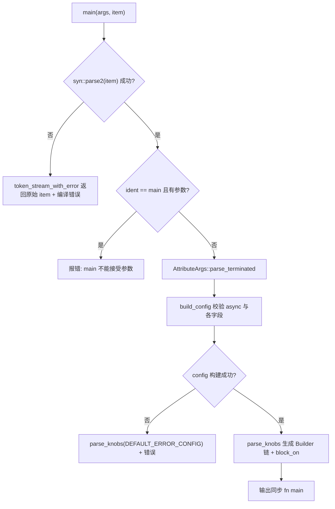
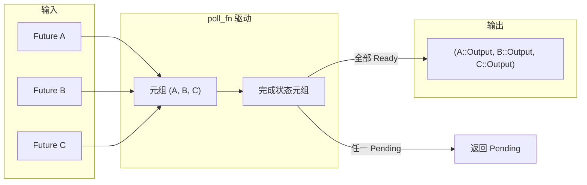

# Chapter 9: The Magic of Macros: The Code Generation Behind #[tokio::main], select!, and join!

In the previous chapter we saw`block_on`and how the blocking thread pool defines the capability boundaries of the asynchronous runtime, while users almost never handwrite these boundaries—they write`#[tokio::main]`、`select!`、`join!`, letting macros expand this boilerplate at compile time. Macros are Tokio's first layer of sugar for users, and also where runtime code is truly generated at compile time. This chapter focuses on the`tokio-macros`crate and`tokio/src/macros/select.rs`, dissecting the three most commonly used macro expansion paths, with emphasis on answering one question: after macro expansion, what does the real call chain look like, and why must the cancellation-safety semantics of`select!`be watched separately.

# 9.1 #[tokio::main]: Rewriting async fn into Runtime::block_on

**Intuitive model**：`#[tokio::main]`It is like a "renovation authorization form." You hand over a bare room (`async fn main`), and it lays the plumbing and wiring for you (builds the Runtime), installs the doors and windows (`enable_all`), and finally moves your original furniture (the function body) in. Without it, every`main`would have to handwrite`Builder::new_multi_thread().enable_all().build().unwrap().block_on(...)`, and boilerplate would drown the business logic.

## Data structures and memory layout

The macro itself does not produce runtime data structures, but the configuration it parses is placed into two structs.`Configuration`is the "mutable accumulator during parsing," and its fields are all`Option`, because attribute parameters may be omitted, repeated, or illegal[FACT:tokio-macros/src/entry.rs:74-84]. Note that`worker_threads`、`start_paused`、`unhandled_panic`all carry`Span`—this is to locate errors at the line the user wrote, rather than inside the macro[FACT:tokio-macros/src/entry.rs:74-84]。`FinalConfig`is the "validated immutable result,"`flavor`is no longer`Option`, because`build()`has already used`default_flavor`as a fallback[FACT:tokio-macros/src/entry.rs:55-62]。

`RuntimeFlavor`has only three variants:`CurrentThread`、`Threaded`、`Local` [FACT:tokio-macros/src/entry.rs:10-14]。`from_str`deliberately gives friendly errors for legacy names:`single_thread`indicates it should be called`current_thread`，`basic_scheduler`indicates it has been renamed,`threaded_scheduler`indicates it has been renamed[FACT:tokio-macros/src/entry.rs:17-27]. This is a typical design of macros as the "user's first point of contact": error messages are documentation.

## Step-by-Step expansion process

Scenario: the user writes`#[tokio::main(flavor = "multi_thread", worker_threads = 4)] async fn main() { ... }`。

Step one,`main`The entry first parses the item into the custom`ItemFn` [FACT:tokio-macros/src/entry.rs:577-580]. This`ItemFn`is not`syn::ItemFn`, but a parser implemented by Tokio itself, for the reason stated in the comments: it does not want to recursively parse the entire statement, and only performs lightweight parsing by "buffering by token tree and splitting on semicolons"[FACT:tokio-macros/src/entry.rs:720-764]. This avoids the overhead of building a complete AST for the function body inside the macro.

Step two,`build_config`validates whether the`async`keyword exists; if missing, it reports "the`async` keyword is missing" [FACT:tokio-macros/src/entry.rs:346-349]. Then it iterates over the attribute parameters and dispatches`worker_threads`、`flavor`、`start_paused`、`crate`、`unhandled_panic`、`name`to the corresponding setter[FACT:tokio-macros/src/entry.rs:369-399]. Note that`core_threads`is explicitly rejected with a message that it has been renamed[FACT:tokio-macros/src/entry.rs:379-382]。

Step three,`Configuration::build`performs cross-field consistency validation. There are three key constraints here:`worker_threads`only allows`multi_thread` [FACT:tokio-macros/src/entry.rs:197-217]；`start_paused`only allows`current_thread`/`local` [FACT:tokio-macros/src/entry.rs:219-229]；`unhandled_panic`likewise only allows`current_thread`/`local` [FACT:tokio-macros/src/entry.rs:231-241]. If the user selects`multi_thread`but the`rt-multi-thread`feature is not enabled, the error message differs depending on whether flavor was explicitly specified[FACT:tokio-macros/src/entry.rs:209-216]。

Step four,`parse_knobs`generates code. It first erases`asyncness` [FACT:tokio-macros/src/entry.rs:441], then chooses the builder starting point according to flavor:`CurrentThread`/`Local`uses`Builder::new_current_thread()`，`Threaded`uses`Builder::new_multi_thread()` [FACT:tokio-macros/src/entry.rs:468-477]。`Local`The special thing is that the build call is`build_local(Default::default())`rather than`build()` [FACT:tokio-macros/src/entry.rs:479-483]. Then it appends chained`.worker_threads(#v)`、`.start_paused(#v)`、`.unhandled_panic(...)`、`.name(#v)` [FACT:tokio-macros/src/entry.rs:485-497]。

as needed`last_block`：`return #rt.enable_all().#build.expect("Failed building the Runtime").block_on(body)` [FACT:tokio-macros/src/entry.rs:509-522]Step five, generate the final function body. The core is`return`. Note the explicit[FACT:tokio-macros/src/entry.rs:508]。

, whose comment points to tokio-rs/tokio#4636, to fix a type inference issue`async #body`Step six, the function body is wrapped as`!`and type-checked. On the non-test path, if the return type is not`impl Trait`and does not contain`if false { let _: &dyn Future<Output = #output_type> = &body; }`, it inserts[FACT:tokio-macros/src/entry.rs:551-571]for a compile-time assertion`pin!`Pin the body on the stack and convert it to`Pin<&mut dyn Future>`, with comments explaining this is to reduce`block_on`the compilation overhead of generic instantiation[FACT:tokio-macros/src/entry.rs:526-548]。



## Design considerations and production pitfalls

`main`and`test`share`parse_knobs`, but the default flavor differs:`test`defaults to`CurrentThread`，`main`defaults to`Threaded` [FACT:tokio-macros/src/entry.rs:91-94]. This explains why`#[tokio::test]`defaults to single-threaded—tests usually don't need multiple cores, and single-threaded is easier to reproduce.

An easily overlooked pitfall: after macro expansion, each function call creates a new Runtime. The documentation explicitly warns that if the function is called frequently, you should switch to Builder to reuse the Runtime[FACT:tokio-macros/src/lib.rs:31-35]. Using`#[tokio::main]`on an ordinary function is legal, but each call pays the cost of constructing a Runtime.

Another pitfall is`crate`renaming. When the user`use tokio as tokio1`, the`tokio::runtime::Builder`generated by default inside the macro cannot find the path, and you must explicitly`crate = "tokio1"` [FACT:tokio-macros/src/lib.rs:239-264]。`parse_knobs`in`crate_path`the default value of`Ident::new("tokio", ...)` [FACT:tokio-macros/src/entry.rs:456-462], which is exactly the root cause of errors in renaming scenarios.

# 9.2 select!: multi-branch polling, bitmask, and random fairness

**Intuitive model**：`select!`is like a "waiter watching multiple pickup windows at the same time." Whichever window serves food first, he takes that portion, and the queues at the other windows are discarded. Without it, users would have to hand-write`poll_fn`to put multiple Futures into a tuple and poll them one by one, and also handle the logic of "once one branch is ready, the other branches should be discarded."

## Data structures and memory layout

`select!`expands to generate a local module`__tokio_select_util`, containing an enum`Out`and a type alias`Mask` [FACT:tokio/src/macros/select.rs:615-619]。`Out`whose variant names are`_0`、`_1`... one per branch, plus a`Disabled`indicating that all branches are disabled[FACT:tokio-macros/src/select.rs:33-39]。`Mask`. The underlying type is dynamically selected according to the number of branches: ≤8 uses`u8`, ≤16 uses`u16`, ≤32 uses`u32`, ≤64 uses`u64`, and more than 64 directly panics[FACT:tokio-macros/src/select.rs:17-31]. This bitmask is`select!`the core state of : bit i being 1 means branch i has been disabled.

All Futures are stored in a tuple`futures`, and each element is first converted via`IntoFuture::into_future`[FACT:tokio/src/macros/select.rs:654-656]. Note that here`futures_init`is constructed first and then`into_future`one by one, with comments explaining this is to take advantage of temporary lifetime extension[FACT:tokio/src/macros/select.rs:641-646]. Then`let mut futures = &mut futures;`downgrades the tuple to a mutable reference, avoiding`poll_fn`the closure taking ownership[FACT:tokio/src/macros/select.rs:658-662]。

## Step-by-Step polling flow

Put it into context:`select! { v = stream1.next() => ..., v = stream2.next() => ..., else => break }`。

Step one, macro entry rule matching. If there is a`biased;`prefix,`start=0` [FACT:tokio/src/macros/select.rs:801-803]; otherwise`start`is a random expression`thread_rng_n(BRANCHES)` [FACT:tokio/src/macros/select.rs:805-809]. This is the source of fairness described in the documentation as "randomly selecting a branch to check first by default"[FACT:tokio/src/macros/select.rs:61-65]。

Step two, normalization. The tt-muncher normalizes each branch into the form`(skip) pat = fut, if cond => handler,``skip`, where`_`is a sequence of[FACT:tokio/src/macros/select.rs:770-793]。`skip`whose length equals the number of branches before that branch`futures_init.$($skip)*`, used both to generate tuple field access`count!`and to

compute the branch index.`if $c`Step three, precondition evaluation. For each branch's`disabled |= 1 << index` [FACT:tokio/src/macros/select.rs:631-636], if false, then`$fut`. Note: even if a branch is disabled, its[FACT:tokio/src/macros/select.rs:39-41]。

expression is still evaluated, it just won't be polled`poll_fn`Step four, enter the`ready!(poll_budget_available(cx))`closure. First check the cooperative budget:`Pending` [FACT:tokio/src/macros/select.rs:664-667], and if the budget is exhausted, return directly`select!`. This ensures

will not monopolize the worker.`for i in 0..BRANCHES`，`branch = (start + i) % BRANCHES` [FACT:tokio/src/macros/select.rs:680-685]Step five, loop`disabled & mask == mask`. For each branch: first check`continue` [FACT:tokio/src/macros/select.rs:694-699], and if disabled then`Pin::new_unchecked`; otherwise take that Future out of the tuple and wrap it with[FACT:tokio/src/macros/select.rs:701-707](safety depends on the Future being stored on the stack and not moved)`Ready(out)`; poll it,`disabled |= mask`then first[FACT:tokio/src/macros/select.rs:710-730]。

and then match the pattern`out`Step six, pattern matching. If`$bind`matches`Poll::Ready(Out::_i(out))` [FACT:tokio/src/macros/select.rs:727-733], return`continue`; if it does not match,[FACT:tokio/src/macros/select.rs:44-47]。

continue polling the other branches—this is exactly what step 5 of the documentation means by "if the pattern does not match, disable the current branch"`is_pending`Step seven, end of loop. If`Pending`is true, return`Out::Disabled` [FACT:tokio/src/macros/select.rs:740-745], otherwise all branches are invalid and return`match output`. The outer`Out::_i`maps`Disabled`to the corresponding handler,`else`maps to[FACT:tokio/src/macros/select.rs:749-755]。

```mermaid
flowchart TD
    start["poll_fn 闭包被调用"] --> budget{"poll_budget_available(cx)?"}
    budget -->|否| pending_budget["返回 Pending"]
    budget -->|是| init["is_pending = false; start = $start"]
    init --> loop{"i |否| check_pending{"is_pending?"}
    check_pending -->|是| pending["返回 Pending"]
    check_pending -->|否| disabled_out["返回 Out::Disabled"]
    loop -->|是| branch["branch = (start+i) % BRANCHES"]
    branch --> is_disabled{"disabled & mask == mask?"}
    is_disabled -->|是| next_i["i += 1"]
    is_disabled -->|否| poll_fut["Pin::new_unchecked(fut).poll(cx)"]
    poll_fut --> poll_res{"Poll 结果?"}
    poll_res -->|Pending| set_pending["is_pending = true; i += 1"]
    poll_res -->|Ready| disable["disabled |= mask"]
    disable --> pat_match{"out 匹配 $bind?"}
    pat_match -->|否| next_i
    pat_match -->|是| ready_out["返回 Out::_i(out)"]
    next_i --> loop
    set_pending --> loop
```

## Copy

**Design considerations and production pitfalls`Vec<bool>`？**Why use a bitmask instead of`disabled |= mask`? A bitmask is a single integer on the stack, with no heap allocation, and`select!`is a single instruction. For

**on the hot path, this avoids heap access on every iteration.**Why should a branch be disabled when the pattern does not match?`select!`This is the key difference between`Some(v) = stream.next() => ...`and a "simple race." Consider`stream.next()`, if`None`returns[FACT:tokio/src/macros/select.rs:198-223]。

**(end of stream), the pattern does not match, and that branch is permanently disabled, avoiding infinite polling of an already-finished stream. The documentation example relies on exactly this semantics to collect two streams until both end**：`select!`The true meaning of cancellation safety`read_exact`、`read_to_end`、`write_all`Once a branch is ready, the Futures of the other branches are dropped. If a dropped Future has already consumed data but has not yet returned, the data is lost. The documentation explicitly lists[FACT:tokio/src/macros/select.rs:119-124]as not cancellation safe`Mutex::lock`、`Semaphore::acquire`, while[FACT:tokio/src/macros/select.rs:126-133], due to queue fairness, cancellation loses the queue position`.await`. How to determine: find the`.await`point, and if restarting the function at[FACT:tokio/src/macros/select.rs:135-139]。

**`if`is still correct, then it is cancellation safe**The race-condition trap of preconditions`if !sleep.is_elapsed()`: the documentation gives a classic erroneous example—using`sleep`to guard the`is_elapsed()`branch, but`while`may become true between the`select!`check and[FACT:tokio/src/macros/select.rs:336-376], causing the timeout to be missed`if`. The correct approach is to remove`sleep`, let the`break` [FACT:tokio/src/macros/select.rs:378-405]。

**`biased;`branch always participate in polling, and after timeout**the cost of[FACT:tokio/src/macros/select.rs:67-74]: random RNG has a CPU cost, and some scenarios require a deterministic polling order`biased;`. But[FACT:tokio/src/macros/select.rs:75-81]。

# leaves the responsibility for fairness to the user: if one branch is always ready, later branches will starve

**9.3 join! and the engineering constraints of macro expansion**：`join!`Intuitive model`select!`is like "waiting for all deliveries to arrive at the same time." Unlike`Ready`, which cancels the rest as soon as one arrives first, it aggregates the`poll_fn`values of all Futures into a tuple. Without it, users would have to hand-write

## to maintain the completion state of each Future.

`join!`The expansion of is also based on storing Futures in a tuple, but the state is not a bitmask—it's a tuple of "completed values." After each Future completes, its value is taken out and stored in the result tuple, and the corresponding slot is marked as completed. Unlike`select!`,`join!`does not drop incomplete Futures—it must wait for all Futures to complete before returning.

## Step-by-Step Flow

`join!`The polling logic of shares the skeleton of "tuple storing Futures +`select!`driving" with`poll_fn`, but the semantics are opposite:`select!`is "return as soon as any is ready,"`join!`is "return only when all are ready." Each round of poll iterates over all incomplete Futures; if any returns`Pending`, the whole`Pending`; if all`Ready`, then aggregate and return.



## Design Reflections and Production Pitfalls

`join!`The cancellation safety semantics of differ from`select!`:`join!`When is dropped, all incomplete Futures are dropped, which can likewise lose data. But since`join!`does not actively cancel any branch, it will not, like`select!`, "cancel this branch because another branch is ready." The real risk lies in`join!`being cancelled as a whole by an outer`select!`or timeout.

`join!`The difference between and`try_join!`is worth noting:`try_join!`returns immediately when any Future returns`Err`, cancelling the remaining Futures, so it inherits`select!`'s cancellation safety risk.

# Design Reflections

**The Boundary of Macros as Compile-Time Code Generators**。`#[tokio::main]`places configuration validation at compile time; illegal combinations (such as`multi_thread` + `start_paused`) fail to compile directly rather than panicking at runtime. This is the core advantage of macros over Builders: errors are caught earlier.

**Hybrid Architecture of Declarative Macros + Procedural Macros**。`select!`The main body of is`macro_rules!`, but two key pieces of logic are delegated to procedural macros:`select_priv_declare_output_enum`generates the`Out`enum and the`Mask`type[FACT:tokio-macros/src/lib.rs:658-660]，`select_priv_clean_pattern`clears the`ref`/`mut` [FACT:tokio-macros/src/lib.rs:666-668]in the pattern. Why? The comments explain: declarative macros struggle to generate code that "dynamically selects an integer type based on the number of branches," and also struggle to do token-level cleaning in pattern positions[FACT:tokio/src/macros/select.rs:577-579]。

**`clean_pattern`The Necessity of**。`select!`matches`out`in the form of`&out`against the pattern[FACT:tokio/src/macros/select.rs:727]; if the user writes`ref v`, it becomes`&ref v`causing a type error.`clean_pattern`recursively deletes`by_ref`、`mutability`, as well as the`Reference`of the`mutability` [FACT:tokio-macros/src/select.rs:68-73][FACT:tokio-macros/src/select.rs:100-103]pattern. This is the compromise macros make between "user intuition" and "the borrow checker."

**The Engineering Reality of the 64-Branch Limit**。`count!`、`count_field!`、`select_variant!`The three macros each hand-write matching rules from 0 to 64[FACT:tokio/src/macros/select.rs:821-1017][FACT:tokio/src/macros/select.rs:1021-1217][FACT:tokio/src/macros/select.rs:1221-1414]. The comments bluntly say "I'm not happy about it either"[FACT:tokio/src/macros/select.rs:816-817]. This is the cost of declarative macros being unable to do arithmetic: you can only hardcode a mapping from token count to integer.

# Chapter Summary

# Chapter Reflections and Self-Test

Q1: `select!`'s`disabled`bitmask is reinitialized to`select!`every time`Default::default()` [FACT:tokio/src/macros/select.rs:627]is entered. If this line is moved inside the`poll_fn`closure, what happens in the scenario of "calling select! in a loop and some branch's pattern does not match"?

**Reference Analysis**：`disabled`If initialized inside the closure, it would be reset on every poll, causing branches that were disabled in the previous round due to pattern mismatch to participate in polling again. Consider`Some(v) = stream.next() => ...`and`stream`has ended (returning`None`); after the pattern mismatch, this branch should have been permanently disabled. If`disabled`is reset, the next round of poll would poll this ended stream again; if the stream is not fused (i.e., polling again after completion may panic or return undefined behavior), problems arise. Even if the stream is fused, it wastes CPU repeatedly polling a stream that always returns`None`. The documentation explicitly says "Re-entering select! due to a loop clears the disabled state"[FACT:tokio/src/macros/select.rs:37-38], referring to re-entering the`select!`macro (a new loop iteration), not multiple polls within the same`select!`.`disabled`must be initialized outside the closure to maintain state across multiple polls within the same`select!`call.

Q2: `select!`After polling to`Ready(out)`, first executes`disabled |= mask`and then matches the pattern[FACT:tokio/src/macros/select.rs:720-730]. If`disabled |= mask`is removed, what happens in the scenario where the pattern does not match and the Future immediately returns`Ready`on every poll?

**Reference Analysis**: After removing`disabled |= mask`, if`out`does not match`$bind`, the code goes to`continue`and continues polling other branches. But when the next round of`poll_fn`is called (e.g., polling again after another branch returns`Pending`), this branch is still not disabled and will be polled again. If the Future immediately returns`Ready`on every poll and the value does not match the pattern, a livelock forms: "poll -> Ready -> mismatch -> continue -> other branches Pending -> return Pending -> poll again -> Ready again -> ...", spinning the CPU.`disabled |= mask`sets the flag immediately after`Ready`, ensuring that even if the pattern does not match, the branch will not be polled again. Note that the flag is set before pattern matching, so both "Ready but pattern mismatch" and "Ready and pattern match" disable the branch—the former prevents livelock, the latter prevents double consumption.

Q3: `parse_knobs`inserts`if false { let _: &dyn Future<Output = #output_type> = &body; }`on non-test paths for type checking[FACT:tokio-macros/src/entry.rs:557-561], but skips the check for types that return`!`or contain`impl Trait`. Why does[FACT:tokio-macros/src/entry.rs:551-556]need to be skipped? What happens if the check is forced?`impl Trait`Reference Analysis

**At the return position is an "opaque type"; the compiler does not allow coercing it to**：`impl Trait`, because`&dyn Future<Output = impl Trait>`requires a concrete type, whereas`dyn` 要求具体类型，而 `impl Trait`The concrete type of is not visible outside the function. If a check is forcibly inserted, errors such as "the size for values of type`impl Future`cannot be known at compilation time" or "cannot be made into an object" will be reported. The same applies to the type returned by`!`:`!`can be coerced to any type, but`&dyn Future<Output = !>`'s`Output = !`itself may trigger the unstable feature issue of the never type. The cost of skipping the check is: if the user writes`async fn main() -> impl Trait`but the actual return type does not match`impl Trait`, the error will only be exposed at`block_on`, and the error message may be less clear than with an explicit check. This is the trade-off between "completeness of compile-time checking" and "limitations of the type system."

The macro takes boilerplate code and compile-time validation off the user's hands, but what it generates is still ordinary Futures and`poll`calls. In the next chapter, we will leave the macro's compile-time world and enter the runtime I/O abstraction layer, to see how`AsyncRead`/`AsyncWrite`splits a byte stream into frames, and how the`Framed`codec framework works correctly under`select!`'s cancellation-safety constraints.

`#[tokio::main]`The essence of is "configuration parsing + Builder chain generation +`block_on`wrapping." Configuration validation is completed at compile time, and the flavor determines the builder's starting point and build method.`select!`The core of is "store Futures in a tuple + record disabled branches with a bitmask + preserve fairness with a random starting point." A pattern mismatch disables the branch, and cancellation safety depends on whether the dropped Future can be restarted at`.await`.`join!`and`select!`share the same skeleton but have opposite semantics: the former waits for all to complete, while the latter returns as soon as any one is ready. Together, the three demonstrate the core trade-off in Tokio's macro design: hand boilerplate code and compile-time validation to the macro, and leave the complexity of runtime semantics (especially cancellation safety) for users to understand explicitly. After understanding how macros generate runtime code, the next natural question is: when this code actually starts reading and writing byte streams, what abstractions does Tokio provide? Chapter 10 will analyze`AsyncRead`/`AsyncWrite`and the codec framework, looking at how`BufReader`/`BufWriter`reduces system calls, how`copy_bidirectional`drives bidirectional forwarding, and how`Framed`splits a byte stream into frames, thereby answering "where is the abstraction boundary of asynchronous I/O?"
