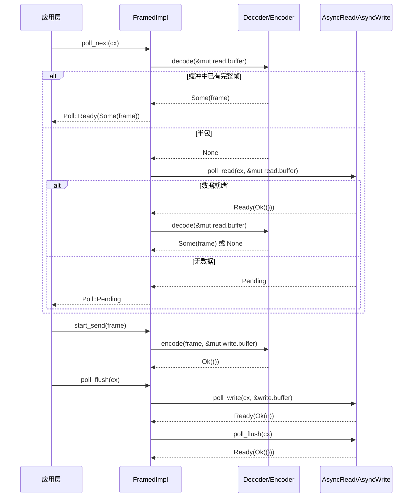

# Chapter 10: Streaming I/O Abstractions: AsyncRead/AsyncWrite and the Codec Framework

The previous chapter dissected the expansion process of tokio-macros, and we saw how #[tokio::main], select!, and join! take boilerplate code and compile-time validation off the user's hands. But what the macros generate is still ordinary Futures and poll calls—when these Futures actually start reading and writing bytes, the underlying abstractions Tokio provides are only two traits: AsyncRead and AsyncWrite. Their problem is that they are "too low-level": a single poll_read only guarantees "some bytes were read," not "a complete message was read." And the vast majority of protocols (HTTP, Redis, gRPC, custom RPC) are oriented toward "frames" rather than "byte streams." The core question this chapter aims to answer is: where should the abstraction boundary of asynchronous I/O be drawn? Tokio's answer has two layers: tokio::io provides byte-stream-level traits and utilities (BufReader/BufWriter/copy_bidirectional), and tokio-util's codec framework builds on top of it to provide frame-level Stream/Sink adaptation (Framed/LengthDelimitedCodec). Understanding the division of labor between these two layers means understanding "why almost all protocol implementations start with Framed."

# 1. AsyncRead/AsyncWrite: Why std::io::Read cannot be reused directly

## Intuitive model

`std::io::Read::read`is "blocking pickup": you stand at the window and wait as long as the goods have not arrived, and the thread is suspended.`AsyncRead::poll_read`is "pickup by meal ticket": you ask "is it ready?", and if it is not ready (`Poll::Pending`), you go do something else first, while leaving a Waker so the system can notify you when the goods arrive. Without this trait, all asynchronous I/O would have to manually implement`epoll`registration and Waker mapping—this is exactly what the Reactor in Chapter 5 does, and`AsyncRead`is the unified facade it exposes to upper layers.

## Data structures and memory layout

`AsyncRead`'s definition is extremely concise, with only one method:

```rust
pub trait AsyncRead {
    fn poll_read(
        self: Pin,
        cx: &mut Context,
        buf: &mut ReadBuf,
    ) -> Poll>;
}
```

[FACT:tokio/src/io/async_read.rs:44-60]

Each of the three parameters has its own considerations.`self: Pin<&mut Self>`rather than`&mut self`: because`AsyncRead`is often held by the Future generated by`async fn`, and once a Future is polled it cannot be moved (self-reference),`Pin`is a contract enforced by the compiler.`cx: &mut Context<'_>`carries the Waker and is the transmission channel for the "meal pager."`buf: &mut ReadBuf<'_>`is Tokio's wrapper around`&mut [u8]`—it simultaneously records "filled length" and "uninitialized capacity," avoiding`std::io::Read`That ambiguity of "returning the number of bytes read but the buffer may be uninitialized."

The documentation explicitly lists three return semantics[FACT:tokio/src/io/async_read.rs:15-32]：`Ready(Ok(()))`indicates data has been written`buf`, and the read amount is determined by`ReadBuf::filled`the length increment of; if the increment is 0, it is either EOF or`buf.remaining() == 0`(zero-capacity buffer);`Pending`indicates it is currently not readable but a wakeup has been registered;`Ready(Err(e))`is an underlying I/O error. Here is an easily overlooked trap:**"read amount is 0" does not equal EOF**—if the caller passes in a zero-capacity buffer,`poll_read`will immediately return`Ready(Ok(()))`but nothing was read. If the upper layer treats "0 bytes" as EOF, it will misjudge the connection as closed.

## Scenario-driven Walkthrough: from`&[u8]`read a segment of bytes

Consider the simplest implementation—for`&[u8]`'s`AsyncRead`：

```rust
impl AsyncRead for &[u8] {
    fn poll_read(
        mut self: Pin,
        _cx: &mut Context,
        buf: &mut ReadBuf,
    ) -> Poll> {
        let amt = std::cmp::min(self.len(), buf.remaining());
        let (a, b) = self.split_at(amt);
        buf.put_slice(a);
        *self = b;
        Poll::Ready(Ok(()))
    }
}
```

[FACT:tokio/src/io/async_read.rs:98-108]

Step-by-step analysis:`self.len()`is the length of the remaining unread slice,`buf.remaining()`is the remaining capacity of the target buffer, take the smaller of the two`amt`。`split_at(amt)`split the slice into "the`a`to copy this time" and "the remaining`b`」。`buf.put_slice(a)`to be read"`a`into`ReadBuf`and advance its filled pointer.`*self = b`Advance the slice itself to the remaining part—this is`&[u8]`the key to being a "cursor": after each poll`self`points to the unread part. Finally return`Ready(Ok(()))`, because a memory slice is always "ready" and will not`Pending`。

Note that`_cx`is ignored: a memory data source does not need a Waker. This contrasts with a network socket—the latter returns`Pending`and registers read interest when there is no data.

`io::Cursor<T>`'s implementation adds an extra layer of bounds checking[FACT:tokio/src/io/async_read.rs:113-134]: first take`position()`, if`pos > slice.len()`(position out of bounds) directly return`Ready(Ok(()))`without panicking[FACT:tokio/src/io/async_read.rs:113-134]. This is defensive design:`Cursor`'s position can be set to any value by an external`set_position`, and when out of bounds, treating it as "already read to the end" is more consistent with I/O semantics than panicking.

## Design thinking: deref macros and the propagation of Pin

`AsyncRead`provides`Box<T>`、`&mut T`、`Pin<P>`with forwarding implementations. The first two generate`deref_async_read!`through the[FACT:tokio/src/io/async_read.rs:64-70]macro, the core being`Pin::new(&mut **self).poll_read(cx, buf)`—dereference`Pin<&mut Box<T>>`to`Pin<&mut T>`and then forward.`Pin<P>`'s implementation is more subtle[FACT:tokio/src/io/async_read.rs:87-93]: it calls`crate::util::pin_as_deref_mut(self)`, projecting`Pin<&mut Pin<P>>`as`Pin<&mut P::Target>`. This layer of projection is necessary; otherwise nested`Pin`would cause a type mismatch.

> **[Design Inference & Architectural Trade-offs]**
> The design motivation here is "zero-cost abstraction": forwarding implementations let`Box<dyn AsyncRead>`、`&mut T`and other wrapper types avoid manually writing`poll_read`, while keeping`Pin`semantics correct. The cost is that each forwarding layer introduces an indirect call, which the compiler can usually eliminate by inlining.

---

# II. copy_bidirectional: the state machine for bidirectional forwarding

## Intuitive model

`copy_bidirectional`is a "bidirectional food runner": it watches both A→B and B→A directions at the same time, and whenever either side reads data, it writes it to the opposite side. Without it, implementing a TCP proxy would require manually writing two`copy`Futures and combining them with`select!`—and`select!`'s cancellation safety constraint (Chapter 9) would cause data "read halfway then canceled" to be lost.`copy_bidirectional`uses an explicit state machine to preserve the intermediate states of "read-write-close," thereby achieving cancellation safety.

## Data structure and memory layout

The core is a three-state enum:

```rust
enum TransferState {
    Running(CopyBuffer),
    ShuttingDown(u64),
    Done(u64),
}
```

[FACT:tokio/src/io/util/copy_bidirectional.rs:10-14]

`Running`holds`CopyBuffer`(containing an 8KB buffer and read/write counts), indicating "currently moving data."`ShuttingDown(u64)`carries the number of bytes copied, indicating "the read side has reached EOF and is closing the write side."`Done(u64)`indicates "shutdown complete, recording the final byte count." This enum is the key to cancellation safety:**if dropped at any moment, the state is preserved in the enum, and the next poll can continue from the breakpoint**。

`CopyBuffer`comes from`copy.rs`, and the default size is determined by`DEFAULT_BUF_SIZE`(8KB)[FACT:tokio/src/io/util/copy_bidirectional.rs:76-88]. Each direction holds an independent`CopyBuffer`, so the memory overhead is 16KB.

## Scenario-driven Walkthrough: the complete lifecycle of one bidirectional forwarding

`copy_bidirectional_impl`use`poll_fn`to combine the state machines of the two directions:

```rust
let mut a_to_b = TransferState::Running(a_to_b_buffer);
let mut b_to_a = TransferState::Running(b_to_a_buffer);
poll_fn(|cx| {
    let a_to_b = transfer_one_direction(cx, &mut a_to_b, a, b)?;
    let b_to_a = transfer_one_direction(cx, &mut b_to_a, b, a)?;
    let a_to_b = ready!(a_to_b);
    let b_to_a = ready!(b_to_a);
    Poll::Ready(Ok((a_to_b, b_to_a)))
})
.await
```

[FACT:tokio/src/io/util/copy_bidirectional.rs:127-151]

Note the call order of`transfer_one_direction`: first advance a→b, then advance b→a, both returning`Poll`。`ready!`The macro returns immediately when either direction is incomplete`Pending`—but**the state of the other direction has already been advanced**. This is exactly what the comment emphasizes[FACT:tokio/src/io/util/copy_bidirectional.rs:143-144]: even if`ready!`returns early, the other direction will still return`Done(count)`on the next poll, without losing progress.

`transfer_one_direction`Internally is a`loop`, advancing by state:

```rust
loop {
    match state {
        TransferState::Running(buf) => {
            let count = ready!(buf.poll_copy(cx, r.as_mut(), w.as_mut()))?;
            *state = TransferState::ShuttingDown(count);
        }
        TransferState::ShuttingDown(count) => {
            ready!(w.as_mut().poll_shutdown(cx))?;
            *state = TransferState::Done(*count);
        }
        TransferState::Done(count) => return Poll::Ready(Ok(*count)),
    }
}
```

[FACT:tokio/src/io/util/copy_bidirectional.rs:29-42]

`Running`In the state, call`poll_copy`, which internally loops "read a chunk, write a chunk" until the read side reaches EOF or the write side blocks. On EOF, return the total number copied, and the state transitions to`ShuttingDown`。`ShuttingDown`call`poll_shutdown`to close the write side (send FIN), and after completion transition to`Done`。`Done`directly return the count.

The flowchart below shows the advancement logic and error branches of the unidirectional state machine:

```mermaid
flowchart TD
    start["transfer_one_direction 进入 loop"] --> match_state{"当前 TransferState?"}
    match_state -->|Running| poll_copy["buf.poll_copy(cx, r, w)"]
    poll_copy --> copy_ready{"poll_copy 结果?"}
    copy_ready -->|Pending| ret_pending["返回 Poll::Pending状态保持 Running"]
    copy_ready -->|Err| ret_err["返回 Poll::Ready(Err)错误向上传播"]
    copy_ready -->|Ok(count)| to_shutdown["state = ShuttingDown(count)"]
    to_shutdown --> match_state
    match_state -->|ShuttingDown| poll_shutdown["w.poll_shutdown(cx)"]
    poll_shutdown --> shutdown_ready{"shutdown 结果?"}
    shutdown_ready -->|Pending| ret_pending2["返回 Poll::Pending状态保持 ShuttingDown"]
    shutdown_ready -->|Err| ret_err
    shutdown_ready -->|Ok| to_done["state = Done(count)"]
    to_done --> match_state
    match_state -->|Done| ret_done["返回 Poll::Ready(Ok(count))"]
```

## Design thinking: why use an explicit state machine instead of async fn

> **[Design Inference & Architectural Trade-offs]**
> If`transfer_one_direction`were written as`async fn`, the compiler would generate a Future whose internal state (`CopyBuffer`, copied count) is hidden inside the generated state machine. This is fine when used unidirectionally, but`copy_bidirectional`needs to**within the same poll cycle**advance both directions simultaneously—if two`async fn`plus`select!`were used, when either direction completes the other would be dropped, and its internal buffer and count would be lost, violating cancellation safety. An explicit`TransferState`exposes the state on the stack,`poll_fn`and the state is still there each time it is re-entered, thus guaranteeing "recovery from the breakpoint after cancellation."

In error handling,`poll_copy`returns`Err`which will be immediately propagated upward through`?`. The documentation explicitly states[FACT:tokio/src/io/util/copy_bidirectional.rs:32]: interrupted reads and writes will be retried, other errors are returned immediately, and[FACT:tokio/src/io/util/copy_bidirectional.rs:67-70]partially read data may be lost**(not written to the opposite side). This is a point to note in production environments:**does not guarantee "either all succeed or all fail"; when an error occurs, half the data may already be in flight.`copy_bidirectional`additionally performs a zero-size assertion

`copy_bidirectional_with_sizes`, because a zero-capacity buffer would cause[FACT:tokio/src/io/util/copy_bidirectional.rs:99-125]，因为零容量缓冲区会导致 `poll_copy`always returns`Ready(Ok(0))`is misjudged as EOF, forming a busy loop.

---

# III. Framed: Slicing a Byte Stream into Frames

## Intuitive Model

`Framed`is a "sausage machine": the upstream is a continuous stream of water (`AsyncRead`/`AsyncWrite`), and the downstream is the cut sausage segments (`Stream<Item = Frame>` / `Sink<Frame>`）。`Decoder`is responsible for "cutting out a segment from the stream,"`Encoder`is responsible for "wrapping a segment into a stream." Without`Framed`, every protocol implementation would have to hand-write "buffer management + partial packet handling + sticky packet splitting"—this is exactly the repetitive labor that the codec framework aims to eliminate.

## Data Structures and Memory Layout

`Framed`itself is just a thin wrapper:

```rust
pub struct Framed {
    #[pin]
    inner: FramedImpl
}
```

[FACT:tokio-util/src/codec/framed.rs:38-41]

The real state is in`FramedImpl`'s`state: RWFrames`, containing`read: ReadFrame`and`write: WriteFrame`two parts.`ReadFrame`'s fields are visible in`with_capacity`[FACT:tokio-util/src/codec/framed.rs:107-126]：`eof: bool`(whether the read side is EOF),`is_readable: bool`(whether readable interest has been registered),`buffer: BytesMut`(read buffer),`has_errored: bool`(whether an error has occurred, to prevent repeated reads).`WriteFrame`Fields[FACT:tokio-util/src/codec/framed.rs:119-122]：`buffer: BytesMut`(write buffer),`backpressure_boundary: usize`(backpressure threshold).

`backpressure_boundary`is the key to the backpressure mechanism: when the write buffer exceeds this threshold,`poll_ready`will return`Pending`until the data is flushed, thereby applying backpressure to the upstream`Sink`. By default it equals`capacity` [FACT:tokio-util/src/codec/framed.rs:121], and can be adjusted via`set_backpressure_boundary`[FACT:tokio-util/src/codec/framed.rs:271-273]。

## Scenario-Driven Walkthrough: Reading a Frame from a Socket

`Framed`'s`Stream`implementation simply forwards to`FramedImpl::poll_next` [FACT:tokio-util/src/codec/framed.rs:309-311]. The real logic is in`FramedImpl`(this file is not provided in this chapter, but the call chain can be inferred from`Framed`'s interface):

1. `poll_next`first checks`read.buffer`to see whether a complete frame already exists (by calling`codec.decode`）；

2. If`decode`returns`Some(frame)`, produce it directly without touching the underlying I/O;

3. If it returns`None`(partial packet), check`read.eof`: if already EOF and the buffer is non-empty, it means there is residual data that cannot be decoded, so return an error or`None`；

4. Otherwise call the underlying`AsyncRead::poll_read`to read more bytes into`read.buffer`；

5. The bytes read are passed to`decode`again, looping until a frame is produced or`Pending`。

This order of "decode first, then read" is important: it guarantees that**a single read may produce multiple frames**(sticky packets), and**a frame may span multiple reads**(partial packets).`is_readable`The flag avoids repeatedly registering readable interest—if the previous poll already registered it and it was not ready, this time it directly returns`Pending`without repeatedly calling the underlying layer.

`Sink`'s implementation call chain[FACT:tokio-util/src/codec/framed.rs:315-338]：`start_send`calls`codec.encode(item, &mut write.buffer)`to encode the frame into the write buffer;`poll_flush`flushes`write.buffer`to the underlying`AsyncWrite`；`poll_ready`checks`write.buffer.len() >= backpressure_boundary`, and if it exceeds the threshold, flushes first and then returns ready.

The sequence diagram below shows`Framed`'s cross-component collaboration in one "read-frame-write-frame" round trip:



## Cancellation Safety: Framed's Documentation Warning

`Framed`'s documentation specifically lists cancellation safety semantics[FACT:tokio-util/src/codec/framed.rs:23-30]：`SinkExt::send`If in`select!`it is preempted by another branch and completes,**the message is guaranteed not to have been sent, but the message itself is lost**—because`send`internally first`poll_ready`then`start_send`, and if during the`poll_ready`stage it is dropped,`item`has already been consumed but not encoded. While`StreamExt::next`is cancellation-safe: it only holds a reference to the underlying stream, and dropping it will not lose already-decoded frames.

> **[Design Inference & Architectural Trade-offs]**
> This asymmetry stems from the difference between the read and write paths: the state of the read path (`read.buffer`) is stored inside`Framed`, and dropping`next`merely abandons the action of "taking a frame," leaving the buffer unaffected; the state of the write path (the pending`item`) is on`send`'s Future stack, and dropping it means losing it. In production code, if`select!`is used in`send`, you must ensure the message can be resent or accept the loss.

## Design Thinking:`into_parts`and`map_codec`

`Framed`provide`into_parts`/`from_parts`for "swapping the codec while preserving the buffer"[FACT:tokio-util/src/codec/framed.rs:290-298] [FACT:tokio-util/src/codec/framed.rs:155-166]。`map_codec`is implemented based on this pair of methods[FACT:tokio-util/src/codec/framed.rs:221-234]: first`into_parts`split out`io`/`codec`/`read_buf`/`write_buf`, then use the`map`function to convert the codec, and finally`from_parts`reassemble. This design allows buffered data to be preserved during protocol upgrades (such as switching from plaintext to TLS), avoiding re-reading.

`FramedParts`'s`_priv: ()`field[FACT:tokio-util/src/codec/framed.rs:373-375]is the "non-exhaustive struct" trick: private fields prevent external direct construction, forcing use of`new`/`from_parts`, thereby allowing fields to be added in the future without breaking compatibility.

---

# IV. LengthDelimitedCodec: The State Machine of Length-Prefixed Encoding and Decoding

## Intuitive Model

`LengthDelimitedCodec`is a specialized tool for "cutting sausages by length": it assumes that each frame is preceded by a fixed-byte-length length field, reading the length first and then the payload. Without it, implementing a length-prefixed protocol would require hand-writing the state machine "read 4 bytes → parse length → read N bytes → loop"—this is exactly what its internal`DecodeState`does.

## Data Structures and Memory Layout

```rust
pub struct LengthDelimitedCodec {
    builder: Builder,
    state: DecodeState,
}

enum DecodeState {
    Head,
    Data(usize),
}
```

[FACT:tokio-util/src/codec/length_delimited.rs:451-457]

`DecodeState`is an explicit state machine:`Head`means "currently reading the length field,"`Data(n)`means "length n has been parsed, currently reading the payload." This state persists across`decode`calls, therefore**progress is not lost in partial packet scenarios**。

`Builder`holds all configuration[FACT:tokio-util/src/codec/length_delimited.rs:416-435]：`max_frame_len`(default 8MB),`length_field_len`(default 4 bytes),`length_field_offset`(default 0),`length_adjustment`(default 0),`num_skip`(default`None`, i.e.`offset + len`）、`length_field_is_big_endian`(default true).

## Scenario-Driven Walkthrough: Decoding a Length-Prefixed Frame

`decode`is the state machine entry point:

```rust
fn decode(&mut self, src: &mut BytesMut) -> io::Result> {
    let n = match self.state {
        DecodeState::Head => match self.decode_head(src)? {
            Some(n) => {
                self.state = DecodeState::Data(n);
                n
            }
            None => return Ok(None),
        },
        DecodeState::Data(n) => n,
    };

    match self.decode_data(n, src) {
        Some(data) => {
            self.state = DecodeState::Head;
            src.reserve(self.builder.num_head_bytes().saturating_sub(src.len()));
            Ok(Some(data))
        }
        None => Ok(None),
    }
}
```

[FACT:tokio-util/src/codec/length_delimited.rs:579-603]

`Head`In the`decode_head`state, call`None`. If it returns`Ok(None)`(insufficient data), directly return`Some(n)`to wait for more data; if it returns`Data(n)`。`Data`, the state transitions to`decode_data(n, src)`In the`split_to(n)`state, directly take n. Then call`Head`: if the buffer already has n bytes,`None`cuts out the frame, the state returns to

`decode_head`, and reserves space for the next frame header; otherwise return

```rust
let head_len = self.builder.num_head_bytes();
let field_len = self.builder.length_field_len;

if src.len()  self.builder.max_frame_len as u64 {
        return Err(io::Error::new(
            io::ErrorKind::InvalidData,
            LengthDelimitedCodecError { _priv: () },
        ));
    }

    let n = n as usize;
    let n = if self.builder.length_adjustment  n,
        None => {
            return Err(io::Error::new(
                io::ErrorKind::InvalidInput,
                "provided length would overflow after adjustment",
            ));
        }
    }
};

src.advance(self.builder.get_num_skip());
src.reserve(n.saturating_sub(src.len()));
Ok(Some(n))
```

[FACT:tokio-util/src/codec/length_delimited.rs:504-562]

is the core parsing logic:`src.len() >= head_len`Copy`None` [FACT:tokio-util/src/codec/length_delimited.rs:499-502]Parse step by step: first check`Cursor`, and if insufficient, return`src`. Use`advance`/`get_uint`to wrap`advance(length_field_offset)`so that[FACT:tokio-util/src/codec/length_delimited.rs:517]operations can be performed without consuming the original buffer.`field_len`Skip the header prefix[FACT:tokio-util/src/codec/length_delimited.rs:520-524]。

**. Read the length value of**bytes according to endianness`n > max_frame_len`Key defense`InvalidData`: if[FACT:tokio-util/src/codec/length_delimited.rs:526-531], immediately return

error`checked_sub`/`checked_add`. This prevents a malicious peer from sending a frame with a "length field of 4GB" and causing memory exhaustion—this is the most classic DoS attack surface of length-prefixed protocols.[FACT:tokio-util/src/codec/length_delimited.rs:537-541]Length adjustment uses`InvalidInput`errors instead of panics.`get_num_skip()`Return`num_skip`or the default`offset + len` [FACT:tokio-util/src/codec/length_delimited.rs:1070-1073], skipping the remaining part of the header. Finally,`reserve(n.saturating_sub(src.len()))`reserve payload space[FACT:tokio-util/src/codec/length_delimited.rs:559]— using`saturating_sub`is because`src`may already contain part of the payload.

The flowchart below shows`decode`the complete decision path of:

```mermaid
flowchart TD
    entry["decode(src)"] --> check_state{"self.state?"}
    check_state -->|Head| head["decode_head(src)"]
    head --> head_result{"结果?"}
    head_result -->|Ok(None)| ret_none1["返回 Ok(None)等待更多数据"]
    head_result -->|Err| ret_err1["返回 Err长度超限或溢出"]
    head_result -->|Ok(Some(n))| set_data["state = Data(n)"]
    set_data --> decode_data
    check_state -->|Data(n)| decode_data["decode_data(n, src)"]
    decode_data --> data_result{"src.len() >= n?"}
    data_result -->|否| ret_none2["返回 Ok(None)等待更多数据"]
    data_result -->|是| split["src.split_to(n)state = Headreserve 下一帧头部"]
    split --> ret_frame["返回 Ok(Some(frame))"]
```

## Design consideration: max_frame_len clipping and overflow protection

`Builder::adjust_max_frame_len`When constructing the codec, clip`max_frame_len`to the maximum value representable by the length field[FACT:tokio-util/src/codec/length_delimited.rs:1075-1081]。`max_allowed_frame_len`compute`max_length_field_value + length_adjustment` [FACT:tokio-util/src/codec/length_delimited.rs:1083-1089], where`max_length_field_value`uses`checked_shl`to handle`length_field_len == 8`shift overflow when[FACT:tokio-util/src/codec/length_delimited.rs:1091-1096]. This clipping prevents contradictory configurations such as "length field is 2 bytes but max_frame_len is set to 1MB"—2 bytes can represent at most 65535, so after clipping max_frame_len becomes 65535.

Symmetric protection on the encoding path:`encode`check`n > max_frame_len`return`InvalidInput` [FACT:tokio-util/src/codec/length_delimited.rs:607-607], and length adjustment likewise uses`checked_add`/`checked_sub` [FACT:tokio-util/src/codec/length_delimited.rs:620-631]. Note that the adjustment direction during encoding is opposite to decoding: decoding is "read length ± adjustment = payload length", while encoding is "payload length ∓ adjustment = written length field"[FACT:tokio-util/src/codec/length_delimited.rs:620-624]。

> **[Design Inference & Architectural Trade-offs]**
> This symmetric design of "add when decoding, subtract when encoding" is intended to make`length_adjustment`semantically unified: it represents "the difference between the length field value and the payload length". When the protocol's length field includes the header (such as Example 3),`adjustment = -2`, during decoding`n - (-2) = n + 2`yields the payload length, and during encoding`payload - (-2) = payload + 2`writes back the length field.

---

# Design consideration: the three levels of abstraction boundaries

Reviewing this chapter, Tokio's I/O abstraction presents a clear three-layer structure:

**First layer: byte stream trait (`AsyncRead`/`AsyncWrite`）**. It only promises "read/write some bytes", not frame boundaries. This is the minimal interface, and any I/O source (socket, file, in-memory slice) can implement it. The cost is that upper layers must handle partial packets/sticky packets themselves.

**Second layer: byte stream utilities (`BufReader`/`BufWriter`/`copy_bidirectional`）**. On top of the trait, they provide general capabilities such as "reducing system calls" and "bidirectional forwarding".`copy_bidirectional`The explicit state machine of

**demonstrates how "cancel safety" is implemented at the utility layer—state is kept on the stack rather than inside the Future.`Framed`/`Decoder`/`Encoder`）**Third layer: frame adaptation (`Stream<Frame>`/`Sink<Frame>`. It elevates byte streams to`LengthDelimitedCodec`, so protocol implementations only need to care about "frame encoding/decoding" rather than "buffer management".`DecodeState`is the standard example of this layer, and its`max_frame_len`state machine and

> **[Design Inference & Architectural Trade-offs]**
> [Design inference and architectural trade-offs]`tokio-util`The division of these three layers is not accidental: it corresponds to the three gradients of "abstraction leakage". The lower the layer, the more general but harder to use; the higher the layer, the easier to use but more specialized. Tokio chooses to place "frames" as a first-class citizen in`tokio`rather than`tokio`core, because the definition of a frame varies by protocol—`tokio-util`only provides byte streams,`Decoder`/`Encoder`。

---

# provides the frame framework, and specific protocols (HTTP/Redis/gRPC) implement

- `AsyncRead::poll_read`in their respective crates.`Pin<&mut Self>` + `Context` + `ReadBuf`Chapter summary`std::io::Read::read`uses`Ready(Ok(()))`three parameters to replace
- `copy_bidirectional`, turning "blocking wait" into "register Waker + return Pending".`TransferState`And when the read amount is 0, it is necessary to distinguish between EOF and a zero-capacity buffer.`Running`/`ShuttingDown`/`Done`uses`select!`three-state enum (
- `Framed`) to save intermediate state, so that bidirectional forwarding can still recover under`AsyncRead`/`AsyncWrite`cancellation. When an error occurs, some data may be lost.`Stream`/`Sink`，`ReadFrame`/`WriteFrame`adapts`SinkExt::send`to`StreamExt::next`to separately manage read/write buffers and backpressure.
- `LengthDelimitedCodec`is not cancel-safe (message loss),`DecodeState`（`Head`/`Data(n)`is cancel-safe.`max_frame_len`uses`checked_add`/`checked_sub`) state machine to handle partial packets,

# protects against length-field DoS,

Q1: `copy_bidirectional`protects against adjustment overflow.`transfer_one_direction`Chapter review questions and self-test`TransferState::ShuttingDown`In`ready!(w.as_mut().poll_shutdown(cx))?`of`*state = TransferState::Done(*count)`, if the

**branch's**：`poll_shutdown`is changed to directly`Done`(skipping shutdown), in what scenarios would the peer connection fail to close normally?`read`Reference analysis`ShuttingDown`The purpose of[FACT:tokio/src/io/util/copy_bidirectional.rs:35-39]is to send a FIN packet to the peer, notifying it that "I have no more data on my side". If it is skipped and`poll_shutdown`is directly transitioned to, the write side will not be closed, and the peer will keep waiting for data, forming a "half-open connection"—the peer may block forever on`Pending`until timeout. In a TCP proxy scenario, this causes connection leaks: the client has disconnected, but the proxy's connection to the backend remains open. The existence of the`ready!`state in the source code

Q2: `LengthDelimitedCodec::decode_head`is precisely to ensure that the write side is explicitly closed after EOF. Note that`if n > self.builder.max_frame_len as u64`itself may return[FACT:tokio-util/src/codec/length_delimited.rs:526-531](such as when the send buffer is full), so`0xFFFFFFFF`must be used to wait rather than ignore it.`length_adjustment`In

**, if the check**of`n`is removed`usize`, what consequences would be triggered if a malicious client sends a frame header with a length field of`decode_data`。`decode_data`(4GB)? Why must this check be before`src.len() < n`?`None`Reference analysis`decode_head`: After removing the check,`src.reserve(n.saturating_sub(src.len()))` [FACT:tokio-util/src/codec/length_delimited.rs:559]will be converted to`length_adjustment`and passed to`length_adjustment`. When checking`-2`, it returns`0xFFFFFFFF - 2`, but the`checked_sub`at the end of

At this point, we have clarified Tokio's two layers of abstraction between byte streams and message frames: tokio::io handles byte movement, while the codec framework in tokio-util handles frame splitting and encoding/decoding. The reason Framed becomes the starting point for protocol implementations is precisely that it encapsulates the high-frequency need to "read one complete message" into a reusable Stream/Sink adapter. But frames are only containers for data. When a protocol needs to handle dynamic task sets, structured cancellation, or more complex streaming composition, Framed alone is not enough. The next chapter will move into the extension mechanisms of tokio-stream and tokio-util, looking at how StreamExt combinators, StreamMap/JoinSet/TaskTracker, and CancellationToken reuse the underlying Waker and scheduling mechanisms to provide higher-level tools for asynchronous iteration and task management.
