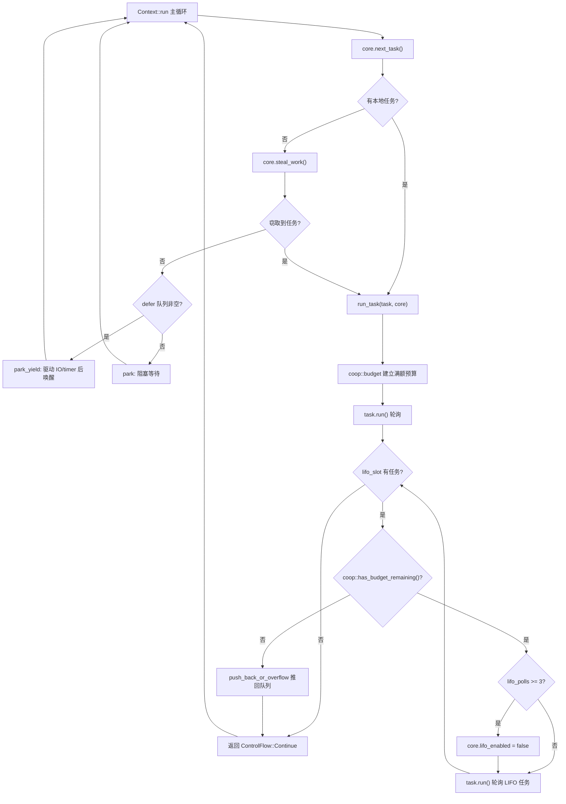

# Chapter 12: Cooperative Scheduling and Budget: How the coop Mechanism Prevents Tasks from Starving the Scheduler

In the previous chapter, we saw how tokio-stream and tokio-util reuse the underlying Waker and scheduling mechanisms to extend core capabilities. But no matter how many combinators are built, the core contradiction of an async runtime always exists: the scheduler must fairly distribute CPU time among multiple tasks, while tasks themselves are non-preemptive—once a Future's poll begins executing, the scheduler cannot interrupt it from the outside. If a task processes a hundred thousand messages in a single poll, or repeatedly awaits an always-ready Future in a loop, it will monopolize the worker thread, leaving other tasks on the same thread forever without a chance to be polled. This is the classic "task starves the scheduler" problem. Tokio's solution is not preemption, but cooperation: each task is allocated a limited budget within a scheduling cycle, resource operations consume the budget, and once the budget is exhausted, the task must voluntarily yield. This chapter dives deep into the implementation of this coop mechanism.

# 12.1 The Budget's Carrier: Thread-Local Storage and the Budget Struct

> **[Design Inference & Architectural Trade-offs]**
> If the scheduler is likened to the only waiter in a restaurant, and tasks are customers who keep ordering dishes, then the coop budget is the rule of "each customer can order at most N dishes"—the waiter doesn't need to forcibly interrupt the customer, but simply says "take a break, I'll serve the next one" after the customer has ordered N dishes. Without this rule, one talkative customer could paralyze the entire restaurant.

The budget must satisfy two constraints: first, it must be accessible from a call stack of arbitrary depth without passing parameters layer by layer; second, it must be able to distinguish "whether currently inside the Tokio runtime"—calling from outside the runtime should not be subject to budget constraints. Tokio chose to use`poll`thread-local storage (TLS)`block_on`to carry the budget, and manages it uniformly through the**module.**The core type of the budget is`context`. Although the source code slice in this chapter does not directly provide the complete definition of

, its interface contract can be inferred from the usage sites of`coop::Budget`:`coop.rs`Copy`worker.rs`Three key APIs appear here:

[FACT:tokio/src/runtime/scheduler/multi_thread/worker.rs:695-795]

```rust
coop::budget(|| {
    // ... 轮询任务 ...
    task.run();
    // ...
    loop {
        // ...
        if !coop::has_budget_remaining() {
            // 预算耗尽，把 LIFO 任务推回队列
            core.run_queue.push_back_or_overflow(task, ...);
            return ControlFlow::Continue(core);
        }
        // ...
    }
})
```

queries the remaining budget, and the semantics of`coop::budget(closure)`and`coop::has_budget_remaining()`, which will be seen later, are: upon entering the closure, reset the current thread's budget to a full value (default 128); during the closure's execution, all resource operations share this quota; upon exiting the closure, restore the outer budget.`coop::stop()`[Design Inference and Architectural Trade-offs]`coop::set()`。`budget`The budget value of 128 is an empirical value: it is large enough that a normal message-processing loop (say, processing a few dozen messages per poll) won't frequently trigger a yield; yet small enough that a runaway loop can perform at most 128 resource operations before being forced to yield, keeping latency within an acceptable range.

> **[Design Inference & Architectural Trade-offs]**
> . The outer semantics of

`Budget`is "whether the current thread is in the Tokio runtime context":`Cell<Option<Budget>>`indicates not inside the runtime (e.g.,`Option`outside the runtime), in which case all budget checks pass through directly.`None`12.2 Budget Consumption Points: How Resource Operations Deduct`block_on`The budget is not consumed out of thin air; only

# resource operations

deduct it. So-called resource operations refer to those APIs that may be called in an infinite loop and interact with the outside world—channel's**, I/O reads and writes,**, etc. Taking`send`/`recv`as an example, it is the common entry point for all send paths:`yield_now`Copy`mpsc::Sender::reserve`Before actually acquiring the semaphore permit,

[FACT:tokio/src/sync/mpsc/bounded.rs:1272-1311]

```rust
async fn reserve_inner(&self, n: usize) -> Result> {
    crate::trace::async_trace_leaf().await;

    if n > self.max_capacity() {
        return Err(SendError(()));
    }
    // ... WakeReceiverOnDrop guard ...
    let guard = WakeReceiverOnDrop { chan: &self.chan };
    let result = self.chan.semaphore().semaphore.acquire(n).await;
    // ...
}
```

`reserve_inner`. This call, which appears to be merely for tracing, is actually one of the mounting points for budget deduction.`crate::trace::async_trace_leaf()`Internally calls a function like`async_trace_leaf`: if the budget is sufficient, deduct 1 and return`coop::poll_proceed`; if the budget is exhausted, register a "yield" action—hand the current task's Waker to the scheduler, return`Proceed`, and let the task end early in this poll.`Pending`This is the brilliance of coop:

budget exhaustion does not throw an error, but disguises "yield" as an ordinary**. When the upper-level Future sees`Pending`**, it naturally returns; the scheduler re-enqueues the task, and when it is next scheduled, the budget has been reset, and the task continues from where it was interrupted. The entire process is completely transparent to business code.`Pending`is the most straightforward manifestation of the budget mechanism; it does not consume budget, but

`yield_now`actively triggers a yield**Copy**：

[FACT:tokio/src/task/yield_now.rs:38-60]

```rust
pub async fn yield_now() {
    let mut yielded = false;
    poll_fn(|cx| {
        ready!(crate::trace::trace_leaf());

        if yielded {
            return Poll::Ready(());
        }

        yielded = true;

        // Don't wake the task immediately, as that would push it right back
        // onto the run queue and it could be polled again before other tasks
        // or the IO/timer driver get a chance to run. Instead, hand the waker
        // to the scheduler, which wakes deferred tasks only after it has run
        // out of ready tasks and polled the driver. When polled from outside
        // a Tokio runtime, the waker is woken immediately.
        context::defer(cx.waker());

        Poll::Pending
    })
    .await
}
```

. It does not directly`context::defer(cx.waker())`, but hands the Waker to the scheduler's`wake`defer queue**. Why? The source code comments explain it clearly: if woken immediately, the task would be pushed back onto the run queue right away and might be polled again before the I/O/timer driver runs, making the yield meaningless. The semantics of the defer queue is "wake these tasks only after the current worker has finished running ready tasks and has polled the driver."**The defer queue is defined in the worker's

:`Context`Copy

[FACT:tokio/src/runtime/scheduler/multi_thread/worker.rs:247-257]

```rust
pub(crate) struct Context {
    worker: Arc,
    core: RefCell>>,
    /// Tasks to wake after resource drivers are polled. This is mostly to
    /// handle yielded tasks.
    pub(crate) defer: Defer,
}
```

`defer`Copy

[FACT:tokio/src/runtime/scheduler/multi_thread/worker.rs:613-621]

```rust
} else {
    // Wait for work
    core = if !self.defer.is_empty() {
        self.park_yield(core)
    } else {
        self.park(core)
    };
    core.stats.start_processing_scheduled_tasks();
}
```

If the defer queue is non-empty, the worker calls`park_yield`—parking with a 0 timeout, which drives I/O and timers, then wakes the tasks in defer. This guarantees that a "yielded" task is only rescheduled after the driver has run.

# 12.3 Establishment and Restoration of Budget Scope: run_task and block_in_place

The budget scope is established in`run_task`. When each task is polled,`coop::budget`wraps the entire polling process:

[FACT:tokio/src/runtime/scheduler/multi_thread/worker.rs:691-704]

```rust
// Make the core available to the runtime context
*self.core.borrow_mut() = Some(core);

// Run the task
coop::budget(|| {
    // ...
    task.run();
    // ...
})
```

`coop::budget`On entry, it sets the budget in TLS to full, and on exit, it restores it. This means**each task gets a fresh budget every time it is polled**. No matter how many`await`resource operations the task performs internally, as long as a single`poll`consumes more than 128, it will be forced to yield.

But there is a subtle issue here: tasks in the LIFO slot are polled within**the same`budget`closure**. Look at`run_task`'s loop:

[FACT:tokio/src/runtime/scheduler/multi_thread/worker.rs:709-750]

```rust
let mut lifo_polls = 0;

// As long as there is budget remaining and a task exists in the
// `lifo_slot`, then keep running.
loop {
    let mut core = match self.core.borrow_mut().take() {
        Some(core) => core,
        None => {
            return ControlFlow::Break(());
        }
    };

    let task = match core.lifo_slot.take() {
        Some(task) => task,
        None => {
            self.reset_lifo_enabled(&mut core);
            core.stats.end_poll();
            return ControlFlow::Continue(core);
        }
    };

    if !coop::has_budget_remaining() {
        core.stats.end_poll();
        // Not enough budget left to run the LIFO task, push it to
        // the back of the queue and return.
        core.run_queue.push_back_or_overflow(task, ...);
        debug_assert!(core.lifo_enabled);
        return ControlFlow::Continue(core);
    }
    // ...
}
```

The key point: tasks in the LIFO slot**share the outer task's budget**. The comment at the beginning of`run_task`says: "Tasks from the LIFO slot inherit the 'parent''s limits". This is an intentional design—if every LIFO task reset the budget, then in a ping-pong scenario (task A wakes B, B wakes A), the two tasks would schedule each other indefinitely, the budget would always be reset, and the starvation problem would remain. Sharing the budget means A and B together can consume at most 128 resource operations, after which they must yield.

The LIFO slot itself also has an independent rate limiter`MAX_LIFO_POLLS_PER_TICK`：

[FACT:tokio/src/runtime/scheduler/multi_thread/worker.rs:756-766]

```rust
// Disable the LIFO slot if we reach our limit
//
// In ping-ping style workloads where task A notifies task B,
// which notifies task A again, continuously prioritizing the
// LIFO slot can cause starvation as these two tasks will
// repeatedly schedule the other. To mitigate this, we limit the
// number of times the LIFO slot is prioritized.
if lifo_polls >= MAX_LIFO_POLLS_PER_TICK {
    core.lifo_enabled = false;
    super::counters::inc_lifo_capped();
}
```

`MAX_LIFO_POLLS_PER_TICK`The value of is 3:

[FACT:tokio/src/runtime/scheduler/multi_thread/worker.rs:263-263]

```rust
/// Value picked out of thin-air. Running the LIFO slot a handful of times
/// seems sufficient to benefit from locality. More than 3 times probably is
/// over-weighting. The value can be tuned in the future with data that shows
/// improvements.
const MAX_LIFO_POLLS_PER_TICK: usize = 3;
```

This is**the second line of defense**: even if the budget has not been exhausted, the LIFO slot will be disabled after being prioritized 3 times in a row, and subsequent tasks will go through the normal queue. The budget governs "the total amount of resource operations", while the LIFO rate limiter governs "the number of times the same pair of tasks wake each other", and the two are complementary.

The budget scope has an important exception in`block_in_place`.`block_in_place`hands over the worker core to another thread, and the current thread enters a blocked state. Blocking code is not subject to the budget, so it must**pause**the budget:

[FACT:tokio/src/runtime/scheduler/multi_thread/worker.rs:406-417]

```rust
if had_entered {
    // Unset the current task's budget. Blocking sections are not
    // constrained by task budgets.
    let _reset = Reset {
        take_core,
        budget: coop::stop(),
    };

    crate::runtime::context::exit_runtime(f)
} else {
    f()
}
```

`coop::stop()`returns the current budget and sets it to`None`(that is, "not inside the runtime"),`Reset`'s`Drop`restores it after blocking ends:

[FACT:tokio/src/runtime/scheduler/multi_thread/worker.rs:374-397]

```rust
impl Drop for Reset {
    fn drop(&mut self) {
        with_current(|maybe_cx| {
            if let Some(cx) = maybe_cx {
                if self.take_core {
                    let core = cx.worker.core.take();
                    // ...
                    *cx_core = core;
                }

                // Reset the task budget as we are re-entering the
                // runtime.
                coop::set(self.budget);
            }
        });
    }
}
```

`coop::set(self.budget)`restores the budget previously saved by`stop()`. In this way,`block_in_place`synchronous blocking code inside does not consume budget, nor does it mistakenly trigger a yield due to budget exhaustion; after blocking ends, the task continues executing with its original remaining budget.

The following diagram shows the complete control flow from a task being scheduled to yielding due to budget exhaustion:



In the diagram, two yield paths can be seen: when the budget is exhausted, the LIFO task is pushed back into the queue (`push_back_or_overflow`), and when the LIFO consecutive priority limit is exceeded, the LIFO slot is disabled. Both return to the main loop, giving the worker a chance to handle other tasks or the driver.

# 12.4 Design Considerations, Error Recovery, and Production Pitfalls

**Why use TLS instead of explicit parameter passing?**Budget checkpoints are scattered deep in various modules such as channel, I/O, and time. If passed explicitly, every API would need an extra`Budget`parameter, polluting the entire public interface. TLS makes the budget completely transparent to business code, at the cost of one TLS access overhead per check. Tokio uses`#[thread_local]`or platform-specific fast TLS to reduce this overhead.

**Interaction between budget exhaustion and cancellation safety.**When budget exhaustion causes`reserve_inner`to return`Pending`, the task may be in some branch of`select!`. If another branch becomes ready at this point,`select!`will cancel the current branch—`reserve_inner`'s`WakeReceiverOnDrop`guard will, on drop, check "the semaphore is closed and idle" and wake the receiver:

[FACT:tokio/src/sync/mpsc/bounded.rs:1286-1299]

```rust
struct WakeReceiverOnDrop {
    chan: &'a chan::Tx,
}

impl Drop for WakeReceiverOnDrop {
    fn drop(&mut self) {
        use chan::Semaphore;

        let semaphore = self.chan.semaphore();
        if semaphore.is_closed() && semaphore.is_idle() {
            self.chan.wake_rx();
        }
    }
}
```

The existence of this guard shows that budget-triggered`Pending`and a true "no permit"`Pending`must behave consistently on the cancellation path; otherwise, the receiver may never receive the notification that "the channel has been closed".

**Production pitfall: hidden latency caused by budget exhaustion.**A common phenomenon is that a task suddenly slows down in processing messages, but CPU usage is not high. When troubleshooting, it is easy to suspect lock contention or I/O, but in reality the task may have processed more than 128 messages within a single poll, triggering a budget yield, and each yield goes through a complete cycle of "push back to queue → reschedule → drive poll". If message processing itself is fast, this scheduling overhead may account for a high proportion. The solution is to split large batch processing into multiple`spawn`tasks, or explicitly insert`yield_now`。

**into the loop. Boundary between budget and`block_in_place`.**As seen earlier,`block_in_place`will`coop::stop()`pause the budget. But note:`coop::stop()`is only called when`had_entered`is true, that is, only when it is indeed on a runtime worker thread. If`block_in_place`is called outside the runtime,`f()`executes directly, and the budget state remains unchanged. This branch check is done in`maybe_move_runtime`:

[FACT:tokio/src/runtime/scheduler/multi_thread/worker.rs:424-464]

```rust
with_current(|maybe_cx| {
    match (
        crate::runtime::context::current_enter_context(),
        maybe_cx.is_some(),
    ) {
        (context::EnterRuntime::Entered { .. }, true) => {
            had_entered = true;
        }
        (
            context::EnterRuntime::Entered {
                allow_block_in_place,
            },
            false,
        ) => {
            if allow_block_in_place {
                had_entered = true;
                return Ok(());
            } else {
                return Err(
                    "can call blocking only when running on the multi-threaded runtime",
                );
            }
        }
        (context::EnterRuntime::NotEntered, true) => {
            return Ok(());
        }
        (context::EnterRuntime::NotEntered, false) => {
            return Ok(());
        }
    }
    // ...
})
```

The four combinations correspond respectively to: inside a worker thread,`block_on`'s thread pool entry, nested`block_in_place`, outside the runtime. Only the first two need to pause the budget and hand over the core.

> **[Design Inference & Architectural Trade-offs]**
> **The budget value is not configurable.**From the source code, the full budget value is a hardcoded constant (128), not exposed as`Builder`option. This is intentional: the budget value affects the trade-off between scheduling fairness and throughput. If users were allowed to adjust it freely, it would be easy to tune a configuration where "too large a budget causes starvation" or "too small a budget causes scheduling overhead to explode." Tokio chooses to treat it as an internal invariant.

# Chapter Summary

The coop mechanism uses a three-layer design to solve the fairness problem of a non-preemptive scheduler:

1. **Budget carrier**：`coop::Budget`stored in TLS,`Option`the outer layer distinguishes inside/outside the runtime,`coop::budget`establishes a full-budget scope,`coop::stop`/`coop::set`supports pause and resume (`block_in_place`scenario).

2. **Consumption points**: resource operations (channel send/receive, I/O,`yield_now`) through`coop::poll_proceed`deduct budget, and when exhausted, disguise "yield" as`Pending`, transparent to business logic.

3. **Yield path**：`yield_now`through`context::defer`hands the Waker to the defer queue, ensuring rescheduling only occurs after the driver polls; LIFO slot tasks share the parent task's budget and have`MAX_LIFO_POLLS_PER_TICK = 3`independent rate limiting.

The key insight of this mechanism is:**fairness does not require preemption, only that "infinite loops" naturally break after a finite number of steps**. The budget is the measure of this "finite number of steps."

# Chapter Review and Self-Test

Q1: If in`run_task`the`coop::budget`LIFO loop inside the closure is changed to call`coop::budget`to reset the budget before each poll of a LIFO task, what happens in a ping-pong scenario (task A wakes B, B wakes A)? Why does the source code choose to let LIFO tasks share the parent task's budget?

**Reference Analysis**: The source code in`run_task`'s comments explicitly states "Tasks from the LIFO slot inherit the 'parent''s limits"[FACT:tokio/src/runtime/scheduler/multi_thread/worker.rs:679-682]. If each LIFO task reset the budget, then in an A→B→A→B ping-pong scenario, each poll would obtain a full budget, and the two tasks could schedule each other indefinitely, never yielding due to budget exhaustion. Although`MAX_LIFO_POLLS_PER_TICK = 3`'s rate limiting would disable the LIFO slot after 3 times[FACT:tokio/src/runtime/scheduler/multi_thread/worker.rs:756-766], after LIFO is disabled the tasks go through the normal queue. If only A and B are in the queue, they would still be scheduled alternately, just without LIFO priority. Shared budget provides a fallback at the total resource operation level: A and B combined can consume at most 128 resource operations before they must yield, giving other tasks and the driver a chance. The two lines of defense are complementary and neither can be missing.

Q2: `yield_now`uses`context::defer(cx.waker())`instead of`cx.waker().wake_by_ref()`. Suppose`defer`were changed to directly`wake`. In a single-worker multi-task scenario, what would be the consequence of a task repeatedly calling`yield_now`in a loop? Analyze in conjunction with the worker main loop's`park_yield`branch.

**Reference Analysis**：`yield_now`'s comments explain the reason: a direct wake would immediately push the task back onto the run queue, and it might be polled again before the I/O/timer driver runs[FACT:tokio/src/task/yield_now.rs:49-54]. In a single-worker scenario, if a task repeatedly`yield_now`in a loop and directly wakes each time, the worker main loop's`next_task`would immediately pick up this task and poll it again,`park_yield`the branch (responsible for driving I/O and timer)[FACT:tokio/src/runtime/scheduler/multi_thread/worker.rs:613-621]would never execute, because the defer queue is empty and the local queue always has tasks. The result is that I/O events and timers never get processed, and the entire runtime is "falsely alive"—tasks are running, but events from the outside world cannot make progress.`defer`The queue ensures that a yielded task must wait until after the driver polls before being woken, thus leaving an execution window for the driver.

Q3: `block_in_place`in`coop::stop()`sets the budget to`None`，`Reset::drop`in`coop::set(self.budget)`restores. If inside`block_in_place`'s closure`f`there is another call to`block_in_place`(nested), what happens to the budget state?`maybe_move_runtime`Which branch of

**handles this situation?**Reference Analysis`block_in_place`: Nested`maybe_move_runtime`is handled by`(context::EnterRuntime::NotEntered, true)`in[FACT:tokio/src/runtime/scheduler/multi_thread/worker.rs:454-458]the`return Ok(())`branch`had_entered`. This branch directly`block_in_place`, without setting`if had_entered`, so the outer`coop::stop()`'s`Reset`check is false, and it will not call`f()`again or create a new`coop::stop()`. The comment states "This is a nested call to block_in_place (we already exited). All the necessary setup has already been done."—the outer layer has already paused the budget and handed over the core, and the inner layer only needs to directly execute`None`. If the inner layer`Reset::drop`again, it would save the budget that is already`None`one more time, and

on restore might restore the wrong value (
