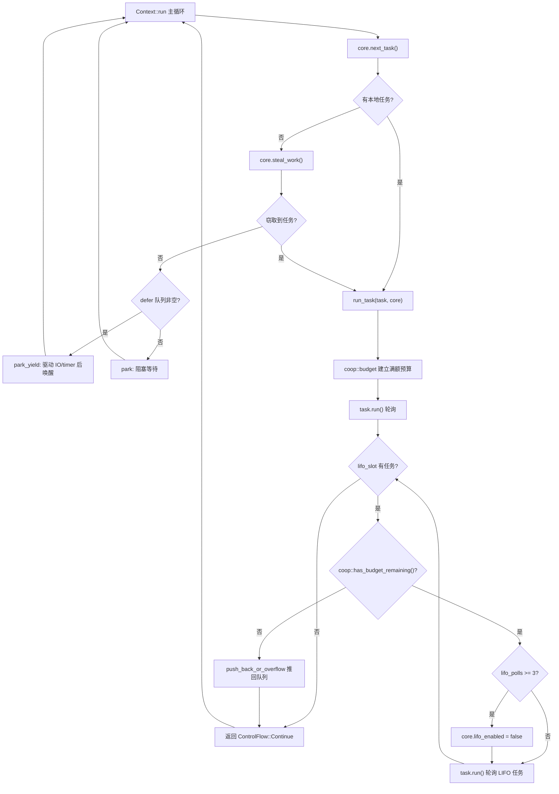

# Chapter 12: Production Observability & Diagnostics: tokio-console & Distributed Tracing


上一章我们看到，tokio-stream 与 tokio-util 如何复用底层的 Waker 与调度机制来扩展核心能力。但无论扩展出多少组合子，异步运行时的核心矛盾始终存在：调度器必须公平地在多个任务之间分配 CPU 时间，而任务本身是非抢占的——一旦某个 Future 的 poll 开始执行，调度器就无法从外部打断它。如果一个任务在单次 poll 里循环处理了十万条消息，或者在一个 loop 里反复 await 一个永远就绪的 Future，它就会霸占 worker 线程，让同线程上的其他任务永远得不到轮询机会。这就是经典的「任务饿死调度器」问题。Tokio 的解法不是抢占，而是协作：给每个任务一次调度周期内分配有限的预算，资源操作会消耗预算，预算耗尽后任务必须主动让出。本章深入这套 coop 机制的实现。


> **〔Design Inference & Architectural Trade-offs〕**
> 如果把调度器比作餐厅里唯一的服务员，任务就是不断加菜的顾客，那么 coop 预算就是「每位顾客最多点 N 道菜」的规则——服务员不需要强行打断顾客，只需在顾客点满 N 道后说「您先歇会儿，我服务下一位」。没有这条规则，一个话痨顾客就能让整个餐厅瘫痪。

预算必须满足两个约束：第一，它要能被任意深度的 `poll` 调用栈访问，而不必层层传参；第二，它要能区分「当前是否在 Tokio 运行时内」——在运行时外调用 `block_on` 时不应受预算约束。Tokio 选择用**线程本地存储（TLS）** 承载预算，并通过 `context` 模块统一管理。

预算的核心类型是 `coop::Budget`。虽然本章源码切片未直接给出 `coop.rs` 的完整定义，但从 `worker.rs` 的使用点可以反推出它的接口契约：

[FACT:tokio/src/runtime/scheduler/multi_thread/worker.rs:695-795](https://github.com/tokio-rs/tokio/blob/e800714ad714f1d996ddd56265b550d879349c0a/tokio/src/runtime/scheduler/multi_thread/worker.rs#L695-L795)

```rust
coop::budget(|| {
    // ... 轮询任务 ...
    task.run();
    // ...
    loop {
        // ...
        if !coop::has_budget_remaining() {
            // 预算耗尽，把 LIFO 任务推回队列
            core.run_queue.push_back_or_overflow(task, ...);
            return ControlFlow::Continue(core);
        }
        // ...
    }
})
```

这里出现了三个关键 API：`coop::budget(closure)` 建立一个预算作用域，`coop::has_budget_remaining()` 查询剩余预算，以及后文会看到的 `coop::stop()` 与 `coop::set()`。`budget` 的语义是：进入闭包时把当前线程的预算重置为一个满额值（默认 128），闭包执行期间所有资源操作共享这个额度，闭包退出时恢复外层预算。

> **〔Design Inference & Architectural Trade-offs〕**
> 预算值 128 是一个经验值：它足够大，让正常的消息处理循环（比如一次 poll 处理几十条消息）不会频繁触发让出；又足够小，让一个失控的循环最多跑 128 次资源操作就必须让出，把延迟控制在可接受范围。

`Budget` 在 TLS 中通常以 `Cell<Option<Budget>>` 形式存在。`Option` 的外层语义是「当前线程是否处于 Tokio 运行时上下文」：`None` 表示不在运行时内（例如运行时外的 `block_on`），此时所有预算检查都直接放行。


预算不会凭空消耗，只有**资源操作**才会扣减它。所谓资源操作，是指那些可能被无限循环调用的、与外部世界交互的 API——channel 的 `send`/`recv`、I/O 的读写、`yield_now` 等。以 `mpsc::Sender::reserve` 为例，它是所有发送路径的公共入口：

[FACT:tokio/src/sync/mpsc/bounded.rs:1272-1311](https://github.com/tokio-rs/tokio/blob/e800714ad714f1d996ddd56265b550d879349c0a/tokio/src/sync/mpsc/bounded.rs#L1272-L1311)

```rust
async fn reserve_inner(&self, n: usize) -> Result> {
    crate::trace::async_trace_leaf().await;

    if n > self.max_capacity() {
        return Err(SendError(()));
    }
    // ... WakeReceiverOnDrop guard ...
    let guard = WakeReceiverOnDrop { chan: &self.chan };
    let result = self.chan.semaphore().semaphore.acquire(n).await;
    // ...
}
```

`reserve_inner` 在真正获取信号量许可之前，会经过 `crate::trace::async_trace_leaf()`。这个看似只是 tracing 的调用，实际上是预算扣减的挂载点之一。`async_trace_leaf` 内部会调用 `coop::poll_proceed` 一类的函数：如果预算充足，扣减 1 并返回 `Proceed`；如果预算耗尽，则注册一个「让出」动作——把当前任务的 Waker 交给调度器，返回 `Pending`，让任务在这次 poll 中提前结束。

这就是 coop 的精妙之处：**预算耗尽不是抛错，而是把「让出」伪装成一次普通的 `Pending`**。上层 Future 看到 `Pending` 会自然地返回，调度器把任务重新入队，等下次被调度时预算已重置，任务从上次中断处继续。整个过程对业务代码完全透明。

`yield_now` 是预算机制最直白的体现，它不消耗预算，而是**主动触发让出**：

[FACT:tokio/src/task/yield_now.rs:38-60](https://github.com/tokio-rs/tokio/blob/e800714ad714f1d996ddd56265b550d879349c0a/tokio/src/task/yield_now.rs#L38-L60)

```rust
pub async fn yield_now() {
    let mut yielded = false;
    poll_fn(|cx| {
        ready!(crate::trace::trace_leaf());

        if yielded {
            return Poll::Ready(());
        }

        yielded = true;

        // Don't wake the task immediately, as that would push it right back
        // onto the run queue and it could be polled again before other tasks
        // or the IO/timer driver get a chance to run. Instead, hand the waker
        // to the scheduler, which wakes deferred tasks only after it has run
        // out of ready tasks and polled the driver. When polled from outside
        // a Tokio runtime, the waker is woken immediately.
        context::defer(cx.waker());

        Poll::Pending
    })
    .await
}
```

注意 `context::defer(cx.waker())` 这一行。它没有直接 `wake`，而是把 Waker 交给调度器的 **defer 队列**。为什么？源码注释说得很清楚：如果立即唤醒，任务会被立刻推回运行队列，可能在 I/O/timer 驱动运行之前就被再次轮询，让出就失去了意义。defer 队列的语义是「等当前 worker 把就绪任务跑完、并且轮询过驱动之后，再唤醒这些任务」。

defer 队列定义在 worker 的 `Context` 中：

[FACT:tokio/src/runtime/scheduler/multi_thread/worker.rs:247-257](https://github.com/tokio-rs/tokio/blob/e800714ad714f1d996ddd56265b550d879349c0a/tokio/src/runtime/scheduler/multi_thread/worker.rs#L247-L257)

```rust
pub(crate) struct Context {
    worker: Arc,
    core: RefCell>>,
    /// Tasks to wake after resource drivers are polled. This is mostly to
    /// handle yielded tasks.
    pub(crate) defer: Defer,
}
```

`defer` 字段的注释直接点明它的用途：「mostly to handle yielded tasks」。在 worker 主循环中，当本地队列和窃取都无活可干时，会检查 defer 队列：

[FACT:tokio/src/runtime/scheduler/multi_thread/worker.rs:613-621](https://github.com/tokio-rs/tokio/blob/e800714ad714f1d996ddd56265b550d879349c0a/tokio/src/runtime/scheduler/multi_thread/worker.rs#L613-L621)

```rust
} else {
    // Wait for work
    core = if !self.defer.is_empty() {
        self.park_yield(core)
    } else {
        self.park(core)
    };
    core.stats.start_processing_scheduled_tasks();
}
```

如果 defer 队列非空，worker 调用 `park_yield`——以 0 超时 park，这会驱动 I/O 和 timer，然后唤醒 defer 中的任务。这就保证了「让出」的任务一定是在驱动跑过之后才被重新调度。


预算作用域在 `run_task` 中建立。每个任务被轮询时，`coop::budget` 包裹整个轮询过程：

[FACT:tokio/src/runtime/scheduler/multi_thread/worker.rs:691-704](https://github.com/tokio-rs/tokio/blob/e800714ad714f1d996ddd56265b550d879349c0a/tokio/src/runtime/scheduler/multi_thread/worker.rs#L691-L704)

```rust
// Make the core available to the runtime context
*self.core.borrow_mut() = Some(core);

// Run the task
coop::budget(|| {
    // ...
    task.run();
    // ...
})
```

`coop::budget` 进入时把 TLS 中的预算设为满额，退出时恢复。这意味着**每个任务每次被轮询都获得一份全新的预算**。任务内部无论 `await` 了多少次资源操作，只要单次 `poll` 内消耗超过 128，就会被强制让出。

但这里有一个微妙的问题：LIFO slot 中的任务是在**同一个 `budget` 闭包内**被轮询的。看 `run_task` 的循环：

[FACT:tokio/src/runtime/scheduler/multi_thread/worker.rs:709-750](https://github.com/tokio-rs/tokio/blob/e800714ad714f1d996ddd56265b550d879349c0a/tokio/src/runtime/scheduler/multi_thread/worker.rs#L709-L750)

```rust
let mut lifo_polls = 0;

// As long as there is budget remaining and a task exists in the
// `lifo_slot`, then keep running.
loop {
    let mut core = match self.core.borrow_mut().take() {
        Some(core) => core,
        None => {
            return ControlFlow::Break(());
        }
    };

    let task = match core.lifo_slot.take() {
        Some(task) => task,
        None => {
            self.reset_lifo_enabled(&mut core);
            core.stats.end_poll();
            return ControlFlow::Continue(core);
        }
    };

    if !coop::has_budget_remaining() {
        core.stats.end_poll();
        // Not enough budget left to run the LIFO task, push it to
        // the back of the queue and return.
        core.run_queue.push_back_or_overflow(task, ...);
        debug_assert!(core.lifo_enabled);
        return ControlFlow::Continue(core);
    }
    // ...
}
```

关键点：LIFO slot 中的任务**共享外层任务的预算**。注释在 `run_task` 开头就说：「Tasks from the LIFO slot inherit the "parent"'s limits」。这是有意的设计——如果每个 LIFO 任务都重置预算，那么在 ping-pong 场景（任务 A 唤醒 B，B 又唤醒 A）下，两个任务会无限互相调度，预算永远重置，饿死问题依旧。共享预算意味着 A 和 B 加起来最多消耗 128 次资源操作，之后必须让出。

LIFO slot 本身还有一个独立的限流器 `MAX_LIFO_POLLS_PER_TICK`：

[FACT:tokio/src/runtime/scheduler/multi_thread/worker.rs:756-766](https://github.com/tokio-rs/tokio/blob/e800714ad714f1d996ddd56265b550d879349c0a/tokio/src/runtime/scheduler/multi_thread/worker.rs#L756-L766)

```rust
// Disable the LIFO slot if we reach our limit
//
// In ping-ping style workloads where task A notifies task B,
// which notifies task A again, continuously prioritizing the
// LIFO slot can cause starvation as these two tasks will
// repeatedly schedule the other. To mitigate this, we limit the
// number of times the LIFO slot is prioritized.
if lifo_polls >= MAX_LIFO_POLLS_PER_TICK {
    core.lifo_enabled = false;
    super::counters::inc_lifo_capped();
}
```

`MAX_LIFO_POLLS_PER_TICK` 的值是 3：

[FACT:tokio/src/runtime/scheduler/multi_thread/worker.rs:263-263](https://github.com/tokio-rs/tokio/blob/e800714ad714f1d996ddd56265b550d879349c0a/tokio/src/runtime/scheduler/multi_thread/worker.rs#L263-L263)

```rust
/// Value picked out of thin-air. Running the LIFO slot a handful of times
/// seems sufficient to benefit from locality. More than 3 times probably is
/// over-weighting. The value can be tuned in the future with data that shows
/// improvements.
const MAX_LIFO_POLLS_PER_TICK: usize = 3;
```

这是**第二道防线**：即使预算还没耗尽，LIFO slot 连续被优先 3 次后也会被禁用，后续任务走普通队列。预算管的是「资源操作总量」，LIFO 限流管的是「同一对任务互相唤醒的次数」，两者互补。

预算作用域在 `block_in_place` 中有一个重要的例外。`block_in_place` 会把 worker core 移交给另一个线程，当前线程进入阻塞状态。阻塞代码不受预算约束，所以必须**暂停**预算：

[FACT:tokio/src/runtime/scheduler/multi_thread/worker.rs:406-417](https://github.com/tokio-rs/tokio/blob/e800714ad714f1d996ddd56265b550d879349c0a/tokio/src/runtime/scheduler/multi_thread/worker.rs#L406-L417)

```rust
if had_entered {
    // Unset the current task's budget. Blocking sections are not
    // constrained by task budgets.
    let _reset = Reset {
        take_core,
        budget: coop::stop(),
    };

    crate::runtime::context::exit_runtime(f)
} else {
    f()
}
```

`coop::stop()` 返回当前预算并把它设为 `None`（即「不在运行时内」），`Reset` 的 `Drop` 在阻塞结束后恢复：

[FACT:tokio/src/runtime/scheduler/multi_thread/worker.rs:374-397](https://github.com/tokio-rs/tokio/blob/e800714ad714f1d996ddd56265b550d879349c0a/tokio/src/runtime/scheduler/multi_thread/worker.rs#L374-L397)

```rust
impl Drop for Reset {
    fn drop(&mut self) {
        with_current(|maybe_cx| {
            if let Some(cx) = maybe_cx {
                if self.take_core {
                    let core = cx.worker.core.take();
                    // ...
                    *cx_core = core;
                }

                // Reset the task budget as we are re-entering the
                // runtime.
                coop::set(self.budget);
            }
        });
    }
}
```

`coop::set(self.budget)` 把之前 `stop()` 保存的预算恢复回去。这样，`block_in_place` 内的同步阻塞代码不会消耗预算，也不会因为预算耗尽而误触发让出；阻塞结束后，任务带着原来的剩余预算继续执行。

下面这张图展示了从任务被调度到预算耗尽让出的完整控制流：



图中可以看到两条让出路径：预算耗尽时把 LIFO 任务推回队列（`push_back_or_overflow`），以及 LIFO 连续优先超限时禁用 LIFO slot。两者都回到主循环，让 worker 有机会处理其他任务或驱动。


**为什么用 TLS 而不是显式传参？** 预算检查点散布在 channel、I/O、time 等各个模块的深处，如果显式传参，每个 API 都要多一个 `Budget` 参数，污染整个公共接口。TLS 让预算对业务代码完全透明，代价是每次检查有一次 TLS 访问开销。Tokio 用 `#[thread_local]` 或平台特定的快速 TLS 来压低这个开销。

**预算耗尽与取消安全的交互。** 当预算耗尽导致 `reserve_inner` 返回 `Pending` 时，任务可能正处于 `select!` 的某个分支中。如果此时另一个分支就绪，`select!` 会取消当前分支——`reserve_inner` 的 `WakeReceiverOnDrop` guard 会在 drop 时检查「信号量已关闭且空闲」并唤醒接收端：

[FACT:tokio/src/sync/mpsc/bounded.rs:1286-1299](https://github.com/tokio-rs/tokio/blob/e800714ad714f1d996ddd56265b550d879349c0a/tokio/src/sync/mpsc/bounded.rs#L1286-L1299)

```rust
struct WakeReceiverOnDrop {
    chan: &'a chan::Tx,
}

impl Drop for WakeReceiverOnDrop {
    fn drop(&mut self) {
        use chan::Semaphore;

        let semaphore = self.chan.semaphore();
        if semaphore.is_closed() && semaphore.is_idle() {
            self.chan.wake_rx();
        }
    }
}
```

这个 guard 的存在说明：预算触发的 `Pending` 与真正的「无许可」`Pending` 在取消路径上必须表现一致，否则接收端可能永远等不到「channel 已关闭」的通知。

**生产踩坑：预算耗尽导致的隐蔽延迟。** 一个常见现象是：某个任务处理消息的速度突然变慢，但 CPU 占用不高。排查时容易怀疑锁竞争或 I/O，实际可能是任务在单次 poll 内处理了超过 128 条消息，触发了预算让出，每次让出都要经过一次完整的「推回队列 → 重新调度 → 驱动轮询」周期。如果消息处理本身很快，这个调度开销可能占比很高。解决办法是把大批量处理拆成多个 `spawn` 的任务，或者显式在循环中插入 `yield_now`。

**预算与 `block_in_place` 的边界。** 前面看到 `block_in_place` 会 `coop::stop()` 暂停预算。但要注意：`coop::stop()` 只在 `had_entered` 为真时调用，也就是确实在运行时 worker 线程上时才暂停。如果 `block_in_place` 是在运行时外调用的，`f()` 直接执行，预算状态不变。这个分支判断在 `maybe_move_runtime` 中完成：

[FACT:tokio/src/runtime/scheduler/multi_thread/worker.rs:424-464](https://github.com/tokio-rs/tokio/blob/e800714ad714f1d996ddd56265b550d879349c0a/tokio/src/runtime/scheduler/multi_thread/worker.rs#L424-L464)

```rust
with_current(|maybe_cx| {
    match (
        crate::runtime::context::current_enter_context(),
        maybe_cx.is_some(),
    ) {
        (context::EnterRuntime::Entered { .. }, true) => {
            had_entered = true;
        }
        (
            context::EnterRuntime::Entered {
                allow_block_in_place,
            },
            false,
        ) => {
            if allow_block_in_place {
                had_entered = true;
                return Ok(());
            } else {
                return Err(
                    "can call blocking only when running on the multi-threaded runtime",
                );
            }
        }
        (context::EnterRuntime::NotEntered, true) => {
            return Ok(());
        }
        (context::EnterRuntime::NotEntered, false) => {
            return Ok(());
        }
    }
    // ...
})
```

四种组合分别对应：worker 线程内、`block_on` 的线程池入口、嵌套 `block_in_place`、运行时外。只有前两种需要暂停预算并移交 core。

> **〔Design Inference & Architectural Trade-offs〕**
> **预算值不可配置。**  从源码看，预算满额值是硬编码的常量（128），没有暴露为 `Builder` 选项。这是有意的：预算值影响的是调度公平性与吞吐的权衡，如果允许用户随意调整，很容易调出一个「预算过大导致饿死」或「预算过小导致调度开销爆炸」的配置。Tokio 选择把它作为内部不变量。


coop 机制用三层设计解决了非抢占调度器的公平性问题：

1. **预算载体**：`coop::Budget` 存在 TLS 中，`Option` 外层区分运行时内外，`coop::budget` 建立满额作用域，`coop::stop`/`coop::set` 支持暂停与恢复（`block_in_place` 场景）。

2. **消耗点**：资源操作（channel 收发、I/O、`yield_now`）通过 `coop::poll_proceed` 扣减预算，耗尽时把「让出」伪装成 `Pending`，对业务透明。

3. **让出路径**：`yield_now` 通过 `context::defer` 把 Waker 交给 defer 队列，确保在驱动轮询后才重新调度；LIFO slot 任务共享父任务预算，并有 `MAX_LIFO_POLLS_PER_TICK = 3` 的独立限流。

这套机制的关键洞察是：**公平性不需要抢占，只需要让「无限循环」在有限步后自然中断**。预算就是这个「有限步」的度量。


Q1: 如果把 `run_task` 中 `coop::budget` 闭包内的 LIFO 循环改成每次轮询 LIFO 任务前都调用 `coop::budget` 重置预算，在 ping-pong 场景（任务 A 唤醒 B，B 唤醒 A）下会发生什么？为什么源码选择让 LIFO 任务共享父任务预算？

**参考解析**：源码在 `run_task` 的注释中明确说明「Tasks from the LIFO slot inherit the "parent"'s limits」[FACT:tokio/src/runtime/scheduler/multi_thread/worker.rs:679-682](https://github.com/tokio-rs/tokio/blob/e800714ad714f1d996ddd56265b550d879349c0a/tokio/src/runtime/scheduler/multi_thread/worker.rs#L679-L682)。如果每个 LIFO 任务都重置预算，那么在 A→B→A→B 的 ping-pong 场景中，每次轮询都获得满额预算，两个任务可以无限互相调度，永远不会因为预算耗尽而让出。虽然 `MAX_LIFO_POLLS_PER_TICK = 3` 的限流会在 3 次后禁用 LIFO slot [FACT:tokio/src/runtime/scheduler/multi_thread/worker.rs:756-766](https://github.com/tokio-rs/tokio/blob/e800714ad714f1d996ddd56265b550d879349c0a/tokio/src/runtime/scheduler/multi_thread/worker.rs#L756-L766)，但禁用 LIFO 后任务走普通队列，如果队列里只有 A 和 B，它们仍会交替被调度，只是不再享受 LIFO 优先级。共享预算则从资源操作总量上兜底：A 和 B 加起来最多消耗 128 次资源操作就必须让出，给其他任务和驱动留出机会。两道防线互补，缺一不可。

Q2: `yield_now` 使用 `context::defer(cx.waker())` 而不是 `cx.waker().wake_by_ref()`。假设把 `defer` 改成直接 `wake`，在单 worker 多任务的场景下，一个任务在循环中反复调用 `yield_now` 会有什么后果？结合 worker 主循环的 `park_yield` 分支分析。

**参考解析**：`yield_now` 的注释解释了原因：直接 wake 会把任务立刻推回运行队列，可能在 I/O/timer 驱动运行之前就被再次轮询 [FACT:tokio/src/task/yield_now.rs:49-54](https://github.com/tokio-rs/tokio/blob/e800714ad714f1d996ddd56265b550d879349c0a/tokio/src/task/yield_now.rs#L49-L54)。在单 worker 场景下，如果任务在循环中反复 `yield_now` 且每次直接 wake，worker 主循环的 `next_task` 会立刻取到这个任务并再次轮询，`park_yield` 分支（负责驱动 I/O 和 timer）[FACT:tokio/src/runtime/scheduler/multi_thread/worker.rs:613-621](https://github.com/tokio-rs/tokio/blob/e800714ad714f1d996ddd56265b550d879349c0a/tokio/src/runtime/scheduler/multi_thread/worker.rs#L613-L621) 永远不会被执行，因为 defer 队列为空且本地队列总有任务。结果就是 I/O 事件和 timer 永远得不到处理，整个运行时「假活」——任务在跑，但外部世界的事件无法推进。`defer` 队列保证了让出的任务必须等到驱动轮询之后才被唤醒，从而给驱动留出执行窗口。

Q3: `block_in_place` 中 `coop::stop()` 把预算设为 `None`，`Reset::drop` 中 `coop::set(self.budget)` 恢复。如果在 `block_in_place` 的闭包 `f` 内部又调用了 `block_in_place`（嵌套），预算状态会怎样？`maybe_move_runtime` 的哪个分支处理了这种情况？

**参考解析**：嵌套 `block_in_place` 由 `maybe_move_runtime` 中的 `(context::EnterRuntime::NotEntered, true)` 分支处理 [FACT:tokio/src/runtime/scheduler/multi_thread/worker.rs:454-458](https://github.com/tokio-rs/tokio/blob/e800714ad714f1d996ddd56265b550d879349c0a/tokio/src/runtime/scheduler/multi_thread/worker.rs#L454-L458)。该分支直接 `return Ok(())`，不设置 `had_entered`，因此外层 `block_in_place` 的 `if had_entered` 判断为假，不会再次调用 `coop::stop()` 或创建新的 `Reset`。注释说明「This is a nested call to block_in_place (we already exited). All the necessary setup has already been done.」——外层已经暂停了预算并移交了 core，内层只需直接执行 `f()`。如果内层再次 `coop::stop()`，会把已经是 `None` 的预算再保存一次，`Reset::drop` 恢复时可能恢复成错误的值（`None` 而非外层的原始预算），导致预算永久丢失，任务后续所有资源操作都不受约束。

coop 机制通过预算约束让任务在资源操作中主动让出，从而在非抢占模型下维持了调度公平。但预算耗尽触发的 Pending 必须与真正的等待在取消路径上表现一致，否则 select! 等组合子会破坏状态一致性。下一章将进入生产踩坑与边界条件：取消安全、panic 传播与关闭顺序，我们会看到更多这类「看似无关的机制在边界处耦合」的案例。