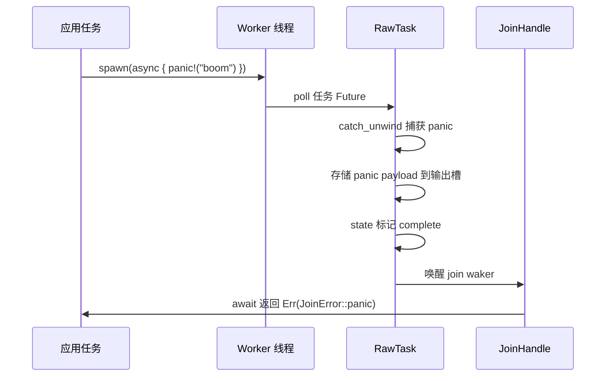
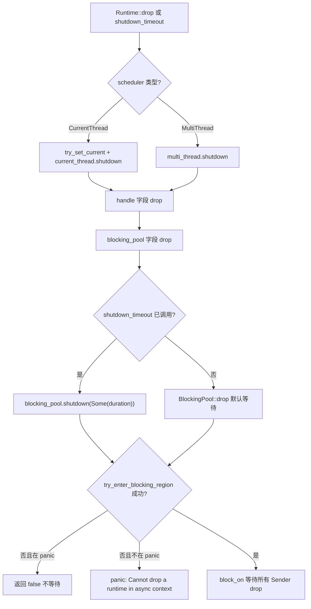
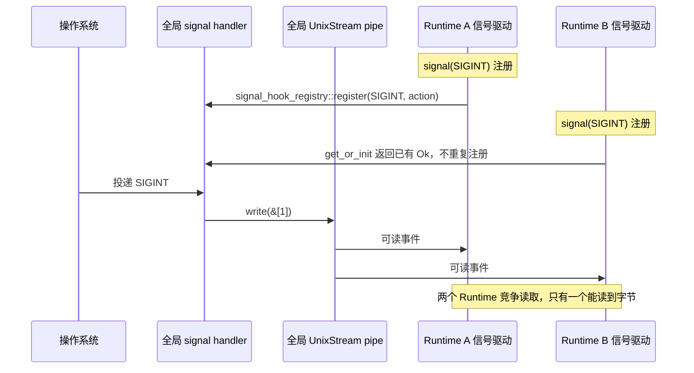

# Back to Top ↑

In the previous chapter, we dissected the coop cooperative budget: each task has only a limited budget within one scheduling cycle, and once exhausted, it must yield, thereby preventing a single task from starving others. But the budget mechanism only solves the "fair scheduling" problem. In real production environments, there is another category of more insidious traps—cancellation safety, panic propagation, and shutdown ordering. When select! cancels a Future, when a task panic is caught, when the Runtime begins shutting down, the boundary behavior of the code often contradicts intuition. This chapter starts with cancellation safety, first examining what exactly is lost when a Future is dropped.

# 13.2 Panic Propagation: How JoinError Captures Crashes

## Intuitive Model

A Tokio task panic does not crash the entire process (unless panic=abort); instead, it is caught, packaged into`JoinError`, and returned through`JoinHandle::await`. This is like an accident at a workstation on a factory assembly line: the safety net catches the worker, but the product is scrapped—what you get is an "accident report" rather than the product.

## Data Structure and State

`JoinHandle<T>`'s`Future::Output`is`super::Result<T>`, i.e.,`Result<T, JoinError>` [FACT:tokio/src/runtime/task/join.rs:325]。`JoinError`has two forms: panic and cancelled. The documentation example demonstrates the panic scenario:

```rust
let join_handle = tokio::spawn(async { panic!("boom"); });
let err = join_handle.await.unwrap_err();
assert!(err.is_panic());
```

[FACT:tokio/src/runtime/task/join.rs:121-127]

The mechanism by which panic is caught is in`RawTask`'s poll path: when a task is polled, it is wrapped with`catch_unwind`. After a panic occurs, the payload is stored into the task's output slot, the state is marked as complete, and then the join waker is awakened.`JoinHandle::poll`What is read through`try_read_output`is`Err(JoinError::panic(payload))`。

## Scenario-Driven Walkthrough: Panic Propagation Chain



Key point: the panic payload is fully preserved,`JoinError`implements`std::error::Error`, and you can retrieve`into_panic()`through`Box<dyn Any + Send>`, then use`downcast_ref::<&str>()`to extract the panic message.

## Design Considerations and Pitfalls

**Pitfall 1:`JoinHandle`'s`UnwindSafe`is manually implemented.**

```rust
impl UnwindSafe for JoinHandle {}
impl RefUnwindSafe for JoinHandle {}
```

[FACT:tokio/src/runtime/task/join.rs:176-181]

This is an unconditional implementation and does not require`T: UnwindSafe`. Reason:`JoinHandle`itself does not hold`T`，`T`In the heap allocation of the task, at panic time it has already been isolated by`catch_unwind`. So even if`T`is not`UnwindSafe`，`JoinHandle`, it is still safe.

**Pitfall 2: Panic does not automatically propagate to the parent task.**If task A spawns task B and B panics, A will not automatically be notified unless A awaits B's`JoinHandle`. If A does not await, B's panic is silently swallowed. This is one of the most insidious sources of bugs in production environments.

**Pitfall 3:`spawn_blocking`'s panic is likewise caught.**The worker of the blocking thread pool also wraps the task with`catch_unwind`. After a panic, the thread does not die but returns to the pool to continue taking work. But if you hold`Mutex`in a blocking task and do not release it on panic, it will cause lock poisoning—this is`std::sync::Mutex`'s inherent behavior, and Tokio does not intervene.

**Pitfall 4: Panic during Runtime drop.**If a task panics during Runtime drop,`catch_unwind`still takes effect, but at this point the join waker may already be invalid, and the panic payload will be discarded. This is a subset of the shutdown ordering problem, which will be expanded in the next section.

# 13.3 Shutdown Ordering: Cleanup of Blocking Threads and I/O Resources

## Intuitive Model

Runtime shutdown is like a restaurant closing: first let the front desk stop taking customers (stop accepting new tasks), then wait for the kitchen to finish the dishes at hand (async tasks run to the next yield point), and finally wait for outsourced helpers to finish up (blocking threads return). If the order is wrong, problems arise—for example, if you send the helpers away first, the kitchen's dishes will never be finished.

## Data Structure and Shutdown Path

`Runtime`'s three fields determine the shutdown order:

```rust
pub struct Runtime {
    scheduler: Scheduler,
    handle: Handle,
    blocking_pool: BlockingPool,
}
```

[FACT:tokio/src/runtime/runtime.rs:97-106]

`Drop`Implementation:

```rust
impl Drop for Runtime {
    fn drop(&mut self) {
        match &mut self.scheduler {
            Scheduler::CurrentThread(current_thread) => {
                let _guard = context::try_set_current(&self.handle.inner);
                current_thread.shutdown(&self.handle.inner);
            }
            Scheduler::MultiThread(multi_thread) => {
                multi_thread.shutdown(&self.handle.inner);
            }
        }
    }
}
```

[FACT:tokio/src/runtime/runtime.rs:506-521]

Note:`Drop`only handles`scheduler`，**does not explicitly handle`blocking_pool`**。`blocking_pool`'s shutdown occurs in its own`Drop`, triggered by field drop order after`Runtime::drop`returns. Field drop order is declaration order:`scheduler` → `handle` → `blocking_pool`. Therefore, the blocking pool is shut down last.

But`shutdown_timeout`explicitly controls the order:

```rust
pub fn shutdown_timeout(mut self, duration: Duration) {
    self.handle.inner.shutdown();
    self.blocking_pool.shutdown(Some(duration));
}
```

[FACT:tokio/src/runtime/runtime.rs:457-461]

First`handle.inner.shutdown()`notifies the scheduler and I/O driver to stop, then`blocking_pool.shutdown(Some(duration))`waits for blocking tasks, at most waiting`duration`。

## The underlying mechanism of blocking pool shutdown

`blocking/shutdown.rs`uses an ingenious oneshot channel:

```rust
pub(super) struct Sender {
    _tx: Arc>,
}

pub(super) struct Receiver {
    rx: oneshot::Receiver,
}
```

[FACT:tokio/src/runtime/blocking/shutdown.rs:13-19]

Each blocking worker holds a`Sender`clone (internally`Arc<oneshot::Sender>`). When all workers exit and all`Sender`are dropped,`Receiver`receives the notification.`wait`Method:

```rust
pub(crate) fn wait(&mut self, timeout: Option) -> bool {
    use crate::runtime::context::try_enter_blocking_region;

    if timeout == Some(Duration::from_nanos(0)) {
        return false;
    }

    let mut e = match try_enter_blocking_region() {
        Some(enter) => enter,
        _ => {
            if std::thread::panicking() {
                return false;
            } else {
                panic!(
                    "Cannot drop a runtime in a context where blocking is not allowed. \
                    This happens when a runtime is dropped from within an asynchronous context."
                );
            }
        }
    };

    if let Some(timeout) = timeout {
        e.block_on_timeout(&mut self.rx, timeout).is_ok()
    } else {
        let _ = e.block_on(&mut self.rx);
        true
    }
}
```

[FACT:tokio/src/runtime/blocking/shutdown.rs:37-70]

Step-by-step analysis:

1. `timeout == Some(0)`directly returns false—this is`shutdown_background`'s path, without waiting.

2. `try_enter_blocking_region()`Attempts to enter the blocking region. If currently in an async context (such as dropping Runtime inside an async task), returns`None`。

3. When entry fails, if currently panicking, return false (do not panic while already panicking); otherwise panic with a clear error message.

4. If there is a timeout, use`block_on_timeout`, returning false on timeout; if there is no timeout, wait indefinitely.

## Complete Flow of Shutdown Ordering



## Design Considerations and Pitfalls

**Pitfall 1: Dropping Runtime in an async context will panic.**The error message is clear: "Cannot drop a runtime in a context where blocking is not allowed"[FACT:tokio/src/runtime/blocking/shutdown.rs:51-54]. The solution is to use`shutdown_background()`, which is equivalent to`shutdown_timeout(Duration::from_nanos(0))` [FACT:tokio/src/runtime/runtime.rs:494-496], without waiting for blocking tasks.

**Pitfall 2:`shutdown_background`will leak blocking tasks.**The documentation explicitly warns "this may result in a resource leak (in that any blocking tasks are still running until they return)"[FACT:tokio/src/runtime/runtime.rs:470-472]. Blocking tasks will continue running until they naturally return, but the Runtime has already been dropped, and the resources they hold may have become invalid.

**Pitfall 3: I/O resources become invalid after the Runtime is dropped.**The documentation states "Once the runtime has been dropped, any outstanding I/O resources bound to it will no longer function"[FACT:tokio/src/runtime/runtime.rs:52-54]。`is_rt_shutdown_err`The function is used to detect this kind of error[FACT:tokio/src/runtime/runtime.rs:585-593]。

**Pitfall 4:`Drop`waits indefinitely by default.**The documentation points out "The`Drop` implementation waits forever for this」[FACT:tokio/src/runtime/runtime.rs:43-44]. If a blocking task gets stuck (e.g., an infinite loop), dropping the Runtime will hang forever. In production, you should use`shutdown_timeout`to set an upper limit.

# 13.4 Signal Handling and Multi-Runtime Conflicts

## Intuitive Model

Unix signals are process-level, but Tokio's`Signal`is bound to the Runtime. This is like a building sharing a single fire alarm bell, but each room installing its own independent receiver—the first person to install a receiver changed how the bell is wired, and everyone after can only share that change.

## Data Structures and Global State

`signal_enable`is the entry point for registering signal handlers:

```rust
fn signal_enable(signal: SignalKind, handle: &Handle) -> io::Result {
    let signal = signal.0;
    if signal  slot,
        None => return Err(io::Error::other("signal too large")),
    };

    siginfo
        .init
        .get_or_init(|| {
            unsafe { signal_hook_registry::register(signal, move || action(globals, signal)) }
                .map(|_| ())
                .map_err(|e| e.raw_os_error())
        })
        .map_err(|e| {
            e.map_or_else(
                || Error::other("registering signal handler failed"),
                || Error::from_raw_os_error,
            )
        })
}
```

[FACT:tokio/src/signal/unix.rs:266-296]

Key points:

1. `signal <= 0 || FORBIDDEN.contains(&signal)`rejects illegal signals.

2. `handle.check_inner()`checks whether the signal driver is running—if the Runtime has been shut down, this will fail.

3. `siginfo.init.get_or_init(...)`uses`OnceLock`to ensure each signal registers an OS handler only once.`get_or_init`The closure calls`signal_hook_registry::register`, which is a global, process-level registration.

4. The registered handler is`action(globals, signal)`, which does two things:`globals.record_event(signal)`records the event, then writes a byte to the pipe to wake up the driver[FACT:tokio/src/signal/unix.rs:252-259]。

## The Root Cause of Multi-Runtime Conflicts

`globals()`returns a process-level global`Globals`，`OsExtraData`Inside`UnixStream`the pair is also global:

```rust
pub(crate) struct OsExtraData {
    sender: UnixStream,
    pub(crate) receiver: UnixStream,
}
```

[FACT:tokio/src/signal/unix.rs:61-64]

`Default`The implementation creates a pair of`UnixStream` [FACT:tokio/src/signal/unix.rs:61-64]. This pipe is globally unique, and all Runtimes' signal drivers share it.

Here's the problem:`signal_enable`Inside`handle.check_inner()`checks**the current Runtime's**signal driver. But the handler registered by`signal_hook_registry::register`is**process-level**, and it writes to the**global**pipe. If Runtime A registers SIGINT first, then Runtime B also registers SIGINT,`get_or_init`will directly return the existing`Ok(())`, without re-registering. But Runtime B's signal driver will read data from the global pipe—the two Runtimes will compete for bytes from the same pipe.

## Scenario-Driven Walkthrough: Multi-Runtime Signal Contention



## Design Reflections and Pitfalls

**Pitfall 1: Signal handlers are never unloaded.**The documentation explicitly warns "Once a signal handler is registered with the process the underlying libc signal handler is never unregistered"[FACT:tokio/src/signal/unix.rs:379-380]. Even if the`Signal`instance is dropped, subsequent signals will still be captured by Tokio, and the default behavior will not be restored[FACT:tokio/src/signal/unix.rs:338-340]。

**Pitfall 2: Signals get coalesced.**The documentation states "before`poll` is called, all signal notifications are coalesced into one item returned from `poll`」[FACT:tokio/src/signal/unix.rs:312-315]. If you receive 10 SIGINTs but only poll once, you'll only see one event. This is a characteristic of Unix signals themselves (standard signals are not queued); Tokio does not perform additional coalescing.

**Pitfall 3: Signals may be lost under multiple Runtimes.**Since the global pipe is read competitively by multiple Runtimes, one Runtime may read the byte while another waits forever. In production, you should handle signals in only one Runtime, or use`signal_hook`to manage it yourself.

**Pitfall 4:`signal`function panic conditions.**The documentation states "This function panics if there is no current reactor set, or if the`rt` feature flag is not enabled」[FACT:tokio/src/signal/unix.rs:398-405]. Calling`signal()`outside a Runtime will panic.

**Pitfall 5:`recv()`cancel safety.**The documentation guarantees "This method is cancel safe. If you use it as a branch in`tokio::select!` and another branch completes first, then it is guaranteed that no signal is lost」[FACT:tokio/src/signal/unix.rs:423-427]. This is because signal events are stored in the global`EventInfo`,`recv()`only reads and does not consume the underlying state.

# Design Reflections

The three topics in this chapter share one underlying pattern:**Ownership of state determines the safety of cancellation/shutdown/signals**。

- `JoinHandle`is cancel-safe, because the output is on the heap, and the handle is just a reference.
- Runtime shutdown order is sensitive, because the blocking pool and the scheduler share`Handle`, wrong order will cause deadlock or panic.
- Signals conflict across multiple Runtimes, because handlers and pipes are process-level global state, while`Signal`is a Runtime-level view.

After understanding this pattern, the pitfall-avoidance checklist can be summarized into three principles:

1. **Cancellation safety = state lives outside the Future.**If the Future has an internal buffer, dropping it will lose data.`JoinHandle`、`Signal::recv`、`tokio::sync::mpsc::Receiver::recv`all satisfy this condition.

2. **Shutdown order = reverse of dependency direction.**Whoever depends on whom, shut down the depended-upon first. The scheduler depends on the I/O driver, so shut down the scheduler first; the blocking pool is independent, so shut it down last.

3. **Global state = multi-instance conflict.**Any process-level resource (signal handler, pipe, file descriptor table) will conflict under multiple Runtimes; either restrict to a single Runtime or use external synchronization.

# Chapter Summary

# Chapter Review Questions

Q1: If you remove`JoinHandle::poll`from`coop::poll_proceed(cx)`, in what scenario would it cause other tasks to starve? Why does`try_read_output`itself not consume budget?

**Reference Analysis**：`coop::poll_proceed(cx)`consumes cooperative budget at[FACT:tokio/src/runtime/task/join.rs:325-325]. If removed, a task that repeatedly`select!`multiple`JoinHandle`in a loop can poll all handles indefinitely within a single scheduling cycle, never returning`Pending`, thereby starving other tasks on the same worker.`try_read_output`itself does not consume budget, because it is just a memory read plus a possible waker store, involving no I/O or lock contention, with minimal overhead. The design intent of the budget mechanism is to constrain "operations that may run for a long time," not to charge for every poll. Note that`coop.made_progress()`only calls`ret.is_ready()`when[FACT:tokio/src/runtime/task/join.rs:349-351], i.e., budget is only returned when output is actually obtained—this is to prevent operations that "polled but got no result" from accumulating budget consumption.

Q2：`blocking/shutdown.rs`In the`wait`method of`try_enter_blocking_region()`, if`None`returns`false`and a panic is currently in progress, why choose to return

**instead of continuing to wait? What would happen if changed to continue waiting?**：`try_enter_blocking_region()`Reference Analysis`None`Returning[FACT:tokio/src/runtime/blocking/shutdown.rs:44-57]indicates that we are currently in an async context and blocking`false`is not allowed. If a panic is in progress at this time, the code chooses to return[FACT:tokio/src/runtime/blocking/shutdown.rs:47-49]without waiting for`block_on`. The reason is: panicking again during panic unwinding causes the process to abort (double panic). If changed to continue waiting, it would need to call`block_on`, and in an async context`false`will panic—panicking during panic unwinding directly aborts the process, losing all diagnostic information. Returning

lets drop continue to completion, preserving the panic information. This is a "graceful degradation" design: an incomplete shutdown is better than a process crash.`Signal`Q3: Suppose you create`Signal`in Runtime A to listen for SIGTERM, then move`signal_enable`to Runtime B for polling.`handle.check_inner()`Which Runtime does the`Signal`inside check? If Runtime A is dropped first, can the

**in Runtime B still receive signals?**：`signal_enable`Reference Analysis`signal()`executes when`handle`is called, at which point[FACT:tokio/src/signal/unix.rs:398-405]。`check_inner()`is Runtime A's[FACT:tokio/src/signal/unix.rs:275]。`Signal`checks Runtime A's signal driver`RxFuture`internally is`watch::Receiver<()>` [FACT:tokio/src/signal/unix.rs:366-368], wrapping`Globals`, and this receiver is registered on the global`EventInfo`'s`record_event`. If Runtime A is dropped, its signal driver stops reading data from the global pipe, but the global handler will still`EventInfo`and write to the pipe. If Runtime B's signal driver is also running, it will read the pipe data and trigger`Signal`, thereby waking`Signal` **'s waker. So the**in Runtime B may`Signal`still receive signals, but it depends on whether Runtime B has a signal driver running. If Runtime B has no signal driver (e.g., signal feature not enabled or driver already shut down), no one reads the pipe data, and

# will never be woken. This is the fragility of multi-Runtime signal handling.

Chapter Transition`catch_unwind`Cancellation safety, panic propagation, shutdown order, signal conflicts—the common root of these four problems is the ambiguity of "state ownership" at async boundaries. Tokio provides engineering-usable answers by putting state on the heap, managing lifetimes with reference counting, using`Globals`to isolate panics, and using a global

to share signal state. But these answers all have boundary conditions that must be explicitly handled in production.

At this point, we have covered the most error-prone boundary areas in Tokio production environments: cancellation safety relies on output being stored on the heap, and the atomicity of try_read_output; JoinHandle::drop does not cancel the task, while abort truly cancels it but has no effect on spawn_blocking; panics are caught by catch_unwind and packaged into JoinError, and are silently lost if not awaited; Runtime shutdown has a strict order, and dropping it in an async context will panic; signal handlers are process-level global state and are never unregistered once registered. Behind these rules are Tokio's repeated trade-offs between correctness and performance. In the next chapter, we will step away from specific mechanisms, review the origins of these trade-offs from an architectural perspective, and look ahead to where io_uring, driver refactoring, and custom executor interfaces will take Tokio.
