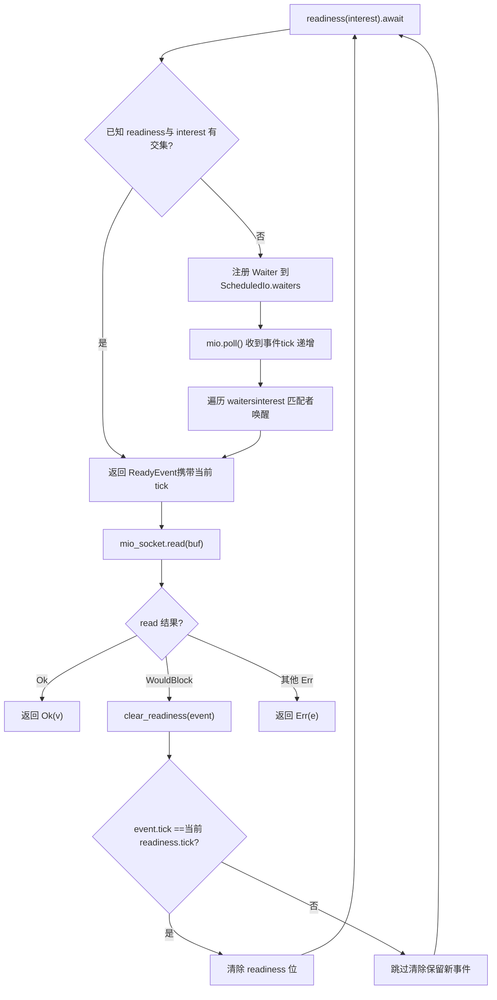
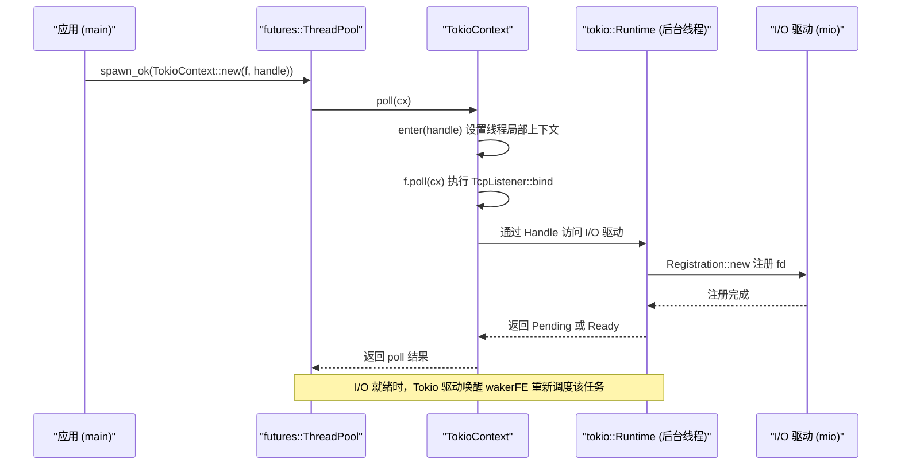

# Chapter 14: Architectural Trade-offs and Future Evolution: From io_uring to Pluggable Drivers

In the previous chapter, we sorted out four types of production pitfalls: cancellation safety, panic propagation, shutdown order, and signal conflicts. They may seem scattered, but in fact they all point to the same architectural problem: how state ownership is clearly divided across asynchronous boundaries. And the way ownership is divided is precisely determined by the three lowest-level architectural decisions of the runtime—how tasks are scheduled, how I/O events are dispatched, and how concurrency correctness is verified. This chapter no longer digs into the implementation details of a specific function, but instead stands at the architectural level, reviews Tokio's trade-offs on these decisions, and follows the evolution clues already embedded in the official documentation and source code to see where io_uring, driver refactoring, and custom executor interfaces will take Tokio. After reading this chapter, you should be able to answer a practical question: when should you extend Tokio, and when should you bypass it.

# 1. Three Historical Trade-offs: Why It Is the Way It Is Now

## Intuitive model

Imagine Tokio as a restaurant that has been open for ten years. The kitchen scheduling method (work-stealing), the separate staffing of food runners (separation of the I/O driver from the scheduler), and the kitchen hygiene inspection system (loom concurrency verification) were not all designed on the first day of opening, but gradually evolved as "more customers arrived and dishes became more complex." Only by understanding these evolutions can you judge which designs are forward-looking arrangements and which are historical baggage.

## Trade-off 1: work-stealing instead of a global queue

> **[Design Inference & Architectural Trade-offs]**
> A global queue is the simplest to implement: all tasks go into one`Mutex<VecDeque>`, and worker threads contend for the lock to take tasks. But lock contention worsens as the number of cores increases, and cache locality is poor—which core a task is created on and which core it is executed on are completely random.

The trade-off of work-stealing is: each worker holds a local queue,`spawn`When pushing, it prioritizes the local queue (lock-free, cache-friendly), and only when the local queue is empty does it steal from the tail of another worker's queue. The cost is delayed load balancing, and stealing itself requires atomic operations and memory barriers. Tokio chose the latter because modern servers often have dozens of cores, and the cost of lock contention is far higher than the occasional stealing overhead.

> **[Design Inference & Architectural Trade-offs]**
> The boundary condition of this decision is:**task granularity cannot be too fine**. If each task only does a few microseconds of work, the overhead of stealing and scheduling will become disproportionately large. This is also why Tokio, in addition to`spawn_blocking`, also requires long tasks to actively`yield_now()`—cooperative scheduling is essentially there to backstop work-stealing.

## Trade-off 2: The I/O driver is independent of the scheduler

This is the most intriguing point in this chapter's source material. Look at`tokio/src/runtime/io/mod.rs`'s module structure:

[FACT:tokio/src/runtime/io/mod.rs:5-22]

```rust
mod driver;
use driver::{Direction, Tick};
pub(crate) use driver::{Driver, Handle, ReadyEvent};

mod registration;
pub(crate) use registration::Registration;

mod registration_set;
use registration_set::RegistrationSet;

mod scheduled_io;
use scheduled_io::ScheduledIo;

mod metrics;
use metrics::IoDriverMetrics;

use crate::util::ptr_expose::PtrExposeDomain;
static EXPOSE_IO: PtrExposeDomain = PtrExposeDomain::new();
```

Note that`driver`、`registration`、`scheduled_io`are three independent modules, and externally only`Driver`、`Handle`、`ReadyEvent`、`Registration`these types are exposed.`ScheduledIo`is`pub(crate)`'s—it is`PtrExposeDomain`wrapped, used to expose raw pointers to concurrency checking under loom tests.

> **[Design Inference & Architectural Trade-offs]**
> Why is the I/O driver not directly embedded into the scheduler? Because their lifecycles and concurrency models are different. The scheduler cares about "which task should run," while the I/O driver cares about "which fd is ready." If coupled, then every adjustment to the scheduling strategy would require touching the I/O path, and vice versa. More importantly,`block_on`the single-threaded runtime also needs an I/O driver, but does not need a work-stealing scheduler—separation allows the two runtimes to reuse the same I/O implementation.

## Trade-off 3: Using loom for concurrency model checking

`tokio/src/loom/mod.rs`It is only 14 lines, yet it reveals Tokio's verification strategy for concurrency correctness:

[FACT:tokio/src/loom/mod.rs:1-14]

```rust
//! This module abstracts over `loom` and `std::sync` depending on whether we
//! are running tests or not.

#![allow(unused)]

#[cfg(not(all(test, loom)))]
mod std;
#[cfg(not(all(test, loom)))]
pub(crate) use self::std::*;

#[cfg(all(test, loom))]
mod mocked;
#[cfg(all(test, loom))]
pub(crate) use self::mocked::*;
```

The key is the`#[cfg(all(test, loom))]`condition: only when both`test`and`loom`cfgs are enabled at the same time will the`mocked`module replace`std`. This means there is no loom code at all in production builds, with zero runtime overhead.

> **[Design Inference & Architectural Trade-offs]**
> The value of loom is that it can exhaustively enumerate "all possible orders of thread interleavings." Like`ScheduledIo`in`AtomicUsize`'s read-modify-write,`Waiters`Linked list insertion and deletion—these might run a million times on real hardware without errors, but loom can construct an interleaving that triggers a race condition within seconds. The cost is slow test execution and high memory usage, so it can only be used for unit tests, not in production.

## Design Reflections

These three trade-offs share a common characteristic:**They all chose the "more complex but more scalable" approach, and confined the complexity internally**. The complexity of work-stealing is hidden in the scheduler, the complexity of I/O driver is hidden in`ScheduledIo`, and the complexity of loom is hidden in cfg conditions. The externally exposed API is always`spawn`、`TcpStream::read`these simple interfaces.

> **[Design Inference & Architectural Trade-offs]**
> This is also the first principle for judging "when to extend Tokio":**If your needs can be expressed by existing APIs, don't touch the internal structures**. Once you start depending on`pub(crate)`'s types or`tokio_unstable`'s cfg, it means you've bound yourself to Tokio's internal implementation, and you'll pay the price when upgrading.

---

# II. Driver Refactoring: From "One Waker One Direction" to "Arbitrary Interest Sets"

## Intuitive Model

Early Tokio I/O types had a hard limitation:`async fn read(&mut self)`requires`&mut self`. This is like a restaurant with only one pickup window, where only one person can queue at a time—because the waker is stored inside the I/O resource, not in the Future corresponding to the operation.`tokio/docs/reactor-refactor.md`fully documents the cause of this limitation and the refactoring plan.

## Pain Points of the Old Architecture

The document states the problem right at the beginning:

[FACT:tokio/docs/reactor-refactor.md:16-20]

```rust
Currently, I/O types require `&mut self` for `async` functions. The reason for
this is the task's waker is stored in the I/O resource's internal state
(`ScheduledIo`) instead of in the future returned by the `async` function.
Because of this limitation, I/O types limit the number of wakers to one per
direction (a direction is either read-related events or write-related events).
```

> **[Design Inference & Architectural Trade-offs]**
> Storing the waker inside the resource means "one direction can only have one waiter." If you want to read and write the same`TcpStream`simultaneously, you must`split()`it into two halves, each holding an independent waker slot. This is why`TcpStream::split()`exists—it's not an API design preference, but a direct constraint of the internal data structure.

## New Architecture: Moving the Waker into the Future

The core idea of the refactoring is "moving the waker from the resource state into the operation Future," thereby supporting multiple wakers registered per operation:

[FACT:tokio/docs/reactor-refactor.md:22-25]

```rust
Moving the waker from the internal I/O resource's state to the operation's
future enables multiple wakers to be registered per operation. The "intrusive
wake list" strategy used by `Notify` applies to this case, though there are some
concerns unique to the I/O driver.
```

The new`ScheduledIo`structure is as follows:

[FACT:tokio/docs/reactor-refactor.md:97-134]

```rust
#[derive(Debug)]
pub(crate) struct ScheduledIo {
    /// Resource's known state packed with other state that must be
    /// atomically updated.
    readiness: AtomicUsize,

    /// Tracks tasks waiting on the resource
    waiters: Mutex,
}

#[derive(Debug)]
struct Waiters {
    // List of intrusive waiters.
    list: LinkedList,

    /// Waiter used by `AsyncRead` implementations.
    reader: Option,

    /// Waiter used by `AsyncWrite` implementations.
    writer: Option,
}

// This struct is contained by the **future** returned by `readiness()`.
#[derive(Debug)]
struct Waiter {
    /// Intrusive linked-list pointers
    pointers: linked_list::Pointers,

    /// Waker for task waiting on I/O resource
    waiter: Option,

    /// Readiness events being waited on. This is
    /// the value passed to `readiness()`
    interest: mio::Ready,

    /// Should not be `Unpin`.
    _p: PhantomPinned,
}
```

There are several elegant design points worth elaborating on:

**First,`readiness`is`AtomicUsize`，`waiters`is`Mutex<Waiters>`。**Why not use a single lock to protect both? Because`readiness`'s read operations are extremely frequent (checked on every`readiness()`call), while write operations only occur when mio events are received. Using atomic variables to make the read path lock-free is a typical read-write separation optimization.

**Second,`Waiter`is an intrusive linked list node.** `pointers: linked_list::Pointers<Waiter>`makes`Waiter`itself part of the linked list, without needing to allocate additional nodes.`_p: PhantomPinned`explicitly marks it as not`Unpin`—because once an intrusive linked list node's address moves, the linked list breaks.

**Third,`reader`and`writer`the two`Option<Waker>`are for`AsyncRead`/`AsyncWrite`'s use.**The document explains the reason:

[FACT:tokio/docs/reactor-refactor.md:210-213]

```rust
The `AsyncRead` and `AsyncWrite` traits use a "poll" based API. This means that
it is not possible to use an intrusive linked list to track the waker.
Additionally, there is no future associated with the operation which means it is
not possible to cancel interest in the readiness events.
```

> **[Design Inference & Architectural Trade-offs]**
> This is a compromise coexistence of the old and new mechanisms:`async fn`The path uses an intrusive linked list (supports multiple waiters, cancellable),`poll`The path uses fixed slots (doesn't support cancellation, but is trait-compatible). This "coexistence of two mechanisms" is a typical cost of incremental refactoring.

## Race Conditions and the Tick Mechanism

The trickiest problem in the refactoring is race conditions. The document gives a specific deadlock scenario:

[FACT:tokio/docs/reactor-refactor.md:175-175]

```rust
If care is not taken, if between `mio_socket.read(buf)` returning and
`clear_readiness(event)` is called, a readiness event arrives, the `read()`
function could deadlock. This happens because the readiness event is received,
`clear_readiness()` unsets the readiness event, and on the next iteration,
`readiness().await` will block forever as a new readiness event is not received.
```

The solution is to introduce a tick mechanism, splitting`readiness`this`AtomicUsize`into multiple bit segments:

[FACT:tokio/docs/reactor-refactor.md:199-199]

```
| shutdown | generation |  driver tick | readiness |
|----------+------------+--------------+-----------|
|   1 bit  |   7 bits   +    8 bits    +  16 bits  |
```

> **[Design Inference & Architectural Trade-offs]**
> This bit segment layout is a classic case of "trading space for correctness."`tick`increments on each`mio::poll()`,`ReadyEvent`carries the tick at read time.`clear_readiness()`Only clears the ready state when the tick matches—if the tick doesn't match, it means new events arrived in the meantime, and it must not clear. This resolves the race between "clearing" and "new event arrival" within a single atomic read-modify-write.

The following flowchart depicts the decision path between`readiness()`and`clear_readiness()`:



The key branch in this diagram is at`tick_match`: if the tick doesn't match,`clear_readiness`must abandon the clear, otherwise it will lose the just-arrived event, causing the next round of`readiness()`to block permanently.

## Cancelling Interest and Memory Leaks

The intrusive linked list brings a new problem: if the Future returned by`readiness()`is dropped early, the linked list node must be removed. The document explicitly warns:

[FACT:tokio/docs/reactor-refactor.md:144-148]

```rust
The future returned by `readiness()` uses an intrusive linked list to store the
waker with `ScheduledIo`. Because `readiness()` can be called concurrently, many
wakers may be stored simultaneously in the list. If the `readiness()` future is
dropped early, it is essential that the waker is removed from the list. This
prevents leaking memory.
```

> **[Design Inference & Architectural Trade-offs]**
> This is exactly the manifestation of "cancellation safety" from the previous chapter at the I/O layer.`readiness()`'s Future must remove itself from the linked list in the`Drop`implementation, otherwise the node will remain in`ScheduledIo`permanently, both leaking memory and being incorrectly woken when the next event arrives.

## Design Reflections and Production Pitfalls

**Why not use`Vec<Waker>`but instead an intrusive linked list?**The document gives the answer when discussing the`&Resource`implementation:

[FACT:tokio/docs/reactor-refactor.md:228-233]

```rust
It is only possible to implement `AsyncRead` and `AsyncWrite` for resource types
themselves and not for `&Resource`. Implementing the traits for `&Resource`
would permit concurrent operations to the resource. Because only a single waker
is stored per direction, any concurrent usage would result in deadlocks. An
alternate implementation would call for a `Vec` but this would result in
memory leaks.
```

> **[Design Inference & Architectural Trade-offs]**
> `Vec<Waker>`The problem with

**is: after a Future is dropped, the corresponding waker remains in the Vec and cannot be located for removal, and you only discover "this waker is already invalid" when the next event arrives. The intrusive linked list makes the node address the address of a field inside the Future, allowing precise removal on drop.**：`TcpStream::by_ref()`Production Pitfall Points`TcpStreamRef`The`read_waiter`returned by`write_waiter`holds two nodes,

[FACT:tokio/docs/reactor-refactor.md:238-244]

```rust
struct TcpStreamRef {
    stream: &'a TcpStream,

    // `Waiter` is the node in the intrusive waiter linked-list
    read_waiter: Waiter,
    write_waiter: Waiter,
}
```

> **[Design Inference & Architectural Trade-offs]**
> Copy`TcpStreamRef`[Design Inference and Architectural Trade-offs]`select!`This means once`by_ref()`is dropped, both waiter nodes become invalid simultaneously. If you use`TcpStreamRef`'s reference across branches in`TcpStream`, be careful with lifetimes—`select!`cannot outlive

---

# , nor can it be borrowed simultaneously across multiple

## Intuition Model

Sometimes you don't want to use Tokio's scheduler, you just want to borrow its I/O and timers. This is like not wanting to dine in at a restaurant, but only using its takeout window.`examples/custom-executor.rs`This demonstrates this "hybrid mode": using`futures::executor::ThreadPool`for scheduling, and Tokio for I/O.

## Core mechanism: TokioContext

The key to the entire example is`TokioContext`this wrapper type:

[FACT:examples/custom-executor.rs:51-54]

```rust
impl ThreadPool {
    fn spawn(&self, f: impl Future + Send + 'static) {
        let handle = self.rt.handle().clone();
        self.inner.spawn_ok(TokioContext::new(f, handle));
    }
}
```

> **[Design Inference & Architectural Trade-offs]**
> `TokioContext::new(f, handle)`It binds the Future together with Tokio's`Handle`. When the external executor polls this wrapper Future,`TokioContext`it first enters Tokio's runtime context (setting the thread-local`Handle`), then polls the inner`f`. This way,`f`when calling`TcpListener::bind`, it can find Tokio's I/O driver.

Look at the structure of the entire example:

[FACT:examples/custom-executor.rs:38-48]

```rust
static EXECUTOR: Lazy = Lazy::new(|| {
    // Spawn tokio runtime on a single background thread
    // enabling IO and timers.
    let rt = tokio::runtime::Builder::new_multi_thread()
        .enable_all()
        .build()
        .unwrap();
    let inner = futures::executor::ThreadPool::builder().create().unwrap();

    ThreadPool { inner, rt }
});
```

> **[Design Inference & Architectural Trade-offs]**
> Here the Tokio runtime is created but**is not`block_on`driven**—it merely "exists," providing the I/O driver and timers. The actual task scheduling is handled by`futures::executor::ThreadPool`. In this mode, Tokio's worker threads are essentially spinning idle (waiting for I/O events), and task execution happens in futures' thread pool.

## Data flow: a TcpListener::bind's cross-executor journey



The key to this sequence diagram is:**The task's poll happens in the futures thread pool, but the waiting for I/O events happens in Tokio's background threads**. The two are connected through`Handle`and the waker.

## Design Thinking: When to Bypass Tokio

> **[Design Inference & Architectural Trade-offs]**
> The very existence of this example is a signal: Tokio's architecture allows "using only the I/O driver, not the scheduler." The criteria can be summarized in three points:

1. **If you need to integrate with an existing executor ecosystem**(e.g., some frameworks mandate`futures::executor`), using`TokioContext`is the least invasive approach.

2. **If you need complete control over scheduling policy**(e.g., real-time systems requiring deterministic scheduling), Tokio's work-stealing doesn't meet the requirements, but its I/O driver is still usable.

3. **If you just find Tokio's API complicated**, then you shouldn't bypass it—`TokioContext`the cross-executor boundary introduced by

**Production Pitfalls**：`TokioContext`In`block_on`mode, Tokio runtime's`Runtime::shutdown`is never called, meaning`Runtime`'s cleanup logic won't trigger automatically. You must explicitly drop

## before the program exits, otherwise the I/O driver's background threads may not shut down gracefully.

> **[Design Inference & Architectural Trade-offs]**
> `tokio/src/runtime/io/mod.rs`[Design Inference and Architectural Trade-offs]

[FACT:tokio/src/runtime/io/mod.rs:1-4]

```rust
#![cfg_attr(
    not(all(feature = "rt", feature = "net", feature = "io-uring", tokio_unstable)),
    allow(dead_code)
)]
```

reveals how io_uring is integrated:`feature = "io-uring"`Copy`tokio_unstable`Note that**and**appear simultaneously. This means io_uring support is currently`allow(dead_code)`experimental`allow`, and both unstable features must be enabled to compile.

> **[Design Inference & Architectural Trade-offs]**
> .`read`/`write`[Design Inference and Architectural Trade-offs]`ScheduledIo`The fundamental difference between io_uring and epoll is: epoll is "readiness notification," io_uring is "completion notification." The former requires the application to issue`readiness()`system calls itself, while the latter has the kernel directly complete I/O and return results. This is a huge shock to Tokio's

---

# model—

's semantics no longer apply under io_uring, requiring an entirely new "submit-complete" abstraction. This is also why io_uring support remains unstable: it's not as simple as adding a backend, but rather reconstructing the entire I/O driver abstraction layer.

**Chapter Summary**：

- This chapter reviewed Tokio's three core trade-offs from an architectural perspective, and looked ahead at three evolution paths:
- Historical Trade-offs`block_on`work-stealing trades scheduling complexity for multi-core scalability, with the boundary being that task granularity can't be too fine;
- I/O driver is independent of the scheduler, allowing

**and the multi-threaded runtime to reuse the same I/O implementation;**（`reactor-refactor.md`）：

- loom completely disappears in production builds through cfg conditions, only exhaustively enumerating thread interleavings during testing.`ScheduledIo`Driver Refactoring
- Moving the waker from inside`AtomicUsize`to the operation Future, using an intrusive linked list to support multiple waiters;`clear_readiness`using
- `AsyncRead`/`AsyncWrite`'s bitfield layout (shutdown/generation/tick/readiness) to eliminate`reader`/`writer`'s race conditions;

**because poll semantics can't use intrusive linked lists, retaining**：

- fixed slots as a compromise.`tokio_unstable`Future Evolution
- `TokioContext`io_uring requires a new "submit-complete" abstraction, currently protected by
- ;

# allows using only the I/O driver without the scheduler, but requires manual management of the Runtime lifecycle;

The criterion for judging "extend or bypass": if it can be expressed with existing APIs, don't touch internal structures.`ScheduledIo`Chapter Reflection and Self-Test`readiness`Q1: In`tick`'s`clear_readiness`bitfield layout, if the

**field is reduced from 8 bits to 4 bits, in what scenarios would errors be triggered? Please analyze in conjunction with**：`tick`'s tick matching logic.`mio::poll()`Reference Analysis[FACT:tokio/docs/reactor-refactor.md:185-185]。`clear_readiness`increments`event.tick == 当前 readiness.tick`on each[FACT:tokio/docs/reactor-refactor.md:199-199], and only clears readiness bits when`ReadyEvent`. If tick only has 4 bits, then it wraps around every 16 polls. Suppose a certain`clear_readiness`Previously, mio polled once more, and the tick wrapped around to 0. At this point`clear_readiness`discovers the tick mismatch (15 != 0) and will incorrectly skip the clear—but in reality, no new events may have arrived during this period; the tick simply wrapped around. This causes the readiness bit to be permanently retained, and subsequently`readiness()`returns immediately but`read`still`WouldBlock`, falling into a busy loop. The 8-bit tick is sufficient under normal load (a read-clear cycle completes within 256 polls), but under extreme high concurrency there is still a wraparound risk—this is an inherent boundary of the bitfield layout.

Q2: `examples/custom-executor.rs`, the Tokio runtime is created but never`block_on`. If`rt.shutdown_timeout()`is called at this point, what happens? Why does this example choose not to call it?

**Reference Analysis**：`rt.shutdown_timeout()`will wait for all tasks to complete and shut down the I/O driver. But in this example, the tasks actually run on`futures::executor::ThreadPool`on[FACT:examples/custom-executor.rs:51-54], and there are no tasks in the Tokio runtime—it only provides the I/O driver. If`shutdown_timeout`is called, it will return immediately (since there are no tasks), but the I/O driver's background thread may still be running. The example chooses not to call it because`EXECUTOR`is a`Lazy`static variable, handled by Rust's static destructor mechanism when the program exits. The real pitfall is: if the Future wrapped by`TokioContext`is still running and`Runtime`is dropped, then I/O operations inside the Future will panic (runtime context not found). Production environments must ensure all`TokioContext`Futures complete before dropping the Runtime.

Q3: Suppose you want to add an io_uring-based I/O backend to Tokio. Based on`reactor-refactor.md`in`readiness()`'s semantics, which parts can be directly reused, and which must be rewritten?

**Reference Analysis**: What can be directly reused is`Registration`'s registration interface and`ScheduledIo`'s`waiters`linked list structure—they manage "who is waiting," which is independent of whether the underlying layer is epoll or io_uring. What must be rewritten is`readiness()`'s semantics: under epoll it returns "fd ready," while under io_uring there is no concept of "ready"—only "submitted SQE completed."`clear_readiness`'s tick mechanism also needs to be redesigned—io_uring's completion events carry their own user_data identifier, so no tick is needed to distinguish new events from old ones. The most fundamental change is:`readiness()`'s returned Future under io_uring should become "submit SQE and wait for CQE," which means the`Waiter`structure needs to carry SQE parameters, not just`interest`. This is also why io_uring support is protected by`tokio_unstable`[FACT:tokio/src/runtime/io/mod.rs:1-4]—it is not replacing the backend, but changing the I/O driver's abstraction contract.

At this point, we have completed the climb from concrete pitfalls to architectural trade-offs. Looking back at the entire book, from Future's lazy evaluation to scheduler fairness, from cancellation safety to shutdown ordering, and then to this chapter's io_uring and pluggable drivers, all discussions revolve around one core: clearly delineating state ownership at asynchronous boundaries. Tokio's architecture is not set in stone—io_uring's zero-copy I/O, the decoupling of the driver layer, and the opening of custom executor interfaces are all pushing it toward a more flexible and efficient direction. When you close this book, I hope what remains is not a pile of API usage, but a set of judgment: knowing when to trust the runtime, when to intervene at the lower level, and how to avoid those combinations that bite in production environments. The async Rust ecosystem is still growing rapidly, and keeping track of source code and official documentation is more important than remembering any conclusion.
