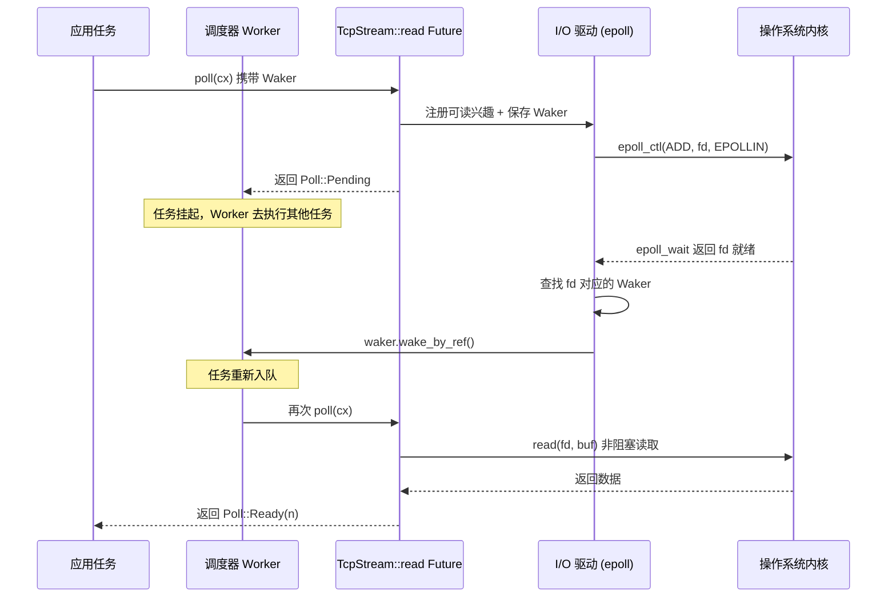

# Capítulo 1: El modelo mental de la asincronía: el trío de Future, Waker y Executor

La programación asíncrona en Rust no es una biblioteca, sino un protocolo a nivel de lenguaje. Que Tokio haya podido convertirse en un runtime de nivel producción no se debe a que inventara Future, sino a que implementa con precisión las condiciones límite de cada contrato de este protocolo. Este capítulo no se apresura a saltar al código del planificador de Tokio, sino que primero explica a fondo los límites de responsabilidad y el flujo de control inverso del «trío»: Future, Waker y Executor. Una vez entendido cómo encajan estos tres, el ensamblaje del Runtime, la planificación work-stealing y el driver de E/S de los capítulos posteriores tendrán un punto de apoyo.

# 1.1 De bloqueo a polling: por qué Rust elige poll en lugar de callbacks

## Modelo intuitivo

Imagina que pides en un restaurante un plato que debe prepararse al momento. La asincronía basada en callbacks (como el estilo temprano de Node.js) equivale a que dejas tu número de teléfono y, cuando el chef termina,**te llama él**——el control está en manos del chef, y tu código solo responde pasivamente. La asincronía basada en polling (la elección de Rust) equivale a que recibes un comprobante para recoger el plato, y**tú mismo decides**cuándo ir a la ventanilla a preguntar «¿ya está?»: si no está, haces otra cosa; si está, lo recoges.

Esta diferencia parece mínima, pero determina la forma de todo el sistema. En el modelo de callbacks, cada operación asíncrona debe llevar un closure de «qué hacer al terminar», los closures se anidan capa tras capa formando el infierno de callbacks, y cancelar una operación es extremadamente difícil: no puedes «retirar» un callback ya registrado. En el modelo de polling, un Future no es más que una máquina de estados,`poll`es una acción de consulta pura; si no se avanza, no se consumen recursos; cancelar es simplemente drop, limpio y directo.

## El contrato central del modelo de polling

El trait definido por la biblioteca estándar de Rust`Future`solo tiene dos elementos: un método`poll`y un tipo asociado`Output`Tokio no redefine este trait, sino que reutiliza directamente la implementación de la biblioteca estándar. Esto se refleja claramente en el código fuente:

```rust
// tokio/src/future/mod.rs
cfg_not_trace! {
    cfg_rt! {
        pub(crate) use std::future::Future;
    }
}
```

[FACT:tokio/src/future/mod.rs:24-28]

Este fragmento de código revela un hecho importante: cuando no está habilitada la característica`tracing`, el`Future`interno de Tokio es un alias de`std::future::Future`, sin ningún envoltorio. Solo cuando se habilita`tracing`, se reemplaza por`InstrumentedFuture`:

```rust
cfg_trace! {
    mod trace;
    #[allow(unused_imports)]
    pub(crate) use trace::InstrumentedFuture as Future;
}
```

[FACT:tokio/src/future/mod.rs:18-22]

> **[Design Inference & Architectural Trade-offs]**
> Este diseño de «cero sobrecarga por defecto, instrumentación bajo demanda» es la filosofía constante de Tokio: la ruta crítica no introduce ninguna capa de abstracción adicional, y la observabilidad se superpone como una característica opcional.`InstrumentedFuture`La existencia de demuestra que el equipo de Tokio considera que el coste de instrumentación de tracing no debe recaer sobre todos los usuarios.

## Las tres restricciones implícitas del contrato de poll

`poll`La firma del método es`fn poll(self: Pin<&mut Self>, cx: &mut Context<'_>) -> Poll<Self::Output>`. En esta firma se esconden tres contratos; violar cualquiera de ellos provoca comportamiento indefinido o errores lógicos:

**Contrato uno: Pin garantiza la seguridad de las autorreferencias.** `Pin<&mut Self>`significa que, una vez que un Future es poll, su dirección de memoria ya no puede moverse. Esto se debe a que un bloque async, tras compilarse, genera una máquina de estados que contiene autorreferencias: las variables locales pueden contener referencias a otros campos dentro de la misma máquina de estados. Si se permitiera moverla, esas referencias quedarían colgantes.

**Contrato dos: Pending debe haber registrado un despertar.**Cuando`poll`devuelve`Poll::Pending`, el Future ya debe haber, mediante`cx.waker()`Se obtuvo y guardó el Waker, o ya se ha registrado el Waker en alguna fuente de eventos. De lo contrario, el ejecutor nunca sabrá cuándo este Future puede volver a ser poll, lo que provocará que la tarea quede suspendida permanentemente.

**Contrato tres: Después de Ready no se debe volver a poll.**Una vez que`poll`devuelve`Poll::Ready`, volver a poll el mismo Future es un error lógico (aunque no provoca UB, el comportamiento es indefinido). El ejecutor tiene la responsabilidad de no volver a programar esa tarea después de recibir Ready.

De estos tres contratos, el contrato dos es el lugar más propenso a errores y también la razón fundamental de la existencia del Waker.

# 1.2 Waker: el vehículo del flujo de control inverso

## Modelo intuitivo

El Waker es el «localizador vibratorio para recoger comida» que te da el restaurante. No necesitas quedarte parado frente a la ventana preguntando repetidamente «¿ya está?» — eso desperdiciaría tu tiempo. Solo necesitas entregarle el localizador al chef la primera vez que vas a la ventana (registrar el Waker) y luego dedicarte tranquilamente a otras cosas. Cuando la comida esté lista, el chef presiona el botón, el localizador vibra (llamada a`wake`), y tras recibir la señal vas de nuevo a la ventana a recoger la comida (volver a poll).

Si no existiera el Waker, el ejecutor solo tendría dos opciones: o hacer busy polling de todas las tareas (desperdiciando CPU), o nunca volver a poll las tareas que ya devolvieron Pending (las tareas mueren de inanición). El Waker es el único mecanismo para romper este estancamiento.

## Diseño del diseño de memoria y la tabla virtual del Waker

Waker es un tipo de la biblioteca estándar, pero su diseño influye directamente en la estructura de tareas de Tokio.`Waker`Esencialmente es un puntero gordo: una`RawWaker`estructura, que contiene un puntero a datos y un puntero a la tabla virtual.

```rust
// 标准库中的定义（非 Tokio 源码，此处为背景说明）
pub struct RawWaker {
    data: *const (),
    vtable: &'static RawWakerVTable,
}

pub struct RawWakerVTable {
    clone: unsafe fn(*const ()) -> RawWaker,
    wake: unsafe fn(*const ()),
    wake_by_ref: unsafe fn(*const ()),
    drop: unsafe fn(*const ()),
}
```

> **[Design Inference & Architectural Trade-offs]**
> Lo ingenioso de este diseño radica en:`Waker`a sí mismo no le importa qué significa concretamente «despertar». Solo es un vehículo de cuatro punteros a función. Tokio puede proporcionar un Waker cuya`wake`función vuelva a insertar la tarea en la cola de programación; mientras que otro runtime (por ejemplo, el`futures`crate`block_on`) puede proporcionar una implementación de Waker completamente diferente. Este patrón de «datos + tabla virtual» permite que el Waker se transmita entre distintos runtimes sin perder semántica.

`wake`La diferencia entre`wake_by_ref`y es crucial:`wake`consume la propiedad del Waker (tras la llamada el Waker se drop), mientras que`wake_by_ref`solo toma prestado. El ejecutor normalmente implementa`wake_by_ref`como «marcar la tarea como lista y encolarla», mientras que`wake`además se encarga de decrementar el conteo de referencias. En la estructura de tareas de Tokio, el puntero a datos del Waker apunta a la cabecera del conteo de referencias de la tarea; cada clone incrementa el conteo, cada drop lo decrementa, y cuando el conteo llega a cero se libera la memoria de la tarea.

## Secuencia temporal completa del despertar

El siguiente diagrama de secuencia muestra la cadena completa desde el inicio de una operación de lectura TCP hasta su despertar. Obsérvese cómo el Waker se transmite desde el contexto de la tarea hasta el driver de I/O:



La clave de este diagrama es:**El Waker es el único canal capaz de alcanzar el Executor en sentido inverso desde el Reactor**. El Reactor no posee ninguna otra información de la tarea; solo sabe «cuando este fd esté listo, llamar a este Waker». Este desacoplamiento permite que el driver de I/O se implemente independientemente del planificador, comunicándose ambos únicamente a través de la estrecha interfaz del Waker.

## Despertares espurios: la zona gris del contrato

La documentación de Tokio reconoce explícitamente la existencia de despertares espurios:

> Normally, tasks are scheduled only if they have been woken by calling `wake` on their waker. However, this is not guaranteed, and Tokio may schedule tasks that have not been woken under some circumstances.

[FACT:tokio/src/runtime/mod.rs:306-309]

> **[Design Inference & Architectural Trade-offs]**
> Esto significa que la implementación de`poll`debe ser capaz de tolerar el caso de «ser poll de nuevo sin haber sido despertado». Un Future correcto, tras devolver Pending, incluso si no ha ocurrido ningún evento, al ser poll de nuevo debería devolver Pending en lugar de panic o producir un resultado erróneo. Esta restricción parece laxa, pero en realidad impone requisitos al diseño de la máquina de estados: no se puede asumir que «entre dos poll siempre ocurre algún evento».

# 1.3 Executor: del Future al encapsulamiento en tarea

## Modelo intuitivo

El Executor es el despachador del restaurante. Tiene una pila de pedidos (cola de tareas) y decide qué pedido se hace primero y quién lo hace. Cuando el localizador vibra, vuelve a poner el pedido correspondiente en la cola. Sin el despachador, los chefs no sabrían qué plato preparar ni cuándo cambiar de trabajo.

Pero la responsabilidad del Executor va mucho más allá de «hacer poll del Future». Debe resolver tres problemas centrales:**Gestión del ciclo de vida de las tareas**(creación, programación, finalización, cancelación),**Garantía de equidad**(evitar que una tarea muera de inanición frente a otras),**Integración con drivers de recursos**(cómo se transforman los eventos de I/O y temporizadores en despertares).

## Diseño de memoria de la tarea: del Future al Task

Al llamar a`tokio::spawn`, el Future pasado no se coloca directamente en la cola. Se envuelve en una`Task`estructura, que contiene la cabecera del conteo de referencias, metadatos de programación y el propio Future. Este proceso de encapsulamiento tiene una decisión de optimización clave:

```rust
/// Boundary value to prevent stack overflow caused by a large-sized
/// Future being placed in the stack.
pub(crate) const BOX_FUTURE_THRESHOLD: usize = if cfg!(debug_assertions)  {
    2048
} else {
    16384
};

pub(crate) struct AutoBox(std::marker::PhantomData);

impl AutoBox {
    /// `true` if a value of type `T` is larger than [`BOX_FUTURE_THRESHOLD`].
    pub(crate) const SHOULD_BOX: bool = std::mem::size_of::() > BOX_FUTURE_THRESHOLD;
}
```

[FACT:tokio/src/runtime/mod.rs:649-673]

Este código resuelve un problema muy concreto: si el Future es demasiado grande (más de 16KB, 2KB en modo debug), inlinearlo directamente en la estructura Task provocaría desbordamiento de pila o desperdicio de memoria.`AutoBox`mediante la constante en tiempo de compilación`SHOULD_BOX`decide si se boxea el Future.

> **[Design Inference & Architectural Trade-offs]**
> En los comentarios se enfatiza especialmente «usar constantes asociadas en lugar de en tiempo de ejecución`if`」的原因：如果用运行时判断，编译器会为每个`T`同时实例化两条分支的代码（一条处理`T`，一条处理`Pin<Box<T>>`），导致代码膨胀。而用常量分支，单态化收集器会剪掉不可达的分支，只为实际使用的类型生成代码。这是一个典型的「用类型系统替代运行时判断」的优化。

## Equidad de planificación: los números mágicos 31 y 61

La documentación del planificador de Tokio define una garantía formal de equidad:

> If the total number of tasks does not grow without bound, and no task is blocking the thread, then it is guaranteed that tasks are scheduled fairly.

[FACT:tokio/src/runtime/mod.rs:279-281]

La implementación de esta garantía depende de dos parámetros clave. Para el runtime de hilo actual:

> The runtime will prefer to choose the next task to schedule from the local queue, and will only pick a task from the global queue if the local queue is empty, or if it has picked a task from the local queue 31 times in a row.

[FACT:tokio/src/runtime/mod.rs:328-333]

> The runtime will check for new IO or timer events whenever there are no tasks ready to be scheduled, or when it has scheduled 61 tasks in a row.

[FACT:tokio/src/runtime/mod.rs:335-337]

Estos dos números (31 y 61) no fueron elegidos al azar. 31 es 2 elevado a la 5 menos 1, lo que permite una comprobación rápida mediante operaciones de bits; 61, por su parte, sirve para garantizar que los eventos de E/S no se retrasen indefinidamente: incluso si la cola de tareas nunca está vacía, cada 61 planificaciones debe comprobarse la E/S una vez.

> **[Design Inference & Architectural Trade-offs]**
> ¿Por qué 31 y no 32? Porque el contador comienza en 0, se incrementa en 1 con cada planificación y, cuando alcanza 31, se activa la comprobación de la cola global. Usar`counter & 31 == 31`para comprobar es más eficiente que`counter % 32 == 0`(aunque los compiladores modernos lo optimizan automáticamente). La elección de 61 es más sutil: debe ser lo suficientemente grande para evitar el coste frecuente de las llamadas al sistema epoll_wait, y lo suficientemente pequeño para garantizar que la latencia de E/S esté dentro de un rango aceptable.

## Optimización de ranuras LIFO en el runtime multihilo

El runtime multihilo añade, además de la equidad, una optimización de rendimiento: las ranuras LIFO:

> The multi thread runtime uses the lifo slot optimization: Whenever a task wakes up another task, the other task is added to the worker thread's lifo slot instead of being added to a queue.

[FACT:tokio/src/runtime/mod.rs:373-377]

La intuición detrás de esta optimización es la siguiente: cuando una tarea despierta a otra, es muy probable que la tarea despertada tenga una dependencia de datos con la tarea actual (por ejemplo, en el patrón productor-consumidor). Colocarla en la ranura LIFO permite ejecutarla inmediatamente después de que finalice la tarea actual, aprovechando los datos calientes de la caché de la CPU.

Pero las ranuras LIFO tienen un mecanismo antiabuso:

> if a worker thread uses the lifo slot three times in a row, it is temporarily disabled until the worker thread has scheduled a task that didn't come from the lifo slot.

[FACT:tokio/src/runtime/mod.rs:380-382]

> **[Design Inference & Architectural Trade-offs]**
> Esta regla de «deshabilitar tras tres usos consecutivos» sirve para evitar que dos tareas se despierten mutuamente y formen un livelock. Si la tarea A despierta a la tarea B y B a su vez despierta a A, sin esta restricción la ranura LIFO quedaría ocupada permanentemente por estas dos tareas y ninguna otra podría planificarse. El límite de tres usos da a las demás tareas una oportunidad de insertarse.

## Cancelación de tareas: la semántica real de abort

`JoinHandle::abort`El comportamiento de

> Be aware that calls to `JoinHandle::abort` just schedule the task for cancellation, and will return before the cancellation has completed.

[FACT:tokio/src/task/mod.rs:146-148]

a menudo se malinterpreta. La documentación indica claramente:`abort`no es síncrono. Solo establece una bandera; la tarea comprobará esta bandera en el siguiente punto`.await`y se terminará a sí misma. Si la tarea está ejecutando código intensivo en CPU sin puntos`.await`,`abort`no surtirá efecto inmediato.

Aún más sutil:

> Note that aborting a task does not guarantee that it fails with a cancelled error, since it may complete normally first.

[FACT:tokio/src/task/mod.rs:134-138]

> **[Design Inference & Architectural Trade-offs]**
> La motivación de diseño de esta semántica es que la cancelación es una operación de «mejor esfuerzo». Tokio no mata las tareas por la fuerza (Rust no dispone de un mecanismo seguro de terminación forzosa), sino que solicita cooperativamente que la tarea se retire por sí misma. Esto es coherente con el diseño de que las tareas`spawn_blocking`no son cancelables: las tareas bloqueantes no tienen puntos`.await`y no pueden comprobar la bandera de cancelación.

# 1.4 Reflexiones de diseño: límites y costes del trío

## Por qué Future no incluye un Executor

El trait`Future`de Rust deliberadamente no incluye información sobre «cómo planificarse a sí mismo». Esta es una decisión de desacoplamiento meditada. Si Future conociera su Executor, entonces:

1. El mismo Future no podría ejecutarse en distintos runtimes (por ejemplo, migrar de Tokio a async-std)

2. En las pruebas no se podría usar un`block_on`simple como controlador

3. Los combinadores (como`select!`、`join!`) no podrían funcionar entre runtimes

La existencia de Waker sirve precisamente para mantener este desacoplamiento y, al mismo tiempo, permitir que Future notifique al Executor. Waker es un «token de capacidad»: Future solo sabe que «puedo llamar a esto para solicitar una replanificación», pero no sabe cómo ocurre exactamente la planificación.

## El coste de la planificación cooperativa

Las tareas de Tokio son cooperativas: una tarea solo cede el control en los puntos`.await`. Esto implica:

> code that spends a long time without reaching an `.await` will prevent other tasks from running.

[FACT:tokio/src/lib.rs:178-179]

> **[Design Inference & Architectural Trade-offs]**
> Este es el coste fundamental de la planificación cooperativa. El sistema operativo puede apropiarse de un hilo en cualquier frontera de instrucción, pero Tokio solo puede cambiar de tarea en los puntos`.await`. Si una tarea ejecuta un bucle intensivo en CPU de 10 segundos sin puntos`.await`intermedios, todas las demás tareas del mismo hilo worker quedarán bloqueadas durante 10 segundos. La estrategia de Tokio consiste en ofrecer`spawn_blocking`y`block_in_place`, trasladando este tipo de trabajo a un grupo de hilos dedicado. Pero esto es responsabilidad del usuario; el runtime no puede detectarlo automáticamente.

## Condiciones límite de la garantía de equidad

La garantía de equidad de Tokio tiene dos condiciones previas: que el número total de tareas esté acotado y que ninguna tarea bloquee el hilo. Estas dos condiciones se violan con frecuencia en entornos de producción reales:

- Si las tareas generan continuamente nuevas tareas sin reclamarlas, el número total de tareas no tiene cota y la garantía de equidad deja de cumplirse
- Si alguna tarea ejecuta una llamada al sistema bloqueante (por ejemplo, E/S de archivos síncrona), bloquea todo el hilo worker

> **[Design Inference & Architectural Trade-offs]**
> Por esto la documentación de Tokio insiste una y otra vez en «no ejecutar operaciones bloqueantes dentro de tareas asíncronas». La garantía de equidad no es una garantía rígida del runtime, sino una garantía «bajo un uso correcto». El runtime no detecta infracciones, porque la propia detección conlleva un coste.

# 1.5 Resumen de este capítulo

Este capítulo establece los tres pilares para comprender Tokio:

**Future es una máquina de estados de tipo pull.** `poll`es una acción de consulta pura, devuelve`Pending`al devolver debe tener ya registrado el waker, al devolver`Ready`no debería volver a ser poll. Tokio reutiliza directamente`std::future::Future`, sin envoltorios adicionales (salvo que se habilite tracing).

**Waker es el único canal de control de flujo inverso.**Implementa la independencia del runtime mediante el diseño de «puntero a datos + tabla virtual».`wake`consume la propiedad,`wake_by_ref`solo toma prestado. Los despertares falsos están permitidos, Future debe tolerarlos.

**Executor se encarga del ciclo de vida, la equidad y la integración de recursos.**Envuelve el Future en una Task, mediante`AutoBox`decide en tiempo de compilación si se boxea, mediante los dos números mágicos 31/61 equilibra la programación de la cola local y la cola global, y mediante el slot LIFO optimiza el rendimiento en escenarios de dependencia de datos.

Estos tres componentes se desacoplan mediante interfaces estrechas: Future solo conoce`poll`, Waker solo conoce`wake`, Executor solo conoce «poll hasta Pending o Ready». Precisamente este desacoplamiento permite que Tokio implemente características avanzadas como la programación work-stealing, la integración del driver de I/O y el presupuesto cooperativo sin modificar la definición de Future.

# Reflexiones y autoevaluación de este capítulo

Q1: Si se cambia`AutoBox::SHOULD_BOX`la comprobación de constante en tiempo de compilación a`if size_of::<T>() > THRESHOLD`en tiempo de ejecución, ¿qué impacto tendría en el artefacto de compilación? ¿Por qué los comentarios de Tokio enfatizan especialmente este punto?

**Análisis de referencia**: Según[FACT:tokio/src/runtime/mod.rs:657-667]los comentarios de, si se usa`if`en tiempo de ejecución, el compilador instanciará para cada`T`simultáneamente el código de ambas ramas — una que maneja`T`el caso de inline directo, y otra que maneja`Pin<Box<T>>`el caso de. Esto significa que cada tipo de Future spawneado generará dos copias del código de conducción de tareas (task harness), duplicando el tamaño del binario. En cambio, usando la constante asociada`SHOULD_BOX`, dado que tras determinarse`T`es una constante en tiempo de compilación, el colector de monomorfización eliminará las ramas inalcanzables, generando código solo para la ruta realmente utilizada. Esta es una optimización típica de «reemplazar la comprobación en tiempo de ejecución con el sistema de tipos», a costa de que`AutoBox`debe ser una estructura genérica en lugar de una función normal.

Q2: Supongamos que una tarea devuelve`poll`en`Pending`, pero olvida registrar el Waker. En el runtime current-thread y en el multi-thread, ¿qué le sucederá respectivamente a esta tarea? ¿Tiene Tokio algún mecanismo para detectar esta situación?

**Análisis de referencia**: Según[FACT:tokio/src/runtime/mod.rs:306-309], Tokio permite despertares falsos, lo que significa que una tarea puede ser reprogramada sin haber sido despertada. Pero esto no implica que olvidar registrar el Waker sea seguro. En el runtime current-thread, si tanto la cola local como la global están vacías, el runtime entrará en`park`estado de espera de eventos de I/O o temporizadores. Una tarea que olvidó registrar el Waker nunca será reencolada, provocando una suspensión permanente. En el runtime multi-thread, la situación es similar, pero si otras tareas siguen despertando, esa tarea podría ser reprogramada accidentalmente por un despertar falso — pero esto no es fiable. Tokio no tiene un mecanismo de detección en tiempo de ejecución para descubrir el caso de «devolver Pending sin registrar Waker», porque requeriría comprobar tras cada poll si el Waker fue usado, con un coste demasiado alto. Esta es responsabilidad del implementador de Future.

Q3: La regla del slot LIFO de «deshabilitar tras tres usos consecutivos» ¿para prevenir qué escenario concreto? Si se eliminara esta restricción, ¿en qué patrón de dependencia entre tareas provocaría inanición de otras tareas?

**Análisis de referencia**: Según[FACT:tokio/src/runtime/mod.rs:380-382], el slot LIFO se deshabilita temporalmente tras tres usos consecutivos, hasta que se programe una tarea de origen no LIFO. El escenario que previene esta regla es: dos tareas que se despiertan mutuamente formando un bucle estrecho. Por ejemplo, la tarea A tras procesar un lote de datos despierta a la tarea B, y la tarea B tras procesar despierta inmediatamente a la tarea A. Sin el límite de tres, A y B ocuparían eternamente el slot LIFO, el hilo worker cambiaría infinitamente entre estas dos tareas, y las demás tareas de la cola local y global nunca tendrían oportunidad de ejecutarse. El límite de tres asegura que tras cada tres rondas de «despertarse mutuamente», al menos una tarea distinta sea programada, rompiendo el livelock. La elección de este número es empírica: demasiado pequeño reduce el beneficio de la optimización LIFO, demasiado grande aumenta la latencia de las demás tareas.

Hasta aquí, los límites de responsabilidad y el mecanismo de cooperación entre Future, Waker y Executor ya están claros: Future define el cómputo, Waker se encarga del despertar, Executor impulsa la ejecución. Pero un componente individual no puede funcionar de forma aislada; deben ensamblarse en un entorno de runtime unificado. En el próximo capítulo, trazaremos la cadena completa de ensamblaje de Runtime::new y Builder::build, veremos cómo el planificador, el driver de I/O, el driver de tiempo y el pool de hilos bloqueantes se inyectan en la misma instancia de Runtime, y revelaremos las diferencias fundamentales entre las dos formas current_thread y multi_thread en la fase de ensamblaje.
