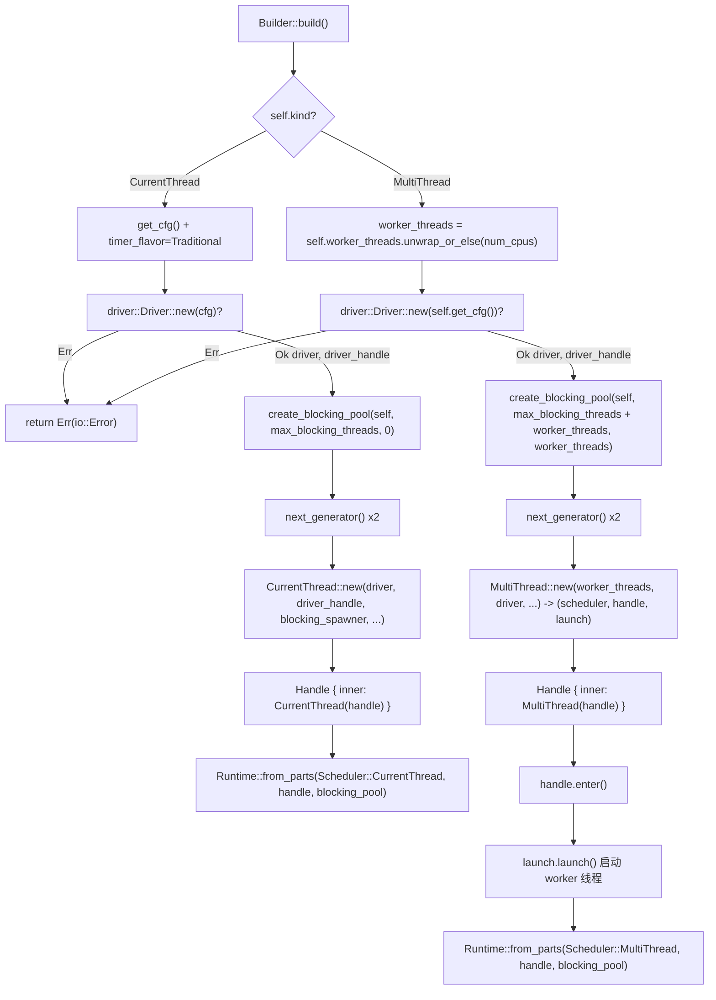

# Capítulo 2: El ensamblaje del Runtime: cómo Builder arma el driver, el planificador y el pool de hilos

# Desde`Builder`hasta`Runtime`: un viaje completo de ensamblaje

En el capítulo anterior dejamos claros los límites de responsabilidad entre Future, Waker y Executor. Pero un runtime realmente utilizable es mucho más que «un Executor»: también necesita un bucle de eventos de I/O, temporizadores, un pool de hilos bloqueantes, y todos estos componentes deben compartir el mismo conjunto de handles y el mismo ciclo de vida. Este capítulo rastrea la cadena completa de ensamblaje de`Builder::build`y responde a una pregunta central:**¿Qué componentes hay dentro de un`Runtime`y cómo se ensamblan y comparten handles?**。

El punto de entrada del ensamblaje de Tokio es`Builder`. En sí mismo es un contenedor de configuración puro; todos sus campos son «declaraciones de intención» y no poseen ningún recurso de runtime. La creación real de recursos ocurre cuando se llama a`build()`.

## Modelo intuitivo: Builder es el «plano de reforma», Runtime es «la casa tras la entrega»

`Builder`es como un plano de reforma: en él anotas «cuántas habitaciones quiero (worker_threads)», «si quiero agua corriente (enable_io)», «si quiero electricidad (enable_time)», «límite de ayudantes subcontratados (max_blocking_threads)». El plano en sí no produce ninguna entidad. Hasta que se llama a`build()`, el equipo de construcción no construye según el plano, levantando realmente las «habitaciones» —scheduler, driver, pool de hilos— y entregando una instancia de`Runtime`.

Si no existiera la capa de`Builder`, el usuario tendría que hacer new manualmente de cada componente, cablear manualmente, gestionar manualmente el rollback ante fallos; cualquier error de orden provocaría handles colgantes o fugas de recursos.`Builder`El valor de  radica en:**Separar por completo «configuración» y «construcción», permitiendo que el proceso de construcción realice de forma centralizada validación, limpieza ante fallos y compartición de handles.**。

## Diseño de memoria:`Builder`partición de campos de

`Builder`Los campos de  pueden dividirse por responsabilidad en cuatro grupos. El primer grupo es**forma y conmutadores**：`kind`determina la forma del scheduler,`enable_io` / `enable_time`determina si se crea el driver correspondiente.

[FACT:tokio/src/runtime/builder.rs:55-68]

```rust
pub struct Builder {
    kind: Kind,
    name: Option,
    enable_io: bool,
    nevents: usize,
    nevents_busy: Option,
    enable_time: bool,
    start_paused: bool,
    // ...
}
```

El segundo grupo es**parámetros del pool de hilos**：`worker_threads`es`Option<usize>`，`None`lo que significa «diferir hasta build para detectar automáticamente según el número de núcleos de CPU»;`max_blocking_threads`por defecto 512.

[FACT:tokio/src/runtime/builder.rs:73-79]

```rust
worker_threads: Option,
max_blocking_threads: usize,
```

El tercer grupo es**hooks de callback**, todos son`Option<Arc<dyn Fn ...>>`. Nótese que usan`Arc`en lugar de`Box`, porque estos callbacks deben clonarse en el`Config`。

[FACT:tokio/src/runtime/builder.rs:87-97]

```rust
pub(super) after_start: Option,
pub(super) before_stop: Option,
pub(super) before_park: Option,
pub(super) after_unpark: Option,
```

Copiar**El cuarto grupo es**：`global_queue_interval`、`event_interval`、`disable_lifo_slot`、`seed_generator`。

[FACT:tokio/src/runtime/builder.rs:116-134]

```rust
pub(super) global_queue_interval: Option,
pub(super) event_interval: u32,
pub(super) disable_lifo_slot: bool,
pub(super) seed_generator: RngSeedGenerator,
```

Copiar`Kind`Aquí hay un diseño digno de mención:`Copy`es un pequeño enum de

[FACT:tokio/src/runtime/builder.rs:261-265]

```rust
#[derive(Clone, Copy)]
pub(crate) enum Kind {
    CurrentThread,
    #[cfg(feature = "rt-multi-thread")]
    MultiThread,
}
```

`MultiThread`Copiar`rt-multi-thread`La variante  está condicionada por el feature`rt`. Esto significa que en una compilación donde solo se habilita el feature`Kind`,`build()`tiene una sola variante, y el`match`de**será optimizado por el compilador a una sola rama:**。

## usar el sistema de tipos en lugar de juicios en runtime para eliminar el tamaño de código del scheduler multihilo.

`Builder::new`La filosofía de los valores por defecto: por qué I/O y time están desactivados por defecto`enable_io`es el punto de entrada común para todas las construcciones. Establece`enable_time`y`false`。

[FACT:tokio/src/runtime/builder.rs:309-318]

```rust
// I/O defaults to "off"
enable_io: false,
nevents: 1024,
nevents_busy: None,

// Time defaults to "off"
enable_time: false,

// The clock starts not-paused
start_paused: false,
```

> **[Design Inference & Architectural Trade-offs]**
> 〔Inferencia de diseño y compromisos arquitectónicos〕`#[tokio::main]`Esta elección de valores por defecto es deliberada: crear el driver de I/O requiere solicitar handles epoll/kqueue al sistema operativo, y crear el driver de time requiere iniciar la infraestructura de temporizadores. Si el usuario solo quiere un scheduler de tareas puramente computacional (por ejemplo, ejecutar lógica async intensiva en CPU), forzar la creación de estos drivers es puro desperdicio.`enable_all()`。

`enable_all()`La razón por la que la macro  es «plug-and-play» es porque internamente llama a

[FACT:tokio/src/runtime/builder.rs:398-419]

```rust
pub fn enable_all(&mut self) -> &mut Self {
    #[cfg(any(
        feature = "net",
        all(unix, feature = "process"),
        all(unix, feature = "signal")
    ))]
    self.enable_io();

    #[cfg(all(
        tokio_unstable,
        feature = "io-uring",
        // ...
    ))]
    self.enable_io_uring();

    #[cfg(feature = "time")]
    self.enable_time();

    self
}
```

Copiar`enable_io()`Nótese que`net`、`process`solo se llama cuando se ha habilitado el feature`signal`o`time` feature，`enable_all()`. Si el usuario solo habilita

## no abrirá el driver de I/O, porque simplemente no hay código del driver de I/O en el artefacto compilado.`build()`Ruta principal de ensamblaje:

`build()`la bifurcación de`kind`es el punto de partida del ensamblaje; bifurca según

[FACT:tokio/src/runtime/builder.rs:1146-1152]

```rust
pub fn build(&mut self) -> io::Result {
    match &self.kind {
        Kind::CurrentThread => self.build_current_thread_runtime(),
        #[cfg(feature = "rt-multi-thread")]
        Kind::MultiThread => self.build_threaded_runtime(),
    }
}
```

Copiar

### La diferencia entre estas dos rutas va mucho más allá de «un hilo vs múltiples hilos». A continuación se detallan por separado.

`build_current_thread_runtime`Ruta uno: ensamblaje de current_thread`build_current_thread_runtime_components`en sí mismo es muy delgado; delega en`Runtime`。

[FACT:tokio/src/runtime/builder.rs:1725-1736]

```rust
fn build_current_thread_runtime(&mut self) -> io::Result {
    use crate::runtime::runtime::Scheduler;

    let (scheduler, handle, blocking_pool) =
        self.build_current_thread_runtime_components(None)?;

    Ok(Runtime::from_parts(
        Scheduler::CurrentThread(scheduler),
        handle,
        blocking_pool,
    ))
}
```

Copiar`build_current_thread_runtime_components`La lógica real de ensamblaje está en

[FACT:tokio/src/runtime/builder.rs:1760-1766]

```rust
let mut cfg = self.get_cfg();
cfg.timer_flavor = TimerFlavor::Traditional;
let (driver, driver_handle) = driver::Driver::new(cfg)?;

// Blocking pool
let blocking_pool = blocking::create_blocking_pool(self, self.max_blocking_threads, 0);
let blocking_spawner = blocking_pool.spawner().clone();
```

Copiar`driver`El primer paso crea`(driver, driver_handle)`, devolviendo un par`?`. Nótese que aquí`build`propaga el error directamente hacia arriba: si la inicialización del driver de I/O falla (por ejemplo, falla la creación de epoll), todo`Err`devuelve

, y en ese momento el blocking pool aún no se ha creado, por lo que no hay nada que limpiar.`spawner`El segundo paso crea el blocking pool y extrae inmediatamente su`spawner`clonado. Este

se inyectará en el scheduler, dándole la capacidad de enviar tareas bloqueantes al pool de hilos.

[FACT:tokio/src/runtime/builder.rs:1768-1770]

```rust
let seed_generator_1 = self.seed_generator.next_generator();
let seed_generator_2 = self.seed_generator.next_generator();
```

> **[Design Inference & Architectural Trade-offs]**
> 〔Inferencia de diseño y compromisos arquitectónicos〕`seed_generator_1`¿Por qué se necesitan dos?`Config`se coloca en`select!`, para uso interno del scheduler (por ejemplo, el orden de ramas aleatorio de`seed_generator_2`);`CurrentThread::new`se pasa a`rng_seed`, para uso del lado de las tareas. Separar dos generadores evita que el consumo interno de números aleatorios por parte del scheduler afecte la secuencia aleatoria visible al usuario, garantizando así la reproducibilidad de

.`Config`El cuarto paso es el núcleo: entregar juntos driver, driver_handle, blocking_spawner, las semillas y`CurrentThread::new`。

[FACT:tokio/src/runtime/builder.rs:1776-1807]

```rust
let (scheduler, handle) = CurrentThread::new(
    driver,
    driver_handle,
    blocking_spawner,
    seed_generator_2,
    Config {
        before_park: self.before_park.clone(),
        after_unpark: self.after_unpark.clone(),
        // ...
        global_queue_interval: self.global_queue_interval,
        event_interval: self.event_interval,
        // ...
        enable_eager_driver_handoff: false,
        seed_generator: seed_generator_1,
        // ...
    },
    local_tid,
    self.name.clone(),
);
```

Copiar`enable_eager_driver_handoff`Aquí hay un detalle clave:`false`。

[FACT:tokio/src/runtime/builder.rs:1795-1798]

```rust
// This setting never makes sense for a current thread runtime,
// as it only configures how the I/O driver is stolen across
// workers.
enable_eager_driver_handoff: false,
```

> **[Design Inference & Architectural Trade-offs]**
> Este comentario señala la esencia de esa opción: describe «cómo varios workers compiten por el driver de I/O», y current_thread solo tiene un hilo, no existe competencia, por lo que se desactiva forzosamente. Este es un ejemplo típico de «la semántica de una opción de configuración está fuertemente correlacionada con su forma»: el mismo`Builder`campo tiene significados diferentes según la forma.

Finalmente,`CurrentThread::new`el`handle`devuelto se envuelve en`scheduler::Handle::CurrentThread`, y luego se envuelve en el`Handle`。

[FACT:tokio/src/runtime/builder.rs:1816-1822]

```rust
let handle = Handle {
    inner: scheduler::Handle::CurrentThread(handle),
};

Ok((scheduler, handle, blocking_pool))
```

### Ruta dos: el ensamblaje de multi_thread

`build_threaded_runtime`El esqueleto de es similar al de current_thread, pero hay tres diferencias esenciales. La primera es la determinación del número de hilos worker:

[FACT:tokio/src/runtime/builder.rs:2185]

```rust
let worker_threads = self.worker_threads.unwrap_or_else(num_cpus);
```

`None`Aquí se resuelve como`num_cpus()`. Este es el punto de aterrizaje de la «detección automática diferida»: la detección ocurre en el momento de build y no en el momento de`Builder::new`, porque la afinidad de CPU puede cambiar entre ambos momentos.

La segunda diferencia está en el cálculo de la capacidad del blocking pool:

[FACT:tokio/src/runtime/builder.rs:2189-2192]

```rust
let blocking_pool =
    blocking::create_blocking_pool(self, self.max_blocking_threads + worker_threads, worker_threads);
let blocking_spawner = blocking_pool.spawner().clone();
```

Nótese que`max_blocking_threads + worker_threads`. En contraste, la ruta de current_thread pasa`self.max_blocking_threads`y`0`。

[FACT:tokio/src/runtime/builder.rs:1765]

```rust
let blocking_pool = blocking::create_blocking_pool(self, self.max_blocking_threads, 0);
```

> **[Design Inference & Architectural Trade-offs]**
> Esta diferencia revela la semántica de la capacidad del blocking pool: bajo multi_thread,`max_blocking_threads`es el límite de hilos bloqueantes «adicionales»; el límite total real de hilos debe sumar el número de hilos worker. El tercer parámetro (current_thread pasa 0, multi_thread pasa`worker_threads`) probablemente sea una pista de «número de hilos reservados» o «número de hilos iniciales». Este diseño hace que la semántica de`max_blocking_threads`se mantenga consistente en ambas formas: describe «cuántos hilos bloqueantes adicionales se pueden abrir más allá de los workers principales».

La tercera diferencia es que`MultiThread::new`devuelve una tupla de tres elementos en lugar de dos:

[FACT:tokio/src/runtime/builder.rs:2198-2226]

```rust
let (scheduler, handle, launch) = MultiThread::new(
    worker_threads,
    driver,
    driver_handle,
    blocking_spawner,
    seed_generator_2,
    Config {
        // ...
        enable_eager_driver_handoff: self.enable_eager_driver_handoff,
        // ...
    },
    self.timer_flavor,
    self.name.clone(),
);
```

El`launch`adicional es un «handle de arranque».`MultiThread::new`Solo se encarga de construir la estructura del planificador,**y no inicia inmediatamente los hilos worker**. El arranque real ocurre después:

[FACT:tokio/src/runtime/builder.rs:2228-2234]

```rust
let handle = Handle { inner: scheduler::Handle::MultiThread(handle) };

// Spawn the thread pool workers
let _enter = handle.enter();
launch.launch();

Ok(Runtime::from_parts(Scheduler::MultiThread(scheduler), handle, blocking_pool))
```

`handle.enter()`entra en el contexto de runtime, y entonces`launch.launch()`realmente hace spawn de todos los hilos worker. Este diseño de dos fases de «construir primero, arrancar después» es muy crítico.

> **[Design Inference & Architectural Trade-offs]**
> ¿Por qué no se puede arrancar mientras se construye? Porque una vez que los hilos worker arrancan, comienzan inmediatamente a hacer poll de tareas, y las tareas pueden referenciar`handle`. Si`handle`aún no se ha terminado de construir, aparecería una condición de carrera en la que «el worker sostiene un handle a medio terminar». El diseño de dos fases garantiza que:**cuando todos los hilos worker arrancan, el`Handle`completo ya está listo.**。`_enter`El guard garantiza que los hilos worker estén en el contexto de runtime correcto en el instante del arranque.

## Diagrama de flujo del ensamblaje

La siguiente figura reúne el orden de ensamblaje, las ramas clave y las rutas de error de ambas rutas. Nótese que cuando`driver::Driver::new`falla, se devuelve directamente`Err`, y en ese momento el blocking pool aún no se ha creado.



## Compartición de handles:`Handle`cómo se convierte en un «pase» entre componentes

Una vez completado el ensamblaje,`Runtime`posee el conjunto de tres piezas`scheduler`、`handle`、`blocking_pool`. Entre ellas,`handle`es el núcleo compartido. En su interior hay una enumeración:

[FACT:tokio/src/runtime/scheduler/mod.rs:29-41]

```rust
#[derive(Debug, Clone)]
pub(crate) enum Handle {
    #[cfg(feature = "rt")]
    CurrentThread(Arc),

    #[cfg(feature = "rt-multi-thread")]
    MultiThread(Arc),

    #[cfg(not(feature = "rt"))]
    #[allow(dead_code)]
    Disabled,
}
```

Nótese que ambas variantes envuelven`Arc`. Esto significa que el clonado de`Handle`es un incremento barato de conteo de referencias, y puede distribuirse libremente a cualquier hilo.`Handle`proporciona una interfaz de acceso unificada, encapsulando las diferencias de forma dentro de`match`. Por ejemplo`driver()`：

[FACT:tokio/src/runtime/scheduler/mod.rs:53-64]

```rust
pub(crate) fn driver(&self) -> &driver::Handle {
    match *self {
        #[cfg(feature = "rt")]
        Handle::CurrentThread(ref h) => &h.driver,

        #[cfg(feature = "rt-multi-thread")]
        Handle::MultiThread(ref h) => &h.driver,

        #[cfg(not(feature = "rt"))]
        Handle::Disabled => unreachable!(),
    }
}
```

`blocking_spawner()`usa la macro`match_flavor!`para eliminar la repetición:

[FACT:tokio/src/runtime/scheduler/mod.rs:96-98]

```rust
pub(crate) fn blocking_spawner(&self) -> &blocking::Spawner {
    match_flavor!(self, Handle(h) => &h.blocking_spawner)
}
```

Esta macro, al expandirse, es exactamente el`driver()`como el de arriba`match`. Su valor radica en que: al añadir un nuevo accesor que necesite despacharse según la forma, basta con una línea de`match_flavor!`, sin tener que escribir a mano dos veces la rama`match`.

El`Handle`público es un envoltorio delgado del`scheduler::Handle`interno:

[FACT:tokio/src/runtime/handle.rs:13-15]

```rust
pub struct Handle {
    pub(crate) inner: scheduler::Handle,
}
```

El`Handle`que obtiene el usuario puede clonarse entre hilos, puede`spawn`, puede`block_on`。`spawn`. La implementación de`AutoBox`muestra la rama en tiempo de compilación de

[FACT:tokio/src/runtime/handle.rs:197-208]

```rust
pub fn spawn(&self, future: F) -> JoinHandle
where
    F: Future + Send + 'static,
    F::Output: Send + 'static,
{
    let fut_size = mem::size_of::();
    if AutoBox::::SHOULD_BOX {
        self.spawn_named(Box::pin(future), SpawnMeta::new_unnamed(fut_size))
    } else {
        self.spawn_named(future, SpawnMeta::new_unnamed(fut_size))
    }
}
```

`AutoBox::<F>::SHOULD_BOX`Copiar`size_of::<F>()`es una constante asociada, obtenida al comparar

[FACT:tokio/src/runtime/mod.rs:668-673]

```rust
pub(crate) struct AutoBox(std::marker::PhantomData);

impl AutoBox {
    pub(crate) const SHOULD_BOX: bool = std::mem::size_of::() > BOX_FUTURE_THRESHOLD;
}
```

> **[Design Inference & Architectural Trade-offs]**
> 〔Inferencia de diseño y compensaciones arquitectónicas〕`if`El comentario explica por qué se usa una constante asociada en lugar de una comprobación en tiempo de ejecución`spawn_named`: si se usara una comprobación en tiempo de ejecución,`F`se monomorfizaría dos veces (una para`Pin<Box<F>>`, otra para

## ), lo que provocaría que cada future de spawn generara dos copias del task harness, duplicando el tamaño del código. Con la rama constante, el recolector de monomorfización solo conserva la rama que realmente se recorre.

**Reflexiones de diseño: orden de ensamblaje, recuperación de errores y trampas en producción**El orden es el contrato`driver -> blocking_pool -> scheduler`. El orden de ensamblaje

**no es arbitrario. El driver se crea primero, porque es el único paso que puede fallar por recursos insuficientes del SO y que, tras fallar, no requiere limpiar otros componentes. blocking_pool va después del driver y antes del scheduler, porque el scheduler necesita blocking_spawner. Si la creación de blocking_pool falla (en realidad no suele fallar), el driver se limpiará automáticamente al hacer drop.`local_tid`La rama**。`build_local`de current_thread`build_current_thread_local_runtime`toma la ruta de

[FACT:tokio/src/runtime/builder.rs:1738-1751]

```rust
fn build_current_thread_local_runtime(&mut self) -> io::Result {
    use crate::runtime::local_runtime::LocalRuntimeScheduler;

    let tid = std::thread::current().id();

    let (scheduler, handle, blocking_pool) =
        self.build_current_thread_runtime_components(Some(tid))?;

    Ok(LocalRuntime::from_parts(
        LocalRuntimeScheduler::CurrentThread(scheduler),
        handle,
        blocking_pool,
    ))
}
```

Copiar`tid`Este`Handle`se almacena en`can_spawn_local_on_local_runtime`, y posteriormente

[FACT:tokio/src/runtime/scheduler/mod.rs:140-147]

```rust
pub(crate) fn can_spawn_local_on_local_runtime(&self) -> bool {
    match self {
        Handle::CurrentThread(h) => h.local_tid.is_some_and(|x| std::thread::current().id() == x),

        #[cfg(feature = "rt-multi-thread")]
        Handle::MultiThread(_) => false,
    }
}
```

> **[Design Inference & Architectural Trade-offs]**
> 〔Inferencia de diseño y compensaciones arquitectónicas〕`LocalRuntime`Esta es la piedra angular de la seguridad de`!Send`: el future de`local_tid`solo puede ser poll en su hilo owner, y`!Send`es precisamente el punto de verificación en tiempo de ejecución de esta restricción. Si se eliminara esta comprobación, un spawn_local entre hilos provocaría que los datos de

**fueran accedidos concurrentemente, causando UB.`worker_threads(0)`Trampa en producción uno:**。`worker_threads`hará panic

[FACT:tokio/src/runtime/builder.rs:582-586]

```rust
pub fn worker_threads(&mut self, val: usize) -> &mut Self {
    assert!(val > 0, "Worker threads cannot be set to 0");
    self.worker_threads = Some(val);
    self
}
```

Esta aserción falla en la fase de configuración, en lugar de esperar hasta el build. La ventaja es que el error se localiza antes; la desventaja es que si el número de hilos proviene de un valor dinámico del archivo de configuración, el usuario debe validarlo por su cuenta antes de la llamada.

**Problema en producción n.º 2:`max_blocking_threads`Si se configura demasiado pequeño, se cuelga**. La documentación advierte explícitamente:

[FACT:tokio/src/runtime/builder.rs:600-601]

```rust
/// It's recommended to not set this limit too low in order to avoid hanging on operations
/// requiring [`spawn_blocking`].
```

> **[Design Inference & Architectural Trade-offs]**
> Debido a que la cola del blocking pool no tiene contrapresión — las tareas se acumulan hasta que haya un hilo disponible. Si todos los hilos bloqueantes están esperando alguna operación que «requiere un nuevo hilo bloqueante para completarse», se producirá un deadlock. La frase de la documentación «the queue does not apply any backpressure, it could potentially grow unbounded» es precisamente una nota al pie de este riesgo.

**Problema en producción n.º 3:`UnhandledPanic::ShutdownRuntime`Solo soporta current_thread**。

[FACT:tokio/src/runtime/builder.rs:1374-1381]

```rust
pub fn unhandled_panic(&mut self, behavior: UnhandledPanic) -> &mut Self {
    if !matches!(self.kind, Kind::CurrentThread) && matches!(behavior, UnhandledPanic::ShutdownRuntime) {
        panic!("UnhandledPanic::ShutdownRuntime is only supported in current thread runtime");
    }

    self.unhandled_panic = behavior;
    self
}
```

> **[Design Inference & Architectural Trade-offs]**
> La razón de esta limitación es: en multi_thread, «apagar el runtime inmediatamente» requiere coordinar la detención de todos los worker threads, lo cual tiene alta complejidad de implementación y semántica ambigua (¿qué pasa con las otras tareas que están en poll?). current_thread solo tiene un hilo, por lo que la semántica de apagado es clara.

## Resumen del capítulo

Este capítulo rastreó`Builder::build`la cadena completa de ensamblaje de . Conclusiones clave:

1. `Builder`es un contenedor de configuración puro,`build()`es quien crea los recursos. El orden de ensamblaje`driver -> blocking_pool -> scheduler`está determinado por los requisitos de recuperación de errores.

2. La diferencia entre current_thread y multi_thread no es solo el número de hilos: el cálculo de la capacidad del blocking pool es diferente (`max_blocking_threads` vs `max_blocking_threads + worker_threads`), multi_thread tiene un`launch`arranque en dos fases adicional,`enable_eager_driver_handoff`se fuerza su cierre bajo current_thread.

3. `Handle`es el núcleo compartido entre componentes, internamente usa`Arc`para envolver handles específicos de la forma, y se accede de manera unificada mediante`match`o`match_flavor!`macros.

4. `AutoBox`usa constantes asociadas para decidir en tiempo de compilación si se boxea el future, evitando duplicar el tamaño del código.

5. `local_tid`es`LocalRuntime`el punto de verificación en tiempo de ejecución de la seguridad.

En el próximo capítulo, entraremos en el ciclo de vida de las tareas:`spawn`cómo convertir un Future en una entidad programable,`JoinHandle`cómo interactuar con la máquina de estados de la tarea, y las transiciones de estado de la tarea entre`PENDING` / `RUNNING` / `COMPLETE`.

# Reflexión y autoevaluación de este capítulo

Q1: Si se cambia`build_threaded_runtime`en`create_blocking_pool`el parámetro de capacidad de`self.max_blocking_threads + worker_threads`de`self.max_blocking_threads`a`self.max_blocking_threads`？

**, ¿en qué escenarios provocaría que las tareas bloqueantes se mueran de hambre? ¿Por qué la ruta current_thread puede pasar**Análisis de referencia[FACT:tokio/src/runtime/builder.rs:2189-2192]: Según`self.max_blocking_threads + worker_threads`, la ruta multi_thread pasa[FACT:tokio/src/runtime/builder.rs:1765], mientras que la ruta current_thread`self.max_blocking_threads`pasa`block_in_place`. La raíz de la diferencia está en que: bajo multi_thread, los propios worker threads también ejecutan tareas bloqueantes (por ejemplo,`self.max_blocking_threads`convierte temporalmente un worker thread en un hilo bloqueante), por lo que el presupuesto total de hilos bloqueantes debe incluir el número de worker threads. Si se cambia a pasar solo`max_blocking_threads`, cuando`block_in_place`se configura pequeño (por ejemplo, 1) y ya hay worker threads ocupando presupuesto en`spawn_blocking`, las nuevas tareas de`block_in_place`no tendrán hilos disponibles y se acumularán en la cola sin contrapresión, provocando que las tareas async que dependen de estas tareas bloqueantes queden suspendidas permanentemente. current_thread solo tiene un hilo y no soporta la semántica de conversión de worker de

Q2: `MultiThread::new`, por lo que no es necesario sumar el número de workers.`launch`devuelve`launch.launch()`el handle, y quien realmente inicia los worker threads es`handle.enter()`. Si se elimina`launch.launch()`esta línea y se llama directamente a

**, ¿qué sucedería?**Análisis de referencia[FACT:tokio/src/runtime/builder.rs:2230-2232]: Según`let _enter = handle.enter();`, antes de iniciar hay`launch.launch()`。`handle.enter()`y solo después`Handle::current()`、`tokio::spawn`. La función de`_enter`es establecer el contexto thread-local, haciendo que el hilo actual «parezca» estar dentro del runtime. Los worker threads, tras iniciarse, comienzan inmediatamente a hacer poll de tareas, y el código de la tarea podría llamar a APIs que dependen del contexto como`launch`. Si se elimina`Handle::current()`, la configuración del contexto del worker thread en el instante del arranque podría ser incompleta (dependiendo de si`CONTEXT_MISSING_ERROR`lo configura internamente por sí mismo); en el peor de los casos, el código de inicialización ejecutado en el worker thread llamaría a`launch`y provocaría un panic (`_enter`). Incluso si

Q3: `AutoBox::<F>::SHOULD_BOX`configura el contexto para cada worker internamente,`if size_of::<F>() > THRESHOLD`también garantiza que «la acción de arranque en sí» ocurra en el contexto correcto, evitando condiciones de carrera durante el arranque.

**usa constantes asociadas en lugar de**en tiempo de ejecución. Suponiendo que se cambiara a una comprobación en tiempo de ejecución, además de duplicar el tamaño del código, ¿en qué circunstancias provocaría degradación de rendimiento?[FACT:tokio/src/runtime/mod.rs:657-673]Análisis de referencia`if`: Según`spawn_named`los comentarios de`T`, el`T`en tiempo de ejecución haría que`Pin<Box<T>>`monomorfice`Pin<Box<T>>`dos veces por cada`size_of`(
