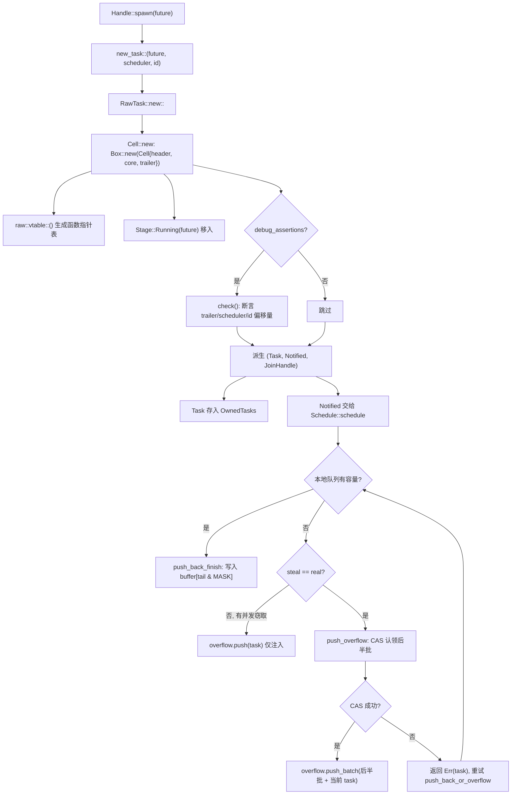
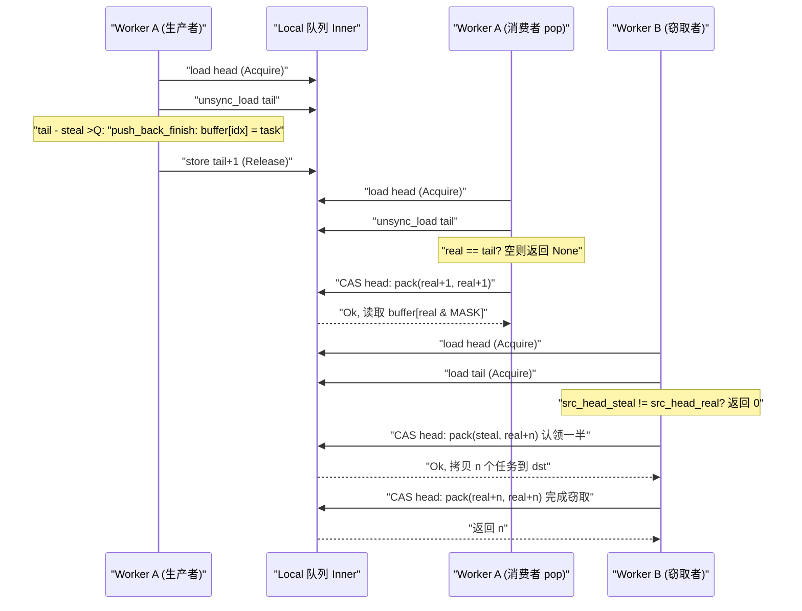

# Capítulo 3: La vida de una tarea (Parte I): cómo spawn convierte un Future en una entidad programable

En el capítulo anterior completamos el ensamblaje del Runtime: el driver de I/O, el driver de tiempo, el blocking pool y el planificador se inyectan en la misma instancia de`Runtime`,`Handle`convirtiéndose en el handle compartido para acceder a estos componentes entre hilos. Pero el runtime ya ensamblado en este punto sigue siendo solo un cascarón vacío: posee el motor que impulsa las tareas, pero no tiene ninguna tarea que impulsar. La pregunta que este capítulo responde es precisamente: cuando escribes`tokio::spawn(async { ... })`, ese bloque`async`¿qué experimenta exactamente para pasar de ser código Rust ordinario a una entidad «que puede ser tomada por el planificador, despertada y unida con join»? Esta es la primera mitad de «la vida de una tarea»; nos centramos en el nacimiento: partiendo de`Handle::spawn`, atravesando la asignación por conteo de referencias de`new_task`, hasta aterrizar en el diseño de memoria de`Cell<T, S>`, y finalmente ver cómo la tarea se entrega a la cola local de algún worker o a la cola de inyección global. La segunda mitad (Capítulo 4) entrará en el bucle de planificación y el ciclo cerrado poll/wake.

# 3.1 Future no es una tarea: qué crea exactamente un spawn

## Modelo intuitivo

Imagina`Future`como una «receta de cocina», y una tarea como «un plato que se está cocinando en la cocina». La receta en sí es estática, copiable y sin ningún estado de ejecución; solo cuando la cocina (el planificador) decide «hacer este plato ahora», le asigna un fogón (worker), un número de pedido (TaskId) y una ventanilla de despacho (JoinHandle), y entonces se convierte en un «plato en preparación». Sin esta capa de envoltura, el planificador no tendría forma de saber «en qué paso va este plato», «quién lo espera», «a quién notificar cuando esté listo»; solo vería una receta y no podría gestionarla.

## Estructuras de datos y diseño de memoria

Tokio usa`Task<S>`para representar «una referencia a una tarea poseída por el runtime», que es una envoltura transparente sobre`RawTask`:

```rust
#[repr(transparent)]
pub(crate) struct Task {
    raw: RawTask,
    _p: PhantomData,
}
```

[FACT:tokio/src/runtime/task/mod.rs:233-238]

`#[repr(transparent)]`significa que`Task<S>`y`RawTask`son completamente idénticos en memoria, sin sobrecarga adicional.`PhantomData<S>`es solo una marca de tipo en tiempo de compilación que indica a qué tipo de planificador`S`。

pertenece esta tarea. Lo que realmente soporta todo el estado de la tarea es`Cell<T, S>`, cuyo diseño es la piedra angular de todo el módulo de tareas:

```rust
#[repr(C)]
pub(super) struct Cell {
    pub(super) header: Header,
    pub(super) core: Core,
    pub(super) trailer: Trailer,
}
```

[FACT:tokio/src/runtime/task/core.rs:126-136]

Los tres campos están ordenados como «caliente-tibio-frío».`Header`son datos calientes (se accede a ellos en cada planificación y en cada transición de estado),`Core`son datos tibios (se accede a ellos durante poll),`Trailer`son datos fríos (solo se accede a ellos al crear y destruir). El comentario dice explícitamente:`Header`debe ser el primer campo, porque la estructura de la tarea será referenciada simultáneamente por`*mut Cell`y`*mut Header`Aún más crítico es la alineación a la línea de caché.[FACT:tokio/src/runtime/task/core.rs:37-43]。

tiene colgada una larga lista de`Cell`, que selecciona el número de bytes de alineación según la arquitectura objetivo: x86_64/aarch64/powerpc64 usan 128 bytes, arm/mips/sparc/hexagon usan 32 bytes, m68k usa 16 bytes, s390x usa 256 bytes, y el resto usa 64 bytes por defecto`#[cfg_attr(..., repr(align(...)))]`. El comentario explica por qué x86_64 debe usar 128 en lugar de 64: desde Intel Sandy Bridge, el prefetcher espacial trae de una vez[FACT:tokio/src/runtime/task/core.rs:64-125]pares**de líneas de caché de 64 bytes, por lo que es necesario alinear a 128 bytes para evitar el falso compartido**〔Inferencia de diseño y compensaciones arquitectónicas〕[FACT:tokio/src/runtime/task/core.rs:45-53]。

> **[Design Inference & Architectural Trade-offs]**
> ) son leídos y escritos con alta frecuencia por múltiples hilos worker: un hilo establece el bit RUNNING durante poll, otro hilo lee el bit NOTIFIED al despertar. Si los bits de estado de dos tareas caen en la misma línea de caché, cada transición de estado provocará que la línea de caché rebote de un núcleo a otro (cache line ping-pong), y la pérdida de rendimiento supera con creces el desperdicio de memoria. Tokio elige sacrificar espacio por tiempo.`state`en sí está restringido a no más de 8 tamaños de puntero:

`Header`Copiar

```rust
#[test]
#[cfg(not(loom))]
fn header_lte_cache_line() {
    assert!(std::mem::size_of::() ());
}
```

[FACT:tokio/src/runtime/task/core.rs:591-593]

no supere los 64 bytes (8 × 8), de modo que en arquitecturas con líneas de caché de 64 bytes pueda caber completamente en una línea.`Header`incluye los campos:`Header`(bits de estado atómicos),`state: State`(puntero de lista enlazada de la cola de inyección),`queue_next: UnsafeCell<Option<NonNull<Header>>>`(tabla de punteros a funciones),`vtable: &'static Vtable`(ID de la lista de`owner_id: UnsafeCell<Option<NonZeroU64>>`a la que pertenece),`OwnedTasks`(medición de latencia de planificación)`scheduled_at: UnsafeCell<ScheduleLatencyInstant>`contiene el handle del planificador[FACT:tokio/src/runtime/task/core.rs:169-198]。

`Core<T, S>`, el ID de tarea`scheduler: S`, y lo más central,`task_id: Id`es una enumeración de tres estados:`stage: CoreStage<T>` [FACT:tokio/src/runtime/task/core.rs:148-165]。`Stage`Copiar

```rust
#[repr(C)]
pub(super) enum Stage {
    Running(T),
    Finished(super::Result),
    Consumed,
}
```

[FACT:tokio/src/runtime/task/core.rs:225-229]

contiene el future; al completarse, se reemplaza in situ por`Stage::Running`, y tras ser tomado por`Stage::Finished(output)`pasa a ser`JoinHandle`El comentario apunta a un issue de Miri, indicando que este diseño impone requisitos estrictos de corrección al código unsafe`Stage::Consumed`。`#[repr(C)]`almacena datos fríos:[FACT:tokio/src/runtime/task/core.rs:225-229]。

`Trailer`puntero de lista enlazada),`owned: linked_list::Pointers<Header>`（`OwnedTasks`(waker del consumidor que espera a que la tarea se complete),`waker: UnsafeCell<Option<Waker>>`Paso a paso: de spawn a encolado`hooks: TaskHarnessScheduleHooks` [FACT:tokio/src/runtime/task/core.rs:205-213]。

## Nos ponemos en un escenario concreto: en un runtime multi_thread, el hilo worker A ejecuta

Primer paso: construir el trío de la tarea.`tokio::spawn(async { 42 })`。

**es la única entrada para el nacimiento de una tarea:** `new_task`Copiar

```rust
fn new_task(
    task: T,
    scheduler: S,
    id: Id,
    spawned_at: SpawnLocation,
) -> (Task, Notified, JoinHandle)
```

[FACT:tokio/src/runtime/task/mod.rs:336-346]

para asignar`RawTask::new::<T, S>`, y luego deriva tres referencias desde el mismo puntero`Cell`:`raw`(referencia owned, normalmente se coloca inmediatamente en`Task`(referencia de notificación, entregada al planificador),`OwnedTasks`）、`Notified`(handle de lectura de resultados)`JoinHandle`（结果读取句柄）[FACT:tokio/src/runtime/task/mod.rs:347-363]. Ten en cuenta que los tres comparten el mismo`raw`, cada uno mantiene un conteo de referencias.

**Segundo paso: asignar`Cell`y escribir el estado inicial.** `Cell::new`Asignar toda la estructura en el heap:

```rust
let result = Box::new(Cell {
    trailer: Trailer::new(scheduler.hooks()),
    header: new_header(state, vtable, ...),
    core: Core {
        scheduler,
        stage: CoreStage {
            stage: UnsafeCell::new(Stage::Running(future)),
        },
        task_id,
        ...
    },
});
```

[FACT:tokio/src/runtime/task/core.rs:261-278]

`vtable`generado por`raw::vtable::<T, S>()`, es una tabla de punteros a funciones monomorfizada para`T`y`S`específicos[FACT:tokio/src/runtime/task/core.rs:260]. El future se mueve directamente a`Stage::Running`, sin boxing adicional.

**Tercer paso: aserciones de debug para verificar el layout.**bajo`debug_assertions`,`Cell::new`llamará a la función`check`, usando`Header::get_trailer`、`Header::get_scheduler`、`Header::get_id_ptr`y otras operaciones de punteros basadas en desplazamientos de vtable, para aseverar una por una que «la dirección del campo obtenida a través del header» coincide con «la dirección real del campo»[FACT:tokio/src/runtime/task/core.rs:280-321]. Esta es una autoverificación en tiempo de ejecución de la correctitud de los desplazamientos de la vtable.

**Cuarto paso: enviar al planificador.**Una vez que el planificador obtiene`Notified<S>`, llama a`Schedule::schedule` [FACT:tokio/src/runtime/task/mod.rs:315]. Bajo multi_thread, esto pasará por`push_back_or_overflow`, empujando la tarea a la cola local del worker actual, y cuando la cola está llena se desborda a la cola de inyección.

La siguiente figura describe el flujo de control y las ramificaciones desde`new_task`hasta el encolamiento:



Esta figura revela varias ramas clave: las aserciones de debug solo tienen efecto en compilaciones de depuración; cuando la cola local está llena no se desborda directamente, sino que primero se determina si hay un ladrón concurrente (`steal != real`), y si lo hay, solo se empuja la tarea actual a la cola de inyección, porque el espacio liberado por el ladrón estará disponible pronto.

## Reflexión de diseño: por qué tres referencias en lugar de una

`new_task`devuelve tres referencias, no una. Este es el núcleo del diseño del conteo de referencias:`Task`representa «el runtime posee esta tarea»,`Notified`representa «esta tarea ha sido notificada, pendiente de planificación»,`JoinHandle`representa «alguien está interesado en su resultado». Los tres tienen ciclos de vida independientes——`JoinHandle`puede ser dropeado (la tarea continúa ejecutándose, el resultado se descarta),`Notified`desaparece tras el poll,`Task`se libera cuando la tarea se completa y se elimina de`OwnedTasks`. Si solo hubiera una referencia, no se podría expresar el estado «la tarea sigue corriendo pero nadie hace join».

`UnownedTask`es otra rama importante: mantiene**dos**conteos de referencias, usados para tareas blocking (no se almacenan en`OwnedTasks`）[FACT:tokio/src/runtime/task/mod.rs:286-295]。`unowned`la función combina ambas referencias en`mem::forget(task)`mediante`mem::forget(notified)`y`UnownedTask` [FACT:tokio/src/runtime/task/mod.rs:388-397]. La motivación de diseño de estas «dos referencias» es: las tareas blocking no tienen una lista`OwnedTasks`que mantenga la referencia owned, por lo que se necesita un conteo de referencias adicional para garantizar que la tarea no sea liberada durante su ejecución.

# 3.2 Bits de estado: cómo un usize codifica todo el ciclo de vida de una tarea

## Modelo intuitivo

Imagina el estado de la tarea como un «informe de chequeo médico» con varias casillas independientes: si está siendo poll, si se completó, si fue notificada, si fue cancelada, si alguien hace join. Tokio no usa múltiples campos booleanos, sino que comprime estos bits en**un`AtomicUsize`**. Así cada transición de estado requiere solo un CAS, en lugar de múltiples bloqueos. Sin este diseño, las transiciones de estado de la tarea se convertirían en un anidamiento de múltiples locks, disparando el riesgo de deadlock y la sobrecarga.

## Layout de bits

`State`Los bits de[FACT:tokio/src/runtime/task/mod.rs:32-53]：

- `RUNNING`están completamente definidos en la documentación del módulo**: si la tarea está siendo poll o cancelada.** [FACT:tokio/src/runtime/task/mod.rs:37-38]。
- `COMPLETE`Este bit actúa simultáneamente como el lock de la tarea`RUNNING`: el future se ha completado por completo y ha sido dropeado. Una vez establecido nunca se limpia, y nunca se establece junto con[FACT:tokio/src/runtime/task/mod.rs:40-41]。
- `NOTIFIED`: si actualmente existe un objeto`Notified`[FACT:tokio/src/runtime/task/mod.rs:43]。
- `CANCELLED`: la tarea debe cancelarse lo antes posible[FACT:tokio/src/runtime/task/mod.rs:45-46]。
- `JOIN_INTEREST`: existe`JoinHandle` [FACT:tokio/src/runtime/task/mod.rs:48]。
- `JOIN_WAKER`: bit de control de acceso como join handle waker[FACT:tokio/src/runtime/task/mod.rs:50-51]。

Los bits restantes se usan para el conteo de referencias[FACT:tokio/src/runtime/task/mod.rs:53]。

`RUNNING`El hecho de que el bit actúe como lock merece desarrollarse. La sección Safety de la documentación del módulo señala: cualquier acceso mutable al future debe realizarse después de adquirir el lock modificando el bit`RUNNING`, garantizando así acceso exclusivo[FACT:tokio/src/runtime/task/mod.rs:130-133]. Esto significa que al hacer poll de una tarea, el hilo primero hace CAS para establecer`RUNNING`, y tras el éxito obtiene acceso exclusivo al future; si falla, significa que otro hilo está haciendo poll, y este poll retorna directamente. Esto fusiona «la exclusión mutua del poll» y «la transición de estado» en una sola operación atómica, evitando un mutex separado.

## Protocolo de control de acceso de JOIN_WAKER

`JOIN_WAKER`El bit`waker`es la parte más ingeniosa de toda la máquina de estados. El problema que resuelve es:`Trailer`el campo**(en**) será accedido concurrentemente por dos hilos——el runtime al completar la tarea`JoinHandle`lo**lee**para despertar al joiner,[FACT:tokio/src/runtime/task/mod.rs:75-120]：

1. `JOIN_WAKER`al hacer poll

lo`JoinHandle`escribe

para registrar el waker. La documentación del módulo proporciona 7 reglas`JoinHandle`inicialmente es 0.

2. Cuando es 0,`COMPLETE`tiene acceso exclusivo (mutable) al campo waker.

5. `JoinHandle`3. Cuando es 1,`JOIN_WAKER`solo tiene acceso compartido (solo lectura).`JOIN_WAKER`4. Cuando es 1 y

6. `JoinHandle`es 1, el runtime tiene acceso compartido (solo lectura) al campo waker.`COMPLETE`Para escribir el waker, se debe: (i) establecer exitosamente`JOIN_WAKER`a 0 para obtener acceso exclusivo, (ii) escribir el waker, (iii) establecer exitosamente`COMPLETE`a 1.

solo puede modificar`JOIN_INTEREST`cuando`COMPLETE`es 0; el runtime solo puede modificar cuando

es 1.`COMPLETE`7. Si[FACT:tokio/src/runtime/task/mod.rs:110-120]es 0 y

## es 1, el runtime tiene acceso exclusivo al campo waker (para dropear el waker).

`Task`La regla 6 implica una condición de carrera: los pasos (i) o (iii) pueden fallar. Si (i) falla, se abandona la escritura del waker; si (iii) falla (otro hilo estableció`UnownedTask`el drop decrementa dos veces:

```rust
impl Drop for Task {
    fn drop(&mut self) {
        if self.header().state.ref_dec() {
            self.raw.dealloc();
        }
    }
}
```

[FACT:tokio/src/runtime/task/mod.rs:580-586]

```rust
impl Drop for UnownedTask {
    fn drop(&mut self) {
        if self.raw.header().state.ref_dec_twice() {
            self.raw.dealloc();
        }
    }
}
```

[FACT:tokio/src/runtime/task/mod.rs:590-596]

`ref_dec`devuelve`true`indica que esta es la última referencia, y solo entonces se libera realmente`Cell`la memoria.`ref_dec_twice`es`UnownedTask`la manifestación directa de mantener dos conteos.

## Reflexión de diseño: por qué el bit de estado y el conteo de referencias comparten un mismo atómico

> **[Design Inference & Architectural Trade-offs]**
> Colocar el bit de estado y el conteo de referencias en el mismo`AtomicUsize`tiene como objetivo que las dos acciones de «decrementar el conteo de referencias» y «establecer el bit de estado» puedan completarse en**un solo CAS**. La documentación del módulo menciona explícitamente en el comentario de`Schedule::release`: «el módulo de tareas procesará por lotes ref-dec y el establecimiento de otras opciones»[FACT:tokio/src/runtime/task/mod.rs:302-304]. Si el bit de estado y el conteo de referencias pertenecieran a dos variables atómicas distintas, entonces aparecería una ventana entre «liberar la última referencia» y «marcar como completado», requiriendo sincronización adicional. Tras la fusión,`ref_dec`puede completar atómicamente «decrementar el conteo + verificar si llegó a cero», evitando problemas tipo ABA.

# 3.3 JoinHandle: cómo el resultado cruza la frontera de la tarea para ser devuelto

## Modelo intuitivo

`JoinHandle`es como el «comprobante de recogida» que te da el restaurante. Cuando la tarea (la cocina) termina, coloca el plato (output) en la ventanilla de salida (`Stage::Finished`), y luego activa tu localizador de recogida (waker). Tú vienes a recogerlo con el comprobante; el comprobante en sí no contiene el plato, solo es un puntero a la ventanilla de salida. Si pierdes el comprobante (drop`JoinHandle`), el plato se desechará directamente (output se dropea), pero la cocina no se detendrá por ello.

## Estructura de datos

`JoinHandle<T>`es igualmente un envoltorio transparente sobre`RawTask`:

```rust
pub struct JoinHandle {
    raw: RawTask,
    _p: PhantomData,
}
```

[FACT:tokio/src/runtime/task/join.rs:163-166]

`PhantomData<T>`marca el tipo de salida.`JoinHandle<T>`solo es`T: Send`en`Send`/`Sync` [FACT:tokio/src/runtime/task/join.rs:169-170], lo que garantiza que una salida no Send no se mueva entre hilos.

## Paso a paso: await sobre un JoinHandle

`JoinHandle`implementa`Future`, cuyo`poll`es el núcleo de la devolución del resultado:

```rust
fn poll(self: Pin, cx: &mut Context) -> Poll {
    ready!(crate::trace::trace_leaf());
    let mut ret = Poll::Pending;
    let coop = ready!(crate::task::coop::poll_proceed(cx));
    unsafe {
        self.raw.try_read_output(&mut ret, cx.waker());
    }
    if ret.is_ready() {
        coop.made_progress();
    }
    ret
}
```

[FACT:tokio/src/runtime/task/join.rs:327-354]

Nótese varios detalles:`trace_leaf`se usa para instrumentación de tracing;`coop::poll_proceed`consume el presupuesto de cooperación (detallado en el capítulo 12);`try_read_output`borra los genéricos mediante vtable, coloca el valor de retorno en la pila y lo pasa con`*mut ()`a[FACT:tokio/src/runtime/task/join.rs:327-354]. Esta técnica de «colocar el valor de retorno en la pila» se debe a que la función de vtable no puede genericizar el tipo de retorno`T`, y solo puede escribir de vuelta mediante un puntero crudo.

> **[Design Inference & Architectural Trade-offs]**
> `try_read_output`lógica interna (en raw.rs, cuyo código fuente no se proporciona en este capítulo): primero verifica el bit`COMPLETE`, si ya está establecido llama a`take_output`para tomar el resultado en`Stage::Finished`; de lo contrario registra`cx.waker()`en el campo`Trailer::waker`y devuelve`Pending`. El proceso de registro sigue precisamente el protocolo`JOIN_WAKER`de la sección 3.2.

## Transferencia de propiedad del resultado

La sección «Non-Send output» de la documentación del módulo describe con precisión las reglas de propiedad del resultado[FACT:tokio/src/runtime/task/mod.rs:151-170]：

- Cuando la tarea se completa, output se coloca en`Stage`, luego se ejecuta la transición de «establecer COMPLETE» y se lee el valor de`JOIN_INTEREST`en ese momento.
- Si`JOIN_INTEREST`es 0 (sin`JoinHandle`), output se dropea inmediatamente[FACT:tokio/src/runtime/task/mod.rs:157-158]。
- Si`JOIN_INTEREST`es 1,`JoinHandle`se encarga de limpiar output[FACT:tokio/src/runtime/task/mod.rs:160-161]。

Para output no Send, la documentación ofrece una argumentación en tres pasos: output se crea en el hilo que hace poll del future;`JoinHandle<Output>`tampoco es Send cuando Output no es Send, por lo que también está en el hilo de spawn; por lo tanto`JoinHandle`no mueve output entre hilos al tomarlo o dropearlo[FACT:tokio/src/runtime/task/mod.rs:164-170]。

## Drop de JoinHandle: dos rutas, rápida y lenta

```rust
impl Drop for JoinHandle {
    fn drop(&mut self) {
        if self.raw.state().drop_join_handle_fast().is_ok() {
            return;
        }
        self.raw.drop_join_handle_slow();
    }
}
```

[FACT:tokio/src/runtime/task/join.rs:358-364]

`drop_join_handle_fast`intenta completar en un solo CAS «limpiar el bit`JOIN_INTEREST`+ decrementar el conteo de referencias». Si falla (por ejemplo, la tarea se está completando y el bit de estado está ocupado), entonces toma la ruta lenta de`drop_join_handle_slow`. Este es el patrón típico de «ruta rápida optimista + ruta lenta pesimista».

## Reflexión de diseño: por qué JoinHandle no contiene directamente output

> **[Design Inference & Architectural Trade-offs]**
> Si`JoinHandle`contuviera directamente output, entonces output tendría que moverse al hilo donde reside`JoinHandle`al completarse la tarea. Pero`JoinHandle`puede moverse a cualquier hilo (siempre que`T: Send`), mientras que el hilo que produce output es el hilo de poll. Contenerlo directamente provocaría un movimiento entre hilos de «output se produce en el hilo de poll, pero debe dropearse en el hilo de join», lo que para output no Send viola directamente el sistema de tipos. Tokio elige dejar output en`Cell`(`Stage::Finished`），`JoinHandle`solo contiene el`Cell`que apunta a`RawTask`, y al tomar el resultado lo extrae in situ mediante`take_output`. Así el drop de output ocurre en el hilo donde reside`JoinHandle`, pero con la premisa de que ese hilo sea el mismo que el de poll (lo cual se cumple en el escenario no Send).

# 3.4 Cola local: la estructura productor-consumidor del work-stealing

## Modelo intuitivo

Cada worker tiene una «lista privada de tareas pendientes» (cola local), con capacidad 256. El propio worker toma tareas desde**la cabeza**(LIFO, aprovechando la localidad de caché), mientras que otros workers**roban**tareas desde la cola (FIFO, tomando las más antiguas, las más probablemente ya completadas). Sin la cola local, todas las tareas se agolparían en la cola global, y cada toma de tarea competiría por el lock global, lo que haría colapsar la escalabilidad multinúcleo.

## Diseño de memoria: separación de head y tail

```rust
pub(crate) struct Inner {
    head: AtomicUnsignedLong,
    tail: AtomicUnsignedShort,
    buffer: Box>>; LOCAL_QUEUE_CAPACITY]>,
}
```

[FACT:tokio/src/runtime/scheduler/multi_thread/queue.rs:36-57]

`head`es`AtomicUnsignedLong`(64 bits, si la plataforma soporta u64),`tail`es`AtomicUnsignedShort`(32 bits). El comentario explica por qué los índices son más anchos de lo estrictamente necesario: para mitigar ABA y distinguir entre búfer «lleno» y «vacío»[FACT:tokio/src/runtime/scheduler/multi_thread/queue.rs:37-49]。

`head`empaqueta internamente**dos** `UnsignedShort`：la posición baja es la «cabeza real» (real head), la posición alta es «la primera posición que el ladrón está procesando» (steal head). Cuando ambas son iguales, no hay ladrones activos[FACT:tokio/src/runtime/scheduler/multi_thread/queue.rs:39-49]. Este empaquetado de dos valores es la técnica central de la cola work-stealing: el ladrón primero actualiza el valor steal mediante CAS para «reclamar» un lote de tareas, y al terminar hace que el valor steal alcance el valor real, indicando el fin del robo.

`LOCAL_QUEUE_CAPACITY`En modo no-loom es 256, en loom se reduce a 4 para probar más casos límite[FACT:tokio/src/runtime/scheduler/multi_thread/queue.rs:62-69]。`MASK = LOCAL_QUEUE_CAPACITY - 1`, usado para el índice del búfer circular[FACT:tokio/src/runtime/scheduler/multi_thread/queue.rs:71]。

## Paso a paso: las ramas completas de push_back_or_overflow

Esta es la función más compleja de la cola local, la analizamos rama por rama:

```rust
pub(crate) fn push_back_or_overflow>(
    &mut self,
    mut task: task::Notified,
    overflow: &O,
    stats: &mut Stats,
) {
    let tail = loop {
        let head = self.inner.head.load(Acquire);
        let (steal, real) = unpack(head);
        let tail = unsafe { self.inner.tail.unsync_load() };

        if tail.wrapping_sub(steal)  return,
                Err(v) => { task = v; }
            }
        }
    };
    self.push_back_finish(task, tail);
}
```

[FACT:tokio/src/runtime/scheduler/multi_thread/queue.rs:188-223]

Tres ramas:

1. **Hay capacidad**（`tail - steal < CAPACITY`）：`break tail`, tras salir del bucle se llama a`push_back_finish`para escribir en el búfer.

2. **Sin capacidad pero con ladrones concurrentes**（`steal != real`): el ladrón liberará espacio, así que solo se empuja la tarea actual a la cola de inyección y se retorna inmediatamente[FACT:tokio/src/runtime/scheduler/multi_thread/queue.rs:204-208]。

3. **Sin capacidad y sin ladrones**: se llama a`push_overflow`para desbordar la segunda mitad de tareas a la cola de inyección[FACT:tokio/src/runtime/scheduler/multi_thread/queue.rs:209-219]. Si el CAS falla (pierde ante un ladrón concurrente),`push_overflow`retorna`Err(task)`, y el bucle reintenta.

`push_back_finish`escribe la tarea y actualiza tail:

```rust
fn push_back_finish(&self, task: task::Notified, tail: UnsignedShort) {
    let idx = tail as usize & MASK;
    self.inner.buffer[idx].with_mut(|ptr| {
        unsafe { ptr::write((*ptr).as_mut_ptr(), task); }
    });
    self.inner.tail.store(tail.wrapping_add(1), Release);
}
```

[FACT:tokio/src/runtime/scheduler/multi_thread/queue.rs:226-244]

`Release`El orden garantiza que la tarea escrita sea visible para los ladrones.

## push_overflow: por qué desbordar la segunda mitad

```rust
const NUM_TASKS_TAKEN: UnsignedShort = (LOCAL_QUEUE_CAPACITY / 2) as UnsignedShort;
```

[FACT:tokio/src/runtime/scheduler/multi_thread/queue.rs:265]

Al desbordar se toman 128 tareas. El comentario explica en detalle por qué se toma**la segunda mitad**en lugar de la primera mitad[FACT:tokio/src/runtime/scheduler/multi_thread/queue.rs:295-306]: al tomar tareas de la cola de inyección, siempre se colocan en la primera mitad. Así que si una tarea está en la segunda mitad, se puede determinar que no acaba de ser tomada de la cola de inyección. Esto garantiza que «una tarea tomada de la cola de inyección no sea devuelta inmediatamente a la cola de inyección» (al menos antes de ser poll una vez).

CAS para reclamar la segunda mitad:

```rust
if self.inner.head.compare_exchange_weak(
    pack(head, head), pack(tail, tail), Release, Relaxed
).is_err() {
    return Err(task);
}
```

[FACT:tokio/src/runtime/scheduler/multi_thread/queue.rs:283-293]

Se actualiza`head`desde`(head, head)`hasta`(tail, tail)`, es decir, se avanzan simultáneamente steal y real hasta tail, reclamando todas las tareas. Tras el éxito se retrocede tail hasta`tail + NUM_TASKS_TAKEN`, indicando que la primera mitad permanece en la cola local[FACT:tokio/src/runtime/scheduler/multi_thread/queue.rs:314-316]。

## pop y steal_into: las dos rutas para tomar tareas

`pop`es cuando el worker toma tareas por sí mismo (desde la cabeza, LIFO):

```rust
pub(crate) fn pop(&mut self) -> Option> {
    let mut head = self.inner.head.load(Acquire);
    let idx = loop {
        let (steal, real) = unpack(head);
        let tail = unsafe { self.inner.tail.unsync_load() };
        if real == tail { return None; }
        let next_real = real.wrapping_add(1);
        let next = if steal == real {
            pack(next_real, next_real)
        } else {
            assert_ne!(steal, next_real);
            pack(steal, next_real)
        };
        let res = self.inner.head.compare_exchange_weak(head, next, AcqRel, Acquire);
        match res {
            Ok(_) => break real as usize & MASK,
            Err(actual) => head = actual,
        }
    };
    Some(self.inner.buffer[idx].with(|ptr| unsafe { ptr::read(ptr).assume_init() }))
}
```

[FACT:tokio/src/runtime/scheduler/multi_thread/queue.rs:361-399]

Rama clave: si`steal == real`(sin ladrones), se avanzan ambos; de lo contrario solo se avanza real, dejando steal intacto[FACT:tokio/src/runtime/scheduler/multi_thread/queue.rs:377-384]。`assert_ne!(steal, next_real)`Garantiza que no se avance real hasta la posición de steal, pues se destruiría el estado de reclamación del ladrón.

`steal_into`es la ruta de robo, primero verifica si la cola objetivo tiene suficiente espacio:

```rust
if dst_tail.wrapping_sub(steal) > LOCAL_QUEUE_CAPACITY as UnsignedShort / 2 {
    return None;
}
```

[FACT:tokio/src/runtime/scheduler/multi_thread/queue.rs:431-435]

Si la cola objetivo está más de medio llena no se roba, evitando que tras robar se desborde inmediatamente.

`steal_into2`es el núcleo del robo, calcula la cantidad a robar:

```rust
let n = src_tail.wrapping_sub(src_head_real);
let n = n - n / 2;
```

[FACT:tokio/src/runtime/scheduler/multi_thread/queue.rs:487-488]

Se roba la mitad (redondeando hacia arriba). Luego se actualiza el valor steal de head mediante CAS para reclamar:

```rust
let steal_to = src_head_real.wrapping_add(n);
next_packed = pack(src_head_steal, steal_to);
let res = self.0.head.compare_exchange_weak(prev_packed, next_packed, AcqRel, Acquire);
```

[FACT:tokio/src/runtime/scheduler/multi_thread/queue.rs:496-506]

Nótese que aquí solo se actualiza el valor real (`pack(src_head_steal, steal_to)`en steal permanece sin cambios), avanzando real hasta`steal_to`. Esto indica que «estas tareas ya han sido reclamadas, otros ladrones no pueden tocarlas». Tras completar el robo, se hace que steal alcance real:

```rust
loop {
    let head = unpack(prev_packed).1;
    next_packed = pack(head, head);
    let res = self.0.head.compare_exchange_weak(prev_packed, next_packed, AcqRel, Acquire);
    match res {
        Ok(_) => return n,
        Err(actual) => prev_packed = actual,
    }
}
```

[FACT:tokio/src/runtime/scheduler/multi_thread/queue.rs:548-561]

El siguiente diagrama de secuencia describe la interacción concurrente de tres partes: «productor push, consumidor pop, ladrón steal»:



## Reflexión de diseño: por qué la cola local es LIFO y el robo es FIFO

> **[Design Inference & Architectural Trade-offs]**
> El worker toma por sí mismo desde la cabeza (LIFO), porque la tarea recién empujada es la más probable que aún esté en la caché de CPU, y la más probable de ser «recién despertada, con datos aún calientes». El ladrón toma desde la cola (FIFO), porque la tarea más antigua es la más probable que ya haya completado la mayor parte del trabajo, y robarla alivia más rápido la carga de la víctima. Esta combinación de «LIFO local + FIFO robo» es el diseño clásico de la planificación work-stealing, que equilibra localidad de caché y balanceo de carga.

Hasta aquí, la tarea ha completado su transformación de Future a entidad planificable: se le asignó un conteo de referencias, se colocó en`Cell`el diseño de memoria, y se entregó con éxito a la cola local del worker o a la cola de inyección global. Pero poner la tarea en la cola es solo el comienzo, lo que realmente la hace funcionar es el bucle de planificación del hilo worker. En el próximo capítulo entraremos en la segunda mitad de «la vida de una tarea», rastreando cómo el worker saca tareas de la cola, llama a`Future::poll`, y al retornar`Pending`registra el despertar mediante`Waker`, finalmente disparando`schedule`el reencolado — la ruta de llamada completa del ciclo cerrado «despertar → encolar → re-poll», así como la estrategia work-stealing y la optimización de ranuras LIFO, se revelarán allí.
