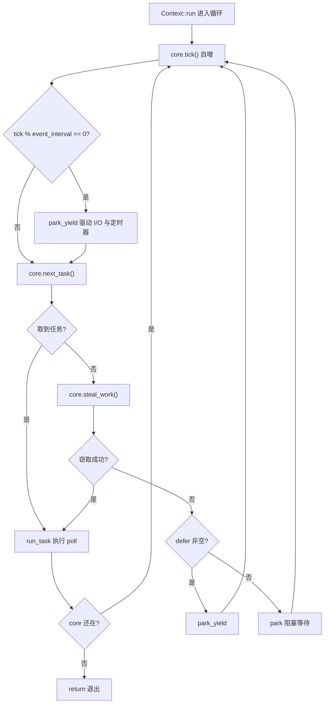
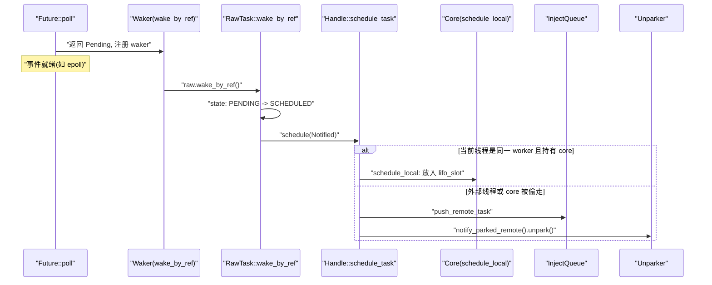
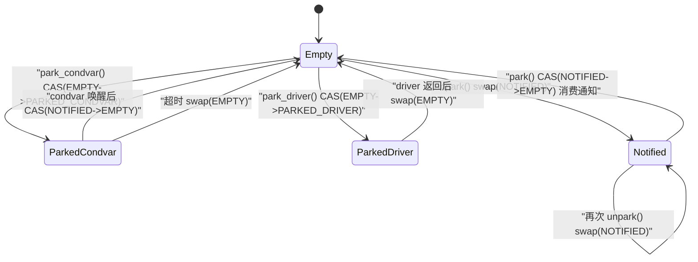

# Capítulo 4: La vida de una tarea (parte 2): bucle de planificación, poll y el ciclo cerrado del despertar

# De la cola a la ejecución: el esqueleto del bucle principal del worker

En el capítulo anterior enviamos la tarea a`Local`la cola o a la cola de inyección global. Pero la cola es solo una «lista de pendientes», lo que realmente hace correr la tarea es ese bucle interminable en el hilo worker. En este capítulo rastreamos`Context::run`—es el corazón de todo el planificador multihilo.

Primero establezcamos la intuición: el hilo worker es como un chef, frente a él tiene una pila de sus propios pedidos (`run_queue`), y al lado hay un estante de pedidos público (`inject`). El chef primero mira la hoja más cercana a su mano (`lifo_slot`), si no hay, toma de su propia pila; si tampoco hay, agarra un puñado del estante público; si aún así no funciona, roba algunas hojas de la pila de otro cocinero. Solo cuando todo está vacío va a descansar, pero mientras descansa mantiene las orejas alerta — en cuanto entra un pedido, se despierta de inmediato.

Sin este bucle, la tarea quedaría en la cola para siempre tras ser encolada,`Future::poll`nunca sería invocada, y todo el runtime sería un montón de datos muertos.

## Diseño de memoria y campos de estado de Core

Todo el estado mutable del worker está contenido en`Core`, que es asignado`Box`en el heap, y se pasa a través de`AtomicCell<Core>`entre`Worker`y el almacenamiento local del hilo`Context`.

`Core`Los campos clave de[FACT:tokio/src/runtime/scheduler/multi_thread/worker.rs:113-167]：

- `tick: u32`son los siguientes: se incrementa en cada iteración del bucle, usado para disparar periódicamente el mantenimiento (`maintenance`) y la verificación de la cola global.
- `lifo_slot: Option<Notified>`：**Ranura LIFO**, este es el diseño más ingenioso de este capítulo. Cuando el worker programa una tarea por sí mismo, no la pone en`run_queue`, sino en esta ranura, y la próxima vez que toma una tarea**prioriza**tomarla de aquí.
- `lifo_enabled: bool`: interruptor de la ranura LIFO, usado para prevenir inanición en escenarios de ping-pong.
- `run_queue: queue::Local<Arc<Handle>>`: cola local, la estructura`Local`analizada en el capítulo anterior.
- `is_searching: bool`: indica si el worker está buscando tareas que pueda robar.
- `is_shutdown: bool` / `is_traced: bool`: indicadores de cierre y seguimiento.
- `park: Option<Parker>`: parker, envuelto con`Option`para facilitar su extracción/reinserción bajo el borrow checker.
- `global_queue_interval: u32`: cada cuánto tiempo verificar la cola global.
- `rand: FastRand`: generador rápido de números aleatorios, usado para elegir aleatoriamente el punto de inicio del robo.

> **[Design Inference & Architectural Trade-offs]**
> Nota que`lifo_slot`es`Option<Notified>`y no una cola — solo almacena**una**tarea. La motivación de este diseño está claramente explicada en los comentarios del código fuente[FACT:tokio/src/runtime/scheduler/multi_thread/worker.rs:117-121]: las tareas que el worker programa por sí mismo se guardan en esta ranura, y el worker la verifica`run_queue` **antes**de revisar, con el efecto de que «la última tarea programada es la siguiente en ejecutarse» (LIFO). Esto es para mejorar la localidad, especialmente efectivo para patrones de paso de mensajes, y reduce la latencia.

¿Por qué LIFO reduce la latencia? Considera un escenario típico de paso de mensajes: la tarea A termina de procesar un mensaje y despierta a la tarea B, B termina de procesar y despierta a A. Si después de que A despierta a B, B se ejecuta inmediatamente, los datos que B necesita probablemente aún estén en la caché de CPU (porque A acaba de tocarlos). Si B se coloca al final de la cola, tras ejecutarse decenas de tareas anteriores, la caché ya habrá sido desplazada.

Pero LIFO tiene riesgo de inanición. El código fuente usa`MAX_LIFO_POLLS_PER_TICK = 3`para limitar[FACT:tokio/src/runtime/scheduler/multi_thread/worker.rs:263-263]: en cada tick se prioriza la ranura LIFO como máximo 3 veces; superado eso se deshabilita, dando oportunidad a otras tareas de ejecutarse.

## Recorrido del bucle principal: un ciclo completo de planificación

Nos situamos en un escenario concreto: el worker 0 acaba de despertar de`park`,`run_queue`tiene 5 tareas,`lifo_slot`tiene 1 tarea, la cola global tiene 3 tareas.

La entrada del bucle principal es`Context::run` [FACT:tokio/src/runtime/scheduler/multi_thread/worker.rs:570-642]. Primero reinicia`lifo_enabled`(porque el core puede haber sido robado por`block_in_place`, el estado necesita restablecerse)[FACT:tokio/src/runtime/scheduler/multi_thread/worker.rs:571-573], luego entra en el bucle`while !core.is_shutdown`.

Cada iteración del bucle hace cuatro cosas:

**Primer paso: tick y mantenimiento.** `core.tick()`incrementa el contador[FACT:tokio/src/runtime/scheduler/multi_thread/worker.rs:587]. Luego`self.maintenance(core)`verifica`tick % event_interval == 0`, y si es así llama a`park_yield`para impulsar I/O y temporizadores con timeout 0[FACT:tokio/src/runtime/scheduler/multi_thread/worker.rs:809-826]。

**Segundo paso: tomar tarea.** `core.next_task(&self.worker)`es la lógica central de toma de tareas[FACT:tokio/src/runtime/scheduler/multi_thread/worker.rs:1090-1156]. Se divide en dos rutas:

- Cuando`tick % global_queue_interval == 0`,**prioriza**tomar de la cola global, y si no hay, toma de la local[FACT:tokio/src/runtime/scheduler/multi_thread/worker.rs:1091-1098]. Esto es para evitar que las tareas de la cola global mueran de inanición.
- De lo contrario**prioriza**tomar tareas locales[FACT:tokio/src/runtime/scheduler/multi_thread/worker.rs:1090-1156]。

La toma local la realiza`next_local_task`[FACT:tokio/src/runtime/scheduler/multi_thread/worker.rs:1158-1160]：

```rust
fn next_local_task(&mut self) -> Option {
    self.lifo_slot.take().or_else(|| self.run_queue.pop())
}
```

primero toma la ranura LIFO, luego la cabeza de la cola (extracción LIFO). Esto es lo que se mencionó en el capítulo anterior como «LIFO local».

Si la local está vacía pero la cola global no, el worker**en lote**extrae tareas de la cola global[FACT:tokio/src/runtime/scheduler/multi_thread/worker.rs:1110-1154]. El cálculo del tamaño del lote`n`es muy cuidadoso:`min(inject.len() / remotes.len() + 1, cap)`, donde`cap`a su vez toma`min(remaining_slots, max_capacity / 2)`. Los comentarios del código fuente explican por qué se limita a la mitad de la capacidad de la cola[FACT:tokio/src/runtime/scheduler/multi_thread/worker.rs:1120-1131]: asegurar que las tareas extraídas caigan en la**primera mitad**de la cola local, de modo que incluso si ocurre un desbordamiento posterior, estas tareas no sean devueltas a la cola global (el desbordamiento solo afecta a la segunda mitad).

**Tercer paso: ejecutar tarea.**Tras obtener la tarea, llama a`run_task` [FACT:tokio/src/runtime/scheduler/multi_thread/worker.rs:647-796]. Esta es la función más compleja del capítulo, que desarrollaremos en la siguiente sección.

**Cuarto paso: robar o park.**Si`next_task`devuelve`None`, indica que no hay trabajo ni local ni global, llama a`steal_work` [FACT:tokio/src/runtime/scheduler/multi_thread/worker.rs:1167-1195]. Si el robo falla, entra en`park`o`park_yield` [FACT:tokio/src/runtime/scheduler/multi_thread/worker.rs:613-621]。

Todo el flujo de control es el siguiente:



## run_task: el ciclo cerrado entre poll y la ranura LIFO

`run_task`es donde la tarea realmente es`poll`, y también el punto de cierre del ciclo «despertar → encolar → re-poll».

Lo primero que hace al entrar en la función es`assert_owner` [FACT:tokio/src/runtime/scheduler/multi_thread/worker.rs:648], convierte`Notified`en`Task`, y al mismo tiempo afirma que el hilo actual es efectivamente el owner de esta tarea (aserción de debug).

Luego`transition_from_searching` [FACT:tokio/src/runtime/scheduler/multi_thread/worker.rs:652]— si el worker estaba antes en estado de búsqueda, ahora que encontró la tarea, debe salir del estado de búsqueda y posiblemente despertar a otros workers en park.

Después viene el envoltorio clave de budget[FACT:tokio/src/runtime/scheduler/multi_thread/worker.rs:695-795]：

```rust
coop::budget(|| {
    task.run();
    let mut lifo_polls = 0;
    loop {
        let mut core = match self.core.borrow_mut().take() {
            Some(core) => core,
            None => return ControlFlow::Break(()),
        };
        let task = match core.lifo_slot.take() {
            Some(task) => task,
            None => {
                self.reset_lifo_enabled(&mut core);
                core.stats.end_poll();
                return ControlFlow::Continue(core);
            }
        };
        if !coop::has_budget_remaining() {
            core.run_queue.push_back_or_overflow(task, ...);
            return ControlFlow::Continue(core);
        }
        lifo_polls += 1;
        if lifo_polls >= MAX_LIFO_POLLS_PER_TICK {
            core.lifo_enabled = false;
        }
        let task = self.worker.handle.shared.owned.assert_owner(task);
        *self.core.borrow_mut() = Some(core);
        task.run();
    }
})
```

Este fragmento de código revela el ciclo cerrado completo de la ranura LIFO:`task.run()`ejecuta`Future::poll`, si durante el poll la tarea se despierta a sí misma o a otra tarea,`schedule_local`pondrá la nueva tarea en`lifo_slot` [FACT:tokio/src/runtime/scheduler/multi_thread/worker.rs:1396-1408]. Tras retornar el poll, el bucle verifica inmediatamente`lifo_slot`, y si hay tarea continúa ejecutando —**sin volver al bucle principal**, haciendo poll continuo dentro del mismo budget.

Esto es la manifestación de «despertar → encolar → re-poll» en la ruta LIFO: al despertar, la tarea se coloca en`lifo_slot`, y tras retornar el poll se extrae inmediatamente para re-poll, formando un ciclo cerrado estrecho.

Nota la rama`self.core.borrow_mut().take()`de`None`[FACT:tokio/src/runtime/scheduler/multi_thread/worker.rs:716-724]: si el core fue robado (por ejemplo, si dentro de la tarea se llamó a`block_in_place`), el worker debe devolver`ControlFlow::Break(())`, haciendo que`Context::run`salga. Esto es`block_in_place`Punto de interacción con el bucle de planificación.

## Ruta de activación: cómo Waker desencadena la reincorporación a la cola

Cuando`Future::poll`devuelve`Pending`la tarea necesita registrar un`Waker`y ser activada cuando el evento esté listo. La implementación de`Waker`en Tokio es extremadamente compacta: es simplemente un puntero crudo a la tarea`Header`más una vtable.

`waker_ref`Construye`WakerRef` [FACT:tokio/src/runtime/task/waker.rs:11-34]usando`ManuallyDrop`para envolver`Waker`y evitar decrementar el contador de referencias al hacer drop. La vtable es estática[FACT:tokio/src/runtime/task/waker.rs:119-119]：

```rust
static WAKER_VTABLE: RawWakerVTable =
    RawWakerVTable::new(clone_waker, wake_by_val, wake_by_ref, drop_waker);
```

Las cuatro funciones simplemente convierten el puntero crudo de vuelta a`Header`y luego llaman al método correspondiente de`RawTask`[FACT:tokio/src/runtime/task/waker.rs:70-116]Por ejemplo,`wake_by_ref`finalmente llama a`raw.wake_by_ref()` [FACT:tokio/src/runtime/task/waker.rs:106-116]。

`wake_by_ref`La semántica es: cambiar el estado de la tarea de`PENDING`a`SCHEDULED`y, si la conversión tiene éxito (es decir, si efectivamente estaba en PENDING), llamar a`Schedule::schedule`para reincorporar la tarea a la cola.

Para el planificador multihilo,`schedule`la implementación de`Handle::schedule_task` [FACT:tokio/src/runtime/scheduler/multi_thread/worker.rs:1353-1376]：

```rust
pub(super) fn schedule_task(&self, task: Notified, is_yield: bool) {
    with_current(|maybe_cx| {
        if let Some(cx) = maybe_cx {
            if self.ptr_eq(&cx.worker.handle) {
                if let Some(core) = cx.core.borrow_mut().as_mut() {
                    self.schedule_local(core, task, is_yield);
                    return;
                }
            }
        }
        self.push_remote_task(task);
        self.notify_parked_remote();
    });
}
```

La lógica se divide en dos ramas:

- Si el hilo actual es un worker de este planificador y posee el core, se usa`schedule_local` [FACT:tokio/src/runtime/scheduler/multi_thread/worker.rs:1385-1417]— se coloca en la ranura LIFO o en la cola local.
- En caso contrario (activación desde un hilo externo, o el core fue robado), se usa`push_remote_task`para insertar en la cola de inyección global y`notify_parked_remote`activar un worker en park[FACT:tokio/src/runtime/scheduler/multi_thread/worker.rs:1379-1383]。

`schedule_local`Internamente se divide en dos ramas[FACT:tokio/src/runtime/scheduler/multi_thread/worker.rs:1385-1417]: si es`yield`o LIFO está deshabilitado, se inserta al final de`run_queue`; de lo contrario, se coloca en`lifo_slot`y la tarea que estaba en la ranura se empuja al final de la cola.



## park y unpark: atomicidad de la máquina de estados y la activación

El worker debe hacer park cuando no tiene trabajo, pero park/unpark es donde más fácilmente ocurren condiciones de carrera. Tokio usa una máquina de estados`AtomicUsize`más`Condvar`como respaldo para resolverlo.

`Inner`Los campos de[FACT:tokio/src/runtime/scheduler/multi_thread/park.rs:31-43]：`state: AtomicUsize`、`mutex: Mutex<()>`、`condvar: Condvar`、`shared: Arc<Shared>`. Hay cuatro constantes de estado[FACT:tokio/src/runtime/scheduler/multi_thread/park.rs:36-45]：

- `EMPTY = 0`: no está en park.
- `PARKED_CONDVAR = 1`: en park sobre el condvar.
- `PARKED_DRIVER = 2`: en park sobre el I/O driver.
- `NOTIFIED = 3`: ya fue activado.

Esta es una máquina de estados explícita; la usamos para dibujar el diagrama de estados (este es el único lugar del capítulo que cumple con los criterios de admisión de`stateDiagram-v2`— en el código fuente efectivamente existen estas cuatro constantes de estado):



`unpark`La implementación de[FACT:tokio/src/runtime/scheduler/multi_thread/park.rs:277-290]usa`swap`en lugar de CAS; los comentarios del código fuente explican la razón[FACT:tokio/src/runtime/scheduler/multi_thread/park.rs:277-290]: se debe ejecutar una operación release para que el hilo en park observe las escrituras anteriores al unpark, así que incluso si state ya es`NOTIFIED`hay que escribir una vez.

`park`Primero intenta consumir una notificación existente[FACT:tokio/src/runtime/scheduler/multi_thread/park.rs:132-149]: si el CAS`NOTIFIED -> EMPTY`tiene éxito, significa que ya fue activado antes, y retorna directamente sin bloquear. De lo contrario, intenta adquirir el lock del driver; si lo obtiene, hace park sobre el driver; si no, usa el condvar como respaldo[FACT:tokio/src/runtime/scheduler/multi_thread/park.rs:143-148]。

`park_condvar`Hay una doble verificación clásica en[FACT:tokio/src/runtime/scheduler/multi_thread/park.rs:162-180]: primero CAS`EMPTY -> PARKED_CONDVAR`; si falla y es`NOTIFIED`, significa que fue activado antes de establecer el estado, y en ese momento se debe`swap(EMPTY)`para sincronizar la escritura del unpark[FACT:tokio/src/runtime/scheduler/multi_thread/park.rs:167-177]. El comentario enfatiza especialmente: incluso sabiendo que es`NOTIFIED`también hay que leer una vez, porque unpark puede haber sido llamado otra vez después de nuestra lectura de`NOTIFIED`.

`unpark_condvar`El comentario de[FACT:tokio/src/runtime/scheduler/multi_thread/park.rs:292-307]señala la trampa clásica del condvar: entre que el hilo en park establece el estado`PARKED`y realmente`wait`hay una ventana, y si se hace notify durante ese período se ignora. La solución es que el hilo que hace park posee`mutex`en ese momento, y el hilo que hace unpark primero`drop(self.mutex.lock())`adquiere el lock (esperando así a que el hilo en park lo libere), y luego`notify_one`。

# Reflexión de diseño: por qué la ranura LIFO es una ranura única y no una cola

> **[Design Inference & Architectural Trade-offs]**
> El diseño de ranura única es una compensación deliberada. Si se usara una cola, cada activación requeriría encolar y cada extracción de tarea desencolar, con mayor sobrecarga; además, la cola acumularía múltiples tareas, rompiendo la suposición de localidad de "la activación más reciente se ejecuta primero". La semántica de la ranura única es "recordar solo la más reciente", y la tarea desplazada va a la cola normal; esto encaja justamente con la ley de rendimientos decrecientes de la localidad: la tarea más reciente es la más caliente, la segunda menos, y de la tercera en adelante el beneficio es muy pequeño.

`MAX_LIFO_POLLS_PER_TICK = 3`Este número mágico[FACT:tokio/src/runtime/scheduler/multi_thread/worker.rs:263-263]también es un valor empírico. El comentario del código fuente dice que "ejecutar unas pocas veces la ranura LIFO parece suficiente para beneficiarse de la localidad; más de 3 veces puede sobreponderar". Esto evita que el escenario ping-pong en que A activa a B y B activa a A mate de hambre a otras tareas.

Otro diseño digno de mención es la estrategia de "búsqueda por mitad" de`steal_work`[FACT:tokio/src/runtime/scheduler/multi_thread/worker.rs:1158-1160]: solo cuando menos de la mitad de los workers están buscando, un nuevo worker realmente intenta robar. Esto evita la contención de CAS causada por todos los workers robando frenéticamente al mismo tiempo.`transition_to_searching`Coordina mediante`idle.transition_worker_to_searching()`[FACT:tokio/src/runtime/scheduler/multi_thread/worker.rs:1197-1203]。

El robo comienza desde un punto de partida aleatorio[FACT:tokio/src/runtime/scheduler/multi_thread/worker.rs:1172-1174], recorre todos los remote, se salta a sí mismo[FACT:tokio/src/runtime/scheduler/multi_thread/worker.rs:1179-1182]y llama a`steal_into`para intentar robar. Tras fallar todo, recurre a la cola global[FACT:tokio/src/runtime/scheduler/multi_thread/worker.rs:1197-1203]。

# Resumen del capítulo

El bucle principal del worker`Context::run`es el corazón del planificador: tras cada tick primero toma una tarea (ranura LIFO → cola local → cola global); si la obtiene,`run_task`ejecuta poll; si no, roba; si el robo falla, hace park.`run_task`El bucle LIFO interno comprime "activar → encolar → volver a hacer poll" dentro del mismo budget, formando un ciclo cerrado de baja latencia.`Waker`es un puntero crudo más una vtable estática,`wake_by_ref`desencadena`schedule`mediante transiciones de estado, y según si el hilo actual es el mismo worker decide ir a la cola local o a la global.`park`/`unpark`usa una máquina atómica de cuatro estados más un condvar de respaldo, resolviendo la clásica condición de carrera de pérdida de activación.

En el próximo capítulo dejaremos el planificador y entraremos al mundo de I/O: cómo el Reactor traduce eventos de epoll a`Waker`activaciones, haciendo que`AsyncFd`de`Pending`se convierta en`Ready`。

# Reflexión y autoevaluación del capítulo

Q1: Si se cambiara`next_local_task`para tomar primero`run_queue`Luego tomar`lifo_slot`, ¿qué consecuencias tendría en escenarios de paso de mensajes intensivo?

**Análisis de referencia**：`next_local_task`La implementación actual es`self.lifo_slot.take().or_else(|| self.run_queue.pop())` [FACT:tokio/src/runtime/scheduler/multi_thread/worker.rs:1158-1160], primero toma el slot LIFO. Si en cambio se toma primero`run_queue`, entonces las tareas que acaban de ser despertadas y cuyos datos aún están calientes serían programadas para ejecutarse después de otras tareas en la cola. En el patrón de paso de mensajes A→B→A, B no se ejecuta inmediatamente tras ser despertado, sino que espera a que otras tareas de la cola terminen; en ese momento los datos escritos por A pueden haber sido expulsados de la caché de CPU, perdiéndose el beneficio de localidad. Más grave aún,`lifo_slot`las tareas en`run_queue`esperarán hasta que[FACT:tokio/src/runtime/scheduler/multi_thread/worker.rs:117-121]se vacíe para ser ejecutadas, aumentando significativamente la latencia. El comentario del código fuente

Q2: `park_condvar`señala explícitamente que este orden es para «mejorar la localidad, beneficiarse del patrón de paso de mensajes y reducir la latencia».`Err(NOTIFIED)`En`self.state.swap(EMPTY, SeqCst)`, si se elimina`return`de la rama

**y solo se conserva**, ¿qué problemas habría?`Err(NOTIFIED)`Análisis de referencia`let old = self.state.swap(EMPTY, SeqCst)` [FACT:tokio/src/runtime/scheduler/multi_thread/park.rs:167-177]: el código fuente ejecuta[FACT:tokio/src/runtime/scheduler/multi_thread/park.rs:168-173]en la rama`NOTIFIED`. El comentario explica`return`: unpark puede haber sido llamado una vez más después de que leamos`NOTIFIED`, y es necesario ejecutar una operación acquire para sincronizar con ese unpark y poder observar todas sus escrituras previas. Si solo se`NOTIFIED -> EMPTY`sin swap, state permanecerá en

Q3: `run_task`, y en el siguiente park el CAS`self.core.borrow_mut().take()`tendrá éxito y retornará inmediatamente (consumiendo una notificación ya caducada), pero lo peor es que la escritura release del unpark no se sincroniza, y el hilo que hace park podría no ver los datos escritos antes del unpark, causando problemas de visibilidad de memoria. Este es un típico doble bug de «pérdida de wakeup + orden de memoria».`None`En`ControlFlow::Break(())`, cuando`Continue`？

**retorna**：`self.core.borrow_mut().take()`, ¿por qué retorna`None`en lugar de[FACT:tokio/src/runtime/scheduler/multi_thread/worker.rs:716-724]Análisis de referencia`block_in_place`retornar`maybe_move_runtime`significa que el core ya ha sido robado`cx.core`. La única vía para que el core sea robado es que una tarea internamente llame a[FACT:tokio/src/runtime/scheduler/multi_thread/worker.rs:473-497], que mediante`Continue`，`Context::run`saca el core de`core.next_task()`y lo entrega al nuevo hilo`self.core`. En ese momento el hilo actual ya no posee capacidad de scheduling; si retornara`Break`continuaría el bucle y llamaría a`Context::run`y otros métodos que requieren el core, pero el core ya no está en`return` [FACT:tokio/src/runtime/scheduler/multi_thread/worker.rs:594-597], causando panic o inconsistencia de estado. Retornar`run`hace que`cx.defer.wake()` [FACT:tokio/src/runtime/scheduler/multi_thread/worker.rs:564]directamente[FACT:tokio/src/runtime/scheduler/multi_thread/worker.rs:719-721], devolviendo el control a la función`reset_lifo_enabled`, que se encarga de lo posterior (por ejemplo`Context::run`). El comentario también indica
