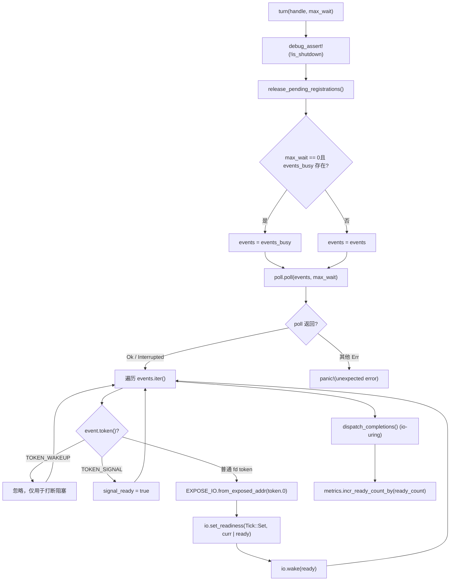
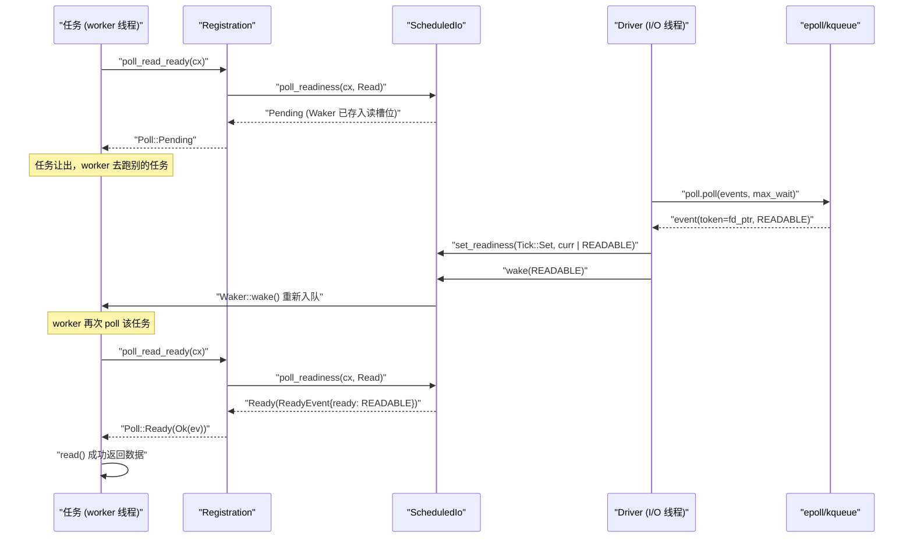

# ← Capítulo anterior: Capítulo 3

Proyecto: tokio-rs/tokio

# Progreso del libro: Capítulo 5 / 14`Driver`Estado de verificación: líneas FACT con anclaje real`Handle`En el capítulo anterior rastreamos el bucle principal del hilo worker: la tarea es poll, al retornar Pending el Waker se guarda en algún lugar, y cuando el evento está listo el Waker se dispara y la tarea se reencola. Pero ¿dónde está exactamente ese «algún lugar»? ¿Cómo se recupera el Waker cuando llega un evento epoll? Esta es precisamente la pregunta que Reactor debe responder. Primero construyamos un modelo intuitivo: imaginemos todo el mecanismo de notificación de E/S lista como el sistema de llamada por número de un restaurante — el cliente (tarea) tras pedir no se queda esperando de pie en la ventanilla, sino que toma un vibrador (Waker) y vuelve a su asiento; cuando la cocina (epoll del kernel) termina el pedido, la recepción (Reactor) busca el vibrador correspondiente según el número de pedido (Token) y pulsa el botón. Sin este sistema, cada tarea solo podría hacer polling del socket, quemando la CPU; o usar hilos bloqueantes en espera, un hilo por conexión, sin poder escalar. El Reactor de Tokio se compone de tres archivos en una estructura de tres capas con responsabilidades estrictamente separadas: driver.rs es el cuerpo del bucle de eventos, posee mio::Poll, se encarga de llamar a poll() bloqueándose a la espera de eventos del kernel y traduce los eventos en lecturas/escrituras sobre ScheduledIo; registration.rs es el handle de registro orientado al usuario, que es lo que TcpStream mantiene internamente, ofreciendo APIs como poll_read_ready / poll_write_ready; scheduled_io.rs es el slot de estado de cada fd, almacena los bits de readiness de lectura/escritura y la lista de Wakers, y es el puente entre eventos y tareas. La relación de ensamblaje de módulos puede consultarse en tokio/src/runtime/io/mod.rs:5-16: driver exporta Driver, Handle, ReadyEvent; registration exporta Registration; scheduled_io exporta ScheduledIo. El siguiente diagrama ancla el flujo de datos completo que este capítulo va a rastrear: TcpStream → Registration → ScheduledIo → Handle/Driver → kernel → de vuelta a ScheduledIo → Waker. A continuación lo desglosamos capa por capa.

## Capa de driver:

`Driver`y**división de responsabilidades`mio::Poll`Modelo intuitivo**es`&mut`la única entidad que posee`Handle`, solo puede ser accedida**desde un único hilo — este es el requisito de exclusividad del bucle de eventos. Mientras que**, cualquier hilo que quiera registrar un nuevo fd lo hace a través de él. Sin esta división, o bien se tendría que`mio::Poll`bloquear con lock (compitiendo en cada registro), o bien hacer que todos los registros vuelvan al hilo driver (introduciendo una cola de mensajes entre hilos). Tokio elige que`Handle`mantenga directamente un clon de`mio::Registry`, las operaciones de registro pueden realizarse de forma concurrente, y solo la espera real de eventos requiere exclusividad.

## Diseño de memoria y campos

Primero veamos`Driver`los campos de[FACT:tokio/src/runtime/io/driver.rs:25-38]：

- `signal_ready: bool`: si ha llegado un evento de señal Unix, usado para el driver de señales.
- `events: mio::Events`: búfer principal de eventos, reutilizado entre llamadas a`turn`, evitando asignaciones en cada ocasión.
- `events_busy: Option<mio::Events>`：**Búfer dedicado para poll no bloqueante**, existe solo cuando`max_io_events_per_busy_tick`está configurado.
- `poll: mio::Poll`: envoltorio de la cola de eventos del kernel.

Ahora veamos`Handle` [FACT:tokio/src/runtime/io/driver.rs:41-75]：

- `registry: mio::Registry`：`mio::Poll::registry()`el clon de`register`/`deregister`。
- `registrations: RegistrationSet`, usado para`Token`: conjunto de todos los registros activos, responsable de asignar`ScheduledIo`。
- `synced: Mutex<registration_set::Synced>`y`RegistrationSet`: protege el estado de sincronización de
- `waker: mio::Waker`: se usa para despertar desde cualquier hilo al driver que está bloqueado en`turn`.
- `metrics: IoDriverMetrics`: cuenta el número de fds y de eventos listos.

Aquí hay un diseño clave:`events_busy`la existencia de[FACT:tokio/src/runtime/io/driver.rs:25-38]es para resolver**el problema de que el poll no bloqueante se traga eventos**. El comentario[FACT:tokio/src/runtime/io/driver.rs:189-190]lo dice claramente: si los eventos tomados por el poll no bloqueante se quedaran en el búfer principal, el siguiente poll no los vería; usando un búfer independiente, los eventos no procesados permanecen en la cola del kernel y el siguiente poll los devolverá de nuevo.

## Paso a paso: una ejecución de`turn`

`turn`es la función central del driver[FACT:tokio/src/runtime/io/driver.rs:184-261]. Supongamos que un hilo worker descubre que no hay tareas que ejecutar y llama a`park` → `turn(handle, None)`para bloquearse en espera:

**Primer paso**: afirmar que no se ha hecho shutdown[FACT:tokio/src/runtime/io/driver.rs:185], y liberar los registros pendientes de limpieza[FACT:tokio/src/runtime/io/driver.rs:187]。`release_pending_registrations`comprobar`needs_release()`, y si los hay, llamar a`registrations.release()` [FACT:tokio/src/runtime/io/driver.rs:336-340]。

**Segundo paso**: elegir el búfer de eventos[FACT:tokio/src/runtime/io/driver.rs:191-194]. Si`max_wait`es cero y`events_busy`existe, usar el búfer busy; en caso contrario, usar el búfer principal.

**Tercer paso**: llamar a`self.poll.poll(events, max_wait)` [FACT:tokio/src/runtime/io/driver.rs:198]. Este es el lugar donde realmente se bloquea en epoll_wait. El manejo de errores es muy contenido:`Interrupted`se ignora directamente (una interrupción por señal es normal)[FACT:tokio/src/runtime/io/driver.rs:200], bajo WASI`InvalidInput`también se ignora[FACT:tokio/src/runtime/io/driver.rs:201-205], otros errores provocan panic directamente[FACT:tokio/src/runtime/io/driver.rs:206]。

**Cuarto paso**: recorrer los eventos[FACT:tokio/src/runtime/io/driver.rs:211-233]. Para cada`event`：

- si`token == TOKEN_WAKEUP`(valor 0)[FACT:tokio/src/runtime/io/driver.rs:214], no hacer nada: esto es lo que usa`unpark`para interrumpir el bloqueo.
- Si`token == TOKEN_SIGNAL`(valor 1)[FACT:tokio/src/runtime/io/driver.rs:216], establecer`signal_ready = true`。
- ; en caso contrario, es un evento de E/S normal[FACT:tokio/src/runtime/io/driver.rs:218-231]: convertir`mio::Ready`en el`Ready`de Tokio, usar`EXPOSE_IO.from_exposed_addr(token.0)`para restaurar el token a un puntero`*const ScheduledIo`, luego`set_readiness(Tick::Set, |curr| curr | ready)`acumular los bits de listo, y después`io.wake(ready)`disparar el`Waker`。

en la dirección correspondiente`EXPOSE_IO`Aquí`PtrExposeDomain<ScheduledIo>` [FACT:tokio/src/runtime/io/mod.rs:21-22]es un`usize`, que «expone» el puntero como un`mio::Token`como[FACT:tokio/src/runtime/io/driver.rs:222-225]. El comentario de seguridad**explica por qué esta conversión unsafe es segura: el puntero no se libera antes de darse de baja de mio**y`Arc<ScheduledIo>`que el driver deje de hacer poll de forma concurrente, y el driver posee la propiedad de

**Quinto paso**: procesar la cola de completación de io_uring (solo Linux + tokio_unstable)[FACT:tokio/src/runtime/io/driver.rs:235-258], incluido el bucle de flush cuando hay desbordamiento de CQ.

**Sexto paso**: acumular métricas[FACT:tokio/src/runtime/io/driver.rs:265-267]。



## Reflexión de diseño: por qué`Handle`debe poseer`mio::Waker`

`unpark` [FACT:tokio/src/runtime/io/driver.rs:280-283]llamar a`self.waker.wake()`. Este`mio::Waker`en`Driver::new`se registra con`TOKEN_WAKEUP`usando[FACT:tokio/src/runtime/io/driver.rs:124]. Cuando el driver está bloqueado en`poll.poll()`, otro hilo que llame a`unpark`insertará un evento`TOKEN_WAKEUP`en epoll,`poll`regresará inmediatamente, y al recorrer verá este token y lo saltará directamente[FACT:tokio/src/runtime/io/driver.rs:214-215]。

> **[Design Inference & Architectural Trade-offs]**
> Este mecanismo se usa en`deregister_source`[FACT:tokio/src/runtime/io/driver.rs:315-334]: después de dar de baja un source, si`registrations.deregister`devuelve true (indicando que esta es la última referencia), entonces`unpark()`. ¿Por qué? Porque el driver puede estar bloqueado en`poll`esperando eventos de este fd, y el fd ya ha sido dado de baja, por lo que el kernel ya no generará eventos; hay que despertar activamente al driver para que vuelva a revisar el conjunto de registros y posiblemente salga del bloqueo. De lo contrario, el driver dormiría hasta el timeout de`max_wait`, retrasando el shutdown.

Otro detalle:`deregister_source`primero llama a`self.registry.deregister(source)` [FACT:tokio/src/runtime/io/driver.rs:322], y luego limpia`registrations` [FACT:tokio/src/runtime/io/driver.rs:315-334]. El comentario[FACT:tokio/src/runtime/io/driver.rs:320-321]dice «Cleanup ALWAYS happens»: incluso si el deregister a nivel de SO falla, también hay que limpiar el estado interno, y solo al final devolver el error del SO[FACT:tokio/src/runtime/io/driver.rs:336-340]. Este es el típico patrón de**limpieza de recursos antes que propagación de errores**.

# Capa de registro:`Registration`cómo almacenar`Waker`en`ScheduledIo`

## Modelo intuitivo

`Registration`es**el contrato entre la tarea y el fd**. Mantiene dos cosas: un`scheduler::Handle`(usado para acceder al runtime cuando sea necesario), y un`Arc<ScheduledIo>`(la ranura de estado del fd). Cuando una tarea llama a`poll_read_ready`,`Registration`entrega`Waker`a`ScheduledIo`para que lo custodie; cuando el driver recibe un evento, saca`ScheduledIo`de`Waker`para despertar.

## Diseño de memoria y campos

`Registration`solo tiene dos campos[FACT:tokio/src/runtime/io/registration.rs:46-54]：

- `handle: scheduler::Handle`: el handle del runtime, el comentario[FACT:tokio/src/runtime/io/registration.rs:46-54]dice «TODO: this can probably be moved into ScheduledIo», lo que indica que el autor cree que la posición de este campo puede optimizarse.
- `shared: Arc<ScheduledIo>`: estado compartido,`Arc`garantiza que tanto el driver como la tarea puedan acceder.

> **[Design Inference & Architectural Trade-offs]**
> Observa que`Registration`implementa manualmente`Send`y`Sync` [FACT:tokio/src/runtime/io/registration.rs:57-58]. ¿Por qué se necesita unsafe impl? Porque`scheduler::Handle`internamente puede contener campos que no son`Send`/`Sync`(por ejemplo`Rc`), pero el escenario de uso de`Registration`exige que pueda cruzar hilos. El comentario de documentación[FACT:tokio/src/runtime/io/registration.rs:28-33]da la restricción clave:**el llamador debe garantizar que como máximo dos tareas usen concurrentemente el mismo`Registration`**, una para lectura y otra para escritura. Violar esta restricción, aunque es seguro para la memoria, provocará pérdida de notificaciones y suspensión de tareas.

## Step-by-Step：`poll_read_ready`la cadena de llamadas de

Supongamos que la tarea en`TcpStream::poll_read`se descubre que el socket no tiene datos, es necesario registrar el interés de lectura. La cadena de llamadas es`TcpStream::poll_read_priv` → `PollEvented::poll_read` → `Registration::poll_read_io` → `poll_io` → `poll_ready`。

`poll_ready`es el núcleo[FACT:tokio/src/runtime/io/registration.rs:155-171]：

**Primer paso**：`trace_leaf()` [FACT:tokio/src/runtime/io/registration.rs:160], utilizado para el trazado de instrumentación.

**Segundo paso**：`coop::poll_proceed(cx)` [FACT:tokio/src/runtime/io/registration.rs:155-171]. Este es el mecanismo de presupuesto cooperativo que se explicará en el capítulo 12. Si el presupuesto se agota, devuelve`Pending`y registra un`Waker`especial, para que la tarea sea reprogramada en la siguiente ronda.

**Tercer paso**：`self.shared.poll_readiness(cx, direction)` [FACT:tokio/src/runtime/io/registration.rs:155-171]. Este es el lugar donde realmente se interactúa con`ScheduledIo`: verifica el bit de listo actual, si ya está listo devuelve inmediatamente`Ready`; de lo contrario almacena`cx.waker()`en`ScheduledIo`la ranura de dirección correspondiente de`Pending`。

**, devuelve**Cuarto paso`ev.is_shutdown` [FACT:tokio/src/runtime/io/registration.rs:155-171]: verifica`RUNTIME_SHUTTING_DOWN_ERROR`。

**. Si el runtime se está cerrando, devuelve**：`coop.made_progress()` [FACT:tokio/src/runtime/io/registration.rs:169]Quinto paso

`poll_io`, marca el consumo de presupuesto, devuelve el evento de listo.`poll_ready`añade una capa de bucle de reintento sobre[FACT:tokio/src/runtime/io/registration.rs:173-192]：

```rust
loop {
    let ev = ready!(self.poll_ready(cx, direction))?;
    match f() {
        Ok(ret) => return Poll::Ready(Ok(ret)),
        Err(ref e) if e.kind() == io::ErrorKind::WouldBlock => {
            self.clear_readiness(ev);
        }
        Err(e) => return Poll::Ready(Err(e)),
    }
}
```

Aquí se refleja**readiness es una sugerencia, no una garantía**la idea central de`poll_ready`: dice que es legible, pero al realmente`read()`puede devolver`WouldBlock`(por ejemplo, otro hilo se adelantó y leyó los datos). En este caso se debe`clear_readiness(ev)` [FACT:tokio/src/runtime/io/registration.rs:187]limpiar el bit de listo, y luego repetir el bucle de espera. Si no se limpia, la tarea caerá en un bucle ocupado de «cree que es legible → read falla → vuelve a creer que es legible».

## Reflexión de diseño:`try_io`y`async_io`la división de trabajo

`try_io` [FACT:tokio/src/runtime/io/registration.rs:194-213]es la versión síncrona: primero`ready_event(interest)`verifica el bit de listo, si está vacío devuelve directamente`WouldBlock` [FACT:tokio/src/runtime/io/registration.rs:194-213]; de lo contrario ejecuta`f()`, si`f()`devuelve`WouldBlock`entonces limpia el bit de listo[FACT:tokio/src/runtime/io/registration.rs:207-210]. Este**no registra Waker**, es adecuado para`try_read`escenarios de «intentar y salir» como

`async_io` [FACT:tokio/src/runtime/io/registration.rs:225-245]es la versión asíncrona:`readiness(interest).await`registra el Waker y espera, luego al ejecutar`f()`，`WouldBlock`limpia el bit de listo y repite el bucle. Nótese que dentro del bucle también llama a`coop::poll_proceed` [FACT:tokio/src/runtime/io/registration.rs:233], para evitar agotar el presupuesto en una gran cantidad de`WouldBlock`reintentos.

## Problemas en producción:`Drop`la limpieza del Waker en

`Registration::drop` [FACT:tokio/src/runtime/io/registration.rs:253-262]llama a`self.shared.clear_wakers()`. El comentario[FACT:tokio/src/runtime/io/registration.rs:253-262]explica la razón:`ScheduledIo`el`Waker`almacenado en`Arc<driver::Inner>`puede contener`driver::Inner`, y`ScheduledIo`a su vez contiene`Registration`, formando una referencia circular. Limpiar el Waker es un medio para romper el ciclo. Pero el comentario también admite que es una «imperfect solution» — si`Waker`mismo se almacena en

> **[Design Inference & Architectural Trade-offs]**
> 〔Inferencia de diseño y compensaciones arquitectónicas〕`clear_wakers`El comportamiento en producción es: si una gran cantidad de conexiones son drop pero el runtime no ha salido, la memoria no se recupera inmediatamente, hasta el siguiente`ScheduledIo`o el apagado del runtime. Para servicios de conexión larga, esto normalmente no es un problema; pero para escenarios de creación/destrucción de alta frecuencia de conexiones cortas, hay que prestar atención al momento de recuperación de

# Desde`TcpStream::read`hasta`Waker`la cadena completa de activación

## Modelo intuitivo

Ahora conectemos las tres capas. El usuario llama a`TcpStream`sobre`.read().await`, lo que realmente se ejecuta es`AsyncRead::poll_read` → `PollEvented::poll_read` → `Registration::poll_read_io`. Cuando los datos no han llegado,`Waker`se almacena en`ScheduledIo`; cuando epoll reporta legible, el driver saca`ScheduledIo`de`Waker`y activa, la tarea es reprogramada, y al hacer poll de nuevo`poll_readiness`descubre que el bit de listo ya está puesto, devuelve directamente`Ready`，`read()`con éxito.

## Paso a paso: una espera de lectura completa

**Fase uno: registrar interés**。`TcpStream::new` [FACT:tokio/src/net/tcp/stream.rs:166-169]llama a`PollEvented::new(connected)`, este internamente llama a`Registration::new_with_interest_and_handle` [FACT:tokio/src/runtime/io/registration.rs:73-81], y luego`handle.driver().io().add_source(io, interest)` [FACT:tokio/src/runtime/io/registration.rs:73-81]。

`add_source` [FACT:tokio/src/runtime/io/driver.rs:288-312]hace tres cosas:

1. `registrations.allocate(&mut synced.lock())`asigna un`ScheduledIo`, obtiene`token` [FACT:tokio/src/runtime/io/driver.rs:293-294]。

2. `self.registry.register(source, token, interest.to_mio())`registra[FACT:tokio/src/runtime/io/driver.rs:298]ante el kernel. Si falla,**debe**eliminar el`ScheduledIo`recién asignado del conjunto[FACT:tokio/src/runtime/io/driver.rs:300-303], de lo contrario hay fuga.

3. `metrics.incr_fd_count()`cuenta[FACT:tokio/src/runtime/io/driver.rs:309]。

**Fase dos: esperar a que esté listo**. La tarea hace poll`TcpStream::poll_read` [FACT:tokio/src/net/tcp/stream.rs:1492-1498] → `poll_read_priv` [FACT:tokio/src/net/tcp/stream.rs:1451-1458] → `PollEvented::poll_read` → `Registration::poll_read_io` [FACT:tokio/src/runtime/io/registration.rs:133-139] → `poll_io` → `poll_ready` → `ScheduledIo::poll_readiness`. En este momento si no está listo,`Waker`se almacena en`ScheduledIo`la ranura de lectura de`Pending`。

**, devuelve**Fase tres: llega el evento`turn`. El`poll.poll()`del driver obtiene el evento[FACT:tokio/src/runtime/io/driver.rs:198]de`io.set_readiness(Tick::Set, |curr| curr | ready)`, al recorrer ejecuta para cada evento de fd`io.wake(ready)` [FACT:tokio/src/runtime/io/driver.rs:228-229]。`wake`y`Waker`internamente saca el`wake()`。

**de la dirección correspondiente y llama a**。`Waker::wake()`Fase cuatro: reprogramación de la tarea`poll_readiness`vuelve a encolar la tarea en la cola local del worker (explicado en el capítulo anterior). El worker hace poll de nuevo a esa tarea,`Ready`，`read()`descubre que el bit de listo ya está puesto, devuelve



## copiar`assume_ready`Rama importante:

`TcpStream::new_accepted` [FACT:tokio/src/net/tcp/stream.rs:174-181]optimización`accept`es una optimización que vale la pena notar.`new_accepted`el socket devuelto es naturalmente escribible, y normalmente ya tiene el primer lote de bytes del par. Si se espera al primer evento del driver, bajo alta carga este evento puede quedar detrás de todos los eventos de conexiones ya establecidas, causando latencia. Por eso`assume_ready(Ready::READABLE | Ready::WRITABLE)` [FACT:tokio/src/net/tcp/stream.rs:174-181]。

`assume_ready`llama directamente a[FACT:tokio/src/runtime/io/registration.rs:103-105]el comentario`WouldBlock`dice: «A wrong guess costs one`WouldBlock`，`poll_io`, which clears the readiness again.» — el costo de adivinar mal es solo un**el bucle de**limpiará el bit de listo y volverá a esperar. Este es un diseño de

## conjetura optimista + corrección rápida de errores

> **[Design Inference & Architectural Trade-offs]**
> 〔Inferencia de diseño y compensaciones arquitectónicas〕`Driver`Desde la estructura del código fuente,`Driver`y los hilos worker están separados:`block_on`se coloca en alguna posición dedicada del runtime (normalmente el hilo`Handle`o un hilo de I/O dedicado), mientras que los hilos worker solo tienen

1. **. Este desacoplamiento trae varias ventajas:**：`Handle`Registro sin bloqueos`mio::Registry`tiene

2. **clonado, cualquier worker puede registrar nuevos fd concurrentemente, sin necesidad de volver al hilo del driver.**Centralización de la espera de eventos`epoll_wait`: solo un hilo se bloquea en

3. **, evitando el problema de thundering herd al hacer poll del mismo epoll fd desde múltiples hilos.**Ruta de activación corta`ScheduledIo`: el driver tras recibir el evento opera directamente sobre`Waker::wake()`，`wake()`y llama a

internamente empuja la tarea a la cola del worker, sin necesidad de paso de mensajes entre hilos.`ScheduledIo`El costo es que`set_readiness`necesita manejar acceso concurrente (`poll_readiness`y

## pueden ocurrir simultáneamente), esto se resuelve mediante operaciones atómicas y bloqueos internos.`is_shutdown`Problemas en producción:`RUNTIME_SHUTTING_DOWN_ERROR`

`poll_ready`y`ev.is_shutdown` [FACT:tokio/src/runtime/io/registration.rs:155-171]verifica`gone()` [FACT:tokio/src/runtime/io/registration.rs:265-267], si es verdadero devuelve`RUNTIME_SHUTTING_DOWN_ERROR`。

> **[Design Inference & Architectural Trade-offs]**
> 〔Inferencia de diseño y compensaciones arquitectónicas〕`shutdown` [FACT:tokio/src/runtime/io/driver.rs:174-182]recorre todos los registrados y llama a`io.shutdown()`, establece`is_shutdown`y despierta a todos los que esperan. Si no se verifica esta bandera, la tarea podría intentar leer el socket después de que el runtime haya dejado de programar, lo que provocaría un comportamiento indefinido o un bloqueo. En un entorno de producción, si ves`RUNTIME_SHUTTING_DOWN_ERROR`, normalmente significa que hay tareas que siguen ejecutándose después de que el runtime se haya destruido; comprueba si hay tareas`spawn`que no se hayan unido correctamente.

Otra trampa es`deregister_source`de`unpark` [FACT:tokio/src/runtime/io/driver.rs:328]. Si el driver está bloqueado en`poll`y en ese momento se destruye el último`Registration`,`unpark`despertará al driver. Pero si el driver no está bloqueado (por ejemplo, está procesando otros eventos),`unpark`solo hace que la siguiente`turn`devuelva inmediatamente[FACT:tokio/src/runtime/io/driver.rs:280-283]. Esta semántica está documentada en los comentarios de`Handle::unpark`.

# Reflexión de diseño: las tres compensaciones clave del Reactor

**Compensación uno:`Token`usar punteros en lugar de índices**。`EXPOSE_IO.from_exposed_addr(token.0)` [FACT:tokio/src/runtime/io/driver.rs:220]tratar`mio::Token`directamente como la dirección de`*const ScheduledIo`. Esto evita mantener una tabla de asignación de`Token → ScheduledIo`, y la búsqueda es O(1) y sin bloqueos. El coste es que la seguridad depende de una gestión estricta del ciclo de vida: el puntero solo puede liberarse después de darse de baja y de que el driver deje de hacer poll[FACT:tokio/src/runtime/io/driver.rs:222-225]。

**Compensación dos: dos ranuras de Waker para lectura y escritura**。`Registration`La documentación de[FACT:tokio/src/runtime/io/registration.rs:24-26]dice «A registration instance represents two separate readiness streams»: lectura y escritura tienen cada una una ranura independiente de`Waker`. Esto permite que las tareas de lectura y escritura del mismo socket se registren por separado sin interferirse. Pero el comentario de`poll_read_ready`[FACT:tokio/src/net/tcp/stream.rs:549-552]advierte: llamar varias veces a`poll_read_ready`/`poll_read`/`poll_peek`solo conserva el`Waker`de la última llamada; la dirección de lectura solo tiene una ranura.

**Compensación tres:`events_busy`búfer independiente de**. El test[FACT:tokio/src/runtime/io/driver.rs:364-386]verifica este comportamiento:`Driver::new(16, Some(2))`crea un driver con capacidad busy de 2, registra 5 fuentes legibles y, en un`turn`no bloqueante, solo toma 2 eventos[FACT:tokio/src/runtime/io/driver.rs:375-376], dejando los 3 restantes en la cola del kernel; en el siguiente`turn`bloqueante se obtienen[FACT:tokio/src/runtime/io/driver.rs:379-380]. Esto evita que un poll no bloqueante consuma todos los eventos de una vez y provoque inanición en polls posteriores.

# Resumen del capítulo

Este capítulo ha seguido la cadena completa del Reactor detrás de`TcpStream::read`:

- **Capa de driver**：`Driver`monopoliza`mio::Poll`，`turn`y espera eventos de forma bloqueante, usa`EXPOSE_IO`para convertir`Token`de nuevo en el puntero`ScheduledIo`, llama a`set_readiness` + `wake`para activar`Waker`。`Handle`proporciona un punto de entrada de registro que puede cruzar hilos,`unpark`se usa para interrumpir el bloqueo.
- **Capa de registro**：`Registration`mantiene`Arc<ScheduledIo>`，`poll_ready`comprueba los bits de readiness o los almacena en`Waker`，`poll_io`usa`WouldBlock`un bucle de reintento para manejar falsos positivos,`try_io`/`async_io`sirve por separado a escenarios síncronos y asíncronos.
- **Capa de estado**：`ScheduledIo`es la ranura de estado del fd, almacena los bits de readiness de lectura/escritura y las dos ranuras de`Waker`, y es el único puente entre eventos y tareas.

# Reflexión y autoevaluación de este capítulo

Q1: Si se elimina`poll_io`de la rama`WouldBlock`en`self.clear_readiness(ev)`, ¿en qué escenario provocaría un busy-loop en la tarea? ¿Por qué?

**Análisis de referencia**：`poll_io`El bucle[FACT:tokio/src/runtime/io/registration.rs:173-192]de`f()`llama a`WouldBlock`cuando`clear_readiness(ev)` [FACT:tokio/src/runtime/io/registration.rs:187]。`ev`devuelve`poll_ready`es el`ReadyEvent`devuelto por`clear_readiness`, que contiene los bits de readiness actuales.`ScheduledIo`elimina estos bits de

.`poll_ready` → `poll_readiness`Si no se limpian, en la siguiente llamada del bucle a`ScheduledIo`, en`poll_readiness`todavía quedan los antiguos bits de «legible»,`Ready`devolverá inmediatamente`f()`(porque los bits de readiness no están vacíos), y entonces`read()`ejecutará de nuevo`WouldBlock`, y si el socket realmente no tiene datos, volverá a devolver`Pending`, y el bucle continúa. Como los bits de readiness nunca se limpian, este bucle nunca entrará en

y la tarea ocupará la CPU en sondeo constante.`Registration`Escenarios que lo provocan: varias tareas comparten la dirección de lectura del mismo socket (aunque la documentación de[FACT:tokio/src/runtime/io/registration.rs:28-33]`try_read`dice que como máximo dos tareas, la dirección de lectura solo tiene una ranura), o se mezclan`poll_read`y`read()`. Más habitual: después de que epoll informe de legibilidad, otro hilo se adelanta y lee los datos, el`WouldBlock`de la tarea actual devuelve

Q2: `add_source`, y en ese momento hay que limpiar los bits de readiness; de lo contrario, se reintentará indefinidamente.`registry.register`¿Por qué se llama a`registrations.remove`cuando

**falla? ¿Qué ocurriría si no se llamara?**：`add_source` [FACT:tokio/src/runtime/io/driver.rs:288-312]Análisis de referencia`registrations.allocate`primero`ScheduledIo` [FACT:tokio/src/runtime/io/driver.rs:293]asigna`registry.register`, y luego[FACT:tokio/src/runtime/io/driver.rs:298]registra`ScheduledIo`en el kernel. Si el registro falla,`RegistrationSet`ya está asignado pero no tiene ningún fd asociado; si no se elimina, permanecerá para siempre en

.[FACT:tokio/src/runtime/io/driver.rs:296-297]El comentario`scheduled_io` from the `registrations` set if registering the `source` with the OS fails. Otherwise it will leak the `scheduled_io`dice explícitamente: «we should remove the

`remove`.»: esto es una fuga de memoria.[FACT:tokio/src/runtime/io/driver.rs:300-303]La llamada a`ScheduledIo`está envuelta en un bloque unsafe porque`RegistrationSet`forma parte de`RegistrationSet`, y la operación de eliminación debe garantizar que no haya otras referencias. Consecuencias de la fuga:`Token`crece continuamente,`allocate`se desperdicia espacio y, finalmente, puede provocar que

Q3: `deregister_source`falle o se agote la memoria. En escenarios de creación/destrucción de conexiones de alta frecuencia (como servidores de conexiones cortas), si la tasa de fallo de registro es alta (por ejemplo, agotamiento de fd), la fuga acelerará el agotamiento de recursos.`unpark()`En`registrations.deregister`, ¿por qué

**solo se llama cuando**：`deregister_source` [FACT:tokio/src/runtime/io/driver.rs:315-334]devuelve true? ¿Qué problema habría si se llamara incondicionalmente?`registry.deregister(source)`Análisis de referencia[FACT:tokio/src/runtime/io/driver.rs:322]La lógica de`registrations.deregister`es: primero[FACT:tokio/src/runtime/io/driver.rs:315-334]da de baja`unpark()` [FACT:tokio/src/runtime/io/driver.rs:328]。

`registrations.deregister`en el kernel, luego`ScheduledIo`limpia el estado interno`poll`, y si devuelve true, entonces`unpark`devolver true significa que esta es la última referencia y que`mio::Waker`se elimina realmente. En ese momento, el driver podría estar bloqueado en`TOKEN_WAKEUP`esperando eventos de este fd, pero el fd ya se ha dado de baja y el kernel ya no generará eventos.[FACT:tokio/src/runtime/io/driver.rs:280-283]Mediante`poll`se inserta un evento

en epoll`unpark`, haciendo que`ScheduledIo`devuelva inmediatamente, y el driver vuelve a revisar el conjunto de registros y puede salir del bloqueo.`TcpStream`Si se llama incondicionalmente a`split`luego leer y escribir en dos mitades), cada vez que se libera una mitad se despierta al driver, lo que aumenta el costo de CPU. Más grave aún

En este capítulo desglosamos cómo Reactor traduce los eventos de epoll en despertares de Waker: partiendo de poll_read_ready de TcpStream, pasando por el registro y la consulta de Registration, hasta llegar a los bits de disponibilidad y las ranuras de Waker de ScheduledIo, y luego el Driver, en el bucle de eventos, localiza y dispara el despertar según el Token. Los diseños clave incluyen: Token como puntero para lograr búsqueda O(1), ranuras duales de Waker para lectura y escritura que permiten separar la concurrencia de lectura y escritura, el búfer independiente events_busy para evitar la inanición de eventos, y assume_ready como conjetura optimista para optimizar el escenario de accept. Hasta aquí, el ciclo cerrado de notificación de disponibilidad de E/S está completo. Pero el runtime asíncrono aún necesita manejar otro tipo de «disponibilidad»: el tiempo. En el próximo capítulo analizaremos la implementación de tokio::time::sleep y timeout: cómo se insertan los temporizadores en la rueda de tiempo, cómo la rueda de tiempo se clasifica por tiempo de vencimiento, y cómo el driver calcula el timeout del próximo park y dispara las tareas vencidas. Verás la abstracción unificada de que «el tiempo también es un evento de E/S», y cómo start_paused y el reloj de prueba permiten controlar el tiempo en las pruebas.
