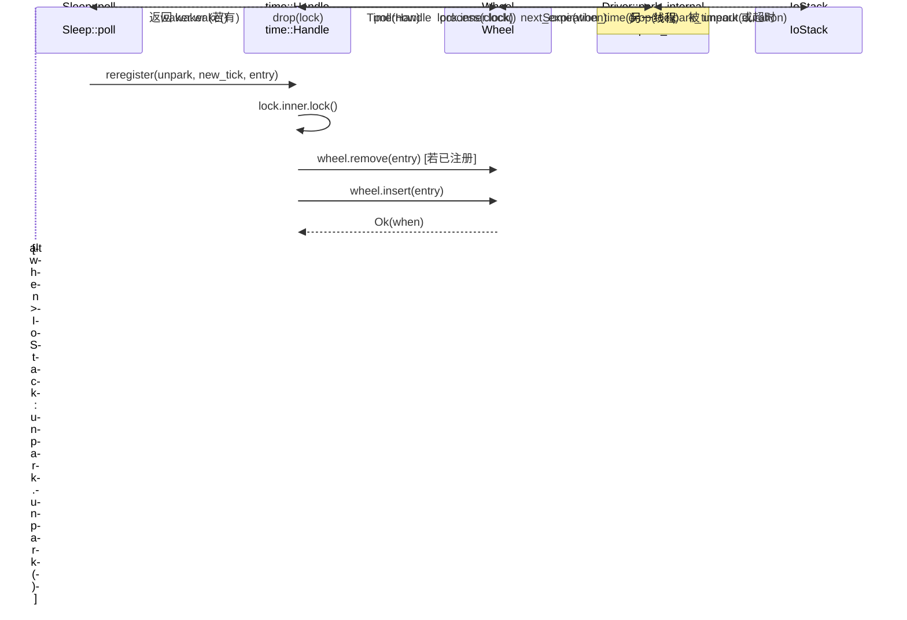

# Capítulo 6: Impulsado por el tiempo: cómo se despiertan la rueda de tiempo, Sleep y los timeouts

En el capítulo anterior rastreamos la cadena completa de TcpStream::read y vimos cómo ScheduledIo traduce los eventos de disponibilidad del fd de epoll en despertares de Waker. Pero el runtime asíncrono aún necesita manejar otro tipo de «disponibilidad»: un Future de sleep(100ms) debe ser despertado después de 100ms. Este tipo de eventos no proviene de un fd del kernel, sino del «tiempo mismo». La decisión de diseño de Tokio es tratar el tiempo también como un evento de E/S: en la estructura Driver solo hay un campo park: IoStack, que reutiliza el mecanismo park/unpark del driver de E/S. Cuando la rueda de tiempo calcula el «próximo instante de vencimiento», el driver llama a park_timeout para que el hilo duerma hasta ese instante; una vez despertado, extrae de la rueda de tiempo las entradas vencidas y dispara sus Waker. Así, el planificador solo necesita un punto de entrada unificado de park para esperar simultáneamente ambos tipos de eventos: «fd listo» y «temporizador vencido». Este capítulo responde a tres preguntas: ¿cómo se insertan los temporizadores en la rueda de tiempo? ¿Cómo se clasifica la rueda de tiempo por tiempo de vencimiento? ¿Cómo calcula el driver el timeout del próximo park y dispara las tareas vencidas?

# I. Rueda de tiempo: estructura jerárquica hash de seis niveles y 64 ranuras

## Modelo intuitivo

Imagina un reloj mecánico: el segundero da una vuelta y arrastra al minutero, el minutero da una vuelta y arrastra a la manecilla de las horas. Si solo hubiera un segundero, para representar «dentro de 12 días» habría que contar 1 millón de marcas; pero tras la estratificación, el segundero solo se encarga de la precisión dentro de 64 segundos, el minutero de 64 minutos, la manecilla de las horas de 64 horas; cada nivel solo necesita 64 ranuras para cubrir hasta 2 años en el futuro.

Sin estratificación, insertar un temporizador lejano requeriría un recorrido O(N) o un array enorme. La rueda de tiempo usa la «clasificación por tiempo de vencimiento» para reducir tanto la inserción como el disparo a un orden cercano a O(1).

## Diseño de memoria y campos

`Wheel`Los campos centrales de solo son tres[FACT:tokio/src/runtime/time/wheel/mod.rs:22-40]：

```rust
pub(crate) struct Wheel {
    elapsed: u64,                          // 自 wheel 创建以来经过的毫秒数
    levels: Box,      // 6 层，每层 64 槽
    pending: LinkedList,      // 已到期、待触发的条目
}
```

`NUM_LEVELS = 6`，`BITS_PER_LEVEL = 6`(es decir, 64 ranuras por nivel)[FACT:tokio/src/runtime/time/wheel/mod.rs:45-47]。`MAX_DURATION = 1 << (6 * 6) = 1 << 36`milisegundos, aproximadamente 2 años[FACT:tokio/src/runtime/time/wheel/mod.rs:50]。

La granularidad de los seis niveles, según los comentarios de la documentación, es[FACT:tokio/src/runtime/time/wheel/mod.rs:22-40]：

| Nivel | Granularidad de ranura | Rango de cobertura |
| --- | --- | --- |
| 0 | 1 ms | 64 ms |
| 1 | 64 ms | ~4 s |
| 2 | ~4 s | ~4 min |
| 3 | ~4 min | ~4 hr |
| 4 | ~4 hr | ~12 day |
| 5 | ~12 day | ~2 yr |

`pending`es una lista enlazada intrusiva (`LinkedList<TimerShared>`), que almacena las entradas que ya han sido extraídas de la rueda y esperan disparar el Waker. Ten en cuenta que es`LinkedList`y no`Vec`: la entrada en sí está incrustada en`TimerShared`, por lo que insertar/eliminar no requiere asignación.

## Guiado por escenario: insertar un sleep de 100ms

Cuando`sleep(100ms)`se sondea por primera vez,`Sleep::poll_elapsed`construye`Timer::new`y llama a`init` [FACT:tokio/src/time/sleep.rs:436-440]。`init`finalmente llama a`Handle::reregister`, y a su vez llama a`Wheel::insert`。

`insert`El primer paso es comprobar si ya ha vencido[FACT:tokio/src/runtime/time/wheel/mod.rs:90-98]：

```rust
let when = unsafe { item.sync_when() };
if when  usize {
    const SLOT_MASK: u64 = (1 = MAX_DURATION {
        return NUM_LEVELS - 1;
    }
    masked.ilog2() as usize / BITS_PER_LEVEL
}
```

Aquí se usa`elapsed ^ when`en lugar de`when - elapsed`, lo cual es un truco ingenioso: el bit más significativo del XOR refleja «a partir de qué bit difieren las dos marcas de tiempo», es decir, «qué granularidad se necesita para distinguirlas».`| SLOT_MASK`fuerza a 1 los 6 bits bajos, evitando que`ilog2`calcule un nivel demasiado pequeño cuando cae en la misma ranura.`ilog2() / 6`asigna el ancho de bits al número de nivel. Si el resultado del XOR supera`MAX_DURATION`(es decir, supera los 2 años), se fuerza a meterlo en el nivel más alto; esto es «fudge the timer into the top level».

Para un sleep de 100ms, suponiendo que`elapsed`está cerca de 0,`when ≈ 100`，`elapsed ^ when ≈ 100`，`ilog2(100) = 6`，`6 / 6 = 1`, por lo que cae en el nivel 1 (granularidad de 64 ms). Esto significa que esperará en una ranura del nivel 1 hasta que el tiempo avance hasta el límite de esa ranura, momento en el cual será descendido al nivel 0.

## Descenso por niveles: process_expiration

Cuando`poll(now)`avanza el tiempo,`Wheel::poll`llama cíclicamente a`next_expiration`y`process_expiration` [FACT:tokio/src/runtime/time/wheel/mod.rs:142-166]：

```rust
pub(crate) fn poll(&mut self, now: u64) -> Option {
    loop {
        if let Some(handle) = self.pending.pop_back() {
            return Some(handle);
        }
        match self.next_expiration() {
            Some(ref expiration) if expiration.deadline  {
                self.process_expiration(expiration);
                self.set_elapsed(expiration.deadline);
            }
            _ => {
                self.set_elapsed(now);
                break;
            }
        }
    }
    self.pending.pop_back()
}
```

`process_expiration`se encarga de "descender" las entradas expiradas de un nivel al siguiente, o (en el nivel 0) marcarlas como pending[FACT:tokio/src/runtime/time/wheel/mod.rs:218-251]：

```rust
let mut entries = self.take_entries(expiration);
while let Some(item) = entries.pop_back() {
    match unsafe { item.mark_pending(expiration.deadline) } {
        Ok(()) => {
            self.pending.push_front(item);   // 真正到期
        }
        Err(expiration_tick) => {
            let level = level_for(expiration.deadline, expiration_tick);
            unsafe { self.levels[level].add_entry(item); }  // 下沉到更低层
        }
    }
}
```

`mark_pending`es clave: verifica si el deadline real de la entrada ya ha llegado. Si llegó, devuelve`Ok(())`, la entrada entra en la`pending`lista enlazada; si aún no llegó (solo se alcanzó el límite de la ranura donde se encuentra), devuelve`Err(expiration_tick)`, y la entrada se reinserta en un nivel más fino.

Nótese un punto enfatizado en los comentarios[FACT:tokio/src/runtime/time/wheel/mod.rs:219-228]: se deben extraer todas las entradas de la ranura completa antes de procesarlas, porque algunas entradas pueden ser reinsertadas en la misma ranura (esto ocurre cuando el tiempo de inserción excede`MAX_DURATION`, produciendo un wraparound). Si se extrae e inserta a la vez, se puede caer en un bucle infinito.

## Cálculo del próximo instante de expiración

`next_expiration`Escanea desde el nivel más bajo al más alto, devolviendo el primer punto de expiración no vacío[FACT:tokio/src/runtime/time/wheel/mod.rs:169-191]：

```rust
fn next_expiration(&self) -> Option {
    if !self.pending.is_empty() {
        return Some(Expiration { level: 0, slot: 0, deadline: self.elapsed });
    }
    for (level_num, level) in self.levels.iter().enumerate() {
        if let Some(expiration) = level.next_expiration(self.elapsed) {
            debug_assert!(self.no_expirations_before(level_num + 1, expiration.deadline));
            return Some(expiration);
        }
    }
    None
}
```

Si`pending`no está vacío, significa que hay entradas ya expiradas pendientes de disparo, y devuelve inmediatamente el`elapsed`actual como deadline (así el driver hará park con timeout 0 y volverá de inmediato a procesarlas). En caso contrario, escanea nivel por nivel y devuelve el deadline de la primera ranura con contenido.`debug_assert`Se verifica un invariante: ningún nivel superior puede tener un punto de expiración más temprano que el nivel actual.

```mermaid
flowchart TD
    start["Wheel::poll(now)"] --> check_pending{"pending 非空?"}
    check_pending -->|是| pop["pop_back 返回 TimerHandle"]
    check_pending -->|否| next_exp{"next_expiration() 有到期点?"}
    next_exp -->|无| set_elapsed["set_elapsed(now) 后 break"]
    next_exp -->|有| cmp{"expiration.deadline |否| set_elapsed
    cmp -->|是| proc["process_expiration(expiration)"]
    proc --> take["take_entries 取出整槽"]
    take --> mark{"item.mark_pending()"}
    mark -->|Ok 已到期| push_pending["pending.push_front(item)"]
    mark -->|Err 未到期| reinsert["level_for 后 add_entry 下沉"]
    push_pending --> set_elapsed2["set_elapsed(expiration.deadline)"]
    reinsert --> set_elapsed2
    set_elapsed2 --> check_pending
    set_elapsed --> pop2["pending.pop_back() 返回"]
```

---

# II. El bucle park del Driver: conectando el temporizador jerárquico a la pila de I/O

## Modelo intuitivo

El temporizador jerárquico por sí solo no "avanza solo". Necesita un bucle externo que le pregunte repetidamente: "¿Cuándo es la próxima expiración?" y luego duerma hasta ese momento, y al despertar avance el tiempo. Este bucle es`Driver::park_internal`. Traduce "la próxima expiración del temporizador jerárquico" en una duración de`park_timeout`, que se entrega a la pila de I/O subyacente para dormir.

Sin este bucle, los temporizadores nunca se dispararían—el temporizador jerárquico es solo una estructura de datos estática que necesita que alguien lo "accione".

## Estructuras de datos: Driver e InnerState

`Driver`solo tiene un campo`park: IoStack` [FACT:tokio/src/runtime/time/mod.rs:90-93]. El estado real está en`Handle`, distinguiendo entre la implementación tradicional y la experimental mediante la enumeración`Inner`. La implementación tradicional de[FACT:tokio/src/runtime/time/mod.rs:95-127]contiene dos campos`InnerState`Copia[FACT:tokio/src/runtime/time/mod.rs:130-136]：

```rust
struct InnerState {
    next_wake: Option,   // 承诺的最早唤醒时刻
    wheel: wheel::Wheel,
}
```

`next_wake`en lugar de`NonZeroU64`anidados`Option<u64>`para aprovechar la optimización de niche—`Option<NonZeroU64>`y`u64`tienen el mismo tamaño. Registra "antes de qué tick el driver promete despertar", usado para`reregister`al determinar si se necesita`unpark`。

`is_shutdown`es un`AtomicBool`independiente, y los comentarios explican por qué se separó del Mutex[FACT:tokio/src/runtime/time/mod.rs:90-93]：`Handle`Se necesita verificar`is_shutdown`sin bloquear el mutex. Esta es una optimización típica de "muchas lecturas, pocas escrituras"—shutdown solo ocurre una vez, pero la verificación puede ser frecuente.

## Guiado por escenarios: el flujo completo de un park

`park_internal`es el núcleo[FACT:tokio/src/runtime/time/mod.rs:213-256]：

```rust
fn park_internal(&mut self, rt_handle: &driver::Handle, limit: Option) {
    let handle = rt_handle.time();
    let mut lock = handle.inner.lock();
    assert!(!handle.is_shutdown());

    let next_wake = lock.wheel.next_expiration_time();
    lock.next_wake = next_wake.map(|t| NonZeroU64::new(t).unwrap_or_else(|| NonZeroU64::new(1).unwrap()));
    drop(lock);

    match next_wake {
        Some(when) => {
            let now = handle.time_source.now(rt_handle.clock());
            let mut duration = handle.time_source.tick_to_duration(when.saturating_sub(now));
            if duration > Duration::from_millis(0) {
                if let Some(limit) = limit {
                    duration = std::cmp::min(limit, duration);
                }
                self.park_thread_timeout(rt_handle, duration);
            } else {
                self.park.park_timeout(rt_handle, Duration::from_secs(0));
            }
        }
        None => {
            if let Some(duration) = limit {
                self.park_thread_timeout(rt_handle, duration);
            } else {
                self.park.park(rt_handle);
            }
        }
    }

    handle.process(rt_handle.clock());
}
```

Análisis paso a paso:

1. **Tomar el lock, leer la próxima expiración**：`lock.wheel.next_expiration_time()`devuelve`Option<u64>`, es decir, el próximo tick de expiración. A la vez lo escribe en`lock.next_wake`, para que`reregister`determine si se necesita unpark.

2. **Liberar el lock**：`drop(lock)`debe hacerse antes del park, de lo contrario otros hilos no podrían insertar temporizadores durante el park.

3. **Calcular la duración del park**：`when.saturating_sub(now)`obtiene el número de ticks restantes,`tick_to_duration`se convierte a`Duration`. Los comentarios señalan que aquí en realidad se redondea hacia arriba a 1 ms[FACT:tokio/src/runtime/time/mod.rs:228-230], para evitar que un sleep de nivel microsegundo sea tratado por el SO como de longitud cero.

4. **Manejar el limit**: si el llamador pasó`limit`(por ejemplo, el timeout explícito de`park_timeout`), se toma`min(limit, duration)`, garantizando no dormir de más.

5. **Caso especial**: si`duration == 0`(ya expirado), se usa`park_timeout(0)`para retornar inmediatamente, sin dormir realmente.

6. **Sin temporizadores**: si`next_wake`es`None`, con`limit`se hace`park_thread_timeout(limit)`, de lo contrario`park`。

7. **infinito**：`handle.process(clock)`Procesar tras despertar

## avanza el temporizador jerárquico y dispara las entradas expiradas.

`process`process_at_time: disparar entradas expiradas`process_at_time` [FACT:tokio/src/runtime/time/mod.rs:296-337]：

```rust
pub(self) fn process_at_time(&self, mut now: u64) {
    let mut waker_list = WakeList::new();
    let mut lock = self.inner.lock();

    if now ) {
    let waker = unsafe {
        let mut lock = self.inner.lock();
        if unsafe { entry.as_ref().might_be_registered() } {
            lock.wheel.remove(entry);
        }
        let entry = entry.as_ref().handle();
        if self.is_shutdown() {
            unsafe { entry.fire(Err(crate::time::error::Error::shutdown())) }
        } else {
            entry.set_expiration(new_tick);
            match unsafe { lock.wheel.insert(entry) } {
                Ok(when) => {
                    if lock.next_wake.is_none_or(|next_wake| when  unsafe {
                    entry.fire(Ok(()))
                },
            }
        }
    };
    if let Some(waker) = waker {
        waker.wake();
    }
}
```

Copia`next_wake`Lógica clave: tras una inserción exitosa, si el nuevo instante de expiración es más temprano que`unpark.unpark()`, se llama a

para despertar al driver. Esto se debe a que el driver podría estar durmiendo hasta un momento más tardío, y necesita ser despertado antes para recalcular la duración del park.`unpark`Nótese que**se llama**con el lock tomado`waker.wake()`, mientras que**se llama**tras liberar el lock[FACT:tokio/src/runtime/time/mod.rs:441]. Los comentarios explican`unpark`: se debe liberar el lock antes de llamar al Waker para evitar deadlocks. Pero



---

# Copia

## III. Sleep y Timeout: la capa de API visible al usuario

`Sleep`Modelo intuitivo`.await`es el Future que el usuario`Timeout`es un adaptador que envuelve otro Future. Por sí mismos no gestionan la rueda de tiempo, solo traducen el «deadline» a tick y lo delegan a`Timer`y`Handle`。

## Diseño de memoria de Sleep

`Sleep`usa`pin_project!`macro define[FACT:tokio/src/time/sleep.rs:221-227]：

```rust
pub struct Sleep {
    deadline: Instant,
    driver: scheduler::Handle,
    inner: Inner,
    #[pin]
    timer: Option,
}
```

`timer`es`Option<Timer>`y con`#[pin]`: antes del primer poll es`None`, solo en el primer poll se crea`Timer`y se registra. Esta «inicialización perezosa» evita acceder al runtime en el momento de la llamada a`sleep()`—`sleep()`puede llamarse fuera del runtime, siempre que el registro real ocurra en`.await`.

`PinnedDrop`implementación garantiza cancelar el temporizador al hacer drop[FACT:tokio/src/time/sleep.rs:230-235]：

```rust
impl PinnedDrop for Sleep {
    fn drop(this: Pin) {
        let this = this.project();
        if let Some(timer) = this.timer.as_pin_mut() {
            timer.cancel(this.driver);
        }
    }
}
```

## Flujo completo de poll_elapsed

`poll_elapsed`es`Sleep`núcleo de[FACT:tokio/src/time/sleep.rs:396-454]：

```rust
fn poll_elapsed(self: Pin, cx: &mut task::Context) -> Poll> {
    ready!(crate::trace::trace_leaf());
    let mut this = self.project();

    // coop 预算
    let coop = ready!(crate::task::coop::poll_proceed(cx));

    let handle = this.driver;
    let timer = match this.timer.as_mut().as_pin_mut() {
        Some(timer) => timer,
        None => {
            let time_source = handle.driver().time().time_source();
            let deadline = time_source.deadline_to_tick(*this.deadline);
            let timer = Timer::new(handle, deadline);
            this.timer.set(Some(timer));
            let mut timer = this.timer.as_pin_mut().unwrap();
            timer.as_mut().init(handle, deadline);
            timer
        }
    };

    let result = timer.poll_elapsed(cx, handle).map(move |r| {
        coop.made_progress();
        r
    });
    result
}
```

Paso a paso:

1. **Verificación del presupuesto coop**：`poll_proceed(cx)`consume un presupuesto de cooperación. Si el presupuesto se agota, devuelve`Pending`y cede la ejecución. Este es el mecanismo de Tokio para evitar que una sola tarea mate de hambre a las demás.

2. **Creación perezosa del Timer**: si`timer`es`None`, convierte`deadline`a tick, crea`Timer`y llama a`init`para registrarlo en la rueda de tiempo.

3. **Delegación a Timer::poll_elapsed**: la verificación real de expiración la realiza`Timer`.

4. **Marcar progreso tras el éxito**：`coop.made_progress()`indica que este poll tuvo progreso real.

## Poll de Timeout: primero poll del valor, luego poll del delay

`Timeout`el orden de poll es crítico[FACT:tokio/src/time/timeout.rs:210-224]：

```rust
fn poll(self: Pin, cx: &mut task::Context) -> Poll {
    let me = self.project();
    let had_budget_before = coop::has_budget_remaining();

    // 先 poll 被包裹的 future
    if let Poll::Ready(v) = me.value.poll(cx) {
        return Poll::Ready(Ok(v));
    }

    match me.delay.as_pin_mut() {
        Some(delay) => poll_delay(had_budget_before, delay, cx).map(Err),
        None => Poll::Pending,
    }
}
```

El comentario indica explícitamente[FACT:tokio/src/time/timeout.rs:24-26]: el future se poll primero, y solo después se verifica el timeout. Así que si el future se completa sin ceder, puede devolver`Ok`incluso después de superar el timeout. Esto es una decisión de diseño, no un bug.

`poll_delay`maneja un escenario sutil[FACT:tokio/src/time/timeout.rs:229-251]：

```rust
fn poll_delay(had_budget_before: bool, delay: Pin, cx: &mut task::Context) -> Poll {
    let delay_poll = || match delay.poll(cx) {
        Poll::Ready(()) => Poll::Ready(Elapsed::new()),
        Poll::Pending => Poll::Pending,
    };

    let has_budget_now = coop::has_budget_remaining();

    if let (true, false) = (had_budget_before, has_budget_now) {
        // 如果预算是被底层 future 耗尽的，用无约束预算 poll delay
        coop::with_unconstrained(delay_poll)
    } else {
        delay_poll()
    }
}
```

Lógica: si al entrar en`poll`aún queda presupuesto, pero tras hacer poll del value el presupuesto se agota, significa que fue el value quien consumió el presupuesto. En ese caso, si se hace poll del delay con presupuesto restringido, el delay podría devolver`Pending`inmediatamente, haciendo imposible determinar si se alcanzó el timeout. Por eso se usa`with_unconstrained`para levantar temporalmente la restricción de presupuesto. El comentario lo llama «pathological cases»[FACT:tokio/src/time/timeout.rs:243-246]。

## Manejo de desbordamiento del deadline en timeout

`timeout`la función usa`checked_add`para manejar el desbordamiento[FACT:tokio/src/time/timeout.rs:86-99]：

```rust
Timeout {
    value: future.into_future(),
    delay: match Instant::now().checked_add(duration) {
        Some(deadline) => Some(Sleep::new_timeout(deadline, trace::caller_location())),
        None => None,
    },
}
```

Si`Instant::now() + duration`se desborda (duration extremadamente grande),`delay`es`None`, y en el poll devuelve directamente`Poll::Pending` [FACT:tokio/src/time/timeout.rs:222]. Esto equivale a «nunca expira», un comportamiento de degradación razonable.

---

# Reflexiones de diseño y trampas en producción

**¿Por qué usar XOR en lugar de resta para calcular el nivel?** `elapsed ^ when`el bit más significativo refleja directamente «desde qué bit difieren dos timestamps», que es precisamente la medida de «qué granularidad se necesita». La resta`when - elapsed`cuando`elapsed`está cerca de`when`deja los bits altos en 0,`ilog2`calcularía un nivel demasiado pequeño. XOR maneja naturalmente el escenario de wraparound.

**Necesidad de la protección contra retroceso del tiempo** [FACT:tokio/src/runtime/time/mod.rs:301-309]: Rust garantiza que`Instant`es monótono, pero el SO subyacente puede no garantizarlo. En una VM Linux sobre host Windows, std confía en el reloj de hardware provocando que`Instant`retroceda. Tokio usa`now = lock.wheel.elapsed()`para acotar, evitando que falle el assert de`set_elapsed`.

**Despertar en lote y deadlock** [FACT:tokio/src/runtime/time/mod.rs:319]: llamar a Waker mientras se tiene el lock de la rueda de tiempo es peligroso — el Waker puede disparar un re-poll de la tarea, que a su vez llama a`Sleep::reset`, intentando adquirir de nuevo el lock de la rueda de tiempo, causando un deadlock.`WakeList`el mecanismo de lote libera temporalmente el lock cuando está lleno, es el patrón estándar de «callback fuera del lock».

**`next_wake`optimización niche de** [FACT:tokio/src/runtime/time/mod.rs:130-136]：`Option<NonZeroU64>`y`u64`tienen el mismo tamaño, porque 0 se usa como niche de`None`. Pero tick 0 es un valor válido, así que el código usa`NonZeroU64::new(t).unwrap_or_else(|| NonZeroU64::new(1).unwrap())`para mapear 0 a 1[FACT:tokio/src/runtime/time/mod.rs:221]. Este es un manejo de borde sutil: tick 0 se trata como tick 1, causando como máximo un despertar extra de 1ms.

**`process_expiration`el «extraer primero, procesar después» de** [FACT:tokio/src/runtime/time/wheel/mod.rs:219-228]: hay que extraer todas las entradas del slot antes de procesarlas, porque las entradas que superan`MAX_DURATION`dan la vuelta y se reinsertan en el mismo slot. Si se extrae e inserta a la vez, se produce un bucle infinito.

**`Timeout`la trampa del orden de poll en** [FACT:tokio/src/time/timeout.rs:24-26]: el future se poll primero, el timeout se verifica después. Si el future es intensivo en CPU y no cede, puede devolver`Ok`incluso tras superar el timeout. En producción no dependas de`timeout`para forzar la interrupción de un future que no coopera.

---

# Resumen del capítulo

Este capítulo desglosó la estructura de tres capas del driver de tiempo de Tokio:

1. **Rueda de tiempo**（`Wheel`): estructura hash jerárquica de seis niveles con 64 slots, usando el ancho de bits de`elapsed ^ when`para determinar el nivel de la entrada, con inserción y disparo aproximadamente O(1).`pending`la lista enlazada almacena las entradas ya expiradas,`process_expiration`se encarga de descender nivel por nivel.

2. **Driver**（`Driver::park_internal`): traduce el`next_expiration_time`de la rueda de tiempo a una duración de`park_timeout`, reutilizando el park/unpark de la pila de I/O.`process_at_time`tras el despertar avanza la rueda de tiempo, dispara Wakers en lote, y maneja el retroceso del tiempo y la protección contra deadlock.

3. **API de usuario**（`Sleep` / `Timeout`）：`Sleep`creación perezosa de`Timer`y registro,`Timeout`primero poll del value y luego poll del delay, usando`with_unconstrained`para manejar el escenario de presupuesto agotado.

El diseño central es que «el tiempo también es un evento de I/O»: el driver tiene una sola entrada de park, que espera simultáneamente a que un fd esté listo y a que expire un temporizador.`next_wake`registra el instante de despertar prometido,`reregister`al insertar un temporizador más temprano`unpark`despierta al driver para recalcular.

En el próximo capítulo entraremos en las primitivas de sincronización:`Mutex`、`Semaphore`y cómo los canales implementan la espera asíncrona. Verás cómo reutilizan el mecanismo Waker de este capítulo, y cómo colaboran el «conteo de permisos» y la «cola de espera».

# Reflexión y autoevaluación de este capítulo

Q1: Si en`Wheel::insert`se cambia`if when <= self.elapsed`a`if when < self.elapsed`(eliminando el signo igual), ¿en qué escenarios provocaría que el temporizador nunca se active?

**Análisis de referencia**：`when == self.elapsed`indica que el momento de vencimiento del temporizador es exactamente igual al tiempo ya avanzado. El código original usa`<=`lo clasifica como`Elapsed`, el invocador activa inmediatamente[FACT:tokio/src/runtime/time/wheel/mod.rs:96-98]. Si se cambia a`<`, esta entrada se insertará en la capa calculada por`level_for(elapsed, when)`. Dado que`elapsed ^ when == 0`，`masked = 0 | SLOT_MASK = 63`，`ilog2(63) = 5`，`5 / 6 = 0`, cae en la capa 0. Pero el`next_expiration`de la capa 0 devolverá un`deadline >= elapsed`de ranura, y la condición de`Wheel::poll`es`expiration.deadline <= now`. Si`now == elapsed`, la condición se cumple,`process_expiration`extraerá esa entrada,`mark_pending(elapsed)`verificará si el deadline real ha llegado — en este momento`when == elapsed`，`mark_pending`devuelve`Ok`, la entrada pasa a pending. Así que en realidad todavía se activará, pero dando una vuelta extra. El riesgo real está en: si`elapsed`ya ha avanzado hasta después de`when`(`when < elapsed`), el código original devuelve`Elapsed`y activa inmediatamente, tras el cambio se inserta en una ranura ya pasada,`next_expiration`puede devolver`deadline < elapsed`，`set_elapsed`, el assert de`elapsed <= when`fallará con panic[FACT:tokio/src/runtime/time/wheel/mod.rs:253-264]. Así que este signo igual es la frontera clave para evitar que el assert falle.

Q2: `process_at_time`En`WakeList`, una vez que`drop(lock)`se llena, ¿por qué`wake_all()`de nuevo`lock`y luego re-? Si se elimina este drop, ¿en qué escenario de concurrencia se produciría un deadlock?

**Análisis de referencia**：`WakeList`recolecta Wakers, una vez lleno debe despertar un lote para liberar espacio[FACT:tokio/src/runtime/time/mod.rs:318-325]. Si se llama a`self.inner.lock()`mientras se mantiene`waker.wake()`, la tarea despertada podría ejecutarse inmediatamente en otro hilo (o en el planificador del mismo hilo), llamando a`Sleep::reset`o`Sleep::poll_elapsed`, y a su vez llamando a`Handle::reregister`, y lo primero que hace`reregister`es`self.inner.lock()` [FACT:tokio/src/runtime/time/mod.rs:405]. Dado que`std::sync::Mutex`no es reentrante, el mismo hilo se bloquearía; incluso en hilos distintos, se bloquearía hasta que`process_at_time`libere el lock, mientras`process_at_time`está esperando que`wake_all`retorne, formando una espera circular. El comentario dice explícitamente «To avoid deadlock, we must do this with the lock temporarily dropped»[FACT:tokio/src/runtime/time/mod.rs:319]. Al re-adquirir el lock tras el drop, el estado de la rueda de tiempo puede haber sido modificado por otros hilos (por ejemplo, inserción de nuevos temporizadores), así que`while let Some(entry) = lock.wheel.poll(now)`continuará extrayendo entradas del nuevo estado, lo cual es seguro.

Q3: `Timeout::poll`En`had_budget_before`, la combinación de`has_budget_now`y`(true, false)`¿por qué solo se usa cuando «al entrar hay presupuesto, y tras hacer poll del value ya no hay presupuesto»?`with_unconstrained`? ¿Qué pasaría si se invirtiera`(false, true)`?

**Análisis de referencia**：`had_budget_before`registra[FACT:tokio/src/time/timeout.rs:208-208]，`has_budget_now`antes de hacer poll del value, y registra[FACT:tokio/src/time/timeout.rs:239]。`(true, false)`después de hacer poll del value.`poll_proceed`significa que el presupuesto se agotó durante el poll del value, lo que indica que el value es un «consumidor de presupuesto». En este caso, si se hace poll del delay con presupuesto restringido,`Pending`devolvería inmediatamente`with_unconstrained`, el delay nunca se verificaría realmente, y la detección de timeout fallaría. Por eso se usa[FACT:tokio/src/time/timeout.rs:247]。`(false, true)`para levantar temporalmente la restricción.`with_unconstrained`no puede ocurrir — el presupuesto solo puede consumirse, no recuperarse (salvo`(false, false)`explícito, pero aquí no lo hay).`Pending`significa que al entrar ya no había presupuesto, en este caso el poll del value podría haber devuelto`poll_proceed`(porque`(true, true)`falló), y el delay también se hace poll con presupuesto restringido, ambos pending, como se espera.

es el caso normal, con presupuesto suficiente, se hace poll del delay directamente.
