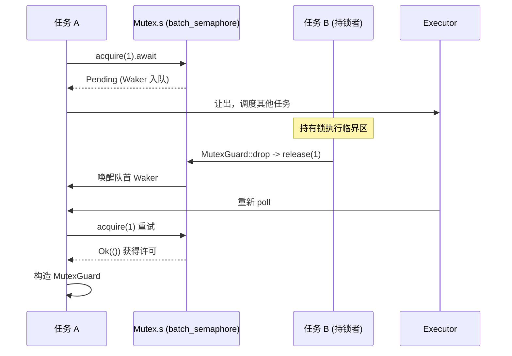

# Capítulo 7: Primitivas de sincronización: cómo Mutex, Semaphore y los canales implementan la espera asíncrona

El capítulo anterior reveló cómo el tiempo se abstrae como un evento de I/O, haciendo que los temporizadores y la disponibilidad de fd compartan el mismo punto de entrada de espera park/unpark. Sin embargo, cuando múltiples tareas compiten por el mismo lock o se pasan mensajes a través de canales, el objeto de espera ya no es un fd o un reloj, sino el cambio de estado de otra tarea. Este capítulo entra en la familia tokio::sync, para averiguar dónde se almacena exactamente el Waker cuando un lock().await o recv().await se bloquea, y cómo se reprograma al ser despertado.

# Por qué el Mutex asíncrono no puede reutilizar la implementación de std

## Modelo intuitivo: de «ocupar el puesto» a «ceder el asiento»

`std::sync::Mutex`El`lock()`de**bloquea el hilo actual**cuando el lock está ocupado — el hilo es suspendido por el sistema operativo hasta que el lock se libera. Esto es catastrófico en un runtime asíncrono: un hilo worker puede estar impulsando cientos o miles de tareas simultáneamente; si se bloquea esperando un lock, todas las demás tareas que soporta se detienen. La exigencia central del Mutex asíncrono es: al esperar el lock,**ceder el hilo**, registrar el hecho de «estoy esperando este lock» en una cola, y luego devolver`Pending`, dejando que el ejecutor ejecute otras tareas.

El`Mutex`de Tokio no implementa su propia cola de espera, sino que**Construido completamente sobre semáforos**。

## Estructura de datos y diseño de memoria

`Mutex<T>`Los campos de son minimalistas:

[FACT:tokio/src/sync/mutex.rs:133-138]

```rust
pub struct Mutex {
    #[cfg(all(tokio_unstable, feature = "tracing"))]
    resource_span: tracing::Span,
    s: semaphore::Semaphore,
    c: UnsafeCell,
}
```

Los tres campos cumplen cada uno su función:`s`es un**semáforo con un contador de permisos de 1**，`c`es`UnsafeCell<T>`el dato protegido envuelto por . Nótese que aquí`semaphore`es`batch_semaphore`un alias de[FACT:tokio/src/sync/mutex.rs:3-3], es decir, la implementación subyacente, no la`sync::Semaphore`capa de encapsulación pública.

`MutexGuard<'a, T>`solo contiene una referencia a`Mutex`:

[FACT:tokio/src/sync/mutex.rs:151-157]

```rust
pub struct MutexGuard {
    #[cfg(all(tokio_unstable, feature = "tracing"))]
    resource_span: tracing::Span,
    lock: &'a Mutex,
}
```

Aquí hay un diseño clave:`MutexGuard` **no posee el objeto de permiso del semáforo**, solo posee`&Mutex`. La acción de liberar el lock ocurre en`Drop`, llamando directamente a`self.lock.s.release(1)` [FACT:tokio/src/sync/mutex.rs:959-961]. Esto difiere de`SemaphorePermit`que mantiene un`permits: usize`contador y lo devuelve en Drop — el contador de permisos de Mutex es siempre 1, no necesita conteo.

`Send`/`Sync`Los límites de merecen un análisis aparte:

[FACT:tokio/src/sync/mutex.rs:258-259]

```rust
unsafe impl Send for Mutex where T: ?Sized + Send {}
unsafe impl Sync for Mutex where T: ?Sized + Send {}
```

`Sync`solo requiere`T: Send`en lugar de`T: Sync`— esto es razonable, porque el acceso mutuo garantiza que solo un hilo puede tocar`T`a la vez, transferir la propiedad de`T`entre hilos (`Send`) es suficiente, no se necesita que`T`en sí mismo sea compartible (`Sync`). Esta es precisamente la razón por la que`Mutex<T>`puede convertir un`Sync`que no es`T`en`Sync`.

## Paso a paso: el viaje completo de un`lock().await`

Escenario: la tarea A llama a`mutex.lock().await`, en este momento el lock está libre.

Primer paso,`lock()`construye un bloque async, internamente primero`self.acquire().await`, tras el éxito construye`MutexGuard` [FACT:tokio/src/sync/mutex.rs:434-443]。

Segundo paso,`acquire()`delega directamente al semáforo:

[FACT:tokio/src/sync/mutex.rs:655-663]

```rust
async fn acquire(&self) {
    crate::trace::async_trace_leaf().await;
    self.s.acquire(1).await.unwrap_or_else(|_| {
        unreachable!()
    });
}
```

`unwrap_or_else(|_| unreachable!())`Esta línea de comentario revela la restricción de diseño: Mutex nunca cierra explícitamente el semáforo, y lo posee en exclusiva, por lo que`acquire`nunca devolverá`Err`. Esto excluye a nivel de tipos la ruta de error de «cierre del semáforo».

Tercer paso, si el lock está ocupado,`s.acquire(1)`devuelve`Pending`, el Waker de la tarea actual se registra en la cola de espera del semáforo.**¿Dónde se almacena el Waker?**La respuesta está en`batch_semaphore`la cola de espera de (el material fuente de este capítulo no expande ese archivo, pero su rol es: cada esperador mantiene un Waker, en cola FIFO).

Cuarto paso, cuando la tarea B que posee el lock lo libera,`MutexGuard::drop`llama a`s.release(1)` [FACT:tokio/src/sync/mutex.rs:965-975], el semáforo entrega el permiso al primero de la cola y despierta su Waker, la tarea A es re-programada,`acquire`devuelve`Ok`, construyendo`MutexGuard`。

Todo el flujo puede describirse con el siguiente diagrama de secuencia:



## Reflexión de diseño: equidad FIFO y seguridad ante cancelación

La documentación declara explícitamente que el Mutex de Tokio garantiza FIFO[FACT:tokio/src/sync/mutex.rs:20-22]. Esta equidad proviene de la semántica de cola del semáforo subyacente. El costo de la equidad es: una`lock`cancelada (por ejemplo, al perder en`select!`) te hará**perder tu posición en la cola** [FACT:tokio/src/sync/mutex.rs:415-419]. Esto no es un bug, sino una consecuencia inevitable de la cola FIFO — cancelar significa salir de la cola, y para volver a`lock`hay que reencolarse.

Otro diseño contraintuitivo es**no envenenar**（no poisoning）。`std::sync::Mutex`se marca como poisoned cuando el hilo que posee el lock entra en panic, y las siguientes`lock`devuelven`Err`. El Mutex de Tokio no hace esto: cuando el poseedor del lock entra en panic, el lock se libera normalmente[FACT:tokio/src/sync/mutex.rs:122-125]. La documentación advierte que si el panic es capturado, los datos protegidos pueden quedar en un estado inconsistente. Esta es una concesión pragmática en escenarios asíncronos — un panic en una tarea asíncrona normalmente significa la terminación de la tarea, y el mecanismo de envenenamiento solo añadiría complejidad.

`MutexGuard::map`La serie de métodos merece mención. Permite degradar todo el`MutexGuard<T>`a un`MappedMutexGuard<U>`que solo protege un subcampo. En implementación, primero usa un closure para calcular el puntero al subcampo`data`, luego mediante`skip_drop`descompone el guard original en un`MutexGuardInner`que no dispara Drop, y finalmente construye un nuevo guard[FACT:tokio/src/sync/mutex.rs:869-883]。`skip_drop`usando`ManuallyDrop` + `ptr::read`para transferir la propiedad del campo, evitando que`Drop`sea llamado dos veces[FACT:tokio/src/sync/mutex.rs:827-836]. Esta es la técnica clásica en Rust de «transferir propiedad sin disparar el destructor».

# Semaphore: cómo el conteo de permisos y la cola de espera implementan backpressure

## Modelo intuitivo: las plazas de un estacionamiento

El semáforo es como un estacionamiento:`acquire`es entrar conduciendo, si hay plaza libre entras, si no haces cola en la entrada;`release`es salir conduciendo, al liberar una plaza se notifica al primero de la cola para que entre. El número de permisos es el total de plazas,`acquire_many(n)`es un vehículo grande que ocupa n plazas.

## Estructura de datos y diseño de memoria

El público`Semaphore`es solo una fina envoltura sobre el`batch_semaphore::Semaphore`subyacente:

[FACT:tokio/src/sync/semaphore.rs:427-432]

```rust
pub struct Semaphore {
    ll_sem: ll::Semaphore,
    #[cfg(all(tokio_unstable, feature = "tracing"))]
    resource_span: tracing::Span,
}
```

`SemaphorePermit<'a>`mantiene la referencia al semáforo y el conteo de permisos:

[FACT:tokio/src/sync/semaphore.rs:442-445]

```rust
pub struct SemaphorePermit {
    sem: &'a Semaphore,
    permits: usize,
}
```

`permits`El campo es la clave para entender`forget`/`merge`/`split`.`forget`pone`permits`a cero[FACT:tokio/src/sync/semaphore.rs:1193-1195], así al hacer Drop devuelve 0 permisos — equivalente a «consumir permanentemente» esos permisos.`split`Corta n permisos del conteo actual para el nuevo permit[FACT:tokio/src/sync/semaphore.rs:1260-1271]。`merge`fusiona el conteo de otro permit, y afirma que ambos provienen del mismo semáforo[FACT:tokio/src/sync/semaphore.rs:1230-1240]。

> **[Design Inference & Architectural Trade-offs]**
> `MAX_PERMITS`es`usize::MAX >> 3` [FACT:tokio/src/sync/semaphore.rs:476-479]. ¿Por qué desplazar 3 bits a la derecha? El`batch_semaphore`subyacente necesita codificar flags de estado (como el flag de cierre) en los bits altos, por lo que limita el número de permisos disponibles a los bits bajos, dejando los bits altos para flags. Esta es la técnica común de comprimir «conteo + estado» en un solo`usize`.

## Paso a paso: el flujo de permisos en acquire y release

Escenario: el semáforo inicia con 2 permisos, la tarea A`acquire()`, la tarea B`acquire_many(2)`。

`acquire()`delega a`ll_sem.acquire(1)`, tras el éxito construye`SemaphorePermit { permits: 1 }` [FACT:tokio/src/sync/semaphore.rs:614-631]。`acquire_many(2)`similar, pero pasa 2[FACT:tokio/src/sync/semaphore.rs:661-679]。

Si los permisos son insuficientes,`ll_sem.acquire(n)`devuelve`Pending`, el Waker se encola. Aquí hay un detalle de equidad: la documentación señala que si el primero de la cola es un`acquire_many(5)`y solo quedan 3 permisos, aunque detrás haya un`acquire(1)`que podría satisfacerse de inmediato, también debe esperar — porque el vehículo grande al frente ocupa la cola[FACT:tokio/src/sync/semaphore.rs:19-24]. Este es el costo del FIFO estricto, que evita la inanición.

La ruta de liberación está en Drop:

[FACT:tokio/src/sync/semaphore.rs:1402-1404]

```rust
impl Drop for SemaphorePermit {
    fn drop(&mut self) {
        self.sem.add_permits(self.permits);
    }
}
```

`add_permits`delega a`ll_sem.release(n)` [FACT:tokio/src/sync/semaphore.rs:568-570], la capa subyacente devuelve los permisos a la cola de espera, despertando a los esperadores que pueden completar los permisos necesarios.

En cuanto al orden de memoria, la documentación da garantías fuertes: acquire, release, close son todas operaciones`AcqRel`, totalmente ordenadas entre sí, equivalentes a las de una única variable atómica`AcqRel` [FACT:tokio/src/sync/semaphore.rs:35-42]. Esto significa que la escritura de «escribir datos primero y luego release del permiso» es visible para la tarea que «adquiere el permiso después»: el semáforo puede transferir datos de forma segura entre tareas.

## Reflexión de diseño: close y contrapresión

`close()`Hace que todos los que esperan reciban`AcquireError`, y posteriormente`try_acquire`devuelve`Closed` [FACT:tokio/src/sync/semaphore.rs:1161-1163]. Esta es la base del cierre elegante: cuando el receptor ya no necesita datos, el close del semáforo permite que todos los emisores bloqueados fallen y retornen de inmediato, en lugar de esperar para siempre.

La esencia de la contrapresión se manifiesta con mayor claridad en mpsc. En la siguiente sección se verá que el control de capacidad de mpsc se implementa con un semáforo cuyo número de permisos es igual al tamaño del buffer.

# La familia de canales: diferentes compensaciones entre cola de espera y activación por Waker

## Modelo intuitivo: cuatro tipos de canales, cuatro estrategias de espera

`oneshot`es un «sobre de un solo uso»: solo puede enviar una carta, el emisor no espera (`send`es síncrono), el receptor`await`espera la carta.`mpsc`es una «cinta transportadora acotada»: el emisor espera cuando la cinta está llena, el receptor espera cuando está vacía, y la capacidad está controlada por un semáforo.`broadcast`y`watch`son un «altavoz de difusión»: un emisor, múltiples receptores, pero ambos manejan el «atraso» de forma completamente distinta.

El material fuente de esta sección se centra en`oneshot`y`mpsc::bounded`, los desglosamos uno por uno.

## oneshot: un handshake minimalista codificado con bits de estado

`oneshot`La estructura`Inner`de es el núcleo para entender su diseño:

[FACT:tokio/src/sync/oneshot.rs:386-409]

```rust
struct Inner {
    state: AtomicUsize,
    value: UnsafeCell>,
    tx_task: Task,
    rx_task: Task,
}
```

`state`es un`AtomicUsize`, que codifica todo el estado del canal con bits de bandera. Las cuatro banderas se definen al final del archivo:

[FACT:tokio/src/sync/oneshot.rs:1488-1505]

```rust
const RX_TASK_SET: usize = 0b00001;
const VALUE_SENT: usize = 0b00010;
const CLOSED: usize = 0b00100;
const TX_TASK_SET: usize = 0b01000;
```

`value`es`UnsafeCell<Option<T>>`，`tx_task`y`rx_task`son de tipo`Task`, internamente es`UnsafeCell<MaybeUninit<Waker>>` [FACT:tokio/src/sync/oneshot.rs:411-411]. Nótese`MaybeUninit`—el Waker puede no estar inicializado, y si es válido lo determina el bit`state`dentro de`RX_TASK_SET`/`TX_TASK_SET`[FACT:tokio/src/sync/oneshot.rs:396-399]。

**La esencia de este diseño**：`VALUE_SENT`El bit no solo indica «el valor ya fue enviado», sino que también determina a quién pertenece el acceso a`UnsafeCell`. El comentario lo deja muy claro[FACT:tokio/src/sync/oneshot.rs:1491-1496]: si`VALUE_SENT`está activado,`UnsafeCell`solo puede ser accedido por el receptor; si no está activado, solo puede ser accedido por el emisor. Así se logra una transferencia de propiedad sin bloqueos usando un solo bit atómico, evitando bloqueos adicionales.

`send`El flujo de

[FACT:tokio/src/sync/oneshot.rs:622-646]

```rust
pub fn send(mut self, t: T) -> Result {
    let inner = self.inner.take().unwrap();
    inner.value.with_mut(|ptr| unsafe {
        *ptr = Some(t);
    });
    if !inner.complete() {
        unsafe {
            return Err(inner.consume_value().unwrap());
        }
    }
    Ok(())
}
```

Primero se escribe el valor en`UnsafeCell`(en este momento`VALUE_SENT`no está activado, el receptor no accederá), luego se llama a`complete()`para intentar activar`VALUE_SENT`。`complete()`es un bucle CAS:

[FACT:tokio/src/sync/oneshot.rs:1516-1549]

```rust
fn set_complete(cell: &AtomicUsize) -> State {
    let mut state = cell.load(Ordering::Relaxed);
    loop {
        if State(state).is_closed() {
            break;
        }
        match cell.compare_exchange_weak(
            state, state | VALUE_SENT, Ordering::AcqRel, Ordering::Acquire,
        ) {
            Ok(_) => break,
            Err(actual) => state = actual,
        }
    }
    State(state)
}
```

¿Por qué usar CAS en lugar de un simple`fetch_or`? El comentario lo explica con claridad[FACT:tokio/src/sync/oneshot.rs:1517-1529]: si el canal ya está`CLOSED`, entonces**no se puede**volver a activar`VALUE_SENT`. Porque una vez activado, el receptor creerá que puede acceder a`UnsafeCell`, y en ese momento el emisor está preparándose para recuperar el valor (`consume_value`), y el acceso simultáneo de ambos lados provocaría una condición de carrera de datos. Por eso el bucle CAS hace break anticipado al detectar`CLOSED`, sin activar.

`complete()`Después de que retorna, si se activó con éxito y`RX_TASK_SET`ya estaba activado, se despierta al receptor:

[FACT:tokio/src/sync/oneshot.rs:1300-1315]

```rust
fn complete(&self) -> bool {
    let prev = State::set_complete(&self.state);
    if prev.is_closed() {
        return false;
    }
    if prev.is_rx_task_set() {
        unsafe {
            self.rx_task.with_task(Waker::wake_by_ref);
        }
    }
    true
}
```

El`poll_recv`del receptor es el núcleo de la máquina de estados:

[FACT:tokio/src/sync/oneshot.rs:1317-1384]

Primero carga el estado; si`is_complete()`entonces directamente`consume_value`retorna; si`is_closed()`devuelve`Err`; de lo contrario entra en la rama de «registrar Waker». Al registrar, primero verifica`is_rx_task_set()`; si ya está configurado y`will_wake`determina que es el mismo Waker, no lo configura de nuevo; si es diferente, primero hace unset y luego set. Aquí hay un manejo sutil de condición de carrera: después del unset, si se descubre que`is_complete()`se volvió verdadero, hay que**volver a setear la bandera** [FACT:tokio/src/sync/oneshot.rs:1342-1344], de lo contrario el Waker se filtrará en el Drop (porque el Drop depende de la bandera para decidir si debe hacer drop del Waker).

Este patrón de «unset y luego set de nuevo» también aparece en`poll_closed`[FACT:tokio/src/sync/oneshot.rs:839-848], y es la técnica estándar de oneshot para manejar despertares concurrentes.

## mpsc::bounded: contrapresión impulsada por semáforo

El control de capacidad de mpsc se delega por completo al semáforo.`channel`La función crea un semáforo cuyo número de permisos es igual al buffer:

[FACT:tokio/src/sync/mpsc/bounded.rs:159-171]

```rust
pub fn channel(buffer: usize) -> (Sender, Receiver) {
    assert!(buffer > 0, "mpsc bounded channel requires buffer > 0");
    let semaphore = Semaphore {
        semaphore: semaphore::Semaphore::new(buffer),
        bound: buffer,
    };
    let (tx, rx) = chan::channel(semaphore);
    let tx = Sender::new(tx);
    let rx = Receiver::new(rx);
    (tx, rx)
}
```

`Semaphore`es un envoltorio interno de mpsc, que mantiene simultáneamente el semáforo subyacente y`bound`(capacidad máxima)[FACT:tokio/src/sync/mpsc/bounded.rs:176-179]。`bound`se usa para`max_capacity`consultas, mientras que`available_permits`da la capacidad actual[FACT:tokio/src/sync/mpsc/bounded.rs:591-593]。

La ruta de envío`send`primero`reserve`y luego`send`：

[FACT:tokio/src/sync/mpsc/bounded.rs:816-824]

```rust
pub async fn send(&self, value: T) -> Result> {
    match self.reserve().await {
        Ok(permit) => {
            permit.send(value);
            Ok(())
        }
        Err(_) => Err(SendError(value)),
    }
}
```

`reserve`Internamente llama a`reserve_inner(1)`, que primero verifica`n > max_capacity`y retorna error directamente, luego`acquire(n)` [FACT:tokio/src/sync/mpsc/bounded.rs:1272-1311]. Aquí hay un sutil`WakeReceiverOnDrop`guardián:

[FACT:tokio/src/sync/mpsc/bounded.rs:1286-1301]

```rust
struct WakeReceiverOnDrop {
    chan: &'a chan::Tx,
}
impl Drop for WakeReceiverOnDrop {
    fn drop(&mut self) {
        use chan::Semaphore;
        let semaphore = self.chan.semaphore();
        if semaphore.is_closed() && semaphore.is_idle() {
            self.chan.wake_rx();
        }
    }
}
```

El comentario explica la motivación[FACT:tokio/src/sync/mpsc/bounded.rs:1279-1285]: si`reserve`se cancela después de obtener permisos parciales (por ejemplo,`select!`pierde), el`Acquire`subyacente devolverá esos permisos en el Drop, pero**no**notificará al receptor como lo hace`Permit`. Si en ese momento el canal ya está cerrado y ocioso, el receptor podría nunca recibir la notificación de «canal cerrado». Este guardián añade ese despertar en el Drop. En caso de éxito se usa`mem::forget(guard)`para cancelar el guardián[FACT:tokio/src/sync/mpsc/bounded.rs:1306-1306], porque la ruta de éxito pasa a`Permit`para asumir la responsabilidad de notificar.

`Permit`El Drop de también hace lo mismo:

[FACT:tokio/src/sync/mpsc/bounded.rs:1732-1745]

```rust
impl Drop for Permit {
    fn drop(&mut self) {
        use chan::Semaphore;
        let semaphore = self.chan.semaphore();
        semaphore.add_permit();
        if semaphore.is_closed() && semaphore.is_idle() {
            self.chan.wake_rx();
        }
    }
}
```

`Permit::send`En cambio, usa`mem::forget`para omitir el Drop, evitando devolver permisos[FACT:tokio/src/sync/mpsc/bounded.rs:1721-1728]。

La ruta de recepción`recv`usa`poll_fn`para envolver`chan.recv(cx)` [FACT:tokio/src/sync/mpsc/bounded.rs:243-246]。`poll_recv`y delega directamente en[FACT:tokio/src/sync/mpsc/bounded.rs:650-652]. La lógica real de la cola de espera está en el módulo`chan`(no desarrollado en este capítulo), pero se puede inferir: el Waker del receptor se almacena en`chan::Rx`, y se despierta cuando el emisor hace`send`.

`try_send`muestra la ruta no bloqueante:

[FACT:tokio/src/sync/mpsc/bounded.rs:924-934]

```rust
pub fn try_send(&self, message: T) -> Result> {
    match self.chan.semaphore().semaphore.try_acquire(1) {
        Ok(()) => {}
        Err(TryAcquireError::Closed) => return Err(TrySendError::Closed(message)),
        Err(TryAcquireError::NoPermits) => return Err(TrySendError::Full(message)),
    }
    self.chan.send(message);
    Ok(())
}
```

`try_acquire`Los dos tipos de error de se mapean con precisión a`Closed`y`Full`, distinguiendo los dos tipos de fallo: «canal cerrado» y «búfer lleno».

## Reflexión de diseño: seguridad ante cancelación y pérdida de mensajes

La documentación de mpsc enfatiza repetidamente la seguridad ante cancelación[FACT:tokio/src/sync/mpsc/bounded.rs:776-784]：`send`Cuando`select!`pierde en**,**el mensaje se descarta`reserve`. Para evitar la pérdida, hay que usar`Permit`para obtener`send`y luego`Permit`—porque`send`ya reservó la capacidad,

`recv`es síncrono y no puede ser interrumpido.[FACT:tokio/src/sync/mpsc/bounded.rs:199-204]En cambio, es seguro ante cancelación`recv`: si`select!`pierde en`recv`, se garantiza que ningún mensaje fue consumido. Esto se debe a que el`poll_recv`de`Ready`，`Pending`solo retorna cuando realmente obtiene el mensaje

`oneshot`y no toca la cola.`Receiver`El[FACT:tokio/src/sync/oneshot.rs:246-251]de`oneshot`como Future también es seguro ante cancelación`send`. Pero hay que tener en cuenta:`Err`el

# de

**Trampa uno: usar un Mutex asíncrono para proteger datos puros.**La documentación recomienda explícitamente[FACT:tokio/src/sync/mutex.rs:26-36]: si lo protegido son datos puros (sin`.await`requisitos), usar`std::sync::Mutex`o`parking_lot`es más rápido. El costo de un Mutex asíncrono radica en las operaciones atómicas del semáforo y la posible programación de tareas. Solo cuando se necesita mantener el lock durante`.await`(por ejemplo, mantener el lock para acceder a una conexión de base de datos), se usa un Mutex asíncrono.

**Trampa dos: mantener el lock a través de`.await`provoca un deadlock.**Esta es la trampa más peligrosa de un Mutex asíncrono. Si la tarea A, tras adquirir el lock,`.await`espera un evento que requiere que la tarea B se complete, y la tarea B a su vez espera ese mismo lock, se produce un deadlock.`std::sync::Mutex`El guard de`Send`no es`.await`(en tareas movibles), el compilador impide mantenerlo a través de`Send` [FACT:tokio/src/sync/mutex.rs:314-314]; pero el guard de un Mutex asíncrono es

**, el compilador no te detiene, debes garantizar tú mismo que no se forme una espera circular.`reserve`Trampa tres:`send`。** `Permit`olvidar[FACT:tokio/src/sync/mpsc/bounded.rs:1732-1745]El Drop de

**devuelve el permiso`oneshot`, por lo que no se filtra capacidad. Pero si el canal ya está cerrado y ocioso, el Drop despertará al receptor; este despertar es necesario, de lo contrario el receptor podría nunca recibir la notificación de cierre.`poll`Trampa cuatro:`Pending`。**el[FACT:tokio/src/sync/oneshot.rs:236-242]de`poll`puede ser falso`Pending`La documentación indica

**: incluso si el mensaje ya fue enviado,`forget_permits`puede devolver** `forget_permits(n)`. Esto no es un bug, sino un fenómeno normal bajo una condición de carrera concurrente; el llamador será despertado para reintentar, el mensaje no se pierde, solo se retrasa.[FACT:tokio/src/sync/semaphore.rs:576-578]Trampa cinco:

# la semántica de

.`tokio::sync`Intenta reducir n permisos y devuelve la cantidad realmente reducida**. No bloquea ni despierta a los esperadores; simplemente "se traga" los permisos. Se usa para reducir dinámicamente la capacidad del semáforo.**。

- `Mutex`Resumen del capítulo`MutexGuard`Este capítulo revela`release(1)`los patrones centrales de
- `Semaphore`: todas las primitivas de espera asíncrona se construyen sobre "cola de esperadores + despertar mediante Waker", y la implementación concreta de la cola varía según el escenario`SemaphorePermit`reutiliza un semáforo con un número de permisos igual a 1,`permits`solo mantiene una referencia, al hacer Drop`forget`/`merge`/`split`，`MAX_PERMITS`, FIFO justo pero sin envenenamiento.
- `oneshot`es un contador de permisos + cola de espera,`AtomicUsize`usa`VALUE_SENT`el contador para soportar`UnsafeCell`desplazamiento a la derecha de 3 bits para dejar espacio a los flags de estado.`CLOSED`usa un único
- `mpsc::bounded`de flags de bits para codificar el estado,`WakeReceiverOnDrop`los bits determinan simultáneamente

# a quién pertenece el derecho de acceso, el bucle CAS evita que se establezca después de

.`set_complete`usa un semáforo cuyo número de permisos es igual al buffer para implementar contrapresión,`fetch_or(VALUE_SENT)`el guard maneja la compensación de despertares al cancelar.

**Reflexión y autoevaluación del capítulo**：`set_complete`Q: Si se cambia`fetch_or`el bucle CAS de[FACT:tokio/src/sync/oneshot.rs:1517-1529]por un simple`VALUE_SENT`, ¿en qué escenario de concurrencia se desencadenaría una condición de carrera de datos?`CLOSED`Análisis de referencia`fetch_or`La razón de usar un bucle CAS en lugar de`close()`está escrita en los comentarios`CLOSED` [FACT:tokio/src/sync/oneshot.rs:1569-1574]: se debe verificar`send`antes de establecer`fetch_or(VALUE_SENT)`. Si se cambia por un`VALUE_SENT`incondicional, considere esta secuencia temporal: el receptor primero llama a`CLOSED`estableciendo`poll_recv`, el emisor luego`is_complete()`escribe el valor y`consume_value`. En ese momento[FACT:tokio/src/sync/oneshot.rs:1325-1330]y`complete()`se establecen simultáneamente, el`prev.is_closed()`del receptor ve que`consume_value`es verdadero y llamará a[FACT:tokio/src/sync/oneshot.rs:1300-1315]para tomar el valor`UnsafeCell`; y el`CLOSED`del emisor, tras retornar, como`VALUE_SENT`es verdadero, llamará a

Q: `reserve_inner`para recuperar el valor`WakeReceiverOnDrop`. Ambos lados acceden simultáneamente a`mem::forget`, condición de carrera de datos. El bucle CAS hace break anticipado al detectar`forget`, sin establecer

**, garantizando así el invariante de "acceso exclusivo del emisor tras el cierre".**El[FACT:tokio/src/sync/mpsc/bounded.rs:1290-1298]guard de`acquire(n)`en la ruta de éxito usa`Ok`para saltar, ¿qué pasaría si se elimina este`Permit`?`Permit`Análisis de referencia`reserve_inner`: la lógica de Drop del guard es "si el semáforo ya está cerrado y ocioso, despertar al receptor"`is_idle`. En la ruta de éxito,`Permit`devuelve`mem::forget`, el llamador obtiene el permiso y construirá`forget`, y`acquire`se encarga de la responsabilidad de notificación posterior. Si no se elimina el guard, el guard hace Drop al retornar la función, verificando adicionalmente una vez "cerrado y ocioso"; pero en ese momento el permiso ya está en manos del llamador de`Ok`, el semáforo no está ocioso (`Permit`es falso), así que en realidad no se producirá un despertar duplicado. Pero lo más crucial es la claridad semántica: la responsabilidad de despertar en la ruta de éxito debe recaer completamente en

, el guard solo se encarga de la compensación en la ruta de "cancelación/fallo".`MutexGuard`expresa claramente la intención de "esta ruta no necesita guard". Si se elimina`SemaphorePermit`y justo el semáforo está en el estado límite de "cerrado y ocioso" (por ejemplo,

**devuelve**pero el permiso aún no ha sido asumido por`MutexGuard`), podría producirse un despertar superfluo; aunque no causaría un error, desperdiciaría una programación.`&Mutex`Q: Si se cambia`self.lock.s.release(1)` [FACT:tokio/src/sync/mutex.rs:959-961]para que mantenga el objeto de permiso del semáforo (como`MutexGuard::map`), ¿qué problemas se introducirían?`MappedMutexGuard`Análisis de referencia[FACT:tokio/src/sync/mutex.rs:869-883]: actualmente`MappedMutexGuard`solo mantiene`&Semaphore`, al hacer Drop llama a[FACT:tokio/src/sync/mutex.rs:190-199]. Si se cambiara para mantener el objeto de permiso, se introducirían varios problemas. Primero, los métodos de la serie`self.s.release(1)` [FACT:tokio/src/sync/mutex.rs:1252-1262]necesitan descomponer el guard en`MappedMutexGuard`, protegiendo solo el subcampo`permits: usize`. Bajo el diseño actual,`MutexGuard`solo necesita mantener`Send`/`Sync`y el puntero al subcampo`unsafe impl`, al hacer Drop[FACT:tokio/src/sync/mutex.rs:260-263]. Si el guard mantuviera el objeto de permiso, al hacer map habría que transferir la propiedad del objeto de permiso, y el diseño de campos de`map`。

sería más complejo. Segundo, el objeto de permiso normalmente lleva un contador`tokio::sync`, para un Mutex este contador es siempre 1, lo cual es redundante. Tercero, el límite`spawn_blocking`de`block_on`ya está controlado con precisión mediante

La ubicación del Waker varía según la primitiva: Mutex/Semaphore lo almacenan en la cola de espera del semáforo subyacente, oneshot en los campos tx_task/rx_task de Inner, mpsc en las colas de envío/recepción del módulo chan. Pero el mecanismo de activación es uniforme: al cambiar el estado se extrae el Waker y se llama a wake_by_ref, y el ejecutor reencola la tarea. Hasta aquí, la espera y la activación dentro de las primitivas asíncronas quedan claramente visibles. Sin embargo, no todo el código puede volverse asíncrono: el siguiente capítulo explorará cómo usar spawn_blocking para puentear operaciones bloqueantes, y cómo block_on impulsa un Future en un contexto no asíncrono.
