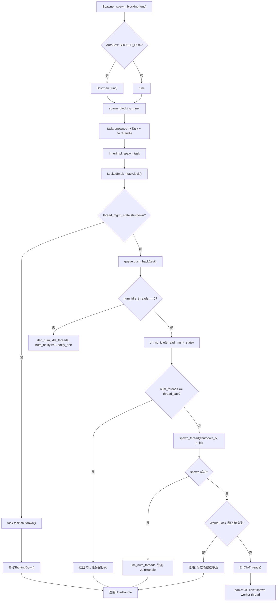
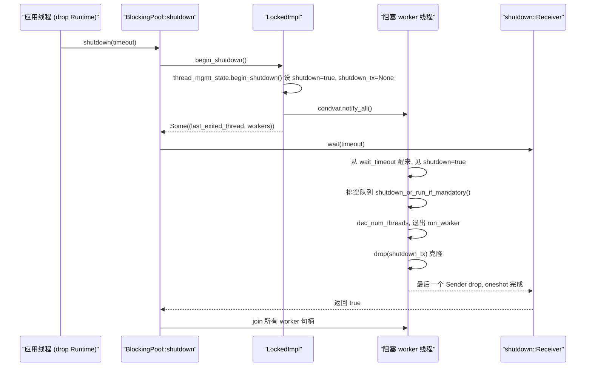

# Capítulo 8: Bloqueo y puenteo: el grupo de hilos de spawn_blocking y los límites de block_on

En el capítulo anterior vimos que la clave por la que el Mutex asíncrono y los canales pueden esperar sin ocupar un hilo es almacenar el Waker en la cola de espera y, una vez satisfecha la condición, dejar que el activador reencole la tarea. Pero todo esto presupone que la tarea puede ceder el hilo voluntariamente cuando está en Pending. En cuanto el código llama a std::fs::read, a libsqlite3 o a un bucle de compresión puramente de CPU, acapara el hilo worker hasta retornar, y durante ese tiempo todas las demás tareas de ese hilo mueren de inanición. La solución de Tokio es externalizar ese tipo de trabajo a un grupo de hilos bloqueantes independiente y usar block_on para impulsar Futures en contextos no asíncronos. Este capítulo desglosa ambas fronteras.

# 8.1 Diseño de memoria del grupo de hilos bloqueantes: Inner y la cola de doble implementación

**Modelo intuitivo**：`spawn_blocking`El grupo de hilos es como el «pool de ayudantes subcontratados» de un restaurante. Los camareros de sala (hilos worker) solo se encargan de tomar pedidos y servir platos; cuando aparece un plato que requiere cocción lenta, escriben una orden de trabajo y la arrojan a la ventanilla de paso a cocina (cola), y los ayudantes (hilos bloqueantes) toman la orden desde la ventanilla. Sin este pool, el camarero tendría que cocinar él mismo y todo el restaurante se detendría.

**Estructura central**. Todo el pool es sostenido por`BlockingPool`, que solo almacena dos cosas: un`Spawner`clonable (punto de entrada de envío) y un`shutdown_rx`(extremo receptor de la señal de cierre)[FACT:tokio/src/runtime/blocking/pool.rs:20-23]。`Spawner`internamente es`Arc<Inner>`, todos los emisores comparten el mismo estado[FACT:tokio/src/runtime/blocking/pool.rs:26-28]。

`Inner`es todo el estado del pool, y sus campos merecen revisarse uno por uno[FACT:tokio/src/runtime/blocking/pool.rs:77-104]：

- `inner_impl: InnerImpl`: implementación de cola + notificación + topología de bloqueo, es un enum con`Locked`y`Sharded`dos variantes[FACT:tokio/src/runtime/blocking/pool.rs:107-110]. Esta es la abstracción más crítica del capítulo: unifica bajo una sola interfaz las dos topologías, «cola de un solo lock» y «cola fragmentada».
- `thread_cap: usize`: límite superior de hilos, es decir`max_blocking_threads`。
- `scheduler_threads: usize`: número de hilos worker del planificador, usado para descontarlos en las métricas, de modo que`num_blocking_threads`solo cuente hilos bloqueantes[FACT:tokio/src/runtime/blocking/pool.rs:455-460]。
- `keep_alive: Duration`: tiempo de vida de los hilos inactivos, por defecto`KEEP_ALIVE = 10s` [FACT:tokio/src/runtime/blocking/pool.rs:231]。
- `metrics: SpawnerMetrics`: tres contadores atómicos—`num_threads`、`num_idle_threads`、`queue_depth` [FACT:tokio/src/runtime/blocking/pool.rs:31-35]。

> **[Design Inference & Architectural Trade-offs]**
> **¿Por qué usar contadores atómicos en lugar de campos dentro del lock?** `num_idle_threads`En`spawn_task`se lee en la ruta caliente (para decidir si hay que despertar un hilo inactivo); si estuviera escondido en`Mutex`, cada envío tendría que tomar primero el lock y luego leer. Al convertirlo en`MetricAtomicUsize`, la ruta de envío puede hacer primero una comprobación rápida sin mantener el lock de la cola. El precio es que no hay garantía de atomicidad entre estos contadores y el estado de la cola, por lo que en el código se usa el contador`num_notify`para compensarlo—véase más abajo.

**Estado de gestión de hilos**。`ThreadManagementState`se extrae por separado para que lo reutilicen las dos implementaciones de cola[FACT:tokio/src/runtime/blocking/pool.rs:135-150]：

- `shutdown: bool`: bandera de cierre.
- `shutdown_tx: Option<shutdown::Sender>`: cada hilo worker mantiene una copia clonada; cuando todas se dropean,`shutdown_rx`recibe la notificación.
- `last_exiting_thread: Option<JoinHandle<()>>`: handle del último hilo que salió por timeout.
- `worker_threads: HashMap<usize, JoinHandle<()>>`: handles de todos los workers vivos.
- `worker_thread_index: usize`: asignador de IDs de hilo monótonamente creciente.

`last_exiting_thread`La motivación de diseño de[FACT:tokio/src/runtime/blocking/pool.rs:135-150]。`worker_timed_out`está claramente escrita en los comentarios: un hilo que sale por timeout hará join sobre el hilo que salió por timeout anteriormente, evitando falsos positivos de Valgrind`last_exiting_thread`es precisamente la implementación de ese join encadenado—elimina su propio handle y saca el antiguo[FACT:tokio/src/runtime/blocking/pool.rs:172-178]。

**para devolvérselo al llamador y que haga join**Encapsulación de tareas`Task`. En la cola se almacena`UnownedTask<BlockingSchedule>`, que envuelve un`Mandatory`y una[FACT:tokio/src/runtime/blocking/pool.rs:187-191]。`Mandatory`bandera`shutdown_or_run_if_mandatory`decide si al cerrar esta tarea se descarta o se fuerza su ejecución:`NonMandatory`en`shutdown()`se llama a`Mandatory`, en`run()` [FACT:tokio/src/runtime/blocking/pool.rs:223-228]se llama a`spawn_blocking`. Esta es la diferencia entre`spawn_mandatory_blocking`(no forzado) y[FACT:tokio/src/runtime/blocking/pool.rs:233-265]。

**(forzado, usado por fs)**。`LockedImpl`Diseño de memoria de la implementación de un solo lock`Mutex<LockedInner>`es la topología más primitiva: un`Condvar` [FACT:tokio/src/runtime/blocking/pool.rs:113-116]。`LockedInner`más un`VecDeque<Task>`、`num_notify: u32`dentro hay`thread_mgmt_state` [FACT:tokio/src/runtime/blocking/pool.rs:118-124]y`num_notify`. Nótese que`thread_mgmt_state`y`num_idle_threads`están bajo el mismo lock, mientras que

# es una cantidad atómica fuera del lock—este diseño híbrido con «parte del estado dentro del lock y parte fuera» es precisamente la raíz de todas las sutilezas de concurrencia posteriores.

**8.2 Ruta de envío: de spawn_blocking al despertar del hilo**Escenario`tokio::task::spawn_blocking(move || heavy_compute(data))`: se llama a

**dentro de una tarea asíncrona; ¿qué ocurre en ese momento?**。`Spawner::spawn_blocking`Primer paso: decisión de boxeo y construcción de la tarea`fn_size`primero mide el tamaño del closure`AutoBox::<F>::SHOULD_BOX`, y luego, según`Box`, decide si boxear el closure[FACT:tokio/src/runtime/blocking/pool.rs:359-389]. Esta es la estrategia genérica de Tokio de «boxeo automático de Futures grandes»: cuando el closure es demasiado grande se boxea, evitando que la estructura de la tarea se infle.

Se entra en`spawn_blocking_inner`, primero se asigna un ID de tarea, luego se usa`blocking_task`para envolver el closure en un Future, y finalmente se usa`task::unowned`para construir`UnownedTask`y`JoinHandle` [FACT:tokio/src/runtime/blocking/pool.rs:440-449]. Nótese que aquí se devuelve la tupla`(JoinHandle<R>, Result<(), SpawnError>)`—el handle y el resultado del envío se devuelven por separado.

**Segundo paso: los tres tratamientos del resultado del envío**. De vuelta en`spawn_blocking`, se hace match sobre`spawn_result`:[FACT:tokio/src/runtime/blocking/pool.rs:381-388]：

- `Ok(())`: normal, se devuelve el handle.
- `Err(ShuttingDown)`：**No entra en pánico**, y aún así devuelve el handle. El comentario indica que esto es por consideración de compatibilidad: el handle nunca se resolverá, pero quien lo llama no fallará porque el runtime se esté cerrando.
- `Err(NoThreads(e))`: el SO no puede crear el hilo y nadie en el pool lo asume, así que entra directamente en pánico.

**Tercer paso: decisión de encolado y despertar**。`spawn_task`Pasa`on_no_idle`el closure a`InnerImpl::spawn_task`, y la implementación concreta decide cuándo invocarlo[FACT:tokio/src/runtime/blocking/pool.rs:462-506]. Mira`LockedImpl::spawn_task`la sección crítica de[FACT:tokio/src/runtime/blocking/pool.rs:603-639]：

```rust
let mut locked = self.mutex.lock();

if locked.thread_mgmt_state.shutdown {
    task.task.shutdown();
    return Err(SpawnError::ShuttingDown);
}

locked.queue.push_back(task);
metrics.inc_queue_depth();

if metrics.num_idle_threads() == 0 {
    on_no_idle(&mut locked.thread_mgmt_state)?;
} else {
    metrics.dec_num_idle_threads();
    locked.num_notify += 1;
    self.condvar.notify_one();
}
```

Aquí hay dos puntos clave. Primero, la comprobación de cierre ocurre antes del encolado, e incluso si la tarea es`Mandatory`también directamente`shutdown()`—el comentario explica: se programó después de que comenzara el cierre, así que descartarla es legítimo[FACT:tokio/src/runtime/blocking/pool.rs:614-620]. Segundo, la decisión de despertar depende de`num_idle_threads`fuera del lock: si es 0, llama a`on_no_idle`para intentar iniciar un nuevo hilo; de lo contrario, decrementa el contador de inactivos, incrementa`num_notify`、`notify_one`。

**`num_notify`¿Por qué debe existir?**Porque`Condvar`puede producir despertares espurios (spurious wakeup). Si solo se usara`notify_one`sin contar, un hilo despertado espuriamente creería erróneamente que hay una tarea disponible, descubriría que la cola está vacía y volvería a dormirse, mientras que el hilo realmente despertado podría no recibir nunca la notificación.`num_notify`Convierte el «despertar legítimo» en un token contable: el emisor`+1`, y el despertado solo en`num_notify != 0`considera el despertar legítimo y`-1` [FACT:tokio/src/runtime/blocking/pool.rs:674-684]。

**Cuarto paso: iniciar un nuevo hilo**。`on_no_idle`El closure se ejecuta mientras se mantiene el lock de la cola[FACT:tokio/src/runtime/blocking/pool.rs:462-506]. Primero comprueba`num_threads == thread_cap`, y si alcanza el límite superior simplemente devuelve`Ok(())`—la tarea permanece en la cola esperando que la procesen los hilos existentes; esto es contrapresión. De lo contrario, clona`shutdown_tx`, llama a`spawn_thread`para crear el hilo y, tras el éxito, incrementa`num_threads`, incrementa`worker_thread_index`, inserta el handle en`worker_threads`。

`spawn_thread`Usa`thread::Builder`para establecer el nombre del hilo y el tamaño de pila, y luego hace spawn de un closure: entra en el contexto del runtime`rt.enter()`, llama a`inner.run(id)`, y finalmente drop`shutdown_tx` [FACT:tokio/src/runtime/blocking/pool.rs:508-528]。

**Tolerancia a fallos al crear hilos del SO**。`spawn_thread`puede fallar. El código clasifica el error[FACT:tokio/src/runtime/blocking/pool.rs:488-500]: si es`WouldBlock`(error temporal, determinado por`is_temporary_os_thread_error`) y ya hay hilos bloqueados en el pool, entonces[FACT:tokio/src/runtime/blocking/pool.rs:750-752]se ignora silenciosamente**—la tarea será tomada finalmente por algún hilo actualmente ocupado. De lo contrario, devuelve**, lo que finalmente provoca un pánico.`SpawnError::NoThreads`Resume con un diagrama de flujo de control las ramas de decisión de la ruta de envío:

Copiar



# Modelo intuitivo

**: cada hilo bloqueado es un «ayudante en espera». Cuando hay pedidos trabaja continuamente (BUSY), cuando no hay pedidos dormita (IDLE), y si dormita más de**sale del trabajo (salida por timeout). Sin recuperación por timeout, el pool conservaría permanentemente todos los hilos creados en el pico, desperdiciando memoria y sobrecarga de planificación del kernel.`keep_alive`Estructura del bucle principal

**es un bucle**。`LockedImpl::run_worker`, internamente alterna entre las dos fases BUSY e IDLE`'main`. Nota: aquí BUSY/IDLE son[FACT:tokio/src/runtime/blocking/pool.rs:642-735]fases**dentro del bucle, no estados de un enum explícito, así que a continuación se describe con un diagrama de flujo en lugar de un diagrama de estados.**Fase BUSY

**: el bucle interno**toma tareas continuamente`while let Some(task) = locked.queue.pop_front()`. Tras tomarla, decrementa[FACT:tokio/src/runtime/blocking/pool.rs:655-661]drop del lock`queue_depth`，**, ejecuta**, y vuelve a adquirir el lock. El paso de soltar el lock es crucial—una tarea bloqueante puede tardar mucho, y nunca se debe ejecutar manteniendo el lock.`task.run()`Fase IDLE

**: la cola está vacía, incrementa**, establece`num_idle_threads`, y luego entra en el bucle de espera`is_counted_idle = true`. El núcleo es[FACT:tokio/src/runtime/blocking/pool.rs:663-696], y tras retornar comprueba tres cosas:`condvar.wait_timeout(locked, keep_alive)`: despertar legítimo. Decrementa

1. `num_notify != 0`, establece`num_notify`(porque el emisor ya decrementó`is_counted_idle = false`), break de vuelta a BUSY`num_idle_threads`2. No cerrado y timeout: llama a[FACT:tokio/src/runtime/blocking/pool.rs:674-684]。

para obtener el handle del último hilo que salió,`worker_timed_out`sale del bucle`break 'main`3. De lo contrario es un despertar espurio, sigue esperando.[FACT:tokio/src/runtime/blocking/pool.rs:689-693]。

Vaciado de la cola al cerrar

**. Si**es verdadero, entra en la lógica de vaciado`thread_mgmt_state.shutdown`: extrae tareas una a una, drop del lock, llama a[FACT:tokio/src/runtime/blocking/pool.rs:698-710]—las tareas no forzadas se descartan, las forzadas se ejecutan como de costumbre. Luego break para salir del bucle principal.`task.shutdown_or_run_if_mandatory()`Limpieza al salir

**. Antes de que el hilo salga, decrementa**. Si`num_threads` [FACT:tokio/src/runtime/blocking/pool.rs:714]es verdadero, también decrementa`is_counted_idle`, y usa`num_idle_threads`para afirmar que no hay underflow`assert_ne!(prev_idle, 0)`. Esta aserción es una barandilla en depuración: una vez que[FACT:tokio/src/runtime/blocking/pool.rs:716-726]la contabilidad falla, aquí entrará inmediatamente en pánico en lugar de dejar que el error se propague silenciosamente.`num_idle_threads`Finalmente, si se está cerrando y

(el último hilo),`num_threads == 0`despierta al iniciador del cierre que podría estar esperando`notify_one`. Devuelve[FACT:tokio/src/runtime/blocking/pool.rs:728-730], y`join_on_thread`hace join antes de salir`Inner::run`Handshake de cierre[FACT:tokio/src/runtime/blocking/pool.rs:755-771]。

**primero llama a**。`BlockingPool::shutdown`para obtener todos los handles de worker`begin_shutdown`, establece la bandera de cierre, drop[FACT:tokio/src/runtime/blocking/pool.rs:310-312]。`LockedImpl::begin_shutdown`, despierta a todos los hilos en espera`shutdown_tx`、`notify_all`. Luego[FACT:tokio/src/runtime/blocking/pool.rs:740-745]bloquea esperando`shutdown_rx.wait(timeout)`. La implementación de[FACT:tokio/src/runtime/blocking/pool.rs:324]。

`shutdown::Receiver::wait`es muy cuidadosa[FACT:tokio/src/runtime/blocking/shutdown.rs:37-70]: primero maneja`timeout == 0`la ruta rápida devuelve directamente false; luego llama a`try_enter_blocking_region()`para entrar en la región de bloqueo, y si falla y actualmente se está en pánico devuelve false, de lo contrario entra en pánico con el mensaje «no se puede hacer drop del runtime en un contexto asíncrono»[FACT:tokio/src/runtime/blocking/shutdown.rs:44-57]. Finalmente, según el timeout, llama a`block_on_timeout`o`block_on`para impulsar ese oneshot.

`shutdown_tx`El mecanismo de`Arc<oneshot::Sender<()>>`es: cada hilo worker mantiene un clon de[FACT:tokio/src/runtime/blocking/shutdown.rs:12-14]. Después de que todos los hilos salen, todos los clones se dropean,`Arc`el contador llega a cero,`oneshot::Sender`se dropea,`Receiver`recibe la notificación. Este es el patrón clásico de «el Receiver se despierta después de que todos los Sender hacen drop».



# 8.4 block_on: impulsar un Future en un contexto no asíncrono

**Modelo intuitivo**：`block_on`es la «puerta principal» del runtime. Convierte el hilo actual en un ejecutor temporal, haciendo poll repetidamente sobre el Future pasado hasta que se completa. Sin él,`main`la función no podría iniciar ningún código asíncrono.

**Entrada y boxing**。`Runtime::block_on`igualmente primero mide el tamaño, según`SHOULD_BOX`decide si`Box::pin`, y luego entra en`block_on_inner` [FACT:tokio/src/runtime/runtime.rs:343-350]。`block_on_inner`. Dentro hay dos envoltorios de trace con compilación condicional (taskdump y tracing), luego`self.enter()`entra en el contexto del runtime, y finalmente despacha según el tipo de scheduler[FACT:tokio/src/runtime/runtime.rs:353-383]：

```rust
let _enter = self.enter();

match &self.scheduler {
    Scheduler::CurrentThread(exec) => exec.block_on(&self.handle.inner, future),
    Scheduler::MultiThread(exec) => exec.block_on(&self.handle.inner, future),
}
```

Los dos schedulers`block_on`La semántica es diferente, la documentación lo dice claramente[FACT:tokio/src/runtime/runtime.rs:302-320]：

- **Programador de múltiples hilos**: Future se ejecuta en el contexto del controlador de E/S y del temporizador,`block_on`las tareas ya lanzadas con spawn continúan ejecutándose tras el retorno.
- **Programador de hilo actual**：`block_on`puede ser invocado concurrentemente por múltiples hilos, el primer invocador obtiene la propiedad del controlador de E/S y del temporizador, los demás hilos se "enganchan" a él. El primer`block_on`tras completarse, los demás hilos pueden "robar" el controlador.`block_on`las tareas ya lanzadas con spawn quedan suspendidas tras el retorno, una nueva invocación de`block_on`las reanudará.

**Restricción clave: no se puede invocar en un contexto asíncrono**. La documentación especifica claramente que`block_on`invocarlo en un contexto de ejecución asíncrono provocará un panic[FACT:tokio/src/runtime/runtime.rs:321-324]. La razón es directa:`block_on`bloquea el hilo actual hasta que el Future se complete; si el hilo actual es en sí mismo un hilo worker, bloqueará todo el ejecutor — esto es precisamente`spawn_blocking`lo que se pretende resolver, por lo que ambos son mutuamente excluyentes.

**Ruta de cierre**。`Runtime::drop`se despacha según el tipo de programador[FACT:tokio/src/runtime/runtime.rs:506-521]: el programador de hilo actual necesita primero`try_set_current`entrar en el contexto y luego shutdown (garantiza que las tareas se destruyan dentro del contexto de ejecución); el programador de múltiples hilos hace shutdown directamente (los hilos worker ya están en el contexto).`shutdown_timeout`Primero cerrar el programador y luego cerrar el pool de bloqueo[FACT:tokio/src/runtime/runtime.rs:457-461]，`shutdown_background`es equivalente a`shutdown_timeout(Duration::from_nanos(0))` [FACT:tokio/src/runtime/runtime.rs:494-496]。

# Reflexiones de diseño, recuperación de errores y trampas en producción

**¿Por qué`spawn_blocking`de`ShuttingDown`no entra en panic?** [FACT:tokio/src/runtime/blocking/pool.rs:383-384]El comentario indica que es por consideraciones de compatibilidad.`spawn_blocking`devuelve`JoinHandle`en lugar de`Result`, si entrara en panic al cerrarse, convertiría el estado predecible de "el runtime se está cerrando" en un crash. Devolver un handle que nunca se resuelve hace que el invocador`await`quede suspendido indefinidamente — pero en ese momento el runtime ya está cerrado, todo el`block_on`también saldrá, por lo que en la práctica no habrá fuga permanente.

**`max_blocking_threads`La semántica de contrapresión de**. El valor por defecto es muy grande (512), porque`spawn_blocking`se usa frecuentemente para E/S de archivos. Pero la documentación advierte: al ejecutar tareas intensivas en CPU hay que usar un semáforo para limitar la concurrencia, de lo contrario se crearán una gran cantidad de hilos[FACT:tokio/src/task/blocking.rs:94-100]. Al alcanzar el límite, las tareas se encolan, formando contrapresión — pero hay que notar que esta contrapresión solo afecta al pool de bloqueo, no se propaga al programador asíncrono.

**`spawn_blocking`no es cancelable**. La documentación especifica claramente:`abort`no tiene efecto sobre tareas de bloqueo que ya han comenzado a ejecutarse, la tarea continuará hasta completarse[FACT:tokio/src/task/blocking.rs:106-120]. Solo las tareas que aún no han comenzado pueden ser detenidas por abort. Al cerrarse, el runtime esperará a todas las tareas de bloqueo ya iniciadas,`shutdown_timeout`tras el timeout se filtrarán estos hilos.

**`num_idle_threads`La trampa de contabilidad de**。`is_counted_idle`La existencia del flag indica que este conteo es propenso a errores. El emisor decrementa al despertar`num_idle_threads`, el receptor al ver`num_notify != 0`establece`is_counted_idle = false`, evitando el decremento duplicado[FACT:tokio/src/runtime/blocking/pool.rs:679-682]. Si esta ruta tiene un bug,`assert_ne!(prev_idle, 0)`entrará en panic al salir[FACT:tokio/src/runtime/blocking/pool.rs:722-725]. Si en producción se observa "`num_idle_threads`underflowed on thread exit", significa que la lógica de contabilidad del pool está corrompida.

> **[Design Inference & Architectural Trade-offs]**
> **`last_exiting_thread`El costo del join encadenado**. Un hilo que sale por timeout hará join sobre el hilo que salió por timeout anteriormente[FACT:tokio/src/runtime/blocking/pool.rs:172-178]. Esto forma una cadena de join: cada hilo que sale debe esperar a que el anterior termine realmente. En escenarios de creación/destrucción de hilos de bloqueo de alta frecuencia, esta cadena puede alargarse, causando una acumulación de retraso en la salida de hilos. Esta es una compensación hecha para evitar falsos positivos de Valgrind, el impacto en producción normal es limitado, pero merece atención bajo cargas con timeouts frecuentes de hilos.

**`InnerImpl`El significado de la abstracción por enumeración**. El comentario indica que`Locked`la variante se comporta exactamente igual que antes de la refactorización, mientras que`Sharded`la variante reserva un slot simétrico para futuras colas concurrentes[FACT:tokio/src/runtime/blocking/pool.rs:537-539]。`spawn_task`、`run_worker`、`begin_shutdown`los tres métodos se despachan mediante la enumeración[FACT:tokio/src/runtime/blocking/pool.rs:548-582]. Este diseño de "despacho por enumeración + sección crítica propia por variante" permite añadir nuevas topologías de cola sin modificar el invocador.

# Resumen del capítulo

Este capítulo desglosa las dos fronteras de Tokio para acomodar código síncrono.`spawn_blocking`entrega closures a un pool de hilos de bloqueo independiente:`Inner`mantiene la cola, el límite de hilos, el tiempo de vida y las métricas atómicas;`LockedImpl`implementa la cola con un solo lock +`Condvar`,`num_notify`el contador compensa los despertares espurios; el worker cicla entre BUSY/IDLE, tras el timeout de inactividad sale mediante join encadenado;`max_blocking_threads`al alcanzar el límite las tareas se encolan formando contrapresión.`block_on`en cambio impulsa Future en contextos no asíncronos, la semántica del programador de múltiples hilos y del de hilo actual es diferente, y está terminantemente prohibido invocarlo en contextos asíncronos. La ruta de cierre mediante`shutdown_tx`de`Arc`el conteo llegando a cero dispara`oneshot`, implementando el handshake de "despertar al iniciador del cierre tras la salida de todos los workers".

# Reflexiones y autoevaluación del capítulo

Q1: Si en`LockedImpl::spawn_task`se cambiara`if metrics.num_idle_threads() == 0`la condición para que sea siempre verdadera (es decir, invocar`on_no_idle`cada vez), ¿qué ocurriría en escenarios de entrega de alta concurrencia? ¿Por qué?

**Análisis de referencia**：`on_no_idle`verifica`num_threads == thread_cap`, si no se alcanza el límite crea un nuevo hilo[FACT:tokio/src/runtime/blocking/pool.rs:471-487]. Si la condición fuera siempre verdadera, incluso habiendo hilos inactivos se intentaría crear nuevos hilos, provocando que el número de hilos se dispare hasta`thread_cap`. Más grave aún, los hilos inactivos no serían despertados por`notify_one`(porque se toma la rama`on_no_idle`en lugar de la rama`else`de`num_notify += 1; notify_one` [FACT:tokio/src/runtime/blocking/pool.rs:627-636]), las tareas en la cola podrían quedar sin atender hasta que algún nuevo hilo arranque y descubra que la cola no está vacía. Esto causaría un estado de falso bloqueo con "hilos saturados pero tareas aún en cola". El sentido de la condición original es precisamente: cuando hay hilos inactivos, despertarlos prioritariamente, evitando la creación innecesaria de hilos.

Q2: `LockedImpl::run_worker`En la fase BUSY se ejecuta`task.run()`antes de`drop(locked)` [FACT:tokio/src/runtime/blocking/pool.rs:657-658]. Si se eliminara este`drop`, ¿en qué escenario se provocaría un deadlock?

**Análisis de referencia**：`task.run()`ejecuta el closure del usuario, y dentro del closure es totalmente posible volver a invocar`spawn_blocking`para entregar una nueva tarea. La ruta de entrega`LockedImpl::spawn_task`lo primero que hace es`self.mutex.lock()` [FACT:tokio/src/runtime/blocking/pool.rs:612]. Si el worker mantiene el lock mientras ejecuta el closure, la entrega dentro del closure intentará adquirir el mismo lock, y`std::sync::Mutex`No es reentrante, se produce un deadlock directamente. Además, ejecutar tareas largas mientras se mantiene el lock bloquea todas las operaciones de obtención de tareas de los demás emisores y workers; incluso sin deadlock, serializa todo el pool.`drop(locked)`Es obligatorio.

Q3: `shutdown::Receiver::wait`En`try_enter_blocking_region()`falla y actualmente está en panic, devuelve false; de lo contrario, panic[FACT:tokio/src/runtime/blocking/shutdown.rs:44-57]. ¿Por qué se debe tratar de forma especial durante un panic? Si se elimina esta rama, ¿en qué escenarios surgirían problemas?

**Análisis de referencia**：`try_enter_blocking_region`falla significa que actualmente se está en un contexto asíncrono y no se permite bloquear. En condiciones normales debería hacer panic para indicar al usuario «no se puede hacer drop del runtime en un contexto asíncrono». Pero si el hilo actual ya está en panic (`std::thread::panicking()`es verdadero), volver a hacer panic provocaría un doble panic, y el comportamiento predeterminado de Rust es abortar el proceso directamente. Escenario: el usuario hace drop de un Runtime dentro de una tarea asíncrona, y esa tarea ya está en panic por otra razón; en ese momento, el shutdown desencadenado por el drop provocaría un segundo panic. Devolver false hace que el shutdown abandone la espera, evitando el abort del proceso y dando al usuario la oportunidad de ver la información del panic original. Este es un tratamiento típico de «panic safety».

El pool de hilos bloqueantes y block_on delimitan las fronteras de capacidad del runtime asíncrono: el primero aísla en hilos dedicados el trabajo que no puede ceder el hilo, y el segundo permite que puntos de entrada no asíncronos también impulsen Futures. Pero estas dos fronteras a menudo no están escritas a mano en el código; en el próximo capítulo entraremos en el mundo de las macros para ver cómo #[tokio::main], select! y join! generan este código de runtime en tiempo de compilación.
